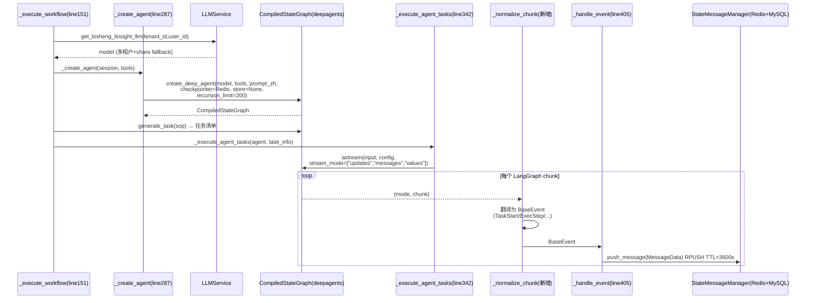
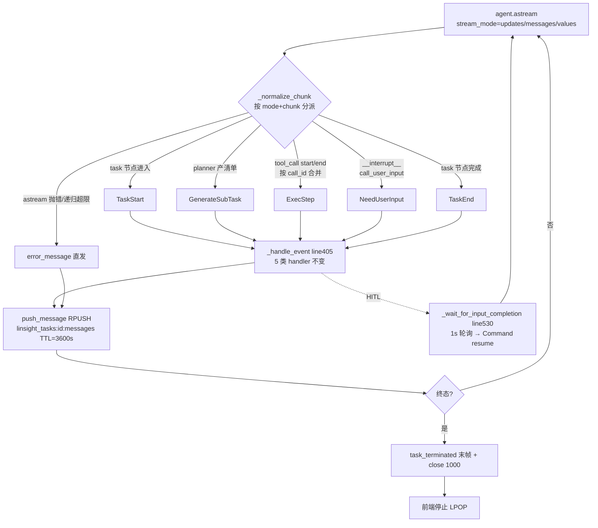
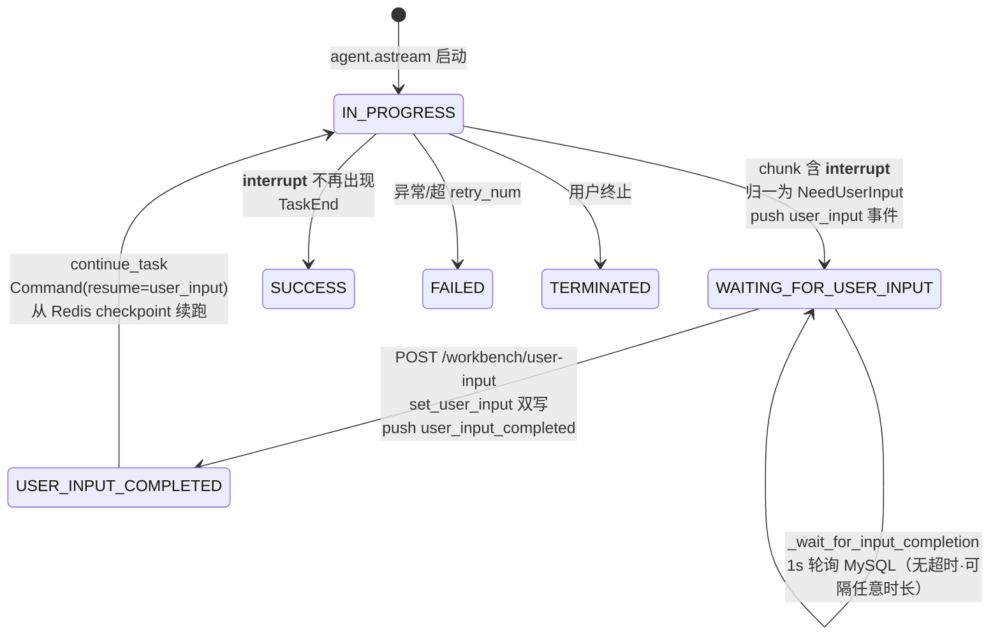
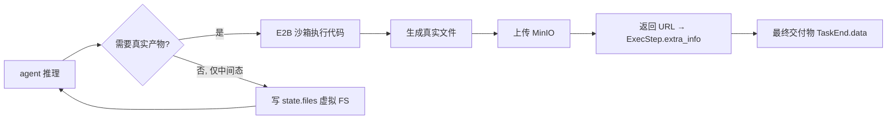
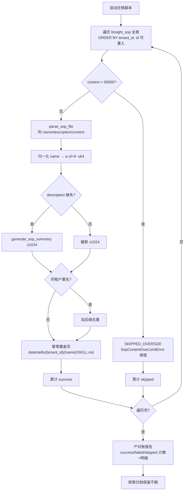
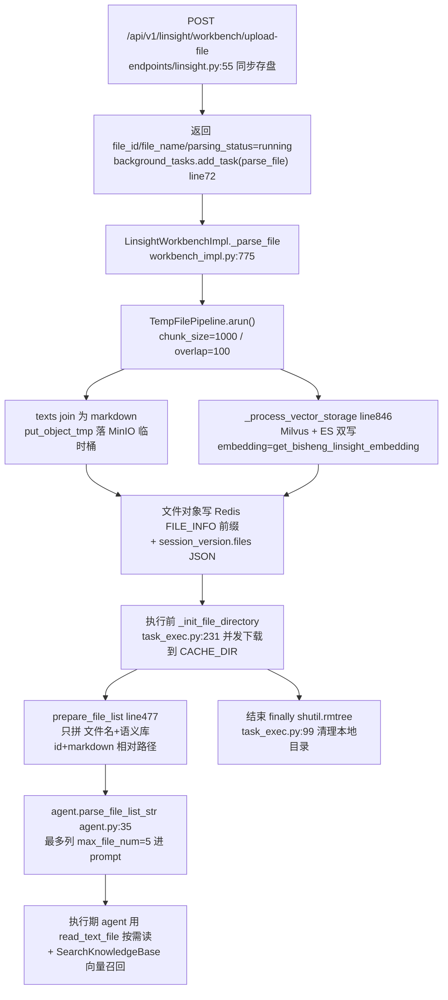
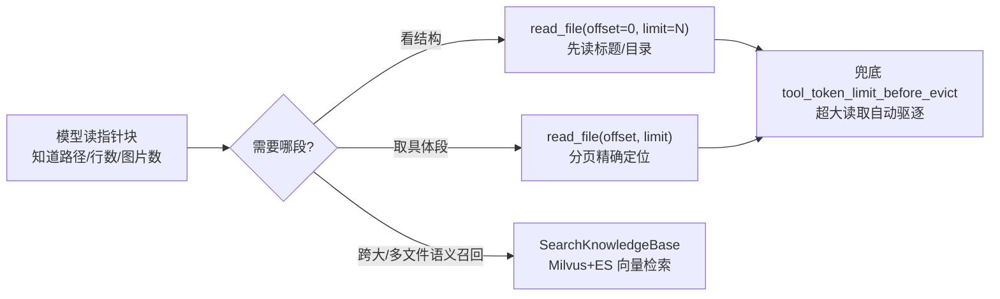

# 技术方案：灵思 Linsight 迁移 deepagents 适配层设计

> 版本：v2.6.0 · 状态：Draft · Owner：lilu · 日期：2026-06-03
> 配套文档：《灵思 Linsight 迁移 deepagents 框架 PRD》。本文承接 PRD 第四章的产品需求，给出工程实现细节、组件契约与代码锚点。

---

## 1. 总体策略（适配层）

采用**适配层**路径：在 BiSheng 现有运行时内，仅把灵思的 agent 推理内核从自研 ReAct 替换为 deepagents `create_deep_agent`，**完整保留**多租户、权限、独立 Worker、Redis queue、WebSocket、状态双写、工具体系、E2B 沙箱、LLMService、DM8 双库等全部企业级横切能力。改造收敛在 `task_exec.py` 的"内核装配 + 事件适配"两点。

| 处置 | 组件 |
|------|------|
| **替换** | 自研 ReAct 内核 `bisheng_langchain/linsight/{agent,task,react_task,manage,prompt,react_prompt}.py` → deepagents `create_deep_agent` |
| **保留** | `worker.py`、Redis queue、WebSocket、`state_message_manager.py`、多租户、OpenFGA、`LLMService`、工具体系、MinIO、`linsight_session_version`/`linsight_execute_task` 数据模型、DM8 双库 |
| **新增** | `_normalize_chunk` 事件归一层、Skill 加载/白名单中间件、Skill CRUD API、Skill 多租户存储、SOP→Skill 迁移脚本、前端 Skills 管理页、**Redis checkpointer（HITL 中断现场持久化、可随时续跑，见 §2.3/§4）**、**历史消息压缩中间件（对齐 2.0 `tool_buffer`，见 §3.8）** |
| **下线** | SOP 动态生成 / `sop_manage.py` 沉淀链路 / `col_linsight_sop` 写入 / SOP 相关端点 |

---

## 2. 内核替换

### 2.1 装配点改造：`_create_agent` → `create_deep_agent`

唯一的内核替换发生在 `task_exec.py::_create_agent`（line287）。当前实现返回自研 `LinsightAgent`（line294）；改造后改为调用 deepagents 的工厂函数，返回 LangGraph 编译产物 `CompiledStateGraph`。**装配点之外的执行编排骨架（`_execute_workflow` line151、`generate_task`、`_execute_agent_tasks` line342、`_handle_event` line405、`continue_task` line525、`_wait_for_input_completion` line530）一律不动**——它们面向的是 `BaseEvent` 抽象，与内核解耦，这正是适配层策略的价值所在。

改造后的装配契约（伪代码，锚 line287-301）

```python
async def _create_agent(self, session_model: LinsightSessionVersion, tools: List) -> CompiledStateGraph:
    linsight_conf = settings.get_linsight_conf()
    # model 必须经 LLMService 注入（见 2.2），禁止 demo 的 ChatOpenAI 直连 DashScope
    model = self.llm  # 已由 _get_llm → get_bisheng_linsight_llm 产出（line158/224）
    return create_deep_agent(                          # deepagents/graph.py:217
        model=model,
        tools=tools,                                   # LangChain BaseTool 列表，复用既有工具体系（见 §4 工具章）
        system_prompt=LINSIGHT_SYSTEM_PROMPT_ZH,       # 中文化 system prompt（见 2.4）
        subagents=[...],                               # 子智能体（含 SkillsMiddleware/SkillWhitelistMiddleware 装配）
        interrupt_on={...},                            # HITL 中断点（见 §3 HITL）
        backend=FilesystemBackend(virtual_mode=True),  # 虚拟 FS，仅 agent 内部态（见沙箱边界章）
        checkpointer=redis_checkpointer,               # ✅ Redis 持久化，跨进程续跑，见 2.3
        store=None,                                    # store 留空（无跨 thread 共享需求）
        # max_steps 经 recursion_limit 落到 config（见 2.5）
    )
```

返回类型从 `LinsightAgent` 变为 `CompiledStateGraph`，因此 `_execute_agent_tasks`（line342）内对 agent 的调用方式必须从 `agent.ainvoke(...)`（line349，自研生成器协议）改为 `agent.astream(input, config, stream_mode=[...])`（LangGraph 协议）——这是 §3 的核心工作量。`generate_task`（line174 `agent.generate_task`）与 `continue_task`（line525 `agent.continue_task`）也需要在 agent 上提供等价能力：前者改为一次结构化 `astream`/`ainvoke` 产出任务清单，后者改为以 `Command(resume=...)` 续跑同一 graph（见 §3 HITL）。

### 2.2 model 注入：强制走 LLMService

deepagents demo 用 `ChatOpenAI` 直连 DashScope，**严禁照搬**。BiSheng 侧 model 必须经 `LLMService.get_bisheng_linsight_llm`（`task_exec.py::_get_llm` line215-226 已建立此链路），它承担两项横切职责：

- **多租户解析**：`get_workbench_llm(tenant_id=...)`（line222）在 Celery Worker 子进程内显式按 `session_model.tenant_id` 取配置（INV-T18：admin-scope ContextVar 在 Worker 内未设置，必须显式透传 tenant）。
- **share fallback**：租户无私有模型时回落共享模型。

`_create_agent` 不重新构造 model，直接复用 `self.llm`（`_execute_workflow` line158 已注入）。`create_deep_agent(model=self.llm, ...)` 接受任意 `BaseChatModel`，无须改造模型层。

#### 2.2.1 默认模型 + 每任务运行时模型（移除 task_model / 执行模式）— v2.6 补充

> 对应 PRD §4.1.10。目标：灵思执行模型收敛到「工作台对话模型」同一份模型池，管理端用单选标记**灵思默认模型**，用户在发起任务时可切换为列表内任一模型，按本轮任务注入内核——即「无需重建代理」。原 `task_model` 与执行模式 `linsight_executor_mode` **迁移并彻底移除**。

**(1) 配置 schema 变更**（`bisheng/llm/domain/schemas.py::WorkbenchModelConfig`，存储于 `tenant_system_model_config(key='linsight_llm')`）：

| 字段 | 变更 | 说明 |
|---|---|---|
| `models: List[WSModel]` | 保留 | 工作台对话模型列表，灵思候选模型即此列表 |
| `linsight_default_model_id: Optional[str]` | **新增** | 灵思默认模型 = `models` 中某模型的 id；管理端单选标记 |
| `task_model: WSModel` | **移除** | 旧「灵思任务执行模型」，迁移为 `linsight_default_model_id` |
| `linsight_executor_mode: TaskMode` | **移除** | 执行模式（func_call/react）随内核迁移废弃，由 deepagents 接管；连带移除此处对 `TaskMode` 的引用 |

**(2) 取模型优先级**（`task_exec.py::_get_llm`，line215-226）：`_get_llm` 增加 `model_id: Optional[str]` 入参，取模优先级：

```
每任务提交的 model_id（用户运行时选择）
  └─ 缺省 → workbench_conf.linsight_default_model_id（管理端默认）
       └─ 仍缺省 → 配置缺失错误（不静默回退到任意模型）
```

最终 id 仍经 `LLMService.get_bisheng_linsight_llm(invoke_user_id, model_id, temperature)` 产出 `BaseChatModel`，**多租户解析 + share fallback + 模型可访问性校验全部复用既有链路**（INV-T18：Worker 内显式透传 `tenant_id`）。即把原本写死的 `workbench_conf.task_model.id`（line225）替换为「按上述优先级解析出的 model_id」。

**(3) 提交链路透传 model**（`linsight/api/endpoints/linsight.py` + `LinsightQuestionSubmitSchema`）：用户在 `LinsightChatInput` 选择的 model id 经提交端点持久化到 `LinsightSessionVersion`（既有 `model` 字段，当前前端硬编码 `'gpt-4'`、后端忽略——本期改为真实透传）；Worker 执行时从 session 取出传入 `_get_llm(model_id=...)`。

**(4) `_create_agent` 去除执行模式**（line287-301）：删除 `task_mode=workbench_conf.linsight_executor_mode`（line299）。deepagents 内核以原生 tool-calling 执行，不再有 func_call/react 二分；这与 §2.1 装配点改造一致（自研 `LinsightAgent` 的 `task_mode` 入参随之消失）。

**(5) "无需重建代理"的工程落点**：现架构下每个任务在 `_create_agent` 各自构建自己的 graph，模型在构建时由 `model=self.llm` 注入。用户运行时切换 = 在**提交任务时**选定 model id，`_get_llm` 据此产出对应 `BaseChatModel` 再注入内核——并非在一个长生命周期 agent 上热插拔，而是「每任务按所选模型装配」，对用户表现为「换模型不影响已挂的技能/知识库/工具/附件」。已组装上下文存于 session，与模型选择正交。

**(6) 配置数据迁移脚本**（双库 MySQL + DM8 均需可跑，禁 `JSON_EXTRACT`）：遍历 `tenant_system_model_config` 中 `key='linsight_llm'` 的**各租户行**，对其 JSON `value`：

- 若旧 `task_model.id` 命中 `models` 列表 → `linsight_default_model_id = task_model.id`；
- 若不命中或缺失 → 取 `models` 列表首项 id（列表为空则留空，由前端保存校验兜底）；
- 删除 `task_model`、`linsight_executor_mode` 两键后回写。

脚本须**幂等**（已迁移行无 `task_model` 时跳过）；多租户继承走 `aresolve()`（F022），迁移针对各租户自有行，继承行不重复写。

### 2.3 checkpointer 取舍：用 Redis checkpointer 绕开 DM8，换取"可随时续跑"

> **结论先行**：本期为 deepagents 内核挂 **Redis 持久化 checkpointer**（`langgraph-checkpoint-redis`），把 HITL 中断现场、graph thread state 落到 BiSheng 已有的 Redis，从而支持「用户隔任意时长回来续跑、Worker 重启不丢」（对应 PRD §4.4 / AC-5 / 决策）。`store` 留空（无跨 thread 共享需求）。

**为什么不是 `checkpointer=None`**：deepagents demo 默认挂 `AsyncSqliteSaver`/`AsyncPostgresSaver`，二者均不兼容 DM8（违反双库 P0）。若据此简单留空 `checkpointer=None`，graph 在进程内就是无 checkpoint 的纯执行体——中断现场只活在 Worker 协程内存里，**用户离开超过某时长（或 Worker 重启）即无法精确回到 interrupt 点续跑**，这正是 2.0 自研引擎"Redis key TTL=3600s 被动失活、1 小时超时终止"的根因。本期产品决策要"可随时回来续跑"，故不能留空，必须挂一个 BiSheng 跑得起的持久化 checkpointer。

**为什么是 Redis 而非自建 DM8 saver**：

| 选项 | 是否绕开 DM8 | 工作量 | 续跑能力 | 取舍 |
|------|-------------|--------|----------|------|
| `checkpointer=None` | — | 最小 | ❌ 仅同进程内存，有限等待窗 | 不满足"随时续跑" |
| 官方 Sqlite/Postgres saver | ❌ 不兼容 DM8 | 小 | ✅ | 违反双库 P0，否决 |
| **Redis checkpointer**（选用） | ✅ 完全绕开 | 中（引入依赖 + 装配） | ✅ 跨进程/不限时长 | BiSheng 已有 Redis，最优 |
| 自研 DM8/MySQL `BaseCheckpointSaver` | ✅ 纯双库 | 大（自建自维护） | ✅ | 工作量最大，留作后续 |

**装配要点**：
- 依赖 `langgraph-checkpoint-redis` 的 `AsyncRedisSaver`，连接复用 BiSheng `RedisManager` 的连接配置；`thread_id` 取 `session_version_id`，保证同一任务恢复到同一 thread。
- checkpoint key 设较长或不过期 TTL（"可随时回来"语义），并制定**容量治理**：任务终态（completed/failed/terminated）后清理对应 thread 的 checkpoint，避免无界增长；非终态保留。
- `LinsightStateMessageManager` 的 Redis+MySQL 双写**仍保留**，职责不变（它存的是业务事件/步骤实体，供前端 LPOP 消费与回拉对账）；checkpointer 与它是两层：checkpointer 存"图怎么续跑"，message manager 存"前端展示什么"。
- ⚠️ POC 必验（R3）：langgraph 1.2.1 实测 `interrupt()` halt 期间 pending writes 不落 thread state（`deepagents/tools.py` 注释），需实测 Redis checkpointer 下"隔任意时长 + Worker 重启"续跑的保真度。

### 2.4 system_prompt 中文化

deepagents 内置英文 system prompt。BiSheng 面向中文企业场景，须替换为中文 system prompt 常量 `LINSIGHT_SYSTEM_PROMPT_ZH`，覆盖：任务规划语气、工具调用约定、HITL 触发话术（与 `NeedUserInput.call_reason` 对齐）、产物交付须落 E2B 真实沙箱（而非虚拟 FS）的指令。SkillsMiddleware 的 progressive disclosure 提示词亦须中文化。该常量集中放置，便于与 PRD 话术对账。

### 2.5 执行预算：max_steps / retry_num

`linsight_conf`（config.yaml）既有 `max_steps=200`、`retry_num=3`，须落到 deepagents/LangGraph：

- `max_steps=200` → graph `config={"recursion_limit": 200}`，在 `_execute_agent_tasks` 的 `astream(..., config=config)` 处注入。超限 LangGraph 抛 `GraphRecursionError`，归一为 `error_message` + `task_terminated`（见 §3 终止收口）。
- `retry_num=3` → 工具/节点级重试。deepagents 节点重试与既有 `@retry_async(3,1s)`（双写重试）是两层，勿混淆：前者是推理重试，后者是持久化重试。

### 2.6 执行时序图



---

## 3. 执行事件流映射

这是整个迁移**工作量最大、最易出隐性 bug 的一章**。目标：把 LangGraph/deepagents 的 `astream` chunk 流，无损翻译为既有 10 个 `MessageEventType`（`state_message_manager.py:19-42`），使前端 LPOP 消费侧零改动。

### 3.1 `stream_mode=["updates","messages","values"]` 选型理由

`agent.astream(input, config, stream_mode=["updates","messages","values"])` 三模联订，缺一不可：

| stream_mode | 产出 | 映射用途 | 不可省原因 |
|-------------|------|---------|-----------|
| `updates` | 每个节点执行后的状态增量（节点名→输出） | 工具调用开始/结束、子任务生成、任务起止、HITL 中断（`__interrupt__`） | 唯一能拿到「哪个节点产生了什么」的结构化信号，是 ExecStep/GenerateSubTask/NeedUserInput 的主来源 |
| `messages` | LLM token 级消息（含 tool_calls、AIMessage、ToolMessage） | ExecStep 的 `call_reason`/`params`/`output` 富化、final_result 文本 | `updates` 拿不到流式 token 与 tool_call 的细粒度入参/出参，前端"执行步骤"卡片靠它填充 |
| `values` | 每步后的完整 state 快照 | 终态裁决（`files`/最终 answer）、幂等校验兜底 | 异常/中断后需要全量 state 做终态收口与对账，增量不可靠时回退到快照 |

单模 `updates` 无法支撑前端富展示；单模 `messages` 拿不到节点边界与 interrupt；故必须三模。三模 chunk 在同一 `async for` 中串行到达，由 `_normalize_chunk` 按 `(mode, chunk)` 二元组分派。

> **子智能体子步骤流（`subgraphs=True`）**：为支持 PRD §4.3.2 子任务「内含其自身的子步骤流」，`astream` 须追加 `subgraphs=True`，chunk 变为 `(namespace, mode, chunk)` 三元组——子图（subagent）事件携 `namespace`/`checkpoint_ns` 前缀冒泡父流，归一层据此区分父/子来源并归并层级（见 §3.7）。**POC 必验**：① `subgraphs=True` 下子图事件是否真冒泡父 `astream`；② 并行子 agent 的 `namespace` 交错不串流。不开 `subgraphs` 时子 agent 走 `ainvoke` 黑盒，父流只见其汇总结果（库默认行为）。

### 3.2 `_normalize_chunk` 归一层：位置与职责

**位置**：插入在 `_execute_agent_tasks`（line342）的 `async for ... astream` 与 `_handle_event`（line405）之间。原 line349 `async for event in agent.ainvoke(...)` 改为：

```python
async for mode, chunk in agent.astream(input, config, stream_mode=["updates","messages","values"]):
    for event in self._normalize_chunk(mode, chunk, ctx):   # 新增归一层，可 0..N 个 BaseEvent
        await self._handle_event(agent, event, session_model)   # line405 既有逻辑不变
```

**职责（唯一）**：把 LangGraph chunk 翻译成既有 `BaseEvent`（`event.py`：`TaskStart`/`ExecStep`/`GenerateSubTask`/`NeedUserInput`/`TaskEnd`）。**`_handle_event` 及其 5 个 handler（line405-471）的翻译逻辑完全不变**，最终经它们落到 10 个 `MessageEventType` 与 `push_message`。归一层是纯函数式翻译器 + 一个轻量 `ctx`（持有 `call_id→开始帧` 的合并表、当前 `task_id`、是否已发终态），不直接碰 Redis/MySQL——所有副作用仍归 `_handle_event`，确保顺序与双写语义单点收口。

### 3.3 完整映射表（覆盖全部 10 个 MessageEventType）

| # | LangGraph/deepagents 信号 | stream_mode | data 载荷拼装 | BaseEvent | MessageEventType |
|---|---------------------------|-------------|---------------|-----------|------------------|
| 1 | task 节点进入（首个 update 命中某 task 节点） | updates | `{task_id}` → handler 查 state_manager 富化为 task_data | `TaskStart(task_id,name)` | `task_start` |
| 2 | 规划节点产出任务清单（generate_task 阶段 / planner 节点 update） | updates | `{tasks:[task.model_dump()]}` | `GenerateSubTask(subtask=[...])` →（`_handle_generate_subtask` line422 → `_save_task_info` line305） | `task_generate` |
| 3 | task 节点状态切换（IN_PROGRESS 等中间态） | updates/values | `update_execution_task_status` 回填 task_data | （ExecStep/TaskStart 副带）`update_execution_task_status` | `task_status_update` |
| 4 | `__interrupt__` 出现 + interrupt payload `step_type=call_user_input` | updates | `{task_id, call_reason, params, step_type:"call_user_input"}` | `NeedUserInput` | `user_input` |
| 5 | `Command(resume=...)` 续跑、`USER_INPUT_COMPLETED` 状态达成 | （续跑侧）| `task_model.model_dump()` | （`_wait_for_user_input` line520 推送） | `user_input_completed` |
| 6 | tool_call 起 / ToolMessage 止（同一 `call_id` 两帧） | updates+messages | `{call_id, call_reason, name, params, output, step_type, status:start/end, extra_info}` | `ExecStep`（start/end 各一帧，归一层按 call_id 合并） | `task_execute_step` |
| 7 | task 节点完成（update 含该 task 终值） | updates+values | `{task_id, status, answer, data}` | `TaskEnd(status,answer,data)` | `task_end` |
| 8 | `astream` 抛异常 / `GraphRecursionError` / 工具致命错 | （捕获）| `{error: msg}` | （无对应 BaseEvent，归一层直发） | `error_message` |
| 9 | 全流程成功收尾（最终 AIMessage / `_final_result`） | values+messages | `{answer, files...}` | `TaskEnd` 的 answer 提炼（`self._final_result` line455） | `final_result` |
| 10 | 用户终止 / 异常终止收口 | （捕获）| `{reason}` | （无对应 BaseEvent，归一层直发） | `task_terminated` |

说明：第 3、5、8、10 行无 1:1 的 `BaseEvent`——其中 3/5 是既有 handler 内部派生的状态消息（不经归一层新造事件），8/10 是终止收口由归一层/`_execute_agent_tasks` 直接 `push_message`（不进 `_handle_event` 事件分派表，因 `event_handlers` line408 仅注册 5 类业务事件）。

> **`task_execute_step`（第 6 行）的 `step_type` 子类型**：执行步骤卡是一个「容器事件」，靠 `data.step_type` 承载多种可视化区块，**不新增 `MessageEventType` 枚举**（保持前端 10 类协议零改动）。各子类型的数据来源不同：
> - `tool`（默认）：`messages` 流 `AIMessage.tool_calls`（起）+ `ToolMessage`（止），按 `call_id` 合并。
> - `thinking`：`messages` 流 `AIMessageChunk.content` 中 `{type:"thinking"}` 块（Anthropic）或 `additional_kwargs.reasoning_content`（DeepSeek-R1，需 `langchain-deepseek` 包）；`data.is_thinking=true` 承载流式思考 token。**model-dependent**：通用 LLM 经 ChatOpenAI/DashScope 接入时 `reasoning_content` 被静默丢弃，无独立思考流（对齐 PRD §4.3.1 注①）。
> - `subagent`：`subgraphs=True` 下子图事件按 `namespace` 归并，带父级 `call_id` 层级标记（见 §3.1、§3.7）。
> - `ui_card`：从 `values` chunk 的 `state.ui` 数组 diff 提取新增 `UIMessage`（或追加 `stream_mode="custom"` 实时取 `push_ui_message` 推送），`data={name, props, metadata}`；前端按 `name` 查自建卡片注册表渲染，未注册走文本降级（对齐 PRD §4.3.2 genUI 行 / FR-3.14）。⚠️ HITL `interrupt()` halt 期 `push_ui_message` 的 pending writes 不持久化（langgraph 1.2.1 缺陷），该场景卡片改从 `AIMessage.tool_calls.args` 渲染。
> - `web_search` / `knowledge`：复用 `tool` 帧，`extra_info` 可承载解析后的结构化结果（搜索条目 / 命中摘要），供 PRD §4.3.2 文案映射的「可点击溯源」（P2）。`knowledge` 仅 §5.2 方案 B 下产生。

### 3.4 顺序 / 幂等 / 双写 / TTL

- **顺序（串行）**：单一 `async for` 串行驱动 `_handle_event`→`push_message`（RPUSH，key `linsight_tasks:{session_version_id}:messages`），前端 LPOP 取得严格 FIFO。**禁止**在归一层或 handler 内 `asyncio.create_task` 并发 push（HITL 的 `_wait_for_user_input` line460 是受控例外：它 fire-and-forget 等待，但其 push 仍走同一 manager 的串行 RPUSH，靠 Redis 原子性保序）。
- **幂等（call_id 主键合并）**：tool_call 产生「开始」「结束」两帧 `ExecStep`，以 `call_id`（`event.py:15`）为幂等键。归一层 `ctx` 维护 `call_id→开始帧` 表：收到 end 帧时合并 params/output/status，避免前端渲染两张卡片。既有 `_handle_exec_step`（line462）按 `call_id` `add_execution_task_step` 时亦做覆盖更新，二次保险。
- **双写**：实体经 `set/update` 双写 MySQL+Redis，`@retry_async(3,1s)`（`state_message_manager.py:56-58` 常量）。message 流仅 Redis（RPUSH），不双写 MySQL——它是瞬态 UI 流，状态真值在 task 实体。
- **TTL**：`DEFAULT_EXPIRATION=3600`（line56），message key 1 小时过期。超时即视为会话失活（见边界异常表）。

### 3.5 终止收口

终态必须 `error_message` 与 `task_terminated` **成对**出现，且 WebSocket `close(1000)` 正常关闭：

- 正常完成：`final_result` → `task_terminated`（无 error_message）。
- 异常/超限/续跑失败：`error_message`（携 msg）→ `task_terminated`（携 reason）→ `close(1000)`。
- 用户主动终止（`_check_termination` line546 抛 `UserTerminationError`）：`task_terminated`，由 `_handle_user_termination`（`_execute_workflow` line189）收口。

归一层/执行层须保证：任一异常路径都不漏发 `task_terminated`，且 `task_terminated` 是该 session 流的**最后一帧**（push 后不再有任何 push）。前端收到 `task_terminated` 后停止 LPOP 轮询。

### 3.6 映射流转图



### 3.7 边界异常表

| 场景 | 触发 | 处理策略 | 落点 |
|------|------|---------|------|
| 事件乱序 | 三 stream_mode chunk 交错到达，end 帧先于 start 帧 | 归一层 `ctx` 按 call_id 暂存孤儿 end 帧，等 start 到达再合并；超阈值未配对则以 end 帧自洽补全 start 字段 | `_normalize_chunk` |
| 事件丢失 | 某 update chunk 因异常未产出对应终值 | 以 `values` 全量快照兜底裁决 task 终态（第 9 行 final_result 来源），不依赖单条 update | `values` 快照 |
| `astream` 抛错 | 工具致命错 / `GraphRecursionError`（max_steps=200 超限）/ 模型异常 | try 捕获 → `error_message`(msg) + `task_terminated` 成对 → `close(1000)`；`_execute_agent_tasks` line399 既有 except 链复用 | line396-401 |
| 断连重连 | 前端 WS 断开重连 | message 流在 Redis 未被消费部分仍可 LPOP（TTL 内）；状态真值在 MySQL，重连后拉 task 实体重建 UI | Redis+MySQL |
| TTL 过期 | session 静默 >3600s | message key 失效，视为会话失活；重连只能从 MySQL task 实体恢复终态快照，不恢复中间步骤流 | DEFAULT_EXPIRATION line56 |
| interrupt 交织 | HITL 等待期间又来其他 chunk | `_wait_for_user_input`（line460）fire-and-forget 等待，主 `astream` 在 interrupt 处挂起；resume 前不应有该 task 新 ExecStep，归一层丢弃越界帧 | line473-528 |
| 超长截断 | tool output / answer 超长 | ExecStep.output 截断并标记 `extra_info.truncated`；final_result 大产物走 E2B→MinIO→URL，不进 message 体 | 归一层 + 沙箱 |
| 子智能体子步骤流归并 | `subgraphs=True` 后 subagent 子图事件携 `namespace`/`checkpoint_ns` 前缀冒泡父 `astream` | 归一层按 `namespace` 前缀识别子图来源，将子图 ExecStep 归并到父任务下、带父级 `call_id` 层级标记（`step_type=subagent` 的嵌套子步骤），**前端按层级渲染嵌套步骤卡**（对齐 PRD §4.3.2 子任务「内含子步骤流」），call_id 全局唯一。无法归并的子事件降级为独立 `unknown` 步骤并告警。**POC 必验**：子图事件是否真冒泡父流、并行子 agent 的 `namespace` 交错不串流 | `_normalize_chunk` ctx |
| 重复终态 | 异常路径 + 正常收尾双触 task_terminated | `ctx.terminated` 标志位：首个终态置位，后续终态 push 被丢弃，保证 task_terminated 仅一帧且为末帧 | `_normalize_chunk` / line189 |

### 3.8 历史消息压缩（对齐 2.0 `tool_buffer`，长任务防爆窗）

> **背景**：2.0 二期 `linsight.tool_buffer=50000` 是长任务（如几十万字标书）多轮工具调用不撑爆上下文窗口的核心机制——历史记录中**工具消息累计 token** 超阈值后，总结压缩历史。它与 offload-first 互补：**offload-first 管「文件正文不进对话」，本机制管「工具输出在 messages 中累积」**。迁到 deepagents/LangGraph 后，若不显式处理，长任务会复现 2.0 已解决的爆窗问题（与 §1 稳定性目标 G1 相悖）。

**落地策略**：在 `create_deep_agent(middleware=[...])` 链路中挂一个历史压缩中间件，对齐 `tool_buffer=50000` 语义：

| 维度 | 设计 |
|------|------|
| 触发阈值 | 历史 messages 中工具消息（ToolMessage）累计 token 超 `linsight.tool_buffer`（默认 50000，沿用 config）时触发 |
| 压缩方式 | 优先用 deepagents/LangChain 现成 `SummarizationMiddleware`（若版本提供）；否则自定义 `trim + summarize` 中间件：保留近期 N 条原文 + 早期工具输出滚动摘要为一条 system/assistant 摘要消息 |
| 保真要求 | 摘要须保留关键事实（已检索到的结论、已写入文件的路径与要点），避免压缩后丢失 agent 续作所需上下文 |
| 与 checkpointer 关系 | 压缩发生在 messages 进模型前；压缩后的 messages 同样随 checkpointer 落盘，续跑时读到的是压缩后历史，token 恒定可控 |
| 与 offload 分工 | 文件正文永不进 messages（§9 offload）；工具调用的 output（检索结果、网页摘要等）会进 messages，由本机制兜底压缩 |

> POC 须验证：目标基线模型在历史被压缩后，对"已完成步骤"的记忆是否足够支撑续作（建议长任务回归用例覆盖）。

---

## 4. HITL 技术实现

### 4.1 现状与目标差异

现状（自研 ReAct）：HITL 由 agent 内部把控制权交还给执行框架——`NeedUserInput` 事件触发后，`task_exec.py:_handle_need_user_input(line457)` 起一个 `_wait_for_user_input` 协程，调用 `_wait_for_input_completion(line530)` 1s 轮询 MySQL 任务状态，拿到用户输入后调用 `agent.continue_task(task_id, user_input)` 续跑。整个"挂起→等待→续跑"由 BiSheng 在 agent 之外编排。

目标（deepagents）：deepagents 内核用 LangGraph 原生 `interrupt()` 实现 HITL——agent 在子图节点内调用 `interrupt(payload)`，LangGraph 抛出 `GraphInterrupt`，`astream` 自然停止并在最后一个 chunk 暴露 `__interrupt__`。续跑必须用 `graph.astream(Command(resume=user_input), config)` 投喂同一 `thread_id`。

适配层目标：**不改 `_wait_for_input_completion`/`continue_task` 的外层时序契约，把 deepagents 的 interrupt/resume 机制桥接到既有 `ExecuteTaskStatusEnum` 状态机与 `MessageEventType.user_input` 事件流上。**

### 4.2 interrupt() ↔ waiting_for_user_input 状态机映射



映射对照表：

| LangGraph / deepagents | BiSheng BaseEvent | ExecuteTaskStatusEnum | MessageEventType |
|---|---|---|---|
| 节点内 `interrupt(payload)` → chunk `__interrupt__` | `NeedUserInput(step_type="call_user_input")` | `WAITING_FOR_USER_INPUT` | `user_input` |
| 用户调 `POST /workbench/user-input` | — (写 `history` + 状态) | `USER_INPUT_COMPLETED` | `user_input_completed` |
| `astream(Command(resume=v), config)` | 恢复正常 chunk 流 | `IN_PROGRESS` | `task_status_update` |

### 4.3 _normalize_chunk 对 interrupt 的归一

`__interrupt__` 出现在 `astream(..., stream_mode=["updates","messages","values"])` 的 `updates` 流末尾，结构为 `{"__interrupt__": (Interrupt(value=<payload>, ...),)}`。`_normalize_chunk()` 负责把它翻译成既有 `NeedUserInput`：

要点：
- **call_id 路由（单点）**：deepagents 的 interrupt payload 必须携带触发任务的 `task_id`（注入 system_prompt / subagent 上下文，或从 `config["configurable"]` 取当前执行任务）。`_normalize_chunk` 用该 `task_id` 构造 `NeedUserInput(task_id=..., call_reason=payload["reason"], params=payload.get("params"))`。BiSheng 单 graph 单 interrupt 串行执行，**同一时刻只有一个待输入点**，故 `task_id` 是唯一路由键，无需多路复用。
- `_handle_event` 既有 `NeedUserInput → _handle_need_user_input` 分发逻辑（line412 映射表）完全不变。

### 4.4 续跑：Command(resume) 替换 continue_task 内核

`continue_task(line525)` 当前签名 `agent.continue_task(event.task_id, user_input_event.user_input)` 保留，但内部实现从"喂回自研 agent"改为：

```
config = {"configurable": {"thread_id": session_version_id}}  # 同一 thread
async for chunk in agent.astream(Command(resume=user_input), config,
                                 stream_mode=["updates","messages","values"]):
    norm = self._normalize_chunk(chunk, task_id)
    if norm: await self._handle_event(agent, norm, session_model)
```

关键约束：
- **`thread_id` 必须复用** `session_version_id`，否则 LangGraph 找不到挂起的 checkpoint，resume 失败。
- 因挂 **Redis checkpointer**（§2.3），挂起的 thread state 持久落在 Redis，`Command(resume=...)` 可在**任意 Worker 子进程、任意时刻**重建 graph 后续跑——不再要求"同一存活进程"，这正是 §4.6 跨重启续跑的基础。

### 4.5 /workbench/user-input 端点（不变）

`POST /workbench/user-input`（`endpoints/linsight.py:400`），鉴权 `get_login_user`（执行端，非管理端）。落点 `state_message_manager.set_user_input(task_id, user_input, files)`（line432）：写 MySQL `history` 追加 `UserInputEventSchema(step_type="call_user_input")` + 置状态 `USER_INPUT_COMPLETED` + push `user_input_completed`。此端点与 deepagents 无耦合，**零改动**。

`_wait_for_input_completion(line530)` 1s 轮询 MySQL 任务状态，检测到 `USER_INPUT_COMPLETED` 后取 `history[-1]`（line493-497 的 `step_type=="call_user_input"` 校验保留），返回任务模型给 `continue_task`。轮询契约不变。

### 4.6 跨 Worker 重启 / 隔任意时长续跑（Redis checkpointer 原生支持）

目标：用户在 `WAITING_FOR_USER_INPUT` 期间离开、隔很久回来，或 Worker 子进程崩溃/重启，都能精确回到 interrupt 点续跑。

处置策略（本期，依赖 §2.3 的 Redis checkpointer）：
- **LangGraph 原生续跑**：中断点的 thread state 已由 Redis checkpointer 持久化（`thread_id=session_version_id`）。Worker 重启后由调度中心从 Redis queue 重新拾取 `session_version_id`，**用同一 `thread_id` 重建 graph 并 `astream(Command(resume=user_input), config)`**，LangGraph 自动从 Redis checkpoint 恢复到挂起点，无需以 MySQL history 手工重放整段执行。
- `LinsightStateMessageManager`（MySQL+Redis 双写）仍是**前端展示流的权威源**：重连后前端从 MySQL task 实体回拉已完成步骤、从 Redis messages（TTL 内）拉增量；checkpointer 则是**图续跑的权威源**。两源职责分离、互不替代。
- `_normalize_chunk` 以 `call_id` 幂等合并（见 §3.4 顺序/幂等），万一恢复路径产生重复 `ExecStep` 帧按 `call_id` 去重，前端不重复渲染。
- ⚠️ 保真边界（R3）：langgraph 1.2.1 实测 interrupt halt 期间 pending writes 不落 thread state，POC 须实测"隔任意时长 + 跨重启"下 resume 是否丢失中断瞬间的局部写；若个别场景不可复现，降级该任务 `FAILED` 走 `retry_num=3`（应为低概率边界，非常态路径）。

### 4.7 HITL 边界异常表

| 场景 | 处置 |
|---|---|
| interrupt payload 缺 `task_id` | `_normalize_chunk` 无法路由 → 记 error，任务 `FAILED` 走 retry |
| 续跑 `thread_id` 与挂起时不一致 | LangGraph 抛 "no interrupt to resume" → 捕获后按 Worker 重启重放路径恢复 |
| 用户长时间不输入（数小时/隔天） | `_wait_for_input_completion` 仅轮询无超时；中断现场由 Redis checkpointer 持久保存，**不自动超时终止**，用户回来仍可续跑（对齐 PRD §4.4）。前端 messages key TTL=3600s 仅影响 UI 增量流，过期后从 MySQL+checkpointer 重建，不影响续跑能力 |
| 同一 task 重复 POST user-input | `set_user_input` 幂等覆盖 `history[-1]`；状态已是 `USER_INPUT_COMPLETED` 时二次提交无副作用 |
| Worker 崩在 WAITING 态 | 从 Redis checkpoint 原生恢复到中断点续跑（§4.6）；个别不可复现场景降级 FAILED+retry |
| resume 后 agent 立即再 interrupt | 正常多轮 HITL，状态机回到 WAITING_FOR_USER_INPUT，循环直至无 `__interrupt__` |

---

## 5. 工具 · 知识库 · 沙箱

### 5.1 工具注入：BaseTool 直传

复用链路不变：`task_exec.py:_prepare_tools(line280)` → `LinsightWorkbenchImpl.init_linsight_config_tools` + `ToolServices.init_linsight_tools`，产出 LangChain `BaseTool` 列表。deepagents `create_deep_agent(model, tools, ...)` 的 `tools` 形参直接接受 `Sequence[BaseTool]`，**无需任何适配**：

```
tools = await self._prepare_tools(session_model)   # List[BaseTool]，不变
agent = create_deep_agent(
    model=model,            # 必经 LLMService.get_bisheng_linsight_llm
    tools=tools,            # BaseTool 直传
    system_prompt=...,
    subagents=...,
    interrupt_on=...,
    backend=FilesystemBackend(virtual_mode=True),  # 见 5.3/§7
)
```

工具调用产生的事件经 `messages`/`updates` chunk → `_normalize_chunk` → `ExecStep(step_type="tool_call")`，以 `call_id` 合并 start/end 两帧（§1）。

### 5.2 知识库 RAG：方案 A vs 方案 B

| 维度 | 方案 A：knowledge_list 上下文注入 | 方案 B：SearchKnowledgeBase 改 BaseTool |
|---|---|---|
| 机制 | 检索预先放进 system_prompt / 首轮 input 的 `knowledge_list` 上下文 | 现 `linsight_knowledge.py` 的检索能力包成 `BaseTool`，随 `tools` 注入，agent 自主按需召回 |
| 召回时机 | 任务开始一次性注入 | agent 推理中多轮、按子任务动态召回 |
| 改动量 | 小（沿用 `prepare_knowledge_list`） | 中（`tool/domain/langchain/linsight_knowledge.py` 适配为标准 `BaseTool`） |
| token 成本 | 高（全量上下文常驻） | 低（按需） |
| 召回精度 | 受首轮 query 限制，子任务漂移后失准 | 子任务级 query 精准 |
| 与 deepagents 适配 | 自然（deepagents 用 system_prompt） | 自然（deepagents 鼓励工具自治） |

**决策方式（需验证后定）**：在迁移分支跑召回对比基准——同一组 query/SOP，分别用 A/B 跑，比对召回命中率、最终交付物质量、token 消耗。倾向 B（契合 deepagents 工具自治范式 + token 更省）。验证前两路代码都保留，配置开关切换。

> ⚠️ **A 与 B 在可视化能力上非等价，A 不是 B 的「静默降级」**：方案 A 把检索结果预拼进 `system_prompt`，执行期 `astream` **无任何 `tool_call`/`ToolMessage` 信号**——知识库检索对前端完全不可见，PRD **FR-3.5「检索作为可见步骤」P0 在方案 A 下不成立**（offload-first 信任感的核心兑现点缺失）。仅方案 B（`SearchKnowledgeBase` 作为 `BaseTool`）下检索才产生可见的 `task_execute_step(step_type=knowledge)` 步骤卡（命中条数 + 首条摘要由适配层解析 `ToolMessage.content`）。**故若因性能/成本切换到方案 A，须在产品侧主动告知 FR-3.5 P0 失效，不可作为静默降级路径。** 默认选 B。

### 5.3 沙箱职责边界：E2B 真实沙箱 vs deepagents 虚拟 FS

这是最易混淆点，必须严格分离两套"文件系统"：

| 维度 | E2B 真实沙箱（`bisheng_code_interpreter`） | deepagents 虚拟 FS（`FilesystemBackend(virtual_mode=True)`，`state.files`） |
|---|---|---|
| 性质 | 真实容器内执行代码，真实 IO | agent 状态内的内存键值，非真实文件 |
| 产物 | 真实文件 → 上传 MinIO → 返回 URL | 仅 agent 内部草稿/中间态 |
| 持久化 | MinIO 对象存储 | 随 graph state，任务结束即弃 |
| 是否交付物 | **是**，最终交付走 MinIO URL | **否**，绝不作交付物 |
| 多租户隔离 | MinIO bucket / 路径按 tenant 隔离 | 进程内态，无跨租户暴露 |
| 路径安全 | E2B 沙箱天然隔离 | `virtual_mode=True` 防宿主机路径穿越 |



边界规则：
- **交付物唯一来源是 E2B→MinIO→URL。** 任何最终产物（报告、表格、文件）的下载链接只能来自 MinIO，禁止把 `state.files` 内容当交付物返回前端。
- deepagents 内置文件工具（read/write/edit file）操作的是虚拟 FS，仅服务于 agent 自身的 plan/草稿/skill 读取（§7），不落真实盘。
- `virtual_mode=True` 同时是 §7 Skill 防路径穿越的依托。

### 5.4 工具/沙箱边界异常表

| 场景 | 处置 |
|---|---|
| E2B 沙箱执行失败 | 工具返回错误 → `ExecStep(status=end, output=err)`；agent 可重试或换路 |
| MinIO 上传失败 | 交付物缺失 → 任务 FAILED 走 retry_num；不得用 state.files 顶替 |
| agent 误把 state.files 当交付 | 适配层在 `_normalize_chunk` 收口：仅 MinIO URL 进 `TaskEnd.data`/`extra_info` |
| 知识库工具(方案B)召回超时 | 工具内部超时返回空 + 提示，agent 降级继续 |
| BaseTool 与 deepagents 签名不兼容 | 极少见；统一经 `init_linsight_*` 产出标准 `BaseTool`，CI 加类型断言 |

---

## 6. 多租户与权限落位

### 6.1 tenant_id 自动注入（禁手写 WHERE）

Linsight 全部领域表（`linsight_session_version`/`linsight_execute_task`/`linsight_sop`/`skill` 等）纳入 SQLAlchemy event 自动注入的 20+ TENANT_TABLES。**适配层与迁移脚本一律禁止手写 `WHERE tenant_id=`**（arch-guard 隐含约束 + `multi_tenant.enabled=false` 时退化为 `tenant_id=1`，行为一致）。

### 6.2 管理端 / 执行端鉴权分流

| 面 | 端点 | 鉴权依赖 | 典型操作 |
|---|---|---|---|
| 执行端 | `/workbench/*`（含 `/workbench/user-input`） | `UserPayload.get_login_user` | 提交任务、HITL 输入、查看自己的执行 |
| 执行端(WS) | 消息流订阅 | `get_login_user_from_ws` | 拉取 messages |
| 管理端 | Skill CRUD、SOP/Skill 管理 | `get_tenant_admin_user` | Skill 新建/导入/编辑/删除/启停 |

分流原则：**写治理资源（Skill 的新建/导入/编辑/删除/启停）走管理端 `get_tenant_admin_user`；跑任务/交互走执行端 `get_login_user`。** 不可混用。

> 注意区分两个「白名单」：管理端的**启停**决定某自定义技能在本租户是否"可被选用"（治理层）；执行端用户每轮勾选下发的 `active_skills`（§7.2 `SkillWhitelistMiddleware` 输入）才是"本轮实际启用哪些"（运行层）。两者都不涉及 built-in（built-in 始终生效、不可启停、不进选择器）。

### 6.3 五级短路与 PermissionService

资源访问统一经 `PermissionService.check(...)`，五级短路：`super_admin` → 租户不匹配 deny → 租户 admin → ReBAC(OpenFGA) → RBAC 菜单。

资源创建（新建 Skill）**必须** `await PermissionService.authorize(...)` 写 OpenFGA owner tuple，失败入 `failed_tuples` 重试表。**禁止直接查 `role_access`**（arch-guard RULE-8 VIOLATION）。

### 6.4 DDD 分层与 arch-guard

新增 Skill 模块严格 `Router → Endpoint → Service → Repository → DB`：
- endpoint 不得 `import bisheng.database.models.*`（RULE-3 WARNING）；
- Service 不写 ORM，Repository 收口 DB 访问；
- router 注册进 `bisheng/api/router.py`（前缀 `/api/v1/linsight`，复用现有 linsight router 分组）。

### 6.5 Worker 子进程租户上下文重建（关键陷阱）

Linsight 独立 Worker 多进程，**子进程不继承 API 进程的租户上下文**（contextvar 不跨进程）。任务从 Redis queue 拾取时携带 `tenant_id`，子进程执行前**必须显式重建租户上下文**（设置 contextvar / session 绑定），否则：
- SQLAlchemy event 注入到错误/缺失 tenant_id → 跨租户数据泄漏或查询为空；
- 任务直接 `FAILED`。

落点：`worker.py` 拾取任务后、`task_exec` 执行前注入；deepagents 内核执行期间所有 DB 读写都依赖此上下文。这一条在迁移中不可遗漏——内核换了，租户上下文重建逻辑必须保留并前置。

### 6.6 权限边界异常表

| 场景 | 处置 |
|---|---|
| Worker 子进程缺租户上下文 | 任务 FAILED，记 error；不得静默用 tenant_id=1 |
| Skill 创建 authorize 失败 | 资源已建但 tuple 写失败 → 入 failed_tuples 重试；不回滚资源 |
| 跨租户访问他人 Skill | PermissionService.check 在租户不匹配级 deny |
| 管理端误用 get_login_user | arch 评审拦截；Skill CRUD 强制 get_tenant_admin_user |
| 多租户关闭 | 全链路 tenant_id=1，行为与单租户一致 |

### 6.7 任务模式菜单权限落位 — v2.6 补充

> 对应 PRD §4.7.7。新增工作台子菜单键 `linsight`（任务模式），归属「首页」，复用既有 RBAC 菜单（`AccessType.WEB_MENU=99`）与孤儿清理机制，**不引入新权限机制**。

**(1) 后端菜单键**（`bisheng/database/models/role_access.py::WebMenuResource`）：在工作台子菜单段新增 `LINSIGHT = 'linsight'`（注释归属 home）。`WebMenuResource` 已含 `HOME='home'`/`APPS='apps'`，新键与之同级。

**(2) auth.py 菜单集合改动**（`bisheng/user/domain/services/auth.py`）：把 `'linsight'` 加入以下集合：

| 集合 | 作用 | 改动 |
|---|---|---|
| `_ROLE_UI_WORKBENCH_CHILDREN` | 工作台子项（父级缺失即孤儿清理） | + `'linsight'` |
| `_WEB_MENU_WORKBENCH_ALL` | 登录校验：工作台侧可生效菜单全集 | + `'linsight'` |
| `_DEPARTMENT_ADMIN_WEB_MENU_FULL` | 部门管理员全量菜单 | + `'linsight'` |

`_effective_web_menu_strip_orphans` 无需改逻辑：`linsight` 属 `_ROLE_UI_WORKBENCH_CHILDREN`，当 `workstation`/`frontend` 入口缺失时自动随其它工作台子项一并 strip（实现 PRD §4.7.7 父子联动）。

**(3) client 路由把守切换**（`src/frontend/client/`）：
- `routes/index.tsx`：`/linsight/:conversationId?` 与 `/linsight/case/:sopId` 的 `MenuApprovalPluginGate` 由 `pluginId="home"` 改为 `pluginId="linsight"`。
- `layouts/MainLayout.tsx`：首页内任务模式入口/切换基于 `hasPlugin('linsight')` 显隐（沿用 `showWorkbenchItem`/`hasPlugin` 模式，**不手写 403**）。
- `HomeEntryRedirect`：按需补 `linsight` 兜底跳转分支。

**(4) 角色编辑器接入**（`src/frontend/platform/src/pages/SystemPage/components/EditRole.tsx`）：
- `MenuType` 新增 `LINSIGHT='linsight'`（视需要补 `HOME='home'` 以呈现「首页」父项）；
- `WORKBENCH_MENU_LIST` 增「任务模式」项（i18n `menu.workbenchLinsight`），`WORKBENCH_MENU_IDS` 同步加入 `linsight`——使 `initPermissionData` 的 `type=99` 分流正确落到 `useWorkbenchMenu`（否则会误归 `useMenu`）；
- `form.useWorkbenchMenu` 默认值加入 `linsight`（新建角色默认开启，与订阅/知识空间一致）；
- 三处 i18n：`public/locales/{en-US,zh-Hans,ja}/bs.json` 增 `menu.workbenchLinsight`。

**(5) 存量回填迁移**（alembic + 数据脚本，双库可跑）：为现有 `role_access` 中**已含工作台入口**（`type=99 且 third_id ∈ {'workstation','frontend'}`）的角色，补写一行 `type=99, third_id='linsight'`（已存在则跳过，幂等）。保证升级后既有可进工作台的角色任务模式不被关闭（PRD §4.7.7 规则 3）。**禁手写 `WHERE tenant_id`**——回填按 role 维度，tenant 由 SQLAlchemy event 自动注入。

#### 6.7.1 任务模式菜单权限边界异常表

| 场景 | 处置 |
|---|---|
| 角色开 `linsight` 但缺 `workstation`/`frontend` | `_effective_web_menu_strip_orphans` 剔除 `linsight`，对用户不生效 |
| 用户无 `linsight` 持旧 `/linsight` 链接 | `MenuApprovalPluginGate(pluginId="linsight")` 按既有逻辑拦截，不手写 403 |
| 升级前角色无 `linsight` 记录 | 回填迁移补齐；不依赖前端 `form` 默认值兜底存量数据 |
| `initPermissionData` 未把 `linsight` 计入 `WORKBENCH_MENU_IDS` | 会误归 `useMenu`（管理后台），保存后分流错误——**迁移与前端改动须同时落，避免半套** |
| 多租户下角色被移出租户 | 该角色在原租户菜单权限失效，行为与既有菜单权限一致 |

---

## 7. Skill 存储与中间件

### 7.1 目录结构

```
SKILLS_ROOT/
├── built-in/<name>/SKILL.md          # 内核自带技能：运行期由内核直接加载、始终生效；前端不暴露、不经 /skill API、任何角色都不可管理
└── data/skills/{tenant_id}/<name>/SKILL.md   # 租户自定义技能：按租户隔离，可 CRUD + 启停，前端唯一可见可管理的一类
```

`FilesystemBackend(root_dir=SKILLS_ROOT, virtual_mode=True)`：`virtual_mode=True` 把所有路径约束在 `root_dir` 内，**防路径穿越**（`../` 逃逸被拦截）。租户自定义目录按 `tenant_id` 分片，配合 §6 自动注入实现隔离。

> **两类技能的本质区别（对齐 PRD §4.5/§4.7）**：`built-in/` 是任务模式**内核能力**，所有租户共用同一份磁盘文件、随内核常驻加载，**不出现在技能选择器与管理页，也不经 `/skill` API**；`data/skills/{tenant_id}/` 才是前端可见、可管理的**租户自定义技能**（租户管理员从 0 新建 / 导入）。系统管理员不直接管 built-in，如需维护某租户的自定义技能须经 admin-scope 切入该租户。

### 7.2 两个中间件 + 顺序约束

| 中间件 | 职责 | `active_skills` 取值 |
|---|---|---|
| `SkillsMiddleware` | progressive disclosure：读 SKILL.md frontmatter，按需把 skill 描述/正文渐进暴露给 agent；**built-in 与租户自定义两类都经此中间件加载** | — |
| `SkillWhitelistMiddleware` | 按 `active_skills` 过滤**租户自定义** skill 的可见性；**built-in 不在其管辖内、始终放行** | `[names]`=白名单（勾选）/ `[]`=全禁（未勾选）/ `None`=全放行（产品不下发，见下） |

**顺序硬约束**：`SkillWhitelistMiddleware` 必须排在 `GenerativeUIMiddleware` 之前。否则未过滤的 skill 已被 UI 中间件消费，白名单失效。中间件装配顺序：

```
... → SkillWhitelistMiddleware → SkillsMiddleware → GenerativeUIMiddleware → ...
```

`active_skills` 取值语义（中间件原生支持三态，**但本产品仅用二元**；**列表只枚举租户自定义技能名**，built-in 不参与）：
- `["a","b"]`：仅白名单内的**租户自定义技能**可用 —— 用户勾选的技能；
- `[]`：禁用全部**租户自定义技能**（纯工具 + built-in 模式）—— 用户未勾选任何技能；
- `None`：不约束、全放行（deepagents 原生默认）—— **本产品前端不下发此值**，仅保留给非 UI 调用方 / 内部默认。

> 产品约束：前端始终下发**显式列表**（勾选项；一个不勾即 `[]`），不走 `None`。即「勾了才用、不勾不用」（见 PRD §4.1.4），消除「不勾选=自动全选」的隐式行为。后端收到非列表（缺省）时按 `None` 处理仅为接口健壮性兜底，不在产品路径内出现。
>
> **built-in 不受 `active_skills` 约束**：无论用户勾选与否，`SkillWhitelistMiddleware` 始终放行 `built-in/` 下的技能；`active_skills` 仅过滤 `data/skills/{tenant_id}/` 下的租户自定义技能。中间件按 skill 来源目录区分两类。这正是 PRD「built-in 始终在背后生效、前端不暴露」的落点。

### 7.3 frontmatter 规范

| 字段 | 必填 | 约束 |
|---|---|---|
| `name` | 是 | ≤64，`[a-z0-9-]` |
| `description` | 是 | ≤1024 |
| `license` | 否 | 字符串 |
| `allowed-tools` | 否 | 工具名列表，限制该 skill 可调工具 |
| `metadata` | 否 | 自由 dict |
| `module` (interpreter skill) | — | **本期 N4 不做** |

文件体积 ≤10MB（上传与运行期均校验）。

### 7.4 上传校验链

1. 解析 frontmatter（缺 `name`/`description` → 拒绝）；
2. `name` 正则 `^[a-z0-9-]{1,64}$`；`description` ≤1024 截断/拒绝；
3. 文件 ≤10MB；
4. 同租户重名 → 拒绝或加后缀（与迁移脚本一致策略，见 §8）；
5. 路径经 `FilesystemBackend(virtual_mode=True)` 写入 `data/skills/{tenant_id}/<name>/`，防穿越；
6. 创建后 `PermissionService.authorize` 写 owner tuple。

### 7.5 CRUD API 端点设计（前缀 /api/v1/linsight）

| 方法 | 路径 | 鉴权 | 说明 |
|---|---|---|---|
| GET | `/skill` | get_tenant_admin_user | 管理列表：**仅本租户自定义技能**（不含 built-in），`PageData[T]` 分页；含启用/停用状态、`由 SOP 迁移` 标识 |
| GET | `/skill/selectable` | get_login_user | 终端用户选择器：仅本租户**已启用**的自定义技能（name + description），供「+ 技能」**扁平列表**（无分组、不含 built-in） |
| GET | `/skill/{name}` | get_tenant_admin_user | 详情（frontmatter + 正文），仅本租户自定义技能 |
| POST | `/skill` | get_tenant_admin_user | 新建 / 导入（multipart/SKILL.md），走 7.4 校验链 + authorize，默认启用 |
| PUT | `/skill/{name}` | get_tenant_admin_user | 编辑正文/frontmatter（仅本租户自定义技能） |
| PATCH | `/skill/{name}/status` | get_tenant_admin_user | 启用 / 停用切换（即时影响 `/skill/selectable` 与终端用户输入区可见性） |
| DELETE | `/skill/{name}` | get_tenant_admin_user | 删除本租户自定义技能（二次确认在前端） |

> **built-in 不在 `/skill` 命名空间内**：上述端点只作用于 `data/skills/{tenant_id}/`。任何针对 built-in 名称的 GET/PUT/PATCH/DELETE 一律按 **404 not found** 处理（不泄露其存在性），不返回「只读 / 禁改」这类暗示存在的业务错误。built-in 由内核在 §7.2 中间件层直接加载，不经任何 HTTP 接口。

DDD 落位：`linsight/api/endpoints/skill.py`（endpoint）→ `linsight/domain/services/skill_service.py`（校验、authorize、启停、中间件配置）→ `skill_repository.py`（元数据落 DB + FilesystemBackend 落盘）。错误码用模块 110（linsight），5 位 `110EE`。

### 7.6 Skill 边界异常表

| 场景 | 处置 |
|---|---|
| frontmatter 缺 name/description | 上传 400 业务错误（110xx），不落盘 |
| name 非法字符/超 64 | 拒绝并提示规范 |
| 路径含 `../` 穿越 | FilesystemBackend(virtual_mode) 拦截，返回安全错误 |
| 针对 built-in 名称的 GET/PUT/PATCH/DELETE（前端正常路径不会发） | built-in 不在 `/skill` 命名空间，按 **404 not found** 处理，不暴露存在性（不返回「只读/禁改」类提示） |
| 终端用户调用管理端 `/skill` CRUD | `get_tenant_admin_user` 鉴权拦截；选择器只走 `/skill/selectable`（get_login_user） |
| 文件 >10MB | 拒绝 |
| 白名单中间件顺序错置 | CI/启动期断言中间件链顺序，错位则启动失败 |
| 跨租户读他人 skill | tenant_id 自动注入 + virtual_mode 路径隔离双保险 |

---

## 8. 存量迁移脚本（linsight_sop → Skill）

### 8.1 迁移流程图



### 8.2 归一化规则

| 字段 | 规则 |
|---|---|
| `name` | `parse_sop_file` 取列 → 小写、非 `[a-z0-9-]` 替换为 `-`、截断 ≤64；空则按 id 兜底命名 |
| `description` | 缺失则 `generate_sop_summary(content)` 生成；存在则截断 ≤1024 |
| 重名 | 同 `tenant_id` 下 `<name>` 已存在 → `<name>-2`、`<name>-3` … 递增后缀 |
| `tenant_id` | 缺省 = 1（与单租户/多租户关闭一致） |
| 落盘 | 幂等覆盖写 `data/skills/{tenant_id}/<name>/SKILL.md`（即 §7.1 定义的本租户私有目录，迁移产物落点 = §7.5 CRUD 扫描路径，保证 FR-6.5"迁移技能可像普通私有技能管理"成立；不使用 `personal/` 前缀，"私有"仅为分组语义标签） |

复用既有：`sop_manage.py::parse_sop_file`、`generate_sop_summary`；阈值复用 `SopContentOverLimitError`（content>50000）。

### 8.3 对账报告结构

```json
{
  "summary": {"total": N, "success": N, "failed": N, "skipped": N},
  "success": [{"tenant_id": 1, "sop_id": "...", "skill_name": "..."}],
  "skipped": [{"tenant_id": 1, "sop_id": "...", "reason": "SKIPPED_OVERSIZE", "content_len": 60000}],
  "failed":  [{"tenant_id": 1, "sop_id": "...", "reason": "...", "error": "..."}]
}
```

### 8.4 异常分类处置表

| 分类 | 触发 | 处置 | 报告归类 |
|---|---|---|---|
| SKIPPED_OVERSIZE | content > 50000 | 跳过不迁移 | skipped |
| RENAMED | 同租户重名 | 加后缀后正常迁移 | success（明细标 renamed） |
| SUMMARY_GENERATED | description 缺失 | 生成摘要后迁移 | success（明细标 generated） |
| PARSE_FAILED | parse_sop_file 抛错/列缺失 | 跳过该行，记 error | failed |
| WRITE_FAILED | FilesystemBackend 落盘失败 | 记 error，可重跑 | failed |
| TENANT_MISSING | tenant_id 为空 | 缺省 1 继续 | success |

### 8.5 幂等与可重入

- 遍历 `ORDER BY tenant_id, id`，断点重跑顺序稳定；
- 落盘"幂等覆盖写"——重跑同一 SOP 覆盖同名 `SKILL.md`，不产生重复；
- 重名后缀基于"落盘前扫描已存在文件"判定，重跑结果一致（已迁移的覆盖、新增的按现状去重）；
- 全程禁手写 `WHERE tenant_id`，依赖自动注入逐租户隔离遍历。

### 8.6 原表归档与下线点

- **原表归档保留不删**：`linsight_sop` 迁移后保留作回溯，不 DROP；
- **下线点**：迁移上线后下线 `workbench_impl.py::_generate_sop_content()(line543-574，原 557-574 区间)`——SOP 检索/生成链路被 Skill 体系取代，该 AsyncGenerator 不再被调用。下线需确认无 `generate_sop`/`feedback_sop` 残留引用后再删，避免 §4 执行链断裂。

---

文档说明：所有 line 锚点基于当前 `feat/2.6.0-beta2` 分支代码核对（`task_exec.py:_create_agent` 实测在 line287、`_handle_need_user_input` line457、`continue_task` 调用 line525、`_wait_for_input_completion` line530、`/workbench/user-input` `endpoints/linsight.py:400`、`_generate_sop_content` 实测 line543 起）。`_generate_sop_content` 下线区间以代码核对为准（line543-574），PRD 引用的 557-574 为其内层分支。

---

## 9. 附件上传与 Context Engineering（offload-first）

本章承接 §5（工具·知识库·沙箱）与 §7（Skill 中间件），聚焦灵思迁移 deepagents 后**用户上传附件**的工程落位。核心命题不是"如何把文件喂给模型"，而是 **Context Engineering：在有限上下文窗口里，让模型按需取用文件，正文绝不进 prompt/messages**。灵思现状已是 offload-first 雏形，迁移目标是把这套"指针 + 按需读 + 向量召回"的范式对齐到 deepagents 的文件空间语义，并补齐含图文档、子智能体共享、降级兜底等缺口。

### 9.1 现状链路（代码核对，feat/2.6.0-beta2）

灵思附件从上传到被 agent 取用，跨四个阶段，全程**正文不进 prompt**：



文件对象结构（Redis + `session_version.files`）：`{file_id, original_filename, parsing_status, markdown_filename, markdown_file_path(MinIO key), markdown_file_md5, embedding_model_id, collection_name}`。

prompt 注入的极简性是现状最关键的设计点 —— `prepare_file_list` 产出的模板仅为：

```text
@{filename}File Storage Information:{'Files stored in a semantic repository id':'{file_id}','File storage address':'./{markdown_filename}'}@
```

`parse_file_list_str`（`agent.py:35`）把它们包进 `<用户上传文件列表>`，超过 `max_file_num=5` 时只展示 5 份并提示"都储存在 ./ 目录下"。**正文一个字都不进 prompt**。拆子任务时若需读文件内容，受 `file_content_length=5000`（截断阈值）/ `max_file_content_num=3`（按时间倒序取中间过程文件数）约束（`const.py:14-17`）。这正是 offload-first 的雏形：**只读指针进上下文，正文靠工具按需拉取**。

执行期可用文件工具由 `ToolServices.init_linsight_tools`（`tool.py:565`）注入：`list_files / get_file_details / search_files / read_text_file / add_text_to_file / replace_file_lines`，外加 `SearchKnowledgeBase`（`linsight_knowledge.py`，跨文件向量召回）。

### 9.2 Context Engineering 取舍论证

迁移时必须显式锁定上下文策略。三种范式对比：

| 维度 | 整份注入（full inject） | 摘要注入（summary inject） | **offload-first（本期采用）** |
|---|---|---|---|
| 正文是否进 prompt | 全量进 | 摘要进 | **零正文进** |
| 单文件 token 占用 | O(文件大小)，50MB 文档直接撑爆窗口 | O(摘要长度)，固定但有损 | O(指针)，约 4~6 行/文件 |
| 多轮放大 | 每轮重复占用，灾难性 | 每轮重复占用摘要 | 指针块仅首条消息一次 |
| 信息完整性 | 完整但可能截断丢尾 | **有损**，摘要丢细节/表格/数字 | 完整，模型可分页取任意段 |
| 多文件/大文件 | 不可行（>窗口） | 摘要叠加仍膨胀 | 线性可扩展（指针 + 向量召回） |
| 精确取数（表格/条款） | 可能在截断区外 | 摘要常丢具体数值 | read_file(offset,limit) 精确定位 |
| 实现复杂度 | 最低 | 中（需额外 LLM 摘要调用） | 中（文件工具 + 指针块，已有基建） |
| 与灵思现状契合 | 推倒重来 | 推倒重来 | **直接演进，改动最小** |

结论：**offload-first 是唯一在"完整性 + 可扩展 + 多轮稳定"三者同时成立的方案**，且与灵思现状链路同构，改动收敛。摘要注入的有损性对企业场景（合同条款、财报数字、表格）不可接受；整份注入在 50MB 上限下根本不可行。

落地三原则（与 deepagents 0.7.0 `file-upload.md` 对齐）：
1. **解析后 markdown 落入 agent 可读文件空间**（沿用本地 `file_dir` + 文件工具，或 deepagents `FilesystemBackend(virtual_mode=True)` 的 `state.files`），正文绝不进 prompt/messages。
2. **首条消息只带轻量指针块**：路径 + 原文件名 + 行数 + 图片数，**零正文零预览**。预览即破坏 offload-first，且随多轮线性放大。
3. **模型分页 `read_file(offset, limit)` 先看结构再取目标段**；deepagents `FilesystemMiddleware` 的 `tool_token_limit_before_evict` 作为超大单次读取的兜底驱逐。

### 9.3 offload-first 接入设计

> **结论先行**：本期取**路径 A**——附件继续走本地 `file_dir`，**不**改走 deepagents 虚拟 FS（虚拟 FS 本期仅承担 §7 Skill 存储）；灵思"解析→落 markdown→指针块→按需分页读→向量召回"五段链路**整体保留**，改动收敛在 **3 处**：① 指针块模板对齐 deepagents `<uploaded_files>`（§9.3.3）；② 文件对象新增 `line_count`/`image_count` 字段（§9.3.1）；③ 含图文档复用 BiSheng 解析产图文一体 markdown（§9.3.5）。外加文件生命周期从"单任务"上提到"会话级"（§9.3.7）。完整锚点见 §9.4。下文按子节展开。

#### 9.3.1 解析 → 落 markdown（保留）

解析链路 `_parse_file`（`workbench_impl.py:775`）完整保留：`TempFilePipeline`（`chunk_size=1000/overlap=100`）→ `texts` → 拼 markdown → `put_object_tmp` 落 MinIO 临时桶 → `_process_vector_storage` 双写 Milvus + ES。**解析为 markdown（非纯文本）是刻意选择**：保留标题/表格结构，利于模型按结构导航（§9.3.3）。

改动点：解析产出的文件对象需新增两个字段以支撑指针块与降级：

| 新增字段 | 来源 | 用途 |
|---|---|---|
| `line_count` | markdown 文本 `\n` 计数 | 指针块行数、分页 read 边界 |
| `image_count` | 抽图阶段计数（§9.3.5） | 指针块图片数、降级判定 |

#### 9.3.2 落入 agent 文件空间

执行前 `_init_file_directory`（`task_exec.py:231`）并发下载 markdown 到本地 `CACHE_DIR/linsight/{sid8}/`，结束 `finally` `rmtree` 清理（`task_exec.py:99`）。迁移后两条可选路径：

| 路径 | 文件空间载体 | 文件工具 | 路径安全 |
|---|---|---|---|
| **A（推荐，最小改动）** | 沿用本地 `file_dir` | 沿用 `init_linsight_tools` 的 list/read/search 等 | 由 `root_path` 约束 |
| B（deepagents 原生） | `FilesystemBackend(virtual_mode=True)` 的 `state.files` | deepagents `FilesystemMiddleware` 内置文件工具 | `virtual_mode=True` 防穿越 |

本期取**路径 A**：灵思文件工具体系成熟（§5.1 BaseTool 直传），与 E2B 沙箱 `local_sync_path` 已打通（`_init_bisheng_code_tool` 把 `file_dir` 同步进 E2B），推倒成 `state.files` 会割裂沙箱链路。deepagents 虚拟 FS 在本期**仅承担 §7 Skill 存储职责**，附件文件空间继续走本地 `file_dir`。二者职责边界见 §9.5。

**工作区目录布局（对齐 deepagents 文件空间语义）**：无论后端载体是路径 A 的本地 `file_dir` 根，还是路径 B 的 `state.files`，对模型与前端暴露的都是同一套 deepagents 工作区路径——每个上传附件按 `/uploads/<name>/` 独立成目录：

| 工作区路径 | 内容 | 说明 |
|---|---|---|
| `/uploads/<name>/index.md` | 该附件的**解析结果**（图文一体 markdown，§9.3.5） | 模型 `read_file` 的目标即此文件；指针块（§9.3.3）path 指向它 |
| `/uploads/<name>/images/` | 含图文档抽出的图片（仅"含图"时存在） | `encoding=base64` 写入（§9.3.5）；`index.md` 以 `` **相对引用**，保留图文位置 |

`<name>` 为对原文件名规整后的目录名（小写化、非法字符归一、防路径穿越；同会话重名加消歧后缀，与 §7 Skill 命名同规）。**原件不进工作区**——上传原文件仍按现状落 MinIO 临时桶（§9.3.1），工作区只放"解析后的 agent 可读产物"，贯彻 offload-first（正文零进 prompt）。该布局即 deepagents 0.7.0 `file-upload.md` 的 `<uploaded_files>` 约定；本期挂在 `file_dir`，未来切路径 B 时同名路径平移到 `state.files`，模型/前端契约不变。

#### 9.3.3 指针块（替换 prepare_file_list 模板）

把 `prepare_file_list` 的灵思私有模板替换为 deepagents 风格的 `<uploaded_files>` 指针块。**仍只进首条消息，零正文**：

```text
<uploaded_files>
- path: /uploads/{name}/index.md
  name: {original_filename}
  lines: {line_count}
  images: {image_count}
</uploaded_files>
```

`path` 即 §9.3.2 的工作区布局路径（含图时图片同目录 `images/`，模型按需 `read_file` 该 `index.md`、图片经 `` 相对引用感知）。锚点：改 `workbench_impl.py:477 prepare_file_list` 的 `template_str`；`agent.py:35 parse_file_list_str` 的 `max_file_num=5` 截断逻辑保留（多文件场景仍只列头部 + "共 N 份，存于 /uploads/"提示）。**严禁在指针块放正文或预览** —— 预览随多轮对话放大，是 offload-first 的反模式。

#### 9.3.4 按需分页读 + 向量召回互补

执行期模型按 offload-first 取数：



`read_text_file` 现状支持区间读（行级），迁移后语义对齐 deepagents `read_file(offset, limit)`。**向量检索 `SearchKnowledgeBase` 是分页读的互补而非替代**：分页读适合"已知在某文件某段"的精确取用，向量召回适合"不知在哪份文件"的跨大/多文件语义召回。二者并存，覆盖完整取数谱系。`FilesystemMiddleware` 的 `tool_token_limit_before_evict` 作为模型误发超大 `read_file` 的兜底（避免单次读爆窗口）。

#### 9.3.5 含图文档

图文档（含图片的 PDF/Word/PPT）**直接复用 BiSheng 现有文档解析能力**（`TempFilePipeline` / 知识库解析管线，含 OCR、版面分析、表格抽取，PDF 支持 ETL4LM / MineRU / PaddleOCR 多引擎），产出**图文一体的 markdown**——无需另起 deepagents `file-upload.md` 里基于 `pymupdf4llm`/`mammoth` 的抽取实现：

- **图内文字经 OCR / 表格抽取进入 markdown 文本**：图表、扫描页中的文字成为可被模型按需读取的正文，不再是"模型读不到的图"。
- 图片在解析阶段**抽取为独立文件**，落入该附件目录的 `/uploads/<name>/images/`（base64 内容），写入文件空间时**必须显式 `encoding=base64`**（二进制内容硬约束，否则落空/乱码）；`index.md` 正文以 `` **相对引用**，保留图文位置关系，供前端展示。
- **模型主要消费解析后的 markdown 文本**（含 OCR 抽取的图内文字）；指针块的 `images: N` 标示图片数量供前端展示。本期**不额外引入视觉模型直接读原图**——图内信息以 BiSheng 解析抽取的文本/图注为准。

#### 9.3.6 子智能体共享文件空间

§2 装配的 `subagents` **必须能读上传文件**。路径 A 下子智能体共享同一本地 `file_dir`（子图继承父 `root_path`）；若部分子智能体走 deepagents 原生 `state.files`，则 `state.files` 在父子图间共享（deepagents state 传递语义）。装配时确保子智能体的文件工具 `root_path` 指向同一 `file_dir`，避免子智能体读不到附件。指针块同样需注入子智能体上下文（或子智能体通过 `list_files` 自发现）。

#### 9.3.7 文件空间生命周期（任务执行期 per-task）

> 范围说明：本节只讲**单次任务执行期**的文件空间。「退出任务模式后这些上下文如何在会话内被记住、再次进入任务模式时如何复用」是另一回事，由 §9.3.8 收口（决策：**仅前端会话级记忆，日常对话链路不接管文件**）。

**真相源分层**：

| 层 | 真相源 / 生命周期 | 处置 |
|----|------------------|------|
| 解析产物（markdown + 图片） | MinIO 正式桶 + `linsight_session_version.files`（JSON），**per-version** | 提交时由 `_process_submitted_files` 写入；作为该 version 文件的持久真相源 |
| 本地 `file_dir`（路径 A） | per-task 缓存（`CACHE_DIR/linsight/{sid8}/`） | **保持 per-task**：执行前 `_init_file_directory`（`task_exec.py:231`）从 MinIO 拉起，任务 `finally` `shutil.rmtree`（`task_exec.py:99`）。**无需改为「会话级按需重建」**——因为退出后日常对话不读文件（§9.3.8 决策），不存在「续聊仍要本地副本」的诉求 |
| deepagents `state.files`（路径 B） | 绑定 graph 实例 | graph 实例随任务结束销毁；本期走路径 A，`state.files` 仅承担 §7 Skill 存储 |
| 文件访问能力（read 工具 + 指针块） | **仅任务模式内装配** | 工具 + 指针块只在任务执行链路注入；退出到日常对话**不装配**文件能力（决策见 §9.3.8） |

**关键点**：

- **风险消解**：原方案曾把「退出后日常对话续聊仍要持有指针块 + 文件读取能力」列为实现期重点验证项——该诉求已被产品决策（§9.3.8：仅会话级记忆、日常对话不接管文件）**取消**，对应改造与风险一并消解。`file_dir` 生命周期回归 per-task，§9.4 锚点 #5 保持「不改」。
- **token 恒定**：offload-first 下，任务内附件不增量进入 prompt，仅在 `read_file` 时入上下文，多步骤重发成本恒定。
- **容量管理**：单次任务附件累积过多时按 `session_version.files` 总字节阈值做上限管理（超限提示用户清理或转知识库），避免 state / MinIO 无界增长。
- **跨会话**：新建会话不继承上一会话文件；跨会话复用走知识库（持久向量库），与附件（会话级）形成分工。

#### 9.3.8 退出任务模式后的会话级上下文记忆（决策：仅记忆 + 显式开关）

对应 PRD §4.1.2。本节收口三类上下文（**文件 / 知识库 / 工具**；技能不在此列——技能退出即清，见 PRD §4.1.2 / §4.1.4）在「退出任务模式」后的去留。

**决策（产品已拍板，避免改造在线 ReAct / Workstation 链路）**：

1. **仅会话级「记忆」，日常对话不接管**：退出任务模式后，文件 / 知识库 / 工具的**选择态（chip）在会话内保留**，但**不在日常对话链路真正生效**——日常对话仍是既有的 Assistant / Workstation 能力（Assistant 不接文件、知识库为静态 `AssistantLink`、工具静态配置，见调研）。这三类选择**只在再次进入任务模式时被回填并随任务提交生效**。
2. **任务模式显式开关**：取消「收到消息即自动退出任务模式」的现状行为（`ChatView.tsx:173-178`），任务模式仅由用户点「任务模式」chip 的「×」显式退出。
3. **移除即放弃**：用户在上下文一览主动移除某 chip → 从会话记忆中摘除，再次进入任务模式不再回填。
4. **跨会话不继承**：新建会话清空全部记忆。

**实现分工——主战场在前端 client，后端近乎不动**：

| 侧 | 改动 | 锚点 |
|----|------|------|
| 前端 · 模式开关 | 删除「消息到达自动 `setIsLingsi(false)`」，改为仅 chip「×」显式退出 | `ChatView.tsx:173-178` |
| 前端 · 知识库记忆 | 退出/切普通对话时**不再清空** `selectedOrgKbs` / `searchType`（现状 `ChatView.tsx:299` 会清空）；仅新建会话时清 | `ChatView.tsx:299`、Recoil `selectedOrgKbs`（已 localStorage per-session） |
| 前端 · 工具记忆 | `linsightTools` 从 `LinsightChatInput` 本地 state、发送即清，**提升为会话级**：发送后不清、退出不清，再次进入回填 | `LinsightChatInput.tsx:91`、`:221` |
| 前端 · 附件记忆 | `chatFiles` 同上提升为会话级（hold 住 chip 列表：`file_id` + 文件名 + 解析态）；退出不清、再次进入回填 | `LinsightChatInput.tsx:88`、`:233` |
| 前端 · 技能清除 | 退出任务模式时**显式清空技能选择**（技能退出即清，PRD §4.1.2） | `LinsightChatInput.tsx`（技能选择态） |
| 后端 · 文件跨 version 复用 | **唯一实质后端改动**（见下「关键边界」） | `workbench_impl.py:_process_submitted_files`（line 148 附近） |

**关键边界——文件「记忆」的有效性**：

会话级文件记忆 = 前端 hold 住文件 chip 列表，再次进入任务模式提交时**复用同一 `file_id` 重发**。但每次 `submit` 会创建**新 `session_version`**，触发 `_process_submitted_files` 重新处理文件。现状该方法从 Redis（`linsight_file:{file_id}`，TTL 24h）取元数据、再把文件从 MinIO **临时桶**复制到正式桶——**首次提交后临时桶副本已不在**，第二次（再次进入任务模式）用同一 `file_id` 提交时会取不到源。故必须落两点：

1. **`_process_submitted_files` 幂等化**：若该 `file_id` 在本会话已处理过（已有正式桶产物 / 已记录于上一 version 的 `files`），**直接复用正式桶 `markdown_file_path`，跳过「临时桶→正式桶」复制**，不依赖 Redis 临时元数据是否过期。
2. **失效兜底**：若 `file_id` 既无正式桶产物、Redis 临时元数据又已过期（超 24h），判定该文件记忆失效，**前端该附件 chip 标记失效并提示用户重新上传**，不静默丢弃、不让提交带着一个解析不到的文件。

**与知识库 / 工具的对称性**：知识库（`org_knowledge_enabled` / `personal_knowledge_enabled` 两 flag）与工具（`tools` JSON）在提交时本就是前端打包进 submit 请求、后端按 version 落库（见调研）。因此它们的「会话级记忆」**纯前端即可**：前端保留选择态、再次进入回填、下次 submit 照常带上，后端无需新增任何「会话记忆」字段。**仅文件因涉及临时桶生命周期，需要上面的后端幂等改造。**

### 9.4 关键改动锚点表

| # | 改动点 | 文件锚点 | 改动性质 | 说明 |
|---|---|---|---|---|
| 1 | 解析链路 | `workbench_impl.py:775 _parse_file` | **保留** | TempFilePipeline + MinIO + 双写不动 |
| 2 | 文件对象加字段 | `workbench_impl.py:_parse_file` 返回体 | 新增 | `line_count` / `image_count` |
| 3 | 指针块模板 | `workbench_impl.py:477 prepare_file_list` | **替换** | 灵思模板 → `<uploaded_files>` |
| 4 | 截断逻辑 | `agent.py:35 parse_file_list_str`（`max_file_num=5`） | 保留 | 多文件只列头部 |
| 5 | 文件空间 | `task_exec.py:231 _init_file_directory` | **保留（per-task）** | 本地 file_dir 维持 per-task 拉起 + `finally` rmtree；日常对话不接管文件，无需会话级重建（§9.3.7 / §9.3.8 决策） |
| 6 | 文件工具注入 | `tool.py:565 init_linsight_tools` | 保留 | list/read/search 等直传 |
| 7 | 分页读语义对齐 | `read_text_file` 工具 | 语义对齐 | 对齐 `read_file(offset,limit)` |
| 8 | 图片抽取 | `_parse_file` 解析阶段 | 新增 | base64 独立文件 + `encoding=base64` + `` 引用 |
| 9 | 子智能体共享 | §2 `subagents` 装配 | 新增校验 | 子图 `root_path` 指向同一 file_dir |
| 10 | 上传端点 | `endpoints/linsight.py:55` | 保留 | 同步存盘 + background_tasks 异步解析不动 |
| 11 | 文件跨 version 复用 | `workbench_impl.py:_process_submitted_files`（line 148 附近） | **新增（幂等）** | 同会话再次进入任务模式用同一 `file_id` 提交时，复用正式桶产物、跳过「临时桶→正式桶」复制；临时元数据过期且无正式产物则判失效、提示重传（§9.3.8 关键边界） |

### 9.5 与 deepagents 虚拟 FS / 沙箱的关系

本章必须与 §5.3 沙箱边界、§7 Skill 存储划清三层文件空间职责，避免混用：

| 文件空间 | 载体 | 职责 | 本章关系 |
|---|---|---|---|
| **附件文件空间** | 本地 `file_dir`（路径 A） | 上传附件 markdown + 图片，agent 按需读 | **本章主体** |
| **E2B 真实沙箱** | `bisheng_code_interpreter`，`local_sync_path` 同步 file_dir | 代码执行 + **交付物唯一来源**（E2B→MinIO→URL） | 附件经 local_sync_path 进沙箱供代码处理；产物不回附件空间 |
| **deepagents 虚拟 FS** | `FilesystemBackend(virtual_mode=True)`，`state.files` | 本期仅承担 §7 Skill 存储 + agent 内部中间态 | 附件**不走**虚拟 FS（路径 A 决策）；`virtual_mode` 防穿越供 Skill 用 |

三条铁律（与 §5.3 一致）：
1. **交付物唯一来源是 E2B→MinIO→URL**，附件 markdown 与 `state.files` 都不得当交付物返回前端。
2. 附件正文经文件工具读取进入 agent 上下文，但**绝不经指针块/messages 注入**。
3. 若后续切路径 B（`state.files`），需同步迁移 E2B `local_sync_path` 链路，本期不做。

### 9.6 边界异常表

| 场景 | 触发 | 处置 | 责任层 |
|---|---|---|---|
| 单文件超限 | 上传 > 50MB（默认上限） | 上传端点拒绝，返回明确错误码（模块 110），不进解析 | `endpoints/linsight.py` 上传校验 |
| 解析空/异常 | 扫描件/加密/损坏文档，`TempFilePipeline` 产出空 texts 或抛错 | **明确失败不静默落空文件**：`parsing_status=failed` + `error_message`；不写 `/uploads/<name>/`、指针块不列该文件；前端据 `error_message` **自动移除该附件 chip + toast 原因**（见 PRD §4.2.2） | `_parse_file` except 分支 |
| 图片过多超 state 上限 | 含图文档抽图后超文件空间容量 | **降级丢图只留 markdown**：`image_count` 标记降级，markdown 正文保留，`` 引用降级为占位 | 抽图阶段 |
| 模型误发超大 read | `read_file` limit 过大撑窗口 | `tool_token_limit_before_evict` 兜底驱逐，提示模型分页重试 | FilesystemMiddleware |
| 多文件 > max_file_num | 指针块文件数 > 5 | 只列头部 5 份 + "共 N 份存于 /uploads/" 提示，模型用 `list_files` 自发现其余 | `parse_file_list_str` |
| 子智能体读不到附件 | 子图 `root_path` 与父不一致 | 装配时强制子图 `root_path` = 父 `file_dir`；缺失则装配失败 | §2 subagents 装配 |
| MinIO 临时桶下载失败 | `_init_file_directory` 并发下载某文件失败 | 该文件标记不可用，指针块剔除；不阻断其余文件与执行 | `task_exec.py:_download_file` |
| 有文件即跳过澄清 | agent 因有附件而跳过 HITL/澄清 | **禁止**：有文件不作为跳过澄清/HITL 的条件，澄清逻辑（§4）独立于附件存在性 | system_prompt + §4 HITL |
| 本地目录残留 | 执行异常未清理 file_dir | `finally shutil.rmtree(ignore_errors=True)` 兜底 | `task_exec.py:99` |

---

文档说明：本章 line 锚点基于 `feat/2.6.0-beta2` 核对 —— 上传端点 `endpoints/linsight.py:55`（`background_tasks.add_task(parse_file)` line72）、`_parse_file` `workbench_impl.py:775`（TempFilePipeline chunk_size=1000/overlap=100、`put_object_tmp` line819、`_process_vector_storage` line846）、`prepare_file_list` line477、`parse_file_list_str` `agent.py:35`（`max_file_num=5`）、`const.py:14-17`（`max_file_num=5/file_content_length=5000/max_file_content_num=3`）、`_init_file_directory` `task_exec.py:231`、`rmtree` 清理 line99、`init_linsight_tools` `tool.py:565`。

---

## 附录：相关代码文件（实现锚点）

| 职责 | 文件路径 |
|------|----------|
| 解析与指针块实现 | `src/backend/bisheng/linsight/domain/services/workbench_impl.py` |
| 文件目录初始化与清理、内核装配、事件适配 | `src/backend/bisheng/linsight/domain/task_exec.py` |
| 上传 / user-input 端点 | `src/backend/bisheng/linsight/api/endpoints/linsight.py` |
| agent 文件列表注入 | `src/backend/bisheng_langchain/linsight/agent.py` |
| 配置常量（max_file_num / file_content_length / max_file_content_num） | `src/backend/bisheng_langchain/linsight/const.py` |
| 文件工具注入 | `src/backend/bisheng/tool/domain/services/tool.py` |
| 向量召回工具 | `src/backend/bisheng/tool/domain/langchain/linsight_knowledge.py` |
| 状态/消息双写 | `src/backend/bisheng/linsight/domain/services/state_message_manager.py` |
