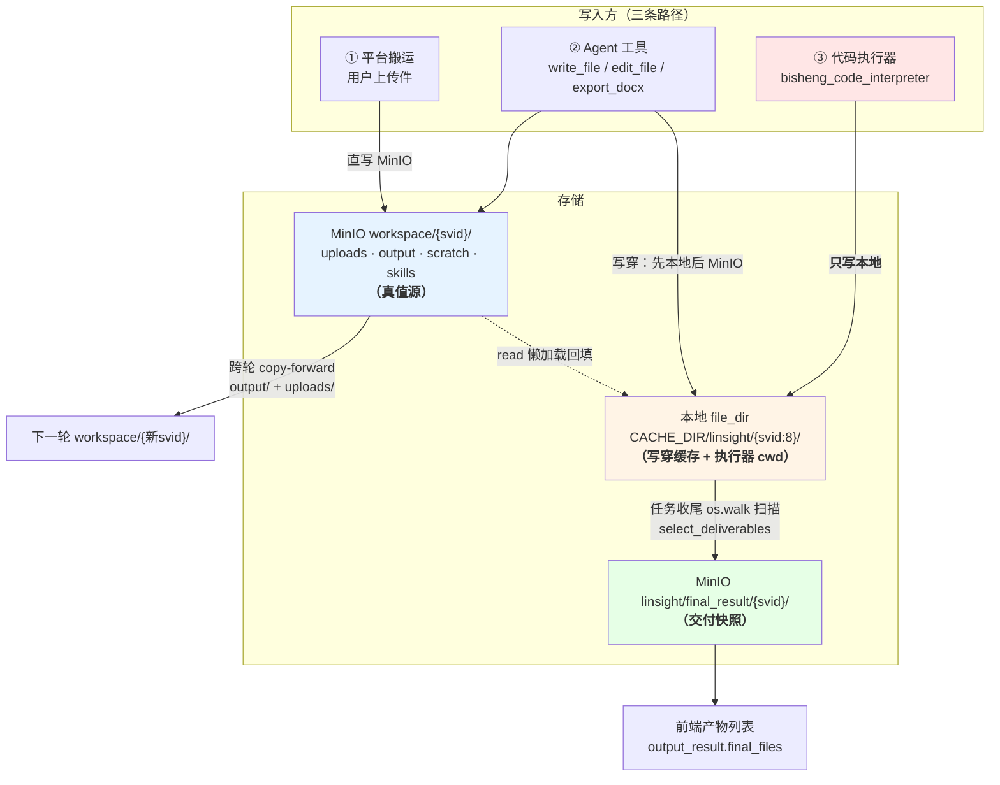
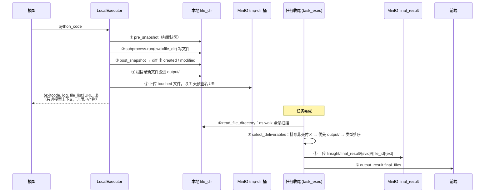

# 灵思任务模式文件处理链路系统分析

> 取证基线：`e96ce0017`（`fix(linsight): guard binary uploads, keep originals for the code interpreter`），工作树 clean。
> 本文只描述现状与已查实的缺口，**不含任何代码改动**。所有结论内联 `文件:行号`，可直接跳转复核。

---

## 摘要：一句话回答四个问题

**灵思任务模式没有"一个文件系统"，而是三套存储 + 一个统一门面。**

门面是 deepagents 的 `BackendProtocol`——灵思用自定义的 `WorkspaceBackend` 顶替了框架默认的内存实现，把 agent 的 `read_file`/`write_file`/`ls` 接到了 MinIO 的 `workspace/{svid}/` 前缀。但**代码执行器不走这个门面**：它直接在 `WorkspaceBackend` 的本地写穿缓存目录里起子进程，产物只落本地盘。而用户最终看到的产出文件走的是第三条路：任务收尾时扫描那个本地目录，另行上传到 `linsight/final_result/{svid}/`。

三条写入路径唯一的交汇点是本地目录 `file_dir`。**抓住这一点，本文其余所有现象都可以推导出来**——包括"agent 画完图用 `ls` 却找不到"、"产出文件偶尔凭空消失"、"跨轮看不到上轮图表"这几个反复出现的排障问题。

对四个原始问题的直接回答：

| 问题 | 答案 |
|---|---|
| workspace 和 deepagents 虚拟文件系统是一回事吗？ | **是同一套接口的两种实现**。接口是 deepagents 的，实现是灵思自己写的，物理载体是 MinIO 对象存储——不是内存态，也不是本地 POSIX 目录 |
| 用户上传的文件存在哪、怎么处理？ | 经知识库 ETL **解析成 markdown**，再以"文本视图 + 原件"**双轨**拷进 `workspace/{svid}/uploads/`。模型初见只有零正文的指针块 |
| 代码执行器跑在哪？和 workspace 什么关系？ | 跑在 **linsight worker 容器内的子进程**里（无隔离），cwd 就是 workspace 的本地缓存目录——**共享本地目录，但不共享 MinIO** |
| 执行器生成的文件在哪？ | 落 `file_dir/output/`（本地盘），靠任务收尾的**本地目录扫描**进入交付列表，**全程不经过 MinIO workspace 前缀** |

### 全景图



图中最关键的是那条**红色的单向箭头**：代码执行器只写本地，不写 MinIO。第四章和第六章几乎所有内容都源于此。

---

## 第一章 · 门面层：workspace 与 deepagents 虚拟文件系统的关系

> **本章结论**：是同一套接口的两种实现。接口（工具签名、返回结构）来自 deepagents，实现（物理落盘）是灵思自己的 `WorkspaceBackend`，载体是 MinIO。

### 1.1 deepagents 提供的是抽象，不是实现

deepagents（锁定版本 0.6.8，`src/backend/uv.lock:1357`）把文件系统抽象成 `BackendProtocol` 抽象基类（`deepagents/backends/protocol.py:329`），方法面为 `ls / read / write / edit / glob / grep / upload_files / download_files` 及其 `a*` 异步版本。框架内置四种实现：

| 实现 | 载体 |
|---|---|
| `StateBackend` | LangGraph state（内存 / checkpoint）——**框架默认值** |
| `FilesystemBackend` | 本地磁盘 |
| `CompositeBackend` | 路由到多个 backend |
| `store / sandbox / local_shell / langsmith` | 其它载体 |

`create_deep_agent` 在不传 backend 时用内存实现：`backend = backend if backend is not None else StateBackend()`（`deepagents/graph.py:590`）。

另有一个 `SandboxBackendProtocol`（`protocol.py:800`），在 `BackendProtocol` 之上多了 `execute/aexecute`——**这才是框架定义的"能执行命令的沙箱"**。记住这个区分，1.4 节要用。

### 1.2 灵思注入的是自己的 `WorkspaceBackend`

```python
# bisheng/linsight/domain/services/workspace_backend.py:197
class WorkspaceBackend(FilesystemBackend):
```

注入链路：

```
task_exec.py:691   backend = WorkspaceBackend(svid=session_model.id, minio=minio, file_dir=self.file_dir)
       ↓
agent_factory.py:778-784   create_deep_agent(..., backend=backend, ...)
```

所以**任务模式的 agent 从第一天起就没用过内存文件系统**——它调用的 `write_file` 工具是 deepagents 注册的（`deepagents/middleware/filesystem.py:763-771`，共 7 个：`ls`/`read_file`/`write_file`/`edit_file`/`glob`/`grep`/`execute`），但每一次调用最终落到的是 `WorkspaceBackend` 的方法体。

### 1.3 双层语义：MinIO 是真值，本地是写穿缓存

模块 docstring 本身就是契约（`workspace_backend.py:1-33`）：

| 语义 | 实现 | 位置 |
|---|---|---|
| **对象 key 规则** | `f"{WORKSPACE_PREFIX}/{self.svid}/{rel_path}"`，即 `workspace/{svid}/...` | `:222-224` |
| **本地缓存路径** | `Path(self.file_dir) / rel_path` | `:226-227` |
| **write 写穿** | 先写本地 cache，再同步 `_minio_put_sync` | `:289-295` |
| **read 懒加载** | cache 命中优先，miss 则回源 MinIO 并回填 | `:298-308`、`_materialize :267-272` |
| **ls 权威在 MinIO** | `minio_client_sync.list_objects(bucket, prefix, recursive=True)` | `:311-337` |
| **edit** | cache 改写 + 写穿 MinIO；非唯一匹配报错 | `:340-367` |

写穿的意义：清空本地缓存是无损的，被挂起（park）的任务恢复时可以从 MinIO 重新 materialize。这也是任务结束能直接 `shutil.rmtree(self.file_dir)`（`task_exec.py:156`）而不丢数据的前提。

### 1.4 由此推出的三条反直觉行为

**(a) workspace 里"没有目录"。** `list_objects` 用了 `recursive=True`，MinIO 因此不返回目录前缀条目，`is_dir` 恒为 `False`（`workspace_backend.py:319-333`）。

这不是无害的细节——它直接改变了 Skill 的装配方式。`skill_provisioning.py:4-9` 的 docstring 明写：deepagents 原生的 `skills=` 参数指向这个 backend 会发现**零个** skill，因为它做 progressive disclosure 时依赖 `is_dir=True` 的目录条目。解法是给 `SkillsMiddleware` **另开一个真正的 `FilesystemBackend` 指向本地盘**：

```python
# agent_factory.py:715-717
SkillsMiddleware(
    backend=FilesystemBackend(root_dir=file_dir, virtual_mode=True),
    sources=[(f"/{WORKSPACE_SKILLS_DIR}/", "Skills")],
)
```

同理，`ls` **永远是全量递归**，`path` 参数只当作 key 前缀过滤用，不是 POSIX 的"列一层"（`:311-319`）。

**(b) `grep` 不是正则，是子串包含。**

```python
# workspace_backend.py:408
if pattern in line:
```

而 deepagents 原生 `FilesystemBackend.grep` 走 ripgrep / 正则。模型按工具描述传一个正则表达式过来，会**静默失配**——不报错，只是搜不到。

**(c) workspace 不是沙箱。** 它继承的是 `FilesystemBackend` 而非 `SandboxBackendProtocol`，通篇没有 `execute` 方法。deepagents 仍然会注册 `execute` 工具（`middleware/filesystem.py:770`），灵思也没有把它排除掉，所以模型**看得见**这个工具；但运行时 `supports_execution(backend)`（`middleware/filesystem.py:526`）为 False，调用只会拿回一条 error ToolMessage。

`WorkspaceBackend` 提供的"隔离"实际只有两样：

| 手段 | 位置 |
|---|---|
| 拒绝 `..` 路径穿越（抛 `ValueError`） | `normalize_workspace_path :118-133` |
| key 前缀命名空间 `workspace/{svid}/`，无法跨会话访问 | `_object_key :222` |

**没有**进程隔离、资源限制、网络隔离。真正的"执行环境"是另一回事——见第三章。

---

## 第二章 · 输入层：用户上传文件的四跳

> **本章结论**：上传件先被知识库 ETL 解析成 markdown，再以"文本视图 + 原件"**双轨**拷进 `workspace/{svid}/uploads/`。模型初见只有零正文的指针块，正文靠自己 `read_file` 取。

### 2.1 四跳全览

| 跳 | 落点 | 代码位置 |
|---|---|---|
| **① 上传落本地临时盘** | `CACHE_DIR/linsight/<file_id>.<ext>`<br/>⚠️ 这是 **API 进程的本地盘，linsight worker 进程读不到** | `workbench_impl.py:1095`（`upload_file`）<br/>`core/cache/utils.py:211-231` |
| **② 后台解析 → markdown 进临时桶** | `tmp-dir` 桶，key = `<file_id>.md`（无前缀）<br/>元信息进 Redis，TTL 24h | `workbench_impl.py:1129`（`parse_file`）<br/>`:1218` `put_object_tmp`<br/>`:1262` Redis key `linsight_file:{file_id}` |
| **③ 提交问题时转正式桶 + 写进 workspace** | 正式桶 `linsight/{svid}/{file_id}.md`<br/>**并且** `workspace/{svid}/uploads/<原名>.md` | `_formal_markdown_object :572`<br/>`_write_attachment_to_workspace :656-720` |
| **④ 元信息落库** | `LinsightSessionVersion.files`（JSON 列，**没有独立表**） | `models/linsight_session_version.py:78-80` |

第 ③ 跳有个已经踩过的坑值得记：svid 是**提前生成**的（`workbench_impl.py:198` `svid = uuid.uuid4().hex`），因为附件必须写进将来那个 session version 的 workspace 前缀。早期按 `chat_id` 写，导致 agent `read_file` 时 MinIO 报 NoSuchKey、整个任务失败。

### 2.2 解析：复用知识库那套 ETL，按扩展名分派

统一走 `TempFilePipeline`——知识库 RAG 的临时管线，**不入 Milvus / ES**（`workbench_impl.py:1179-1195`）。分派依据是**扩展名，不是 MIME**（`knowledge/rag/base_file_pipeline.py:26-58`）：

```
xlsx/csv/xls  → _init_excel_loader
doc/docx      → _init_word_loader
ppt/pptx      → _init_ppt_loader
pdf           → _init_pdf_loader
ofd           → _init_ofd_loader
png/jpg/...   → _init_image_loader
mp3/mp4/...   → _init_audio_loader / _init_video_loader
```

PDF 再四选一（`_build_pdf_loader`，`base_file_pipeline.py:207`）：配了 ETL4LM → `Etl4lmLoader`；配了 Mineru → `MineruLoader`；配了 PaddleOCR → `PaddleOcrLoader`；都没有 → `LocalPdfLoader`。

**图片走的是 OCR 转文字，不是多模态 image block**：`_init_image_loader`（`:257-260`）复用 PDF loader，且当落到 `LocalPdfLoader`（即没配任何 OCR 服务）时直接 `raise KnowledgeFileNotSupportedError()`。这与前端只在 `enable_etl4lm` 时才把图片加进上传白名单是一致的（`client/src/common/index.ts:11-12`）。

### 2.3 双轨：文本视图 + 原件

只有 markdown 是不够的——把 Excel 转成 markdown 去做数值计算是南辕北辙。所以对一批格式额外把**原件**也写进 `uploads/`，与 `.md` 同目录并存（`_write_raw_original_to_workspace`，`workbench_impl.py:723-762`）：

```python
_RAW_KEEP_EXTS = frozenset({"xlsx","xls","csv","docx","doc","pptx","ppt","pdf","ofd"})  # :87
_RAW_KEEP_MAX_BYTES = 50 * 1024 * 1024                                                  # :91
_IMAGE_EXTS = frozenset({"png","jpg","jpeg","gif","webp","bmp"})                        # :77
```

目的是让代码执行器能用 pandas / python-docx / fitz 精确读取。**图片被刻意排除在双轨之外**（`:83-86` 注释）：图片原件只提升到正式桶供前端预览，不进 workspace——因为 `read_file` 回来会变成 image block，非视觉模型会拒收。

### 2.4 两层二进制守卫

双轨带来一个新问题：workspace 里现在有 `.pdf`/`.docx` 这类二进制原件了，而 deepagents 的 `read_file` 会按扩展名把它们包装成多模态 block（`deepagents/backends/utils.py:25-55`：`.pdf/.ppt/.pptx → "file"`，图片 → `"image"`）。但 `WorkspaceBackend.aread` 永远返回 `decode("utf-8", errors="replace")` 的文本（`:477-480`），于是产出的是"把乱码当 base64"的坏块——这正是历史上 **"PDF 触发 400 Invalid value: file"** 的成因。

两层拦截（`binary_content_guard.py`）：

| 中间件 | 拦截点 | 行为 |
|---|---|---|
| `BinaryReadGuardMiddleware`（`:122`） | `awrap_tool_call`，拦 `read_file` 的返回 | 非文本 block 或 mojibake（U+FFFD 占比 >5% 或含 `\x00`）→ 换成可执行的文字提示 |
| `ModelContentGuardMiddleware`（`:168`） | `awrap_model_call`，拦出站消息 | `_BLOCKED_BLOCK_TYPES = {"file","audio","video","input_audio"}`（`:57`）一律换文本占位 |

`image` 块**故意放行**——主流 provider 接受它。

装配位置：`agent_factory.py:691-692`（主图）、`:765-766`（子代理）。

### 2.5 模型初见的是指针，不是正文

`prepare_file_list`（`workbench_impl.py:871-953`）生成一个**零正文**的块，拼进第一条 user message：

```
<uploaded_files>
- path: /uploads/委托书.md
  name: 委托书.pdf
  lines: 1234
  images: 0
  raw: /uploads/委托书.pdf
</uploaded_files>
```

话术按是否绑了代码执行器分岔（`:936-951`）：绑了才会说"raw 指向原件可用代码读取"，没绑则改说"无法读取原件，请基于文本视图作答"。这个 lockstep 由 `task_exec.py:688` 的 `_has_code_interpreter` 统一驱动，是为了避免"提示模型去调一个根本不存在的工具"这类失败模式。

### 2.6 跨轮延续：服务端 copy-forward

新一轮任务会生成**新的 svid**，也就意味着一个全空的 `workspace/{新svid}/` 前缀——上一轮的 `output/report.md` 直接读不到。解法是开局做一次服务端拷贝：

```python
# workspace_backend.py:136-140
async def seed_workspace_from_previous(minio, src_svid, dst_svid,
                                       zones=(OUTPUT_DIR, UPLOADS_DIR)) -> int:
```

关键性质：

- **只拷 `output/` + `uploads/` + `manifest.json`**；`scratch/` 刻意排除（`:149-150`）
- **服务端 copy**（`minio.copy_object_sync`，`:181-184`），字节不经过应用
- **幂等**：目标前缀已有任意对象就直接返回 0（`:166-167`）
- **best-effort**：单对象失败只 warning，不阻塞本轮（`:185-191`）
- **只从紧邻的上一个 version 拷**——因为每轮的 workspace 都是累积的，拷一轮即承接整条会话（`:146-149`）

调用点唯一：`task_exec.py:467`，在建 agent 之前。注意 `POST /workbench/continue`（追问）**复用同一个 svid 和同一个 LangGraph thread**，因此不触发也不需要 copy-forward。

---

## 第三章 · 执行层：代码执行器跑在哪

> **本章结论**：跑在 linsight worker 容器内的一个子进程里，cwd 就是 `WorkspaceBackend` 的本地写穿缓存目录——与 workspace **共享本地目录，但不共享 MinIO**。没有任何沙箱级隔离。

### 3.1 工具是条件启用的

工具类 `CodeInterpreterTool`，工具名 `bisheng_code_interpreter`，只有一个参数 `python_code: str`（`bisheng_langchain/gpts/tools/code_interpreter/tool.py:47-73`）。

**按用户在输入框的勾选启用**，不是无条件绑定：

```python
# workbench_impl.py:1266-1277 (_init_bisheng_code_tool)
bisheng_code_tool = await GptsToolsDao.aget_tool_by_tool_key(tool_key="bisheng_code_interpreter")
if not bisheng_code_tool or bisheng_code_tool.id not in selected_tool_ids:
    return tools            # 本轮没勾选 → 不绑定
selected_tool_ids.remove(bisheng_code_tool.id)   # 消费掉，避免通用通道二次构建
```

新装实例会把它放进默认预勾选清单（`workstation/domain/services/workstation_service.py:105-110`），所以多数用户感知上"它一直都在"。

### 3.2 两种实现，生产上只有一种活着

| 实现 | 文件 | 状态 |
|---|---|---|
| `LocalExecutor` | `local_executor.py:52` | **默认，生产链路** |
| `E2bCodeExecutor` | `e2b_executor.py:26` | 远程 E2B 沙箱，需显式配 `type != "local"` |

选择逻辑在 `bisheng_langchain/gpts/load_tools.py:104-112`，`executor_type` 默认 `"local"`。

**E2B 的 workspace 集成在生产上是死代码**：`self.workspace_backend = kwargs.get("workspace_backend")`（`e2b_executor.py:52`）这个 kwarg 全仓无人注入（唯一赋值点是测试 `test/linsight/test_e2b_copy_in_out.py:121`），而 `_materialize_working_set()` 恒返回 `{}`（`:140-149`，标着 `TODO(Wave 2)`）。结果是切到 E2B 后，沙箱既拿不到 workspace 文件，产物也不回写 workspace。

### 3.3 真正的执行动作

```python
# local_executor.py:155-179
cmd = [sys.executable if lang.startswith("python") else cls._cmd(lang), filename]
...
future = executor.submit(subprocess.run, cmd, cwd=work_dir, capture_output=True, text=True)
```

即 **linsight worker 进程 fork 出的子进程，用 worker 自己的 Python 解释器**。工作目录：

```python
# local_executor.py:340-341
if self.local_sync_path and os.path.exists(self.local_sync_path):
    exit_code, logs, file_list = self.run_with_dir(code, dir_path=self.local_sync_path, lang=lang)
```

而 `local_sync_path` 被显式绑成任务的 `file_dir`：

```python
# workbench_impl.py:1284, 1287
code_config["config"]["local"]["local_sync_path"] = file_dir
code_config["config"]["e2b"]["local_sync_path"]  = file_dir
```

`file_dir` 同时也是 `WorkspaceBackend` 的写穿缓存目录（`task_exec.py:691` 传的是同一个变量）：

```python
# task_exec.py:562
file_dir = os.path.join(CACHE_DIR, "linsight", session_model.id[:8])
```

**这就是全文最关键的那个交汇点**：执行器的 cwd ≡ workspace 的本地缓存。

### 3.4 没有隔离

| 维度 | 现状 |
|---|---|
| 进程/容器 | 同一个 linsight worker 容器，同用户，同 Python 解释器 |
| 文件系统 | 可访问容器内任意路径（工作目录只是**软约定**） |
| 网络 | 与 worker 同网络 |
| 凭据 | MinIO 凭据本来就作为 `minio` dict 传给执行器（`tool/domain/services/executor.py:157-160`） |
| 资源限制 | **未找到**任何 ulimit / cgroup / seccomp / 内存 CPU 限制 / 降权用户 |

`base_executor.py:12-14` 的注释自己也称其为 "the shared LocalExecutor"。

### 3.5 环境细节

| 项 | 值 | 位置 |
|---|---|---|
| 超时 | `DEFAULT_TIMEOUT = 600`（秒）——但**并不真正终止子进程**，见第六章 #3 | `local_executor.py:24, 206` |
| 可用库 | pandas、numpy、matplotlib、openpyxl / XlsxWriter、python-docx、Pillow、reportlab、PyMuPDF(`fitz`) | `LOCAL_DESCRIPTION :43-49` |
| 明确禁止 | pdfminer / pdfplumber / PyPDF2（未安装）、`pip install`（共享离线环境） | 同上 |
| 中文字体 | 每次运行强制注入 `matplotlib.rc("font", family="WenQuanYi Zen Hei")`，并 `os.remove` 掉 matplotlib 全局字体缓存 | `:77-94` |
| 代码文件清理 | `finally: os.remove(filepath)`（`tmp_code_<md5>.py`） | `:222-228` |
| 任务目录清理 | 每轮任务结束 `shutil.rmtree(self.file_dir, ignore_errors=True)` | `task_exec.py:156` |
| 沙箱关闭 | fresh / resume / continue 三条路径都会找到工具并 `close()`；LocalExecutor 的 `close()` 是空实现 | `task_exec.py:312/408/501`、`base_executor.py:129-130` |

### 3.6 执行前的预取

worker 在建 agent 之前会把上传件**双轨预取**到 `file_dir` 根目录（`task_exec.py:566-607`）：

- `_download_file`（`:611`）拉 `markdown_file_path` → `file_dir/<name>.md`
- `_download_raw_original`（`:636`）拉 `original_file_path` → `file_dir/<raw_filename>`

原因写在注释里（`:588-593`）：代码执行器的文件清单是用 `os.walk(file_dir)` 生成的，**原件不落到这里，pandas / python-docx / fitz 就看不见它**。

紧接着拍一张 baseline 快照（`:607` `snapshot_file_paths`），这是后面判定"哪些文件是本轮产出"的依据。

---

## 第四章 · 产出层：执行器生成的文件去了哪

> **本章结论**：落在本地 `file_dir/output/`，靠任务收尾的**本地目录扫描**进入交付列表。全程不经过 MinIO workspace 前缀。

### 4.1 完整链路



逐步取证：

| 步 | 说明 | 位置 |
|---|---|---|
| ①③ | `_snapshot_files` 递归 `os.walk`，跳过隐藏目录与 `__pycache__`；前后 diff 才能回答"这次运行写了什么"——工作目录里还混着预取的上传件和之前每一步的产物 | `local_executor.py:230-253` |
| ④ | `_relocate_root_files`：**只搬本次运行新建的**根级文件进 `output/`，预取的上传源在前置快照里因而原地不动；同名覆盖是有意为之（重跑要刷新而非堆积 `report (1).xlsx`） | `:255-287` |
| ⑤ | `upload_minio` → **`tmp-dir` 桶 + 7 天预签名 URL** | `base_executor.py:88-127` |
| ⑥ | `read_file_directory(self.file_dir)`——**本地 `os.walk`，不是 MinIO** | `utils.py:173-200`；三条完成路径调用点 `task_exec.py:1424 / 1482 / 1510` |
| ⑦ | `select_deliverables` | `utils.py:203-256` |
| ⑧ | `linsight/final_result/{svid}/{file_id}{ext}`（纯 ASCII key，规避华为 OBS 预签名 403） | `utils.py:288` |
| ⑨ | `output_result.final_files` → 前端 `file_list` | `client/src/hooks/useLinsightManager.tsx:130` |

⑤ 那批 URL **只进模型上下文，不是用户看到的产物列表**——这是一个常见误解。用户产物完全由 ⑥⑦⑧ 决定。

### 4.2 交付物筛选规则

`select_deliverables`（`utils.py:203-256`）是两条互斥的有序判据，**不做任何文本匹配**：

1. **`output/` 区**——所有写入方都被指向的交付契约
2. **本轮新建的文件**（对比 baseline）——仅当 `output/` 为空时启用；没有 baseline 则跳过而不猜

两条判据都排除 `NON_DELIVERABLE_ZONES = {scratch, uploads, skills}`（`:105`）。排除 `skills/` 尤其重要：skill bundle 是在 baseline 快照**之后**才拷进 workspace 的，不排除的话，一次没产出 output/ 文件的运行会把上百个 `SKILL.md` 当成"本轮产物"交付出去。

结果按**文件类型排名优先、时间次之**排序（`_DELIVERABLE_TYPE_RANK`，`:133-164`）：

```
文档 (.md/.docx/.pdf/.html…) = 0
表格 (.xlsx/.csv…)          = 1
演示 (.pptx…)               = 2
其它 (.zip/.ipynb…)         = 3
图片 (.png/.jpg…)           = 4
```

`files[0]` 就是前端"已为您整理好 X"的标题文件。按类型而非时间排序是有意的：一次先写 `报告.docx` 再渲染三张图表的运行，最新文件是 PNG——恰恰是最不该当标题的东西。

**兜底**：若一个 output/ 产物都没有，把最终 answer 写成 `output/报告.md` 再走同样的上传流程（`build_fallback_report_file`，`utils.py:323-367`）。弱模型有时会在 `write_todos` 上打转、始终不调 `write_file`，这条兜底保证任务至少有交付物。

### 4.3 绝对路径逃逸

模型写 `/output/report.pdf`（前导斜杠）时，文件落到**容器文件系统根目录**，在被扫描的 `file_dir` 之外——于是静默消失，用户只看到兜底的 `报告.md`。

因为 LocalExecutor 是共享的，从容器根抢救文件会造成任务间串档，所以选择"**不救 + 追加纠正提示**"：

```python
# base_executor.py:18
_ABSOLUTE_DELIVERABLE_RE = re.compile(r"""['"]/(?:output|scratch)(?:/|['"])""")
```

匹配上就把 `ABSOLUTE_PATH_NOTICE`（`:20-26`）追加到工具结果末尾，非阻断，让模型下一步自纠（触发点 `local_executor.py:350-357`）。姊妹机制是 `relocation_advisory`（`:74-86`），配合 4.1 步骤④告知模型新路径——因为搬完之后旧路径就不再 resolve 了。

---

## 第五章 · 五个 key 空间对照表

把全文压成一张表。**同一个文件在这条链路上最多会存在于三个地方**。

| # | 存储 | 位置 | 写入方 | 谁能看到 | 生命周期 |
|---|---|---|---|---|---|
| 1 | **MinIO workspace** | `workspace/{svid}/`<br/>`├ uploads/`（上传件双轨）<br/>`├ output/`（交付区）<br/>`├ scratch/`（中间态）<br/>`└ skills/`（技能包） | 平台上传搬运、agent `write_file`/`edit_file`/`export_docx`、skill 拷贝 | agent 的 `ls`/`read_file`/`glob`/`grep` | 长期；跨轮 copy-forward |
| 2 | **本地 file_dir** | `CACHE_DIR/linsight/{svid[:8]}/` | 上述写穿 + 预取 + **代码执行器（独占）** | 代码执行器（cwd）；agent 只能 `read_file` 命中，`ls` 看不到 | **任务结束即删** |
| 3 | **MinIO 交付区** | `linsight/final_result/{svid}/{file_id}{ext}`<br/>`linsight/session_files/{svid}/{file_id}{ext}` | 任务收尾扫描后上传 | 前端产物列表 / 下载 | 永久快照 |
| 4 | **MinIO 正式桶（上传件）** | `linsight/{svid}/{file_id}.md`<br/>`linsight/{svid}/{file_id}_original.{ext}` | 提交问题时 tmp→正式 | 前端上传件预览；worker 预取的来源 | 永久 |
| 5 | **MinIO 临时桶** | `tmp-dir` 桶：`<file_id>.md`、执行器产物 `<uuid>..{ext}` | 上传解析、执行器 `upload_minio` | 解析中转；执行器返回给模型的 URL（7 天） | 临时 |

各区的创建者归属（第 1 项展开）：

| 目录 | 谁创建 | 用途 |
|---|---|---|
| `uploads/` | **平台**，提交时直写 MinIO（不经 backend） | 用户附件的 md 视图 + 原件 |
| `output/` | **模型**（`write_file`/`export_docx`/`export_pdf`）、**代码执行器**、**兜底逻辑** | 唯一交付区 |
| `scratch/` | **模型**（写 key 即建） | 中间产物；不交付、不跨轮拷贝 |
| `skills/` | **平台**，任务启动时拷贝（`materialize_session_skills`，`skill_provisioning.py:47`），拷贝动作本身即白名单闸门 | 本轮授权的 skill bundle |
| `charts/` | **无人**——它只是系统提示词里的一个示例路径 `output/charts/x.png`（`agent_factory.py:126`），模型写时才顺带产生 | — |
| `manifest.json` | **无写入实现**（见第六章 #9） | — |
| `large_tool_results/`、`conversation_history/` | **deepagents 框架**（同一个 backend） | 超长工具结果 / 历史卸载（`deepagents/middleware/filesystem.py:752-753`） |

---

## 第六章 · 已查实的缺口与风险

本章每条均有代码位置，**本轮不做修改**，供后续单独排期。按影响面排序。

### #1 代码执行器产物对 `ls` 不可见（结构性）

- **现象**：agent 用代码执行器画完图，再调 `ls` 看不到那张图；下一轮任务也读不到上一轮用代码生成的图表
- **位置**：`local_executor.py:319-329`（只写本地 + 传 tmp 桶）vs `workspace_backend.py:311-337`（`ls` 权威在 MinIO）
- **机理**：`write_file` 写的文件是本地 + MinIO 双写，`ls` 看得到；代码执行器写的文件**只有本地**，于是 `read_file` 能命中缓存读到，`ls`/`glob`/`grep` 却一律看不到；跨轮 `seed_workspace_from_previous` 也带不走
- **影响**：交付不受影响（走本地扫描），但模型的世界观是撕裂的，容易在"我明明写了"和"列不出来"之间空转
- **修复取向**：在执行器收割阶段把 `touched` 文件写穿一次 MinIO workspace（可复用 `WorkspaceBackend.write`）

### #2 执行失败时日志被吞

```python
# local_executor.py:345-346
if exit_code != 0:
    return {"exitcode": exit_code, "log": logs_all}   # logs_all 尚未累加本块 logs
```

- **触发**：单代码块（`extract_code` 对纯代码返回 1 个块，是常态）+ 执行失败
- **影响**：模型拿到 `{"exitcode":1,"log":""}`，看不到 traceback，只能盲改重试
- **修复取向**：返回前累加当前块的 `logs`

### #3 超时不真正生效

```python
# local_executor.py:168-179
with ThreadPoolExecutor(max_workers=1) as executor:
    future = executor.submit(subprocess.run, cmd, cwd=work_dir, ...)
    try:
        result = future.result(timeout=timeout)
    except TimeoutError:
        return 1, TIMEOUT_MSG, ""
```

- **机理**：超时后确实立刻返回，但退出 `with` 会触发 `shutdown(wait=True)`，阻塞到 `subprocess.run` 自己结束；子进程**从不被 kill**。Windows 分支干脆完全没有超时（`:159-166`）
- **影响**：一个死循环脚本会挂住 worker 的并发槽
- **修复取向**：改用 `subprocess.Popen` + `communicate(timeout=)` + `kill()`

### #4 E2B → workspace 回写是死代码

- **位置**：`e2b_executor.py:52`（kwarg 无人注入）、`:140-149`（`_materialize_working_set` 恒 `return {}`）、`:194-196`（回写分支永不执行）
- **影响**：一旦切到 E2B，沙箱既拿不到 workspace 文件（只能靠 `init_sandbox` 时预打包的 `file_list`），产物也不回写
- **修复取向**：与 #1 一并处理——注入 `workspace_backend` 并完成 Wave 2 的 TODO

### #5 `large_tool_results/` 与 `conversation_history/` 未列入非交付区

- **位置**：`utils.py:105` 的 `NON_DELIVERABLE_ZONES` vs `deepagents/middleware/filesystem.py:752-753`
- **触发**：`output/` 为空、走 baseline-diff 兜底判据时
- **影响**：框架卸载的超长工具结果 / 对话历史文件会被当成"本轮产物"交付给用户
- **修复取向**：把这两个前缀加进 `NON_DELIVERABLE_ZONES`

### #6 成功时日志翻倍

```python
# local_executor.py:297
logs += "\n" + logs
```
自我拼接，每次成功执行的日志都翻一倍进模型上下文。纯浪费。

### #7 上传对象名双点

`local_executor.py:323-324`：`file_ext` 来自 `os.path.splitext(rel)[-1]`（已含 `.`），再拼 `f"{uuid}.{file_ext}"` → `abc..png`。影响观感与下载名。

### #8 `file_dir` 只取 svid 前 8 位

`task_exec.py:562` `session_model.id[:8]`。8 位十六进制在同机多任务下存在理论碰撞面，而该目录同时是 workspace 缓存与执行器 cwd——碰撞意味着两个任务的文件互串。未见去碰撞处理。

### #9 文档与实现漂移（三处）

| 漂移 | 位置 |
|---|---|
| `manifest.json` 只有常量定义（`:95`）与跨轮拷贝时的 key 拼接（`:175`），**无任何写入方** | `workspace_backend.py:32` docstring 称其为大文件指针清单 |
| `uploads/<name>/index.md` 与实现的 `uploads/<name>.md` 不符（`prepare_file_list` 的 fallback `workbench_impl.py:905` 仍按旧格式拼） | `workspace_backend.py:29` |
| `charts/` 只出现在系统提示词示例中，全仓无其它引用 | `agent_factory.py:126` |

### #10 `image_count` 恒为 0

`workbench_impl.py:717` 只做 `entry.get("image_count", 0)`，全仓无写入点，指针块因此恒输出 `images: 0`。根因在上游：`TempFilePipeline`（`temp_file_pipeline.py:16`）**没有覆写** `_get_image_object_dir`，继承基类的 `return None`（`base_file_pipeline.py:145-152`，经 `:142` 传给 loader），于是 loader 不上传抽出的图片——而知识库正式入库路径是覆写了的（`knowledge_file_pipeline.py:103`、`preview_file_pipeline.py:59`）。指针块信息因此失真。

### #11 本地预取路径与 workspace 相对路径不一致

`_download_file` 落到 `file_dir/<name>.md`（`task_exec.py:614-617`），而 `WorkspaceBackend._cache_path` 期望 `file_dir/uploads/<name>.md`（`workspace_backend.py:226`）。结果：agent 第一次 `read_file('/uploads/x.md')` 必然 cache miss 回源 MinIO。功能正确（回源能拿到），只是白付一次往返；预取实际只对代码执行器的 `os.walk` 有效。注释（`task_exec.py:567-571`）看起来是有意为之。

### #12 matplotlib 字体缓存被全局删除

`local_executor.py:83-86`：每次运行都 `os.remove` 掉 matplotlib 的全局 `fontlist*` 缓存。这是跨任务的进程级副作用，并发场景下会互相拖慢首次绘图。

### #13 `grep` 语义与工具描述不符

`workspace_backend.py:408` 用子串包含实现，而 deepagents 的工具描述按正则宣传。模型传正则过来会静默失配。

---

## 附录 · 取证方法

本文结论全部来自静态代码取证，基线 `e96ce0017`，工作树 clean。核心文件：

| 文件 | 覆盖内容 |
|---|---|
| `bisheng/linsight/domain/services/workspace_backend.py` | 第一章全部、2.6 跨轮延续 |
| `bisheng/linsight/domain/services/workbench_impl.py` | 第二章上传链路、3.1 工具启用、3.3 目录绑定 |
| `bisheng/linsight/domain/task_exec.py` | 生命周期、预取、baseline、三条收尾路径 |
| `bisheng/linsight/domain/utils.py` | 第四章收割与交付物筛选 |
| `bisheng_langchain/gpts/tools/code_interpreter/{base_executor,local_executor,e2b_executor}.py` | 第三、四章执行器 |
| `bisheng/linsight/domain/services/{agent_factory,skill_provisioning,binary_content_guard}.py` | 中间件装配、skill 供给、二进制守卫 |
| `.venv/.../deepagents/{graph.py,backends/protocol.py,middleware/filesystem.py}` | 框架侧抽象与默认值 |

**复核建议**：第六章 13 条缺口每条都能在当前工作树按给出的行号直接定位。若行号有漂移，用文中引用的符号名（如 `_relocate_root_files`、`select_deliverables`、`seed_workspace_from_previous`）grep 即可重新锚定。

**相关文档**：同目录《灵思任务模式运行链路与 deepagents 上下文工程对比》（执行流与上下文）、《灵思任务模式后端执行与前端渲染映射技术报告》（前端渲染）、《灵思任务模式 Skill 能力恢复方案》（skills/ 区的来龙去脉）。
