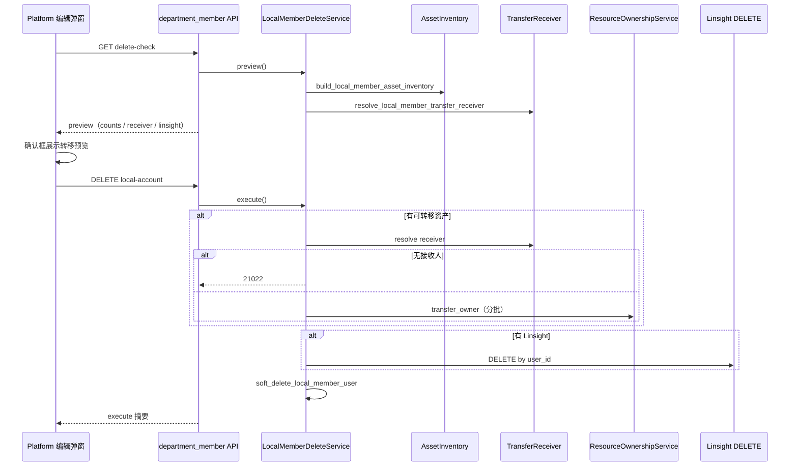

# 删除本地人员 — 资产转移与 Linsight 清理实现方案

| 项 | 内容 |
|---|---|
| 版本 | v1.0 |
| 状态 | 已实现（P0 后端 + Platform 前端） |
| 适用范围 | 部门管理 → 编辑本地人员 → 删除人员 |
| 关联能力 | F018 资源 Owner 转移、`ResourceOwnershipService.transfer_owner` |

---

## 1. 背景与目标

### 1.1 现状（改造前）

部门管理页删除「本地人员」时，后端会先统计用户挂载的数据资产（知识空间、工作流、助手等）。若 `has_assets=true`，直接返回阻断错误，前端 toast 提示「无法删除」。

| 维度 | 改造前 |
|------|--------|
| 删除策略 | 软删 `user.delete=1`，移除组织关系 / 用户组 / 非 Admin 角色 |
| 资产处理 | 有资产则 **阻断删除** |
| Linsight | 未单独处理 |
| 账号禁用后续 | 部分路径未调用 `on_account_disabled` |
| 前端体验 | 仅展示三类 legacy 计数，无转移预览 |

### 1.2 目标

删除本地人员时，改为 **先盘点 → 自动转移 F018 资产 → 删除 Linsight → 软删用户**，并在删除前向操作者展示转移预览与接收人。

### 1.3 非目标（本期不做）

- 不改造 SSO / 组织同步等其它删用户路径
- 不支持操作者手动选择资产接收人（自动解析）
- 不转移 Linsight 数据（随用户删除）
- 不物理删除 MySQL 用户行
- Client 端（`/workspace`）不涉及

---

## 2. 核心业务规则

### 2.1 删除 eligibility（不变）

仅允许删除同时满足以下条件的用户：

1. 当前上下文部门内存在组织关系
2. `user.source == "local"`
3. `user.delete == 0`
4. 非平台 AdminRole 持有者
5. 操作者有部门管理权限；归档部门只读

### 2.2 资产盘点

| 类别 | 处理方式 | 资源类型 |
|------|----------|----------|
| F018 可转移资产 | 转移 Owner | `knowledge_space` / `folder` / `knowledge_file` / `workflow` / `assistant` / `tool` / `channel` |
| Linsight 资产 | **删除**（不转移） | `linsight_session_version` / `linsight_sop` / `linsight_sop_record` |

盘点逻辑复用 `ResourceOwnershipService._resolve_resources`，按用户所属租户（`UserTenant`）逐租户扫描；无租户记录时回退操作者 `tenant_id` 或 `ROOT_TENANT_ID`。

批量转移单批上限 `MAX_BATCH=500`（与 F018 一致）。

**知识文件冗余字段同步：** F018 `transfer_owner` 在更新 `knowledgefile.user_id` 时，同步更新 `user_name`、`updater_id`、`updater_name`、`original_uploader_id`（当被删用户持有或为空时），避免列表仍显示已删用户姓名。

**个人知识空间不计入转移：** `knowledge_space_scope.level = personal` 或 `is_favorite = true` 的系统/个人库（如「我的收藏」「{用户名}的知识库」）不参与 F018 转移计数；删除用户时直接清理。仅团队/部门/公共等用户主动创建的业务空间会计入「知识空间 N 个」。

### 2.3 接收人解析

沿被删用户 **主部门**（无则当前上下文部门）的组织树 **向上** 查找：

1. 每一层取 `DepartmentAdminGrant` 管理员列表
2. 排除被删用户本人
3. 过滤已软删用户
4. 校验接收人对目标租户可见（`ResourceOwnershipService._check_receiver_visible`）
5. **多个候选管理员时取 `user_id` 升序第一个**

若组织树各级均无可用部门管理员，回退到 **平台 AdminRole** 用户（同样取 `user_id` 升序第一个可见候选）。

若存在可转移资产但 **找不到任何接收人** → 抛错 `21022`，删除中止。

### 2.4 转移 operator 代理

部门管理员调用 `transfer_owner` 可能因权限不足失败（19601）。当 operator 非 global super / admin 时，自动回退到第一个有效 **AdminRole** 用户作为 transfer operator。

### 2.5 软删与账号禁用

软删步骤（与原逻辑一致，补充 hook）：

1. 删除 `UserDepartment` / `UserGroup`
2. 删除非 AdminRole 的 `UserRole`
3. `user.delete = 1`
4. `UserService.ainvalidate_jwt_after_account_disabled`
5. **`UserService.on_account_disabled`**（QA 转公开等）
6. `DepartmentChangeHandler.on_member_removed` 逐部门执行

---

## 3. 流程设计



---

## 4. API 设计

### 4.1 删除预检

```
GET /api/v1/departments/{dept_id}/members/{user_id}/delete-check
```

**响应示例：**

```json
{
  "has_assets": true,
  "counts": {
    "knowledge_space": 2,
    "workflow": 1,
    "assistant": 0,
    "linsight_sop": 3
  },
  "transfer_count": 3,
  "linsight_delete_count": 3,
  "proposed_receiver": {
    "user_id": 100,
    "user_name": "张三",
    "source": "department_admin",
    "department_id": 20,
    "department_name": "信息部"
  }
}
```

`counts` 同时包含 F018 key 与 legacy key（兼容旧前端）：

| legacy key | 映射 |
|------------|------|
| `knowledge_spaces` | `knowledge_space` |
| `flows` | `workflow` |
| `assistants` | `assistant` |

### 4.2 执行删除

```
DELETE /api/v1/departments/{dept_id}/members/{user_id}/local-account
```

**响应示例：**

```json
{
  "deleted_user_id": 42,
  "transfer": {
    "performed": true,
    "receiver": {
      "user_id": 100,
      "user_name": "张三",
      "source": "department_admin",
      "department_id": 20,
      "department_name": "信息部"
    },
    "transferred_count": 3,
    "counts_by_type": { "knowledge_space": 2, "workflow": 1 },
    "transfer_log_ids": ["uuid-1", "uuid-2"]
  },
  "linsight_deleted": {
    "performed": true,
    "deleted_count": 3,
    "counts": { "linsight_sop": 3 }
  }
}
```

### 4.3 错误码

| Code | 类名 | 场景 |
|------|------|------|
| 21022 | `DepartmentMemberDeleteTransferReceiverNotFoundError` | 有可转移资产但无合格接收人 |

其它既有错误码（非 local 用户、Admin 不可删、无权限等）保持不变。

---

## 5. 后端实现

### 5.1 模块划分

| 文件 | 职责 |
|------|------|
| `department/domain/schemas/local_member_delete_schema.py` | preview / execute DTO |
| `department/domain/services/local_member_asset_inventory.py` | F018 七类 + Linsight 计数与 batch 列表 |
| `department/domain/services/local_member_transfer_receiver.py` | 上级 first admin → platform admin fallback |
| `department/domain/services/local_member_asset_transfer.py` | `transfer_owner` + Linsight DELETE + operator 代理 |
| `department/domain/services/local_member_delete_service.py` | `preview` / `execute` / `soft_delete_local_member_user` 编排 |

### 5.2 接入点

| 位置 | 改动 |
|------|------|
| `DepartmentService.acheck_local_member_delete` | 委托 `LocalMemberDeleteService.preview`，合并 legacy counts |
| `DepartmentService.adelete_local_organization_member` | 委托 `LocalMemberDeleteService.execute` |
| `DepartmentService._validate_local_member_deletable` | 共享校验；**移除** `_count_user_owned_data_assets` 阻断逻辑 |
| `department/api/endpoints/department_member.py` | `DELETE local-account` 返回 `result.model_dump()` |

### 5.3 关键类

**LocalMemberDeleteService**

- `preview()`：校验 → 盘点 → 解析 proposed_receiver
- `execute()`：校验 → 盘点 → 转移 → 删 Linsight → 软删 → 返回摘要
- `_resolve_start_department_id()`：优先主部门，否则上下文部门
- `soft_delete_local_member_user()`：软删 + JWT 失效 + `on_account_disabled`

### 5.4 测试

```
src/backend/test/department/test_local_member_delete_service.py
```

覆盖：

1. 接收人解析（多管理员取 `user_id` 最小）
2. execute 完整流程（mock transfer / Linsight / soft delete）
3. 有资产无接收人抛 21022

---

## 6. 前端实现（Platform）

### 6.1 涉及文件

| 文件 | 改动 |
|------|------|
| `src/controllers/API/department.ts` | 新增 `LocalMemberDeletePreview` / `LocalMemberDeleteExecuteResult` 类型 |
| `pages/DepartmentPage/components/OrganizationMemberEditDialog.tsx` | 删除流程改造 |
| `pages/DepartmentPage/components/localMemberDeleteHelpers.tsx` | 确认框预览 / 成功 toast 文案构建 |
| `public/locales/{zh-Hans,en-US,ja}/bs.json` | i18n 文案 |

### 6.2 交互流程

1. 点击「删除人员」→ 调用 `delete-check`（按钮 loading）
2. `transfer_count > 0` 且 `proposed_receiver == null` → toast 提示，不弹确认框
3. 确认框展示：
   - 基础删除说明
   - 待转移资产清单 + 接收人（部门管理员 / 平台管理员）
   - 待删除 Linsight 清单（标注不转移）
4. 确认后 `DELETE local-account`
5. 成功 toast 展示转移与 Linsight 删除摘要

### 6.3 移除行为

- 不再使用 `deleteLocalMemberBlocked`（有资产直接阻断）
- 不再在确认后才调用 `delete-check`（改为确认前预检并展示预览）

---

## 7. 与既有删除路径对比

| 路径 | 资产处理 | Linsight | 软删 |
|------|----------|----------|------|
| 部门管理删除本地人员（本方案） | F018 自动转移 | 删除 | ✅ |
| 组织同步 / SSO 删用户 | 各路径独立逻辑 | 视实现 | 视实现 |
| 系统用户管理删用户 | 可能阻断或独立处理 | 视实现 | ✅ |

---

## 8. 验证清单

### 8.1 后端

```bash
cd src/backend
uv run pytest test/department/test_local_member_delete_service.py -q
```

### 8.2 前端（手动）

| 场景 | 预期 |
|------|------|
| 无资产本地用户 | 确认框仅基础说明，删除成功 |
| 有工作流/知识空间 | 确认框展示转移清单与接收人，删除后 toast 含转移摘要 |
| 仅有 Linsight | 确认框展示 Linsight 删除清单，无转移段 |
| 有资产但无接收人 | 预检后 toast 21022 / 无接收人文案，不进入确认 |
| 部门管理员操作 | 转移成功（operator 代理到 AdminRole） |

### 8.3 回归

- 非 local 用户、Admin 用户、归档部门 → 仍被正确拒绝
- 删除后该用户无法登录，组织成员列表不再展示

---

## 9. 后续可选增强（非 P0）

- E2E：`/e2e-test` 覆盖 delete-check + execute API
- 转移失败部分回滚策略（当前依赖 F018 单批原子性，全链路无分布式事务）
- 操作审计日志 UI 展示 `transfer_log_ids`
- 允许超管手动指定接收人

---

## 10. 变更文件索引

### 后端（新增）

- `src/backend/bisheng/department/domain/schemas/local_member_delete_schema.py`
- `src/backend/bisheng/department/domain/services/local_member_asset_inventory.py`
- `src/backend/bisheng/department/domain/services/local_member_transfer_receiver.py`
- `src/backend/bisheng/department/domain/services/local_member_asset_transfer.py`
- `src/backend/bisheng/department/domain/services/local_member_delete_service.py`
- `src/backend/test/department/test_local_member_delete_service.py`

### 后端（修改）

- `src/backend/bisheng/department/domain/services/department_service.py`
- `src/backend/bisheng/department/api/endpoints/department_member.py`
- `src/backend/bisheng/common/errcode/department.py`

### 前端（新增）

- `src/frontend/platform/src/pages/DepartmentPage/components/localMemberDeleteHelpers.tsx`

### 前端（修改）

- `src/frontend/platform/src/controllers/API/department.ts`
- `src/frontend/platform/src/pages/DepartmentPage/components/OrganizationMemberEditDialog.tsx`
- `src/frontend/platform/public/locales/zh-Hans/bs.json`
- `src/frontend/platform/public/locales/en-US/bs.json`
- `src/frontend/platform/public/locales/ja/bs.json`
