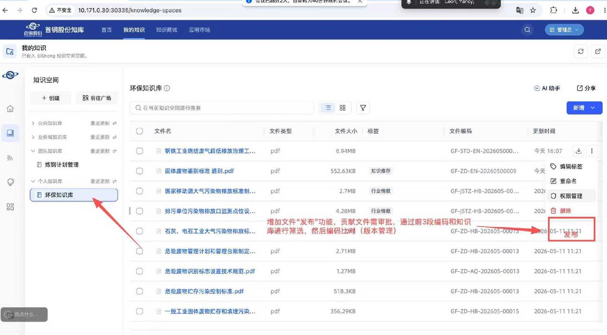
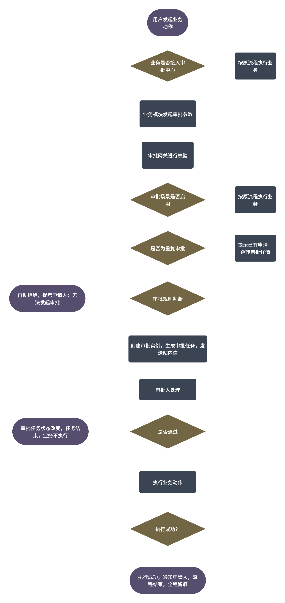
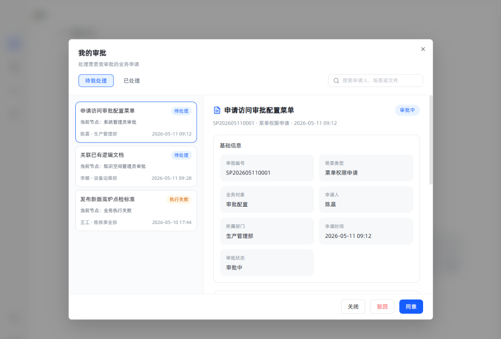
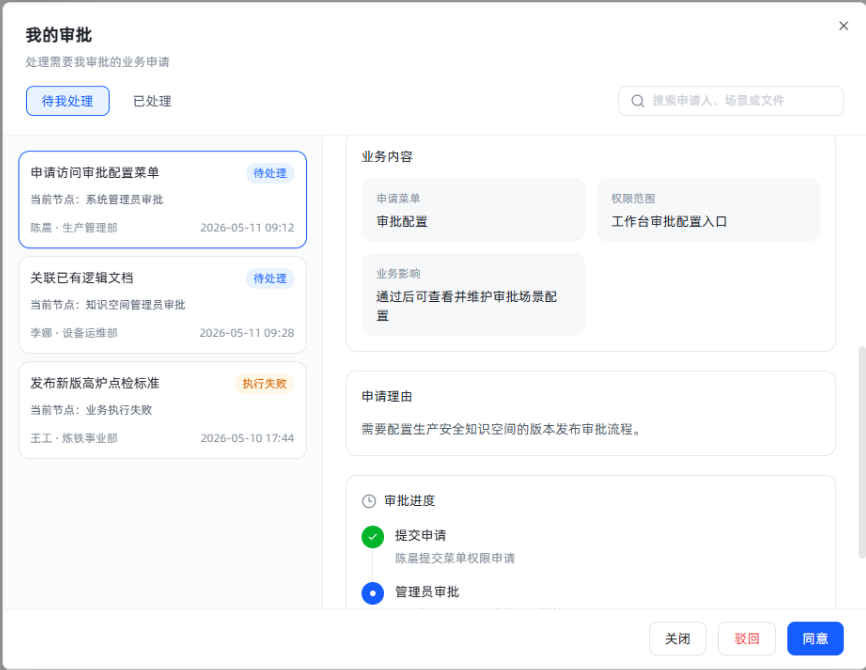
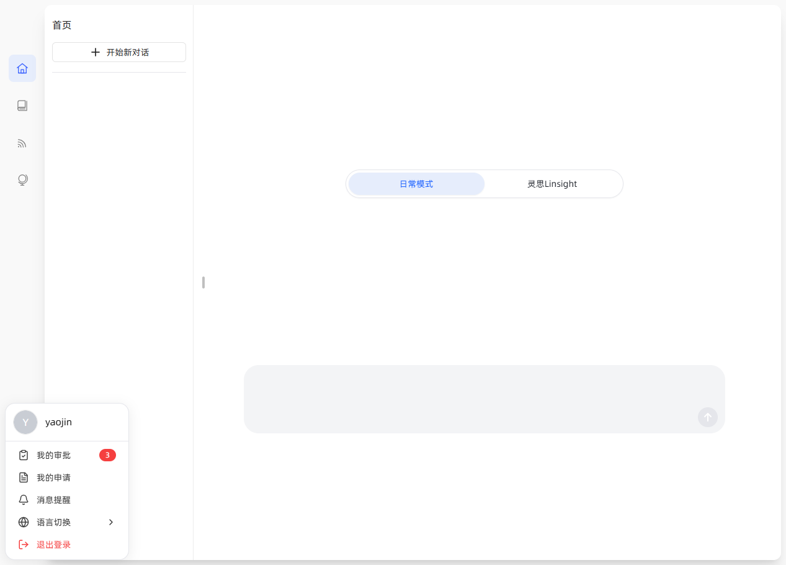
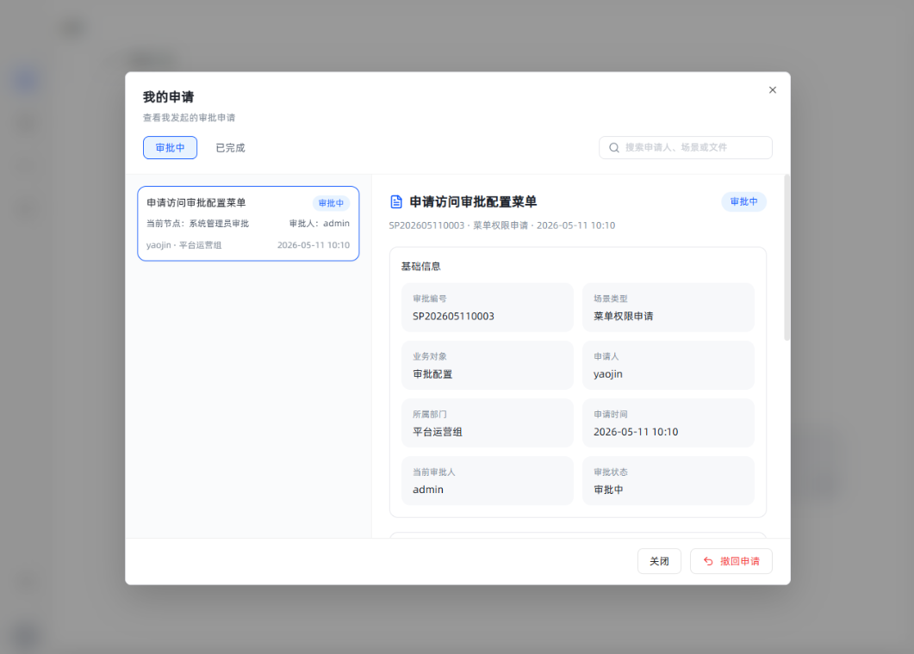
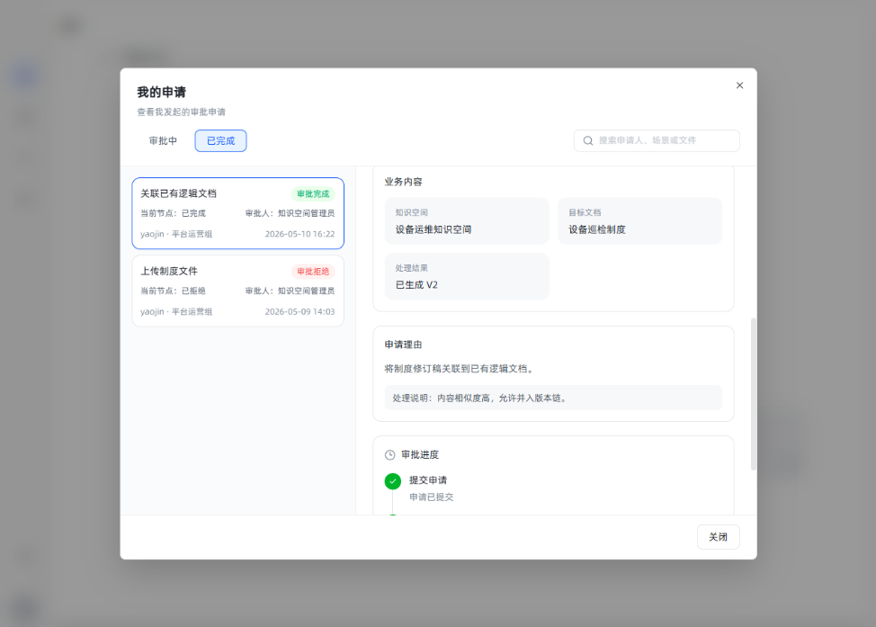
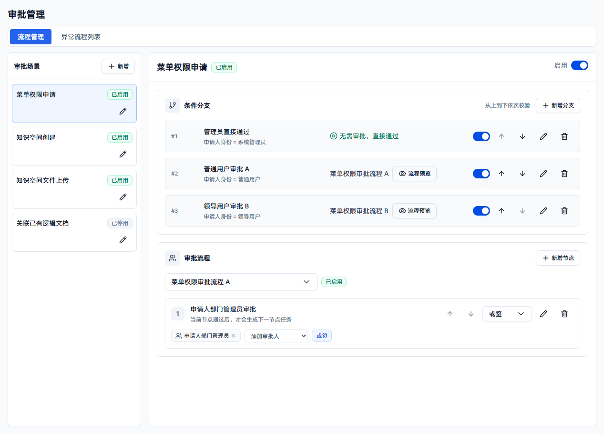
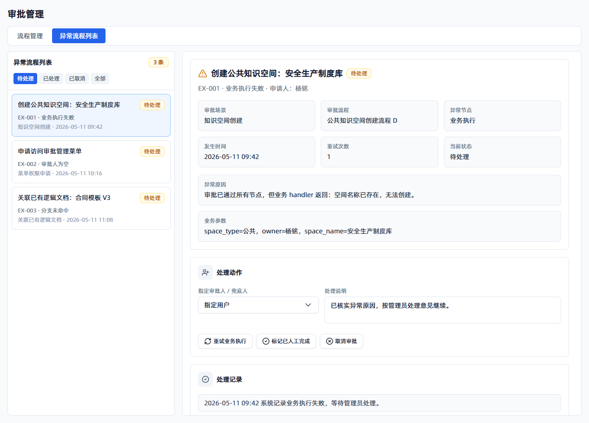
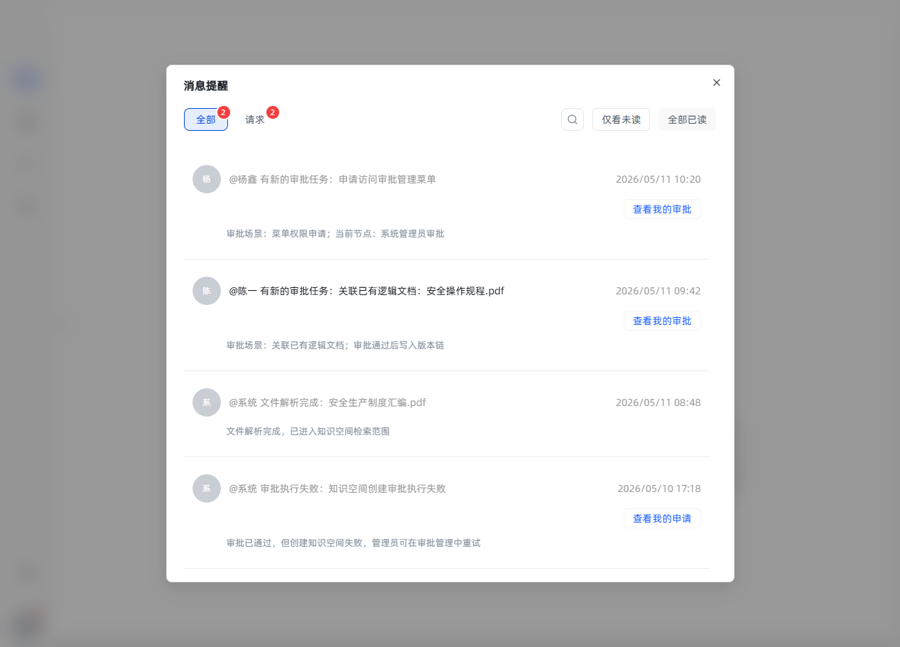

# 1. 需求目标

## 1.1 产品目标

1. 建立统一的审批中心，包含：我的审批、我的申请、审批详情、审批管理。

2. 支持业务场景注册审批，例如菜单权限申请、知识空间创建、文件上传。

3) 支持审批流程配置。

4) 审批通过后自动执行业务动作，例如授权菜单、创建知识空间。

5. 审批过程、审批意见、业务执行结果、异常重试全部留痕。

6. 主干版本保持通用能力，首钢分支可通过配置实现公共、部门等差异化流程。

## 1.2 范围说明

| 模块             | 说明                             |
| -------------- | ------------------------------ |
| 审批场景注册（无页面）    | 每个业务场景可配置是否启用审批                |
| 审批流程配置         | 支持条件分支、顺序审批节点、审批人来源、节点内或签 / 会签 |
| 我的审批           | 审批人处理待办                        |
| 我的申请           | 申请人查看进度和结果                     |
| 审批详情           | 在我的审批、我的申请弹窗右侧展示审批详情           |
| 站内信提醒          | 只做提醒和跳转                        |
| 审批通过后业务执行（无页面） | 通过 handler 执行业务动作，包含重试的规则      |
| 审计日志（现有功能中加类型） | 同意、拒绝、撤回、执行成功、执行失败             |

## 1.3 术语解释

| 术语         | 定义                                    |
| ---------- | ------------------------------------- |
| 审批场景       | 一个业务接入审批的定义，例如“菜单权限申请”“知识空间创建审批”      |
| 审批流程<br /> | 某个分支绑定的顺序审批节点配置，节点内可配置或签或会签<br />     |
| 审批实例       | 用户发起的一次审批申请                           |
| 审批任务       | 某个审批节点分配给某个审批人的待办                     |
| 审批动作       | 审批人同意、拒绝，申请人撤回，系统执行等动作                |
| 业务 handler | 审批通过后执行业务结果的服务，例如授权菜单、创建知识空间          |
| 审批 outbox  | 审批通过后待执行业务动作的队列，支持重试和追踪               |
| 站内信        | 审批提醒和跳转入口，不是审批事实来源                    |
| 申请人        | 所有用户都有可能是申请人                          |
| 审批人        | 流程配置中参与审批的人，只要流程中配置涉及，即为审批人，可见待我审批菜单。 |

## 1.4 操作权限矩阵

| 操作          | 申请人 | 审批人 | 租户管理员 | 系统管理员 |
| ----------- | --- | --- | ----- | ----- |
| 发起申请        | 是   | 是   | 是     | 是     |
| 查看自己的申请     | 是   | 是   | 是     | 是     |
| 查看待我审批      | 否   | 是   | 是     | 是     |
| 同意 / 拒绝     | 否   | 是   | 是     | 是     |
| 撤回审批中申请     | 是   | 否   | 是     | 是     |
| 查看全部审批      | 否   | 否   | 是     | 是     |
| 配置审批场景      | 否   | 否   | 是     | 是     |
| 重试执行失败      | 否   | 否   | 是     | 是     |
| 处理 / 取消异常审批 | 否   | 否   | 是     | 是     |

## 1.5 审批状态定义

| **对象** | **状态**           | **中文名**     | **说明**                                 |
| ------ | ---------------- | ----------- | -------------------------------------- |
| 审批实例   | `pending`        | 审批中         | 已创建实例，等待审批                             |
| 审批实例   | `approved`       | 审批通过        | 流程节点已通过，尚未执行业务                         |
| 审批实例   | `rejected`       | 审批拒绝        | 审批人拒绝，业务不执行                            |
| 审批实例   | `withdrawn`      | 已撤回         | 申请人主动撤回                                |
| 审批实例   | `exception`      | 流程异常        | 无法找到审批人、流程配置缺失等导致无法继续流转，需要管理员处理        |
| 审批实例   | `cancelled`      | 已取消         | 管理员在异常流程列表中取消该审批，业务不执行                 |
| 审批实例   | `executing`      | 审批通过，系统处理中  | 审批通过后正在执行业务动作                          |
| 审批实例   | `executed`       | 审批完成        | 业务动作已完成                                |
| 审批实例   | `execute_failed` | 审批通过，系统处理失败 | 审批通过但业务动作失败，可根据重试规则进行重试，达到上限后，管理员可手动重试 |
| **对象** | **状态**           | **中文名**     | **说明**                                 |
| 审批任务   | `pending`        | 待处理         | 分配给审批人，待处理                             |
| 审批任务   | `approved`       | 已同意         | 当前审批人同意                                |
| 审批任务   | `rejected`       | 已拒绝         | 当前审批人拒绝                                |
| 审批任务   | `skipped`        | 已跳过         | 因或签节点已通过而被跳过                           |
| 审批任务   | `cancelled`      | 已取消         | 申请撤回或实例取消                              |

# 2. 注册审批场景

## 2.1 **什么是注册审批场景**

不是让按钮自己做审批，而是让按钮背后的业务动作具备“可被审批中心拦截”的能力。

也就是说，把原来的：

```plaintext
点击按钮 → 直接执行业务动作
```

改成：

```plaintext
点击按钮
→ 后端先调用审批网关
→ 判断该场景是否启用审批
→ 未启用：继续原逻辑
→ 已启用：创建审批申请，暂停业务执行
→ 审批通过后：由业务 handler 再执行原业务动作
```

## 2.2 **具体要做什么**

### 2.2.1 **给按钮定义审批场景**

先把按钮背后的业务动作命名清楚。

比如菜单权限申请：

```plaintext
场景名称：菜单权限申请
场景编码：menu_access_request
触发入口：无权限空白页的“申请权限”按钮
适用条件：工作台开启需审批模式，且用户无当前菜单权限
申请人：当前登录用户
业务对象：用户申请访问的菜单 / 页面
审批通过后动作：给该用户写入个人菜单授权
审批拒绝后动作：用户仍保持无权限状态
```

这里有一个点要注意：**审批通过后不是修改角色菜单权限，而是给当前用户增加个人菜单授权。**&#x56E0;为这是用户自己的申请，不应该因为一个人申请通过，就把整个角色下的所有人都放开。

用户有效菜单 = 角色菜单权限 ∪ 通过审批获得的菜单授权 ∪ 管理员权限。

通用可按这个格式定义：

```plaintext
场景名称：xxx审批
场景编码：xxx_action_request
触发入口：哪个页面的哪个按钮
业务对象：审批的是哪个资源
审批通过后动作：原本按钮要执行的业务动作
审批拒绝后动作：不执行业务动作，保持原状态
```

要把这个 `scenario_code` 固定下来，后续在后台配置审批场景时就靠它识别相应的按钮。

### 2.2.2 **改造按钮对应的后端接口**

原来接口可能是：

```plaintext
POST /api/xxx/do-action
→ 校验权限
→ 执行业务动作
→ 返回成功
```

接入审批后要改成：

```plaintext
POST /api/xxx/do-action
→ 校验基础参数
→ 组装审批参数
→ 调用 ApprovalGate.request_or_pass
→ 根据返回结果决定后续行为
```

第四步调用网关的返回结果分四类：

```plaintext
PASS：审批未启用，继续执行原业务动作
PENDING：审批已创建，当前不要执行业务动作
DENIED：规则拒绝，返回拒绝原因
EXCEPTION：审批已创建但进入异常处理，当前不要执行业务动作
```

所以不是把原逻辑删掉，而是把原逻辑挪到两个地方：

```plaintext
未启用审批时：原接口继续执行
审批通过后：handler 再执行
```

### 2.2.3 **组装审批参数**

按钮的后端接口要能把这次业务动作整理成**审批中心**能理解的数据。

例如菜单权限申请：

```plaintext
scenario_code = menu_access_request
applicant = 当前登录用户
business_key = user:{user_id}:menu:{menu_key}
business_type = menu
business_id = menu_key
business_name = 菜单名称
reason = 用户填写的申请理由
payload = {
  user_id,
  menu_key,
  menu_name,
  apply_reason
}
```

这里比较重要的字段：

`scenario_code`：告诉审批中心这是哪个审批场景。

`business_key`：防止重复申请。比如同一个用户对同一个菜单已经有审批中申请，就不能重复创建。

`payload`：审批通过后真正执行业务要用的数据。

### 2.2.4 **实现对应场景的业务 handler**

审批中心不应该知道按钮的业务细节，所以要给按钮写一个 handler。

handler 主要负责：

```plaintext
validate：校验申请是否合法
build_title：生成审批标题
build_detail：生成审批详情展示内容
build_business_link：生成业务跳转链接
resolve_approvers：如需要，从业务对象解析审批人
on_approved：审批通过后执行原业务动作
on_rejected：审批拒绝后回写业务状态
on_withdrawn：申请人撤回后的处理
```

拿菜单权限申请来说：

```plaintext
validate：
- 用户是否已经有该菜单权限
- menu_key 是否有效
- 是否允许申请这个菜单

build_title：
- 李四申请访问“审批管理”

build_detail：
- 申请人
- 所属部门
- 申请菜单
- 申请理由
- 当前权限状态

on_approved：
- 写入个人菜单授权
- 记录来源 approval_instance_id

on_rejected：
- 不写授权
- 保留拒绝原因
```

### 2.2.5 **前端适配审批返回结果**

按钮点击后，前端不能只处理“成功/失败”，还要处理“已提交审批”。

比如菜单权限申请按钮：

```plaintext
点击提交申请后
→ 后端返回 PENDING
→ 前端提示：权限申请已提交，请等待审批。可到“我的申请”查看审批进程。
```

如果后端返回已有审批中申请：

```plaintext
提示：你已提交过该菜单权限申请，正在审批中。可到“我的申请”查看审批进程。
```

如果审批未启用并且允许直接执行：

```plaintext
展示申请入口但提示当前未开放申请
```

如果规则拒绝：

```plaintext
展示拒绝原因。
```

如果后端返回 EXCEPTION：

```plaintext
提示：申请已提交，但当前流程配置需要管理员处理。可到“我的申请”查看处理进度。
```

### 2.2.6 **管理员可配置**

要让这个场景出现在审批管理里，至少要有：

```plaintext
场景名称
场景编码
handler 标识
可用条件字段
可用审批人来源
是否启用
条件分支
分支对应的流程名称
审批流程节点、节点审批人来源、节点或签 / 会签
```

`业务类型`、`场景编码`、`handler` 不作为管理后台里的可编辑配置项。业务类型、资源类型等信息由后端根据研发预置的 `scenario_code`、handler 和业务 payload 识别，管理后台只负责配置审批规则。

这样上线后，管理员才能：

```plaintext
审批管理 → 流程管理
→ 新增或编辑审批场景
→ 启用场景
→ 配条件分支
→ 给分支配置“无需审批”或流程名称
→ 在审批流程中选择流程并配置顺序节点
→ 配节点审批人来源和或签 / 会签
```

页面采用即时保存逻辑：新增、编辑、删除、启停、排序等操作完成后触发对应保存接口，不设置全局“保存配置”按钮。

### 2.2.7 **总结**

```plaintext
不是把按钮写死成审批流程，而是要把按钮背后的业务动作接入审批中心。
目标效果是：

1. 按钮对应一个固定审批场景编码 scenario_code。
2. 用户点击按钮后，后端不要直接执行业务动作，而是先调用审批网关。
3. 如果审批场景未启用，保持原逻辑，按钮继续直接执行。
4. 如果审批场景已启用，先匹配条件分支；分支需要审批时创建审批任务，分支无需审批时直接进入业务执行。
5. 审批通过后，由按钮对应的业务 handler 执行原业务动作。
6. 审批拒绝后，不执行业务动作，并通知申请人。
7. 同一个用户、同一个业务对象、同一个动作，如果已有审批中申请，不能重复创建。
8. 后续只负责从预置目录选择场景、启用场景、配置条件分支、绑定审批流程、配置节点审批人；研发需要先把按钮做成可配置审批场景。
```

**以菜单权限申请为例：**

```plaintext
菜单权限申请这个按钮，原来用户没有权限就是看不到菜单或看到无权限。

现在首钢要求在工作台需审批模式下，用户没有权限也能进入一个空白申请页。页面上有“申请权限”按钮。

用户点击后，前端提交 menu_key、menu_name、申请理由。

后端不要直接给用户授权，而是组装 menu_access_request 审批参数，调用审批网关。

如果 menu_access_request 场景未启用，就按原无权限逻辑处理。
如果启用了，就创建审批申请，审批人通过后，再由 MenuAccessApprovalHandler 写入个人菜单授权。

注意：审批通过后只给申请人写个人菜单授权，不修改角色菜单。
```

## 2.3 本次必做场景

| 功能 / 入口       | 现状                                                         | 实现方式                                                                                                  |
| ------------- | ---------------------------------------------------------- | ----------------------------------------------------------------------------------------------------- |
| 菜单无权限申请       | 已有 `menu_approval_mode` 让无权限菜单可展示占位页，但申请审批还未统一落到审批中心       | 占位页“申请权限”按钮提交到新场景；通过后写入个人菜单授权，不修改角色菜单<br />                                                           |
| 频道订阅审批        | 站内信 `action_code = request_channel`，审批通过后激活频道成员            | 预置为审批场景；原订阅接口先调用审批网关；原 `ChannelSubscribeApprovalHandler` 改造成新业务 handler 的 `on_approved / on_rejected` |
| 知识空间加入 / 订阅审批 | 站内信 `action_code = request_knowledge_space`，审批通过后激活成员并写入权限 | 预置为审批场景；审批详情展示知识空间、申请人、申请角色；通过后复用现有成员激活和 ReBAC 授权逻辑                                                   |

### 2.3.1 **场景一：菜单权限申请**

工作台在“需审批模式”下，用户没有菜单权限时，不再直接显示死的无权限页，而是允许进入一个空白申请页。

```plaintext
空白页展示“申请权限”
→ 用户填写申请理由
→ 提交申请
→ 生成 menu_access_request 审批
→ 审批通过后写入个人菜单授权
```

这里审批通过只开菜单入口，不等于绕过后端资源权限。

用户有效菜单 = 角色菜单权限 ∪ 通过审批获得的菜单授权 ∪ 管理员权限

**规则：**

1. 审批通过后只给申请人增加个人菜单授权。

2. 不修改角色菜单。

3) 父级菜单或依赖菜单需要自动补齐。

4) 菜单权限只控制页面入口，不代表后端资源操作权限。

5. 可在审批记录中进行授权撤销。

   1. 任意审批人在我的审批中可在已审批的记录中，点击“撤销授权”按钮，来取消授权

   2. 撤销授权后，用户的“我的申请”相关的审批记录中，增加“授权已撤回”的标识。

**页面草图**

空白页文案：你当前没有访问该功能的权限，可以提交申请，审批通过后即可访问。<u>提交申请</u>

弹窗：

```plaintext
┌────────────────────────────────────────────┐
│ 你暂无访问权限                             │
│                                            │
│ 当前菜单：审批管理                         │
│ 如需访问，可提交申请，管理员审批通过后生效。 │
│                                            │
│ 申请理由：                                 │
│ ┌──────────────────────────────────────┐   │
│ │ 需要配置知识空间创建审批流程          │   │
│ └──────────────────────────────────────┘   │
│                                            │
│                         [取消] [提交申请]  │
└────────────────────────────────────────────┘
```

### 2.3.2 **场景二：频道订阅审批&知识空间加入 / 订阅审批**

频道订阅的审批和知识空间订阅的审批统一迁移到审批中心：

```plain&#x20;text
原业务入口
→ 统一审批场景编码 scenario_code
→ 调用 ApprovalGate.request_or_pass
→ 创建 approval_instance / approval_task
→ 站内信只负责提醒和跳转
→ 审批通过后由业务 handler 执行原业务动作
→ 审批过程、审批意见、业务执行结果统一进入审批日志
```

1. **功能迁移：** 新发起的审批全部走新审批中心。

2. **历史兼容：** 已经产生的旧审批记录和旧站内信强行打回。

说明：

1. 后续如果发现其他旧功能也存在“先申请、再由他人同意 / 拒绝、通过后执行业务动作”的链路，都按同样方式补充到审批场景预置目录。

2. 旧 `action_code` 只作为迁移识别和历史兼容字段，不再作为新审批体系的主键。新体系以 `scenario_code` 作为业务场景的唯一识别。

3) `站内信` 不再承担审批能力。是否待审批、谁能审批、审批到了哪一步，都以 `approval_instance` 和 `approval_task` 为准。

**迁移方式：**

**1. 先建审批场景预置目录**

先把所有旧审批入口整理成预置场景，使得审批管理中可选该场景：

```plain&#x20;text
场景名称
场景编码 scenario_code
旧 action_code / request_type 对应关系
业务 handler
可用条件字段
可用审批人来源
审批详情字段
通过后的业务动作
拒绝 / 撤回后的业务处理
```

**2. 新发起走新网关，旧逻辑停用**

旧逻辑：

```plain&#x20;text
业务接口
→ 直接创建 inbox_message 或 approval_request
→ 站内信里点同意 / 拒绝
→ message handler 执行业务动作
```

迁移后改为：

```plain&#x20;text
业务接口
→ 组装 scenario_code、business_key、payload
→ 调用 ApprovalGate.request_or_pass
→ PASS：继续原业务动作
→ PENDING：停止业务动作，提示已提交审批
→ EXCEPTION：停止业务动作，进入异常审批处理
```

旧的 `approval_request`、旧的审批站内信、旧的 `send_generic_approval` 不再作为新审批的创建入口。

**3. 旧 handler 改造成新 handler**

旧 handler 主要处理：

```plain&#x20;text
on_approved
on_rejected
```

新 handler 需要补齐：

```plain&#x20;text
validate：申请是否合法
build_title：审批标题
build_detail：右侧详情展示字段
build_business_link：业务跳转链接
resolve_approvers：从业务对象解析审批人
on_approved：审批通过后执行业务动作
on_rejected：审批拒绝后的业务处理
on_withdrawn：申请人撤回后的业务处理
```

例如部门知识空间文件上传审批，原来通过后直接 `skip_approval=True` 调用正式入库逻辑；迁移后这段逻辑放入 `knowledge_space_file_upload` 的 `on_approved`，并由 `approval_outbox` 负责失败重试。

### 2.3.2 **场景三：知识空间创建审批（首钢分支，主版本不做）**

用户点击“新建知识空间”时，需要选择空间类型：团队、部门、公共、个人且公开。

公共由系统管理员创建，部门由系统管理员创建，团队由身处用户组的人员创建，由申请人的部门管理员审批；创建非私有的个人知识空间时需要审批，由申请人的部门管理员审批（超管、租户、部门管理员免审批）。

**产品规则**

1. 点击创建按钮后，先进行一次名称合法性、重复性等内容的校验。

2. 校验通过后，用户填写申请意见，发出创建的审批，不立即创建知识空间。

3. 审批通过后，创建知识空间，并再次进行校验；审批驳回，则不执行动作。

4. 审批 payload 需要保存完整创建参数。

3) 创建失败时审批实例进入“审批通过，系统处理失败”，管理员在后台进行处理。

### 2.3.3 **场景四：知识空间文件发布审批（首钢分支，主版本不做）**

**产品规则**

1. 除管理员外，其他人在公共知识空间和部门知识空间没有上传文件的权限。

2. 不论在什么知识空间，上传文件不设流程。

3. 上传到团队知识空间和个人知识空间的文件，增加一个“发布”功能。发布功能的权限采用ReBAC中在知识空间上传文件的权限。仅解析成功的文件可以发布，其余状态时发布按钮置灰。

4. 用户点击发布按钮后，先选择知识空间（可选范围为：公共和部门类型的知识空间中可见的知识空间），选完后，根据3段编码和simhash，来跟目标知识空间内的文件（前提是对该文件有权限）进行相似度比对，将相似度超过阈值的文件返回，并作为推荐文件进行展示。用户可选择推荐的文件，或者自己手动搜索的文档，进行版本管理，也可以不进行版本管理。

5. 为防止推荐文件查询时间过久，在返回推荐文件之前，前端展示加载动画。

6. 用户点击确定按钮后，用户填写申请意见，发出审批。

7. 发布功能视作文件复制到另一个知识空间内，因此审批通过前，文件不入库。

8. 审核详情中的业务内容展示发布的文件，版本管理的情况。

9. 审批通过后，执行文件复制到目标知识空间，且进行相应的版本管理操作。

10. 审批拒绝后，不执行处理。

11. 版本管理功能只在公共知识空间和部门知识空间启用。

12. 发布的权限沿用文件上传权限。



## 2.4 **研发交付物**

```plaintext
1. 审批场景预置目录，包括场景名称、场景编码、业务 handler、可用条件字段、可用审批人来源
2. 按钮后端接口改造
3. ApprovalGate 调用逻辑
4. 业务 handler
5. 审批详情展示字段
6. 审批通过后的业务执行逻辑
7. 审批拒绝 / 撤回 / 重复申请处理
8. 前端按钮状态和提示文案
9. 运维可配置的审批场景记录
10. 测试用例
```

## 2.5 **测试验收链路**

```plaintext
场景未启用：
点击按钮→ 原业务逻辑正常执行或保持原无权限逻辑

场景已启用：
点击按钮→ 匹配条件分支 → 需要审批则生成审批申请，无需审批则直接执行业务

重复提交：
再次点击按钮→ 提示已有审批中申请

审批拒绝：
业务动作不执行 → 申请人收到拒绝通知

审批通过：
handler 执行原业务动作 → 申请人收到成功通知

执行失败：
审批实例进入执行失败 → 管理员可重试、标记已人工完成或取消异常审批

流程异常：
分支缺失或审批人为空 → 进入异常流程列表 → 管理员指定流程 / 审批人后继续，或取消审批
```

# 3. 审批业务流程

## 3.1 业务流程图



## 3.2 详细流程（以申请菜单权限为例）

### 3.2.1 **在“申请权限”页面**

说明文案：你当前没有访问该功能的权限，可以提交申请，审批通过后即可访问。<u>提交申请</u>

弹窗内：

申请对象：某某菜单
申请理由：输入框
按钮：提交申请

### 3.2.2 **点击“申请权限”按钮时**

前端先做基础校验：

```plaintext
申请理由是否填写
当前菜单 key 是否存在
当前用户是否已经拥有权限
当前是否已有审批中申请（最好以后端判断为准，前端可以辅助提示，但不能只靠前端判断）
```

然后前端提交申请：

```plaintext
调用业务侧的菜单权限申请接口
```

提交内容大概是：

```json

  "menu_key": "approval_manage",
  "menu_name": "审批管理",
  "reason": "工作需要，需要查看和处理审批配置"
}
```

### 3.2.3 **后端业务模块组装审批参数**

后端收到申请后，组装审批参数交给审批网关。

```plaintext
scenario_code = menu_access_request
applicant = 当前登录用户
business_key = user:{user_id}:menu:{menu_key}
business_type = menu
business_id = menu_key
business_name = 菜单名称
reason = 用户填写的申请理由
payload = {
  user_id,
  user_name,
  menu_key,
  menu_name,
  apply_reason
}
```

`scenario_code` 用来告诉审批中心：这是菜单权限申请。

`business_key` 用来防重复。比如同一个用户已经申请了“审批管理”菜单，并且还在审批中，就不要再创建一条新的审批。

`business_name` 用来展示。审批人看到的不是一串 menu\_key，而是“审批管理”。

`payload` 用于审批通过后的业务执行。审批通过后，handler 根据这里的 `user_id` 和 `menu_key` 给用户写个人菜单授权。

### 3.2.4 **审批中心判断是否走审批**

审批网关拿到 `menu_access_request` 后，会看审批场景配置。

如果这个场景没有启用：

```plaintext
返回 PASS
业务侧可以按原逻辑处理
```

但菜单权限申请这个场景比较特殊：用户本来就无权限，所以如果审批模式关闭，产品上处理为：

```plaintext
展示申请入口，但提示当前未开放申请
```

如果这个场景启用了：

```plaintext
创建审批实例
匹配条件分支
→ 分支结果为无需审批：直接进入业务执行，返回 PASS
→ 分支结果为审批流程：生成第一个审批节点任务，发送站内信给审批人，返回 PENDING
→ 分支匹配异常：实例进入 exception，通知管理员处理，返回 EXCEPTION
```

前端收到后提示：

```plaintext
权限申请已提交，请等待审批。你可以在“我的申请”中查看进度。
```

### 3.2.5 **管理员配置审批场景**

管理员进入：

```plaintext
审批管理 → 流程管理 → 新增或编辑审批场景
```

配置内容：

```plaintext
场景名称：菜单权限申请
场景编码：menu_access_request
业务 handler：MenuAccessApprovalHandler
状态：启用
```

在该场景下配置条件分支，例如：

```plaintext
系统管理员点击 → 无需审批，直接通过并执行业务 handler
普通用户点击 → 进入菜单权限审批流程 A
领导用户点击 → 进入菜单权限审批流程 B
```

每个分支从上到下依次校验，命中第一条后停止。分支结果如果是“无需审批”，直接进入业务执行；如果是“进入审批流程”，需要配置流程名称，并在下方审批流程区域选择该流程继续编辑。

审批流程示例：

```plaintext
流程名称：菜单权限审批流程 A
节点 1：申请人部门管理员审批
节点模式：或签
审批人来源：申请人部门管理员
```

如果同一个按钮在不同身份或不同业务对象下要走不同审批，可以继续配置其他分支：

```plaintext
部门类型知识空间创建 → 进入知识空间创建流程 C
公共类型知识空间创建 → 进入知识空间创建流程 D
```

### 3.2.6 **审批人**

审批人收到站内信后，点击打开“我的审批”弹窗。

```plaintext
审批标题：李四申请访问“审批管理”
申请人：李四
所属部门：生产管理部
申请菜单：审批管理
申请理由：工作需要，需要查看审批配置
当前权限状态：暂无该菜单权限
申请时间：2026-xx-xx xx:xx
审批操作：同意 / 拒绝
审批意见：输入框
```

### 3.2.7 **审批通过**

审批人点击同意后，如果这是最后一个审批节点，审批中心调用菜单权限 handler。

handler 执行业务动作：

```plaintext
写入个人菜单授权表
授权对象：申请人
授权菜单：menu_key
授权来源：approval
来源审批实例：approval_instance_id
授权状态：active
```

系统通知申请人：

```plaintext
你的菜单权限申请已通过，请刷新页面或重新登录后访问。
```

### 3.2.8 **审批拒绝**

审批人点击拒绝后：

```plaintext
审批实例状态 = rejected
不写个人菜单授权
站内信通知申请人审批被拒绝
申请人在我的申请展示拒绝原因
```

# 4. 审批流程配置

## 4.1 配置目标

1. 哪个业务场景要审批？

2. 不同申请人身份或不同业务对象属性分别走什么流程？

3) 每个节点谁来审批？

4) 每个节点内多人审批时采用或签还是会签？

5. 所有节点按顺序通过后，审批通过并执行业务 handler。

## 4.2 配置层级

```plaintext
审批场景
  └── 条件分支规则
        ├── 匹配条件：条件字段 + 条件值
        └── 分支结果：直接通过 / 进入某个审批流程
              └── 审批流程
                    └── 顺序审批节点
                          ├── 审批人来源
                          └── 节点审批模式：或签 / 会签
```

## 4.3 条件分支能力

条件分支用于解决“同一个按钮，不同人或不同业务对象走不同审批”的问题。分支规则按页面列表顺序从上到下匹配，命中第一条后停止继续匹配。

规则：

1. 条件分支只决定“是否审批”和“进入哪个审批流程”，不在分支里配置具体审批人。

2. 分支结果为“无需审批”时，不生成审批任务，审批实例直接进入 `approved`，随后进入业务执行。

3) 分支结果为“走某个审批流程”时，按该流程的节点顺序生成审批任务。

4) 条件由字段和值组成，保存后由后端做确定性匹配。管理后台不做自然语言解析。

5. 条件分支支持新增、编辑、删除、启停和上下移动。上下移动改变生效顺序。

6. 不提供“默认分支”概念。如需兜底，可把最后一条分支配置为“无条件 / 始终命中”；如果没有任何分支命中，审批实例进入 `exception`，通知管理员处理。

**申请人身份取值规则：**

2. 包括：`系统管理员`、`租户管理员`、`部门管理员`、`系统角色`。

3. `系统管理员` 来源于平台超级管理员身份，例如 `user.role = admin`。

4) `租户管理员` 来源于租户管理员/子租户管理员标识。

5) `部门管理员` 来源于用户在组织权限中的部门管理员关系。

6. `*系统角色*` 取系统配置中创建好的角色。

7. 同一申请人可能同时具备多个身份标签，条件匹配采用“包含即命中”。页面展示单个身份时，按系统管理员、租户管理员、部门管理员、系统角色的顺序展示最高优先级。

详见5.4章节

## 4.4 审批流程能力

审批流程只做顺序节点，不做复杂拖拽流程设计器。

| 能力    | 说明                                      |
| ----- | --------------------------------------- |
| 顺序节点  | 节点按配置顺序依次流转，前一个节点通过后才生成下一个节点任务          |
| 节点审批人 | 每个节点可指定一个审批人，也可通过规则解析出多个审批人             |
| 节点或签  | 节点内多个审批人任一同意即通过该节点，其他未处理任务变为已跳过         |
| 节点会签  | 节点内所有审批人都同意后才通过该节点                      |
| 拒绝终止  | 任一审批人在任一节点拒绝，审批实例进入 `rejected`，后续节点不再生成 |

## 4.5 审批人来源

同一个节点可以配置多种审批人来源。系统解析后合并去重，得到该节点的审批人列表。列表中只有 1 人时按单人审批处理；列表中有多人时，根据节点配置的“或签 / 会签”决定通过规则。

审批人来源按场景过滤。管理后台进入某个场景后，添加审批人下拉只展示该场景可解析的来源。

详见[ 审批流程PRD](https://dataelem.feishu.cn/wiki/Ip8iw1jP5irpBPklLszcm5Ernkf#share-WbKLd4xBGo1AAoxAW6rcYiZunRw)5.4章节。

## 4.6 审批流程的配置示例

例如“公共知识空间创建流程 D”配置为两个顺序节点：

```plaintext
节点 1：目标部门管理员审批
审批人来源：业务目标部门管理员
节点模式：或签

节点 2：知识空间负责人审批
审批人来源：目标知识空间 owner、目标知识空间 manager
节点模式：会签
```

流转规则：

```plaintext
用户提交公共知识空间创建申请
→ 条件分支命中 space_type = public，进入流程 D
→ 生成节点 1 的审批任务
→ 节点 1 或签通过后，生成节点 2 的审批任务
→ 节点 2 会签全部通过后，审批实例进入 approved
→ 审批中心调用业务 handler 创建知识空间
```

对应 DSL 可简化为：

```json
{
  "code": "public_knowledge_space_create_flow",
  "name": "公共知识空间创建流程 D",
  "nodes": [
    {
      "id": "department_admin_review",
      "type": "approval",
      "name": "目标部门管理员审批",
      "mode": "or",
      "approvers": [
        {
          "type": "business_target_department_admin",
          "department_id": "${payload.department_id}"
        }
      ]
    },
    {
      "id": "knowledge_space_owner_manager_review",
      "type": "approval",
      "name": "知识空间负责人审批",
      "mode": "and",
      "approvers": [
        {
          "type": "target_knowledge_space_owner"
        },
        {
          "type": "target_knowledge_space_manager"
        }
      ]
    }
  ]
}
```

# 5. 页面设计与页面草图

普通用户在工作台完成“看消息、处理审批、查看申请”

管理员在管理后台完成“配场景、配流程、看异常”

站内信只作为提醒入口，审批事实以审批中心数据为准。

## 5.1 审批入口与导航

| 入口   | 面向用户        | 入口位置       | 说明                                 |
| ---- | ----------- | ---------- | ---------------------------------- |
| 我的审批 | 审批人、管理员     | 工作台左下角用户菜单 | 查看分配给自己的待办，完成同意、拒绝、查看详情            |
| 我的申请 | 全体登录用户      | 工作台左下角用户菜单 | 查看自己发起的申请、进度、结果，必要时撤回或重新提交         |
| 消息提醒 | 全体登录用户      | 工作台左下角用户菜单 | 展示审批待办、审批结果、执行失败等提醒，点击后打开对应弹窗并定位详情 |
| 审批管理 | 租户管理员、系统管理员 | 管理后台菜单     | 管理审批场景、条件分支、审批流程、审批节点和异常流程列表       |

页面关系：

```plaintext
工作台用户菜单
  ├── 我的审批 → 待我审批列表 → 审批详情 → 同意 / 拒绝
  ├── 我的申请 → 我发起的申请 → 审批详情 → 撤回 / 重新提交 / 查看结果
  └── 消息提醒 → 点击审批消息 → 审批详情或对应列表

管理后台
  └── 审批管理
        ├── 流程管理
        └── 异常流程列表
```

## 5.2 我的审批页面

### 5.2.1 页面目标

让审批人快速知道“什么事、谁申请、为什么、我需要做什么”。

### 5.2.2 页面结构

入口：


审批弹窗：





### 5.2.3 列表字段

| 字段   | 说明                            | 页面展示位置      |
| ---- | ----------------------------- | ----------- |
| 审批标题 | 由业务 handler 生成，例如“申请访问审批配置菜单” | 列表卡片主标题     |
| 任务状态 | 待处理、已同意、已拒绝、已跳过               | 列表右侧状态标签    |
| 当前节点 | 当前审批任务所在节点                    | 列表中部        |
| 申请人  | 发起审批的用户                       | 列表底部        |
| 所属部门 | 申请人所属部门                       | 列表底部，与申请人同排 |
| 申请时间 | 审批实例创建时间                      | 列表底部右侧      |

### 5.2.4 详情字段

| 区域   | 字段                                                 | 说明                                                     |
| ---- | -------------------------------------------------- | ------------------------------------------------------ |
| 基础信息 | 审批编号（时间+流水号）、场景类型、业务对象、申请人、所属部门、申请时间、审批状态          | 所有待办详情固定展示                                             |
| 业务内容 | handler 返回的结构化业务字段，例如申请菜单、权限范围、知识空间、目标文档、申请版本、失败原因 | 以字段卡片展示，不直接展示原始 JSON                                   |
| 申请理由 | 申请人填写的 reason                                      | 审批人判断是否同意的主要依据                                         |
| 审批进度 | 提交申请、当前审批节点、业务执行节点等                                | 展示节点名称、节点状态、节点说明：审批人填写的审批意见                            |
| 处理说明 | 业务执行结果、失败原因、重试次数                                   | 执行失败时展示<br />                                          |
| 操作区  | 关闭、同意、驳回<br />                                     | 根据当前任务状态和当前用户权限展示。点击同意或驳回后需要输入原因。允许为空，默认填充词为“同意”和“驳回”。 |
| 操作区  | 撤回授权                                               | 仅菜单授权场景出现，撤回授权不影响审批通过的状态                               |

### 5.2.5 交互规则

1. 默认进入“待我审批”，按申请时间倒序排列。

2. 点击列表项，右侧刷新审批详情。

3) 同意可以填写意见，意见非必填；拒绝必须填写原因。

4) 提交同意或拒绝后，当前任务从“待我审批”移到“我已处理”。

5. 多人或签中，任一审批人同意后，其他未处理任务变为“已跳过”。

6. 多人会签中，所有审批人同意后才进入下一节点。

7) 顺序审批中，下一级审批任务只在上一级通过后生成。

8) 当前用户不是该任务审批人时，只能查看详情，不能操作。

## 5.3 我的申请页面

### 5.3.1 页面目标

让申请人清楚看到“我申请了什么、现在到哪一步、结果是什么、失败后谁处理”。

### 5.3.2 页面结构

入口：



我的申请弹窗：





### 5.3.3 列表字段

| 字段    | 说明                                | 页面展示位置      |
| ----- | --------------------------------- | ----------- |
| 审批标题  | 由业务 handler 生成，例如“关联已有逻辑文档”       | 列表卡片主标题     |
| 审批状态  | 审批中、审批通过、审批拒绝、已撤回、系统处理中、审批完成、执行失败 | 列表右侧状态标签    |
| 当前节点  | 当前审批或业务执行所在节点                     | 列表中部        |
| 当前审批人 | 当前节点审批人；审批已结束时展示最后处理人或 `-`        | 列表中部右侧      |
| 申请人   | 当前登录用户                            | 列表底部        |
| 所属部门  | 申请人所属部门                           | 列表底部，与申请人同排 |
| 申请时间  | 审批实例创建时间                          | 列表底部右侧      |

### 5.3.4 详情字段

| 区域   | 字段                                                          | 说明                                   |
| ---- | ----------------------------------------------------------- | ------------------------------------ |
| 基础信息 | 审批编号、场景类型、业务对象、申请人、所属部门、申请时间、当前审批人、审批状态                     | 所有申请详情固定展示                           |
| 业务内容 | handler 返回的结构化业务字段，例如申请菜单、审批人、当前状态、知识空间、目标文档、处理结果、文件名称、拒绝原因 | 以字段卡片展示，不直接展示原始 JSON                 |
| 申请理由 | 申请人提交申请时填写的 reason                                          | 用于回看申请背景                             |
| 审批进度 | 提交申请、审批节点、业务执行节点等                                           | 展示节点名称、节点状态、节点说明：审批人填写的审批意见          |
| 处理说明 | 业务执行结果、失败原因、重试次数、授权被撤回（仅菜单授权场景）                             | 执行失败时展示；授权被撤回的说明仅在审批人点击撤回授权后出现<br /> |
| 操作区  | 关闭、撤回申请、重新提交                                                | 根据审批实例状态展示                           |

### 5.3.5 交互规则

1. 审批中申请允许撤回；撤回后关闭所有 pending 任务。

2. 已拒绝申请允许重新提交；重新提交创建新的审批实例，不覆盖旧记录。

3) 已执行成功的申请不允许撤回，只能通过业务侧撤销或授权撤销。

4) 已通过但业务执行失败的申请进入“执行失败”分类，申请人可查看失败原因，但只有管理员可重试。

5. 重复申请时，页面提示已有审批中申请，并提供跳转已有审批详情。

## 5.4 审批管理页面

### 5.4.1 页面目标

审批管理面向管理员，核心目标是“先选业务场景，再配置条件分支，再配置每个分支对应的顺序审批流程”。一期不做复杂拖拽流程设计器，只支持条件分支、顺序节点、节点内或签 / 会签。

### 5.4.2 页面结构





配置顺序：

```plaintext
选择审批场景
→ 启用场景
→ 配置条件分支
→ 为每个分支选择“无需审批”或绑定审批流程
→ 配置审批流程中的顺序节点
→ 配置每个节点的审批人来源和或签 / 会签
→ 操作即时保存并生效
```

### 5.4.3 场景管理

左侧为审批场景列表，只展示场景名称和启用状态，不展示场景编码、业务类型等技术字段。

交互规则：

1. 点击“新增”打开场景弹窗。弹窗只保留“场景名称”一个字段，字段为下拉选择。

2. 场景名称下拉选项来自后端研发维护的审批场景预置目录，选项内部绑定场景编码、业务 handler、资源类型、可用条件字段、可用审批人来源。

3) 已创建的场景不允许重复创建。前端下拉不展示已创建场景；后端按 `tenant_id + scenario_code` 做唯一校验，重复提交时返回明确错误。

4) 点击场景卡片进入该场景的配置详情。详情区可展示场景编码和业务 handler，但均为只读信息，不允许管理员手动修改。

5. 点击场景卡片上的编辑按钮打开场景弹窗，只允许调整场景名称对应的预置场景时使用。已保存后不允许切换为另一个场景；如选错，需要删除后重新新增。

6. 场景启停在详情区操作。场景停用后，该场景对应业务动作不再走审批中心，按原业务逻辑执行。

7) 新增场景弹窗不配置兜底审批人。审批人为空的处理放在异常流程列表中，由管理员指定审批人、使用系统内置兜底人或取消审批。

场景弹窗字段：

| 字段   | 说明                                              |
| ---- | ----------------------------------------------- |
| 场景名称 | 下拉选择，选项包括菜单权限申请、知识空间创建、知识空间文件上传、关联已有逻辑文档等研发预置场景 |

场景详情只读信息：

| 字段         | 说明                                             |
| ---------- | ---------------------------------------------- |
| 场景编码       | 固定编码，如 `menu_access_request`，用于业务接口调用审批网关时识别场景 |
| 业务 handler | 审批通过后的业务执行处理器，如 `MenuAccessApprovalHandler`    |
| 资源类型       | 后端业务资源类型，用于审批详情展示和业务 handler 识别                |
| 是否启用       | 启用后该场景进入审批中心；未启用则按原业务逻辑处理                      |

`业务类型` 不作为管理后台字段。业务类型由后端根据场景编码、handler 和 payload 识别。

### 5.4.4 条件分支配置

条件分支只配置业务可理解的结构化条件，不要求管理员写代码。规则按页面列表顺序从上到下匹配，命中第一条后停止。

| 配置项  | 说明                                  |
| ---- | ----------------------------------- |
| 分支名称 | 例如“管理员直接通过”“普通用户审批 A”“公共空间审批 D”     |
| 条件字段 | 申请人身份、知识空间类型、业务动作、payload 字段、无条件等   |
| 条件值  | 与条件字段对应的确定值，例如系统管理员、普通用户、公共、部门等     |
| 处理方式 | 无需审批直接通过，或进入审批流程                    |
| 流程名称 | 处理方式为进入审批流程时填写；保存后在下方审批流程下拉框中可选择并编辑 |
| 是否启用 | 分支停用后不参与匹配                          |

条件字段和值按场景动态过滤：

| 审批场景     | 条件字段下拉              | 条件值下拉                                    |
| -------- | ------------------- | ---------------------------------------- |
| 菜单权限申请   | 申请人身份、申请菜单          | 申请人身份可取系统管理员、租户管理员、部门管理员和系统角色；申请菜单取可申请菜单 |
| 知识空间创建   | 申请人身份、知识空间类型        | 知识空间类型取公共、部门、团队                          |
| 知识空间文件上传 | 申请人身份、知识空间类型、目标知识空间 | 目标知识空间取现有的知识空间，可搜索<br />                 |
| 关联已有逻辑文档 | 申请人身份、知识空间类型、目标知识空间 |                                          |

规则：

1. 条件值跟随条件字段联动。选择“申请人身份”时展示系统中的角色；选择“知识空间类型”时展示公共、部门、团队；选择目标对象类字段时调用对应对象选择或只读回显。

2. 申请人身份支持系统管理员、租户管理员、部门管理员、系统中创建的其他角色

交互规则：

1. 点击“新增分支”展开分支表单。

2. 条件分支支持编辑、删除、启停、上移、下移。

3) 分支生效顺序就是列表展示顺序，不提供单独的优先级字段。

4) 不提供“默认分支”字段。如需兜底，可把最后一条配置为“无条件 / 始终命中”。

5. 分支采用流程时，列表中提供“流程预览”按钮，以弹窗形式展示该流程的节点顺序、审批人来源和或签 / 会签规则。

### 5.4.5 审批流程配置

审批流程是一个顺序节点列表。管理员只需要从上到下添加节点，不需要画流程图。

| 配置项  | 说明                            |
| ---- | ----------------------------- |
| 流程名称 | 例如“菜单权限审批流程 A”“公共知识空间创建流程 D”  |
| 流程选择 | 下拉选择当前场景下已有流程；分支保存流程名称后可在这里选择 |
| 节点列表 | 按顺序展示节点，支持新增、编辑、删除、上移、下移      |
| 生效状态 | 已启用、已停用                       |

分支和流程的关系：

1. 一个分支对应一个流程名称。

2. 分支选择“进入审批流程”后，必须填写流程名称。

3) 下方审批流程区域通过流程下拉框选择具体流程并编辑节点。

4) 已发起的审批实例继续使用发起时的流程版本，新配置只影响后续新申请。

### 5.4.6 审批节点配置

| 配置项   | 说明                                                               |
| ----- | ---------------------------------------------------------------- |
| 节点名称  | 展示给用户看的节点名，例如“申请人部门管理员审批”                                        |
| 节点顺序  | 节点按列表顺序流转，支持上移、下移                                                |
| 审批人来源 | 按当前审批场景过滤后展示，例如指定用户、申请人部门管理员、业务目标部门管理员、目标文件 owner、目标知识空间 owner 等 |
| 节点模式  | 或签 / 会签；只有一个审批人时按单人处理                                            |

添加审批人规则：

1. 节点内点击“添加审批人”下拉选择审批人来源。下拉选项由当前审批场景决定，不能使用该场景无法解析的审批人来源。

2. 选择“指定用户”时，调用系统管理中的选人组件，可通过部门、用户组、搜索等方式单选或多选人员。

3) 选择部门、文件、知识空间等动态来源时，由后端根据申请 payload 和业务对象解析具体审批人。

4) 同一个节点可添加多个审批人来源，解析后合并去重。

审批人来源按场景过滤：

| 审批场景     | 可选审批人来源                                                   |
| -------- | --------------------------------------------------------- |
| 菜单权限申请   | 指定用户、申请人部门管理员                                             |
| 知识空间创建   | 指定用户、申请人部门管理员                                             |
| 知识空间文件上传 | 指定用户、申请人部门管理员、知识空间 owner、知识空间 manager                     |
| 版本管理     | 指定用户、申请人部门管理员、文件 owner、文件 manager、知识空间 owner、知识空间 manager |

如果后续新增审批场景，研发需要在场景预置目录中同时声明该场景可用的审批人来源。前端只负责按目录渲染，不写死所有来源。

`系统管理员兜底` 不作为普通节点下拉项。审批人为空时进入异常流程列表处理，避免在所有场景里都出现兜底配置。

节点通过规则：

1. 或签节点：任一审批人同意即通过该节点，其他未处理任务变为 `skipped`。

2. 会签节点：所有审批人同意后才通过该节点。

3) 任一审批人拒绝时，审批实例进入 `rejected`，后续节点不再生成。

4) 当前节点通过后，才生成下一个节点的审批任务。

5. 最后一个节点通过后，审批实例进入 `approved`，随后执行业务 handler。

### 5.4.7 异常流程列表

异常流程列表只处理无法继续流转或业务执行失败的审批，不处理正常待办。正常审批待办仍在“我的审批”中处理。

页面结构：

```plaintext
异常流程列表
├── 左侧：异常列表
│     ├── 状态筛选：待处理 / 已处理 / 已取消 / 全部
│     └── 异常卡片：标题、状态、异常类型、申请人、发生时间
└── 右侧：异常详情
      ├── 审批场景、命中分支、使用流程、异常节点
      ├── 异常原因、payload 快照、重试次数、处理人
      ├── 管理员处理动作
      └── 处理日志
```

| 异常类型             | 触发条件                   | 管理员可执行操作                    |
| ---------------- | ---------------------- | --------------------------- |
| `route_missing`  | 场景启用后没有命中任何条件分支        | 重新匹配分支、指定流程继续、取消审批          |
| `approver_empty` | 当前节点未解析出审批人            | 指定审批人继续、使用兜底人继续、跳过当前节点、取消审批 |
| `execute_failed` | 审批已通过，但 handler 执行业务失败 | 重试业务执行、标记已人工完成、取消审批         |

取消异常审批后，审批实例状态变为 `cancelled`，所有 pending 任务关闭，业务 handler 不再执行。取消动作必须填写原因并写入审计日志。

# 6. 站内信与通知

## 6.1 职责边界

站内信负责提醒和入口，不再设置快捷审批的入口。

| 职责    | 说明                   |
| ----- | -------------------- |
| 提醒审批人 | 有新的审批待办时提醒审批人        |
| 提醒申请人 | 审批拒绝、业务执行成功时提醒申请人    |
| 跳转详情  | 点击消息进入审批详情、我的审批或我的申请 |
| 已读管理  | 支持仅看未读、全部已读、搜索       |



## 6.2 通知类型

| 触发时机   | 接收人       | 通知内容               | 跳转          |
| ------ | --------- | ------------------ | ----------- |
| 创建审批任务 | 审批人       | 有新的审批待办，展示申请人和业务对象 | 我的审批→审批详情   |
| 审批拒绝   | 申请人       | 申请被拒绝，展示拒绝原因摘要     | 我的申请→审批详情   |
| 执行成功   | 申请人       | 申请已完成，业务动作已生效      | 我的申请→审批详情   |
| 执行失败   | 管理员       | 审批通过但业务执行失败，需要重试   | 审批管理→异常流程列表 |
| 流程异常   | 管理员       | 分支缺失或审批人为空，需要处理    | 审批管理→异常流程列表 |
| 申请撤回   | 已生成任务的审批人 | 申请人已撤回，无需处理        | 我的审批→审批详情   |

## 6.3 消息交互规则

1. 普通通知消息进入可视区域后可自动已读；审批待办消息必须点击、跳转或处理后才标记已读。

2. 消息列表中的“请求”分类展示审批待办、审批结果、申请撤回、执行失败等审批相关消息。

# 7. 异常场景

## 7.1 异常审批的定义

异常审批不是新的审批流，而是审批实例无法按正常规则继续推进时进入的后台处理状态。

本期只处理三类异常：

| 异常类型             | 实例状态             | 说明                     |
| ---------------- | ---------------- | ---------------------- |
| `route_missing`  | `exception`      | 场景已启用，但条件分支没有命中        |
| `approver_empty` | `exception`      | 当前节点没有解析出审批人           |
| `execute_failed` | `execute_failed` | 审批已通过，但业务 handler 执行失败 |

异常产生后：

1. 审批实例停止继续流转。

2. 系统生成异常记录，保存异常类型、原因、当前节点、payload 快照。

3) 管理员收到站内信，进入审批管理的“异常流程列表”页。

4) 申请人可以在“我的申请”看到审批处于异常处理中，但不能自行处理。

## 7.2 条件分支未命中

触发条件：

```plaintext
审批场景已启用
→ 条件分支规则全部未命中
```

处理规则：

1. 审批实例进入 `exception`。

2. 异常类型为 `route_missing`。

3) 不生成审批任务，不执行业务 handler。

4) 管理员可在异常流程列表中重新匹配分支，或手动指定一个审批流程。

5. 管理员选择“继续流转”后，系统根据指定流程生成第一个审批节点任务。

6. 管理员选择“取消审批”后，实例进入 `cancelled`，通知申请人。

## 7.3 审批人为空

触发条件：

```plaintext
审批流转到某个节点
→ 按节点配置解析审批人
→ 解析结果为空
```

处理规则：

1. 审批实例进入 `exception`。

2. 异常类型为 `approver_empty`。

3) 当前节点不生成审批任务。

4) 管理员可在异常流程列表中手动指定一个或多个审批人。

5. 管理员指定审批人并继续后，系统为当前节点生成审批任务，流程从该节点继续。

6. 如果系统存在可用的内置兜底审批人，管理员也可以选择“使用兜底人继续”。

7) 对于允许跳过的非关键节点，管理员可以选择“跳过当前节点”，系统继续流转到下一个节点。

8) 管理员选择“取消审批”后，实例进入 `cancelled`，通知申请人。

## 7.4 审批通过但业务执行失败

触发条件：

```plaintext
所有审批节点已通过
→ 审批实例进入 approved
→ 创建 approval outbox 记录
→ handler 执行业务动作失败
```

处理规则：

1. 审批实例进入 `execute_failed`。

2. approval outbox 记录失败原因、失败时间、重试次数。

3) 系统生成异常记录，异常类型为 `execute_failed`。

4) 通知管理员进入异常流程列表。

5. 管理员可手动重试 handler。

6. 重试成功后，outbox 进入 `success`，审批实例进入 `executed`，通知申请人。

7) 重试失败继续保留 `execute_failed`，追加错误日志，不回退审批结论。

8) 如果业务已被线下人工补偿完成，管理员可选择“标记已人工完成”，审批实例进入 `executed`，并记录处理说明。

9. 管理员确认不再处理时，可取消异常审批。取消后实例进入 `cancelled`，业务动作不再重试。

## 7.5 重复申请

同一个申请人、同一个业务对象、同一个场景，如果存在审批中或异常处理中的实例：

1. 不创建新实例。

2. 返回已有审批实例 ID。

3) 前端提示“已有审批中申请”。

4) 提供跳转到已有审批详情。

已拒绝、已撤回、已取消、已执行成功的历史申请不阻止重新发起，但重新发起必须生成新的审批实例。

## 7.6 申请撤回

规则：

1. 仅 `pending` 状态可撤回。

2. 撤回后关闭所有 pending 审批任务，实例状态为 `withdrawn`。

3) 已经进入 `executing`、`executed`、`execute_failed` 的申请不可撤回。

4) 撤回动作写入审批日志，并通知已生成待办的审批人。

## 7.7 审批人离职或停用

规则：

1. 未处理任务的审批人停用时，系统优先按节点配置重新解析审批人。

2. 重新解析成功，则取消原 pending 任务，并发给新的审批人。

3) 重新解析失败时，实例进入 `exception`，异常类型为 `approver_empty`。

4) 管理员在异常流程列表中指定新的审批人继续流转，或取消审批。

## 7.8 流程配置变更

规则：

1. 审批流程修改后生成新版本。

2. 已发起审批继续使用旧流程版本。

3) 新审批实例使用最新 active 流程。

4) 修改记录写入审计。

5. 条件分支切换绑定流程、启停或调整顺序时，只影响新发起审批。

# 8. 权限与安全

## 8.1 审批页面访问权限

| 页面     | 权限                     |
| ------ | ---------------------- |
| 我的审批   | 审批人可访问，只展示分配给自己的任务     |
| 我的申请   | 登录用户可访问，只展示自己的申请       |
| 审批详情   | 申请人、当前审批人、历史审批人、管理员可访问 |
| 审批管理   | 租户管理员、系统管理员可访问         |
| 异常流程列表 | 租户管理员、系统管理员可访问         |

## 8.2 业务权限校验

审批通过不等于绕过业务权限。

| 场景       | 业务校验                           |
| -------- | ------------------------------ |
| 菜单权限申请   | 审批通过只开放菜单入口，后端资源操作仍校验          |
| 知识空间创建   | 创建时仍校验租户、额度、层级规则               |
| 文件上传     | 正式入库时仍校验空间权限、容量、文件类型           |
| 关联已有逻辑文档 | 审批通过后仍校验目标逻辑文档是否存在、申请人是否仍有上传权限 |

## 8.3 数据隔离

1. 审批实例、任务、消息、日志均按租户隔离。

2. 申请人只能查看自己的申请。

3) 审批人只能查看分配给自己或自己已处理过的任务。

4) 管理员可查看本租户全部审批和异常。

5. 消息跳转不能绕过审批详情接口权限校验。

# 9. 审计与日志

本章中的“审计日志”指现有系统审计模块的 `auditlog` 表，不是审批业务内部的 `approval_action_log` 表。

`approval_action_log` 用于审批详情中的操作时间线；系统审计模块用于管理员在“审计日志 / 系统操作日志”中查询、筛选和导出。审批业务的关键操作需要同时满足两类留痕：

1. 写入 `approval_action_log`，用于审批详情展示“谁在什么时间做了什么”。

2. 写入现有 `auditlog`，用于系统级审计、租户隔离查询、管理员筛选和问题追踪。

## 9.1 必须记录的操作

| 操作         | 系统审计 action                          | target\\\_type       | target\\\_id  | 操作人 | reason / comment | metadata 必备字段                                                                                              |
| ---------- | ------------------------------------ | -------------------- | ------------- | --- | ---------------- | ---------------------------------------------------------------------------------------------------------- |
| 发起申请       | `approval.request.submit`            | `approval_instance`  | 审批实例 ID<br /> | 申请人 | 申请说明，可为空         | `instance_id`、`scenario_code`、`handler`、`payload_snapshot`、`business_resource_type`、`business_resource_id` |
| 审批同意       | `approval.task.approve`              | `approval_task`      | 审批任务 ID       | 审批人 | 审批意见，可为空         | `instance_id`、`task_id`、`scenario_code`、`handler`                                                          |
| 审批拒绝       | `approval.task.reject`               | `approval_task`      | 审批任务 ID       | 审批人 | 拒绝原因，必填          | `instance_id`、`task_id`、`scenario_code`、`handler`                                                          |
| 申请撤回       | `approval.request.withdraw`          | `approval_instance`  | 审批实例 ID       | 申请人 | 撤回原因，可为空         | `instance_id`、`scenario_code`、`handler`                                                                    |
| 分支直接通过     | `approval.route.pass`                | `approval_instance`  | 审批实例 ID       | 系统  | 命中免审批分支说明        | `instance_id`、`scenario_code`、`route_id`、`route_name`、`payload_snapshot`                                   |
| 业务执行成功     | `approval.handler.success`           | `approval_instance`  | 审批实例 ID       | 系统  | 执行成功摘要           | `instance_id`、`scenario_code`、`handler`、`outbox_id`、`business_result`                                      |
| 业务执行失败     | `approval.handler.failed`            | `approval_instance`  | 审批实例 ID       | 系统  | 失败原因摘要           | `instance_id`、`scenario_code`、`handler`、`outbox_id`、`error_stack_summary`、`payload_snapshot`               |
| 管理员重试      | `approval.exception.retry`           | `approval_exception` | 异常记录 ID       | 管理员 | 重试说明，可为空         | `instance_id`、`exception_type`、`retry_count`、`handler`                                                     |
| 管理员指定异常审批人 | `approval.exception.assign_approver` | `approval_exception` | 异常记录 ID       | 管理员 | 指定原因，可为空         | `instance_id`、`exception_type`、`task_id`、`new_approver_user_ids`                                           |
| 管理员取消异常审批  | `approval.exception.cancel`          | `approval_exception` | 异常记录 ID       | 管理员 | 取消原因，必填          | `instance_id`、`exception_type`、`payload_snapshot`                                                          |
| 流程配置变更     | `approval.flow.update`               | `approval_flow`      | 审批流程 ID       | 管理员 | 变更说明，可为空         | `flow_definition_id`、`scenario_code`、`before_snapshot`、`after_snapshot`                                    |
| 场景启停变更     | `approval.scenario.toggle`           | `approval_scenario`  | 审批场景编码        | 管理员 | 启用 / 停用说明，可为空    | `scenario_code`、`before_enabled`、`after_enabled`                                                           |

## 9.2 日志展示

审批详情页展示业务用户可理解的信息：谁在什么时间做了什么、意见是什么、业务是否执行成功。

后台日志保留研发定位所需字段：

* trace\\\_id。

* instance\\\_id。

* scenario\\\_code。

* handler。

* payload snapshot。

* error stack 摘要。

## 9.3 现有审计模块接入要求

现有审计模块已有结构化写入能力，审批业务建议使用结构化字段写入 `auditlog`，不要只写审批业务自己的 `approval_action_log`。

### 9.3.1 写入字段

| auditlog 字段          | 审批业务取值规则                                                                                                |
| -------------------- | ------------------------------------------------------------------------------------------------------- |
| `tenant_id`          | 审批实例所属租户，通常取审批实例或业务资源的租户                                                                                |
| `operator_id`        | 实际操作人；系统自动动作使用 `0`                                                                                      |
| `operator_tenant_id` | 操作人当前租户或管理视角租户，用于租户级审计可见性                                                                               |
| `action`             | 使用 9.1 表中的 `approval.*` 枚举值                                                                             |
| `target_type`        | 使用 9.1 表中的目标类型                                                                                          |
| `target_id`          | 当前被审计对象 ID，例如审批实例、审批任务、异常记录、流程 ID                                                                       |
| `reason`             | 审批意见、拒绝原因、撤回原因、异常处理说明或失败摘要                                                                              |
| `metadata`           | 研发定位字段，存放 `trace_id`、`instance_id`、`scenario_code`、`handler`、`payload_snapshot`、`error_stack_summary` 等 |
| `ip_address`         | 用户在页面上触发的操作需要记录客户端 IP；系统动作可为空                                                                           |

`operator_name` 可由审计写入方法根据 `operator_id` 自动补齐；系统动作可写为 `system`。

### 9.3.2 metadata 结构

审批业务写入 `auditlog.metadata` 时，建议统一使用以下结构：

```json
{
  "trace_id": "当前请求链路 ID",
  "instance_id": "审批实例 ID",
  "task_id": "审批任务 ID，可为空",
  "scenario_code": "审批场景编码",
  "handler": "业务 handler 标识",
  "business_resource_type": "业务资源类型",
  "business_resource_id": "业务资源 ID",
  "payload_snapshot": {},
  "error_stack_summary": "失败摘要，可为空"
}
```

### 9.3.3 研发需要同步改造的点

1. 后端审计白名单中加入 `approval.*` 相关 action，否则结构化日志可能写入成功但不会出现在审计页列表中。

2. 后端模块筛选中加入 `approval -> approval.` 的映射，否则按“审批”模块筛选时无法命中结构化 action。

3) 前端审计模块列表增加“审批”模块。

4) 前端审计动作下拉增加 9.1 表中的 `approval.*` 动作，并补充对应中文文案。

5. 前端审计列表的备注列需要兼容结构化日志的 `reason` 和 `metadata` 摘要，不能只读取老字段 `note`。

6. 审批业务在以下关键位置写审计：发起申请、审批通过 / 拒绝、申请撤回、分支直接通过、handler 执行成功 / 失败、管理员处理异常、流程配置变更、场景启停变更。

# 11. 测试重点

## 11.1 功能测试

| 测试项        | 重点                                               |
| ---------- | ------------------------------------------------ |
| 场景未注册      | 业务直接执行，不生成审批实例                                   |
| 场景已注册      | 根据条件分支创建审批任务或直接通过                                |
| 条件分支-身份    | 系统管理员直接通过，普通用户进入流程 A；领导用户仅在身份映射存在时展示并可匹配         |
| 条件分支-类型    | 部门知识空间进入流程 C，公共知识空间进入流程 D                        |
| 单人节点       | 同意后进入下一个节点或业务执行                                  |
| 节点或签       | 任一同意后节点通过，其他任务跳过                                 |
| 节点会签       | 全部同意后节点通过                                        |
| 顺序节点       | 上一节点通过后才生成下一节点任务                                 |
| 拒绝         | 业务不执行，通知申请人                                      |
| 撤回         | pending 任务取消                                     |
| 审批人为空      | 进入异常流程列表，管理员指定审批人后可继续流转                          |
| 分支未命中      | 进入异常流程列表，管理员指定流程后可继续流转或取消审批                      |
| 执行失败       | 进入执行失败，管理员可重试或取消异常审批                             |
| 消息提醒       | 审批消息能跳转详情，快捷处理后状态同步                              |
| 管理后台-场景    | 新增场景弹窗只展示场景名称下拉；已创建场景不再可选；重复创建被后端拦截              |
| 管理后台-分支    | 条件分支可新增、编辑、删除、启停、上移、下移，并按列表顺序生效                  |
| 管理后台-条件过滤  | 不同场景只展示本场景可用条件字段，例如菜单权限申请不展示知识空间类型               |
| 管理后台-流程    | 分支流程名称能在审批流程下拉框选择；节点可新增、编辑、删除和排序                 |
| 管理后台-选人    | 节点选择“指定用户”后调用选人组件，支持单选或多选人员                      |
| 管理后台-审批人过滤 | 添加审批人下拉按场景过滤，例如菜单权限申请不展示目标文件 owner 和目标知识空间 owner |
| 异常流程列表     | 待处理异常可按类型执行重试、指定流程、指定审批人、跳过节点、取消等操作              |

## 11.2 兼容测试

| 测试项       | 重点             |
| --------- | -------------- |
| 旧站内信审批入口  | 能跳转到审批详情或兼容处理  |
| 旧部门文件上传审批 | 可迁移为审批中心场景     |
| 菜单权限      | 不影响角色菜单        |
| 知识空间权限    | 不绕过 ReBAC      |
| 多租户隔离     | 不跨租户查看审批       |
| 流程变更      | 已发起实例继续使用旧流程版本 |

##


