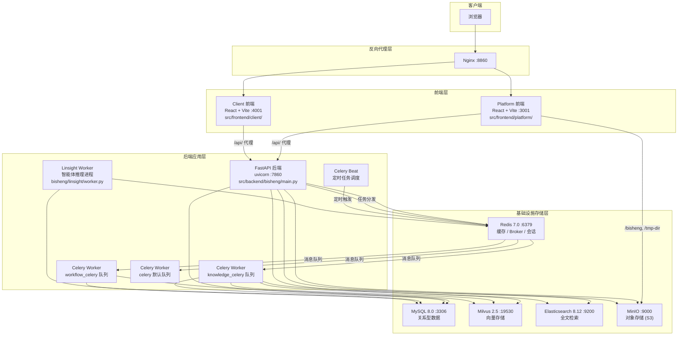

# 系统架构总览

BiSheng 是一个面向企业的 LLM 应用 DevOps 平台，采用**前后端分离 + 异步任务处理**的分层架构。系统由 7 个运行时进程组和 5 个基础设施服务构成，通过 Nginx 反向代理统一入口，FastAPI 后端承载核心业务逻辑，Celery Worker 集群处理耗时任务（知识库解析、工作流执行、遥测统计），Linsight Worker 独立运行智能体推理。后端代码遵循领域驱动设计（DDD）模式，每个业务模块按 `api/ -> domain/` 分层组织。

## 系统组件图



## 请求数据流

一个典型的用户请求从浏览器到数据存储层，经历以下路径：

```
浏览器
  |
  v
Nginx (:8860)            -- 反向代理，路由分发
  |
  v
Vite Dev Server (:3001)  -- 前端静态资源 + 开发热更新
  |  proxy /api/ /health
  v
FastAPI (:7860)           -- 后端 API，JWT 认证，路由分派
  |
  +---> Router (api/v1/ 或 api/v2/)
  |       |
  |       v
  |     Service 层 (业务逻辑)
  |       |
  |       +---> DAO 层 (database/models/) ---> MySQL
  |       |
  |       +---> Redis (缓存/会话)
  |       |
  |       +---> Celery Task ---> Redis Broker
  |                                  |
  |                                  +---> knowledge_celery Worker
  |                                  |       +---> Milvus (向量写入)
  |                                  |       +---> ES (全文索引)
  |                                  |       +---> MinIO (文件存储)
  |                                  |
  |                                  +---> workflow_celery Worker
  |                                          +---> LangGraph 执行引擎
  |
  +---> WebSocket
          |
          v
        ChatManager ---> 回调流式输出 ---> 队列缓冲 ---> 消息持久化 (MySQL)
```

**同步请求**：浏览器 -> Nginx -> Vite -> FastAPI -> Service -> DAO -> MySQL，原路返回 JSON 响应。

**异步任务**：FastAPI 将耗时操作（文档解析、工作流执行、遥测统计）投递到 Redis 消息队列，由对应的 Celery Worker 异步消费处理。

**WebSocket 通信**：聊天场景通过 WebSocket 连接建立长连接，ChatManager 管理消息订阅，通过回调机制实现流式输出。

## API 路由架构

后端提供两套 API 路由，定义在 `src/backend/bisheng/api/router.py`：

### v1 路由 (`/api/v1`) -- 面向前端

v1 路由面向前端应用，提供完整的 CRUD 操作界面。共注册 29 个子路由：

| 路由模块 | 来源 | 职责 |
|---------|------|------|
| `chat_router` | `api/v1/` | 对话管理 |
| `knowledge_router` | `knowledge/api/` | 知识库 CRUD |
| `knowledge_space_router` | `knowledge/api/` | 知识空间管理 |
| `qa_router` | `knowledge/api/` | 问答检索 |
| `workflow_router` | `api/v1/` | 工作流管理 |
| `assistant_router` | `api/v1/` | AI 助手管理 |
| `llm_router` | `llm/api/` | 模型供应商管理 |
| `user_router` | `api/v1/` | 用户认证与管理 |
| `group_router` | `api/v1/` | 用户组/RBAC |
| `tool_router` | `api/v1/` | 工具集成 |
| `evaluation_router` | `api/v1/` | 模型评测 |
| `finetune_router` | `finetune/api/` | 模型微调 |
| `server_router` | `finetune/api/` | 微调服务器 |
| `linsight_router` | `linsight/api/` | 灵思智能体 |
| `session_router` | `chat_session/api/` | 会话管理 |
| `channel_router` | `channel/api/` | 渠道集成 |
| `message_router` | `message/api/` | 消息收件箱 |
| `share_link_router` | `share_link/api/` | 公开分享链接 |
| `telemetry_search_router` | `telemetry_search/api/` | 遥测数据检索 |
| `flows_router` | `api/v1/` | Flow 管理 |
| `workstation_router` | `api/v1/` | 工作台 |
| `skillcenter_router` | `api/v1/` | 技能中心 |
| `endpoints_router` | `api/v1/` | 通用端点 |
| `variable_router` | `api/v1/` | 变量管理 |
| `report_router` | `api/v1/` | 报告生成 |
| `audit_router` | `api/v1/` | 审计日志 |
| `tag_router` | `api/v1/` | 标签管理 |
| `mark_router` | `api/v1/` | 数据标注 |
| `invite_code_router` | `api/v1/` | 邀请码 |

### v2 路由 (`/api/v2`) -- 面向外部集成

v2 路由采用 RPC 风格，面向外部系统集成，提供简化的编程接口。共 6 个子路由：

| 路由模块 | 来源 | 职责 |
|---------|------|------|
| `knowledge_router_rpc` | `open_endpoints/api/` | 知识库操作 |
| `filelib_router_rpc` | `open_endpoints/api/` | 文件库操作 |
| `chat_router_rpc` | `open_endpoints/api/` | 对话接口 |
| `assistant_router_rpc` | `open_endpoints/api/` | 助手调用 |
| `workflow_router_rpc` | `open_endpoints/api/` | 工作流触发 |
| `llm_router_rpc` | `open_endpoints/api/` | LLM 调用（含 OpenAI 兼容接口） |

## 应用启动生命周期

FastAPI 应用的启动和关闭由 `lifespan` 上下文管理器编排（`src/backend/bisheng/main.py` 第 51-58 行）：

```python
@asynccontextmanager
async def lifespan(app: FastAPI):
    await initialize_app_context(config=settings)  # 阶段 1：初始化基础设施
    await init_default_data()                       # 阶段 2：初始化默认数据
    yield                                           # 应用运行中
    thread_pool.tear_down()                         # 阶段 3：关闭线程池
    await close_app_context()                       # 阶段 4：逆序关闭基础设施
```

### 阶段 1：基础设施初始化

`ApplicationContextManager`（`src/backend/bisheng/core/context/manager.py`）按依赖顺序逐一初始化 7 个基础设施上下文：

```
 序号   上下文管理器           依赖资源            职责
 ─────────────────────────────────────────────────────────────────
  1    DatabaseManager       database_url        MySQL 连接池与会话工厂
  2    RedisManager          redis_url           Redis 连接池
  3    MinioManager          minio config        MinIO S3 客户端
  4    EsConnManager         elasticsearch_url   Elasticsearch 主实例（业务检索）
  5    EsConnManager         elasticsearch_url   Elasticsearch 统计实例（遥测）
  6    HttpClientManager     (无)                HTTP 异步客户端
  7    PromptManager         (无)                提示词模板加载
```

所有上下文管理器继承 `BaseContextManager[T]` 基类，提供线程安全的延迟加载、健康检查和生命周期管理。关闭时按注册的逆序执行，确保依赖关系正确处理。

### 阶段 2：默认数据初始化

`init_default_data()`（`src/backend/bisheng/common/init_data.py`）负责：
- 数据库 Schema 迁移
- 创建管理员账号（首个注册用户自动获得管理员权限）
- 初始化默认角色和用户组
- 加载内置模板

### 中间件栈

请求进入路由处理前，依次经过三层中间件（`main.py` 第 78-87 行）：

```
请求入站
  |
  v
CORSMiddleware          -- 跨域资源共享，允许所有来源
  |
  v
CustomMiddleware        -- 请求日志记录 + X-Trace-ID 链路追踪
  |                        (src/backend/bisheng/utils/http_middleware.py)
  v
WebSocketLoggingMiddleware -- WebSocket 连接日志 + TraceID 注入
  |
  v
路由处理
```

## DDD 模块模式

后端业务模块遵循领域驱动设计的分层约定。以 `knowledge` 模块为例：

```
src/backend/bisheng/knowledge/
├── api/                              # API 层：路由定义与请求处理
│   ├── router.py                     #   路由注册
│   ├── dependencies.py               #   依赖注入（认证、权限）
│   └── endpoints/                    #   端点实现
│       ├── knowledge.py              #     知识库 CRUD
│       ├── knowledge_space.py        #     知识空间管理
│       └── qa.py                     #     问答检索
│
└── domain/                           # 领域层：核心业务逻辑
    ├── models/                       #   领域模型
    │   ├── knowledge.py
    │   ├── knowledge_file.py
    │   └── knowledge_space_file.py
    ├── schemas/                      #   Pydantic 数据传输对象
    │   ├── knowledge_schema.py
    │   ├── knowledge_file_schema.py
    │   ├── knowledge_rag_schema.py
    │   └── knowledge_space_schema.py
    ├── services/                     #   领域服务（业务逻辑）
    │   ├── knowledge_service.py
    │   ├── knowledge_file_service.py
    │   ├── knowledge_space_service.py
    │   ├── knowledge_permission_service.py
    │   └── ...
    ├── repositories/                 #   仓储层（数据访问抽象）
    │   ├── interfaces/               #     仓储接口定义
    │   │   ├── knowledge_repository.py
    │   │   └── knowledge_file_repository.py
    │   └── implementations/          #     仓储实现
    │       ├── knowledge_repository_impl.py
    │       └── knowledge_file_repository_impl.py
    └── utils.py                      #   领域工具函数
```

**调用链路**：`Router -> Endpoint -> Service -> Repository -> database/models/ (ORM)`

各业务模块均遵循此模式，但不强制所有层级都必须存在。较简单的模块（如 `tag`、`message`）可能省略 `repositories/` 层，直接在 Service 中调用 DAO。

## Celery 异步任务架构

Celery 应用定义在 `src/backend/bisheng/worker/main.py`，使用 Redis 作为消息 Broker。

### 任务队列

| 队列 | Worker 启动命令 | 职责 |
|------|----------------|------|
| `knowledge_celery` | `celery -A bisheng.worker.main worker -Q knowledge_celery` | 文档解析、Embedding 生成、向量写入 |
| `workflow_celery` | `celery -A bisheng.worker.main worker -Q workflow_celery` | 工作流 DAG 执行 |
| `celery` (默认) | `celery -A bisheng.worker.main worker` | 遥测统计收集 |

任务路由配置（`src/backend/bisheng/core/config/settings.py`）：

```python
task_routers = {
    "bisheng.worker.knowledge.*": {"queue": "knowledge_celery"},
    "bisheng.worker.workflow.*": {"queue": "workflow_celery"},
}
```

### Beat 定时任务

| 任务 | 执行时间 | 职责 |
|------|---------|------|
| `sync_mid_user_increment` | 每日 00:30 | 同步用户增量遥测 |
| `sync_mid_knowledge_increment` | 每日 00:30 | 同步知识库增量遥测 |
| `sync_mid_app_increment` | 每日 00:30 | 同步应用增量遥测 |
| `sync_mid_user_interact_dtl` | 每日 00:30 | 同步用户交互明细 |
| `sync_information_article` | 每日 05:30 | 同步情报中心文章 |

## 技术栈

### 后端

| 技术 | 版本 | 用途 |
|------|-----|------|
| Python | 3.10.14 | 运行时 |
| FastAPI | -- | Web 框架 |
| uvicorn | -- | ASGI 服务器 |
| SQLModel / SQLAlchemy | -- | ORM |
| Celery | 5.x | 异步任务队列 |
| LangGraph | 0.3.x | 工作流执行引擎 |
| LangChain | 0.3.x | LLM 编排框架 |
| Pydantic | v2 | 数据校验与序列化 |
| Loguru | -- | 结构化日志 |
| uv | -- | 依赖管理（替代 Poetry） |

### 前端

| 技术 | 版本 | 用途 |
|------|-----|------|
| React | 18.x | UI 框架 |
| TypeScript | -- | 类型安全 |
| Vite (SWC) | -- | 构建工具 |
| Zustand | -- | 状态管理 |
| Radix UI | -- | 无障碍组件库 |
| Tailwind CSS | -- | 原子化样式 |
| @xyflow/react | -- | 工作流画布 |
| Axios | -- | HTTP 客户端 |
| i18next | -- | 国际化（中/英/日） |
| recharts | -- | 图表可视化 |

### 基础设施

| 服务 | 版本 | 端口 | 用途 |
|------|-----|------|------|
| MySQL | 8.0 | 3306 | 关系型数据存储（用户、会话、模型配置等 24+ 张表） |
| Redis | 7.0 | 6379 | 缓存、Celery Broker、会话存储、Linsight 状态持久化 |
| Milvus | 2.5.10 | 19530 | 向量存储（RAG 稠密向量检索） |
| Elasticsearch | 8.12 | 9200 | 全文检索（BM25 关键词检索）、遥测数据存储 |
| MinIO | -- | 9000 | S3 兼容对象存储（文档文件、图片、模型文件） |

## 相关文档

- 工作流引擎设计 -- `docs/architecture/02-workflow-engine.md`
- 知识库/RAG 流水线 -- `docs/architecture/03-knowledge-rag-pipeline.md`
- 认证与权限体系 -- `docs/architecture/04-auth-rbac.md`
- 配置管理机制 -- `docs/architecture/05-configuration.md`
- 部署运维指南 -- `docs/architecture/06-deployment.md`
