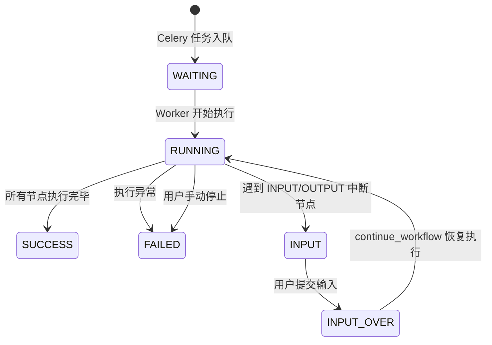

# 工作流引擎架构

BiSheng 工作流引擎是一个基于 LangGraph 的 DAG（有向无环图）执行引擎，负责将用户在前端画布上编排的工作流 JSON 编译为 LangGraph 状态机并驱动执行。引擎支持 14 种可执行节点类型（另有 1 种仅用于画布标注的 NOTE 节点），内置中断/恢复机制以支持人机交互场景，并通过 Celery 异步任务队列实现后台执行与横向扩展。

## 架构总览

```mermaid
graph TB
    subgraph 前端
        Canvas[工作流画布<br>@xyflow/react]
    end

    subgraph API层
        API[FastAPI Router<br>api/v1/workflow]
        Service[WorkFlowService<br>api/services/workflow]
    end

    subgraph Celery Worker
        Task[execute_workflow / continue_workflow<br>worker/workflow/tasks.py]
        RC[RedisCallback<br>worker/workflow/redis_callback.py]
    end

    subgraph 工作流引擎核心
        WF[Workflow<br>graph/workflow.py]
        GE[GraphEngine<br>graph/graph_engine.py]
        GS[GraphState<br>graph/graph_state.py]
        EM[EdgeManage<br>edges/edges.py]
        NF[NodeFactory<br>nodes/node_manage.py]
        SG[LangGraph StateGraph<br>+ MemorySaver]
    end

    subgraph 节点实现
        START[StartNode]
        LLM[LLMNode]
        INPUT[InputNode]
        OUTPUT[OutputNode]
        COND[ConditionNode]
        OTHER[其他节点...]
    end

    Canvas -->|工作流 JSON| API
    API --> Service
    Service -->|发送 Celery 任务| Task
    Task --> RC
    Task --> WF
    WF --> GE
    GE --> EM
    GE --> NF
    GE --> GS
    GE --> SG
    NF --> START
    NF --> LLM
    NF --> INPUT
    NF --> OUTPUT
    NF --> COND
    NF --> OTHER
    RC -.->|事件流| API
    API -.->|SSE/WebSocket| Canvas
```

## 节点类型注册表

所有节点类型定义在 `workflow/common/node.py` 的 `NodeType` 枚举中，节点类注册在 `workflow/nodes/node_manage.py` 的 `NODE_CLASS_MAP` 中。

| NodeType | 枚举值 | 节点类 | 源文件 | 说明 |
|----------|--------|--------|--------|------|
| START | `start` | `StartNode` | `nodes/start/start.py` | 工作流入口节点，每个工作流有且仅有一个 |
| END | `end` | `EndNode` | `nodes/end/end.py` | 工作流终止节点，可有多个 |
| INPUT | `input` | `InputNode` | `nodes/input/input.py` | 用户输入节点，暂停执行等待用户提交数据 |
| OUTPUT | `output` | `OutputNode` | `nodes/output/output.py` | 输出展示节点，支持选择性交互（输入/选择） |
| FAKE_OUTPUT | `fake_output` | `OutputFakeNode` | `nodes/output/output_fake.py` | OUTPUT 的辅助节点，处理中断判定逻辑（不在注册表中，由引擎自动创建） |
| LLM | `llm` | `LLMNode` | `nodes/llm/llm.py` | 大语言模型调用节点，支持流式输出 |
| AGENT | `agent` | `AgentNode` | `nodes/agent/agent.py` | 智能体节点，可调用工具完成复杂任务 |
| CODE | `code` | `CodeNode` | `nodes/code/code.py` | 自定义代码执行节点 |
| CONDITION | `condition` | `ConditionNode` | `nodes/condition/condition.py` | 条件分支节点，根据条件路由到不同下游 |
| TOOL | `tool` | `ToolNode` | `nodes/tool/tool.py` | 工具调用节点 |
| RAG | `rag` | `RagNode` | `nodes/rag/rag.py` | RAG 检索增强生成节点 |
| KNOWLEDGE_RETRIEVER | `knowledge_retriever` | `KnowledgeRetriever` | `nodes/knowledge_retriever/knowledge_retriever.py` | 知识库检索节点 |
| QA_RETRIEVER | `qa_retriever` | `QARetrieverNode` | `nodes/qa_retriever/qa_retriever.py` | QA 问答对检索节点 |
| REPORT | `report` | `ReportNode` | `nodes/report/report.py` | 报告生成节点 |
| NOTE | `note` | -- | -- | 画布标注节点，仅用于显示注释，不参与执行 |

所有路径前缀为 `src/backend/bisheng/workflow/`。

## 图引擎核心流程

`GraphEngine`（`workflow/graph/graph_engine.py`）是工作流执行的核心类，负责将工作流 JSON 数据编译为 LangGraph 状态机并驱动执行。

### 构建阶段

构造函数中按顺序完成以下步骤：

```
GraphEngine.__init__()
    |
    +-- build_edges()        # 1. 解析边数据，构建 EdgeManage
    |
    +-- build_nodes()        # 2. 构建节点与图结构
         |
         +-- init_nodes()            # 2a. 实例化所有节点
         |    +-- NodeFactory         #     通过工厂创建节点实例
         |    +-- add_node to graph   #     注册到 LangGraph StateGraph
         |    +-- 识别特殊节点         #     START / END / INPUT / OUTPUT
         |
         +-- build_node_level()      # 2b. 计算节点层级（BFS 最长路径）
         |
         +-- add_node_edge()         # 2c. 为每个节点添加边
         |    +-- 普通节点 → add_edge
         |    +-- CONDITION → add_conditional_edges
         |    +-- OUTPUT → 插入 FakeNode + conditional_edges
         |
         +-- build_more_fan_in_node() # 2d. 处理多入边汇聚节点
         |
         +-- compile()               # 2e. 编译 LangGraph 图
              +-- MemorySaver         #     启用检查点
              +-- interrupt_before    #     设置中断节点列表
```

### 关键内部状态

| 属性 | 类型 | 说明 |
|------|------|------|
| `nodes_map` | `Dict[str, BaseNode]` | 节点 ID 到节点实例的映射 |
| `nodes_fan_in` | `Dict[str, List[str]]` | 记录每个节点有哪些前驱节点 |
| `nodes_next_nodes` | `Dict[str, Set[str]]` | 记录每个节点的所有后续节点 |
| `node_level` | `Dict[str, int]` | 从 START 到每个节点的最长路径层级 |
| `condition_nodes` | `List[str]` | 所有互斥分支节点（CONDITION 和选择性交互的 OUTPUT） |
| `graph_state` | `GraphState` | 全局变量池 |
| `graph` | `CompiledStateGraph` | 编译后的 LangGraph 图 |

### 执行阶段

```python
# 首次执行
graph_engine.run()
  -> _run({'flag': True})
     -> graph.stream(input_data, config=graph_config)  # LangGraph 驱动

# 中断后恢复
graph_engine.continue_run(data={node_id: {key: value}})
  -> nodes_map[node_id].handle_input(node_params)       # 注入用户输入
  -> _run(None)                                          # 从检查点恢复
     -> graph.stream(None, config=graph_config)
```

执行配置：

```python
graph_config = {
    'configurable': {'thread_id': '1'},
    'recursion_limit': (节点数 - END节点数 - 1) * max_steps + END节点数 + 1
}
```

`recursion_limit` 根据节点数量和最大步数动态计算，确保循环工作流不会无限执行。

## GraphState 变量池

`GraphState`（`workflow/graph/graph_state.py`）是节点间数据传递的核心机制，每个 `GraphEngine` 实例持有一个 `GraphState` 对象。

### 变量存取

```
变量池结构: {node_id: {variable_key: value}}

写入: node._run() 返回 dict → GraphEngine 调用 graph_state.set_variable(node_id, key, value)
读取: 下游节点调用 graph_state.get_variable(node_id, key) 获取上游输出
```

### 变量引用格式

节点参数中通过字符串引用其他节点的输出变量，格式为：

```
{node_id}.{variable_key}           # 基础引用
{node_id}.{variable_key}#{index}   # 数组索引或字典键引用
```

`get_variable_by_str(contact_key)` 方法解析上述格式，支持从列表（按整数索引）或字典（按字符串键）中提取子元素。

### 对话历史

`GraphState` 还管理多轮对话历史，通过内置的 `ConversationBufferWindowMemory` 实现：

- `save_context(content, msg_sender)` -- 保存用户或 AI 的消息
- `get_history_memory(count)` -- 获取最近 N 条对话历史
- `get_history_list(count)` -- 获取消息对象列表

特殊变量键 `chat_history` 会自动路由到对话历史接口。

## 边管理与条件路由

`EdgeManage`（`workflow/edges/edges.py`）管理工作流中节点之间的连接关系。

### 边数据模型

```python
class EdgeBase:
    id: str              # 边唯一标识
    source: str          # 源节点 ID
    sourceHandle: str    # 源节点输出句柄
    target: str          # 目标节点 ID
    targetHandle: str    # 目标节点输入句柄
```

### 三种连边方式

引擎在 `add_node_edge()` 中根据节点类型使用不同的 LangGraph 连边策略：

1. **普通边** -- 用于大多数节点，直接调用 `graph_builder.add_edge(source, target)`
2. **条件边** -- 用于 `CONDITION` 节点，调用 `add_conditional_edges(node_id, route_node, mapping)`，由节点的 `route_node()` 方法动态决定下游
3. **OUTPUT 节点的特殊处理** -- OUTPUT 节点后自动插入一个 `OutputFakeNode`，通过 `add_edge` 连接 OUTPUT 到 FakeNode，再通过 `add_conditional_edges` 从 FakeNode 路由到实际下游

### 多入边汇聚（Fan-in）处理

当一个节点有多个前驱节点时（fan-in），引擎通过 `build_more_fan_in_node()` 和 `parse_fan_in_node()` 判断是否需要等待所有前驱完成：

- **互斥分支汇聚** -- 如果前驱节点来自 CONDITION 的不同互斥分支，则不需要等待（任一分支到达即可执行）
- **并行汇聚** -- 如果前驱节点是并行路径，则需要等待所有前驱完成后再执行（LangGraph 的 fan-in 语义）

判定算法通过 `get_all_edges_nodes()` 遍历所有从条件节点到目标节点的路径，检查是否存在两条完全不相交的路径来确定互斥关系。

## 回调系统

回调系统定义在 `workflow/callback/` 目录下，负责将引擎执行过程中的事件传递给外部消费者。

### BaseCallback 接口

`BaseCallback`（`workflow/callback/base_callback.py`）定义了以下回调方法：

| 回调方法 | 事件数据类 | 触发时机 |
|----------|-----------|----------|
| `on_node_start` | `NodeStartData` | 节点开始执行 |
| `on_node_end` | `NodeEndData` | 节点执行完成（含错误原因和日志数据） |
| `on_user_input` | `UserInputData` | INPUT 节点请求用户输入 |
| `on_guide_word` | `GuideWordData` | 引导语输出 |
| `on_guide_question` | `GuideQuestionData` | 推荐问题输出 |
| `on_stream_msg` | `StreamMsgData` | LLM 流式 token 输出 |
| `on_stream_over` | `StreamMsgOverData` | LLM 流式输出结束 |
| `on_output_msg` | `OutputMsgData` | OUTPUT 节点完整消息输出 |
| `on_output_choose` | `OutputMsgChooseData` | OUTPUT 节点选择交互 |
| `on_output_input` | `OutputMsgInputData` | OUTPUT 节点输入交互 |

### 事件数据结构

所有事件数据类定义在 `workflow/callback/event.py`，关键字段：

- `unique_id` -- 本次节点执行的唯一标识（UUID hex）
- `node_id` -- 节点 ID
- `name` -- 节点名称
- `msg` -- 消息内容
- `output_key` -- 输出变量键名
- `reasoning_content` -- LLM 推理过程内容（思维链）
- `source_documents` -- 溯源文档

### LLM 流式回调

`LLMNodeCallbackHandler`（`workflow/callback/llm_callback.py`）实现了 LangChain 的 `BaseCallbackHandler`，桥接 LLM 的流式输出到工作流回调系统：

- `on_llm_new_token` -- 每个 token 生成时触发 `on_stream_msg`
- `on_llm_end` -- 生成结束时触发 `on_stream_over`（流式）或 `on_output_msg`（命中缓存/非流式）
- 支持工具调用事件跟踪（`on_tool_start` / `on_tool_end` / `on_tool_error`）

## 中断与恢复机制

工作流引擎支持在执行过程中暂停等待用户输入，然后从暂停点恢复执行。这一机制基于 LangGraph 的 `interrupt_before` 功能实现。

### 中断触发

两种节点可以触发中断：

1. **INPUT 节点** -- 始终触发中断，等待用户输入表单数据或对话消息
2. **OUTPUT 节点**（通过 FakeNode）-- 当 OUTPUT 配置了交互式输入或选择时触发

引擎在编译时将所有 INPUT 节点和 FakeNode 加入 `interrupt_before` 列表。当 LangGraph 执行到这些节点前，会自动暂停并返回控制权。

### 状态判定

`judge_status()` 方法在每次 `graph.stream()` 返回后检查状态：

```
graph.stream() 返回
    |
    +-- snapshot = graph.get_state(config)
    +-- next_nodes = snapshot.next
    |
    +-- next_nodes 为空 → WorkflowStatus.SUCCESS
    +-- next_nodes 包含 INPUT → WorkflowStatus.INPUT
    |   +-- 触发 on_user_input 回调
    +-- next_nodes 包含 FAKE_OUTPUT → WorkflowStatus.INPUT
```

### 恢复流程

```
用户提交输入
    |
    +-- RedisCallback.set_user_input(data)    # 写入 Redis
    +-- continue_workflow.delay(...)           # 触发 Celery 任务
    |
    +-- Workflow.run(input_data)
         +-- graph_engine.continue_run(data)
              +-- nodes_map[node_id].handle_input(params)  # 注入输入
              +-- _run(None)                                # 从检查点恢复
                   +-- graph.stream(None, config)
```

### 状态机



## Celery 异步执行

工作流通过 Celery 在独立的 Worker 进程中异步执行，避免阻塞 API 服务器。相关代码在 `worker/workflow/` 目录下。

### 任务定义

文件 `worker/workflow/tasks.py` 定义了三个 Celery 任务：

| 任务 | 函数 | 队列 | 说明 |
|------|------|------|------|
| 执行工作流 | `execute_workflow` | `workflow_celery` | 首次启动工作流执行 |
| 恢复工作流 | `continue_workflow` | `workflow_celery` | 用户输入后恢复暂停的工作流 |
| 停止工作流 | `stop_workflow` | `workflow_celery` | 强制停止运行中的工作流 |

### 执行流程

```
API 请求
    |
    +-- RedisCallback.set_workflow_data(data)      # 工作流数据写入 Redis
    +-- RedisCallback.set_workflow_status(WAITING)  # 状态设为等待
    +-- execute_workflow.delay(unique_id, ...)       # 投递 Celery 任务
    |
    +-- API 返回 SSE 流
         +-- RedisCallback.get_response_until_break()  # 轮询事件队列
```

### RedisCallback

`RedisCallback`（`worker/workflow/redis_callback.py`）继承 `BaseCallback`，是异步执行场景下的核心回调实现。它承担以下职责：

1. **事件桥接** -- 将引擎回调事件序列化为 `ChatResponse`，写入 Redis 列表（`workflow:{unique_id}:event`）
2. **状态管理** -- 在 Redis 中维护工作流状态（`workflow:{unique_id}:status`）
3. **数据传递** -- 通过 Redis 存储工作流 JSON 数据和用户输入
4. **消息持久化** -- 将输出消息保存到数据库（ChatMessage），管理会话生命周期
5. **停止信号** -- 通过 Redis key 传递停止信号（`workflow:{unique_id}:stop`）

Redis 键命名规范：

| Redis Key | 用途 | 过期时间 |
|-----------|------|----------|
| `workflow:{unique_id}:data` | 工作流 JSON 数据 | timeout + 60s |
| `workflow:{unique_id}:status` | 执行状态与失败原因 | 7 天 |
| `workflow:{unique_id}:event` | 事件消息队列 | timeout + 60s |
| `workflow:{unique_id}:input` | 用户输入数据 | timeout + 60s |
| `workflow:{unique_id}:stop` | 停止信号 | 24 小时 |

### 工作流对象缓存

Worker 进程内维护全局字典 `_global_workflow` 缓存暂停中的 `Workflow` 对象。当工作流进入 INPUT 状态时，对象保留在内存中以便恢复时跳过重新构建。执行完成或失败时从缓存中清除。

`StatefulWorker` 机制确保同一工作流的 `execute_workflow` 和 `continue_workflow` 任务被路由到同一个 Worker 节点，保证内存中的 `Workflow` 对象可被正确访问。

## BaseNode 基类

所有可执行节点继承自 `BaseNode`（`workflow/nodes/base.py`），它定义了节点的标准生命周期。

### 节点执行生命周期

```python
def run(self, state: dict) -> Any:
    # 1. 检查停止标志
    if self.stop_flag:
        raise IgnoreException('stop by user')

    # 2. 检查最大执行次数
    if self.current_step >= self.max_steps:
        raise IgnoreException(f'{self.name} -- has run more than the maximum number of times.')

    # 3. 生成执行唯一 ID，触发 on_node_start 回调
    exec_id = uuid.uuid4().hex
    self.callback_manager.on_node_start(...)

    # 4. 调用子类实现的 _run(exec_id)
    result = self._run(exec_id)

    # 5. 解析执行日志
    log_data = self.parse_log(exec_id, result)

    # 6. 将返回结果存入 GraphState 全局变量池
    for key, value in result.items():
        self.graph_state.set_variable(self.id, key, value)

    # 7. 步数计数器递增
    self.current_step += 1

    # 8. 触发 on_node_end 回调（OUTPUT 节点例外，由 FakeNode 触发）
    self.callback_manager.on_node_end(...)
```

### 子类需要实现的方法

| 方法 | 是否必须 | 说明 |
|------|----------|------|
| `_run(unique_id)` | 必须 | 节点核心逻辑，返回 `Dict[str, Any]` 作为输出变量 |
| `parse_log(unique_id, result)` | 可选 | 返回节点执行日志，默认返回空列表 |
| `route_node(state)` | 条件节点必须 | 条件路由方法，返回目标节点 ID |
| `get_input_schema()` | 交互节点可选 | 返回用户输入表单描述 |
| `handle_input(user_input)` | 交互节点可选 | 处理用户输入数据 |

### Workflow 包装类

`Workflow`（`workflow/graph/workflow.py`）封装了 `GraphEngine`，增加超时管理和对话历史功能：

- 自动将用户输入保存到 `GraphState` 的对话历史中
- 在 `run()` 中循环调用 `continue_run()` 直到状态不再是 RUNNING（处理连续中断场景）
- 提供 `stop()` 方法向所有节点传播停止信号

## 配置

工作流相关配置在 `core/config/settings.py` 的 `WorkflowConf` 类中定义：

```python
class WorkflowConf(BaseModel):
    max_steps: int = 50    # 单个节点最大执行次数
    timeout: int = 720     # 超时时间（分钟）
```

- `max_steps` 限制单个节点在一次工作流执行中的最大运行次数，防止无限循环
- `timeout` 控制 Redis 中工作流数据的过期时间，以及等待用户输入的超时时间

## 扩展指南：添加新节点类型

以下是添加一个新节点类型的完整步骤：

### 1. 注册枚举值

在 `workflow/common/node.py` 的 `NodeType` 枚举中添加：

```python
class NodeType(Enum):
    # ... 已有类型
    MY_NODE = "my_node"
```

### 2. 实现节点类

在 `workflow/nodes/` 下创建目录和实现文件：

```
workflow/nodes/my_node/
    __init__.py
    my_node.py
```

节点类需继承 `BaseNode` 并实现 `_run` 方法：

```python
from bisheng.workflow.nodes.base import BaseNode

class MyNode(BaseNode):

    def __init__(self, **kwargs):
        super().__init__(**kwargs)
        # 从 self.node_params 中读取节点配置参数

    def _run(self, unique_id: str) -> dict:
        # 1. 通过 self.get_other_node_variable() 获取上游输出
        # 2. 执行节点逻辑
        # 3. 返回输出变量字典
        return {"output_key": "output_value"}

    def parse_log(self, unique_id: str, result: dict):
        # 可选：返回执行日志
        return [[{"key": "结果", "value": result.get("output_key"), "type": "variable"}]]
```

### 3. 注册到工厂

在 `workflow/nodes/node_manage.py` 中添加映射：

```python
from bisheng.workflow.nodes.my_node.my_node import MyNode

NODE_CLASS_MAP = {
    # ... 已有映射
    NodeType.MY_NODE.value: MyNode,
}
```

### 4. 条件节点特殊处理

如果新节点需要条件路由能力（类似 CONDITION），还需要：

- 重写 `is_condition_node()` 返回 `True`
- 实现 `route_node(state)` 方法返回目标节点 ID

## 相关文档

- 项目总体架构: `docs/architecture/README.md`
- 知识库/RAG 架构: 参见 `src/backend/bisheng/knowledge/`
- Celery Worker 配置: `src/backend/bisheng/worker/`
- 前端工作流画布: `src/frontend/platform/src/pages/BuildPage/flow/`
- 工作流 API 接口: `src/backend/bisheng/api/v1/workflow.py`

## 源码目录结构

```
src/backend/bisheng/workflow/
    common/
        node.py             # NodeType 枚举、BaseNodeData、NodeParams 数据模型
        workflow.py          # WorkflowStatus 枚举
    graph/
        graph_engine.py      # GraphEngine 核心引擎
        graph_state.py       # GraphState 变量池
        workflow.py          # Workflow 包装类
    edges/
        edges.py             # EdgeManage 边管理
    nodes/
        base.py              # BaseNode 抽象基类
        node_manage.py       # NodeFactory 工厂 + NODE_CLASS_MAP 注册表
        prompt_template.py   # 模板变量解析
        start/               # StartNode
        end/                 # EndNode
        input/               # InputNode
        output/              # OutputNode + OutputFakeNode
        llm/                 # LLMNode
        agent/               # AgentNode
        code/                # CodeNode
        condition/           # ConditionNode
        tool/                # ToolNode
        rag/                 # RagNode
        knowledge_retriever/ # KnowledgeRetriever
        qa_retriever/        # QARetrieverNode
        report/              # ReportNode
    callback/
        base_callback.py     # BaseCallback 抽象接口
        event.py             # 事件数据结构
        llm_callback.py      # LLM 流式回调适配器

src/backend/bisheng/worker/workflow/
    tasks.py                 # Celery 任务定义
    redis_callback.py        # RedisCallback 异步回调实现
```
