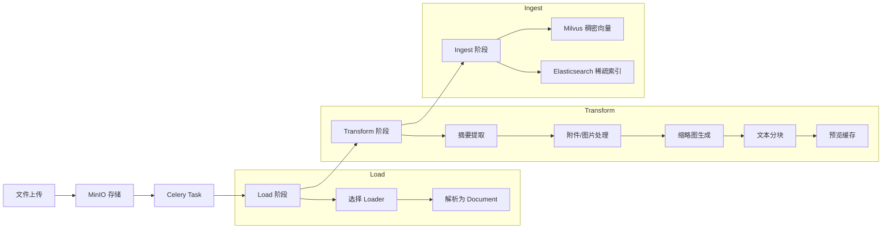

# 知识库与 RAG 管道

知识库模块是毕昇平台的核心业务领域之一，负责文档的上传、解析、向量化与检索。整个处理流程采用三阶段管道架构（Load、Transform、Ingest），文档内容同时写入 Milvus 稠密向量库和 Elasticsearch 稀疏索引，实现语义检索与关键词检索的双路召回。异步文件处理由 Celery Worker 驱动，通过 `knowledge_celery` 队列实现任务解耦。

## 1. 领域模型

### 1.1 Knowledge

`Knowledge` 实体（`knowledge/domain/models/knowledge.py`）是知识库的核心聚合根，主要字段如下：

| 字段 | 类型 | 说明 |
|------|------|------|
| `user_id` | int | 创建者用户 ID |
| `name` | str | 知识库名称（1-200 字符） |
| `type` | int | 知识库类型，取值见 `KnowledgeTypeEnum` |
| `description` | str | 描述 |
| `model` | str | Embedding 模型 ID |
| `collection_name` | str | Milvus Collection 名称 |
| `index_name` | str | Elasticsearch 索引名称 |
| `state` | int | 知识库状态，取值见 `KnowledgeState` |
| `auth_type` | AuthTypeEnum | 权限类型（PUBLIC / PRIVATE / APPROVAL） |
| `metadata_fields` | List[Dict] | 用户自定义元数据字段配置 |
| `is_released` | bool | 是否发布到知识广场 |

### 1.2 知识库类型（KnowledgeTypeEnum）

| 枚举值 | 数值 | 说明 |
|--------|------|------|
| NORMAL | 0 | 文档知识库 |
| QA | 1 | 问答知识库 |
| PRIVATE | 2 | 工作台个人知识库 |
| SPACE | 3 | 知识空间 |

### 1.3 知识库状态（KnowledgeState）

| 枚举值 | 数值 | 说明 |
|--------|------|------|
| UNPUBLISHED | 0 | 未发布 |
| PUBLISHED | 1 | 已发布（正常状态） |
| COPYING | 2 | 复制中 |
| REBUILDING | 3 | 重建中（切换 Embedding 模型时触发） |
| FAILED | 4 | 重建失败 |

### 1.4 KnowledgeFile

`KnowledgeFile` 实体（`knowledge/domain/models/knowledge_file.py`）记录知识库中每个文件的处理状态，主要字段：

| 字段 | 类型 | 说明 |
|------|------|------|
| `knowledge_id` | int | 所属知识库 ID |
| `file_name` | str | 文件名（最大 200 字符） |
| `file_type` | int | 0 = 目录，1 = 文件 |
| `file_source` | str | 来源（upload / channel / space_upload） |
| `md5` | str | 文件 MD5，用于去重 |
| `parse_type` | str | 解析方式（etl4lm / mineru / paddle_ocr / local） |
| `split_rule` | str | 分块规则 JSON |
| `status` | int | 处理状态，取值见 `KnowledgeFileStatus` |
| `object_name` | str | MinIO 中的源文件对象名 |
| `preview_file_object_name` | str | 预览文件对象名 |
| `bbox_object_name` | str | bbox 文件对象名（用于文档定位） |
| `user_metadata` | Dict | 用户自定义元数据值 |
| `remark` | str | 错误信息或备注 |

### 1.5 文件处理状态（KnowledgeFileStatus）

| 枚举值 | 数值 | 说明 |
|--------|------|------|
| PROCESSING | 1 | 解析中 |
| SUCCESS | 2 | 解析成功 |
| FAILED | 3 | 解析失败 |
| REBUILDING | 4 | 重建中 |
| WAITING | 5 | 排队等待 |
| TIMEOUT | 6 | 解析超时（超过 24 小时） |

### 1.6 QAKnowledge

`QAKnowledge` 实体用于问答型知识库，存储问答对：

- `questions`：问题列表（JSON 数组）
- `answers`：答案文本
- `source`：来源标识（0=未知，1=手动，2=审核，3=API，4=批量导入）
- `status`：QA 状态（0=禁用，1=启用，2=处理中，3=插入失败）

### 1.7 元数据字段（MetadataFieldType）

知识库支持为文件定义自定义元数据字段，字段类型包括：`STRING`、`NUMBER`、`TIME`。元数据值存储在 `KnowledgeFile.user_metadata` 中，同时同步到 Milvus 和 Elasticsearch 中，支持基于元数据的过滤检索。

## 2. DDD 分层结构

知识库模块采用领域驱动设计（DDD），目录结构如下：

```
knowledge/
  api/
    router.py                    # 路由导出：knowledge_router, qa_router, knowledge_space_router
    endpoints/
      knowledge.py               # 文档知识库 API
      knowledge_space.py         # 知识空间 API
      qa.py                      # 问答知识库 API
  domain/
    models/
      knowledge.py               # Knowledge 实体 + KnowledgeDao
      knowledge_file.py          # KnowledgeFile / QAKnowledge 实体 + DAO
    schemas/                     # 请求/响应 Pydantic Schema
    services/
      knowledge_service.py       # 核心业务逻辑
      knowledge_file_service.py  # 文件级操作（元数据修改等）
      knowledge_space_service.py # 知识空间业务逻辑
      knowledge_permission_service.py  # 权限校验
      knowledge_audit_telemetry_service.py  # 审计与遥测
      knowledge_metadata_service.py  # 元数据字段管理
    repositories/
      interfaces/
        knowledge_repository.py      # 知识库仓储接口
        knowledge_file_repository.py # 文件仓储接口
    knowledge_rag.py             # KnowledgeRag：向量存储初始化工具类
  rag/                           # RAG 管道实现
    base_file_pipeline.py        # 文件管道基类
    knowledge_file_pipeline.py   # 知识库文件管道
    preview_file_pipeline.py     # 预览文件管道
    milvus_factory.py            # Milvus 实例工厂
    elasticsearch_factory.py     # Elasticsearch 实例工厂
    pipeline/
      base.py                    # BasePipeline / NormalPipeline
      types.py                   # PipelineStage / PipelineConfig / PipelineResult
      loader/                    # 文档加载器
      transformer/               # 文档转换器
```

## 3. RAG 管道架构

### 3.1 整体流程



### 3.2 管道阶段定义

管道通过 `PipelineStage` 枚举控制执行深度，支持在任意阶段提前终止：

| 阶段 | 枚举值 | 说明 |
|------|--------|------|
| LOAD | 1 | 仅加载源文档，不做任何转换 |
| TRANSFORMER | 2 | 完成所有转换，但不写入向量库 |
| INGEST | 10 | 完整管道，包括写入向量存储（默认） |

### 3.3 管道执行流程

`NormalPipeline`（`knowledge/rag/pipeline/base.py`）是标准执行器，同时支持同步和异步模式：

1. 调用 `loader.load()` 将源文件解析为 `List[Document]`
2. 依次执行各 `transformer.transform_documents(docs)` 进行文档转换
3. 遍历所有 `vectorstore`，调用 `add_documents(docs)` 写入向量存储
4. 返回 `PipelineResult`，包含阶段标记、文档列表和耗时

`BaseFilePipeline`（`knowledge/rag/base_file_pipeline.py`）封装了文件类型到加载器/转换器的映射关系。`run()` 方法创建临时目录，根据文件扩展名查找 `FileExtensionMap`，动态初始化对应的 Loader 和 Transformer 链，然后交由 `NormalPipeline` 执行。

`KnowledgeFilePipeline`（`knowledge/rag/knowledge_file_pipeline.py`）继承 `BaseFilePipeline`，绑定 `KnowledgeFile` 数据库记录，负责从 MinIO 下载源文件并构造文件元数据（文档 ID、知识库 ID、上传者、更新者、时间戳、用户自定义元数据等）。

## 4. 文档加载器

### 4.1 文件类型映射

`FileExtensionMap` 定义了每种文件扩展名对应的加载器和转换器初始化方法：

| 文件扩展名 | 加载器 | 说明 |
|-----------|--------|------|
| pdf | `_init_pdf_loader` | 根据配置选择解析引擎（见下文） |
| doc, docx | `BishengWordLoader` | Word 文档加载 |
| ppt, pptx | `BishengPptLoader` | PowerPoint 加载 |
| txt, md | `BishengTextLoader` | 纯文本 / Markdown |
| html, htm | `BishengHtmlLoader` | HTML 页面 |
| xlsx, xls, csv | `ExcelLoader` | 表格文件（使用独立的 Excel 转换链） |
| png, jpg, jpeg, bmp | `_init_image_loader` | 图片（复用 PDF 解析引擎做 OCR） |

所有加载器继承 `BaseBishengLoader`（`knowledge/rag/pipeline/loader/base.py`），统一接收 `file_path`、`file_metadata`、`file_extension`、`tmp_dir` 四个参数，输出 LangChain `Document` 列表。加载器还维护 `bbox_list`（文本区域坐标信息）和 `local_image_dir`（提取的图片目录）供后续转换器使用。

### 4.2 PDF 解析引擎

PDF 文件的加载器通过 `KnowledgeConf.loader_provider` 配置项动态选择，支持以下引擎：

| 引擎 | 配置值 | 类 | 说明 |
|------|--------|-----|------|
| ETL4LM | `etl4lm` | `Etl4lmLoader` | 默认引擎，外部文档解析服务，支持版面分析和公式识别，超时 600 秒 |
| MineRU | `mineru` | `MineruLoader` | 替代解析服务，超时 60 秒，支持自定义 Headers |
| PaddleOCR | `paddle_ocr` | `PaddleOcrLoader` | 基于 OCR 的解析，适合扫描件，支持认证 Token |
| 本地解析 | 无配置 | `LocalPdfLoader` | 兜底方案，使用本地 PDF 库直接解析 |

解析引擎的选择逻辑位于 `BaseFilePipeline._init_pdf_loader()`：按配置的 `loader_provider` 值匹配，若对应引擎的 URL 为空则回退到本地解析。图片文件（png/jpg/jpeg/bmp）复用 PDF 解析引擎进行 OCR，如果回退到本地解析器则抛出不支持异常。

### 4.3 解析引擎配置

配置位于 `core/config/settings.py`，通过 `config.yaml` 的 `knowledge` 段加载：

```yaml
knowledge:
  loader_provider: "etl4lm"       # 可选: etl4lm, mineru, paddle_ocr
  etl4lm:
    url: "http://..."
    timeout: 600
    ocr_sdk_url: "http://..."
  mineru:
    url: "http://..."
    timeout: 60
    headers: {}
    request_kwargs: {}
  paddle_ocr:
    url: "http://..."
    timeout: 60
    auth_token: ""
```

## 5. 文档转换器

转换器位于 `knowledge/rag/pipeline/transformer/`，按顺序组成处理链，每个转换器实现 LangChain 的 `BaseDocumentTransformer` 接口：

| 转换器 | 类 | 说明 |
|--------|-----|------|
| 摘要提取 | `AbstractTransformer` | 利用 LLM 为文档生成摘要，可通过 `no_summary` 参数跳过 |
| 附件/图片处理 | `ExtraFileTransformer` | 处理文档中的内嵌图片，上传到 MinIO，可通过 `retain_images` 控制是否保留 |
| 缩略图生成 | `ThumbnailTransformer` | 为文档生成缩略图，可通过 `need_thumbnail` 参数控制 |
| 文本分块 | `SplitterTransformer` | 使用 `ElemCharacterTextSplitter` 进行文本切分 |
| 预览缓存 | `PreviewCacheTransformer` | 将解析结果写入 Redis 缓存，供前端预览使用 |

### 5.1 文本分块

`SplitterTransformer` 是管道中的关键转换步骤，核心参数：

- `separator`：自定义分隔符列表
- `separator_rule`：分隔符规则
- `chunk_size`：分块大小（默认 1000 字符）
- `chunk_overlap`：分块重叠（默认 100 字符）

分块完成后，每个 chunk 会附带 `chunk_index`（序号）、`bbox`（区域坐标 JSON）、`page`（所在页码）等元数据。单个 chunk 的文本长度上限为 10000 字符，超出则抛出异常。

### 5.2 Excel 专用转换链

Excel 类文件（xlsx/xls/csv）使用独立的转换链，跳过附件处理、缩略图和文本分块步骤，仅执行摘要提取和预览缓存。这是因为表格数据的分块逻辑由 `ExcelLoader` 在加载阶段直接完成，按行切片处理。

## 6. 向量存储策略

知识库采用双向量存储架构，文档同时写入 Milvus 和 Elasticsearch，实现混合检索：

### 6.1 Milvus（稠密向量）

- 用途：语义检索，基于 Embedding 相似度搜索
- 每个知识库对应一个 Collection（`Knowledge.collection_name`）
- 向量由知识库绑定的 Embedding 模型生成（`Knowledge.model` 字段指定模型 ID）
- 文档元数据字段包括：`document_id`、`knowledge_id`、`chunk_index`、`page`、`bbox`、`user_metadata` 等
- 初始化入口：`KnowledgeRag.init_knowledge_milvus_vectorstore()` / `MilvusFactory`

### 6.2 Elasticsearch（稀疏索引）

- 用途：关键词检索 / BM25 检索
- 每个知识库对应一个 Index（`Knowledge.index_name`）
- 存储文本原文和元数据（不含向量），通过全文索引实现关键词匹配
- 初始化入口：`KnowledgeRag.init_knowledge_es_vectorstore()` / `ElasticsearchFactory`

### 6.3 KnowledgeRag 工具类

`KnowledgeRag`（`knowledge/domain/knowledge_rag.py`）封装了向量存储的初始化逻辑，提供以下核心方法：

| 方法 | 说明 |
|------|------|
| `init_knowledge_milvus_vectorstore` | 初始化单个知识库的 Milvus 向量存储（异步） |
| `init_knowledge_es_vectorstore` | 初始化单个知识库的 ES 存储（异步） |
| `get_multi_knowledge_vectorstore_sync` | 批量初始化多个知识库的向量存储，用于跨知识库检索 |

以上方法均支持同步（`_sync` 后缀）和异步两种调用方式。Embedding 模型通过 `LLMService` 根据 `Knowledge.model` 字段动态加载。

## 7. 检索组件

### 7.1 bisheng_langchain 检索器

`bisheng_langchain` 扩展包（`src/backend/bisheng_langchain/rag/`）提供了多种检索器实现，用于 RAG 管道的检索阶段：

| 检索器 | 类 | 说明 |
|--------|-----|------|
| 关键词检索 | `KeywordRetriever` | 基于 Elasticsearch 的关键词匹配检索 |
| 基线向量检索 | `BaselineVectorRetriever` | 基于 Milvus 的标准向量相似度检索 |
| 混合检索 | `MixRetriever` | 结合向量检索和关键词检索 |
| 小块检索 | `SmallerChunksVectorRetriever` | 使用更小的分块进行精细检索，返回时映射回原始大块 |
| 集成检索 | `EnsembleRetriever` | 将多个检索器的结果进行融合排序 |

### 7.2 BishengRagPipeline

`BishengRagPipeline`（`bisheng_langchain/rag/bisheng_rag_pipeline.py`）是完整的 RAG 管道编排类，通过 YAML 配置文件驱动，整合以下组件：

- Embedding 模型初始化
- LLM 模型初始化
- Milvus 向量存储连接
- Elasticsearch 关键词存储连接
- 多检索器组合（通过 `EnsembleRetriever` 融合）
- QA Chain 问答生成

### 7.3 评分与评估

`bisheng_langchain/rag/scoring/` 提供了 RAG 质量评估工具：

- `RagScore`（`ragas_score.py`）：基于 RAGAS 框架的自动化评估
- `llama_index_score.py`：基于 LlamaIndex 的评估方法

### 7.4 Rerank

`bisheng_langchain/rag/rerank/` 提供检索结果重排序功能，在初步召回后对候选文档进行精排，提升检索精度。

## 8. 异步任务处理

知识库的文件处理全部由 Celery Worker 异步执行，任务定义位于 `worker/knowledge/`。

### 8.1 Worker 队列

知识库任务使用 `knowledge_celery` 队列，启动命令：

```bash
celery -A bisheng.worker.main worker -l info -c 20 -P threads -Q knowledge_celery -n knowledge@%h
```

### 8.2 Celery 任务

| 任务函数 | 文件 | 说明 |
|---------|------|------|
| `parse_knowledge_file_celery` | `file_worker.py` | 解析上传的文件，构建向量索引 |
| `retry_knowledge_file_celery` | `file_worker.py` | 重试失败的文件解析（先删除旧向量再重新解析） |
| `delete_knowledge_file_celery` | `file_worker.py` | 删除文件及其向量数据 |
| `file_copy_celery` | `file_worker.py` | 复制知识库（含文件、向量、ES 索引的完整复制） |
| `rebuild_knowledge_celery` | `rebuild_knowledge_worker.py` | 重建知识库索引（切换 Embedding 模型时使用） |
| QA 相关任务 | `qa.py` | 问答对的处理和向量化 |

### 8.3 文件解析流程

`parse_knowledge_file_celery` 的执行流程：

1. 从数据库查询 `KnowledgeFile` 记录，校验状态为 WAITING 或 PROCESSING
2. 将状态更新为 PROCESSING
3. 解析分块规则 `FileProcessBase`
4. 调用 `process_file_task()` 执行完整的 Load -> Transform -> Ingest 管道
5. 任务完成后检查文件记录是否仍存在（可能在解析期间被用户删除），若不存在则清理向量数据

### 8.4 知识库重建

`rebuild_knowledge_celery` 用于在切换 Embedding 模型后重建向量索引：

1. 查询所有 SUCCESS 和 REBUILDING 状态的文件
2. 删除 Milvus 中的旧向量数据（保留 ES 数据）
3. 将文件状态更新为 REBUILDING
4. 从 ES 中读取已有的 chunk 文本，使用新模型重新生成 Embedding 并写入 Milvus
5. 更新文件状态为 SUCCESS 或 FAILED
6. 更新知识库状态

### 8.5 知识库复制

`file_copy_celery` 实现知识库的完整复制：

1. 分页遍历源知识库的所有文件，通过 MD5 跳过已存在的文件
2. 复制 MinIO 中的源文件、PDF 预览文件、bbox 文件
3. 复制 Milvus 向量数据（按批次 1000 条插入）
4. 复制 ES 索引数据
5. 更新知识库状态为 PUBLISHED

## 9. 权限模型

### 9.1 知识库权限类型（AuthTypeEnum）

| 类型 | 说明 |
|------|------|
| PUBLIC | 公开，所有用户可访问 |
| PRIVATE | 私有，仅创建者和被授权者可访问 |
| APPROVAL | 审批，需申请后由管理者审批 |

### 9.2 权限校验

`KnowledgePermissionService`（`knowledge/domain/services/knowledge_permission_service.py`）提供集中式权限校验：

- `ensure_knowledge_read_async`：校验知识库读权限
- `ensure_knowledge_write_async`：校验知识库写权限

底层通过 `UserPayload.async_access_check()` 实现，基于 RBAC 模型：用户 -> 角色 -> 资源访问控制（`RoleAccessDao`）。管理员角色（role_id=1）拥有所有知识库的完整权限。

### 9.3 审计与遥测

`KnowledgeAuditTelemetryService`（`knowledge/domain/services/knowledge_audit_telemetry_service.py`）负责记录知识库操作的审计日志和遥测事件：

- 创建 / 删除知识库时记录审计日志
- 通过遥测服务上报知识库创建、删除等关键事件

## 10. 相关文档

- `docs/architecture/01-architecture-overview.md` -- 系统整体架构概述
- `src/backend/bisheng/core/config/settings.py` -- KnowledgeConf 配置定义
- `src/backend/bisheng/knowledge/` -- 知识库模块完整源码
- `src/backend/bisheng_langchain/rag/` -- RAG 检索器与评估工具
- `src/backend/bisheng/worker/knowledge/` -- Celery 异步任务定义
