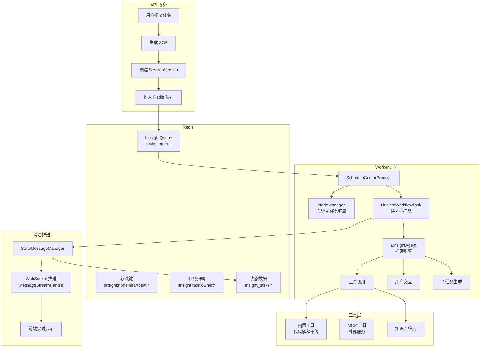
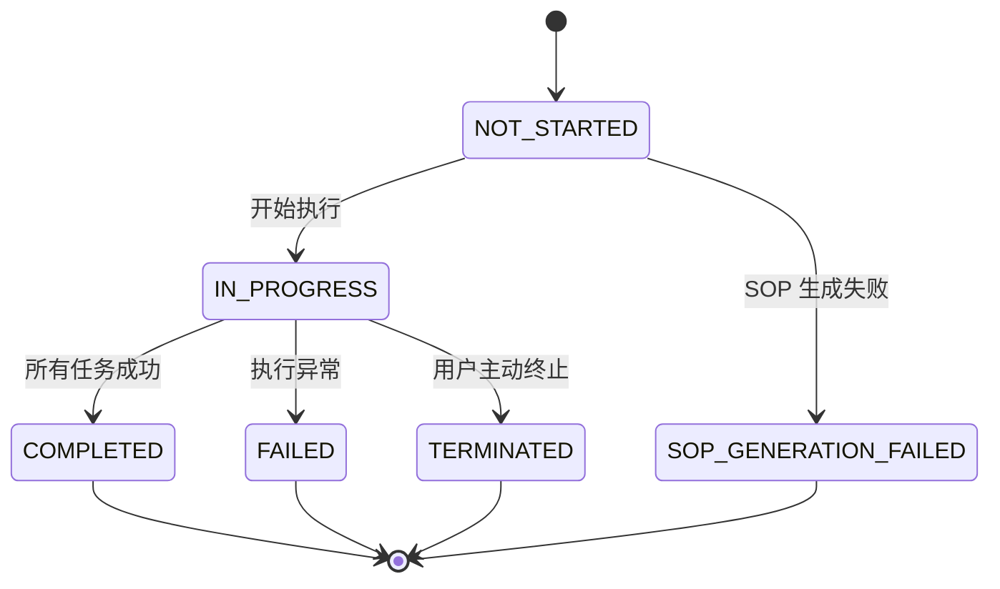
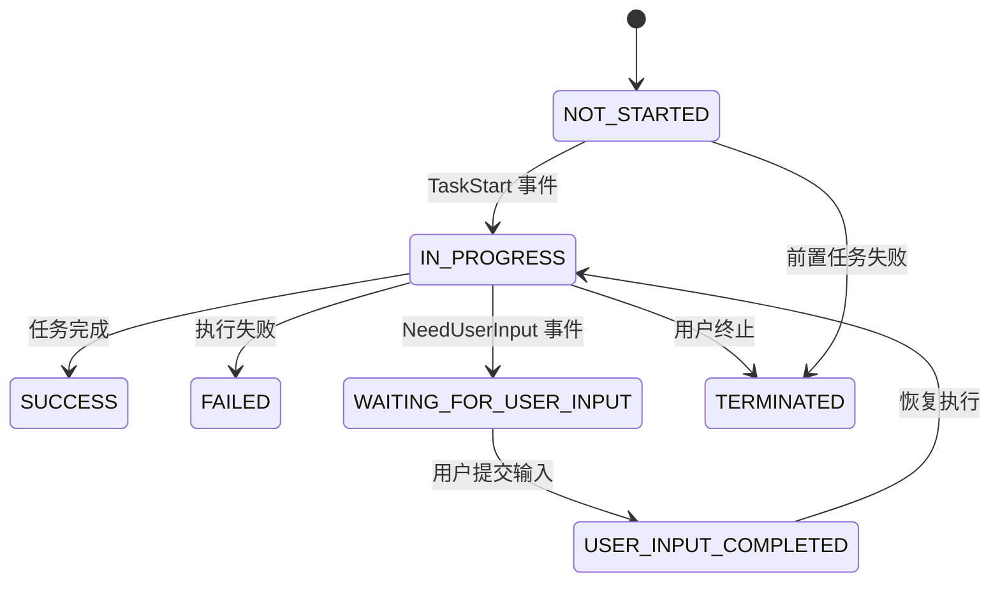

# Linsight Agent 框架与 MCP 协议集成

Linsight（灵思）是 BiSheng 平台内置的自主任务执行框架，面向需要多步骤推理、工具调用和人机交互的复杂任务场景。它通过 SOP（标准操作流程）将用户需求拆解为结构化的任务树，由 Agent 自主执行每个步骤，并在必要时暂停等待用户输入。MCP（Model Context Protocol）协议集成为 Linsight 和工作流引擎提供了统一的外部工具接入能力，支持 SSE、Standard I/O 和 Streamable HTTP 三种传输方式。

## 整体架构

Linsight 采用独立 Worker 进程架构，通过 Redis 队列与主 API 服务解耦。任务提交后进入 Redis FIFO 队列，由 Worker 进程消费并驱动 Agent 执行。



## 任务生命周期状态机

任务执行涉及两层状态：**会话版本状态**（SessionVersion）控制整体流程，**执行任务状态**（ExecuteTask）控制单个步骤。

### 会话版本状态（SessionVersionStatusEnum）



### 执行任务状态（ExecuteTaskStatusEnum）



## 事件系统

事件是 Agent 执行过程中向上层传递信息的核心机制。所有事件继承自 `BaseEvent`，包含 `task_id` 和 `timestamp` 两个基础字段。事件定义位于 `src/backend/bisheng_langchain/linsight/event.py`。

| 事件类型 | 类名 | 触发时机 | 核心字段 |
|---------|------|---------|---------|
| 任务开始 | `TaskStart` | Agent 开始处理某个任务 | `name` |
| 任务结束 | `TaskEnd` | Agent 完成某个任务 | `name`, `status`, `answer`, `data` |
| 执行步骤 | `ExecStep` | 工具调用开始或结束 | `call_id`, `call_reason`, `name`, `params`, `output`, `step_type`, `status` |
| 需要用户输入 | `NeedUserInput` | Agent 判断需要人工介入 | `call_reason`, `params`, `step_type="call_user_input"` |
| 生成子任务 | `GenerateSubTask` | 循环任务拆分出子步骤 | `subtask` (子任务列表) |

事件流转路径：Agent 产生事件 -> `TaskManage.aqueue` 异步队列 -> `LinsightWorkflowTask._handle_event()` 分发 -> `LinsightStateMessageManager` 持久化到 Redis 和数据库 -> `MessageStreamHandle` 通过 WebSocket 推送到前端。

`ExecStep` 的 `step_type` 区分不同类型的步骤：`tool_call` 表示工具调用，`react_step` 表示推理步骤或固定回答，`call_user_input` 表示用户输入请求。

## Worker 架构

Worker 以独立进程运行，与 API 服务完全解耦。启动命令：

```bash
.venv/bin/python bisheng/linsight/worker.py --worker_num 4 --max_concurrency 5
```

源码位于 `src/backend/bisheng/linsight/worker.py`。

### 核心组件

**LinsightQueue** — 基于 Redis List 的 FIFO 任务队列，键名为 `linsight:queue`。提供阻塞式消费（`get_wait`）和非阻塞消费（`get_nowait`），支持查询任务在队列中的位置（`index`）和删除指定任务（`remove`）。

**NodeManager** — 节点健康管理，单例模式。每个 Worker 进程持有唯一的 `node_id`（格式：`hostname-随机8位hex`），通过 Redis 心跳键（`linsight:node:heartbeat:{node_id}`）维持存活状态，心跳间隔 5 秒，TTL 15 秒。同时管理任务归属（`linsight:task:owner:{session_version_id}`），确保一个任务只在一个节点上执行。

**ScheduleCenterProcess** — 调度中心进程，继承自 `multiprocessing.Process`。每个 Worker 进程内部通过 `asyncio.Semaphore` 控制并发任务数。主循环：获取信号量 -> 从队列阻塞消费 -> 注册任务归属 -> 创建 `LinsightWorkflowTask` 异步任务 -> 任务完成后释放信号量。

### 进程模型

```
主进程 (worker.py __main__)
├── 检查并终止未完成任务
└── 启动 N 个 ScheduleCenterProcess (spawn 模式)
    ├── Process 1
    │   ├── NodeManager 心跳协程
    │   ├── Semaphore(max_concurrency)
    │   └── 主循环: 消费队列 → 创建异步任务
    ├── Process 2
    │   └── ...
    └── Process N
        └── ...
```

## 任务执行器（LinsightWorkflowTask）

`LinsightWorkflowTask`（位于 `src/backend/bisheng/linsight/domain/task_exec.py`）是单次任务执行的核心控制器，负责完整的执行生命周期。

### 执行流程

1. **资源初始化**：通过 `_managed_execution()` 上下文管理器，创建 `LinsightStateMessageManager`、校验会话状态（防止重复执行）、启动终止监控协程、初始化文件目录并下载用户上传的文件到本地临时目录。

2. **组件准备**：获取 LLM 实例（使用工作台配置的任务模型）、构建工具列表（用户配置的工具 + 内置 Linsight 工具如代码解释器）、创建 `LinsightAgent` 实例。

3. **任务生成**：调用 `agent.generate_task(sop)` 由 LLM 根据 SOP 拆解出结构化的任务步骤列表，保存到数据库和 Redis。

4. **任务执行**：启动两个并发协程——Agent 执行协程和终止监控协程。Agent 按顺序执行每个任务，产生的事件通过 `_handle_event()` 方法分发到对应的处理器。

5. **用户交互**：当 Agent 产生 `NeedUserInput` 事件时，任务暂停，等待用户通过 API 提交输入，支持文件上传。用户输入后调用 `agent.continue_task()` 恢复执行。

6. **资源清理**：无论成功或失败，清理终止监控协程和临时文件目录。

### 终止机制

用户可以主动终止正在执行的任务。终止监控协程每 2 秒检查 Redis 中会话状态是否被设置为 `TERMINATED`，一旦检测到终止信号，通过 `UserTerminationError` 异常中断 Agent 执行，并将所有未完成的子任务标记为 `TERMINATED`。

## bisheng_langchain 运行时

Agent 的推理和执行逻辑实现在 `src/backend/bisheng_langchain/linsight/` 包中，作为独立的 LangChain 扩展被主服务导入。

### LinsightAgent

`LinsightAgent`（`agent.py`）是面向上层的统一接口，核心职责：

- **SOP 生成**（`generate_sop`）：根据用户问题、可用工具和上传文件，调用 LLM 生成标准操作流程。支持流式输出，解析 `<Thought_END>` 标签分离思考过程和 SOP 内容。
- **SOP 反馈修改**（`feedback_sop`）：用户对生成的 SOP 提出修改意见后，结合历史摘要重新生成。
- **任务拆解**（`generate_task`）：将 SOP 文本交给 LLM 拆解为结构化的步骤列表（JSON），包含 `step_id`、`target`、`input` 依赖、`workflow` 等字段。
- **任务执行**（`ainvoke`）：创建 `TaskManage` 并依次执行所有任务，以异步迭代器方式产出事件。
- **恢复执行**（`continue_task`）：接收用户输入后恢复暂停的任务。

### TaskManage

`TaskManage`（`manage.py`）是任务调度器，管理任务树和工具集。关键设计：

- **任务树构建**（`rebuild_tasks`）：将 LLM 生成的任务 JSON 实例化为 `Task`（Function Calling 模式）或 `ReactTask`（ReAct 模式），处理父子关系和执行顺序。
- **工具 Schema 增强**：所有工具的参数 Schema 中自动注入 `call_reason` 必填字段，要求 LLM 在调用工具时说明原因。同时添加内置的 `call_user_input` 伪工具，用于触发用户输入事件。
- **执行调度**（`ainvoke_task`）：串行执行根任务，通过内部异步队列（`aqueue`）收集事件并向上层传递。
- **历史管理**：当工具调用历史超过 `tool_buffer` 配置的 token 数时，自动调用 LLM 进行摘要压缩。

### 执行模式

通过 `TaskMode` 枚举选择：

| 模式 | 类 | 特点 |
|------|-----|------|
| `func_call` | `Task` | 使用 LLM 的 Function Calling 能力，由模型直接选择工具和参数 |
| `react` | `ReactTask` | 使用 ReAct（Reasoning + Acting）模式，LLM 在文本中输出思考过程和工具调用指令 |

两种模式共享 `BaseTask` 基类，包含任务的完整上下文（查询、SOP、文件目录、历史记录、执行配置等），并实现相同的事件产出接口。

## 状态管理

状态管理由 `LinsightStateMessageManager`（位于 `src/backend/bisheng/linsight/domain/services/state_message_manager.py`）统一负责，采用 Redis 缓存 + MySQL 持久化的双写策略。

### Redis 键结构

```
linsight_tasks:{session_version_id}:session_version_info   # 会话版本信息（pickle 序列化）
linsight_tasks:{session_version_id}:messages                # 消息队列（Redis List）
linsight_tasks:{session_version_id}:execution_tasks:{task_id}  # 各任务执行状态
linsight:queue                                               # 全局任务队列
linsight:node:heartbeat:{node_id}                            # 节点心跳
linsight:task:owner:{session_version_id}                     # 任务归属
```

所有状态数据的 Redis 过期时间为 3600 秒（1 小时）。核心操作均带有重试机制（3 次重试，间隔 1 秒）。

### 消息事件类型（MessageEventType）

| 事件类型 | 含义 |
|---------|------|
| `TASK_GENERATE` | 任务列表生成完毕 |
| `TASK_START` | 单个任务开始执行 |
| `TASK_EXECUTE_STEP` | 任务执行步骤（工具调用等） |
| `TASK_END` | 单个任务执行完毕 |
| `USER_INPUT` | 需要用户输入 |
| `USER_INPUT_COMPLETED` | 用户输入完成 |
| `FINAL_RESULT` | 整体任务最终结果 |
| `ERROR_MESSAGE` | 执行错误 |
| `TASK_TERMINATED` | 任务被终止 |

消息通过 `MessageStreamHandle`（WebSocket 连接）实时推送到前端。当收到 `ERROR_MESSAGE`、`TASK_TERMINATED` 或 `FINAL_RESULT` 事件时，WebSocket 连接关闭。

## 数据模型

### LinsightSessionVersion

会话版本模型，记录一次完整的任务执行过程。位于 `src/backend/bisheng/linsight/domain/models/linsight_session_version.py`。

| 字段 | 类型 | 说明 |
|------|------|------|
| `id` | CHAR(36) | 主键，UUID |
| `session_id` | CHAR(36) | 关联的聊天会话 ID |
| `user_id` | int | 用户 ID |
| `question` | Text | 用户问题 |
| `tools` | JSON | 可用工具列表 |
| `files` | JSON | 上传文件列表 |
| `sop` | Text | SOP 内容 |
| `output_result` | JSON | 输出结果（包含 answer、final_files 等） |
| `status` | Enum | 会话版本状态 |
| `score` | int | 评分（1-5） |
| `has_reexecute` | bool | 是否重新执行过 |

### LinsightExecuteTask

执行任务模型，记录单个步骤的执行状态和历史。位于 `src/backend/bisheng/linsight/domain/models/linsight_execute_task.py`。

| 字段 | 类型 | 说明 |
|------|------|------|
| `id` | CHAR(36) | 主键，UUID |
| `session_version_id` | CHAR(36) | 关联的会话版本 ID |
| `parent_task_id` | CHAR(36) | 父任务 ID（子任务时有值） |
| `previous_task_id` | CHAR(36) | 前一个任务 ID |
| `next_task_id` | CHAR(36) | 下一个任务 ID |
| `task_type` | Enum | SINGLE（单任务）/ COMPOSITE（含子任务） |
| `task_data` | JSON | 任务数据（LLM 生成的原始信息） |
| `history` | JSON | 执行步骤记录列表 |
| `status` | Enum | 任务状态 |
| `result` | JSON | 任务结果 |

### LinsightSOP

SOP 模型，存储标准操作流程定义。位于 `src/backend/bisheng/linsight/domain/models/linsight_sop.py`。SOP 内容同时存储在 MySQL（全文）和向量库（前 10000 字符的向量索引 + Elasticsearch 关键词索引），支持语义检索和关键词混合检索。

## SOP 管理

SOP 管理服务（`SOPManageService`，位于 `src/backend/bisheng/linsight/domain/services/sop_manage.py`）提供 SOP 的完整生命周期管理：

- **创建**：将 SOP 内容写入 MySQL，同时在 Milvus（collection: `col_linsight_sop`）和 Elasticsearch 中建立索引。
- **检索**：使用 `EnsembleRetriever` 混合向量检索和关键词检索，权重各 50%。
- **批量导入**：支持从 Excel 文件批量导入 SOP，处理重名冲突（覆盖/另存/提示）。
- **SOP 记录**：任务执行后自动生成 `LinsightSOPRecord`，记录执行效果和评分。
- **向量库重建**：提供 `rebuild_sop_vector_store_task` 方法，支持在更换 Embedding 模型后重建全部向量索引。

## MCP 协议集成

MCP（Model Context Protocol）集成模块位于 `src/backend/bisheng/mcp_manage/`，为系统提供统一的外部工具接入能力。

### ClientManager 工厂

`ClientManager`（`manager.py`）是 MCP 客户端的工厂类，根据配置 JSON 自动识别传输类型并创建对应的客户端实例。

配置解析规则（`parse_mcp_client_type`）：
1. 若配置中包含 `type` 字段，直接使用其值作为传输类型。
2. 若配置中包含 `command` 字段，识别为 STDIO 类型。
3. 其他情况默认为 SSE 类型。

配置格式示例：

```json
{
  "mcpServers": {
    "my-tool-server": {
      "url": "http://localhost:8080/sse"
    }
  }
}
```

```json
{
  "mcpServers": {
    "local-tool": {
      "command": "python",
      "args": ["tool_server.py"]
    }
  }
}
```

```json
{
  "mcpServers": {
    "streamable-server": {
      "type": "streamable",
      "url": "http://localhost:8080/mcp"
    }
  }
}
```

### 传输层实现

所有客户端继承自 `BaseMcpClient` 抽象基类，统一实现 `get_transport()` 方法返回读写流，由基类的 `initialize()` 方法建立 `ClientSession`。

| 客户端 | 文件 | 传输协议 | 核心参数 |
|--------|------|---------|---------|
| `SseClient` | `clients/sse.py` | Server-Sent Events | `url` |
| `StdioClient` | `clients/stdio.py` | 标准输入/输出 | `command`, `args` |
| `StreamableClient` | `clients/streamable.py` | Streamable HTTP | `url` |

`BaseMcpClient` 提供两个核心方法：
- `list_tools()`：列出 MCP 服务器提供的所有工具。
- `call_tool(name, arguments)`：调用指定工具并返回 JSON 结果。

每次工具调用都会重新建立连接（`initialize()` 上下文管理器），适用于无状态的短连接场景。

### MCP 到 LangChain 适配器

`McpTool`（位于 `src/backend/bisheng/mcp_manage/langchain/tool.py`）负责将 MCP 工具桥接为 LangChain 的 `StructuredTool`，使其可被工作流节点（TOOL/AGENT）和 Linsight Agent 直接调用。

适配流程：

```
MCP 服务器
  ↓ list_tools()
工具元信息 (name, description, inputSchema)
  ↓ McpTool.get_mcp_tool()
LangChain StructuredTool
  ├── func = McpTool.run()        (同步，内部创建事件循环)
  └── coroutine = McpTool.arun()  (异步，直接调用 mcp_client.call_tool)
```

`McpTool` 在调用前会通过 `parse_kwargs_schema()` 根据工具的参数 Schema 对输入值进行类型转换（如将字符串 "123" 转换为整数 123），确保与 MCP 服务器的类型约定一致。

### 使用流程

1. 用户在系统中配置 MCP 服务器的 JSON 配置（包含 `mcpServers` 字段）。
2. `ClientManager.parse_mcp_client_type()` 解析传输类型和连接参数。
3. `ClientManager.sync_connect_mcp()` 创建对应的客户端实例。
4. 调用 `list_tools()` 获取可用工具列表。
5. 通过 `McpTool.get_mcp_tool()` 将每个 MCP 工具包装为 `StructuredTool`。
6. 包装后的工具可在工作流 TOOL/AGENT 节点和 Linsight Agent 中使用。

## 配置参考

### LinsightConf

位于 `src/backend/bisheng/core/config/settings.py`，通过 `config.yaml` 的 `linsight_conf` 字段配置。

| 参数 | 默认值 | 说明 |
|------|--------|------|
| `debug` | `false` | 调试模式，开启后记录 LLM 输入输出 |
| `tool_buffer` | `100000` | 工具执行历史的最大 token 数，超过后自动摘要 |
| `max_steps` | `200` | 单个任务最大执行步骤数，防止死循环 |
| `retry_num` | `3` | 模型调用失败重试次数 |
| `retry_sleep` | `5` | 重试间隔（秒） |
| `max_file_num` | `5` | SOP 生成时 prompt 中放入的用户文件数量 |
| `max_knowledge_num` | `20` | SOP 生成时 prompt 中放入的知识库数量 |
| `default_temperature` | `0` | 默认模型温度 |
| `retry_temperature` | `1` | ReAct 模式 JSON 解析失败后重试时的模型温度 |
| `file_content_length` | `5000` | 拆分子任务时读取文件内容的字符数上限 |
| `max_file_content_num` | `3` | 拆分子任务时读取的中间过程文件数量 |

### McpConf

位于同一配置文件，通过 `config.yaml` 的 `mcp` 字段配置。

| 参数 | 默认值 | 说明 |
|------|--------|------|
| `enable_stdio` | `true` | 是否启用 STDIO 类型的 MCP 客户端 |

## 相关文档

- [01-architecture-overview.md](01-architecture-overview.md) — 系统整体架构
