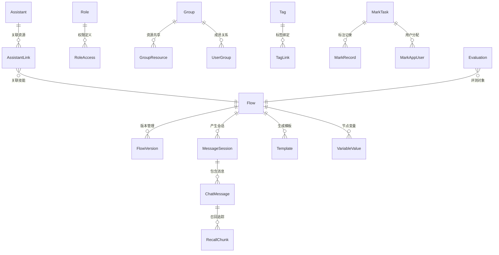

# 数据模型与存储层

BiSheng 的持久化层由 MySQL 中的 24 个 SQLModel ORM 模型和 5 种异构存储引擎协同组成。关系型数据（用户、应用、会话、权限等）存储在 MySQL 中，通过统一的 DAO 模式提供同步/异步访问；向量数据存入 Milvus，关键词索引交给 Elasticsearch，文件对象托管于 MinIO，会话状态和缓存则由 Redis 承载。所有存储引擎的连接生命周期由 `core/context/` 下的上下文管理系统统一编排。

## 核心模型清单

以下 24 个模型文件位于 `src/backend/bisheng/database/models/` 目录下：

| 模型类 | 文件 | 用途 |
|--------|------|------|
| `Flow` | `flow.py` | 应用/工作流/助手的统一定义，包含名称、JSON 画布数据、状态、类型 |
| `FlowVersion` | `flow_version.py` | 应用版本控制，每个版本独立保存画布数据快照 |
| `Assistant` | `assistant.py` | AI 助手配置，包含系统提示词、模型参数、温度等 |
| `AssistantLink` | `assistant.py` | 助手关联表，连接助手与工具、技能、知识库 |
| `Template` | `template.py` | 应用模板，预置的工作流/助手模板 |
| `ChatMessage` | `message.py` | 聊天消息记录，支持 LONGTEXT 消息体、点赞、敏感词状态 |
| `MessageSession` | `session.py` | 会话记录，关联应用与用户，汇总互动统计 |
| `Role` | `role.py` | 角色定义，内置管理员角色(ID=1)和默认角色(ID=2) |
| `RoleAccess` | `role_access.py` | 角色权限映射，定义角色对各类资源的读写权限 |
| `Group` | `group.py` | 用户组，默认组 ID=2 |
| `GroupResource` | `group_resource.py` | 用户组资源共享映射 |
| `UserGroup` | `user_group.py` | 用户-组关联表，含组管理员标识 |
| `UserLink` | `user_link.py` | 用户关联信息（如常用应用等） |
| `Tag` | `tag.py` | 标签定义，区分知识库标签和应用标签 |
| `TagLink` | `tag.py` | 标签-资源关联表，支持多资源类型绑定 |
| `Dataset` | `dataset.py` | 微调数据集元数据 |
| `Evaluation` | `evaluation.py` | 评测任务，记录执行状态、评分结果、结果文件路径 |
| `Report` | `report.py` | 报告模板与生成记录 |
| `VariableValue` | `variable_value.py` | 工作流节点变量值持久化 |
| `RecallChunk` | `recall_chunk.py` | RAG 召回追踪，记录每次检索的关键词与命中分块 |
| `InviteCode` | `invite_code.py` | 邀请码管理，支持批次、用量限制 |
| `AuditLog` | `audit_log.py` | 审计日志，记录用户操作行为与 IP 地址 |
| `MarkTask` | `mark_task.py` | 数据标注任务定义 |
| `MarkRecord` | `mark_record.py` | 标注记录，关联任务与会话 |
| `MarkAppUser` | `mark_app_user.py` | 标注任务的应用-用户分配 |

## 模型关系图



## 模型分类详解

### 应用层模型

**Flow** 是系统中最核心的模型，通过 `flow_type` 枚举统一承载六种应用类型：

| 枚举值 | FlowType | 说明 |
|--------|----------|------|
| 5 | `ASSISTANT` | AI 助手 |
| 10 | `WORKFLOW` | 工作流 |
| 15 | `WORKSTATION` | 工作台 |
| 20 | `LINSIGHT` | 灵思模式 |
| 25 | `CHANNEL_ARTICLE` | 频道文章助手 |
| 30 | `KNOLEDGE_SPACE` | 知识空间 |

`Flow.data` 字段以 JSON 格式存储完整的画布定义（包含 `nodes` 和 `edges`），创建时会自动校验 JSON 结构。`FlowVersion` 为每个应用维护独立的版本链，`is_current` 标记当前生效版本。

`Flow.status` 控制应用上下线状态：`OFFLINE(1)` 表示离线编辑中，`ONLINE(2)` 表示已上线可用。

**Assistant** 独立存储助手的 LLM 配置（model_name、temperature、max_token、system_prompt），通过 **AssistantLink** 关联表将助手与工具(tool_id)、技能(flow_id)、知识库(knowledge_id)三类资源建立多对多关系。

### 会话与消息模型

**MessageSession** 以 `chat_id` 为主键，记录用户与应用的一次完整对话会话。包含会话统计字段（like、dislike、copied）和敏感词审核状态。`group_ids` 以 JSON 数组存储所属用户组，支持按组过滤会话。

**ChatMessage** 存储具体的消息内容，`message` 字段使用 MySQL LONGTEXT 类型以支持超长回复。关键字段包括：

- `is_bot` -- 区分用户消息与 AI 回复
- `type` / `category` -- 消息类型分类（如 question、answer）
- `liked` / `solved` -- 用户反馈（0 未评/1 赞/2 踩）
- `intermediate_steps` -- 推理过程日志（Text 类型）
- `files` -- 关联的上传文件
- `sensitive_status` -- 敏感词检测结果（1 通过/2 违规）

表级别设置 `utf8mb4` 字符集以支持 emoji 等特殊字符。

### RBAC 权限模型

权限体系采用 **用户 - 用户组 - 角色 - 权限** 四层结构：

```
User ──┬── UserGroup ──── Group
       │                    │
       └── UserRole ─────  Role ──── RoleAccess
                                        │
                           GroupResource ┘
```

**RoleAccess** 通过 `AccessType` 枚举定义 13 种权限类型：

| 编码 | AccessType | 说明 |
|------|-----------|------|
| 1 | `KNOWLEDGE` | 知识库读权限 |
| 3 | `KNOWLEDGE_WRITE` | 知识库写权限 |
| 5 | `ASSISTANT_READ` | 助手读权限 |
| 6 | `ASSISTANT_WRITE` | 助手写权限 |
| 7 | `GPTS_TOOL_READ` | 工具读权限 |
| 8 | `GPTS_TOOL_WRITE` | 工具写权限 |
| 9 | `WORKFLOW` | 工作流读权限 |
| 10 | `WORKFLOW_WRITE` | 工作流写权限 |
| 11 | `DASHBOARD` | 看板读权限 |
| 12 | `DASHBOARD_WRITE` | 看板写权限 |
| 99 | `WEB_MENU` | 前端菜单栏权限 |

**GroupResource** 通过 `ResourceTypeEnum` 定义资源类型（KNOWLEDGE=1, ASSISTANT=3, GPTS_TOOL=4, WORK_FLOW=5, DASHBOARD=6, WORKSTATION=7, SPACE_FILE=8），将资源共享到指定用户组。

**UserGroup** 是用户与组的多对多关联表，`is_group_admin` 标识该用户是否为组管理员。

### 业务支撑模型

- **Evaluation** -- 评测任务模型，通过 `exec_type`（flow/assistant/workflow）和 `unique_id` 关联被评测的应用，`status` 追踪执行状态（1 运行中/2 失败/3 成功），`result_score` 以 JSON 存储评分结果
- **Dataset** -- 微调数据集，`object_name` 指向 MinIO 中的数据文件
- **Report** -- 报告模板与生成记录，`object_name` 指向 MinIO 中的模板文件
- **Tag / TagLink** -- 标签系统，`business_type` 区分知识库标签（`knowledge_space`）与应用标签（`application`），TagLink 通过唯一约束（resource_id + resource_type + tag_id）防止重复绑定
- **VariableValue** -- 工作流节点变量持久化，记录 flow_id、version_id、node_id 和变量值，`value_type` 区分文本(1)、列表(2)、文件(3)
- **RecallChunk** -- RAG 召回追踪，关联 message_id 和 chat_id，记录检索关键词（keywords）和命中的文档分块（chunk）及元数据
- **InviteCode** -- 邀请码管理，支持批次（batch_id/batch_name）、用量限制（limit/used）和用户绑定

### 标注模型

标注系统由三个模型协作：

- **MarkTask** -- 标注任务定义，包含创建者、关联应用 ID、标注人员列表（process_users），状态枚举为 DEFAULT(1)/DONE(2)/ING(3)
- **MarkRecord** -- 标注记录，关联 task_id 和 session_id，追踪每条会话的标注状态
- **MarkAppUser** -- 标注任务中的应用-用户分配关系

### 审计模型

**AuditLog** 记录系统中的关键操作行为。`system_id` 标识操作所属模块（chat/build/knowledge/system/dashboard 等），`event_type` 记录具体行为（如 create_chat、delete_knowledge、user_login），`object_type` 标识操作对象类型（work_flow/assistant/knowledge 等），并记录操作者 IP 地址。主键使用 UUID 格式。

## DAO 模式

所有模型文件遵循统一的三层结构：**Base Schema -> Model(table=True) -> Dao 类**。

### 基类

所有模型继承自 `SQLModelSerializable`（定义在 `common/models/base.py`），它扩展了 SQLModel 并默认以 JSON 模式序列化：

```python
class SQLModelSerializable(SQLModel):
    model_config = ConfigDict(from_attributes=True)

    def model_dump(self, **kwargs) -> Dict[str, Any]:
        if 'mode' not in kwargs:
            kwargs['mode'] = 'json'
        return super().model_dump(**kwargs)
```

### 三层结构

以 Flow 为例说明典型的模型文件组织方式：

```python
# 1. Base Schema -- 定义字段、校验逻辑，不映射数据库表
class FlowBase(SQLModelSerializable):
    name: str = Field(index=True)
    user_id: Optional[int] = Field(default=None, index=True)
    data: Optional[Dict] = Field(default=None)
    status: Optional[int] = Field(default=1)
    flow_type: Optional[int] = Field(default=FlowType.WORKFLOW.value)
    create_time: Optional[datetime] = Field(...)
    update_time: Optional[datetime] = Field(...)

# 2. Model -- 映射数据库表，声明主键和特殊列类型
class Flow(FlowBase, table=True):
    id: str = Field(default_factory=generate_uuid, primary_key=True, unique=True)
    data: Optional[Dict] = Field(default=None, sa_column=Column(JSON))

# 3. Read/Create/Update Schema -- API 层的请求/响应模型
class FlowRead(FlowBase):
    id: str
    user_name: Optional[str] = None

class FlowCreate(FlowBase):
    flow_id: Optional[str] = None

class FlowUpdate(SQLModelSerializable):
    name: Optional[str] = None
    description: Optional[str] = None

# 4. Dao 类 -- 数据访问对象，封装 CRUD 操作
class FlowDao(FlowBase):

    @classmethod
    def create_flow(cls, flow_info: Flow, flow_type: Optional[int]) -> Flow:
        with get_sync_db_session() as session:
            session.add(flow_info)
            session.commit()
            session.refresh(flow_info)
            return flow_info

    @classmethod
    async def aget_flow_by_id(cls, flow_id: str) -> Flow:
        async with get_async_db_session() as session:
            statement = select(Flow).where(Flow.id == flow_id)
            result = await session.exec(statement)
            return result.first()
```

### Dao 方法命名约定

| 前缀 | 含义 | 示例 |
|------|------|------|
| `get_` | 同步查询 | `get_one_assistant()` |
| `aget_` | 异步查询 | `aget_one_assistant()` |
| `create_` | 同步创建 | `create_flow()` |
| `update_` | 同步更新 | `update_version()` |
| `delete_` | 同步删除 | `delete_assistant()` |
| `filter_` | 条件过滤查询 | `filter_dataset_by_ids()` |

所有 Dao 方法均为 `@classmethod` 或 `@staticmethod`，通过 `get_sync_db_session()` / `get_async_db_session()` 获取数据库会话，无需实例化 Dao 对象。

## 存储引擎职责

BiSheng 采用 5 种存储引擎，各司其职：

| 存储引擎 | 基础设施位置 | 存储内容 | 访问方式 |
|----------|------------|---------|---------|
| **MySQL 8.0** | `core/database/` | 全部 ORM 模型数据：应用定义、用户、权限、会话、消息、评测、审计等 | SQLModel/SQLAlchemy，同步引擎(`pymysql`) + 异步引擎(`aiomysql`) |
| **Redis 7.0** | `core/cache/redis_manager.py` | 配置缓存(100s TTL)、Celery 消息代理、Linsight 会话状态(1h 过期)、分布式锁 | RedisManager 上下文管理器 |
| **Milvus** | `core/vectorstore/` | 稠密向量索引，知识库文档的 Embedding 向量，用于语义相似度检索 | Collection 抽象，支持 Milvus/Qdrant/Chroma 多后端 |
| **Elasticsearch** | `core/search/elasticsearch/` | 稀疏/关键词索引（BM25 检索），遥测统计数据 | EsConnManager 上下文管理器，双实例（业务 + 统计） |
| **MinIO** | `core/storage/minio/` | 文件对象：上传文档、数据集文件、报告模板、应用 Logo、知识库原始文件 | MinioManager 上下文管理器，S3 兼容 API |

### MySQL 连接管理

`DatabaseConnectionManager`（`core/database/connection.py`）负责管理数据库引擎的创建和连接池配置：

- 自动将同步 URL（pymysql）转换为异步 URL（aiomysql）
- 连接池默认配置：`pool_size=100`、`max_overflow=20`、`pool_timeout=30`、`pool_recycle=3600`（1 小时回收）、`pool_pre_ping=True`（连接健康检查）
- 通过 `get_sync_db_session()` 和 `get_async_db_session()` 两个上下文管理器向 Dao 层提供会话

### 向量存储双通道

知识库 RAG 采用稠密向量（Milvus）+ 稀疏检索（Elasticsearch）双通道架构：

- **Milvus** -- 存储文档分块的 Embedding 向量，支持 ANN（近似最近邻）语义检索
- **Elasticsearch** -- 存储文档分块的原文，提供 BM25 关键词检索能力

两个通道的检索结果经过融合排序后返回，兼顾语义理解与精确匹配。

### Elasticsearch 双实例

系统注册两个 `EsConnManager` 实例：

1. **业务实例** -- 处理知识库文档的关键词索引与检索
2. **统计实例**（`statistics_es_name`）-- 存储遥测统计数据，支持用户行为分析和系统运营指标查询

## 上下文管理系统

所有存储引擎的连接生命周期由 `core/context/` 下的上下文管理系统统一编排。

### BaseContextManager 生命周期

`BaseContextManager[T]`（`core/context/base.py`）是所有基础设施管理器的抽象基类，提供线程安全的延迟加载、缓存和生命周期管理：

```
UNINITIALIZED ──> INITIALIZING ──> READY
                       │              │
                       v              v
                     ERROR        CLOSING ──> CLOSED
```

核心特性：

- **双锁机制** -- 同步锁（`threading.Lock`）和异步锁（`asyncio.Lock`）分别保护对应的初始化路径
- **双检查模式** -- `async_get_instance()` / `sync_get_instance()` 在获取锁前后各检查一次状态，避免重复初始化
- **重试机制** -- 默认 3 次重试，指数退避（2^attempt 秒），超时时间默认 30 秒
- **等待事件** -- `threading.Event` 和 `asyncio.Event` 让后续请求等待首次初始化完成，而非重复触发

### ApplicationContextManager 编排

`ApplicationContextManager`（`core/context/manager.py`）作为顶层编排器，按依赖顺序注册并初始化所有基础设施上下文管理器：

```
DatabaseManager         -- MySQL 连接
    |
RedisManager            -- Redis 缓存
    |
MinioManager            -- MinIO 对象存储
    |
EsConnManager (业务)    -- Elasticsearch 业务实例
EsConnManager (统计)    -- Elasticsearch 统计实例
    |
HttpClientManager       -- HTTP 客户端
    |
PromptManager           -- 提示词管理
```

初始化在 FastAPI lifespan 中触发，关闭时按注册的逆序清理资源。

### 子类实现

每个具体的 Manager 继承 `BaseContextManager[T]` 并实现四个抽象方法：

| 方法 | 用途 |
|------|------|
| `_async_initialize() -> T` | 异步创建连接/客户端实例 |
| `_sync_initialize() -> T` | 同步创建连接/客户端实例 |
| `_async_cleanup()` | 异步释放资源（关闭连接池等） |
| `_sync_cleanup()` | 同步释放资源 |

业务代码通过 `manager.async_get_instance()` 或 `manager.sync_get_instance()` 获取已初始化的连接实例，首次调用时自动触发延迟初始化。

## 相关文档

| 文档 | 说明 |
|------|------|
| [系统架构全景图](./01-architecture-overview.md) | 运行时组件与请求数据流 |
| [后端领域模块总览](./02-backend-modules.md) | 15+ DDD 模块清单与分层约定 |
| [知识库与 RAG 管道](./04-knowledge-rag.md) | 三阶段文档处理管道，向量存储细节 |
| [部署架构与配置](./08-deployment.md) | 存储服务部署与配置系统 |
