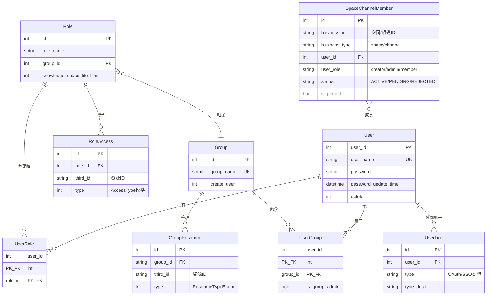
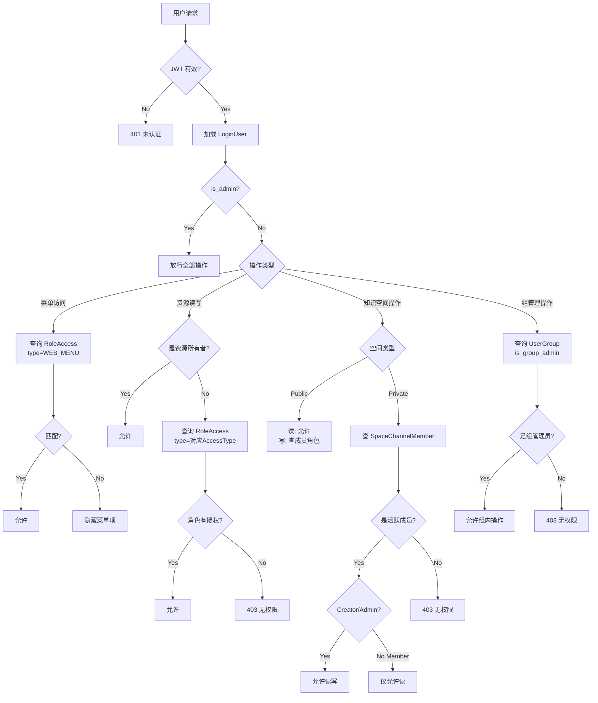

# 用户与权限体系深度解析

BiSheng 采用**三层权限模型**：用户认证（JWT）→ 角色权限（RBAC）→ 资源级授权（Owner/Role/Member），覆盖菜单可见性、资源读写、协作空间三个维度。当前体系以"角色-资源"绑定为核心，辅以"知识空间成员制"实现协作场景，但细粒度授权能力（字段级、操作级、跨模块联动）尚有扩展空间。

---

## 1. 权限架构总览

```
┌─────────────────────────────────────────────────────────────────┐
│                        用户请求                                  │
└──────────────────────────┬──────────────────────────────────────┘
                           ▼
┌─────────────────────────────────────────────────────────────────┐
│  第一层：认证 (Authentication)                                    │
│  JWT Token → Cookie / Header / WebSocket                        │
│  AuthJwt.get_subject() → {user_id, user_name}                   │
│  文件: user/domain/services/auth.py:24-93                        │
└──────────────────────────┬──────────────────────────────────────┘
                           ▼
┌─────────────────────────────────────────────────────────────────┐
│  第二层：身份加载 (Identity Loading)                               │
│  LoginUser.init_login_user()                                     │
│  → 加载 user_role[] (UserRoleDao)                                │
│  → 判断 is_admin() (role_id == 1)                                │
│  → 注入为 FastAPI Depends(UserPayload.get_login_user)            │
│  文件: user/domain/services/auth.py:95-338                       │
└──────────────────────────┬──────────────────────────────────────┘
                           ▼
┌─────────────────────────────────────────────────────────────────┐
│  第三层：授权 (Authorization) — 三种检查模式                       │
│                                                                  │
│  ┌──────────────┐  ┌──────────────┐  ┌────────────────────┐     │
│  │ 菜单权限      │  │ 资源权限      │  │ 协作空间成员权限    │     │
│  │ WEB_MENU(99) │  │ RBAC 读/写   │  │ SpaceChannelMember │     │
│  │ 控制前端导航  │  │ Owner/Role   │  │ Creator/Admin/     │     │
│  │              │  │ 判定          │  │ Member             │     │
│  └──────────────┘  └──────────────┘  └────────────────────┘     │
│  文件: database/models/role_access.py                            │
│        common/models/space_channel_member.py                     │
└─────────────────────────────────────────────────────────────────┘
```

---

## 2. 数据模型关系



### 核心表说明

| 表 | 文件 | 记录数量级 | 用途 |
|---|---|---|---|
| `user` | `user/domain/models/user.py` | 百~万 | 用户主表 |
| `userrole` | `user/domain/models/user_role.py` | 与用户 1:N | 用户-角色关联（多角色，旧文档常写 `user_role`） |
| `role` | `database/models/role.py` | 十~百 | 角色定义，按 Group 隔离 |
| `roleaccess` | `database/models/role_access.py` | 百~万 | 角色-资源授权记录（旧文档常写 `role_access`） |
| `group` | `database/models/group.py` | 十~百 | 用户组 |
| `usergroup` | `database/models/user_group.py` | 与用户 1:N | 用户-组关联，含组管理员标记（旧文档常写 `user_group`） |
| `groupresource` | `database/models/group_resource.py` | 百~万 | 组-资源归属关系（旧文档常写 `group_resource`） |
| `space_channel_member` | `common/models/space_channel_member.py` | 百~万 | 知识空间/频道成员（协作模型） |

> 注意：这里涉及的当前 SQL 表名分别是 `userrole`、`roleaccess`、`usergroup`、`groupresource`；`user_role`、`role_access`、`user_group`、`group_resource` 在本仓里更多是代码文件名、历史逻辑名或字段名，不是当前实际表名。

---

## 3. 认证机制

### 3.1 JWT Token 生命周期

```
注册/登录 → 密码校验(MD5) → 生成 JWT → 写入 Cookie
                                ↓
            payload = {user_id, user_name}
            algorithm = HS256
            secret = settings.jwt_secret
            exp = now + jwt_token_expire_time (默认 86400s = 1天)
            iss = settings.cookie_conf.jwt_iss (默认 "bisheng")
```

**源码位置**: `user/domain/services/auth.py:34-44`

```python
class AuthJwt:
    def create_access_token(self, subject: dict) -> str:
        payload = {
            'sub': json.dumps(subject),   # {user_id, user_name}
            'exp': int(datetime.now(timezone.utc).timestamp()) + self.cookie_conf.jwt_token_expire_time,
            'iss': self.cookie_conf.jwt_iss
        }
        return jwt.encode(payload, self.jwt_secret, algorithm="HS256")
```

### 3.2 Token 提取方式（三种来源）

| 来源 | 场景 | 提取方式 |
|------|------|----------|
| Cookie | 浏览器请求 | `request.cookies.get("access_token_cookie")` |
| Header | API 调用 | `request.headers["Authorization"].split(" ")[-1]` |
| WebSocket | 实时通信 | `websocket.cookies.get("access_token_cookie")` 或查询参数 `t` |

**源码位置**: `auth.py:67-83`

### 3.3 Cookie 配置

```python
class CookieConf(BaseModel):                     # core/config/settings.py:204-214
    max_age: Optional[int] = None                  # Cookie 最大存活秒数
    path: str = '/'
    domain: Optional[str] = None
    secure: bool = False                           # 是否仅 HTTPS
    httponly: bool = True                          # 禁止 JS 访问
    samesite: str = None                           # 'lax'/'strict'/'none'
    jwt_token_expire_time: int = 86400             # Token 有效期（秒）
    jwt_iss: str = 'bisheng'                       # JWT 签发者
```

### 3.4 登录密码安全

- **传输加密**: 前端 RSA 加密密码，后端解密后 MD5 存储
- **密码策略** (`PasswordConf`):
  - `password_valid_period`: 密码有效期（天），过期强制修改
  - `login_error_time_window`: 错误窗口期（分钟）
  - `max_error_times`: 最大错误次数，超过后锁定用户
- **多设备登录**: `allow_multi_login` 控制是否允许多端同时登录

---

## 4. 身份与角色体系

### 4.1 用户身份层级

```
系统管理员 (AdminRole, id=1)
    ↓ 拥有全部权限，跳过所有检查
用户组管理员 (UserGroup.is_group_admin=True)
    ↓ 管理组内用户和资源
普通用户 (DefaultRole, id=2 + 自定义角色)
    ↓ 按角色授权访问资源
```

### 4.2 LoginUser — 权限判定核心类

**文件**: `user/domain/services/auth.py:95-338`

这是整个权限系统的运行时核心。每个请求通过 FastAPI 依赖注入获得一个 `LoginUser` 实例：

```python
class LoginUser(BaseModel):
    user_id: int
    user_name: str
    user_role: List[int]           # 用户拥有的角色 ID 列表
    group_cache: Dict[int, Any]    # 组信息缓存，减少 DB 查询
```

**依赖注入入口** (`auth.py:291-293`):

```python
@classmethod
async def get_login_user(cls, auth_jwt: AuthJwt = Depends()) -> Self:
    subject = auth_jwt.get_subject()                    # 解码 JWT
    return await cls.init_login_user(                    # 加载角色
        user_id=subject['user_id'], 
        user_name=subject['user_name']
    )
```

`init_login_user` 会从 `UserRoleDao` 查询用户的所有 `role_id`，缓存在 `user_role` 列表中。

### 4.3 Admin 绕过机制

```python
@cached_property
def _check_admin(self):                                 # auth.py:113-119
    return any(role_id == AdminRole for role_id in self.user_role)

@staticmethod
def wrapper_access_check(func):                         # auth.py:124-137
    """装饰器：admin 用户直接返回 True，跳过后续检查"""
    @functools.wraps(func)
    def wrapper(*args, **kwargs):
        if args[0].is_admin():
            return True
        return func(*args, **kwargs)
    return wrapper
```

所有权限检查方法（`access_check`, `check_group_admin`, `copiable_check` 等）都使用此装饰器，admin 一律放行。

### 4.4 系统初始化默认权限

**文件**: `common/init_data.py:25-58`

首次启动时自动创建：

| 实体 | 值 | 说明 |
|------|-----|------|
| Role id=1 | System Admin | 系统最高权限 |
| Role id=2 | Regular users | 普通用户默认角色 |
| Group id=2 | Default user group | 所有用户自动加入 |
| RoleAccess × 6 | DefaultRole + WEB_MENU | 普通用户的默认菜单权限 |

普通用户默认获得的菜单权限：

```python
BUILD, KNOWLEDGE, MODEL, BACKEND, FRONTEND, KNOWLEDGE_SPACE
```

未默认授予的菜单：`EVALUATION`, `BOARD`, `SUBSCRIPTION`, `CREATE_DASHBOARD`

---

## 5. 资源授权模型（RBAC）

### 5.1 AccessType — 资源权限类型

**文件**: `database/models/role_access.py:52-66`

```python
class AccessType(Enum):
    KNOWLEDGE = 1           # 知识库读权限
    KNOWLEDGE_WRITE = 3     # 知识库写权限
    ASSISTANT_READ = 5      # 助手读权限
    ASSISTANT_WRITE = 6     # 助手写权限
    GPTS_TOOL_READ = 7      # 工具读权限
    GPTS_TOOL_WRITE = 8     # 工具写权限
    WORKFLOW = 9             # 工作流读权限
    WORKFLOW_WRITE = 10      # 工作流写权限
    DASHBOARD = 11           # 看板读权限
    DASHBOARD_WRITE = 12     # 看板写权限
    WEB_MENU = 99            # 前端菜单可见性
```

**设计特点**:
- 读写分离：每类资源有独立的读（奇数/小值）和写（偶数/大值）权限
- 编号不连续：2、4 未使用，为历史预留
- WEB_MENU 是特殊类型，控制前端导航菜单可见性而非资源访问

### 5.2 ResourceTypeEnum — 组资源类型

**文件**: `database/models/group_resource.py:12-19`

```python
class ResourceTypeEnum(Enum):
    KNOWLEDGE = 1       # 知识库
    ASSISTANT = 3       # 助手
    GPTS_TOOL = 4       # 工具
    WORK_FLOW = 5       # 工作流
    DASHBOARD = 6       # 看板
    WORKSTATION = 7     # 工作台
    SPACE_FILE = 8      # 知识空间文件
```

### 5.3 WebMenuResource — 前端菜单项

**文件**: `database/models/role_access.py:35-49`

```python
class WebMenuResource(Enum):
    BUILD = 'build'                    # 应用构建
    KNOWLEDGE = 'knowledge'            # 知识库管理
    MODEL = 'model'                    # 模型管理
    EVALUATION = 'evaluation'          # 模型评测
    BOARD = 'board'                    # 数据看板
    KNOWLEDGE_SPACE = 'knowledge_space' # 知识空间
    SUBSCRIPTION = 'subscription'      # 订阅管理
    FRONTEND = 'frontend'             # 前端权限
    BACKEND = 'backend'               # 后端权限
    CREATE_DASHBOARD = 'create_dashboard' # 创建看板
```

前端路由通过 `permission` 属性关联菜单项：

```typescript
// src/frontend/platform/src/routes/index.tsx
{ path: "filelib", element: <KnowledgePage />, permission: 'knowledge' }
{ path: "build/apps", element: <Apps />, permission: 'build' }
{ path: "sys", element: <SystemPage />, permission: 'sys' }
```

### 5.4 核心权限判定流程

**access_check** (`auth.py:154-165`) — 单资源访问检查：

```
access_check(owner_user_id, target_id, access_type)
    │
    ├── is_admin()? ──→ True (装饰器短路)
    │
    ├── user_id == owner_user_id? ──→ True (资源所有者)
    │
    ├── RoleAccessDao.judge_role_access(
    │       user_role[],    # 用户的所有角色 ID
    │       target_id,      # 资源 ID
    │       access_type     # 权限类型
    │   )? ──→ True (角色授权)
    │
    └── False (无权限)
```

**SQL 查询**:
```sql
SELECT * FROM role_access 
WHERE role_id IN (用户角色列表) 
  AND type = 权限类型 
  AND third_id = 资源ID 
LIMIT 1
```

### 5.5 资源列表过滤流程

**文件**: `api/services/workflow.py` (WorkFlowService.get_all_flows)

```python
if user.is_admin():
    # 管理员：查看全部资源
    data, total = FlowDao.get_all_apps(...)
else:
    # 普通用户：自己的 + 角色授权的
    access_list = [AccessType.WORKFLOW, AccessType.ASSISTANT_READ]
    flow_id_extra = user.get_user_access_resource_ids(access_list)
    data, total = FlowDao.get_all_apps(
        user_id=user.user_id,       # 过滤自己创建的
        id_extra=flow_id_extra       # 合并角色授权的资源 ID
    )
```

**FlowDao 中的 SQL 逻辑**:
```sql
WHERE (user_id = 当前用户 OR id IN (角色授权资源ID列表))
```

### 5.6 写权限检查的 API 示例

**文件**: `api/v1/workflow.py:35-58`

```python
@router.get("/write/auth")
async def check_app_write_auth(login_user: UserPayload = Depends(...), ...):
    flow_info = await FlowDao.aget_flow_by_id(flow_id)
    
    if flow_type == FlowType.ASSISTANT.value:
        check_type = AccessType.ASSISTANT_WRITE
    else:
        check_type = AccessType.WORKFLOW_WRITE
    
    if await login_user.async_access_check(flow_info.user_id, flow_id, check_type):
        return resp_200()
    return AppWriteAuthError.return_resp()
```

---

## 6. 用户组与资源归属

### 6.1 组的层级

```
DefaultGroup (id=2)          ← 所有用户自动加入
    ├── User A (普通成员)
    ├── User B (组管理员, is_group_admin=True)
    └── 关联资源 (GroupResource)
        ├── Knowledge #1
        ├── Workflow #2
        └── Assistant #3

Custom Group (id=N)          ← 管理员创建
    ├── User C (组管理员)
    ├── User D (普通成员)
    └── 关联资源 (GroupResource)
```

### 6.2 组管理员权限

组管理员（`UserGroup.is_group_admin=True`）的能力：

| 操作 | 系统管理员 | 组管理员 | 普通用户 |
|------|-----------|---------|---------|
| 创建组 | 可以 | 可以 | 不可以 |
| 删除组 | 可以 | 仅自己管理的组 | 不可以 |
| 管理组内用户 | 可以 | 仅自己管理的组 | 不可以 |
| 分配资源到组 | 可以 | 仅自己管理的组 | 不可以 |
| 修改管理员用户的组 | 不可以 | 不可以 | 不可以 |

**关键约束** (`api/services/role_group_service.py`):
- 管理员用户（AdminRole）的组归属不可被修改（`AdminUserUpdateForbiddenError`）
- DefaultGroup（id=2）不可删除（`UserGroupNotDeleteError`）
- 组删除时，组内资源会迁移到 DefaultGroup（如果该资源不属于其他组）

### 6.3 GroupResource — 资源归属

`GroupResource` 表记录"哪个资源属于哪个组"，是间接授权的桥梁：

```
用户 → UserGroup → Group → GroupResource → 资源
```

**注意**: GroupResource 本身**不直接用于权限判定**。当前权限判定走的是 `RoleAccess` 路径。GroupResource 更多用于资源管理和组织视图（如"查看本组的所有知识库"）。这是一个潜在的扩展点——未来可以将 GroupResource 与权限判定结合，实现"组内资源自动对组成员可见"。

---

## 7. 协作空间成员制（Knowledge Space）

### 7.1 架构概述

知识空间采用独立于 RBAC 的**成员制**模型，是当前系统中最接近"细粒度协作授权"的实现。

**文件**: `common/models/space_channel_member.py`

```python
class SpaceChannelMember(SQLModelSerializable, table=True):
    business_id: str          # 空间/频道 ID
    business_type: str        # 'space' 或 'channel'
    user_id: int              # 成员用户 ID
    user_role: UserRoleEnum   # creator / admin / member
    status: MembershipStatusEnum  # ACTIVE / PENDING / REJECTED
    is_pinned: bool           # 是否置顶
```

### 7.2 成员角色与权限矩阵

| 操作 | Creator | Admin | Member | 非成员(Public空间) | 非成员(Private空间) |
|------|---------|-------|--------|-------------------|-------------------|
| 查看空间 | 可以 | 可以 | 可以 | 可以 | 不可以 |
| 上传文件 | 可以 | 可以 | 不可以 | 不可以 | 不可以 |
| 删除文件 | 可以 | 可以 | 不可以 | 不可以 | 不可以 |
| 管理成员 | 可以 | 可以 | 不可以 | 不可以 | 不可以 |
| 修改空间设置 | 可以 | 可以 | 不可以 | 不可以 | 不可以 |
| 删除空间 | 可以 | 不可以 | 不可以 | 不可以 | 不可以 |
| 订阅/取消订阅 | -- | 可以 | 可以 | 可以申请 | 可以申请 |

### 7.3 权限检查实现

**写权限** (`knowledge_space_service.py:117-127`):

```python
async def _require_write_permission(self, space_id: int) -> UserRoleEnum:
    role = await SpaceChannelMemberDao.async_get_active_member_role(
        space_id, self.login_user.user_id
    )
    if role not in {UserRoleEnum.CREATOR, UserRoleEnum.ADMIN}:
        raise SpacePermissionDeniedError()
    return role
```

**读权限** (`knowledge_space_service.py:129-140`):

```python
async def _require_read_permission(self, space_id: int) -> Knowledge:
    space = await KnowledgeDao.aquery_by_id(space_id)
    if space.auth_type == AuthTypeEnum.PUBLIC:     # Public 空间所有人可读
        return space
    role = await SpaceChannelMemberDao.async_get_active_member_role(...)
    if not role:                                    # Private 空间必须是活跃成员
        raise SpacePermissionDeniedError()
    return space
```

### 7.4 订阅审批流程

```
用户申请订阅 → SpaceChannelMember(status=PENDING) 
    → 空间管理员审批
        ├── 批准 → status=ACTIVE → 发送通知
        └── 拒绝 → status=REJECTED → 24小时内可见拒绝状态
```

**文件**: `knowledge/domain/services/subscribe_handler.py`

### 7.5 空间限制

```python
_MAX_SPACE_PER_USER = 30       # 每个用户最多创建 30 个空间
_MAX_SUBSCRIBE_PER_USER = 50   # 每个用户最多订阅 50 个空间（非创建者）
```

### 7.6 与 RBAC 的关系

知识空间的成员制模型**独立于** RBAC 体系运作：

- RBAC 路径：`User → UserRole → Role → RoleAccess → Knowledge (type=KNOWLEDGE)`
- 空间路径：`User → SpaceChannelMember → Knowledge (type=SPACE)`

普通知识库（`KnowledgeTypeEnum.NORMAL`）走 RBAC，知识空间（`KnowledgeTypeEnum.SPACE`）走成员制。两套机制并行，代码中通过 `knowledge.type` 区分。

---

## 8. 频道权限模型

频道（Channel）复用了 `SpaceChannelMember` 表（`business_type='channel'`），但有自己的约束：

```python
MAX_USER_CHANNEL_COUNT = 10       # 用户最多创建 10 个频道
MAX_ADMIN_COUNT = 5               # 频道最多 5 个管理员
MAX_USER_SUBSCRIBE_COUNT = 20     # 用户最多订阅 20 个频道
```

频道可见性（`ChannelVisibilityEnum`）：PUBLIC / PRIVATE / INTERNAL

---

## 9. 前端路由权限控制

### 9.1 菜单动态过滤

**后端** (`auth.py:315-337`):

```python
@classmethod
async def get_roles_web_menu(cls, user: User) -> (str | List[int], List[str]):
    if role == 'admin':
        web_menu = [one.value for one in WebMenuResource]  # 管理员获得全部菜单
    else:
        web_menu = await RoleAccessDao.aget_role_access(role_ids, AccessType.WEB_MENU)
        web_menu = list(set([one.third_id for one in web_menu]))
    return role, web_menu
```

**前端**: 路由表中的 `permission` 属性与 `web_menu` 列表匹配，不在列表中的路由不渲染。

### 9.2 角色类型返回

登录后返回给前端的角色类型：

| 返回值 | 含义 | 菜单范围 |
|--------|------|----------|
| `'admin'` | 系统管理员 | 全部菜单 |
| `'group_admin'` | 组管理员 | 按角色查询 |
| `[role_id, ...]` | 普通用户 | 按角色查询 |

---

## 10. 权限流转全景图



---

## 11. 当前体系的架构特征与局限性

### 11.1 设计特征

| 特征 | 说明 |
|------|------|
| **Admin 全权绕过** | 系统管理员跳过所有检查，简化实现但不适合大型组织 |
| **扁平角色模型** | 角色不支持继承，无层级关系 |
| **资源粒度绑定** | 每条 RoleAccess 绑定到一个具体资源 ID，无通配/批量授权 |
| **读写二元分离** | 每种资源仅有读/写两种权限，无更细粒度操作区分 |
| **双轨并行** | 普通知识库走 RBAC，知识空间走成员制，逻辑独立 |
| **GroupResource 弱关联** | 组资源关系用于管理视图，不直接参与权限判定 |

### 11.2 企业场景潜在需求 vs 现状

| 企业需求 | 现状 | 差距 |
|----------|------|------|
| **部门层级授权** | Group 是扁平的，无父子关系 | 需要树形组织结构 |
| **角色继承** | 角色间无继承关系 | 需要角色层级（如：部门经理继承普通员工权限） |
| **操作级权限** | 仅读/写两种 | 需要更细操作：分享、导出、评论、审批等 |
| **字段级权限** | 无 | 如：普通成员只能看到知识库摘要，不能看源文件 |
| **数据行级隔离** | 无 | 如：销售只能看自己负责区域的数据 |
| **临时授权** | 无过期机制 | 需要限时共享、到期自动回收 |
| **审批工作流** | 仅知识空间订阅有审批 | 需要通用审批流（如：工作流上线审批） |
| **审计追溯** | AuditLog 有审计表 | 需要更完整的操作日志和权限变更记录 |
| **外部身份源** | UserLink 支持 OAuth | 需要 LDAP/AD/SCIM 对接，自动同步组织结构 |
| **跨模块授权联动** | 各模块独立判权 | 如：工作流引用的知识库，是否自动授予执行者访问权 |

### 11.3 扩展建议方向

**短期可行**（当前架构内可实现）:
- 在 `AccessType` 中增加更多操作类型（如 EXPORT、SHARE、COMMENT）
- 为 `RoleAccess` 增加 `expire_time` 字段实现临时授权
- 让 `GroupResource` 参与权限判定（组成员自动获得组资源的读权限）

**中期演进**（需要模型扩展）:
- Group 增加 `parent_id` 支持树形组织
- Role 增加继承关系（`parent_role_id`）
- 统一知识空间成员制和 RBAC 为同一套模型

**长期规划**（需要架构升级）:
- 引入 ABAC（基于属性的访问控制）框架
- 引入通用审批引擎
- 支持 SCIM/LDAP 外部身份源自动同步

---

## 12. 关键源码索引

| 功能 | 文件路径 | 关键行 |
|------|----------|--------|
| JWT 认证 | `user/domain/services/auth.py` | 24-93 |
| LoginUser 权限核心 | `user/domain/services/auth.py` | 95-338 |
| UserPayload 依赖注入 | `common/dependencies/user_deps.py` | 全文件 |
| 角色定义 | `database/models/role.py` | 全文件 |
| 权限类型枚举 | `database/models/role_access.py` | 35-66 |
| 权限判定查询 | `database/models/role_access.py` | 113-131 |
| 用户组 | `database/models/user_group.py` | 全文件 |
| 组资源关系 | `database/models/group_resource.py` | 全文件 |
| 空间成员制 | `common/models/space_channel_member.py` | 全文件 |
| 知识空间权限 | `knowledge/domain/services/knowledge_space_service.py` | 72-140 |
| 知识库权限服务 | `knowledge/domain/services/knowledge_permission_service.py` | 全文件 |
| 组管理服务 | `api/services/role_group_service.py` | 全文件 |
| 初始化默认权限 | `common/init_data.py` | 25-58 |
| 资源列表过滤 | `api/services/workflow.py` | 115-124 |
| 前端路由权限 | `src/frontend/platform/src/routes/index.tsx` | 63-100 |
| 用户角色常量 | `database/constants.py` | AdminRole=1, DefaultRole=2 |

---

## 相关文档

- [数据模型与存储层](./07-data-models.md) — ORM 模型完整清单
- [后端领域模块总览](./02-backend-modules.md) — 模块间的权限检查调用关系
- [双前端架构](./06-frontend-architecture.md) — 前端路由权限过滤机制
- [部署架构与配置](./08-deployment.md) — JWT/Cookie 配置项
