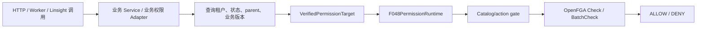
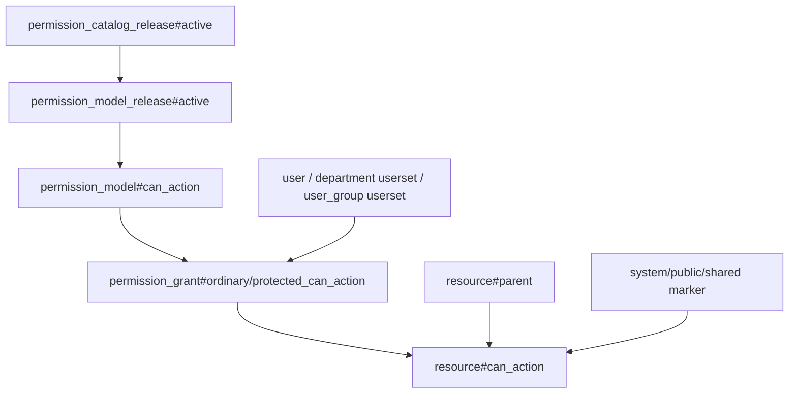
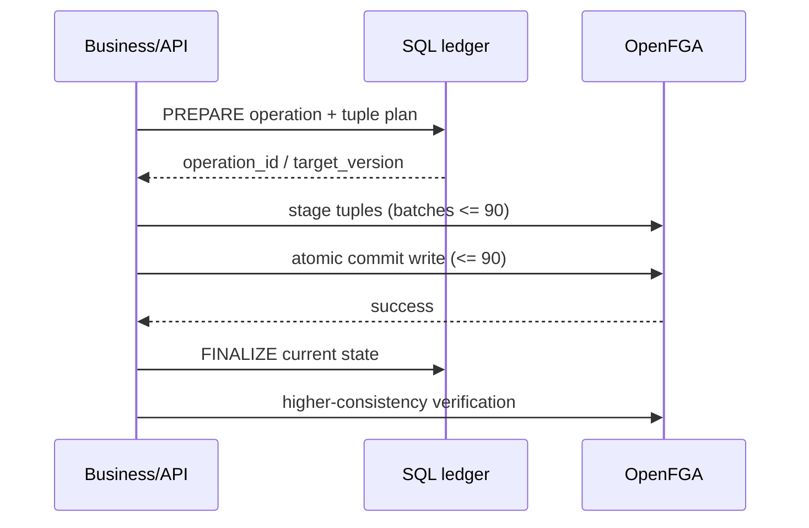

# 用户、菜单与资源权限架构

> 现状版本：v3.0.0-beta1 / F048
> 最后更新：2026-07-29
> 规范来源：`features/v3.0.0-beta1/048-rebac-permission-model-grants/`

BiSheng 的权限体系分为三个互不替代的层面：

1. **认证与身份**：JWT、用户、角色、租户、部门、用户组；
2. **菜单/API 能力**：传统 RBAC 控制平台功能入口；
3. **具体资源动作**：业务 Service 验证资源事实后，由唯一的 F048
   权限运行时通过 OpenFGA 判定。

资源动作不再使用 `permission_id`、四档 relation 模板、`roleaccess`
资源行或双模型 fallback。OpenFGA 是资源权限的唯一 PDP；SQL 保存
Catalog、Grant、版本、来源和可恢复投影状态。

---

## 1. 责任边界

### 1.1 业务 Service 负责的事实

资源所属业务模块负责查询和验证：

- 资源是否存在、是否已删除或处于可操作状态；
- 资源所属租户及跨租户共享是否合法；
- folder/file 的 canonical parent；
- 资源业务版本、状态版本和乐观锁版本；
- 频道订阅、知识空间类型、dashboard 归属等业务规则。

验证完成后，业务侧只能通过
`VerifiedPermissionTarget.from_business_service(...)` 构造内部目标：

```python
VerifiedPermissionTarget(
    tenant_id=...,
    resource_type=...,
    resource_id=...,
    resource_version=...,
    parent_type=...,
    parent_id=...,
    context_version=...,
)
```

普通 HTTP body 无法自行构造这个对象，也不能传入 tenant、status、
protection、source 或 derived level 等服务端字段。

### 1.2 权限模块负责的逻辑

权限模块只处理业务无关的授权事实：

- actor 是否为 global super admin / 当前租户 admin；
- action 是否存在、启用且适用于该资源类型；
- 当前 Catalog、model、Grant、mode 是否有效；
- OpenFGA Check / BatchCheck / 受控 ListObjects；
- Grant 能否授予目标 model；
- Catalog、Grant、mode、资源生命周期的持久投影；
- 版本冲突、幂等、最近变更强一致性与审计事件。

权限模块不得 import 或查询 knowledge、workflow、tool、channel、
dashboard 等业务 ORM、DAO、Repository 或 Service。

### 1.3 调用链


```mermaid
flowchart LR
    A["HTTP / Worker / Linsight 调用"] --> B["业务 Service / 业务权限 Adapter"]
    B --> C["查询租户、状态、parent、业务版本"]
    C --> D["VerifiedPermissionTarget"]
    D --> E["F048PermissionRuntime"]
    E --> F["Catalog/action gate"]
    F --> G["OpenFGA Check / BatchCheck"]
    G --> H["ALLOW / DENY"]
```

资源动作的短路顺序固定为：

```text
global super admin
  → tenant mismatch DENY
  → tenant admin
  → Catalog/action scope
  → OpenFGA
```

菜单 RBAC 不参与该链，也不能在 OpenFGA 拒绝或异常时提供 fallback
ALLOW。

---

## 2. 认证、身份与菜单 RBAC

### 2.1 认证

`AuthJwt` 从 Cookie、Authorization Header 或 WebSocket token 读取 JWT，
解码得到 `user_id` / `user_name`。`LoginUser` / `UserPayload` 再加载：

- 用户角色；
- global super admin 标记；
- 当前租户；
- 当前用户担任管理员的租户集合。

JWT 只证明身份，不携带可被信任的资源租户、资源状态或资源权限。

### 2.2 菜单与平台能力

Role / UserRole / RoleAccess 仍用于菜单、平台管理能力和历史身份同步。
`WEB_MENU` 等能力可以控制页面入口，但不能直接授权 workflow、
knowledge、tool、channel 或 dashboard 资源。

F048 后，`LegacyRBACSyncService` 仅同步身份关系：

- `system:global#super_admin`；
- `user_group#member`；
- `user_group#admin`。

RoleAccess 的业务资源回调是显式 no-op。`OwnerService` 只保留用户组身份
tuple 清理，不再提供业务资源 owner 检查、owner 转让或 relation 写入。

---

## 3. Catalog：动作与模型的发布单元

### 3.1 为什么需要 Catalog

Catalog 不是为了给每个资源额外保存一份权限，也不是为了维护两个
OpenFGA model。它是一个**不可变、可校验的全局权限语义版本**：

- 每个动作只有一条完整定义：code、名称、level、状态、资源范围；
- 每个标准/自定义 model 都属于同一个 Catalog release；
- action level 变化时，服务端重算全部 model；
- 发布时通过一个 active release gate 原子切换新语义；
- 既有 Grant 只引用稳定的 `model_key`，无需按资源/成员 fan-out 重写。

代价是 Check/List 的关系图多一层 Catalog/model intersection。因此不能
宣称零性能损失；Check、BatchCheck、ListObjects 必须由 BENCH-01 量化，
业务列表默认采用候选 cursor + BatchCheck。

### 3.2 动作集合

| action | 适用资源 |
|---|---|
| `manage_permission` | 全部 F048 资源 |
| `rename` | folder、knowledge_file |
| `edit` | knowledge_space、knowledge_library、workflow、assistant、tool、channel、dashboard |
| `create_folder` | knowledge_space、folder |
| `upload_file` | knowledge_space、folder |
| `move` | folder、knowledge_file |
| `download` | folder、knowledge_file |
| `delete` | 全部 F048 资源 |
| `share` | knowledge_space、knowledge_file、workflow、assistant |
| `use` | knowledge_library、workflow、assistant、tool |
| `publish` | workflow、assistant |
| `unpublish` | workflow、assistant |

`visible` 是内部可见性 relation，不是可配置 action。调用方不能用
`visible` 代替具体业务动作。

### 3.3 level 与标准模型重算

动作可以配置为 level 1～4，也可以暂不分配。未启用或未分配 level 的
动作不进入有效权限。

四个标准 model 固定为：

| model_key | 固定 level | 动作生成规则 |
|---|---:|---|
| `viewer` | 1 | 所有有效且 `action.level <= 1` 的动作 |
| `editor` | 2 | 所有有效且 `action.level <= 2` 的动作 |
| `manager` | 3 | 所有有效且 `action.level <= 3` 的动作 |
| `owner` | 4 | 所有有效且 `action.level <= 4` 的动作 |

管理员修改任意动作 level、active 或 resource scope 后，系统重建四个
标准 model，并重新计算所有自定义 model 的有效动作和 derived level。
标准 model 的 key、名称、level、active 和动作集合不可手工覆盖；
`allow_same_level` 是唯一可配置策略字段。

自定义 model 显式选择 action，derived level 是其中有效动作的最高
level。选择项失效或未分配 level 时保留选择来源，但不产生运行时权限；
active 自定义 model 若最终没有有效动作会阻止发布。

---

## 4. Grant、assignee、来源与 owner

### 4.1 Grant

一个 Grant 表示：

```text
tenant + resource_type + resource_id + model_key
```

多个 assignee 可引用同一 Grant。assignee 支持：

- direct user；
- `department#member`；
- `department#subtree_member`；
- `user_group#member`；
- `user_group#admin`。

部门成员变化或组织树移动只更新身份/树 tuple，不重写每个资源 Grant。

### 4.2 来源与独立撤销

每个 assignee 保存结构化来源：

- `source_type`；
- `source_ref`；
- `source_locator`；
- `source_fingerprint`；
- projected subject；
- protected 标记和版本。

同一用户通过 direct、department、group 多条路径得到权限时，各来源
独立存在、独立解释、独立撤销。删除一条来源不会误删其他路径。

### 4.3 owner 语义

- 创建资源的人生成 protected creator owner；
- 一个资源可以有多个普通 owner；
- protected creator 不能通过普通 Grant mutation 删除或移动；
- 产品当前没有所有权转让功能，F048 不提供 transfer owner API；
- 旧 F018 交接历史在数据迁移时按源事实保留，但运行时不继续提供转让。

`owner` 是 level 4 标准 model，不是一个拥有特殊数据库查询权限的
关系。能否授予同级 model 由 `allow_same_level` 和
`manage_permission` 共同约束。

---

## 5. 资源 mode 与继承

### 5.1 mode

资源权限 mode 只有：

- `CUSTOM`：使用资源本地普通 Grant；
- `INHERIT`：使用 canonical parent 的普通权限。

protected creator 和 system/shared 可见性不被普通 mode 切换错误清除。
mode 切换采用 staged tuples + 两条 commit marker，避免某一时刻同时
开放本地和父级普通权限。

### 5.2 固定 CUSTOM

没有上级资源的类型固定为 CUSTOM，包括：

- knowledge_space；
- knowledge_library；
- workflow；
- assistant；
- tool；
- channel；
- dashboard。

knowledge_space 与 knowledge_library 都是顶级权限容器：前者表达知识
空间，后者表达文档/QA 知识库，不存在可继承的上级资源。

folder / knowledge_file 必须始终保存 canonical parent，可在 CUSTOM 和
INHERIT 之间切换。

### 5.3 文件预览与下载

- 文件预览不设置权限动作；
- 进入预览页时不调用 `preview`、`view` 或 `download`；
- 真正下载文件时必须检查 `download`；
- 文件列表可见性与下载能力是不同判定，不能用一个结果替代另一个。

### 5.4 dashboard

dashboard 已纳入 F048：

- business adapter 验证 dashboard tenant/status；
- 可见性由内部 `visible` relation 判定；
- 修改检查 `edit`；
- 删除检查 `delete`，不能继续复用 `edit`；
- 权限管理检查 `manage_permission`；
- preset/system visibility 通过显式 system marker 表达。

---

## 6. OpenFGA 单 Store、单 runtime model

### 6.1 运行时自动发现与数据库门禁

生产配置只保存 OpenFGA 连接信息与稳定的 Store name，不保存随升级变化的
Store/model/Catalog ID。API、Celery、Beat、Linsight 等每个进程启动时：

1. 按 `store_name` 查询且只接受唯一 Store；
2. 选择该 Store 最新的 authorization model；
3. 获取 model checksum；
4. 要求发现的 Store/model/checksum 与 SQL CURRENT Catalog 引用的唯一 ACTIVE
   `authorization_model_release` 完全一致；
5. 构造单一 `FGAClient`，后续每个 Check/List/Write 显式携带已发现的 model ID。

进程通过 Redis heartbeat 上报实际 Store/model/Catalog。任一不一致即 readiness
失败且不初始化 F048 权限 runtime。为了保持既有容器内升级方式，发现 predecessor
model 或迁移中尚未形成完整 CURRENT Catalog 时，进程本身可以保持存活并暴露 503
健康状态，但不发布 ready heartbeat、不处理生产授权请求，也不会自动执行数据迁移。
禁止：

- 在生产自动创建 Store 或写 authorization model；
- `dual_model_mode=true`；
- legacy model client；
- 运行时自动写 model；
- OpenFGA 异常时 fail-open。

本仓 Compose 默认固定 `openfga/openfga:v1.15.1`；正式部署使用经评审的
`v1.15.1@sha256:...` digest。解析深度通过
`OPENFGA_RESOLVE_NODE_LIMIT` 固定并由部门树深度门禁验证。

### 6.2 关系图


```mermaid
flowchart TD
    C["permission_catalog_release#active"] --> R["permission_model_release#active"]
    R --> M["permission_model#can_action"]
    M --> G["permission_grant#ordinary/protected_can_action"]
    G --> X["resource#can_action"]
    U["user / department userset / user_group userset"] --> G
    P["resource#parent"] --> X
    S["system/public/shared marker"] --> X
```

关键类型：

- `permission_catalog_release`：当前发布 gate；
- `permission_model_release`：本 release 的动作/level marker；
- `permission_model`：稳定 `model_key` 到 release；
- `permission_grant`：model 与 assignee 的交点；
- 各业务 resource type：Grant、mode、parent、system/shared 与具体
  `can_<action>`。

Catalog 更新与资源/assignee 数量解耦：staging 与 model×action 数量
相关，commit 固定切换 release marker。Grant 不因 Catalog 发布而逐条
重写。

### 6.3 读路径

单资源：

```text
business resolve → VerifiedPermissionTarget
→ identity shortcut → Catalog/action gate
→ consistency marker → OpenFGA Check
```

业务列表：

```text
业务数据库 keyset cursor 取 ≤100 个候选
→ 每个候选由业务 adapter 验证
→ OpenFGA BatchCheck
→ 保留允许项并继续 cursor
```

`ListObjects` 只允许已通过 BENCH-01 的特定入口使用。它不负责加载
业务数据、tenant/status 过滤或通用分页；结果超过批准上限时必须报错，
不能把 OpenFGA 默认 1,000 条上限静默当作全集。

---

## 7. 持久投影与并发

SQL 是控制面与恢复依据，OpenFGA 是判定面。任何跨 SQL/OpenFGA 的
写操作都先保存不可变计划：


```mermaid
sequenceDiagram
    participant B as Business/API
    participant SQL as SQL ledger
    participant FGA as OpenFGA
    B->>SQL: PREPARE operation + tuple plan
    SQL-->>B: operation_id / target_version
    B->>FGA: stage tuples (batches <= 90)
    B->>FGA: atomic commit write (<= 90)
    FGA-->>B: success
    B->>SQL: FINALIZE current state
    B->>FGA: higher-consistency verification
```

`permission_projection_operation` 保存：

- idempotency key 和 request checksum；
- scope、before/after checksum；
- expected/target version；
- Store/model pin；
- operator、状态、重试和错误。

`permission_projection_tuple` 保存正向 tuple、inverse action、phase、
sequence 与执行状态。重试使用同一 operation 和 frozen plan；不得在
失败后重新读取变化中的业务状态推断另一份计划。

单次业务变更上限：

- request change item ≤ 50；
- compiled tuple delta ≤ 90；
- 一个原子 OpenFGA Write ≤ 90。

91 条及以上不能拆成两个“看似成功”的业务提交。

---

## 8. Catalog / Grant / decision API

统一前缀：`/api/v1/permissions`。

### 8.1 Catalog（仅 global super admin）

| 方法 | 路径 | 作用 |
|---|---|---|
| GET | `/catalog` | 当前完整 Catalog |
| POST | `/catalog/drafts` | 基于当前 release 创建服务端 draft/impact |
| GET | `/catalog/drafts/{draft_id}` | 读取持久 draft |
| POST | `/catalog/drafts/{draft_id}/publish` | 确认并发布指定 draft |

draft 绑定 base release、impact checksum、过期时间和 idempotency key。
发布不接受客户端重新提交整份 Catalog。

### 8.2 资源 Grant 与 mode

| 方法 | 路径 |
|---|---|
| GET | `/resources/{type}/{id}/context` |
| GET | `/resources/{type}/{id}/grantable-models` |
| GET | `/resources/{type}/{id}/grants` |
| GET | `/resources/{type}/{id}/my-permissions` |
| POST | `/resources/{type}/{id}/grants:mutate` |
| POST | `/resources/{type}/{id}/mode-drafts` |
| POST | `/resources/{type}/{id}/mode-drafts/{draft_id}/apply` |

roster 使用 opaque cursor，page size 1～100。mutation 支持 ADD / MOVE /
REMOVE，必须携带 resource、Catalog 和 assignee 乐观版本。

### 8.3 决策

`POST /check` 接收 `resource_type`、`resource_id`、具体 action。endpoint
通过业务 registry 解析目标，不能信任请求中的租户或状态字段。

---

## 9. 数据库模型

### 9.1 Catalog

- `authorization_model_release`
- `permission_catalog_release`
- `permission_action`
- `permission_action_resource_scope`
- `permission_model`
- `permission_model_action`
- `permission_catalog_projection_tuple`

### 9.2 Grant / mode / 投影

- `permission_grant`
- `permission_grant_assignee`
- `resource_permission_mode`
- `permission_projection_operation`
- `permission_projection_tuple`

### 9.3 正式数据迁移

- `permission_migration_run`
- `permission_migration_item`

所有租户资源行使用显式 `tenant_id`，由 C3 自动租户过滤保护；正式迁移
脚本只能在受控 bypass scope 中跨租户扫描。

---

## 10. F048 数据迁移

Alembic revision
`f048_permission_model_grants.py` 只做 schema/index/constraint 变更和
dashboard `tenant_id` DDL，不扫描或转换业务数据。

业务数据迁移唯一入口：

```text
src/backend/scripts/migrate_f048_permission_data.py
```

迁移是应用自动阻断业务访问、同 Store、单向前进流程：

1. D0：更新镜像并正常启动 Compose 服务；predecessor model 下 API/Worker/Linsight
   只进入 `MIGRATION_REQUIRED/NOT_READY`，API 除 `/health` 外自动拒绝 HTTP/WS，
   Celery/Linsight 暂停任务消费；
2. D1：API 正常启动链执行 Alembic upgrade，确认单 head；
3. D2：运维进入 backend 容器执行脚本；脚本确认 ready F048 heartbeat=0，
   两次稳定源扫描并冻结 run/item/checksum；
4. D3：在同一 Store 发布一个 F048 model，分批写 SQL/FGA；
5. D4：higher-consistency 验证后，仅删除记录到 run 的 legacy tuple/Config；
6. D5：迁移成功后重启全部 backend 进程，自动发现新 model 并绑定 SQL CURRENT Catalog；
7. D6：smoke、全实例 heartbeat 和语义校验通过后，迁移门禁自动解除。

脚本 DB scan batch=500，FGA write batch≤90，每批写 checkpoint。崩溃后
必须携带同一个 `run-id` 从 frozen items 前向恢复。

没有 preview、dry-run、rollback、cleanup、Store switch 或 model A/B
并行窗口。迁移失败时保持应用迁移门禁和 F048 runtime 不就绪，修复同一 run 的前向路径。

---

## 11. 一致性、性能与可观测

### 11.1 一致性

普通读使用 OpenFGA 默认一致性。Grant revoke、mode 收紧、Catalog
发布、资源删除等安全变更完成后：

- 立即执行 `HIGHER_CONSISTENCY` 验证；
- 写 Redis recent-change marker；
- marker 窗口内相关 Check/BatchCheck 继续使用 higher consistency；
- Redis/marker 异常时选择 higher consistency，不降级为旧 ALLOW。

### 11.2 BENCH-01

`benchmark_f048_permission_paths.py` 量化：

- Check P95 与旧路径脱敏基线；
- BatchCheck 20/50/100 的 P50/P95/P99；
- ListObjects direct/department/group/inherit/multi-grant；
- 10/100/1000 结果完整集合 checksum；
- 业务 cursor+BatchCheck 的集合 fingerprint；
- OpenFGA request ID 对应的 dispatch 与 datastore query count。

仓库自带 fixture 只用于 synthetic harness，`production_derived=false`，
不能产生 release-ready 报告。正式 BENCH-01 必须使用生产脱敏分布。

### 11.3 OpenFGA 可观测

OpenFGA 使用 JSON log，并暴露 `:2112/metrics`。RPC histogram 在部署中
显式启用。重点观测：

- Check / BatchCheck / ListObjects latency 与 error rate；
- `dispatch_count`；
- `datastore_query_count` / iterator query latency；
- ListObjects 结果上限与超时；
- datastore connection pool；
- resolve node depth/breadth。

业务侧结构化 domain：

- `permission_decision`
- `permission_projection`
- `permission_catalog_publish`
- `permission_roster_explain`
- `permission_migration`

日志不得记录用户名、部门名、资源名、token 或 legacy Config 原文。

---

## 12. 失败策略与不变量

以下情况一律失败闭合：

- OpenFGA timeout/unavailable；
- Store/model/model checksum 不匹配；
- CURRENT Catalog 为 0 或多于 1；
- Catalog checksum 与进程 pin 不一致；
- projection operation `FAILED_CLOSED`；
- action 未注册、未启用、未分配 level 或不适用于资源；
- HTTP 伪造 tenant/status/parent/version；
- mutation 超过 50 item 或 90 tuple；
- version、idempotency checksum 或 draft impact 冲突；
- 跨租户普通 Grant；
- protected creator 删除/移动；
- ListObjects 超过批准结果边界。

禁止恢复旧 Config、creator、RoleAccess 或 relation template 作为 fallback。

---

## 13. 代码导航

| 能力 | 主要位置 |
|---|---|
| OpenFGA model | `bisheng/core/openfga/authorization_model_f048.py` |
| 单 model 自动发现与生命周期 | `bisheng/core/openfga/discovery.py`, `bisheng/core/openfga/manager.py` |
| action decision | `bisheng/permission/domain/services/permission_action_service.py` |
| Catalog policy | `bisheng/permission/domain/services/catalog_policy.py` |
| 标准/自定义 model | `bisheng/permission/domain/services/model_policy.py` |
| Grant policy | `bisheng/permission/domain/services/grant_service.py` |
| mode policy | `bisheng/permission/domain/services/mode_service.py` |
| durable projection | `bisheng/permission/domain/services/projection_service.py` |
| 业务 target registry | `bisheng/permission/application/resource_authorization.py` |
| runtime facade | `bisheng/permission/application/runtime.py` |
| API composition | `bisheng/api/services/f048_permission_runtime.py` |
| Catalog/Grant/decision endpoints | `bisheng/permission/api/endpoints/` |
| Alembic DDL | `bisheng/core/database/alembic/versions/f048_permission_model_grants.py` |
| 数据迁移 CLI | `scripts/migrate_f048_permission_data.py` |
| BENCH-01 | `scripts/benchmark_f048_permission_paths.py` |

---

## 14. 发布验证边界

仓库自动化能够证明纯策略、API contract、projection、迁移 coordinator、
前后端交互和 legacy 不可达。以下证据只能由对应环境提供：

- pinned digest 的真实 OpenFGA v1.15.1 集成；
- disposable MySQL 与 Linux DM8 schema/resume/verify；
- 生产脱敏分布 BENCH-01；
- 升级窗口中的 D0～D6 全实例 pin、HTTP/WS 自动门禁、not-ready/ready heartbeat 与重启证据。

缺少其中任一项时可以完成代码实现，但不能把正式发布门禁标绿。
