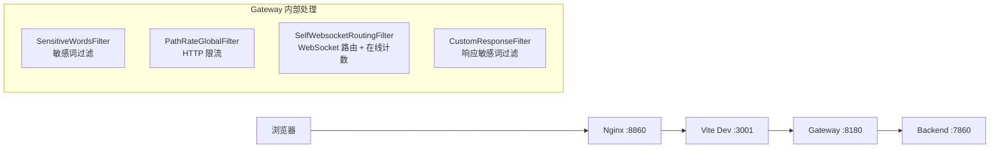
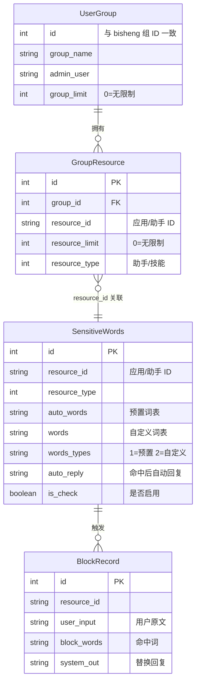
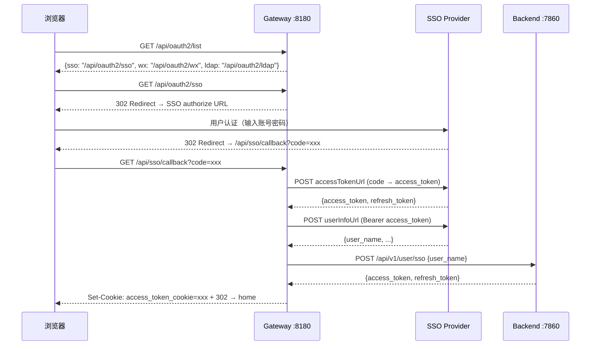

# 商业 API 网关 (bisheng-gateway)

bisheng-gateway 是 BiSheng 的**商业拓展套件**，作为 Java 网关层部署在前端与后端之间，提供 SSO/OAuth 统一认证、内容安全审查（敏感词过滤）、流量控制（限流/在线计数）和 API 反向代理能力。它是一个独立的 Java 项目（私有仓库 `dataelement/bisheng-gateway`），拥有独立的数据库表和配置，通过 HTTP 与 bisheng 后端通信。

## 1. 系统架构

### 1.1 请求流转路径



开启网关模式后，前端 Vite 的 `VITE_PROXY_TARGET` 从 `http://localhost:7860` 切换为 `http://localhost:8180`，所有 `/api/**` 请求先经过 Gateway 再代理到 Backend。

### 1.2 路由分工

| 路径 | 处理方 | 说明 |
|------|--------|------|
| `/api/oauth2/*` | Gateway 自处理 | SSO/OAuth 登录入口与回调 |
| `/api/sso/callback`, `/api/wx/callback`, `/api/wxweb/callback` | Gateway 自处理 | 各 SSO Provider 回调 |
| `/api/sensitive/*` | Gateway 自处理 | 敏感词管理 CRUD |
| `/api/group/*` (gateway 侧) | Gateway 自处理 | 用户组/资源组管理 |
| `/api/getkey` | Gateway 自处理 | RSA 公钥获取（前端密码加密用） |
| `/api/v1/**` | Gateway 代理 → Backend | v1 API 全部代理 |
| `/api/v2/**` | Gateway 代理 → Backend | v2 RPC API 全部代理 |
| `/api/v1/chat/**`, `/api/v2/chat/**` | Gateway WebSocket 代理 | WebSocket 连接代理（自定义 Filter） |

---

## 2. 技术栈

| 维度 | 技术 | 版本 | 说明 |
|------|------|------|------|
| 框架 | Spring Boot + Spring Cloud Gateway | 3.2.6 / 2023.0.1 | Reactive/WebFlux 响应式网关 |
| 构建 | Maven | -- | `pom.xml`，artifact: `gateway-0.0.1-SNAPSHOT` |
| Java | JDK | 17 | 编译目标 17 |
| ORM | MyBatis-Plus | 3.5.6 | 4 张业务表（`gt_*` 前缀） |
| OAuth | JustAuth | 1.16.6 | 多平台 OAuth2 登录库 |
| 认证 | Sa-Token | 1.38.0 | Reactor 响应式集成 |
| 企业微信 | weixin-java-cp | 4.7.0 | 企业微信通讯录同步 + OAuth |
| HTTP 客户端 | Spring 6 @HttpExchange | -- | `BsClient` 声明式调用 bisheng 后端 |
| 限流 | Guava RateLimiter | 33.2.0-jre | 基于令牌桶的 HTTP 限流 |
| 工具 | Hutool / Lombok / MapStruct | 5.8.28 / -- / 1.5.5 | 加解密、Bean 映射等 |

---

## 3. 项目结构

```
com.dataelem.gateway/
├── GatewayApplication.java              # Spring Boot 启动入口
├── config/
│   ├── BishengConfig.java               # bisheng 集成配置（license, API URL, filter URL 等）
│   ├── CustomerConfig.java              # SSO/微信/LDAP 配置 + 预置敏感词加载
│   ├── LicenseLoader.java               # License 校验（ApplicationRunner, order=1）
│   ├── LimitRuleLoader.java             # 限流规则加载器（启动时从 DB 加载，运行时刷新）
│   ├── RedisTopicListener.java          # Redis Pub/Sub 监听（delete_group 频道）
│   ├── SpringCustomConfig.java          # BsClient WebClient 工厂配置
│   └── ...                              # MyBatis, Netty WebSocket, CORS 等配置类
├── controller/
│   ├── OauthController.java             # SSO/OAuth 登录 + 回调（5 种登录方式）
│   ├── SensitiveWordsController.java    # 敏感词管理 CRUD
│   ├── UserGroupController.java         # 用户组管理
│   ├── GroupResourceController.java     # 组-资源关联管理
│   └── BlockRecordController.java       # 拦截记录查询
├── filter/
│   ├── SensitiveWordsFilter.java        # 请求敏感词过滤（GlobalFilter, order=HIGHEST+1001）
│   ├── CustomResponseFilter.java        # 响应敏感词过滤（GlobalFilter, order=-2）
│   ├── PathRateGlobalFilter.java        # HTTP 限流（GlobalFilter, order=LOWEST-90）
│   └── SelfWebsocketRoutingFilter.java  # WebSocket 路由 + 在线会话计数
├── entity/
│   ├── UserGroup.java                   # gt_user_group 用户组
│   ├── GroupResource.java               # gt_group_resource 组资源关联
│   ├── SensitiveWords.java              # gt_sensitive_words 敏感词配置
│   └── BlockRecord.java                 # gt_block_record 拦截记录
├── sso/
│   ├── AuthCustomSSORequest.java        # 自定义 SSO Provider（继承 JustAuth AuthDefaultRequest）
│   ├── AuthCustomSource.java            # 自定义 OAuth Source 枚举
│   └── CustomSsoConfig.java             # SSO 配置 POJO（URL、clientId、clientSecret 等）
├── sdk/
│   └── BsClient.java                   # 声明式 HTTP 客户端（@HttpExchange，调用 bisheng 后端）
├── schedule/
│   └── WechatScheduled.java            # 企业微信通讯录定时同步
├── service/impl/                        # Service 实现层
├── mapper/xml/                          # MyBatis-Plus Mapper XML
├── dto/                                 # 数据传输对象
├── params/                              # 请求参数对象
├── exception/                           # 异常处理 + ResultData 统一响应
└── utils/
    └── ac/                              # Aho-Corasick 自动机（敏感词高效匹配）
        ├── AC.java                      # AC 自动机基类（KMP + Trie Tree）
        └── ACPlus.java                  # 支持包含词处理的增强版
```

---

## 4. 数据模型

Gateway 使用独立的 4 张表（`gt_*` 前缀），与 bisheng 主库的表互不干扰：

| 表名 | 实体 | 核心字段 | 用途 |
|------|------|----------|------|
| `gt_user_group` | `UserGroup` | id, group_name, admin_user, group_limit | 用户组定义，id 与 bisheng 主库保持一致 |
| `gt_group_resource` | `GroupResource` | group_id, resource_id, resource_limit, resource_type | 组-资源关联，含每资源限流阈值 |
| `gt_sensitive_words` | `SensitiveWords` | resource_id, resource_type, words, auto_words, words_types, auto_reply, is_check | 按资源配置的敏感词（预置词表 + 自定义词表） |
| `gt_block_record` | `BlockRecord` | resource_id, user_input, block_words, system_out | 敏感词命中记录 |



---

## 5. SSO/OAuth 认证流程

### 5.1 整体时序



**核心流程要点**:

1. **前端获取登录方式**: `GET /api/oauth2/list` 根据 `CustomerConfig` 中配置的 SSO/微信/LDAP 返回可用登录入口
2. **重定向到 SSO**: Gateway 构造 OAuth2 authorize URL（包含 client_id、redirect_uri、state），302 重定向浏览器
3. **SSO 回调处理**: JustAuth 框架自动完成 code → access_token → user_info 的 OAuth2 标准流程
4. **注册/登录 bisheng**: Gateway 调用 `BsClient.createUser()` → `POST /api/v1/user/sso` 将用户名传给后端，后端自动注册（不存在则创建）并返回 JWT
5. **写入 Cookie**: Gateway 将后端返回的 `access_token` 和 `refresh_token` 写入浏览器 Cookie，302 跳转首页

### 5.2 三种 SSO Provider

| Provider | 入口 | 回调 | JustAuth 实现 | 配置 |
|----------|------|------|---------------|------|
| 自定义 SSO | `/api/oauth2/sso` | `/api/sso/callback` | `AuthCustomSSORequest` (自定义) | `custom.ssoconfig.*` |
| 企业微信扫码 | `/api/oauth2/wx` | `/api/wx/callback` | `AuthWeChatEnterpriseQrcodeRequest` | `custom.wxoauth.*` |
| 企业微信网页 | `/api/oauth2/wxweb` | `/api/wxweb/callback` | `AuthWeChatEnterpriseWebRequest` | `custom.wxoauth.*` |
| LDAP | `/api/oauth2/ldap` (POST) | 无回调（直接校验） | `LdapUtil.checkUserExists()` | `custom.ldap.*` |

**自定义 SSO** (`AuthCustomSSORequest`): 继承 JustAuth 的 `AuthDefaultRequest`，可配置 4 个端点 URL（authorizeUrl, accessTokenUrl, userInfoUrl, refreshUrl），适配任意标准 OAuth2 Provider。通过 `CustomSsoConfig.userName` 字段指定从 userInfo 响应中提取用户名的 JSON 路径。

**LDAP**: 不走 OAuth 流程，前端 POST 用户名和 RSA 加密密码，Gateway 解密后直接调用 `LdapUtil` 进行 LDAP bind 校验，成功后走同样的 `BsClient.createUser()` 注册登录流程。

### 5.3 密码加密

Gateway 启动时生成 RSA 密钥对。前端通过 `GET /api/getkey` 获取公钥，用公钥加密密码后传输，Gateway 用私钥解密。此机制用于 LDAP 密码保护。

---

## 6. 内容安全审查

### 6.1 架构概览

内容安全由 4 个组件协作实现：

```
请求入站                                            响应出站
   |                                                    |
   v                                                    v
SensitiveWordsFilter (order=HIGHEST+1001)    CustomResponseFilter (order=-2)
   |  拦截请求中的用户输入                              |  拦截响应中的模型输出
   |  命中 → 直接返回 auto_reply                        |  命中 → 替换响应内容
   |  未命中 → 放行到后端                               |  支持 SSE 流式响应
   v                                                    v
PathRateGlobalFilter → Backend → 响应       响应 → 返回浏览器
```

### 6.2 请求侧过滤 (SensitiveWordsFilter)

**拦截路径**: `/api/v2/assistant/chat/completions` 和 `/api/v1/process`

**工作流程**:
1. 从请求 body 提取用户输入（助手类型取 `messages[-1].content`，技能类型取 `inputs`）
2. 根据 `resource_id` + `resource_type` 查询 `gt_sensitive_words` 配置
3. 构建 Aho-Corasick 自动机（懒加载 + 缓存），合并预置词表和自定义词表
4. 对用户输入执行多模式匹配
5. 命中 → 记录到 `gt_block_record`，直接返回 `auto_reply`，不转发到后端
6. 未命中 → 正常代理到后端

**Aho-Corasick 自动机** (`utils/ac/`): AC 自动机（KMP + Trie Tree）实现高效多模式字符串匹配，时间复杂度 O(n + m)，n 为文本长度，m 为匹配结果数。每个资源的自动机实例缓存在 `HashMap<String, AC>` 中，通过 `remove_cache()` 方法支持配置变更后重建。

### 6.3 响应侧过滤 (CustomResponseFilter)

**拦截路径**: 同上

**工作流程**:
1. 装饰 `ServerHttpResponse`，拦截后端返回的内容
2. 区分非流式（JSON）和流式（SSE `text/event-stream`）两种响应
3. 非流式：解析完整 JSON，提取模型回复内容，执行敏感词匹配，命中则替换
4. 流式：按 SSE 事件边界（`\n\n`）分割，逐事件解析 `data: {json}` 中的内容进行过滤
5. 同样区分助手类型（`choices[0].delta.content`）和技能类型（`data.result.answer`）

### 6.4 敏感词配置

`gt_sensitive_words` 支持两种词表来源：
- **预置词表** (`auto_words`): 从 `words.txt` 文件加载的内置敏感词库，`words_types` 包含 `"1"` 时启用
- **自定义词表** (`words`): 用户通过管理界面配置，以 `|` 分隔，`words_types` 包含 `"2"` 时启用

每条配置绑定到一个具体资源（`resource_id` + `resource_type`），支持按应用/助手粒度独立配置。

---

## 7. 流量控制

### 7.1 HTTP 限流 (PathRateGlobalFilter)

**触发条件**: 请求路径匹配 `bisheng.filter-url` 配置列表中的任一项

**限流机制**:
- `LimitRuleLoader` 启动时从 `gt_group_resource` 加载限流规则
- 每个 `group_id + resource_id` 组合对应一个 Guava `RateLimiter` 实例（令牌桶算法）
- 未配置规则的资源使用默认 RateLimiter（10 QPS）
- 限流命中时返回 HTTP 200 + `{status_code: 429, status_message: "系统正忙，请稍候"}`

### 7.2 WebSocket 在线计数 (SelfWebsocketRoutingFilter + LimitRuleLoader)

**在线会话管理**:
- `LimitRuleLoader` 维护两级在线计数：`GROUP_ONLINE`（用户组级）和 `FLOW_ONLINE`（用户组+资源级）
- WebSocket 连接建立时 `increment()`，断开时 `decrement()`
- `SESSION_ONLINE` 记录每个 WebSocket Session 关联的计数 key，确保断连时正确回收
- `isOverage()` 检查当前在线数是否超过组级（`group_limit`）或资源级（`resource_limit`）阈值

### 7.3 规则刷新

- 启动时：`LimitRuleLoader` 作为 `ApplicationRunner` 从 DB 加载全部规则
- 运行时：通过 Redis Pub/Sub 频道 `delete_group` 触发缓存失效（`RedisTopicListener`），`LimitRuleLoader.load()` 重新加载

---

## 8. 与 bisheng 后端集成

### 8.1 BsClient 声明式 HTTP 客户端

`BsClient` 使用 Spring 6 的 `@HttpExchange` 声明式 HTTP 客户端，baseUrl 由 `bisheng.bisheng-api-url` 配置：

```java
@HttpExchange(url = "/api", accept = "application/json", contentType = "application/json")
public interface BsClient {
    @PostExchange("/v1/user/sso")        // SSO 用户注册/登录
    Flux<String> createUser(@RequestBody Map<String, String> body);

    @GetExchange("/v1/user/info")        // 获取用户信息
    Flux<String> info(@RequestHeader("Cookie") String cookie);

    @GetExchange("/v1/group/list")       // 获取用户组列表
    Mono<String> userGroupList(...);

    @GetExchange("/v1/group/get_group_resources")  // 获取组资源
    Mono<String> resourceList(...);

    @PostExchange("/v2/group/sync")      // 同步企业微信组织结构
    Flux<String> syncUsers(@RequestBody List<Department> tree);
}
```

### 8.2 关键集成点

| 场景 | Gateway 调用 | Backend 端点 | 说明 |
|------|-------------|-------------|------|
| SSO 登录 | `BsClient.createUser({user_name})` | `POST /api/v1/user/sso` | 自动注册/登录，返回 JWT |
| 用户信息查询 | `BsClient.info(cookie)` | `GET /api/v1/user/info` | 验证用户身份 |
| 组列表同步 | `BsClient.userGroupList()` | `GET /api/v1/group/list` | Gateway 管理界面展示 |
| 企业微信同步 | `BsClient.syncUsers(tree)` | `POST /api/v2/group/sync` | 部门+用户树同步 |

### 8.3 缓存同步

- **Redis Pub/Sub**: bisheng 后端删除用户组时，通过 Redis `delete_group` 频道通知 Gateway，Gateway 的 `RedisTopicListener` 接收消息后删除对应的本地缓存（用户组 + 限流规则 + 敏感词 AC 自动机）
- **前置条件**: Gateway 和 Backend 必须共享同一个 Redis 实例（配置 `spring.data.redis`）

### 8.4 企业微信通讯录同步

`WechatScheduled` 定时任务（cron 表达式：`0 0 ${bisheng.time:0} * * ?`，默认每天 0 点）：
1. 通过 `weixin-java-cp` SDK 拉取企业微信完整部门树 + 用户列表
2. 构建 `Department` 树形结构（parentId 关联）
3. 调用 `BsClient.syncUsers()` 将组织结构同步到 bisheng 后端
4. 可通过 `bisheng.enable_sync=true` 开启，`bisheng.time` 配置执行小时

---

## 9. License 机制

### 9.1 校验流程

`LicenseLoader` 作为 `ApplicationRunner`（order=1），在 Spring Boot 启动阶段执行 License 校验：

```
启动 → 读取 bisheng.license 配置
     → RSA 私钥解密 → 得到 JSON: {name, version, expireDay, finger}
     → 检查 version 字段:
         "trial"  → 比较 expireDay 与当前日期，过期则 System.exit(0)
         "pro"    → 永久有效，直接放行
     → 解密失败 → 打印错误日志并 System.exit(0)
```

### 9.2 License 格式

License 是 RSA 加密的 Base64 字符串，解密后为 JSON：

```json
{
    "name": "pro",
    "version": "pro",          // "trial" 或 "pro"
    "expireDay": "2025-05-25", // trial 模式的过期日期
    "finger": "63f3b3e2..."    // 机器指纹（当前未在运行时校验）
}
```

**注意**: `finger` 字段虽然包含在 License JSON 中，但当前运行时**未进行指纹校验**，仅检查 `version` 和 `expireDay`。

---

## 10. 配置说明

主配置文件为 `src/main/resources/application.yml`，关键配置分组：

### 10.1 Gateway 路由

```yaml
spring.cloud.gateway.routes:
  - id: bisheng-http          # HTTP API 代理
    uri: http://backend:7860
    predicates:
      - Path=/api/v1/**,/api/v2/**
    filters:
      - name: CacheRequestBody  # 缓存请求体供 Filter 读取
        args: { bodyClass: java.lang.String }

  - id: bisheng-ws             # WebSocket 代理
    uri: ws://backend:7860
    predicates:
      - Path=/api/v1/chat/**,/api/v2/chat/**,/api/v1/workflow/chat/**
```

**注意**: 默认 WebSocket Routing Filter 已禁用（`global-filter.websocket-routing.enabled: false`），由自定义的 `SelfWebsocketRoutingFilter` 接管，实现在线计数和限流检查。

### 10.2 bisheng 集成

```yaml
bisheng:
  license: <RSA 加密的 License 字符串>
  filter-url:                   # 需要限流/敏感词过滤的 URL 模式
    - api/v1/assistant/chat/
    - api/v1/process/
    - api/v2/assistant/chat
  home-url: http://host:port    # SSO 回调后的跳转首页
  web-home-url: http://host:port/chatpro/flow_id  # 企业微信内嵌跳转
  bisheng-api-url: http://backend:7860  # bisheng 后端 API 地址
  enable_sync: false            # 是否启用企业微信通讯录同步
  time: 0                       # 同步执行小时（0~23）
```

### 10.3 SSO Provider 配置

```yaml
custom:
  ssoconfig:                    # 自定义 SSO（OAuth2 标准流程）
    authorizeUrl: https://sso.example.com/oauth2/authorize
    accessTokenUrl: https://sso.example.com/oauth2/token
    userInfoUrl: https://sso.example.com/oauth2/userinfo
    refreshUrl: https://sso.example.com/oauth2/refresh
    clientId: xxx
    clientSecret: xxx
    redirectUri: http://gateway-host/api/sso/callback
    userName: userName          # userInfo 响应中用户名的 JSON 路径

  wxoauth:                      # 企业微信
    clientId: <corpId>
    clientSecret: <corpSecret>
    redirectUri: http://gateway-host/api/wx/callback
    redirectWebUri: https://domain/oauth/api/wxweb/callback?flowId=flow_id
    agentId: <agentId>
    userName: name              # name 或 userid

  ldap:                         # LDAP 直连认证
    ldapUrl: ldap://ldap-host:389/dc=example,dc=com
```

### 10.4 数据源

```yaml
spring:
  datasource:
    url: jdbc:mysql://host:3306/bisheng_gateway  # Gateway 独立数据库
    username: root
    password: xxx
  data:
    redis:
      host: redis-host          # 必须与 bisheng 后端共享同一 Redis
      port: 6379
      database: 3               # 使用独立的 Redis DB
```

---

## 11. 开发环境搭建

### 11.1 本地开发

```bash
# 1. 克隆项目
git clone https://github.com/dataelement/bisheng-gateway.git

# 2. 构建
cd bisheng-gateway
mvn clean package -DskipTests

# 3. 启动（端口 8180，避免与 OpenFGA 8080 冲突）
java -jar target/gateway-0.0.1-SNAPSHOT.jar \
  --spring.profiles.active=dev \
  --server.port=8180

# 4. 前端切换为 Gateway 模式
cd ~/Projects/bisheng/src/frontend/platform
# 修改 vite.config.mts 中 VITE_PROXY_TARGET 为 http://localhost:8180
npm start
```

### 11.2 远程开发

```bash
# 远程服务器路径
# /opt/bisheng-gateway/ on 192.168.106.114

# 同步脚本（项目根目录 gateway-sync.sh）
./gateway-sync.sh up      # 本地 → 远程
./gateway-sync.sh down    # 远程 → 本地
./gateway-sync.sh watch   # 监听变化，自动推送
```

### 11.3 数据库

Gateway 的 4 张表（`gt_*`）部署在独立数据库 `bisheng_gateway` 中（也可与 bisheng 主库同实例不同 schema）。表结构通过 MyBatis-Plus 的 `@TableName` 注解映射，无自动迁移机制，需手动建表。

---

## 12. GlobalFilter 执行顺序

Gateway 中注册了 4 个 GlobalFilter，按 order 值从小到大执行：

```
请求入站方向（order 从小到大）:
  1. SensitiveWordsFilter     (HIGHEST_PRECEDENCE + 1001)  → 请求敏感词过滤
  2. CustomResponseFilter     (order = -2)                 → 装饰响应（但实际过滤在出站方向）
  3. SelfWebsocketRoutingFilter                            → WebSocket 路由 + 在线计数
  4. PathRateGlobalFilter     (LOWEST_PRECEDENCE - 90)     → HTTP 限流

响应出站方向（反序）:
  CustomResponseFilter 的 ServerHttpResponseDecorator 拦截响应内容进行敏感词过滤
```

---

## 13. v2.5 改造方向（规划中）

| 改造项 | 当前状态 | 目标状态 |
|--------|---------|---------|
| 多租户 OAuth | SSO/微信/LDAP 配置硬编码在 `application.yml` | 新增 `gt_oauth_config` 表，按租户维护 Provider 配置 |
| JWT 租户上下文 | Gateway 不感知 tenant_id | 从 bisheng JWT 中提取 tenant_id，注入到代理请求头 |
| 租户级内容安全 | 敏感词按 resource_id 粒度 | 增加 tenant_id 维度，支持租户级全局敏感词 |
| 租户级限流 | 限流按 group+resource 粒度 | 增加 tenant_id 维度，支持租户级配额 |
| 权限集成 | Gateway 独立管理用户组/资源组 | 与 bisheng 的 OpenFGA ReBAC 体系对齐，复用部门/用户组模型 |

---

## 相关文档

- [系统架构总览](./01-architecture-overview.md) -- 整体请求数据流和组件关系
- [用户与权限体系](./10-permission-rbac.md) -- bisheng 后端的认证与授权机制
- [部署架构与配置](./08-deployment.md) -- Docker Compose 编排和配置系统
- [v2.5 权限管理体系改造 PRD](../PRD/2.5%20权限管理体系改造%20PRD/2.5%20权限管理体系改造%20PRD.md) -- ReBAC 权限体系设计
