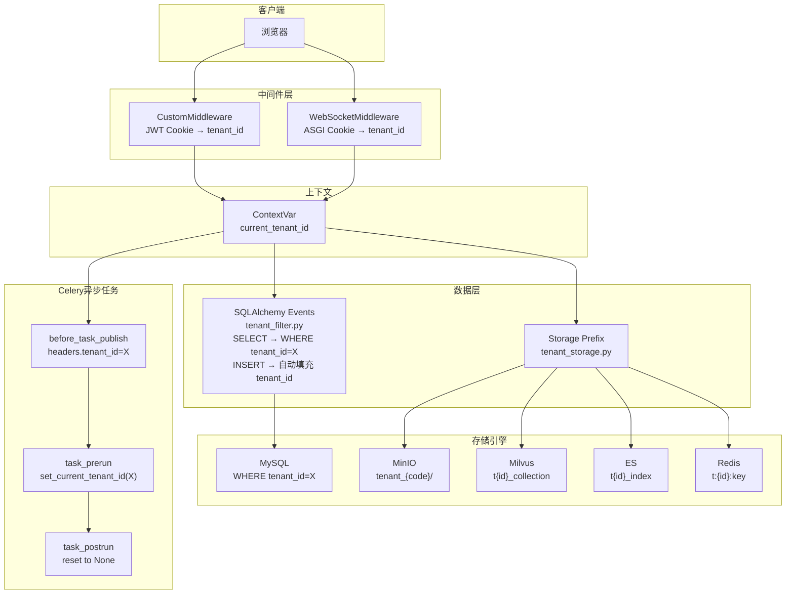
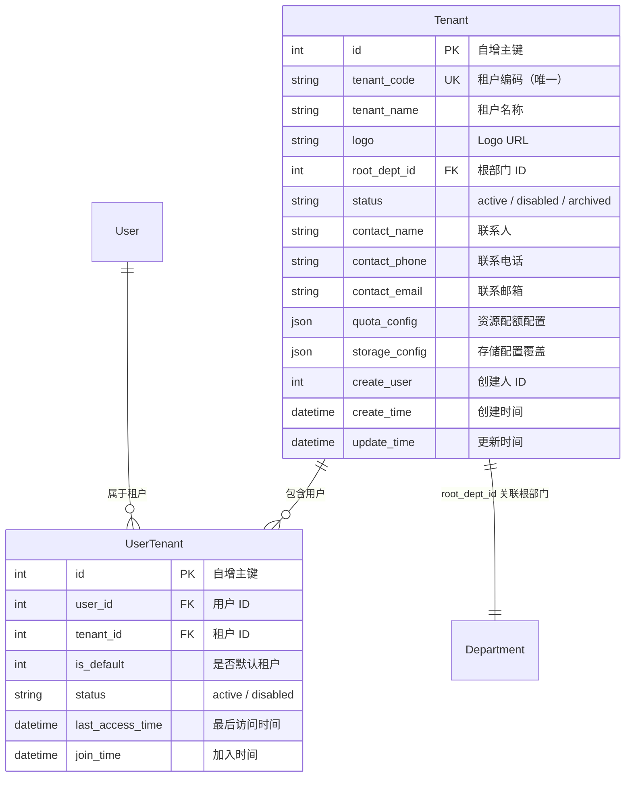
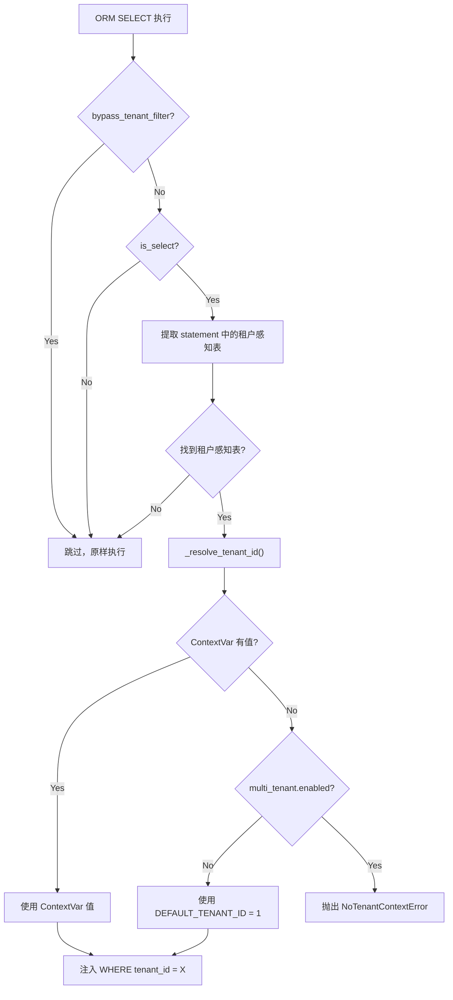
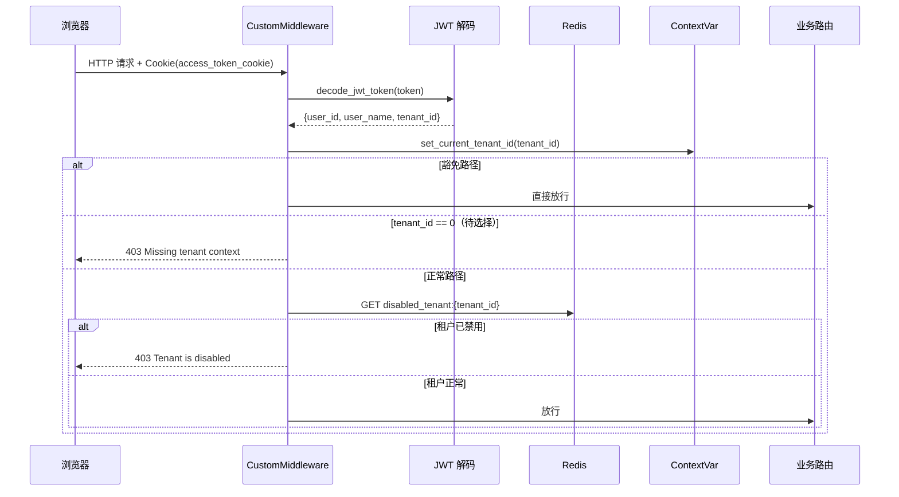
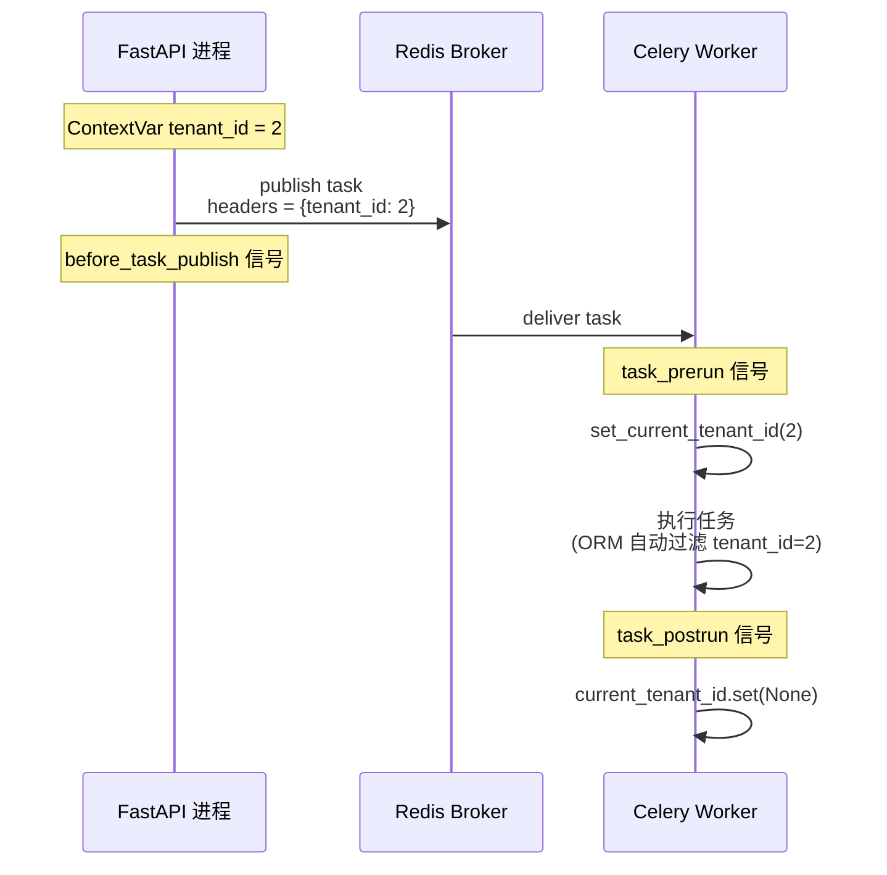
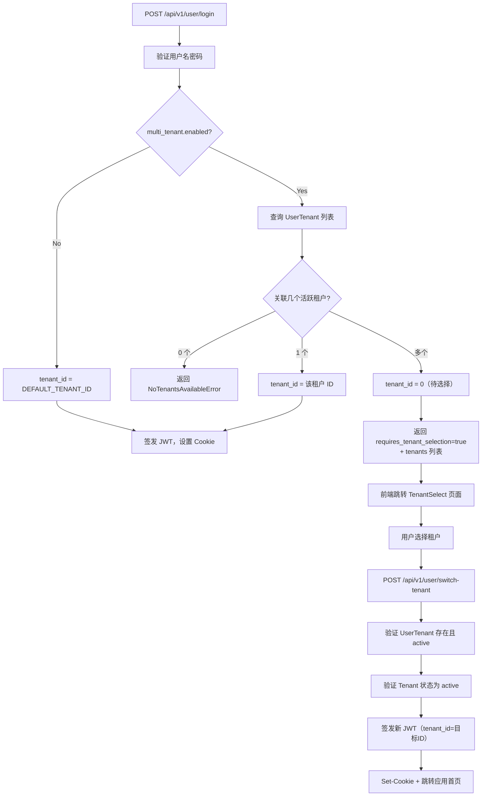

# 多租户架构

BiSheng v2.5.0 引入了基于**逻辑隔离**的多租户架构，在同一数据库实例内通过 `tenant_id` 列实现数据隔离，覆盖 44 张业务表和 5 种存储引擎（MySQL、Redis、Milvus、Elasticsearch、MinIO）。系统支持两种运行模式：**单租户模式**（`enabled=false`，向后兼容 v2.4.x）和**多租户模式**（`enabled=true`，强制租户上下文）。租户上下文通过 Python `ContextVar` 在请求作用域内传播，SQLAlchemy 事件钩子自动完成 SELECT 过滤和 INSERT 填充，开发者编写普通 ORM 代码即可获得租户隔离。

---

## 1. 架构总览

### 设计原则

- **逻辑隔离**：所有租户共享同一数据库实例，通过 `tenant_id` 列区分数据。选择逻辑隔离而非物理隔离（独立库/独立实例）的原因：降低运维复杂度、支持跨租户聚合查询、简化部署
- **向后兼容**：默认租户（id=1）在所有外部存储中不添加前缀，与 v2.4.x 的数据路径完全一致
- **透明接入**：业务代码无需手动添加 `WHERE tenant_id=X`，SQLAlchemy 事件钩子自动注入

### 租户隔离全链路



---

## 2. 配置与运行模式

### 配置模型

```python
# src/backend/bisheng/core/config/multi_tenant.py
class MultiTenantConf(BaseModel):
    enabled: bool = Field(default=False)       # 是否启用多租户
    default_tenant_code: str = Field(default='default')  # 默认租户编码
```

### config.yaml

```yaml
multi_tenant:
  enabled: false
  default_tenant_code: "default"
```

### 两种运行模式

| 维度 | 单租户模式 (`enabled=false`) | 多租户模式 (`enabled=true`) |
|------|---------------------------|--------------------------|
| 默认行为 | 所有查询自动使用 `DEFAULT_TENANT_ID=1` | 必须在请求上下文中设置 `tenant_id` |
| 无上下文时 | 回退到默认租户，不报错 | 抛出 `NoTenantContextError`（20004） |
| 登录流程 | 直接分配 `tenant_id=1` | 查询用户关联租户，可能需要选择 |
| 存储前缀 | 永远为空（原路径） | 默认租户为空，新租户加前缀 |
| 适用场景 | v2.4.x 升级后的默认模式 | 企业集团多组织部署 |

---

## 3. 数据模型

### ER 关系



### 租户感知的业务表（44 张）

以下表均包含 `tenant_id` 列（`INT NOT NULL DEFAULT 1`），由 Alembic 迁移 `v2_5_0_f001_multi_tenant.py` 统一添加：

| 模块 | 表名 |
|------|------|
| **核心应用** | `flow`, `flowversion`, `assistant`, `assistantlink`, `template` |
| **标签/分组** | `tag`, `taglink`, `group`, `groupresource`, `usergroup` |
| **角色/权限** | `role`, `roleaccess`, `userrole` |
| **会话/消息** | `chatmessage`, `message_session`, `t_report`, `t_variable_value` |
| **知识库** | `knowledge`, `knowledgefile`, `qaknowledge` |
| **工具** | `t_gpts_tools`, `t_gpts_tools_type` |
| **渠道** | `channel`, `channel_info_source`, `channel_article_read` |
| **分享** | `share_link` |
| **消息收件箱** | `inbox_message`, `inbox_message_read` |
| **微调/部署** | `finetune`, `presettrain`, `modeldeploy`, `server`, `sftmodel` |
| **Linsight** | `linsight_sop`, `linsight_sop_record`, `linsight_session_version`, `linsight_execute_task` |
| **LLM** | `llm_server`, `llm_model` |
| **评测/标注** | `evaluation`, `dataset`, `marktask`, `markrecord`, `markappuser` |
| **审计/邀请** | `auditlog`, `invitecode` |

**不包含 `tenant_id` 的表**：`user`（用户全局）、`user_tenant`（关联表，tenant_id 为 FK）、`tenant`（租户主表）、`config`（系统配置）、`recallchunk`（检索中间表）、`failed_tuple`（补偿表）

---

## 4. 租户上下文传播

### ContextVar 机制

租户隔离基于 Python 的 `contextvars` 模块，天然支持线程安全和异步安全。

```python
# src/backend/bisheng/core/context/tenant.py

DEFAULT_TENANT_ID: int = 1

# 请求作用域内的租户 ID
current_tenant_id: ContextVar[Optional[int]] = ContextVar('current_tenant_id', default=None)

# 是否绕过租户过滤（系统管理员跨租户查询）
_bypass_tenant_filter: ContextVar[bool] = ContextVar('_bypass_tenant_filter', default=False)
```

### API 函数

| 函数 | 用途 |
|------|------|
| `get_current_tenant_id()` | 获取当前上下文的租户 ID，未设置返回 `None` |
| `set_current_tenant_id(tid)` | 设置当前上下文的租户 ID |
| `bypass_tenant_filter()` | 上下文管理器，临时禁用租户过滤 |
| `is_tenant_filter_bypassed()` | 检查当前是否已绕过过滤 |

### 上下文设置时机

| 场景 | 设置方 | 文件 |
|------|--------|------|
| HTTP 请求 | `CustomMiddleware` 从 JWT Cookie 解码 | `utils/http_middleware.py` |
| WebSocket | `WebSocketLoggingMiddleware` 从 ASGI Cookie 解码 | `utils/http_middleware.py` |
| Celery 任务 | `task_prerun` 信号从 headers 恢复 | `worker/tenant_context.py` |
| 系统初始化 | 显式调用 `set_current_tenant_id()` 或 `bypass_tenant_filter()` | `common/init_data.py` |

---

## 5. 自动租户过滤（SQLAlchemy 事件钩子）

核心文件：`src/backend/bisheng/core/database/tenant_filter.py`

### 注册时机

`DatabaseManager._register_tenant_filter()` 在数据库连接管理器初始化时调用 `register_tenant_filter_events()`，注册全局 Session 事件。该函数幂等，多次调用只注册一次。

### 自动发现机制

`_discover_tenant_aware_tables()` 扫描 SQLModel 的 metadata，自动发现所有包含 `tenant_id` 列的表。新增 ORM 模型只要声明了 `tenant_id` 字段即可自动参与过滤，无需额外注册。

排除列表 `_EXCLUDED_TABLES = {'user_tenant'}`：`user_tenant` 的 `tenant_id` 是外键关联字段，非隔离字段。

### SELECT 拦截流程



`do_orm_execute` 事件通过两种方式提取查询中的表：
1. `column_descriptions` — 适用于 `select(Model)` 模式
2. `froms` 回退 — 适用于 joins 和 subquery

### INSERT 自动填充

`before_flush` 事件在 `session.new` 中遍历待插入对象：
- 若对象所属表在 `_tenant_aware_tables` 中，且 `tenant_id` 为 `None` 或 `0`，自动填充为当前上下文的租户 ID
- 多租户模式下若无上下文，跳过填充（由后续 SELECT 时的 `_resolve_tenant_id()` 捕获异常）

### 已知限制

`text()` 构造的原生 SQL **不触发** ORM 事件。使用原生 SQL 时必须手动添加 `WHERE tenant_id = X`。

---

## 6. HTTP / WebSocket 中间件

核心文件：`src/backend/bisheng/utils/http_middleware.py`

### 请求处理流程



### 豁免路径

以下路径不进行租户状态检查（登录前或系统级接口）：

```
/api/v1/user/login
/api/v1/user/register
/api/v1/user/sso
/api/v1/user/ldap
/api/v1/user/public_key
/api/v1/user/switch-tenant
/api/v1/user/tenants
/api/v1/env
/health
/docs
/openapi.json
/redoc
```

### WebSocket 中间件

`WebSocketLoggingMiddleware` 从 ASGI scope 的 headers 中解析 Cookie，调用相同的 `_set_tenant_context()` 函数设置租户上下文。

---

## 7. 存储隔离策略

核心文件：`src/backend/bisheng/core/storage/tenant_storage.py`

### 前缀规则

默认租户（id=1）不添加前缀，保持与 v2.4.x 完全兼容。新租户使用各存储引擎对应的前缀：

| 存储引擎 | 默认租户 (id=1) | 新租户 (id=2, code="acme") | 函数 |
|----------|:---------------:|:-------------------------:|------|
| MinIO | `""` (原路径) | `tenant_acme/` | `get_minio_prefix(tenant_id, tenant_code)` |
| Milvus | `""` (原集合名) | `t2_` | `get_milvus_collection_prefix(tenant_id)` |
| Elasticsearch | `""` (原索引名) | `t2_` | `get_es_index_prefix(tenant_id)` |
| Redis | `""` (原 key) | `t:2:` | `get_redis_key_prefix(tenant_id)` |

### 使用方式

这些函数定义的是前缀约定。实际的存储调用点在各业务模块中拼接前缀后再访问存储引擎：

- **MinIO**：文件上传路径拼接 `{prefix}{original_path}`
- **Milvus**：知识库创建时 collection 名为 `{prefix}{collection_name}`
- **ES**：索引创建时名为 `{prefix}{index_name}`
- **Redis**：缓存 key 拼接 `{prefix}{original_key}`

---

## 8. Celery 任务租户上下文传递

核心文件：`src/backend/bisheng/worker/tenant_context.py`

### 信号流程



### 三个 Celery 信号

| 信号 | 时机 | 作用 |
|------|------|------|
| `before_task_publish` | API 进程发布任务时 | 将当前 `tenant_id` 写入任务 `headers` |
| `task_prerun` | Worker 执行任务前 | 从 `headers` 恢复 `ContextVar`，无值时回退到 `DEFAULT_TENANT_ID` |
| `task_postrun` | Worker 执行任务后 | 重置 `ContextVar` 为 `None`，防止线程池复用时泄露 |

信号注册方式：`worker/main.py` 中 `import bisheng.worker.tenant_context` 触发模块级信号绑定。

---

## 9. 登录与租户选择流程

### 完整流程



### JWT Payload 结构

```json
{
    "user_id": 1,
    "user_name": "admin",
    "tenant_id": 2
}
```

`tenant_id=0` 是一个临时状态，表示用户已认证但尚未选择租户。中间件对此状态的非豁免路径返回 403。

---

## 10. 租户管理 API

### 端点清单

**管理员端点**（需要系统管理员权限）：

| 端点 | 方法 | 说明 |
|------|------|------|
| `/api/v1/tenants/` | POST | 创建租户（含根部门 + UserTenant + OpenFGA 元组） |
| `/api/v1/tenants/` | GET | 租户列表（分页 + 关键词搜索 + 状态筛选） |
| `/api/v1/tenants/{id}` | GET | 租户详情（含管理员用户列表） |
| `/api/v1/tenants/{id}` | PUT | 更新租户信息（名称 / logo / 联系人） |
| `/api/v1/tenants/{id}` | DELETE | 删除租户（须无活跃用户） |
| `/api/v1/tenants/{id}/status` | PUT | 状态管理（active / disabled / archived） |
| `/api/v1/tenants/{id}/quota` | GET/PUT | 配额查看 / 设置 |
| `/api/v1/tenants/{id}/users` | GET/POST/DELETE | 租户用户管理 |

**用户端点**（已登录用户）：

| 端点 | 方法 | 说明 |
|------|------|------|
| `/api/v1/user/tenants` | GET | 获取我的可用租户列表 |
| `/api/v1/user/switch-tenant` | POST | 切换租户（签发新 JWT） |

### 保护规则

- 默认租户（id=1）不可删除，不可修改 `tenant_code`
- 删除租户前须确认无活跃用户（`TenantHasUsersError`）
- 禁用租户时向 Redis 写入黑名单 key（`disabled_tenant:{id}`），中间件实时生效
- 不能移除租户最后一个管理员（`TenantAdminRequiredError`）

### 创建租户的原子流程

```
1. 创建 Tenant 记录（检查 tenant_code 唯一性）
2. 创建根部门（DepartmentService.acreate_root_department）
3. 回写 Tenant.root_dept_id
4. 为管理员用户创建 UserTenant 记录
5. 写入 OpenFGA 权限元组（admin + member）
```

---

## 11. 数据库迁移与初始化

### Alembic 迁移

迁移文件：`src/backend/bisheng/core/database/alembic/versions/v2_5_0_f001_multi_tenant.py`

**upgrade 流程**：

1. 创建 `tenant` 表
2. 创建 `user_tenant` 表（含 `uk_user_tenant` 唯一约束）
3. 为 44 张业务表添加 `tenant_id` 列（`INT NOT NULL DEFAULT 1`）+ 索引
4. 种子数据：插入默认租户 (id=1, code='default', name='Default Tenant')
5. 回填：为所有现有用户创建 `user_tenant` 记录（关联默认租户）

**downgrade**：逆序删除 `tenant_id` 列和表。注意 tenant_id > 1 的数据上下文会丢失。

### 应用初始化

`src/backend/bisheng/common/init_data.py` 中的相关函数：

| 函数 | Feature | 作用 |
|------|---------|------|
| `_init_default_tenant()` | F001 | 确保默认租户存在，回填 `user_tenant` |
| `_init_default_root_department()` | F002 | 为默认租户创建根部门 |
| `_migrate_rbac_to_rebac_if_needed()` | F006 | 一次性 RBAC → ReBAC 迁移（Redis SETNX 锁保证幂等） |

这些函数在应用启动时（lifespan）调用，使用 `bypass_tenant_filter()` 绕过租户过滤。

---

## 12. 前端集成

### 租户选择页

`src/frontend/platform/src/pages/LoginPage/TenantSelect.tsx`

- 在登录后若用户有多个可用租户，前端跳转到租户选择页
- 使用 `sessionStorage` 缓存待选租户列表（来自登录 API 响应）
- 用户点击租户后调用 `switchTenantApi(tenantId)` 获取新 JWT
- 成功后跳转到应用首页

### 租户管理页

`src/frontend/platform/src/pages/TenantPage/`

- 系统管理员可见的租户管理面板
- 租户列表（表格 + 搜索 + 状态筛选）
- 子组件：CreateTenantDialog（创建/编辑）、TenantUserDialog（用户管理）、TenantQuotaDialog（配额设置）
- 删除租户需输入 `tenant_code` 二次确认

### API 层

`src/frontend/platform/src/controllers/API/tenant.ts` 封装了所有租户相关 API 调用。

---

## 13. 错误码

模块编码：`200`（5 位编码 `200XX`）

| 错误码 | 类名 | 说明 |
|--------|------|------|
| 20000 | `TenantNotFoundError` | 租户不存在 |
| 20001 | `TenantDisabledError` | 租户已禁用 |
| 20002 | `UserNotInTenantError` | 用户不属于该租户 |
| 20003 | `TenantCodeDuplicateError` | 租户编码重复 |
| 20004 | `NoTenantContextError` | 多租户模式下缺少租户上下文 |
| 20005 | `TenantHasUsersError` | 删除租户时仍有活跃用户 |
| 20006 | `TenantAdminRequiredError` | 不能移除租户最后一个管理员 |
| 20007 | `TenantSwitchForbiddenError` | 用户不属于目标租户 |
| 20008 | `TenantCreationFailedError` | 租户创建失败 |
| 20009 | `NoTenantsAvailableError` | 用户无可用租户 |

---

## 14. 开发者注意事项

### 原生 SQL 的租户过滤

`text()` 构造的原生 SQL 绕过 ORM 事件，不会自动注入 `WHERE tenant_id=X`。使用原生 SQL 时必须手动添加租户过滤：

```python
# 错误 — 无租户过滤
session.execute(text("SELECT * FROM flow WHERE status = 'active'"))

# 正确 — 手动添加 tenant_id
tid = get_current_tenant_id()
session.execute(text("SELECT * FROM flow WHERE status = 'active' AND tenant_id = :tid"), {"tid": tid})
```

### bypass_tenant_filter 使用场景

`bypass_tenant_filter()` 是一个上下文管理器，临时禁用 SELECT 过滤和 INSERT 自动填充。仅在以下场景使用：

- 系统初始化（`init_data.py`）
- 系统管理员跨租户管理查询（`TenantDao` 内部）
- 登录/注册流程（用户尚无租户上下文）
- 数据迁移脚本

```python
from bisheng.core.context.tenant import bypass_tenant_filter

with bypass_tenant_filter():
    # 此上下文内的查询不带 WHERE tenant_id=X
    all_tenants = TenantDao.get_all()
# 退出后自动恢复过滤
```

### 新增 ORM 模型

只要在模型中声明 `tenant_id` 列，`_discover_tenant_aware_tables()` 会在应用启动时自动发现，无需额外注册：

```python
class MyNewModel(SQLModel, table=True):
    id: int = Field(primary_key=True)
    tenant_id: int = Field(default=0, index=True)  # 声明即参与自动过滤
    name: str
```

### Celery 任务

任务函数内的 ORM 操作自动享受租户隔离（通过 `task_prerun` 信号恢复上下文）。但若通过其他方式直接操作存储（如 Redis `SET/GET`、MinIO 上传），需手动拼接前缀。

### 测试

测试代码中需显式设置租户上下文：

```python
from bisheng.core.context.tenant import set_current_tenant_id, bypass_tenant_filter

def test_something():
    set_current_tenant_id(1)
    # ... 测试代码

def test_cross_tenant():
    with bypass_tenant_filter():
        # ... 跨租户查询
```

### 默认租户保护

id=1 的默认租户具有特殊保护：不可删除、不可修改状态、存储前缀为空。对默认租户的操作应格外谨慎。

---

## 15. 关键源码索引

所有路径相对于 `src/backend/bisheng/`，除非另有标注。

| 功能 | 文件路径 | 关键内容 |
|------|----------|----------|
| 租户上下文 ContextVar | `core/context/tenant.py` | `current_tenant_id`, `bypass_tenant_filter()` |
| SQLAlchemy 自动过滤 | `core/database/tenant_filter.py` | `do_orm_execute`, `before_flush` 事件钩子 |
| 过滤事件注册 | `core/database/manager.py:58-65` | `DatabaseManager._register_tenant_filter()` |
| 多租户配置 | `core/config/multi_tenant.py` | `MultiTenantConf` |
| 存储隔离前缀 | `core/storage/tenant_storage.py` | 4 种前缀函数 |
| HTTP 中间件 | `utils/http_middleware.py` | `CustomMiddleware`, `WebSocketLoggingMiddleware` |
| Celery 信号 | `worker/tenant_context.py` | 3 个 Celery signals |
| Worker 信号注册 | `worker/main.py` | `import bisheng.worker.tenant_context` |
| Tenant ORM 模型 | `database/models/tenant.py` | `Tenant`, `UserTenant`, DAO 类 |
| 租户管理服务 | `tenant/domain/services/tenant_service.py` | `TenantService` 业务逻辑 |
| 租户 CRUD API | `tenant/api/endpoints/tenant_crud.py` | 管理员 CRUD 端点 |
| 用户租户 API | `tenant/api/endpoints/user_tenant.py` | `switch-tenant`, `tenants` |
| 租户 DTO | `tenant/domain/schemas/tenant_schema.py` | 请求/响应 Pydantic 模型 |
| 错误码 | `common/errcode/tenant.py` | 20000-20009 |
| Alembic 迁移 | `core/database/alembic/versions/v2_5_0_f001_multi_tenant.py` | 表创建 + 44 表加列 |
| 初始化数据 | `common/init_data.py` | `_init_default_tenant()`, `_init_default_root_department()` |
| 前端租户选择 | `src/frontend/platform/src/pages/LoginPage/TenantSelect.tsx` | 租户选择页面 |
| 前端租户 API | `src/frontend/platform/src/controllers/API/tenant.ts` | API 调用封装 |
| 前端租户管理 | `src/frontend/platform/src/pages/TenantPage/` | 管理页面 |

---

## 相关文档

- [系统架构总览](./01-architecture-overview.md) — 运行时组件和数据流全景
- [数据模型与存储层](./07-data-models.md) — ORM 模型完整清单
- [部署架构与配置](./08-deployment.md) — 配置系统和环境变量
- [用户与权限体系](./10-permission-rbac.md) — RBAC/ReBAC 权限模型
- [商业版 API 网关](./11-gateway.md) — Gateway 与多租户的集成方向
