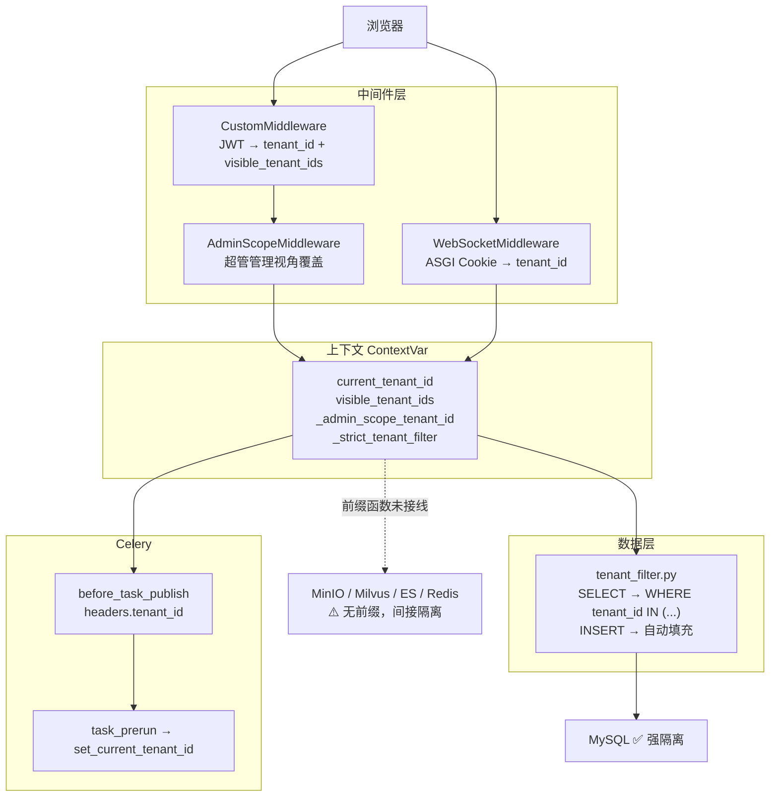

# 多租户架构

> **核实基准**：本文依据 `feat/3.0.0-beta1` 分支代码逐条核实（2026-08-05）。
> v2.5.0 建立扁平多租户基线，v2.5.1 重写为两层租户树并废弃用户手工切换，v2.6.0-beta2 撤销业务资源跨租户共享。本文描述**当前实现**，不是设计意图——凡实现与 v2.5 PRD 不符处均以代码为准并显式标注。

BiSheng 多租户采用**逻辑隔离**：所有租户共享同一数据库实例，通过 `tenant_id` 列区分数据。租户上下文经 `ContextVar` 在请求作用域传播，SQLAlchemy 事件钩子自动完成 SELECT 过滤与 INSERT 填充。

**隔离强度的真实边界**（务必先读这一条）：

| 存储 | 隔离机制 | 强度 |
|------|----------|------|
| MySQL | ORM 事件自动注入 `WHERE tenant_id IN (...)` | ✅ 强隔离，唯一真正生效的一层 |
| Milvus / ES | 无租户前缀；collection/index 名建库时随机生成，靠"拿不到 MySQL 里的名字就访问不到"间接隔离 | ⚠️ 间接 |
| MinIO | 无租户前缀（写侧不加前缀） | ⚠️ 靠 MySQL 侧的文件记录间接约束 |
| Redis | 无租户前缀，key 全局共用 | ❌ 不隔离 |

`core/storage/tenant_storage.py` 中的 4 个前缀函数（MinIO / Milvus / ES / Redis）**在生产代码中零调用方**，详见 §8。任何对外材料都不得声称"五种存储各自带租户前缀隔离"。

---

## 1. 架构总览

### 设计原则

- **逻辑隔离**：共享数据库实例，`tenant_id` 列区分。不支持独立库/独立实例的物理隔离（v2.5.0 F001 明确推迟到 v3.x，至今未做）
- **向后兼容**：默认租户（id=1，即 Root）数据路径与 v2.4.x 完全一致
- **透明接入**：业务代码写普通 ORM，事件钩子自动注入过滤

### 租户隔离链路


```mermaid
flowchart TB
    Browser["浏览器"]

    subgraph 中间件层
        HTTP["CustomMiddleware<br/>JWT → tenant_id + visible_tenant_ids"]
        SCOPE["AdminScopeMiddleware<br/>超管管理视角覆盖"]
        WS["WebSocketMiddleware<br/>ASGI Cookie → tenant_id"]
    end

    subgraph 上下文 ContextVar
        CV["current_tenant_id<br/>visible_tenant_ids<br/>_admin_scope_tenant_id<br/>_strict_tenant_filter"]
    end

    subgraph 数据层
        SQLFilter["tenant_filter.py<br/>SELECT → WHERE tenant_id IN (...)<br/>INSERT → 自动填充"]
    end

    MySQL["MySQL ✅ 强隔离"]
    Other["MinIO / Milvus / ES / Redis<br/>⚠️ 无前缀，间接隔离"]

    subgraph Celery
        Publish["before_task_publish<br/>headers.tenant_id"]
        PreRun["task_prerun → set_current_tenant_id"]
    end

    Browser --> HTTP --> SCOPE --> CV
    Browser --> WS --> CV
    CV --> SQLFilter --> MySQL
    CV -.前缀函数未接线.-> Other
    CV --> Publish --> PreRun
```

---

## 2. 配置与运行模式

```python
# core/config/multi_tenant.py
class MultiTenantConf(BaseModel):
    enabled: bool = False
    default_tenant_code: str = 'default'
    admin_scope_ttl_seconds: int = 14400   # F019 管理视角 Redis TTL，滑动刷新
```

```yaml
# config.yaml
multi_tenant:
  enabled: true
  default_tenant_code: "default"
```

| 维度 | `enabled=false` | `enabled=true` |
|------|----------------|---------------|
| 无上下文时 | 回退 `DEFAULT_TENANT_ID=1`，不报错 | 抛 `NoTenantContextError`(20004) |
| 登录流程 | 跳过整块租户逻辑 | 走 TenantResolver 派生叶租户 |
| 工作台配置 | 回落全局 `config` 表 | 写 `tenant_workstation_config` |
| Milvus 跨租户扩展 | `aexpand_with_root_shared` 原样返回 | （该方法本身无生产调用方，见 §8） |

**两处缺 enabled 守卫**（`enabled=false` 时仍会执行，属已知瑕疵）：

- `worker/tenant_reconcile/tasks.py` —— 6 小时归属对账任务无开关，单租户部署下空跑（无害）
- `tenant/api/endpoints/tenant_mount.py` —— 挂载/卸载 API 无开关，单租户模式下超管仍能挂子租户，但后续隔离逻辑不生效。**运维约束：必须先开 `enabled` 再挂载**

---

## 3. 租户树模型（v2.5.1 F011）

### 两层锁

```
Root (id=1, parent_tenant_id=NULL)
├── Child A (parent_tenant_id=1)
└── Child B (parent_tenant_id=1)
```

**INV-T1：硬锁两层。** 子租户由「把部门树上的某个部门节点标记为租户根」产生（mount），挂载时检查祖先链上是否已有挂载点，有则抛 `TenantTreeNestingForbiddenError`：`tenant_mount_service.py:193`。根部门不可挂载（`:186-188`）。

双向链接：`department.is_tenant_root=1` + `department.mounted_tenant_id` ↔ `tenant.root_dept_id`，在同一事务内写入（`tenant_mount_service.py:207-231`）。

### 状态机

| 状态 | 触发 | 语义 |
|------|------|------|
| `active` | mount 时创建 | 正常 |
| `disabled` | `PUT /tenants/{id}/status` | 写 Redis 黑名单 `disabled_tenant:{id}`（永久 key）+ 批量 bump 全体成员 `token_version` 踢下线（`tenant_service.py:266-292`）|
| `archived` | **仅由 unmount 产生** | **终态不可恢复**。状态机守卫拦截 archived→其它（`tenant_service.py:253-256`），防止前端"启用"按钮复活没有挂载点的租户 |
| `orphaned` | 挂载点部门被删 | 写审计 + 站内信通知超管（`department_deletion_handler.py:56,77-86`）。TenantResolver 遇到会继续向上找（`tenant_resolver.py:109-118`）|

Root 受保护：不可停用/归档/删除，22008（`tenant_crud.py:100-127`）。配额统计只算 `active` 子租户（`quota_service.py:710-717`）。

### unmount 流程

`tenant_mount_service.unmount_child`（`:484-608`），仅超管：

1. 该 Child 名下所有租户表数据 `tenant_id` 批量改回 1（`_migrate_child_resources_to_root`，预置工具行排除）
2. 同事务内：tenant 置 `archived` + `tenant_code` 改名为 `{code}#archived#{ts}` 释放唯一约束；部门 `is_tenant_root=0, mounted_tenant_id=NULL`
3. 清 FGA 中该 tenant 作为 object 或 user 的全部 tuple；资源级 `shared_with → tenant:{child}` **故意保留**（member userset 已死链，`:373-379`）
4. 重算子树用户归属（必须在清 flag 之后）
5. 写审计

v2.5.1 已把 unmount 收窄为唯一路径，旧的 archive/manual 三策略被删除；"冻结不迁移资源"的诉求归 disable（`:487-491`）。

---

## 4. 数据模型

### Tenant / UserTenant

关键字段（`database/models/tenant.py`）：

| 字段 | 说明 |
|------|------|
| `parent_tenant_id` | NULL=Root；否则指向 Root id（MVP 锁两层）|
| `share_default_to_children` | 见 §12——**字段名与实际语义已严重不符** |
| `root_dept_id` | 挂载点部门 |
| `status` | active/disabled/archived/orphaned |
| `quota_config` | JSON，租户级配额 |
| `storage_config` | ❌ **死字段**，全仓无运行时读取方 |

`UserTenant` 唯一约束在 v2.5.1 从 `(user_id, tenant_id)` 改为 **`(user_id, is_active)`**（`tenant.py:170`）：`is_active=1` 每人至多一行（当前归属），`is_active=NULL` 为历史流水（MySQL 唯一索引允许多 NULL）。

`is_default` 已退化为迁移期字段：运行时写死 0（`tenant_service.py:112`），唯一读取方 `get_user_default_tenant` 无调用方（死代码）。

### 租户感知表：79 张声明 / 78 张参与过滤

> 旧版本文档写的"44 张"已过时。统计需**沿基类链解析**——大量模型在 `XxxBase` 上声明 `tenant_id`、由 `Xxx(XxxBase, table=True)` 建表，只 grep 模型文件会严重漏数。

`user_tenant` 被显式排除（其 tenant_id 是外键非隔离列）：`tenant_filter.py:32`。

覆盖域：审批中心(11) / 权限 ReBAC(6) / 组织角色(8) / 应用与资源 / 会话消息(5) / LLM(5) / Linsight(5) / 微调(5) / 标注(3) / 运营审计等。

**不带 tenant_id 的 24 张**，三类：

- **真全局**：`user`（用户是全局对象，租户归属靠 `user_tenant`+部门树外挂表达）、`user_link`、`config`、`tenant` 自身、权限目录/DSL 全套（8 张，平台级）、`dashboard_default`
- **靠父表间接隔离**：`knowledge_document(_version)`、`dashboard_component/dataset`、`message_citation`、`recallchunk` 等
- **值得注意的两张 ACL 表**：`department_admin_grant`、`space_channel_member`（配额统计时 JOIN 父表兜 tenant，`quota_service.py:75-96`）

---

## 5. 租户上下文

```python
# core/context/tenant.py
current_tenant_id      : ContextVar[int | None]          # v2.5.0 基线
_bypass_tenant_filter  : ContextVar[bool]
visible_tenant_ids     : ContextVar[frozenset | None]    # v2.5.1 F012：IN-list
_strict_tenant_filter  : ContextVar[bool]                # 强制退回严格等值
_admin_scope_tenant_id : ContextVar[int | None]          # F019 超管管理视角
_is_management_api     : ContextVar[bool]
```

`get_current_tenant_id()` **优先返回 admin-scope 覆盖值**（`tenant.py:79-95`）。

### visible_tenant_ids 的不对称性

`_compute_visible_tenant_ids`（`utils/http_middleware.py:207-227`）：

| 主体 | 可见集合 | 含义 |
|------|----------|------|
| 全局超管（无 admin-scope） | `None` | 不注入任何过滤 |
| Root 用户 | `{1}` | **闭** —— 总部看不到子租户数据 |
| Child 用户 | `{自己, 1}` | **开** —— 子租户可见 Root（用于读共享资源）|
| `tenant_id=0` | `frozenset()` | 注入 `WHERE false()`，中间件另行 403 |

方向性是刻意设计：Root 想看 Child 数据必须显式切 admin-scope，且仅在白名单内生效。

### strict_tenant_filter 的三类必用场景

strict 时 `_resolve_visible_tenant_ids()` 返回 None，回落严格等值（`tenant_filter.py:349`）。不用会出错的地方：

1. **配额计数**（INV-T6）：Child 的 visible 含 1，不 strict 会把 Root 资源算进 Child 用量 → 一上来就"超配额"。`quota_service.py:697-708`
2. **"我拥有多少资源"判定**：改部门时统计旧租户资源数，IN-list 会误报 → 卡住所有人调岗。`user_tenant_sync_service.py:247`
3. **引用投影收敛**：工作台继承 Root 配置后，把引用到的知识库/应用收敛到本租户实有行，否则 UI 显示了点进去 403。`workstation_service.py:438,492,504`

---

## 6. 自动租户过滤

`core/database/tenant_filter.py`，由 `DatabaseManager._register_tenant_filter()` 幂等注册。

**自动发现**：`_discover_tenant_aware_tables()`（`:127-141`）扫描 `SQLModel.metadata`，凡有 `tenant_id` 列的表自动入列——新模型声明字段即参与，无需注册。

**SELECT 注入**（`do_orm_execute`，`:157-197`）：bypass → 非 SELECT → 无租户表 均跳过；否则按 visible 集合注入 `== X` / `IN (...)` / `false()`。

**INSERT 填充**（`before_flush`，`:198-232`）：`session.new` 中 tenant_id 为 None/0 的自动填当前租户。

### 两个必须知道的限制

**① 只拦 SELECT。** `:163-164` 对非 SELECT 直接 return——**批量 `update()` / `delete()` 与 `text()` 原生 SQL 一律无注入**，必须手写 tenant 条件。已导致两次跨租户泄漏（LLM 模块、F035）。

需要手挂条件时用 `build_tenant_filter_clause(tenant_col)`（`:235-282`），逻辑与监听器一致。

当前全仓原生 SQL 触及租户表的情况：3 处手写了条件（`tenant_mount_service.py:336,450-454`、`knowledge_rag.py:136`），**3 处没带**——`message.py:284`（靠 flow_id 间接约束）、`mark_record.py:94`（靠 task_id）、`role_service.py:879`（**只按 id 取、无租户条件**，三者中风险最高）。另 `quota_service.py:65-105` 的 `_RESOURCE_COUNT_TEMPLATES` 是一整套裸 SQL，手工把 `{col}` 填成 tenant_id，功能正确但属技术债（作者自陈于 `:698-701`）。

**② 强制 import 列表有缺口。** `_TENANT_AWARE_MODEL_MODULES`（`:41-104`）显式 import 55 个模块以保证模型进入 metadata，但带 `tenant_id` 的模型分布在 60 个模块中。**未列入的 5 个**：`approval.domain.models.approval_instance`、`approval_scenario`、`user_menu_access`、`knowledge_space_tag_library`、`sensitive_word_policy`。这些表能否被过滤取决于路由链是否恰好 import 到——`:36-40` 的注释指明这正是 v2.5 泄漏的成因。**排查手法**：启动日志中的 `Tenant filter events registered for N tables`，N 应为 78。

---

## 7. 中间件

`utils/http_middleware.py`：

1. 解 JWT → `set_current_tenant_id`
2. `_apply_token_version_and_visible`（`:229-247`）：校验 `token_version`，不匹配返 **401+19103** 强制重登；Redis 5min 缓存，基础设施故障时 **fail-open**（`:122-141`）
3. 计算并设置 `visible_tenant_ids`
4. `tenant_id==0` → 403+20004；Redis 黑名单命中 → 403+20001（`:334-352`）

`AdminScopeMiddleware`（`common/middleware/admin_scope.py`）注册在更内层（`main.py:273`），确保 JWT 已解析。它**独立复核调用者是否超管**，非超管 fail-closed 不读 Redis key（`:106-116`），防伪造。

豁免路径：login / register / sso / ldap / public_key / user/tenants / env / health / docs / openapi.json / redoc。

WebSocket 走 `WebSocketLoggingMiddleware`，从 ASGI headers 解 Cookie 后调用同一套 `_set_tenant_context()`。

---

## 8. 存储隔离现状 ⚠️

**本节是与旧文档差异最大的部分。**

`core/storage/tenant_storage.py` 定义了 4 个前缀函数：

| 函数 | 定义 | 生产调用方 |
|------|------|-----------|
| `get_minio_prefix` | `:14` | **无**（仅 `test/tenant/test_tenant_storage.py`）|
| `get_milvus_collection_prefix` | `:25` | **无** |
| `get_es_index_prefix` | `:36` | **无** |
| `get_redis_key_prefix` | `:47` | **无** |

文件自身 docstring 已说明原因（`:7-8`）：*"These functions define the prefix convention only. Actual storage call sites are modified in F008-resource-rebac-adaptation, **not here**"* —— **F008 的接线从未落地**。全仓 grep `tenant_{` 只命中该文件自身与 MinIO 的正则。

### 各存储的真实隔离方式

- **Milvus / ES**：无前缀。collection/index 名建库时随机生成（`knowledge_service.py:732-733`，`index_name = generate_knowledge_index_name()`，collection 同名）。隔离是**间接的**——拿不到 MySQL 里的 knowledge 行就拿不到名字。同一实例内物理不分租户。
- **Redis**：无前缀，key 全局共用。
- **MinIO**：写侧无前缀。读侧有一段前缀剥离兜底（`minio_storage.py:39,180-200`，接线于 `:508,553,592`），但由于无任何写方产生 `tenant_*/` key，`_translate_to_root_prefix` 恒返回 None → **半死代码**（函数被调用，分支永不进入）。

### 其它未接线的跨租户存储能力

`KnowledgeRag.aexpand_with_root_shared`（`knowledge_rag.py:69`，Milvus 检索"Child + Root 共享"并集）**无生产调用方**，仅测试引用。

> **结论**：对外描述隔离能力时，只能说"数据层通过租户标识强制过滤"，不能说"各存储引擎独立分区"。若客户合规要求物理隔离，须独立部署实例。

---

## 9. Celery 租户上下文传递

`worker/tenant_context.py`，三个信号：

| 信号 | 作用 |
|------|------|
| `before_task_publish` | 把当前 tenant_id 写入任务 headers |
| `task_prerun` | 从 headers 恢复 ContextVar，无值回退 `DEFAULT_TENANT_ID` |
| `task_postrun` | 重置为 None，防线程池复用泄露 |

注册靠 `worker/main.py` 中 `import bisheng.worker.tenant_context` 触发模块级绑定。

**Beat × 多租户**：Beat 调度只触发一次，任务体需自行遍历租户——每轮 `set_current_tenant_id()`，且跨租户枚举查询本身要包在 `bypass_tenant_filter()` 里。

---

## 10. 用户归属派生（v2.5.1 F012，已取代"租户选择"）

> **旧文档的"登录时选择租户 + Header 切换器"整套已废弃。**

### TenantResolver

`tenant/domain/services/tenant_resolver.py`：

```
用户主部门 → 沿物化路径向上找最近 is_tenant_root=1 的部门
          → 取其 mounted_tenant_id
          → 挂载点租户非 active 则继续向上（:100-118）
          → 无主部门 / 无挂载点 / 全非 active → 回落 Root(1)
          → 路径成环 → TenantCycleDetectedError（:90-97）
```

**部门树是真相，`user_tenant` 是派生投影**，由 `UserTenantSyncService.sync_user` 对齐（`user_tenant_sync_service.py:69-145`），三个触发点：登录、改主部门、6 小时 Celery 对账。

登录期租户闸门（`user/domain/services/user.py`）：主部门指向 disabled 租户 → 拒登（`:483-505`）；无 active `user_tenant` → 尝试挂默认租户，仍失败则 `NoTenantsAvailableError`（`:508-522`）；leaf 非 active 或命中黑名单 → `TenantDisabledError`（`:566-592`）。**JWT 里的 tenant_id 会被 resolver 结果覆盖**（`:552-554`）。

### 调岗安全阀

若用户在旧租户下持有资源（knowledge/flow/assistant/channel/t_gpts_tools，`user_tenant_sync_service.py:57-63`），且 `settings.user_tenant_sync.enforce_transfer_before_relocate=True`，改部门被 `TenantRelocateBlockedError` 拦下（`:98-112`），须先转移资源。默认关闭。

归属变更会 bump `token_version`（`:117`）强制重登，并连带清除 admin-scope（`:126-129`）。

### 已废弃

- `POST /api/v1/user/switch-tenant` → **410 Gone**，且故意不挂 auth 依赖（避免客户端对 401/403 重试）：`tenant/api/endpoints/user_tenant.py:29-47`
- `TenantService.aswitch_tenant` 服务层仍在但无调用方（死代码）
- `requires_tenant_selection` 逻辑仍在但**紧接着被 resolver 覆盖**，实际永不生效
- 前端 `TenantSelect.tsx` 已改为墓碑页，全仓无任何跳转来源
- `GET /api/v1/user/tenants` 仍存活，仅作展示

---

## 11. 管理 API

### 租户 CRUD（超管）

| 端点 | 状态 |
|------|------|
| `POST /api/v1/tenants/` | **410 Gone** —— 改由部门挂载产生 |
| `GET /api/v1/tenants/` | 列表（分页+搜索）|
| `GET/PUT /api/v1/tenants/{id}` | 详情 / 更新（仅名称等）|
| `DELETE /api/v1/tenants/{id}` | 物理删除。前置：子树内 0 用户（`acount_users_by_tenant_subtree`）。连带删 UserTenant 行、该租户部门、Redis 黑名单 key、FGA tuple（`tenant_service.py:318-358`）|
| `PUT /api/v1/tenants/{id}/status` | active/disabled |
| `GET/PUT /api/v1/tenants/{id}/quota` | 配额 |
| `GET /api/v1/tenants/{id}/users` | 存活。数据源已从 `user_tenant` 换为**部门子树派生**（F024，避免"幽灵成员"）|
| `POST /api/v1/tenants/{id}/users` | **410 Gone** |
| `DELETE /api/v1/tenants/{id}/users/{user_id}` | **410 Gone** |

410 响应体指路改主部门接口，标 `deprecated_since: v2.5.1, removed_in: v2.6.0`（`tenant_users.py:25-36`）。

### 挂载 / 卸载

`POST /api/v1/departments/{dept_id}/mount-tenant`、`DELETE` 同路径，仅超管（`_require_super` → 22010）。

`POST /tenants/{id}/resources/migrate-from-root` 后端存活但**前端无调用**，仅 API 可达。

### admin-scope（F019）

- `POST /api/v1/admin/tenant-scope`，body `{tenant_id: int|null}`，null 清除
- `GET` 读当前 scope + 剩余 TTL
- Redis `admin_scope:{user_id}`，TTL 14400s 滑动续期

**白名单前缀（仅这些路径行为会变）**，`admin_scope.py:62-70`：

```
/api/v1/llm, /api/v1/workstation, /api/v1/linsight,
/api/v1/tool, /api/v1/knowledge, /api/v1/chat/online, /api/v1/admin
```

非白名单走快速路径完全不受影响（`:88-93`）。注释记录 `/api/v1/roles` 已移除、`/api/v1/audit_log` 是从未匹配过的死字符串（真实前缀 `/api/v1/audit`）。

**前端入口只有 2 处**：`ModelPage/manage/ScopeBar.tsx`（模型管理）与 `BuildPage/bench/DialogueWork.tsx`（工作台配置）。白名单里的 knowledge / tool / linsight 等**没有 UI 入口**。`components/AdminScopeSelector.tsx` 是零 import 的死代码。

> v3.0 修复：`DialogueWork.tsx` 的 ScopeBar 曾缺 `multiTenantEnabled` 守卫（ModelPage 侧有），单租户部署下超管在工作台配置页仍会看到「管理视图」下拉。现两处调用点已一致地写成 `{appConfig.multiTenantEnabled && <ScopeBar .../>}`。

---

## 12. 跨租户共享现状 ⚠️

**仅 `llm_server` 一种类型。**

```python
# tenant/domain/services/resource_share_service.py:60-62
SUPPORTED_SHAREABLE_TYPES: set[str] = {'llm_server'}
```

`knowledge_space / workflow / assistant / channel / tool` 五类业务资源在 **v2.6.0-beta2 移除**（QA 发现子租户用户在"我加入的空间"里看到从未加入的 Root 知识空间），退到 `LEGACY_SHAREABLE_TYPES`（`:66-75`）仅供撤销/清理存量 tuple。历史 tuple 由 alembic `f041_revoke_business_resource_share` 撤回。

**死代码提醒**：`tenant_mount_service.py:437-455` 扫描 5 类 `is_shared=1` 资源的 UNION SQL **已无任何调用方**。`components/bs-ui/sharedBadge/` 前端组件零 import。

### llm_server 共享是真接线的

- 创建时按 `share_to_children` 标志 fan out：`llm_server.py:196-207`
- 开关：`aupdate_server_share`（`:213-231`），仅超管、仅 Root 归属的 server，否则 `LLMModelSharedReadonlyError`
- 删除时撤销：`:466-470`
- 前端唯一入口：`ModelPage/manage/ModelConfig.tsx:688-703`，可见条件 `canShareToChildren()`（`permissions.ts:59-66`）四条全满足
- **开关是布尔的**：开=共享给全部活跃 Child，关=全部收回，**不能指定共享给某几个 Child**
- 新 Child 挂载时 fan out Root 全部 llm_server（`tenant_mount_service.py:305-340`）

### share_default_to_children 的真实语义

字段名严重误导。它**已不再控制**业务资源分发或 llm_server 共享——后者由每请求的 `share_to_children` 标志独占控制，代码中有明确注释推翻（`llm_server.py:196-199`）。

**当前唯一实际效果**：子租户是否继承 Root 的**系统模型默认选型**（`tenant_system_model_config.py:171,196` + `llm/domain/share_fallback.py:51,58`）。写文档或改代码时按此语义理解，不要按字面。

### 另外两条"像共享实则不是"的路径

- **系统模型配置回落**：Child 无行时读时回落 Root，不是 FGA 共享
- **内置工具是复制不是共享**：`acopy_root_builtin_tools_to_tenant` 给子租户建自己 tenant_id 的副本行

---

## 13. 权限与租户交叉

### 三层管理员

| 角色 | 判定 | 边界 |
|------|------|------|
| 全局超管 | FGA `super_admin system:global`，回退 RBAC `AdminRole=1` | visible=None 不注入过滤；独占挂载/卸载、admin-scope、授撤 Child Admin、租户 CRUD、翻转共享开关 |
| Root 管理员 | tenant_id=1 的管理员 | **Root 没有 `tenant#admin` 概念**，权限一律走 `system:global#super_admin`（`tenant_admin_service.py:9-13`）|
| Child 管理员 | FGA `tenant:{id}#admin` | 本租户内：建模型、配系统模型/工作台、管理子树用户与权限。不能碰 Root、不能改共享开关、不能挂载 |

依赖 `get_tenant_admin_user`（`common/dependencies/user_deps.py:78-102`）：超管 **或** 当前 tid≠1 且 `has_tenant_admin(tid)`。

### 资源授权的租户约束

**授权侧是硬校验**：`TenantPermissionSubjectDirectory.canonical_source`（`tenant/domain/services/f048_permission_subject.py:53-91`）对三种主体全部要求 tenant 匹配资源自身的 tenant，不匹配抛 `PermissionInvalidResourceError`（`:82-83`）。

→ **总部资源无法授权给子租户用户**，跨租户授权在 F048 grant API 被硬拦。

**选人侧是弱的**：`GET /api/v1/user/list` —— `user` 表无 tenant_id 列，ORM 自动过滤对它完全不起作用；且 `login_user.is_admin()` 为真时整段收窄逻辑被短路（`user/api/user.py:439`），超管能搜到全平台用户。

→ 真实表现：**超管在授权弹窗能选到子租户用户，但提交必被拒**。这是 UX 缺口而非越权漏洞，对外表述统一为"资源只能授权给本租户成员"。

### 同租户内不默认互通

2026-04-21 Round 2 收窄：资源的 manager/editor 移除所有 `tenant#` 来源，viewer 只保留 `tenant#shared_to#member`。资源授权回归 4 源（owner + user + department#member + user_group#member）。

**后果**：同一租户内的成员默认看不到彼此的资源，必须显式授权。IN-list 只决定"元数据可见性"，不等于可读内容。

---

## 14. 配额层级（v2.5.1 F016）

租户级配额存 `Tenant.quota_config` JSON；角色级配额存 `role.quota_config`。合法 key 集合见 `quota_service.py:44,30-41`；`-1` = 无限制。

### 双层取严 + Root 硬顶（INV-T9）

`QuotaService` 创建资源前构造租户链 `chain = [leaf]` 或 `[leaf, Root]`（两层锁的直接体现），逐层比对，任一层 `remaining == 0` 即拒绝：

| 层 | 用量算法 | 超限 reason |
|----|----------|-------------|
| Child（leaf） | `_count_usage_strict` —— 必须 strict，否则 IN-list 会把 Root 资源算进 Child 用量 | `tenant_limit` |
| Root | `_aggregate_root_usage` —— **自身 + Σ 所有 active 子租户** | `root_hardcap`，文案含"集团总量已耗尽" |

即**Root 配额是全集团总量天花板**：Root 满时所有 Child 一并被阻断，此时给单个 Child 加配额无效。disabled/archived/orphaned 子租户视为退出资源池，不计入累加（`quota_service.py:710-717`）。

实现：`role/domain/services/quota_service.py:200-268`。接线点包括知识空间上传（`workstation/api/endpoints/knowledge.py:73`）、频道创建（`channel_service.py:1426`）等。

### 存储 key 别名

租户管理 UI 只写 `storage_gb`，而角色级装饰器用 `knowledge_space_file`，二者在读取租户级上限时别名到同一个 `storage_gb` key（`quota_service.py:243-245`）。改动任一侧都要同步。

### 前端只暴露一项

`TenantQuotaDialog` 只渲染 `storage_gb`（0.1~99999，一位小数）。后端支持的 `user_count` / `model_tokens_monthly` 以及 9 项角色级配额**没有租户级配置入口**——写进 `quota_config` 也只能靠 API。

---

## 15. 迁移与初始化

| 迁移 | 内容 |
|------|------|
| `v2_5_0_f001_multi_tenant.py` | 建 `tenant`/`user_tenant`，业务表加 `tenant_id`，插入 Root(id=1, code='default') |
| `alembic_helpers/f011.py` | Root 改树形（`parent_tenant_id=NULL`）；`is_default=1 且 active` 回填 `is_active=1`；多活跃行去重（保留 `last_access_time` 最新）；换唯一索引 |
| `v2_5_1_f012_user_token_version.py` | `user` 加 `token_version` |
| `f041_revoke_business_resource_share` | 撤回 5 类业务资源的存量共享 tuple |

应用启动 lifespan 中 `common/init_data.py`：`_init_default_tenant()`、`_init_default_root_department()`，均包在 `bypass_tenant_filter()` 内。

单→多租户流程：跑迁移 → 开 `enabled=true` → 重启 → `POST /departments/{id}/mount-tenant` 建首个 Child。

---

## 16. 前端集成

| 界面 | 位置 | 说明 |
|------|------|------|
| 租户管理菜单 | `MainLayout.tsx:245-251` | 条件 `isSuperAdmin && multiTenantEnabled` |
| 租户列表页 | `pages/TenantPage/index.tsx` | **无新建按钮**；操作=编辑/配额/停用启用/删除；archived 行只剩删除 |
| 挂载入口 | `SystemPage/components/Departments.tsx:228` → `DepartmentSettings.tsx:564-608` | 「标记为子租户」/「取消挂载」，条件 `multiTenantEnabled && is_global_super` |
| 挂载弹窗 | `MountTenantDialog.tsx` | 租户名称 + 初始管理员（限该部门子树）；无 tenant_code 输入 |
| 配额弹窗 | `TenantQuotaDialog.tsx:56-61` | **界面只暴露 `storage_gb` 一项**（0.1~99999）。后端支持的其它 key 读进来但不渲染 |
| 成员弹窗 | `TenantUserDialog.tsx` | 仅展示 + 设/取消管理员；Root 租户隐藏操作列 |
| 管理视角 | `ModelPage/manage/ScopeBar.tsx:127-173` | 下拉形态；`isGlobalSuperUser` 为假直接返回 null |
| 共享开关 | `ModelPage/manage/ModelConfig.tsx:688-703` | 「共享给子租户」，默认 true |
| 只读标识 | `ModelPage/manage/index.tsx:59-67` | 「{{tenantName}} 共享 · 只读」+ 按钮禁用 |

**client 端（`/workspace`）完全无多租户 UI**，仅在跨租户/配额错误码文案中出现"租户"字样。注意其中 `10972`/`18041` 文案写着"请切换到…所属租户后重试"，但界面上并无切换入口——措辞待修。

**前端死代码**（勿参考）：`AdminScopeSelector.tsx`、`bs-ui/sharedBadge/`、`pages/DepartmentPage/`（`/department` 已重定向到 `/sys`）、`DepartmentTree.tsx`（线上用 `LazyDepartmentTree`）。

**i18n 缺口**：24 个代码在用的 `tenant.*` key 三个 locale 文件全缺，靠 `defaultValue` 中文兜底 —— **英/日界面会显示中文**，集中在部门挂载流程（`tenant.markAsTenant`/`mountTitle`/`mountHint`/`mountedTag` 等）、取消挂载、配置继承 banner、下线提示页四组。另有 16 个孤儿文案（成员增删、联系人、租户切换），是已下线功能的残留，勿据以反推功能。

---

## 17. 错误码

模块 `200`（20000-20009）：`TenantNotFoundError`(20000) / `TenantDisabledError`(20001) / `UserNotInTenantError`(20002) / `TenantCodeDuplicateError`(20003) / `NoTenantContextError`(20004) / `TenantHasUsersError`(20005) / `TenantAdminRequiredError`(20006) / `TenantSwitchForbiddenError`(20007) / `TenantCreationFailedError`(20008) / `NoTenantsAvailableError`(20009)。

租户树相关另用 `220` 段（22001 嵌套禁止 / 22008 Root 受保护 / 22010 需超管），LLM 隔离用 `198` 段（19801 共享只读 / 19803 跨 tenant 写 / 19804 端点白名单）。

> 前端 zh-Hans 仍保留 `19501`「仅根租户可将资源共享给子租户」文案，该码随业务资源共享一并删除，属残留。

---

## 18. 开发者注意事项

- **原生 SQL / 批量 UPDATE·DELETE 无自动过滤**，手写条件或用 `build_tenant_filter_clause()`。见 §6①
- **新增带 tenant_id 的模型时**，务必把模块加进 `_TENANT_AWARE_MODEL_MODULES`（`tenant_filter.py:41-104`），否则过滤是否生效取决于 import 时序。见 §6②
- **配额/归属统计必须包 `strict_tenant_filter()`**。见 §5
- **`bypass_tenant_filter()` 仅用于**：系统初始化、超管跨租户管理查询、登录注册（尚无上下文）、迁移脚本
- **Celery Beat 遍历租户**时逐个 `set_current_tenant_id()`，枚举查询本身包 `bypass_tenant_filter()`
- **测试**中显式 `set_current_tenant_id(1)`
- **改动对外表述前**先读 §8 与 §12——这两节是历史文档最容易出错的地方

---

## 19. 源码索引

路径相对 `src/backend/bisheng/`。

| 功能 | 文件 |
|------|------|
| 租户上下文 | `core/context/tenant.py` |
| 自动过滤 | `core/database/tenant_filter.py` |
| 配置 | `core/config/multi_tenant.py` |
| 存储前缀（未接线） | `core/storage/tenant_storage.py` |
| HTTP 中间件 | `utils/http_middleware.py` |
| admin-scope 中间件 | `common/middleware/admin_scope.py` |
| Celery 信号 | `worker/tenant_context.py` |
| ORM 模型 | `database/models/tenant.py` |
| 归属派生 | `tenant/domain/services/tenant_resolver.py` |
| 归属同步 | `tenant/domain/services/user_tenant_sync_service.py` |
| 挂载/卸载 | `tenant/domain/services/tenant_mount_service.py` |
| 租户服务 | `tenant/domain/services/tenant_service.py` |
| 管理员授撤 | `tenant/domain/services/tenant_admin_service.py` |
| 跨租户共享 | `tenant/domain/services/resource_share_service.py` |
| 授权主体租户校验 | `tenant/domain/services/f048_permission_subject.py` |
| 配额 | `role/domain/services/quota_service.py` |
| admin-scope 服务 | `admin/domain/services/tenant_scope.py` |
| 前端租户管理 | `src/frontend/platform/src/pages/TenantPage/` |
| 前端挂载 | `src/frontend/platform/src/pages/DepartmentPage/components/MountTenantDialog.tsx` |

---

## 相关文档

- [系统架构总览](./01-architecture-overview.md)
- [用户与权限体系](./10-permission-rbac.md) — ReBAC/OpenFGA
- [数据模型与存储层](./07-data-models.md)
- [商业版 API 网关](./11-gateway.md)
- **对外口径的使用说明** → [`docs/product/多租户产品使用说明.md`](../product/多租户产品使用说明.md)（客户交付版，不含本文的实现细节与缺口记录）
