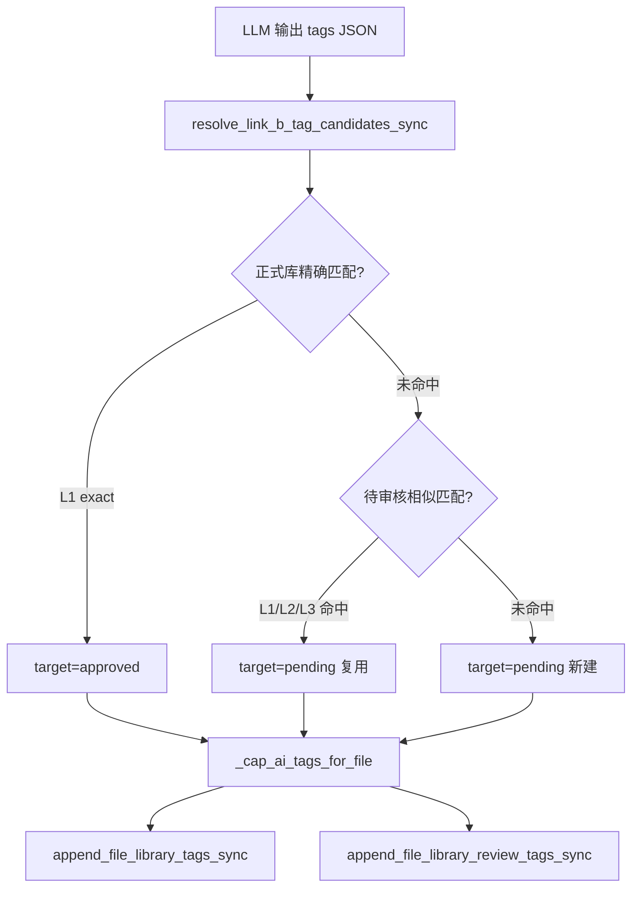

# 知识空间 Link B 标签匹配与租户复用实现方案（正式库精确 / 待审核相似）

> 版本：v1.4  
> 日期：2026-07-24  
> 范围：`KnowledgeSpaceReviewTagService`（Link B，L31–68 Prompt + 解析链路）、`TagLibraryTagService`  
> 状态：设计稿（待实现）  
> 关联代码：`src/backend/bisheng/knowledge/domain/services/knowledge_space_review_tag_service.py`

---

## 0. 需求陈述

针对 Link B（`DEFAULT_REVIEW_TAG_SYSTEM_PROMPT`，约 L31–68），实现以下业务规则：

| # | 规则 | 实现层 |
|---|------|--------|
| R1 | 生成标签与租户内**待审核标签**接近 → **复用**已有 `review_tag`（只增 `review_tag_link`） | 代码 Resolver（主）+ Prompt（辅） |
| R2 | 复用范围：**租户全局**（`tenant_id`），不限当前 space 绑定 library | Catalog SQL |
| R3 | 生成标签与租户**正式标签库**名称**精确一致**（归一化后相等）→ **直接使用库中标签**（`tag` + `tag_link`，已生效） | 代码 Resolver（主） |
| R4 | 优先级：**正式库（精确）> 待审核（相似）> 新建 pending** | `resolve_link_b_tag_candidates_sync` |

**匹配策略摘要**：

| Catalog | 匹配方式 |
|---------|----------|
| **正式标签库** | **仅精确匹配**（L1：`normalize` 后相等）；不做子串、不做 `SequenceMatcher` |
| **待审核标签** | **相似匹配**（L1 精确 + L2 子串 + L3 ratio） |

**原则**：Prompt 引导 LLM 输出规范名称；**最终是否复用由代码层 Tag Resolver 保证**（不可仅依赖 Prompt）。

**规模参考**：生产租户约 5000 正式 + 3000 待审核标签时，性能要求见 **§19**。

---

## 1. 背景与目标

### 1.1 背景

知识空间 AI 打标签分为两条链路：

| 链路 | 服务 | 行为 |
|------|------|------|
| **Link A** | `KnowledgeSpaceAutoTagService` | 从**已入库标签库**中选标签，写入 `tag` + `tag_link` |
| **Link B** | `KnowledgeSpaceReviewTagService` | LLM 生成**不在库中**的新标签，写入 `review_tag` + `review_tag_link`（待审核） |

当前 Link B 存在以下问题：

1. **`_match_library_tags` 在库则丢弃**：LLM 若输出已入库标签名，不会挂到文件上（Link A 未选中时信息丢失）。
2. **待审核仅精确匹配**：`append_file_library_review_tags_sync` 仅当 `ReviewTag.name` 与候选名**完全一致**时复用，近似名（如「机器学习」vs「机器学习-模型训练」）会重复创建 pending。
3. **scope 不一致**：手动打标有 `_find_tenant_pending_review_tag_by_name`（租户全局 + 排除已入库），Link B 未复用。

### 1.2 目标

在 Link B LLM 产出候选标签后，增加 **Tag Resolver** 层，实现：

| 匹配结果 | 行为 |
|----------|------|
| 命中租户**正式标签库**（**精确**，归一化后同名） | 直接使用库中 canonical 名，写 `tag` + `tag_link`（**已生效，无需审核**） |
| 未命中正式库，但命中租户**待审核标签**（精确或相似） | 复用已有 `review_tag`，只增 `review_tag_link` |
| 均未命中 | 新建 `review_tag` + `review_tag_link` |

约束：

- **租户全局**复用（`tenant_id`），不限于当前 space 绑定的 library。
- **正式库优先于待审核**；正式库侧**不允许**相似合并，避免误挂已审核标签。
- Link B worker 为 **sync** 路径，不依赖 `login_user`。

---

## 2. 现状代码锚点

### 2.1 Link B 主流程（改前）

```
KnowledgeSpaceReviewTagService.apply_after_review_upload_parse
  → _invoke_llm
  → _match_library_tags          # 在库则丢弃
  → _cap_ai_tags_for_file
  → append_file_library_review_tags_sync
```

关键文件：

- `src/backend/bisheng/knowledge/domain/services/knowledge_space_review_tag_service.py`
- `src/backend/bisheng/knowledge/domain/services/tag_library_tag_service.py`

### 2.2 手动打标精确查找（可对齐语义）

`KnowledgeSpaceService._find_tenant_pending_review_tag_by_name`：

- 租户内 `ReviewTag.name == normalized`
- `review_status == 0`、`is_deleted == false`
- `name NOT IN` 同租户正式 `tag` 库
- 可选 `space_id` 时优先当前 space 绑定 library（Link B **不需要** space 优先）

### 2.3 正式库租户查找（已有，需增强）

`TagLibraryTagService.find_library_tag_by_name_sync(tenant_id, tag_name)`：租户内 `tag_library` 精确匹配。

`append_file_library_tags_sync`：写入时已支持租户级复用已有 `Tag` 行。

**缺口（Link B 落地前须补齐）**：当前 `find_library_tag_by_name_sync` / `_find_library_tag_in_session` 使用 `Tag.name == normalized` + `.limit(1)`，**未**按 `resource_type` 优先级排序。若 DB 仍存在同名多行（迁移遗留、清理脚本未跑），可能命中任意一行而非 canonical 行。见 **§2.4、§8.4**。

### 2.4 正式库去重：现状与 Link B 落地要求

#### 2.4.1 已实现（可复用）

`TagLibraryTagService.dedupe_library_tags_by_name` **已存在**，规则与本文 §7.1 一致：

```python
# system_tag > ai_auto_tag > manual_tag
deduped = TagLibraryTagService.dedupe_library_tags_by_name(tags)
```

| 已接入场景 | 说明 |
|------------|------|
| 单库标签列表 | `list_tag_names_sync` → `_repair_legacy_library_resource_types_sync` 内部 dedupe |
| 空间标签 API | `KnowledgeSpaceService.get_space_tags` 合并多库后 dedupe |
| 离线清理 | `scripts/dedupe_tag_library_resource_types.py` 删 DB 冗余行 |
| 单测 | `test/knowledge/test_tag_library_tag_dedupe.py` |

#### 2.4.2 尚未接入（Link B 须补齐）

| 能力 | 现状 | Link B 要求 |
|------|------|-------------|
| `list_tenant_library_tag_catalog_sync` | **未实现** | 加载租户全量 `tag_library` 后 **必须先** `dedupe_library_tags_by_name`，再建 `library_by_key` |
| `resolve_link_b_tag_candidates_sync` | **未实现** | 正式库匹配走 dedupe 后的 `library_by_key`，**不走** Link B 旧路径 `_match_library_tags` |
| `find_library_tag_by_name_sync` | `.limit(1)` 无优先级 | **P1 必改**：同名多行时按 `_resource_type_priority` 取最高优先级行（与 dedupe 一致） |
| 归一化 key | dedupe 用 `name.lower()` | catalog / 精确匹配用 `normalize_tag_name_key`（NFKC + 去空格）；**dedupe 后 canonical 名写入 `library_by_key`** |

#### 2.4.3 落地硬约束（P1 与 Resolver 同步）

1. **`list_tenant_library_tag_catalog_sync`**：SQL 拉全量 → `dedupe_library_tags_by_name` → 对 dedupe 结果构建 `library_by_key`（key = `normalize_tag_name_key(canonical_name)`）。
2. **`find_library_tag_by_name_sync` / `_find_library_tag_in_session`**：去掉裸 `.limit(1)`；改为查同名所有行后应用与 `dedupe_library_tags_by_name` 相同的优先级规则（或复用 dedupe 取 `[0]`）。
3. **`append_file_library_tags_sync`**：已通过 `_find_library_tag_in_session` 复用租户 Tag 行；增强 (2) 后 approved 写入路径与 Resolver catalog **语义一致**。
4. **DB 脏数据**：仍建议运维跑 `dedupe_tag_library_resource_types.py --apply`；代码层 dedupe 为**读路径兜底**，不替代物理删行。

---

## 3. 总体架构

### 3.1 改后 Link B 流程

```
_invoke_llm
  → TagLibraryTagService.resolve_link_b_tag_candidates_sync(tenant_id, candidates)
  → KnowledgeSpaceAutoTagService._cap_ai_tags_for_file(file_id, canonical_names)
  → approved_names  → append_file_library_tags_sync(..., AI_AUTO_TAG)
  → pending_names   → append_file_library_review_tags_sync(..., AI_AUTO_TAG)
```

### 3.2 模块划分

```
TagLibraryTagService
├── normalize_tag_name_key()                           # 归一化
├── find_exact_tag_name()                              # 正式库：仅 L1 精确
├── find_similar_tag_name()                            # 待审核：L1 + L2 + L3
├── list_tenant_library_tag_catalog_sync()             # 正式库：dedupe 后 → by_key 索引
├── build_tenant_library_by_key_sync()                 # 正式库 dict 快捷构建
├── list_tenant_pending_review_catalog_sync()          # 待审核 catalog
├── find_exact_tenant_library_tag_sync()               # 正式库精确查找
├── find_similar_tenant_pending_review_tag_sync()      # 待审核相似查找
└── resolve_link_b_tag_candidates_sync()               # Link B 总入口

KnowledgeSpaceReviewTagService
└── apply_after_review_upload_parse()                  # 调用 resolve + 双通道写入
```

---

## 4. 数据结构与常量

### 4.1 常量

```python
PENDING_REVIEW_TAG_SIMILARITY_THRESHOLD = 0.85  # 待审核 L3 阈值
TAG_SIMILARITY_MIN_LENGTH = 3                   # 参与 L3 的最短 key 长度
TAG_SUBSTRING_MIN_LENGTH = 2                    # 参与 L2 的最短 key 长度
DEFAULT_LINK_B_RESOURCE_TYPE = TagResourceTypeEnum.AI_AUTO_TAG
# 正式库无 L3 阈值：仅精确匹配，不使用 LIBRARY_TAG_SIMILARITY_THRESHOLD
```

### 4.2 类型

```python
TagMatchKind = Literal["exact", "substring", "similarity", "new"]
TagResolveTarget = Literal["approved", "pending"]


@dataclass(frozen=True)
class TagNameCatalogEntry:
    canonical_name: str
    normalized_key: str
    resource_type: str | None = None


@dataclass(frozen=True)
class PendingReviewTagMatch:
    review_tag: ReviewTag
    original: str
    canonical_name: str
    match_kind: Literal["exact", "substring", "similarity"]
    score: float | None = None


@dataclass(frozen=True)
class ResolvedTagCandidate:
    original: str
    canonical_name: str
    target: TagResolveTarget
    match_kind: TagMatchKind
    score: float | None = None


@dataclass
class TagResolutionBatch:
    entries: list[ResolvedTagCandidate]

    @property
    def approved_names(self) -> list[str]: ...

    @property
    def pending_names(self) -> list[str]: ...
```

---

## 5. 名称归一化

### 5.1 `normalize_tag_name_key(name: str) -> str`

匹配前统一格式；**写入与展示仍用 DB canonical 原名**。

```python
import re
import unicodedata

def normalize_tag_name_key(name: str) -> str:
    text = unicodedata.normalize("NFKC", (name or "").strip())
    return re.sub(r"\s+", "", text)
```

Phase 1 不做繁简转换、不去连字符 `-`（待审核侧 L2 子串匹配依赖保留连字符）。

Phase 2 可选：统一全半角标点（**仅影响精确匹配与归一化**，不引入正式库模糊匹配）。

---

## 6. 匹配策略（正式库精确 / 待审核相似）

### 6.1 策略总览

| 侧 | 方法 | 级别 |
|----|------|------|
| **正式标签库** | `find_exact_tag_name` | **仅 L1**：`normalize(candidate) == normalize(catalog)` |
| **待审核标签** | `find_similar_tag_name` | **L1 + L2 + L3** |

Resolver 顺序不变：先查正式库（精确）→ 再查待审核（相似）→ 否则新建 pending。

### 6.2 正式库：`find_exact_tag_name`

```python
def find_exact_tag_name(
    candidate: str,
    catalog_by_key: dict[str, str],  # normalized_key -> canonical_name
) -> tuple[str | None, Literal["exact", "new"]]:
    key = normalize_tag_name_key(candidate)
    if not key:
        return None, "new"
    canonical = catalog_by_key.get(key)
    if canonical:
        return canonical, "exact"
    return None, "new"
```

- 5000 条正式库：构建 `dict` 一次，每 candidate **O(1)**。
- **禁止**对正式库做 L2/L3，避免「销售」误挂「销售管理」等已审核标签。

### 6.3 待审核：`find_similar_tag_name`

纯函数，对 **pending catalog 名称列表** 做匹配，返回 `(canonical_name | None, match_kind, score)`。

| 级别 | 规则 | 说明 |
|------|------|------|
| **L1 exact** | `normalize(candidate) == normalize(catalog)` | 最高优先级 |
| **L2 substring** | 较短 key ≥ 2，且一方包含另一方 | 如「机器学习」↔「机器学习-模型训练」 |
| **L3 similarity** | `SequenceMatcher.ratio >= 0.85` 且 `min(len) >= 3` | 轻微错别字 |

L2 多条命中：取 **catalog 侧 normalized_key 最长** 的项。  
L3 多条命中：取 **ratio 最高** 的项。  
未命中：`(None, "new", None)`。

### 6.4 SequenceMatcher.ratio 说明（仅待审核 L3）

Python 标准库 `difflib.SequenceMatcher(None, a, b).ratio()`：

- 返回值 `0.0 ~ 1.0`，越大越相似
- 基于最长公共子序列类思路，**非语义相似**
- 适合作为**待审核** L3 兜底；短词（≤2 字）不稳定，故 L3 设 `min_length >= 3`
- **不用于正式标签库**

### 6.5 为何不采用 SimHash

| 问题 | 说明 |
|------|------|
| 文本过短 | 标签 2～6 字，特征少，指纹不稳定 |
| 包含关系 | 子串匹配是核心场景，SimHash 不擅长 |
| 阈值难解释 | 海明距离 K 与长度强相关，运维难复盘 |
| 规模 | 租户 pending 通常百～千级，全量内存匹配足够 |
| 同义词 | SimHash 与 ratio 一样无法处理「大模型」↔「LLM」 |

结论：**待审核**侧采用 L1 + L2 + SequenceMatcher；**正式库**仅 dict 精确 lookup。pending 上万时 L3 需限流（§19）。

---

## 7. 租户 Catalog 加载

### 7.1 正式库 `list_tenant_library_tag_catalog_sync`

```sql
SELECT id, name, resource_type
FROM tag
WHERE tenant_id = :tenant_id
  AND business_type = 'tag_library'
```

同名 dedupe：`system_tag > ai_auto_tag > manual_tag`（**复用已有** `dedupe_library_tags_by_name` + `_resource_type_priority`，见 §2.4）。

**实现要点（P1 必做）**：

```python
@classmethod
def list_tenant_library_tag_catalog_sync(cls, tenant_id: int | None) -> list[TagNameCatalogEntry]:
    if tenant_id is None:
        return []
    with get_sync_db_session() as session:
        rows = session.exec(
            select(Tag).where(
                Tag.tenant_id == tenant_id,
                Tag.business_type == TagBusinessTypeEnum.TAG_LIBRARY.value,
            )
        ).all()
    # ① 必须先 dedupe，再建索引（禁止对 raw rows 直接 dict 化）
    deduped_tags = cls.dedupe_library_tags_by_name(list(rows))
    entries = [
        TagNameCatalogEntry(
            canonical_name=(tag.name or "").strip(),
            normalized_key=normalize_tag_name_key(tag.name),
            resource_type=tag.resource_type,
        )
        for tag in deduped_tags
        if (tag.name or "").strip()
    ]
    return entries


def build_tenant_library_by_key_sync(tenant_id: int | None) -> dict[str, str]:
    return {
        entry.normalized_key: entry.canonical_name
        for entry in TagLibraryTagService.list_tenant_library_tag_catalog_sync(tenant_id)
    }
```

加载后**必须**构建精确索引：

```python
library_by_key: dict[str, str] = {
    normalize_tag_name_key(entry.canonical_name): entry.canonical_name
    for entry in deduped_entries  # deduped_entries 来自 dedupe_library_tags_by_name 结果
}
```

> **注意**：`dedupe_library_tags_by_name` 内部用 `name.lower()` 分组；`library_by_key` 的 lookup key 用 `normalize_tag_name_key`。两者对「仅大小写不同」的标签等价；对全角/空格差异，以 `normalize_tag_name_key` 为准（candidate 侧同样归一化）。

### 7.2 待审核 `list_tenant_pending_review_catalog_sync`

对齐 `_find_tenant_pending_review_tag_by_name` 语义：

```sql
SELECT id, name, resource_type, business_type, business_id
FROM review_tag
WHERE tenant_id = :tenant_id
  AND review_status = 0
  AND is_deleted = false
  AND resource_type = :resource_type          -- Link B 默认 ai_auto_tag
  AND name NOT IN (
      SELECT name FROM tag
      WHERE tenant_id = :tenant_id
        AND business_type = 'tag_library'
  )
```

同名 pending dedupe：

1. `resource_type` 优先级（Link B 场景通常仅 `ai_auto_tag`）
2. `id` 最小（稳定）

**租户全局**：不按 `space_id` / `business_id` 过滤（与 Link B 需求一致）。

Legacy：若线上仍有 `business_type = knowledge_space` 的 pending，Phase 2 可纳入 catalog；Phase 1 可仅 `tag_library`。

---

## 8. 核心方法实现方案

### 8.1 `find_exact_tenant_library_tag_sync`

```python
@classmethod
def find_exact_tenant_library_tag_sync(
    cls,
    *,
    tenant_id: int,
    tag_name: str,
    catalog_by_key: dict[str, str] | None = None,
) -> tuple[str | None, Literal["exact", "new"]]:
    """正式库仅精确匹配。返回 (canonical_name, match_kind)。"""
```

- `catalog_by_key is None` 时由 `build_tenant_library_by_key_sync` / `list_tenant_library_tag_catalog_sync` 构建（**经 `dedupe_library_tags_by_name`**，§7.1）
- 内部调用 `find_exact_tag_name`；**不调用** `find_similar_tag_name`

### 8.2 `find_similar_tenant_pending_review_tag_sync`

```python
@classmethod
def find_similar_tenant_pending_review_tag_sync(
    cls,
    *,
    tenant_id: int,
    tag_name: str,
    resource_type: TagResourceTypeEnum = TagResourceTypeEnum.AI_AUTO_TAG,
    catalog: Sequence[ReviewTag] | None = None,
    similarity_threshold: float = PENDING_REVIEW_TAG_SIMILARITY_THRESHOLD,
    allow_substring: bool = True,
) -> PendingReviewTagMatch | None:
```

步骤：

1. `candidate = strip(tag_name)`，空则 `None`
2. 加载 / 使用传入 `catalog`，dedupe
3. `find_similar_tag_name(candidate, [r.name for r in deduped], threshold=0.85, ...)`
4. 命中则返回 `PendingReviewTagMatch(review_tag=..., canonical_name=DB原名, ...)`
5. 非 exact 打 info 日志

**只做查找，不写库**。

### 8.3 `resolve_link_b_tag_candidates_sync`

```python
@classmethod
def resolve_link_b_tag_candidates_sync(
    cls,
    *,
    tenant_id: int | None,
    candidates: Iterable[str],
    resource_type: TagResourceTypeEnum = TagResourceTypeEnum.AI_AUTO_TAG,
) -> TagResolutionBatch:
```

对每个 candidate（保持 LLM 顺序）：

```
1. find_exact_tenant_library_tag_sync(..., catalog_by_key=library_by_key)
   → hit → target=approved, match_kind=exact, continue

2. find_similar_tenant_pending_review_tag_sync(..., catalog=pending_catalog)
   → hit → target=pending, match_kind=exact|substring|similarity, continue

3. miss → target=pending, match_kind=new（新建 pending）
```

**去重**：同一 batch 内按 `canonical_name` 去重，保留首次出现顺序。

**一次加载 catalog**（每个文件一次 DB 查询，非 per-candidate）：

```python
library_by_key = build_tenant_library_by_key_sync(tenant_id)  # ~5000，O(1) lookup
pending_catalog = list_tenant_pending_review_catalog_sync(tenant_id, resource_type)  # ~3000
```

> **性能**：正式库仅 dict 精确 lookup（5000 条可忽略）；**L2/L3 仅作用于待审核 ~3000 条**，须配合 §19 的 L3 限流与 catalog 缓存。

### 8.4 增强 `find_library_tag_by_name_sync`（P1 必做）

Link B approved 写入与 Link A 复用均依赖按名查找 Tag 行。须与 §7.1 catalog dedupe **同一优先级**，避免 Resolver 命中 canonical 名、写入却关联到低优先级脏行。

**改前（有问题）**：

```python
select(Tag).where(..., Tag.name == normalized).limit(1)  # 同名多行时结果不确定
```

**改后（建议）**：

```python
@classmethod
def find_library_tag_by_name_sync(cls, *, tenant_id: int | None, tag_name: str) -> Tag | None:
    normalized = (tag_name or "").strip()
    if not normalized or tenant_id is None:
        return None
    with get_sync_db_session() as session:
        rows = session.exec(
            select(Tag).where(
                Tag.business_type == TagBusinessTypeEnum.TAG_LIBRARY.value,
                Tag.tenant_id == tenant_id,
                Tag.name == normalized,
            )
        ).all()
    if not rows:
        return None
    deduped = cls.dedupe_library_tags_by_name(list(rows))
    return deduped[0] if deduped else None
```

同步修改 `_find_library_tag_in_session`（供 `append_file_library_tags_sync` 事务内查找），逻辑与上相同。

**可选增强（Phase 2）**：对 `Tag.name` 与 `normalize_tag_name_key(candidate)` 不一致但归一化相等的行，在 catalog 层已覆盖；按名写入路径仍要求 LLM/Resolver 输出 **DB canonical 名**，不在此函数做模糊匹配。

---

## 9. Link B 集成

### 9.1 `apply_after_review_upload_parse` 改动

替换 `_match_library_tags` 主路径：

```python
selected = cls._invoke_llm(...)

resolved = TagLibraryTagService.resolve_link_b_tag_candidates_sync(
    tenant_id=db_file.tenant_id,
    candidates=selected,
    resource_type=TagResourceTypeEnum.AI_AUTO_TAG,
)
if not resolved.entries:
    return

capped_names = KnowledgeSpaceAutoTagService._cap_ai_tags_for_file(
    db_file.id,
    [e.canonical_name for e in resolved.entries],
)
if not capped_names:
    return

target_by_name = {e.canonical_name: e.target for e in resolved.entries}
approved_names = [n for n in capped_names if target_by_name.get(n) == "approved"]
pending_names = [n for n in capped_names if target_by_name.get(n) == "pending"]

if approved_names:
    TagLibraryTagService.append_file_library_tags_sync(
        space_id=knowledge.id,
        file_id=db_file.id,
        tag_names=approved_names,
        user_id=db_file.user_id or 0,
        tenant_id=db_file.tenant_id,
        resource_type=TagResourceTypeEnum.AI_AUTO_TAG,
    )
if pending_names:
    TagLibraryTagService.append_file_library_review_tags_sync(
        space_id=knowledge.id,
        file_id=db_file.id,
        tag_names=pending_names,
        user_id=db_file.user_id or 0,
        tenant_id=db_file.tenant_id,
        resource_type=TagResourceTypeEnum.AI_AUTO_TAG,
    )
```

### 9.2 配额

继续沿用 `_cap_ai_tags_for_file`：统计文件上已有 **approved AI + pending AI** 总数，上限 `AUTO_TAG_MAX_AI_TAGS_PER_FILE`（5）。

`approved` 与 `pending` **合计**受 cap 约束；cap 在 resolve 之后、写入之前对 canonical 名列表截断。

### 9.3 `_match_library_tags` 处理

- 主路径不再使用（当前逻辑「在库则丢弃」与 R3 矛盾）
- 可保留为 deprecated 或删除；测试需迁移到 `resolve_link_b_tag_candidates_sync`

### 9.4 端到端流程图



---

## 10. Prompt 改造（`knowledge_space_review_tag_service.py` L31–68）

Prompt **不能替代** Resolver，但应与代码行为一致，减少 LLM 自造近似名。

### 10.1 现状（需调整）

当前 `DEFAULT_REVIEW_TAG_SYSTEM_PROMPT` task 第 4 点：

> 候选标签需与用户提供的标签库进行比对，**若候选标签已存在于标签库中，则排除该标签**

当前 `REVIEW_TAG_CONTEXT_INSTRUCTION`：

> 生成**不在标签库中的新标签**

这与 R3（在库应直接使用）矛盾；且未提及**待审核标签复用**。

### 10.2 建议修改 `DEFAULT_REVIEW_TAG_SYSTEM_PROMPT`

**task 第 4、5 点**替换为：

```text
4. 输出标签前，必须与「已入库标签」「待审核标签」比对：
   - 与已入库标签**名称完全一致**（仅空格/全半角差异）：必须复用已入库标签的**确切名称**；
   - 与待审核标签语义相同或接近：必须复用待审核标签的**确切名称**（不得创建近似新名）；
   - 已入库标签优先于待审核标签；
   - 仅当与已入库不完全一致、且与待审核也不构成相同/接近语义时，才可输出新标签名。
5. 按相关性从高到低排序。
```

**新增 tag rules 条目（可选）**：

```text
- 已入库标签必须名称完全一致才能复用；待审核标签不得输出仅差少量用字的变体名称。
```

**constraints / output format**：保持不变。

### 10.3 建议修改 `REVIEW_TAG_CONTEXT_INSTRUCTION`

```text
请结合上述业务域、文件分类与文件内容生成标签。
优先复用用户消息中「已入库标签」「待审核标签」列表里的确切名称；
仅当无合适复用对象时再输出新标签名。
```

### 10.4 建议修改 `_invoke_llm` User Content

在现有「用户标签库信息（当前 space 绑定库）」之外，**追加租户级全量列表**（由 Resolver 同源 catalog 生成，可截断 Top 200）：

```text
已入库标签（租户全局，名称必须完全一致方可复用，系统将直接生效）：
- 标签 A
- 标签 B

待审核标签（租户全局，语义相同或接近必须复用下列名称）：
- 标签 C
- 标签 D

当前空间标签库（供参考，Link A 候选）：
- ...

文件内容：
...
```

列表 API：

```python
library_names = [e.canonical_name for e in TagLibraryTagService.list_tenant_library_tag_catalog_sync(tenant_id)]
pending_names = [r.name for r in TagLibraryTagService.list_tenant_pending_review_catalog_sync(tenant_id, AI_AUTO_TAG)]
```

### 10.5 Prompt 与代码分工

| 环节 | Prompt | 代码 Resolver |
|------|--------|---------------|
| 在库 | 引导输出与库中**完全一致**的名称 | **仅 L1 精确** → `approved` |
| 待审核接近 | 引导复用 pending 名 | L1+L2+L3 → `pending` |
| 全新标签 | 允许输出新名 | 无匹配 → 新建 pending |
| 租户 scope | 列表展示 tenant catalog | SQL 按 `tenant_id` 过滤 |

---

## 11. 与 `_find_tenant_pending_review_tag_by_name` 的关系

| 维度 | 精确版（现有 API） | Link B Resolver |
|------|-------------------|-----------------|
| 正式库 | `name == strip(input)` | **同**：归一化后精确，租户全局 |
| 待审核 | `name == strip(input)` | **增强**：L1 + L2 + L3 相似 |
| 租户范围 | ✅ | ✅ |
| 排除已入库同名 | ✅ | ✅ |
| space 优先 | ✅ | ❌（Link B 不需要） |
| 依赖 | `login_user.tenant_id` | 显式 `tenant_id` |

**重构建议（Phase 2）**：将 pending `base_where` + catalog SQL 抽到 `TagLibraryTagService`；手动 API 仍用 pending **精确**查找，Link B 用 `find_similar_tenant_pending_review_tag_sync`。

---

## 12. 日志与可观测

```python
logger.info(
    "review_tag_reuse_library tenant_id={} original={} canonical={} match_kind={} score={}",
    tenant_id, original, canonical, match_kind, score,
)
logger.info(
    "review_tag_reuse_pending tenant_id={} original={} canonical={} match_kind={} score={} review_tag_id={}",
    tenant_id, original, canonical, match_kind, score, review_tag.id,
)
```

Link B 成功日志：

```python
logger.info(
    "review_tag_success space_id={} file_id={} approved_tags={} pending_tags={}",
    space_id, file_id, approved_names, pending_names,
)
```

---

## 13. 测试计划

### 13.1 单元测试（纯函数）

文件：`src/backend/test/knowledge/test_tag_library_tag_similarity.py`

| 用例 | 期望 |
|------|------|
| `normalize_tag_name_key` 去空格、NFKC | 全角 ABC → ABC |
| 正式库 L1 exact | 「行业情报」→ approved |
| 正式库近似但不精确 | 「行业情报报」≠ 库中「行业情报」→ **不** approved，走 pending 或新建 |
| pending L2 substring | candidate「机器学习」→ canonical「机器学习-模型训练」 |
| pending L3 ratio ≥ 0.85 | 轻微错字命中 |
| ratio 低于阈值 | pending 新建 |
| 库 + pending 同名精确 | **库优先** approved |
| 正式库同名多行 dedupe | 库中「安全」同时有 `system_tag` + `manual_tag` → catalog / lookup 均保留 `system_tag` canonical |
| `find_library_tag_by_name_sync` 脏数据 | 未 dedupe 前 `.limit(1)` 可能返回 `manual_tag`；改后返回 `system_tag` |

### 13.2 集成测试

更新 `test_knowledge_space_review_tag_service.py`：

- mock `resolve_link_b_tag_candidates_sync` 或 catalog 加载
- 验证 `append_file_library_tags_sync` 与 `append_file_library_review_tags_sync` 双通道调用

### 13.3 回归

```bash
cd src/backend
uv run pytest test/knowledge/test_tag_library_tag_similarity.py \
               test/knowledge/test_knowledge_space_review_tag_service.py -q
```

---

## 14. 实施分期

| 阶段 | 内容 | 风险 |
|------|------|------|
| **P0** | **性能基线**：正式库 `by_key` dict；待审核 L3 限流（≤200）；catalog 缓存；见 §19 | 低 |
| **P1** | 归一化 + 正式库**精确** + **`dedupe_library_tags_by_name` 建 catalog** + **`find_library_tag_by_name_sync` 优先级** + 库优先双通道写入 | 低 |
| **P2** | 待审核 L2 包含 + 相似复用 + 日志 | 低 |
| **P3** | 待审核 L3 SequenceMatcher + prompt 补充 + 阈值调优 | 中 |
| **P4** | 抽公共 SQL，重构 pending catalog 加载 | 低 |
| **P5** | catalog Redis 缓存（tenant TTL 60～300s）；Prompt 与 Resolver 共用 catalog | 低 |

---

## 15. 风险与边界

1. **误合并（仅待审核）**：pending L3 过松会合并不同标签 → 阈值 0.85、短词不做 L3、保留日志；**正式库无 L3，无此类风险**。
2. **同义词**：「大模型」↔「LLM」无法匹配 → 不在本方案范围；需 embedding 或人工 alias（P6+）。
3. **跨 library 新建 pending**：复用 tenant 全局 pending，但**新建**仍写入当前 space 的 `_first_library_id_for_space`（与现逻辑一致）。
4. **resource_type**：Link B 仅匹配 / 创建 `ai_auto_tag` pending，避免与 manual pending 混淆。
5. **legacy knowledge_space pending**：首版可不纳入；若生产仍有数据，P2 扩展 catalog 查询。
6. **大规模租户 catalog（5000+3000）**：naive 全表 L3 有 CPU/DB 压力 → 必须落实 §19 P0（索引、L3 限流、缓存）。
7. **正式库 DB 同名多行**：迁移遗留可能导致 `system_tag` / `manual_tag` 并存 → Resolver catalog 与 `find_library_tag_by_name_sync` **必须** dedupe；运维侧仍建议跑 `dedupe_tag_library_resource_types.py`。

---

## 16. 文件改动清单

| 文件 | 改动 |
|------|------|
| `tag_library_tag_service.py` | 新增 `list_tenant_library_tag_catalog_sync`、`build_tenant_library_by_key_sync`、`find_exact_*`、待审核 `find_similar_*`、`resolve`；**增强** `find_library_tag_by_name_sync` / `_find_library_tag_in_session`（§8.4） |
| `knowledge_space_review_tag_service.py` | 接入 resolve + 双通道写入 |
| `test_tag_library_tag_similarity.py` | 新增 |
| `test_tag_library_tag_dedupe.py` | 补充 tenant catalog / lookup 优先级用例 |
| `test_knowledge_space_review_tag_service.py` | 更新 mock / 断言 |
| `knowledge_space_service.py` | （P4）可选重构 pending catalog 加载 |
| `scripts/dedupe_tag_library_resource_types.py` | 无代码改动；运维清理 DB 物理冗余行（与 §2.4.3 配合） |

**不改表结构**；复用现有 `tag` / `review_tag` / `tag_link` / `review_tag_link`。

---

## 17. 附录：匹配示例

| LLM 输出 | 正式库 | 待审核 | 结果 |
|----------|--------|--------|------|
| 行业情报 | 行业情报 | 行业情报 | **approved**（库精确优先） |
| 行业情报  | 行业情报 | — | **approved**（归一化后精确） |
| 行业情报分析 | 行业情报 | — | **pending** 或新建（库**不**相似匹配） |
| 机器学习 | — | 机器学习-模型训练 | **pending** 复用（相似） |
| 季度业务汇報 | — | 季度业务汇报 | **pending** similarity |
| 全新概念标签 | — | — | **pending** 新建 |
| 已有标签（库内名） | 已有标签 | — | **approved**（不再丢弃） |

---

## 18. 参考代码位置

- Link B：`src/backend/bisheng/knowledge/domain/services/knowledge_space_review_tag_service.py`
- 标签库服务：`src/backend/bisheng/knowledge/domain/services/tag_library_tag_service.py`
- 正式库去重：`TagLibraryTagService.dedupe_library_tags_by_name`（`tag_library_tag_service.py` L58–71）
- 去重单测：`src/backend/test/knowledge/test_tag_library_tag_dedupe.py`
- DB 物理去重脚本：`src/backend/scripts/dedupe_tag_library_resource_types.py`
- 精确 pending 查找：`KnowledgeSpaceService._find_tenant_pending_review_tag_by_name`（约 L11483）
- Link A cap：`KnowledgeSpaceAutoTagService._cap_ai_tags_for_file`
- 正式库写入：`TagLibraryTagService.append_file_library_tags_sync`
- 待审核写入：`TagLibraryTagService.append_file_library_review_tags_sync`

---

## 19. 性能与规模评估（5000 正式 + 3000 待审核）

### 19.1 生产规模假设

| 指标 | 典型值 |
|------|--------|
| 租户正式标签（`tag_library`） | ~**5000** |
| 租户待审核（`review_tag`，`review_status=0`） | ~**3000** |
| Catalog 合计 | ~**8000** / 租户 |
| Link B 每文件 LLM 候选数 | ≤ **5**（`AUTO_TAG_MAX_AI_TAGS_PER_FILE`） |

### 19.2 单次 Link B 耗时估算

假设每个文件：**2 次 DB 查询** + 5 个 candidate：

| 环节 | 操作量 | 粗算耗时（未优化） |
|------|--------|-------------------|
| DB 加载 | ~5000 + ~3000 行 | **50～300 ms** |
| **正式库 L1 dict** | 5 × O(1) | **< 1 ms** |
| **待审核 L2 子串** | 5 × ~3000 | **10～50 ms** |
| **待审核 L3 ratio** | 5 × ~3000（最坏全表） | **100 ms～1 s** |

**未优化合计**：约 **200 ms～1.5 s/文件**（较「两侧都做 L3」略低，因 5000 正式库不参与 L2/L3）。

> L3 **仅扫描待审核 catalog（~3000）**，不对正式库（~5000）做 `SequenceMatcher`。

并发示例：20 个 worker 同时解析 → 若**每文件都查库 8000 行**，DB 与网络压力显著上升。

### 19.3 会不会成为瓶颈？

| 场景 | 评估 |
|------|------|
| 单文件上传 + Link B | naive 实现多 **几百 ms**，多数情况可接受 |
| 批量 `backfill_knowledge_space_auto_tags` | **必须**缓存 + 索引 + L3 限流 |
| 高并发 knowledge worker | **必须**租户 catalog 缓存，避免重复 8000 行查询 |

文档 §8 「每文件只加载 1 次 catalog」是必要但不充分条件；**待审核 ~3000 条上 L2/L3 仍须限流**，正式库侧仅 dict 即可。

### 19.4 优化策略（实现硬约束）

#### P0 — 8000 级租户必做

**1）正式库 `library_by_key` dict（O(1)）**

```python
library_by_key: dict[str, str]   # normalize_tag_name_key -> canonical_name
```

5000 条建表 **< 5 ms**；每 candidate 精确 lookup，**不参与 L2/L3**。

**2）待审核 L1 可选 dict + L2/L3 限流**

```python
pending_by_key: dict[str, str]   # L1 短路
# L2/L3 仅对 pending_catalog（~3000）且 max_candidates ≤ 200
```

**3）租户 catalog 缓存**

```
key:   tenant:{tenant_id}:tag_resolver_catalog:v1
TTL:   60～300 s
失效:  tag / review_tag 增删改、审核通过时 bump version 或主动 delete
```

同进程内也可 LRU；高并发下 **缓存收益 > 加索引**。目标：热路径 **DB 接近 0 次/文件**。

**4）L3 仅对待审核「小候选集」计算**

禁止对 3000 条 pending 全量 `SequenceMatcher`（正式库不做 L3）。

| 过滤 | 规则 |
|------|------|
| 长度 | `\|len(a)-len(b)\| <= 4` 才进入 L3 |
| 前缀 | 共享首 1～2 个字符 |
| Top-K | 每个 candidate 最多 **100～200** 条算 ratio |

L3 调用量从 `5×3000=15000` 降至 **5×200≈1000**。

#### P1 — 建议做

**5）L2 分桶索引（仅 pending）**

按 `normalize_key` 长度或首字符分桶；candidate 只与同桶 pending 做子串判断。

**6）Prompt 与 Resolver 共用 catalog**

同一次 `apply_after_review_upload_parse` 内只 load/cache 一份 tenant catalog。

~~**6）L3 分侧开关**~~ — 已固化为设计：**正式库永不 L3**；待审核 L1+L2+L3。

#### P2 — 可选

- SimHash 仅作 pending L3 **粗筛 Top-50 再 ratio**（3000 规模通常不必）
- Worker 启动或首请求预热租户 catalog 到 Redis

### 19.5 数据库侧

确保索引覆盖 tenant 过滤（一般已有）：

```sql
-- tag
INDEX (tenant_id, business_type)

-- review_tag
INDEX (tenant_id, review_status, is_deleted, resource_type)
```

8000 行/租户 **单次 indexed scan** 通常可接受；主要瓶颈是**每文件重复查**，而非单次查询本身。

### 19.6 优化后性能目标

| 指标 | 目标 |
|------|------|
| Catalog 加载（命中缓存） | **< 5 ms** |
| Resolver CPU（5 candidates，5000 库 dict + 3000 pending 限流 L3） | **< 50 ms** |
| 单文件 Link B 增量（相对现网） | **< 100 ms**（P99） |
| 批量 backfill | 与 LLM 相比非主瓶颈 |

### 19.7 结论

| 问题 | 结论 |
|------|------|
| 5000 + 3000 会有性能问题吗？ | 正式库 dict 可忽略；**pending L3 全表会有**；P0 优化后 **一般可接受** |
| 是否要上 SimHash / 向量？ | **不需要**；dict + 分桶 + L3 限流更简单 |
| 实施优先级 | **P0 与 P1 同步落地**，不可把 L3 全表扫描留到上线后 |

### 19.8 实现检查清单

- [ ] 正式库 `library_by_key` 仅精确 lookup，无 L2/L3 代码路径
- [ ] `list_tenant_library_tag_catalog_sync` 在建索引前调用 `dedupe_library_tags_by_name`（§7.1）
- [ ] `find_library_tag_by_name_sync` / `_find_library_tag_in_session` 同名多行时按 `_resource_type_priority` 取 canonical（§8.4）
- [ ] `find_similar_tag_name` 仅用于 pending；L3 有 `max_candidates`（默认 200）
- [ ] `resolve_link_b_tag_candidates_sync` 支持注入已加载 catalog（测试/backfill 复用）
- [ ] 租户 catalog 缓存 + 失效策略（或进程内 TTL）
- [ ] 指标：`tag_resolver_catalog_load_ms`、`tag_resolver_match_ms`、`cache_hit`
