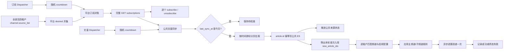

# 毕昇侧信息源订阅对账与新增文章同步轻量改造方案

- 日期：2026-08-20
- 修订日期：2026-08-21
- 状态：技术方案已确认，已进入 SDD（Spec、Design 已确认，Tasks 自审通过待确认）
- 目标分支：`feat/3.0.0-beta1-information`
- 基线：`feat/3.0.0-beta1`，commit `e9ac9cecc`
- 上游协议：`bisheng-information/docs/information-source-sync-api.md`
- 改造系统：`bisheng`；本文不修改 `bisheng-information` 服务端实现

## 1. 方案结论

本期采用三条轻量链路；订阅和公共文章同步要求周期最终一致，知识空间采用异步一次投递：

1. **订阅对账**：频道属于租户，但 Information API Key、信息源订阅和文章是平台公共能力。周期任务遍历全部活跃租户的 `channel.source_list`，在 Python 中求平台并集，与远端完整 `/information/subscriptions` 对比，逐个订阅或取消订阅。
2. **公共文章同步**：同一个来源每轮只向 Information 拉取一次，写入平台公共 ES。只有远端 `last_sync_at` 属于当前业务日时才拉文章；使用数据库时间游标和上游 `min_create_time >=` 包含边界，重复文章按 `article.id` 幂等覆盖。
3. **知识空间一次投递**：公共文章同步时先区分“ES 已存在文章”和“本轮首次写入 ES 的文章”。只有本轮新增文章会按各租户频道及子频道规则异步投递到知识空间。知识空间不是频道文章镜像，不扫描、不比较空间内的其他文件；投递失败即记录失败，不建设自动重试和历史补偿。

本期只新增一张平台公共的文章同步状态表。`channel_knowledge_sync` 不增加游标，不新增订阅 Outbox、API Key 分组、安装表、调度槽位表、逐文章 delivery 表或对账 checkpoint 表。

## 2. 业务与数据边界

### 2.1 多租户边界

- `channel`、`channel_knowledge_sync`、知识空间和知识文件仍按租户隔离。
- Information `base_url + API Key` 是部署级唯一配置，不按租户拆分。
- 远端订阅集合是全部租户频道来源的并集。
- 信息源元数据和文章内容是平台公共数据；同一来源只订阅、拉取和写 ES 一次。
- 知识空间导入在各自 tenant Context 中执行，不能跨租户读取配置、权限或知识文件。

因此，多租户开启不应阻止信息源同步。正确做法是完整枚举全部活跃租户构建平台快照，而不是只读取默认租户，也不是在多租户模式下禁用整个功能。

### 2.2 API Key 边界

- 一个部署只配置一个 Information API Key，不做 API Key 分组。
- 多个独立部署共享同一个 Key 属于不受支持的错误配置，不建设跨部署协调能力。
- 更换 Key 后，使用新 Key 对平台 desired 全量重新订阅；旧 Key 的订阅由运维流程清理。

### 2.3 一致性目标

订阅和公共文章同步接受：

- 频道变更后，远端订阅在下一个对账周期内收敛。
- Worker 重启造成重复 GET 或重复 ES 覆盖。

知识空间投递接受：

- 仅处理公共文章任务本轮确认首次写入 ES 的文章。
- 文件重名、权限、额度、违规、解析失败等结果记录后结束，不自动重试。
- Celery 重投时可能因同名文件而失败；该结果仍按终态失败处理。

不接受：

- 只读取部分租户后执行自动退订。
- 远端订阅分页不完整时执行任何订阅写操作。
- Information 尚未完成当天同步时把来源标记为已处理。
- 文章分页或 ES 写入不完整时推进公共文章游标。
- 把上游包含边界重复返回、但 ES 已存在的文章再次视为新增文章投递。

### 2.4 非目标

- 不同步已经导入文章的后续正文、标题更新、撤稿或删除事件；本期只对新增文章发起一次知识投递尝试。
- 不保证频道或知识同步配置变更后秒级生效。
- 不支持多个 API Key、租户级 Key 或多个部署共享同一 Key。
- 不自动恢复用户主动删除的频道文件，不自动回补知识配置创建前的历史文章。
- 不保证公共文章写 ES 成功后、知识投递任务发出前进程崩溃的自动补偿；如后续需要这一保证，必须另行引入持久 delivery/outbox，而不是扫描整个知识空间猜测状态。

## 3. 当前问题

### 3.1 远端未完成但本地提前完成

当前文章任务使用 `channel_info_source.update_time` 判断当天是否已同步。毕昇如果在 Information 当天抓取完成前执行，即使没有拉到最新文章，也可能更新本地时间，导致后续周期跳过。

修复原则是：

- `last_sync_at` 是“远端今天已完成”的门禁；
- `article_list_updated_at` 是“远端文章集合是否变化”的检查水位；
- 本地展示表的 `update_time` 不再承担文章同步正确性。

### 3.2 当前同步重复按租户访问公网

文章本身是公共数据。当前任务逐租户遍历 `channel_info_source`，可能对同一个来源重复调用 Information。新方案先计算平台 desired，只对每个公共来源拉取一次，再由租户内知识配置消费公共 ES。

### 3.3 知识空间 best-effort 可能永久漏投递

当前知识导入消费“本轮刚写入 ES 的文章 ID”，但上游包含边界会重复返回旧文章，现有代码可能把这些 ID 也当成新增文章再次投递。

本期只解决日常新增文章的准确识别和及时投递：公共文章写入前批量查询 ES 是否已存在，以“写入前不存在且本轮写入成功”定义 `new_article_ids`。知识任务只消费这组 ID，不尝试从知识空间反推文章状态。ES 成功后、任务发出前崩溃仍可能漏投；这是选择“不新增持久投递状态、不自动重试”的明确代价。

## 4. 目标架构



## 5. 数据模型

### 5.1 新增 `information_article_sync_state`

这是本期唯一新增业务表，属于平台公共状态，不带 `tenant_id`。每个信息源一行：

| 字段 | 说明 |
|---|---|
| `source_id` | 外部信息源 ID，主键 |
| `article_cursor_create_time` | 下次公共文章同步的包含式扫描下界，Unix 秒，可空 |
| `processed_remote_sync_at` | 已处理的远端 `last_sync_at`，Unix 秒 |
| `processed_article_list_updated_at` | 已处理的远端文章集合水位，Unix 秒，可空 |
| `create_time/update_time` | 审计时间 |

状态表不保存租户列表、API Key 分组或任务状态。它只回答：这个公共来源已经完整处理到哪个时间边界、处理的是哪次远端文章水位。

新独立 SQLModel 表由在线 Alembic upgrade 的 `create_all(checkfirst=True)` 创建，不需要单独 create-table revision。

### 5.2 调整 `channel_info_source` 定位

`channel_info_source` 只保留信息源展示元数据，不再保存或推断文章同步进度。由于信息源目录本身是平台公共数据，本期将其按全局目录使用：

- 加入 tenant 自动过滤的全局排除集合（仅从强制导入列表移除并不足以阻止 metadata 自动发现）；
- 租户删除流程不再删除共享来源元数据；
- 保留现有 `tenant_id` 作为兼容字段但不参与读取语义，后续版本再评估删除；
- 元数据按外部 `source_id` 全局幂等更新。

这样多个租户引用同一来源时共享一行元数据，不会因为当前 `id` 单列主键产生跨租户插入冲突。

### 5.3 `channel_knowledge_sync` 保持不变

知识空间只消费本轮 `new_article_ids`，不需要在 `channel_knowledge_sync` 保存文章游标，也不需要修改 `KnowledgeFile` 表。现有配置继续只表达“频道/子频道投递到哪个知识空间及目录”。

不新增逐文章状态、投递标识或知识对账字段。知识空间中的其他来源文件、旧频道文件和用户主动删除的文件均不参与日常新增文章投递判断。

## 6. 平台订阅对账

频道创建/编辑只保存 `channel.source_list` 这一期望事实并维护公共来源展示元数据，
不再同步调用远端订阅接口。远端 subscribe/unsubscribe 统一由本节周期对账执行，
使完整快照与远端写入处于同一平台锁保护范围；频道保存接口结构保持不变，
订阅额度不足通过剩余漂移暴露并在后续周期继续收敛。

### 6.1 全租户 desired 快照

任务执行步骤：

1. 使用 `TenantDao.aget_active_ids()` 返回全部层级活跃租户，不使用只返回 Root 直接子节点的方法。
2. 依次进入每个 tenant Context，读取该租户全部频道 `source_list`。
3. 在 Python 中规范化、去空、去重，保存 `desired_by_tenant` 并计算平台并集 `desired`。
4. 每个租户读取后恢复 ContextVar。

任何租户枚举或频道读取失败，都令 `local_snapshot_complete=false`。本轮不执行远端订阅写入，避免部分集合导致误退订；下周期重试。这里仅对“不完整快照”安全停止本轮写入，不影响多租户模式正常运行。

### 6.2 逐来源收敛

```text
desired_v1 = 完整的全部租户频道来源并集
actual_before = 完整分页 GET /subscriptions

若任一快照不完整：结束，不做远端写入

missing = desired_v1 - actual_before
按稳定顺序逐个 subscribe(missing)
单个来源失败只记录该来源，继续处理后续来源

若 auto_unsubscribe_enabled=true：
    desired_v2 = 再次完整读取全部租户来源并集
    actual_middle = 再次完整 GET /subscriptions
    按稳定顺序逐个 unsubscribe(actual_middle - desired_v2)

actual_after = 最终完整 GET
记录 remaining_missing / remaining_extra
```

订阅和取消订阅均使用单来源请求，不做批量操作。自动退订关闭时，额度不足也不能绕过开关执行取消，只记录 `quota_blocked` 和可释放数量。

### 6.3 远端快照完整性

`list_all_subscriptions(page_size=100)` 必须：

- 每页 HTTP 成功且业务 `code == 200`；
- `data[].id` 不重复；
- 累计唯一 ID 数等于第一页 `totalCount`；
- 任一页失败或数据变化导致校验不通过时，整轮视为不完整。

### 6.4 并发控制

使用平台级 Redis 锁 `information:subscription-reconcile`，通过 token + TTL + Lua 比较释放。Redis 不可用时跳过本轮远端写操作并告警。锁只减少同一平台重复执行，不承担跨部署 Key 所有权证明。

## 7. 公共文章同步

### 7.1 远端完成门禁

公共文章任务不依赖租户频道快照。每轮完整读取远端 subscriptions，并处理全部远端实际订阅来源 `actual`；尚未完成退订的残留来源被多同步一次是可接受的，不能让某个租户频道查询失败阻塞其他公共文章更新。远端分页快照不完整时整轮退出，不推进任何公共状态。

对每个 actual 来源：

1. `last_sync_at` 按 Information 业务时区转换日期。
2. 不是当天：不调用文章接口，不更新公共状态。
3. 是当天：比较远端 `last_sync_at/article_list_updated_at` 与 `information_article_sync_state`。
4. 两个水位均已处理：跳过。
5. 水位变化或本地无状态：进入文章拉取。

本地 desired 但远端未订阅的来源由订阅对账补齐；在远端订阅生效前，公共文章任务不绕过订阅状态直接拉取。

### 7.2 时间游标与幂等

```http
GET /information/articles/{information_id}
    ?min_create_time={article_cursor_create_time}
    &page=1
    &page_size=100
```

上游契约：

- 过滤条件为 `create_time >= min_create_time`；
- 固定按 `(create_time DESC, id DESC)` 排序；
- 同一时间边界的文章会重复返回。

毕昇处理：

- 使用外部稳定 `article.id` 作为 ES 文档 ID，重复边界幂等覆盖；
- 正常增量拉取全部分页，校验累计唯一 ID 数、`totalCount` 和排序；
- 每页写入前批量 `mget`，区分 ES 已存在 ID 和首次写入候选；`mget` 失败时该页不写入，避免失去新增判断；
- bulk 必须检查逐项结果；降级逐条写时也逐篇记录成功或失败。部分成功允许已成功的新增文章进入一次知识投递，但公共状态仍不得推进；
- 任一分页或 ES 写入失败时不推进公共状态；
- 全部成功后，在短数据库事务内锁定状态行、比较旧状态未变化，再推进时间游标和远端水位；
- 写入后重新读取远端文章水位，拉取期间发生变化则有界补拉，超限留到下周期。

不能再从 ES 最大时间反推同步进度。否则部分 ES 写入后崩溃可能令最大时间先前进，从而跳过同批较早的失败文章。

### 7.3 首次同步配置

新增系统配置：

```text
information_initial_article_limit=20
```

- 默认 20，允许范围 `1～100`。
- 来源无公共状态时，使用 `page_size=information_initial_article_limit` 先读取倒序第一页，取其中最小 `create_time`，在短事务中创建一行“远端水位未处理”的状态并把该时间写成首次扫描下界。
- `source_id` 主键保证并发只建立一个基线；插入冲突的任务重新读取状态并按已有下界执行，不能覆盖。
- 随后从该下界按 `min_create_time >=` 重新完整分页并写 ES；这 N 篇全部成功后，才把游标推进到本轮最大时间并写入已处理远端水位。
- 如果基线写入后进程崩溃，下一轮会从已固化的最小时间重试，不会因远端新增文章把原先失败文章挤出最新 20。相同时间点超过 20 篇时会全部纳入，优先保证不漏。
- 第 N 篇之后更早的历史文章不进入自动首次同步；需要时使用历史回灌工具。

### 7.4 时间语义

业务时区首版使用 `Asia/Shanghai`。上游无时区 ISO datetime 必须先按该时区解释，再转换 Unix 秒；禁止依赖容器本地时区调用裸 `.timestamp()`。

### 7.5 并发控制

每个来源同步前获取 Redis 锁 `information:article-sync:{source_id}`，使用 token、TTL、续租和 Lua 比较释放。同一来源在同一部署内只能有一个任务执行 `mget → bulk → dispatch`，否则两个并发任务可能同时把同一 ID 判断为首次写入。Redis 不可用时跳过该来源并告警；数据库状态行锁和旧值比较继续负责公共游标提交冲突。

## 8. 每日新增文章的一次投递

### 8.1 简化原则与保证边界

知识空间不仅包含频道文章，因此本链路不建立“知识空间应有集合”，也不读取知识文件来反向判断哪些文章已经投递。它只处理公共文章任务本轮发现的新增量：

```text
new_article_ids = 本轮远端返回 ID - 写入前 ES 已存在 ID
deliverable_ids = new_article_ids 中本轮 ES 写入成功的 ID
```

- 上游 `min_create_time >=` 带回的边界旧文章因为 ES 已存在，不进入 `new_article_ids`。
- 公共文章同步按来源持有 Redis 锁，防止两个任务同时把同一篇文章都判断为“首次写入”。
- 每页 ES bulk 返回后，立即为其中“写入前不存在且本次明确写入成功”的文章发送一次知识投递任务，不等待整轮公共状态提交。
- 不新增投递表、配置游标、投递标识或知识文件 metadata。
- 不扫描知识空间，不比较标题、正文、文件名、MD5 或其他来源文件。
- 投递任务执行过即结束；失败不自动重试，也不通过后续周期补齐。

该设计保证“正常运行时，本轮新增文章会被及时尝试投递”，不保证知识链路最终一定成功。单篇 ES 写入成功后、对应 Celery 消息成功发出前进程崩溃，可能造成漏投；下一轮该文章已经存在于 ES，不会再次投递。这是轻量方案的已知窗口。如果未来要求进程崩溃后也必须补齐，就需要持久 delivery/outbox，不能在没有稳定身份的前提下靠扫描知识空间可靠恢复。

### 8.2 新增文章识别

单来源文章同步逐页执行批量 `mget → bulk → dispatch`：

1. 已存在 ID 仍按 `article.id` 幂等覆盖，但不进入知识投递。
2. 不存在 ID 先记为新增候选。
3. ES bulk 返回后，只保留明确写入成功的新增候选作为该页 `deliverable_ids`，立即异步发送知识任务。
4. 发送失败记录告警，不回滚已经成功的 ES 写入，也不自动补发。
5. 某页部分 ES 写入失败时，已成功的新增文章仍各投递一次；失败文章留在 ES 缺失状态，下一轮仍会被识别为新增候选。
6. 任一分页、批量存在性查询或 ES 写入结果不完整时，公共文章游标和远端水位不推进；只有整轮全部完成后才提交公共状态。

首次公共文章同步受 `information_initial_article_limit` 控制，默认 20；这批首次写入 ES 的文章也属于 `deliverable_ids`，按当前已启用的知识配置投递。后续新建知识配置只接收创建后的新增文章，不自动导入配置创建前的历史文章。

### 8.3 按租户和频道规则路由

知识投递 Dispatcher 接收 `source_id + deliverable_ids`，然后：

1. 枚举全部活跃租户，并逐个进入 tenant Context。
2. 查询引用该 `source_id` 的频道及其启用的 `channel_knowledge_sync` 配置。
3. 主频道接收该频道来源范围内的全部 `deliverable_ids`。
4. 子频道复用现有 `filter_rules` 语义从 `deliverable_ids` 中筛选；规则不存在、规则解析失败或配置已经删除时跳过并记录失败。
5. 每个配置投递独立 Celery 任务，参数包含 `tenant_id + sync_config_id + article_ids`；实际任务进入对应 tenant Context 后重新读取配置、频道、目标知识空间和目录，避免使用过期对象。

同一篇文章可能按业务配置被投递到多个租户、多个知识空间或多个目录，这是预期行为。两个配置指向同一目录时也各自尝试，不建设跨配置去重逻辑。

### 8.4 逐篇投递与失败语义

单配置任务复用现有 `ChannelService.add_articles_to_knowledge_space` 权限、敏感内容、MinIO 和知识文件创建链路，但按文章逐篇调用，并使用 `skip_missing_and_duplicates=false` 取得明确失败，使一篇失败不阻断同批其他文章。

任务使用配置创建人 `user_id` 作为执行身份，并在执行时重新校验知识空间/目录写权限和文章敏感内容权限，不以系统管理员身份绕过。

| 结果 | 处理 |
|---|---|
| 知识文件创建请求成功 | 记录 `accepted`；后续解析状态由知识模块自身处理 |
| ES 文章在任务执行时已不存在 | 记录终态 `article_missing`，不重试 |
| 文件重名 | 记录终态 `duplicate_name`，不判断是否为同一文章，不重试 |
| 配置、知识空间或目录已删除 | 记录终态 `target_missing`，不重试 |
| 权限、额度或敏感内容校验失败 | 记录对应终态失败，不重试 |
| MinIO、数据库、Celery 或未知异常 | 记录 `system_failed` 并告警，本期不自动重试 |
| 知识文件后续解析失败、超时或违规 | 由知识模块展示原状态，信息源链路不重新投递 |

知识文件继续使用现有标题生成文件名和现有随机 MinIO 对象路径，不增加 article ID 后缀或稳定 provenance。用户删除已经投递的文件后，日常任务不会恢复。需要人工补投时，由用户明确选择文章并复用现有“添加到知识空间”能力，不提供自动历史比对脚本。

## 9. 随机化调度

随机化只用于避免不同私有化部署在整点同时访问公网，不需要安装槽位表。

| Dispatcher | Beat 周期 | countdown |
|---|---:|---:|
| 订阅对账 | 每 60 分钟 | `0～600` 秒 |
| 公共文章轮询 | 每 30 分钟 | `0～600` 秒 |

知识投递没有独立 Beat 周期：每页 ES bulk 完成后立即为明确首次写入成功的文章发送异步投递任务，不额外增加随机延迟。

Beat 只生成随机秒数并 `apply_async(countdown=...)`，Worker 不使用长时间 `sleep`。

建议配置：

- `information_subscription_reconcile_interval_minutes=60`
- `information_article_poll_interval_minutes=30`
- `information_sync_jitter_seconds=600`
- `information_initial_article_limit=20`
- `information_subscription_auto_unsubscribe_enabled=true`
- `information_request_retry_count=3`
- `information_knowledge_delivery_enabled=true`

## 10. Worker 与代码分层

Worker 只处理 Celery 调度、Redis 锁、tenant Context 和调用领域服务；业务算法放在 Channel Domain Service/Repository。

本方案不新增 Information 专用 Celery 队列或专用 Worker，也不修改 `task_routes`。订阅、文章以及知识路由/投递任务全部使用默认 `celery` queue；知识空间接受文件后触发的解析与向量化任务继续使用知识模块既有的 `knowledge_celery`，不属于本方案新增队列。

```text
src/backend/bisheng/worker/information/
  reconcile.py            # 订阅对账 dispatcher/入口
  article.py              # 公共文章 dispatcher/入口
  knowledge_delivery.py   # 新文章路由和单配置一次投递

src/backend/bisheng/channel/domain/
  models/
    channel_info_source.py
    channel_knowledge_sync.py
    information_article_sync_state.py
  repositories/
    ...
  services/
    information_subscription_reconcile_service.py
    information_article_sync_service.py
    information_knowledge_delivery_service.py

src/backend/bisheng/core/external/bisheng_information_client/
  client.py
```

主要任务：

| Task | 职责 |
|---|---|
| `dispatch_information_subscription_reconcile` | 随机投递订阅对账 |
| `reconcile_information_subscriptions` | 汇总全部租户并逐来源收敛 |
| `dispatch_information_article_poll` | 随机投递公共文章同步 |
| `sync_information_articles` | 每来源只拉一次，写公共 ES 和公共状态 |
| `route_new_information_articles` | 接收单来源 `deliverable_ids`，枚举全部租户并按频道规则路由 |
| `deliver_information_articles_to_config` | 单租户单配置逐篇投递一次，逐篇记录结果 |

## 11. 可观测性

### 11.1 日志

订阅对账：

- `tenant_count/tenant_failed_count`
- `desired_count/actual_before_count/actual_after_count`
- `subscribed_count/unsubscribed_count`
- `remaining_missing_count/remaining_extra_count`
- `local_snapshot_complete/remote_snapshot_complete`

公共文章同步：

- `source_id/remote_last_sync_at/article_list_updated_at`
- `cursor_before/cursor_after`
- `requested_count/indexed_count`
- `remote_not_ready/result/duration_ms`

知识配置投递：

- `tenant_id/sync_config_id/channel_id/knowledge_space_id/article_id`
- `source_id/routed_count/attempted_count/accepted_count/failed_count`
- `duplicate_name_count/target_missing_count/system_failed_count`
- `result/duration_ms`

日志不得打印 API Key；来源 ID 和失败文章 ID 只记录有限样本。

### 11.2 指标与告警

- `bisheng_information_reconcile_runs_total{result}`
- `bisheng_information_reconcile_drift{direction}`
- `bisheng_information_article_sources_processed_total{result}`
- `bisheng_information_article_sync_lag_seconds`
- `bisheng_information_knowledge_delivery_total{result}`
- `bisheng_information_knowledge_delivery_dispatch_failed_total`

连续订阅对账失败、临近业务日结束仍有来源未完成、公共文章游标延迟超阈值、知识投递消息发送失败或 `system_failed` 持续增长时告警。文件重名等明确业务失败进入统计，不触发自动重试。

## 12. 灰度与回滚

### 阶段 A：只读订阅快照

- 枚举全部活跃租户并计算 desired，只记录与远端差异。
- 验证嵌套租户、分页完整性和相同来源跨租户求并集。

### 阶段 B：订阅补齐与退订

- 灰度环境先通过部署配置把自动退订临时覆盖为关闭，仅观察并补齐缺失订阅。
- 验证快照完整性和差集后移除灰度覆盖，恢复稳态默认开启的逐来源自动退订。
- 任一租户快照失败时验证远端写调用为零。

### 阶段 C：公共文章同步

- 创建 `information_article_sync_state`。
- 配置 `information_initial_article_limit=20`。
- 启用远端完成门禁和数据库时间游标，停用旧逐租户文章任务。

### 阶段 D：知识空间一次投递

- 先开启新增文章识别日志，核对 `remote_returned/existing/new/indexed_new` 数量。
- 开启 `information_knowledge_delivery_enabled`，验证主频道和子频道按现有规则路由。
- 验证文件重名、权限和解析失败仅记录一次，不产生自动补偿任务。

### 回滚

- 关闭自动退订，保留只读差异和补订阅。
- 关闭新公共文章任务时保留公共状态表和 ES 数据，不删除游标。
- 关闭 `information_knowledge_delivery_enabled` 后不再发送新知识任务；已入队任务允许执行结束，期间文章不会在重新开启后自动补投。
- 回滚仅涉及公共状态表；应用回滚时保留该表和 ES 数据，数据库结构回退另行评审。

## 13. 测试与验收

### 13.1 单元测试

- 全部层级活跃租户均参与 desired 求并集。
- 一个租户读取失败时 subscribe/unsubscribe 均为零调用。
- 多页 subscriptions、重复 ID、`totalCount` 不一致和任一页失败。
- 逐个订阅/取消，非法来源不阻塞其他来源。
- 自动退订关闭时额度不足也不会取消来源。
- `last_sync_at` 不是当天时文章接口零调用。
- 公共来源首次同步默认只处理 20 篇，配置范围校验为 `1～100`；首次写入成功的这批文章进入一次知识投递。
- 首次基线下界写入后崩溃或远端新增文章时，原最新 20 窗口不会被挤掉。
- `min_create_time >=` 的边界文章重复写入时 ES 文档不重复。
- 分页、部分 ES 写入或状态提交失败时公共游标不推进。
- 无时区时间固定按 `Asia/Shanghai` 转换。
- ES `mget` 已存在的包含边界文章不进入 `deliverable_ids`。
- ES 不存在但本轮写入失败的文章不进入 `deliverable_ids`，公共游标也不推进。
- 同一来源并发任务只有持有来源锁的任务可执行新增判断；Redis 不可用时不无锁执行。
- 主频道、子频道分别按现有来源和 `filter_rules` 语义路由。
- 单篇文件重名、权限或系统失败不阻止同配置内其他文章继续尝试。
- 每篇文章只调用一次添加接口；任务不配置自动重试，失败后不生成补偿任务。
- 配置、知识空间或目录在任务执行前删除时记录终态失败。

### 13.2 集成测试

- 两个租户共享来源时远端只订阅和拉取一次。
- 删除一个租户引用不会取消其他租户仍使用的来源。
- 公共 ES 文章可被不同租户的知识配置分别导入，权限和数据不串租户。
- 毕昇先于 Information 执行时保持待检查；Information 完成后一个轮询周期内同步文章。
- Information 当天零新增时记录远端水位，后续不重复拉取。
- 上游包含边界重复返回旧文章时不产生第二次知识投递。
- 同一新增文章可分别投递到不同租户、知识空间和目录，tenant Context 不串租户。
- 知识文件重名时记录 `duplicate_name` 且不重试；同批其他文章仍可被接受。
- 知识文件后续进入 `FAILED/TIMEOUT/VIOLATION` 时信息源链路不重新投递。
- 关闭再开启知识投递开关不会自动回补关闭期间或配置创建前的文章。

### 13.3 发布门禁

- 一个部署只配置一个有效且独占的 Information API Key。
- 全部层级租户枚举已验证。
- `/subscriptions`、`last_sync_at`、`article_list_updated_at`、`min_create_time >=` 和稳定排序契约已验证。
- Information subscribe/unsubscribe 幂等语义已验证。
- `channel_info_source` 全局目录语义及租户删除流程已回归。
- MySQL 与 DM8 的公共状态表和锁行更新通过验证。
- ES 批量 `mget`、bulk 逐项结果和 `article.id` 幂等覆盖在目标 ES 版本验证。
- `git diff --check`、架构守卫和相关 backend tests 通过。

## 14. 预计文件改造清单

### 修改

- `src/backend/bisheng/core/external/bisheng_information_client/client.py`
  - subscriptions 完整分页、远端水位和错误分类。
- `src/backend/bisheng/channel/domain/models/channel_info_source.py`
  - 明确公共目录语义。
- `src/backend/bisheng/core/database/tenant_filter.py`
  - 移除 `channel_info_source` 的租户自动过滤注册。
- `src/backend/bisheng/tenant/domain/services/tenant_mount_service.py`
  - 租户删除不再清理共享来源目录。
- `src/backend/bisheng/channel/domain/services/`、`repositories/`
  - 平台订阅对账、公共文章同步、新文章识别和知识配置路由。
- `src/backend/bisheng/worker/information/reconcile.py`
  - 全租户快照和随机 dispatcher。
- `src/backend/bisheng/worker/information/article.py`
  - 公共来源单次拉取、ES 新增识别和公共游标。
- `src/backend/bisheng/worker/information/knowledge_delivery.py`
  - 全租户路由和单配置逐篇一次投递。
- `src/backend/bisheng/core/config/settings.py`
  - 首次 20 篇、调度周期、随机窗口、业务时区、Information 请求重试和知识投递开关。

### 新增

- `src/backend/bisheng/channel/domain/models/information_article_sync_state.py`
  - 平台公共来源文章游标和远端水位。
- 对应 Repository、Service 和测试。

### 明确不新增

- 不新增逐文章 knowledge delivery 表。
- 不新增知识投递游标、稳定投递标识、知识对账脚本或知识表 DDL。
- 不新增订阅 Outbox、API Key 分组、安装表、调度槽位表或订阅版本表。
- 不新增管理端同步状态 UI。

## 15. 关键决策

| ID | 决策 | 结论 |
|---|---|---|
| BD-01 | 多租户 | 频道意图按全部租户求并集；公共文章每来源只同步一次 |
| BD-02 | API Key | 一个部署一个 Key，不做分组；共享 Key 不受支持 |
| BD-03 | 订阅一致性 | 周期最终一致，逐来源调用，不建设 Outbox |
| BD-04 | 调度 | 固定周期 Dispatcher + 随机 Celery countdown |
| BD-05 | 文章门禁 | 远端 `last_sync_at` 属于当前业务日 |
| BD-06 | 文章游标 | 公共数据库保存 `create_time`，上游 `>=` 包含边界，ES 按 `article.id` 幂等 |
| BD-07 | 首次同步 | 系统配置默认 20 篇，允许 `1～100` |
| BD-08 | 知识投递 | 仅消费本轮首次写入 ES 的文章，不扫描知识空间 |
| BD-09 | 知识失败 | 异步逐篇尝试一次；重名、权限、解析或系统失败均不自动重试 |
| BD-10 | 信息源目录 | `channel_info_source` 作为平台公共元数据目录 |

## 16. 待确认参数

1. 订阅对账默认周期是否保持 60 分钟。
2. 公共文章轮询是否保持 30 分钟。
3. Information 业务时区是否固定为 `Asia/Shanghai`。
4. 单个知识配置任务一次最多携带多少文章 ID；超出时按固定大小拆分多个无重试任务。
