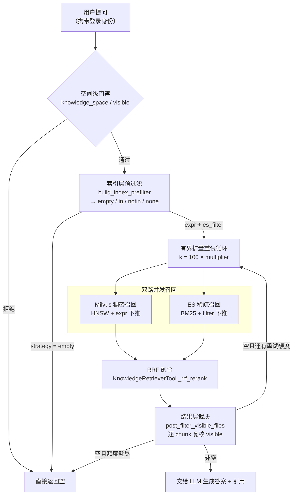

# 当一个知识库同时面对一千种权限：企业级 RAG 的检索层设计

> 本文所有代码路径均来自 BISHENG 开源仓库（github.com/dataelement/bisheng），可逐行查证。

---

## 1. 安全评审上的一道必答题

一套 AI 应用平台要进大型企业内网，绕不开信息安全部门的评审。几乎每一家都会问到同一个问题，措辞略有不同，本质完全一致：

> "同一个知识库，销售和法务问同一个问题，AI 会不会给出同样的答案？"

这看起来是产品问题，实际上是架构题。答不好，就出局。

值得注意的是，问题的落点通常并不在"权限配置错了"。绝大多数平台的权限模型本身是对的——那份《薪酬管理办法》在文件列表页对销售就是不可见的，点进去会 403。真正的风险在另一个地方：

**"检索"这一步，默认不经过权限。**

同一份数据，在列表页跑的是一套可见性口径（走权限引擎），在问答页跑的是另一套（走向量相似度）。两套口径长期不对齐，就会出现那个最难解释的场景：用户在文件列表里根本看不到这份文件，却在 AI 的回答里读到了它的原文段落，还附带一个点不开的引用角标。

于是全文要回答的问题就变成了：

**向量检索的本质是"给我一个向量，还你最近的 k 个"，它凭什么知道调用者是谁？**

---

## 2. 第一性原理：向量检索为什么天生不认身份

### 2.1 接口契约里没有"谁在问"

ANN（近似最近邻）检索的接口契约只有一条：

```
search(query_vector, k) -> top-k nearest neighbors
```

入参里有向量，有 k，有距离度量，有搜索精度参数。**没有主体。** 这不是某个向量数据库的疏漏，而是这类数据结构的定义本身——它建模的是"空间中的邻近关系"，不是"访问控制关系"。所以任何"权限感知的向量检索"，都必然是在这条契约之外额外拼装出来的；区别只在于拼在哪一层，代价由谁付。

### 2.2 过滤发生在图遍历的哪一层，决定了它是几乎免费的还是毁灭性的

BISHENG 的 Milvus Collection 默认建 HNSW 索引（`src/backend/bisheng/knowledge/rag/milvus_factory.py:10`）：

```python
# src/backend/bisheng/knowledge/rag/milvus_factory.py
_default_index_params = {"index_type": "HNSW", "metric_type": "L2", "params": {"M": 8, "efConstruction": 64}}
```

HNSW 是一张分层邻近图，检索是图上的贪心游走：从上层稀疏图找到大致方向，逐层下沉，在底层用一个大小为 `ef` 的候选队列做局部扩展，最后取前 k 个。理解这一点，就能理解过滤位置的差别：

| 过滤位置 | 机制 | 代价 |
|---|---|---|
| **遍历后过滤**（post-filter） | 图照常走完，取回 k 个，再按业务条件砍 | 图遍历本身不受影响，但**最终剩几条完全不可控** |
| **遍历中过滤**（filtered search，Milvus `expr` 下推） | 过滤条件参与图遍历，被排除的节点不进候选队列 | 结果数量可控，但**过滤条件的选择性直接影响图的连通性与搜索代价** |

第二种并不总是更好。当过滤条件极度稀疏，图的有效连通性被破坏，贪心游走需要探索远多于 `ef` 的节点才能凑够 k 个，代价可能反而高于全量遍历。Milvus 内部对此有自适应策略，但**"下推一定更快"是一个错误的直觉**。

### 2.3 关键洞察：权限是一个"每个用户都不一样的动态谓词"

这是本文的地基。

按部门过滤、按时间过滤、按文件类型过滤，这些都是普通业务字段：**取值空间有限、可枚举、可分区、可建标量索引**，代价是一次性的。

权限不是。权限的取值空间是 **用户数 × 文件数** 的组合——1000 个用户 × 10 万份文件 = 一亿个布尔值，而且它随组织架构变化持续漂移：入职、转岗、离职、部门重组、临时授权到期。**它无法预先物化，也无法枚举成有限的分区键。**

**这就是权限过滤和一切普通业务过滤的本质区别：普通过滤的谓词属于数据，权限过滤的谓词属于调用者。** 数据侧的东西可以提前算好放进索引；调用者侧的东西只能在请求到达时才知道。

---

## 3. 三种朴素解法，以及它们各自是怎么崩的

### 3.1 方案 A：一人一 Collection / 一人一 Partition

**思路**：既然向量库支持物理隔离，那就给每个用户一个自己的容器，检索时只查自己的。安全性上无懈可击。

**崩塌点**：

1. **数量随用户数线性膨胀。** 任何向量库对 Collection / Partition 数量都有上限，元数据管理、加载内存、连接句柄都随之膨胀。
2. **共享文档要复制 N 份向量。** 一份 500 页的制度文件被 200 人可见，就要存 200 份 Embedding，存储、写入、更新成本一起乘以 200。
3. **权限一变就要重建索引。** 员工转岗，他的容器要重新灌一遍；权限变更从一次数据库写变成一次批量向量写入。

**结论**：这个方案在**租户级隔离**上是完全正确的——租户数量有限、租户边界稳定、跨租户共享是例外而非常态。Milvus 官方那篇讲多租户策略的文章（Collection / Partition / Partition Key 三档选型）值得完整读一遍，它是这个层面的标准答案。但**它不适合用户级权限**：用户级权限的三个特征（数量大、边界变化频繁、共享是常态）恰好把这个方案的三个前提全部推翻。

> **物理隔离解决的是"不同的水池"，权限解决的是"同一个水池里谁能捞哪条鱼"。用前者去做后者，是量纲错了。**

### 3.2 方案 B：先召回，后过滤（post-filter only）

**思路**：正常检索 top-k，拿到结果后逐条查权限，没权限的丢掉。改动最小，安全性也没问题。这是绝大多数团队面对第 1 章那道必答题时，最先想到的答案。

**崩塌点**，一句话说透：

> **你要的是 top-10，你召回了 top-100，过滤完剩 3 条——而且你事先不知道会剩几条。**

展开两点：

1. **权限越小的人，检索体验越差。** 一个只能看 20 份文件的实习生，在一个 10 万份文件的知识空间里检索，top-100 里可能一条都不属于他。而部门总监几乎全量可见，过滤基本不掉东西。**系统对权限最小的人最不友好，这恰恰和企业直觉相反**——企业以为受限的只是"看到的范围"，实际受损的是"检索质量本身"。
2. **安全达标了，但可用性塌了。** 用户不会看到"你没有权限"，他看到的是"没有找到相关内容"。这是最糟糕的一种失败：**它是静默的，无法归因，用户会认为是 AI 不行。**

**结论**：**召回率不能是运气。** 只做结果层过滤，等价于把召回率交给"用户权限占全库比例"这个你不控制的变量。

### 3.3 方案 C：把完整 ACL 拼成 expr 全量下推

**思路**：既然 Milvus 支持 `expr` 下推，那就在检索前向权限引擎要出该用户的全部可见文件 id，拼成 `document_id in [...]` 一次性下推。召回率问题解决了。

**崩塌点**：

1. **字符串本身就是灾难。** 一个知识空间十万份文件，某个管理员可见九万九——`document_id in [1, 2, 3, ... ]` 这个表达式本身就是几百 KB 的字符串，要序列化、要传输、要在 QueryNode 上解析。
2. **列举本身是 ListObjects 级别的开销。** 每次检索前都要问权限引擎"这个人到底能看哪些"，在 ReBAC 模型下这是一次关系图展开，不是一次索引查询。
3. **权限引擎一抖动，检索直接不可用。** 你把一个在线检索请求的可用性，绑死在了权限引擎的 P99 上。

**结论**：全量下推把召回率救回来了，代价是把性能和可用性一起搭进去。

### 3.4 权限感知检索的不可能三角

```
                        安全
                    （零越权泄漏）
                         /\
                        /  \
                       /    \
                      /      \
                     / 三选二 \
                    /          \
                   /            \
                  /______________\
            召回率                性能
      （该找到的都能找到）    （延迟与资源可控）

   方案 A  →  牺牲性能与成本，换安全 + 召回率
   方案 B  →  牺牲召回率，换安全 + 性能
   方案 C  →  牺牲性能与可用性，换安全 + 召回率
```

三条边不可能同时最优。但把三个方案摆在一起看，会发现它们的失败方式其实是同一个：**都在用一种固定的策略，应对所有形状的请求。**

一个用户可见 5 份文件，和一个用户可见 9 万份文件，是两个完全不同的问题，不该由同一段代码用同一种方式处理。所以：

> **正确答案不是"选一种"，而是"按情况选"。**

---

## 4. 双层过滤 + 四态策略矩阵

### 4.1 双层结构

BISHENG 知识空间 AI 问答的检索链路是这样的：



整个设计哲学可以压缩成一句话：

> **索引层是性能优化，结果层是安全裁决。索引层可以偷懒，结果层永远不能。**

这句话正是破解不可能三角的方式：**把"安全"这条边交给结果层守死，让它成为一个不参与权衡的常量；剩下"召回率"和"性能"两条边，就可以在索引层根据当次请求的实际形状自由权衡。** 三角形还在，但你只需要在二维平面上做选择题了。

要强调的是，结果层不是"双保险"式的冗余：索引层四种策略里有三种并不完备——`none` 完全不过滤，`in` / `notin` 的列表也只是请求开始时算出的快照，而权限可能在这几百毫秒里刚好被改掉。**结果层是唯一一个在"数据已取回、马上要交给模型"这个时刻做判断的地方，因此它必须无条件执行。**

### 4.2 四态策略矩阵

索引层的决策全部收在 `KnowledgeFileVisibilityService.build_index_prefilter`（`src/backend/bisheng/knowledge/domain/services/knowledge_file_visibility_service.py:120`）。它返回一个 `IndexFilter`，`strategy` 字段只有四种取值。阈值来自 `KnowledgeQAFilterConf.index_filter_threshold`（`src/backend/bisheng/core/config/settings.py:335`，默认 **5000**）。

设 `k` = 该用户在本空间的可见主版本文件数，`n` = 本空间主版本文件总数，`T` = 阈值：

| strategy | 触发条件 | 下推到 Milvus 的 expr | 下推到 ES 的 filter | 设计意图 |
|---|---|---|---|---|
| **`empty`** | `k == 0` | —（调用方直接跳过检索） | — | 可见集为空，任何检索都是纯浪费。**提前熔断。** |
| **`in`** | `k <= T` | `document_id in [id1, id2, ...]` | `[{"terms": {"metadata.document_id": [...]}}]` | 可见集小，白名单下推最精确，召回全部有效。 |
| **`notin`** | `k > T` 且补集非空且 `n - k <= T` | `document_id not in [excluded...]` | `[{"bool": {"must_not": {"terms": {"metadata.document_id": [...]}}}}]` | 几乎全可见时，**列黑名单比列白名单短得多**。 |
| **`none`** | `k > T` 且 `n - k > T`（且无业务范围） | 不下推任何权限条件 | 不下推 | 两边都太大，拼 expr 的代价超过收益。**索引层放弃，全部交给结果层。** |

`in` / `notin` 的选择本质上是一个**表达式长度最小化**问题：可见集和不可见集，哪边短就列哪边。这是一个很朴素的优化，但它把方案 C"十万个 id 拼成字符串"的最坏情况直接砍掉了——最坏情况被 `none` 兜住，而 `none` 之所以敢存在，是因为结果层一定会复核。

还有一个细节：`IndexFilter.is_empty` 是一个显式的属性（`:48-50`），调用方必须自己判断并跳过检索。**把"什么都不该返回"表达成一个策略状态，而不是一个空的 expr，避免了"空列表被当成无过滤"这类经典空值陷阱。**

### 4.3 权限范围 vs 业务范围："有没有兜底"决定了"能不能偷懒"

这是整个设计里最不教科书、但最能体现真实工程判断的一处。

用户在知识空间问答时，可以额外勾选文件夹或标签，把检索限定在某个子集内。这个子集（代码里叫 `candidate_file_ids`）和权限可见集，在索引层看起来是同一类东西——都是一个文件 id 集合，都要下推成 `document_id in [...]`。

**但它们的处理规则完全不同。** 代码里那段注释把理由说得很清楚（`knowledge_file_visibility_service.py:129-133`）：

```python
# candidate_file_ids carries the explicit folder / tag business scope.
# Unlike the permission set, it has NO result-layer backstop
# (post_filter_visible_files only enforces ``visible``), so whenever it
# is provided it MUST be pushed down into the index — it can never be
# dropped via the both-sides-too-large 'none' shortcut.
```

结果层的 `post_filter_visible_files` 只复核 `visible` 这一个动作，它**不知道**用户勾了哪个文件夹。所以：

- **权限范围**有结果层兜底 → 索引层可以走 `none` 偷懒，最坏结果只是多召回一些后面会被丢掉的 chunk，是性能问题。
- **业务范围**没有结果层兜底 → 索引层一旦放弃，用户勾选的文件夹边界就彻底失效了，是正确性问题。

因此代码里有两处专门为业务范围开的口子（`:170-194`）：`notin` 的触发条件额外接受 `has_business_scope and len(complement) <= k`（哪边短用哪边，而不是直接放弃）；即使两边都超过阈值，只要有业务范围，也宁可拼一个很长的 `in` 列表：

```python
# Large explicit scope with a large complement: enforce via IN. The
# folder / tag boundary is correctness, not an optimisation, so a
# big IN list is preferable to leaking outside it.
```

提炼成一句方法论：

> **"有没有兜底"决定了"能不能偷懒"。** 一个优化能否被跳过，取决于它下游是否还有人为同一个约束负责——而不是取决于它看起来多贵。

### 4.4 expr 的组合：一次检索至少三重 AND

真实系统里一次检索的 `expr`，最少由三部分 AND 组成：

| 过滤维度 | 来源 | Milvus 形态 |
|---|---|---|
| 权限过滤 | `build_index_prefilter` | `document_id in [...]` / `not in [...]` / 无 |
| 业务范围过滤 | 用户勾选的文件夹 / 标签，交进 `candidate_file_ids` | 与权限集求交后一并体现在上一行 |
| 版本过滤 | `build_primary_only_filter()` | `document_id not in [非主版本 ids]` |

版本过滤这一条很容易被忽略：知识空间支持文件多版本，检索时**必须只命中主版本**，否则同一份制度的三个历史版本会同时进入上下文，让模型自己去纠结哪个是现行有效的。

它的实现在 `src/backend/bisheng/knowledge/rag/version_filter.py`——**一个不碰数据库的纯函数**：

```python
# src/backend/bisheng/knowledge/rag/version_filter.py:11
def build_primary_only_filter(
    excluded_file_ids: Iterable[int],
    *,
    base_milvus_expr: Optional[str] = None,
    base_es_filter: Optional[List[dict]] = None,
) -> Tuple[Optional[str], List[dict]]:
```

三个设计约束一眼可见：接受一个 `base_*` 让它可以**叠加**在已有过滤之上；ES 侧 `es_out = list(base_es_filter)` **绝不原地修改调用方的列表**；id 排序后再拼字面量，让输出**确定性可测**。

> **过滤器必须可组合、不互相污染。** 一个过滤器如果会吞掉或改写另一个过滤器的条件，那么"多加一道防线"就会变成"少一道防线"。

---

## 5. 召回率怎么保住：有界扩量重试，以及一个 HNSW 的坑

### 5.1 有界扩量重试

索引层策略选得再好，`none` 分支下结果层仍然会丢掉一部分 chunk。要让最终剩下的量足够，唯一的办法是首次就多召回一些。

`_retrieve_and_filter`（`src/backend/bisheng/knowledge/domain/services/knowledge_space_chat_service.py:484`）的循环是这样的：

```python
# src/backend/bisheng/knowledge/domain/services/knowledge_space_chat_service.py:509
multipliers = (
    conf.retrieval_initial_multiplier,      # 默认 3
    conf.retrieval_expansion_multiplier,    # 默认 6
)
...
for attempt_idx, multiplier in enumerate(multipliers, start=1):
    base_k = 100  # current retrieval default; multiplier scales it
    milvus_kwargs = {"k": base_k * multiplier, "param": {"ef": 110}}
    ...
    if survivors:
        break  # AD-03: stop on first non-empty attempt
```

三个数值全部有明确取舍：

| 参数 | 默认值 | 取舍 |
|---|---|---|
| `retrieval_initial_multiplier` | `3` | 首次就召回 `100 × 3 = 300` 条，为结果层留出丢弃余量。 |
| `retrieval_expansion_multiplier` | `6` | 首次不够时**只重试一次**，`100 × 6 = 600` 条，然后无论结果如何都停。 |
| 首次非空即停 | — | 只要第一轮有幸存者就直接返回，不为"更多"付第二次代价。 |

配置层还有一条 `model_validator` 硬约束（`settings.py:372`）：`retrieval_expansion_multiplier` 必须 `>=` `retrieval_initial_multiplier`，否则启动即失败——**扩量重试不允许配成缩量**。

为什么重试次数必须有硬上限？因为**扩量重试是一个会被权限最小的用户触发得最频繁的路径**。一个可见集极小的用户，每一次提问都会走满两轮、每轮扫描数百个候选；如果允许无限扩量直到凑够 top-k，他的每一次提问都会退化成一次全库扫描。

> **宁可返回空，也不能让单个请求拖垮集群。** 有界重试的本质，是拒绝把"某个用户运气不好"升级成"所有用户都变慢"。

### 5.2 一个 HNSW 的坑：`ef` 必须覆盖 `k`

上面那段代码里藏着一个必然会炸的组合：

- `k` 随 `multiplier` 动态放大：`100 × 3 = 300`，`100 × 6 = 600`；
- `ef` 在调用处**是写死的 110**。

而 HNSW 的搜索约束是 `ef >= k`——候选队列不可能比要返回的结果还小。于是扩量重试一开，Milvus QueryNode 就会直接报错：`ef(110) should be larger than k(300)`。

修复的位置很讲究。它不在调用方（那意味着每个新调用方都要记住这条不等式），而在**最靠近引擎的那一层**——`src/backend/bisheng/core/vectorstore/milvus.py:104` 的 `_ensure_ef_covers_k()`：

```python
# src/backend/bisheng/core/vectorstore/milvus.py:104
@staticmethod
def _ensure_ef_covers_k(param: dict | None, k: int) -> dict | None:
    if not isinstance(param, dict):
        return param
    nested = param.get("params")
    if isinstance(nested, dict) and isinstance(nested.get("ef"), int):
        if nested["ef"] < k:
            return {**param, "params": {**nested, "ef": k}}
    elif isinstance(param.get("ef"), int) and param["ef"] < k:
        return {**param, "ef": k}
    return param
```

它被挂在 `_collection_search` / `_acollection_search` 两个出口上（`:139`、`:157`），同步异步都覆盖。三个细节：兼容 `ef` 在顶层和嵌套在 `params` 里两种写法；**返回修正后的副本，绝不改调用方传进来的 dict**；不做任何日志噪音，因为这不是异常，是常态。

> **凡是"两个参数必须满足某个不等式"的地方，都应该在最靠近引擎的那一层强制成立，而不是靠上层自觉。** 靠自觉的约束，会在第 N 个调用方那里失效，而 N 通常等于 2。

---

## 6. 双路召回的一致性陷阱

BISHENG 的知识库是**双写**的：同一批 chunk，稠密向量写进 Milvus（负责语义相似），稀疏索引写进 Elasticsearch（负责关键词精确命中）。检索时两路并发召回，再用 RRF 融合（`src/backend/bisheng/tool/domain/langchain/knowledge.py:73`，`RRFRerank` 常数 `c=60`，默认等权）。

双路召回对效果是显著的加成——纯向量检索对专有名词、编号、缩写不敏感，BM25 正好补上。但它对权限设计引入了一个非常容易踩的陷阱：

> **权限过滤如果只加在 Milvus 一侧，ES 那一路会把不该出现的 chunk 原样拉回来，RRF 融合之后照样泄漏。**

而且这种泄漏在测试里极难发现：只要目标 chunk 语义相似度够高，Milvus 一路就能命中，你根本看不出 ES 那一路漏了什么。它只在"关键词强、语义弱"的查询上暴露——**恰好是用户查具体制度编号、具体人名时的形态。**

所以 `IndexFilter` 从定义上就是**成对**的：`milvus_expr` 和 `es_filter` 两个字段一起产生、一起消费，任何一个策略分支都必须同时给出两者。两侧的语义等价关系是：

| 语义 | Milvus expr | ES filter 子句 |
|---|---|---|
| 白名单 | `document_id in [1, 2, 3]` | `{"terms": {"metadata.document_id": [1, 2, 3]}}` |
| 黑名单 | `document_id not in [7, 8]` | `{"bool": {"must_not": {"terms": {"metadata.document_id": [7, 8]}}}}` |
| 排除非主版本 | `document_id not in [<非主版本 ids>]` | `{"bool": {"must_not": {"terms": {"metadata.document_id": [...]}}}}` |
| 不过滤 | 不设置 `expr` | 不设置 `filter` |

注意字段名的不对称：Milvus 侧是标量字段 `document_id`（由 `MilvusFactory` 从元数据 schema 动态建出），ES 侧是 `metadata.document_id`。**两侧写法不同、语义必须相同——这正是这类 bug 的温床，也正是把两者绑在同一个 dataclass 里返回的理由。**

> **多路召回架构下，权限过滤的最弱一路决定整个系统的安全水位。加一条召回链路，就是加一个必须同步维护的过滤面。**

融合之后还有两步收尾，都在 `_rrf_rerank` 里（`knowledge.py:83-99`）：按 `max_content` 累加 `page_content` 长度做截断；以及当结果**恰好全部来自同一个文件**时，按 `(document_name, chunk_index)` 重排。**单文档场景下，叙述顺序比相关性排序更有助于模型理解上下文。**

---

## 7. 结语

回到第 1 章那道必答题。

销售和法务问同一个问题，AI 会不会给出同样的答案？答案应该是：**不会，而且这个"不会"不是靠提示词约束、不是靠模型自觉、不是靠事后审计发现，而是靠检索层根本就没把那些 chunk 取出来。**

也正因为索引层和结果层调用的是同一个权限门面、同一个 `visible` 动作，而知识空间的文件列表页走的也是这同一个门面，三件事被同一个原语锁死：**列表页可见性 ≡ 索引层预过滤 ≡ 结果层裁决**。推论就是那条对企业客户最有说服力的硬约束——

> **"我在列表里看不到的文件，绝不会在问答里被引用。"**

（这句话的适用范围要说清楚：它在**知识空间 AI 问答**这条规范路径上成立；平台内其它检索入口走各自的链路，过滤强度并不完全相同。把一条局部不变式泛化成全平台承诺，是安全评审里最容易翻车的一种表述。）

**企业级 RAG 和 Demo 级 RAG 的差距，不在模型，不在切分策略，不在 Rerank 用了哪一家，而在"这份数据到底该给谁看"这件事上能不能做到零妥协。** Demo 只需要让一个人满意；企业级系统需要同时让一千个权限各不相同的人满意，并且在任何一个人的权限第二天变化时，仍然满意。

方法论只有一句：

> **把安全交给一个绝不妥协的裁决层，把性能交给一个可以按情况偷懒的优化层。**

安全不参与权衡，所以它必须简单、唯一、无分支——一个原语，所有人调用它。性能全部参与权衡，所以它可以分四种策略、可以在两边都太大时干脆放弃——因为放弃了也不会出事。**架构的功夫不在于让每一层都完美，而在于想清楚哪一层必须完美、哪一层可以将就，然后让"将就"的那层永远兜在"完美"的那层后面。**

而这一切之所以能落成一个工程问题、而不是一个研究课题，前提是底层能力已经就位：Milvus 的 `expr` 下推让权限条件有机会参与图遍历；混合检索让"过滤面成对维护"成为可管理的问题；动态 schema 让 `document_id` 这类业务标量能被当作一等公民建索引和过滤。**没有这些，权限就只能编织在检索之外，也就只能退化成第 3 章的方案 B。**

BISHENG 完全开源：**github.com/dataelement/bisheng**。本文提到的所有文件路径、类名、方法名、默认值均可在仓库中查证。如果你的团队在权限过滤上采用了不同的方案——尤其是在 `none` 这类"索引层放弃"的边界上做了不同的取舍——欢迎来 Issue 里聊聊，我们很想知道别人是怎么画那条线的。

---

<!-- 配图需求（不出现在正文，供设计同学出稿）

图 A · 四态策略矩阵设计图
  用途：第 4.2 节，替换或补充现有表格，是全文最有传播价值的一张图。
  内容：一条横轴表示「用户可见文件数 k 占空间总数 n 的比例」，从 0% 到 100%。
        轴上按阈值 T 划出四个区间，每个区间给一张卡片：
          - k = 0            → empty  ·「直接熔断，不检索」  · expr: —
          - k ≤ T            → in     ·「列白名单」          · expr: document_id in [...]
          - n − k ≤ T        → notin  ·「列黑名单」          · expr: document_id not in [...]
          - 两边都 > T        → none   ·「索引层放弃」        · expr: 不下推
        每张卡片下方用一行小字标注「设计意图」。
        右下角一个醒目的脚注框：「四种策略共享同一个结果层裁决 —— 这是 none 敢存在的唯一理由」。
  风格：横向流程带 / 时间轴式，冷色为主，none 那一档用警示色但不用红色（它不是错误，是有意为之）。

图 B · 同一次提问下三个不同权限用户的召回结果对比图
  用途：第 1 章开头或结语金句处，是给企业客户看的那张图。
  内容：左侧同一个提问气泡「公司的差旅报销标准是什么？」。
        中间一列三个用户（销售 / 法务 / 财务总监），各自标注可见文件数（如 12 / 340 / 9800）。
        右侧三列检索结果，用同一批文件卡片，按用户着色：
          - 命中且可见 → 实心高亮
          - 存在但不可见 → 灰色虚线轮廓 + 锁形图标（强调「它就在那里，但没被取出来」）
        底部横贯一条标语条：「同一个 Collection，同一个问题，三种召回」。
  风格：面向企业决策者，克制、不炫技，锁形图标是视觉重点。
  注意：文件名请使用通用示例名（如《差旅管理办法》《薪酬结构说明》），不得出现任何真实客户信息。
-->
