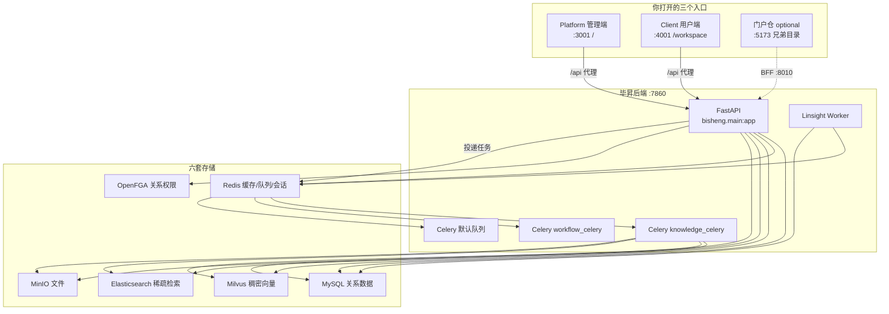
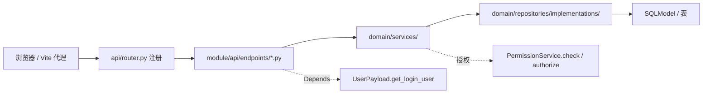
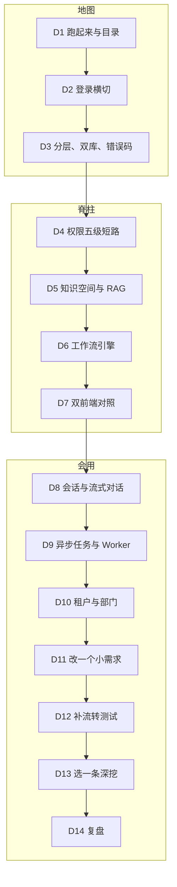
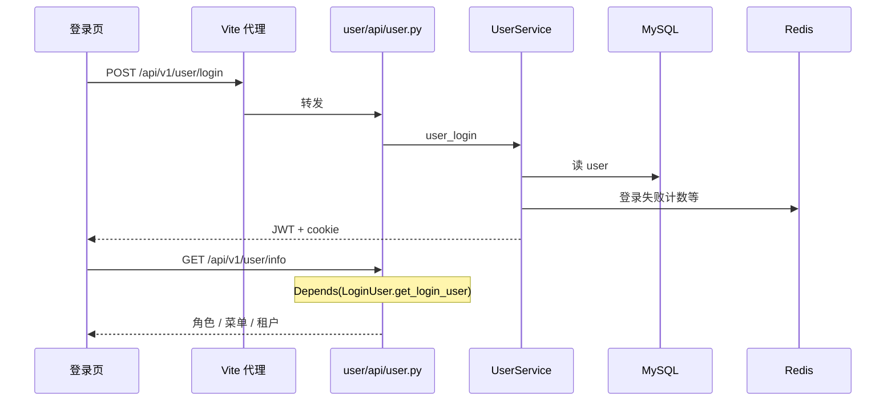
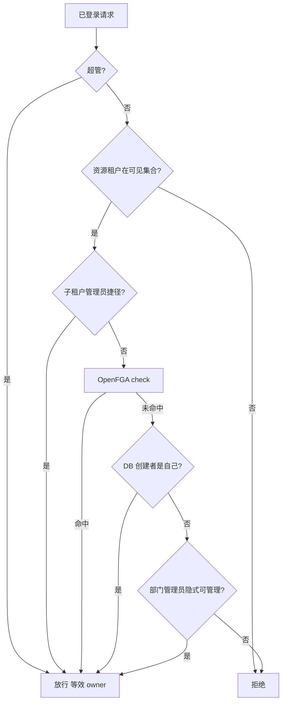
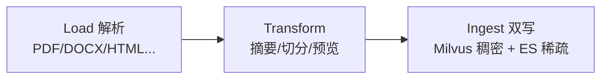
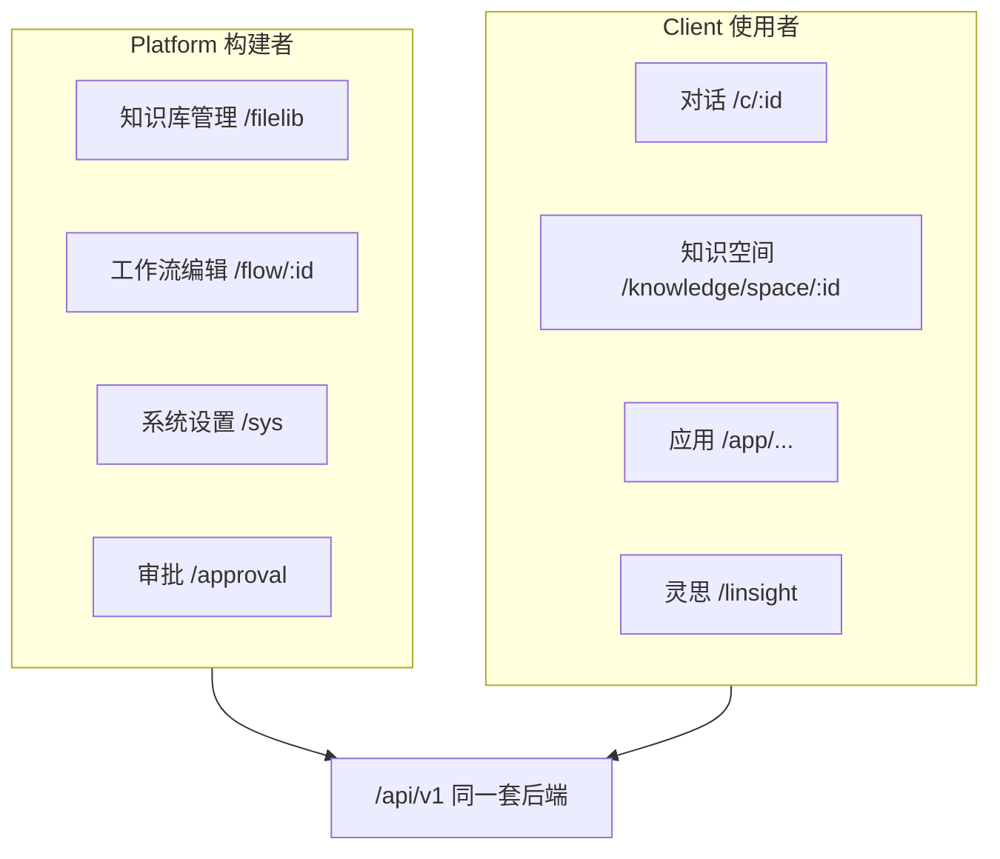

# 两周掌握毕昇：源码教学计划

给已经会前后端、想在一两周内能自己改需求的人。仓库是现在这套 monorepo（FastAPI + 两个 React + Celery + OpenFGA）。

这是学习计划，不改业务代码，无 DDL、无字段增删、不做迁移。下面点名的表，学习时只读。真要写库，等到第 11 天作业。

---

## 0. 两周能到哪

仓库体量先摆清楚：

- 后端 `src/backend/bisheng/`：1400+ 文件，30 多个领域模块
- 前端两个独立 SPA：Platform 大约 900 个文件，Client 大约 1300 个
- MySQL 业务表 65 张以上，另外还有 Redis、Milvus、ES、MinIO、OpenFGA
- `docs/architecture/` 有几篇已经落后于代码（附录 C）。打架时听源码和根目录 `AGENTS.md`

「一两周完全掌握」如果是指每个模块、每张表、每种节点都背下来：做不到，也没必要。两周够用的结果是：脑子里有一张能用的地图，亲手走过登录、知识空间、对话/工作流，之后新需求知道从哪切开、按哪条规范改。

两周结束时，不靠别人指路，你应能做到：

1. 中间件、后端、两个前端都跑起来，说得清每个端口是谁。
2. 任意 `/api/v1/...`，大约 3 分钟找到：路由 → Endpoint → Service → Repository → 表。
3. 讲清一次登录、一次建知识空间、一次对话或工作流，数据怎么走。
4. 知道资源鉴权为什么不能查 `role_access`，以及 `PermissionService.check()` 的短路顺序。
5. 改 Platform 用 `@/`、Zustand、`@/controllers/request.ts`；改 Client 用 `~/`、Recoil、`~/api/request.ts`。两套不要混。
6. 新功能不跳层，不手写 `WHERE tenant_id`，双库不用 `sqlalchemy.JSON` / `LONGTEXT`。
7. 能写（或读懂）一条「调接口 + 断言 HTTP + 断言落库」的流转测试。

第 7 条做不到，只能算看过。

---

## 1. 先画边界

先别打开巨石文件。把系统看成三个入口、一套 API、六套存储。



页面不直接碰库。同步请求走 FastAPI。重活进 Celery。权限进 OpenFGA。

### 1.1 仓库目录

只记这一层：

```
bisheng/
├── src/backend/bisheng/          # 后端主应用（你 70% 的时间在这）
├── src/backend/bisheng_langchain/# LangChain / Linsight 运行时
├── src/frontend/platform/        # 管理端  :3001
├── src/frontend/client/          # 用户端  :4001  base=/workspace
├── docker/local-dev/             # 中间件一键起
├── docs/architecture/            # 架构文档（部分过时，当地图用）
├── features/                     # SDD 需求制品
└── scripts/                      # 运维/升级脚本（含 upgrade-ab-fusion）
```

### 1.2 后端模块怎么记

别背 30 个名字。按改需求时会撞上的层，分成四类就行：

| 类别 | 代表 | 你怎么用 |
|------|------|----------|
| 基础设施 | `core/` `common/` | 配置、DB、Redis、错误码、`UserPayload` |
| 身份与权 | `user/` `permission/` `tenant/` `department/` `role/` | 登录、鉴权、租户、部门 |
| 核心业务 | `knowledge/` `workflow/` `chat_session/` `llm/` | 知识空间、画布执行、会话、模型 |
| 周边业务 | `approval/` `points/` `channel/` `linsight/` `open_endpoints/` | 第二周按手头工作选一条 |

调用链每次都是：

```
Router → Endpoint → Service → Repository → DB
```

Endpoint 禁止 `import bisheng.database.models.*`。Service 禁止写 ORM。新功能不要再开一套 DAO。



---

## 2. 怎么读源码

每天只做一件事：横切一条真实请求，画到表为止。

```
1. 在页面上点一下，或用 curl 打一枪
2. 浏览器 Network 抄下 METHOD + path
3. rg 这个 path，落到 Endpoint
4. 顺着调用走到 Service → Repository
5. 记下读/写了哪些表、哪些字段、有没有进 Celery / OpenFGA
6. 用 SELECT 或日志核对你的图
```

别做这些：

- 从目录树第一个文件看到最后一个
- 通读 `knowledge_space_service.py`（巨石，能废掉一天）
- `rg` 到函数名只看签名，不看调用方
- 把 `docs/architecture/06-frontend-architecture.md` 里「Client = Zustand」当真（代码是 Recoil）

当天结束写半页笔记：

```markdown
## 今天横切的请求
METHOD /api/v1/xxx

## 调用链
页面组件 → API 封装 → Endpoint → Service.method → Repo.method

## 表
- user：读 user_name, password
- ...

## 我还没看懂的
- ...
```

---

## 3. 两周怎么排

按每天 5～6 小时排的。晚上只有 2 小时，就把第 8～14 天挪到第 3 周，前 7 天不要压。



前 7 天不要调换。你从哪天开始学，那天就是 D1。

---

## 4. 第 1 周

### 第 1 天：跑起来，只画边界

你要能指着屏幕说：这个端口是谁，挂了会怎样。

按顺序读，每篇只读点名的部分：

1. 根目录 `AGENTS.md` 第 1～2 节、第 7 节（身份、命令、坑）
2. `docs/architecture/01-architecture-overview.md` 的系统组件图
3. `src/backend/bisheng/main.py`（`create_app`、`lifespan`、中间件）
4. `src/backend/bisheng/api/router.py`（有哪些 router，先扫一遍）

```bash
# 中间件
bash docker/local-dev/start-middleware.sh
# 或
bash scripts/dev-stack.sh middleware

# 探活（按你本机实际脚本）
curl -sf http://127.0.0.1:7860/health
```

勾这 6 个：MySQL / Redis / Milvus / ES / MinIO / OpenFGA。缺一个，后面知识库或权限课会假失败。

再起后端 7860、Platform 3001、Client 4001。门户不是这两周的必修；日常联调门户再按 `scripts/dev-stack.sh` 加 BFF 和 portal-web。

纸上或笔记里画：浏览器 → 哪个 Vite → `/api` 代理到 7860 → FastAPI。打开 Platform 登录页，看 Network 里请求是打到 `:3001` 还是被代理到 `:7860`。

今天不要配模型、不要上传文件、不要读 `workflow/`。

表：无业务读写。最多碰到 `config`（配置缓存 TTL 100s）。无 DDL。

自测：

- [ ] 三个端口、两个前端 base path 能默写
- [ ] 能指出 `main.py` 里 lifespan 先初始化谁
- [ ] `curl /health` 成功

---

### 第 2 天：横切登录

今天学会「一条请求走到底」。从登录开始。

```
POST /api/v1/user/login
GET  /api/v1/user/info
```

跟着调用走，不要跳：

| 步 | 文件 | 看什么 |
|----|------|--------|
| 1 | Platform `pages/LoginPage/login.tsx` 或 Client `components/Auth/Login.tsx` | 谁发请求 |
| 2 | Platform `@/controllers/request.ts` / Client `~/api/request.ts` | cookie、Bearer、`status_code` 信封、403 拦截 |
| 3 | `user/api/user.py` 的 `login`（约 166 行） | Endpoint 只转给 Service |
| 4 | `user/domain/services/` 里 `UserService.user_login` | 校验密码、签发 JWT |
| 5 | `user/domain/services/auth.py` 的 `LoginUser` / `get_login_user` | 后续接口怎么认出你 |
| 6 | `common/dependencies/user_deps.py` 的 `UserPayload` | Endpoint 里 `Depends(UserPayload.get_login_user)` |



本条路径碰到的表：

| 表 | 角色 | 关键已有字段 | 本计划是否改表 |
|----|------|--------------|----------------|
| `user` | 读 | `user_id` `user_name` `password` `delete` | 否 |
| `user_role` | 读 | `user_id` `role_id` | 否 |
| `role` | 读 | `id` `role_name` | 否 |
| `user_tenant` | 读 | `user_id` `tenant_id` | 否 |
| `user_department` | 可能读 | `user_id` `department_id` | 否 |
| Redis 键（非表） | 读写 | 登录失败计数、token 黑名单等 | 否 |

登录成功后，再点开一个需要登录的接口，确认请求头或 cookie 里有 token。再用错误密码打一次，看 `status_code` 是 5 位业务码还是 HTTP 401。信封长这样：

```json
{ "status_code": 0, "status_message": "...", "data": {} }
```

`status_code == 0` 才是成功。前端拦截器认这个信封，不是裸 HTTP。

自测：

- [ ] 能从登录按钮追到 `UserService.user_login`
- [ ] 能说出 `UserPayload` 继承 `LoginUser`
- [ ] 能解释 Platform 业务代码里为什么几乎不写 403 分支

---

### 第 3 天：分层、双库、错误码

今天搞清什么是项目不允许的。

1. `AGENTS.md` 第 3 节全文（后端 P0）
2. `src/backend/AGENTS.md` 的 Module Map、Error Handling
3. `common/schemas/api.py`（`resp_200` / `resp_500`）
4. `common/errcode/` 里随便一个模块，看 5 位码怎么定义
5. `common/repositories/interfaces/base_repository.py`
6. 挑一个小模块对照目录，比如 `share_link/` 或 `dictionary/`：

```
module/
  api/router.py
  api/endpoints/
  domain/services/
  domain/schemas/
  domain/repositories/interfaces/
  domain/repositories/implementations/
```

反面教材：打开 `knowledge/domain/services/knowledge_space_service.py`，只看文件头，不要通读。用 `rg "async def create_knowledge_space"` 跳到创建空间。巨石文件后来只准留调用点，原因在这里。

双库对照（抄在手边）：

| 要用 | 不要用 |
|------|--------|
| `dialect_helpers.JsonType` | `sqlalchemy.JSON` |
| `dialect_helpers.LargeText` | `LONGTEXT` |
| `SQLAlchemy inspect()` | `information_schema` |
| 显式关系列 | `JSON_EXTRACT` |

macOS 没有达梦驱动，本地验不了 DM8。写法仍必须兼容。

笔记里用自己的话写：

1. 为什么 Endpoint 不能 import `database.models`
2. 为什么新功能不能再开 DAO
3. 业务错误为什么要 `BaseErrorCode`，而不是 `return resp_500(message=str(e))`

今天不横切写路径，不碰表。

自测：

- [ ] 默写调用链 5 层
- [ ] 看到 `information_schema` 能立刻说违规
- [ ] 能指出一个符合 DDD 的小模块目录

---

### 第 4 天：权限

这是本仓库最容易改错的地方。目标很具体：再也不要为了「能不能看」去查 `role_access`。

```
认证 Authentication ≠ 授权 Authorization
JWT 只证明你是谁
PermissionService 才回答你能不能碰这个对象
```



以 `permission/domain/services/permission_service.py` 文件头注释和 `check()` 为准。`docs/architecture/10-permission-rbac.md` 还在讲旧的「三层 RBAC + 空间成员」，当历史看。

阅读顺序：

1. `permission_service.py` 的模块 docstring，加上 `check()`、`authorize()`。只读这两个公共入口，先别进那 2000 行私有方法。
2. `core/openfga/` 扫一眼 `FGAClient` 单例
3. `database/models/role_access.py`：表还在，新代码禁止用它做资源鉴权
4. `failed_tuple`：授权写 OpenFGA 失败会进这张重试表
5. 前端：Platform `components/bs-comp/permission/` 扫目录；Client 知识空间成员相关组件看一下命名即可

| 表 | 角色 | 关键字段 | 改表? |
|----|------|----------|-------|
| `failed_tuple` | 写（授权失败时） | 失败的 FGA tuple | 否 |
| `role` / `role_access` | 菜单和历史 RBAC，不是资源鉴权入口 | `role_id` `access_type` | 否 |
| `user_role` | 读，判断超管等 | `user_id` `role_id` | 否 |
| OpenFGA store | 读写关系 | `user:1` `owner` `knowledge_space:9` | 否 |

作业：`rg "PermissionService.check"`，点开 3 个不同模块的调用点（knowledge / workflow / share_link 都行）。每个记下 `relation`、`object_type`、失败时接口返回什么。

再 `rg "RoleAccessDao"`。新业务代码拿它做过滤，就是 arch-guard RULE-8 现场。

自测：

- [ ] 能默写 check 的短路顺序
- [ ] 能解释创建资源后为什么必须 `authorize()`
- [ ] 能解释超管为什么没有 FGA 元组也能过

---

### 第 5 天：知识空间和 RAG

先分清四层，别把 `knowledge` 当成一个文件夹：

```
知识空间 knowledge space    = 协作容器（成员、部门、可见性）
知识库   knowledge library  = 空间里的库（检索单元）
文件     knowledge file     = 上传对象 + 解析状态
切片     chunk              = 进 Milvus + ES 的检索粒度
```

横切 A：创建空间。

```
POST /api/v1/knowledge/space
```

prefix 以 `knowledge/api/router.py` 里 space router 的真实挂载为准。

1. `knowledge/api/endpoints/knowledge_space.py` → `create_space`
2. `KnowledgeSpaceService.create_knowledge_space`（`rg` 跳进去，不要整文件读）
3. 看它怎么 `PermissionService.authorize`
4. 看它写了哪些表

横切 B：上传文件。同步接口通常只落文件元数据和「等待」状态，解析在 `knowledge_celery`。

```
WAITING(5) → PROCESSING(1) → SUCCESS(2)
                           → FAILED(3)
                           → TIMEOUT(6)
```



只读这些就够：

| 文件 | 为什么读 |
|------|----------|
| `knowledge/api/endpoints/knowledge_space.py` | HTTP 入口 |
| `knowledge/api/endpoints/knowledge.py` 的 `create_knowledge` | 建库入口 |
| `knowledge/rag/knowledge_file_pipeline.py` | 文件管道 |
| `knowledge/rag/pipeline/base.py` | 通用管道 |
| `worker/` 下 knowledge 任务（`rg knowledge_celery` 定位） | 异步消费 |

| 表 | 角色 | 关键字段 | 改表? |
|----|------|----------|-------|
| `knowledge` | 写（建库/建空间相关） | `id` `name` `user_id` `tenant_id` 等 | 否 |
| `knowledgefile` | 写 | `id` `knowledge_id` 状态字段 | 否 |
| `knowledge_document` | 写 | 文档投影 | 否 |
| `knowledge_space_scope` | 写 | 空间范围/级别 | 否 |
| `department_knowledge_space` | 可能写 | 部门绑定 | 否 |
| `knowledge_fulltext_outbox` | 旁路 | 全文索引 outbox | 否 |
| MinIO object | 写文件字节 | object key | 否 |
| Milvus collection | 写向量 | embedding | 否 |
| ES index | 写稀疏 | bm25 字段 | 否 |

本地上传一个小 txt/md，别一上来丢 200 页 PDF。一边看 API 返回的文件 id，一边：

```sql
SELECT id, status, knowledge_id FROM knowledgefile WHERE id = ?;
```

刷新，直到 status 从 5 变成 2 或 3。一直停在 5，去看 `knowledge_celery` 起没起。

自测：

- [ ] 能区分空间、库、文件、切片
- [ ] 能说出「接口 200 但检索不到」多半是 Worker 没跑或 ingest 失败
- [ ] MinIO 图片 403 时，先对 `config.yaml` 的 `sharepoint` 和 Vite `fileServiceTarget`

---

### 第 6 天：工作流引擎

今天搞清：JSON 画布怎么变成一次执行。链是 `flow.data` → LangGraph → 节点 `_run()` → 回调往外推。

`flow` 是统一的应用定义。`flow_type` 决定它是助手、工作流、工作台、灵思还是知识空间：

| flow_type | 含义 |
|-----------|------|
| 5 | ASSISTANT |
| 10 | WORKFLOW |
| 15 | WORKSTATION |
| 20 | LINSIGHT |
| 25 | CHANNEL_ARTICLE |
| 30 | KNOWLEDGE_SPACE |

执行不在 FastAPI 进程里死循环：

```
保存 flow.data (JSON)
    → 用户点运行
    → API 投递 Celery workflow_celery
    → GraphEngine 编译 nodes/edges
    → 节点 _run()
    → 回调 on_stream_msg / on_output_msg
    → INPUT 节点 interrupt，状态进 Redis，等人继续
```

1. `database/models/flow.py`（或 rg `class Flow`），只看字段和 `flow_type`
2. `workflow/graph/graph_engine.py`：编译
3. `workflow/graph/graph_state.py`：变量池
4. `workflow/nodes/node_manage.py`：`NODE_CLASS_MAP`
5. 挑一个简单节点，比如 `workflow/nodes/start/start.py`，再看 `workflow/nodes/llm/` 里的 `_run`
6. `worker/workflow/tasks.py`：`execute_workflow` / `continue_workflow`

变量引用是 `{node_id}.{variable_key}`。看到这种字符串，去 `graph_state` 里对。

| 表 | 角色 | 关键字段 | 改表? |
|----|------|----------|-------|
| `flow` | 读（定义） | `id` `data` `flow_type` `status` | 否 |
| `flowversion` | 读 | `is_current` 画布快照 | 否 |
| `variablevalue` | 读写 | 节点变量持久化 | 否 |
| `message_session` | 写 | 一次运行对应会话 | 否 |
| Redis | 中断状态 | interrupt 后的 graph state | 否 |

在 Platform 打开 `/flow/:id`，拖一个 Start → LLM → Output。有模型就跑一下；没模型就保存，然后在库里看 `flow.data`。对照 `NODE_CLASS_MAP`，确认拖上去的类型后端有 class。

自测：

- [ ] 能说明新增节点要改 enum、class、注册表
- [ ] 能说明 INPUT 为什么 interrupt，状态为什么在 Redis
- [ ] 不把 `flow` 理解成「只有工作流」

---

### 第 7 天：两个前端

两个 SPA 是两套约定，不是一个前端拆成两个目录。以代码为准，旧文档会骗人。

| | Platform | Client |
|--|----------|--------|
| 目录 | `src/frontend/platform/` | `src/frontend/client/` |
| 端口 / base | `:3001` `/` | `:4001` `/workspace` |
| 状态 | Zustand `@/store/` + Context | Recoil `~/store/` |
| 请求 | `@/controllers/request.ts` | `~/api/request.ts` |
| 请求封装目录 | `@/controllers/API/` | `~/api/` |
| UI | `@/components/bs-ui/` | `~/components/ui/` |
| i18n | `useTranslation()` + 多 namespace | `useLocalize()` + 单文件 |
| 路由入口 | `src/routes/index.tsx` | `src/routes/index.tsx` |
| 对话 | 部分还在 Platform，独立会话会重定向到 Client | 主战场 |

1. 两个 `routes/index.tsx`，各花大约 20 分钟只看路径表
2. 两个 `request.ts`：token 怎么带、错误信封怎么拆、403 怎么处理
3. Platform：`layout/MainLayout.tsx`（菜单从哪来）
4. Client：`layouts/MainLayout.tsx` + `hooks/AuthContext.tsx`
5. `client/src/pages/knowledge/` 只看目录和入口，不钻预览器

自己画一张「同一后端，两个壳」：



自测：

- [ ] 能说出 Client 为什么不能 `import axios`，也不能 import Platform 组件
- [ ] 能指出登录态在哪（cookie / `ws_token` / Recoil Auth）
- [ ] 能用自己的话讲 15 分钟「毕昇是什么」

---

## 5. 第 2 周

### 第 8 天：会话和流式对话

搞清一次聊天落哪些表，流式走 SSE 还是 WebSocket。

1. `chat_session/` 的 router + service（列表、创建）
2. `database/models/session.py` → `message_session`
3. `database/models/message.py`（或 rg `class ChatMessage`）→ `chatmessage`
4. Client `pages/appChat/useWebsocket.ts` 和 `hooks/SSE/useSSE.ts`，看两条通道各自谁在用
5. `recall_chunk` 是 RAG 召回追踪，不是消息本身

| 表 | 角色 | 关键字段 | 改表? |
|----|------|----------|-------|
| `message_session` | 读写 | `id` 应用 id、用户 id、统计 | 否 |
| `chatmessage` | 写 | 正文、liked、sensitive_status | 否 |
| `recall_chunk` | 写 | 检索词、命中切片 | 否 |

在 Client 开一个新对话，发一句「你好」。立刻 SELECT `message_session` 最新一行，再 SELECT 该 session 下的 `chatmessage`。对照 Network 是 WS 还是 SSE，写进笔记。

自测：

- [ ] 能解释会话和消息是一对多
- [ ] 流式失败时，知道该看 ChatManager、Worker 还是模型配置

---

### 第 9 天：Celery

今天练的是：HTTP 200，业务没落地，你能定位。

1. `src/backend/AGENTS.md` 的 Celery Workers 表
2. `worker/main.py`（注册了哪些 task）
3. 任选一个队列往下看：
   - 知识：`knowledge_celery`
   - 工作流：`workflow_celery`
   - 积分：`points_award_celery`（本地可 `sh entrypoint.sh points_award`）

```
同步接口：校验 + 落元数据 + 投递
Worker：解析 / 执行 / 入账
Beat 会乘以租户数
```

故意不启动 `knowledge_celery`，再上传一个文件。看接口是否仍 200，`knowledgefile.status` 是否停在 5。再把 Worker 拉起来，看状态会不会往前走。做过一次，异步边界就记住了。

表和第 5 天相同，外加各业务 outbox（积分、审批等）。无 DDL。

自测：

- [ ] 能列出 4 个队列各自干什么
- [ ] 能解释 Beat × N 租户意味着什么
- [ ] 「成功但没入账」会先看 Worker 日志，而不是前端

---

### 第 10 天：多租户和部门

搞清为什么禁止手写 `WHERE tenant_id`。

1. `docs/architecture/12-multi-tenant.md`，对照代码看
2. `core/context/tenant.py`（ContextVar）
3. `UserPayload.get_visible_tenants`（文件第 2 天见过，今天盯可见集合）
4. `database/models/tenant.py`、`department.py`
5. `utils/http_middleware.py`、`common/middleware/admin_scope.py`（租户和超管范围怎么进 Context）

```
超管：可跨租户，但受 admin-scope 中间件约束
根租户 tenant_id=1：平台默认
子租户：可见集合通常是 {自己, 1}
部门：物化路径树，挂在租户下
用户：user_tenant + user_department 多对多
```

| 表 | 角色 | 关键字段 | 改表? |
|----|------|----------|-------|
| `tenant` | 读 | `id` `code` | 否 |
| `user_tenant` | 读 | `user_id` `tenant_id` 是否当前 | 否 |
| `department` | 读 | `id` 路径/父级 | 否 |
| `user_department` | 读 | 用户挂部门 | 否 |
| `department_admin_grant` | 读 | 部门管理员授权 | 否 |

23 张以上业务表由 SQLAlchemy 事件自动注入 `tenant_id`。你再手写 `WHERE tenant_id = 1`，会和事件叠在一起：轻则重复，重则越权或查空。

`rg "tenant_id ==" src/backend/bisheng --glob '*.py'`，区分历史代码和违规。只看，不改。把「自动注入」写进自己的检查清单。

自测：

- [ ] 能解释 `multi_tenant.enabled=false` 时为什么仍有 `tenant_id=1`
- [ ] 能指出第 4 天 L6b（部门管理员隐式可管理）依赖哪张部门表

---

### 第 11 天：改一个很小的需求

把地图练成手感。只改你自己能验收的东西。

三选一，不要自己加码：

1. 只读接口：给某个已有列表多返回一个已有字段，不改表
2. 校验收紧：某个创建接口对空名字返回已有错误码
3. 前端展示：把后端已有字段显示出来，零写库

选题如果碰到权限语义、配额、删除、跨模块状态，停下来换题。那不是这两周的练习。

做法：

1. 用第 2 天的方法横切现有接口，先画链
2. Endpoint 只调 Service
3. 前端只走现有 request 封装
4. 不要顺手重构巨石文件

教学计划这份文件仍然不改表。练习若是纯展示，笔记里写「不涉及数据库表」。若会写库，列出表名、读/写、关键已有字段，并写明无 DDL。

---

### 第 12 天：补一条流转测试

要有证据，别停在「我觉得对了」。

第 11 天零写库：API 测试断言 HTTP 形状即可，笔记写「跳过了落库断言，因为没有写库」。

第 11 天写了库，一条用例要同时有：

1. 调真实 Endpoint，身份明确
2. 断言 HTTP 成功字段或 5 位失败码
3. `SELECT` 笔记里点名的表
4. 再打一枪：拒绝后行数不变，或成功后再读还在

测试放 `src/backend/test/<module>/test_xxx.py`，别塞进巨石测试再整文件跑。

```bash
cd src/backend
uv run pytest test/<module>/test_xxx.py::test_fn -v
```

自测：

- [ ] 测试红过一次、绿过一次（没红过的不可信）
- [ ] 能讲清这条测试会抓住哪种回归

---

### 第 13 天：按手头工作深挖一条

只选一条，读到能改小 bug 为止。其余知道存在就行。

| 如果你最近在做 | 深挖入口 | 先读 |
|----------------|----------|------|
| 知识空间 / 门户知识库 | `knowledge/` + Client `pages/knowledge/` | 第 5 天笔记 + `shougang_portal` endpoints |
| 审批 | `approval/` + Platform `pages/ApprovalPage` | `.cursor/skills/approval-module/SKILL.md` |
| 积分 | `points/` + `points_award_celery` | 入账 facade 测试，不要只看 helper |
| 组织同步 / SSO | `org_sync/` `sso_sync/` | 部门表 + 远程 diff |
| A/B 升级融合 | `scripts/upgrade-ab-fusion/` | 先有第 5、10 天基础再读脚本，否则只是在抄 SQL |
| 灵思 Agent | `linsight/worker.py` + `bisheng_langchain/linsight/` | 时间不够就只看事件类型 |
| 商业网关 / SSO | `docs/architecture/11-gateway.md` | `BISHENG_PRO=true` 必须在进程启动前 |

第 13 天最常见的浪费是三条都浅尝。一条深更有用。

---

### 第 14 天：复盘

不要再开新模块。

1. 重画第 1 天那张系统图，补上你现在才知道的箭头（OpenFGA、Celery、租户 Context）。
2. 列出「我能独立改」和「我只能跟着改」的模块，各至少 5 个。
3. 下面这组题自己答，或找人问。
4. 计划里的路径如果和当天源码不一致，记在笔记顶部。以当天源码为准。

1. 一次请求从 Platform 到 MySQL 经过哪些进程？
2. `UserPayload` 从哪来？WebSocket 呢？
3. 为什么 Endpoint 不能直接查表？
4. `PermissionService.check` 第一刀是什么？最后一刀是什么？
5. 创建知识空间成功但别人看不见，可能卡在哪几层？
6. 文件上传 200 但检索为空，先查哪张表、哪个队列？
7. `flow_type=30` 是什么？和知识空间模块什么关系？
8. Client 状态库是 Recoil 还是 Zustand？文档怎么写的？
9. 为什么不能手写 `tenant_id` 条件？
10. 双库为什么不能用 `LONGTEXT`？
11. 403 为什么不要在页面里 if？
12. 第 11 天的改动碰了哪些表？没碰的话为什么？

答不上就回到对应那天再横切一次。别开始随机翻目录。

---

## 6. 第 1 周要亲手跟完的三条请求

```mermaid
flowchart TB
    subgraph G1["路径 1 身份"]
        A1["登录页"] --> A2["POST /user/login"]
        A2 --> A3["user + user_role + JWT"]
        A3 --> A4["GET /user/info"]
    end

    subgraph G2["路径 2 知识"]
        B1["创建空间"] --> B2["authorize owner"]
        B2 --> B3["上传文件 WAITING"]
        B3 --> B4["knowledge_celery"]
        B4 --> B5["MinIO + Milvus + ES"]
    end

    subgraph G3["路径 3 应用"]
        C1["保存 flow.data"] --> C2["运行"]
        C2 --> C3["workflow_celery"]
        C3 --> C4["节点 _run + 回调"]
        C4 --> C5["message_session / chatmessage"]
    end
```



每天结束问自己：这三条里有没有一条比昨天清楚。都没有，就是在逛目录。

---

## 7. 走丢了回来看的文件

每天作业里都出现过。这里只做索引。

### 7.1 后端（大约 20 个，不是 1400 个）

| 优先级 | 路径 | 目的 |
|--------|------|------|
| P0 | `bisheng/main.py` | 进程怎么活 |
| P0 | `bisheng/api/router.py` | 路由总账 |
| P0 | `common/dependencies/user_deps.py` | 登录用户 |
| P0 | `user/api/user.py` + `user/domain/services/auth.py` | 登录与身份 |
| P0 | `common/schemas/api.py` | 响应信封 |
| P0 | `permission/domain/services/permission_service.py` 的 `check`/`authorize` | 授权 |
| P0 | `knowledge/api/endpoints/knowledge_space.py` | 空间 HTTP |
| P0 | `knowledge/rag/knowledge_file_pipeline.py` | 文件管道 |
| P0 | `workflow/graph/graph_engine.py` + `nodes/node_manage.py` | 画布执行 |
| P0 | `worker/main.py` | 异步入口 |
| P1 | `core/context/` 管理器 | 中间件初始化顺序 |
| P1 | `core/config/settings.py` | 配置优先级 |
| P1 | `core/database/` | 同步/异步引擎 |
| P1 | `core/openfga/` | FGA 客户端 |
| P1 | `database/models/flow.py` `session.py` `tenant.py` `department.py` | 根模型 |
| P2 | `approval/` `points/` `linsight/worker.py` | 按工作选 |

### 7.2 前端（大约 10 个）

| 优先级 | 路径 | 目的 |
|--------|------|------|
| P0 | `platform/src/routes/index.tsx` | 管理端页面账本 |
| P0 | `platform/src/controllers/request.ts` | 管理端 HTTP |
| P0 | `client/src/routes/index.tsx` | 用户端页面账本 |
| P0 | `client/src/api/request.ts` | 用户端 HTTP |
| P0 | `client/src/hooks/AuthContext.tsx` | 用户端登录态 |
| P1 | `platform/src/layout/MainLayout.tsx` | 菜单与壳 |
| P1 | `client/src/layouts/MainLayout.tsx` | 用户端壳 |
| P1 | `client/src/pages/knowledge/` 入口 | 知识空间 UI |
| P1 | `platform/src/pages/BuildPage/flow/` 入口 | 画布 UI |
| P2 | 各 `store/` | 用到再读，不要先背 |

---

## 8. 每天怎么切时间

```
09:30-10:00  昨天笔记 + 今天目标（只写 3 条）
10:00-12:00  横切一条请求（读代码）
13:30-15:00  动手：curl / 页面 / SELECT
15:00-16:00  对照 AGENTS.md，标出「如果我来改会踩的坑」
16:00-16:30  写半页笔记 + 勾自测
```

超时就停。没切完的请求放到第二天。不要靠「再看一个文件」安慰自己。

---

## 9. 学习期就会踩的坑

| 坑 | 事实 |
|----|------|
| `/api/v1/env` 的 version | 源码里可能写死旧版本，别用它判断环境 |
| MinIO 图片 403 | Vite `fileServiceTarget` 必须等于 `config.yaml` `object_storage.minio.sharepoint` |
| 改了 `config` 表 | Redis 缓存 100s，不 flush 会以为没改生效 |
| `BISHENG_PRO=true` | 必须在后端启动前导出，否则 SSO 路由不存在 |
| 第一个注册用户 | 自动变成超管 |
| 架构文档 Client 状态库 | 文档写 Zustand，代码是 Recoil |
| 架构文档权限 | 仍偏旧 RBAC；现行是 OpenFGA 五级短路 |
| 知识空间 Service | 巨石文件，整文件 Read / ruff / pytest 都是错的 |
| 两个前端混 import | 编译期或运行期会炸，规范直接禁止 |
| 门户 iframe | 知识库 iframe 必须代理到 Client `:4001` |

---

## 10. 只有 1 周怎么办

砍掉第 8、9、13 天的深挖，留下：

- D1 跑起来
- D2 登录
- D3 规范
- D4 权限
- D5 知识空间（含一次上传）
- D7 双前端（缩成半天）
- D11 和 D12 合成一天：改一个展示字段，断言 HTTP

D6 工作流、D10 租户改成只画图，不读节点实现。一周后能改展示和简单校验，还不能安心改权限或 RAG。

---

## 11. 会碰到的表

教学计划本身不改表。

| 路径 | 表 | 读/写 | 字段增删改 |
|------|----|-------|------------|
| 登录 | `user` `user_role` `role` `user_tenant` `user_department` | 读 | 无 |
| 权限 | `failed_tuple` `role_access`（只观察） | 读；授权失败才写 failed_tuple | 无 |
| 知识 | `knowledge` `knowledgefile` `knowledge_document` `knowledge_space_scope` `department_knowledge_space` | 读/写取决于你是否真上传 | 无 |
| 工作流 | `flow` `flowversion` `variablevalue` `message_session` | 读/写取决于你是否真运行 | 无 |
| 对话 | `message_session` `chatmessage` `recall_chunk` | 读写 | 无 |
| 租户部门 | `tenant` `user_tenant` `department` `user_department` `department_admin_grant` | 读 | 无 |

不是 MySQL 表、但必须知道的：Redis、Milvus、Elasticsearch、MinIO、OpenFGA。

---

## 12. 附录

### A. 本地命令

```bash
# 中间件
bash docker/local-dev/start-middleware.sh

# 后端
cd src/backend
uv sync --frozen
export config=config.yaml
uv run uvicorn bisheng.main:app --host 0.0.0.0 --port 7860 --workers 1 --no-access-log

# 知识 Worker（做第 5 / 9 天时再开）
uv run celery -A bisheng.worker.main worker -l info -c 20 -P threads -Q knowledge_celery -n knowledge@%h

# 前端
cd src/frontend/platform && npm install && npm start -- --host 0.0.0.0   # :3001
cd src/frontend/client && npm install && npm run dev                    # :4001

# 单测
cd src/backend && uv run pytest test/<module>/test_xxx.py::test_fn -v
```

### B. 文档怎么用

先当地图。和代码冲突就信代码。

- [系统架构](../architecture/01-architecture-overview.md)
- [后端模块](../architecture/02-backend-modules.md)
- [工作流](../architecture/03-workflow-engine.md)
- [RAG](../architecture/04-knowledge-rag.md)
- [双前端](../architecture/06-frontend-architecture.md)（Client 状态库过时）
- [权限](../architecture/10-permission-rbac.md)（模型偏旧）
- [多租户](../architecture/12-multi-tenant.md)
- [表结构](../architecture/数据库表结构与关联说明.md)
- 根目录 `AGENTS.md`、`src/backend/AGENTS.md`（规范，优先于上面部分文档）

### C. 已知过时

1. `06-frontend-architecture.md` 写 Client 用 Zustand；现在是 Recoil。
2. `10-permission-rbac.md` 主叙事还是 RoleAccess + 空间成员；资源鉴权入口已是 `PermissionService` + OpenFGA。
3. `07-data-models.md` 写 24 个模型、5 种存储；表远不止 24 张，存储还要加上 OpenFGA。
4. `02-backend-modules.md` 的模块清单少于 `api/router.py` 实际挂载，缺 approval / points / department / org_sync / tenant 等。

### D. 门户仓

兄弟目录 `shougang-group-knowledge-portal/` 不是本仓。这两周不要求掌握门户。

如果你日常从 `localhost:5173` 进：BFF `:8010` 只是代理，落库仍在毕昇这些表上。知识库 iframe 必须打到 Client `:4001`。第 13 天再碰。

---

## 13. 卡住时怎么继续

按天横切，不要开口就「把整个 knowledge 讲一遍」。

- 按 D2 横切登录，卡在某个文件
- 自己画了调用链，怀疑漏表
- D5 上传后 status 一直是 5
- D11 想改某功能，先看风险

两周后你应能在这个仓库里定向往下挖，并且按规范改一处中等需求。有人说「两周精通每一个模块」，别信。
