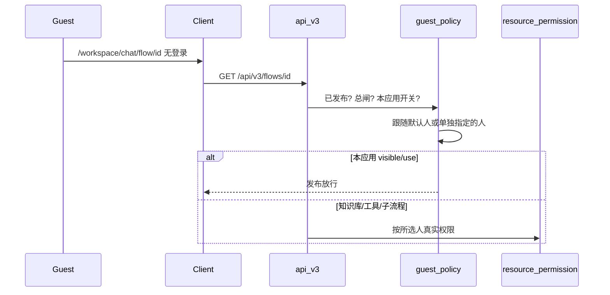

# 3.0 免登录链接执行身份修复方案

待评审。实施计划已按 S0–S6 对齐。过了再写代码。

范围：后台应用「对外发布 → 免登录链接」。2026-09-21。含补充设计 S0–S6。

## 1. 问题

权限认证上线后，对外发布的免登录链接会话用不了。

原先匿名访客用后台配置的那个用户身份跑会话，方便审计。测试要在这个页面加开关：打开后选出用哪个人的身份；默认开，默认人选后台配的那个人；老数据要能升上来。测试还提过「选中的人自动授权这个应用」，见 S0。

只改页面、不改本应用怎么放行，老链接还是打不开。

## 2. 根因

免登录已经走到 `/api/v3`，访客不带 JWT，也不带 API Key。执行身份是 `initdb_config` 里的 `default_operator.user`，`guest_policy.public_execution` 把它装成真实用户。policy 只看：全平台 `enable_guest_access`、应用已上线、这个人还活着、是资源所在租户的 active 成员。

过了 policy，业务层照样打资源权限：

- 工作流详情 `FlowService.get_one_flow` → `visible`
- 助手详情 `AssistantService.get_assistant_info` → `visible`
- WebSocket `ChatManager._has_use_action` → `use`
- Celery `execute_workflow` → `require_business_action(..., use)`

创建应用只给 owner 写授权，不会给 `default_operator`。发布页 `ChatLink` 只拼 URL，每个应用也没有自己的执行人。Client 把任意 HTTP 403 显示成「免登录已关闭」，看起来像总开关被关了。

超管且 `data_scope=ALL` 会短路权限检查。默认操作员还是超管的环境，这个 bug 可能复现不出来。换成普通账号，或者这个人不在资源租户里，详情或 WS 第一条就会 403 / 1008。

选人框默认还是 `default_operator` 的话，如果不改本应用的放行口径，老链接继续 403。

这是开放 API / 免登录通道和资源权限接上时漏掉的场景。代码把「对外发布」当成了「操作员必须先被授权进这个应用」。链接本身没拼错。

## 2.1 补丁还是重做

资源权限对 3.0 的影响已经摊在这条线上了。免登录挂掉，是因为旧做法（匿名请求冒充一个真实用户，URL 还是裸 UUID）和新权限合不上。有人会把这两件事并成一句：权限动得这么大，免登录是不是该重做。我不同意这么推。

重做减不掉已经付过的权限成本。它要回答的是另一件事：访客还要不要等于某个人。真要现在重做，身份、链接长什么样、存量 URL、独立页、嵌入、网关都得动。权限刚合上又换对外发布，回归会比补丁大一截。

本文是补丁：会话能开，每个应用能选人，URL 不变，身份还是真实用户。本应用用发布策略放行，知识库和工具仍按所选用户。安全收到白名单和「别再新选超管」。UUID 泄露、存量超管还在。按天做完，改动限在 v3 和发布页。

重做是换模型：链接多半要带 token，旧地址要么兼容要么作废。按周做。版本冲击会和已经很大的权限改动叠在一起。

测试要的是链接能用、能选人、老数据别丢。补丁够用。重做要的是：公开链接不再是某个真人的权限镜像。那是产品换题。

我倾向这个 beta 先补丁。重做另立项。只有安全和产品已经拍板「匿名不能再冒充真人」，才跳过补丁直接重做。那种情况下面口径作废。

## 3. 口径

下面过了再动工。

### D1 开关

关上之后，这个应用的免登录不可用，返回 26103。关开关立即生效，见 S2。

`enable_guest_access` 仍是全平台总闸。两个都开，链接才放行。

### D2 开了之后选人

打开开关，这个应用的免登录可用。匿名请求用所选用户的身份执行，会话记在他头上。

默认开。没单独指定过人，就跟随系统 `default_operator.user`。页面要能看出是跟随还是单独指定，见 S4、S5。

人选只能是自然人，必须是该应用所在租户的 active 成员。新指定的人不能是服务账号、全局超管、租户管理员。跟随默认、以及保存一个已经存过的人，不按「禁管理员」拦截，见 S3。

### D3 / S0 这个应用怎么放行（不自动授权）

测试原话有「选择的这个人自动走授权这个应用给这个人，考虑上线/下线的授权触发时间点」。本方案不做自动授权。

改为：应用已上线 + 本应用开关为开 → 本应用直接放行（`visible` / `use`）。知识库、工具、子流程仍按所选人走资源权限。`edit`、`share`、`manage_permission`、`publish` 不能免。guest 详情里 `can_share` 继续是 `false`。继续拒绝 `X-On-Behalf-Of`、`X-End-User`（26104）。

为什么不授权：授权等于这个人被允许使用这个应用，工作台会多出它，权限页会多一条；换人、下线、删除都要撤回，漏撤就是残留权限。存量已上线应用若逐个补授权，等于把一批原本打不开的链接一次性对外打开。不授权就没有「触发时间点」：上线、下线、关开关、换人只改一个判断条件。

绑定人没变。访客仍以所选人的身份运行，会话记在他名下，下游按他的权限判。变的只是：他不必先拿到本应用的目录授权。

豁免必须绑当前发布资源的 id。子流程对不上就不能跳。后台任务靠会话反查应用 id 时，查不到或对不上，一律继续查 `use`，不能因为查不到就放行（S6）。

选了一个没有知识库权限的人，应用能打开，检索会失败。页面上写一句。助手调用知识库、工具时同样按所选人判（S6）。

### D4 老数据

不加表，不跑回填。某个应用还没有自己那一行配置，就当成开，跟随系统默认人。存过了才覆盖。

换操作员不影响查历史会话，`public_v3` 按资源 id 匹配。新会话的 `user_id` 写成新操作员，旧行保持旧的。

### D5 安全

链接没有登录态。选了谁，访客就按谁的身份跑这个应用，下游知识库和工具也是这个人的权限。

guest 只放行当前这个已发布应用的 `visible` / `use`。豁免函数不得对当前发布资源 id 以外的对象放行。不能靠免登录改应用、管权限、或用请求头冒充别人。

改开关和选人要有这个应用的 `share`。没有 `share` 的人可以看，控件只读。只能改当前租户、当前这个应用自己那一行。改配置打审计：谁、哪个应用、开还是关、选了哪个 user_id。

`default_operator` 现在经常是 user 1（超管）。运行时不因此拒绝，否则老环境免登录会全挂。新指定的人禁止超管、租户管理员、服务账号；跟随默认和原样再保存不拦，页面给警告。规则细节见 S3。

有效期、share_token、guest 限流这次不做。

### S1 存储：一个应用一行

不用所有应用挤在同一条 JSON 里。两个人同时改不同应用时，读整条再写整条，后写的会冲掉先写的。

仍用现有 `config` 表，不改表结构（`key` 本来就是自由字符串 + 唯一索引）：

- key：`guest_link:workflow:<应用id>` / `guest_link:assistant:<应用id>`
- value：`{"enabled": true, "user_id": 12 | null, "updated_by": 7}`
- 没有这一行 = 开 + 跟随系统默认人
- `user_id` 为 null = 跟随系统默认人；有值 = 本应用单独指定
- 删除应用时顺手删这一行。漏删也无害：应用查不到时，请求更前面就被判为链接无效

不要写进 `flow.data`。不要往 `config.yaml` 加顶层键。

### S2 关开关立即生效

关开关是安全动作，不能出现「页面显示已关、链接还能用一阵子」。

这一行每次请求直接查库，不进 Redis。免登录入口本来就要查用户、成员关系、租户。已经连着的对话：放行函数每次判断都重读开关，关掉之后访客发下一条消息时被拒（26103），不主动踢连接。

系统默认人那份全局配置仍有约 100 秒缓存，本单不动。联调改全局默认人时会有这个延迟。

### S3 「禁选管理员」不要卡死老环境

老环境的系统默认人多半就是超管。如果保存时一律校验「当前人不能是管理员」，用户只是关一下再开，就存不进去。

- 只校验新指定的人：`user_id` 有值、且和库里已存的值不同，才校验（禁超管、租户管理员、服务账号、已删除、非本租户活跃成员）
- 跟随系统默认人（`user_id = null`）不校验，默认人是管理员时页面给警告
- 已指定的人后来被提成管理员：再次保存不拦，页面给警告；运行时不拒绝
- 下拉列表由后端过滤掉不可选的人，前端不自己判断谁是管理员

### S4 系统默认人的连带影响

没单独指定过人的应用都跟着系统默认人走，全局一换它们一起变。因为不写授权，换人本身不会让链接失效。

页面必须能看出本应用是「跟随系统默认」还是「单独指定」。

多租户下，系统默认人全平台只有一个。应用所在租户里没有这个人时，跟随默认的应用一律 26103。GET 要返回「系统默认人在本租户是否可用」。不可用时页面直接提示「系统默认人不属于当前租户，请指定一个人」，不要让用户拿着打不开的链接去猜。

## 4. 请求流

## 5. 改什么

不加 flow / assistant 列，不写 Alembic。不改 OpenFGA 模型、`OpenApiExecutionSnapshot` 字段、`SessionSubject`、权限 runtime，不新开错误码。

### 后端

`guest_policy`：总闸关了、本应用关了、操作员校验不过，都返回 26103。操作员：本应用行上有 `user_id` 用它，否则用 `default_operator.user`。本应用那一行每次直查库（S2）。

本应用放行抽 `is_public_published_resource(resource_id)`。HTTP / WS 读已经在的 `PublicApiPrincipal.resource_id`。Celery 不改 snapshot：`channel==public_v3` 时，用 `chat_id` 找到 session 的 `flow_id`，跟本次 `workflow_id` 比。对得上才跳过 `use`。查不到会话或对不上，继续查 `use`（S6）。调用点：`get_one_flow`、`get_assistant_info`、`_has_use_action`、这一处 Celery 判断。

管理接口：工作流和助手各一套 GET/PATCH。URL 里不要出现 `config` 这个词。

GET 返回：解析后的开关、当前运行身份、是否跟随系统默认、默认人展示名、默认人在本租户是否可用、总开关是否开启、`can_edit`（有无 `share`）、以及给警告用的状态（管理员、已停用等）。下拉候选由后端过滤。

PATCH：要有 `share`。只写当前这个应用自己那一行。关掉只记 `enabled=false`，上次的 `user_id` 可以留着。校验按 S3。写审计。应用删除时删对应 config 行。

### 平台发布页（S5）

只动免登录 Tab（`ChatLink`，`noLogin=true`）。从上到下：

1. 顶部提示条：按 GET 的总开关显示。没开时写「系统未开启免登录访问，请联系管理员」，下面控件全部置灰。不要再写 `enable_guest_access = True` 这种配置名。
2. 开关「允许免登录访问」，默认开。点一下立即保存，不另做保存按钮，成功后轻提示。失败则开关弹回并提示原因。
3. 运行身份：开关为开时显示。单选，复用 `UsersSelect`，选项来自后端过滤后的列表。跟随系统默认时，下拉里显示默认人名字，旁边灰色标签「系统默认」；单独指定后标签消失，出现文字按钮「恢复系统默认」。选中即保存。Radix 的 `SelectItem` 不能给空 value。
   下方固定说明：访客无需登录，将以此人的身份使用本应用，对话记录记在此人名下；访客能用到此人在本应用里可访问的知识库和工具。
   说明下方橙色警告，按情况出现：此人是管理员；系统默认人不属于当前租户；此人已停用或已删除。
4. 链接和嵌入：开关关闭时置灰、复制禁用，上方提示「本应用已关闭免登录访问」。链接本身不变，再打开后原链接继续可用。

没有本应用 `share` 的人可以看，控件只读。

文案按 UI 规范过一遍后定稿，三语同版。不要手改 `api_errors` 生成文件。

### Client

guest 的 URL 不用改。`resolveGuestAccessState` 不要再把 403 当成「免登录已关闭」，只认 26103。会话里下游返回的 403 留在对话里，不要把整页判死。

## 6. 测试

- 没存过配置：开关开，跟随系统默认人
- 本应用关掉：26103；已连上的 WS 发下一条即拒
- 单独指定了 user：覆盖全局默认人
- 跟随默认，默认人不在本租户：26103；GET 标明不可用
- 这个应用没有目录授权，详情 / WS / Celery 仍能进
- 操作员没有知识库 `use`：检索失败，应用还能打开（工作流和助手都测）
- 子流程 id 和 session.flow_id 不同：仍做 `use` 检查
- Celery 查不到会话：不跳过 `use`
- PATCH 无 `share`、改别人的应用 id：拒绝
- 新指定超管 / 租户管理员 / 服务账号：拒绝
- 跟随默认再保存、或原样保存已指定的（后来变成管理员的）人：不拒绝
- 两人同时改两个应用：互不覆盖
- guest 带身份头：仍 26104
- guest 不得因放行而拿到 `can_share=true`

## 7. 这次不做

`flow` / `assistant` 不加列，不写 Alembic。不给所选用户写本应用的授权记录。

不改 OpenFGA 模型、`OpenApiExecutionSnapshot`、`SessionSubject`、权限 runtime，不新开错误码。

需登录链接、share-token、v2 API Key 不动。本单不加链接有效期。

guest 页上还残留着要登录的 v1 接口，比如语音用的 `GET /api/v1/llm/workbench`，本单不清。测试如果说的是能聊天、语音或点赞挂了，另开一单。

## 8. 风险

默认人不在该租户，跟随默认的链接是 26103。GET 和页面必须把这件事说清楚，不能只靠用户自己试链接。

人选得太窄，应用能开，下游按他的权限收。说明文案按 S5 写。

豁免如果没绑当前发布资源的 id，guest 会整段绕过资源权限。白名单只有这个资源的 `visible` 和 `use`。查不到会话时不能放行。

存量系统默认人若是超管，链接仍然等于超管入口。运行时不砍。这是已知债。

链接就是 UUID，没有有效期。泄露后关本应用开关或关总闸。关开关必须立刻生效（S2）。

## 9. 过了再做

1. 本应用发布放行 + 直查开关 + 单测。做完这一步，老链接在「跟随默认人且人可用」时应能进。
2. 一个应用一行的 GET/PATCH，按 S3 校验。
3. 发布页按 S5。
4. Client 对 403 的映射。

会话先恢复。页面可以后做。按 Small feature 补一版短 spec，不必从头 Discovery。

## 10. 评审时勾这些

- [ ] D1：关上 = 这个应用免登录不可用
- [ ] D2：默认开；没指定人则跟随系统默认人
- [ ] D3 / S0：不自动授权，改为发布放行（需测试确认）
- [ ] D4：没这一行配置 = 开 + 跟随默认人；不加表
- [ ] D5：豁免白名单、禁身份头、PATCH 要 share 且只改本行
- [ ] S1：一个应用一行，不共用 JSON
- [ ] S2：本应用开关不走缓存，关闭后下一条消息即拒
- [ ] S3：只校验新指定的人；跟随默认不拦只警告
- [ ] S4：页面区分跟随 / 单独指定；默认人不在本租户时明确提示
- [ ] S5：交互稿（即时保存、系统默认标签、恢复默认、三种警告、无 share 只读）
- [ ] S6：后台任务查不到会话时不放行；助手下游权限补测
- [ ] 走补丁，不在本单重做免登录身份模型
- [ ] 本单不含 v1 语音残留登录依赖，也不含 guest 有效期 / share_token
