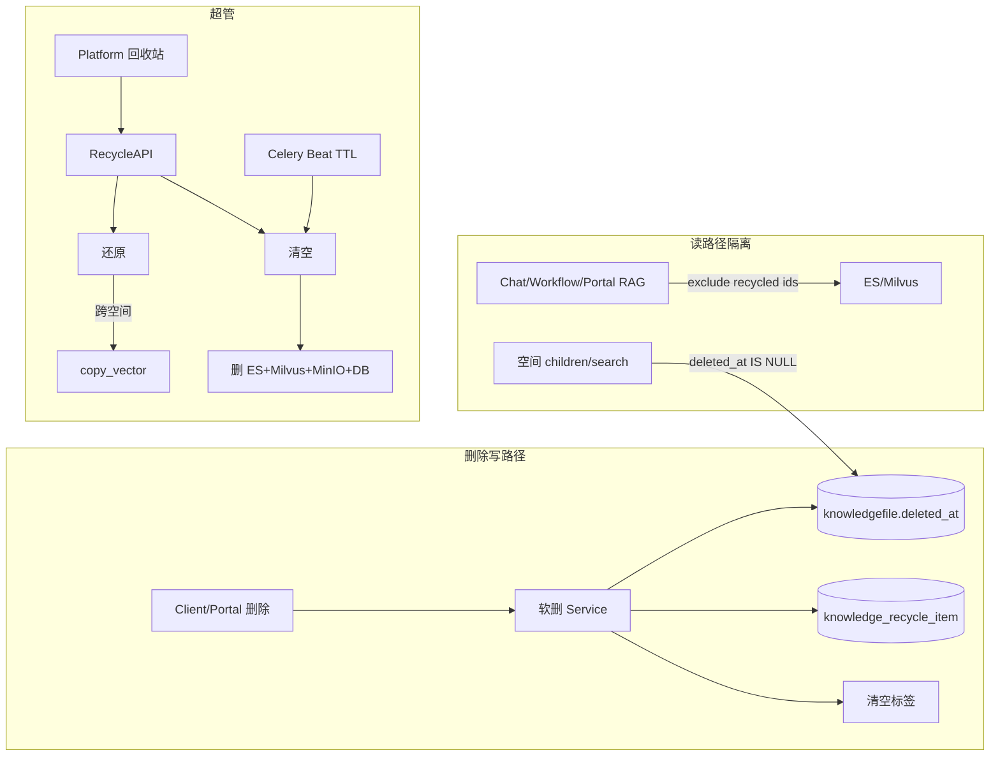
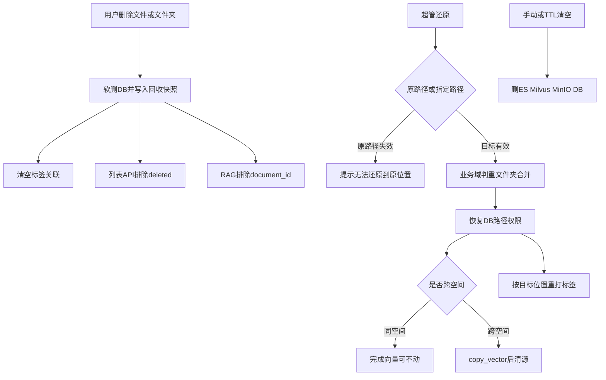

# 知识空间回收站（Recycle Bin）设计方案

| 属性 | 内容 |
|------|------|
| 日期 | 2026-07-28 |
| 文档状态 | 评审稿 v0.3 |
| 范围 | 仅知识空间 `KnowledgeTypeEnum.SPACE`（含侧栏「个人知识库」私有空间） |
| 操作角色 | 仅超级管理员 `super_admin` |
| 关联现状 | 当前删除为硬删（MySQL + Celery 清 ES/Milvus/MinIO），`knowledgefile` 无软删字段 |

---

## 1. 背景与目标

### 1.1 背景

知识空间文件/文件夹删除后不可恢复，误删成本高。需要统一进入回收站，由超管审计、还原或清空。

### 1.2 目标

1. 所有 **SPACE** 知识删除进入回收站（含公开 / 审批 / 私有可见性空间）。
2. 超管可在 Platform 后台查看记录、还原、手动清空，并配置自动清空天数（默认 7，支持 3/7/X）。
3. 还原支持：默认原路径；或指定任意知识空间路径（可跨空间）。
4. 保留文件夹层级；支持单文件还原与整夹还原。
5. 还原校验：原路径有效性、业务域、文件判重、文件夹重名合并。
6. 进站后检索不可命中；真正清空才物理删除存储与索引。
7. 标签进站清空，还原后按目标位置重打。

### 1.3 非目标（本期不做）

- 传统文档库 NORMAL、QA、工作台个人库 `PRIVATE(type=2)` 进回收站
- 普通用户 / 空间管理员自助查看或还原
- 进站即删除 MinIO / ES / Milvus（影响同空间还原性能）

---

## 2. 已确认决策

| 项 | 结论 |
|----|------|
| 覆盖范围 | 仅 `KnowledgeTypeEnum.SPACE`（含侧栏「个人知识库」私有空间）；不含 NORMAL / QA / 工作台 PRIVATE |
| 操作角色 | 仅超级管理员可查看 / 还原 / 清空 / 配置；普通用户无入口 |
| 还原 | 默认原路径；支持指定任意知识空间路径（跨空间用 `copy_vector`） |
| 保留策略 | 全局配置，默认 7 天，可改 3/7/X；手动支持勾选清空 + 一键清空全部 |
| 版本 | 整链软删 / 整链还原；列表按文档聚合，不展开版本 |
| 文件夹冲突 | 弹窗「是否合并」→ 否取消；是则合并，冲突文件自动重命名 |
| 单文件冲突 | 阻断提示；判重范围 = 目标目录内；规则 = 文件名 **或** MD5 |
| 索引策略 | 进站只软删 DB；检索复用「排除 file_id」模式；真正清空才删 ES/Milvus/MinIO |
| 标签 | 进站清空关联；还原后按目标位置规则重打 |
| 业务域 | 还原前校验目标空间是否绑定该业务域，否则提示并列出文件 |
| 主表软删 | `knowledgefile` **只加 `deleted_at`**（不加 `is_deleted` / `deleted_by` / batch 等）；其余审计字段在 `knowledge_recycle_item` |
| 入口位置 | **首钢门户**右上角用户菜单：紧挨「知识管理后台」**下方**增加「回收站」；可见性与「知识管理后台」相同（`canOpenAdmin` = 已配置后台 URL 且 `isPortalAdmin`） |
| 入口跳转 | 新标签打开 BiSheng Platform 回收站页；URL 由 `bisheng_admin_entry_url` 推导为 `{adminOrigin}/filelib/recycle`（与打开后台同域） |

> 说明：回收站**列表/还原/清空页面**仍在 Platform（`/filelib/recycle`）实现；门户只负责菜单入口。API 仍要求 BiSheng 超管。

---

## 3. 角色与权限

| 角色 | 删除行为 | 回收站可见 | 还原 / 清空 / TTL 配置 |
|------|----------|------------|------------------------|
| 普通成员 / 空间管理员 | 删除 → 进回收站 | 否 | 否 |
| 超级管理员 | 同左 | 是（全局） | 是 |

- 回收站 API 一律校验超管（`login_user.is_admin` 或项目内等价判定）。
- Platform 菜单「回收站」仅超管可见；非超管 403（走现有拦截器）。

---

## 4. 总体架构



### 4.1 索引与存储策略（性能优先）

| 阶段 | MySQL | MinIO | ES / Milvus |
|------|-------|-------|-------------|
| 进回收站 | `deleted_at` 置时 + 写快照 | **保留** | **保留**，检索侧排除 `document_id` |
| 同空间还原 | 清 `deleted_at`、改路径 / 权限 | 不动 | **不动** |
| 跨空间还原 | 迁到目标空间 | 按现有迁移策略 | `copy_vector` 后清源侧索引 |
| 手动 / TTL 清空 | 硬删行 | 删除对象 | `delete_vector_files` |

检索排除复用现有非主版本排除模式（`document_id not in [...]`），集中在 helper，避免漏过滤。

不采用「进站即删向量」：同空间还原可避免全量重嵌；跨空间还原仍走现有 `copy_vector`。



---

## 5. 数据模型设计

### 5.1 现状说明

`knowledgefile`（`KnowledgeFile`）当前**没有**软删除字段（无 `deleted_at` / `is_deleted`）。删除路径为 DB 硬删 + Celery 清向量与 MinIO。

### 5.2 `knowledgefile` 扩展（仅 1 个字段）

| 字段 | 类型 | 说明 |
|------|------|------|
| `deleted_at` | DATETIME NULL | `NULL` = 正常；非空 = 在回收站。兼作 TTL 起点与「删除时间」来源之一 |

**明确不加**：`is_deleted`、`deleted_by`、`recycle_batch_id`、`recycle_root_id`（避免主表冗余；审计与批次信息在快照表）。

为何不用单独的 `is_deleted`（0/1）：自动清空需要「进入回收站的时间」，若只有 0/1 仍须另加时间字段；`deleted_at` 一个字段即可表达「是否在站 + 何时进站」。

索引建议：`(knowledge_id, deleted_at)`，便于按空间拉回收 id 与过滤。

> 软删行仍占用原 `id`，还原时尽量复用同一 `KnowledgeFile.id` / `document_id`，避免同空间还原改向量主键。

### 5.3 新表 `knowledge_recycle_item`（列表展示与审计快照）

进站时写入；还原成功或清空后删除对应行（列表只查进行中条目）。

| 字段 | 类型 | 说明 |
|------|------|------|
| `id` | BIGINT PK | |
| `tenant_id` | BIGINT | 多租户自动注入 |
| `file_id` | INT | → knowledgefile.id |
| `knowledge_id` | INT | 删除时所在空间 |
| `file_type` | TINYINT | 0 文件夹 / 1 文件 |
| `is_list_entry` | BOOL | 是否在回收站列表展示为独立行（见 5.4） |
| `display_name` | VARCHAR | 名称快照 |
| `file_category_code` | VARCHAR NULL | 文件分类 |
| `file_subcategory_code` | VARCHAR NULL | |
| `business_domain_code` | VARCHAR NULL | 业务域 |
| `tags_snapshot` | JSON | 进站前标签快照；线上标签已清空 |
| `file_encoding` | VARCHAR NULL | 文件编码 |
| `file_size` | BIGINT NULL | 字节；文件夹可为子树合计或 NULL |
| `md5` | VARCHAR NULL | 文件 MD5；文件夹空 |
| `original_knowledge_id` | INT | 原空间 |
| `original_parent_id` | INT NULL | 原父文件夹 id |
| `original_path` | VARCHAR | 完整展示路径，如 `/空间名/A/B/文件.pdf` |
| `original_file_level_path` | VARCHAR | 系统路径快照，用于原路径还原校验 |
| `original_path_fingerprint` | VARCHAR | 路径上各级 folder_id 序列哈希，「路径任意变化」判定 |
| `deleted_by` | INT | 删除人 user_id |
| `deleted_by_name` | VARCHAR | 展示用冗余 |
| `deleted_at` | DATETIME | 进入回收站时间（与主表对齐） |
| `expire_at` | DATETIME | 进站时按当时全局 retention 固化：`deleted_at + retention_days` |
| `recycle_batch_id` | VARCHAR(64) | 同一次删除（尤其删文件夹）共享 |
| `recycle_root_id` | INT | 本次删除根节点 file_id；根节点自身 = 自己的 id |
| `document_id` | INT NULL | 逻辑文档 id（版本链锚点） |
| `version_file_ids` | JSON NULL | 整链物理 file_id 列表（文档聚合用） |
| `create_time` / `update_time` | DATETIME | |

DM8 兼容：JSON 使用 `dialect_helpers.JsonType`；时间字段避免 MySQL 专有 `ON UPDATE` 写法。

### 5.4 列表展示规则（`is_list_entry`）

| 用户操作 | 写入软删范围 | 列表展示 |
|----------|--------------|----------|
| 删单个文件（含版本链） | 整链所有物理文件 | **1 条文档行**（主版本 / 文档名聚合）；非主版本 `is_list_entry=false` |
| 删文件夹 | 子树全部软删 | **1 条文件夹行**（根）；子文件 / 子夹 `is_list_entry=false`，详情可展开 |
| 回收站内「按文件还原」 | — | 可对展开后的子文件单独还原 |

### 5.5 全局配置

复用现有配置体系（DB config / initdb_config），新增键例如：

```yaml
knowledge_recycle_bin:
  retention_days: 7   # 全局，3/7/X；建议 min=1，max=365
```

仅超管可改。

**`expire_at` 固化策略（已定倾向）**：进站时按**当时**的 `retention_days` 写入 `expire_at`；之后改全局配置只影响新进站条目，避免改配置导致大批提前 / 延后清空。

### 5.6 相关表处理

| 对象 | 进站 | 还原 | 清空 |
|------|------|------|------|
| `knowledge_document` / `knowledge_document_version` | 随 file 不可见；不物理删 | 恢复可见 | 物理删 |
| ReviewTag / 标签链接 | **删除链接**；快照进 recycle_item | 按目标空间规则重打 | — |
| OpenFGA tuples | 从可见树移除 | 按目标 parent 重建 | 删除 |
| PDF artifact / similarity | 保留 | 保留 | 随硬删清理 |
| Channel sync / 推荐索引 | 从可见集排除 | 按目标重建 | 清理 |

### 5.7 配额

建议：回收站内文件**仍占**上传配额（存储未释放）；真正清空后释放。待评审最终确认。

---

## 6. API 设计

Base：`/api/v1/knowledge_recycle`  
鉴权：登录 + 超管。  
响应：统一 `resp_200` / 业务错误码。

### 6.1 获取配置

`GET /api/v1/knowledge_recycle/config`

```json
{
  "retention_days": 7,
  "allowed_presets": [3, 7],
  "allow_custom_days": true,
  "min_days": 1,
  "max_days": 365
}
```

### 6.2 更新配置

`PUT /api/v1/knowledge_recycle/config`

```json
{ "retention_days": 7 }
```

校验：`1 <= retention_days <= 365`。只影响之后新进站条目的 `expire_at`。

### 6.3 列表

`GET /api/v1/knowledge_recycle/items`

Query：

| 参数 | 说明 |
|------|------|
| `page` / `page_size` | 分页 |
| `keyword` | 名称 / 编码 / 原路径模糊 |
| `knowledge_id` | 按原空间筛选 |
| `file_type` | 0 / 1 |
| `deleted_by` | 删除人 |
| `deleted_from` / `deleted_to` | 删除时间范围 |
| `business_domain_code` | 业务域 |

Response item 示例：

```json
{
  "id": 10001,
  "file_id": 555,
  "file_type": 1,
  "name": "安全规范.pdf",
  "file_category": "标准",
  "file_category_code": "STD",
  "business_domain_code": "SC",
  "business_domain_name": "生产",
  "tags": [{"id": 1, "name": "强制"}],
  "file_encoding": "GF-STD-SC-20260500000001",
  "file_size": 1048576,
  "deleted_by": 12,
  "deleted_by_name": "张三",
  "deleted_at": "2026-07-20T10:00:00",
  "expire_at": "2026-07-27T10:00:00",
  "original_path": "/集团知识库/制度/安全/安全规范.pdf",
  "original_knowledge_id": 9,
  "original_knowledge_name": "集团知识库",
  "can_restore_original": true,
  "children_count": 0
}
```

### 6.4 条目详情 / 子树

- `GET /api/v1/knowledge_recycle/items/{id}`
- `GET /api/v1/knowledge_recycle/items/{id}/children`

用于文件夹展开，支持勾选子文件单独还原。

### 6.5 预检还原

`POST /api/v1/knowledge_recycle/restore/preview`

Request：

```json
{
  "item_ids": [10001],
  "mode": "original",
  "target_knowledge_id": null,
  "target_folder_id": null,
  "merge_folder": null
}
```

或指定路径：

```json
{
  "item_ids": [10001],
  "mode": "custom",
  "target_knowledge_id": 15,
  "target_folder_id": 888,
  "merge_folder": null
}
```

Response：

```json
{
  "ok": false,
  "blockers": [
    {
      "code": "ORIGINAL_PATH_GONE",
      "message": "原位置已不存在，无法还原",
      "item_ids": [10001]
    }
  ],
  "warnings": [
    {
      "code": "FOLDER_NAME_CONFLICT",
      "message": "存在重名文件夹，是否合并？",
      "conflicts": [{"name": "规范", "target_folder_id": 777}]
    }
  ],
  "need_confirm_merge": true
}
```

前端：先 preview → 若需合并则弹窗 → 再带 `merge_folder=true` 正式还原。

### 6.6 执行还原

`POST /api/v1/knowledge_recycle/restore`

```json
{
  "item_ids": [10001],
  "mode": "custom",
  "target_knowledge_id": 15,
  "target_folder_id": 888,
  "merge_folder": true,
  "scope": "entry"
}
```

`scope`：

- `entry`：还原列表选中条目（文件夹 = 整夹带层级；文档 = 整版本链）
- `files`：配合 `file_ids`，仅还原文件夹下勾选的若干文件（**推荐保留相对中间路径**）

大批量可异步返回 `task_id`；小批量同步。

成功后：删除对应 `recycle_item`；`knowledgefile.deleted_at = NULL`。

### 6.7 清空

`POST /api/v1/knowledge_recycle/purge`

```json
{ "item_ids": [10001, 10002] }
```

或

```json
{ "all": true }
```

- 勾选：清空选中 list entry 及其下属软删节点（整链 / 子树）
- `all=true`：当前租户回收站全部硬删  
异步任务 + 进度。

### 6.8 现有删除 API 行为变更

仍使用空间删除路由（files / folders / 批量），语义改为软删进站。响应可增加：

```json
{ "recycled": true, "recycle_batch_id": "..." }
```

Client 文案：「将移入回收站，可由管理员在保留期内还原」。

### 6.9 错误码（建议 109xx 段新增）

| Code | 含义 |
|------|------|
| 10941 | 非超管访问回收站 |
| 10942 | 回收站条目不存在 |
| 10943 | 原位置已不存在，无法还原 |
| 10944 | 目标路径不存在 |
| 10945 | 目标库不存在 XX 业务域，请先修改以下文件的业务域：XXX |
| 10946 | 文件重复（文件名或 MD5，目标目录内） |
| 10947 | 存在重名文件夹，需确认是否合并 |
| 10948 | 保留天数非法 |
| 10949 | 跨空间还原失败（如 embedding 不一致） |
| 10950 | 还原 / 清空任务失败 |

---

## 7. 业务操作逻辑

### 7.1 删除 → 进回收站

```
1. 权限校验（现有 delete 权限）
2. 若文件：expand 版本链 → 全部 file_id
   若文件夹：按 file_level_path 前缀取子树（含自身）
3. 生成 recycle_batch_id；root = 用户选中节点
4. 对每个节点：
   - 写 knowledge_recycle_item 快照（路径、业务域、标签、编码、大小…）
   - 计算 original_path_fingerprint（父链 folder_id 列表）
   - expire_at = now + retention_days（进站当时配置）
   - 设置 knowledgefile.deleted_at = now
5. is_list_entry：根文档 / 根文件夹 = true；版本非主、子节点 = false
6. 清空标签关联（线上）
7. 调整 OpenFGA / 可见性（不可再在 children 出现）
8. 失效相关缓存；不调用 delete_knowledge_file_celery
```

**TTL 起点**：进入回收站时间（`deleted_at` / 快照 `deleted_at`），不是文件创建时间。清空调度以快照 `expire_at` 为准。

### 7.2 空间列表 / 搜索隔离

所有 SPACE 文件查询（`list_space_children`、`search`、global-search、my-uploaded、Portal browse 等）默认：

```sql
WHERE deleted_at IS NULL
```

DAO 层统一默认过滤，避免遗漏。

### 7.3 RAG / 检索隔离

扩展 `build_primary_only_filter` 为例如 `build_knowledge_retrieval_exclude_filter(knowledge_id)`：

```
excluded = non_primary_file_ids ∪ recycled_file_ids(knowledge_id)
→ Milvus: document_id not in [...]
→ ES: must_not terms metadata.document_id
```

必须覆盖：

- `KnowledgeSpaceChatService`（单文件 / 文件夹 / 跨库）
- `RagUtils.init_knowledge_retriever`
- Portal ES search / OpenAPI retrieve
- 其它直接按 `document_id` 查向量的入口

单文件 chat：若 `file_id` 已回收 → 直接拒绝或空结果。

`recycled_file_ids` 可按 space 短缓存（Redis），删除 / 还原时 bump 版本号。

### 7.4 还原 — 原路径（mode=original）

```
1. 读 recycle_item
2. 校验 original_knowledge_id 空间仍存在且 type=SPACE
3. 校验 original_path_fingerprint：
   - 原 parent_id 仍存在且未软删
   - 父链各级 folder 未删、未改挂、路径未变
   - 任一失败 → 10943「原位置已不存在，无法还原」
4. 进入通用还原校验（7.6），目标 = 原 parent
5. 执行恢复（7.7）
```

### 7.5 还原 — 指定路径（mode=custom）

```
1. 校验 target_knowledge_id 为 SPACE 且存在
2. 校验 target_folder_id 存在于该空间（或 null = 空间根）且未软删
3. 通用还原校验（7.6）
4. 若 target_knowledge_id != original → 跨空间流程（7.8）
5. 否则同空间恢复到新父路径（7.7）
```

### 7.6 通用还原校验

顺序固定：

1. **业务域**  
   收集待还原文件的 `business_domain_code`。  
   目标空间 `business_domain_codes` 未绑定 → 10945，列出文件名。

2. **文件夹名冲突**（还原文件夹时）  
   目标目录下存在同名文件夹 → 返回 `need_confirm_merge`。  
   - 用户取消 → 整单中止  
   - 用户确认 `merge_folder=true` → 并入已有文件夹；子项递归；**文件冲突自动重命名** `name(n).ext`

3. **文件判重**（单独还原文件）  
   范围：**目标目录内**  
   条件：`file_name` 相同 **或** `md5` 相同 → **阻断**（10946），不自动重命名。  
   文件夹合并场景下文件冲突走重命名（与单文件阻断不同）。

4. **Embedding 一致性**（仅跨空间）  
   目标与源 embedding 模型不一致 → 10949（对齐现有迁移脚本行为）。

### 7.7 同空间恢复执行

```
1. 清除 deleted_at（整链或子树）
2. 更新 parent / file_level_path / level（整夹保持相对层级）
3. 更新 KnowledgeDocument 路径
4. 重建 OpenFGA parent / 授权
5. 删除 recycle_item 行
6. 标签：按目标位置规则异步重打（建议失败不阻断还原，可重试）
7. 向量：不迁移
```

### 7.8 跨空间恢复执行

```
1. 参照 move_knowledge_space_files / copy_vector：
   - 复制 / 迁移 MinIO（若策略需要）
   - copy_vector 改写 knowledge_id / document_id 到目标 collection
   - 源侧删向量
2. DB：knowledge_id、路径改为目标；清 deleted_at
3. 权限 / 标签按目标空间重建
4. 删 recycle_item
5. 失败需可补偿（任务状态 + 回滚策略），避免半成功
```

### 7.9 整夹 vs 单文件还原

| 操作 | 行为 |
|------|------|
| 还原文件夹 list entry | 子树全部恢复，相对层级不变 |
| 还原文档 list entry | 版本链全部恢复 |
| 在文件夹详情中勾选若干文件还原 | 仅这些文件（及其版本链）恢复；**推荐重建相对中间路径** |

### 7.10 清空（手动 / TTL）

```
1. 解析范围：选中 entry → 扩展到子树 + 版本链；或 all；或 expire_at < now()
2. 对每个 file_id：
   - delete_vector_files (ES+Milvus)
   - 删 MinIO 对象 / artifacts
   - 清 OpenFGA、标签残留、document/version
   - DELETE knowledgefile 行
3. 删 recycle_item
4. Celery Beat：定期扫描 expire_at < now() 的条目执行同上
```

手动「一键清空全部」与 TTL 共用同一 Purge Service。

---

## 8. 前端设计

### 8.1 门户入口（首钢 Portal Header）

文件：[`shougang-group-knowledge-portal/frontend/src/components/Header.tsx`](../../../../shougang-group-knowledge-portal/frontend/src/components/Header.tsx)

在用户下拉菜单中，「知识管理后台」按钮**正下方**增加「回收站」：

```tsx
{canOpenAdmin ? (
  <>
    <button /* 现有：知识管理后台 */ />
    <button
      type="button"
      className={s.userMenuItem}
      onClick={() => {
        closeMenu();
        window.open(bishengRecycleUrl, '_blank', 'noopener,noreferrer');
      }}
    >
      <Trash2 size={15} />  {/* 或合适 lucide 图标 */}
      回收站
    </button>
  </>
) : null}
```

- 样式复用现有 `s.userMenuItem`（与「知识管理后台」一致）
- `bishengRecycleUrl`：由 `bisheng_admin_entry_url` 解析 origin + path `/filelib/recycle`（若 admin URL 已含 path，取 origin 再拼）
- 顺序：用户信息头 → 知识管理后台 → **回收站** →（可选）我的上传 → 分割线 → 退出登录

### 8.2 Platform（回收站页面本体）

- 路由：`/filelib/recycle`（知识库模块下，仅超管可进）
- 页面：
  - 顶部：保留天数配置（预设 3/7 + 自定义 X）
  - 表格列：名称、文件分类、业务域、标签、文件编码、删除人、删除时间、原位置、文件大小、到期时间
  - 操作：还原、删除（清空）、批量还原 / 清空、清空全部
- 还原弹窗：
  1. 还原到原位置（`can_restore_original=false` 时禁用并提示）
  2. 指定路径（空间选择器 + 文件夹树）
  3. 文件夹冲突二次确认「是否合并」

### 8.3 BiSheng Client（知识空间）

- 无回收站入口（入口在门户）
- 删除确认文案改为移入回收站说明

---

## 9. 任务与运维

| 任务 | 队列 | 说明 |
|------|------|------|
| `purge_expired_recycle_items` | knowledge_celery + Beat | 扫 `expire_at` |
| `restore_recycle_items_task` | knowledge_celery | 大批量 / 跨空间还原 |
| `purge_recycle_items_task` | knowledge_celery | 手动清空 |

日志：batch_id、操作者、成功 / 失败 file_id、耗时。

---

## 10. 模块落地建议

```
knowledge/
  api/endpoints/knowledge_recycle.py
  domain/models/knowledge_recycle_item.py
  domain/schemas/knowledge_recycle.py
  domain/services/knowledge_recycle_service.py
  domain/repositories/...
  rag/retrieval_exclude.py   # 合并 non-primary + recycled
worker/knowledge/recycle_worker.py
```

改造删除入口：`knowledge_space_service` 的 `delete_file` / `delete_folder` / 批量删除改调 RecycleService.soft_delete_*。

注册路由：`bisheng/api/router.py`。

---

## 11. 兼容与迁移

1. Alembic：`knowledgefile` 加 `deleted_at` + 建 `knowledge_recycle_item`；历史数据 `deleted_at` 全 NULL。
2. 上线后新删除走软删；上线前已硬删的无法进入回收站。
3. 双库（MySQL + DM8）类型兼容。
4. 按仓库 SDD：后续落地 `features/v{x}/{NNN}-knowledge-recycle-bin/{spec,tasks}.md`。

---

## 12. 测试要点

| 场景 | 期望 |
|------|------|
| 删文件 / 文件夹 | 列表不可见；RAG 不命中；MinIO 仍在 |
| 超管列表字段完整 | 含完整原路径 |
| 原路径被挪 / 改名 / 删父 | 原路径还原失败提示 |
| 指定跨空间还原 | 向量在目标可检索，源不可 |
| 业务域不匹配 | 10945 + 文件名列表 |
| 单文件重名 / 同 MD5 | 阻断 |
| 文件夹重名合并 | 确认后合并，冲突文件重命名 |
| 版本链 | 列表 1 条；还原整链 |
| TTL / 手动清空 | ES / Milvus / MinIO / DB 均无 |
| 非超管调 API | 403 / 10941 |
| 配额 | 进站仍占配额；清空后释放（若按此定） |

---

## 13. 待团队拍板

1. ~~回收站入口位置~~（已定：门户用户菜单「知识管理后台」下方；页面在 Platform `/filelib/recycle`）
2. 还原后打标签失败：不阻断（当前建议）vs 阻断
3. 回收站内文件是否仍占上传配额（当前建议：仍占）
4. 跨空间还原是否限制「仅同 embedding 模型」（建议限制）
5. 文件夹下「单文件还原」是重建中间目录（当前建议）还是拍平到目标目录
6. 门户 `isPortalAdmin` 与 BiSheng `super_admin` 不完全一致时：入口可见但 API 403 是否可接受，或需额外对齐角色

---

## 14. 相关代码参考

| 能力 | 路径 |
|------|------|
| 空间删除 | `knowledge/domain/services/knowledge_space_service.py` |
| 版本链级联 | `_cascade_version_links_on_delete` |
| 向量删除 | `api/services/knowledge_imp.py` → `delete_vector_files` |
| Celery 硬删 | `worker/knowledge/file_worker.py` → `delete_knowledge_file_celery` |
| 跨库迁向量 | `copy_vector`；脚本 `scripts/move_knowledge_space_files.py` |
| 检索排除模式 | `knowledge/rag/version_filter.py` → `build_primary_only_filter` |
| KnowledgeFile 模型 | `knowledge/domain/models/knowledge_file.py` |
