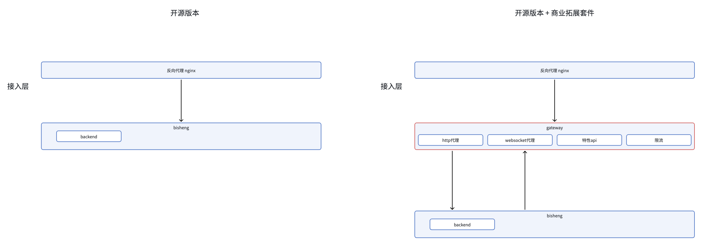

# 一、整体架构介绍




# 二、安装系统依赖环境

完成毕昇开源版本安装 >> [ 私有化部署](https://dataelem.feishu.cn/wiki/BSCcwKd4Yiot3IkOEC8cxGW7nPc)，核心服务组件如下：

| 容器                    | 镜像                                | 组件关系                                                                                                                           | 建议分配资源                       |
| --------------------- | --------------------------------- | ------------------------------------------------------------------------------------------------------------------------------ | ---------------------------- |
| bisheng-frontend      | dataelement/bisheng-frontend      | 应用程序： Nginx&#xA;软件依赖： Nginx&#xA;网络端口： 3001                                                                                     | 1\~2 cores<br />2\~8G memory |
| bisheng-backend<br /> | dataelement/bisheng-backend<br /> | 应用程序： /app/bisheng&#xA;软件依赖：langchain0.0.232, bisheng\_langchain, fastapi, &#xA;系统依赖：Linux 环境&#xA;运行时：Python3.10&#xA;网络端口：7860 | 1\~2 cores<br />2\~8G memory |
| bisheng-gateway       | dataelement/bisheng-gateway       | 应用程序：Java<br />软件依赖：Java<br />运行时：Java 17<br />网络端口：8080                                                                       | 1\~2 cores<br />2\~8G memory |

# 三、搭建 Gateway 系统

## 1. 初始化SQL

* 创建数据库

```bash
CREATE DATABASE `bisheng_gateway` /*!40100 DEFAULT CHARACTER SET utf8mb4 COLLATE utf8mb4_general_ci */ /*!80016 DEFAULT ENCRYPTION='N' */;
```

* 创建表

```bash
create table bisheng_gateway.gt_group_resource
(
    id             int auto_increment
        primary key,
    group_id       int           not null,
    resource_id    varchar(256)  not null comment '技能/助手id',
    resource_limit int default 0 not null comment '0 无限制',
    resource_type  tinyint       not null comment '资源类型 助手/技能'
)
    comment '用户组和资源的对应关系';

create table bisheng_gateway.gt_sensitive_words
(
    id            int auto_increment
        primary key,
    resource_id   varchar(256)      not null comment '技能、助手id',
    resource_type tinyint           null comment '2 技能， 3 助手',
    auto_words    text              null comment '预置词表',
    words         longtext          null comment '自定义词表',
    words_types   varchar(32)       null comment '生效的词表“|“分割',
    is_check      tinyint default 0 not null comment '是否生效',
    create_time   datetime          not null,
    update_time   datetime          not null,
    logic_delete  tinyint default 0 not null comment '逻辑删除',
    auto_reply    varchar(128)      null
)
    comment '安全词审核';

create table bisheng_gateway.gt_user_group
(
    id            int auto_increment
        primary key,
    group_name    varchar(256)      not null comment '组名',
    admin_user    varchar(512)      null comment '管理员 以，分开',
    admin_user_id varchar(512)      null comment '管理员id',
    group_limit   int     default 0 not null comment '用来标识是否有限制 0 无限制',
    create_time   datetime          not null,
    update_time   datetime          not null,
    logic_delete  tinyint default 0 not null comment '逻辑删除'
)
    comment '用户组';


create table bisheng_gateway.gt_block_record
(
    id          int auto_increment
        primary key,
    chat_id     varchar(64) null,
    user_input  text        null,
    system_out  text        null,
    block_words text        null,
    create_time datetime    not null,
    update_time datetime    not null,
    resource_id varchar(64) null
)
    comment 'hit';

```


## 2. 拉取 Gateway 镜像

```bash
docker login cr.dataelem.com -u docker -p dataelem

docker pull cr.dataelem.com/dataelement/gateway:release
```


## 3. 申请license授权

在宿主机器上，执行以下shell ，并提供 server\_fingerprint.txt 文件中结果  给BISHENG工作人员。

```bash
#!/bin/bash

# 输出文件名
output_file="server_fingerprint.txt"

# 收集系统信息
echo "Collecting system information..."

# 主机名
hostname=$(hostname)

# 系统版本和内核信息
os_info=$(uname -a)

# CPU信息
cpu_info=$(lscpu)

# 内存信息
mem_info=$(free -m)

# 磁盘使用情况
disk_usage=$(df -h)

# 网络配置
network_info=$(ifconfig)

# 服务状态
#services=$(service --status-all)

# 将信息输出到文件
{
    echo "Hostname: $hostname"
    echo "OS Info: $os_info"
    echo "CPU Info: $cpu_info"
    echo "Memory Info: $mem_info"
    echo "Disk Usage: $disk_usage"
    echo "Network Info: $network_info"
#    echo "Services: $services"
} > "$output_file"

# 生成信息指纹
echo "Generating fingerprint..."
fingerprint=$(sha256sum "$output_file" | awk '{ print $1 }')

# 输出指纹
echo "Fingerprint: $fingerprint"
# 保存指纹到文件
echo "$fingerprint" > "server_info.fingerprint"
#删除临时文件
rm -rf $output_file

echo "Fingerprint saved to server_info.fingerprint"
```


## 4. 准备 application.yml 配置文件

```bash
spring:
  mvc:
    log-request-details: true
  application:
    name: gateway
  cloud:
    gateway:
      httpclient:                                                            
        websocket:
          max-frame-payload-length: 1048576  # websocket一帧最大允许1MB
      ssl:
        useInsecureTrustManager: true
      routes:
        - id: bisheng-http
          # lb表示负载均衡
          uri: http://192.168.106.116:7861 #这里配置bisheng的http请求地址
          filters:
            - name: CacheRequestBody
              args:
                bodyClass: java.lang.String
          predicates:
            - Path=/api/v1/**,/api/v2/**
        - id: bisheng-ws
          uri: ws://192.168.106.116:7861  #这里配置bisheng的websocket请求地址
          filters:
            - name: CacheRequestBody
              args:
                bodyClass: java.lang.String
          predicates:
            - Path=/api/v1/chat/**,/api/v2/chat/**
      global-filter:
        websocket-routing:
          enabled: false
  web:
    resources:
      add-mappings: false
  servlet:
    multipart:
      max-file-size: 5120MB
      max-request-size: 5120MB

  datasource:
    username: root #连接数据库用户名
    password: dataelem #密码
    type: com.zaxxer.hikari.HikariDataSource
    url: jdbc:mysql://192.168.106.120:3306/bisheng_gateway?useUnicode=true&autoReconnect=true&rewriteBatchedStatements=TRUE&serverTimezone=GMT%2B8
#数据库的连接地址，请保持 IP:端口/库名  一致
  data:
      redis:
        host: 192.168.106.116 #保持跟bisheng Redis同样的地址
        password:
        database: 3
        port: 6379


#配置需要过滤的url 
bisheng:
  enable_sync: false #是否开启定时同步企业微信联系人功能 如果开启了，需要配置custom.wxoauth下
  time: 1 #每天几点 从0开始
  license: # 这里是授权文件
  filter-url:
    - api/v1/assistant/chat/
    - api/v1/process/
    - api/v2/assistant/chat
  home-url: http://192.168.106.120:3002 #这里填写bisheng的首页地址
  # web-home-url: http://192.168.106.120:3002/chatpro/flow_id #这里填写bisheng的首页地址
  web-home-url: http://192.168.106.132:3001/chat/type/auth/flow_id
  bisheng-api-url: http://192.168.106.116:7861 #这里填写bisheng的地址

custom:
  # 敏感词预置路径
#  sensitiveWordsPath: "words.txt"
  #自定义 sso的登录地址
  ssoconfig:
    authorizeUrl: http://192.168.106.125:8001/oauth2/authorize #自定义sso 请求地址
    accessTokenUrl: http://192.168.106.125:8001/oauth2/token #自定义sso 获取token地址
    userInfoUrl: http://192.168.106.125:8001/oauth2/userinfo #自定义sso 请求用户信息地址
    refreshUrl: http://192.168.106.125:8001/oauth2/refresh #自定义sso 刷新token地址
    clientId: 1002 # 自定义sso 客户端id
    clientSecret: aaaa-bbbb-cccc-dddd-ffff #自定义sso 唯一编码
    redirectUri: http://192.168.106.171:9003/api/sso/callback #自定义sso 认证成功后 跳回的地址
    agentId: 234234234 # 自定义sso 如果有agentid 需要填写此值
    userName: userName      #这里是配置请求完用户信息，需要取哪个字段做为用户名
  #企业微信
  wxoauth:
    clientId: ww09d8b84921e7fd3f #企业微信 公司id
    clientSecret: C31rEa1yL4sHUsyg4T-R0nJcTzcFmWH8LjlFECkjXbM #企业微信应用密钥
    redirectUri: http://192.168.106.120:3002/api/wx/callback #企业微信认证成功之后跳回的地址
        #这里是企业信息聊天工具栏跳回的地址
    #redirectWebUri: https://dataelem.com/oauth/api/wxweb/callback?flowId=flow_id
    redirectWebUri: https://dataelem.com/api/wxweb/callback?flowId=flow_id&type=flow_type
    agentId: 1000003 #企业微信 应用id agentId
    #name or userid
    userName: name #这里是配置请求完用户信息，需要取哪个字段做为用户名
  ldap: #如果需要开启ldap配置 需要配置此属性，如果不需要就不要配置此属性，配置了此属性系统自带登录会失效
      ldapUrl: #ldap的url
```


## 5. 挂载配置文件

创建 docker-compose.yml 文件，将 application.yml 挂载到容器内的根目录

```bash
version: '3.1'
services:
  #api
  gateway:
    image: cr.dataelem.com/dataelement/gateway:release
    container_name: bisheng-gateway
    restart: always
    ports:
      - 8080:8080
    environment:
      - TZ=Asia/Shanghai
      - LANG=C.UTF-8
      - LC_ALL=C.UTF-8
    volumes:
      - ./gateway/config/application.yml:/application.yml #自定义配置文件
      - ./gateway/config/words.txt:/words.txt #自定义配置文件
```


## 6. 启动程序

docker-compose 方式 配置好之后，直接执行`docker-compose up -d `即可启动


## 7. 服务验证

* 日志启动无异常

* API（API的验证地址都是 gateway 的IP+PORT）接口无异常：可以正常返回

* 验证 Gateway API是否正常

```bash
curl 'http://IP:port/api/oauth2/list' \
  -H 'Accept: application/json, text/plain, */*' \
  -H 'Accept-Language: en-US,en' \
  -H 'Connection: keep-alive' \
  -H 'Sec-GPC: 1' \
  -H 'User-Agent: Mozilla/5.0 (Macintosh; Intel Mac OS X 10_15_7) AppleWebKit/537.36 (KHTML, like Gecko) Chrome/126.0.0.0 Safari/537.36' \
  --insecure
```

* 验证对bisheng的 API 转发是否正常

```bash
curl 'http://IP:port/api/v1/env' \
  -H 'Accept: application/json, text/plain, */*' \
  -H 'Accept-Language: en-US,en' \
  -H 'Connection: keep-alive' \
  -H 'Sec-GPC: 1' \
  -H 'User-Agent: Mozilla/5.0 (Macintosh; Intel Mac OS X 10_15_7) AppleWebKit/537.36 (KHTML, like Gecko) Chrome/126.0.0.0 Safari/537.36' \
  --insecure
```


## 8. 修改 bisheng 前端 api 地址为 gateway 地址

举例：

* 原bisheng API地址：http://192.168.0.111:8090

* 修改为gateway地址：http://192.168.0.112:8080

```bash
        location /api {
                proxy_pass http://10.147.110.1:8080;  //把这里的地址修改为 gateway的地址
                proxy_read_timeout 300s;
                proxy_set_header Host $host;
                proxy_set_header X-Real-IP $remote_addr;
                proxy_set_header X-Forwarded-For $proxy_add_x_forwarded_for;
                proxy_http_version 1.1;
                proxy_set_header Upgrade $http_upgrade;
                proxy_set_header Connection $connection_upgrade;
                client_max_body_size 50m;
                add_header Access-Control-Allow-Origin $host;
                add_header X-Frame-Options SAMEORIGIN;
        }
```


## 9. 修改 bisheng 配置，开启商业版特性

> 目标是设置BISHENG\_PRO=true的环境变量

* 如果 bisheng 是docker-compose一键部署的，需要在docker-compose文件中，将backend服务的环境变量配置增加BISHENG\_PRO: true，示例如下：

```yaml
services:
  backend:
    environment:
      BISHENG_PRO: 'true'
```

* 如果是k8s部署的，参考以下链接配置BISHENG\_PRO环境变量为true：
  https://kubernetes.io/docs/tasks/inject-data-application/define-environment-variable-container/


## 10. 访问毕昇平台

最后，在浏览器中访问 bisheng-frontend IP: port 即可进行进行使用。

http://bisheng-frontend的IP地址:端口


# 四、商业版统计看板服务部署

## 1. 申请license授权

在宿主机器上执行以下shell ，并提供 server\_fingerprint.txt 文件中结果  给BISHENG工作人员。

```bash
#!/bin/bash

# 输出文件名
output_file="server_fingerprint.txt"

# 收集系统信息
echo "Collecting system information..."

# 主机名
hostname=$(hostname)

# 系统版本和内核信息
os_info=$(uname -a)

# CPU信息
cpu_info=$(lscpu)

# 内存信息
mem_info=$(free -m)

# 磁盘使用情况
disk_usage=$(df -h)

# 网络配置
network_info=$(ifconfig)

# 服务状态
#services=$(service --status-all)

# 将信息输出到文件
{
    echo "Hostname: $hostname"
    echo "OS Info: $os_info"
    echo "CPU Info: $cpu_info"
    echo "Memory Info: $mem_info"
    echo "Disk Usage: $disk_usage"
    echo "Network Info: $network_info"
#    echo "Services: $services"
} > "$output_file"

# 生成信息指纹
echo "Generating fingerprint..."
fingerprint=$(sha256sum "$output_file" | awk '{ print $1 }')

# 输出指纹
echo "Fingerprint: $fingerprint"
# 保存指纹到文件
echo "$fingerprint" > "server_info.fingerprint"
#删除临时文件
rm -rf $output_file

echo "Fingerprint saved to server_info.fingerprint"
```

## 2. 服务部署

* 拉取镜像

  * 登录私有镜像仓库

    ```shell
    docker login cr.dataelem.com -u docker -p dataelem
    ```

  * 拉取镜像

    ```shell
    docker pull cr.dataelem.com/dataelement/bisheng-telemetry:latest-amd64
    ```

* 构建配置文件

  * 在指定目录下创建 bisheng-telemetry目录 （如/data/bisheng-telemetry）

    ```shell
    mkdir /data/bisheng-telemetry
    ```

  * 创建配置文件

    ```shell
    vi /data/bisheng-telemetry/config.yaml
    ```

  * 添加内容

    ```yaml
    # 配置毕昇的mysql
    db_config:
      host: 127.0.0.1
      port: 3306
      username: root
      password: "gAAAAABlp5vQN7g85IfoeK8nLCb9cfVqpy9ZK9kN7b0qbAXZ4NOZT_Ef7stKJBY6PjL0dngQnCvQMdsavuGu-EE2o6Zlvv6l-Frye08DBXRR4WmL7y7EfK4="
      database: bisheng
      
    # # 使用毕昇的 es
    elastic_config:
      host: 127.0.0.1
      port: 9200
      username: ""
      password: ""

    celery_config:
      broker_url: "redis://127.0.0.1:6379/7" # 使用毕昇的 redis
      result_backend: "redis://127.0.0.1:6379/8"

    license_str: "这里填入License"
    ```

* 启动镜像

  ```shell
  docker run -itd -v /data/bisheng-telemetry/config.yaml:/app/config.yaml cr.dataelem.com/dataelement/bisheng-telemetry:latest-amd64
  ```


# 五、升级更新

[ Gateway 更新注意事项](https://dataelem.feishu.cn/docx/A0pQdXRDfoZ6RaxWztlcJntEnAc)

