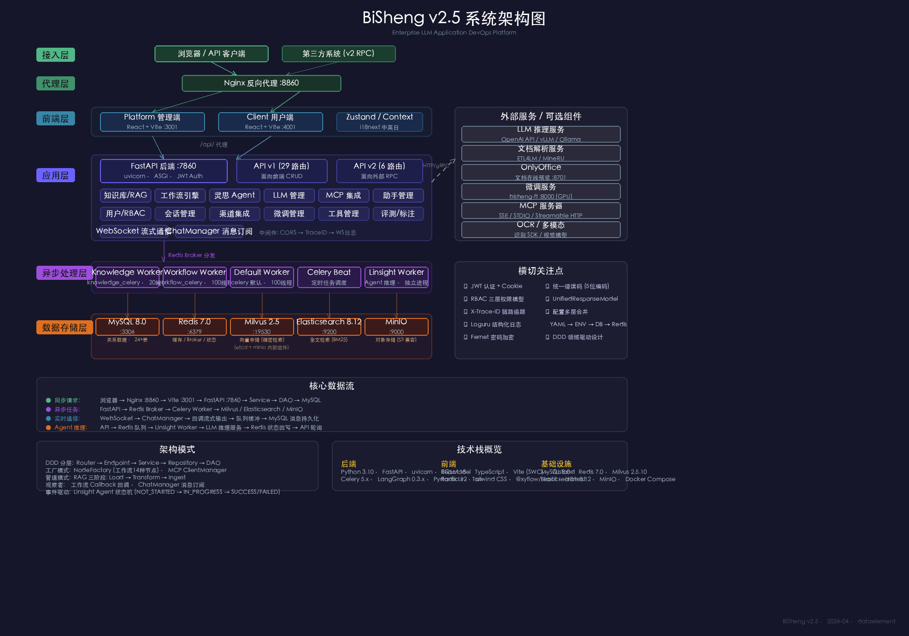
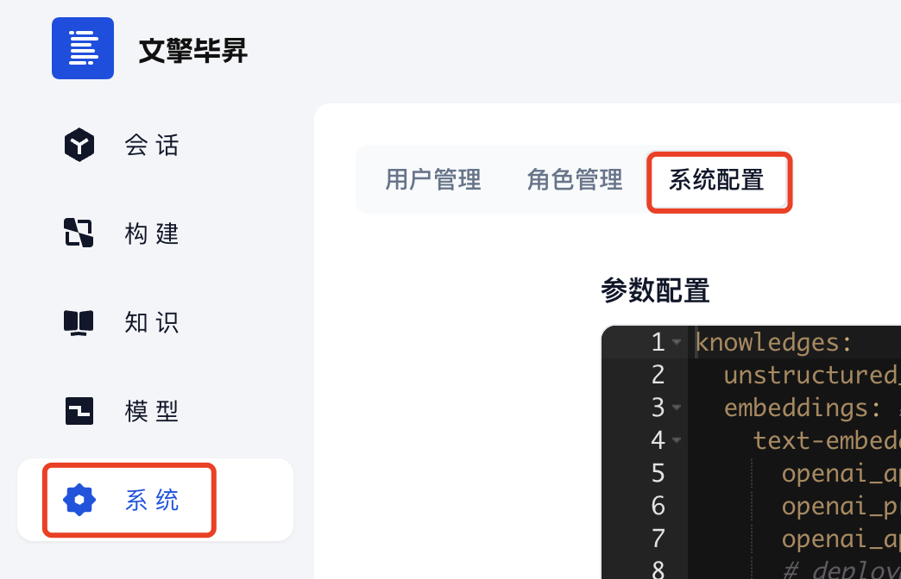

> 不建议在wsl环境或本地 Windows 虚拟机等不稳定的环境（不含云平台虚拟机）上部署BISHENG。

# 平台各组件关系



# 安装部署依赖

<table><colgroup><col width="175"><col width="645"></colgroup>
<thead>
<tr>
<th>CPU型号</th>
<th><ul>
<li>x86架构（Intel、AMD）</li>
<li>arm64架构</li>
</ul></th>
</tr>
</thead>
<tbody>
<tr>
<td>加速卡（GPU / NPU ...）型号</td>
<td>毕昇平台中需要使用GPU算力的部分包括：LLM、Embedding模型、文档解析模型、Rerank模型。<br />其中本地部署的LLM、Embedding、Rerank均使用第三方开源模型，这些模型可以在哪些加速卡上运行需要参考厂商的说明，应该大部分NVIDIA及国产加速卡都可正常运行。<br /><strong>文档解析模型是我们自研模型，该模型老版本（OCR SDK）支持GPU卡如下：</strong><ul>
<li>NVIDIA GPU：Ada Lovelace架构、Ampere架构、Turing架构、Volta架构</li>
<li>华为 Atlas 300I Pro、910b3</li>
<li>海光 DCU K100</li>
</ul><strong>该模型新版本（ETL4LM）支持GPU卡如下（正在验证更多卡的适配）：</strong><ul>
<li>NVIDIA GPU：Ada Lovelace架构、Ampere架构、Turing架构</li>
<li>华为910b3</li>
</ul></td>
</tr>
<tr>
<td>操作系统<br /></td>
<td><ul>
<li>CentOS/RedHat Enterprise Linux 的 7.x版本 或 8.x版本</li>
<li>银河麒麟高级服务器操作系统V10</li>
<li>Ubuntu Server</li>
</ul></td>
</tr>
<tr>
<td>Docker</td>
<td><ul>
<li>Docker 19.03.9+</li>
<li>Docker Compose 1.25.1+</li>
</ul>参考：<a href="https://docs.docker.com/engine/install/">Docker安装</a>、<a href="https://docs.docker.com/compose/install/">Docker Compose安装</a></td>
</tr>
<tr>
<td>客户端浏览器</td>
<td>毕昇平台内含有文件溯源展示、word在线编辑功能，需要高级浏览器提供底层能力支持，chrome 建议至少 v92+ 。建议使用最新版浏览器，以免功能无法正常使用。</td>
</tr>
</tbody>
</table>

默认需要安装的**毕昇核心组件**包括：bisheng-backend、bisheng-frontend、mysql、redis、elastichsearch、milvus（包括milvus依赖的minio、etcd）、onlyoffice。其他组件（bisheng-ft、ETL4LM）均为可选组件。

**仅部署核心服务最低**配置：**4虚拟核 16G**（推荐硬件配置：**18 虚拟核 48G**，详细各组件建议资源分配：[**附录一**](https://dataelem.feishu.cn/wiki/BSCcwKd4Yiot3IkOEC8cxGW7nPc#SABEdxo9KopzIAxoUs5ctWOsnSC)）

# Docker Compose部署

K8s部署配置参考见：[ 毕昇组件在K8S上部署的yaml配置参考](https://dataelem.feishu.cn/wiki/X6m4wvFxDiF0cBkrPcPct146nhe)

## 下载BISHENG代码

```bash
# 如果系统中有git命令，可以直接下载毕昇代码
git clone https://github.com/dataelement/bisheng.git
# 进入安装目录
cd bisheng/docker

# 如果系统没有没有git命令，可以下载毕昇代码zip包
wget https://github.com/dataelement/bisheng/archive/refs/heads/main.zip
# 解压并进入安装目录
unzip main.zip && cd bisheng-main/docker
```

## 启动BISHENG

> 若无法访问dockerhub，可以直接使用下方我们提供的**国内镜像源**配置文件。

```bash
# 进入bisheng/docker或bisheng-main/docker目录，执行
docker-compose up -d

##如果你的Docker Compose版本为V2，那你可以执行以下语句
docker compose up -d
```

如果需要修改 mysql 数据库密码（需要在首次部署前修改，mysql 服务启动后修改不会生效）或者调整某个服务的端口号，可以修改 docker-compose.yaml 文件：

```yaml
services:
  mysql:
    container_name: bisheng-mysql
    image: mysql:8.0
    
    ports:
      - "3306:3306"
    environment:
      MYSQL_ROOT_PASSWORD: "1234"  # 数据库密码，如果修改需要同步修改bisheng/congfig/config.yaml配置database_url的mysql连接密码
      MYSQL_DATABASE: bisheng
      TZ: Asia/Shanghai
    volumes:
      - ${DOCKER_VOLUME_DIRECTORY:-.}/mysql/conf/my.cnf:/etc/mysql/my.cnf
      - ${DOCKER_VOLUME_DIRECTORY:-.}/mysql/data:/var/lib/mysql
    healthcheck:
      test: ["CMD-SHELL", "exit | mysql -u root -p$$MYSQL_ROOT_PASSWORD"]
      start_period: 30s
      interval: 20s
      timeout: 10s
      retries: 4
    restart: on-failure

  redis:
    container_name: bisheng-redis
    image: redis:7.0.4
    ports:
      - "6379:6379"
    environment:
      TZ: Asia/Shanghai
    volumes:
      - ${DOCKER_VOLUME_DIRECTORY:-.}/data/redis:/data
      - ${DOCKER_VOLUME_DIRECTORY:-.}/redis/redis.conf:/etc/redis.conf
    command: redis-server /etc/redis.conf
    healthcheck:
      test: ["CMD-SHELL", 'redis-cli ping|grep -e "PONG\|NOAUTH"']
      interval: 10s
      timeout: 5s
      retries: 3
    restart: on-failure

  backend:
    container_name: bisheng-backend
    image: dataelement/bisheng-backend:v1.1.1
    ports:
      - "7860:7860"
    environment:
      TZ: Asia/Shanghai
      BS_MILVUS_CONNECTION_ARGS: '{"host":"milvus","port":"19530","user":"","password":"","secure":false}'
      BS_MILVUS_IS_PARTITION: 'true'
      BS_MILVUS_PARTITION_SUFFIX: '1'
      BS_ELASTICSEARCH_URL: 'http://elasticsearch:9200'
      BS_ELASTICSEARCH_SSL_VERIFY: '{}'  # 可根据自己部署的密码进行配置 '{"basic_auth": ("elastic", "elastic")}'
      BS_MINIO_SCHEMA: 'false'
      BS_MINIO_CERT_CHECK: 'false'
      BS_MINIO_ENDPOINT: 'minio:9000'
      BS_MINIO_SHAREPOIN: 'minio:9000'
      BS_MINIO_ACCESS_KEY: 'minioadmin'
      BS_MINIO_SECRET_KEY: 'minioadmin'
    volumes:
      - ${DOCKER_VOLUME_DIRECTORY:-.}/bisheng/config/config.yaml:/app/bisheng/config.yaml
      - ${DOCKER_VOLUME_DIRECTORY:-.}/bisheng/entrypoint.sh:/app/entrypoint.sh
      - ${DOCKER_VOLUME_DIRECTORY:-.}/data/bisheng:/app/data
    security_opt:
      - seccomp:unconfined
    command: sh entrypoint.sh # --workers 表示使用几个进程，提高并发度
    restart: on-failure
    healthcheck:
      test: ["CMD", "curl", "-f", "http://localhost:7860/health"]
      start_period: 30s
      interval: 90s
      timeout: 30s
      retries: 3
    depends_on:
      mysql:
        condition: service_healthy
      redis:
        condition: service_healthy
      office:
        condition: service_started

  frontend:
    container_name: bisheng-frontend
    image: dataelement/bisheng-frontend:v1.1.1
    ports:
      - "3001:3001"
    environment:
      TZ: Asia/Shanghai
    volumes:
      - ${DOCKER_VOLUME_DIRECTORY:-.}/nginx/nginx.conf:/etc/nginx/nginx.conf
      - ${DOCKER_VOLUME_DIRECTORY:-.}/nginx/conf.d:/etc/nginx/conf.d
    restart: on-failure
    depends_on:
      - backend

  elasticsearch:
    container_name: bisheng-es
    image: docker.io/bitnami/elasticsearch:8.12.0
    user: root
    ports:
      - "9200:9200"
      - "9300:9300"
    environment:
      TZ: Asia/Shanghai
    volumes:
      - ${DOCKER_VOLUME_DIRECTORY:-.}/data/es:/bitnami/elasticsearch/data
    restart: on-failure

  etcd:
    container_name: milvus-etcd
    image: quay.io/coreos/etcd:v3.5.5
    environment:
      ETCD_AUTO_COMPACTION_MODE: revision
      ETCD_AUTO_COMPACTION_RETENTION: "1000"
      ETCD_QUOTA_BACKEND_BYTES: "4294967296"
      ETCD_SNAPSHOT_COUNT: "50000"
      TZ: Asia/Shanghai
    volumes:
      - ${DOCKER_VOLUME_DIRECTORY:-.}/data/milvus-etcd:/etcd
    command: etcd -advertise-client-urls=http://127.0.0.1:2379 -listen-client-urls http://0.0.0.0:2379 --data-dir /etcd
    restart: on-failure
    healthcheck:
      test: ["CMD", "etcdctl", "endpoint", "health"]
      interval: 30s
      timeout: 20s
      retries: 3

  minio:
    container_name: milvus-minio
    image: minio/minio:RELEASE.2023-03-20T20-16-18Z
    environment:
      MINIO_ACCESS_KEY: minioadmin
      MINIO_SECRET_KEY: minioadmin
    ports:
      - "9100:9000"
      - "9101:9001"
    volumes:
      - /etc/localtime:/etc/localtime:ro
      - ${DOCKER_VOLUME_DIRECTORY:-.}/data/milvus-minio:/minio_data
    command: minio server /minio_data --console-address ":9001"
    restart: on-failure
    healthcheck:
      test: ["CMD", "curl", "-f", "http://localhost:9000/minio/health/live"]
      interval: 30s
      timeout: 20s
      retries: 3

  milvus:
    container_name: milvus-standalone
    image: milvusdb/milvus:v2.3.3
    command: ["milvus", "run", "standalone"]
    security_opt:
    - seccomp:unconfined
    environment:
      ETCD_ENDPOINTS: etcd:2379
      MINIO_ADDRESS: minio:9000
    volumes:
      - /etc/localtime:/etc/localtime:ro
      - ${DOCKER_VOLUME_DIRECTORY:-.}/data/milvus:/var/lib/milvus
    restart: on-failure
    healthcheck:
      test: ["CMD", "curl", "-f", "http://localhost:9091/healthz"]
      start_period: 90s
      interval: 30s
      timeout: 20s
      retries: 3
    ports:
      - "19530:19530"
      - "9091:9091"
    depends_on:
      - etcd
      - minio

```

### 如果不能访问dockerhub使用以下方法

#### 方案一、更换国内的镜像源配置文件

1. 下载以下文件

[docker-compose-cn.yml](files/私有化部署-docker-compose-cn.yml)

* 将文件内容覆盖 bisheng/docker/docker-compose.yml文件里的内容

* 执行以下命令启动服务

```shell
# 登陆到毕昇提供的私有镜像仓库
docker login cr.dataelem.com -u docker -p dataelem

# 启动服务
docker-compose up -d
```

#### 方案二、自行替换国内的镜像源

> 需要了解一些docker和docker-compose的知识，自行去修改文件里的镜像地址

> 默认会从docker hub上下载所需的镜像，如果网络访问docker hub存在困难，可以从毕昇提供的镜像仓库下载镜像，修改docker-compose.yml里的镜像地址

```bash
# 登陆到毕昇提供的私有镜像仓库
docker login cr.dataelem.com -u docker -p dataelem
# 从毕昇私有镜像仓库下载所需的镜像，例如：
docker pull cr.dataelem.com/dataelement/bisheng-backend:latest
docker pull cr.dataelem.com/dataelement/bisheng-frontend:latest
docker pull cr.dataelem.com/mysql:8.0
docker pull cr.dataelem.com/redis:7.0.4
docker pull cr.dataelem.com/onlyoffice/documentserver:7.1.1
docker pull cr.dataelem.com/bitnami/elasticsearch:8.12.0
docker pull cr.dataelem.com/quay.io/coreos/etcd:v3.5.5
docker pull cr.dataelem.com/minio/minio:RELEASE.2023-03-20T20-16-18Z
docker pull cr.dataelem.com/milvusdb/milvus:v2.5.10
#从私有仓库下载镜像后，由于镜像名称中带有cr.dataelem.com字段，因此需要将镜像重新命名以匹配docker-compose.yml中使用的镜像名称，或者修改docker-compose.yml中使用的镜像名字匹配下载的镜像名字
```

下载和启动镜像需要一段时间，**执行`docker-compose ps`确保所有服务为healthy状态。**

> 如果有服务处于unhealthy状态，先尝试重启容器，如果容器依然无法变为healthy状态，则需要查看容器的日志。

## 访问毕昇

在浏览器中访问 `http://IP:3001` ，出现登录页，进行注册。

默认第一个注册的用户会成为系统admin。


> 若内部有网络访问限制，正常使用BISHENG需要对外暴露（且可被浏览器访问）的必要端口如下：
>
> * 3001（BISHENG前端页面）
>
> * 8701（Onlyoffice，用来使用模板报告生成功能）
>
> * 9000（minio，展示知识库中的源文件）


完成以上操作后便可以使用毕昇绝大部分功能，希望实现**其他高阶能力**，可进行[ 毕昇可选组件部署](https://dataelem.feishu.cn/wiki/Ic7Gw2GyMiAZzqkVHfWcc78Znxg)

若需要使用报告生成功能，请在下一小节“自定义系统配置”中的office\_url参数中填写onlyoffice服务的地址。


品牌信息修改：[ Logo与产品名修改方法指南](https://dataelem.feishu.cn/wiki/Sp1EwVPDAivCPikSsz8cRXwmnId)

## 自定义系统配置

> &#x20;通过系统配置，您可以控制前台是否展示点击 <span style="color: inherit; background-color: rgba(147,90,246,0.55)">“系统” -&gt; “系统配置”</span> （如下图所示）



```yaml
knowledges:  # 知识库相关配置
  etl4lm:
      # url为空表示使用本地开源解析能力
      # 文档解析模型服务配置，包括OCR、版式分析、表格识别、公式识别等
      url: ""  # http://192.168.106.12:8180/v1/etl4llm/predict
      timeout: 60
      # OCR SDK服务地址，默认为空则使用ETL4LM自带的轻量OCR模型（速度快，对于困难场景效果一般），若填写OCR SDK服务地址则使用高精度的OCR模型，地址默认为，IP：8502。
      ocr_sdk_url: ""

llm_request:
# 控制技能 LLM 组件模型访问的超时配置, 以下是默认值
  request_timeout: 600
  max_retries: 1

workflow:
  # workflow 节点运行最大步数
  max_steps: 50
  # 等待用户输入的超时时间，单位分钟
  timeout: 5


default_operator:
# 使用免登录链接的方式需要配置，因为免登录链接相当于不知道用户信息，我们系统会自动把这些行为记录到某个用户头上，这里用来配置该用户的id
  user: 1
  enable_guest_access: false # 是否需要登录才能使用，默认为false，代表可以通过免登录链接的方式使用

# 密码安全相关配置
password_conf:
  # 密码有效期天数，大于0时策略生效。超过X天后提示密码过期, 登录提示重新修改密码。
  password_valid_period: 200
  # 登录错误时间窗口,单位分钟。在错误时间窗口内超过最大错误次数会封禁用户，password_valid_period和login_error_time_window都大于0才生效
  login_error_time_window: 5
  # 最大错误次数，超过后会封禁用户，大于0时生效
  max_error_times: 0

system_login_method:
    # 是否允许多点登录
    allow_multi_login: true
    # sso系统登录配置（毕昇商业扩展套件功能，开源版无需配置）
    SSO_OAuth: false # 是否开启sso登录
    admin_username: admin # 从 SSO/LDAP 注册的管理员用户名
    
# 登陆页面是否需要输入验证码，可设置为True或False
use_captcha: True

# 会话窗口底部提示文案
dialog_tips:
  "内容由AI生成，仅供参考！"

env:
  # 聊天窗口快捷搜索功能使用的搜索引擎，默认为百度，可以配置为内部文档搜索
  # dialog_quick_search: http://www.baidu.com/s?wd=
  # 当用户的环境前面的网关，不能在同一个端口上既有http又有socket时，需要这个配置，将两个请求区分开，默认可以不用
  # websocket_url: 192.168.106.120:3003
  office_url: http://IP:8701 # onlyoffice 组件地址，需要浏览器能直接访问
  # 是否展示前端界面上的github和帮助链接
  show_github_and_help: true
  # 是否允许注册账号。前端是否显示注册入口
  enable_registration: true
```

bisheng-backend基础配置的文件路径：bisheng/docker/bisheng/config/config.yaml

## 密码加密实现

config.yaml中mysql和redis的密码加密规则如下

```python
1. 需要系统中有python3环境
2. 需要在python3中安装cryptography模块，可执行：pip3 install cryptography -i https://pypi.tuna.tsinghua.edu.cn/simple
3. 将以下python代码贴入一个文件，例如名为passwd.py的文件，将password_original后的1234修改为想要加密的密码：
from cryptography.fernet import Fernet
secret_key = 'TI31VYJ-ldAq-FXo5QNPKV_lqGTFfp-MIdbK2Hm5F1E='
def encrypt_token(token: str):
    return Fernet(secret_key).encrypt(token.encode()).decode()
password_original = "1234"
print(encrypt_token(password_original))
4. 执行python3 passwd.py命令即可显示加密后的密码
```

# 本地编译部署

## 本地后端镜像

Bisheng-backend 是基于Python FastAPI 框架编写的服务端程序，因此如果我们需要本地运行或者编译，依赖于 Python 的环境。

1. 核心工具

   1. Python 环境，推荐使用anaconda进行环境管理

   2. Poetry 进行依赖包和编译管理

2. 编译镜像过程

   1. 目录结构

```bash
# src 目录下 目录结构如下。
    ├── backend
    │   ├── Dockerfile
    │   ├── README.md
    │   ├── bisheng
    │   ├── poetry.lock
    │   └── pyproject.toml
```

* **pyproject.toml** 是poetry管理Python依赖的配置文件，新增依赖可以在此文件里增加

* **poetry.lock&#x20;**&#x662F;配合pyproject.toml，通过poetry lock生成的固定依赖版本的文件，如果lock文件不改变，保证每次编译的依赖不改变

* **bisheng&#x20;**&#x76EE;录是源码目录

* **Dockerfile&#x20;**&#x662F;docker *编译*配置

  2. 编译

  ```bash
  docker build -t dataelement/bisheng-backend:latest ./
  ```

## 本地前端镜像

Bisheng-frontend 正式编译是静态文件基于 Nginx 进行加载。因此正式环境编译依赖 Nginx。

1. 目录结构

```bash
frontend
    platform
        ├── Dockerfile
        ├── README.md
        ├── dev.Dockerfile
        ├── index.html
        ├── nginx.conf
        ├── package-lock.json
        ├── package.json
        ├── postcss.config.js
        ├── prettier.config.js
        ├── public
        ├── set_proxy.sh
        ├── src
        ├── tailwind.config.js
        ├── tsconfig.json
        ├── vite.config.ts
        └── yarn.lock
```

核心文件：

* **Dockerfile&#x20;**&#x64;ocker编译文件

* **nginx.conf** nginx 监听配置/

- 编译

```bash
docker build -t dataelement/bisheng-frontend:latest ./
```

# 附录

## 附录一：各组件建议资源分配

<span style="color: inherit; background-color: rgba(255,246,122,0.8)">以下是企业级测试或</span> <span style="color: inherit; background-color: rgba(255,246,122,0.8)">高并发</span> <span style="color: inherit; background-color: rgba(255,246,122,0.8)">生产环境</span> <span style="color: inherit; background-color: rgba(255,246,122,0.8)">下的</span> <span style="color: inherit; background-color: rgba(255,246,122,0.8)">单机配置建议</span> <span style="color: inherit; background-color: rgba(255,246,122,0.8)">，</span> <span style="color: inherit; background-color: rgba(255,246,122,0.8)">开发者试用可以</span> <span style="color: inherit; background-color: rgba(255,246,122,0.8)">根据具体使用场景、并发情况</span> <span style="color: inherit; background-color: rgba(255,246,122,0.8)">适当降低要求。</span>

<table><colgroup><col width="112"><col width="172"><col width="264"></colgroup>
<thead>
<tr>
<th>容器</th>
<th>镜像</th>
<th>建议分配资源</th>
</tr>
</thead>
<tbody>
<tr>
<td>bisheng-frontend</td>
<td>dataelement/bisheng-frontend</td>
<td>1~2 cores<br />2~8G memory</td>
</tr>
<tr>
<td>bisheng-backend<br /></td>
<td>dataelement/bisheng-backend<br /></td>
<td>1~2 cores<br />2~8G memory</td>
</tr>
<tr>
<td>bisheng-mysql<br /></td>
<td>mysql:8.0<br /></td>
<td>4 cores<br />4G memory<br />100G Disk</td>
</tr>
<tr>
<td>bisheng-redis<br /></td>
<td>redis:7.0.4</td>
<td>2 cores<br />2G memory</td>
</tr>
<tr>
<td>bisheng-etcd<br /></td>
<td>quay.io/coreos/etcd:v3.5.5</td>
<td>2 cores<br />2G memory</td>
</tr>
<tr>
<td>bisheng-minio<br /></td>
<td>minio/minio:RELEASE.2023-03-20T20-16-18Z</td>
<td>4 cores<br />16G memory<br />1T+ Disk<blockquote>
<p>跟具体存储文档量有关，测试环境没有数据可以降低</p>
</blockquote></td>
</tr>
<tr>
<td>bisheng-milvus<br /></td>
<td>milvusdb/milvus:v2.5.10<br /></td>
<td>4 cores<br />16G memory<br />500G+ Disk（对于磁盘的读写性能要求较高，有条件的话，建议SSD）<blockquote>
<p>跟具体存储文档量有关，测试环境没有数据可以降低</p>
</blockquote></td>
</tr>
<tr>
<td>bisheng-elasticsearch<br /></td>
<td>docker.elastic.co/elasticsearch/elasticsearch:8.9.2</td>
<td>4 cores<br />16G memory<br />500G+ Disk（对于磁盘的读写性能要求较高，有条件的话，建议SSD）<blockquote>
<p>跟具体存储文档量有关，测试环境没有数据可以降低</p>
</blockquote></td>
</tr>
<tr>
<td>ETL4LM</td>
<td></td>
<td>1 cores（建议10 cores以上）<br />10G（建议20G以上）<br />6G+ GPU Memory（单文件单并发情况下最小6G，建议25G以上）</td>
</tr>
</tbody>
</table>

## 附录二：推荐机器配置

**<span style="color: inherit; background-color: rgba(183,237,177,0.8)">生产级</span>**&#x63A8;荐配置，有冗余，实际跑起来并不需要这么高，可酌情降低配置，具体各模块消耗参考 附录一 。

**文档解析模型是我们自研模型，该模型老版本（OCR SDK）支持GPU卡如下：**

* NVIDIA GPU：Ada Lovelace架构、Ampere架构、Turing架构、Volta架构

* 华为 Atlas 300I Pro、910b3

* 海光 DCU K100

**该模型新版本（ETL4LM）支持GPU卡如下（正在验证更多卡的适配）：**

* NVIDIA GPU：Ada Lovelace架构、Ampere架构、Turing架构

* 华为910b3

<table><colgroup><col width="125"><col width="658"></colgroup>
<thead>
<tr>
<th>非国产化配置</th>
<th>机箱：4U GPU服务器<br />CPU：2颗英特尔志强6148金牌处理器，每颗20物理核，主频2.4GHz<br />内存：512G DDR4 ECC 内存<br />硬盘：6 * 960G SSD 固态硬盘（系统盘2*960G RAID1，数据盘4*960G RAID5）<br />计算加速卡：4 * 英伟达Tesla A40 48G PCIe GPU 加速卡（其他推荐：H100、A100、A10、3090、4090）<br />电源：2*2000W 冗余热插拔电源</th>
</tr>
</thead>
<tbody>
<tr>
<td>国产化配置-海光</td>
<td><strong>2卡机器</strong><br />CPU：Hygon 7390  *2<br />内存：32GB 3200MHz DDR4  RDIMM *8<br />硬盘：480GB SATA R SSD *2  960GB SATA M SSD *5<br />RAID卡：4GB 8口 RAID卡，带超级电容<br />计算加速卡：DCU K100-ai双宽GPU卡 *2<br />网卡：双口25Gb光口网卡（含模块） *2<br />电源：2000W电源模块 *2<br /><strong>8卡机器</strong><br />CPU：Hygon 7390  *2<br />内存：32GB 3200MHz DDR4  RDIMM *16<br />硬盘：960G 2.5 SATA 6Gb R SSD *2  3.84TB NVME U.2 SSD *2<br />RAID卡：4G 8口RAID卡，带电池<br />计算加速卡：DCU K100-ai双宽GPU卡 *8<br />网卡：双口25G 光纤网卡（含自适应模块） *1  双口100G 光纤网卡 *2<br />电源：2000W电源模块 *4</td>
</tr>
<tr>
<td>国产化配置-华为</td>
<td><strong>2卡300I DUO（可支持6B~30B及以下的大模型推理）</strong><br />形态：机架式服务器，2U<br />CPU：2*Kunpeng 920 CPU(48Core@2.6GHz)<br />AI算力：2张Atlas 300I Duo 96G计算卡，单张卡提供280TOPS@INT8，总计560TOPS@INT8<br />内存：256GB DDR4 <br />硬盘：4*1.92 TB, SATA SSD<br />RAID卡：1个2G缓存，支持RAID 0/1/5/6<br />网络：4个千兆电口，4个万兆光口，配2个10G光纤多模模块<br />电源：2*电源模块/服务器白金900W<hr><strong>8卡910（可支持30B及以上，包括72B、110B的大模型推理）</strong><br />形态：机架服务器,4U<br />CPU：4*Kunpeng 920 CPU(48Core@2.6GHz)<br />AI算力：8*Ascend 910 HCCS，单卡算力560TOPS@INT8，总计4.4PTOPS@INT8<br />内存：256GB DDR4 <br />硬盘：2*480GB SSD硬盘,2*3200GB NVME SSD硬盘；<br />RAID卡：1张独立RAID卡,支持RAID 0/1/10，带超级电容掉电保护;<br />网络：4口10GE/25GE光口网卡;2口200GE光口网卡，含配套的光模块配套光纤线缆；<br />电源：4个2600W交流电源模块，支持2+2冗余</td>
</tr>
</tbody>
</table>

