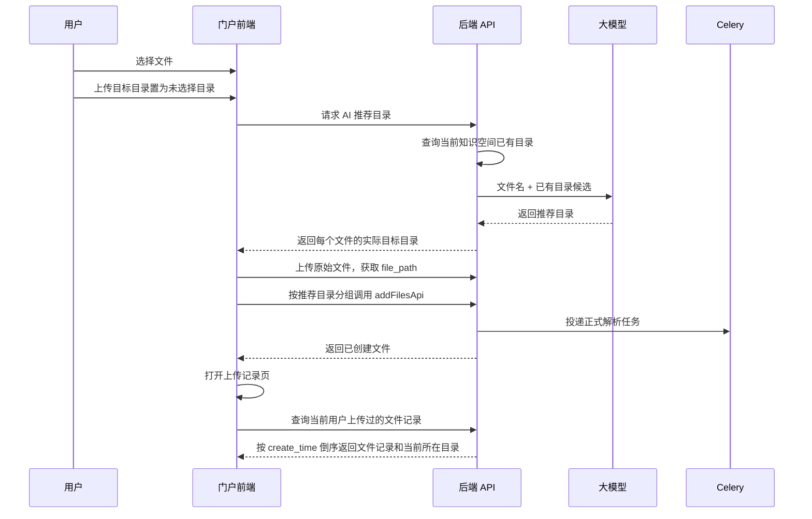

# 门户我的知识上传记录与 AI 推荐目录最小实现设计

## 0. 文档信息

| 项目 | 内容 |
| --- | --- |
| 日期 | 2026-06-02 |
| 范围 | 门户网站“我的知识”文件上传链路 |
| 状态 | 简化版实现设计 |
| 核心结论 | 不做上传批次、不做解析前确认、不新增复杂推荐结果表；上传目标目录允许置为“未选择目录（AI推荐）”，未选择时先由 AI 根据文件名和当前知识空间已有目录推荐目录，并直接把推荐目录作为实际上传目录；上传记录页查询当前用户上传过的文件记录，按时间倒序展示当前所在目录，并支持点击修改文件所在目录 |

## 1. 简化后的目标

本版只做一个最小可交付闭环：

- 文件上传弹窗中，上传目标目录可以置为“未选择目录（AI推荐）”。
- 如果用户明确选择了目录，文件按用户选择目录上传。
- 如果用户没有选择目录，系统先调用 AI 推荐目录接口。
- AI 推荐目录只从当前知识空间已有目录中选择。
- AI 推荐成功后，推荐目录直接作为实际上传目录。
- AI 推荐失败或没有合适目录时，降级上传到根目录。
- 文件仍按现有逻辑正式上传入库，并进入现有解析队列。
- 上传后提供“上传记录”页面，展示当前用户上传过的文件记录，按上传时间倒序。
- 上传记录页展示文件当前所在目录，解析完成后仍可看到最终上传到哪个目录。
- 上传记录页支持点击修改文件所在目录。
- 上传记录页复用或参考 Bisheng 现有知识空间文件列表页。

## 2. 不做什么

本版明确不做以下内容：

- 不新增上传批次表。
- 不新增批次文件表。
- 不做“上传分析批次 -> AI 推荐 -> 用户确认 -> 正式入库”的两阶段流程。
- 不在正式入库前解析文件正文。
- 不根据全文内容推荐目录。
- 不自动创建 AI 推荐的新目录。
- 不把 AI 推荐结果长期落成独立业务表。
- 不把文件类型、标签、业务域拆成新的文件级推荐字段。
- 不保留已物理删除文件的上传历史。

原因：

- 当前代码已经支持上传后立即创建 `KnowledgeFile` 并进入解析队列。
- 当前文件状态、文件编码、标签、摘要已经能从正式文件表读取。
- 用户现在需要的是最简单、最少改动、可快速落地的上传记录和目录推荐能力。

## 3. 当前实现可以复用的能力

当前门户上传链路已经具备以下能力：

- 前端 `PortalUploadDialog` 可选择文件、文件夹、文件分类、上传目录。
- 前端 `usePortalUploadDialog.handleUploadNext` 已经调用：
  - `uploadFileToServerApi`
  - `addFilesApi`
- 后端 `KnowledgeSpaceService.add_file` 会创建正式 `KnowledgeFile`。
- 后端解析任务会更新 `KnowledgeFile.status`。
- 后端解析成功后会写入：
  - `abstract`
  - `file_encoding`
  - `tags`
  - `simhash`
- 普通 Bisheng 知识空间文件列表页已经有可复用表格和状态展示能力。

建议重点参考或复用：

| 文件 | 可复用点 |
| --- | --- |
| `src/frontend/client/src/pages/knowledge/SpaceDetail/FileTable.tsx` | 表格布局、列宽拖拽、状态标签、标签展示、文件编码展示、行操作 |
| `src/frontend/client/src/pages/knowledge/SpaceDetail/index.tsx` | 文件列表容器、搜索、状态筛选、排序、批量选择交互 |
| `src/frontend/client/src/pages/knowledge/hooks/useFileManager.ts` | 文件查询、筛选、排序、刷新、解析中轮询逻辑 |
| `src/frontend/client/src/pages/knowledge/portal/components/FileTree.tsx` | 门户侧文件状态文案与图标逻辑 |

因此最小实现不需要重写上传主链路，也不需要从零做上传记录表格。

## 4. 最小业务流程



如果用户在上传弹窗里明确选择了目录，则跳过 AI 推荐目录步骤，直接使用用户选择目录上传。

## 5. 上传目录规则

### 5.1 目录选择状态

必须区分三个状态：

| 状态 | 含义 | 上传行为 |
| --- | --- | --- |
| 未选择目录（AI推荐） | 用户没有指定实际目录 | 上传前调用 AI 推荐目录，推荐结果作为实际 `parent_id` |
| 根目录 | 用户明确选择根目录 | 不调用 AI，`parent_id = null` |
| 具体目录 | 用户明确选择某个已有目录 | 不调用 AI，`parent_id = folder_id` |

不能继续用 `uploadFolderId = null` 同时表示“根目录”和“未选择目录”。建议前端改成：

```ts
type UploadFolderSelection =
  | { mode: "ai" }
  | { mode: "manual"; folderId: string | null; folderName: string };
```

其中：

- `{ mode: "ai" }` 表示“未选择目录（AI推荐）”。
- `{ mode: "manual", folderId: null }` 表示用户明确选择“根目录”。
- `{ mode: "manual", folderId: "123" }` 表示用户明确选择具体目录。

### 5.2 用户选择了目录

按现有逻辑处理：

- `parent_id` 使用用户选择的目录。
- 如果用户选择根目录，`parent_id = null`。
- 如果用户选择具体目录，`parent_id = folder_id`。
- 文件直接上传到该目录。
- 上传记录中“当前所在目录”展示该目录。
- 不需要调用 AI 推荐目录接口。

### 5.3 用户未选择目录

未选择目录时走 AI 推荐目录：

1. 前端拿到待上传文件名。
2. 调用 `upload-folder-recommendations` 接口。
3. 后端查询当前知识空间已有目录并放入 prompt。
4. 大模型返回每个文件推荐的已有目录。
5. 前端把推荐目录直接作为实际上传目录。
6. 前端按推荐目录分组调用 `addFilesApi`。

上传结果：

- 推荐到具体目录：文件实际上传到该目录。
- 推荐为根目录：文件实际上传到根目录。
- 推荐失败：降级上传到根目录。
- 上传记录页展示的是最终实际所在目录，不只是推荐建议。

### 5.4 多文件上传分组

现有 `addFilesApi` 一次请求只能传一个 `parent_id`。如果多个文件被推荐到不同目录，前端需要按目录分组：

```ts
const groups = groupBy(uploadedFiles, file => recommendationMap[file.localId]?.folderId ?? null);
for (const [folderId, files] of groups) {
  await addFilesApi(spaceId, {
    file_path: files.map(file => file.filePath),
    parent_id: folderId ? Number(folderId) : null,
    file_category_code: selectedFileCategory || undefined,
  });
}
```

### 5.5 文件夹上传

文件夹上传首版也保持简单：

- AI 推荐的是本地文件夹要创建在哪个父目录下。
- 推荐输入使用本地文件夹名称和根层文件名。
- 推荐成功后，在推荐父目录下调用 `createFolderApi` 创建本地文件夹。
- 再将根层文件上传到新创建的文件夹。
- 推荐失败时，在根目录下创建本地文件夹。

## 6. AI 推荐目录接口

### 6.1 接口定位

AI 推荐目录接口用于“上传注册前决策实际目录”，不是上传记录页里的纯展示接口。

建议接口：

`POST /api/v1/knowledge/space/{space_id}/upload-folder-recommendations`

请求：

```json
{
  "files": [
    {
      "client_file_id": "local-1",
      "file_name": "能源管理标准.pdf"
    },
    {
      "client_file_id": "local-2",
      "file_name": "设备点检记录.xlsx"
    }
  ]
}
```

响应：

```json
{
  "items": [
    {
      "client_file_id": "local-1",
      "file_name": "能源管理标准.pdf",
      "recommended_folder_id": 37,
      "recommended_folder_name": "能源管理",
      "recommended_folder_path": "技术文档/能源管理",
      "reason": "文件名包含能源管理，匹配已有目录能源管理"
    },
    {
      "client_file_id": "local-2",
      "file_name": "设备点检记录.xlsx",
      "recommended_folder_id": 41,
      "recommended_folder_name": "设备管理",
      "recommended_folder_path": "技术文档/设备管理",
      "reason": "文件名包含设备点检，匹配已有目录设备管理"
    }
  ]
}
```

根目录使用：

```json
{
  "client_file_id": "local-3",
  "recommended_folder_id": null,
  "recommended_folder_name": "根目录",
  "recommended_folder_path": "根目录",
  "reason": "未匹配到已有目录，降级到根目录"
}
```

### 6.2 后端处理逻辑

服务方法建议放在 `KnowledgeSpaceService`：

```python
async def recommend_upload_folders(
    self,
    space_id: int,
    files: list[UploadFolderRecommendFileReq],
) -> UploadFolderRecommendationResp:
    ...
```

处理步骤：

1. 校验当前用户对 `space_id` 有上传权限。
2. 查询当前知识空间下所有已有目录。
3. 将目录整理为扁平候选列表：
   - `folder_id`
   - `folder_name`
   - `folder_path`
4. 将文件名和目录候选放入 prompt。
5. 调用知识库或工作台配置中的大模型。
6. 校验大模型输出：
   - `client_file_id` 必须来自请求。
   - `recommended_folder_id` 必须来自目录候选或为 `null`。
   - 不合法时降级为根目录。
7. 返回推荐结果。

不需要写库。

### 6.3 Prompt 草案

```text
你是企业知识空间文件目录推荐助手。

任务：
根据上传文件名，从当前知识空间已有目录中为每个文件推荐一个最合适的目录。

限制：
1. 只能从“已有目录候选”中选择。
2. 不能创造新目录。
3. 如果没有合适目录，推荐根目录，folder_id 使用 null。
4. 每个文件必须返回一个推荐结果。
5. 只输出 JSON，不输出解释性文字。

已有目录候选：
{folder_candidates_json}

待推荐文件：
{files_json}

输出格式：
{
  "items": [
    {
      "client_file_id": "local-1",
      "recommended_folder_id": 37,
      "reason": "简短原因"
    }
  ]
}
```

### 6.4 降级策略

以下情况降级到根目录：

- 当前知识空间没有任何目录。
- 大模型未配置。
- 大模型调用失败。
- 大模型返回无法解析。
- 大模型返回了不存在的目录 ID。
- 大模型没有覆盖某个文件。

降级不能阻塞上传。只要文件本身上传和注册正常，就继续上传到根目录。

## 7. 上传记录页

### 7.1 页面定位

新增或改造为一个简单页面：

- 名称：上传记录
- 入口：门户“我的知识”文件上传按钮旁边增加“上传记录”
- 作用：查看当前用户上传过的文件记录

页面不按批次展示。

### 7.2 页面复用方案

推荐优先复用或参考 Bisheng 普通知识空间文件列表：

- 表格结构参考 `FileTable`。
- 状态列参考 `StatusBadge`。
- 标签展示复用 `TagGroup`。
- 文件编码展示复用现有编码列。
- 搜索、状态筛选、排序交互参考 `KnowledgeSpaceContent`。
- 数据加载与解析中轮询参考 `useFileManager`。

上传记录页可以先做成门户内抽屉：

- `PortalUploadedFilesDrawer`
- 右侧抽屉或全屏弹层都可以。
- 不建议在第一版做独立复杂路由。

### 7.3 查询范围

查询当前登录用户的上传记录。这里的“上传记录”不是当前用户仍有查看权限的文件列表，而是用户曾经执行过上传并且当前文件记录仍存在的记录：

- `KnowledgeFile.user_id = login_user.user_id`
- `KnowledgeFile.file_type = FILE`
- 默认只查 `file_source = SPACE_UPLOAD`
- 按 `create_time desc` 排序

权限口径：

- 不按当前知识空间查看权限过滤上传记录。
- 不传 `space_id` 时，查询当前用户在所有知识空间下的上传记录。
- 传 `space_id` 时，只作为上传记录筛选条件。
- 文件预览、下载、编辑、删除、修改所在目录等后续文件操作仍按现有文件权限校验，不因为出现在上传记录中就自动放开。

历史保留口径：

- 第一版基于 `KnowledgeFile` 查询，因此只覆盖当前仍存在的文件记录。
- 如果文件或知识空间被物理删除，记录也会随之不可查。
- 如果后续要覆盖“文件已删除后仍保留上传历史”，需要单独新增上传日志表或复用审计日志，不放在第一版。

建议支持可选筛选：

- `space_id`
- `status`
- `keyword`
- `page`
- `page_size`

### 7.4 展示字段

上传记录页展示以下字段：

| 字段 | 来源 |
| --- | --- |
| 文件名 | `KnowledgeFile.file_name` |
| 所属知识空间 | `KnowledgeFile.knowledge_id` 关联空间名称 |
| 当前所在目录 | `KnowledgeFile.file_level_path` 解析后的目录名 |
| 文件状态 | `KnowledgeFile.status` |
| 文件类型 | 优先从 `split_rule.file_category_code` 或 `file_encoding` 解析 |
| AI 标签 | 现有 `tags` |
| AI 业务域 | 从 `file_encoding` 第三段解析 |
| 上传时间 | `KnowledgeFile.create_time` |
| 更新时间 | `KnowledgeFile.update_time` |
| 操作 | 修改所在目录、预览、下载等 |

说明：

- 不需要单独展示“AI 推荐目录”作为长期字段。
- 未选择目录上传时，AI 推荐目录已经直接变成实际上传目录。
- 用户在上传记录页看到的“当前所在目录”就是最终文件所在目录。

### 7.5 状态展示

直接复用现有文件状态：

| 状态 | 展示 |
| --- | --- |
| `WAITING` | 排队中 |
| `PROCESSING` | 解析中 |
| `SUCCESS` | 解析完成 |
| `FAILED` | 解析失败 |
| `TIMEOUT` | 解析超时 |
| `VIOLATION` | 内容违规 |
| `REBUILDING` | 重建中 |

页面有解析中、排队中、重建中的文件时，按 5 秒轮询刷新。解析完成后，上传记录页仍展示文件当前所在目录。

## 8. 当前用户上传记录查询接口

### 8.1 新增接口

建议新增：

`GET /api/v1/knowledge/space/my-uploaded-files`

接口名可以沿用 `my-uploaded-files`，但业务语义是“当前用户上传记录查询”，不是“当前用户可查看文件查询”。

请求参数：

| 参数 | 类型 | 必填 | 说明 |
| --- | --- | --- | --- |
| `page` | int | 否 | 默认 1 |
| `page_size` | int | 否 | 默认 20，最大 100 |
| `space_id` | int | 否 | 按上传目标知识空间筛选 |
| `status` | int | 否 | 文件状态 |
| `keyword` | string | 否 | 文件名关键词 |

响应：

```json
{
  "data": [
    {
      "id": 501,
      "knowledge_id": 10,
      "knowledge_name": "设备知识库",
      "file_name": "能源管理标准.pdf",
      "file_level_path": "/37",
      "folder_path_name": "技术文档/能源管理",
      "status": 2,
      "file_encoding": "SGGF-STD-EM-20260600000001",
      "tags": [
        { "id": 1, "name": "能源" }
      ],
      "abstract": "文档摘要",
      "create_time": "2026-06-02 10:00:00",
      "update_time": "2026-06-02 10:03:00"
    }
  ],
  "total": 1
}
```

### 8.2 后端服务逻辑

在 `KnowledgeSpaceService` 中增加方法：

```python
async def list_my_uploaded_files(
    self,
    page: int = 1,
    page_size: int = 20,
    space_id: Optional[int] = None,
    status: Optional[int] = None,
    keyword: Optional[str] = None,
) -> PageData[ShougangPortalUploadedFileResp]:
    ...
```

查询条件：

- 上传人：`KnowledgeFile.user_id == login_user.user_id`
- 文件类型：`KnowledgeFile.file_type == FileType.FILE.value`
- 来源：`KnowledgeFile.file_source == FileSource.SPACE_UPLOAD.value`
- 如果传 `space_id`，追加 `KnowledgeFile.knowledge_id == space_id`
- 如果传 `status`，追加 `KnowledgeFile.status == status`
- 如果传 `keyword`，追加文件名模糊查询
- 排序：`KnowledgeFile.create_time.desc()`

注意：

- 不新增表。
- 不新增 Celery 任务。
- 不改变 `add_file` 主流程。
- 不按当前知识空间读取权限过滤上传记录。
- 返回上传记录不等于授予文件访问权限，预览、下载、编辑、删除、修改所在目录等操作继续走现有权限校验。

## 9. 修改文件所在目录

### 9.1 新增接口

上传记录页支持点击修改文件所在目录。

建议新增：

`POST /api/v1/knowledge/space/{space_id}/files/{file_id}/move-folder`

请求：

```json
{
  "target_folder_id": 37
}
```

移动到根目录：

```json
{
  "target_folder_id": null
}
```

响应返回更新后的文件记录：

```json
{
  "id": 501,
  "knowledge_id": 10,
  "file_name": "能源管理标准.pdf",
  "file_level_path": "/37",
  "folder_path_name": "技术文档/能源管理",
  "update_time": "2026-06-02 11:00:00"
}
```

### 9.2 后端移动逻辑

在 `KnowledgeSpaceService` 中增加方法：

```python
async def move_file_folder(
    self,
    space_id: int,
    file_id: int,
    target_folder_id: Optional[int],
) -> KnowledgeSpaceFileResponse:
    ...
```

处理步骤：

1. 查询文件，校验文件存在且属于 `space_id`。
2. 只允许移动文件，不在第一版移动文件夹。
3. 校验当前用户对文件有编辑或管理权限。
4. 如果 `target_folder_id` 不为空：
   - 校验目标目录存在且属于同一知识空间。
   - 校验当前用户对目标目录有上传权限。
   - 计算新的 `file_level_path` 和 `level`。
5. 如果 `target_folder_id` 为空：
   - 校验当前用户对知识空间根目录有上传权限。
   - `file_level_path = ""`
   - `level = 0`
6. 校验目标目录下不存在同名文件。
7. 更新 `KnowledgeFile.file_level_path`、`level`、`update_time`。
8. 如果该文件关联了 `KnowledgeDocument`，同步更新文档的 `file_level_path`。
9. 更新原目录和目标目录的更新时间。
10. 返回更新后的文件记录。

权限说明：

- 上传记录查询不按知识空间权限过滤。
- 修改文件所在目录是写操作，必须按现有权限体系校验。
- 如果用户已经没有该文件或目标目录的操作权限，前端应禁用或隐藏“修改所在目录”按钮，后端也必须拒绝。

## 10. 前端最小改造

### 10.1 上传弹窗

修改 `PortalUploadDialog`：

- “上传目标目录”文案改为“上传目标目录”。
- 目录选择器顶部增加“未选择目录（AI推荐）”选项。
- 目录选择器保留“根目录”选项。
- 当前目录树选择保留。
- 提示文案改为“未选择目录时，系统会根据当前知识空间已有目录推荐上传目录，并直接上传到推荐目录”。
- 不再强调“下一步会进入待入库确认”。

修改 `usePortalUploadDialog`：

- 不再使用 `uploadFolderId = null` 表达未选择目录。
- 新增 `uploadFolderSelection` 状态区分 AI 推荐、根目录、具体目录。
- 如果 `uploadFolderSelection.mode === "manual"`：
  - 按现有逻辑上传。
  - `folderId = null` 表示根目录。
  - `folderId = "123"` 表示具体目录。
- 如果 `uploadFolderSelection.mode === "ai"`：
  - 先调用 `upload-folder-recommendations`。
  - 再上传原始文件。
  - 按推荐目录分组调用 `addFilesApi`。
  - 推荐失败或缺失时，该文件降级根目录。
- 上传成功后关闭上传弹窗，并打开上传记录页。

### 10.2 上传记录页

新增文件建议：

- `src/frontend/client/src/api/knowledgeUploadedFiles.ts`
- `src/frontend/client/src/pages/knowledge/portal/components/PortalUploadedFilesDrawer.tsx`
- `src/frontend/client/src/pages/knowledge/portal/hooks/usePortalUploadedFiles.ts`

可复用或参考：

- `FileTable` 的表格视觉和状态列。
- `TagGroup` 的标签展示。
- `useFileManager` 的轮询刷新思路。
- `KnowledgeSpaceContent` 的搜索、筛选、排序结构。

列表交互：

- 默认打开第一页。
- 按上传时间倒序展示。
- 有解析中状态时 5 秒轮询。
- 支持刷新。
- 支持按状态筛选。
- 支持按文件名搜索。
- 展示“当前所在目录”。
- 支持点击“修改所在目录”。

### 10.3 修改所在目录交互

推荐交互：

- 行操作中增加“修改所在目录”。
- 点击后打开目录选择器。
- 目录选择器包含根目录和当前知识空间已有目录。
- 保存后调用 `move-folder` 接口。
- 成功后刷新上传记录列表。
- 失败时展示错误提示，不修改本地目录展示。

## 11. 文件类型、标签、业务域展示

首版不新增推荐字段，直接展示现有解析结果：

- 文件类型：从 `file_encoding` 第二段解析，例如 `SGGF-RPT-PP-20260600000001` 中的 `RPT`。
- 业务域：从 `file_encoding` 第三段解析，例如 `PP`。
- 标签：直接展示现有 `tags`。

如果解析未完成：

- 文件类型显示 `解析中`
- 业务域显示 `解析中`
- 标签显示 `暂无`

## 12. 与旧待入库确认的关系

最小版建议去掉门户上传后的旧“待入库确认”步骤。

原因：

- 当前“待入库确认”并不是真正的入库前确认。
- 文件在点击下一步时已经正式创建并进入解析。
- 当前“存储路径”修改不会提交后端。
- 新方案在上传前已经决定实际目录，不再需要旧确认页。

替代行为：

- 上传成功后直接进入“上传记录”。
- 列表展示文件状态、当前所在目录、文件类型、标签、业务域。
- 需要改目录时，在上传记录页点击“修改所在目录”。
- 版本关联功能可以先保留在文件详情或后续单独迭代。

## 13. 测试设计

### 13.1 前端测试

覆盖：

- 上传弹窗显示“未选择目录（AI推荐）”“根目录”和目录树。
- 未选择目录时，先调用 AI 推荐目录接口。
- AI 推荐成功时，`addFilesApi` 使用推荐目录作为 `parent_id`。
- 多文件推荐到不同目录时，按目录分组调用 `addFilesApi`。
- AI 推荐失败时，上传降级到根目录。
- 明确选择根目录时，不调用 AI 推荐接口，`parent_id = null`。
- 明确选择具体目录时，不调用 AI 推荐接口，`parent_id = folder_id`。
- 上传成功后打开上传记录页。
- 上传记录页调用当前用户上传记录接口。
- 上传记录页展示当前所在目录。
- 上传记录页支持打开修改所在目录弹窗。
- 保存修改目录后调用 `move-folder` 接口并刷新列表。
- 解析中状态触发轮询。
- 旧“待入库确认”不再出现。

### 13.2 后端测试

覆盖：

- 当前用户只能查到自己的上传记录。
- 查询结果按 `create_time desc` 排序。
- `space_id` 筛选生效。
- `status` 筛选生效。
- `keyword` 筛选生效。
- 上传记录查询不按当前知识空间查看权限过滤。
- 推荐目录接口把当前知识空间已有目录放入候选。
- 推荐目录接口只返回已有目录或根目录。
- 大模型返回不存在目录时降级为根目录。
- 当前知识空间无目录时降级为根目录。
- 大模型异常时接口仍返回根目录降级结果。
- 修改文件所在目录会更新 `file_level_path` 和 `level`。
- 修改文件所在目录会拒绝无权限用户。
- 修改到不存在目录时失败。
- 修改到同名文件已存在的目录时失败。

### 13.3 回归测试

覆盖：

- 明确选择目录上传仍按原目录入库。
- 未选择目录时按 AI 推荐目录入库。
- AI 推荐失败时上传到根目录。
- 文件解析状态仍能更新。
- 自动标签仍能在解析成功后展示。
- 文件编码仍能在解析成功后展示。

## 14. 风险与取舍

| 取舍 | 影响 | 说明 |
| --- | --- | --- |
| 不做批次表 | 无法按上传批次回看 | 换来实现简单，符合“查当前用户上传记录” |
| AI 只基于文件名和已有目录推荐 | 推荐准确度低于全文解析 | 避免新增预解析链路，满足最小实现 |
| AI 推荐目录直接作为实际目录 | 推荐错误会导致文件入错目录 | 上传记录页提供修改所在目录能力 |
| 不自动创建目录 | 推荐目录不会改变目录结构 | 避免 AI 制造大量目录 |
| 推荐结果不落库 | 无法回看当时的推荐原因 | 实际目录已经写入 `file_level_path`，第一版接受 |
| 修改目录涉及 `file_level_path` | 需要同步文件、文档和目录更新时间 | 后端必须集中封装移动逻辑，不能只改前端 |
| 文件类型/业务域从 `file_encoding` 解析 | 解析完成前为空 | 复用现有能力，不新增字段 |

## 15. 推荐实施顺序

1. 后端新增 `upload-folder-recommendations` AI 推荐目录接口。
2. 后端新增 `my-uploaded-files` 上传记录查询接口。
3. 后端新增 `move-folder` 修改文件所在目录接口。
4. 前端新增上传记录 API。
5. 前端新增上传记录抽屉，复用或参考 `FileTable`。
6. 上传弹窗新增“未选择目录（AI推荐）”选项，并区分根目录。
7. 上传逻辑改为未选择目录时先 AI 推荐，再按推荐目录分组上传。
8. 上传成功后直接打开上传记录页。
9. 上传记录页增加“修改所在目录”入口。
10. 去掉门户上传后的旧待入库确认步骤。
11. 增加前后端测试。

## 16. 最小验收标准

- 上传文件时可以把上传目标目录置为“未选择目录（AI推荐）”。
- “未选择目录（AI推荐）”和“根目录”是两个不同状态。
- 未选择目录时，系统调用 AI 推荐目录接口。
- AI 推荐目录接口会把当前知识空间已有目录放入提示词。
- AI 推荐目录只推荐当前知识空间已有目录或根目录。
- AI 推荐成功后，文件实际上传到推荐目录。
- AI 推荐失败时，文件实际上传到根目录。
- 明确选择根目录或具体目录时，不调用 AI 推荐目录接口。
- 上传成功后能看到上传记录页。
- 上传记录页展示当前用户上传过的文件记录。
- 上传记录页按上传时间倒序。
- 上传记录页不按当前知识空间查看权限过滤上传记录。
- 上传记录页能显示解析中、解析完成、解析失败等状态。
- 上传记录页解析完成后能看到文件当前所在目录。
- 上传记录页支持点击修改文件所在目录。
- 修改文件所在目录成功后，上传记录页展示新的当前所在目录。
- 上传记录页页面复用或参考 Bisheng 知识空间文件列表页。
- 当前旧“待入库确认”不再出现在门户上传链路中。

