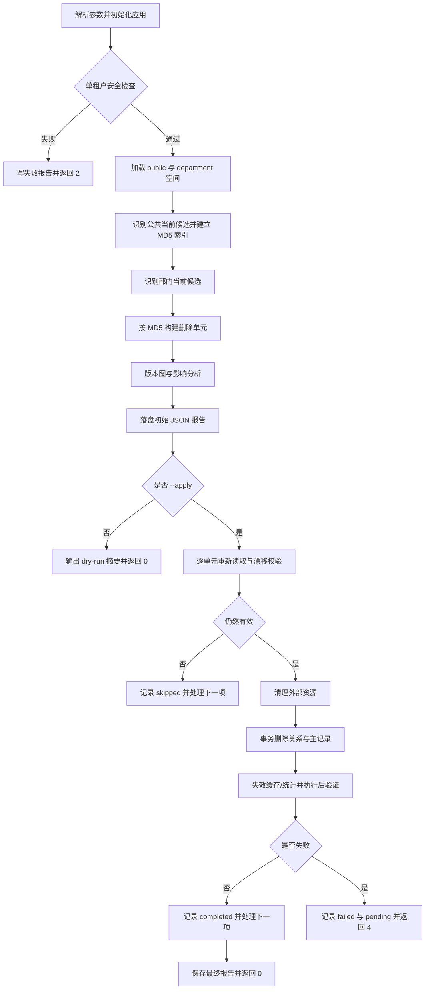

# F057 部门知识空间重复文档清理脚本：技术设计

> **状态**：已确认（2026-07-19）  
> **需求基线**：[`requirements.md`](./requirements.md)  
> **所属版本**：v2.5.0-sg

## 1. 设计目标

在不新增 API、数据库结构和第三方依赖的前提下，实现一个默认无写入、可审计、可重校验、可失败重试的单租户维护脚本。设计必须保证公共空间只作为匹配见证，永远不进入删除集合。

## 2. 现有能力与复用边界

| 能力 | 现有位置 | 设计用法 |
|------|----------|----------|
| 空间级别模型 | `knowledge/domain/models/knowledge_space_scope.py` | 以 `level` 识别 public/department |
| 文档与版本模型 | `knowledge/domain/models/knowledge_document*.py` | 构建当前版本和完整删除单元 |
| 外部资源删除 | `api/services/knowledge_imp.py` | 复用/抽取 Milvus、ES、MinIO 的既有删除语义 |
| 空间文件删除链路 | `knowledge/domain/services/knowledge_space_service.py` | 对照现有版本扩展、统计和推荐投影失效逻辑 |
| 文件迁移脚本 | `scripts/move_knowledge_space_files.py` | 复用 dry-run、JSON 报告、FGA/标签和跨存储处理模式 |

本脚本不会直接调用面向在线请求的批量删除入口作为唯一实现，因为该入口包含异步 Celery 清理，不能为一次性数据治理提供逐资源的同步结果和退出码。脚本应复用已有底层能力，并把删除编排留在脚本内部。

## 3. 文件结构

### 新建

| 文件 | 职责 |
|------|------|
| `src/backend/scripts/dedupe_department_space_documents.py` | CLI、扫描、计划、执行、验证和报告 |
| `src/backend/test/scripts/test_dedupe_department_space_documents.py` | 脚本级单元与回归测试 |

### 修改

| 文件 | 职责 |
|------|------|
| `src/backend/scripts/README.md` | 运维入口、参数、示例和风险说明 |

### 不修改

- 产品 Router、Endpoint、Service API。
- ORM 表结构和 Alembic migration。
- 多租户、权限和推荐模块的公开契约。

## 4. 总体流程



## 5. 内部模型

脚本内部使用 dataclass 或等价的只读结构，避免把 ORM 对象跨 session 保存。

### 5.1 `PublicWitness`

```text
space_id
file_id
document_id | null
version_id | null
md5
```

### 5.2 `PhysicalFileSnapshot`

```text
file_id
space_id
file_name
md5
status
file_type
object_name
preview/object derivative identifiers
version_id | null
version_no | null
is_primary
```

文件名只用于操作日志的可读摘要；报告可只保存 ID，避免泄露不必要的业务信息。

### 5.3 `DeletionUnit`

```text
unit_key               # document:{id} 或 legacy-file:{id}
department_space_id
primary_file_id
document_id | null
primary_version_id | null
md5
public_witnesses[]
physical_files[]       # 版本化文档包含全部版本
impact_counts
plan_fingerprint
status                 # planned/completed/skipped/failed/pending
steps[]
```

`plan_fingerprint` 根据 scope、主版本、MD5、版本 ID 和物理文件 ID 的稳定序列生成，仅用于检测计划漂移，不作为权限或删除依据。

## 6. 扫描与计划算法

### 6.1 前置检查

1. 解析 `argparse` 参数并验证所有 ID/limit 为正整数。
2. 初始化现有配置、日志、数据库、Milvus、ES、MinIO 和 OpenFGA 客户端所需上下文；dry-run 不初始化删除客户端。
3. 读取多租户开关；若启用则中止。
4. 在项目既有默认租户上下文中执行后续查询，避免手写 `tenant_id` 条件。
5. 验证报告目录可创建、可写；apply 必须先成功创建初始报告再进入删除。

### 6.2 空间集合

通过 `knowledge_space_scope` 与有效知识空间记录关联，分别取得 `public` 与 `department` 空间 ID。scope 缺失、level 不在目标集合或空间主记录缺失时不参与。

过滤参数只作用于部门空间，并执行以下保护：

- 参数中的空间不存在：参数错误，退出码 2。
- 参数中的空间不是 department：参数错误，退出码 2。
- `--file-id` 指向公共或非部门文件：参数错误，退出码 2。

### 6.3 当前候选识别

候选查询分批返回 `KnowledgeFile`、可选版本记录、逻辑文档和 scope。对每个物理文件分类：

1. **版本主文件**：版本记录存在，且文档 `primary_version_id`、版本 `is_primary` 和唯一主版本约束一致。
2. **版本历史文件**：版本记录存在但不是主版本，不参与候选。
3. **兼容旧文件**：没有任何版本记录，可参与候选。
4. **损坏版本图**：存在悬空、多个主版本、主版本指针冲突或跨空间，跳过并记录 reason code。

公共候选以 `dict[str, list[PublicWitness]]` 建立 MD5 索引。部门候选只对索引中存在的 MD5 构建删除单元，因此扫描复杂度为线性加命中展开，不做公共×部门笛卡尔比较。

### 6.4 删除单元扩展

- 版本化目标：按 `document_id` 查询全部版本，再批量加载全部物理文件。
- 旧数据目标：只包含当前物理文件。
- 任何物理文件所属 `knowledge_id` 与部门空间不一致时，整个单元跳过。
- 多个当前文件映射同一 `document_id` 时，以 `unit_key` 去重；若主版本不唯一则跳过。
- 稳定排序键：`(department_space_id, document_id or 0, primary_file_id)`。
- `--limit` 在完整校验、去重和稳定排序后应用。

## 7. dry-run 纯读保证

实现按依赖边界拆分：

- `PlanBuilder` 只接收只读 repository/query adapter。
- `ApplyExecutor` 才接收删除客户端和写 repository。
- CLI 只有在 `args.apply is True` 且初始报告成功落盘后才构造 `ApplyExecutor`。

测试通过严格 mock 断言 dry-run 路径未构造外部删除器、未打开写事务、未调用 FGA 写接口或缓存失效接口。

## 8. apply 编排

### 8.1 每单元重校验

执行器按计划顺序处理。每个单元开始时重新读取 scope、公共见证、目标文件和完整版本图，并重新计算 fingerprint。

出现以下情况记录 skipped，不作为执行失败：

- 目标已完整不存在；
- 目标不再重复；
- 公共见证全部失效；
- 目标状态/类型/MD5/scope 已变化；
- 版本链发生正常变化，当前计划已过期。

版本图损坏、跨空间或无法确定删除边界时也跳过，但在摘要中作为 `integrity_skip` 单独计数并提示人工检查。

### 8.2 快照

删除前生成执行快照，包含所有目标文件及其外部对象标识、关系计数、FGA 资源 ID 和公共见证。快照先写入当前报告并落盘，确保失败时仍可定位资源。

### 8.3 外部资源顺序

对删除单元内每个物理文件按文件 ID 排序：

1. 删除 Milvus 向量。
2. 删除 Elasticsearch 文档。
3. 删除 MinIO 对象及派生对象。
4. 清理 OpenFGA `knowledge_file` 元组。

已不存在视为成功。连接异常、鉴权异常或无法确认删除结果视为失败关闭，不进入后续单元。

外部资源删除早于数据库主记录，是为了保留失败重试所需的数据库元数据。跨系统无法回滚，因此每一步都要立即更新内存状态，并在失败时原子刷新报告文件。

### 8.4 数据库事务

外部清理成功后，在一个数据库事务内删除：

1. TagLink 与 ReviewTagLink。
2. 文件级 ShareLink。
3. 相似度候选中 source/candidate 命中目标文件的记录。
4. PortalRecommendationFileProjection。
5. KnowledgeDocumentVersion。
6. KnowledgeDocument。
7. KnowledgeFile。

删除条件必须基于已校验的精确 ID 集合。禁止使用仅 MD5 的批量删除语句。公共见证 ID 在事务开始前后均作为不可删除断言检查。

收藏引用和审计/审批历史不在事务删除集合中。收藏引用数量在快照中统计，用于运维评估失效引用影响。

### 8.5 派生状态失效

数据库提交后，调用既有推荐投影/池、知识空间统计和相关缓存失效机制。不能同步安全完成的既有后台任务，应记录任务 ID；任务发布失败视为当前单元失败并在报告中提示可重试。

若失败发生在数据库提交后，恢复模式只允许根据原 apply 报告重试这一节的缓存失效、任务发布和只读验证。它不得根据报告重新执行外部对象删除或数据库删除。这样既能恢复提交后的派生状态，又避免被修改的报告成为任意文件删除入口。

## 9. 执行后验证

对每个 completed 单元执行有界验证：

| 范围 | 验证 |
|------|------|
| MySQL/DM8 | 目标文件、逻辑文档、版本行和规定活动关系为 0 |
| Milvus | 目标文件/文档 ID 查询结果为 0 |
| Elasticsearch | 目标 document ID 查询结果为 0 |
| MinIO | 快照列出的对象均不存在 |
| 公共数据 | 至少一个计划见证仍存在，且所有公共见证均未被脚本修改 |

外部系统只提供删除结果而没有低成本存在性查询时，必须记录 `delete_confirmed` 证据，不得虚构二次查询成功。测试和 `verification.md` 应区分实查与调用确认。

## 10. 并发与一致性

- dry-run 不是执行授权快照，apply 总是重新扫描或逐单元重读。
- 建议在维护窗口执行，并暂停文件上传、换版、移动和删除操作。
- 数据库删除使用短事务和精确 ID；不持有全库锁。
- 若重校验到版本变化，安全跳过，不尝试合并新版本到旧计划。
- 单元之间不并行，降低跨存储压力并使失败边界清晰。

## 11. 报告设计

默认路径：

```text
migration_reports/knowledge_file_dedup/
└── dedupe-<UTC timestamp>-<run id>.json
```

顶层结构：

```json
{
  "schema_version": "1.0",
  "run_id": "...",
  "mode": "dry-run",
  "arguments": {},
  "preflight": {},
  "summary": {},
  "public_witness_summary": {},
  "units": [],
  "skipped": [],
  "errors": [],
  "verification": {},
  "started_at": "...",
  "finished_at": "..."
}
```

报告采用临时文件加原子替换写入；apply 前验证同目录原子替换可用。控制台只输出运行 ID、报告绝对路径和数量摘要。

## 12. CLI 设计

从后端根目录执行：

```bash
cd src/backend

# 全量预览
python scripts/dedupe_department_space_documents.py

# 限定部门空间预览
python scripts/dedupe_department_space_documents.py \
  --department-space-id 1001 \
  --department-space-id 1002

# 明确执行，最多处理 10 个删除单元
python scripts/dedupe_department_space_documents.py \
  --department-space-id 1001 \
  --limit 10 \
  --apply

# 仅恢复原 apply 报告中已记录的提交后失败步骤
python scripts/dedupe_department_space_documents.py \
  --resume-report migration_reports/knowledge_file_dedup/dedupe-xxx.json \
  --apply
```

参数：

| 参数 | 默认值 | 说明 |
|------|--------|------|
| `--apply` | false | 显式进入删除模式 |
| `--department-space-id ID` | 全部 | 可重复，收窄部门空间 |
| `--file-id ID` | 全部 | 可重复，收窄部门当前文件 |
| `--limit N` | 无 | 稳定排序后最多处理 N 个单元 |
| `--report-dir PATH` | `migration_reports/knowledge_file_dedup` | JSON 报告目录 |
| `--resume-report PATH` | 无 | 仅恢复合法 apply 报告中的失败/待处理步骤 |

不增加 `--force`、`--skip-validation` 或关闭报告的参数。

恢复报告必须是本脚本支持的 schema、`mode=apply` 且具有可恢复 checkpoint。恢复模式与空间/file/limit 范围参数互斥；数据库主记录仍存在时回到正常重校验流程，主记录已删除时只允许执行提交后派生状态失效和只读验证。

## 13. 测试设计

### 13.1 计划层

- public/department 完全由 scope level 决定。
- `is_released` 不影响公共候选。
- FILE + SUCCESS + 非空精确 MD5 条件。
- 公共历史版本不作为见证。
- 部门历史版本不独立成为目标。
- 兼容旧文件可参与。
- 版本损坏/跨空间安全跳过。
- 多见证、同文档多命中去重。
- 范围参数和稳定 limit。

### 13.2 执行层

- apply 前漂移重校验。
- 完整版本链展开。
- 外部删除顺序和不存在幂等。
- 数据库事务精确删除目标关系。
- 分享链接删除，收藏/审计保留。
- 公共见证不可删除断言。
- 中途失败停止、pending 标记和退出码。
- 执行后残留验证。

### 13.3 CLI 与报告

- dry-run 零写入。
- 参数错误和多租户前置拒绝。
- 初始报告失败时不进入 apply。
- 报告 schema、reason code 和原子刷新。
- `--help` 可直接执行。

## 14. 需求追踪

| 设计章节 | 需求 |
|----------|------|
| 6.1 前置检查 | REQ-001, REQ-005, REQ-014 |
| 6.2 空间集合 | REQ-002, REQ-006 |
| 6.3 当前候选识别 | REQ-003, REQ-004 |
| 6.4 删除单元扩展 | REQ-008 |
| 7 dry-run | REQ-005 |
| 8.1 重校验 | REQ-007 |
| 8.3 外部资源 | REQ-009, REQ-011, REQ-012 |
| 8.4 数据库事务 | REQ-010, REQ-011 |
| 9 执行后验证 | REQ-015 |
| 11 报告 | REQ-013, REQ-014 |

## 15. 已知风险与控制

| 风险 | 影响 | 控制 |
|------|------|------|
| MD5 理论碰撞 | 不同内容被视为重复 | 按已确认业务规则执行；报告保留见证和目标 ID，apply 仍需运维审批 |
| 跨系统非原子 | 部分外部资源已删但 DB 尚在 | 单元串行、外部先删、DB 元数据后删、失败停止、幂等重试 |
| 并发换版/移动 | dry-run 计划过期 | 维护窗口、逐单元重校验、漂移即跳过 |
| 版本图历史脏数据 | 删除边界不确定 | 完整性校验失败关闭，整单元跳过 |
| 收藏引用失效 | 用户收藏显示失效 | 不越权级联删除，报告影响计数 |
| 报告丢失 | 无法审计和重试 | apply 前落盘，原子刷新，失败即停止 |

## 16. 实施暂停点

1. 本文档与 `requirements.md`、`spec.md` 经用户确认。
2. 再创建 `tasks.md` 并进行任务审查。
3. 任务确认后才能编写脚本和测试。
4. 任何真实环境 `--apply` 必须另行明确授权，本特性实现确认不包含该授权。
