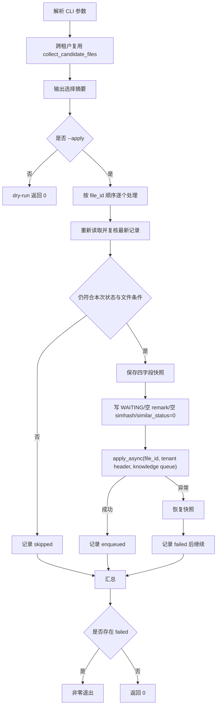

# 设计说明 Design：知识空间文件重解析任务入队脚本

## 阅读摘要

- 本设计新增一个独立运维入口，复用现有重解析脚本的候选收集逻辑，并把执行阶段替换为“状态预处理 + Celery 发布”。
- 设计重点是筛选一致性、发布前状态复核、逐文件租户 header、发布失败补偿和可观察退出码。
- 不修改现有 worker、解析 pipeline、数据库结构或 API。

## 元信息 Metadata

- Feature ID: `059-enqueue-knowledge-space-reparse`
- Status: `confirmed`
- Related requirements: `features/v2.5.0-sg/059-enqueue-knowledge-space-reparse/requirements.md`
- Created: `2026-07-28`
- Updated: `2026-07-28`

## 上下文 Context

- 现有架构 Existing architecture:
  - `scripts/reparse_knowledge_space_files.py` 在 `bypass_tenant_filter()` 下跨租户选择候选，默认 dry-run；`--apply` 在本地线程中设置 `PROCESSING`、删除旧向量并直接调用解析 pipeline。
  - `worker/knowledge/file_worker.py::retry_knowledge_file_celery` 先调用 `delete_knowledge_file_vectors(clear_minio=False)`，再进入 `_parse_knowledge_file()`。
  - `_parse_knowledge_file()` 只接受 `WAITING/PROCESSING` 状态；`WAITING` 会在 worker 内切换为 `PROCESSING`。
  - `worker/tenant_context.py` 从 Celery task header 恢复 `current_tenant_id`；无 header 时回退默认租户。
  - Celery 路由已将 `bisheng.worker.knowledge.*` 指向 `knowledge_celery`。
- 已检查文件 Relevant files inspected:
  - `src/backend/scripts/reparse_knowledge_space_files.py`
  - `src/backend/scripts/reparse_knowledge_space_files.sh`
  - `src/backend/scripts/README.md`
  - `src/backend/test/knowledge/test_reparse_knowledge_space_files_script.py`
  - `src/backend/bisheng/worker/knowledge/file_worker.py`
  - `src/backend/bisheng/worker/tenant_context.py`
  - `src/backend/bisheng/worker/config.py`
  - `src/backend/bisheng/core/config/settings.py`
  - `src/backend/bisheng/knowledge/domain/services/knowledge_utils.py`
  - `src/backend/AGENTS.md`
  - `src/backend/scripts/AGENTS.md`
- 现有测试或验证命令 Existing tests or validation commands:
  - `uv run pytest test/knowledge/test_reparse_knowledge_space_files_script.py`
  - `uv run ruff format --check <paths>`
  - `uv run ruff check <paths>`
  - `python -m compileall <script>`
- 项目约束 Constraints from project guidance:
  - 后端脚本从 `src/backend/` 运行，默认 dry-run，使用 `argparse`，包装器设置 `PYTHONPATH="./"` 并探测解释器。
  - 跨租户脚本查询必须使用 `bypass_tenant_filter()`；worker 不得在错误租户上下文解析资源。
  - 行为改动必须有可执行证据；不运行真实 `--apply` 作为开发验证。
  - 保留用户已有未提交修改，尤其是 `src/backend/scripts/README.md`。

## 目标 / 非目标 Goals / Non-Goals

### 目标 Goals

- 让新脚本和现有脚本共享同一个候选文件收集实现，避免复制查询逻辑。
- 在发布前以数据库最新状态重新验证每个文件，并准备现有重试 worker 所需状态。
- 显式传递每个文件的 `tenant_id` 和 `knowledge_celery` queue，并在发布期间临时设置同值
  `current_tenant_id`，避免 Celery publish signal 用旧上下文覆盖 header。
- 将单文件发布失败隔离并补偿，提供稳定汇总与退出码。
- 用 mock 隔离数据库和 broker，覆盖成功、状态漂移、多租户和双失败路径。

### 非目标 Non-Goals

- 重构原脚本的本地解析流程或修改其 CLI。
- 给 Celery 增加新任务、队列、路由、限流、任务撤销或结果跟踪。
- 解决数据库与 broker 的 exactly-once 或分布式事务问题。
- 在自动化验证中连接真实 broker、worker、Milvus、Elasticsearch 或生产数据库执行重解析。

## 边界承诺 Boundary Commitments

| Boundary | Allowed Change | Disallowed Change | Revalidation Trigger |
|---|---|---|---|
| 原重解析脚本 | 仅作为筛选函数、常量和摘要输出的依赖 | 改变本地解析、默认状态或已有 CLI 行为 | 需要提取/修改公共筛选实现时 |
| 新运维脚本 | 参数解析、dry-run、状态预处理、任务发布、补偿、摘要 | 本地向量删除、解析 pipeline、最终状态轮询 | 新增等待、限速、批量或任务追踪要求 |
| Knowledge worker | 调用现有 `retry_knowledge_file_celery` | 修改 worker 任务、异常策略或路由 | 现有任务无法满足重试语义时 |
| 数据库 | 更新已有 `KnowledgeFile` 四个字段 | Schema、migration、其他业务字段或批量原始 SQL | 需要持久化任务追踪或幂等键时 |
| 多租户 | 跨租户选择；逐任务显式 header | 默认租户回退、worker 侧 bypass | 任务接口改为显式 tenant 参数时 |
| 文档和测试 | 新测试、新 README 小节、新包装器 | 覆盖用户现有 README 修改或扩大到其他脚本 | 发现现有未提交变更与落点冲突时 |

- Allowed dependencies: none；仅复用现有 SQLModel/DAO、Celery task 和脚本模块。

## 需求追踪 Requirements Traceability

| Requirement | Acceptance Criteria | Design Element | Verification Strategy |
|---|---|---|---|
| REQ-001 | AC-REQ-001-01, AC-REQ-001-02, AC-REQ-001-03 | `collect_candidate_files`/状态常量复用、独立 parser、dry-run gate | 现有筛选回归 + 新参数/无副作用测试 |
| REQ-002 | AC-REQ-002-01, AC-REQ-002-02, AC-REQ-002-03, AC-REQ-002-04 | `enqueue_one_file` 最新状态复核、字段预处理、显式 queue/header | publisher mock 与多租户参数化测试 |
| REQ-003 | AC-REQ-003-01, AC-REQ-003-02, AC-REQ-003-03, AC-REQ-003-04 | 字段快照、发布异常补偿、结果模型、批次汇总和退出码 | publish/rollback 双失败及继续处理测试 |
| REQ-004 | AC-REQ-004-01, AC-REQ-004-02, AC-REQ-004-03 | shell wrapper、README、CLI help、静态检查 | CLI smoke、Ruff、compileall、diff check |

## 架构设计 Architecture

- Pattern: 薄运维编排脚本（selection reuse + per-file state transition + external publish compensation）。
- Rationale: 候选收集已经有完整测试，直接复用可保持筛选行为一致；worker 已包含向量清理和解析链路，无需复制业务逻辑或新增任务。
- Preserved existing patterns:
  - 默认 dry-run、`--apply` 显式写入。
  - `bypass_tenant_filter()` 只用于脚本跨租户读取/写入。
  - Celery worker 通过 task header 恢复租户。
  - 单文件失败继续批次，最终非零退出。
- Architecture change justification, if any: none；新增脚本只组合现有能力。

### 执行流

## 文件结构计划 File Structure Plan

| Path | Action | Responsibility | Linked Requirement |
|---|---|---|---|
| `src/backend/scripts/enqueue_reparse_knowledge_space_files.py` | create | CLI、候选复用、状态准备、Celery 发布、补偿与摘要 | REQ-001, REQ-002, REQ-003 |
| `src/backend/scripts/enqueue_reparse_knowledge_space_files.sh` | create | `PYTHONPATH`、解释器探测和参数原样转发 | REQ-004 |
| `src/backend/test/knowledge/test_enqueue_reparse_knowledge_space_files_script.py` | create | 新脚本行为与失败路径定向测试 | REQ-001, REQ-002, REQ-003 |
| `src/backend/scripts/README.md` | modify | 追加使用方式、语义、worker 前置条件和风险 | REQ-004 |
| `features/v2.5.0-sg/059-enqueue-knowledge-space-reparse/spec.md` | create | 人工评审入口和稳定契约摘要 | REQ-001, REQ-002, REQ-003, REQ-004 |
| `features/v2.5.0-sg/059-enqueue-knowledge-space-reparse/requirements.md` | create | 需求、AC 与验证方法 | REQ-001, REQ-002, REQ-003, REQ-004 |
| `features/v2.5.0-sg/059-enqueue-knowledge-space-reparse/design.md` | create | 设计边界、风险与测试策略 | REQ-001, REQ-002, REQ-003, REQ-004 |
| `features/v2.5.0-sg/059-enqueue-knowledge-space-reparse/tasks.md` | create after spec confirmation | 可追踪实施任务 | REQ-001, REQ-002, REQ-003, REQ-004 |

## 组件与接口 Components and Interfaces

### CLI 参数层

- Responsibility: 定义新脚本 docstring、`argparse` 和安全开关。
- Inputs:
  - `--apply`
  - 可重复 `--space-id`、`--folder-id`、`--file-id`
  - `--space-level`
  - 可重复 `--status`
  - `--include-inflight`、`--only-inflight`
- Outputs: 规范化 `Namespace`；参数冲突由 argparse 非零退出。
- Dependencies: 复用现有 `SPACE_LEVEL_CHOICES`、`STATUS_NAME_TO_VALUE`、`resolve_eligible_statuses`。
- Error behavior: 非法 ID、状态或互斥组合在连接数据库前失败。
- Requirements: REQ-001, REQ-004。

### 候选选择层

- Responsibility: 在 `bypass_tenant_filter()` 下调用现有 `collect_candidate_files` 和 `print_selection_report`。
- Inputs: 规范化范围与有效状态集合。
- Outputs: 按 `file_id` 排序的 `SelectionReport`。
- Dependencies: `get_async_db_session()`、现有重解析脚本。
- Error behavior: 查询异常向上传播，最终关闭应用上下文并返回非零。
- Requirements: REQ-001。

### 单文件入队层

- Responsibility: 最新状态复核、字段快照、状态更新、显式 Celery 发布和失败补偿。
- Inputs: `file_id`、本次有效状态集合、可注入 publisher。
- Outputs: `FileEnqueueResult`，至少包含 `file_id`、`tenant_id`、`file_name`、`outcome`、`task_id`、`error`、`rollback_error`。
- Dependencies:
  - `KnowledgeFileDao.get_file_by_ids/update`
  - `KnowledgeDao.query_by_id`
  - `retry_knowledge_file_celery.apply_async`
  - `set_current_tenant_id/current_tenant_id.reset`
- Error behavior:
  1. 最新记录不再有效：返回 `skipped`，不更新、不发布。
  2. 初始状态更新失败：返回 `failed`，不发布。
  3. 发布失败：恢复快照；恢复失败时保留两个错误。
  4. 发布成功：返回 `enqueued` 和 task ID，不查询最终解析状态。
- Requirements: REQ-002, REQ-003。

### 批次编排与报告层

- Responsibility: 顺序处理候选，单文件隔离异常，打印稳定摘要并决定退出码。
- Inputs: 候选文件、有效状态集合、`--apply`。
- Outputs: `EnqueueRunReport(selected, enqueued, skipped, failed, results)` 和退出码。
- Dependencies: 单文件入队层。
- Error behavior: 单文件失败继续；批次级初始化/数据库查询错误立即中断并非零退出。
- Requirements: REQ-001, REQ-003。

## 数据 / 状态变化 Data / State Changes

- Entities: 现有 `KnowledgeFile`。
- Persistence changes:
  - 发布前：`status -> WAITING`、`remark -> ""`、`simhash -> None`、`similar_status -> 0`。
  - 发布失败：按入队前快照恢复上述字段。
  - worker 后续状态变化属于现有解析链路，不由新脚本管理。
- Migration or rollback: 无迁移。代码回滚为删除新增脚本、测试、包装器和文档小节；已成功入队的任务不可由代码回滚撤回。
- Compatibility:
  - 原脚本及其命令不变。
  - worker task 签名与路由不变。
  - 数据库双库兼容性不变。

### 一致性边界

1. 文件状态必须先提交，worker 才能读取 `WAITING` 并开始解析。
2. Celery 发布与数据库提交之间没有原子性：
   - 明确发布异常时，脚本执行字段补偿。
   - 若 broker 已接收但客户端因网络异常未收到确认，补偿可能使已发布 worker 随后跳过；脚本必须记录失败，不能声称 exactly-once。
3. 成功发布后不恢复字段；即使 worker 离线，文件保持 `WAITING`，等待队列消费。

## 测试策略 Testing Strategy

| Acceptance IDs | Risk / Level | Distinct Outcomes | Primary Layer | Evidence Group | Stop Condition |
|---|---|---|---|---|---|
| AC-REQ-001-01, AC-REQ-001-02, AC-REQ-001-03 | medium/V1 | 筛选透传、状态参数、dry-run 无副作用 | unit + existing script regression | EG-001 | 现有筛选测试继续通过且新 dry-run publisher/update 调用均为 0 |
| AC-REQ-002-01, AC-REQ-002-02, AC-REQ-002-03, AC-REQ-002-04 | high/V2 | 成功状态转换、状态漂移跳过、显式 queue、跨租户 header | unit with DAO/Celery mocks | EG-002 | 每种独立结果有断言且无真实 broker/DB 写入 |
| AC-REQ-003-01, AC-REQ-003-02, AC-REQ-003-03, AC-REQ-003-04 | high/V2 | 发布失败恢复、恢复失败双错误、继续批次、退出码/文案 | unit failure injection | EG-003 | publish/rollback 独立失败均被观察且后续文件继续 |
| AC-REQ-004-01, AC-REQ-004-02, AC-REQ-004-03 | low/V1 | CLI 可运行、文档可发现、静态质量 | CLI/static checks | EG-004 | `--help`、shell syntax、Ruff、compileall、diff check 通过 |

不运行真实 `--apply` 作为自动化验证。真实环境只建议在运维维护窗口先执行 dry-run，再由人工确认 worker 与 broker 可用后执行；该人工操作不属于代码完成门禁。

## 设计决策 Decisions

### Decision 1：复用现有候选收集函数，不复制数据库筛选

- Context: 新旧脚本需要保持空间、目录递归、状态、空间级别和跳过统计一致。
- Options considered:
  - A：复制现有脚本全部筛选代码。
  - B：从现有脚本导入 `collect_candidate_files`、状态解析和摘要函数。
  - C：重构成新的共享模块并同时修改两个脚本。
- Decision: 选 B。
- Rationale: 最小改动即可共享行为和现有测试；A 易漂移，C 会扩大原脚本变更面。
- Consequences: 新脚本对现有维护脚本模块形成显式依赖；未来若共享逻辑继续扩大，再单独评估公共模块。

### Decision 2：使用 `retry_knowledge_file_celery` 而非普通解析任务

- Context: 重解析必须清理旧 Milvus/Elasticsearch 记录，普通任务不会先清理。
- Options considered:
  - A：`parse_knowledge_file_celery`。
  - B：`retry_knowledge_file_celery`。
  - C：新增 worker task。
- Decision: 选 B。
- Rationale: B 已包含所需向量清理与解析语义，不需要修改 worker。
- Consequences: 新脚本必须先将文件持久化为 worker 接受的 `WAITING`。

### Decision 3：显式使用 task header、queue 和同值临时租户上下文

- Context: 脚本跨租户扫描时没有单一请求租户上下文；`.delay()` 自动注入可能得到空值或错误租户。
  Celery 的 `before_task_publish` signal 还会在当前 ContextVar 非空时覆盖调用方传入的同名 header。
- Options considered:
  - A：逐文件设置 ContextVar 后 `.delay()`。
  - B：只调用 `apply_async(..., headers={"tenant_id": ...}, queue="knowledge_celery")`。
  - C：显式 header/queue，同时在 `try/finally` 内临时设置同值 ContextVar，发布后恢复。
- Decision: 选 C。
- Rationale: 消息本身携带资源租户，且 signal 即使执行也只会写入相同值；`finally` 防止跨文件上下文泄漏。
- Consequences: publisher mock 需要精确验证 args/header/queue，并验证发布期间上下文值及发布后恢复。

### Decision 4：发布失败执行字段级补偿并继续

- Context: worker 要求先提交 `WAITING`，但消息发布可能失败。
- Options considered:
  - A：失败后保留 `WAITING`。
  - B：恢复四个原字段并继续。
  - C：首个失败即停止，不恢复。
- Decision: 选 B。
- Rationale: 符合已确认的单文件隔离和失败恢复需求。
- Consequences: 无法消除 broker 确认不确定窗口；补偿失败必须作为独立错误报告。

## 风险 / 取舍 Risks / Trade-Offs

| Risk | Impact | Mitigation | Owner / Phase |
|---|---|---|---|
| broker 已接受但客户端收到异常 | 恢复状态后已入队任务可能跳过，存在人工复核需求 | 明确非 exactly-once；报告失败与 file_id，不宣称未发布 | 实现/运维 |
| 显式选择 in-flight 文件 | 与既有解析重复，可能重复清理/解析 | 保持 opt-in；CLI 与 README 高亮提示 | 文档/运维 |
| 全量筛选产生大量消息 | broker/worker 积压 | 默认 dry-run、顺序发布、输出总量；不新增限流假设 | 运维 |
| 发布成功但 worker 离线 | 文件长期保持 WAITING | 成功定义仅为入队；README 要求执行前确认 worker | 运维 |
| README 存在用户未提交修改 | 文档补丁冲突或覆盖 | 修改前重新读取，仅追加新小节，验证 diff | 实现 |

## 设计质量门 Design Quality Gate

- [x] Every requirement ID is represented in Requirements Traceability.
- [x] Every acceptance criterion has a verification strategy.
- [x] Verification uses the lowest sufficient layer and avoids duplicate commands across acceptance criteria.
- [x] Test cases map to distinct outcomes/risks instead of tasks, branches, roles, or raw input count.
- [x] One primary test layer is selected per behavior unless a boundary has independent risk.
- [x] Boundary Commitments include allowed and disallowed changes.
- [x] Every changed file has one clear responsibility and linked requirement.
- [x] Existing architecture is preserved or changes are justified.
- [x] Runtime prerequisites, migrations, and risky operations are explicit.
- [x] No speculative abstractions are included.
