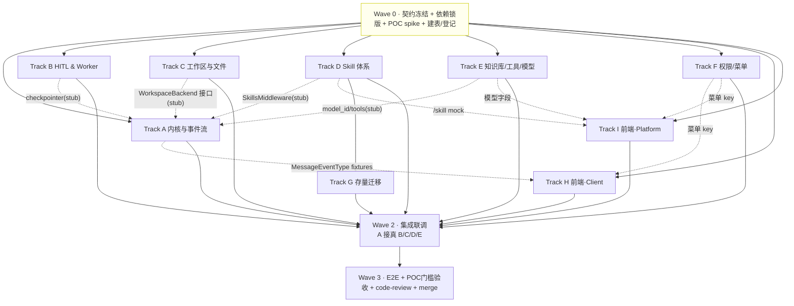

# Tasks: 灵思任务模式 · deepagents 适配层（F034）— 多人并行开发拆分

**关联**: [design.md](./design.md) · [技术方案](../../技术方案-灵思%20deepagents%20适配层设计.md)（§1–§10） · [差异文档](./差异-现方案-vs-技术方案.md) · [PRD](../../任务模式!灵思%202.0/任务模式!灵思%202.0.md)
**版本**: v2.6.0

---

## 状态

| 步骤 | 状态 | 备注 |
|------|------|------|
| design.md | ✅ 已评审 | 接手第一入口 |
| 契约冻结（Wave 0） | 🔲 未开始 | **阻塞所有并行 Track，必须最先完成** |
| 实现 | 🔲 未开始 | 0 / 9 Track |

---

## 0. 拆分总览：9 条 Track（可分配给 5–6 人）

> 拆分原则：**按「契约边界」切，不按「文件」切**。每个 Track 对外只暴露一个稳定契约（API/接口/事件协议），内部实现自治。契约在 Wave 0 冻结后，各 Track 用对方的 **stub/mock** 并行开发，集成期换真。

| Track | 名称 | 一句话职责 | 建议归属 | 主交付物 |
|---|---|---|---|---|
| **0** | 地基 / Lead | 冻结契约、引依赖、POC spike、建表、登记 release-contract | Lead（+1） | 契约文档、依赖锁版、表/迁移、共享 fixtures |
| **A** | 内核与事件流 | `create_deep_agent` 装配 + `StreamEventMapper`（stream→`MessageEventType`） | 后端·核心 | 内核装配、事件归一层、call_reason、历史压缩 |
| **B** | HITL & Worker | park-and-release + Redis checkpointer + 重新入队 + 协作终止 | 后端·运行时 | worker 改造、checkpointer 装配、续跑链路 |
| **C** | 工作区与文件 | `WorkspaceBackend`（MinIO 真相+写穿缓存）+ 附件 + 代码产出捕获 | 后端·存储 | WorkspaceBackend、附件摄入、指针块、E2B copy-in/out |
| **D** | Skill 体系 | Skill 磁盘存储 + 双中间件 + CRUD API/Service/Repo | 后端·Skill | `/skill` API、SkillsMiddleware、`linsight_skill` 表 |
| **E** | 知识库/工具/模型 | 方案 B `SearchKnowledgeBase` + 工具包装 + 模型选择注入 | 后端·集成 | 知识库工具、模型注入、移除旧执行模式配置 |
| **F** | 权限/菜单 | 任务模式菜单权限（首页子开关+回填）+ Skill 多租户隔离 | 后端·权限 | 菜单权限、路由收口、回填脚本 |
| **G** | 存量迁移 | `linsight_sop` → Skill 一次性脚本 + 对账报告 | 后端（D 之后） | 迁移脚本、对账报告 |
| **H** | 前端·Client 执行视图 | 输入区 + 执行视图状态机 + 步骤流 + 追问卡 + 产物区 | 前端·client | client app 全部任务模式 UI |
| **I** | 前端·Platform | Skill 管理页 + 模型配置 + 角色编辑器「任务模式」 | 前端·platform | platform app 管理类 UI |

---

## 1. 契约冻结（Wave 0）★ 并行的命门

> **这是「约定」章**。Wave 0 必须由 Lead 牵头、相关 Track owner 参与，**先把下列 7 个契约的字段/签名定死并文档化**，之后各 Track 才能解耦并行。契约一旦冻结，变更须走「契约变更评审」（见 §5）。

### C1 · WebSocket 事件协议（A 产出 → H 消费）
- **不变量**：前端消费的 `MessageEventType`（11 枚举，`state_message_manager.py`）**不新增类型**。新内核的步骤/子图/genUI/追问全部映射进既有类型。
- **冻结物**：每个 `MessageEventType` 的 `data` JSON schema（尤其 `task_execute_step` 的 `step_type`/`call_reason`/`call_id`/`status`/嵌套 `namespace`/`extra_info.file_info`；`user_input` 追问卡的 `tool_calls.args` 字段）。
- **交付**：A 在 Wave 0 末产出一组**录制的 `MessageEventType` fixtures**（JSON），H 拿它直接渲染、A 拿它写映射断言。**双方都对着 fixtures 编程，不互相等。**

### C2 · WorkspaceBackend 接口 + 布局（C 产出 → A/B/H 消费）
- **接口**：`read(path,offset,limit) / write(path,content) / ls(prefix) / edit(path,...)`（注入 `create_deep_agent(backend=...)`）。
- **MinIO 布局**：`workspace/{svid}/{uploads/<name>/index.md, output/, scratch/}`；大/二进制 → 指针清单 `manifest`。
- **指针块格式**：`<uploaded_files>`（path/name/lines/images），零正文。
- **代码产出契约**：E2B `run` 结果**枚举本次新增/改动文件**（path+size）的字段格式（H 据此做产物溯源/「任务下所有文件」）。
- **交付**：C 在 Wave 0 末给出接口签名 + `FakeWorkspaceBackend`（内存实现），A/B 用它跑通装配与 E2B 摄入。

### C3 · Skill API + 激活 + frontmatter（D 产出 → A/I 消费）
- **API**：`/api/v1/linsight/skill`（GET 列表/详情、POST 上传/新建、PUT 编辑、DELETE、PATCH 启停），`PageData[T]` 分页，鉴权 `get_tenant_admin_user`。
- **激活契约**：per-run 白名单经 `config.configurable.active_skills=[names]`（`[]`=全禁，前端不下发 `None`）。
- **frontmatter spec**：`name≤64 [a-z0-9-]` / `description≤1024` / `allowed-tools?`；文件 ≤10MB。
- **交付**：D 给出 OpenAPI schema + 一份 mock 响应，I 用 mock 开发管理页。

### C4 · 模型注入（E 产出 → A/I 消费）
- **注入键**：`config.configurable.model_id`（缺省取「灵思默认模型」）。
- **配置字段**：工作台对话模型新增按租户单选「灵思默认模型」标记；移除「灵思任务执行模型」配置区。
- **交付**：E 给出字段名 + 读取/写入接口；A 用它取 model，I 用它渲染管理端单选 + 用户端选择器。

### C5 · checkpointer / 续跑契约（B 产出 → A/端点 消费）
- **约定**：`thread_id = session_version_id`；Redis checkpointer（`langgraph-checkpoint-redis`）连接复用 `RedisManager`。
- **续跑入队**：`/workbench/user-input` 成功后 `rpush` queue 的 **payload 格式** + worker 拾取时「续跑 vs 新任务」判定字段 + `Command(resume=...)` 取值来源（最近一次 user_input 事件）。
- **交付**：B 给出 checkpointer 装配函数签名 + queue payload 格式；A 用 `InMemorySaver` 先行，集成换 Redis。

### C6 · 菜单权限 + 路由守卫（F 产出 → H/I 消费）
- **约定**：「任务模式」菜单 key（首页子项）；无权限时入口隐藏 + `/linsight` 路由拦截（走既有菜单拦截，不手写 403）。
- **交付**：F 给出菜单 key 常量 + 权限查询接口；H 做路由守卫、I 做角色编辑器开关。

### C7 · 数据与错误码（D/Lead 产出 → 全体读）
- `linsight_skill` 表 DDL + Alembic revision；错误码段 `110` 段 11050–11069（`common/errcode/linsight.py`）。
- **release-contract 登记 F034**：领域对象 `LinsightSkill`、错误码段、新表（**Wave 0 必须先登记**，表1规则）。

---

## 2. 依赖关系图（Track 级）

**解读**：Wave 0 之后，**8 条 Track 全部可并行**（虚线=「用对方 stub/mock 解耦」，不是「等对方做完」）。只有 **G 依赖 D 的存储格式**必须晚启。集成（Wave 2）才把 stub 换真。

---

## 3. Wave 编排

| Wave | 内容 | 参与 | 退出条件 |
|---|---|---|---|
| **0** | 契约冻结（§1 C1–C7）+ 依赖锁版（deepagents/langgraph/checkpointer-redis）+ **POC spike**（§7）+ `linsight_skill` 建表 + release-contract 登记 + 各 Track stub/mock 与 fixtures | Lead + 各 owner 各 0.5 人日 | 7 契约文档化 + fixtures/stub 可用 + POC 5 项有结论 |
| **1** | A/B/C/D/E/F/H/I **并行**实现（对 stub/mock 编程）；各自单测/手动验证绿 | 全员 | 各 Track 单元级 DoD 达成 |
| **2** | 集成联调：A 接真 C/D/E/B；前后端联调 WS；G 启动（D 稳定后） | 全员轮值 | 端到端「提交→规划→工具→产物→完成」打通 |
| **3** | `/e2e-test` + POC门槛（命中率/续跑保真）+ `/code-review` + DM8/多租户回归 + merge | Lead + QA | AC-1..8 通过 |

---

## 4. 并行解耦约定（stub/mock 清单）★

> 让任何 Track 在依赖未就绪时也能开发到「单元级绿」。

| Track | 用到的外部依赖 | Wave 1 期间用什么顶替 |
|---|---|---|
| A 内核 | WorkspaceBackend / checkpointer / SkillsMiddleware / model | `FakeWorkspaceBackend`（C 提供）、`InMemorySaver`、stub skills 目录、固定 model | 
| A 事件流 | 真实 LangGraph 流 | **录制的 astream chunk fixtures**（POC spike 录一组），离线驱动 `StreamEventMapper` |
| B Worker | 真 graph | 一个「假 graph」：astream 几个 chunk 后 `interrupt()`，验证 release→入队→resume 闭环 |
| C 工作区 | E2B / MinIO | 本地 MinIO（CI）+ `FakeSandbox`（返回固定 scan_tree） |
| D Skill | 真前端 | 用 curl/pytest 打 `/skill`；middleware 用本地 SKILLS_ROOT 临时目录 |
| E 知识库 | 真 KnowledgeService | 复用既有；模型字段先写默认值 |
| H 前端 | 真 WS/后端 | **WS mock 回放 C1 fixtures**；`/skill`、提交接口用 MSW mock |
| I 前端 | 真 `/skill`/模型接口 | C3 mock + C4 字段 mock |
| G 迁移 | 真 Skill 存储 | D 的 `SkillRepository` 写盘接口（D 稳定后） |

**共享 fixtures（Lead 维护，放 `test/linsight/fixtures/`）**：① 一组 LangGraph astream chunk（含 tool/thinking/子图/interrupt/终态）；② 由 ① 经 `StreamEventMapper` 产出的 `MessageEventType` JSON（A 与 H 共用的「同一份真相」）。

---

## 5. 分支与协作约定

- **基线分支**：`feat/2.6.0/034-linsight-task-mode`（docs + 契约先落此分支）。
- **Track 分支**：`feat/2.6.0/034-<track>`（如 `034-trackA-kernel`），PR 合入基线；基线每日/每 Wave 滚动集成。
- **代码 ownership（防冲突，按目录切）**：

  | Track | 独占目录 |
  |---|---|
  | A | `linsight/domain/services/{agent_factory,stream_event_mapper}.py` |
  | B | `linsight/worker.py`、`linsight/domain/services/{checkpointer,segment_runner}.py`、`/workbench/user-input` 端点 |
  | C | `linsight/domain/services/workspace_backend.py`、`workbench_impl.py`（附件/解析部分）、`e2b_executor.py` 摄入改造 |
  | D | `linsight/domain/services/{skill_store,skill_middleware}.py`、`linsight/api/endpoints/skill.py`、`models/linsight_skill.py` |
  | E | `tool/domain/langchain/linsight_knowledge.py`、`llm` 模型字段、`_get_llm` |
  | F | `permission`/角色菜单、回填脚本 |
  | G | `scripts/migrate_sop_to_skill.py` |
  | H | `src/frontend/client/**`（任务模式相关） |
  | I | `src/frontend/platform/**`（Skill 管理页/模型配置/角色编辑器） |

  **共享热点文件**（`task_exec.py`、`state_message_manager.py`）：A 主改，B/C 经 A 协调或拆出新文件，避免同文件并发改。
- **契约变更评审**：任何对 §1 C1–C7 的改动，发起者在基线分支提「契约变更」PR + @ 所有消费方 owner，合并后消费方同步。

---

## 6. 各 Track 任务清单

> 格式：`[ ] T<Track><NN>` · **文件** · **逻辑** · **依赖** · **DoD**。设计论证见 design §X / 技术方案 §Y，不复制。

### Track 0 · 地基（Lead）
- [ ] **T0-1** 引入依赖锁版：`deepagents>=0.6.3`、`langgraph>=1.0`、`langgraph-checkpoint-redis`。**DoD**：`uv sync --frozen` 通过。
- [ ] **T0-2** POC spike（§7 五项），产出结论 + astream/MessageEventType **共享 fixtures**。**DoD**：5 项有红/绿结论，fixtures 入库。
- [ ] **T0-3** `linsight_skill` 表 + Alembic revision（带 `tenant_id`，DM8 复核）。**DoD**：`alembic upgrade head` 通过。
- [ ] **T0-4** release-contract 登记 F034（领域对象/错误码段/表）。**DoD**：表1/表3/已分配编码更新。
- [ ] **T0-5** 冻结 C1–C7 契约文档（本 tasks §1 充实为可编程签名）。**DoD**：各 owner 签字。

### Track A · 内核与事件流
- [ ] **TA-1**(测试) `StreamEventMapper` 单测：对 fixtures chunk 断言 `MessageEventType` 输出（todo/工具/thinking/子图/检索/interrupt/终态）。**依赖** T0-2。**覆盖** AC-1。
- [ ] **TA-2** `stream_event_mapper.py` 实现（chunk→`BaseEvent`→既有 `_handle_event`，按 `call_id` 合并、`namespace` 子图归并、终态收口）。**依赖** TA-1。
- [ ] **TA-3** `agent_factory.py`：`create_deep_agent` 装配（model/tools/backend/checkpointer/middlewares），`call_reason` schema 注入 + 历史压缩中间件。**依赖** C2/C3/C4/C5 stub。
- [ ] **TA-4** `_execute_workflow`/`_execute_agent_tasks` 改 `astream(stream_mode=[updates,messages,values], subgraphs=True)`。**依赖** TA-2/TA-3。**DoD**：用 stub 跑通端到端 fixtures。

### Track B · HITL & Worker（park-and-release）
- [ ] **TB-1**(测试) park-and-release 闭环测：假 graph interrupt → 释放 slot → 重新入队 → 异地 resume，断言 checkpointer 续跑保真。**依赖** T0-2。**覆盖** AC-5。
- [ ] **TB-2** `checkpointer.py`：`AsyncRedisSaver` 装配（thread_id=svid，复用 RedisManager）。**依赖** C5。
- [ ] **TB-3** worker 改造：interrupt 释放 semaphore + `release_task_ownership` + 退出循环；删 `_wait_for_input_completion` 轮询。**依赖** TB-2。
- [ ] **TB-4** `/workbench/user-input` 追加「重新入队」+ worker 拾取识别续跑（`Command(resume)`）+ 协作终止标志。**依赖** TB-3。**DoD**：TB-1 绿，重启不丢。

### Track C · 工作区与文件
- [ ] **TC-1**(测试) `WorkspaceBackend` 单测：write 写穿、read 分页/懒加载、ls 以 MinIO 为准、多租户隔离。**覆盖** AC-6。
- [ ] **TC-2** `workspace_backend.py` 实现（MinIO 真相 + file_dir 写穿缓存）+ `FakeWorkspaceBackend`（**Wave 0 即交付给 A/B**）。**依赖** C2。
- [ ] **TC-3** 附件摄入：解析 markdown→MinIO，物化指针块 `<uploaded_files>`，含图文档（base64 图片）。**依赖** TC-2。
- [ ] **TC-4** 代码产出捕获：E2B copy-in（小 push / 大 presigned）+ copy-out（全树扫描→按 `SIZE_INLINE` 分流→backend）+ `run` 结果枚举新文件 + `output/`vs`scratch/` 分类。**依赖** TC-2。**DoD**：脚本产出可被 `ls`/`read` 看见、产物 promote MinIO。

### Track D · Skill 体系
- [ ] **TD-1** `models/linsight_skill.py` + DAO（依赖 T0-3）。
- [ ] **TD-2** 错误码 11050–11069（`common/errcode/linsight.py`）。
- [ ] **TD-3**(测试) `SkillService` 单测：CRUD、重名校验、frontmatter 校验、租户隔离。
- [ ] **TD-4** `skill_store.py`（磁盘 SKILLS_ROOT，元数据 DB）+ `skill_middleware.py`（SkillsMiddleware + 白名单，顺序约束）。**依赖** TD-1。
- [ ] **TD-5**(测试) `/skill` API 集成测。
- [ ] **TD-6** `api/endpoints/skill.py` + router 注册（鉴权 `get_tenant_admin_user`）。**依赖** TD-4/TD-5。**DoD**：C3 契约可用，给 I mock 对齐。

### Track E · 知识库/工具/模型
- [ ] **TE-1** `SearchKnowledgeBase` 包成 `BaseTool`（方案 B），ReBAC 代用户过滤（对齐 INV-7）。**覆盖** FR-3.5。
- [ ] **TE-2** 工具包装（工作台预设 + 代码解释器）为 deepagents tools。
- [ ] **TE-3** 模型注入：`_get_llm` 按 `config.configurable.model_id`；新增「灵思默认模型」字段读写；移除 `linsight_executor_mode` 分支。**依赖** C4。**DoD**：A 取得正确 model。

### Track F · 权限/菜单
- [ ] **TF-1** 「任务模式」菜单子项（首页下）+ 父子联动孤儿清理 + 路由/入口双收口（不手写 403）。**覆盖** FR-7.8/7.9/7.10。
- [ ] **TF-2** 存量角色回填脚本（`scripts/`，给「可进工作台」角色补「任务模式」）。**覆盖** FR-7.11。
- [ ] **TF-3** Skill 多租户隔离校验（`linsight_skill.tenant_id` + 跨租户不展示）。**覆盖** AC-7。

### Track G · 存量迁移（D 之后）
- [ ] **TG-1** `scripts/migrate_sop_to_skill.py`：遍历 `linsight_sop`→`linsight_skill`+磁盘 SKILL.md，幂等可重入。**依赖** TD-4。
- [ ] **TG-2** 对账报告（成功/失败/跳过）。**覆盖** AC-4。

### Track H · 前端·Client 执行视图
- [ ] **TH-1** 统一输入区：任务模式 chip + 「+」菜单（技能/知识空间/组织知识库/附件）+ 工具栏 + 模型选择器 + 提交前一览。**对** C1/C3/C4。**覆盖** FR-1.x/2.x。
- [ ] **TH-2** 执行视图状态机 + 步骤流渲染（消费 C1 fixtures：todo/工具/thinking/子任务/检索/产物/genUI 注册表）。**覆盖** FR-3.x。
- [ ] **TH-3** HITL 追问卡（从 `tool_calls.args` 渲染，单点定向隔离）。**覆盖** FR-4.x。
- [ ] **TH-4** 产物区（预览/下载/打包/复制/溯源/查看所有文件）+ 路由守卫（C6）。**覆盖** FR-3.8/3.18。
  **手动验证**：WS mock 回放 fixtures → 全流程 UI 正确；断连重连恢复。

### Track I · 前端·Platform
- [ ] **TI-1** Skill 管理页（列表/搜索/Preview·Source/上传·新建/编辑/删除/启停/校验/空态）。**对** C3 mock。**覆盖** FR-5.x。
- [ ] **TI-2** 模型配置：工作台对话模型行「灵思默认模型」单选；移除「灵思任务执行模型」区。**对** C4。**覆盖** §4.1.10。
- [ ] **TI-3** 角色编辑器「工作台菜单→首页→任务模式」开关。**对** C6。**覆盖** FR-7.8。

---

## 7. POC 必验门槛（Wave 0 spike，阻塞设计成立）

| # | 验证 | 关联 Track | 失败影响 |
|---|---|---|---|
| P1 | deepagents 允许注入自定义 `FilesystemBackend`（替代 virtual_mode），E2B 产出可经其写入 | C/A | 工作区模型不成立，退 MinIO 物化备选 |
| P2 | `subgraphs=True` 子图事件冒泡父 astream + 并行 namespace 不串流 | A | 子任务步骤流降级 |
| P3 | Redis checkpointer park-and-release 隔任意时长 + 跨重启续跑保真（R3） | B | HITL 续跑降级 FAILED+retry |
| P4 | 中文模型 `call_reason` 填写遵从率 + Skill progressive disclosure 命中率≥95%（R1，基线模型） | A/D | 步骤可读性/技能命中降级 |
| P5 | presigned URL 大文件 seed 的脚本遵从率 | C | 大输入改全量 push |

---

## 8. 实际偏差记录

> 只留一行指针，论证在 design.md（决策/坑）。推翻 ★ 决策先停下与用户确认。

- （待记录）
