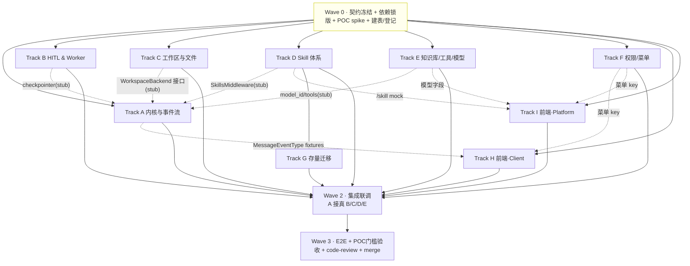

# Tasks: 灵思任务模式 · deepagents 适配层（F035）— 多人并行开发拆分

**关联**: [spec.md](./spec.md)（AC 收口） · [design.md](./design.md)（设计真相，§1–§9 终稿修订已内联） · [契约约定](./依赖与契约约定.md) · [PRD](../../../docs/PRD/2.6%20灵思%20deepagents%20迁移%20PRD/灵思%20Linsight%20迁移%20deepagents%20框架%20PRD.md)（需求真相）
**版本**: v2.6.0

---

## 状态

| 步骤 | 状态 | 备注 |
|------|------|------|
| spec.md | ✅ 已评审 | 薄 spec：AC-1..8 收口，需求真相在 docs/PRD 的 PRD |
| design.md | ✅ 已评审 | 接手第一入口（原《技术方案》改名）；2026-06-11 评审问题已修复（task_id 约定/park 终止/resume 优先级/残留清理） |
| 契约冻结（Wave 0） | 🔄 进行中 | C1–C7 + 依赖已冻结（2026-06-11）；建表迁移已过；stub/mock/fixtures 入库；**仅 POC（T0-2）待收尾**，不阻塞分配 |
| 实现 | 🔄 进行中 | **D/G 已完成**（2026-06-12）；**Track A 内核已落地**（`agent_factory.create_deep_agent` + `task_exec` astream/`StreamEventMapper` 已接，2026-06-15 核对确认，原"其余待开工"表述过时）；Track J（统一会话模型）已起：TJ-1 完成 |

---

## 0. 拆分总览：9 条 Track（可分配给 5–6 人）

> 拆分原则：**按「契约边界」切，不按「文件」切**。每个 Track 对外只暴露一个稳定契约（API/接口/事件协议），内部实现自治。契约在 Wave 0 冻结后，各 Track 用对方的 **stub/mock** 并行开发，集成期换真。

| Track | 名称 | 一句话职责 | 建议归属 | 主交付物 |
|---|---|---|---|---|
| **0** | 地基 / Lead | 冻结契约、引依赖、POC spike、建表、登记 release-contract | Lead（+1） | 契约文档、依赖锁版、表/迁移、共享 fixtures |
| **A** | 内核与事件流 | `create_deep_agent` 装配 + `StreamEventMapper`（stream→`MessageEventType`） | 后端·核心 | 内核装配、事件归一层、call_reason、历史压缩 |
| **B** | HITL & Worker | park-and-release + Redis checkpointer + 重新入队 + park 期终止收口 + 排队位次 | 后端·运行时 | worker 改造、checkpointer 装配、续跑链路 |
| **C** | 工作区与文件 | `WorkspaceBackend`（MinIO 真相+写穿缓存）+ 附件 + 代码产出捕获 | 后端·存储 | WorkspaceBackend、附件摄入、指针块、E2B copy-in/out |
| **D** | Skill 体系 | Skill 磁盘存储 + 双中间件 + CRUD API/Service/Repo | 后端·Skill | `/skill` API、SkillsMiddleware、`linsight_skill` 表 |
| **E** | 知识库/工具/模型 | 方案 B `SearchKnowledgeBase` + 工具包装 + 模型选择注入 | 后端·集成 | 知识库工具、模型注入、移除旧执行模式配置 |
| **F** | 权限/菜单 | 任务模式菜单权限（首页子开关+回填）+ Skill 多租户隔离 | 后端·权限 | 菜单权限、路由收口、回填脚本 |
| **G** | 存量迁移 | `linsight_sop` → Skill 一次性脚本 + 对账报告 | 后端（D 之后） | 迁移脚本、对账报告 |
| **H** | 前端·Client 执行视图 | 输入区 + 执行视图状态机 + 步骤流 + 追问卡 + 产物区 | 前端·client | client app 全部任务模式 UI |
| **I** | 前端·Platform | Skill 管理页 + 模型配置 + 角色编辑器「任务模式」 | 前端·platform | platform app 管理类 UI |
| **J** | 统一会话模型 | 任务模式收敛为日常会话(15)内的逐轮标记：统一提交入口 + `ChatMessage` 双写 + 单消息流渲染 + 路由收敛 | 后端·会话 + 前端·client | 统一提交端点、会话历史查询、单流渲染 |

---

## 1. 契约冻结（Wave 0）★ 并行的命门

> **这是「约定」章**。Wave 0 必须由 Lead 牵头、相关 Track owner 参与，**先把下列 7 个契约的字段/签名定死并文档化**，之后各 Track 才能解耦并行。契约一旦冻结，变更须走「契约变更评审」（见 §5）。

### C1 · WebSocket 事件协议（A 产出 → H 消费）
- **不变量**：前端消费的 `MessageEventType`（10 枚举，`state_message_manager.py`）**不新增类型**。新内核的步骤/子图/genUI/追问全部映射进既有类型。
- **冻结物**：每个 `MessageEventType` 的 `data` JSON schema（尤其 `task_execute_step` 的 `step_type`/`call_reason`/`call_id`/`status`/嵌套 `namespace`/`extra_info.file_info`；`user_input` 追问卡的 `tool_calls.args` 字段）。
- **交付**：A 在 Wave 0 末产出一组**录制的 `MessageEventType` fixtures**（JSON），H 拿它直接渲染、A 拿它写映射断言。**双方都对着 fixtures 编程，不互相等。**

### C2 · WorkspaceBackend 接口 + 布局（C 产出 → A/B/H 消费）
- **接口**：`read(path,offset,limit) / write(path,content) / ls(prefix) / edit(path,...)`（注入 `create_deep_agent(backend=...)`）。
- **MinIO 布局**：`workspace/{svid}/{uploads/<name>/index.md, output/, scratch/}`；大/二进制 → 指针清单 `manifest`。
- **指针块格式**：`<uploaded_files>`（path/name/lines/images），零正文。
- **代码产出契约**：E2B `run` 结果**枚举本次新增/改动文件**（path+size）的字段格式（H 据此做产物溯源/「任务下所有文件」）。
- **交付**：C 在 Wave 0 末给出接口签名 + `FakeWorkspaceBackend`（内存实现），A/B 用它跑通装配与 E2B 摄入。

### C3 · Skill API + 激活 + frontmatter（D 产出 → A/I 消费）
- **API**：`/api/v1/linsight/skill`（GET 列表/详情、POST 上传/新建、PUT 编辑、DELETE、PATCH 启停），`PageData[T]` 分页，鉴权 `get_tenant_admin_user`。
- **激活契约**：per-run 白名单经 `config.configurable.active_skills=[names]`（`[]`=全禁，前端不下发 `None`）。
- **frontmatter spec**：`name≤64 [a-z0-9-]` / `description≤1024` / `allowed-tools?`；文件 ≤10MB。
- **交付**：D 给出 OpenAPI schema + 一份 mock 响应，I 用 mock 开发管理页。

### C4 · 模型注入（E 产出 → A/I 消费）
- **注入键**：`config.configurable.model_id`（缺省取「灵思默认模型」）。
- **配置字段**：工作台对话模型新增按租户单选「灵思默认模型」标记；移除「灵思任务执行模型」配置区。
- **交付**：E 给出字段名 + 读取/写入接口；A 用它取 model，I 用它渲染管理端单选 + 用户端选择器。

### C5 · checkpointer / 续跑契约（B 产出 → A/端点 消费）
- **约定**：`thread_id = session_version_id`；Redis checkpointer（`langgraph-checkpoint-redis`）连接复用 `RedisManager`。
- **续跑入队**：`/workbench/user-input` 成功后 **`lpush` 队头**（resume 优先于新任务）的 **payload 格式** + worker 拾取时「续跑 vs 新任务」判定字段 + 非终态校验 + `Command(resume=...)` 取值来源（最近一次 user_input 事件）。
- **交付**：B 给出 checkpointer 装配函数签名 + queue payload 格式；A 用 `InMemorySaver` 先行，集成换 Redis。

### C6 · 菜单权限 + 路由守卫（F 产出 → H/I 消费）
- **约定**：「任务模式」菜单 key（首页子项）；无权限时入口隐藏 + `/linsight` 路由拦截（走既有菜单拦截，不手写 403）。
- **交付**：F 给出菜单 key 常量 + 权限查询接口；H 做路由守卫、I 做角色编辑器开关。

### C7 · 数据与错误码（D/Lead 产出 → 全体读）
- `linsight_skill` 表 DDL + Alembic revision；错误码段 `110` 段 11050–11069（`common/errcode/linsight.py`）。
- **release-contract 登记 F035**：领域对象 `LinsightSkill`、错误码段、新表（**Wave 0 必须先登记**，表1规则）。

---

## 2. 依赖关系图（Track 级）

**解读**：Wave 0 之后，**8 条 Track 全部可并行**（虚线=「用对方 stub/mock 解耦」，不是「等对方做完」）。只有 **G 依赖 D 的存储格式**必须晚启。集成（Wave 2）才把 stub 换真。

---

## 3. Wave 编排

| Wave | 内容 | 参与 | 退出条件 |
|---|---|---|---|
| **0** | 契约冻结（§1 C1–C7）+ 依赖锁版（deepagents/langgraph/checkpointer-redis）+ **POC spike**（§7）+ `linsight_skill` 建表 + release-contract 登记 + 各 Track stub/mock 与 fixtures | Lead + 各 owner 各 0.5 人日 | 7 契约文档化 + fixtures/stub 可用 + POC 5 项有结论 |
| **1** | A/B/C/D/E/F/H/I **并行**实现（对 stub/mock 编程）；各自单测/手动验证绿 | 全员 | 各 Track 单元级 DoD 达成 |
| **2** | 集成联调：A 接真 C/D/E/B；前后端联调 WS；G 启动（D 稳定后） | 全员轮值 | 端到端「提交→规划→工具→产物→完成」打通 |
| **3** | `/e2e-test` + POC门槛（命中率/续跑保真）+ `/code-review` + DM8/多租户回归 + merge | Lead + QA | AC-1..8 通过 |

---

## 4. 并行解耦约定（stub/mock 清单）★

> 让任何 Track 在依赖未就绪时也能开发到「单元级绿」。

| Track | 用到的外部依赖 | Wave 1 期间用什么顶替 |
|---|---|---|
| A 内核 | WorkspaceBackend / checkpointer / SkillsMiddleware / model | `FakeWorkspaceBackend`（C 提供）、`InMemorySaver`、stub skills 目录、固定 model | 
| A 事件流 | 真实 LangGraph 流 | **录制的 astream chunk fixtures**（POC spike 录一组），离线驱动 `StreamEventMapper` |
| B Worker | 真 graph | 一个「假 graph」：astream 几个 chunk 后 `interrupt()`，验证 release→入队→resume 闭环 |
| C 工作区 | E2B / MinIO | 本地 MinIO（CI）+ `FakeSandbox`（返回固定 scan_tree） |
| D Skill | 真前端 | 用 curl/pytest 打 `/skill`；middleware 用本地 SKILLS_ROOT 临时目录 |
| E 知识库 | 真 KnowledgeService | 复用既有；模型字段先写默认值 |
| H 前端 | 真 WS/后端 | **WS mock 回放 C1 fixtures**；`/skill`、提交接口用 MSW mock |
| I 前端 | 真 `/skill`/模型接口 | C3 mock + C4 字段 mock |
| G 迁移 | 真 Skill 存储 | D 的 `SkillRepository` 写盘接口（D 稳定后） |

**共享 fixtures（Lead 维护，放 `test/linsight/fixtures/`）**：① 一组 LangGraph astream chunk（含 tool/thinking/子图/interrupt/终态）；② 由 ① 经 `StreamEventMapper` 产出的 `MessageEventType` JSON（A 与 H 共用的「同一份真相」）。

---

## 5. 分支与协作约定

- **基线分支**：`feat/2.6.0/035-linsight-task-mode`（docs + 契约先落此分支）。
- **Track 分支**：`feat/2.6.0/035-<track>`（如 `035-trackA-kernel`），PR 合入基线；基线每日/每 Wave 滚动集成。
- **代码 ownership（防冲突，按目录切）**：

  | Track | 独占目录 |
  |---|---|
  | A | `linsight/domain/services/{agent_factory,stream_event_mapper}.py` |
  | B | `linsight/worker.py`、`linsight/domain/services/{checkpointer,segment_runner}.py`、`/workbench/user-input` 端点 |
  | C | `linsight/domain/services/workspace_backend.py`、`workbench_impl.py`（附件/解析部分）、`e2b_executor.py` 摄入改造 |
  | D | `linsight/domain/services/{skill_store,skill_middleware}.py`、`linsight/api/endpoints/skill.py`、`models/linsight_skill.py` |
  | E | `tool/domain/langchain/linsight_knowledge.py`、`llm` 模型字段、`_get_llm` |
  | F | `permission`/角色菜单、回填脚本 |
  | G | `scripts/migrate_sop_to_skill.py` |
  | H | `src/frontend/client/**`（任务模式相关） |
  | I | `src/frontend/platform/**`（Skill 管理页/模型配置/角色编辑器） |

  **共享热点文件**（`task_exec.py`、`state_message_manager.py`）：A 主改，B/C 经 A 协调或拆出新文件，避免同文件并发改。
- **契约变更评审**：任何对 §1 C1–C7 的改动，发起者在基线分支提「契约变更」PR + @ 所有消费方 owner，合并后消费方同步。

---

## 6. 各 Track 任务清单

> 格式：`[ ] T<Track><NN>` · **文件** · **逻辑** · **依赖** · **DoD**。设计论证见 design.md §X，不复制。

### Track 0 · 地基（Lead）
- [ ] **T0-1** 引入依赖锁版：`deepagents>=0.6.3`、`langgraph>=1.0`、`langgraph-checkpoint-redis`。**DoD**：`uv sync --frozen` 通过。
- [ ] **T0-2** POC spike（§7 五项），产出结论 + astream/MessageEventType **共享 fixtures**。**DoD**：5 项有红/绿结论，fixtures 入库。
- [ ] **T0-3** `linsight_skill` 表 + Alembic revision（带 `tenant_id`，DM8 复核）。**DoD**：`alembic upgrade head` 通过。
- [ ] **T0-4** release-contract 登记 F035（领域对象/错误码段/表）。**DoD**：表1/表3/已分配编码更新。
- [ ] **T0-5** 冻结 C1–C7 契约文档（本 tasks §1 充实为可编程签名）。**DoD**：各 owner 签字。

### Track A · 内核与事件流
- [ ] **TA-1**(测试) `StreamEventMapper` 单测：对 fixtures chunk 断言 `MessageEventType` 输出（todo/工具/thinking/子图/检索/interrupt/终态）。**依赖** T0-2。**覆盖** AC-1。
- [ ] **TA-2** `stream_event_mapper.py` 实现（chunk→`BaseEvent`→既有 `_handle_event`，按 `call_id` 合并、`namespace` 子图归并、**todo→`task_id` 稳定性投影**（design §3.3.1：`md5(svid+content)[:8]` 生成 + 三级 diff 对齐 + `ExecStep.task_id`=当前 in_progress todo、无则=svid）、终态收口）。**依赖** TA-1。
- [ ] **TA-3** `agent_factory.py`：`create_deep_agent` 装配（model/tools/backend/checkpointer/middlewares），`call_reason` schema 注入 + 历史压缩中间件。**依赖** C2/C3/C4/C5 stub。
- [ ] **TA-4** `_execute_workflow`/`_execute_agent_tasks` 改 `astream(stream_mode=[updates,messages,values], subgraphs=True)`。**依赖** TA-2/TA-3。**DoD**：用 stub 跑通端到端 fixtures。

### Track B · HITL & Worker（park-and-release）
- [ ] **TB-1**(测试) park-and-release 闭环测：假 graph interrupt → 释放 slot → 重新入队 → 异地 resume，断言 checkpointer 续跑保真。**依赖** T0-2。**覆盖** AC-5。
- [ ] **TB-2** `checkpointer.py`：`AsyncRedisSaver` 装配（thread_id=svid，复用 RedisManager）。**依赖** C5。
- [ ] **TB-3** worker 改造：interrupt 释放 semaphore + `release_task_ownership` + 退出循环；删 `_wait_for_input_completion` 轮询。**依赖** TB-2。
- [ ] **TB-4** `/workbench/user-input` 追加「重新入队」（**`lpush` 队头**，resume 优先于新任务）+ worker 拾取识别续跑（`Command(resume)`，拾取前**非终态校验**、终态项丢弃）+ **park 期终止收口**（终止端点直接置终态 + push `task_terminated` 末帧 + 删 thread checkpoint，**不经 worker**；执行期终止沿用既有 `_check_termination` 监控，design §4.6/§4.7）。**依赖** TB-3。**DoD**：TB-1 绿，重启不丢；park 期终止后任务不被复活。
- [ ] **TB-5** 排队位次语义复核（FR-3.15 后端侧）：`lpush` 队头插队后 `get_queue_status`/`LinsightQueue.index` 的位次含义（resume 项是否计入他人位次、口径统一）+ 取消排队（`queue.remove`）沿用校验。**依赖** TB-4。**DoD**：位次口径写入契约 C1 旁注供 H 消费。

### Track C · 工作区与文件
- [ ] **TC-1**(测试) `WorkspaceBackend` 单测：write 写穿、read 分页/懒加载、ls 以 MinIO 为准、多租户隔离。**覆盖** AC-6。
- [ ] **TC-2** `workspace_backend.py` 实现（MinIO 真相 + file_dir 写穿缓存）+ `FakeWorkspaceBackend`（**Wave 0 即交付给 A/B**）。**依赖** C2。
- [ ] **TC-3** 附件摄入：解析 markdown→MinIO，物化指针块 `<uploaded_files>`，含图文档（base64 图片）。**依赖** TC-2。
- [ ] **TC-4** 代码产出捕获：E2B copy-in（≤阈值自动 delta push + 大文件经 code 工具入参 `required_files` 声明、worker 中转流式写入；**沙箱不可达 MinIO，禁用 presigned 自取**）+ copy-out（全树扫描→按 `SIZE_INLINE` 分流→backend）+ `run` 结果枚举新文件 + FileNotFoundError 兜底提示 + `output/`vs`scratch/` 分类。**依赖** TC-2。**DoD**：脚本产出可被 `ls`/`read` 看见、产物 promote MinIO；声明大文件可在沙箱内读到。
- [ ] **TC-5** 文件跨 version 复用幂等（会话级记忆的**唯一后端改动**，design §9.3.8/§9.4 #11）：`_process_submitted_files` 幂等化——同会话同 `file_id` 再提交时复用正式桶产物、跳过「临时桶→正式桶」复制；临时元数据过期（24h）且无正式产物 → 判失效、返回失效标记供前端提示重传（不静默丢弃）。**依赖** TC-3。**覆盖** FR-1.8（文件记忆有效期）。

### Track D · Skill 体系
- [x] **TD-1** `models/linsight_skill.py`（+`display_name` 列，新 alembic revision，偏差 D6）+ DAO（依赖 T0-3）。
- [x] **TD-2** 错误码 11050–11069（`common/errcode/linsight.py`，Wave 0 已落 11051–11055，核对即可）。
- [x] **TD-3**(测试) `SkillService` 单测：CRUD、name/display_name 双重名校验、frontmatter 校验、bundle 解包/防穿越、租户隔离。
- [x] **TD-4** `skill_store.py`（磁盘 SKILLS_ROOT 配置化 + bundle 落盘 + 拼音 slugify，元数据 DB）+ `skill_middleware.py`（白名单为 SkillsMiddleware **子类**实现，偏差 D8）。**依赖** TD-1。
- [x] **TD-5**(测试) `/skill` API 集成测（含 `/skill/{name}/file`、multipart .md/.zip、built-in 404）。
- [x] **TD-6** `api/endpoints/skill.py` + router 注册（鉴权 `get_tenant_admin_user`；`/selectable` 用 `get_login_user`）。**依赖** TD-4/TD-5。**DoD**：C3 契约（2026-06-12 增量版）可用，给 I mock 对齐。

### Track E · 知识库/工具/模型
- [ ] **TE-1** `SearchKnowledgeBase` 包成 `BaseTool`（方案 B），ReBAC 代用户过滤（对齐 INV-7）。**覆盖** FR-3.5。
- [ ] **TE-2** 工具包装（工作台预设 + 代码解释器）为 deepagents tools。
- [ ] **TE-3** 模型注入：`_get_llm` 按 `config.configurable.model_id`；新增「灵思默认模型」字段读写；移除 `linsight_executor_mode` 分支。**依赖** C4。**DoD**：A 取得正确 model。

### Track F · 权限/菜单
- [ ] **TF-1** 「任务模式」菜单子项（首页下）+ 父子联动孤儿清理 + 路由/入口双收口（不手写 403）。**覆盖** FR-7.8/7.9/7.10。
- [ ] **TF-2** 存量角色回填脚本（`scripts/`，给「可进工作台」角色补「任务模式」）。**覆盖** FR-7.11。
- [ ] **TF-3** Skill 多租户隔离校验（`linsight_skill.tenant_id` + 跨租户不展示）。**覆盖** AC-7。

### Track G · 存量迁移（D 之后）
- [x] **TG-1** `scripts/migrate_sop_to_skill.py`：遍历 `linsight_sop`→`linsight_skill`+磁盘 SKILL.md（display_name=原名、name=拼音 slug、metadata.sop-id 溯源），幂等可重入，dry-run 默认/`--apply` 写入。**依赖** TD-4。
- [x] **TG-2** 迁移摘要输出（stdout + JSON 文件：成功/失败/跳过+原因；**运维产物，无管理页报告**，偏差 D7）。**覆盖** AC-4。

### Track H · 前端·Client 执行视图
- [ ] **TH-1** 统一输入区：任务模式 chip + 「+」菜单（技能/知识空间/组织知识库/附件）+ 工具栏 + 模型选择器 + 提交前一览 + **显式开关与会话级记忆**（取消「收到消息自动退出」，仅 chip「×」退出；退出时技能即清、文件/知识库/工具会话内保留、再进回填；文件 chip 失效标记联动 TC-5，design §9.3.8）。**对** C1/C3/C4。**覆盖** FR-1.x（含 FR-1.8）/2.x。
- [ ] **TH-2** 执行视图状态机 + 步骤流渲染（消费 C1 fixtures：todo/工具/thinking/子任务/检索/产物/genUI 注册表）。**覆盖** FR-3.x。
- [ ] **TH-3** HITL 追问卡（从 `tool_calls.args` 渲染，单点定向隔离）。**覆盖** FR-4.x。
- [ ] **TH-4** 产物区（预览/下载/打包/复制/溯源/查看所有文件）+ 路由守卫（C6）。**覆盖** FR-3.8/3.18。
- [ ] **TH-5** 排队态（FR-3.15 前端侧）：「排队中」全局状态 + 排队文案 + 位次展示（轮询 `get_queue_status`，口径取 TB-5）+ 取消排队入口 + 离开页面保留位次、轮到自动转「规划中」。**依赖** TB-5（位次口径）。**覆盖** FR-3.15（P0）。
  **手动验证**：WS mock 回放 fixtures → 全流程 UI 正确；断连重连恢复；排队态→规划中切换正确。

### Track I · 前端·Platform
- [x] **TI-1** Skill 管理页（列表/搜索/Preview·Source/上传·新建/编辑/删除/启停/校验/空态）。**对** C3 mock。**覆盖** FR-5.x。
  ↳ 2026-06-12 由 D/G owner 代完成（用户授权越界）：`components/LinSight/skill/{SkillManagement,SkillFormDrawer,SkillUploadDialog,SkillDetailSheet}.tsx` + `skillApi`；列表仅展示 display_name（FR-5.1）、bundle 文件树详情（FR-5.14）、上传 .md/.zip/.skill（**文件夹上传暂缓**：需引入 jszip 前端打包，留 Track I 后续）、技能 ID 自动拼音走后端 `GET /skill/slugify`（新增 helper，复用 slugify_pinyin）。
- [x] **TI-4**（新增，PRD §4.8 / FR-8.x，偏差 D9）工作台配置「灵思」tab 并入「日常」：移除灵思 tab（`DialogueWork.tsx`）；「任务模式展示名称/任务模式输入框提示语」并入日常 tab（读写 `workstation/config/linsight` 的 `tab_display_name/input_placeholder`，`linsight_entry/tools` 字段原样回写不丢）；技能管理区挂首页 tab「推荐应用」上方。**2026-06-12 二次调整（用户确认）**：「日常」tab 更名「首页」（bench.home）；移除「日常模式展示名称」配置项（值仍随保存原样回写）；新增「应用」tab（`AppCenter.tsx`）承载「应用中心欢迎语/描述」（仍写 daily 配置，整包 round-trip）。`LingSiWork.tsx` 成为死代码，随 AC-8 SOP 链路下线一并清理。
- [ ] **TI-2** 模型配置：工作台对话模型行「灵思默认模型」单选；移除「灵思任务执行模型」区。**对** C4。**覆盖** §4.1.10。
- [ ] **TI-3** 角色编辑器「工作台菜单→首页→任务模式」开关。**对** C6。**覆盖** FR-7.8。

### Track J · 统一会话模型（任务模式收敛 · 设计见 [跨模式会话上下文共享设计](./跨模式会话上下文共享设计.md)）

> 目标：会话层不再有「任务模式」概念。一条日常工作台会话（`flow_type=WORKSTATION=15`，一个 `chat_id`）承载普通轮与任务轮，任务模式降级为**逐轮处理标记**。普通轮与任务轮共享同一份 `chat_id` 下的 `ChatMessage` 历史（问答上下文双向共享、均喂模型，D2）。与 §9.3.8 的「文件/知识库/工具选择态记忆」正交，不冲突。**存量 `flow_type=20` 会话不迁移**（D3），按旧只读形态保留。**依赖 Track A 内核与事件流就绪**（任务执行链不变，仅改入口装配与落库）。

**契约前置（并入 Wave 0 或集成前冻结）**：统一提交入口请求体 `{chat_id, question, task_mode:bool, tools?, model?, files?, skills?}` + 任务轮 `ChatMessage` 字段约定（`category='task'`、`extra={linsight_session_version_id}`）须登记到 [依赖与契约约定](./依赖与契约约定.md) 并在 release-contract 备案（C7）。

- [x] **TJ-1**(测试) 会话历史查询契约测（读侧字段映射）：`test/workstation/test_task_turn_message_mapping.py` —— 断言 `WorkstationMessage.from_chat_message` 对任务轮（`category='task'`、`extra.linsight_session_version_id`）暴露 `category='task'` + `linsightSessionVersionId`，普通轮二者皆空。**已落** `WorkstationMessage` 新增 `category`/`linsightSessionVersionId` 字段（2026-06-15，RED→GREEN，零回归）。**覆盖** 设计 §11.2 / C8 读侧契约。
  > 列表的时间序/分页/多租户隔离沿用既有 `aget_messages_by_chat_id` + `GET /chat/messages/{conversationId}`，无需新代码，待 TJ-4 端点联调时补集成验证。
- [~] **TJ-2** 统一提交入口 + `task_mode` 逐轮分流（后端）：单一提交端点按 `task_mode` 路由——true→linsight deepagents 内核，false→工作台(15)日常链。`linsight/.../workbench_impl.py:submit_user_question` 改为**接收外部 `chat_id`（已存在的 15 会话）、不自建 `flow_type=20` 会话、不决定 flow_type**。**依赖** Track A（**已确认就绪**：agent_factory/create_deep_agent + task_exec astream）。**覆盖** 设计 §3.1 / P0。
  - [x] **已落（2026-06-15）**：`submit_user_question` 不再 mint `flow_type=20`——传 `session_id` 复用既有会话（任意 flow_type，含日常 15）；无 `session_id` 时按 **D1=B** 决策新建 **`flow_type=WORKSTATION=15`** 会话（对齐 `workstation/chat_service`：flow_type/telemetry app_type=DAILY_CHAT）。测试 `test/linsight/test_unified_submit_session.py`（RED→GREEN，零回归；linsight 套件既有 2 个 hitl_worker 失败与本改动无关，已 stash 对比确认）。
  - [ ] **待接**：统一提交端点的 `task_mode` 分流装配（true→linsight 内核 / false→日常链）——与前端 TJ-6 单入口一起联调；端点位置见设计 §3.1。
- [~] **TJ-3** 任务轮双写 `ChatMessage`（后端）：用户轮先落库；任务执行完成回写 bot `ChatMessage`（`message=output_result.answer`、`category='task'`、`extra={linsight_session_version_id}`）；失败/进行中落占位态、HITL 等待恢复后回填**同一行**（沿用 design §4 park-and-release）；`linsight_session_version`/`ExecuteTask` 保持不变，退位为「某条 bot 消息的执行详情附属」。**依赖** TJ-2。**覆盖** 设计 §2.2 / §6 / P1。
  - [x] **已落（2026-06-15）**：`utils.persist_task_turn_message`（bot 任务轮，`category='task'`+`extra={SV}`）接入 `task_exec._handle_task_success` 与 `_handle_direct_answer_completion`；`utils.persist_task_user_turn`（用户轮，`category='question'`，镜像日常 `{query,files}` envelope）接入 `submit_user_question`。测试 `test/linsight/test_unified_task_turn_write.py`（3 例）+ `test_unified_submit_session.py`（用户轮）；RED→GREEN，165 passed 零回归（含 `test_e2e_abc` 完成路径）。
  - [x] **失败占位已落（2026-06-15）**：`_handle_task_failure` 也写 bot 任务轮；`persist_task_turn_message` 无 `answer` 时回退 `error_message`，会话不留悬空问。测试 `test_failed_task_turn_falls_back_to_error_message`。
  - [ ] **待补**：进行中占位（运行中先落占位行）；HITL 等待恢复回填同一行；用户轮 files envelope（当前仅写 question，files 留空，文件信息仍在 SV 上）。
- [~] **TJ-4** 会话历史查询端点（后端，两段式）：列表走 `ChatMessageDao.get_messages_by_chat_id`（轻量，仅带 `extra.SV` 指针，不含任务详情）；执行详情端点按 `session_version_id` 返回 tasks/sop/steps/files 供懒加载。**依赖** TJ-3。**覆盖** 设计 §11.2。
  - [x] **已用现有端点闭环（2026-06-15，符合设计 §11.2「详情复用既有」意图，无需新端点）**：列表 = `GET /chat/messages/{conversationId}`（`chat_session/api/endpoints/session.py:33`，经 `WorkstationMessage.from_chat_message` 已带 `category`/`linsightSessionVersionId`，TJ-1 落）；详情 = `GET /workbench/execute-task-detail?session_version_id=`（tasks/steps）+ `GET /workbench/session-version-list?session_id=`（sop/output_result/files），均带属主+分享链鉴权。
  - [ ] **待决（安全缺口，非本次引入）**：列表端点 `GET /chat/messages/{conversationId}` 仅校验登录、**未校验会话归属**（任意登录用户猜 chat_id 可读他人会话）。该端点为日常聊天共用、且涉及分享链/管理员路径，加固属跨场景改动——需与用户确认是否在 TJ-4 内硬化（C4 多租户/越权）还是单列。详情端点已有属主校验，无此问题。
- [~] **TJ-5** 历史注入改 `chat_id` 维度（后端）：`_get_history_summary` 由 `session_version_id` 维度改为按 `chat_id` 读 `ChatMessage`（普通轮 + 任务轮答案）→ 归一文本注入既有 `history_summary` 通道；日常链注入同理读 `ChatMessage`（含任务轮答案）；token 裁剪复用 design §3.8。**依赖** TJ-3。**覆盖** 设计 §3.2 / D2 / P2。
  - [x] **已落（2026-06-15）**：`utils.build_prior_conversation_summary(chat_id)` 按 `chat_id` 读 `ChatMessage`、配对"问题→其后回答"（普通轮+任务轮）成前情文本，**只配对已完成 Q/A → 天然排除当前未答轮**（不重复当前问题）；接入 fresh 执行路径 `task_exec._build_agent_input`（前情置于 question 之前）。测试 `test/linsight/test_unified_history_summary.py`（3 例）；168 passed 零回归（含 e2e_abc）。
  - [x] **日常链对称已落（2026-06-15，D2）**：`MessageCategory.TASK='task'` 新增；`WorkStationService.get_chat_history` 白名单纳入 `task` 并渲染为 `AIMessage` —— 日常链续聊能看到任务轮答案。测试 `test/workstation/test_unified_daily_history.py`。
  - [x] **token 裁剪已落（2026-06-15）**：`build_prior_conversation_summary(chat_id, max_chars=8000)` 配对成块、保留最近、按字符预算从旧到新截断。测试 `test_summary_keeps_most_recent_within_char_budget`。
  - [ ] **暂缓（依赖/风险，待前端或具体需求再做）**：① `_continue_workflow` 续聊路径注入——其 checkpointer 已含本 session_version 历史，注入 chat_id 摘要会**重复本会话任务轮**，需先做"排除本 session 自身轮"去重；且统一模型是否仍用 continue（vs 每轮新 submit）取决于前端 TJ-6。
- [ ] **TJ-6** 单入口 + 逐轮 `task_mode` 本地态（前端·client）：`components/Chat/AiChatInput.tsx:477-478` 任务模式入口由 `navigate('/linsight/new')` 改为**仅切输入框本地态**（不导航、不换会话）；提交时把 `task_mode` 随这一轮发出。**依赖** TJ-2。**覆盖** 设计 §4.1 / P0。
- [ ] **TJ-7** 单消息流渲染（前端·client）：统一消息列表按 `is_bot`+`category` 分发——普通轮复用 `components/Chat/Messages`；任务轮 = 答案气泡 + 折叠富面板入口，展开按 `extra.SV` 懒加载并复用 `components/Linsight/Execution/*`（只读形态）；`linsightMapState` 降级为「当前/展开中任务轮执行态缓存」，会话真相回归日常消息 store。**依赖** TJ-4。**覆盖** 设计 §4.2 / §11.3 / P1。
  **手动验证**：同一会话内开/关任务模式连续多轮 → 消息流时间序正确、任务轮可展开富面板、普通轮能看到前面任务轮答案；刷新后历史完整回显。
- [ ] **TJ-8** 路由/侧边栏收敛（前端·client）：新会话不再产生 `/linsight` 独立路由项；`hooks/Conversations/useNavigateToConvo.tsx:62-69` 的 `flowType===20` 分支**仅对存量只读会话保留**，新会话走统一日常会话路由。**依赖** TJ-7。**覆盖** 设计 §4.3 / P3。

> **不做**：存量 `flow_type=20` 会话迁移脚本（D3 不迁移）；新增 group/origin 锚点（统一模型下无需）。

---

## 7. POC 必验门槛（Wave 0 spike，阻塞设计成立）

| # | 验证 | 关联 Track | 失败影响 |
|---|---|---|---|
| P1 | deepagents 允许注入自定义 `FilesystemBackend`（替代 virtual_mode），E2B 产出可经其写入 | C/A | 工作区模型不成立，退 MinIO 物化备选 |
| P2 | `subgraphs=True` 子图事件冒泡父 astream + 并行 namespace 不串流 | A | 子任务步骤流降级 |
| P3 | Redis checkpointer park-and-release 隔任意时长 + 跨重启续跑保真（R3） | B | HITL 续跑降级 FAILED+retry |
| P4 | 中文模型 `call_reason` 填写遵从率 + Skill progressive disclosure 命中率≥95%（R1，基线模型） | A/D | 步骤可读性/技能命中降级 |
| P5 | 中文模型对 code 工具 `required_files` 入参的声明遵从率 + FileNotFoundError 提示后补声明的修复成功率 | C/A | 大文件改无条件全量 push（牺牲 copy-in 耗时） |

---

## 8. 实际偏差记录

> 只留一行指针，论证在 design.md（决策/坑）。推翻 ★ 决策先停下与用户确认。

- **D1（Python 3.11 升级）**：deepagents 全版本要求 Python ≥3.11，后端原锁 3.10.x。经用户确认升级后端到 3.11：`requires-python>=3.11`、ruff `target-version=py311`、重建 3.11 venv。**连带**：`cchardet 2.1.7` 在 3.11 编译失败（`longintrepr.h` 移除）→ 换 `faust-cchardet`（同 `import cchardet`）。**待人工跟进**：Docker 基础镜像（`base.v8`，py3.10）重建为 3.11 + `dmPython`/`dmssl` 3.11 验证、`Dockerfile` `DM_HOME` 路径、CI 镜像、全量测试回归。design 未记录该前置，已补此偏差。
- **D2（Skill 重名错误码 11050→11055）**：契约原定 11050=重名，但 11050 已被存量 `LinsightVectorModelError`（SOP 检索链路，§8.6 计划下线）占用；Track 0 不删在用码，故重名顺延 11055（段内未占用槽位）。新码：11051/11052/11053/11054/11055。
- **D3（C3 端点 id→name 对齐 design §7.5）**：依赖与契约约定 §4 草案用 `/skill/{id}` + `PATCH .../enabled`；冻结时收敛到 design §7.5 的 `/skill/{name}` + `PATCH .../status` + 新增 `GET /skill/selectable`。mock 已据此产出。
- **D4（C5 Redis checkpointer → 自研 plain-Redis，2026-06-11 决策已落）**：POC P3 实测 `langgraph-checkpoint-redis` 依赖 RediSearch（Redis Stack），现网不支持。经用户决策采用**方案②自研 plain-Redis checkpointer**。实现位置：`bisheng/linsight/domain/services/checkpointer.py`（`PlainRedisCheckpointer` + `make_checkpointer()`，Wave 0 已交付）；`langgraph-checkpoint-redis` 已从 pyproject.toml 移除，uv.lock 已重新锁定。Key schema、TTL、`adelete_thread` 见 C5 契约（§5）。Track B TB-2 直接基于此文件实现 worker 装配。
- **D5（C2 WorkspaceBackend 须实现 deepagents BackendProtocol）**：POC P1 实测真实 backend 协议方法返回 `ReadResult/WriteResult/LsResult/EditResult`（非契约草案的 `bytes|str`），且含 `glob/grep/upload/download`。Track C 实现以 `deepagents.backends.filesystem.FilesystemBackend` 为准；fixtures 的 `FakeWorkspaceBackend` 为概念级 stub。
- **D6（display_name + 技能 ID + bundle，2026-06-12 用户确认，C3 契约变更）**：deepagents 0.6.8 硬校验 frontmatter `name` 仅 `[a-z0-9-]`（中文被拒）且须=目录名 → 新增 `display_name`（DB 列 + `metadata.display-name` + API 字段），前端一律显示展示名称、管理列表不展示技能 ID 与来源；上传支持 .md/.zip/.skill/文件夹（bundle 目录形态，整包≤10MB），新增 `GET /skill/{name}/file` 与 `SkillDetail.files[]`；迁移 slug 用 **pypinyin 转拼音**（新依赖 pypinyin）。消费方 A（active_skills 语义不变）/ I（UI 字段）已在契约 §4 标注。PRD §4.5/§1.4 同步。
- **D7（对账报告降级为脚本运维产物，2026-06-12 用户决策）**：管理页不做迁移提示条/对账报告/待办消除；脚本输出 JSON 摘要（stdout+文件）。PRD §4.6 整改（FR-6.x 收敛 11→9 条）、spec AC-4 改写、design §8.3 改名「迁移摘要结构」。
- **D8（SkillWhitelistMiddleware 以 SkillsMiddleware 子类实现）**：deepagents 0.6.8 无原生白名单钩子（SkillsMiddleware 仅 backend/sources/system_prompt）→ 自研 `TenantSkillsMiddleware(SkillsMiddleware)`，在 `before_agent/abefore_agent` 过滤 `skills_metadata`（built-in 永放行；租户技能按 `config.configurable.active_skills` ∩ DB enabled）。单类实现消除 design §7.2 的双中间件顺序约束（无 GenerativeUIMiddleware 顺序风险），语义与契约 C3 不变。
- **D10（统一会话模型 / 任务模式收敛，2026-06-15 用户新增需求，新增 Track J）**：会话层取消「任务模式」独立概念——任务模式降级为日常工作台会话（`flow_type=WORKSTATION=15`）内的**逐轮处理标记**，普通轮与任务轮共享同一 `chat_id` 的 `ChatMessage` 历史（问答上下文双向共享、均喂模型）。决策已定：会话 flow_type=15（D1）、问答双向共享不与 §9.3.8 冲突（§9.3.8 管选择态记忆、本项管问答内容，正交）、存量 flow_type=20 会话不迁移（D3）、纳入 F035 当前迭代（D4）。设计见 [跨模式会话上下文共享设计.md](./跨模式会话上下文共享设计.md)，任务见 Track J。**跨 Track 影响**：依赖 Track A 内核就绪；与 Track H 输入区（TH-1）协同（任务模式 chip 从「进出独立态」变为「逐轮标记」）；契约前置（统一提交入口 + ChatMessage 双写字段）须登记依赖与契约约定 + release-contract。
- **D9（工作台配置合并，2026-06-12 用户新增需求，PRD 新增 §4.8）**：管理端「灵思」tab 并入「日常」——入口开关移除（TF 菜单权限承接）、展示名称/提示语更名「任务模式」、**「灵思可选工具」配置废弃（任务模式直接共用日常「可用工具」，不做数据迁移）**、指导手册库整体替换为技能管理。**跨 Track 影响**：TI-2 扩为配置页合并（platform UI）、TE 工具来源改读日常配置、TF 不变；Track D 仅承接「技能管理挂载位置」语义，API 不受影响。
