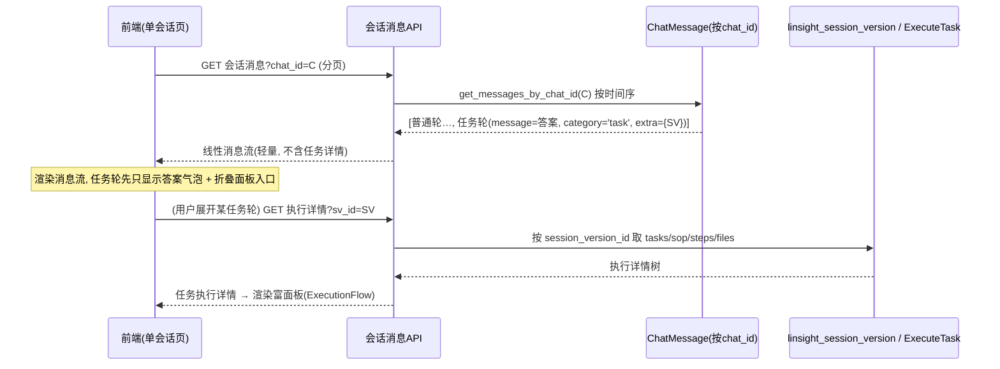
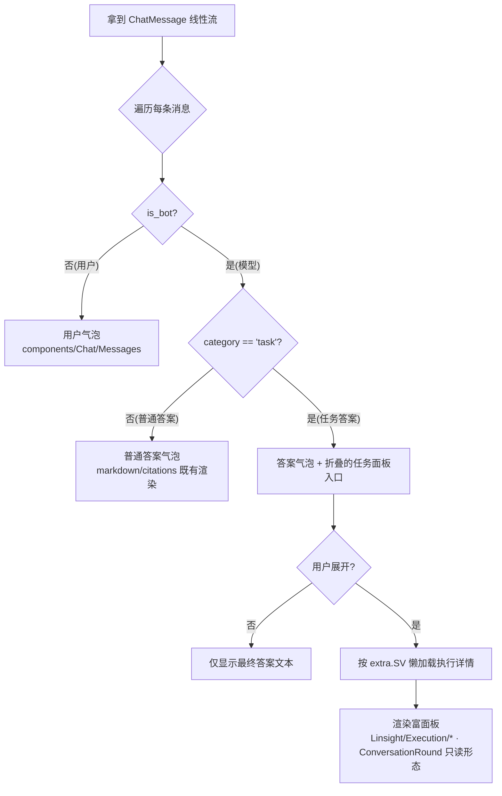
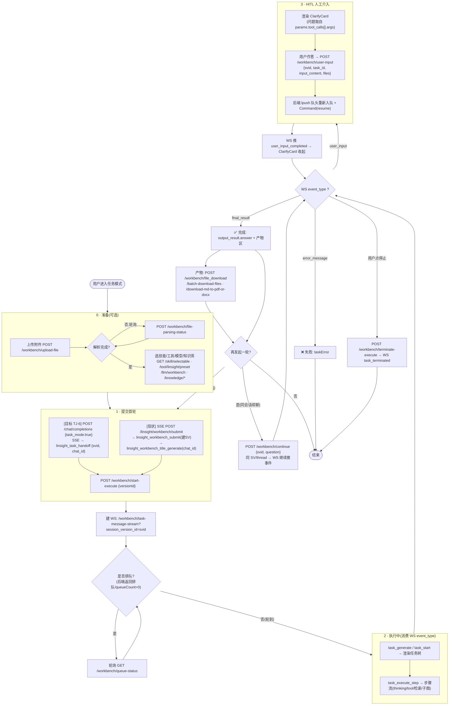
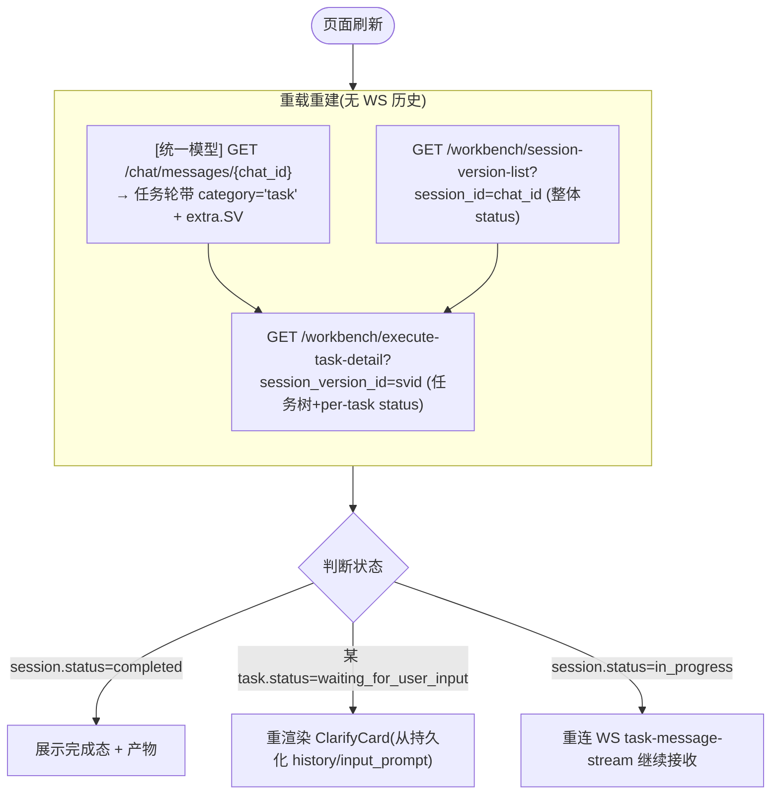

# 设计补充：统一会话模型 —— 任务模式收敛为会话内的「逐轮处理标记」

- 版本：v2.6.0 · 状态：🟢 **纳入 F035 迭代；关键决策已定（D1/D2/D3/D4 见 §8）**
- 关联：[design.md](./design.md) §9.3.8（退出任务模式后 文件/知识库/工具 chip 的持久化记忆——与本文**正交且不冲突**：§9.3.8 管"选择态"持久，本文管"问答内容"共享；在统一模型下两者都自然成立，见 §7）
- 关联 PRD：§4.1.2

> **目标模型（产品定调）**：**会话层不存在"任务模式"这个概念**。前端只有**一个对话入口**；"是否开启任务模式"只是**逐轮**附带的一个标记，只影响**后端如何处理这一轮用户问题**。一轮普通问答、一轮任务执行产生的所有内容，**都属于同一条会话（同一个 `chat_id`）**，构成一条线性消息流。

---

## 1. 关键事实：收敛比想象的近

今天日常与任务"看起来"是两套系统，但底层已经共享一半：

- **linsight 的 `session_id` 本来就是一个 `MessageSession.chat_id`**：[`workbench_impl.py:161`](src/backend/bisheng/linsight/domain/services/workbench_impl.py#L161) `chat_id = submit_obj.session_id or uuid4()`；`:193/:203` `session_id = message_session.chat_id`。即任务模式早已挂在 `MessageSession` 上，只是 `flow_type=20`。
- **`ChatMessage` 字段足够承载任务轮**：`message`（最终答案）、`extra` / `intermediate_steps`（LargeText，可存执行详情指针）、`category`（消息分类）、`files`、`is_bot`。

**今天造成"分裂"的仅两点**，正是要消除的：

| # | 现状 | 目标 |
|---|------|------|
| ① | 任务模式新建 `flow_type=20` 的独立 `MessageSession` → 独立侧边栏项 + 独立 `/linsight` 路由 | 任务轮**不再新建会话**，跑在当前会话的 `chat_id` 上；无独立路由 |
| ② | 任务轮**只写 `linsight_session_version`，不写 `ChatMessage`** | 任务轮**也写 `ChatMessage`**（user + bot 各一行），`extra` 指向 `linsight_session_version_id`；执行详情仍存 linsight 表 |

> **一句话**：把"任务模式 = 一种会话类型(flow_type=20)"降级为"任务模式 = 某一轮的处理路由标记"。`linsight_session_version` / `LinsightExecuteTask` 从"会话"退位为"某条 bot 消息的执行详情附属"。

---

## 2. 统一数据模型

### 2.1 会话 = 一条 `MessageSession`（一个 `chat_id`）

- 一条会话只有一个 `MessageSession` 行，`flow_type` 是**会话级稳定属性**，与"某轮是否走任务模式"**正交**——不再因为开了任务模式就变成 20。
- **会话 `flow_type` = `WORKSTATION`(15)，即日常对话类型（已定 D1）**：日常工作台对话本就是 `FlowType.WORKSTATION=15`（[`flow.py:32`](src/backend/bisheng/database/models/flow.py#L32)，由 [`workstation/chat_service.py`](src/backend/bisheng/workstation/domain/services/chat_service.py#L96) 写库）。开不开任务模式都不改变它——任务模式不再产生 `flow_type=20`，任务轮直接挂在这条 15 会话上。侧边栏图标/筛选/历史归类全部沿用日常会话既有逻辑，零新增。

### 2.2 消息 = 统一 `ChatMessage` 线性流（按 `chat_id`）

每一轮无论模式，都落 `ChatMessage`：

| 字段 | 普通轮 | 任务轮 |
|------|--------|--------|
| `is_bot` | user / bot | user / bot |
| `message` | 文本 | 用户问题 / 最终答案（`output_result.answer`） |
| `category` | 既有分类 | 新增标记 `task`（前端据此渲染富面板） |
| `extra` | 既有 | **`{ linsight_session_version_id }`** —— 指向执行详情 |
| `intermediate_steps` | 既有 | 可选：执行步骤摘要 |

- **执行详情仍存 linsight 表**：tasks / sop / steps / 产物文件继续落 `linsight_session_version` + `LinsightExecuteTask`（键仍是 `chat_id`，无需迁移键）。变化只是：它们从"独立会话内容"变成"被某条 `ChatMessage.extra` 引用的附属详情"。
- **前端富面板按需懒加载**：消息流里任务轮先渲染答案气泡 + 折叠的任务面板入口；展开时按 `linsight_session_version_id` 拉详情（ExecutionFlow/TaskPanel 复用既有组件）。

### 2.3 上下文共享变成"免费"

因为所有轮次都是同一 `chat_id` 下的 `ChatMessage`：
- **展示前情** = 加载该 `chat_id` 的消息流即可，天然含两种轮次，无需跨表归并、无需 group 锚点。
- **喂给模型** = 两条处理链都从**同一份 `ChatMessage` 历史**取上下文。

---

## 3. 后端设计

### 3.1 单入口提交端点：按 `task_mode` 分流

> **已定（2026-06-15，决策=后端统一端点 + handoff）**：统一入口 = 扩展既有日常端点 **`POST /chat/completions`**（`stream_chat_completion`），请求体 `APIChatCompletion` 加 `task_mode`。后端按 `task_mode` 分流，**各路径沿用既有流式基建**（不重做传输层）：
> - `task_mode=false` → 既有日常 SSE（`_agent_stream_chat_completion`），不变。
> - `task_mode=true` → `_task_mode_stream_completion`：复用 [`submit_user_question`](src/backend/bisheng/linsight/domain/services/workbench_impl.py#L155) 在当前 `chat_id` 建/复用会话，**SSE 回传 `session_version_id` 的 handoff 事件**（`linsight_task_handoff`）；前端据此 start-execute + 连既有 `task-message-stream` WS。
> 选 handoff 而非"把 linsight 事件重桥接到 chat-completions SSE"：最大复用 linsight 既有 WS 流，零重写传输层。下方原伪代码为概念示意（实际答案回写见 TJ-3 在 task_exec 完成处，非此端点内联）。

前端只调**一个**提交入口（`POST /chat/completions`，`task_mode` 逐轮标记）：

```
POST /api/v1/.../chat   body: { chat_id, question, task_mode: bool, tools?, model?, files?, ... }

handle(question):
    persist ChatMessage(user, chat_id)          # 用户轮先落库（两模式统一）
    if task_mode:
        → 进 linsight deepagents 链（复用现有 submit/start 内核，但 chat_id = 当前会话）
        → 产出 linsight_session_version；完成后回写 ChatMessage(bot, message=answer,
          category='task', extra={linsight_session_version_id})
    else:
        → 进既有 工作台(workstation, flow_type=15)日常链
        → 回写 ChatMessage(bot, ...)            # 既有逻辑
```

- **复用而非重写 linsight 内核**：deepagents 执行、HITL、Worker、事件流（design §2–§5）全部不变；改的是**入口装配**——不再自建 flow_type=20 会话，而是接收外部 `chat_id` 并把结果回写进统一消息流。
- **`submit` 改造点**：[`submit_user_question`](src/backend/bisheng/linsight/domain/services/workbench_impl.py#L155-L214) 当前会"无 session_id 就新建 flow_type=20 会话"。新模型下，`chat_id` 必由调用方（统一入口）传入且会话已存在，linsight 侧**不再创建/决定 flow_type**。

### 3.2 历史注入：从「session 维度」改为「chat_id 维度」

- 任务链：[`_get_history_summary`](src/backend/bisheng/linsight/domain/services/workbench_impl.py#L1183-L1195) 现按 `session_version_id` 收 task answers；改为**按 `chat_id` 读 `ChatMessage` 历史**（含普通轮 + 任务轮答案），归一成文本前情注入既有 `history_summary` 通道。
- 日常链：本就按 `chat_id` 读 `ChatMessage` 历史 → 自动看见任务轮答案（任务轮已落 ChatMessage）。
- **token 预算**：复用 design §3.8 历史压缩裁剪，长会话防爆窗。

### 3.3 兼容存量 flow_type=20 会话（已定 D3：不迁移）

- **存量不迁移**：历史 `flow_type=20` 的 linsight 会话保持原样，按既有只读形态展示（旧路由/旧渲染路径保留到存量自然消亡，或仅作历史查看）。
- **新会话走统一模型**：自上线起新产生的任务轮一律挂在日常会话的 `chat_id` 下、双写 `ChatMessage`。
- **不写迁移脚本、不补 `ChatMessage` 行**，避免触碰存量数据一致性风险。

---

## 4. 前端设计（client）

### 4.1 单入口 + 逐轮标记

- 删除"切到 `/linsight` 路由"的跳转模型。[`onEnterTaskMode={() => navigate('/linsight/new')}`](src/frontend/client/src/components/Chat/AiChatInput.tsx#L477-L478) 改为**仅切换输入框的 `taskMode` 本地态**，不导航。
- 提交时把 `task_mode` 随这一轮请求发出（统一入口）。开/关任务模式**不丢任何上下文**——因为根本不换页、不换会话。

### 4.2 单一消息流渲染

- 一个会话 = 一条线性消息列表。渲染分支按 `message.category`：
  - 普通轮 → 既有气泡（`components/Chat/Messages`）。
  - 任务轮 → 答案气泡 + 可展开的任务执行面板（复用 `components/Linsight/Execution/*`：ExecutionFlow / TaskPanel / ConversationRound 的只读形态），数据按 `extra.linsight_session_version_id` 懒加载。
- 状态收敛：`linsightMapState`（按 versionId）退化为"当前/展开中任务轮的执行态缓存"，不再承担"会话"职责；会话流真相回归日常的消息 store。

### 4.3 侧边栏 / 会话列表

- 同一会话只有一条列表项（不再有 flow_type=20 单独项）。`useNavigateToConvo` 的 `flowType===20 → /linsight` 分支随路由统一而移除。

---

## 5. 端到端时序（同一会话内开关任务模式）

```
会话 C(单条 MessageSession, chat_id=C) — 用户先普通聊两轮
  ChatMessage×4 (u/b/u/b) 落在 chat_id=C
  │ 用户在输入框开启"任务模式"，发问 Q3
  ▼
POST /chat { chat_id=C, question=Q3, task_mode=true }
  持久化 ChatMessage(user, C)
  → linsight deepagents 链(chat_id=C, 注入 C 的历史前情)        ← 喂模型(看得见前两轮) ✅
  → 产出 linsight_session_version SV; 回写 ChatMessage(bot, C,
      category='task', extra={SV})
  ▼
前端消息流: 第5/6条 = Q3 + 任务答案(可展开富面板)             ← 同一会话内展示 ✅
  │ 用户关掉任务模式，发问 Q4(普通)
  ▼
POST /chat { chat_id=C, question=Q4, task_mode=false }
  → 工作台日常链(flow_type=15, 读 chat_id=C 历史, 含任务轮答案)  ← 普通链也看得见任务前情 ✅
```

全程**同一个 `chat_id=C`**，无新建会话、无跨页、无 group 锚点。

---

## 6. 边界与异常

| 场景 | 处置 |
|------|------|
| 任务轮执行失败 / 进行中 | bot 的 `ChatMessage` 落"失败/进行中"占位，`extra` 仍指向 SV 供查看详情；不污染后续历史注入（失败轮不计入 answer 前情） |
| 任务轮 HITL 中断等待 | 沿用 design §4 park-and-release；消息流该轮显示"等待输入"，恢复后原地更新（同一 ChatMessage 行） |
| 富面板详情拉取失败 | 答案气泡正常显示，面板区降级提示"详情加载失败"，不影响文本前情 |
| 长会话历史爆窗 | design §3.8 裁剪 |
| 存量 flow_type=20 会话 | 不迁移，按旧形态只读展示（§3.3） |
| 任务轮产物文件 | 仍存 linsight 工作区（design §9.3），通过 SV 关联展示；文件持久化记忆沿用 §9.3.8 |

---

## 7. 与 design §9.3.8 的关系（正交，不冲突）

**两者管的是不同的东西，互不推翻：**

| | §9.3.8 | 本文 |
|--|--------|------|
| 管什么 | **选择态**：文件 / 知识库 / 工具的 **chip 选择**在任务模式进出之间是否保留 | **内容**：用户问题 + 模型最终答案的**问答上下文**是否共享 |
| §9.3.8 原意 | 退出任务模式后，用户在任务模式上传的文件等**持久化存在**，下次再开任务模式**仍然有效**（不是"清空"，也不是"问答不共享"） | —— |

**统一模型下两者都自然成立**：

- **§9.3.8（选择态持久）**：开/关任务模式只是同一会话同一输入框的逐轮标记，文件/知识库/工具的选择态本就随输入框延续，下次开启自然仍在 —— §9.3.8 的诉求不需要专门"记忆+回填"机制即满足。
- **本文（问答共享）**：普通轮与任务轮共享同一 `chat_id` 的 `ChatMessage` 历史，**两条处理链都读得到对方的问答**（用户输入 + 模型最终答案），即"两者都要"。这与 §9.3.8 不冲突——§9.3.8 的"日常对话不接管"指的是**文件/知识库/工具这些 chip 能力**不在日常链生效，**不涉及问答文本**。

---

## 8. 关键决策（已定）

- **D1 会话 `flow_type` = `WORKSTATION`(15)**（日常对话类型），任务模式不再产生 flow_type=20，任务轮直接挂在 15 会话上。
- **D2 问答上下文双向共享，均喂模型**：统一 `ChatMessage` 后，普通链与任务链都读取同一份 `chat_id` 历史（含对方轮次的用户问题 + 最终答案）。与 §9.3.8 正交，无需过滤、无需撤销 §9.3.8（见 §7）。
- **D3 存量 flow_type=20 会话不迁移**：旧会话只读保留，新会话走统一模型，不写迁移脚本（§3.3）。
- **D4 纳入 F035 当前迭代**：作为 F035 的会话模型收敛项推进（非独立 feature）。需在 [tasks.md](./tasks.md) 增设对应 Track/Wave，并在 [依赖与契约约定](./依赖与契约约定.md) 登记统一提交入口与 `ChatMessage` 双写契约。

---

## 9. 分阶段落地

| 阶段 | 内容 | 触及 |
|------|------|------|
| P0 | 统一提交入口 + `task_mode` 逐轮标记；linsight `submit` 改为接收外部 `chat_id`、不自建会话 | 后端入口 + 前端输入 |
| P1 | 任务轮双写 `ChatMessage`（`category='task'` + `extra=SV`）；前端单消息流渲染（任务轮富面板懒加载） | 后端写入 + 前端渲染 |
| P2 | 历史注入改 `chat_id` 维度（两链共享 `ChatMessage` 历史）+ token 裁剪 | 后端 |
| P3 | 路由/侧边栏收敛（新会话不再走 `/linsight` 独立路由；存量旧会话的只读路径保留） | 前端 |

> 存量 flow_type=20 会话**不迁移**（D3），无 P4 迁移阶段。

---

## 10. 实现锚点速查

| 关注点 | 锚点 |
|--------|------|
| 任务模式入口（裸跳转→改本地态） | `src/frontend/client/src/components/Chat/AiChatInput.tsx:477-478` |
| 任务 submit（改为接收外部 chat_id、不自建会话） | `src/backend/bisheng/linsight/domain/services/workbench_impl.py:155-214` |
| 任务历史注入（改 chat_id 维度） | 同文件 `:1183`（`_get_history_summary`）、`:1148`（注入点） |
| 日常对话写库链（flow_type=15） | `src/backend/bisheng/workstation/domain/services/chat_service.py:96`（`FlowType.WORKSTATION`） |
| FlowType 枚举（WORKSTATION=15 / LINSIGHT=20） | `src/backend/bisheng/database/models/flow.py:30-33` |
| 会话元数据表（单 flow_type） | `src/backend/bisheng/database/models/session.py:18` |
| 统一消息表（承载两类轮次） | `src/backend/bisheng/database/models/message.py:19`（`extra`/`intermediate_steps`/`category`） |
| 前端任务执行渲染组件（复用为消息流内富面板） | `src/frontend/client/src/components/Linsight/Execution/*`、`ConversationRound.tsx` |
| 路由 flowType=20 分支（新会话不再走；存量保留只读） | `src/frontend/client/src/hooks/Conversations/useNavigateToConvo.tsx:62-69`、`routes/index.tsx:125-133` |
| linsight 会话态 store（降级为执行态缓存） | `src/frontend/client/src/store/linsight.ts`、`hooks/useLinsightManager.tsx` |
| 文件/知识库/工具持久化记忆（正交，沿用） | design.md §9.3.8 |

---

## 11. 会话历史查询与前端渲染流程

### 11.1 数据形态：一条线性流 + 两类消息

会话历史 = 同一 `chat_id` 下按时间排序的 `ChatMessage` 列表。每条消息靠 `is_bot` + `category` 区分类型，任务轮的"重内容"不在列表里、只放一个指针：

```
ChatMessage(chat_id=C) 列表（时间序）:
  ├─ {is_bot:0, message:"...",        category:'question'}     ← 用户·普通
  ├─ {is_bot:1, message:"...",        category:'answer'}       ← 模型·普通答案
  ├─ {is_bot:0, message:"...",        category:'question'}     ← 用户·任务（开了 task_mode）
  └─ {is_bot:1, message:"<最终答案>",  category:'task',         ← 模型·任务答案
                extra:{linsight_session_version_id:'SV-…'}}    （tasks/sop/产物详情按需懒加载）
```

### 11.2 查询流程（两段式：列表轻量 + 详情懒加载）



要点：
- **列表查询只走一处**：`ChatMessageDao.get_messages_by_chat_id(C)`，普通轮与任务轮天然同流、同序，无需跨表 join、无需 group 归并。
- **任务详情懒加载**：列表只携带 `extra.linsight_session_version_id`；tasks/sop/中间步骤/产物文件等"重内容"仅在用户展开该轮时按 SV 拉取，避免首屏拉爆。
- **进行中/HITL 等待的任务轮**：列表里该 bot 消息为占位态，富面板的实时事件仍走既有 WS 流（design §3），落库后回填同一条 `ChatMessage`。

### 11.3 前端渲染决策树



- **统一列表组件**只做"按 `category` 分发"，普通轮复用 `components/Chat/Messages`，任务轮复用 `components/Linsight/Execution/*`，不新造消息容器。
- **渲染真相回归日常消息 store**；`linsightMapState` 仅缓存"当前/展开中任务轮"的执行态（含 WS 实时事件），不再承担会话职责。
- **滚动/分页**：任务轮在列表里只占一条（答案 + 折叠入口），不因任务步骤多而撑爆列表高度，分页逻辑与普通会话一致。

---

## 12. 任务模式端到端接口流程（前端调用 + 判断条件）

> 覆盖：准备 → 提交首轮 → 排队 → 执行 → HITL → 结束 → 再发起一轮 → 刷新重载。
> **现状**实时前端走 linsight 原生端点；**目标**（TJ-6 落地后）首轮提交统一为 `POST /chat/completions {task_mode:true}` → SSE `linsight_task_handoff {svid, chat_id}`，其余执行/HITL/产物仍复用 linsight 端点与 WS。

### 12.1 主流程图



### 12.2 刷新/重载（任意阶段，纯 REST 重建）



> 刷新能看到在途/等待输入的任务轮，依赖 TJ-3 的**占位行**（执行开始即写 bot 任务轮、完成回填同行，§2.2 / §6）。

### 12.3 判断条件速查表

| 阶段 | 触发/判断条件 | 调用接口 |
|------|--------------|---------|
| 提交首轮 | 用户发送(task_mode on) | `/chat/completions`(目标) 或 `/workbench/submit`+`/start-execute`(现状) |
| 是否排队 | 后端返回排队 / queueCount>0 | 轮询 `GET /workbench/queue-status` |
| 执行流 | WS `task_generate`/`task_start`/`task_execute_step` | WS `task-message-stream` |
| **需要 HITL** | **WS `event_type === 'user_input'`** | ClarifyCard → `POST /workbench/user-input` |
| HITL 已答 | WS `event_type === 'user_input_completed'` | （收起 ClarifyCard，无新请求） |
| 完成 | WS `final_result` | 产物下载类接口 |
| 失败 | WS `error_message` | — |
| 用户终止 | 用户点停止 | `POST /workbench/terminate-execute` → WS `task_terminated` |
| 再发起一轮 | 任务结束后再次发送 | `POST /workbench/continue`（同 SV）/ 新 submit（统一模型新 SV） |
| **刷新感知状态** | 重载 | `session-version-list`(整体) + `execute-task-detail`(per-task)；`completed`/`waiting_for_user_input`/`in_progress` 三态分支 |

**关键点**：执行中/HITL 全靠 **WS `event_type` 驱动**（前端不轮询、不自判）；**刷新**靠 **REST 读持久化状态**（`session.status` + `task.status=waiting_for_user_input`）重建。
