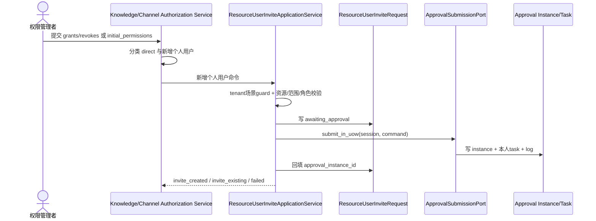
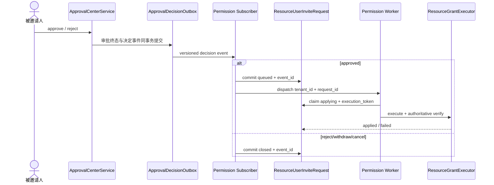

# Design: 个人用户邀请本人确认后生效

> **本文档定位 — 当前实现真相（Why this How）**
>
> - [spec.md](./spec.md) 定义产品范围与验收标准。
> - 本文定义 F047 解耦后的领域归属、数据流、状态机、安全边界与恢复方式。
> - F045/F046 尚未在生产上线；线上基线为 `v2.6.0`，本次采用停服直接升级，不保留被推翻的开发实现兼容层。

**Feature ID**: F045

**场景编码**: `resource_user_invite_confirmation`

**版本**: v2.6.0（COFCO 0811 定制）

**最后更新**: 2026-08-13

**关联**: [spec.md](./spec.md) · [F047 解耦设计](../047-f046-approval-business-decoupling/design.md) · [release-contract.md](../release-contract.md)

---

## 1. 目标与非目标

### 1.1 目标

- 知识空间和频道新增个人用户时，一人一条 Permission 业务申请，一人一个本人确认审批。
- 确认前不写 OpenFGA tuple、relation-model binding 或资源成员事实；权限页显示待生效邀请，不显示为 active。
- F025 只管理审批配置、实例、任务、决定、审批日志/通知和决定交付；邀请、授权执行、失败与重试归 Permission/资源 owner。
- 同一租户、资源、目标用户只有一个活跃邀请；重复邀请关联首次申请并保留首次角色快照。
- 审批状态和业务状态独立：审批 `approved` 仅表示本人同意，不表示授权已经生效；业务失败不回写审批异常。

### 1.2 非目标

- 不改变部门、用户组授权和已有个人授权修改/移除的直接执行语义。
- 不改变用户主动加入知识空间、订阅频道等已上线审批场景。
- 不新增独立邀请页面；复用 F044 创建/设置入口和审批中心。
- 不把站内信、Celery task ID 或审批 payload 作为邀请/授权事实。
- 不保留旧 `resource_user_invite_scenario_handler`、ApprovalOutbox 执行业务或 `ApprovalInstance.executing/execute_failed` 兼容路径。

---

## 2. 领域归属与关键约束

| Owner | 拥有 | 不拥有 |
|---|---|---|
| Permission/资源授权域 | `ResourceUserInviteRequest`、业务去重、角色快照、待生效列表、授权执行状态、业务通知与重试 | Approval ORM、审批任务流转 |
| F025 Approval | 场景/路由/流程、instance/task、审批终态、审批通知、`ApprovalDecisionOutbox` | 邀请业务状态、授权执行和授权失败恢复 |
| Knowledge/Channel owner | 对各自资源执行并权威校验实际授权，通过 `ResourceGrantExecutor` 暴露稳定端口 | 邀请或审批编排 |
| Composition root | 注册 policy、subscriber、grant executor，启动时校验完整性并 freeze | 业务状态 |

硬约束：

- 场景固定为单节点 OR，唯一审批人为被邀请人本人；禁止 pass、管理员代办、多节点或其他审批人来源。
- 包含新增个人用户的请求必须先在 tenant-bound 场景行锁内验证场景存在且启用；失败使用 18106，并在资源创建/direct 授权前整体返回。
- 场景存在但本人确认流程配置不合法使用 18118；绝不降级为直接授权。
- 所有跨域调用显式携带 `tenant_id`，并与 tenant ContextVar、资源真实租户、业务申请绑定相互核对；缺失或不一致 fail-closed。
- 业务申请与审批 bundle 共用 caller-owned 数据库事务；服务不自行 commit，post-commit effects 仅在外层提交后运行。
- 审批 payload 只含脱敏展示快照；授权 worker 只按 `business_request_id` 重读 Permission 业务申请。

---

## 3. 核心决策

### 决策 1：Permission 业务申请是邀请事实源

`ResourceUserInviteRequest` 保存邀请关系、角色快照、审批绑定和授权状态。ApprovalInstance/Task 只回答“谁对什么审批作了何种决定”，不能回答授权是否生效。

稳定业务键为：

```text
tenant_id / resource_type / resource_id / target_user_id
```

它不包含邀请人。业务表以 `(tenant_id, business_key, active_marker)` 唯一约束保证最终去重：活跃申请使用 `active_marker=0`；`applied/closed` 后改为 request ID 并释放邀请槽位。token-safe Redis lease 仅降低争用，数据库唯一约束是最终事实。

### 决策 2：caller-owned submission UoW

`ResourceUserInviteApplicationService` 在同一事务内：

1. 持有场景 guard，校验资源、邀请人、目标用户、F033 范围与角色模型。
2. 创建 `ResourceUserInviteRequest(awaiting_approval)`。
3. 调用 `ApprovalSubmissionPort.submit_in_uow(session, command)`。
4. F025 policy 校验唯一被邀请人 OR 流程，创建 instance/task/log。
5. 回填 `approval_instance_id`，由外层一次提交。

任何一步失败都不留下业务申请、审批半包或 direct/资源创建副作用；审批待办通知在提交后发送。

### 决策 3：决定交付与授权执行分离

本人 approve/reject、邀请人 withdraw 或管理员 cancel 均复用 F025 终态 UoW：instance/task/log 与唯一 `ApprovalDecisionOutbox` 同事务提交。F025 delivery worker claim 事件并调用 Permission subscriber；交付成功只表示 Permission 已接收决定，不表示授权完成。

`ResourceUserInviteDecisionSubscriber`：

- 锁定业务 request，校验 tenant、scenario、instance、business key、角色 fingerprint 和 event 顺序。
- `approved`：先提交 `queued + decision_event_id`，再通过 Permission dispatcher 派发稳定 request ID；同事件重投可补派但不重复改变状态。
- `rejected/withdrawn/cancelled`：提交 `closed` 并释放 active marker，不派发授权。
- 绑定/协议/指纹错误属于 permanent；数据库或 broker 暂时故障属于 retryable；两者都不改审批终态。

### 决策 4：资源 owner executor + 权威读后校验

Permission worker 以显式 tenant header 和稳定 request ID 加载申请，生成新的 execution token，并经 `ResourceGrantExecutorRegistry` 分派到 Knowledge/Channel owner：

- 执行前重读资源、邀请人权限、目标用户、租户/F033 范围、角色 fingerprint 和当前授权。
- 实际授权仍由资源 owner Service 使用 `PermissionService.authorize()` 唯一写入，并对 OpenFGA tuple 与 relation binding 做权威读后校验。
- 已由同一 request 完整生效时幂等收敛为 `applied`。
- 部分写失败先补偿并验证不存在有效半授权；无法证明完整成功时不得标记 applied。
- worker、dispatcher、通知不写 Approval ORM，也不创建 ApprovalException。

### 决策 5：失败只重试原业务申请

`failed` 仍占用业务唯一槽位，禁止重新审批。权限页或业务 API 只能按 request ID 重派已经 `approval_status=approved` 且 `execution_state=failed` 的原申请；重试生成新 execution token，不创建新 instance/task/decision event。

---

## 4. 数据流

### 4.1 发起邀请



分类规则保持不变：

1. revoke、department/user_group grant 直接执行。
2. 已有显式个人授权的角色修改直接执行；继承权限不等于已有显式个人授权。
3. 无显式个人授权的 user grant 才进入邀请。
4. 请求级资源/权限/schema/场景错误整体失败；通过场景 guard 后，每名目标用户独立校验和返回结果。
5. `invite_existing` 保留首次角色，不重放审批或通知。

### 4.2 本人决定与业务执行



### 4.3 查询与通知

- 权限列表以 OpenFGA/binding 为 active 真相，并从 Permission request 表读取待生效/失败业务记录；批量调用 F025 `ApprovalStatusReadPort` 只组合不可变 `instance_id/status`。
- 不查询 Approval payload、task、outbox 或异常表来解释角色、授权状态或重试资格。
- F025 负责审批待办及 approve/reject/withdraw/cancel 通知；文案只表达审批决定。
- Permission 在业务 request 状态提交后向邀请人发送授权生效/失败通知，并按 execution token 在 request 内持久去重；通知失败不预写成功标记，由任务重试补发。

---

## 5. 业务模型与状态机

`resource_user_invite_request` 关键字段：

| 字段 | 说明 |
|---|---|
| `tenant_id/business_key/active_marker` | tenant-bound 活跃邀请唯一约束 |
| `resource_type/resource_id/resource_name` | 目标资源及安全展示名 |
| `inviter_user_id/target_user_id` | 邀请关系 |
| `relation/model_id/include_children` | 稳定授权命令 |
| `role_snapshot/role_fingerprint` | 被确认的不可变角色摘要 |
| `approval_instance_id/decision_event_id` | 唯一审批与决定事件绑定 |
| `execution_state/execution_token` | Permission 业务执行状态与代次 |
| `error_summary/result_snapshot` | 业务结果、权威校验和通知 checkpoint |

```text
awaiting_approval
  ├─ approved event → queued → applying → applied
  │                              └──────→ failed → retry → applying
  └─ rejected|withdrawn|cancelled event → closed
```

- `awaiting_approval/queued/applying/failed` 占用唯一槽位；`applied/closed` 释放。
- `approval_status` 与 `execution_state` 分开展示：例如 `approved + queued`、`approved + failed` 都是合法组合。
- 只有 `applied` 才证明授权完整生效；审批 approved、decision delivered、broker accepted 或通知已发均不是成功证据。

---

## 6. API 与代码锚点

### 6.1 API

- 既有 Knowledge/Channel authorize/create API 保持入口；逐项结果区分 direct、invite_created、invite_existing、failed。
- `GET /permissions/resources/{resource_type}/{resource_id}/permissions` 组合 active 与 Permission-owned pending 数据。
- `POST /permissions/resource-user-invites/{request_id}/retry` 只重派 approved+failed 原申请。
- 审批决定继续走 F025 task/instance API；业务端点不直接写 Approval ORM。

### 6.2 代码锚点

| 文件 | 职责 |
|---|---|
| `permission/domain/models/resource_user_invite_request.py` | 邀请业务聚合与状态 |
| `permission/domain/services/resource_user_invite_application_service.py` | 场景 guard、去重、建单、查询、业务重试和结果通知 |
| `permission/domain/repositories/resource_user_invite_request_repository.py` | caller-owned 业务申请读写与唯一槽位 |
| `permission/domain/services/resource_user_invite_approval_policy.py` | 本人确认提交/决定实时校验 |
| `permission/domain/services/resource_user_invite_decision_subscriber.py` | 幂等接收决定并排队/关闭 request |
| `permission/domain/ports/resource_grant_executor.py` | 稳定授权命令与权威验证协议 |
| `permission/domain/services/resource_grant_executor_registry.py` | resource type executor 注册、freeze 与分派 |
| `worker/permission/resource_user_invite_tasks.py` | Permission-owned 授权 worker、token/CAS、业务通知 |
| `approval/domain/services/approval_submission_service.py` | caller-owned 通用审批 bundle 提交与场景 guard |
| `approval/domain/services/approval_decision_delivery_service.py` | 决定事件 claim、subscriber 调用与 ack/retry/fail |
| `bootstrap/approval_scenarios.py` | policy/subscriber/executor 唯一装配点 |

approval 包内不存在 F045 runtime handler、邀请 Service 或邀请专用业务锁；旧 `approval_outbox` worker 不执行 F045 授权。

---

## 7. 故障、并发与安全验收

- 同业务键跨邀请人并发：最多一条 active request 和一个审批 bundle；唯一冲突读取既有申请收敛。
- approve/reject/withdraw/cancel 并发：F025 只接受一个审批终态并写一个决定事件。
- event 重投：subscriber 以 `decision_event_id` 幂等；queued 可补派，closed/applied 不重复副作用。
- worker 重投或 ACK 不确定：request 行锁 + execution token + owner 权威读后校验决定结果。
- OpenFGA/binding 部分失败：补偿并验证，不允许 half-active；无法确认时保持 failed 并继续占槽。
- tenant、instance、fingerprint、operator、资源或角色不匹配：fail-closed，不写授权。
- 日志只记录 tenant/request/instance/event/resource/target 等关联 ID、受控错误码和异常类型，不记录角色完整结构、token、密钥或存储路径。

---

## 8. 发布与兼容性

生产基线 `v2.6.0` 未上线 F045/F046，也没有对应业务数据。发布采用停服直接升级：

1. 停止 API、default/permission/knowledge workers 和 Beat，阻止新请求/旧消息处理。
2. 发布前只读检查两个 scenario 的 Approval 数据、`resource_user_invite_request`、决定事件和 broker 消息为零；非零则阻止发布并清理非生产开发数据。
3. 一次执行重写后的 v2.6.0 migration，启动新版本 API/worker；不启动旧 worker。
4. 验证 bootstrap 注册完整、F045 task 走默认队列、F046 task 走 `knowledge_celery`，再开放流量。

不提供旧 handler、ApprovalOutbox、旧 task 名、旧 payload 或新旧 worker 混跑兼容。三个已上线旧场景继续使用原 `approval_outbox → handler` 语义，与 F045 decision delivery 并存。

---

## 9. 测试门禁

- Application/UoW：场景 guard、跨邀请人去重、同提交/同回滚、一人一单、批量逐项结果。
- Policy/decision：本人专属、管理员不可代办、pass/错流程拒绝、并发唯一决定事件。
- Subscriber/delivery：协议/tenant/instance/fingerprint、retryable/permanent、queued 补派、closed 幂等。
- Worker/executor：实时权限/范围/角色重验、token/CAS、部分写补偿、权威读后校验、业务通知去重。
- Query/API：只读 Permission request + Approval status port，不读 payload/outbox/exception；failed 只重试原 request。
- 回归：部门/组、已有个人修改/移除、用户主动加入/频道订阅及三个已上线旧 outbox 场景行为不变。

---

## 10. 变更历史

| 日期 | 变更 | 原因 |
|---|---|---|
| 2026-08-10 | 初版以 ApprovalInstance/Task/ApprovalOutbox 表达邀请与授权执行 | F045 初始设计 |
| 2026-08-13 | 全文改为 Permission request + submission port + decision delivery + Permission worker/ResourceGrantExecutor；审批与业务状态、通知分离 | F047 解耦设计确认，F045 尚未上线且停服零兼容发布 |
