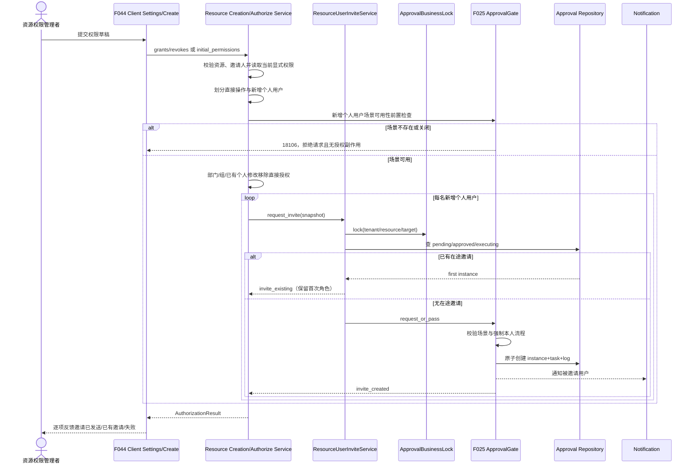
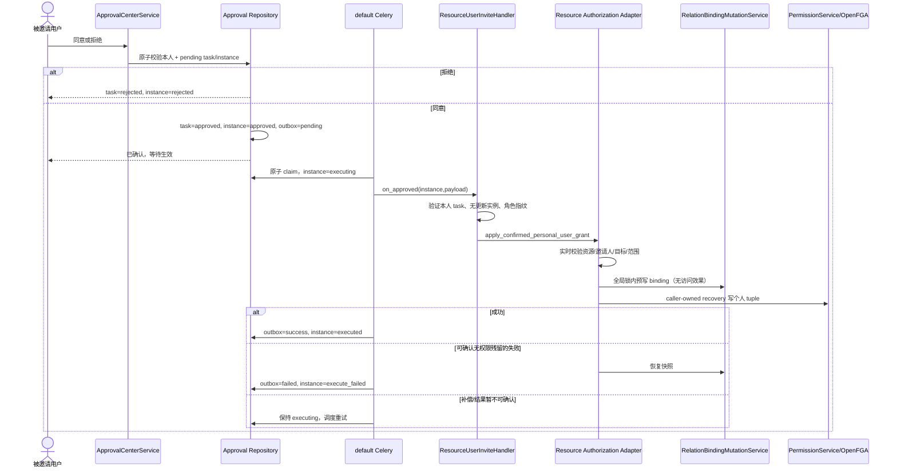

# Design: 个人用户邀请本人确认后生效

> **本文档定位 — 现状快照（Why this How）**
>
> - [spec.md](./spec.md) 定义需求与验收口径。
> - 本文档定义基于当前分支实现的方案、运行时事实、接口契约与失败边界。
> - `tasks.md` 后续只拆实施步骤，不重复本文论证。

**关联**: [spec.md](./spec.md) · `tasks.md`（待生成）
**版本**: v2.6.0（COFCO 0811 定制）
**实现基线**: `feat/2.6.0-cofco-0811@524a046b7`（已合入 F044 统一权限入口）
**最后更新**: 2026-08-10

---

## 1. 目标与非目标

### 1.1 目标

在 F044 已落地的知识空间/频道统一创建与设置页面中，把“新增个人用户授权”改造成一人一单的本人确认邀请。确认前不写入 OpenFGA 权限；被邀请人本人同意后，由 F025 outbox 异步执行实时校验和资源授权，完整成功后才生效。

权限列表把审批实例投影为只读“待生效”行。同一租户、同一资源、同一目标用户存在未结束邀请时，后续提交关联首次邀请，不新建实例或任务，也不修改首次角色。

### 1.2 非目标

- 不重建 PRD §1.1 页面、路由、创建接口或权限草稿；全部复用已完成的 F044。
- 不改变部门、用户组授权，以及已有个人用户角色修改/移除的直接授权语义。
- 不改变用户主动加入知识空间、订阅频道的审批场景。
- 不预写 OpenFGA tuple，不以站内信已读状态作为邀请事实。
- 不新增邀请业务表，不重构现有授权为“一对象一记录”。
- 不建设邀请超时、批量撤回、再次提醒和运营看板。

---

## 2. 关键约束

- 遵循 [`docs/constitution.md`](../../../docs/constitution.md) C1–C7，以及 [`release-contract.md`](../release-contract.md) INV-1～INV-5。
- F025 拥有 Approval* 聚合、审批终态和 outbox 写行为；F026 拥有频道授权写行为；F044 拥有统一 client 页面与创建后初始授权编排。F045 只通过这些 owner 的 Service/Repository 扩展点协同。
- 场景编码固定为 `resource_user_invite_confirmation`，显示名固定为“知识空间用户邀请确认”；知识空间和频道共用场景。
- 默认流程必须且只能有一个 `or` 节点，唯一处理人来源为 `invited_user`。这是安全约束，不是可被 pass route 或管理员代办绕过的普通配置。
- 任何请求只要包含新增个人用户 grant，必须先检查场景存在且 `enabled=true`。不存在或关闭统一抛 `ApprovalScenarioDisabledError`（18106），响应消息固定为“个人用户邀请确认场景未启用，无法新增个人用户权限”；该请求不得执行 direct 项、写个人 tuple、创建资源/邀请或把个人 grant 降级为直接授权。
- 去重边界是 `(tenant_id, resource_type, resource_id, target_user_id)`，不包含邀请人；重复提交保留首次邀请的角色快照。
- 待生效邀请不得写 OpenFGA tuple、relation-model binding 或资源成员表；否则现有权限读路径会提前放权。
- 审批、权限 API 和 default Celery worker 分进程运行；查重、终态与 outbox claim 必须具备跨进程并发语义，Redis/数据库异常时失败关闭。
- `permission_relation_model_bindings_v1` 是知识空间和频道共用的全局 JSON Config，任何读改写都必须经过同一原子修改服务，不能继续各自无锁覆盖保存。该锁需要 token-safe 释放与续租；持锁期间一旦续租失败，本次执行转可重试，不得继续提交新的 FGA 授权。
- `PermissionService.authorize()` 当前失败时会登记 `failed_tuple` 自动重试。邀请确认后的执行只能由 ApprovalOutbox 重试，必须显式关闭该次 tuple 的 `failed_tuple` 重试，避免审批已失败后后台又静默放权。
- 不新增数据库表。`ApprovalInstanceStatus.EXECUTING` 已存在但当前未使用；本功能启用该状态。若实现需要索引/DDL，必须另行更新设计并提供 MySQL/DM8 双分支迁移。

---

## 3. 方案对比与选定

### 决策 1：接入 F044 现有入口，不新增邀请 API 或页面

- **备选**：
  - A. 新增 `/invite` API 和独立邀请弹窗。边界直观，但会让创建页、设置页和调用方形成两套提交路径。
  - B. 保持现有 authorize/create 契约，由授权服务识别新增个人用户并转成邀请，响应增加逐项结果。
- **选定**：B。
- **原因**：当前 client 已有四个完整页面路由、共享 `usePermissionDraft`、创建请求 `initial_permissions` 以及创建后授权恢复流程；F045 只改变个人 grant 的生效时机即可。
- **重新考虑条件**：开放 API 需要独立邀请权限、配额或长耗时批处理时，再新增版本化端点。

### 决策 2：ApprovalInstance/Task 是唯一邀请事实源

- **备选**：
  - A. 新建 invitation 表并与审批同步。查询直接，但形成双事实源与对账负担。
  - B. 先写授权并加 pending 标记。任何漏过滤都会提前开放权限。
  - C. 复用 F025 实例、任务、outbox，权限页按资源列投影在途实例。
- **选定**：C。
- **原因**：符合 INV-1；确认前没有授权副作用，拒绝/撤回只结束审批，不需要删除预授权。
- **重新考虑条件**：邀请出现脱离审批中心的独立生命周期或大量运营检索字段时，再评估独立聚合。

### 决策 3：授权服务分成“提交编排”与“确认后直接执行”

- **备选**：
  - A. handler 回调公共 authorize。会再次识别为新增用户并递归建邀请。
  - B. handler 直接调用 `PermissionService`。会跳过资源状态、管理权限、F033 范围、角色模型和 binding 规则。
  - C. 两类资源 Service 保留公共编排方法，并增加不可从 HTTP 直接选择的 `apply_confirmed_personal_user_grant()`。
- **选定**：C。
- **原因**：公共方法负责分类；内部确认命令复用资源 owner 的完整实时校验，但不会再次进入邀请分支。
- **重新考虑条件**：授权领域形成统一事务型 command bus 后，可将两个资源适配器收敛到同一接口。

### 决策 4：跨邀请人查重采用“持久查询 + token-safe Redis 锁”

- **备选**：
  - A. 沿用 F025 的 `(business_key, applicant_user_id)` 和 `pending/exception/execute_failed`。不同邀请人会重复，失败邀请反而阻止重发。
  - B. 把 applicant 伪装成目标用户。会破坏我的申请、撤回、通知和审计语义。
  - C. handler 声明按业务键去重；Redis 锁包住“查询 → 创建实例/任务”，数据库查询作为持久事实。
- **选定**：C。
- **原因**：邀请人仍保留真实身份，业务键唯一表达资源+目标用户；锁解决跨进程竞态，持久查询解决正常重试。
- **实现护栏**：锁使用随机 token 的 `SET NX EX`，释放时 Lua compare-and-delete；锁不可用或超时返回该用户失败，不得降级为直接授权。
- **重新考虑条件**：F025 引入跨 MySQL/DM8 一致的数据库幂等键对象时，下沉到数据库唯一约束。

### 决策 5：本人确认是 handler 强制策略，不信任可编辑配置

- **备选**：
  - A. 只依赖默认种子正确。管理员误配 pass 或其他处理人时会绕过本人确认。
  - B. handler 声明 `requires_self_confirmation`；Gate 建单、任务处理和 handler 执行三次校验。
- **选定**：B。
- **原因**：AC-27/28 把本人确认定义为安全边界。场景不存在/关闭统一以 18106 明确拒绝；pass route、多节点、非 `or`、处理人非唯一目标用户以 18118 拒绝，全部失败关闭。
- **实现护栏**：handler 策略同时提供场景不可用的专用消息，ApprovalGate 的二次校验也使用同一 18106 文案；`operator_is_admin` 对本场景不产生代办能力；handler 执行前再次验证目标用户的 task 已由本人置为 `approved`。
- **重新考虑条件**：产品确认允许代理或委托，并重新确认 spec 后调整。

### 决策 6：单人建单、终态和 outbox claim 使用数据库原子操作

- **备选**：
  - A. 继续逐条 `create/update + commit`。进程中断或并发请求会留下半实例、覆盖终态或重复执行。
  - B. 只加 Redis 锁。能串行正常请求，但无法消除进程崩溃时的半提交。
  - C. Repository 增加 F025 拥有的事务方法，Redis 只承担业务键串行化。
- **选定**：C。
- **原因**：数据库事务是持久原子边界；Redis 不是状态真相。
- **原子操作**：
  1. `create_instance_bundle()`：instance + 唯一本人 task + submitted action log 同事务提交。
  2. `decide_single_task()`：锁定 pending instance/task，同事务完成 approve/reject、outbox 与 action log，只允许一个终态。
  3. `withdraw_pending_instance()`：锁定 pending instance，取消 task 并撤回，同事务完成。
  4. `claim_outbox()`：outbox `pending/failed -> processing` 且 instance `approved/execute_failed -> executing` 同事务条件更新；`processing` 记录 claim 时间，只有超过 `approval.outbox_claim_ttl_seconds` 才可重领。该 TTL 必须大于 Celery hard time limit，避免仍存活 worker 与重领 worker 并行执行。
- **重新考虑条件**：F025 全部场景完成统一 Unit of Work 改造后，删除场景分支并复用通用事务。

### 决策 7：审批通过与权限生效分离，outbox 是唯一重试者

- **备选**：
  - A. 点击同意时同步授权。超时会让审批终态与权限结果不清楚。
  - B. outbox 执行，但同时保留 `failed_tuple` 重试。两个重试者可能在邀请失败后放权。
  - C. outbox 异步执行；本次 FGA 写采用 caller-owned recovery，不生成 `failed_tuple`。
- **选定**：C。
- **原因**：F025 已提供执行结果、异常中心和重试入口；一个副作用只能有一个恢复所有者。
- **实现护栏**：明确校验失败直接 `execute_failed`；FGA 部分成功必须先补偿并验证无有效 tuple，确认清理后才落 `execute_failed`；清理未完成时保持 `executing` 并由 Celery 重试，不提前宣告失败。
- **重新考虑条件**：审批库与权限存储能进入同一原子事务时，可改同步提交。

### 决策 8：角色保存快照与指纹，执行时要求仍一致

- **备选**：
  - A. 只保存 `model_id`，执行时采用最新模型。用户确认内容可能被静默改变。
  - B. 保存规范化角色快照和 SHA-256 指纹，执行时比较当前模型。
- **选定**：B。
- **原因**：重复提交必须保留首次角色，被邀请人实际同意的权限集合不能漂移。模型删除或变化时本次执行失败，重新邀请。
- **重新考虑条件**：关系模型成为不可变版本对象后，只保存版本 ID。

### 决策 9：批量返回逐项 outcome，创建恢复只重试失败项

- **备选**：
  - A. 任一用户失败整批报错。无法满足一人一单、互不影响。
  - B. 请求级资源/邀请人/结构错误整体失败；个人用户建单按人隔离并返回逐项结果。
- **选定**：B。
- **原因**：`invite_existing` 是成功幂等结果；通过场景可用性前置门禁后，其他用户的锁或目标校验失败不回滚已建邀请。
- **F044 协同**：创建前整体校验资源类型、分享状态、邀请人能力、请求结构，以及新增个人用户所需场景存在且开启；场景失败直接返回 18106，不创建资源。场景 Service 以 `SELECT ... FOR UPDATE` 持有行锁，保护范围覆盖资源创建、direct 写入和全部邀请建单，使并发关闭/删除场景等待当前操作完成，避免二次检查失败后遗留部分副作用。通过门禁后，个人用户的租户/范围/有效性按项校验。资源创建成功后的 `initial_permission_result` 保存逐项结果，恢复按钮只提交 `outcome=failed` 的 grants，不能重放已创建邀请或已直接授权项。
- **重新考虑条件**：产品要求批量原子邀请时，需重新设计跨审批实例事务。

---

## 4. 当前实现与目标数据流（接手必读）

### 4.1 当前分支基线

F044 已完成以下能力，F045 必须在其上增量实现：

- Client 路由：`/workspace/knowledge/create`、`/workspace/knowledge/space/:spaceId/settings`、`/workspace/channel/create`、`/workspace/channel/:channelId/settings`。
- 共享权限草稿：`src/frontend/client/src/components/permission/usePermissionDraft.ts`；只提交 touched diff。
- 知识空间写入口：`POST /api/v1/permissions/resources/knowledge_space/{id}/authorize` → `ResourceAuthorizationService.authorize()`。
- 频道写入口：`POST /api/v1/channel/manager/{id}/authorize` → `ChannelAuthorizationService.authorize_channel()`。
- 创建编排：`KnowledgeSpaceCreationApplicationService` / `ChannelCreationApplicationService` 创建资源后把 `initial_permissions.grants` 交给上述授权 Service；失败保留资源并返回 `initial_permission_result`。
- 当前 authorize 响应分别为 `null` 与固定计数，权限条目没有状态字段；两端创建结果只有 `success|failed + error_code`。
- 当前知识空间授权先写 FGA 再写 binding，binding 失败无补偿；频道虽有补偿，但两个资源都对全局 binding JSON 做无锁读改写。
- 当前 ApprovalGate 的查重包含 applicant；Gate、任务、实例和 outbox 分次提交；管理员可代处理任务；withdraw 未检查 pending；outbox 没有 claim。这些现状不能直接满足 AC-05、AC-12、AC-19、AC-22/23。

### 4.2 发起与创建时邀请



分类规则：

1. 所有 revoke 继续直接执行；`department`、`user_group` grant 继续直接执行。
2. 当前资源已有**显式个人授权行**的 user grant 视为角色修改，继续直接执行；部门/用户组继承权限不等于已有个人授权。
3. 当前没有显式个人授权的 user grant 才进入邀请。
4. direct 与每名 invite 分开形成结果。请求级资源不存在、私密状态、邀请人无管理权限、schema 错误，以及个人邀请场景不存在/关闭，均整体失败。
5. 场景不存在/关闭使用 18106，且在任何授权或资源创建副作用前返回；场景存在但 pass/节点/处理人配置不满足本人确认时使用 18118。目标用户无效、租户或 F033 范围不符则只使对应用户 `failed`。所有路径都绝不降级直接授权。
6. 创建模式需要拆分当前 `validate_creation_grants()`：请求结构与 direct 部门/组项继续在创建资源前整体校验；个人 user 项只做可安全前置的结构校验，资源创建一次后再逐人校验并建邀请。这样单个无效用户只进入 `initial_permission_result.results`，不会阻断同批其他用户，也不会再次创建资源。

### 4.3 本人处理与生效



执行规则：

- 本场景即使调用者是系统/租户管理员，也必须满足 `operator_user_id == task.approver_user_id == payload.target_user_id`。
- `approve/reject/withdraw` 只接受 `instance=pending` 且 task 未处理；终态请求重复或并发均返回 `ApprovalRequestAlreadyProcessedError`（18102），不覆盖既有终态。
- handler 重新加载邀请人身份，不信任 payload 中的权限结论；重新校验资源仍分享、邀请人仍有相应 grant tier、目标用户仍属于同租户且有效、F033 部门范围和角色指纹。
- 若已有更新的在途实例，旧 `execute_failed` 不允许重试覆盖；若目标 exact tuple+binding 已由同一实例写成，重复执行按幂等成功收敛。
- worker 在 claim 后崩溃时，由 Celery 重投或异常中心在 claim TTL 过期后重领；未过期的 `processing` 只返回“执行中”，不得并行调用 handler。
- 通用 `approval_instance_approved` 对本场景不表示授权成功。邀请人只在 outbox `executed` 后收到“权限已生效”；执行失败进入异常中心并收到失败通知。
- task 提交成功后立即调用邀请提醒通知；通知发送失败只记录错误并允许被邀请人从审批中心看到任务，不回滚审批事实，也绝不改成直接授权。

### 4.4 权限列表投影

两类权限列表继续以 OpenFGA 为 active 真相，再从 Approval Repository 按显式列查询本资源的 `pending|approved|executing` 实例并合并：

1. OpenFGA 行输出 `authorization_status=active`。
2. 尚无 active 显式个人行的邀请输出 `authorization_status=pending`、首次角色快照与 `approval_instance_id`。
3. active 与 pending 冲突时 active 胜出并记录 warning，不把有效权限降级。
4. `rejected|withdrawn|cancelled|exception|execute_failed|executed` 不投影 pending。
5. pending 行在 `PermissionDraftEditor` 中角色和删除按钮均禁用，也不得进入 diff；选择器把 pending 用户加入 disabled IDs。撤回仍从审批中心“我的申请”执行。
6. 查询使用 `scenario_code + business_resource_type + business_resource_id + status` 显式列，不扫描 payload JSON；tenant 隔离由 C3 上下文自动注入。`tenant_id` 只进入锁键和新建行，不新增手写 tenant where。

### 4.5 关键数据契约

#### 4.5.1 业务键

```text
resource-user-invite:{resource_type}:{resource_id}:user:{target_user_id}
```

数据库查询额外受 tenant context 与 `scenario_code=resource_user_invite_confirmation` 限制。阻止重复的状态为 `pending|approved|executing`；`rejected|withdrawn|cancelled|exception|execute_failed|executed` 允许新邀请。

#### 4.5.2 `payload_snapshot`

| 字段 | 类型 | 说明 |
|---|---|---|
| `schema_version` | `1` | payload 版本 |
| `resource_type` | `knowledge_space \| channel` | 资源适配键 |
| `resource_id` | `string` | 资源 ID |
| `resource_name` | `string` | 展示快照，不用于鉴权 |
| `target_user_id` | `int` | 唯一处理人与授权目标 |
| `target_user_name` | `string` | 展示快照 |
| `inviter_user_id` | `int` | 必须等于 instance applicant |
| `relation` | `owner \| manager \| editor \| viewer` | 邀请关系 |
| `model_id` | `string \| null` | 关系模型 ID |
| `role_snapshot` | `object` | 规范化 `name/relation/grant_tier/permissions/permissions_explicit` |
| `role_fingerprint` | `sha256 hex` | 对规范化、稳定排序的 role snapshot 计算 |

`detail_snapshot` 只放审批中心展示字段，不放 token、缓存、权限判断结果或可执行内容。

#### 4.5.3 authorize 逐项响应

知识空间与频道 authorize 都返回统一数据对象；频道保留原两个计数字段：

```json
{
  "synced_user_count": 0,
  "affected_member_count": 0,
  "direct_applied_count": 1,
  "invite_created_count": 2,
  "invite_existing_count": 1,
  "failed_count": 1,
  "results": [
    {
      "operation": "grant",
      "subject_type": "user",
      "subject_id": 42,
      "relation": "viewer",
      "model_id": "viewer",
      "outcome": "invite_created",
      "approval_instance_id": 1201,
      "error_code": null,
      "error_message": null
    }
  ]
}
```

`outcome`：`applied | invite_created | invite_existing | failed`。`invite_existing` 是 HTTP 成功中的幂等结果，不使用错误响应，且响应角色来自首次邀请快照。

场景不存在或关闭是请求级安全门禁，不包装为 `outcome=failed`。接口返回现有错误 envelope，前后端共用明确文案：

```json
{
  "status_code": 18106,
  "status_message": "个人用户邀请确认场景未启用，无法新增个人用户权限",
  "data": {
    "exception": "个人用户邀请确认场景未启用，无法新增个人用户权限"
  }
}
```

`data` 不包含任何成功结果；前端直接展示 `status_message`，不把它改写为通用保存失败。

#### 4.5.4 创建阶段结果

保留 F044 `initial_permission_result.status/error_code`，追加计数与 `results`：

- 全部 direct/invite 项为 `applied|invite_created|invite_existing`：`status=success`。
- 任一项 `failed`：`status=failed`，`error_code` 保留首个失败码供旧 UI 兼容；新 UI 使用 `results` 展示并只缓存失败 grants。
- invitation outcome 表示提交成功，不表示权限已生效。

#### 4.5.5 权限条目

`ResourcePermissionItem`、`ChannelPermissionEntry`、client `PermissionEntry` 追加：

| 字段 | 类型 | 默认 | 说明 |
|---|---|---|---|
| `authorization_status` | `active \| pending` | `active` | 权限已生效或邀请待生效 |
| `approval_instance_id` | `int \| null` | `null` | pending 行对应实例 |

Client `PermissionDraftRow` 同步增加这两个字段；`authorizationStatus=pending` 与 `immutableCreator` 一样属于 reducer 级不可变约束，不能只靠按钮 disabled。

### 4.6 关键模块职责与改动边界

| 模块 / 文件 | 当前职责与目标改动 | 不做什么 |
|---|---|---|
| `permission/domain/services/resource_authorization_service.py` | **已有**知识空间授权 Service；增加分类、逐项结果、pending 投影适配和确认后单用户执行 | 不写 Approval ORM；handler 不回调公共分类入口 |
| `channel/domain/services/channel_authorization_service.py` | **已有**F026 频道授权 Service；同样增加分类/确认执行，保留现有计数字段 | 不实现审批状态机 |
| `approval/domain/services/resource_user_invite_service.py`（新增） | 构造快照/业务键、按项校验、加业务锁、查重并调用 Gate | 不写 OpenFGA |
| `approval/domain/services/resource_user_invite_scenario_handler.py`（新增） | title/detail/唯一本人 resolver、强制配置策略、执行分派 | 不复制资源权限规则；失败必须抛出明确结果 |
| `approval/domain/services/approval_gate.py` | handler-first，读取去重/强制策略；本场景原子建单 | 不改变其他场景默认去重集合与 applicant 语义 |
| `approval/domain/services/approval_center_service.py` | 本场景本人-only 决策、pending-only 撤回、原子单节点终态 | 不把 approved 当作业务成功 |
| `approval/domain/services/approval_outbox_service.py` | 原子 claim，启用 processing/executing、TTL 后重领，区分成功/确定失败/可重试 | 不吞 handler 异常，不与 failed_tuple 双重重试 |
| `approval/domain/repositories/approval_instance_repository.py` | 扩展按业务键/资源查询与事务方法；Repository 独占 Approval ORM | 不判断角色或资源权限 |
| `permission/domain/services/relation_binding_mutation_service.py`（新增） | 统一两资源 binding 的 token-safe 全局锁、原子读改写与快照恢复 | 不授予访问权限 |
| `permission/domain/services/permission_service.py` | 增加 caller-owned recovery 选项，默认行为完全不变 | 不感知审批场景 |
| `knowledge/.../knowledge_space_creation_application_service.py` | 消费逐项结果并保留资源；失败恢复仅含失败项 | 不重复创建资源 |
| `channel/.../channel_creation_application_service.py` | 同上，继续由 F026 Service 写频道权限 | 不重放订阅/同步副作用 |
| `common/init_data.py` | 幂等预置默认租户场景、flow、单 OR 节点、catch-all flow route | 不覆盖既有配置；误配由 handler 失败关闭 |
| `client/components/permission/usePermissionDraft.ts` | pending 行 reducer 级不可变、diff 排除 | 不发 HTTP |
| `client/components/permission/PermissionDraftEditor.tsx` | 待生效标签、禁改/禁删 | 不承载审批操作 |
| 两个 settings form hooks / API adapters | 消费逐项结果、toast、刷新与仅失败项恢复 | 不新建第二套邀请页面 |

实现新增场景、handler、状态、消息 action 后，必须同步更新 `.claude/skills/approval-module/SKILL.md` 的场景表、注册点、状态机与通知矩阵。

---

## 5. 已知坑 / 反直觉事实

| # | 反直觉事实 | 如果不知道会怎样 | 处理位置 |
|---|---|---|---|
| 1 | 当前 F025 查重包含 applicant，且 active 集合是 `pending/exception/execute_failed` | 不同邀请人重复；失败后反而不能重发 | handler 去重策略 + `ResourceUserInviteService` |
| 2 | Gate 的 pass route 会直接建 approved+outbox | 配置误改即可绕过本人确认 | Gate 在任何实例/任务创建前校验强制策略，18118 失败关闭 |
| 2a | 当前 Gate 对场景不存在和关闭都抛 18106，但若授权服务先处理 direct 项会产生部分副作用 | 用户看到明确失败时，部分权限已经改变 | 授权/创建 Service 先识别新增个人用户并做场景可用性门禁，再执行任何副作用 |
| 3 | 管理员当前可代处理任意 pending task | 管理员可替被邀请人同意 | `ApprovalCenterService.decide_task` 本场景本人-only |
| 4 | 当前 withdraw 不检查实例状态，任务/实例/outbox 分次提交 | 同意与撤回可能互相覆盖或留下半状态 | Repository 单事务终态方法 |
| 5 | approved 只表示节点完成，真正业务动作在 outbox | 过早显示/通知授权成功 | approved/executing 仍投影 pending；executed 后才通知生效 |
| 6 | API registry 与 worker runtime factory 是两处注册点 | API 建单成功但 worker 找不到 handler | 两处注册 + worker 测试 |
| 7 | `permission_relation_model_bindings_v1` 是全局整段 JSON | 两个确认/直接授权并发会丢 binding | 所有 binding mutation 统一走全局锁服务 |
| 8 | `PermissionService.authorize(enforce_fga_success=True)` 失败仍会登记 failed_tuple | 审批执行已失败后 retry worker 可能静默放权 | caller-owned recovery；本次不产生 failed_tuple |
| 9 | FGA 与 Config 不同事务，且一次用户授权可能含 legacy alias tuples | 部分成功会产生隐性访问 | 预写无权限 binding；tuple 失败补偿并验证；未清干净不落失败终态 |
| 10 | 公共 authorize 会把无个人权限的 user grant 识别为邀请 | handler 递归创建第二条邀请 | 仅调用确认后内部命令 |
| 11 | 当前 F044 创建失败恢复会重试全部 permission rows | 重放成功 direct 项，重复提交已建邀请 | 逐项 results；恢复只保留 failed grants |
| 12 | pending 行加入现有 `usePermissionDraft` 后，按钮禁用不足以保护 diff | replace/change reducer 仍可能生成 grant/revoke | reducer 识别 pending 为 immutable，diff 再次过滤 |
| 13 | 默认种子当前只初始化默认租户且“存在即跳过” | 误写全租户覆盖会破坏管理员配置 | 沿用初始化边界；缺失/误配租户失败关闭 |
| 14 | execute_failed 允许异常中心重试，同时用户可重新邀请 | 旧确认可能覆盖新邀请 | handler 拒绝存在更晚在途实例的旧执行；exact 已生效只做幂等收敛 |
| 15 | outbox claim 后 worker 可能崩溃 | processing/executing 永久卡住，或盲目重领造成并行执行 | claim TTL 大于 hard time limit；超时后原子重领，handler 保持幂等 |

---

## 6. 对外契约与依赖

### 6.1 我提供给别人的（Outgoing）

| 契约 | 形式 | 消费方 |
|---|---|---|
| `POST /api/v1/permissions/resources/knowledge_space/{id}/authorize` | 请求不变，`data` 从 `null` 扩展为 AuthorizationResult | F044 知识空间 settings hook |
| `POST /api/v1/channel/manager/{id}/authorize` | 请求不变，保留计数并追加逐项结果 | F044 频道 settings hook |
| `POST /api/v1/knowledge/space` | `initial_permissions` 不变，结果追加逐项授权结果 | F044 知识空间 create hook |
| `POST /api/v1/channel/manager/create` | 同上 | F044 频道 create hook |
| 两类 `GET .../permissions` | 条目追加 `authorization_status/approval_instance_id` | F044 权限草稿与编辑器 |
| `ResourceUserInviteService.request_invite()` | 内部 Python API | 两类资源授权 Service |
| 两类 `apply_confirmed_personal_user_grant()` | 内部 Python API | 邀请 runtime handler |
| `resource_user_invite_pending/effective/failed` | 站内信 action code | notification payload、message allowlist、client 三语 locale |

兼容规则：旧调用方可忽略所有新增响应字段；请求字段不删除不改名；`invite_existing` 不返回 18109。场景不存在/关闭复用 18106，并明确拒绝整个含新增个人用户的写请求；新增 `ApprovalConfirmationFlowRequiredError` 使用 18118，由 F025 approval 模块拥有，F045 协同登记后实现。

### 6.2 我依赖别人的（Incoming）

| 依赖 | 形式 | 风险点 |
|---|---|---|
| F025 ApprovalGate/Center/Outbox/Exception | Service + Approval* 表 | 当前默认查重、管理员代办、分次提交、无 claim 均需显式扩展 |
| F026 ChannelAuthorizationService | 内部 Service | 必须保留频道 grant-tier、tenant、creator、binding 与通知语义 |
| F033 部门空间范围规则 | ResourceAuthorizationService 校验 | 发起和执行各检查一次 |
| F044 client 页面、草稿、创建编排 | React hooks + API adapter | pending 必须 reducer 级只读；恢复不能重放全部 rows |
| PermissionService/OpenFGA | 统一权限入口 | confirmed 写必须 caller-owned recovery，禁止 failed_tuple 旁路重试 |
| relation models/bindings Config | 可变角色 + 全局 JSON | 角色需指纹；binding 写需全局串行 |
| Redis | 短时业务键锁与 binding 锁 | 故障失败关闭；释放必须 token-safe |
| default Celery queue | outbox worker | task id 仅表示入队；最终看 instance/outbox/FGA |

### 6.3 状态与可见性

| Instance 状态 | 权限页 | FGA | 阻止重复邀请 | 说明 |
|---|---|---|---|---|
| `pending` | 待生效 | 无 | 是 | 等待本人 |
| `approved` | 待生效 | 无 | 是 | 本人已同意，等待 claim |
| `executing` | 待生效 | 不作为完成依据 | 是 | worker 执行/补偿中 |
| `executed` | 不投影；显示 active | 有 | 否，由已有个人权限分支接管 | 完整成功 |
| `rejected/withdrawn/cancelled` | 不显示 | 无 | 否 | 可重新邀请 |
| `exception/execute_failed` | 不显示 | 必须无有效邀请 tuple | 否 | 历史可追踪；重试受更新实例保护 |

---

## 7. 测试与可观测

### 7.1 自动化策略

- `src/backend/test/approval/`：默认种子幂等；场景不存在/关闭返回 18106；跨邀请人查重；首次角色保留；强制本人/pass/误配失败关闭；原子建单；approve/reject/withdraw 并发；outbox claim/retry；旧失败与新邀请竞争。
- `src/backend/test/permission/`：知识空间分类；F033 双时点校验；pending projection；角色指纹；caller-owned recovery 不生成 failed_tuple；FGA 部分成功补偿；binding 并发不丢更新。
- `src/backend/test/channel/`：频道相同语义；保留 `synced_user_count/affected_member_count`；creator/tenant/grant-tier 与现有通知回归。
- `src/backend/test/knowledge/`、`test/channel/` creation：initial mixed results；资源只创建一次；邀请成功不当授权成功；恢复只重试 failed grants。
- Client Vitest：API 映射；pending reducer/diff 不可变；待生效标签；逐项 toast；创建/编辑 mixed outcome；两个 recovery hook 只缓存失败项。
- 实现完成后必须执行 `/e2e-test features/v2.6.0/045-personal-user-invite-confirmation`，生成 API E2E 与页面人工清单。

### 7.2 手动主路径

1. 在知识空间和频道 create/settings 页各提交两个新个人用户、一个部门和一个已有个人权限修改；确认 direct 项立即生效，新用户逐人显示“邀请已发送”。
2. 两名不同管理者并发邀请同一资源同一用户且选择不同角色；确认只有一条 instance/task，权限页展示首次角色。
3. 被邀请用户确认前不能访问资源；权限页仅有不可编辑的待生效行。
4. 用户 A 同意：短暂 approved/executing 后变 active；用户 B 拒绝：pending 行消失且无权限。
5. 邀请人与用户并发撤回/同意，确认只接受一个终态；终态重复请求返回 18102。
6. 同意前分别使邀请人失权、用户停用/跨租户、部门范围变化、角色模型变化；确认 execute_failed、无 FGA 邀请 tuple、无 active/pending 行。
7. 模拟 FGA 部分失败、binding 写失败和重复 worker；确认不生成本邀请的 failed_tuple、补偿后才结束失败、成功结果幂等。
8. 删除或关闭邀请确认场景后，在 create/settings 提交新增个人用户；确认接口返回 18106、页面明确提示场景未启用，资源不创建且 direct/个人权限均无变化。

### 7.3 验证命令

```bash
cd src/backend
uv run pytest test/approval test/permission test/knowledge test/channel -q

cd ../frontend/client
pnpm test:ci
pnpm run build

cd ../../..
bash scripts/arch-guard.sh
git diff --check
```

F044 已记录过 `qrcode.react` 缺失导致的 client 类型检查/构建基线问题；实施时先在当前 HEAD 复验，若仍存在，必须与 F045 引入失败分开记录，不能把未执行或基线失败写成通过。

### 7.4 日志与排障

- 发起日志：`tenant_id/scenario_code/business_key/instance_id/outcome`；不打印完整 payload 或用户敏感字段。
- 执行日志：`instance_id/outbox_id/resource_type/resource_id/target_user_id/validation_stage/compensation_result`。
- 审计动作：`resource.user_invite.request`、`approval.task.approve/reject`、`approval.request.withdraw`、`resource.user_invite.execute.success/failed`。
- 告警/高优先级日志：业务锁或 binding 锁不可用、handler 未注册、同业务键多个在途实例、补偿未完成、active 与 pending 冲突。
- 生效必须同时核对 `approval_instance=executed`、`approval_outbox=success`、目标 OpenFGA tuple 与 relation binding；HTTP 200、站内信或 Celery task id 均不能单独证明生效。

### 7.5 实现对账（2026-08-10）

- **租户事实源收紧**：settings 授权与 pending 投影使用资源真实 tenant；create 使用当前 tenant context，JWT tenant 仅作为 context 缺失时的兼容回退，避免 global-super admin 或切换租户场景查错审批配置。
- **场景并发门禁**：知识空间/频道授权及创建链路以 `scenario_guard()` 持有场景行锁直至 direct 与邀请副作用结束；管理端并发关闭/删除场景必须等待该事务释放，场景在请求开始时已关闭则仍以 18106 零副作用拒绝。
- **邀请人实时角色**：confirmed command 不复用邀请时 JWT 角色，也不构造空角色；执行时重新读取 `UserRoleDao` 当前角色，再完成邀请人权限双时点校验，保证 AdminRole 邀请不会误拒且撤权会失败关闭。
- **outbox 原子终态**：Repository 在同一事务内完成 `outbox=success + instance=executed` 或 `outbox=failed + instance=execute_failed + exception`；重复投递可修复历史 `success/executing`，setup 失败不得覆盖其他 worker 已持有的 `processing` claim。
- **通知与审计**：邀请 pending/effective/failed 通知全部 best-effort；邀请执行审计使用 `resource.user_invite.execute.success/failed`，非邀请场景保留通用 action；request created/existing 与 handler start/success 使用结构化日志。
- **E2E 文件名**：遵循 `e2e-test` skill 的仓库发现约定，实际文件采用 `test_e2e_personal_user_invite_confirmation.py`，替代 tasks 初稿中的无 `test_e2e_` 前缀名称；功能覆盖范围不变。
- **验证边界**：自动化 focused 与 Client production build 已通过；真实 API/default worker、18106 场景开关和四个 Client 路由仍需在独立 E2E 租户完成，详见 `tasks.md` T055/T057 执行记录和 `e2e-checklist.md`。

---

## 8. 后续改进 / 暂不实施

- 将 relation bindings 从全局 JSON Config 迁移为结构化表，以数据库唯一约束替代全局锁；本次不扩大授权存储重构。
- generic knowledge direct 路径仍沿用 F044 的“先写 FGA、后写 binding”顺序；binding 写失败时缺少与 confirmed command 同等级的 FGA 补偿。该既有窗口不允许影响新增个人用户的本人确认门禁，但后续应由 Permission owner 统一补齐 direct grant 的事务外补偿。
- 由 F025 提供所有场景通用 Unit of Work 和数据库幂等键，届时移除本场景的单节点事务适配。
- 新租户自动复制不可绕过的系统场景模板；当前沿用既有默认租户初始化行为，其他租户缺失时失败关闭。
- 邀请超时、批量撤回、再次提醒、权限页直接撤回与运营统计不在 PRD §1.2 范围。

---

## 9. Constitution Check

| 条款 | 设计符合性 |
|---|---|
| C1 分层 | Endpoint 只适配；资源/审批 Service 编排；Approval Repository 独占 ORM 与事务；不新增 DAO 旁路 |
| C2 双数据库 | 不新增方言 SQL/字段；事务锁与条件更新实施时必须使用 SQLAlchemy 双数据库可用能力；无 DDL |
| C3 多租户 | 实例、任务、资源查询与 worker tenant context 走框架 tenant injection；业务键不接受客户端 tenant |
| C4 权限入口 | 最终授权仍由 PermissionService → OpenFGA；caller-owned recovery 只是失败所有权，不绕过统一入口 |
| C5 错误码 | 资源错误复用；唯一新增 18118 由 F025 approval 模块登记和拥有 |
| C6 安全 | 强制本人、禁 pass、实时重校验、单重试者、补偿确认、无敏感日志均失败关闭 |
| C7 前端 | 仅 client `api/` adapter 发请求；草稿 hook 不发 HTTP；不新增 UI/状态库 |

**结论**：设计未发现 C1–C7 冲突；F045 不拥有 Approval* 或频道授权对象，只经 F025/F026/F044 既有 owner 边界协同扩展。

---

## 修订历史

| 日期 | 改动 | 触发原因 |
|---|---|---|
| 2026-08-10 | 基于当前分支 F044 实现重写：切换到 client 统一页面、纳入创建 initial permissions、逐项恢复、原子审批终态与 caller-owned FGA recovery | F044 已合入，旧设计的页面与服务基线失效 |
| 2026-08-10 | 场景不存在/关闭改为 18106 请求级门禁，任何资源创建或授权副作用前明确拒绝 | 用户补充并确认失败关闭口径 |
| 2026-08-10 | 按最终实现补充资源 tenant、邀请人实时角色、outbox 原子终态、审计日志与 E2E 文件名对账 | 并行实现后的跨模块 high/medium 审查 |
