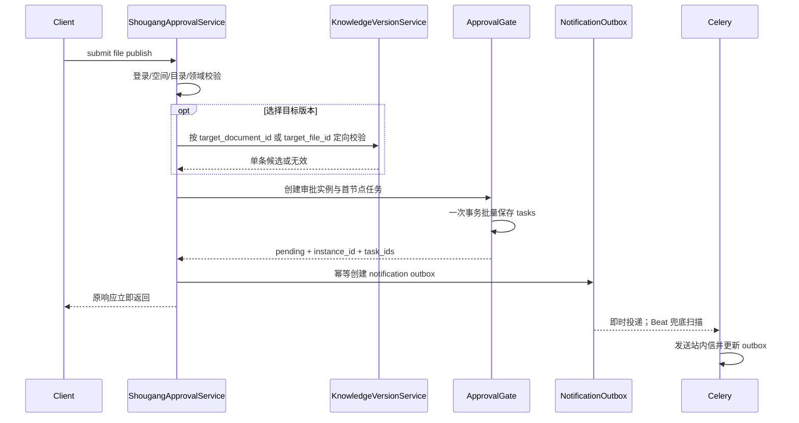

# 设计说明 Design: 发布申请提交性能优化（第一阶段）

## 阅读摘要
- 本文档说明：通过定向目标校验、独立通知 outbox、Celery 补偿和审批任务批量事务降低发布申请同步耗时。
- 设计重点：提交安全校验保持同步；通知与审批事实解耦；不复用会推动实例状态的业务执行 `approval_outbox`。
- 不在本设计中处理：OpenFGA owner/manager 合并查询、审批创建完全异步化、前端改造。

## 元信息 Metadata
- Feature ID: `054-file-publish-submit-performance`
- Status: `implemented`
- Related requirements: `features/v2.6.0/054-file-publish-submit-performance/requirements.md`
- Created: `2026-07-14`
- Updated: `2026-07-14`

## 上下文 Context
- 现有架构 Existing architecture: `Router → Endpoint → ShougangApprovalService → ApprovalGate/KnowledgeVersionService → Repository → DB`；审批通过后的业务执行已经使用 `ApprovalOutbox + Celery`，但申请通知仍同步写站内信。
- 已检查文件 Relevant files inspected: `shougang_approval_service.py`、`knowledge_version_service.py`、`approval_gate.py`、`approval_instance_repository.py`、`approval_outbox_service.py`、`worker/approval/tasks.py`、`message_service.py`、`core/config/settings.py` 及相关测试。
- 现有测试或验证命令 Existing tests or validation commands: `uv run pytest test/approval/...`、`uv run pytest test/knowledge/test_knowledge_version_service_similar_scan.py`、`uv run ruff check`。
- 项目约束 Constraints from project guidance: 双库兼容；所有新表带 `tenant_id`；不跳过 Service/Repository；非平凡修复走 SDD；Celery 恢复租户上下文；审批事实源为实例和任务。

## 目标 / 非目标 Goals / Non-Goals

### 目标 Goals
- 提交目标复验查询复杂度从随候选数增长降为常数级单目标读取。
- 删除提交路径残留的候选文件 `view_file`。
- 发布申请通知在审批实例和任务落库后异步发送并可补偿。
- 多审批人任务一次事务写入。
- 为生产定位剩余 OpenFGA/数据库耗时提供阶段指标。

### 非目标 Non-Goals
- 不改变权限允许/拒绝的空间级规则。
- 不改变审批配置、路由、节点或审批人来源。
- 不改变文件发布通过后的复制与版本关联。
- 不保证 Celery 通知 exactly-once。
- 不新增通用事件总线或抽象所有消息发送场景。

## 边界承诺 Boundary Commitments
| Boundary | Allowed Change | Disallowed Change | Revalidation Trigger |
|---|---|---|---|
| 发布提交 API | 内部校验和通知调度 | 请求/响应字段、HTTP 路径、前端交互 | 响应契约需要变化 |
| 权限 | 移除提交候选 `view_file` | 移除登录、`publish_file`、`view_space`、`view_folder` | 产品重新要求文件级权限 |
| 版本管理 | 新增单目标读取校验 | 改普通版本搜索、相似度或版本关联规则 | 目标合法性规则发生变化 |
| 审批中心 | 批量创建首节点任务 | 异步创建审批实例/任务、增加新审批状态 | 希望接口先返回 202 |
| 消息通知 | 仅发布申请初始待审批通知异步化 | 改知识空间创建或其他审批消息 | 需要全场景统一迁移 |
| 业务执行 outbox | 保持原样 | 复用它处理通知或改变实例执行状态 | F025 业务执行模型调整 |

- Allowed dependencies: `none`

## 需求追踪 Requirements Traceability
| Requirement | Acceptance Criteria | Design Element | Verification Strategy |
|---|---|---|---|
| REQ-001 | AC-REQ-001-01..02 | `ShougangApprovalService` 分段计时与 finally 日志 | caplog/Mock logger 测试 |
| REQ-002 | AC-REQ-002-01..04 | `KnowledgeVersionService.get_shougang_publish_version_target` | Knowledge Service + submit mock 测试 |
| REQ-003 | AC-REQ-003-01..02 | 提交路径不再构造 `can_view_file` | 服务回归测试 |
| REQ-004 | AC-REQ-004-01..05 | 独立通知 outbox、Service、Worker 和 Beat dispatcher | Repository/Worker/Service 测试 |
| REQ-005 | AC-REQ-005-01..03 | `ApprovalInstanceRepository.create_tasks` | SQLite Repository + Gate 回归测试 |
| REQ-006 | AC-REQ-006-01..03 | API 不变、实例任务同步落库、业务 outbox 不变 | 审批与 Worker 回归测试 |

## 架构设计 Architecture
- Pattern: `同步安全核心 + Transactional Outbox + Celery at-least-once consumer`
- Rationale: 权限、目标合法性和审批事实必须在成功返回前确定；提醒消息不是真相源，可在事实落库后异步处理。
- Preserved existing patterns: 复用项目 Celery 路由、`run_async_task`、消息 Service 构建方式、SQLModel/Alembic、Repository 会话管理和审批响应模型。
- Architecture change justification, if any: 新增独立通知 outbox 是为了避免复用 `ApprovalOutboxService` 时把实例错误推进为 `executing/executed`；项目不存在可复用的通用通知 outbox。

### 请求时序

## 文件结构计划 File Structure Plan
| Path | Action | Responsibility | Linked Requirement |
|---|---|---|---|
| `features/v2.6.0/054-file-publish-submit-performance/{spec,requirements,design,tasks,verification,retrospective}.md` | create | SDD 追踪和验证证据 | REQ-001..006 |
| `approval/domain/services/shougang_approval_service.py` | modify | 定向校验集成、通知入队、性能日志 | REQ-001..004,006 |
| `knowledge/domain/services/knowledge_version_service.py` | modify | 单目标发布版本校验 | REQ-002 |
| `approval/domain/models/approval_notification_outbox.py` | create | 通知事件持久化模型和状态 | REQ-004 |
| `approval/domain/repositories/approval_notification_outbox_repository.py` | create | 幂等创建、状态更新、补偿扫描 | REQ-004 |
| `approval/domain/services/approval_notification_service.py` | create | outbox 编排和消息发送 | REQ-004 |
| `approval/domain/repositories/approval_instance_repository.py` | modify | 批量创建/按 ID 批量加载审批任务 | REQ-004,005 |
| `approval/domain/services/approval_gate.py` | modify | 使用批量任务写入 | REQ-005,006 |
| `worker/approval/notification_tasks.py` | create | 消费与周期补偿任务 | REQ-004 |
| `worker/approval/__init__.py`, `worker/__init__.py` | modify | 注册新 Celery 任务 | REQ-004 |
| `core/config/settings.py` | modify | 每 30 秒补偿扫描配置 | REQ-004 |
| `core/database/alembic/versions/v2_6_0_f058_approval_notification_outbox.py` | create | MySQL/DM8 兼容建表与索引 | REQ-004 |
| `test/approval/*`, `test/knowledge/test_knowledge_version_service_similar_scan.py` | modify/create | 回归与验收自动化证据 | REQ-001..006 |
| `features/v2.6.0/README.md`, `release-contract.md` | modify | 登记 F054 与新领域对象归属 | REQ-004,006 |

## 组件与接口 Components and Interfaces

### 单目标发布版本校验
- Responsibility: 根据唯一目标 ID 返回 `ShougangFilePublishDocumentEntry` 或 `None`。
- Inputs: `knowledge_id`, `current_file_id`, `target_document_id | target_file_id`。
- Outputs: 单条发布目标条目或 `None`。
- Dependencies: document/version/file repositories。
- Error behavior: Repository/数据库异常向上抛出；业务无效返回 `None`，由发布 Service 维持现有 HTTP 400 文案。
- Requirements: `REQ-002`

校验规则：

- `target_document_id`：文档属于目标空间、有 `primary_version_id`、版本链恰好一条、主文件存在且解析成功。
- `target_file_id`：文件属于目标空间、类型为普通文件、解析成功、不是源文件、尚无版本记录。
- 两个目标 ID 互斥；沿用请求 schema 和 Service 的现有检查。

### ApprovalNotificationOutbox
- Responsibility: 持久化发布申请通知意图，独立于审批通过后的业务执行 outbox。
- Inputs: tenant、instance、事件类型、任务 ID、申请人和消息展示快照。
- Outputs: 唯一 outbox ID、状态、重试信息。
- Dependencies: SQLModel、Repository。
- Error behavior: 幂等键冲突时读取并返回既有记录；数据库异常阻止“通知已入队”的假象并向上抛出。
- Requirements: `REQ-004`

建议字段：

| Field | Purpose |
|---|---|
| `id` | 主键 |
| `tenant_id` | 多租户过滤 |
| `instance_id` | 关联审批实例 |
| `event_type` | 固定 `file_publish_submitted` |
| `status` | `pending/success/failed` |
| `retry_count/max_retries` | 补偿上限 |
| `payload_snapshot` | `task_ids`、申请人、action/business 信息 |
| `error_summary` | 最近错误摘要 |
| `create_time/update_time` | 运维追踪 |

唯一约束：`(tenant_id, instance_id, event_type)`。

### ApprovalNotificationService
- Responsibility: 创建 outbox、即时投递、消费消息和更新状态。
- Inputs: gate result 和消息快照；消费时输入 outbox ID/tenant ID。
- Outputs: enqueue 结果或消费布尔结果。
- Dependencies: NotificationOutboxRepository、ApprovalInstanceRepository、MessageService、Celery task dispatcher。
- Error behavior: 发送失败记录 `failed/retry_count/error_summary` 后抛出，让 Celery 可观测失败；达到最大重试后 Beat 不再投递。
- Requirements: `REQ-004`

### Celery dispatcher/consumer
- Responsibility: 即时消费单条 outbox；Beat 每 30 秒扫描 `pending/failed` 且未超限记录并重新投递。
- Inputs: `outbox_id`, `tenant_id`；dispatcher 扫描批次上限固定为小批量。
- Outputs: 状态更新和日志。
- Dependencies: 现有 `workflow_celery`、租户 ContextVar、Redis 分布式锁或等价互斥。
- Error behavior: 成功记录直接跳过；同一 outbox 并发消费受锁保护；消费者崩溃后锁过期并由 Beat 重试。
- Requirements: `REQ-004`

### 批量审批任务 Repository
- Responsibility: 单 session `add_all + flush/commit` 创建任务并保留输入顺序 ID。
- Inputs: `list[ApprovalTask]`。
- Outputs: 已持久化任务列表。
- Dependencies: async DB session。
- Error behavior: 任一失败则事务回滚，异常向上抛出。
- Requirements: `REQ-005`

## 数据 / 状态变化 Data / State Changes
- Entities: 新增 `ApprovalNotificationOutbox`；不修改 `ApprovalOutbox`。
- Persistence changes: 新增 `approval_notification_outbox` 表、唯一约束和 `(status, retry_count, update_time)` 补偿扫描索引。
- Migration or rollback: F058 `upgrade` 使用 Alembic/SQLAlchemy 可移植 API建表；`downgrade` 仅删除新表。回滚会丢弃待发送通知，不影响审批事实。
- Compatibility: API、审批实例状态和消息内容格式不变；Worker/Beat 必须随应用版本部署。

## 测试策略 Testing Strategy
| Acceptance ID | Test Type | Target | Notes |
|---|---|---|---|
| AC-REQ-001-01..02 | unit | Shougang service logs | 成功/异常两条路径 |
| AC-REQ-002-01..04 | unit/integration | Knowledge version + submit service | 断言常数级定向方法被调用 |
| AC-REQ-003-01..02 | unit/regression | Shougang permissions | 不调用 `view_file`，保留空间权限 |
| AC-REQ-004-01..05 | repository/unit | outbox/service/worker/beat | 成功、失败、重试、幂等、非 pending |
| AC-REQ-005-01..03 | repository/regression | Approval repository/gate | 顺序、单调用、失败传播、全审批回归 |
| AC-REQ-006-01..03 | regression | API and existing outbox | 响应与业务执行不变 |

## 设计决策 Decisions

### Decision: 不复用现有 ApprovalOutbox
- Context: `ApprovalOutboxService` 成功时会把实例推进为 `executed`，异常服务也默认最后一条 outbox 是业务执行记录。
- Options considered: A 复用现有表/Worker；B 新增独立通知 outbox；C 直接 `.delay()` 无 outbox。
- Decision: 选择 B。
- Rationale: 保持审批执行状态语义，且 broker 首次投递失败时仍有持久补偿依据。
- Consequences: 增加一张表、迁移、Repository 和 Beat 任务。

### Decision: 目标校验保持同步但改为定向查询
- Context: 全量搜索慢，但目标合法性属于申请准入条件。
- Options considered: A 原逻辑放 Celery；B 按 ID 同步校验；C 完全信任前端。
- Decision: 选择 B。
- Rationale: 同时满足安全和性能，不产生事后失败的无效审批单。
- Consequences: 需要维护一个与候选列表规则一致的定向校验方法及回归测试。

### Decision: 通知限定发布申请场景
- Context: `_send_approval_message` 也服务知识空间创建审批。
- Options considered: A 一次迁移所有首钢审批消息；B 仅迁移发布申请。
- Decision: 选择 B。
- Rationale: 用户请求边界仅为发布申请性能，避免扩展行为范围。
- Consequences: 知识空间创建仍同步发送消息，后续可另立 spec 统一迁移。

## 风险 / 取舍 Risks / Trade-Offs
| Risk | Impact | Mitigation | Owner / Phase |
|---|---|---|---|
| Worker 在消息提交后、outbox 成功提交前崩溃 | 可能重复提醒 | 唯一 outbox、成功短路、单事件互斥锁；记录 at-least-once 边界 | T005-T006 |
| Beat 跨租户扫描 | 错误租户过滤可能漏发/串租户 | 仅 dispatcher 显式 bypass；单条消费显式恢复 tenant context | T004-T006 |
| 新迁移未先部署 | 提交写 outbox 失败 | 发布顺序文档、migration 测试、启动前 `alembic upgrade` | T003-T004 |
| 批量 Gate 改动影响所有审批 | 回归风险 | 保持字段/顺序；全审批测试集 | T009-T010 |
| 剩余 OpenFGA 同步慢 | 接口仍可能接近超时 | 分段日志提供证据，第二阶段处理 | T007-T011 |

## 设计质量门 Design Quality Gate
- [x] Every requirement ID is represented in Requirements Traceability.
- [x] Every acceptance criterion has a verification strategy.
- [x] Boundary Commitments include allowed and disallowed changes.
- [x] Every changed file has one clear responsibility and linked requirement.
- [x] Existing architecture is preserved or changes are justified.
- [x] Runtime prerequisites, migrations, and risky operations are explicit.
- [x] No speculative abstractions are included.
