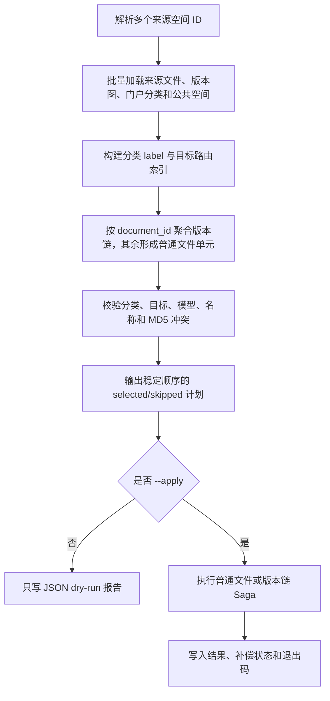

# 设计说明 Design: 按文件分类自动移动到公共知识空间

## 阅读摘要
- 本文档说明：通过“分类/目标索引 + 迁移单元规划 + 普通文件操作 + 版本链 Saga”重写现有单目标脚本。
- 设计重点：先完成全量只读预检，再按稳定顺序执行；版本链复制和验证全部成功后才删除来源。
- 不在本设计中处理：自动建空间/目录、重新解析、跨租户、旧文件 ID 引用迁移或真实环境自动 apply。

## 元信息 Metadata
- Feature ID: `061-classified-public-space-file-move`
- Status: `implemented`
- Related requirements: `features/v2.6.0/061-classified-public-space-file-move/requirements.md`
- Created: `2026-07-17`
- Updated: `2026-07-17`

## 上下文 Context
- 现有架构 Existing architecture: `scripts/move_knowledge_space_files.py` 以单个 `PreflightPlan` 持有一个来源空间和一个目标上下文；`BishengMoveOperations` 完成单文件快照、复制、标签、权限、验证、来源删除和补偿；版本文件在预检中直接跳过。
- 已检查文件 Relevant files inspected: 移动脚本及测试、`knowledge_file.py`、`knowledge.py`、`knowledge_space_scope.py`、`knowledge_document.py`、`knowledge_document_version.py`、门户分类 schema、分类解析常量和 `file_worker.py`。
- 现有测试或验证命令 Existing tests or validation commands: `pytest test/scripts/test_move_knowledge_space_files.py test/test_file_worker_copy_normal.py -q`、Ruff、`py_compile`、脚本 `--help`、`git diff --check`。
- 项目约束 Constraints from project guidance: 手工迁移脚本默认 dry-run；直接运行时自举 backend import path；外部依赖写入需可校验和补偿；不新增依赖；非平凡功能遵循 SDD 和 Test-First。

## 目标 / 非目标 Goals / Non-Goals

### 目标 Goals
- 从多个来源空间发现所有符合条件的文件。
- 将门户分类 code 确定性解析为目标公共空间和直属目录。
- 将普通文件和完整版本链表示为独立、可报告的迁移单元。
- 复用并增强现有工件复制、目标校验与补偿能力。
- 保证 dry-run 不触发业务写入。

### 非目标 Non-Goals
- 不把脚本能力改造成在线 API 或后台任务。
- 不修改知识空间、文件或版本表 schema。
- 不实现名称纠错、自动目录创建或目标模型重建索引。
- 不保证跨多个存储引擎的强分布式事务。

## 边界承诺 Boundary Commitments
| Boundary | Allowed Change | Disallowed Change | Revalidation Trigger |
|---|---|---|---|
| CLI | 改为多个来源空间 ID，保留 `--report-dir`/`--apply` | 保留旧显式目标/filter 语义或自动 apply | 用户要求兼容旧命令 |
| 路由 | 分类 label 唯一精确匹配公共空间和根目录直属目录 | 模糊匹配、递归目录、自动创建 | 用户调整名称规则 |
| 普通文件迁移 | 参数化目标上下文并保留现有复制/校验/补偿 | 修改在线上传、发布或删除 API | 现有底层复制接口不可满足完整性 |
| 版本链 | 整链规划、重建新版本图、整链报告和补偿 | 拆链、扩大来源范围、丢弃版本关系 | 版本数据模型变化 |
| 数据结构 | 仅运行期 dataclass/protocol 和既有表记录 | Alembic/schema 变更 | 发现无法用现有表表达目标关系 |
| 工作区 | 仅 F061 spec、脚本、定向测试和 README | 修改聊天流、前端或其他用户改动 | 发现硬依赖必须跨模块修改 |

- Allowed dependencies: `none`（仅使用项目现有依赖）。

## 需求追踪 Requirements Traceability
| Requirement | Acceptance Criteria | Design Element | Verification Strategy |
|---|---|---|---|
| REQ-001 | AC-REQ-001-01..03 | `parse_args`、`SourceInventory`、批量预检 | CLI/预检单元测试 |
| REQ-002 | AC-REQ-002-01..04 | `CategoryLabelIndex`、`TargetRouteIndex`、`resolve_route` | resolver 参数化测试 |
| REQ-003 | AC-REQ-003-01..04 | `ConflictReservations`、模型 guard | 冲突与稳定顺序测试 |
| REQ-004 | AC-REQ-004-01..05 | `MigrationUnitPlanner`、`VersionChainSaga` | planner 与 failure-path 测试 |
| REQ-005 | AC-REQ-005-01..04 | `TargetContext`、`BishengMoveOperations` | 工件、owner、权限验证测试 |
| REQ-006 | AC-REQ-006-01..04 | `MoveCoordinator`、报告模型和退出码 | dry-run/report/run 测试 |
| REQ-007 | AC-REQ-007-01..03 | MinIO 工件 helper、统一同步 storage client | helper 与 operation 回归测试 |
| REQ-008 | AC-REQ-008-01..03 | 版本链 skip context、单次 route resolution | planner/report 回归测试 |
| REQ-009 | AC-REQ-009-01..04 | 零宽字符规范化、受控线上名称清理、dry-run与冲突清单 | resolver 回归、事务前后快照、真实 dry-run |
| REQ-010 | AC-REQ-010-01..03 | `SourceSnapshot.tags`、精确目标标签替换、差异诊断 | operation interaction 与 failure-path 回归 |

## 架构设计 Architecture
- Pattern: `read-only preflight indexes → deterministic migration-unit plan → per-unit Saga execution → JSON evidence`
- Rationale: 分类路由会把来源文件分散到多个目标，不能继续让一个全局 plan 持有唯一目标；迁移单元把单文件和版本链的选择、冲突、执行和报告边界统一起来。
- Preserved existing patterns: 继续使用 `copy_normal/copy_vector`、MinIO helper、标签服务、`PermissionService`、目标验证、dry-run 和 JSON 报告。
- Architecture change justification, if any: 新增版本链 Saga 是保留 `KnowledgeDocument`/`KnowledgeDocumentVersion` 关系所必需；普通文件仍走现有单文件流程。

### 总体流程

## 文件结构计划 File Structure Plan
| Path | Action | Responsibility | Linked Requirement |
|---|---|---|---|
| `features/v2.6.0/061-classified-public-space-file-move/{requirements,design,spec,tasks,verification}.md` | create | SDD 需求、设计、任务、兼容摘要和验证证据 | REQ-001..REQ-006 |
| `src/backend/scripts/move_knowledge_space_files.py` | rewrite | CLI、预检、分类路由、迁移单元、执行、报告和补偿 | REQ-001..REQ-006 |
| `src/backend/test/scripts/test_move_knowledge_space_files.py` | rewrite | 路由、冲突、版本链、dry-run、补偿和报告测试 | REQ-001..REQ-006 |
| `src/backend/scripts/README.md` | modify | 新 CLI、匹配规则、跳过原因和安全说明 | REQ-001, REQ-002, REQ-004, REQ-006 |

如实施时发现现有测试文件与用户新改动重叠，优先增加同目录独立测试文件，避免覆盖。

## 组件与接口 Components and Interfaces

### CLI 与 SourceInventory
- Responsibility: 接收重复来源 ID，批量加载并验证来源知识空间、普通文件、版本行和逻辑文档。
- Inputs: `--source-space-id <positive-int>`（可重复）、`--report-dir`、`--apply`。
- Outputs: 去重排序的来源空间及候选文件集合。
- Dependencies: `Knowledge`、`KnowledgeFile`、`KnowledgeDocument`、`KnowledgeDocumentVersion`。
- Error behavior: 参数或来源空间无效属于整批 preflight error；不合格文件不进入迁移单元。
- Requirements: `REQ-001`, `REQ-004`。

旧参数 `--source-folder-id`、`--source-file-id`、`--source-category-code`、`--source-subcategory-code`、`--target-space-id`、`--target-folder-id`、`--target-owner-id` 被移除；该变更在 README 中明确标注为不兼容。

### CategoryLabelIndex
- Responsibility: 从门户 `document_types` 构建 `parent_code -> parent_label` 和 `(parent_code, child_code) -> child_label`。
- Inputs: 当前默认租户门户配置。
- Outputs: 不可变分类索引。
- Dependencies: `ShougangPortalConfigService`、`parse_shougang_file_encoding_codes`。
- Error behavior: 配置 code 重复且 label 冲突时对应分类视为歧义；文件跳过，不猜测 label。
- Requirements: `REQ-002`。

### TargetRouteIndex
- Responsibility: 索引公共空间名称及每个空间根目录直属文件夹，解析唯一 `TargetContext`。
- Inputs: `KnowledgeSpaceScope.level=PUBLIC` 空间、`KnowledgeFile.file_type=DIR` 目录、有效目标 owner。
- Outputs: `TargetContext(space, folder, owner, path, level)` 或稳定跳过原因。
- Dependencies: `Knowledge`、`KnowledgeSpaceScope`、`KnowledgeFile`、`User`。
- Error behavior: 零候选、多候选、深层目录、无效 owner 均返回 skip decision。
- Requirements: `REQ-002`, `REQ-005`。

### MigrationUnitPlanner
- Responsibility: 将候选分为 `SingleFileUnit` 和 `VersionChainUnit`，完成范围、状态、统一路由、模型及冲突校验。
- Inputs: 来源 inventory、分类/路由索引、目标既有文件名和 MD5。
- Outputs: 稳定排序的 selected units 与 skipped results。
- Dependencies: 纯数据结构；不执行写入。
- Error behavior: 普通文件局部跳过；版本链任一成员失败则整链生成一个 chain skip，并为成员提供可追踪结果。
- Requirements: `REQ-001`..`REQ-004`。

冲突预留按 `(target_space_id, target_folder_path, file_name)` 和 `(target_space_id, md5)` 建立。先加入目标既有记录，再按迁移单元排序预留；版本链内部成员不互相判定名称冲突，但会与目标既有文件和其他迁移单元冲突。

### BishengMoveOperations
- Responsibility: 把现有单文件复制、标签、权限、校验、删除和补偿从“持有全局 plan”改为接收 `TargetContext`。
- Inputs: source file、target context。
- Outputs: 新目标文件和 `SourceSnapshot`。
- Dependencies: `copy_normal`、`copy_vector`、MinIO、Tag/ReviewTag、OpenFGA。
- Error behavior: 暴露部分创建的目标记录给补偿路径；普通文件保持既有“验证后删除”语义。
- Requirements: `REQ-005`, `REQ-006`。

### VersionChainSaga
- Responsibility: 对整条链编排复制、版本图创建、验证、来源提交和补偿。
- Inputs: 按 `version_no` 排序的 source versions、统一 target context。
- Outputs: source file ID 到 target file ID 的映射及 chain result。
- Dependencies: `BishengMoveOperations`、异步 DB session、版本模型。
- Error behavior: 任何阶段失败均返回 chain failed；补偿错误单独记录。
- Requirements: `REQ-004`, `REQ-005`, `REQ-006`。

### MoveCoordinator 与报告
- Responsibility: dry-run 输出、按稳定顺序执行迁移单元、聚合退出码和报告。
- Inputs: `MigrationPlan`。
- Outputs: JSON report、控制台摘要、退出码。
- Dependencies: operations factory、report writer。
- Error behavior: 单元失败不阻止后续独立单元；preflight 全局错误在任何业务写入前终止。
- Requirements: `REQ-006`。

## 数据 / 状态变化 Data / State Changes
- Entities: `KnowledgeFile`、`KnowledgeDocument`、`KnowledgeDocumentVersion`、Tag/ReviewTag links、OpenFGA tuples、MinIO objects、Milvus/Elasticsearch records。
- Persistence changes: 无 schema 变化。目标创建新 `KnowledgeFile` ID；版本链创建新 document/version rows；成功提交后删除来源对应 rows 和工件。
- Migration or rollback: 普通文件沿用单文件补偿；版本链使用完整快照和 Saga。目标版本图创建与删除、来源版本图删除与恢复分别在数据库事务内执行；外部存储按阶段补偿。
- Compatibility: 新 CLI 不兼容旧显式目标参数；报告保留原字段并扩展 `unit_type`、`source_document_id`、`target_document_id`、`version_no` 和 chain 级补偿信息。

### 版本链 Saga 顺序

1. 快照来源版本图及每个物理文件的存储、索引、标签和权限。
2. 逐版本复制物理文件到统一目标，写入目标 owner/parent 权限并验证每个目标文件。
3. 在数据库事务中创建目标 `KnowledgeDocument` 和全部 `KnowledgeDocumentVersion`，保留 `version_no/is_primary`，最后设置 `primary_version_id`。
4. 重新读取并校验目标版本数量、文件 ID 映射、唯一版本号和唯一主版本。
5. 在数据库事务中删除来源版本 rows 和逻辑 document；随后删除来源物理文件工件及记录。
6. 若第 1-4 步失败，删除目标版本图和所有目标文件。
7. 若第 5 步失败，按快照恢复来源版本图与可恢复工件，再清理目标；任何残留写入报告。

## 测试策略 Testing Strategy
| Acceptance ID | Test Type | Target | Notes |
|---|---|---|---|
| AC-REQ-001-01..03 | unit/preflight | CLI、SourceInventory | 多来源、排序、状态及全局输入失败 |
| AC-REQ-002-01..04 | unit/resolver | CategoryLabelIndex、TargetRouteIndex | label、唯一性和直属目录 |
| AC-REQ-003-01..04 | unit/planner | ConflictReservations | 目标既有/批内冲突、模型 guard |
| AC-REQ-004-01..05 | unit/saga | MigrationUnitPlanner、VersionChainSaga | 整链成功和每阶段补偿失败注入 |
| AC-REQ-005-01..04 | unit/regression | BishengMoveOperations | owner、对象、索引、标签、权限 |
| AC-REQ-006-01..04 | unit/smoke | MoveCoordinator、report、CLI help | dry-run 无写、schema、退出码 |
| AC-REQ-007-01..03 | unit/regression | `_storage_exists`、`_copy_object_if_present`、`copy_file` | 直接覆盖真实 helper 调用链，防止 mock 绕过客户端入口 |
| AC-REQ-008-01..03 | unit/regression | `_resolve_chain_unit`、SkippedFile/报告映射 | 分类字段、底层原因和单次解析断言 |
| AC-REQ-009-01..04 | unit + production dry-run | `_normalize_label`、TargetRouteIndex、线上事务/报告 | 零宽字符、唯一精确匹配、目标命中和冲突关联 |
| AC-REQ-010-01..03 | unit/regression | `BishengMoveOperations.copy_tags/verify_target` | 快照唯一来源、精确替换、双方标签 ID 诊断与补偿 |

## 缺陷修复设计 Bugfix Design
- Observed behavior: 真实 apply 对文件 93073、93074、93076 执行来源快照时，在 Milvus/Elasticsearch 只读计数之后报 `KnowledgeUtils.get_minio_client` 不存在，`target_file_id` 均为空。
- Root cause: `_storage_exists()` 与 `_copy_object_if_present()` 错误地从 `KnowledgeUtils` 获取 MinIO 客户端；当前项目统一入口位于 `bisheng.core.storage.minio.minio_manager.get_minio_storage_sync`。
- Expected behavior: 两个 helper 每次通过统一入口获取已由 app context 管理的 `MinioStorage`，复用现有 bucket、存在性检查和对象复制接口。
- Fix strategy: 新增一个既有模块 import，替换两个调用点；不引入 wrapper、不修改异步边界和迁移流程。
- Alternative rejected: 给 `KnowledgeUtils` 动态补兼容方法会扩大公共 API，并掩盖脚本依赖错误。
- Rollback: 恢复两个调用点和 import 即可；无 schema、配置或数据迁移。

### 版本链目标诊断上下文
- Observed behavior: document 6307 / file 94685 生成 `version_chain_target_unresolved`，但分类 code/label 为空，具体 route reason 丢失。
- Root cause: 内部 `skip_known()` 始终使用默认空分类；目标分支把全部 `RouteResolution.reason_code/reason` 折叠成固定文案。
- Fix strategy: `skip_known()` 接收可选 category；分类一致后只对首个分类解析一次目标；失败时保留 chain reason code，并将底层 route code/reason 拼入说明。
- Compatibility: JSON schema 和顶层 reason code 不变；只补充原本为空或过度泛化的信息。
- Non-goal: 本修复不创建目标空间/目录，不改变匹配规则，也不重新处理已跳过文件。

### 目标名称零宽字符兼容
- Observed behavior: 线上2110条有效分类全部报 `target_space_not_found`；8个对应公共空间名称末尾包含 `U+200B`，仅名称干净的“培训资源”曾成功路由。
- Root cause: `_normalize_label()` 只执行 `str(...).strip()`；Python 不把 `U+200B` 和 `U+FEFF` 视为普通空白，导致视觉相同的 label 键不相等。
- Fix strategy: 在统一 label 规范化入口删除明确列出的 `U+200B`、`U+FEFF`，再保留既有 `.strip()`；不进行 NFKC、同义词或包含匹配。线上数据仅对已核验的8个空间 ID 在单事务内删除末尾 `U+200B`。
- Verification: TDD 覆盖空间和目录索引；线上变更前断言旧值、清理后名称唯一，重新 dry-run 并统计 `dry_run_selected`、目标未命中及冲突原因。
- Alternative rejected: 仅修改线上数据无法防止后续导入再次写入不可见字符；仅热补丁线上容器会在 Pod 重建后丢失。
- Rollback: 代码恢复 `_normalize_label()`；线上事务可按记录的旧值重新追加 `U+200B`。dry-run 不产生业务数据写入。

### 目标标签快照一致性
- Observed behavior: 真实 apply 对来源文件89515、89516已完成目标文件、索引和权限复制，但校验目标94994、94995时均报 `target file tags do not match the source file`；目标随后被补偿清理，来源保留。
- Evidence: 两个来源文件的有效标签快照均为 `approved=[3298], pending=[]`；标签3298存在且名为“行业情报”。当前 `copy_file()` 已保存 `SourceSnapshot.tags`，但 `copy_tags()` 又调用审批模块的 `_copy_file_tags()` 重新查询来源并增量添加，最终 `verify_target()` 却与第一次快照严格比较。
- Root cause: 标签复制与标签验证使用不同时间点、不同查询方式和不同写入语义；“二次查询 + add”不能满足“与既有快照完全相等”的契约。
- Fix strategy: `copy_tags()` 直接读取 `self.snapshots[source_file.id].tags`，复用现有 `_restore_tag_links()` 对目标已通过及待审核标签执行精确替换；移除脚本对审批模块私有 `_copy_file_tags()` 的依赖。`verify_target()` 在不一致时输出双方标签 ID。
- Alternative rejected: 放宽或删除标签校验会让缺失标签的目标文件被当作成功；仅重试 `_copy_file_tags()` 仍保留双数据源和增量语义。
- Rollback: 恢复 `copy_tags()` 的旧 helper 调用和 import；不涉及 schema、配置或既有数据迁移。

测试以 mock/fake 隔离真实数据库和中间件；`copy_normal` 既有回归测试继续运行。真实业务 dry-run/apply 不属于自动验证默认范围。

## 设计决策 Decisions

### Decision: 重写编排层，保留底层复制能力
- Context: 现有传输逻辑已有测试和补偿，但数据模型只支持单目标。
- Options considered: 全量从零重写；在单目标脚本外循环多次；抽离目标上下文并重写预检/编排。
- Decision: 抽离目标上下文，重写 CLI、预检、路由和编排，保留并增强底层操作。
- Rationale: 满足自动多目标路由，同时避免重新引入对象、索引和权限复制缺陷。
- Consequences: 脚本内部数据结构会明显变化，但外部依赖调用保持现有方式。

### Decision: 名称必须唯一精确匹配
- Context: 分类 label 可能与空间/目录同名，但数据库不保证这些名称全局唯一。
- Options considered: ID 配置；首个命中；唯一精确匹配并跳过歧义。
- Decision: 唯一精确匹配。
- Rationale: 自动迁移中错误投递比跳过更难恢复。
- Consequences: 运维需要先消除公共空间或根目录重名。

### Decision: 版本链作为原子业务单元
- Context: 版本 rows 保存物理文件 ID，逐文件迁移会断链。
- Options considered: 跳过版本；拆链；按主版本路由整链；全部成员一致时整链迁移。
- Decision: 全部成员分类和目标一致时整链迁移，否则整链跳过。
- Rationale: 同时遵守来源范围、逐文件分类和版本关系完整性。
- Consequences: 版本链补偿复杂度高于普通文件，需要单独测试和报告。

### Decision: dry-run 复用完整只读 planner
- Context: 运维必须在写入前看到真实目标、冲突和整链判定。
- Options considered: dry-run 只打印来源；dry-run 运行完整预检/planner；复制后不删除。
- Decision: 运行完整只读 planner，不实例化写操作。
- Rationale: 能发现大部分业务跳过原因，同时保持零业务写入。
- Consequences: dry-run 仍依赖数据库和门户配置可用，但不依赖写权限。

## 风险 / 取舍 Risks / Trade-Offs
| Risk | Impact | Mitigation | Owner / Phase |
|---|---|---|---|
| 多存储无统一事务 | 补偿期间依赖持续失败会留下残留 | 分阶段快照、先验证后删除、报告残留 ID | implementation/operations |
| 旧 ID 引用中断 | 收藏、分享或外部链接失效 | README 醒目提示；apply 前审核报告 | operations |
| 版本链补偿路径复杂 | 部分来源删除可能需要人工恢复 | failure injection 测试；chain 级结果和残留清单 | implementation |
| 分类或目标重名 | 文件大量跳过 | 唯一匹配、明确 reason code 和汇总 | preflight |
| 旧 CLI 不兼容 | 旧运行手册失效 | README 提供迁移说明和新命令 | docs |
| 无真实中间件验证 | 自动测试不能证明生产数据完整性 | 标记 manual dry-run/apply 为 `MANUAL_REQUIRED` | verification |
| 清理线上空间名称 | 依赖旧精确字符串的调用方可能变化 | 限定8个已核验 ID、事务前唯一性断言、保留旧值用于回滚 | operations |
| 目标标签精确替换 | 错误目标 ID 上会覆盖其标签 | 目标文件为本次刚创建的新记录，写入前由迁移上下文确定 ID；失败继续走目标补偿 | implementation |

## 实现偏差 Implementation Deviations
- 设计中的 `SingleFileUnit` 与 `VersionChainUnit` 最终由统一 `MigrationUnit` dataclass 加 `unit_type` 表达，减少重复字段；行为边界未改变。
- `SourceInventory`、`ConflictReservations` 和 `MoveCoordinator` 以小型函数及集合实现，没有引入无状态包装类；批量预检、确定性预留和执行顺序与设计一致。
- 实施审查额外加入来源版本图合法性检查，以及 `TargetCopyError` 携带半成品目标时的整链清理，收紧了既定完整性与补偿契约。
- 真实多存储联调未执行，详见 `verification.md` 的 `MANUAL_REQUIRED` 项。

## 设计质量门 Design Quality Gate
- [x] Every requirement ID is represented in Requirements Traceability.
- [x] Every acceptance criterion has a verification strategy.
- [x] Boundary Commitments include allowed and disallowed changes.
- [x] Every changed file has one clear responsibility and linked requirement.
- [x] Existing architecture is preserved or changes are justified.
- [x] Runtime prerequisites, migrations, and risky operations are explicit.
- [x] No speculative abstractions are included.
