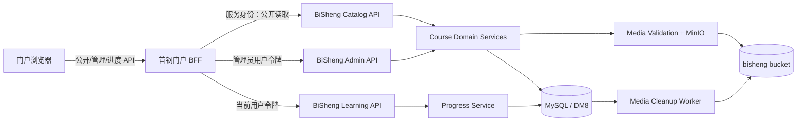
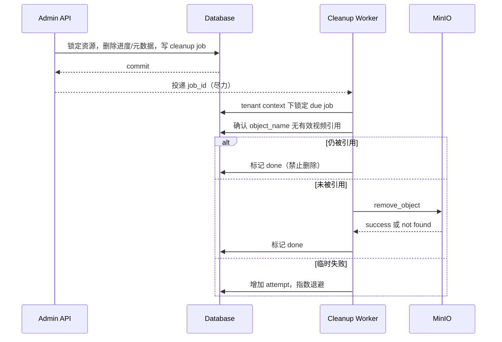

# Design — F062 门户课程管理与播放进度

| 属性 | 值 |
|------|----|
| Feature ID | F062 |
| 状态 | Implemented / Live Verification Pending |
| 关联需求 | [requirements.md](./requirements.md) |
| 错误码模块 | `250`（`portal_course`） |
| 最后更新 | 2026-07-19 |

## 1. 设计摘要

采用“门户负责体验与会话编排、BiSheng 负责领域事实”的分层方案：

- 门户前端提供公开课程列表、详情播放器、学习进度交互和后台课程管理 UI；
- 门户 BFF 将访客请求转换为服务身份读取，将管理员和学习进度请求绑定到当前门户会话；
- BiSheng 新建独立 `shougang_portal_course` DDD 模块，使用关系表保存课程、标签、视频、用户进度和媒体清理任务；
- 上传媒体进入 `bisheng` 持久化 MinIO，数据库保存对象名，读取时生成签名 URL；
- 以事务内清理任务 + Celery 即时投递 + 周期恢复扫描解决数据库提交与对象存储删除无法原子提交的问题。

课程没有“单视频/多视频”枚举。所有课程都包含 `videos[]`；公开详情按已启用视频数量决定视图：1 个时隐藏目录直接播放，2 个及以上时显示目录。

### 1.1 现状证据与分析结论

| 现状证据 | 代码位置 | 对设计的约束 |
|----------|----------|--------------|
| 首页和详情直接导入静态课程数据 | `shougang-group-knowledge-portal/frontend/src/pages/HomePage.tsx:51`、`frontend/src/pages/CoursePage.tsx:18-24` | 上线时必须同时替换首页和详情数据源，不能只增加后台表单 |
| 详情页用每秒 interval 增长百分比模拟播放 | `shougang-group-knowledge-portal/frontend/src/pages/CoursePage.tsx:51-84` | 必须重建为真实 `<video>` 播放器和媒体事件状态机，旧计时逻辑不可复用 |
| `/course` 与 `/course/:courseId` 当前共用详情组件 | `shougang-group-knowledge-portal/frontend/src/App.tsx:147-148` | 本期需拆分全部课程列表页与课程详情页 |
| 首页“全部课程”和课程项会把访客送到登录页 | `shougang-group-knowledge-portal/frontend/src/pages/HomePage.tsx:1283-1311` | 与已确认的访客可看可播冲突，需定点移除该守卫 |
| 门户聚合配置只有 domains/sections/document types/QA/agent/search/recommendation/display/banners/integrations/site，没有课程集合 | `shougang-group-knowledge-portal/backend/app/schemas/portal_config.py:583-594` | 不在聚合 JSON 中硬塞无界课程与进度，改用 BiSheng 关系模型 |
| 门户 session 已保存 BiSheng token、用户与租户，并能按 session 创建下游 client | `backend/app/services/portal_auth_service.py:43-50,427-428`、`backend/app/schemas/auth.py:13-20` | 登录用户进度可以使用真实用户令牌，不需要新增门户身份映射表 |
| BFF 已有 multipart 认证重试与文件位置恢复，但只能使用 client 全局 timeout | `shougang-group-knowledge-portal/backend/app/clients/bisheng.py:40-60,153-180` | 复用上传客户端并补单请求长超时，避免影响普通请求超时 |
| 门户 `/api/` 当前上限正好是 `1024m`，且缺少请求流式转发和 send timeout | `shougang-group-knowledge-portal/deploy/nginx/default.conf.template:20-30` | 1 GiB 文件加 multipart 开销会被代理提前拒绝，需提高到 `1100m` 并补齐流式/超时配置 |
| MinIO 已区分持久 bucket 与临时 bucket，临时 bucket 3 天过期；匿名策略只开放知识切片图片路径 | `bisheng/src/backend/bisheng/core/storage/minio/minio_storage.py:65-68,98-128` | 课程必须进持久 bucket；不能使用 tmp bucket，也不应扩大匿名策略 |
| MinIO 已支持默认 7 天签名下载链接和前端 Nginx 路径模式 | `bisheng/src/backend/bisheng/core/storage/minio/minio_storage.py:423-456` | 可在公开读模型中动态生成签名播放地址，无需保存长期 URL |
| 现有文章阅读表只有 user/article/read time；推荐 Redis 只保存 90 天阅读时间；门户 telemetry 明确是 best-effort | `bisheng/src/backend/bisheng/channel/domain/models/article_read_record.py:17-35`、`knowledge/domain/repositories/implementations/portal_recommendation_redis_repository.py:21-34,124-139`、`common/telemetry/portal_event_service.py:30-38` | 三者都不能表达视频秒数、完成终态与永久唯一覆盖行，必须新建专用进度表 |
| 自动租户过滤依赖模型 module 强制导入 | `bisheng/src/backend/bisheng/core/database/tenant_filter.py:35-99` | 新模型只加 `tenant_id` 仍不够，必须注册 module 并做发现测试 |
| BiSheng 已在基础镜像安装 ffmpeg，代码中也存在安全调用 `ffprobe` 的先例 | `bisheng/src/backend/base.Dockerfile:18`、`bisheng/src/backend/bisheng/knowledge/domain/services/media_transcription_service.py:288-315` | 不新增转码依赖，复用 `ffprobe` 思路但提高为严格容器/codec 校验 |

结论：现有实现中没有可直接扩展成该功能的课程事实源或播放进度事实源；最小可靠边界是“门户新增专用 BFF/UI + BiSheng 新增课程领域关系模型”，并复用现有会话、MinIO 和媒体探测基础设施。

## 2. 关键设计决策

### D-001 使用独立关系模型，不写入门户聚合配置 JSON

选择：新增 4 张租户表：课程、视频、播放进度和媒体清理任务。标签作为课程内有序值对象写入 `portal_course.tags_json`，不建立独立标签表。

原因：课程与视频数量不设固定上限；进度需要按用户和视频唯一更新；删除、替换和 MinIO 对象清理需要行级锁、约束与事务。继续扩展单行门户配置会放大写冲突、载荷大小和数据迁移风险，也无法自然表达进度唯一性。标签只随课程展示和编辑，本期不参与搜索、筛选或独立生命周期，将其拆表没有足够收益。

影响：管理端仍呈现为“课程配置”，但写入由独立课程 API 完成，不修改现有 `ShougangPortalAdminConfig` 聚合结构。

### D-002 统一目录模型

选择：课程始终拥有零到多个视频草稿，发布时要求至少一个已启用视频。公开 UI 不读取额外类型字段，只按返回的已启用 `videos[]` 数量选择单视频或目录视图。

原因：避免类型切换造成数据迁移；单视频和多视频课程共享 API、验证、排序和播放器代码，同时避免单视频页面出现没有操作价值的一项目录。

### D-003 上传对象使用持久化 bucket 的非匿名前缀 + 动态签名地址

选择：对象保存到现有 `bisheng` bucket 的 `portal-course/` 前缀，该前缀不加入匿名策略；数据库只保存对象名，公开响应返回有时效的签名 `play_url`。

原因：`tmp-dir` bucket 具有过期策略，不适合课程；扩大匿名策略会让对象路径成为长期公开凭证。现有 Nginx 已代理 `/bisheng` 路径并支持 Range 请求，可复用浏览器可达的 MinIO 链路。

### D-004 进度采用终态覆盖行

选择：`(tenant_id, user_id, video_id)` 唯一一行，未完成时覆盖当前位置，完成后成为不可逆终态。

原因：满足续播和“只保留一行”要求；无需播放事件历史。允许向后拖动覆盖，不能使用 `MAX(progress_seconds)`。

### D-005 课程不建立逐资源 OpenFGA 关系

选择：管理写入要求租户管理员；公开读取是租户门户级公开能力；学习进度只能操作认证上下文中的本人记录。

原因：课程是租户级门户配置，不存在本期所需的逐课程成员/角色差异。该边界与现有首钢门户配置管理一致。若未来引入定向课程，应另立 Feature 增加资源授权模型，不能在本期接口中隐式放宽。

### D-006 使用持久化媒体清理任务协调数据库与 MinIO

选择：上传前登记延迟生效的 provisional 清理任务；数据提交成功时取消新对象的 provisional 任务，并在同一事务登记旧对象清理任务。工作线程按任务删除未被引用的对象。

原因：数据库与 MinIO 不支持分布式事务。先登记再上传可覆盖“上传成功但数据库提交失败”的窗口；删除前重新检查引用可避免误删已生效对象。

## 3. 总体架构



### 3.1 信任边界

| 调用链 | 身份来源 | 服务端约束 |
|--------|----------|------------|
| 浏览器 → BFF 公开接口 | 无会话或可选会话 | 只能读取公开课程；不直接透传用户输入的 tenant |
| BFF → BiSheng Catalog API | 已配置的服务身份 | 固定当前门户租户；只返回公开读模型 |
| 浏览器 → BFF Admin API | 门户管理员 session | BFF `require_admin_session`；下游再次执行 `get_admin_user` |
| 浏览器 → BFF Progress API | 门户登录 session | 下游使用 session 对应用户 token；忽略 body 中任何身份字段 |
| Cleanup Worker → DB/MinIO | worker 内部身份 | 全局扫描只取得任务 ID/tenant；逐条恢复 tenant context 后处理 |

## 4. 领域与数据模型

所有 ID 使用应用生成的 32 位 UUID hex，SQL 列为 `CHAR(32)`，避免依赖数据库自增行为。布尔值通过 SQLAlchemy `Boolean` 抽象生成，不使用数据库 enum。所有时间使用项目现有时间约定，API 输出 ISO 8601。

### 4.1 `portal_course`

| 字段 | 类型 | 约束/说明 |
|------|------|-----------|
| `id` | `CHAR(32)` | PK |
| `tenant_id` | `INTEGER` | NOT NULL，租户隔离 |
| `name` | `VARCHAR(200)` | NOT NULL，去除首尾空白后非空 |
| `instructor` | `VARCHAR(100)` | NOT NULL，允许空字符串 |
| `organization` | `VARCHAR(200)` | NOT NULL，允许空字符串 |
| `description` | `TEXT` | NOT NULL，允许空字符串 |
| `tags_json` | `LargeText` | NOT NULL，应用默认 `[]`；有序标签值对象数组 |
| `enabled` | `BOOLEAN` | NOT NULL，默认 false |
| `show_on_home` | `BOOLEAN` | NOT NULL，默认 false |
| `sort_order` | `INTEGER` | NOT NULL，默认 0 |
| `create_user` | `INTEGER` | NOT NULL |
| `create_time` / `update_time` | `DATETIME` | NOT NULL |

索引：`(tenant_id, enabled, show_on_home, sort_order)`、`(tenant_id, sort_order)`。

`tags_json` 使用项目 `bisheng.core.database.dialect_helpers.LargeText`，由 Pydantic schema 序列化/反序列化为：

```json
[
  { "label": "钢铁冶炼", "display_type": "domain" },
  { "label": "初级", "display_type": "level" }
]
```

写入时逐项校验 `label` 去除首尾空白后非空且不超过 50 字符，`display_type` 仅为 `domain|level|gray`；数组顺序就是展示顺序。查询不使用数据库 JSON 函数，保证 MySQL/DM8 一致性。

### 4.2 `portal_course_video`

| 字段 | 类型 | 约束/说明 |
|------|------|-----------|
| `id` | `CHAR(32)` | PK |
| `tenant_id` | `INTEGER` | NOT NULL |
| `course_id` | `CHAR(32)` | FK → `portal_course.id` |
| `title` | `VARCHAR(200)` | NOT NULL，非空 |
| `source_type` | `VARCHAR(16)` | `upload\|url` |
| `object_name` | `VARCHAR(512)` | upload 必填，url 必须为空 |
| `source_url` | `VARCHAR(2048)` | url 必填，upload 必须为空 |
| `original_filename` | `VARCHAR(255)` | upload 的展示信息；不参与对象路径 |
| `duration_seconds` | `INTEGER` | NOT NULL，正整数 |
| `enabled` | `BOOLEAN` | NOT NULL，默认 false |
| `sort_order` | `INTEGER` | NOT NULL，默认 0 |
| `create_time` / `update_time` | `DATETIME` | NOT NULL |

索引：`(tenant_id, course_id, enabled, sort_order)`、`(tenant_id, object_name)`。来源字段互斥由 schema 与 service 双重校验；migration 不依赖各方言 CHECK 表达式。

### 4.3 `portal_course_video_progress`

| 字段 | 类型 | 约束/说明 |
|------|------|-----------|
| `id` | `CHAR(32)` | PK |
| `tenant_id` | `INTEGER` | NOT NULL |
| `user_id` | `INTEGER` | NOT NULL，取认证上下文 |
| `video_id` | `CHAR(32)` | FK → `portal_course_video.id` |
| `progress_seconds` | `INTEGER` | NOT NULL，默认 0 |
| `completed` | `BOOLEAN` | NOT NULL，默认 false |
| `completed_at` | `DATETIME` | 可空，首次完成时写入 |
| `create_time` / `update_time` | `DATETIME` | NOT NULL |

唯一约束：`(tenant_id, user_id, video_id)`；辅助索引：`(tenant_id, video_id)`，用于视频/课程删除进度。

### 4.4 `portal_course_media_cleanup`

| 字段 | 类型 | 约束/说明 |
|------|------|-----------|
| `id` | `CHAR(32)` | PK |
| `tenant_id` | `INTEGER` | NOT NULL |
| `object_name` | `VARCHAR(512)` | 待删除对象 |
| `reason` | `VARCHAR(32)` | `provisional\|replace\|delete` |
| `status` | `VARCHAR(16)` | `pending\|processing\|done` |
| `not_before` | `DATETIME` | provisional 至少延后 24 小时 |
| `lease_until` | `DATETIME` | processing 租约；worker 崩溃后可回收 |
| `attempt_count` | `INTEGER` | NOT NULL，默认 0 |
| `last_error` | `VARCHAR(1000)` | 脱敏摘要 |
| `create_time` / `update_time` | `DATETIME` | NOT NULL |

索引：`(status, not_before)`、`(status, lease_until)`、`(tenant_id, object_name, status)`。对象不存在视为成功；失败采用有上限的指数退避间隔但不停止重试，超过告警阈值后持续告警并按最大间隔重试。过期 processing lease 由恢复扫描器重新置为 pending，避免 worker 崩溃导致永久卡住。

### 4.5 关系与删除

- 业务 Service 显式按 progress → video → course 顺序删除，不依赖方言级 `ON DELETE CASCADE`；标签随 course 行一并删除；
- 进度、视频、清理任务都带自己的 `tenant_id`，写入时校验父子 tenant 一致；
- 上传对象删除不在数据库事务中执行，事务内只登记清理事实；
- 课程总时长通过已启用视频求和，不设冗余列。

## 5. API 设计

BiSheng 继续使用 `resp_200(data)` 和统一异常处理；门户 BFF 对浏览器返回现有 `{ data, ... }` 兼容结构。创建/更新接口为幂等重试安全的资源写入；删除重复请求返回资源不存在，不将跨租户对象的存在性暴露给调用方。

### 5.1 门户浏览器 API

#### 公开课程

| Method | Path | 说明 |
|--------|------|------|
| GET | `/api/v1/courses?placement=all\|home` | 访客可用；`home` 应用首页条件，默认 `all` |
| GET | `/api/v1/courses/{course_id}` | 访客可用；返回公开课程、视频目录和 `play_url` |

课程列表不分页、不返回 `total`；响应为 `{ items: CourseSummary[] }`。详情不会包含 `object_name`，上传源与外链源统一输出 `play_url`。

#### 登录用户进度

| Method | Path | 请求/响应 |
|--------|------|-----------|
| GET | `/api/v1/courses/{course_id}/progress` | 返回 `{ items: VideoProgress[] }` |
| PUT | `/api/v1/course-videos/{video_id}/progress` | body `{ progress_seconds: number, completed: boolean }`，返回服务端最终记录 |

身份、租户、课程 ID 不从写入 body 获取。未登录返回 401；已完成后的 PUT 返回当前完成记录且不改变时间。

#### 管理 API

| Method | Path | 说明 |
|--------|------|------|
| GET/POST | `/api/v1/admin/courses` | 管理列表 / 新建草稿 |
| PUT/DELETE | `/api/v1/admin/courses/{course_id}` | 更新 / 永久删除课程 |
| PUT | `/api/v1/admin/courses/order` | body `{ items: [{ id, sort_order }] }`，同租户原子更新 |
| POST | `/api/v1/admin/courses/{course_id}/videos/url` | 新建外链视频 |
| POST | `/api/v1/admin/courses/{course_id}/videos/upload` | multipart 新建上传视频 |
| PUT/DELETE | `/api/v1/admin/course-videos/{video_id}` | 更新非来源字段 / 永久删除视频 |
| PUT | `/api/v1/admin/course-videos/{video_id}/source/url` | 新建或替换为外链来源 |
| POST | `/api/v1/admin/course-videos/{video_id}/source/upload` | multipart 新建或替换为上传来源 |
| PUT | `/api/v1/admin/courses/{course_id}/videos/order` | 原子更新目录顺序 |

上传 multipart 字段：`file`、`title`、`enabled`、`sort_order`。服务端始终以探测时长覆盖任何客户端时长。外链 JSON 字段：`title`、`source_url`、`duration_seconds`、`enabled`、`sort_order`。

### 5.2 BiSheng 内部 API

BFF 路由一一代理到以下资源，避免浏览器直接接触 BiSheng 凭据：

- `/shougang-portal/course-catalog/courses...`：服务身份，只读公开数据；
- `/shougang-portal/course-admin/courses...` 和 `/course-admin/videos...`：`UserPayload.get_admin_user`；
- `/shougang-portal/course-learning/courses/{id}/progress`、`/videos/{id}/progress`：`UserPayload.get_user`。

Catalog API 从 tenant context 读取；Learning API 从 `UserPayload` 与 tenant context 取得 user/tenant；Admin API 使用 `_current_admin_tenant_id` 同类模式。`source_url` 只在管理员读模型中返回；`object_name` 仅在 BiSheng 内部 service/repository 使用。

### 5.3 主要 DTO

```text
CourseSummary {
  id, name, tags[], instructor, organization, description,
  enabled?, show_on_home?, sort_order, total_duration_seconds,
  video_count, created_at, updated_at
}

CourseDetail extends CourseSummary {
  videos: [{
    id, title, source_type, play_url, duration_seconds,
    enabled?, sort_order, created_at, updated_at
  }]
}

VideoProgress {
  video_id, progress_seconds, completed, completed_at, updated_at
}
```

带 `?` 的管理字段不出现在公开列表；公开响应可返回 `source_type`，但不返回内部对象名。

## 6. 领域服务与事务

### 6.1 课程发布

1. 锁定当前租户课程行；
2. 若请求 `enabled=true`，查询至少一个 `enabled=true` 且来源互斥校验通过的视频；
3. 条件不满足抛出 `PortalCourseNotPublishableError`；
4. 提交课程更新。

停用课程不修改 `show_on_home`，因此重新启用可恢复原首页设置。停用最后一个已启用视频时，如课程当前启用，应拒绝该视频变更，防止产生不可播放的公开课程。

### 6.2 上传和初次建视频

1. 生成与原文件名无关的对象名：`portal-course/{tenant_id}/{course_id}/{video_id}/{uuid}.{ext}`；
2. 在独立短事务中登记 `provisional` 清理任务，`not_before = now + 24h`；
3. 分块写入服务端临时文件，每块累计大小，超过 1 GiB 立即停止并清理临时文件；
4. 运行受超时控制的 `ffprobe`，解析 JSON 并校验容器、视频编码、音频编码及正时长；
5. 上传到 `bisheng` bucket，并依据探测容器写入可信 `video/mp4` 或 `video/webm` Content-Type，不沿用客户端 MIME；
6. 在数据库事务中创建/更新视频，并删除 provisional 任务；替换时同时删除目标视频全部进度并登记旧对象清理任务；
7. 提交后即时投递清理 worker。无论成功失败，都在 `finally` 删除本地临时文件。

媒体组合判定：

- MP4/QuickTime ISO-BMFF：文件头必须包含有效 `ftyp`；`qt  ` 不再单独拒绝，继续结合 `ffprobe format_name` 包含 `mp4`、唯一主视频 codec 为 `h264` 判定，若存在音轨，则每条音频 codec 必须为 `aac` 或 `mp3`。通过后统一返回 `extension=mp4`、`content_type=video/mp4`，不改写源文件字节；`3gp*`、`3g2*` major brand 仍直接拒绝；
- WebM：container 为 `matroska,webm` 且探测格式为 WebM、视频 codec 为 `vp8` 或 `vp9`、若存在音轨则所有音频 codec 为 `vorbis` 或 `opus`；
- 主视频轨定义为 `codec_type=video` 且 `disposition.attached_pic != 1`；必须恰有一条。`attached_pic` 封面以及 `subtitle`、`data`、`attachment` 等辅助轨忽略且不参与 codec 判定；多个真实主视频轨仍拒绝；
- 无音轨视频允许，因为浏览器仍可播放。任何未列入上述矩阵的主视频或音频 codec 均拒绝，不因文件扩展名、请求 MIME 或辅助轨而放行。

服务端 subprocess 使用参数数组、禁止 shell、设置执行超时和输出上限，避免文件名命令注入及探测挂死。

不支持媒体继续使用 `PortalCourseMediaUnsupportedError` 和稳定错误码 `25005`，但通过 `msg` 返回有限模板生成的安全原因。容器、视频 codec 和音频 codec 只映射为已知显示名或经过长度/字符限制的短标识；响应不得包含临时路径、文件名、完整 `ffprobe` 输出或内部异常。门户 BFF 继续原样透传 `status_message`，前端继续使用既有 `uploadError` 就近展示，无需新增上传协议字段。

### 6.3 外链写入

- Pydantic/schema 校验绝对 URL、协议、长度和禁止凭据段；
- 不由后端主动访问 URL，避免服务端 SSRF；
- 管理端保存前必须以隐藏/预览 `<video>` 等待 `loadedmetadata` 或错误事件；不能加载媒体元数据时阻止提交，因此站点播放页不会作为有效外链保存；
- 浏览器预检只能证明当时、当前浏览器可播，跨域策略变化或远端失效仍可能导致后续运行时失败；直接绕过管理 UI 调用 API 时，服务端只能保证 URL 结构安全，不能在不引入 SSRF 的前提下证明远端内容类型；
- 修改 URL 或从 upload 切换到 url，在同一事务清除该视频全部进度并登记旧上传对象清理任务。

### 6.4 进度 upsert

1. 校验视频与课程在当前租户均启用；
2. 将 `progress_seconds` 取整并截断到 `[0, duration_seconds]`；
3. `SELECT ... FOR UPDATE` 查询唯一进度行；
4. 若已完成，原样返回；
5. 未存在则 INSERT；并发唯一冲突时回滚到 savepoint 后重新查询更新，避免使用 MySQL 专属 UPSERT；
6. `completed=true` 时设置 `completed=true`、`progress_seconds=duration_seconds`、仅首次写 `completed_at`；否则直接覆盖当前位置。

读取课程进度先得到公开视频 ID，再以 `(tenant_id, user_id, video_id IN (...))` 一次查询，缺失项由 BFF/前端视为 0，不预创建行。

### 6.5 删除和媒体清理



Celery beat 只配置一个全局恢复扫描任务，不按租户生成定时任务。扫描器使用受控 tenant-filter bypass 读取到期任务的 `(id, tenant_id)`，随后逐条进入对应 tenant context；真正的引用检查和状态更新不得在 bypass 状态执行。

### 6.6 P1 回归修复设计

#### BF-062-01：部分更新显式空值

根因是课程与视频更新 schema 为表达“字段可省略”使用了可空类型，同时 Service 依据 `model_fields_set` 处理已提交字段，导致显式 `null` 也进入赋值路径；外链时长路径进一步使用 `value or 0`，把空值转换为可持久化的 `0`。

修复策略：

- 门户 BFF 与 BiSheng 的 `CourseUpdate`、`VideoUpdate` 都对已提交字段执行 `mode="before"` 空值拒绝；字段未提交时不运行该校验，继续保持部分更新语义；
- 领域 Service 对外链时长保留防御性非空检查，不再执行 `None → 0` 转换；
- 不新增数据库约束或 migration，避免把 API 输入修复扩大为数据结构变更。

未采用 `exclude_none=True` 静默丢弃空值，因为调用方会误以为字段已被更新；也不只在 BFF 拦截，因为 BiSheng 管理 API 本身仍是可调用边界。

#### BF-062-02：提交后清理任务投递

根因是 API 在数据库事务提交后直接调用 Celery `apply_async`，没有区分“持久化清理事实”和“即时投递加速”。broker 故障会让已完成的业务操作表现为失败。

修复策略：

- `portal_course_media_cleanup` 持久化行继续作为唯一可靠事实，beat 扫描承担最终恢复；
- 即时投递只捕获明确的 `KombuError` 与底层 `OSError`，记录 tenant/job/error type 后返回，不改变已经提交的 API 结果；
- `RuntimeError`、`TypeError` 等非 broker 编程异常继续冒泡，避免隐藏实现错误；
- 不改变 worker、beat 周期、清理状态机或 MinIO 删除逻辑。

回归测试分别覆盖 broker 异常被降级、未知异常仍传播、两端 schema 拒绝所有显式空字段，以及 Service 不再把空时长持久化为 `0`。

#### BF-062-03：上传错误提示不可见

根因是上传异常虽然已由 `parseCourseEnvelopeText` 保留上游 `status_message`，并在 `CourseManagementPanel` 中进入失败分支，但页面只把通用错误渲染在面板顶部。普通上传区可能已滚动离开该位置；替换上传时，弹窗还会遮挡面板顶部提示。

修复策略：

- 在课程管理面板内增加独立的 `uploadError` 状态；
- 普通上传失败时在普通上传区内渲染 `role="alert"` 提示，替换上传失败时在替换弹窗内渲染同一类提示；
- 开始新上传、切换上传类型或打开替换弹窗时清理旧提示；
- 继续使用上传 API 抛出的安全业务文案 `status_message`，不展示响应中的 `data.exception` 或内部堆栈。

不采用自动滚动到页面顶部，因为它不能覆盖弹窗遮挡场景；不复用 Admin 全局 toast，因为其层级低于替换弹窗且会扩大跨组件接口范围。

#### BF-062-05：目录选中态与信息卡样式回归

目录项已经通过 `aria-current="true"` 标记当前选择，但样式只为 `data-state="playing"` 和 `data-state="paused"` 设置蓝色背景、编号与标题。结果是已学完、学习中和未播放视频被选中后仍只显示各自状态色，缺少明确选中反馈。课程信息卡则被简化为单行元信息，旧版标签、四栏统计、更新日期和分段描述结构未恢复。

最小修复策略：

- 以 `aria-current="true"` 作为唯一选中态来源，独立控制目录项背景、编号和标题；`data-state` 只控制状态图标与文案颜色；
- 已学完和学习中编号色只作用于未选中项，避免与蓝色选中编号冲突；点击目录不修改媒体呈现状态；
- 恢复旧版信息卡的标签、标题、四栏统计和描述布局，但明确排除副标题；
- 使用现有 `Course.updatedAt/createdAt` 增加纯前端日期回退格式化，不修改 DTO、BFF 或 BiSheng 接口；
- 单视频与多视频继续复用同一详情页信息卡，播放器、五态推导和进度上报保持不变。

#### BF-062-06：兼容 MP4 被媒体校验误拒绝

旧实现把 MP4 的 `ftyp` major brand 当作完整容器事实，只接受 `_MP4_BRANDS` 中少量值；同时把所有 `streams` 限定为 `video/audio` 并要求 MP4 音频全部为 AAC。这会误拒绝 brand 未登记、使用 MP3 音轨或带字幕、时间码、metadata、封面轨的兼容 H.264 MP4，而且所有分支只返回相同的泛化文案。

最小修复策略：

- 保留文件签名 + `ffprobe` 双重校验，但将 major brand 白名单改为显式非目标 brand 拒绝，并以探测格式和 codec 作为最终依据；
- 明确区分唯一主视频轨、音轨和可忽略辅助轨，`attached_pic` 不计入主视频数量；
- MP4 音频白名单扩展为 `aac/mp3`，WebM 组合保持不变，HEVC/ProRes/MPEG-4 Visual 继续拒绝；
- 针对容器、主视频数量、视频 codec 和音频 codec 返回稳定 `25005` 下的安全具体文案；
- 门户 BFF 与前端生产链路已能透传并就近展示 `status_message`，仅增加跨层契约回归，除非 RED 证据证明现有接线失效。

未采用“只看 `.mp4` 扩展名”或“接受任意 ISO-BMFF”方案，因为两者都会绕过真实播放能力约束；也不增加自动转码，因为转码仍是 F062 明确非目标。

#### BF-062-07：QuickTime/H.264 被容器品牌提前误拒绝

用户提供的真实样本虽然使用 `.mp4` 文件名，但文件签名为 `ftypqt  `；真实 `ffprobe` 结果为单一 H.264 High/yuv420p 主视频轨和 AAC-LC 音轨，目标浏览器可直接播放。根因是 `_detect_container` 在轨道探测前把 `qt  ` 视为无条件拒绝项，使实际编码矩阵没有机会参与判断。

最小修复策略：

- 将 `qt  ` 从容器提前拒绝分支移除，作为 ISO-BMFF/MP4 候选继续进入现有 `ffprobe` 校验；
- 仍要求探测格式包含 `mp4`、恰有一个 H.264 主视频轨且所有音频为 AAC/MP3，辅助轨和无音轨规则保持不变；
- 通过后沿用现有 `.mp4` 对象后缀和 `video/mp4` Content-Type，不增加 `mov` DTO/存储类型，也不执行转码或重新封装；
- 3GP/3G2、伪容器、HEVC/ProRes/MPEG-4 Visual、非法音频和多个主视频轨继续返回 `25005`。

未采用自动重新封装，因为这会新增 `ffmpeg` 运行时、CPU/磁盘与失败清理链路，超过“放宽上传限制”的最小修复边界。直接允许仍存在跨浏览器差异，因此以真实样本探测和目标浏览器人工播放作为部署验收项。

## 7. 前端设计

### 7.1 路由与页面

- `/course`：新的全部课程列表页；无搜索、筛选和分类导航；
- `/course/:courseId`：课程详情和播放器；
- 详情公开 `videos.length === 1` 时进入单视频视图，隐藏目录并直接播放唯一视频；`videos.length >= 2` 时显示有序目录；
- 单视频视图把个人学习状态放在播放器标题或状态区域；多视频视图使用目录五态和登录用户的已学/未学统计；
- 首页课程区：读取 `placement=home`，保持现有视觉语言但不再限制 5 条；
- `/admin`：新增独立 `CourseManagementPanel`，避免继续将完整业务逻辑堆入超大 `AdminPage.tsx`。

没有课程时显示空状态，不导入 `courseMock.ts`。详情加载到停用/不存在课程时显示 404/不可用状态。

### 7.2 管理交互

- 左侧或上方为课程列表，编辑区维护基础信息、标签与视频目录；
- 草稿可先保存基础信息，再上传或添加外链；
- 启用课程前，前端执行快速校验，服务端仍作最终校验；
- 排序值可直接输入；若实现拖拽，则落到批量 order API；
- 删除/来源替换使用明确影响说明的确认弹窗，其中替换提示“会清除所有用户的该视频学习进度”；
- 1 GiB 客户端预检只用于尽早反馈，不能替代服务端限制；上传展示进度和可取消状态。

### 7.3 播放与进度状态机

持久化学习状态按视频维护：`guest | incomplete | completed`；页面另外维护不入库的媒体呈现状态 `idle | playing | paused | ended`。

- 访客：`currentTime=0`，不启动上报器；
- incomplete：播放器 `loadedmetadata` 后将 `currentTime` 设置为保存值；只有 `playing` 状态启动 10 秒 interval；
- pause、切换、`visibilitychange(hidden)`：调用普通 PUT；
- `pagehide`/离开：使用 `fetch(..., { method: 'PUT', keepalive: true })` 尽力上报小 JSON body；不使用只能发 POST 的 `sendBeacon`，保持单一 PUT 契约；
- ended：立即 PUT `completed=true`，本地立即转 completed，清除 interval；
- completed 重播：从 0 开始且永不再调用进度写接口；重播的 `playing/paused` 只临时覆盖目录视觉，完成统计和持久化终态保持不变，切换离开或 ended 后恢复“已学完”。

组件卸载、视频切换和 session 用户变化都必须清理旧 interval，防止重复上报或把 A 用户进度写入 B 用户会话。

### 7.4 真实自定义播放器与目录呈现状态

旧提交 `4feda60` 只作为视觉基准，其 `setInterval` 模拟播放、mock 章节状态和固定缓冲比例不得恢复。当前真实 `<video>`、签名 `play_url`、续播和 `VideoProgressReporter` 继续作为事实来源。

播放器拆为独立 `CourseVideoPlayer`：

- `<video>` 不渲染原生 `controls`，仍保留 `playsInline`、`preload="metadata"` 和媒体错误事件；
- 自定义控制条使用原生 `<button>` 与 `<input type="range">`，连接 `play()/pause()`、`currentTime`、`duration`、`buffered`、`playbackRate`、`volume/muted` 和 Fullscreen API；
- 舞台初始或暂停时显示课程标题海报与中央播放按钮，真实播放时隐藏海报并显示播放中标识；
- `play()` Promise 拒绝、Fullscreen API 失败和媒体 error 都进入可见的播放器错误区域；
- `onPlaying/onPause/onEnded/onLoadedMetadata` 同时驱动呈现状态并转发给现有 `useVideoProgress`，不得建立第二套进度上报器。

目录展示状态由纯函数按以下优先级推导：

1. 当前视频且媒体状态为 `playing` → “正在播放”；
2. 当前视频已发生真实播放且媒体状态为 `paused` → “已暂停”；
3. `progress.completed=true` → “已学完”；
4. `progress.progressSeconds>0` → “学习中 · 已学 {duration}”；
5. 其他 → 未播放并显示视频总时长。

`idle` 不能因为默认选中或浏览器在换源时触发无效 pause 而变成“已暂停”。登录用户的 `learnedCount` 只统计完成项，`unlearnedCount=videos.length-learnedCount`；当前完成视频重播仍计入 `learnedCount`。访客不计算或展示个人数量。

### 7.5 目录选择维度与课程信息卡

目录项同时存在两个互不覆盖的维度：

- 选择维度：`aria-current="true"` 表示播放器当前装载的视频，负责蓝色行背景、蓝色编号和蓝色加粗标题；
- 呈现维度：`data-state="completed|playing|paused|learning|unplayed"` 表示媒体与学习事实，只负责状态图标和文案颜色。

CSS 中选中规则必须晚于默认编号/标题规则；已学完和学习中的编号样式使用 `:not([aria-current="true"])` 限定。这样选中完成项仍是蓝色编号和标题，同时“已学完”保留绿色；选中学习中或未播放项也分别保留黄色或灰色状态语义。目录点击只执行视频选择，不触发 `playing/paused` 转换。

课程信息卡直接映射现有 `Course` 字段：标签取 `tags`，标题取 `title`，四栏依次取视频总时长、`instructor`、`organization` 和 `updatedAt ?? createdAt`，描述取 `description`。日期由 `formatCourseDate(updatedAt, createdAt)` 统一完成回退、有效性判断和 `YYYY-MM-DD` 格式化；讲师、单位或日期缺失时显示 `—`。描述按换行拆为段落，空值显示“暂无课程描述”。不读取或恢复副标题字段。

桌面信息卡四栏等宽；`720px` 以下每栏占 50%，形成两列布局。单视频和多视频页面使用同一信息卡组件结构，不新增模式分支或公开数据字段。

## 8. 错误码与错误映射

新增 `common/errcode/portal_course.py`，模块前缀 `250`：

| Code | Error | HTTP 语义 |
|------|-------|-----------|
| 25001 | `PortalCourseNotFoundError` | 404 |
| 25002 | `PortalCourseVideoNotFoundError` | 404 |
| 25003 | `PortalCourseNotPublishableError` | 409 |
| 25004 | `PortalCourseMediaTooLargeError` | 413 |
| 25005 | `PortalCourseMediaUnsupportedError` | 415 |
| 25006 | `PortalCourseExternalUrlInvalidError` | 422 |
| 25007 | `PortalCourseVideoSourceInvalidError` | 422 |
| 25008 | `PortalCourseMediaProbeError` | 503（探测命令缺失、超时或执行异常；不支持/损坏内容归 25005） |
| 25009 | `PortalCourseSourceReplacementError` | 409（替换未生效，旧来源保持可用） |

BFF 保留上游业务 code，将技术异常映射为用户可操作的中文消息；日志记录原始 request ID，不把上游 traceback 返回浏览器。

## 9. 文件结构计划

### 9.1 BiSheng

```text
src/backend/bisheng/
├── shougang_portal_course/
│   ├── api/router.py
│   ├── api/endpoints/{course_admin,course_catalog,course_learning}.py
│   └── domain/
│       ├── models/portal_course.py
│       ├── schemas/{course_schema,progress_schema}.py
│       ├── repositories/{course_repository,progress_repository,media_cleanup_repository}.py
│       └── services/{course_service,media_service,progress_service,media_cleanup_service}.py
├── common/errcode/portal_course.py
├── worker/shougang_portal/course_media_cleanup.py
├── api/router.py                              # 注册新 router
├── core/database/tenant_filter.py             # 强制导入新 model module
└── core/database/alembic/versions/
    └── v2_6_0_f062_add_portal_course_tables.py

src/backend/test/shougang_portal_course/
├── test_portal_course_migration.py
├── test_portal_course_repository.py
├── test_portal_course_media_service.py
├── test_portal_course_progress_service.py
├── test_portal_course_cleanup.py
└── test_portal_course_api.py
```

测试目录遵循 BiSheng `src/backend/pyproject.toml` 的既有 `testpaths = ["test"]`，不新建第二套测试框架。

### 9.2 首钢知识门户

```text
backend/app/
├── api/router.py
├── api/routes/{courses,admin_courses}.py
├── clients/bisheng.py                         # multipart 单请求超时能力
├── schemas/course.py
└── services/course_service.py

backend/tests/
├── test_courses_api.py
├── test_admin_courses_api.py
├── test_course_progress_api.py
└── test_bisheng_course_upload.py

frontend/src/
├── api/{courses,adminCourses}.ts
├── types/course.ts
├── hooks/useVideoProgress.ts
├── utils/{course,coursePlayback,videoProgress}.ts
├── components/course/CourseVideoPlayer.tsx
├── components/course/CourseVideoPlayer.module.css
├── pages/admin/CourseManagementPanel.tsx
├── pages/CourseListPage.tsx
├── pages/CoursePage.tsx
├── pages/HomePage.tsx
├── pages/AdminPage.tsx
└── App.tsx

frontend/tests/
├── courseMapping.test.ts
├── courseOrdering.test.ts
├── courseAdminValidation.test.ts
└── videoProgress.test.ts

deploy/nginx/default.conf.template
```

`frontend/src/data/courseMock.ts` 在所有引用移除并通过 `rg` 验证后删除。

## 10. Migration 与发布

### 10.1 Migration

- 单个 Alembic revision 创建 4 张新表和上述索引/唯一约束；
- upgrade 顺序：course → video → progress → cleanup；`portal_course.tags_json` 使用 `LargeText`，不创建 `portal_course_tag`；
- downgrade 逆序删除，明确会永久删除课程、进度和清理队列；MinIO 对象不会由 downgrade 自动枚举删除；
- 不执行 mock 数据迁移，不写默认课程；
- migration 测试分别检查 MySQL 与 DM8 的生成 DDL/实际 upgrade，重点验证 Boolean、TEXT、索引长度、FK 和唯一约束。

### 10.2 大文件链路

- 门户 `/api/` 的 `client_max_body_size` 调整到 `1100m`，给 1 GiB 文件预留 multipart 开销；
- 增加 `proxy_request_buffering off`、`proxy_send_timeout 600s`，保留 `proxy_read_timeout 600s`；
- BFF `post_multipart` 增加显式 per-request timeout（connect/write/read/pool），只对课程上传使用长超时；
- BiSheng 与其前置代理也需确认大于 1 GiB + 开销；业务 service 仍在 1,073,741,824 字节处拒绝内容。

### 10.3 发布顺序

1. 注册 release contract、错误码与 migration；
2. 部署 BiSheng API/worker，运行 migration；
3. 部署门户 BFF 与 Nginx；
4. 部署门户前端，移除 mock 回退；
5. 管理员配置真实课程后验证首页、列表、详情和进度。

旧前端在步骤 2/3 后仍使用 mock，不依赖新 API；新前端必须在新 BFF 可用后发布。回滚前端/BFF保留数据库数据。数据库 downgrade 是破坏性动作，必须单独审批。

## 11. 测试策略

### 11.1 BiSheng 自动化测试

- model/migration：双方言、4 张表、`tags_json` LargeText、租户字段、唯一约束、索引、downgrade；
- repository：双租户不可见、标签 JSON 往返与顺序、稳定排序、总时长、显式级联删除；
- media：大小 `limit-1/limit/limit+1`、伪扩展名、宽松 MP4/QuickTime brand、H.264 + AAC/MP3、WebM 组合、辅助轨/`attached_pic`、多个主视频轨、各非法 codec、安全动态 `25005`、无音轨、ffprobe 超时/缺失、临时文件清理；
- progress：首次 insert、覆盖、倒退、并发唯一冲突、完成终态、跨租户和停用资源；
- lifecycle：替换各失败点、provisional 任务、旧对象引用复核、幂等删除、无限重试、租约回收与阈值告警；
- P1 回归：提交后 broker 投递失败不改变 API 成功语义，未知异常不被吞掉；课程/视频更新显式 `null` 在两端 schema 被拒绝；
- API：admin/普通用户/服务身份边界、稳定错误码、无内部对象名泄露。

### 11.2 门户 BFF 自动化测试

- 公开接口不要求 session，但固定使用服务 client；
- admin route 拒绝访客/普通用户，并透传管理员 user client；
- progress route 拒绝访客，验证 token 与用户切换；
- multipart 不整文件读入内存、可回放认证刷新、课程上传使用专用 timeout；
- 上游 250xx 错误映射、动态安全 `status_message` 透传和签名 URL 浏览器化处理。

### 11.3 前端自动化与手工验收

- 目录呈现纯函数和进度状态机通过现有 TypeScript 编译 + `node:test` 体系测试；组件 wiring 测试验证真实 `<video>`、自定义控制、事件转发、无原生 `controls`、`aria-current` 独立选中态、旧版信息卡结构及动态 `25005` 仍由上传区 `role="alert"` 展示；日期纯函数覆盖 `updatedAt → createdAt → —` 及无效日期；
- `npm test`、`npm run lint`、`npm run build`；
- 浏览器手工覆盖：初始/播放/暂停/结束、前后 10 秒、拖动、倍速、音量/静音、全屏、单视频隐藏目录、多视频五态和切换、访客提示、登录续播、完成重播不再上报、外链失败；其余上传/替换/清理验收保持既有范围。

## 12. 需求追踪

| Requirement | 设计落点 | 验证 |
|-------------|----------|------|
| REQ-001 | §4.1～4.2、§5.1、§6.1、§7.2 | V-001 |
| REQ-002 | §4.2、§6.2～6.3、§10.2 | V-002 |
| REQ-003 | §5.1、§7.1 | V-003 |
| REQ-004 | §7.1、§7.3～§7.5 | V-003 |
| REQ-005 | §4.3、§5.1、§6.4、§7.3 | V-004 |
| REQ-006 | §4.4、§6.2、§6.5 | V-005 |
| REQ-007 | §3.1、§5.2、§6.3 | V-006 |
| REQ-008 | §8～§11 | V-007、V-008 |

每个 Acceptance Criteria 到实施任务的精确映射见 [tasks.md](./tasks.md)。

## 13. 已知限制与后续演进

- 外链不由服务端探测，管理员预览成功也不能保证第三方地址长期有效；
- MP4/WebM 的浏览器兼容性还受客户端浏览器版本、远端 CORS/Range 支持影响；
- `qt  ` QuickTime 文件通过后按 `.mp4`/`video/mp4` 存储但不重新封装；目标浏览器已确认样本可播，其他浏览器或操作系统仍需部署环境验收；
- 完成事件来自浏览器，服务端不做防刷学习时长审计；
- 清理任务是最终一致，数据库删除完成到 MinIO 物理删除之间存在短暂窗口，但已签发 URL 到期前仍可能继续访问；
- 课程数量不设业务上限，本期列表不分页；后续数据规模显著增长时应单独设计分页，同时保持首页“不固定截断”的产品语义。
