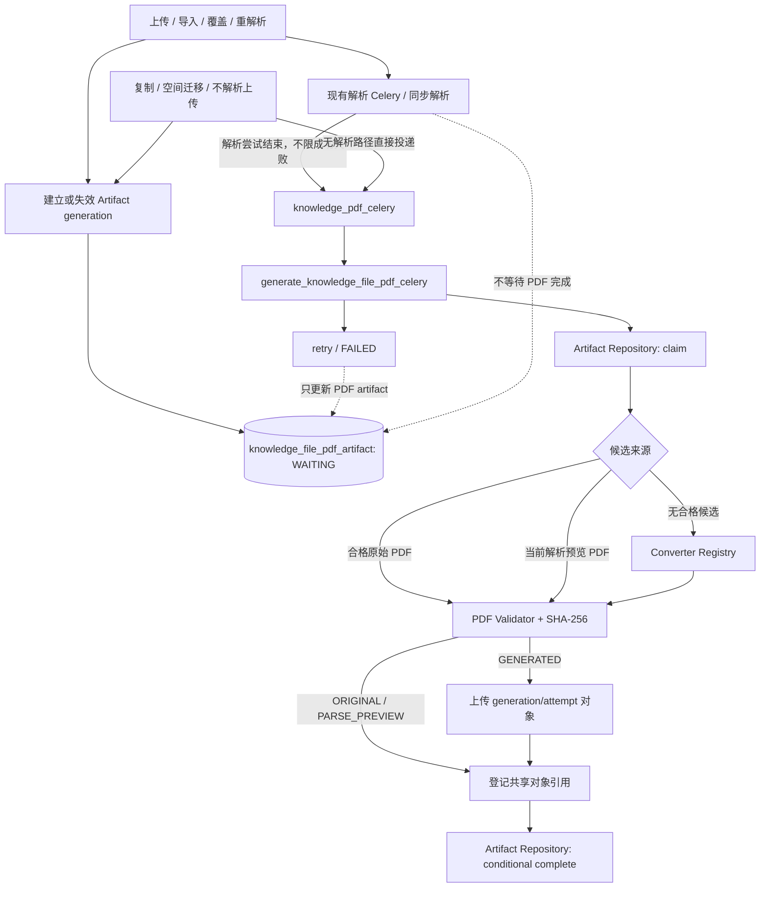
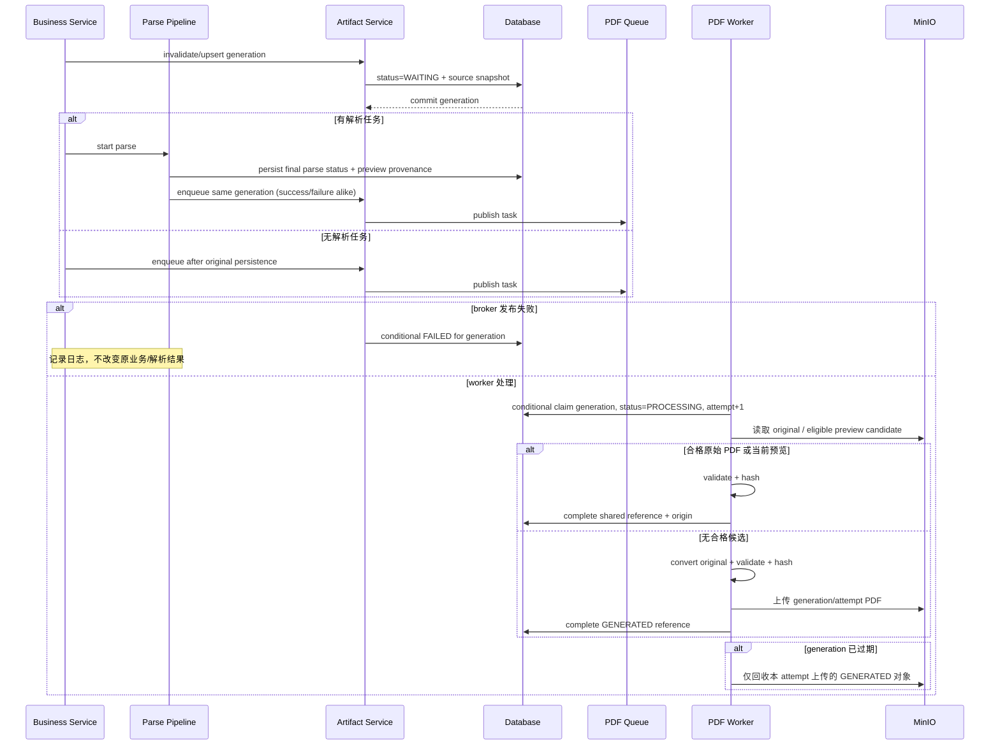
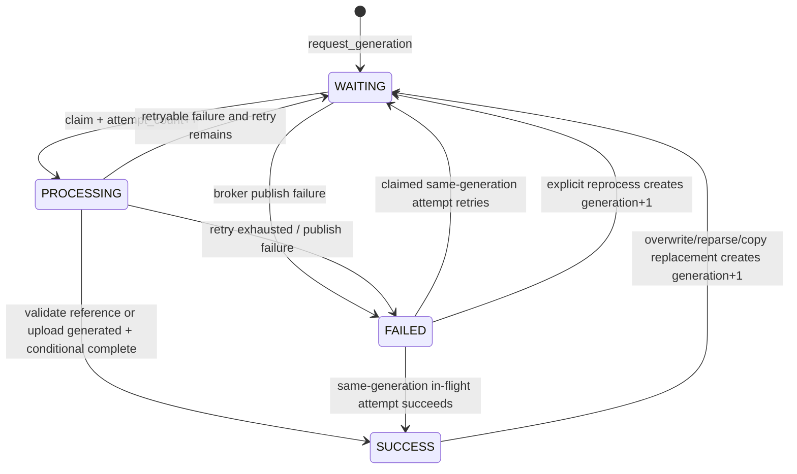

# 设计 Design：知识文件统一 PDF 产物

## 阅读摘要

- 本设计在现有 Knowledge 领域内增加独立 PDF 产物实体、状态机、转换器和专用 Celery Worker。
- 设计重点是：优先复用经过校验的原始/预览 PDF、按来源管理对象归属、不触碰知识解析状态、覆盖全部门户格式、通过 generation 阻断固定路径覆盖和旧任务竞争、通过独立队列隔离资源。
- 本阶段不切换下载、不补齐历史文件、不提供 API/页面/专用人工重试或定时补偿扫描。
- 当前状态：`approved`，`tasks.md` 已拆分并进入实现。

## 元信息 Metadata

- Feature ID: `063-unified-pdf-artifact`
- Status: `approved`
- Related requirements: `features/v2.6.0/063-unified-pdf-artifact/requirements.md`
- Created: `2026-07-20`
- Updated: `2026-07-21`
- Version: `v2.6.0`

## 1. 上下文 Context

### 1.1 现有架构

知识文件现有主流程为：

```text
上传/导入原文件
→ KnowledgeFile 持久化 + MinIO original object
→ parse_knowledge_file_celery / retry_knowledge_file_celery
→ KnowledgeFilePipeline
→ Loader + Transformer + Vector Store
→ KnowledgeFile.status = SUCCESS / FAILED
```

当前 PDF 相关能力分散在解析 Loader：

- `BishengWordLoader` 只在普通 Word 解析路径中尽力把预览 DOCX 转成 PDF；失败不会让解析失败。
- `HierarchicalWordLoader` 没有对应 PDF 预览步骤。
- `BishengPptLoader` 尝试生成 PDF 预览。
- `ExcelLoader`、文本、HTML、图片 Loader 没有统一 PDF 产物。
- `ExtraFileTransformer` 仅在 Loader 已产生本地文件时上传 `pdf_preview_object_name`。
- 当前下载服务仍读取 `KnowledgeFile.object_name`，批量下载亦基于原始对象组装 ZIP。

因此现有预览不能单独作为后续水印下载的事实源，但可以作为统一 Artifact 的候选对象：只有能够证明与当前源内容一致并通过统一 Validator 时才直接引用，否则由独立 PDF Worker 回退生成。

### 1.2 已检查文件 Relevant Files Inspected

- `src/backend/bisheng/knowledge/domain/models/knowledge_file.py`
- `src/backend/bisheng/knowledge/domain/repositories/implementations/knowledge_file_repository_impl.py`
- `src/backend/bisheng/knowledge/domain/services/knowledge_service.py`
- `src/backend/bisheng/knowledge/domain/services/knowledge_space_service.py`
- `src/backend/bisheng/knowledge/domain/services/knowledge_version_service.py`
- `src/backend/bisheng/knowledge/domain/services/knowledge_utils.py`
- `src/backend/bisheng/api/services/knowledge_imp.py`
- `src/backend/bisheng/knowledge/rag/knowledge_file_pipeline.py`
- `src/backend/bisheng/knowledge/rag/pipeline/loader/{word,ppt,excel,hierarchical,txt,html}.py`
- `src/backend/bisheng/knowledge/rag/pipeline/loader/utils/libreoffice_converter.py`
- `src/backend/bisheng/knowledge/rag/pipeline/transformer/extra_file.py`
- `src/backend/bisheng/common/utils/markdown_cmpnt/md_to_pdf.py`
- `src/backend/bisheng/worker/knowledge/file_worker.py`
- `src/backend/bisheng/worker/knowledge/space_migrate_worker.py`
- `src/backend/bisheng/worker/tenant_context.py`
- `src/backend/bisheng/core/database/tenant_filter.py`
- `src/backend/bisheng/core/database/alembic/versions/v2_6_0_f062_add_portal_course_tables.py`
- `src/backend/bisheng/core/storage/minio/minio_storage.py`
- `src/backend/bisheng/utils/file.py`
- `src/backend/bisheng/core/config/settings.py`
- `src/backend/entrypoint.sh`
- `src/backend/base.Dockerfile`
- `docker/bisheng/entrypoint.sh`
- `docker/docker-compose.yml`
- `src/backend/pyproject.toml`
- `features/v2.6.0/release-contract.md`

### 1.3 项目约束

- Router → Endpoint → Service → Repository → DB，不在 Service 中直接写 ORM 查询。
- 新表和迁移必须兼容 MySQL 与 DM8，使用项目 dialect helper 和 Alembic。
- 新实体必须带 `tenant_id`；任务必须显式传播租户上下文。
- 新实体模型模块必须加入 `tenant_filter._TENANT_AWARE_MODEL_MODULES`，确保租户过滤事件注册前已进入 SQLModel metadata；条件 UPDATE/DELETE 必须显式包含 `tenant_id`，不能依赖只拦截 SELECT 的全局过滤器。
- Celery 使用 `-P threads`；关键异常不能静默吞掉。
- 新增格式转换不能改变现有 Loader、预览、下载和解析状态语义。
- 工作区已有其他未提交修改；实现文件边界必须明确，禁止无关格式化。

### 1.4 现有验证基础

- Backend 测试目录：`src/backend/test/knowledge/`。
- 已有 Celery 上下文、知识上传、重试、复制、空间迁移、下载和 Loader 测试可作为回归基线。
- 项目命令：`uv run pytest`、`uv run ruff check`、`uv run ruff format --check`、`python -m compileall`、`scripts/arch-guard.sh`。
- 真实 LibreOffice/Chromium/MinIO/Worker 验证标记为 slow/e2e，在可控环境执行。

## 2. 目标 / 非目标 Goals / Non-Goals

### 2.1 目标 Goals

- 为每个范围内物理知识文件建立一个独立、当前的统一 PDF Artifact 记录；记录可以安全引用共享对象，不强制复制相同字节。
- 让 PDF 状态和失败完全独立于知识解析与搜索状态。
- 对全部 14 种门户扩展名提供确定的转换路由和输出校验。
- 覆盖上传、覆盖、重解析、复制、迁移和 Web 链接重导入入口。
- 使用 generation 和条件更新保证重复投递、文件覆盖和任务乱序安全。
- 通过 `ORIGINAL / PARSE_PREVIEW / GENERATED` 来源和所有权规则减少重复存储，且不误删原始或预览对象。
- 使用专用低并发队列隔离 LibreOffice/Chromium 资源消耗。
- 为后续历史补齐和水印下载提供稳定数据模型，但不提前实现其业务。

### 2.2 非目标 Non-Goals

- 不把统一 PDF 接入现有预览或下载。
- 不建立历史回填、定时补偿、人工重试或管理 API。
- 不扩展到门户未开放格式、音视频、OCR、水印或加密。
- 不修改现有 Loader 的 PDF 预览行为，也不删除 legacy PDF/preview 对象。
- 不引入通用文档转换微服务或新的消息中间件。
- 不承诺 Microsoft Office 像素级渲染，也不分发专有字体。

## 3. 边界承诺 Boundary Commitments

| Boundary | Allowed Change | Disallowed Change | Revalidation Trigger |
|---|---|---|---|
| Knowledge 数据 | 新增独立 PDF artifact 表、模型、Repository、迁移 | 把 PDF 状态写入 `KnowledgeFile.status/remark`；批量回填历史行 | 改为复用 `knowledgefile` 字段或引入历史数据写入 |
| 文件处理入口 | 原始对象持久化后建立 generation；解析路径在解析尝试结束后投递，非解析路径直接投递 | 让上传/解析/复制等待 PDF 完成；只在解析成功时投递 | PDF 失败开始影响主流程返回值，或新增入口无法获得解析结束事件 |
| 转换器 | 新增 Knowledge 专用转换器并复用现有运行时依赖 | 改写现有 Loader/Transformer 解析算法 | 转换器开始参与 chunk/vector 生成 |
| Celery | 新增 `knowledge_pdf_celery` 队列和独立低并发 Worker 服务 | 把转换任务路由到现有解析池，或与 API/高并发 Worker 同进程/容器 | 取消独立队列/服务或改变现有队列并发 |
| MinIO | 引用合格原始/预览对象；仅对不能复用的输入新增 generation 级 PDF；按来源维护所有权 | Artifact 清理删除共享原始/预览对象；未失效旧 Artifact 就覆盖固定路径 | 新增第四种来源，或共享对象的所有者/可变性规则改变 |
| API/前端/下载 | 无生产行为变更，仅运行回归验证 | 新增状态 API、页面、下载切换、水印 | 任何用户可见协议或下载内容变化 |
| 运维 | 新增配置、Worker 启动方式、日志和运行前置检查 | 增加 Beat 扫描或无上限重试 | 需要自动恢复长期 WAITING/PROCESSING |

- Allowed dependencies: 仅使用项目已有 `LibreOffice`、`playwright`/Chromium、`pymupdf`、`Pillow`、`markdown`、Celery、MinIO 与 SQLModel；不新增 Python 包。

## 4. 需求追踪 Requirements Traceability

| Requirement | Acceptance Criteria | Design Element | Verification Strategy |
|---|---|---|---|
| REQ-001 | AC-REQ-001-01..06 | 候选解析器、转换器注册表、三种 Artifact 来源、统一 PDF 校验器 | 复用/回退矩阵集成测试 + 代表性样本人工版式 QA |
| REQ-002 | AC-REQ-002-01..04 | 独立 Artifact 表、状态 Service、成功元数据 | Repository/Service/DB 回归测试 |
| REQ-003 | AC-REQ-003-01..06 | generation 失效、解析结束投递、无解析直投及各业务入口 | 顺序/入口参数化测试 + migration 空回填验证 |
| REQ-004 | AC-REQ-004-01..05 | bound Celery task、配置化 retry、结构化日志、发布失败降级 | Celery task/service/log/source scan 测试 |
| REQ-005 | AC-REQ-005-01..06 | generation、条件 claim/complete、来源所有权、对象回收与删除集成 | 并发与乱序回归、三来源 MinIO mock 集成测试 |
| REQ-006 | AC-REQ-006-01..04 | 共享引用不改变预览/下载行为、依赖复用 | 现有预览/下载/API 回归和 lockfile diff |
| REQ-007 | AC-REQ-007-01..07 | 专用 Worker 服务、超时、临时目录、受限 HTML/Office 转换、tenant header、最小子进程环境、Shell/Bash 启动兼容 | routing/security/multi-tenant/deployment/shell runtime smoke |

## 5. 总体架构 Architecture

### 5.1 模式

- Pattern: `独立 Artifact 状态机 + 解析结束异步投递 + 候选复用/生成回退 + generation 条件提交 + 来源所有权`。
- Rationale: 统一 PDF 是经过校验的逻辑 Artifact，不等于必须新增一份字节；独立实体可以统一原始 PDF、当前解析预览和新生成对象，避免修改 `knowledgefile.update_time` 和解析状态，同时为未来水印下载提供单一事实源。
- Preserved existing patterns: 继续使用 Knowledge 领域 Service/Repository、Celery task、MinIO、租户 ContextVar 和现有运行镜像依赖。
- Architecture change justification: 新增独立 Worker 队列与服务会增加一个部署单元，但能限制 LibreOffice/Chromium 并发、隔离不可信转换子进程，并满足“解析不受 PDF 失败与资源争用影响”的边界。

### 5.2 组件关系



### 5.3 调度时序



业务 Service 在原始文件及数据库记录持久化后建立 Artifact generation。有解析任务时，解析最终状态和预览来源标记先持久化，再投递同一 generation；解析成功不是前提。`enqueue_processing=false`、复制和迁移等无解析路径在业务回滚边界结束后直接投递。Celery 发布始终发生在 Artifact 事务提交之后；发布失败通过 generation 条件更新为 `FAILED`，不向上传、复制、迁移或解析主流程抛出。

## 6. 数据模型 Data Model

### 6.1 `KnowledgeFilePdfArtifact`

表名：`knowledge_file_pdf_artifact`。

| Field | Type | Constraint / Meaning |
|---|---|---|
| `id` | `INTEGER` | 主键 |
| `tenant_id` | `INTEGER` | NOT NULL；多租户自动注入/过滤 |
| `knowledge_file_id` | `INTEGER` | NOT NULL；外键指向 `knowledgefile.id`，`ON DELETE CASCADE`；唯一，一个物理文件只有一个当前 Artifact 状态记录 |
| `source_object_name` | `VARCHAR(512)` | 本 generation 调度时的原始对象快照 |
| `source_md5` | `VARCHAR(64)` | 可空；本 generation 源内容标识 |
| `generation` | `INTEGER` | NOT NULL，默认 1；每次显式重新处理递增 |
| `status` | `INTEGER` | `WAITING=1 / PROCESSING=2 / SUCCESS=3 / FAILED=4` |
| `artifact_origin` | `INTEGER` | 可空；成功时为 `ORIGINAL=1 / PARSE_PREVIEW=2 / GENERATED=3`，同时决定对象所有者和清理规则 |
| `object_name` | `VARCHAR(512)` | 可空；经过校验的当前 PDF 对象引用，可以是共享原始/预览对象或 Artifact 生成对象；只有当前状态为 SUCCESS 时才可读取 |
| `artifact_sha256` | `VARCHAR(64)` | 可空；成功 PDF 校验时计算的内容摘要，用于审计和固定路径变更诊断 |
| `attempt_count` | `INTEGER` | NOT NULL，默认 0；首次执行和每次 retry 均累计 |
| `last_error` | `VARCHAR(2000)` | 可空；有限长度、脱敏后的最后错误摘要 |
| `page_count` | `INTEGER` | 可空；成功产物页数 |
| `artifact_size` | `BIGINT` | 可空；成功产物字节数 |
| `started_at` | `DATETIME` | 可空；当前 generation 最近一次开始时间 |
| `completed_at` | `DATETIME` | 可空；当前 generation 成功时间 |
| `create_time` | `DATETIME` | NOT NULL |
| `update_time` | `DATETIME` | NOT NULL，使用 `UPDATE_TIME_SERVER_DEFAULT` |

索引与约束：

- UNIQUE `uk_kf_pdf_artifact_file (knowledge_file_id)`：文件 ID 在当前库全局唯一，避免同一文件产生多条“当前”记录。
- FOREIGN KEY `fk_kf_pdf_artifact_file (knowledge_file_id) -> knowledgefile.id ON DELETE CASCADE`：只兜底清理数据库记录，不负责删除 MinIO 对象；所有业务删除路径仍须在删除父记录前取得 Artifact 对象快照。
- INDEX `ix_kf_pdf_artifact_tenant_status (tenant_id, status)`：便于数据库运维检查，并为后续独立历史回填 Feature 留出查询基础；本 Feature 不使用该索引做扫描任务。
- INDEX `ix_kf_pdf_artifact_tenant_update (tenant_id, update_time)`：便于按租户定位近期失败/处理中记录。
- Service 创建 Artifact 时必须校验 `KnowledgeFile.tenant_id == Artifact.tenant_id`；Repository 的条件写入必须同时包含 `tenant_id + knowledge_file_id + generation`，防止 UPDATE/DELETE 绕过只作用于 SELECT 的租户过滤事件。
- `artifact_origin` 决定所有权：`GENERATED` 由 Artifact Service 拥有和清理；`ORIGINAL` 由 `KnowledgeFile.object_name` 生命周期拥有；`PARSE_PREVIEW` 由现有 preview 生命周期拥有。不得仅根据对象前缀猜测所有权。
- 解析预览候选必须携带与源内容绑定的 provenance：使用现有 `user_metadata.pdf_preview_object_name` 保存候选对象名，新增内部键 `user_metadata.pdf_preview_source_md5` 保存生成该预览时的非空源摘要。只有候选对象名存在、该摘要非空且同时等于 `Artifact.source_md5` 和当前 `KnowledgeFile.md5` 时才可复用。Artifact 完成后仍以自身的 `source_md5 + artifact_sha256 + generation` 为事实记录；没有该 provenance 的历史预览不能自动复用。
- 不依赖 MySQL 专属 UPSERT、JSON 查询或 CHECK 表达式。
- 不对 `knowledgefile` 增加 PDF 字段，避免 Artifact 状态更新触发文件业务 `update_time`。

### 6.2 行不存在语义

- 上线前历史文件：没有 Artifact 行，表示 `NOT_REQUESTED`，不是失败。
- 目录、收藏引用、无原始对象或不支持扩展名：不创建 Artifact 行并记录跳过原因。
- 新增或重新处理物理文件：创建或重置 Artifact 行并进入 `WAITING`。

### 6.3 重新生成时旧对象处理

- `request_generation()` 递增 generation、更新源快照并清空成功元数据，但暂时保留旧 `object_name + artifact_origin` 作为清理指针。
- Accessor 只有在 `status=SUCCESS` 且 generation 为当前记录时才返回 `object_name`，因此旧对象不会被下游视为当前产物。
- 新 generation 成功提交后，Worker 只有在被替换对象的来源为 `GENERATED` 时才尽力删除；`ORIGINAL/PARSE_PREVIEW` 共享对象只解除 Artifact 引用，不执行删除。
- 新 generation 最终失败时，旧生成对象可暂时留存但不可用；下一次成功或文件删除会再次清理。共享对象继续由其既有所有者管理。
- 原始和预览路径均可能按 `file_id` 固定覆盖。覆盖/重新解析入口必须先提交 `generation + 1, status=WAITING` 使旧 accessor 失效，再写入固定路径；禁止在旧 Artifact 仍为 `SUCCESS` 时替换其共享字节。

### 6.4 迁移与回滚

- Alembic upgrade 只创建表和索引，不执行 `INSERT ... SELECT`，保证历史文件零回填。
- migration revision 为 `f063_knowledge_file_pdf_artifact`，`down_revision` 接当前 v2.6.0 head `f062_add_portal_course_tables`；若实施前 Alembic head 已变化，先更新设计并重新确认迁移基线。
- migration 使用 `table_exists/index_exists` 等 dialect helper，兼容重复部署和 MySQL/DM8。
- 新模型模块加入 `bisheng.core.database.tenant_filter._TENANT_AWARE_MODEL_MODULES`，并以自动化测试阻止后续注册遗漏。
- downgrade 可删除新表，但不会删除 MinIO 对象；仅允许在确认无产物或已经导出对象清单的非生产环境执行。
- 生产回滚默认保留新表和已有对象：先关闭调度，再停止 PDF Worker，最后回滚应用代码。

## 7. 组件与接口 Components and Interfaces

### 7.1 Artifact Repository

职责：封装全部 PDF Artifact ORM 查询和条件状态更新，不增加 legacy DAO。

建议接口：

```text
request_generation(tenant_id, file_snapshot) -> GenerationRequest
claim_generation(tenant_id, file_id, generation, started_at) -> ClaimResult
mark_retry(tenant_id, file_id, generation, attempt_count, last_error) -> bool
complete_generation(tenant_id, file_id, generation, origin, object_name, artifact_sha256, page_count, artifact_size) -> CompleteResult
fail_generation(tenant_id, file_id, generation, attempt_count, last_error) -> bool
find_current(tenant_id, file_id) -> KnowledgeFilePdfArtifact | None
find_by_file_ids(tenant_id, file_ids) -> list[KnowledgeFilePdfArtifact]
delete_by_file_ids(tenant_id, file_ids) -> int
```

条件状态更新至少包含 `tenant_id + knowledge_file_id + generation`；`claim` 允许同 generation 的 Celery redelivery 重新进入处理，但重复成功任务直接返回 already-completed，不重复转换。

Requirements: `REQ-002`, `REQ-004`, `REQ-005`, `REQ-007`。

### 7.2 `KnowledgePdfArtifactService`

职责：

- 校验 `file_type`、扩展名、`object_name` 和来源是否属于本 Feature。
- 从 `KnowledgeFile` 提取只读源快照，不修改知识文件。
- 在受管 Session 中调用 Repository 创建/递增 generation。
- 对固定原始/预览路径的覆盖场景，保证旧 Artifact 先失效并进入新 generation，再允许对象字节被替换。
- 普通文件确认覆盖时，临时上传响应必须携带新内容 MD5；重试编排在覆盖固定原始对象前以“目标固定对象名 + 新 MD5”建立 generation，并在对象复制成功后把同一 MD5 持久化到 `KnowledgeFile.md5`。禁止沿用旧内容 MD5 建立新 generation。
- 有解析任务时由解析完成 hook 在最终状态和预览 provenance 持久化后投递；无解析任务时由业务 Service 在原始对象提交后直接投递。两者都显式使用 `knowledge_pdf_celery` 和 `headers={"tenant_id": ...}`。
- 捕获明确的 broker 发布异常，将当前 generation 标记为失败并记录日志；不得隐藏编程错误。
- 提供单文件和批量调度入口，供上传、重试、复制和迁移复用。
- 解析结束投递不区分 `KnowledgeFile.status` 成功或失败；相同 generation 的重复完成 hook 必须幂等发布或由 Worker 幂等消费。
- 提供删除前的 Artifact 对象查询和来源感知清理，只把 `GENERATED` 对象交给 Artifact 删除逻辑。

同步和异步业务入口可分别提供 `request_generation_sync` / `request_generation` 包装，但必须复用同一状态规则，不允许各自实现一套 ORM 查询。

Requirements: `REQ-002`, `REQ-003`, `REQ-004`, `REQ-005`。

### 7.3 PDF Worker

任务名建议：`bisheng.worker.knowledge.pdf_artifact_worker.generate_knowledge_file_pdf_celery`。

任务参数：

```text
knowledge_file_id: int
generation: int
tenant_id: int
```

`tenant_id` 同时放入 task headers 和显式参数：headers 供通用 Celery signal 恢复 ContextVar，参数用于日志与防御性一致性校验。

处理步骤：

1. 恢复并校验 tenant context。
2. 条件 claim 当前 generation；已成功或已过期时幂等退出。
3. 重新读取 `KnowledgeFile`，校验 `object_name/md5/tenant_id` 仍与 Artifact 源快照一致。
4. 若源扩展名为 PDF，下载当前原始对象并直接进入统一 Validator；校验成功后以 `ORIGINAL` 完成，不复制或上传。
5. 否则解析当前 preview candidate：对象必须为 PDF，`pdf_preview_source_md5` 必须非空且同时等于 `Artifact.source_md5` 和当前 `KnowledgeFile.md5`；满足后下载并校验，成功则以 `PARSE_PREVIEW` 完成。
6. 原始 PDF/预览候选缺失、过期或校验失败时，使用 `TemporaryDirectory` 下载原始对象并按扩展名调用转换器；预览校验失败属于可回退分支，只有回退生成也失败时才进入任务 retry。
7. 所有候选共用 Validator，读取页数、字节大小并计算 `artifact_sha256`。
8. 仅 `GENERATED` 为本次执行生成随机 `attempt_token`，上传到 `knowledge/pdf-artifacts/{knowledge_file_id}/{generation}/{attempt_token}.pdf`，Content-Type 固定为 `application/pdf`。
9. 以“同 generation 首个成功提交者获胜”条件提交 `origin/object_name/hash/page_count/size`；提交失败、已有 SUCCESS 或 generation 过期时只删除本 attempt 上传的 `GENERATED` 对象。
10. 成功后只有被替换旧来源为 `GENERATED` 时才尽力删除旧对象；共享原始/预览对象不得删除。

异常策略：

- 默认 `max_retries=3`，即首次执行后最多重试 3 次。
- 每次可重试失败仅在当前 generation 尚未 SUCCESS 时条件更新为 `WAITING`，写 attempt/error，再调用 `self.retry()`；已 claim 的并发 attempt 可将较早 attempt 写入的 `FAILED` 恢复为 `WAITING`，但新的 claim 不能从 `FAILED` 开始。
- 重试耗尽后仅在当前 generation 尚未 SUCCESS 时条件更新为 `FAILED`，保留 traceback 并让 Celery 任务表现为失败；晚到失败不得覆盖并发 attempt 已提交的 SUCCESS。
- generation 过期、文件已删除、已成功重复投递属于幂等终止，不消耗后续 retry。
- `TemporaryDirectory` 的清理放在 `finally`/上下文管理器中，不依赖任务成功。

Requirements: `REQ-001`, `REQ-002`, `REQ-004`, `REQ-005`, `REQ-007`。

### 7.4 转换器注册表

统一接口：

```text
convert(source_path: Path, output_dir: Path, context: ConversionContext) -> ConversionResult

ConversionResult {
  pdf_path: Path
  converter: str
}
```

转换器只负责生成候选 PDF；所有实现共用同一个 Validator，不自行更新数据库或上传 MinIO。

| Group | Extensions | Engine | Design |
|---|---|---|---|
| PDF | `pdf` | PyMuPDF 校验 + 原始对象引用 | 打开并验证非加密、页数与结构；记录 `ORIGINAL`、摘要和原对象名，不复制相同字节 |
| Office | `doc/docx/ppt/pptx/xls/xlsx/csv` | 合格预览优先 + LibreOffice Headless 回退 | 当前源匹配的 PDF 预览先校验并登记 `PARSE_PREVIEW`；否则每任务独立 UserInstallation，从原文件转换并登记 `GENERATED` |
| Text/Web | `txt/md/html` | F063 `TextWebPdfConverter` + Playwright Chromium | 三类输入规范化为受控 HTML；强制清洗后使用隔离 context 打印 PDF |
| Image | `png/jpg/jpeg` | Pillow + PyMuPDF | 校验真实图片格式和像素上限，处理 EXIF 方向；按图片纵横比放入页面，保持比例和完整边界，不执行 OCR |

Text/Web 统一管道：

```text
TXT  → 编码检测与解码 → HTML escape → <pre class="plain-text">
MD   → Markdown 解析 → sanitize_html_for_pdf → 固定 HTML 模板
HTML → 解码 → sanitize_html_for_pdf → 固定 HTML 模板
                                      ↓
                         受限 Chromium context
                                      ↓
                              page.pdf() → Validator
```

- TXT 模板使用 `white-space: pre-wrap` 和 `overflow-wrap: anywhere`，保留换行与有意义空白，同时避免长行被页面裁切。
- Markdown 启用现有项目已经使用的扩展集合，使标题、列表、表格、围栏代码块和行内内容进入同一清洗与打印流程。
- HTML 输入只保留 sanitizer 允许的正文与内联样式；远程字体、远程图片、脚本、`<base>` 和其他主动内容不属于“内容完整”验收依赖。
- F063 复用 `common/utils/markdown_cmpnt/md_to_pdf.py` 中的 `sanitize_html_for_pdf`、Markdown 解析配置和可适用的打印样式，但由 Knowledge 模块提供专用 `TextWebPdfConverter`。不得不加约束地调用现有 `html_to_pdf_with_playwright()` 或现有浏览器渲染入口，因为其请求阻断与原始 HTML 强制清洗边界不足以满足 `REQ-007`。

LibreOffice 转换器只复用现有 `get_libreoffice_path()` 和运行环境，不修改现有 `_convert_file_extension()` 的返回/降级语义。新转换器自行抛出稳定的内部异常类型，以便 Worker 记录失败阶段。

所有输入均视为不可信文件：扩展名只用于路由，实际格式必须由 PyMuPDF/Pillow/LibreOffice 打开结果再次验证；本地源文件使用系统生成 basename 并只保留受控扩展名，禁止把用户文件名用于本地路径、命令参数或对象名。Pillow 的 decompression-bomb 警告/异常和超出配置像素上限必须作为转换失败处理。

Office 子进程使用参数数组和 `shell=False`，工作目录、`HOME/TMPDIR/XDG_*`、LibreOffice profile 均指向本 attempt 的临时目录；传入环境采用白名单，不继承数据库、MinIO、Celery、LLM 等应用密钥。使用 headless/safe-mode，宏安全级别设为最高且禁止自动更新外部链接；生产 PDF Worker 容器的出站网络策略作为第二层阻断。

CSV 在转换前检测编码并生成 UTF-8 临时副本；分隔符继续按 CSV 标准和 LibreOffice import filter 处理。表格允许横向分页，但任何已使用单元格内容不能因为只取首屏而丢失。

Requirements: `REQ-001`, `REQ-006`, `REQ-007`。

### 7.5 PDF Validator

校验规则：

- 文件存在且字节数大于 0。
- PyMuPDF 可以打开。
- `needs_pass` 为 false。
- `page_count > 0`。
- 遍历页面对象不会抛出结构错误；不要求每页都含可提取文本，以支持扫描 PDF 和图片 PDF。

Validator 返回 `page_count`、`artifact_size` 和 `artifact_sha256`。原始 PDF 校验失败直接作为任务失败；预览候选校验失败先回退生成，只有生成也失败时才进入统一 retry；任何无效对象都不得登记为 `SUCCESS`。

Requirements: `REQ-001`, `REQ-004`。

### 7.6 HTML/Markdown 安全渲染

- 复用 `common/utils/markdown_cmpnt/md_to_pdf.py::sanitize_html_for_pdf` 的主动内容清洗逻辑，但不直接复用其当前允许 HTTP(S) 资源的浏览器实现；原始 HTML 和 Markdown 生成的 HTML 均先清洗。
- 每次转换至少创建独立 Chromium browser context，并设置 `java_script_enabled=False`；禁止复用用户页面状态、Cookie、缓存或持久化 profile。
- 对所有 `http://`、`https://`、`file://` 和其他非 `data:`/内部文档请求执行 route abort。
- 不使用用户提供的 `<base>`、远程字体、远程图片或脚本完成验收；被阻断资源记录数量，不记录完整 URL。
- `page.set_content()` 使用固定超时和 `domcontentloaded`，不等待网络空闲。
- 打印 CSS 使用明确的中文 fallback 字体、A4/自动横向策略、分页和 `overflow-wrap`。
- 不将文件正文写入日志或异常消息。

Requirements: `REQ-001`, `REQ-007`。

### 7.7 触发入口

Artifact generation 必须在业务写入完成后建立；固定路径覆盖场景必须在写入新字节前先失效旧 generation。PDF 任务本身不放入 Loader/Transformer，也不在 Celery parse task 内隐式递增 generation；解析任务只在最终状态持久化后投递已经建立的 generation，避免解析重投产生重复代次。

| Trigger | Integration Point | Behavior |
|---|---|---|
| 普通知识上传 | 上传 Service 建立 generation；`parse_knowledge_file_celery` 完成 hook | 原始对象成功后进入 WAITING；解析最终状态落库后投递，同步解析使用等价 completion hook |
| 门户空间上传 | `KnowledgeSpaceService.add_file` + parse completion hook | 正常解析结束后投递；`enqueue_processing=false` 在原始对象提交后直接投递 |
| Web 链接导入 | 新建和 `_overwrite_web_link_file` + parse completion hook | 固定原始/HTML 路径覆盖前先失效旧引用；解析结束后投递，统一 PDF 以持久原始对象为生成回退源 |
| 覆盖/解析重试 | `KnowledgeService.process_one_file`、`KnowledgeUtils` retry 编排及 `KnowledgeSpaceService` 重解析入口 | 临时覆盖响应传递新内容 MD5；用户操作以目标固定对象名和新 MD5 先递增一次 generation 并清空当前可用状态，再覆盖对象或启动解析；解析完成 hook 只投递该 generation |
| 文件复制 | `copy_normal` | 目标原始对象和目标文件状态写入后直接投递；不复用源文件的 Artifact/preview 引用 |
| 空间迁移 | `space_migrate_worker` 经 `copy_normal` | 复用复制触发，不额外重复调度 |

解析 completion hook 必须在成功、失败、超时和内容违规分支均执行；解析失败不阻止 PDF 任务。调度失败全部使用 best-effort 边界：记录 Artifact `FAILED` 和日志，但不改变主业务已完成状态。

Requirements: `REQ-003`, `REQ-004`, `REQ-006`。

### 7.8 删除与对象清理

- 所有已知删除入口必须在删除 `KnowledgeFile` 前按 `tenant_id + file_ids` 批量读取 Artifact，形成至少包含 `file_id/tenant_id/object_name/artifact_origin/generation` 的删除快照；禁止在父记录删除后再查询 Artifact 指针。
- `KnowledgeService` 单文件/整库删除、`KnowledgeSpaceService` 单文件/批量/目录删除和 `KnowledgeVersionService.delete_version` 均接入同一快照方法，避免逐文件 N+1 查询。
- `delete_knowledge_file_celery` 增加向后兼容的可选 `pdf_artifact_snapshots` 参数；门户延迟删除路径把快照随任务传入，版本删除和同步删除路径把快照传给 `delete_minio_files()`，两条路径共用同一对象删除 helper。
- 删除 helper 将原始对象、`preview_file_object_name`、`user_metadata.pdf_preview_object_name` 和 `GENERATED` Artifact 对象汇总为带 owner 的集合并按路径去重；Word PDF preview 也必须纳入既有 preview 清理。`ORIGINAL/PARSE_PREVIEW` 不作为额外 Artifact 对象加入，避免重复删除共享路径。
- 父记录删除后的延迟清理必须显式携带删除快照和 tenant header；对象 NotFound 视为幂等成功，其他 MinIO 失败记录包含对象名和 file/generation 的 warning，不能伪装对象已经删除。
- `ON DELETE CASCADE` 只保证 Artifact 数据库行不成为孤儿；业务 Service 仍负责 MinIO 清理，不能把外键级联当作对象存储清理机制。
- 若文件在 PDF Worker 上传前被删除，Worker 在提交 SUCCESS 时因 Artifact 行不存在而失败，并仅尽力删除刚上传的 `GENERATED` 对象；共享候选由文件删除链路负责。若删除发生在 claim 前，任务幂等终止。
- 调度前业务回滚发生时不应留下 Artifact；所有生成调度均位于业务回滚清理边界之后。

Requirements: `REQ-005`, `REQ-006`。

### 7.9 安全评审结论

- 本 Feature 不新增 Router、API schema、Cookie、Token、权限或用户可见操作，因此认证、授权、CSRF 和接口限流逻辑保持现状；现有上传和下载权限回归测试必须继续通过。
- 文件扩展名、现有上传大小限制、实际解析格式和图片像素上限采用白名单/上限校验；数据库操作只使用 Repository 与参数化 ORM 表达式，不拼接用户输入 SQL。
- HTML 清洗、浏览器请求阻断、Office 宏/外链禁用、最小子进程环境、独立 Worker 服务和网络/资源限制共同形成纵深防御，任一部署级安全 smoke 未通过时不得开启 `pdf_artifact.enabled`。
- 不新增密钥或依赖；日志和 `last_error` 只保留有限诊断字段，不记录正文、凭据、完整 URL、环境变量或堆栈响应给用户。

Requirements: `REQ-006`, `REQ-007`。

## 8. 状态机与并发 State Machine



### 8.1 generation 规则

- 每次业务层显式触发重新生成时 `generation + 1`。
- 对会覆盖 `original/{file_id}.*` 或 `preview/{file_id}.pdf` 的操作，generation 失效提交必须先于对象写入；即使后续上传或解析失败，也不得恢复旧 `SUCCESS` 引用。
- Celery 自身 retry、redelivery 和重复 publish 不创建新 generation。
- 任务的所有状态写入都带 generation 条件。
- 完成时再次核对 `KnowledgeFile.object_name/md5/tenant_id` 与源快照；不一致则不发布为 SUCCESS。

### 8.2 claim 规则

- 当前 generation 且状态 `WAITING/PROCESSING`：允许原子累计 attempt 并处理；允许同 generation 的少量重复执行，但每次执行必须使用独立 `attempt_token` 对象路径。已经进入 `FAILED` 后不接受新的 claim，避免 broker 重投绕过固定重试上限。
- 当前 generation 且状态 `SUCCESS`：直接返回 already-completed。
- generation 不匹配、Artifact 不存在或文件已删除：返回 stale/not-found，任务幂等结束。
- 同 generation 并发完成采用 first-success-wins：`complete_generation` 允许从 `WAITING/PROCESSING/FAILED` 条件更新为 SUCCESS；第一个成功者登记引用，后续成功者只回收各自上传的 `GENERATED` 候选对象，共享候选只放弃引用；任何晚到失败均不得覆盖 SUCCESS。
- 状态和 attempt 计数通过带 `tenant_id + knowledge_file_id + generation` 的原子条件 UPDATE 或行锁维护，不能依赖进程内锁。

### 8.3 当前产物读取规则

本 Feature 不提供外部 API，但 Domain accessor 必须从一开始固定语义：

```text
artifact exists
AND artifact.status == SUCCESS
AND artifact.object_name is not empty
AND artifact.artifact_origin in (ORIGINAL, PARSE_PREVIEW, GENERATED)
AND artifact.artifact_sha256 is not empty
AND artifact source snapshot still matches current KnowledgeFile
→ current PDF artifact
```

后续水印下载只能调用该 accessor，不得绕过状态直接读取 `object_name`。Accessor 返回统一引用契约，不向调用方暴露对象是否复制；水印链路只需按当前 tenant 和对象名读取 PDF。

## 9. 配置与部署 Configuration / Deployment

### 9.1 应用配置

在 `KnowledgeConf` 下增加 `pdf_artifact` 配置：

```yaml
knowledge:
  pdf_artifact:
    enabled: true
    queue_name: knowledge_pdf_celery
    max_retries: 3
    retry_base_seconds: 30
    retry_max_seconds: 300
    conversion_timeout_seconds: 300
```

- `enabled=false` 只阻止新调度，不删除记录或对象。
- queue 名默认固定；调度时显式传 `queue=`，不依赖用户自定义 wildcard route 顺序。
- retry 使用有上限指数退避，但最大重试次数固定由配置控制。

### 9.2 Worker

- 新增 `start_pdf`：`celery -A bisheng.worker.main worker -l info -c ${KNOWLEDGE_PDF_CONCURRENCY:-2} -P threads -Q knowledge_pdf_celery -n knowledge_pdf@%h`。
- `entrypoint.sh pdf` 只启动 PDF Worker。
- `src/backend/entrypoint.sh` 使用 Bash 数组、`local`、`wait -n` 和 `pipefail`；而现有镜像入口使用 `sh entrypoint.sh`。脚本必须在 `set -Eeuo pipefail` 和 `PIDS=()` 之前检测 `BASH_VERSION`，非 Bash 执行器通过 `exec bash "$0" "$@"` 原参数重启自身，不能要求修改 Dockerfile 或 Compose 命令。
- 两份 `entrypoint.sh worker` 的现有 Worker/Beat 组合保持不变；不得把 PDF queue 加入 100 并发 `start_min_worker` 或其他高并发 Worker。
- 更新 `src/backend/entrypoint.sh` 与部署挂载使用的 `docker/bisheng/entrypoint.sh`，避免镜像与部署脚本漂移。
- 项目 `docker/docker-compose.yml` 保持不变，本 Feature 不新增 `pdf-worker`、专用网络或任何 Compose 依赖调整。
- `src/backend/base.Dockerfile` 保持不变；现有镜像已安装 LibreOffice、Playwright Chromium、PyMuPDF、Pillow 和中文字体，可直接承载 PDF Worker。
- 实际部署环境必须以独立服务/进程运行 `sh entrypoint.sh pdf`，并在该环境中落实 CPU、内存、PID、临时空间、只读文件系统与默认拒绝出站策略，仅允许访问数据库、Celery broker 和 MinIO 必需端点。非 root 运行加固由后续部署设计独立落实。
- LibreOffice/Chromium 子进程继续使用最小环境变量和应用层请求阻断；部署级资源/网络约束以实际运行环境 smoke 通过为准。

### 9.3 运行前置检查

PDF Worker 启动和 smoke 验证必须确认：

- `soffice` 或 `libreoffice` 可执行。
- Chromium 已安装且能执行 `page.pdf()`。
- PyMuPDF 与 Pillow 可导入。
- `fc-match` 能解析至少一个中文字体；缺少目标字体时记录明确 warning。
- MinIO、数据库和 Celery broker 可连接。
- PDF Worker 资源限制、网络策略和子进程环境白名单已生效；转换子进程环境中不存在数据库、MinIO、Celery、LLM 等应用密钥。

前置检查失败不阻止 API/现有知识 Worker 启动；PDF Worker 或任务保持可诊断失败。

Requirements: `REQ-004`, `REQ-006`, `REQ-007`。

## 10. 文件结构计划 File Structure Plan

### 10.1 新建文件

| Path | Action | Responsibility | Linked Requirement |
|---|---|---|---|
| `features/v2.6.0/063-unified-pdf-artifact/requirements.md` | create | 需求、验收和验证方法 | REQ-001..007 |
| `features/v2.6.0/063-unified-pdf-artifact/design.md` | create | 架构、数据、状态和测试设计 | REQ-001..007 |
| `features/v2.6.0/063-unified-pdf-artifact/spec.md` | create | Feature 评审摘要 | REQ-001..007 |
| `src/backend/bisheng/knowledge/domain/models/knowledge_file_pdf_artifact.py` | create | Artifact SQLModel、状态与 `ORIGINAL/PARSE_PREVIEW/GENERATED` 来源枚举 | REQ-002, REQ-005, REQ-007 |
| `src/backend/bisheng/knowledge/domain/repositories/interfaces/knowledge_file_pdf_artifact_repository.py` | create | Repository 契约 | REQ-002, REQ-004, REQ-005 |
| `src/backend/bisheng/knowledge/domain/repositories/implementations/knowledge_file_pdf_artifact_repository_impl.py` | create | 条件状态更新和批量查询 | REQ-002, REQ-004, REQ-005 |
| `src/backend/bisheng/knowledge/domain/services/knowledge_pdf_artifact_service.py` | create | generation 失效、解析结束/无解析调度、候选来源解析、所有权感知清理 | REQ-001..005, REQ-007 |
| `src/backend/bisheng/knowledge/pdf/__init__.py` | create | PDF 子包边界 | REQ-001 |
| `src/backend/bisheng/knowledge/pdf/converter.py` | create | 生成回退的转换器注册、格式校验、子进程隔离及 Office/Image 实现；提供 F063 专用 `TextWebPdfConverter` | REQ-001, REQ-006, REQ-007 |
| `src/backend/bisheng/knowledge/pdf/validator.py` | create | 共享引用与生成输出共用的 PDF 有效性、元数据和 SHA-256 校验 | REQ-001, REQ-004 |
| `src/backend/bisheng/worker/knowledge/pdf_artifact_worker.py` | create | 候选选择、Celery retry、按需上传、来源/代次条件提交和 GENERATED 回收 | REQ-001..005, REQ-007 |
| `src/backend/bisheng/core/database/alembic/versions/v2_6_0_f063_knowledge_file_pdf_artifact.py` | create | MySQL/DM8 兼容建表迁移，无历史回填 | REQ-002, REQ-003 |
| `src/backend/test/knowledge/test_pdf_artifact_model.py` | create | 模型、来源/摘要字段、迁移零回填、外键级联和租户模型注册 | REQ-002, REQ-003, REQ-005, REQ-007 |
| `src/backend/test/knowledge/test_pdf_artifact_repository.py` | create | 状态机、条件更新、generation 并发 | REQ-002, REQ-004, REQ-005 |
| `src/backend/test/knowledge/test_pdf_artifact_service.py` | create | 调度、发布失败、入口过滤和清理 | REQ-003..005, REQ-007 |
| `src/backend/test/knowledge/test_pdf_artifact_worker.py` | create | 三来源选择、preview fallback、retry、tenant、幂等和来源感知回收 | REQ-001..005, REQ-007 |
| `src/backend/test/knowledge/pdf/test_unified_pdf_converter.py` | create | 全格式生成回退、共享候选校验、安全和 PDF 元数据 | REQ-001, REQ-006, REQ-007 |
| `src/backend/test/knowledge/test_pdf_artifact_triggers.py` | create | 上传后解析完成、解析失败、无解析上传、覆盖失效、复制和迁移触发 | REQ-003, REQ-006 |

### 10.2 修改文件

| Path | Action | Responsibility | Linked Requirement |
|---|---|---|---|
| `features/v2.6.0/release-contract.md` | modify | 登记 Artifact Owner Feature 与依赖 | REQ-002 |
| `src/backend/bisheng/knowledge/domain/services/knowledge_utils.py` | modify | 定义 generation/attempt 级生成对象名；确认覆盖时校验并持久化新内容 MD5；固定对象覆盖前以新源快照失效 generation；重解析结束投递 | REQ-001, REQ-003, REQ-005 |
| `src/backend/bisheng/knowledge/domain/services/knowledge_service.py` | modify | 普通知识上传 generation、临时覆盖响应传递新内容 MD5、同步解析 completion/无解析直投；单文件/整库删除前取得来源快照 | REQ-003, REQ-005 |
| `src/backend/bisheng/knowledge/domain/services/knowledge_space_service.py` | modify | 门户上传、Web 固定路径覆盖前失效、重解析 completion、无解析直投与删除 | REQ-003, REQ-005 |
| `src/backend/bisheng/knowledge/domain/services/knowledge_version_service.py` | modify | 历史版本删除前取得 Artifact 删除快照 | REQ-005, REQ-006 |
| `src/backend/bisheng/knowledge/rag/pipeline/transformer/extra_file.py` | modify | 在不改变预览行为的前提下记录 PDF preview 对象与源摘要 provenance，供条件复用 | REQ-001, REQ-006 |
| `src/backend/bisheng/worker/knowledge/file_worker.py` | modify | 解析最终状态后投递既有 generation；`copy_normal` 无解析直投；延迟删除携带来源快照 | REQ-003, REQ-005, REQ-006 |
| `src/backend/bisheng/api/services/knowledge_imp.py` | modify | MinIO 删除 helper 接受来源快照，纳入 Word PDF preview，并按对象路径去重 | REQ-005, REQ-006 |
| `src/backend/bisheng/core/database/tenant_filter.py` | modify | 强制预加载 Artifact 模型，启用自动租户填充和 SELECT 过滤 | REQ-007 |
| `src/backend/bisheng/worker/__init__.py` | modify | 注册 PDF task | REQ-004, REQ-007 |
| `src/backend/bisheng/core/config/settings.py` | modify | `KnowledgePdfArtifactConf` 默认值和校验 | REQ-004, REQ-007 |
| `src/backend/bisheng/initdb_config.yaml` | modify | 数据库动态 Knowledge 配置的 `pdf_artifact` 默认示例，保证新安装与配置服务可发现 | REQ-004, REQ-007 |
| `src/backend/bisheng/worker/config.py` | modify | 默认 PDF task route | REQ-007 |
| `src/backend/entrypoint.sh` | modify | 增加 `pdf` 独立启动模式，不改变现有 `worker` 队列组合 | REQ-007 |
| `docker/bisheng/entrypoint.sh` | modify | 增加同语义 `pdf` 模式，保持部署挂载脚本一致 | REQ-007 |
| `docker/bisheng/config/config.yaml` | modify | 示例配置 | REQ-004, REQ-007 |
| `src/backend/AGENTS.md` | modify | 更新 Worker 队列与命令文档 | REQ-007 |

`pyproject.toml`、`uv.lock`、门户仓库、前端目录、下载 endpoint 和现有 Loader 默认不修改；如实施中发现必须修改，先更新本设计并重新确认。

## 11. 测试策略 Testing Strategy

| Acceptance ID | Test Type | Target | Notes |
|---|---|---|---|
| AC-REQ-001-01..02 | integration | `test_unified_pdf_converter.py`, `test_pdf_artifact_worker.py` | 14 格式路由、原始 PDF 直接引用且不发生 MinIO 复制、PyMuPDF 校验 |
| AC-REQ-001-03..05 | slow integration + manual | conversion fixtures + rendered page QA | Office、TXT/Markdown/HTML、图片代表性样本；内容完整和版式清单 |
| AC-REQ-001-06 | integration + fallback | `test_pdf_artifact_worker.py`, preview fixtures | 当前源 provenance 匹配且合法的预览直接引用；缺失、过期、加密或损坏预览回退生成 |
| AC-REQ-002-01..04 | unit + DB integration | model/repository/service tests | 状态机、独立表、`KnowledgeFile` 字段与 update_time 不变 |
| AC-REQ-003-01..03 | service/worker regression | `test_pdf_artifact_triggers.py` | 解析成功/失败/超时/违规在最终状态与 provenance 落库后恰好投递一次；覆盖先失效旧引用；复制/迁移不继承源引用 |
| AC-REQ-003-04 | migration | `test_pdf_artifact_model.py` | 预置历史文件，upgrade 后 Artifact 表为空；SQLite fixture 显式启用 foreign_keys |
| AC-REQ-003-05 | parameterized unit | service filter tests | 目录、引用、缺对象、非范围格式跳过 |
| AC-REQ-003-06 | service/worker regression | `test_pdf_artifact_triggers.py` | `enqueue_processing=false`、`copy_normal` 和无解析迁移在持久化后直接投递且不重复 |
| AC-REQ-004-01..03 | Celery/service unit | worker/service tests | 默认重试、配置覆盖、发布失败独立降级 |
| AC-REQ-004-04 | log capture | worker/service tests | tenant/file/generation/attempt/error 关联 |
| AC-REQ-004-05 | source scan + route review | router/beat/task source | 无 API、人工重试、Beat 扫描 |
| AC-REQ-005-01..03 | concurrent regression | repository/worker tests | 同代 attempt 竞争、跨代乱序完成、只回收失败 attempt 的 `GENERATED` 对象、旧引用不可用 |
| AC-REQ-005-04..06 | MinIO mock integration | deletion/worker tests | 删除前批量快照、按 owner 清理与路径去重、提交失败回收 `GENERATED`、普通 Artifact 清理不删 `ORIGINAL/PARSE_PREVIEW` |
| AC-REQ-006-01..03 | existing regression | knowledge pipeline/download/API tests | 预览、单文件、ZIP、API/权限契约不变 |
| AC-REQ-006-04 | static diff | `pyproject.toml`, `uv.lock` | 无新增 Python 依赖 |
| AC-REQ-007-01 | routing + smoke | Celery config/Worker | 独立 queue 和 c=2 Worker 消费 |
| AC-REQ-007-02 | unit/integration | converter/worker tests | 超时和临时目录清理 |
| AC-REQ-007-03 | security regression | malicious HTML fixtures | sanitizer 生效；JS、HTTP(S)、file URL 均被阻断 |
| AC-REQ-007-04 | multi-tenant test | worker + repository + tenant filter registration | 两租户上下文并发不串扰；模型预加载清单包含 Artifact；条件写入带 tenant_id |
| AC-REQ-007-05 | log security | caplog + source review | 内容、凭据和无限错误输出不进入日志 |
| AC-REQ-007-06 | deployment/security smoke | actual deployment runtime + converter subprocess + static diff | 独立服务和资源限制；恶意 Office/HTML 无公网/本地越权访问；子进程 env 不含应用密钥；`base.Dockerfile` 无改动 |
| AC-REQ-007-07 | shell runtime regression | `test_pdf_artifact_deployment_contracts.py` | 用 POSIX shell 启动无副作用 smoke mode，确认自动切换 Bash、原参数保留且不出现语法错误 |

### 11.1 计划验证命令

```bash
cd src/backend

uv run pytest test/knowledge/test_pdf_artifact_model.py -q
uv run pytest test/knowledge/test_pdf_artifact_repository.py -q
uv run pytest test/knowledge/test_pdf_artifact_service.py -q
uv run pytest test/knowledge/test_pdf_artifact_worker.py -q
uv run pytest test/knowledge/pdf/test_unified_pdf_converter.py -q
uv run pytest test/knowledge/test_pdf_artifact_triggers.py -q

uv run pytest test/knowledge -k "upload or retry or copy or migrate or download or preview" -q

uv run ruff check <changed-python-files>
uv run ruff format --check <changed-python-files>
uv run python -m compileall <changed-python-files>
bash ../../scripts/arch-guard.sh
git diff --check
```

真实环境 smoke：

1. 启动 MySQL/Redis/MinIO 与 `knowledge_pdf_celery -c 2`。
2. 上传每组代表性样本，确认解析最终状态先落库、PDF 状态再独立推进；解析失败也能启动 PDF 处理。
3. 检查 `artifact_origin`、对象名、内容摘要、页数、日志和 Worker 资源：合法原始 PDF 不产生副本，合格当前预览直接复用，其他格式进入 `GENERATED` 回退。
4. 注入无 provenance、旧源摘要、加密或损坏预览，确认不登记为 `PARSE_PREVIEW`，而是从当前原始对象回退生成。
5. 注入 LibreOffice 缺失、Chromium 超时和 MinIO 上传失败，确认 retry/FAILED。
6. 删除三种来源的文件，确认原始、预览和 Artifact 所有者各自清理，相同对象路径只删除一次。
7. 运行现有单文件和批量下载，确认返回仍为原始文件。
8. 使用含宏、外部链接、脚本、`file://`、压缩炸弹和超大像素声明的安全样本，确认被禁用、阻断或有界失败，且子进程环境无应用密钥。

## 12. 设计决策 Decisions

### AD-01：独立表还是扩展 `knowledgefile`

- Options considered: A. 在 `knowledgefile` 增加 PDF 字段；B. 新建 `KnowledgeFilePdfArtifact`。
- Decision: 选择 B。
- Rationale: 独立状态频繁更新不应触发文件 `update_time`、门户排序和缓存变化；独立表也能清晰表达历史“无记录”和未来回填边界。
- Consequences: 增加一个 Repository、迁移和删除清理路径；未来下载需要通过 Artifact Service 读取。

### AD-02：独立字节还是验证后复用

- Options considered: A. 所有文件都复制/重新生成独立 PDF 对象；B. 无条件复用现有原始/预览 PDF；C. 优先复用通过来源一致性和统一校验的原始/预览 PDF，不符合时回退生成。
- Decision: 选择 C，将 Artifact 定义为“可验证的当前 PDF 引用”，而非必然独占一份 PDF 字节。
- Rationale: 原始 PDF 和当前解析已生成的合格预览再次复制只增加存储与 I/O；无条件复用又无法解决预览覆盖不完整、失败无状态和旧预览过期问题。来源匹配、统一 Validator 和生成回退可同时保持一致语义与减少重复存储。
- Consequences: 必须保存 `artifact_origin`、`artifact_sha256` 和预览 provenance，并按对象所有者分流清理；预览无法证明来源或校验失败时仍会产生新 `GENERATED` 对象。

### AD-03：共用解析队列还是专用队列

- Options considered: A. 复用 `knowledge_celery`；B. 新增 `knowledge_pdf_celery`。
- Decision: 选择 B，默认并发 2。
- Rationale: LibreOffice/Chromium 为高 CPU/内存外部进程，共用解析池会把“状态独立”变成资源层面的相互阻塞。
- Consequences: 部署新增独立 PDF Worker 服务；必须配置资源/网络隔离，并保证先启动消费者再开启调度。

### AD-04：统一转换引擎还是按格式路由

- Options considered: A. 全部交给 LibreOffice；B. 按 PDF/Office/Text-Web/Image 分组。
- Decision: 选择 B。
- Rationale: Chromium 更适合受控 HTML/Markdown 打印，PyMuPDF 更适合 PDF 校验，Pillow/PyMuPDF 更适合无裁切图片；LibreOffice 专注 Office 打印语义。
- Consequences: 转换器实现增加，但每类边界可独立测试和安全加固。

### AD-05：对象覆盖还是 generation/attempt 级对象

- Options considered: A. 对 Artifact 自己生成的 PDF 使用固定 `{file_id}.pdf` 覆盖；B. 对 Artifact 自己生成的 PDF 使用 `{file_id}/{generation}/{attempt_token}.pdf`。
- Decision: 选择 B，仅适用于 `GENERATED` 对象；`ORIGINAL/PARSE_PREVIEW` 保持引用现有固定路径。
- Rationale: generation 隔离文件重处理，attempt token 隔离同代重复投递；任一条件提交失败只能回收自己的候选对象，不会误删同代已经获胜的当前对象。共享引用不需改变现有对象路径。
- Consequences: 必须实现 `GENERATED` 旧对象清理；失败清理仍可能留下可诊断孤立对象。固定原始/预览路径在覆盖前必须先失效 Artifact generation，防止旧 `SUCCESS` 读取尚未校验的新字节。

### AD-06：立即建设恢复扫描还是遵循第一阶段边界

- Options considered: A. Beat 扫描 WAITING/FAILED；B. 只依赖 Celery retry、数据库状态和日志。
- Decision: 选择 B。
- Rationale: 用户明确选择第一阶段不提供扫描或人工入口；历史补齐与运维治理应独立规划。
- Consequences: 极端 broker 丢失或进程硬退出可能留下长期 WAITING/PROCESSING，作为已知限制记录。

### AD-07：Text/Web 使用 Playwright 还是手工 PDF 排版

- Options considered: A. 使用 PyMuPDF 手工计算 TXT/Markdown/HTML 排版；B. 全部交给 LibreOffice；C. 规范化为受控 HTML 后使用 Playwright Chromium 打印。
- Decision: 选择 C，并为 F063 提供专用 `TextWebPdfConverter`。
- Rationale: 项目已声明 Playwright 依赖并在镜像安装 Chromium；浏览器打印对中文字体回退、长文本换行、Markdown 表格/代码块、HTML CSS 和分页规则的支持优于手工坐标排版，也能让三种格式共用模板与质量基线。
- Consequences: Chromium 的启动、CPU 和内存成本高于纯 PyMuPDF，因此必须继续使用独立低并发 Worker、固定超时和隔离 context；可以复用现有 sanitizer、Markdown 解析和打印样式，但现有浏览器入口不能未经安全加固直接调用。

## 13. 发布与回滚 Rollout / Rollback

### 13.1 发布顺序

1. 执行 Alembic migration，只创建空 Artifact 表。
2. 部署含转换依赖和新 task 的镜像，启动 `knowledge_pdf_celery` Worker。
3. 运行 Worker 前置 smoke，确认 LibreOffice、Chromium、字体、MinIO 和 DB。
4. 部署 API/现有 Worker 调度接入，保持 `pdf_artifact.enabled=true`。
5. 灰度观察任务吞吐、失败率、重试、平均时长、三种 `artifact_origin` 分布、预览回退率、`GENERATED` PDF/原文件大小比、估算避免的重复存储和解析队列等待时间。

### 13.2 回滚顺序

1. 将 `knowledge.pdf_artifact.enabled=false`，停止产生新任务。
2. 允许在途任务完成或停止 PDF Worker；记录仍保留。
3. 回滚 API/Worker 代码，不修改现有解析与下载。
4. 保留新表和 MinIO 产物，避免丢失清理索引；是否删除作为独立高风险操作另行确认。

回滚不会恢复或修改历史文件，也不要求清空 Redis、Milvus、Elasticsearch 或现有预览。

## 14. 风险 / 取舍 Risks / Trade-Offs

| Risk | Impact | Mitigation | Owner / Phase |
|---|---|---|---|
| 中文专有字体缺失 | Office 分页、宽度和换行与原文件不同 | 运行前 `fc-match`；提供授权字体挂载说明；代表性样本人工验收 | 发布准备 |
| 大型表格/网页/图片 | CPU、内存、磁盘和 PDF 体积增加 | 专用 c=2 Worker、转换超时、现有上传上限、真实样本压测 | 实现/发布 |
| Broker 极端丢消息 | Artifact 长期 WAITING/PROCESSING | 发布失败显式 FAILED；DB/日志观测；后续独立补偿 Feature | 第一阶段已知限制 |
| generation 竞争实现错误 | 旧 PDF 覆盖新文件 | 所有写入带 generation；乱序并发回归作为阻断测试 | 实现 |
| 固定原始/预览路径先覆盖后失效 | 旧 `SUCCESS` 引用短暂读取尚未校验的新字节 | 覆盖、Web 重导入和重解析必须在 MinIO 写入前提交新 generation；顺序回归作为阻断测试 | 实现 |
| 预览 provenance 缺失或过期 | 错误复用旧源 PDF，水印下载内容与当前原文件不一致 | 必须同时匹配对象名与 `source_md5`；无法证明则回退生成；注入旧摘要回归 | 实现 |
| 对象所有者判断错误 | Artifact 清理误删原始文件或解析预览 | 以 `artifact_origin` 而非路径前缀决定所有者；三种来源删除、重处理和 stale completion 回归 | 实现 |
| MinIO 删除失败 | 存储出现孤立 `GENERATED` 对象 | generation/attempt 路径、删除快照随任务携带、warning 保留对象名供运维定位；第一阶段不承诺后台补偿 | 实现/运维 |
| Worker 在上传后硬退出 | 候选对象未被数据库引用 | attempt 独立路径、上传日志和对象前缀便于盘点；第一阶段不增加扫描，后续补偿 Feature 处理 | 第一阶段已知限制 |
| 删除前未取得 Artifact 快照 | 父行级联后丢失 MinIO 对象指针 | 所有删除入口统一调用批量快照；顺序回归和直接删除入口 source scan 作为阻断验证 | 实现 |
| HTML 恶意资源 | SSRF、本地文件读取或脚本执行 | 禁 JS、阻断网络/file URL、固定 timeout、安全测试 | 实现 |
| 恶意 Office/压缩包/图片 | 宏执行、外链访问、解析器漏洞或资源耗尽 | safe-mode/宏禁用、最小子进程 env、独立容器与出站限制、格式/像素校验、资源上限 | 实现/发布 |
| 多租户上下文丢失 | 跨租户读写文件或记录 | 显式 tenant 参数+header，ContextVar 测试，Repository 自动过滤 | 实现 |
| 新 Worker 未部署 | 任务堆积，PDF 不产生 | 严格发布顺序、worker smoke、开关回滚 | 发布 |
| 直接 downgrade | 丢失 Artifact 引用且 MinIO 对象残留 | 生产默认不 downgrade；删除需导出清单并单独确认 | 运维 |

## 15. 设计质量门 Design Quality Gate

- [x] Every requirement ID is represented in Requirements Traceability.
- [x] Every acceptance criterion has a verification strategy.
- [x] Boundary Commitments include allowed and disallowed changes.
- [x] Every planned changed file has one clear responsibility and linked requirement.
- [x] Existing parsing, preview and download architecture is preserved; the new queue/table are justified.
- [x] Runtime prerequisites, migration, rollout and risky operations are explicit.
- [x] Untrusted file, HTML, Office macro/link, subprocess secret, network and resource boundaries have verification coverage.
- [x] Text/Web 的 Playwright 选型、复用边界、格式专属预处理和安全验证均已明确。
- [x] 原始/预览/生成三种来源的 provenance、统一校验、所有权、覆盖顺序和回退测试均已明确。
- [x] No historical backfill, API, watermark or speculative generalized conversion platform is included.
