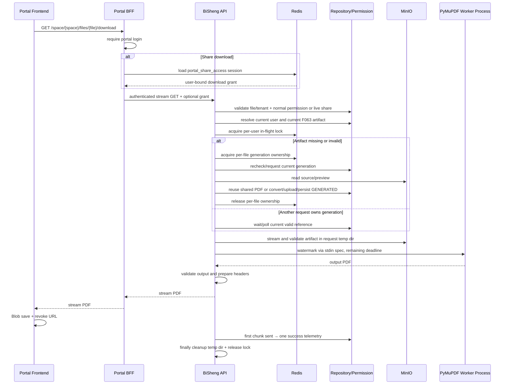

# 设计说明 Design：门户带水印 PDF 下载、知识预览与问答水印

## 阅读摘要

- 本文档说明如何在现有首钢门户 → BFF → BiSheng 及 BiSheng Client → BiSheng 架构内实现同步带水印 PDF 下载，并在两端知识预览及登录态问答正文增加与下载 PDF 视觉口径一致的当前用户全尺寸 SVG 逐坐标水印。
- 设计重点：下载仍由 BiSheng 作为身份、权限、统一 PDF、水印和成功遥测的事实源；有效产物缺失或不可用时由下载请求同步复用 F063 转换核心生成并持久化；预览水印由两个前端基于各自已认证用户上下文渲染；Portal BFF 对匿名用户直接关闭预览正文接口，同时保留分享文件元数据和摘要。
- 安全重点：分享下载使用用户/租户/目标绑定的短期签名授权，下载时复核分享链接；水印身份不接受客户端输入；原始对象 URL 不进入下载响应。
- 不在本设计中处理：历史产物批量补齐脚本、异步水印、个人水印缓存、门户批量水印 ZIP、既有批量 API 改造、Docker/Celery/数据库 schema 变化，以及依赖 CSS 无法提供的防截图或防开发者工具能力。

## 元信息 Metadata

- Feature ID: `064-portal-watermarked-pdf-download`
- Status: `partial`
- Related requirements: `features/v2.6.0/064-portal-watermarked-pdf-download/requirements.md`
- Depends on: `F063-unified-pdf-artifact`
- Created: `2026-07-21`
- Updated: `2026-07-23`

## 上下文 Context

### 初始架构 Initial architecture

```text
Portal React
  └─ GET preview → Portal BFF KnowledgeService
       └─ GET BiSheng preview → original_url / preview_url
            └─ Frontend uses download_url as original-file download
```

- 独立门户的搜索、列表和详情已经通过 BFF 使用水印 PDF 下载。
- BiSheng Client 的 `getFileDownloadApi()` 仍解析 `/knowledge/space/{space_id}/files/{file_id}/download` 返回的 `original_url/preview_url`。
- 该旧 helper 被 `KnowledgeSpaceContent` 文件行、`FilePreviewPage`、`PortalKnowledgeWorkbench` 原地预览和版本历史使用。
- BFF 已有 `StreamingResponse` 代理预览内容的模式，可复用其“上游响应保持打开、生成器 finally 关闭”的生命周期。
- BFF 全局 BiSheng timeout 默认 30 秒；Nginx `/api` 读写 timeout 已足够长，只有下载上游调用需要单独覆盖。
- 分享访问使用 `portal_share_access` HttpOnly cookie，但对应 session 存在 `SHARE_ACCESS_SESSIONS` 进程字典。
- BiSheng `KnowledgeSpaceService` 已具备文件级 `download_file` 权限语义和分享密码/邀请码/部门校验。
- F063 已提供 `get_available_pdf_artifact_reference()`，并由 `KnowledgeFilePdfArtifact` 保证当前 generation 和源快照一致性。
- F063 的 `PdfArtifactProcessor` 当前位于 Celery Worker 模块，已具备 ORIGINAL、PARSE_PREVIEW、GENERATED 三种落库语义；按需生成必须提取并复用该核心，不能复制转换逻辑。
- `MinioStorage.download_object_sync()` 支持对象流读取；`knowledge/pdf/validator.py` 可校验输出 PDF。
- `/workspace/knowledge-portal` 当前复用 `KnowledgeSpaceContent` 渲染行级动作；文件夹行下载会调用 `batchDownloadApi` 生成原文件 ZIP，必须由门户 host capability 隔离隐藏。
- `portal/components/FilePane.tsx` 中虽有旧批量菜单代码，但当前 `PortalKnowledgeWorkbench` 未引用该组件，不是本次用户可见行为的落点。

### 已检查文件 Relevant files inspected

- `features/v2.6.0/release-contract.md`
- `features/v2.6.0/063-unified-pdf-artifact/{requirements,design,tasks,verification}.md`
- `src/backend/bisheng/knowledge/domain/services/knowledge_pdf_artifact_service.py`
- `src/backend/bisheng/knowledge/pdf/{converter,validator}.py`
- `src/backend/bisheng/knowledge/api/endpoints/{shougang_portal,knowledge_space}.py`
- `src/backend/bisheng/knowledge/domain/services/knowledge_space_service.py`
- `src/backend/bisheng/knowledge/domain/schemas/knowledge_space_schema.py`
- `src/backend/bisheng/user/domain/models/user.py`
- `src/backend/bisheng/core/config/settings.py`
- `src/frontend/client/src/pages/knowledge/SpaceDetail/{index,KnowledgeSpaceHeader}.tsx`
- `src/frontend/client/src/pages/knowledge/FilePreview/FilePreviewPage.tsx`
- `src/frontend/client/src/api/{knowledge,request}.ts`
- `src/frontend/client/src/pages/knowledge/portal/PortalKnowledgeWorkbench.tsx`
- `src/frontend/client/src/pages/knowledge/portal/PortalKnowledgeWorkbench.test.tsx`
- `shougang-group-knowledge-portal/backend/app/{api/routes/knowledge.py,clients/bisheng.py,services/knowledge_service.py,main.py,settings.py}`
- `shougang-group-knowledge-portal/frontend/src/{api/content.ts,utils/fileDownload.ts,pages/SearchPage.tsx,pages/ListPage.tsx,pages/DetailPage.tsx,pages/ShareDocumentPage.tsx,pages/ExpertQADetailPage.tsx,pages/QAPage.tsx}`
- `shougang-group-knowledge-portal/frontend/src/components/{DocumentPreview.tsx,DocumentPreview.module.css}`
- `src/frontend/client/src/pages/knowledge/FilePreview/{index.tsx,RichKnowledgePreview.tsx}`
- `src/frontend/client/src/pages/knowledge/SpaceDetail/KnowledgeFilePreviewPane.tsx`
- `src/frontend/client/src/components/Chat/Messages/Content/CitationDocumentPreviewDrawer.tsx`

### 现有测试或验证命令 Existing tests or validation commands

```bash
# BiSheng backend, cwd=src/backend
uv run pytest test/knowledge/pdf/ test/test_shougang_portal_endpoint.py
uv run ruff format <changed-python-files>
uv run ruff check <changed-python-files>

# Portal BFF, cwd=shougang-group-knowledge-portal/backend
.venv/bin/python -m pytest tests/test_knowledge_api.py tests/test_bisheng_client.py

# Portal frontend, cwd=shougang-group-knowledge-portal/frontend
npm test
npm run build
npm run lint
```

### 项目约束 Constraints from project guidance

- BiSheng 新代码遵循 `Router → Endpoint → Service → Repository → DB`，Endpoint 不直接访问 ORM，Service 不新增 ORM 查询。
- 多租户条件由项目上下文自动注入；最终授权必须在 BiSheng 执行，不能只依赖 BFF 或前端。
- 二进制下载接口可以直接返回 `StreamingResponse`，不使用 `resp_200` 包装文件内容；错误仍使用稳定业务码和真实 HTTP status。
- 不修改用户现有脏文件，尤其是 `entrypoint.sh`、PDF deployment contract、门户 `docker-compose.yaml` 和无关门户配置服务。

## 目标 / 非目标 Goals / Non-Goals

### 目标 Goals

- 建立门户唯一 PDF 下载入口，覆盖 requirements 中列出的全部知识文档入口。
- 优先读取并校验 F063 当前有效 PDF 引用；缺失、过期、对象丢失、损坏或 SHA 不一致时同步生成并持久化后继续下载。
- 在 BiSheng 每次请求实时生成每页用户水印，并可靠清理临时文件。
- 普通下载复用文件级 `download_file` 权限；分享下载使用独立短期证明并实时复核分享状态。
- 保持二进制流跨 BiSheng、BFF、浏览器传输，不在 BFF 完整缓冲。
- 将下载成功遥测收口到 BiSheng，恰好记录一次。
- 将旧 BiSheng 单文件 JSON URL endpoint 收口为同一水印 PDF 二进制能力，迁移仓库内全部调用方。
- 在 `/workspace/knowledge-portal` 下线文件夹行级下载和文件/文件夹多选后的批量下载入口，保留其他批量操作和共享组件的非门户文件夹默认行为。
- 在独立门户详情预览层和 BiSheng 知识预览基础层增加平铺 CSS 水印，统一“主部门-姓名--用户账号-北京日期 / 首钢股份内部资料，严禁外传，违者必究”两行提示口径，并以下载 PDF 的字体、字号、角度、透明度和间距为视觉基准。
- 独立门户匿名分享访问仅保留文件元数据和摘要，前端不发预览正文请求，Portal BFF 的预览清单、预览内容和 chunks 接口均以 401 阻断。

### 非目标 Non-Goals

- 不改写在线预览的 PDF、图片、HTML 或富媒体字节，不承诺阻止用户通过浏览器开发工具隐藏 CSS、保存已获准查看的预览字节或截图裁剪。
- 不建立第二套格式转换或产物状态；下载按需生成只复用 F063 既有转换器、校验器、Artifact 模型和 Repository。
- 不建立水印任务队列、持久水印表或 MinIO 水印对象。
- 不实现门户多文件/文件夹带水印 ZIP，不替换或删除现有批量下载 API、知识空间详情页批量 ZIP 和开放接口。
- 不扩展 BiSheng 管理端及数据集、模型、任务结果等非门户下载产品功能。
- 不在本 Feature 中实现历史数据补齐脚本。

## 边界承诺 Boundary Commitments

| Boundary | Allowed Change | Disallowed Change | Revalidation Trigger |
|---|---|---|---|
| F063 Artifact | 通过公开 Domain 服务读取或按需生成当前引用；复用既有模型、Repository、转换与对象归属语义 | 新建第二套状态表、对象命名或转换实现 | F063 模型/schema/生命周期需要改变 |
| BiSheng 门户 API | 复用门户专用水印 service，并将既有 `/knowledge/space/.../download` 收口为 PDF 二进制 | 返回原始/预览 URL、保留无水印绕过 | 产品重新允许原文件下载 |
| Portal BFF | 下载代理、Redis 分享会话、隐藏上游 grant；三个预览正文接口要求当前登录用户 | 在 BFF 生成文件水印、信任前端身份、匿名返回正文、暴露 grant | 产品重新允许匿名预览正文或要求服务端预览水印 |
| Frontends | 独立门户保持 BFF Blob；BiSheng Client 使用 Axios Blob；知识预览基础层渲染 CSS 水印；通过显式 host 能力隐藏门户批量和文件夹下载 | 使用原始/预览 URL 下载、修改预览字节、将 CSS 水印接入非知识预览、全局删除共享批量能力 | 产品要求保留原格式、强防截图或恢复门户批量/文件夹下载 |
| Storage | 请求级临时文件；读取共享 PDF；格式转换时上传 F063 `GENERATED` 基线对象 | 上传个人水印对象；复制有效 ORIGINAL/PARSE_PREVIEW 基线 | 需要水印缓存或审计留存文件 |
| Runtime | 现有 API 进程、Redis、PyMuPDF、中文字体 | 新 Celery、Compose 服务、Dockerfile、数据库迁移 | 同步性能无法满足并决定异步化 |
| External attachments | 仅改造可解析为 `(space_id,file_id)` 的知识文件 | 重写外链、图片和无知识文件标识附件 | 业务定义新的附件归属协议 |

- Allowed dependencies: none；只复用现有 PyMuPDF、PyJWT、MinIO SDK、Redis、FastAPI/httpx 和浏览器 API。

## 需求追踪 Requirements Traceability

| Requirement | Acceptance Criteria | Design Element | Verification Strategy |
|---|---|---|---|
| REQ-001 | AC-REQ-001-01, AC-REQ-001-02, AC-REQ-001-03, AC-REQ-001-04 | Frontend unified download utility、BFF download route、detail/QA route convergence | frontend tests + BFF integration + preview regression |
| REQ-002 | AC-REQ-002-01..05 | 有效引用校验、`PdfArtifactOnDemandService`、共享转换核心、文件级 single-flight、一次强制修复 | service/storage/concurrency tests |
| REQ-003 | AC-REQ-003-01, AC-REQ-003-02, AC-REQ-003-03, AC-REQ-003-04 | PyMuPDF watermark engine、server identity resolver、Beijing clock、validator | unit/render/smoke tests |
| REQ-004 | AC-REQ-004-01, AC-REQ-004-02, AC-REQ-004-03, AC-REQ-004-04 | BFF login gate、BiSheng file-level permission authorizer、server-side `can_download` | auth/permission/IDOR matrix |
| REQ-005 | AC-REQ-005-01, AC-REQ-005-02, AC-REQ-005-03, AC-REQ-005-04, AC-REQ-005-05 | signed share grant、live share recheck、Redis `PortalShareAccessSessionStore` | grant negative matrix + multi-worker store tests |
| REQ-006 | AC-REQ-006-01, AC-REQ-006-02, AC-REQ-006-03, AC-REQ-006-04, AC-REQ-006-05 | 300/60 秒分阶段 deadline、killable watermark worker、capacity limiter、用户/文件 Redis ownership lock、stream cleanup | timeout/concurrency/disconnect tests |
| REQ-007 | AC-REQ-007-01, AC-REQ-007-02, AC-REQ-007-03, AC-REQ-007-04 | binary headers、error mapper、first-chunk telemetry、entry-point enum | endpoint/log/telemetry tests |
| REQ-008 | AC-REQ-008-01, AC-REQ-008-02, AC-REQ-008-03, AC-REQ-008-04 | existing runtime reuse、legacy endpoint migration、contract/diff guard | dependency/deployment/contract regression |
| REQ-009 | AC-REQ-009-01, AC-REQ-009-02, AC-REQ-009-03, AC-REQ-009-04 | `hideBatchDownload` + `hideFolderDownload` host capabilities、门户 opt-out、默认兼容 | portal behavior tests + batch API regression |
| REQ-010 | AC-REQ-010-01, AC-REQ-010-02, AC-REQ-010-03, AC-REQ-010-04 | legacy route binary adapter、BiSheng Blob helper、四类入口接线、version artifact on-demand ensure | endpoint + client API + portal/preview/version behavior tests |
| REQ-011 | AC-REQ-011-01, AC-REQ-011-02, AC-REQ-011-03, AC-REQ-011-04, AC-REQ-011-05, AC-REQ-011-06, AC-REQ-011-07, AC-REQ-011-08 | Portal `PreviewWatermark`、BiSheng `KnowledgePreviewWatermark`、文字度量与全尺寸 SVG 坐标、统一视觉 token、各格式正文 surface、详情页登录分支、BFF 三路 auth gate | formatter/layout/position/component/SVG tests + BFF integration + surface/source scope scan + builds + browser visual regression |
| REQ-012 | AC-REQ-012-01..08 | Portal `SmartQaWorkspace`/URL iframe host、BiSheng `AiChatMessages`/`AppChat`/知识问答面板、显式 `enabled` 能力、iframe 单层责任 | Portal/BiSheng focused component/source tests + guest/share negative tests + builds + browser interaction/visual regression |

## 架构设计 Architecture

- Pattern: 门户专用同步下载编排 + 统一 PDF 按需确保 + BFF 受控流式代理 + 请求级个人水印临时文件。
- Rationale: 水印身份和最终权限均位于 BiSheng；BFF 持有门户登录/分享 cookie，适合管理不暴露给浏览器的分享 grant；前端只负责用户交互和保存响应。
- Preserved existing patterns: `shougang_portal` 专用 endpoint、`KnowledgeSpaceService` 权限语义、F063 accessor、BFF scoped client、`StreamingResponse` finally 关闭、门户 Fetch API。
- Architecture change justification: 进程内分享 session 无法跨 Worker，也无法证明上游密码/邀请码已验证；Redis session + BiSheng 签名 grant 是分享下载安全闭环所必需。



## 文件结构计划 File Structure Plan

### BiSheng

| Path | Action | Responsibility | Linked Requirement |
|---|---|---|---|
| `features/v2.6.0/release-contract.md` | modify during implementation | 登记 F064 → F063 依赖和只读所有权边界 | REQ-008 |
| `src/backend/bisheng/core/config/settings.py` | modify | 增加 `KnowledgePdfWatermarkConf` 的 60 秒、并发和锁 TTL 配置 | REQ-006, REQ-008 |
| `src/backend/bisheng/initdb_config.yaml` | modify | 提供水印运行参数默认值，不包含秘密 | REQ-006, REQ-008 |
| `src/backend/bisheng/knowledge/domain/services/pdf_artifact_generation_service.py` | create | 承载 Worker/下载共用的 `PdfArtifactProcessor` 与同步 attempt，不接触 HTTP/权限 | REQ-002, REQ-006, REQ-008 |
| `src/backend/bisheng/knowledge/domain/services/knowledge_pdf_artifact_service.py` | modify | 增加按需 generation 选择、有效引用等待与异步入口 | REQ-002, REQ-006 |
| `src/backend/bisheng/knowledge/domain/repositories/interfaces/knowledge_file_pdf_artifact_repository.py` | modify | 增加不重复 bump 的按需 generation 请求契约 | REQ-002 |
| `src/backend/bisheng/knowledge/domain/repositories/implementations/knowledge_file_pdf_artifact_repository_impl.py` | modify | 在行锁下复用 WAITING/PROCESSING，只有缺失/失败/失效引用才开启新 generation | REQ-002 |
| `src/backend/bisheng/worker/knowledge/pdf_artifact_worker.py` | modify | 改为调用共享 processor，并与下载请求共用文件级 ownership lock | REQ-002, REQ-006, REQ-008 |
| `src/backend/bisheng/knowledge/pdf/watermark.py` | create/modify | 纯 PyMuPDF 两行水印排版、黑体解析、文字测量、旋转包围盒、自适应错位锚点和 PDF 输出 | REQ-003 |
| `src/backend/bisheng/knowledge/pdf/watermark_worker.py` | create | 从 stdin 读取水印 spec，在隔离子进程执行并返回脱敏状态 | REQ-003, REQ-006, REQ-007 |
| `src/backend/bisheng/knowledge/domain/schemas/portal_pdf_download_schema.py` | create | entry point、prepared response、grant claims 和内部 DTO | REQ-005, REQ-007 |
| `src/backend/bisheng/knowledge/domain/services/portal_share_download_grant_service.py` | create | 签发/验证用途隔离的短期下载授权 | REQ-005 |
| `src/backend/bisheng/knowledge/domain/services/portal_pdf_download_service.py` | create/modify | 权限、主部门/姓名/`external_id` 身份、Artifact、MinIO、deadline、并发、清理和遥测编排 | REQ-002..07 |
| `src/backend/bisheng/user/api/user.py`、`domain/models/user.py`、`domain/services/user.py` | modify | 由 User Service 解析主部门并通过 `/user/info` 返回当前用户主部门名称 | REQ-003, REQ-011 |
| `src/backend/bisheng/user/domain/repositories/{interfaces,implementations}/user_repository*.py` | modify | 为下载服务提供参数化的主部门名称查询 | REQ-003 |
| `src/backend/bisheng/knowledge/api/dependencies.py` | modify | 通过 Repository/现有 service 注入下载服务 | REQ-004, REQ-005 |
| `src/backend/bisheng/knowledge/api/endpoints/shougang_portal.py` | modify | 新增门户二进制下载 endpoint；分享 verify 可选签发内部 grant | REQ-001, REQ-005, REQ-007 |
| `src/backend/bisheng/knowledge/api/endpoints/knowledge_space.py` | modify | 将旧单文件 URL endpoint 收口为复用水印 service 的安全二进制响应 | REQ-007, REQ-008, REQ-010 |
| `src/backend/bisheng/knowledge/domain/services/knowledge_space_service.py` | modify | 暴露复用既有文件权限和分享 live recheck 的窄接口 | REQ-004, REQ-005 |
| `src/backend/bisheng/knowledge/domain/schemas/knowledge_space_schema.py` | modify | 分享 verify 内部 grant 字段和下载 entry point 验证 | REQ-005, REQ-007 |
| `src/backend/bisheng/common/errcode/knowledge_space.py` | modify | 增加 Artifact unavailable、busy、timeout、grant invalid、generation failed 稳定错误码 | REQ-002, REQ-005..07 |
| `src/backend/test/knowledge/pdf/test_pdf_watermark.py` | create/modify | 水印内容、普通/长文本自适应布局、错位锚点、无重叠、字体、页面保持和输出合法性 | REQ-003 |
| `src/backend/test/knowledge/pdf/test_portal_pdf_download_service.py` | create | Artifact、权限、身份、存储、deadline、清理、并发、遥测 | REQ-002..07 |
| `src/backend/test/knowledge/pdf/test_pdf_artifact_on_demand.py` | create | 非可用状态、三种来源、最终失败、文件级 single-flight 与等待复用 | REQ-002, REQ-006 |
| `src/backend/test/knowledge/test_portal_share_download_grant.py` | create | grant claims、篡改、重放、live share recheck | REQ-005 |
| `src/backend/test/test_shougang_portal_endpoint.py` | modify | 二进制 endpoint、headers、status、分享授权 | REQ-001, REQ-004..07 |
| `src/backend/test/knowledge/test_shougang_portal_telemetry.py` | modify | 下载 entry point 与一次成功事件契约 | REQ-007 |
| `src/backend/test/knowledge/test_knowledge_space_download_endpoint.py` | create | 旧路径二进制契约、状态映射、安全 headers 和无 URL 泄漏 | REQ-007, REQ-008, REQ-010 |

### Portal BFF

| Path | Action | Responsibility | Linked Requirement |
|---|---|---|---|
| `backend/app/services/portal_share_access_store.py` | create | Redis/InMemory 分享访问 session store；保存 opaque grant | REQ-005 |
| `backend/app/main.py` | modify | 初始化并关闭共享 store 所需 Redis 依赖 | REQ-005 |
| `backend/app/api/dependencies.py` | modify | 提供 `PortalShareAccessSessionStore` dependency | REQ-005 |
| `backend/app/settings.py` | modify | 下载专用上游 read timeout 从 70 秒调整为约 370 秒 | REQ-006 |
| `backend/app/schemas/knowledge.py` | modify | 下载 entry point、上游内部分享 access DTO、公开 DTO 分离 | REQ-005, REQ-007 |
| `backend/app/clients/bisheng.py` | modify | 打开带自定义 timeout/headers 的认证二进制 stream | REQ-006, REQ-007 |
| `backend/app/services/knowledge_service.py` | modify | 移除进程字典 session、增加上游下载 stream、详情透传 `can_download`、预览不暴露原下载 URL | REQ-001, REQ-004..07 |
| `backend/app/schemas/auth.py`、`backend/app/services/portal_auth_service.py` | modify | Portal 登录会话独立透传 BiSheng 主部门字段 | REQ-011 |
| `backend/app/api/routes/knowledge.py` | modify | 下载登录 gate、异步分享 session 校验、下载流转发和错误映射；三个预览正文接口增加匿名 401；旧 download-event 兼容 no-op | REQ-001, REQ-004..07, REQ-011 |
| `backend/tests/test_portal_share_access_store.py` | create | Redis 跨实例、TTL、用户/目标绑定和开发回退 | REQ-005 |
| `backend/tests/test_knowledge_api.py` | modify | 普通/分享下载、stream close、headers、error mapping、匿名详情可见与三路预览正文 401 | REQ-001, REQ-004..07, REQ-011 |
| `backend/tests/test_bisheng_client.py` | modify | 下载专用 timeout、认证刷新和流式响应生命周期 | REQ-006, REQ-007 |

### Portal frontend

| Path | Action | Responsibility | Linked Requirement |
|---|---|---|---|
| `frontend/src/api/content.ts` | modify | 请求统一下载 endpoint，解析二进制/错误和 `Content-Disposition` | REQ-001, REQ-006, REQ-007 |
| `frontend/src/api/auth.ts` | modify | 将 Portal auth `department_name/external_id` 映射为预览用户的 `departmentName/externalId` | REQ-011 |
| `frontend/src/utils/fileDownload.ts` | modify | 统一下载动作、PDF 文件名 fallback、Blob URL 创建与释放 | REQ-001, REQ-006 |
| `frontend/src/pages/SearchPage.tsx` | modify | 使用统一下载，entry point=`search`，移除前端成功埋点 | REQ-001, REQ-007 |
| `frontend/src/pages/ListPage.tsx` | modify | 使用统一下载，entry point=`knowledge_list`，移除前端成功埋点 | REQ-001, REQ-007 |
| `frontend/src/pages/DetailPage.tsx` | modify | 按 `user + detail.canDownload` 展示下载；登录用户请求并渲染带水印预览，匿名仅显示元数据/摘要和登录提示 | REQ-001, REQ-004..07, REQ-011 |
| `frontend/src/components/PreviewWatermark.tsx` | create/modify | Provider 固定 Portal 当前用户主部门、姓名、`externalId` 和挂载时北京日期；独立 overlay 观察 surface 尺寸并在全尺寸 SVG 内逐坐标渲染水印，只在文档 surface 内生效 | REQ-011 |
| `frontend/src/components/PreviewWatermark.module.css` | create/modify | SVG overlay 采用 PDF 等效黑体、字号、角度、透明度，并保持不可点击和正文边界裁剪 | REQ-011 |
| `frontend/src/pages/QAPage.tsx` | modify | 登录用户的智能问答/写作正文 surface 复用 Portal 水印 Provider/overlay；sidebar/composer 保持在 surface 外 | REQ-012 |
| `frontend/src/pages/AppsPage.tsx` | modify | 第三方 URL iframe 宿主覆盖当前用户水印；workflow iframe 不在 Portal 重复覆盖 | REQ-012 |
| `frontend/tests/chatWatermark.test.ts` | create | Portal 本地问答、URL/workflow iframe 单层责任、匿名排除、视觉与交互源码契约 | REQ-012 |
| `frontend/src/components/DocumentPreview.tsx` | modify | 在 DOCX、表格、Markdown、HTML、文本、图片和 chunks 的实际内容 surface 内挂载水印 | REQ-011 |
| `frontend/src/components/PdfPreview.tsx` | modify | 在每个 PDF 页面内部挂载并裁剪水印，不覆盖页外预览留白 | REQ-011 |
| `frontend/src/utils/previewWatermark.ts` | create/modify | 格式化两行身份水印，并提供文字宽度估算/Canvas 测量、旋转包围盒、步长和按 surface 宽高生成错位坐标的纯函数 | REQ-011 |
| `frontend/src/pages/ExpertQADetailPage.tsx` | modify | 结构化关联知识文档改为门户详情 URL + `expert_qa` | REQ-001 |
| `frontend/src/pages/QAPage.tsx` | modify | 知识引用详情 URL 增加 `qa_citation` entry point | REQ-001, REQ-007 |
| `frontend/src/pages/HomePage.tsx` | modify if needed | 确保详情链接保留 `home_recommendation` 来源 | REQ-001, REQ-007 |
| `frontend/tests/fileDownload.test.ts` | modify | 二进制、文件名、错误、URL revoke | REQ-001, REQ-006, REQ-007 |
| `frontend/tests/guestDownloadAccess.test.ts` | modify | guest、view-only、share-login gate 和 detail button | REQ-004, REQ-005 |
| `frontend/tests/shareDocumentAccess.test.ts` | modify | 登录后分享 grant 流程和匿名下载阻断契约 | REQ-005 |
| `frontend/tests/fileListItem.test.ts` | modify | pending/重复点击行为 | REQ-006 |
| `frontend/tests/previewWatermark.test.ts` | create/modify | Portal 身份回退、普通/长文本自适应步长、surface 坐标、无 pattern、错位布局、详情页匿名分支和交互隔离 | REQ-011 |

### BiSheng client 门户知识工作台

| Path | Action | Responsibility | Linked Requirement |
|---|---|---|---|
| `src/frontend/client/src/api/knowledge.ts` | modify | 以 Axios Blob 请求旧路径的新二进制契约，解析文件名/错误并保存 PDF | REQ-007, REQ-010 |
| `src/frontend/client/src/api/chat/data-service.ts`、`src/types/chat/types.ts` | modify | 将 `/user/info.department_name/external_id` 映射为 client `departmentName/externalId` | REQ-011 |
| `src/frontend/client/src/pages/knowledge/SpaceDetail/index.tsx` | modify | 单文件行与版本历史使用水印 helper；增加默认兼容的 `hideFolderDownload` host capability | REQ-009, REQ-010 |
| `src/frontend/client/src/pages/knowledge/FilePreview/FilePreviewPage.tsx` | modify | 独立预览下载使用水印 helper，并提供 pending/error 恢复 | REQ-010 |
| `src/frontend/client/src/pages/knowledge/portal/PortalKnowledgeWorkbench.tsx` | modify | 门户预览/收藏使用源空间水印下载；启用批量与文件夹下载隐藏能力 | REQ-009, REQ-010 |
| `src/frontend/client/src/api/knowledge.test.ts` | modify | Blob、Content-Disposition、错误解析、fallback 与 URL revoke | REQ-007, REQ-010 |
| `src/frontend/client/src/pages/knowledge/portal/PortalKnowledgeWorkbench.test.tsx` | modify | 文件行/预览/收藏水印接线、文件夹无下载、无批量下载 | REQ-009, REQ-010 |
| `src/frontend/client/src/pages/knowledge/FilePreview/FilePreviewPage.test.tsx` | create/modify | 独立预览 pending、成功与错误恢复 | REQ-010 |
| `src/frontend/client/src/pages/knowledge/FilePreview/KnowledgePreviewWatermark.tsx` | create/modify | Provider 固定当前用户身份/日期；overlay 测量文字、观察正文尺寸并在全尺寸 SVG 内逐坐标渲染独立水印组；同时提供默认关闭的通用当前用户 watermarked surface | REQ-011, REQ-012 |
| `src/frontend/client/src/pages/knowledge/FilePreview/KnowledgePreviewWatermark.module.css` | create/modify | BiSheng SVG overlay 采用 PDF 等效黑体/字号/角度/透明度，保持交互隔离和正文边界裁剪 | REQ-011 |
| `src/frontend/client/src/pages/knowledge/FilePreview/index.tsx` | modify | 只在成功 viewer 外层提供水印上下文，不直接覆盖整个预览视口 | REQ-011 |
| `src/frontend/client/src/pages/knowledge/FilePreview/viewers/*Viewer.tsx` | modify | PDF 按页、其他格式按白色正文或媒体 surface 挂载水印 | REQ-011 |
| `src/frontend/client/src/pages/knowledge/FilePreview/RichKnowledgePreview.tsx` | modify | 富媒体知识 viewer 提供统一水印上下文，并把 overlay 限制到实际内容区域 | REQ-011 |
| `src/frontend/client/src/pages/knowledge/FilePreview/KnowledgePreviewWatermark.test.tsx` | create/modify | BiSheng 身份、固定时钟、普通/长文本步长、surface 坐标、自适应错位 SVG、ResizeObserver、可访问性和基础层接线 | REQ-011 |
| `src/frontend/client/src/components/Chat/AiChatMessages.tsx` | modify | 增加默认关闭的问答水印能力，在空/加载/消息分支只覆盖正文，不覆盖标题栏 | REQ-012 |
| `src/frontend/client/src/components/Chat/ChatView.tsx` | modify | 主问答登录态正文/欢迎状态显式启用；`shareToken` 分支保持关闭 | REQ-012 |
| `src/frontend/client/src/pages/appChat/ChatView.tsx` | modify | App/Agent/workflow/assistant 登录态消息与空状态显式启用；guest/readOnly 保持关闭 | REQ-012 |
| `src/frontend/client/src/pages/knowledge/SpaceDetail/AiChat/KnowledgeAiPanel.tsx` | modify | 知识空间/文件夹问答欢迎和消息正文启用水印，排除 header/input/history | REQ-012 |
| `src/frontend/client/src/pages/Subscription/AiChat/AiAssistantPanel.tsx` | modify | workstation、单文档、订阅文章/频道问答正文启用水印，排除 header/input | REQ-012 |
| `src/frontend/client/src/components/Chat/ChatWatermark.test.tsx` | create | 通用 surface、AiChatMessages 状态、登录/guest/share 开关与入口接线回归 | REQ-012 |

## 组件与接口 Components and Interfaces

### 1. Portal frontend download client

- Responsibility: 统一构造 BFF URL、等待响应、显示错误、保存 PDF。
- Inputs: `spaceId`、`fileId`、合法 `entryPoint`、可选 `shareToken`。
- Outputs: 浏览器下载动作；失败时抛出 `ApiRequestError`。
- Dependencies: browser Fetch/Blob/URL API。
- Error behavior: 非 2xx 优先解析 JSON `detail/status_message`，否则使用按 HTTP status 的中文 fallback；始终恢复 pending。
- Requirements: REQ-001, REQ-006, REQ-007。

建议接口：

```ts
export type PortalDownloadEntryPoint =
  | 'search'
  | 'knowledge_list'
  | 'detail'
  | 'home_recommendation'
  | 'favorite'
  | 'share'
  | 'expert_qa'
  | 'qa_citation'
  | 'other';

export async function downloadWatermarkedFile(params: {
  spaceId: number;
  fileId: number;
  entryPoint: PortalDownloadEntryPoint;
  shareToken?: string;
}): Promise<void>;
```

- 使用 `response.blob()` 后创建隐藏 `<a>`。
- 文件名优先取服务端 `Content-Disposition` 的 `filename*`，解析失败时用页面 title 的 stem + `.pdf`。
- `URL.revokeObjectURL()` 放在点击后的 `finally`/下一事件循环，避免长期占用内存。

### 2. Portal BFF binary download route

- Responsibility: 要求门户登录、验证 BFF 分享 session、调用用户 scoped BiSheng client、流式转发安全 header。
- Inputs: path IDs、query entry point/share token、HttpOnly portal/share cookies。
- Outputs: PDF `StreamingResponse` 或真实 HTTP error。
- Dependencies: `PortalAuthService`、`PortalShareAccessSessionStore`、`BishengClient`。
- Error behavior: 上游非 PDF 响应先完整读取小型错误 body、关闭 upstream、映射后返回；成功 body 不缓冲。
- Requirements: REQ-001, REQ-004..07。

接口：

```http
GET /api/v1/knowledge/space/{space_id}/files/{file_id}/download
    ?entry_point=detail
    [&share_token=...]
Cookie: sg_portal_session=...
```

只转发：

- `content-type`
- `content-disposition`
- `content-length`
- `cache-control`
- `x-content-type-options`

不转发：`set-cookie`、内部 grant header、MinIO header、上游 debug header。

### 3. PortalShareAccessSessionStore

- Responsibility: 替换 `SHARE_ACCESS_SESSIONS` 进程字典，保存查看会话和可选 opaque 下载 grant。
- Inputs: 随机 session ID、分享验证结果、当前 portal session ID。
- Outputs: 与 share token/space/file/当前 portal session 匹配的 session。
- Dependencies: Portal 已有 Redis client；开发环境 InMemory 实现。
- Error behavior: 生产 Redis 错误返回 503/fail closed；不得回退到当前进程字典。
- Requirements: REQ-005。

Session 字段：

```text
session_id
share_token
space_id
file_id
allow_download
download_grant        # opaque, server-only, may be empty for anonymous view
portal_session_id     # download grant存在时必填
expires_at
```

- Redis key: `shougang_portal:share_access:v2:{session_id}`。
- TTL: `min(3600, grant 剩余有效期)`；查看会话无 grant 时保持最多一小时。
- cookie 保持 `HttpOnly + SameSite=Lax + path=/`，并沿用部署的 Secure 配置。

### 4. PortalShareDownloadGrantService

- Responsibility: 把已经通过密码/邀请码/部门检查的事实转换为可被下载接口验证的短期授权。
- Inputs: 当前 BiSheng `UserPayload`、ShareLink 当前状态、space/file、allow_download。
- Outputs: HS256 signed token；失败抛出稳定 domain error。
- Dependencies: PyJWT、`settings.jwt_secret`。
- Error behavior: strict algorithm/audience/purpose/claim validation；任何解析错误统一为 grant invalid，不记录 token。
- Requirements: REQ-005, REQ-007。

签名密钥不直接复用 JWT key bytes，而使用域隔离派生：

```text
grant_key = HMAC-SHA256(settings.jwt_secret, "portal-share-download-grant-v1")
```

claims：

```json
{
  "v": 1,
  "purpose": "portal_share_pdf_download",
  "aud": "shougang_portal",
  "sub": "<user_id>",
  "tenant_id": 1,
  "share_token": "...",
  "space_id": 12,
  "file_id": 1580,
  "allow_download": true,
  "iat": 0,
  "exp": 0,
  "jti": "random"
}
```

- 默认 grant TTL 为 300 秒；有到期时间的分享链接使用 `exp = min(iat + 300, share_link_expires_at)`，剩余时间不足时不得签发一个晚于分享链接的 grant。
- BFF 调用分享 verify 时仅在存在有效 portal login session 时请求下载 grant。
- 无登录公共分享只创建查看 session；登录后下载前必须重新完成分享验证。
- 下载接口验证 token 后，还要通过 Repository/现有分享 service 重新读取 ShareLink；token 不是链接状态缓存。

### 5. PortalPdfDownloadService

- Responsibility: 统一普通/分享授权、身份、Artifact、storage、watermark runtime、输出描述和遥测 hook。
- Inputs: `PortalPdfDownloadRequest` + 当前 `UserPayload` + 可选 grant。
- Outputs: `PreparedPortalPdfDownload(path, filename, size, cleanup, record_success)`。
- Dependencies: `KnowledgeFileRepository`、`UserRepository`、现有 `KnowledgeSpaceService` 窄授权接口、F063 accessor、`PdfArtifactOnDemandService`、MinioStorage、Redis locks、PDF validator。
- Error behavior: 领域错误按 artifact/permission/busy/timeout 分类；未知异常日志脱敏后抛 generic generation error。
- Requirements: REQ-002..07。

处理顺序不可交换：

1. 校验 entry point 并归一。
2. Repository 获取文件，确认 `file_type=FILE` 且 `file.knowledge_id == space_id`。
3. 普通请求调用现有文件级 `download_file` 授权；分享请求验证 grant 并 live recheck ShareLink，不再叠加普通下载权限。
4. 从 `UserRepository` 读取当前用户及其 `is_primary=1` 主部门；姓名取 `user_name`，账号优先取 `external_id`、遗留空值回退当前认证账号，构造“主部门-姓名--账号-YYYY/MM/DD”或无主部门时的“姓名--账号-YYYY/MM/DD”，忽略请求中的任何身份文本。
5. 获取用户级 Redis lock，再进入进程级 capacity limiter；容量不可用立即 429。用户锁覆盖 PDF 就绪、个人水印和响应传输，TTL 大于最长准备时间。
6. 调用 F063 accessor；有效引用进入读取，否则调用按需服务，在 300 秒 PDF 就绪 deadline 内生成或等待同文件结果。
7. 建立 `mkdtemp(prefix="portal-pdf-download-")` 隔离目录，将引用对象流式写入 `artifact.pdf`，并校验 PDF、size 和 SHA。
8. 若读取、结构或 SHA 校验失败，则以当前 generation/object 为排除条件调用按需服务强制修复一次；重新读取仍失败时返回脱敏 generation error。
9. 从有效输入建立独立 60 秒水印 deadline，启动 killable watermark worker；水印 spec 通过 stdin 传递，命令行不包含姓名/工号/grant。
10. 水印超时先 `terminate`，短 grace 后 `kill`；等待进程回收。
11. 使用现有 validator 校验输出，计算 size，构造安全文件名。
12. 返回 prepared descriptor；endpoint streaming generator 负责 first-chunk telemetry 和最终 cleanup。

### 5A. PdfArtifactOnDemandService

- Responsibility: 在下载请求中取得当前有效统一 PDF，协调同文件 single-flight，并复用 F063 processor 完成生成和持久化。
- Inputs: 当前 `KnowledgeFile`、300 秒 monotonic deadline、可选 invalid reference identity。
- Outputs: 与当前源快照匹配的 `PdfArtifactReference`；失败抛脱敏 timeout/generation error。
- Dependencies: F063 Repository、共享 `PdfArtifactProcessor`、MinIO、Redis ownership lock。
- Requirements: REQ-002, REQ-006, REQ-008。

处理规则：

1. 先调用 accessor；引用存在且未被调用方标记为无效时直接返回。
2. 尝试获取 `bisheng:knowledge_pdf_artifact:generation:{tenant_id}:{file_id}` ownership lock；value 为随机 token，只允许 owner 释放。
3. 未取得锁时按短间隔重新读取 accessor；在 lock 释放或 TTL 到期后重试获取，不启动第二个转换。
4. 取得锁后再次读取引用，避免锁等待期间重复生成。
5. 当前行是同源 `WAITING/PROCESSING` 时复用 generation；无记录、FAILED、源过期或被排除的无效 SUCCESS 时在行锁下建立一个新 generation。
6. 调用共享 processor；原 PDF/有效解析预览只登记引用，格式转换才上传 `knowledge/pdf-artifacts/...pdf`。
7. 处理成功后重新通过 accessor 读取引用；任何异常记录脱敏类型并持久化失败状态，最终不返回原文件 URL。
8. 文件锁在 `finally` 使用 ownership token 释放；TTL 必须大于单次转换上限并允许异常进程自动恢复。

Celery Worker 同样在 processor 外获取该文件锁。晚到的 Celery 任务若发现 generation 已完成则幂等结束；API 与 Worker 不得同时转换同一文件。

### 6. Watermark engine and worker

- Responsibility: 不接触 DB、权限、Redis、MinIO；只根据本地 input/output 和 spec 修改 PDF。
- Inputs: input/output 路径参数；stdin JSON 中的两行水印和视觉参数。
- Outputs: 新 PDF 文件；stdout 仅返回无身份的成功 metadata（page_count/size），stderr 不回显 spec。
- Dependencies: PyMuPDF。
- Error behavior: corrupt/encrypted/zero-page/font unavailable/写入失败均非零退出；部分 output 在 finally 删除。
- Requirements: REQ-003, REQ-006, REQ-007。

视觉默认值：

```text
visual rotation: 35 degrees, bottom-left to top-right `/`
opacity: 0.31
font family: WQY Zen Hei / Noto Sans CJK / PingFang SC 等黑体类中文字体
font size: 12pt（浏览器等效 16px；小页面按比例下限调整）
minimum horizontal step: 180pt
minimum vertical step: 135pt
horizontal rotated-bounds clearance: 36pt
vertical rotated-bounds clearance: 27pt
color: neutral gray 0.45（浏览器等效 #737373）
overlay: true
```

- 使用所选字体测量最长一行，按旋转后两行包围盒加安全留白计算步长；奇偶行水平错位 50%，长字段只扩大步长。
- 使用 Shape/morph 支持任意角度，不能用仅支持 90 度倍数的简单 rotate 参数代替。
- 字体按 WQY Zen Hei/WQY Micro Hei、部署目录或仓库内 Noto Sans CJK、PingFang/STHeiti 等安装路径解析，确保优先使用黑体类中文字体；没有可渲染中文的文件字体时失败，不能使用不可靠的 PyMuPDF 内置 CJK 字体、静默切换为宋体或输出乱码。
- 输入只读打开，输出写新路径；不得 incremental save 回原对象。

### 7. BiSheng binary endpoint and streaming lifecycle

- Responsibility: 将 prepared descriptor 转成文件流，并在响应生命周期内执行一次遥测和清理。
- Inputs: path IDs、entry point、可选 `X-Portal-Share-Access-Grant`、当前 user dependency。
- Outputs: PDF `StreamingResponse`。
- Dependencies: `PortalPdfDownloadService`。
- Error behavior: domain error → JSON error + HTTP status；响应开始后的 I/O 错误只记录 ID/类型并进入 finally。
- Requirements: REQ-004..07。

接口：

```http
GET /api/v1/knowledge/shougang-portal/files/{space_id}/{file_id}/download
    ?entry_point=detail
Authorization/Cookie: current user JWT
X-Portal-Share-Access-Grant: <optional opaque token>
```

Streaming generator：

```text
open output
read first chunk
yield first chunk
on resume: record success exactly once (best-effort failure logged, download continues)
yield remaining chunks
finally:
  close file
  remove exact temp dir
  release user lock using ownership token
```

- 首块发送前断连不会执行 success hook。
- 响应传输耗时不计入 300/60 秒准备 deadline，但临时目录和用户锁保留到传输结束/断连。
- cleanup 使用创建时保存的精确绝对目录，不接受请求路径、glob、`~` 或环境变量作为删除目标。

### 8. 门户知识工作台批量与文件夹动作能力隔离

- Responsibility: 只在 `/workspace/knowledge-portal` 抑制多选批量下载和文件夹行级下载，不改变共享知识空间组件和后端批量契约的非门户默认行为。
- Interface: `KnowledgeSpaceContentProps.hideBatchDownload?: boolean` 与 `hideFolderDownload?: boolean`，均默认 `false`；门户 host 显式传入 `true`。
- Behavior:
  - `canBatchDownload` 必须同时满足 host 未隐藏和既有文件/文件夹下载权限。
  - 共享 `KnowledgeSpaceHeader` 继续根据 `canBatchDownload`、批量重试和批量删除能力决定是否展示菜单；没有剩余动作时不展示空菜单。
  - `hideFolderDownload=true` 时，文件夹不进入有效下载集合，卡片、表格行和更多菜单均不渲染下载动作。
  - 单文件行继续调用水印 Blob helper；不得读取 `original_url/preview_url`。
  - 非门户 `SpaceDetail` 不传该参数，现有批量下载入口与 `batchDownloadApi` 保持不变。
- Cleanup: 删除 `PortalKnowledgeWorkbench` 中未被当前渲染链路使用的 `batchDownloadApi` import、`selectedDownloadable` 和 `handleBatchDownload`，避免门户 host 保留误导性接线。
- Explicit non-target: 未被当前页面引用的 `portal/components/FilePane.tsx` 不在本次修改范围，避免对死代码做无验证重写。
- Requirements: REQ-009, REQ-010。

### 9. BiSheng Client 二进制下载与旧路径收口

- Backend route: `GET /api/v1/knowledge/space/{space_id}/files/{file_id}/download?entry_point=...` 保留路径，但响应从统一 JSON URL 改为与门户专用 route 一致的 `StreamingResponse(application/pdf)`。
- Domain reuse: endpoint 注入现有 `PortalPdfDownloadService`，普通访问继续执行 `download_file`、租户与文件归属校验；不复制水印或 Artifact 逻辑。
- Response reuse: 两个 endpoint 复用同一安全 header/错误映射 helper，避免文件名、cache 和状态码漂移。
- Client API: 使用现有 Axios 实例 `getResponse(..., {responseType: 'blob'})` 保留认证/401 行为；成功解析 RFC 5987/ASCII `Content-Disposition`，失败解析 JSON Blob 后抛出可展示错误。
- Browser lifecycle: 创建临时 Object URL、触发 `<a download>`、在 finally 中释放；fallback 文件名为原文件 stem + `.pdf`。
- Entry points: `bisheng_knowledge_list`、`bisheng_preview`、`bisheng_favorite`、`bisheng_version_history`。
- Call sites: `KnowledgeSpaceContent.handleSingleDownload`、`PortalKnowledgeWorkbench.handleDownloadSelected`、`FilePreviewPage.handleDownloadFile`、`VersionHistorySheet.onDownload`。
- Compatibility: 仓库内旧 DTO 调用必须同批迁移；旧路径不再提供 URL JSON，未知外部调用方需要发布说明。
- Requirements: REQ-007, REQ-008, REQ-010。

### 10. 知识预览 CSS 水印与匿名正文门禁

- Root cause: 初版把 overlay 直接挂在完整 viewer 外层，且使用负 `inset` 扩展平铺网格；外层 `overflow:hidden` 只能裁剪到滚动视口，无法识别居中的白色正文或单个 PDF 页面，因此灰色页边也出现水印。
- Identity contract: BiSheng `/api/v1/user/info` 的 `department_name` 为当前用户 `is_primary=1` 的主部门名称，`external_id` 为用户登录账号；Portal auth session 和 BiSheng client 用户状态分别透传为 `departmentName/externalId`，不复用 `role`，不接受浏览器覆盖。
- Portal component: `PreviewWatermark` 作为 Provider 接收从 `PortalUser` 派生的主部门、姓名与账号，首次挂载时固定 `Asia/Shanghai` 日期；`PreviewWatermarkOverlay` 用 Canvas 字体度量获得最长行宽度，计算与 PDF 等效的旋转包围盒和自适应步长，并通过 `ResizeObserver` 获取实际正文 surface 尺寸。组件按行列生成奇偶行错位 50% 的坐标，在与 surface 等宽高的内联 SVG 中为每个坐标绘制独立 `<g>/<text>`；覆盖层设置 `pointer-events:none`、`user-select:none` 和 `aria-hidden=true`。
- Portal page flow:
  - 已登录：`DetailPage` 继续请求 detail、preview、related 和按需 chunks，并只在成功的 `DocumentPreview` 外层叠加水印。
  - 未登录：只请求 detail 和 related，不调用 preview/chunks；预览区域显示“登录后预览”，文件元数据和摘要继续显示。
  - 搜索、列表及其他预览弹窗继续通过 iframe/路由复用 `DetailPage`，不在各入口复制水印逻辑。
- Portal BFF gate: `/space/{space_id}/files/{file_id}/preview`、`/preview/content`、`/chunks` 在分享校验和任何 BiSheng 上游调用前要求有效 Portal session；匿名统一抛出 401。文件 detail endpoint 不增加该门禁。
- BiSheng component: `KnowledgePreviewWatermarkProvider` 从 `store.user` 读取 `departmentName/name/externalId/username` 并固定挂载时北京日期；`KnowledgePreviewWatermark` 使用与 Portal 完全相同的纯布局、surface 坐标公式、Canvas 字体度量、`ResizeObserver` 和全尺寸内联 SVG，并由各格式正文 surface 消费。`FilePreview` 和 `RichKnowledgePreview` 仍是唯一 Provider 接入层，因此自动覆盖独立预览、门户原地预览、收藏、版本对比和知识引用预览。
- Text contract: 下载与预览统一生成两行：“主部门-姓名--账号-YYYY/MM/DD”和“首钢股份内部资料，严禁外传，违者必究”；无主部门时省略部门段，输出“姓名--账号-YYYY/MM/DD”。姓名取 `user_name`，账号优先取 `external_id`，遗留空值回退认证上下文已有账号；PDF 下载服务从服务端用户记录构造，预览只消费认证用户契约，客户端请求参数不能覆盖。
- Visual contract: PDF 为唯一基准：`12pt` 黑体、绝对倾角 `35°`、最终视觉方向左下向右上 `/`、opacity `0.31`、gray `0.45`；先用所选字体测量两行宽度，取最长行和两行块高度计算旋转包围盒，再分别增加 `36pt` 横向、`27pt` 纵向总留白，最终步长不得小于 `180pt × 135pt`。浏览器使用等效 `16px`、`#737373`、`48px` 横向、`36px` 纵向总留白和 `240px × 180px` 最小单元。奇偶行水平错位 50%；长字段只扩大单元，不缩小字号或截断文案。SVG 与 PyMuPDF 分别按自身坐标系选择旋转符号，不能以相同数值符号替代最终视觉验收。
- Measurement formula: 对最长行宽 `W`、两行原始块高 `H` 和角度绝对值 `θ`，旋转包围盒为 `Rw = W*cosθ + H*sinθ`、`Rh = W*sinθ + H*cosθ`；PDF `stepX=max(180,Rw+36)`、`stepY=max(135,Rh+27)`，浏览器使用等效 `stepX=max(240,Rw+48)`、`stepY=max(180,Rh+36)` 并以 Canvas `measureText` 的实际宽度重新计算。浏览器从首个安全锚点开始以 `stepY` 遍历 surface 高度，奇数行起点增加 `stepX/2`，再以 `stepX` 遍历 surface 宽度；每个坐标都是独立矢量文字，不存在 pattern tile 边界。
- Render boundary: PDF overlay 位于单页容器内；DOCX、Markdown、HTML、文本、表格、图片和 chunks overlay 位于各自白色正文或媒体内容容器内并由该容器裁剪。灰色页边、滚动视口空白、工具栏、loading、error、unsupported、登录提示和纯元数据区域不加水印。富媒体播放器仍可操作，因为覆盖层不接收指针事件。
- Identity boundary: 所有展示值来自当前认证上下文，不接收文件、URL 或 query 参数覆盖；不写入 localStorage、后端、日志或遥测。
- Security boundary: 这是可见追溯提示，不是 DRM。禁用 CSS、删除 DOM、直接读取已授权响应和截图裁剪均可能绕过；服务端下载 PDF 水印不受影响。
- Performance boundary: 每个 surface 保留一个覆盖 SVG，但为每个可见锚点创建独立 `<g>` 和两行 `<text>`；DOM 数量随 surface 面积增长，并通过 `ResizeObserver` 在宽高变化后重新计算。用户已明确选择视觉完整性优先，本次不以常量 DOM 或长文档性能作为阻断条件。
- Requirements: REQ-005, REQ-011。

### 11. 登录态问答正文水印

- Shared visual core:
  - Portal 继续使用 `PreviewWatermark` 的 formatter、layout、position 与 SVG overlay；新增不带知识预览外壳的 Provider 用法，使问答正文可复用同一视觉。
  - BiSheng 继续使用 `KnowledgePreviewWatermark` 的当前 Recoil 用户、固定日期、layout、position 与 SVG overlay；提供 `CurrentUserWatermarkSurface` 组合组件，避免各问答入口复制 Provider/overlay。
  - 透明度以实际视觉 `0.31` 为唯一前端来源；overlay 的文字直接消费 layout opacity，CSS 不再维护第二份数值。
- Surface boundary:
  - Portal `SmartQaWorkspace.qaContent` 的 `contentArea` 是本地问答 surface；sidebar 和 `renderComposer` 位于其外。智能写作复用现有 `isSmartAppsMode`/`hasConversation`：模板选择/初始页保留 surface 容器但不挂载 overlay，进入会话态后才挂载；独立智能问答保持既有空/加载/消息正文覆盖。
  - Portal workflow Agent iframe 由其 BiSheng `portal-chat/workflow/auth` 子页面覆盖，Portal `agentWorkflowSurface` 不增加 overlay。
  - Portal URL 应用以 `urlApplicationFrameWrap` 为宿主 surface，在 iframe 上方叠加 pointer-transparent overlay；toolbar 和 error actions 位于覆盖边界外或更高交互层。
  - BiSheng `AiChatMessages` 的 empty/loading 分支根节点和 messages 分支的可滚动正文容器是 watermarked surface；`HeaderTitle` 位于 surface 外。
  - AppChat 自有 `ChatMessages`，因此在 `ChatView` 内只包装消息视口和 `ChatEmptyState`，不包装 `HeaderTitle`、`ChatInput` 或 citation panel。
  - `KnowledgeAiPanel` 的欢迎区与 `AiChatMessages`、`AiAssistantPanel` 的 `AiChatMessages` 显式启用；header/input/history/citation 位于 surface 外。
- Capability and identity:
  - 公共消息/水印组合能力默认 `enabled=false`；只有已确认的登录态交互入口显式传 true。
  - `/c` 遇到 `shareToken`、AppChat 遇到 `isGuestMode/readOnly`、无当前用户时均不渲染 overlay；公开分享调用点不传 enabled。
  - 水印只读取现有 Portal auth 或 BiSheng user state，不读取 URL、conversation、flow、agent、document 或 iframe 参数。
- Scroll and resize:
  - overlay `position:absolute; inset:0` 固定在可见正文容器上方；消息列表在其下独立滚动。
  - `ResizeObserver` 只观察可见 surface，坐标数量不依赖 `scrollHeight` 或消息条数。
- Interaction:
  - overlay 保持 `pointer-events:none`、`user-select:none`、`aria-hidden=true`；链接、引用、选择、滚动、欢迎按钮、发送/停止和 iframe 交互不改变。
- Requirements: REQ-011, REQ-012。

### 12. Bugfix：智能写作展示时机与全端视觉统一

- Root cause:
  - Portal overlay 位于 `hasConversation` 分支外，Provider 有登录用户时会在模板页直接绘制。
  - PDF 主进程 `PdfWatermarkSpec.opacity=0.31` 与 worker fallback、两端前端 layout 和规格 `0.11` 漂移；其他 token 已等效：`12pt=16px`、PDF/browser 步长 `180pt×135pt=240px×180px`、留白 `36pt/27pt=48px/36px`、颜色 `(0.45,0.45,0.45)≈#737373`，旋转符号因 PDF/浏览器坐标系相反但最终方向同为 `/`。
- Fix strategy:
  - Portal 仅在 `!isSmartAppsMode || hasConversation` 时渲染 `PreviewWatermarkOverlay`，不拆分已有 Provider/surface/滚动结构。
  - 将 `PdfWatermarkSpec.opacity` 恢复为唯一视觉基准 `0.11`；worker fallback 和前端无需复制新值。
- Alternatives rejected:
  - 不通过 CSS 在模板页隐藏，因为仍会创建无意义 SVG/ResizeObserver，且行为边界不直观。
  - 不新增运行时配置或跨仓共享包，因为本次只修复一个漂移常量，会扩大部署和兼容范围。
- Rollback:
  - 两处常量/条件修改均可独立回退；无数据迁移、缓存失效或对象回写。
- Requirements: REQ-003, REQ-011, REQ-012。

### 13. 需求变更：全端透明度统一为 0.31

- Decision:
  - Portal `WATERMARK_OPACITY`、BiSheng `WATERMARK_OPACITY`、`PdfWatermarkSpec.opacity` 和 worker payload 缺省值统一为 `0.31`。
  - SVG `<text>` 继续只消费 layout opacity，CSS 不复制透明度；PDF worker 优先使用主进程显式传入值，缺省值仅用于兼容独立调用。
- Unchanged:
  - 两行文案、身份来源、`YYYY/MM/DD`、字体、字号、颜色、最终 `/` 方向、最小步长、留白、错位和智能写作显示时机全部保持。
- Impact and rollback:
  - 新生成 PDF 与前端水印同步加深，历史下载文件不回写；四个常量可独立恢复，无数据迁移、配置变更或缓存失效。
- Requirements: REQ-003, REQ-011, REQ-012。

## API 契约 API Contract

### 成功响应

```http
HTTP/1.1 200 OK
Content-Type: application/pdf
Content-Disposition: attachment; filename="document.pdf"; filename*=UTF-8''%E6%96%87%E6%A1%A3.pdf
Content-Length: 123456
Cache-Control: private, no-store, no-cache, must-revalidate
Pragma: no-cache
X-Content-Type-Options: nosniff
```

### 错误响应

| HTTP | BiSheng business code | Meaning | BFF/UI behavior |
|---|---|---|---|
| 401 | existing auth code | 未登录/登录失效 | 引导登录或提示登录失效 |
| 403 | `18040` / new grant error | 普通权限或分享授权不满足 | “无文档下载权限”/“分享下载授权已失效” |
| 404 | `18000/18020` | 空间/文件不存在或不匹配 | “文档不存在” |
| 409 | artifact unavailable | 源文件不受支持或无法建立生成请求 | “当前文件无法生成 PDF” |
| 429 | new busy error | 容量满或用户已有在途请求 | “下载任务繁忙，请稍后重试” |
| 503 | new service unavailable | Redis/必要运行服务不可用 | “下载服务暂不可用” |
| 504 | timeout error | PDF 就绪超过 300 秒或水印超过 60 秒 | “PDF 文件生成超时，请稍后重试” |
| 500 | generic generation error | 按需生成、持久化、重读或水印最终失败 | “PDF 文件生成失败，请稍后重试” |

预览正文接口额外契约：匿名请求 `/preview`、`/preview/content` 或 `/chunks` 均返回 `401`；已登录请求维持既有成功响应、Range、错误和降级语义。文件详情与摘要接口不因该门禁改变。

- 新错误码复用 knowledge_space 模块 `180xx` 空闲区间，实施时先扫描冲突。
- 业务错误 body 维持 `status_code/status_message/data` 可解析结构，但 HTTP status 不再统一为 200，因为 BFF 必须在文件流开始前区分错误。

## 数据 / 状态变化 Data / State Changes

- Entities: 不新增持久领域实体；新增临时 `PreparedPortalPdfDownload` 和 Redis `PortalShareAccessSession` 值对象。
- Persistence changes: 无数据库 schema 变化；按需转换复用 `KnowledgeFilePdfArtifact` 行和 F063 对象命名；Redis 增加文件生成 ownership lock。
- Redis keys:
  - `shougang_portal:share_access:v2:{session_id}`：BFF 分享 session。
  - `bisheng:portal_pdf_download:user:{tenant_id}:{user_id}`：BiSheng 用户锁，value 为随机 ownership token。
  - `bisheng:knowledge_pdf_artifact:generation:{tenant_id}:{knowledge_file_id}`：API/Celery 共用的文件生成锁，value 为随机 ownership token。
- Migration or rollback:
  - 无 Alembic。
  - BFF v2 key 与旧内存 session 不兼容，发布后旧 cookie 重新验证。
  - 回滚前端/BFF/BiSheng 三部分应作为同一 release unit；不得只回滚 BiSheng 而保留新前端下载入口。
- Compatibility:
  - 现有工作台单文件下载 endpoint 路径保留，但响应契约从 JSON URL 有意改为水印 PDF 二进制；仓库内调用方同批迁移。
  - 非门户知识空间详情页批量下载保持；门户知识工作台隐藏多选批量与文件夹行级下载，单文件下载统一加水印。
  - 旧 BFF `download-event` 保留 HTTP 契约但不再写成功事件，避免新旧页面重复统计。
  - 登录用户的 preview viewer/chunks 保持；匿名用户只能取得分享文件元数据和摘要，三个预览正文接口改为 401；显式 original `download_url` 在 BFF 清空。

## 配置设计 Configuration

在 `KnowledgeConf` 下新增：

```yaml
knowledge:
  pdf_artifact:
    conversion_timeout_seconds: 300
    on_demand_timeout_seconds: 300
    generation_lock_ttl_seconds: 330
  pdf_watermark:
    timeout_seconds: 60
    max_concurrency: 2
    user_lock_ttl_seconds: 390
    process_terminate_grace_seconds: 2
```

- 视觉内容是产品规则，不作为运行时自由配置，避免不同进程生成不一致水印。
- `generation_lock_ttl_seconds` 必须大于单次转换 timeout；`user_lock_ttl_seconds` 必须大于 PDF 就绪与水印 timeout 之和，用于进程异常后的自动恢复。
- Portal BFF 使用 `bisheng_download_timeout_seconds=370` 默认值，只用于二进制下载；不得修改全局 `bisheng_timeout_seconds=30`。
- 不新增 secret；grant key 由现有 server secret 域隔离派生。

## 测试策略 Testing Strategy

| Acceptance ID | Test Type | Target | Notes |
|---|---|---|---|
| AC-REQ-001-01..04 | frontend unit + BFF integration + regression | fileDownload、Search/List/Detail、preview tests | 所有入口统一且 preview viewer 保持 |
| AC-REQ-002-01..04 | service/storage integration | on-demand + portal PDF download services | 有效引用零生成；全部不可用状态生成；三种来源；对象/SHA 失效一次修复；无原文件 fallback |
| AC-REQ-002-05 | deterministic concurrency | on-demand service + Redis ownership | API/API、API/Celery 同文件只转换一次；等待方复用 |
| AC-REQ-003-01..04 | repository/service unit + render/manual smoke | user repository、download service、watermark engine/worker | 主部门/姓名/`external_id`、无部门回退、北京日期、两行文本、黑体与视觉 token、多页/横向/旋转、source hash |
| AC-REQ-004-01..04 | API/permission integration | BFF + BiSheng endpoint | guest、view-only、download_file、IDOR、tenant |
| AC-REQ-005-01..05 | unit + integration security matrix | grant service、share service、Redis store | tamper/replay/revoke/expiry/dept/multi-worker |
| AC-REQ-006-01 | frontend unit | buttons + utility | loading、duplicate、error recovery、revoke |
| AC-REQ-006-02..04 | deterministic process/concurrency | on-demand/download services | 300/60 分段超时、child terminate/kill、cleanup、semaphore、两类 Redis token lock |
| AC-REQ-006-05 | BFF client/route integration | BishengClient + StreamingResponse | timeout override、stream close、no buffering |
| AC-REQ-007-01..02 | endpoint/BFF integration + caplog | binary response/error mapper | safe headers/status and secret redaction |
| AC-REQ-007-03..04 | streaming telemetry/schema | BiSheng generator + telemetry | first chunk once, failure zero, entry normalization |
| AC-REQ-008-01..04 | diff/source/deployment + legacy regression | locks、Docker/Celery、existing downloads | no dependency/deployment/schema drift |
| AC-REQ-009-01..04 | frontend behavior + source/API regression | PortalKnowledgeWorkbench、KnowledgeSpaceContent、existing batch API | portal opt-out；文件夹无下载；剩余动作/空菜单；非门户默认保持 |
| AC-REQ-010-01..04 | endpoint/client/behavior integration | legacy route、knowledge API helper、workbench/preview/version | 二进制、源空间/版本 ID、loading/error/revoke、无 URL fallback |
| AC-REQ-011-01..03, AC-REQ-011-06..08 | user contract + frontend formatter/layout/position/component/SVG + surface source contract + build + visual regression | `/user/info`、Portal auth、Portal `PreviewWatermark`、BiSheng `KnowledgePreviewWatermark`、两端各格式正文 surface | 主部门/姓名/账号、固定北京日期、自适应错位全尺寸 SVG、PDF 等效 token、内部文字完整、resize 重铺、交互隔离、入口覆盖、页外无水印 |
| AC-REQ-011-04 | BFF integration + Portal frontend behavior | 三个 preview routes、`DetailPage` anonymous branch | detail/摘要可用；正文 401、无上游调用、无前端正文请求、登录提示 |
| AC-REQ-011-05 | regression + source scope scan + manual review | viewer/download tests、非知识预览 import graph | 不改预览源和下载；非知识入口无接线；CSS 绕过边界明确 |

### 代表性人工验收

1. 原 PDF、DOCX、XLSX、PPTX、TXT、MD、HTML、PNG/JPEG 各下载一次，文件名均为 `.pdf`。
2. 使用至少 3 页、横向页和旋转页 PDF，渲染检查每页两行黑体水印清晰但不遮挡正文，视觉参数与本设计基准一致。
3. 姓名、主部门和账号包含中文、空格、特殊字符或较长文本时检查水印与文件名；无主部门用户第一行按“姓名--账号-YYYY/MM/DD”显示，长字段不得出现不可辨识的连续重叠。
4. 用户 A/B 下载同一文档，水印身份不同；跨北京日期重新下载时日期变化。
5. view-only 用户能预览但无按钮，直接 API 403。
6. 公共分享匿名可查看文件元数据和摘要，但预览区域提示登录，三个预览正文接口均为 401；登录、密码/邀请码验证、allow_download=true 后可预览和下载。
7. 链接验证后将其撤销、过期或关闭下载，再使用旧 session 下载应 403。
8. 代表性 50 MB 或高页数 PDF、两个并发成功、第三个 429、慢任务 504。
9. 下载中取消浏览器请求，确认 BiSheng temp 目录和 Redis 用户锁清理。
10. 在门户知识工作台分别多选文件、文件夹和混合项，确认无批量下载；文件夹行无下载；管理员仍可批量重试/删除，普通成员无剩余动作时不显示空菜单；非门户知识空间详情仍可批量下载。
11. 删除或破坏代表文件的 Artifact 记录/对象后，从门户文件行、原地预览、收藏、独立预览和版本历史分别下载，确认同步生成、保存并返回当前用户水印 PDF；不可转换样本最终提示且无原文件 fallback。
12. 用 Portal 与 BiSheng 的有主部门/无主部门用户依次打开 PDF、DOCX、表格、Markdown/HTML、文本、图片、chunks 和富媒体知识预览，确认两行身份水印正确、单次打开日期稳定、黑体/字号/角度/透明度/密度与下载 PDF 等效且所有 viewer 控件仍可操作；拉伸窗口和检查长文档底部，水印不得被拉稀或出现空段。
13. 打开聊天上传、SOP、Artifact 和其他非知识预览，确认没有因本 Feature 新增水印。

## 设计决策 Decisions

### Decision AD-001: 水印只在 BiSheng 生成

- Context: BFF 知道门户 session，但最终用户、租户、文件权限和 Artifact 都在 BiSheng。
- Options considered: 前端生成；BFF 生成；BiSheng 生成。
- Decision: BiSheng 生成，BFF 仅代理。
- Rationale: 防止身份伪造和权限漂移，直接复用 F063/MinIO/权限服务。
- Consequences: BiSheng API 进程承担受限 CPU 工作，需要并发和子进程边界。

### Decision AD-002: 使用可终止子进程执行 PyMuPDF

- Context: `asyncio.wait_for(asyncio.to_thread(...))` 只能取消等待，不能停止底层线程，会在超时后继续占用 CPU 和临时文件。
- Options considered: 事件循环直接执行；线程 + cooperative deadline；短生命周期子进程。
- Decision: 短生命周期子进程，控制器按剩余 deadline terminate/kill/reap。
- Rationale: 满足客户端可观察硬超时和确定性 cleanup，不新增队列或服务。
- Consequences: 每次下载有进程启动开销；默认并发 2 控制成本。

### Decision AD-003: Artifact 缺失或不可用时同步生成并持久化

- Context: 即时原格式转换会复制 F063 逻辑并造成不同入口结果。
- Options considered: 回退原文件；严格 409；提交异步任务并轮询；当前请求同步复用 F063 转换核心。
- Decision: 当前请求同步确保统一 PDF，生成结果持久化并由后续请求复用；最终失败仍不回退无水印原文件。
- Rationale: 用户明确要求点击一次完成下载，并选择 300 秒 PDF 就绪、60 秒水印和同文件 single-flight；复用 F063 可避免两套转换口径。
- Consequences: 下载连接最长约 370 秒，BiSheng API 可能承担受限的转换工作；需要跨 API/Celery 的文件锁、并发 2 和分阶段 deadline。

### Decision AD-004: 分享使用签名 grant + Redis BFF session

- Context: BFF 内存 session 既不能跨 Worker，也不能让 BiSheng 验证密码/邀请码通过事实。
- Options considered: 只信任 share token；BFF HMAC 私有 header；BiSheng 签名 grant。
- Decision: BiSheng 签名 grant，BFF 以 Redis opaque session 保存。
- Rationale: grant 可自验证并绑定用户/租户/目标；live recheck 保证撤销即时生效。
- Consequences: 旧分享 cookie 需要重新验证；实现必须严格隐藏 grant。

### Decision AD-005: 前端使用 Fetch/Blob 而非直接 anchor URL

- Context: 同步生成需要 loading、错误 body 和安全文件名处理。
- Options considered: 直接 location/anchor；Fetch/Blob。
- Decision: Fetch/Blob。
- Rationale: 可在文件响应开始前展示明确错误并统一交互。
- Consequences: 浏览器短暂缓冲完整 PDF，当前 50 MB 上限必须做性能验证。

### Decision AD-006: 成功遥测定义为首块发送成功

- Context: 服务端无法感知浏览器是否最终落盘。
- Options considered: 请求进入即记录；生成完成即记录；首块后记录；传输完成记录。
- Decision: 首块成功发送后记录一次。
- Rationale: 排除权限/生成失败和响应前断连，同时避免把“客户端落盘”作为不可证明条件。
- Consequences: 首块后中途断连仍可能有成功事件，统计语义必须按文档解释。

### Decision AD-007: 收口既有工作台下载契约

- Context: 现有 `/knowledge/space/.../download` 被非门户前端使用并返回 JSON URL。
- Options considered: 继续保留 JSON URL；只改门户按钮；原路径收口为二进制并迁移调用方。
- Decision: 保留路径但原地收口为水印 PDF 二进制，仓库内调用方同一发布单元迁移。
- Rationale: 用户明确要求阻断旧接口绕过；只改 UI 仍可直接调用旧 endpoint 获取原文件。
- Consequences: 这是不向后兼容的响应契约变化，未知外部调用方需要发布公告；通用 BiSheng Client 单文件调用方也必须使用水印 helper。

### Decision AD-008: 通过 host capability 下线门户多选批量与文件夹下载

- Context: 门户知识工作台和非门户知识空间详情复用 `KnowledgeSpaceContent/KnowledgeSpaceHeader`，直接删除共享菜单会扩大影响范围。
- Options considered: 删除后端/共享能力；复制门户组件；增加默认兼容的 host capability。
- Decision: 保留 `hideBatchDownload` 并增加默认 `false` 的 `hideFolderDownload`，只由门户 host 显式开启。
- Rationale: 满足门户不提供 ZIP 的约束，同时保留非门户知识空间详情和后端批量 API 默认行为。
- Consequences: 共享组件存在一个明确的 host 差异参数；需要行为测试防止默认值回归。

### Decision AD-009: 预览采用知识基础层 CSS 水印并对匿名正文 fail closed

- Context: 当前目标是快速覆盖两端全部知识预览；服务端重写每种预览字节成本高且无法统一处理 HTML、Office、图片和富媒体。匿名分享若仍能调用正文接口，则仅隐藏前端没有安全效果。
- Options considered: 每个页面分别加水印；服务端重写预览资源；在知识预览基础层增加 CSS 水印并为 Portal BFF 正文接口加登录门禁。
- Decision: 两端各建立一个共享 CSS 水印组件并接入知识预览基础层；Portal BFF 三个正文接口在上游调用前要求登录，detail/摘要保持匿名可见。
- Rationale: 最小改动覆盖所有确认入口，避免页面遗漏；后端门禁使匿名限制不可通过直接调用 BFF 绕过。
- Consequences: CSS 水印是可见追溯而非强防泄漏；以后若要求抗 DOM/CSS 绕过，需要单独设计服务端栅格化或流媒体水印方案。

### Decision AD-010: 以 PDF 视觉 token 为单一基准并动态计算预览 tile（已被 AD-011 取代）

- Context: 原预览使用固定 24 个 tile、整体 `-20°` 旋转和 `align-content: space-around`，与 PDF 的 `-35°`/`12pt`/固定锚点间距不一致，正文越高水印越稀疏。
- Options considered: 仅增加固定 tile 数；让 PDF 迁就当前预览；保留 PDF 参数并让预览采用等效 token、按正文尺寸动态计算。
- Decision: 保留用户指定作为参考的 PDF 参数；两端预览使用 CSS 等效 token，并通过 `ResizeObserver` 按 surface 宽高计算行列和 tile 数。
- Rationale: 保持下载基准稳定，同时覆盖任意高度正文和窗口 resize，不以大额固定 DOM 数量换取偶然覆盖。
- Consequences: 该阶段曾引入尺寸观察逻辑；AD-011 已移除该实现，浏览器和 PyMuPDF 渲染引擎不同，仍只承诺视觉参数等效而非像素级一致。

### Decision AD-011: 以文字旋转包围盒驱动错位平铺并使用 SVG pattern

- Context: 两行身份文案加入部门、账号和日期后，PDF `180pt × 120pt` 与预览 `240px × 160px` 固定步长小于实际旋转包围盒；相邻文字发生重叠，且预览 DOM 数量随正文高度增长。
- Options considered: 只降低透明度；固定改为更大间距；缩小或截断身份；测量真实文字并动态扩展步长；预览用 DOM tile、Canvas 位图或 SVG pattern。
- Decision: 保持完整两行文案、字号与角度，透明度统一为 `0.11`；PDF 和两端预览按真实文字旋转包围盒加留白计算单元，设置 `320pt × 220pt` / `427px × 293px` 最小值，并将奇偶行水平错位 50%。预览使用内联 SVG pattern，PDF 保持矢量文字。
- Rationale: 动态测量从根因上消除长身份重叠；错位排列减少规则条带感；SVG 保持文字清晰和常量级 DOM，同时由 pattern 原生适配任意 surface 尺寸。
- Consequences: 同一页面的水印数量会明显降低；超长身份可能少于 6 组。浏览器字体实际度量与服务端字体仍可能存在细微差异，但两端都遵守相同旋转包围盒公式和最小单元。

### Decision AD-012: 在无重叠约束下采用轻度增密档

- Context: AD-011 消除了固定步长造成的文字重叠，但普通身份在 A4 页面上的 6 至 8 组密度仍偏低；用户要求小幅提高下载和预览密度，同时不能恢复重叠。
- Options considered: 保持现值；轻度增密；明显增密；取消最小单元只依赖文字包围盒。
- Decision: PDF 最小单元由 `320pt × 220pt` 调整为 `288pt × 200pt`，浏览器等效最小单元由 `427px × 293px` 调整为 `384px × 267px`；字号、角度、透明度、颜色、留白、错位比例和长文本扩距公式均保持不变。
- Rationale: 该档位将普通 A4 目标提高到约 8 至 10 组，同时继续由“旋转包围盒 + 留白”下限阻止长部门或长账号相互覆盖。
- Consequences: 普通文档水印更密；长身份仍可能低于目标数量，且这是避免重叠的预期行为。AD-011 的实现结构继续有效，其初始最小单元由本决策取代。

### Decision AD-013: 下载与预览同步采用中等增密档

- Context: AD-012 将普通 A4 提高到约 8 至 10 组，但用户对实际下载 PDF 目检后仍认为分布偏稀疏，并要求下载与 Portal/BiSheng 预览保持一致。
- Options considered: 保持轻度增密；仅提高下载密度；下载与预览同步采用中等增密；取消安全留白换取更高密度。
- Decision: PDF 最小单元由 `288pt × 200pt` 调整为 `240pt × 180pt`，浏览器等效最小单元由 `384px × 267px` 调整为 `320px × 240px`；保留旋转包围盒、`48pt/36pt` 与 `64px/48px` 安全留白、50% 错位及全部视觉 token。
- Rationale: 普通 A4 可达到约 12 至 14 组，同时实际步长仍受“旋转包围盒 + 留白”约束，长部门或长账号不会因最小值降低而重叠。
- Consequences: 普通身份的水印明显增密；长身份仍会自动扩距并低于目标数量。AD-012 作为历史决策保留，其活动最小单元由本决策取代。

### Decision AD-014: 缩短安全间距并按最终视觉方向统一三端

- Context: 中等增密后的实际截图仍显示相邻水印块空白偏宽；同时浏览器 SVG 与 PyMuPDF 都使用 `-35°`，但不同坐标系导致最终视觉方向相反，日期连字符格式也不符合最新展示要求。
- Options considered: 只降低最小单元；同时降低最小单元和安全留白；固定步长并允许长文字重叠；只统一旋转数值而不检查最终方向。
- Decision: PDF 最小步长调整为 `180pt × 135pt`、安全留白调整为 `36pt/27pt`；Portal/BiSheng 使用等效 `240px × 180px` 最小单元和 `48px/36px` 留白。普通水印相对当前 token 缩短约 25%，长文字继续自适应扩距。日期改为 `YYYY/MM/DD`，三端最终视觉方向统一为左下向右上 `/`。
- Rationale: 同时缩小硬下限和包围盒留白，短文字与常规文字都能获得更紧凑的排布；保留 `max` 公式和字号可避免长身份不可辨识。按最终视觉方向分别校准两个坐标系可以消除“数值相同但方向相反”的缺陷。
- Consequences: 普通文档的空白间距缩短；极端长身份的实际步长仍可能大于目标密度。历史决策 AD-013 保留，其活动视觉 token 由本决策取代。

### Decision AD-015: 预览改为全尺寸 SVG 逐坐标绘制

- Context: 单个 SVG pattern 在同一 tile 内放置正常行和横向错位半格的第二行；第二行旋转包围盒越过 tile 右边界后被浏览器 paint server 切片，导致正文内部周期性只显示部分水印。`overflow="visible"` 不能可靠消除 pattern paint tile 的裁剪。
- Options considered: 增大 pattern 单元；双 pattern；Canvas；全尺寸 SVG 逐坐标绘制；预览直接加载个人水印 PDF。
- Decision: Portal 与 BiSheng 均保留正文 surface 内的 SVG overlay，但移除 `<pattern>` 和填充 `<rect>`；用 `ResizeObserver` 获取实际宽高，按与 PDF 等效的步长和奇偶行错位公式生成全部锚点，每个锚点渲染独立 `<g>/<text>`。只允许真实正文边缘裁剪水印。
- Rationale: 逐坐标矢量绘制与 PDF 的页面级插字模型最接近，不存在虚拟 tile 边界，缩放仍保持清晰；用户明确不考虑性能并选择视觉效果优先。
- Consequences: 预览内部水印完整，Portal 与 BiSheng 行为一致；长正文和频繁 resize 的 DOM、布局与重绘成本上升。AD-011 的文字测量、旋转包围盒、错位和视觉 token 继续有效，其单 pattern/常量 DOM 决策由本决策取代。

### Decision AD-016: 问答水印采用显式 surface 能力与 iframe 单一责任

- Context: 登录态、guest、share/readOnly 共用消息组件；Portal 同时存在本地问答、BiSheng workflow iframe 和不可控第三方 URL iframe。若在公共根组件全局开启会误覆盖匿名页面，若宿主和子页面同时开启会形成双层水印。
- Options considered: 在全局 layout 统一覆盖；在 `AiChatMessages` 默认开启；每个入口复制 overlay；建立默认关闭的通用 surface 并由已确认入口显式启用。
- Decision: 采用默认关闭的 `CurrentUserWatermarkSurface`/消息能力；Portal 本地问答自行覆盖，BiSheng workflow 子页面自行覆盖，Portal 只为第三方 URL iframe 提供宿主覆盖。
- Consequences: 入口接线更显式且可通过 source/usage tests 审计；新增问答入口必须主动启用。匿名、share/readOnly 默认安全，但需要维护入口覆盖矩阵。

## 风险 / 取舍 Risks / Trade-Offs

| Risk | Impact | Mitigation | Owner / Phase |
|---|---|---|---|
| API 进程 CPU/内存抖动 | 影响同进程普通请求延迟 | 子进程 + 每进程并发 2 + 用户锁 + 50 MB/60s smoke | Backend implementation/perf QA |
| API/Celery 重复转换 | generation 相互覆盖、重复上传与浪费资源 | 文件级 Redis ownership lock、锁内二次检查、Repository generation 条件更新 | Backend implementation |
| 长连接等待 | BFF 70 秒提前断开或网关资源占用 | 下载专用 370 秒 timeout；全局 timeout 不变；前端 pending 与取消清理 | BFF/release |
| MinIO 读取阻塞 | 可能消耗大部分 deadline | 分块读取、每阶段检查 remaining deadline、沿用 SDK 网络 timeout 上限 | Backend implementation |
| 子进程泄漏 | CPU/临时目录残留 | terminate→grace→kill→wait；process ownership tests | Backend implementation |
| 中文字体环境差异 | 水印乱码、缺字或破坏原正文渲染 | WQY/系统黑体/仓库 Noto Sans resolver；无可靠文件字体时明确失败；代表 PDF 用 Poppler 渲染目检 | Backend verification |
| 两行首行过长 | 固定步长导致相邻文字交叠后身份不可辨识 | 服务端字体/浏览器 Canvas 测量 + 旋转包围盒公式 + 最小单元 + 长身份代表样本渲染 | Backend/frontend visual QA |
| 预览正文尺寸变化 | 全尺寸 SVG 节点数随长文档增长，resize 后需要重新铺设 | 用户确认视觉优先；纯坐标函数、ResizeObserver 回归、目标构建和代表长文档浏览器目检 | Frontend implementation/QA |
| 问答公共组件误覆盖 | guest/share/readOnly 页面显示错误身份或改变公开行为 | capability 默认关闭；登录态入口显式启用；guest/share negative tests | Frontend implementation/QA |
| iframe 双层或缺失水印 | workflow 宿主/子页重复，第三方 iframe 无内部接线 | workflow 仅 BiSheng 子页；URL iframe 仅 Portal 宿主；责任源码契约与浏览器目检 | Portal/BiSheng frontend QA |
| 水印影响问答交互 | 滚动、选择、链接、发送或 iframe 点击受阻 | pointer/user-select/aria 契约，正文边界分层，桌面/移动 interaction smoke | Frontend implementation/QA |
| Redis 短时故障 | 分享下载/用户锁不可用 | fail closed 503；不降级内存或无锁；监控 Redis | BFF/BiSheng runtime |
| grant 泄漏 | 在有效期内被同用户重放 | 不进 URL/JSON/log，用户/租户/目标绑定，短 TTL，live recheck | Security tests |
| BFF/前端版本错配 | 新前端请求旧 BFF 404 或新 BFF 无上游 | 同一 release unit；部署顺序 BiSheng→BFF→frontend | Release |
| Blob 内存 | 大 PDF 浏览器峰值内存增加 | 50 MB 代表样本；超限策略变化时更新 spec | Frontend QA |
| 共享组件误伤 | 非门户知识空间详情批量下载被意外隐藏 | capability 默认 false；门户显式传 true；API/source regression | BiSheng client implementation |
| 旧 endpoint 契约破坏 | 未知调用方仍按 JSON 解析而失败 | 路径保留、仓库内全量调用扫描与迁移、发布说明、同批部署 | Backend/client release |
| 历史版本源文件缺失或不可转换 | 按需生成仍最终失败 | 脱敏错误提示；无原文件 fallback；人工覆盖历史版本样本 | Release/manual QA |
| 门户空批量菜单 | 只具下载权限用户下线批量下载后无剩余动作 | 复用 `hasBatchActions`，无动作时隐藏整个菜单 | BiSheng client tests |
| CSS 水印可被隐藏或裁剪 | 已授权用户可通过开发者工具或截图绕过可见提示 | 明确视觉提示定位；服务端下载水印保持；需要更强控制时另立服务端方案 | Product/security acceptance |
| 水印覆盖播放器或文档交互 | 拖动、选择或按钮操作失效 | `pointer-events:none`、`aria-hidden`、分层容器和两端交互 smoke | Frontend implementation/QA |
| 匿名预览行为收紧 | 既有匿名分享用户只能看元数据和摘要 | UI 明确提示登录；三个接口统一 401；detail 不变；发布说明 | Portal release |
| 既有脏工作树 | 覆盖用户修改 | 实施前后 `git status`/targeted diff；禁止触碰列出的无关文件 | Every task |

## 发布与回滚 Rollout / Rollback

### 发布顺序

1. 确认 F063 转换器、MinIO 和 Redis 运行稳定；准备有效、缺失、损坏和历史版本代表样本。
2. 部署 BiSheng 新 endpoint/grant/watermark runtime，旧客户端无行为变化。
3. 将 Portal BFF 下载专用 timeout 调整为 370 秒并部署代理。
4. 部署 Portal BFF 匿名预览正文门禁与 Portal frontend 登录提示/CSS 水印，避免只部署 UI 造成正文接口继续暴露。
5. 发布 BiSheng client 知识预览水印和门户 host 的批量入口收缩。
6. 执行权限、分享、格式、并发、断连、预览入口覆盖和视觉/交互 smoke。

### 回滚

- 前端、BFF、BiSheng 作为同一功能单元反向回滚；数据库无迁移回滚。
- Redis v2 分享 session 依赖 TTL 自动清理，无需批量删除。
- 回滚会恢复门户原文件下载及匿名预览正文行为，属于明确的安全行为回退，必须由发布负责人确认，不能在运行时静默 fallback；Portal BFF 和 Portal frontend 的预览变更需成对回滚。

## 设计质量门 Design Quality Gate

- [x] Every requirement ID is represented in Requirements Traceability.
- [x] Every acceptance criterion has a verification strategy.
- [x] Boundary Commitments include allowed and disallowed changes.
- [x] Every planned changed file has one clear responsibility and linked requirement.
- [x] Existing architecture is preserved or changes are justified.
- [x] Runtime prerequisites, migrations, and risky operations are explicit.
- [x] No speculative persistence or asynchronous abstraction is included.
