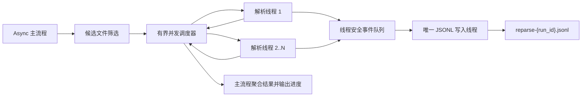

# Feature: F067-知识空间文件重解析可观测性

> **前置步骤**：已完成 Spec Discovery。执行人已确认使用普通异常隔离的线程并发、
> JSONL 实时事件流、默认报告路径，以及文件与整次运行的时间统计口径。

**关联需求**: 知识空间文件批量重解析运维增强（2026-07-28）
**优先级**: P1
**所属版本**: v2.6.0
**状态**: Confirmed（用户于 2026-07-28 确认）
**类型**: 后端运维脚本增强；不新增 HTTP API、数据库表、迁移或第三方依赖。

---

## 1. 概述与用户故事

作为 **平台运维人员**，
我希望在本地并发重解析知识空间文件时实时看到进度，并获得可持续读取的 JSONL 运行记录，
以便定位慢文件、隔离单文件失败并准确评估整批任务耗时。

### 当前实现

- `scripts/reparse_knowledge_space_files.py` 已通过 `--concurrency`、
  `asyncio.Semaphore` 和 `asyncio.to_thread` 提供有界线程并发。
- 单文件执行已经将普通 `Exception` 转换为失败结果，现有测试证明一个文件失败后其他文件继续执行。
- 当前终端仅在文件完成时输出 `SUCCESS` 或 `FAILED`，没有开始事件、进度比例或耗时。
- 当前 `FileReparseResult`、`RunReport` 不包含时间字段，也不生成持久化运行报告。

---

## 2. 范围

### 2.1 包含

- 保留现有 `--concurrency` 参数和有界线程并发模型。
- 隔离每个文件抛出的普通 Python `Exception`，并继续执行其他已选择文件。
- 使用线程安全队列把运行事件传递给唯一的 JSONL 写入线程。
- 在 `--apply` 模式下实时追加运行、筛选、处理、文件开始和文件完成事件。
- 默认写入 `./reparse_reports/reparse-{run_id}.jsonl`，允许通过 `--report-file` 指定路径。
- 记录带时区的开始、结束时间，以及使用单调时钟计算的文件、筛选、处理和整次运行耗时。
- 在终端实时输出文件开始、文件完成和聚合进度。
- 扩展现有定向测试与运维文档。

### 2.2 不包含

- 多进程解析、子进程生命周期管理或进程间队列。
- 原生扩展崩溃、解释器退出、`os._exit()` 或线程永久阻塞的隔离。
- 单文件超时、取消或强制终止机制。
- JSONL 断点续跑、报告回放或从已有报告恢复。
- 修改候选文件筛选规则、向量清理顺序、解析管线、文件状态流转或 dry-run 语义。
- 修改 `enqueue_reparse_knowledge_space_files.py`。
- 新增数据库 Schema、Alembic migration、API、前端或第三方依赖。

---

## 3. 需求 Requirements

| ID | 需求 |
|----|------|
| REQ-001 | 运维人员必须能够通过 `--concurrency` 指定本地解析并发上限；单文件普通异常必须独立记录，不能中断其他文件或跳过最终汇总。 |
| REQ-002 | `--apply` 运行必须通过线程安全队列和独立写入线程实时生成逐行合法的 JSONL 事件记录，解析线程不得直接写报告文件。 |
| REQ-003 | 每个被执行文件必须记录实际取得并发槽后的开始时间、结束时间、单调时钟用时、最终状态和错误信息。 |
| REQ-004 | 整次运行必须记录筛选耗时、并发处理耗时和包含筛选阶段的脚本总耗时，并在终态事件中汇总成功数、失败数和总数。 |
| REQ-005 | 终端必须在运行过程中输出文件开始、文件完成和总体进度，便于运维人员不读取报告也能观察任务状态。 |
| REQ-006 | 报告写入失败必须反馈给主流程并导致非零退出，不得被静默忽略；现有解析结果、dry-run 和文件失败退出语义必须保持兼容。 |

---

## 4. 验收标准

| ID | 关联需求 | 角色 | 操作 | 预期结果 |
|----|----------|------|------|---------|
| AC-01 | REQ-001 | 运维人员 | 以 `--apply --concurrency N` 处理多个可解析文件 | 同时占用解析并发槽的文件数始终不超过 `N`，所有已选择且带有效 ID 的文件最终均进入成功或失败汇总。 |
| AC-02 | REQ-001, REQ-006 | 运维人员 | 其中一个文件的重解析函数抛出普通 `Exception` | 该文件记录为失败，错误信息可见；其他文件继续执行，最终退出码仍按聚合失败结果返回非零。 |
| AC-03 | REQ-002 | 运维人员 | 启动带候选文件的 `--apply` 运行并在运行期间读取报告 | 默认路径或 `--report-file` 指定路径中可持续读到逐行合法 JSON；文件开始和完成事件在整批结束前已落盘。 |
| AC-04 | REQ-002, REQ-006 | 运维人员 | 多个解析线程同时产生事件 | 只有独立写入线程持有并写入报告文件；事件行不交错、不损坏，同一文件的 `file_started` 先于 `file_completed`。 |
| AC-05 | REQ-003 | 运维人员 | 任一文件成功、返回失败结果或抛出普通异常 | 对应 `file_completed` 均包含 `started_at`、`finished_at`、非负 `duration_seconds`、`success`、`final_status` 和 `error`；失败记录的 `error` 非空。 |
| AC-06 | REQ-004 | 运维人员 | 整批运行正常结束或包含文件级失败 | `run_completed` 包含筛选耗时、处理耗时、总耗时、总数、成功数、失败数和运行终态，且 `success + failed = total`。 |
| AC-07 | REQ-005 | 运维人员 | 观察脚本标准输出 | 文件开始时输出身份信息；每个文件完成时输出结果以及 `completed/total`、百分比、成功数、失败数和累计处理耗时。 |
| AC-08 | REQ-006 | 运维人员 | 报告目录不可创建、文件不可写或写入线程运行时失败 | 脚本输出明确的报告错误并以非零状态退出；异常不会被伪报为报告成功。 |
| AC-09 | REQ-006 | 运维人员 | 不带 `--apply` 执行现有筛选命令 | 保持现有 dry-run 输出与无业务写入行为，不创建解析时间报告，不执行文件重解析。 |
| AC-10 | REQ-002, REQ-006 | 运维人员 | `--report-file` 指向已存在的文件 | 脚本在解析开始前拒绝覆盖或混入旧运行记录，并以非零状态退出。 |

---

## 5. JSONL 事件契约

### 5.1 公共字段

每一行必须是独立、完整的 JSON object，并至少包含：

| 字段 | 类型 | 说明 |
|------|------|------|
| `schema_version` | integer | 初始值为 `1`，用于后续兼容演进。 |
| `run_id` | string | 本次运行唯一标识，同时用于默认文件名。 |
| `event_type` | string | 事件类型。 |
| `timestamp` | string | 带时区的 ISO 8601 事件时间，统一使用 UTC。 |

### 5.2 事件类型

| 事件 | 必要内容 |
|------|----------|
| `run_started` | 生效后的 CLI 参数、报告路径、脚本开始时间。 |
| `selection_completed` | 筛选开始/结束时间、`selection_duration_seconds`、选择及跳过统计。 |
| `processing_started` | `processing_started_at`、文件总数、并发上限。 |
| `file_started` | `file_id`、`knowledge_id`、`file_name`、`started_at`。 |
| `file_completed` | 文件身份、`started_at`、`finished_at`、`duration_seconds`、`success`、`final_status`、`error` 和当前进度统计。 |
| `run_completed` | `finished_at`、运行终态、`selection_duration_seconds`、`processing_duration_seconds`、`total_duration_seconds`、文件总数、成功数、失败数。 |

### 5.3 顺序与持久化

- `run_started` 是首个事件，`run_completed` 是报告正常关闭前的最后一个业务事件。
- `selection_completed` 必须先于 `processing_started`。
- 不同文件之间允许交错，但同一文件的 `file_started` 必须先于 `file_completed`。
- 写入线程每写完一行必须换行并刷新 Python 文件缓冲，使运行中的读者可以及时读取完整事件。
- 写入线程使用终止哨兵完成有序关闭；主流程必须等待写入线程消费完已提交事件。
- 如果写入线程失败，必须保存原始异常并在主流程检查或关闭写入器时重新抛出可识别的报告异常。

---

## 6. CLI 契约

```bash
cd src/backend

# 使用默认报告路径
PYTHONPATH=./ .venv/bin/python scripts/reparse_knowledge_space_files.py \
  --apply \
  --concurrency 4

# 显式指定 JSONL 报告路径
PYTHONPATH=./ .venv/bin/python scripts/reparse_knowledge_space_files.py \
  --apply \
  --concurrency 4 \
  --report-file /var/log/bisheng/reparse-run.jsonl
```

| 参数 | 必填 | 说明 |
|------|------|------|
| `--concurrency` | 否 | 正整数，保持现有默认值 `1`，表示同时解析文件数的上限。 |
| `--report-file` | 否 | JSONL 报告路径；仅 `--apply` 使用。缺失时写入 `./reparse_reports/reparse-{run_id}.jsonl`。 |

路径规则：

- 默认报告目录按脚本规定的后端工作目录解析，并在需要时创建。
- 显式路径的父目录不存在时可以创建。
- 目标文件已存在时拒绝覆盖，不引入危险覆盖开关。
- `--report-file` 不改变 dry-run 行为。

---

## 7. 架构设计

### 7.1 执行链路



### 7.2 组件职责

#### JSONL 事件写入器

- 启动时以独占创建模式打开报告文件，防止覆盖已有记录。
- 暴露线程安全的事件提交接口；调用者只负责构造可 JSON 序列化的数据。
- 写入线程串行执行 `json.dumps`、换行、写入和刷新。
- 记录写入异常，在后续提交或关闭时反馈给主流程。
- 关闭时提交哨兵、等待线程退出，并确认队列中此前事件已消费。

#### 时间记录

- 墙钟时间使用 UTC、带时区的 ISO 8601 字符串，服务于审计和人工阅读。
- 用时使用 `time.perf_counter()` 的差值，避免系统时间校准造成负数或跳变。
- 文件计时从取得并发槽并准备调用解析函数开始，到获得结果对象或捕获异常结束。
- 脚本总计时从 `--apply` 运行初始化开始，覆盖候选筛选、处理和最终汇总。

#### 并发调度与异常隔离

- 保留 `asyncio.Semaphore(concurrency)` 与线程执行模式，不切换多进程。
- 每个文件在自己的防御性 `try/except Exception` 边界内执行。
- 已知失败结果和未预期普通异常均转换为统一的 `FileReparseResult`，再补充时间字段。
- 任何单文件失败不取消其他文件；所有结果完成后统一决定退出码。

#### 进度输出

- 获取并发槽后输出 `[START]`，包含文件身份和已启动数量。
- 每个完成结果输出 `[SUCCESS]` 或 `[FAILED]`。
- 完成输出包含 `completed/total`、百分比、成功数、失败数和处理阶段累计用时。
- 输出由现有调度主流程聚合，避免多个解析线程直接竞争终端输出。

### 7.3 运行终态

| 终态 | 条件 |
|------|------|
| `success` | 所有被执行文件均成功，报告正常写完。 |
| `partial_failure` | 至少一个文件失败，但调度与报告正常完成。 |
| `failed` | 筛选、调度、报告初始化或报告写入发生运行级错误。 |

文件失败继续沿用现有非零退出语义。报告子系统失败也必须非零退出，但本特性不要求改变既有成功和
dry-run 的退出码。

---

## 8. 架构决策

| ID | 决策 | 选项 | 结论 | 理由 |
|----|------|------|------|------|
| AD-01 | 解析隔离模型 | A: 线程普通异常隔离 / B: 多进程硬隔离 | 选 A | 用户已确认只要求普通异常隔离；复用现有同步解析管线和应用上下文，改动与资源开销更小。 |
| AD-02 | 报告格式 | A: 反复覆盖单个 JSON / B: 追加 JSONL | 选 B | 用户已确认 JSONL；逐行追加适合大量文件、实时消费和进程异常后的已写事件保留。 |
| AD-03 | 写入并发控制 | A: 解析线程加锁写入 / B: 队列 + 单写入线程 | 选 B | 文件句柄只有一个所有者，避免解析线程竞争磁盘锁，并集中处理刷新和错误传播。 |
| AD-04 | 时间来源 | A: 仅墙钟 / B: 墙钟时间戳 + 单调时钟用时 | 选 B | 同时满足审计可读性和稳定耗时计算。 |
| AD-05 | 已有报告文件 | A: 追加混合 / B: 覆盖 / C: 拒绝 | 选 C | 避免混合不同 `run_id` 或破坏运维记录，且不引入未经授权的覆盖行为。 |
| AD-06 | dry-run 报告 | A: 生成 JSONL / B: 保持现状、不生成 | 选 B | 用户需要的是解析时长；保持现有 dry-run 兼容性并避免产生无解析意义的文件事件。 |

---

## 9. 边界情况与错误处理

- 候选文件为空时，`--apply` 仍可写出 `run_started`、`selection_completed` 和
  `run_completed`，汇总数量为零；不产生文件事件。
- 某文件在选择后变为不符合条件时，沿用现有失败结果；仍记录完整文件时间和错误。
- 某文件记录在实际执行时不存在、不是文件或不属于知识空间时，沿用现有失败结果。
- 不带有效 ID 的候选对象不得破坏 `success + failed = total` 的不变量；执行集合与汇总总数必须使用同一口径。
- JSON 序列化失败、目录创建失败、文件打开失败、写入或刷新失败都属于报告失败，必须记录到终端并非零退出。
- 写入线程失败后，已经开始的解析线程不做强制终止；主流程收集可获得的解析结果后报告运行级失败。
- 进程被 `SIGKILL`、解释器崩溃或主机断电时，最后一条事件可能丢失；此前已换行并刷新的 JSONL 行仍应保持可解析。
- 高并发可能同时增加数据库、Milvus、Elasticsearch、MinIO 和解析服务压力；本特性不自动计算安全并发值。

---

## 10. 文件清单

### 新建

| 文件 | 说明 |
|------|------|
| `features/v2.6.0/067-reparse-observability/spec.md` | 已澄清需求、设计决策、事件契约和验证策略。 |
| `features/v2.6.0/067-reparse-observability/tasks.md` | 规格确认后生成的可追踪实施任务。 |
| `features/v2.6.0/067-reparse-observability/verification.md` | 实现完成后记录实际验证命令、结果与未验证项。 |

### 修改

| 文件 | 变更内容 |
|------|----------|
| `src/backend/scripts/reparse_knowledge_space_files.py` | 增加 JSONL 写入器、事件模型、时间统计、`--report-file` 和进度输出。 |
| `src/backend/test/knowledge/test_reparse_knowledge_space_files_script.py` | 增加并发上限、异常隔离、时间字段、JSONL 实时性、写入失败和兼容性测试。 |
| `src/backend/scripts/README.md` | 补充报告路径、JSONL 事件、进度与失败处理说明。 |

不修改 `release-contract.md`：本特性不新增领域对象、跨 Feature 不变量、依赖或错误码。

---

## 11. 需求追踪与验证策略

### 11.1 验证映射

| Verification ID | 方法 | 覆盖验收标准 | Evidence Target |
|-----------------|------|--------------|-----------------|
| V-001 | 使用同步原语和可控假解析函数的异步单元测试 | AC-01, AC-02 | 验证最大活跃任务数不超过并发参数，单文件抛错后其他文件完成且汇总准确。 |
| V-002 | `tmp_path` 下的 JSONL 写入器与运行器测试 | AC-03, AC-04, AC-10 | 逐行 `json.loads`、事件顺序、运行中可见性、单写入者和已有路径拒绝。 |
| V-003 | 可控时钟或范围断言的结果模型测试 | AC-05, AC-06 | 文件和运行时间字段完整、用时非负、汇总守恒。 |
| V-004 | `capsys` 终端输出测试 | AC-07 | 开始信息、完成进度、百分比、成功/失败计数和累计用时。 |
| V-005 | 报告初始化/运行时写入故障注入测试 | AC-08 | 错误传播、非零退出、无伪成功信息。 |
| V-006 | 现有参数、筛选和 dry-run 回归测试 | AC-09 | 不带 `--apply` 不解析、不创建报告，原有筛选与参数行为不变。 |
| V-007 | 定向 pytest、Ruff 与 CLI smoke | AC-01 至 AC-10 | `uv run pytest test/knowledge/test_reparse_knowledge_space_files_script.py`；相关文件 Ruff；脚本 `--help`。 |

### 11.2 最低充分验证层级

- 风险等级：V2 模块/集成。并发调度、跨线程队列、文件 I/O 与错误传播存在独立边界风险。
- 主要测试层：脚本模块级 pytest，外部数据库、Milvus、Elasticsearch、MinIO 和真实解析管线使用现有 fake/mock 隔离。
- CLI 冒烟只验证参数和可运行入口，不执行真实 `--apply`。
- 不运行真实知识文件重解析，不连接生产基础设施；真实资源压力和推荐并发值留给运维环境控制。

---

## 12. 兼容性、风险与回滚

### 兼容性

- 保持现有 `--concurrency` 默认值和校验规则。
- 保持现有范围、状态参数及 dry-run 行为。
- 保持文件成功/失败聚合与“存在文件失败则非零退出”的语义。
- 新增参数为可选参数；现有调用命令无需修改。

### 风险

- 线程只能隔离普通 Python 异常，不能防护进程级崩溃或永久阻塞。
- 每个文件至少产生两个事件；极端大批量且磁盘很慢时，内存中的待写事件可能短暂积压。
- 每行刷新提升实时性但增加磁盘 I/O；JSONL 追加避免反复序列化全部历史，控制该成本。
- 运行报告可能包含文件名和异常信息，运维人员需将报告路径放在访问受控位置。

### 回滚

- 代码回滚仅涉及脚本、定向测试和 README，不涉及数据库或配置迁移。
- 已生成 JSONL 是运行审计产物，可由运维人员按保留策略处理；代码回滚不自动删除报告。
- 如果报告功能阻止脚本启动，可回滚本特性代码后使用原有命令；知识文件业务数据无需迁移。

---

## 13. 澄清记录

### Session 2026-07-28

- Q: 普通异常隔离还是进程级硬隔离？
  A: 选择普通异常隔离，保留线程并发（1A）。
- Q: 使用单个 JSON 还是 JSONL 实时事件流？
  A: 选择 JSONL，并接受默认报告路径（2B）。
- Q: 文件、处理阶段和脚本总时间的统计口径是否接受？
  A: 接受；文件从取得并发槽开始计时，用时采用单调时钟，同时记录筛选、处理和脚本总耗时（3 接受）。

---

## 14. 规格质量门

- [x] 每个 requirement 具有稳定 `REQ-*` ID。
- [x] 每个 acceptance criterion 具有稳定 `AC-*` ID。
- [x] 每个 acceptance criterion 均映射到 verification method。
- [x] 包含与不包含范围明确。
- [x] 已记录并发、报告格式、时间口径和失败处理决策。
- [x] 设计覆盖全部 requirement。
- [x] 未新增 Schema、API、领域对象、错误码或第三方依赖。
- [x] 与 `features/v2.6.0/release-contract.md` 不冲突。
- [x] 用户确认 `spec.md`（2026-07-28）。
