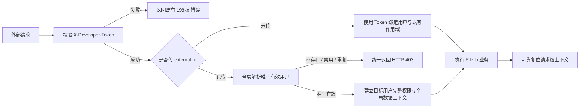

# Feature: F069-Filelib OpenAPI 外部用户权限上下文

> **前置步骤**：已完成 Spec Discovery。用户于 2026-08-02 确认：
> `external_id` 可选；未传时使用 Developer Token 绑定用户；全局匹配用户且不使用租户过滤；
> 重复匹配失败关闭；目标用户完整继承包括全局超级管理员在内的权限；空值和错误语义按本规格执行。

**关联需求**: `docs/api/filelib-openapi-interfaces.md` 的四个 Filelib OpenAPI 接口增加外部用户权限与作用域
**优先级**: P0
**所属版本**: v2.6.0
**状态**: Confirmed（用户于 2026-08-02 确认）
**类型**: 后端 OpenAPI 认证/授权上下文调整；不新增数据库表、迁移、前端或第三方依赖。

---

## 1. 概述与用户故事

作为 **持有有效 Developer Token 的外部系统**，
我希望在调用 Filelib OpenAPI 时可选地传入业务用户 `external_id`，
以便 Token 只证明接口调用资格，而知识资源权限和数据作用域由指定业务用户决定。

### 1.1 当前实现

- `X-Developer-Token` 是四个接口的必填 Header。
- Developer Token 认证会校验 Token 状态、绑定租户和用户、IP、路由白名单及限流，随后返回 Token 绑定的 `UserPayload`。
- 四个接口当前都使用 Token 绑定用户执行知识资源列表、文件列表、文件详情和 Chunk 检索权限检查。
- `user.external_id` 只与 `source` 组成唯一约束，单独的 `external_id` 在全局范围可能匹配多条用户记录。

### 1.2 目标链路



---

## 2. 范围

### 2.1 包含

- 为以下四个接口增加可选 `external_id`：
  - `GET /api/v2/filelib/`
  - `GET /api/v2/filelib/file/list`
  - `GET /api/v2/filelib/file/detail`
  - `POST /api/v2/filelib/retrieve`
- 保留并优先执行完整的 Developer Token 认证链路。
- 未传 `external_id` 时保持 Token 绑定用户的现有行为。
- 传入 `external_id` 时全局解析唯一有效用户，并以该用户完整权限执行请求。
- 外部用户路径不使用 Token 租户或租户可见集限制，资源访问仍须通过现有知识资源权限检查。
- 覆盖参数、身份切换、权限允许/拒绝、超级管理员、错误优先级、重复用户和上下文复位测试。
- 更新 `docs/api/filelib-openapi-interfaces.md`。
- 在 `features/v2.6.0/release-contract.md` 登记跨 DeveloperToken、User、Knowledge 的新不变量。

### 2.2 不包含

- 其他 `/api/v2/filelib` 路由，包括创建、上传、删除、QA 和文件同步接口。
- 修改 Developer Token 表、绑定关系、管理 API 或管理页面。
- 修改 `user` 表、`external_id` 唯一约束、用户同步规则或补数据。
- 新增 `source` 参数或改变 `(source, external_id)` 现有数据约束。
- 前端改动、数据库迁移、新依赖或部署配置变更。
- 为多租户启用场景建立 Token 与目标用户的租户映射或权限交集；启用多租户前必须重新评审本特性。
- 改变四个接口的成功响应结构、业务字段和既有知识资源权限模型。

---

## 3. 需求 Requirements

| ID | 需求 |
|----|------|
| REQ-001 | 四个目标接口必须继续要求 `X-Developer-Token`，并在读取、解析或应用 `external_id` 前完成 Token 有效性、启用状态、绑定、IP、路由白名单和限流校验。 |
| REQ-002 | 三个 GET 接口必须通过 Query 接收可选 `external_id`；POST `/retrieve` 必须通过 JSON Body 接收可选 `external_id`；字段最大长度与 `user.external_id` 数据列兼容。 |
| REQ-003 | 请求完全未传 `external_id` 时，必须继续使用 Token 绑定的 `UserPayload` 和既有请求作用域，不得改变当前接口结果。 |
| REQ-004 | 请求传入非空 `external_id` 时，必须全局精确匹配 `delete=0` 的用户；只有恰好一条有效记录才可继续，不按 `source`、Token 租户或数据库返回顺序任取用户。 |
| REQ-005 | 唯一目标用户必须获得其正常身份对应的角色、ReBAC/RBAC 权限和 `is_global_super` 状态；目标用户为全局超级管理员时必须保留该能力，不与 Token 用户权限取交集。 |
| REQ-006 | 外部用户路径必须解除 Token 租户和租户可见集对本次 Filelib 资源查询的限制，同时继续执行知识资源自身的读取权限检查；请求结束或失败时必须可靠复位全部临时上下文。 |
| REQ-007 | 显式空白 `external_id` 必须返回 `422`，不得回退到 Token 用户；用户不存在、已禁用或匹配不唯一必须统一返回 HTTP `403`，且响应不得暴露具体原因。 |
| REQ-008 | 现有成功响应、Token 认证错误、资源无权访问错误及其他业务错误必须保持兼容；日志不得记录 Developer Token 明文，也不得在对外错误中回显 `external_id` 或用户匹配详情。 |
| REQ-009 | 实现必须遵循 Endpoint → Service → Repository 分层；用户查询通过 ORM Repository 完成，不在 Endpoint 或 Service 中编写 ORM 查询，不新增 DAO 入口。 |

---

## 4. API 契约

### 4.1 通用 Header

```http
X-Developer-Token: bst_{REDACTED}
```

`X-Developer-Token` 仍为必填。Token 校验失败时，响应保持现有 `19801` 至 `19806`、`19812` 等错误，且不得继续解析 `external_id`。

### 4.2 GET Query 参数

以下三个接口新增相同参数：

| 参数 | 类型 | 必填 | 默认值 | 说明 |
|------|------|------|--------|------|
| `external_id` | string | 否 | `null` | 实际业务用户的外部 ID。未传时使用 Token 绑定用户；传入空白字符串返回 `422`。最大长度 `255`。 |

请求示例：

```http
GET /api/v2/filelib/?type=3&page_size=10&external_id=EMP001
GET /api/v2/filelib/file/list?knowledge_id=118&external_id=EMP001
GET /api/v2/filelib/file/detail?file_encoding=DOC001&external_id=EMP001
```

### 4.3 POST `/retrieve` Body

现有 Body 增加：

```json
{
  "external_id": "EMP001",
  "query": "安全管理要求",
  "knowledge_base_ids": [118],
  "top_k": 10,
  "max_content": 15000
}
```

| 字段 | 类型 | 必填 | 默认值 | 说明 |
|------|------|------|--------|------|
| `external_id` | string | 否 | `null` | 实际业务用户的外部 ID；校验规则与 GET 参数一致。 |

### 4.4 参数状态区分

| 请求状态 | 行为 |
|----------|------|
| 字段完全缺失 | 使用 Token 绑定用户。 |
| 合法非空字符串 | 全局解析目标用户。 |
| `""`、仅空格或清理后为空 | `422`，不得回退。 |
| 长度超过 `255` | `422`。 |

### 4.5 错误优先级

1. Developer Token 认证错误。
2. `external_id` 结构校验错误（`422`）。
3. 目标用户解析错误（统一 `403`）。
4. 资源参数、存在性和权限错误。
5. 下游检索或存储错误。

同一请求同时包含无效 Token 和无效 `external_id` 时，必须只观察到 Token 认证错误。

---

## 5. 验收标准

| ID | 关联需求 | 角色 | 操作 | 预期结果 |
|----|----------|------|------|----------|
| AC-01 | REQ-001, REQ-008 | 外部系统 | 不传、传无效或禁用的 `X-Developer-Token`，同时传任意 `external_id` | 返回既有 Token 错误；没有用户查询、权限检查或 Filelib 业务调用。 |
| AC-02 | REQ-002 | 外部系统 | 在三个 GET Query 或 `/retrieve` JSON Body 中传合法 `external_id` | 请求通过参数校验，字段不进入响应且不改变其他参数语义。 |
| AC-03 | REQ-003 | 外部系统 | 完全不传 `external_id` 调用任一目标接口 | 使用 Token 绑定用户；现有权限结果、响应结构和请求上下文保持不变。 |
| AC-04 | REQ-004, REQ-005 | 外部系统 | 传入只匹配一名有效普通用户的 `external_id` | 使用该用户的 ID、角色和 ReBAC/RBAC 权限执行；不使用 Token 用户资源权限。 |
| AC-05 | REQ-005, REQ-006 | 外部系统 | 传入唯一有效且为全局超级管理员的用户 `external_id` | `is_global_super=true` 生效，能够获得该身份在四个接口中的完整权限和全局资源作用域。 |
| AC-06 | REQ-004, REQ-007 | 外部系统 | `external_id` 不存在、只匹配禁用用户或匹配多名有效用户 | 三种场景均返回相同 HTTP `403`，不泄露差异，且不执行 Filelib 业务。 |
| AC-07 | REQ-002, REQ-007 | 外部系统 | 显式传空字符串、纯空白字符串或超过长度限制的 `external_id` | 返回 `422`，不得回退使用 Token 绑定用户。 |
| AC-08 | REQ-006 | 外部系统 | 外部用户读取有权与无权知识资源 | 有权请求成功；无权请求保持现有 `403`；Token 所属租户不参与限制。 |
| AC-09 | REQ-006, REQ-008 | 外部系统 | 成功、目标用户拒绝、资源拒绝或下游抛错后复用同一 Worker 处理下一请求 | 租户过滤、可见租户和身份上下文均无泄漏；下一请求只看到自身上下文。 |
| AC-10 | REQ-008 | 外部系统 | 检查四个接口既有成功与错误 fixture | 成功响应字段、状态码和非本特性错误保持兼容。 |
| AC-11 | REQ-008 | 安全审查人员 | 检查日志和对外错误 | 不出现 Token 明文；`403` 不回显 `external_id`、匹配数量、用户状态或内部查询详情。 |
| AC-12 | REQ-009 | 代码审查人员 | 检查用户解析实现 | Endpoint 不直接查询 ORM；Service 通过 User Repository 接口获得候选用户；没有新增 DAO 方法。 |

---

## 6. 架构设计

### 6.1 组件职责

#### Developer Token 认证依赖

- 保持现有 Token 认证入口和校验顺序。
- 返回完整 `DeveloperTokenPrincipal`，其中 Token 用户仅作为缺省业务用户。
- Token 认证成功后才允许进入 Filelib 用户上下文解析。

#### Filelib 用户上下文 Service

- 输入 `DeveloperTokenPrincipal` 与可选 `external_id`。
- `external_id is None` 时直接返回 principal 中的 Token 用户，不改变租户上下文。
- `external_id` 非空时通过 User Repository 查询所有全局候选，过滤软删除用户并检查恰好一条。
- 使用现有登录用户初始化能力构造完整 `UserPayload`，包括角色和 `is_global_super`。
- 建立与复位外部用户请求所需的全局数据上下文；上下文生命周期必须覆盖全部权限检查和业务查询。
- 目标用户解析失败使用统一无权限响应，详细原因仅允许在不包含原始标识的受控内部日志中区分。

#### User Repository

- 在现有 `UserRepository` 接口增加按 `external_id` 列出有效候选用户的只读方法。
- `UserRepositoryImpl` 使用 SQLModel/SQLAlchemy 参数化查询实现精确匹配。
- Repository 返回全部候选供 Service 判定唯一性，不使用 `.first()` 隐藏重复数据。

#### Filelib Endpoint 与检索 Service 绑定

- 三个 GET Endpoint 复用 Query 用户上下文依赖。
- `/retrieve` 从 `RetrieveReq.external_id` 解析用户后，再以该用户构造 `KnowledgeSpaceChatService`。
- 四个 Endpoint 只消费已解析的 `UserPayload`，不包含用户查库和唯一性判断。

### 6.2 全局上下文边界

当且仅当请求显式传入并成功解析 `external_id` 时：

- 本次 Filelib 业务范围内不应用 Token 租户 SQL 过滤。
- 本次请求的可见租户集合不得继续保留 Token 租户限制。
- 资源访问仍按目标用户的 ReBAC/RBAC、创建者和全局超级管理员状态判断。
- 所有临时 ContextVar 和租户过滤开关必须通过 `try/finally` 或 yield dependency 复位。
- 未传 `external_id` 的回退路径不得进入全局上下文。

本决策只服务当前未启用多租户的部署。若部署启用多租户，F069 必须先更新规格，明确 Token、目标用户和租户之间的约束。

### 6.3 关键架构决策

| ID | 决策 | 选项 | 结论 | 理由 |
|----|------|------|------|------|
| AD-01 | Token 与业务身份关系 | A: Token 同时决定资格和权限 / B: Token 只决定资格，`external_id` 可决定权限 | 选 B | 用户明确要求身份职责分离；未传时保留兼容回退。 |
| AD-02 | 参数位置 | A: 统一 Header / B: GET Query + POST Body | 选 B | 用户已确认，且保持参数在各接口既有输入模型中显式可见。 |
| AD-03 | 用户匹配键 | A: `source + external_id` / B: Token 租户内 `external_id` / C: 全局 `external_id` | 选 C | 用户明确要求全局匹配；重复时失败关闭抵消组合唯一约束不足。 |
| AD-04 | 未传参数 | A: 拒绝 / B: 回退 Token 用户 | 选 B | 保持现有调用方兼容。 |
| AD-05 | 空白参数 | A: 视为未传 / B: `422` | 选 B | 防止调用方错误把显式空值降级为可能权限更高的 Token 用户。 |
| AD-06 | 权限上限 | A: 目标用户完整权限 / B: 排除超级管理员 / C: 与 Token 权限取交集 | 选 A | 用户明确确认目标用户完整继承，包括全局超级管理员。 |
| AD-07 | 租户作用域 | A: Token 租户 / B: 目标用户租户 / C: 不使用租户过滤 | 选 C | 用户确认当前系统不使用租户功能，并要求全局数据作用域。 |
| AD-08 | 匹配异常 | A: 细分不存在/禁用/重复 / B: 统一 `403` | 选 B | 减少用户枚举和内部数据质量泄露。 |
| AD-09 | 解析层次 | A: Endpoint/DAO 直查 / B: Endpoint → Service → Repository | 选 B | 遵守项目 DDD 分层和新增功能不得增加 DAO 入口的约束。 |

---

## 7. 文件结构计划

### 7.1 新建

| 文件 | 说明 |
|------|------|
| `features/v2.6.0/069-filelib-external-user-context/spec.md` | 本规格。 |
| `features/v2.6.0/069-filelib-external-user-context/tasks.md` | 规格确认后生成的可追踪任务。 |
| `features/v2.6.0/069-filelib-external-user-context/verification.md` | 实现完成后记录验证证据。 |
| `src/backend/bisheng/open_endpoints/domain/services/filelib_user_context_service.py` | 目标用户解析、完整 `UserPayload` 构造及全局请求上下文生命周期。 |
| `src/backend/test/open_endpoints/test_filelib_external_user_context.py` | 身份解析、错误优先级、权限切换、上下文复位和四接口契约测试。 |

### 7.2 修改

| 文件 | 变更内容 |
|------|----------|
| `features/v2.6.0/release-contract.md` | 登记 F069 跨模块身份与权限不变量、依赖和风险边界。 |
| `src/backend/bisheng/user/domain/repositories/interfaces/user_repository.py` | 增加按全局 `external_id` 列出有效候选的 Repository 契约。 |
| `src/backend/bisheng/user/domain/repositories/implementations/user_repository_impl.py` | 实现参数化精确匹配并返回全部有效候选。 |
| `src/backend/bisheng/open_endpoints/api/dependencies.py` | 注入 User Repository、Filelib 用户上下文 Service 和 GET Query 用户上下文。 |
| `src/backend/bisheng/open_endpoints/domain/schemas/filelib.py` | 为 `RetrieveReq` 增加可选 `external_id` 及空白/长度校验。 |
| `src/backend/bisheng/open_endpoints/api/endpoints/filelib.py` | 四个目标 Endpoint 使用解析后的业务用户；`/retrieve` 以该用户绑定检索 Service。 |
| `src/backend/test/knowledge/test_knowledge_space_chat_service_retrieve.py` | 调整既有依赖/Endpoint 测试，保持检索与文件详情回归。 |
| `docs/api/filelib-openapi-interfaces.md` | 更新双重身份说明、四接口参数、示例、回退规则和错误响应。 |

文件清单允许在 tasks 阶段因现有测试夹具复用而调整测试文件落点，但不得扩大到非目标 Filelib 路由、数据库或前端。

---

## 8. 验证策略

### 8.1 风险与层级

- 风险等级：V3 回归/端到端。
- 原因：身份替换、全局超级管理员继承、租户过滤解除和请求级 ContextVar 生命周期均属于权限与共享基础设施风险。
- 主要测试层：Open Endpoints 模块级 pytest，通过依赖覆盖和 mock/fake 验证 HTTP 契约、调用顺序、身份传播与上下文复位。
- 独立边界：Repository 查询使用隔离数据库或项目现有 Repository fixture 验证重复记录，不以 mock 代替唯一性语义。
- 不连接生产数据库、Redis、OpenFGA、Milvus、Elasticsearch 或 MinIO；真实 OpenFGA/存储联调列为隔离环境人工验证。

### 8.2 验证映射

| Verification ID | 方法 | 覆盖验收标准 | Evidence Target |
|-----------------|------|--------------|-----------------|
| V-001 | FastAPI 依赖/路由契约测试，Token 依赖设置调用计数 | AC-01, AC-02, AC-07 | Token 失败优先、GET/POST 参数位置、空白与超长 `422`。 |
| V-002 | Filelib 用户上下文 Service 单元测试 | AC-03, AC-04, AC-05, AC-06 | 回退用户、普通目标用户、超级管理员、无匹配、禁用和重复匹配。 |
| V-003 | User Repository 隔离数据库测试 | AC-06, AC-12 | 精确匹配、只返回有效记录、重复记录全部返回、无 `.first()` 隐藏。 |
| V-004 | 四 Endpoint 的权限主体传播测试 | AC-03, AC-04, AC-05, AC-08, AC-10 | 列表、文件列表、详情和检索均收到正确 `UserPayload`，成功/拒绝保持响应兼容。 |
| V-005 | 连续请求与故障注入测试 | AC-09 | 成功、403 和下游异常后 ContextVar/租户过滤恢复，后续请求无污染。 |
| V-006 | 日志捕获、响应扫描和源码 secret 扫描 | AC-06, AC-11 | 无 Token 明文、无外部标识回显、统一拒绝响应。 |
| V-007 | 定向 pytest、Ruff、架构守卫与文档一致性检查 | AC-01 至 AC-12 | 相关 Open Endpoints/User/Knowledge 测试、`ruff check`、`ruff format --check`、`scripts/arch-guard.sh`、`git diff --check`。 |
| V-008 | 隔离环境人工调用 | AC-03, AC-04, AC-05, AC-08, AC-09 | 使用普通用户、无权用户和全局超级管理员真实权限数据调用四接口；确认全局作用域和无上下文泄漏。 |

### 8.3 最低失败路径集合

- Token 缺失、无效、禁用、IP 禁止、路由禁止和限流错误至少复用现有 Token 回归，并新增“同时传无效 `external_id`”优先级断言。
- `external_id` 缺失、空字符串、纯空白、超长、唯一有效、仅禁用、不存在和多有效用户。
- Token 用户有权但目标用户无权；Token 用户无权但目标用户有权。
- 目标用户为全局超级管理员。
- 业务成功、权限拒绝和下游异常后的上下文复位。
- 四个接口中等价的参数/身份行为使用参数化测试，不为每个代码分支重复测试矩阵。

---

## 9. 安全评审

### 9.1 已确认高风险行为

任何通过 Developer Token 校验的调用方都可以提交任意全局 `external_id`，并完整继承目标用户权限，包括全局超级管理员能力。该行为可能把 Developer Token 变成通用用户模拟凭证。用户已于 2026-08-02 明确接受此风险。

### 9.2 强制安全约束

- Token 认证必须先于外部用户解析，不能用合法 `external_id` 绕过 Token。
- 显式空白不得回退，防止错误输入发生权限降级或升级。
- 重复用户必须失败关闭，禁止依赖无序数据库结果。
- 资源权限仍由目标用户的现有 PermissionService/ReBAC/RBAC 链路判断，不新增“有 Token 即放行”。
- 外部用户的全局上下文只能存在于单次目标请求内，必须在所有异常路径复位。
- 不拼接 SQL；`external_id` 使用 ORM 参数绑定并限制最大长度。
- 不记录 Token 明文；对外 `403` 不区分目标用户不存在、禁用或重复。
- 本特性不提供审计追踪字段。若上线要求追责“哪个 Token 模拟了哪个用户”，必须先更新规格，增加脱敏且可审计的稳定标识策略。

### 9.3 残余风险

- Developer Token 泄露将同时带来接口调用能力和任意用户模拟能力，影响面高于当前实现。
- 全局超级管理员的能力由运行时 OpenFGA/RBAC 状态决定，权限变更会即时改变外部调用结果。
- 全局 `external_id` 不唯一是允许存在的数据状态；冲突期间对应用户均无法通过本接口调用。
- 当前“无租户过滤”决策与项目长期多租户架构方向不兼容；启用多租户前必须阻断发布并重新设计。
- 统一 `403` 提升安全性，但调用方无法区分用户数据问题与权限问题，需要通过内部运维排查。

---

## 10. 兼容性、发布与回滚

### 10.1 兼容性

- `external_id` 为可选字段，现有调用方无需修改即可继续使用 Token 绑定用户。
- 现有 Header、URL、请求参数和成功响应字段不变。
- `/retrieve` 的 Pydantic Schema 增加可选字段，不改变已有请求的解析结果。
- 不新增 migration，MySQL 与 DM8 无方言差异。

### 10.2 发布检查

- 确认调用方将 `external_id` 作为可信业务身份来源，不直接转发终端用户可篡改输入。
- 在隔离环境验证普通用户、无权用户、重复用户和全局超级管理员。
- 确认 Token 路由白名单继续只开放预期四个接口。
- 监控 Token 认证错误、统一 `403` 和 `422` 变化，不记录敏感原文。
- 若运行环境实际启用了多租户，不得按本规格发布。

### 10.3 回滚

- 应用级回滚：恢复四个 Endpoint 使用 `get_developer_token_user`，移除请求 Schema/Query 中的 `external_id`。
- 文档级回滚：撤销外部用户参数和模拟权限说明。
- 无数据库、配置或数据迁移，回滚不需要数据恢复。
- 回滚后传入 GET `external_id` 可能被框架忽略，POST `/retrieve` 若 Schema 仍允许 extra 则需通过契约测试确认；发布时必须保持代码与文档同版本切换。

---

## 11. 需求追踪矩阵

| Requirement | Acceptance Criteria | Verification |
|-------------|---------------------|--------------|
| REQ-001 | AC-01 | V-001, V-007 |
| REQ-002 | AC-02, AC-07 | V-001, V-007 |
| REQ-003 | AC-03 | V-002, V-004 |
| REQ-004 | AC-04, AC-06 | V-002, V-003, V-004 |
| REQ-005 | AC-04, AC-05 | V-002, V-004, V-008 |
| REQ-006 | AC-05, AC-08, AC-09 | V-004, V-005, V-008 |
| REQ-007 | AC-06, AC-07 | V-001, V-002, V-006 |
| REQ-008 | AC-01, AC-03, AC-09, AC-10, AC-11 | V-001, V-004, V-005, V-006, V-007 |
| REQ-009 | AC-12 | V-003, V-007 |

---

## 12. Spec 评审门禁

- [x] 目标、四接口范围、参数位置和兼容回退已明确。
- [x] Token 与目标用户的职责、校验顺序和错误优先级已明确。
- [x] 全局用户匹配、重复失败关闭和完整超级管理员权限已由用户确认。
- [x] 无租户过滤及多租户不兼容风险已显式记录。
- [x] 每条需求都有可观察验收标准和验证方法。
- [x] 文件结构遵循 Endpoint → Service → Repository，未规划新增 DAO。
- [x] 未引入数据库、前端、依赖或非目标 Filelib 路由改动。
- [x] 用户已于 2026-08-02 确认本 `spec.md`，可以生成 `tasks.md`。
- [ ] `tasks.md` 完成并评审后，才可进入实现。

---

## 相关文档

- [Filelib OpenAPI 接口文档](../../../docs/api/filelib-openapi-interfaces.md)
- [v2.6.0 Release Contract](../release-contract.md)
- [F066 Token 配置化 Filelib 文件同步](../066-token-configured-filelib-sync/spec.md)
- `src/backend/AGENTS.md`
