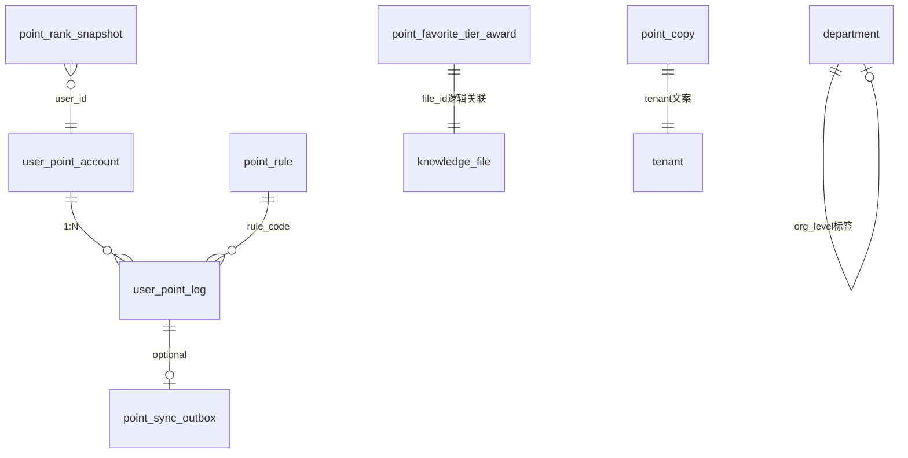
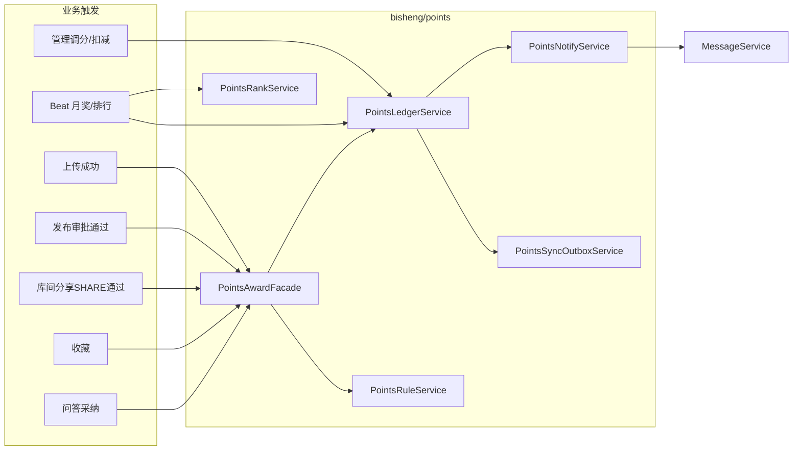
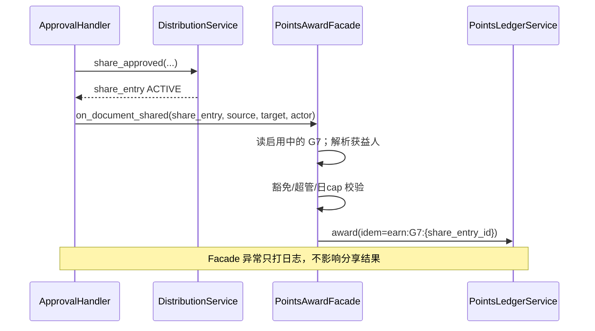
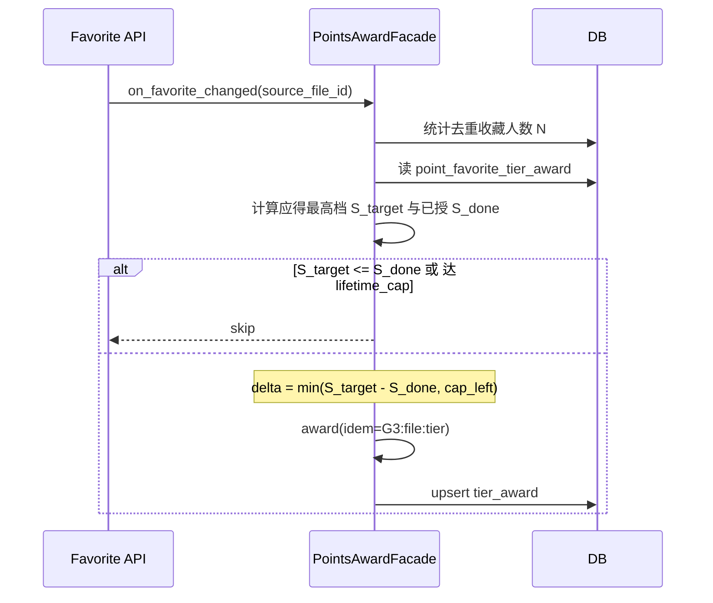
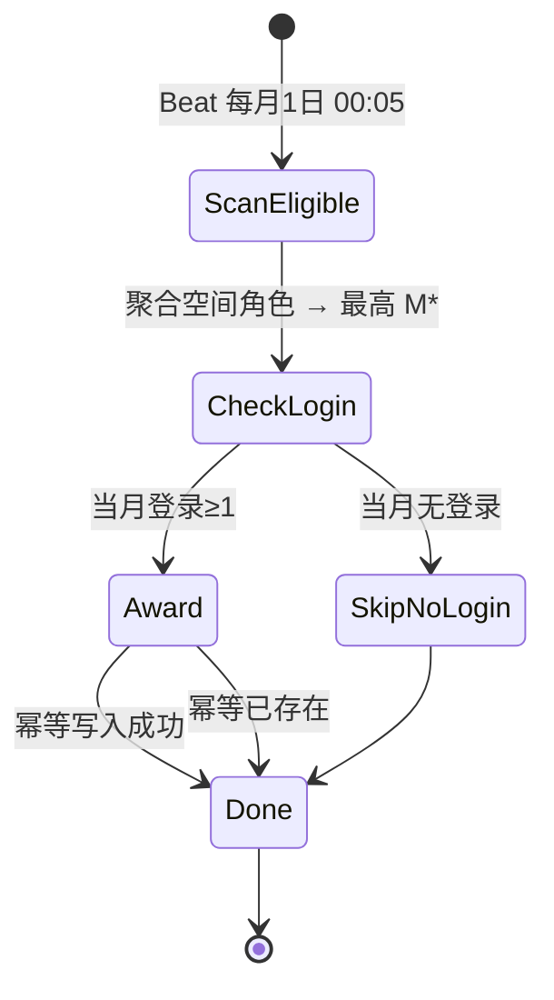
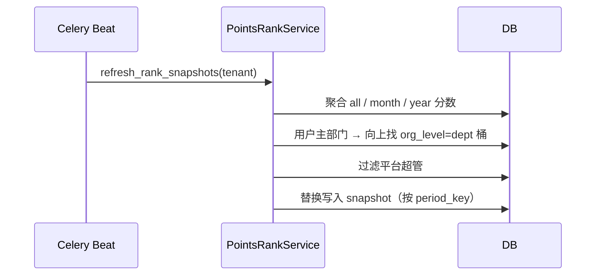
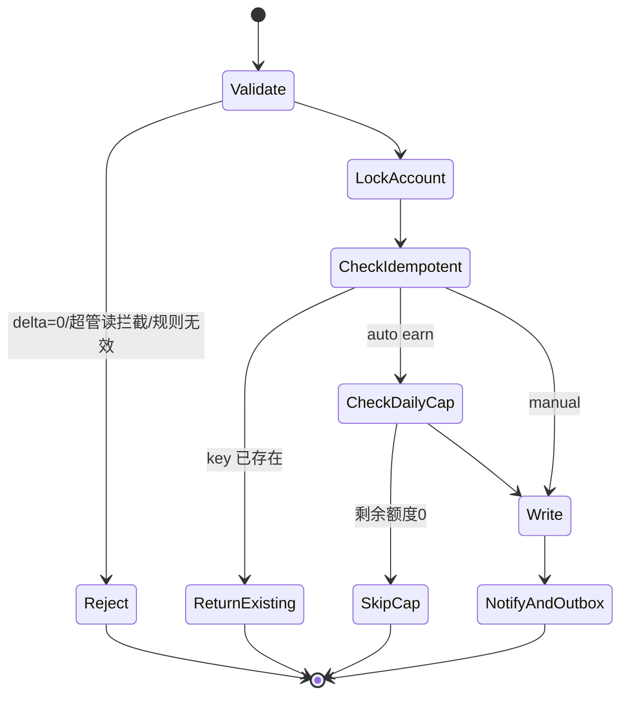
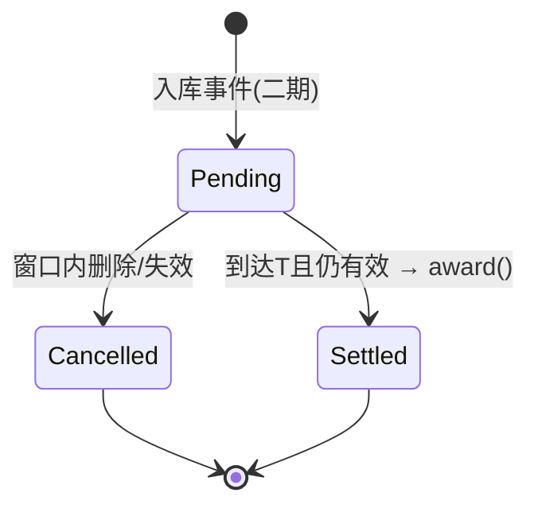

# F070 积分系统 · 后端设计方案

| 项 | 内容 |
|---|---|
| 关联 spec | [spec.md](./spec.md) |
| 产品决议 | [积分系统需求分析-V1.1.md §11](../../../docs/PRD/积分系统/积分系统需求分析-V1.1.md) |
| 模块 | `bisheng/points`，错误码 **182** |
| Alembic | 建议 revision `f077_points_system`（**勿用 f070**：仓库已有 `f070_department_transfer_permission_cleanup`） |
| 设计原则 | Append-only 流水 + 余额缓存 + 幂等键（对齐 Open edX Ledger / Sylius Loyalty / 通用 loyalty LLD）；**本期不做**规则版本状态机、FIFO 过期、兑换核销、延迟入账反作弊（§7 二期预留） |

---

## 0. 设计取舍（防过度设计）

| 采用（够用） | 不采用（过度） |
|---|---|
| 流水 append-only + 账户余额同行事务更新 | 纯 SUM 流水无缓存（千人明细可接受，榜单/摘要会慢） |
| `idempotency_key` 唯一约束防双计 | Kafka/事件总线 |
| 规则表 + `score_expr` JSON（固定/阶梯） | 通用规则引擎 / DRAFT→PUBLISHED 版本链 |
| 小时排行快照表 | 实时全表排序 / Redis 为唯一真相 |
| 同步 Outbox 骨架 | 首期对接协同办公完整兑换 |
| 应用层禁止 UPDATE/DELETE 流水 | DB TRIGGER 禁改（DM8/运维成本高，首期不做） |
| 本期立即入账 + 日 cap/幂等/豁免 | 延迟入账反作弊（§7，二期；默认 T=24h） |

---

## 1. DB 设计

### 1.1 ER 关系（逻辑）



### 1.2 新增表

#### 1.2.1 `user_point_account` — 用户积分账户（余额缓存）

| 字段 | 类型 | 约束 | 说明 |
|---|---|---|---|
| id | BIGINT | PK AI | |
| tenant_id | INT | NOT NULL, DEFAULT 1, IDX | 多租户 |
| user_id | INT | NOT NULL | 用户 |
| balance | INT | NOT NULL, DEFAULT 0 | 当前余额，**允许负** |
| lifetime_earned | INT | NOT NULL, DEFAULT 0 | 历史累计获得（只增不因扣减减少） |
| lifetime_deducted | INT | NOT NULL, DEFAULT 0 | 历史累计扣减绝对值之和 |
| version | INT | NOT NULL, DEFAULT 0 | 乐观锁备用（主路径用行锁） |
| create_time / update_time | DATETIME | NOT NULL | `UPDATE_TIME_SERVER_DEFAULT` |

**唯一/索引**

| 名 | 列 | 类型 |
|---|---|---|
| uk_upa_tenant_user | (tenant_id, user_id) | UNIQUE |
| ix_upa_tenant_balance | (tenant_id, balance) | 总榜辅助 |

**作用**：读路径 O(1) 取余额；写路径与流水同事务更新。真相源仍是流水，可用对账任务重算。

---

#### 1.2.2 `user_point_log` — 积分流水（append-only）

| 字段 | 类型 | 约束 | 说明 |
|---|---|---|---|
| id | BIGINT | PK AI | |
| tenant_id | INT | NOT NULL, IDX | |
| user_id | INT | NOT NULL | 获益/被扣用户 |
| delta | INT | NOT NULL | 正=获得，负=扣减，**禁止 0** |
| balance_after | INT | NOT NULL | 变动后余额 |
| direction | VARCHAR(16) | NOT NULL | `earn` / `deduct`（冗余便于筛） |
| rule_code | VARCHAR(32) | NULL | G1/R1/M1/`MANUAL` 等 |
| title | VARCHAR(64) | NOT NULL | 展示用积分项名称快照 |
| source | VARCHAR(32) | NOT NULL | `auto` / `manual_adjust` / `manual_deduct` / `monthly_reward` |
| biz_type | VARCHAR(32) | NULL | `space_file` / `favorite` / `qa_adopt` / `admin` … |
| biz_id | VARCHAR(64) | NULL | 业务主键字符串 |
| idempotency_key | VARCHAR(128) | NOT NULL | 幂等 |
| operator_id | INT | NULL | 手动操作人；自动为 NULL |
| remark | VARCHAR(200) | NULL | 调分原因等 |
| score_snapshot | INT | NULL | 当时规则分值快照（阶梯可为本次实际发放分） |
| beneficiary_role | VARCHAR(32) | NULL | 本笔受益主体枚举快照（uploader/publisher/sharer/…） |
| occurred_at | DATETIME | NOT NULL | 业务发生时间（一般=写入时） |
| create_time | DATETIME | NOT NULL | |

**唯一/索引**

| 名 | 列 | 类型 |
|---|---|---|
| uk_upl_tenant_idem | (tenant_id, idempotency_key) | UNIQUE |
| ix_upl_user_time | (tenant_id, user_id, occurred_at, id) | 我的明细 |
| ix_upl_tenant_time | (tenant_id, occurred_at) | 同步/统计 |
| ix_upl_tenant_dir_time | (tenant_id, direction, occurred_at) | 本月获得/扣减聚合 |
| ix_upl_tenant_source | (tenant_id, source, occurred_at) | 违规扣减统计、审计 |

**作用**：不可变审计账本。应用层**禁止** UPDATE/DELETE；纠错只追加新流水。

---

#### 1.2.3 `point_rule` — 积分规则

| 字段 | 类型 | 约束 | 说明 |
|---|---|---|---|
| id | INT | PK AI | |
| tenant_id | INT | NOT NULL | |
| rule_code | VARCHAR(16) | NOT NULL | G1…G7 / R1… / M1… |
| rule_type | VARCHAR(32) | NOT NULL | `earn` / `deduct` / `admin_reward` |
| name | VARCHAR(40) | NOT NULL | 2–20 中文展示名（存原文字符串） |
| score_expr | JsonType | NOT NULL | 见下 |
| daily_cap | INT | NULL | **按分**；NULL=不限制 |
| beneficiary | VARCHAR(32) | NULL | **积分受益主体**（见 §1.2.3.1）；earn 类必填；deduct/admin_reward 可空 |
| status | VARCHAR(16) | NOT NULL | `enabled` / `disabled` |
| remark | VARCHAR(200) | NULL | |
| sort_order | INT | NOT NULL DEFAULT 0 | |
| create_time / update_time | DATETIME | | |

`score_expr` 示例：

```json
{"mode": "fixed", "score": 3}
{"mode": "tier", "tiers": [{"threshold": 75, "score": 5}, {"threshold": 150, "score": 10}, {"threshold": 300, "score": 15}], "lifetime_cap": 15}
```

**唯一/索引**

| 名 | 列 | |
|---|---|---|
| uk_pr_tenant_code | (tenant_id, rule_code) | UNIQUE（同编码一条，启停靠 status） |

> 产品「已占用编码不可再新增」：同 `rule_code` 已存在则拒绝 create；删除为软禁用或硬删需谨慎——**建议禁止物理删除已产生流水的规则，仅 disable**；从未产生流水的可删。

#### 1.2.3.1 积分受益主体 `beneficiary`（可配置）

后台规则表单「积分获益人」单选，写入本字段。发分时 **只给解析出的一个 user_id** 入账（不做多人拆分）。

| 枚举值 | 含义 | 解析方式（实现锚点） |
|---|---|---|
| `uploader` | 文档上传人 | 源/目标文件的 `user_id`（创建者）；无则跳过并打日志 |
| `publisher` | 发布人 | 本次跨库发布审批的发起人 / 发布操作者 |
| `sharer` | 分享人 | 本次库间 SHARE 审批的发起人 / 分享操作者 |
| `owner` | 文档所有者 | 与 uploader 同义时可映射为 uploader；若业务有独立 owner 字段则取其 |
| `answerer` | 被采纳回答者 | G4：`adopted_answer` 的回答专家 user_id |
| `subject` | 事件主体本人 | 月奖 M*：被发放的管理员本人（固定，表单可只读） |

**按规则编码允许的选项（校验写死，防配错）：**

| rule_code | 可选 beneficiary | 种子默认 |
|---|---|---|
| G1 / G2 / G5 / G6 | `uploader` \| `publisher` | `uploader` |
| G7 | `uploader` \| `sharer` | `sharer` |
| G3 | 仅 `uploader`（表单锁定） | `uploader` |
| G4 | 仅 `answerer`（表单锁定） | `answerer` |
| R* / MANUAL | 无（扣减/调分目标由操作指定） | NULL |
| M* | 仅 `subject`（锁定） | `subject` |

**API / 管理端**

- 创建/编辑规则：`beneficiary` 必填（earn 且非锁定规则时）；提交值必须 ∈ 该 `rule_code` 允许集合，否则 `18203`。
- 前台规则弹窗：可展示「积分归属：上传人/发布人/分享人」文案（由枚举映射中文）。
- 流水：`user_id` = 实际受益人；可选在 `remark` 或扩展字段不强制存 beneficiary 快照（需要审计时可加 `beneficiary_snapshot VARCHAR(32)`——**建议加上**便于对账）。

**建议列补充（与上表同步进迁移）：**

| 字段 | 类型 | 说明 |
|---|---|---|
| （已有）beneficiary | VARCHAR(32) | 规则配置的受益角色 |
| beneficiary_snapshot | — | **放在 `user_point_log`**：VARCHAR(32) NULL，记本笔使用的角色枚举 |

`user_point_log` 增加：

| 字段 | 类型 | 说明 |
|---|---|---|
| beneficiary_role | VARCHAR(32) NULL | 本笔发分时的受益主体枚举快照（uploader/publisher/sharer/…） |

---

#### 1.2.4 `point_copy` — 说明文案

| 字段 | 类型 | 说明 |
|---|---|---|
| id | INT PK | |
| tenant_id | INT | |
| copy_key | VARCHAR(64) | 如 `earn_intro` / `deduct_intro` / `admin_reward_intro` / `usage` / `appeal` |
| content | LargeText | 文案；申诉条写「线下联系管理员」 |
| sort_order | INT | |
| create_time / update_time | | |

UK: `(tenant_id, copy_key)`

---

#### 1.2.5 消息文案 — **不建表，代码常量**

产品决议更正：站内信文案**写死在代码**（如 `points/domain/constants/notify_templates.py`），不建 `point_message_template`，无管理端配置 API。

建议常量键与正文占位符：

| template_code | 场景 | 占位符 |
|---|---|---|
| `earn_publish` | 上传/发布入库得分 | `{delta}` `{rule_name}` `{points_url}` |
| `earn_share` | 库间 SHARE 得分 | 同上 |
| `earn_favorite` | 收藏阶梯得分 | 同上 |
| `earn_adopt` | 问答采纳得分 | 同上 |
| `deduct_admin` | 前台 R* 扣减 | `{delta}` `{rule_name}` `{reason}` `{points_url}` |
| `adjust_admin` | 后台调分 | `{delta}` `{reason}` `{points_url}` |

标题统一默认：「积分变动提醒」。改文案需发版。

---

#### 1.2.6 `point_rank_snapshot` — 排行快照

| 字段 | 类型 | 说明 |
|---|---|---|
| id | BIGINT PK | |
| tenant_id | INT | |
| period | VARCHAR(16) | `month` / `year` / `all` |
| scope | VARCHAR(16) | `global` / `dept` |
| scope_id | INT NULL | dept 时为部门节点 id（org_level=dept 的桶） |
| period_key | VARCHAR(16) | `2026-08` / `2026` / `all` |
| user_id | INT | |
| rank_no | INT | |
| period_score | INT | 周期净/累计分（月/年=周期 delta 和；总榜=balance） |
| balance | INT | 当前总积分（展示列） |
| dept_id | INT NULL | 展示用主部门或桶 id |
| refreshed_at | DATETIME | |
| create_time | DATETIME | |

**索引**

| 名 | 列 |
|---|---|
| uk_prs_dims_user | (tenant_id, period, scope, scope_id, period_key, user_id) UNIQUE |
| ix_prs_board | (tenant_id, period, scope, scope_id, period_key, rank_no) |

**刷新策略**：每小时按租户重建当月/当年/总榜所需行（或先删后插同一 `period_key`）。仅保留当前 `period_key` 即可，不必长期历史快照。

---

#### 1.2.7 `point_favorite_tier_award` — G3 已授档位

| 字段 | 类型 | 说明 |
|---|---|---|
| id | BIGINT PK | |
| tenant_id | INT | |
| file_id | INT | 被收藏源文件 |
| highest_tier | INT | 已达到的最高阈值 75/150/300 |
| points_granted_total | INT | 已对该文件发放总分（≤15） |
| create_time / update_time | | |

UK: `(tenant_id, file_id)`

---

#### 1.2.8 `point_sync_outbox` — 外部同步

| 字段 | 类型 | 说明 |
|---|---|---|
| id | BIGINT PK | |
| tenant_id | INT | |
| log_id | BIGINT | 关联流水 |
| payload | JsonType | 增量报文草稿 |
| status | VARCHAR(16) | `pending` / `sent` / `failed` / `skipped` |
| retry_count | INT | |
| next_retry_at | DATETIME NULL | |
| last_error | LargeText NULL | |
| sent_at | DATETIME NULL | |
| create_time / update_time | | |

索引: `(tenant_id, status, next_retry_at)`；UK 可选 `(tenant_id, log_id)`。

---

#### 1.2.9 `point_admin_audit` — 可选（可与 log 合并）

若希望管理端「操作记录」不扫全量流水：可冗余一张仅 `source in (manual_adjust, manual_deduct)` 的审计表；**首期推荐直接查 `user_point_log`**，减少表数量。本设计**不强制**新建 audit 表。

---

### 1.3 修改表

#### `department` 增加组织层级标签

| 字段 | 类型 | 说明 |
|---|---|---|
| org_level | VARCHAR(16) NULL | `company` / `dept` / `office` / `squad`；NULL=未打标 |

**索引**

| 名 | 列 | 说明 |
|---|---|---|
| ix_department_tenant_org_level | (tenant_id, org_level) | 查唯一 company、按标签筛 |
| 部分唯一（应用保证） | 每 tenant 至多一行 `org_level='company'` | MySQL 函数索引/应用校验；DM8 用查询校验 |

**不修改**：`parent_id`、`path`、`user_department`。

---

### 1.4 种子数据（迁移或启动 seed）

按租户（至少 default tenant）插入：

- 规则：G1–G4、R1–R3、M1/M4/M6（enabled）；G5/G6/G7、其余 M* **不预插入**，后台「新增」时可选编码列表由代码常量提供。
- 文案 5 条（申诉改为线下）。
- 站内信文案：代码常量，无需种子。

---

### 1.5 数据迁移方案（Alembic）

**单文件建议**：`v2_6_0_f077_points_system.py`

```
upgrade:
  1. department ADD COLUMN org_level VARCHAR(16) NULL + index（幂等：列已存在则跳过）
  2. CREATE TABLE user_point_account / user_point_log / point_rule / point_copy /
     point_rank_snapshot / point_favorite_tier_award / point_sync_outbox（table_exists 守卫）
  3. 种子：仅当 point_rule 在该 tenant 为空时插入预置规则/说明文案
downgrade:
  DROP 新表（逆序）；DROP COLUMN org_level
```

**兼容**

- 使用 `dialect_helpers.JsonType` / `LargeText` / `UPDATE_TIME_SERVER_DEFAULT` / `table_exists` / `index_exists`。
- 无历史积分补数（产品决议）。
- 在线 DDL：新表无锁业务；`department.org_level` 可空列增加，MySQL 8 / DM8 评估为短暂 metadata 锁，低峰执行。

**数据回填**

- 积分：无需回填。
- 组织：上线后由超管执行「设为公司根」一次级联；迁移**不**自动猜公司根。

---

## 2. 接口定义（前后端契约）

> 统一包装：`{ status_code, status_message, data }`。  
> 分页：`PageData` → `data: { data: T[], total: number }`。  
> 认证：Cookie/JWT 登录用户；管理写接口校验平台超管。  
> 时间：ISO8601，业务日界 **Asia/Shanghai**。

### 2.1 公共类型

```ts
/** 流水方向 */
type PointDirection = 'earn' | 'deduct';

type PointRuleType = 'earn' | 'deduct' | 'admin_reward';
type PointRuleStatus = 'enabled' | 'disabled';

type ScoreExpr =
  | { mode: 'fixed'; score: number }
  | { mode: 'tier'; tiers: { threshold: number; score: number }[]; lifetime_cap: number };

interface PointLogItem {
  id: number;
  title: string;
  delta: number;              // 带符号
  balance_after: number;
  direction: PointDirection;
  rule_code: string | null;
  source: string;
  remark: string | null;
  occurred_at: string;
}

/** 积分受益主体（point_rule.beneficiary） */
type PointBeneficiary =
  | 'uploader'    // 文档上传人
  | 'publisher'   // 发布人
  | 'sharer'      // 库间分享人
  | 'owner'       // 文档所有者（可与 uploader 同义）
  | 'answerer'    // 被采纳回答者
  | 'subject';    // 事件主体（月奖本人）

interface PointRuleDTO {
  id: number;
  rule_code: string;
  rule_type: PointRuleType;
  name: string;
  score_expr: ScoreExpr;
  daily_cap: number | null;
  /** 积分受益主体；后台单选，按 rule_code 限制可选集 */
  beneficiary: PointBeneficiary | null;
  /** 前端展示：该规则允许选择的受益主体列表 */
  beneficiary_options?: PointBeneficiary[];
  status: PointRuleStatus;
  remark: string | null;
}
```

### 2.2 用户端

#### `GET /api/v1/points/me/summary`

**Response `data`**

```ts
{
  balance: number;
  month_earned: number;       // 本月 delta>0 之和
  month_deducted: number;     // 本月 |delta<0| 之和（正数展示，前端加 '-'）
  dept_rank: number | null;   // null → 前端显示 —
  global_rank: number | null;
  global_rank_display: string; // "38" | "999+"
  rank_refreshed_at: string | null;
}
```

#### `GET /api/v1/points/me/logs`

**Query**

```ts
{
  direction?: 'earn' | 'deduct' | 'all';  // default all
  from?: string;   // ISO date
  to?: string;
  page?: number;   // default 1
  page_size?: number; // default 20, max 100
}
```

**Response `data`**: `PageData<PointLogItem>`

#### `GET /api/v1/points/rules/public`

**Response `data`**

```ts
{
  earn_rules: PointRuleDTO[];      // 不含 admin_reward
  deduct_rules: PointRuleDTO[];
  copies: { copy_key: string; content: string; sort_order: number }[];
}
```

#### `GET /api/v1/points/leaderboard`

**Query**: `{ period: 'month' | 'year' | 'all' }`

**Response `data`**

```ts
{
  period: 'month' | 'year' | 'all';
  refreshed_at: string;
  items: {
    rank: number;
    user_id: number;
    user_name: string;
    dept_name: string;
    balance: number;
    period_score: number;  // 月/年积分；总榜可与 balance 相同
  }[];  // length ≤ 10
}
```

### 2.3 管理端

#### `GET /api/v1/points/admin/overview`

```ts
{
  total_issued: number;       // 历史 earn 之和
  total_balance: number;      // sum(account.balance)
  total_violation_deducted: number; // |manual_deduct + R*| 之和
}
```

#### `GET /api/v1/points/admin/rules` Query: `rule_type`

#### `POST /api/v1/points/admin/rules`

**Request**

```ts
{
  rule_code: string;
  rule_type: PointRuleType;
  name: string;
  score_expr: ScoreExpr;
  daily_cap?: number | null;
  beneficiary?: string | null;
  status?: PointRuleStatus;
  remark?: string;
}
```

#### `PUT /api/v1/points/admin/rules/{id}`

同 POST 可改字段；`rule_code` / `rule_type` **不可改**。

#### `GET|PUT /api/v1/points/admin/copies`

PUT body: `{ items: { copy_key: string; content: string }[] }`

#### `GET /api/v1/points/admin/users`

**Query**: `keyword?`, `department_id?`, `role_code?`（普通用户 / 对应 M* 角色）, `page`, `page_size`

**Response item**

```ts
{
  user_id: number;
  user_name: string;
  dept_name: string;
  user_type_label: string;
  balance: number;
  month_net: number;  // 本月净增减
}
```

#### `POST /api/v1/points/admin/users/{user_id}/adjust`

**Request**: `{ delta: number; reason: string }`  
**Response**: `{ user_id: number; balance: number; log_id: number }`

#### `GET /api/v1/points/admin/users/{user_id}/logs` — 同我的明细 Query

#### `GET /api/v1/points/admin/audit-logs`

筛 `source in (manual_adjust, manual_deduct)` 的流水视图：

```ts
{
  operator_name: string;
  op_type: '积分调整' | '积分扣减';
  target_user_name: string;
  delta: number;
  remark: string | null;
  occurred_at: string;
}
```

#### `POST /api/v1/points/admin/deduct`

**Request**

```ts
{
  user_id: number;
  rule_code: string;          // 必须是启用中的 deduct 规则
  biz_type?: string;
  biz_id?: string;
  remark?: string;
}
```

分值取规则 `score_expr`（负），不可自由改分（自由改分走私调分接口）。

### 2.4 组织打标（Platform）

#### `GET /api/v1/departments/org-levels`

树节点附加 `org_level: string | null`。

#### `POST /api/v1/departments/{id}/set-company-root`

**Request**: `{}` 或 `{ confirm: true }`  
**Response**

```ts
{
  company_id: number;
  labeled_count: number;
  levels: { company: 1; dept: number; office: number; squad: number };
}
```

**错误**：已存在其他 company → `18205`。

### 2.5 错误码与前端分支

| code | 前端建议 |
|---|---|
| 18201 | Toast 无权限 |
| 18202 | 表单校验提示 |
| 18203 | 规则编码冲突 |
| 18204 | 请选择有效扣减规则 |
| 18205 | 公司根冲突，先清理或换节点 |

---

## 3. 系统流程

### 3.1 模块调用总览



### 3.2 自动发放时序（入库 G*）

```mermaid
sequenceDiagram
  participant Biz as Knowledge/Approval
  participant Facade as PointsAwardFacade
  participant Rule as PointsRuleService
  participant Ledger as PointsLedgerService
  participant DB as MySQL/DM8
  participant Msg as MessageService

  Biz->>Facade: on_space_file_ready(user, file, space)
  Facade->>Facade: 过滤 personal/favorite
  Facade->>Facade: 若 user 为 space creator/admin → skip
  Facade->>Facade: 若 user 为平台超管 → skip
  Facade->>Rule: 按 space.level 取启用规则 G*
  alt 无规则或 disabled
    Facade-->>Biz: ok(skipped)
  else 有规则
    Facade->>Ledger: award(idempotency_key, delta, ...)
    Ledger->>DB: BEGIN; SELECT account FOR UPDATE
    Ledger->>DB: 查当日同 rule 已得分; 若+delta>cap → clamp或skip
    alt 幂等键已存在
      Ledger-->>Facade: existing
    else
      Ledger->>DB: INSERT log; UPDATE account
      Ledger->>DB: INSERT sync_outbox pending
      Ledger->>DB: COMMIT
      Ledger->>Msg: send_message(points_changed)
    end
    Facade-->>Biz: ok
  end
```

> 业务主路径：Facade **不抛**导致上传失败的异常；内部记日志即可（AC-11）。

### 3.2.1 G7 库间分享时序（本期）



### 3.3 G3 收藏阶梯（补差价）



### 3.4 月奖状态机（单用户单月）



### 3.5 排行刷新



### 3.6 组织打标

```mermaid
sequenceDiagram
  participant Admin as Platform 超管
  participant API as DepartmentOrgLevelService
  participant DB as department

  Admin->>API: set_company_root(dept_id)
  API->>DB: 查是否已有其他 company
  alt 冲突
    API-->>Admin: 18205
  else
    API->>DB: 清空本租户全部 org_level（或仅原子树重算）
    API->>DB: 根=company; BFS/DFS 按相对深度写 dept/office/squad
    API-->>Admin: labeled_count
  end
```

**深度映射**：相对深度 0→company，1→dept，2→office，≥3→squad。

### 3.7 账本写路径状态（单笔）



---

## 4. 生产系统升级方案

### 4.1 发布策略

| 阶段 | 动作 | 说明 |
|---|---|---|
| T0 准备 | 合并代码；准备 Alembic；Portal/Platform 前端包 | 功能开关见下 |
| T1 DB | 低峰执行 `alembic upgrade` → f077 | 可先于流量；新表空、org_level NULL |
| T2 后端 | 滚动发布 API + Worker/Beat | **先不启挂钩**或 `points.enabled=false` |
| T3 打标 | 超管 Platform 指定公司根 | 部门榜可用前置条件 |
| T4 前端 | 发布 Portal/Platform | 我的积分/榜/管理台 |
| T5 打开挂钩 | `points.enabled=true` + 重启/热更配置 | 开始自动记分；**不补历史** |
| T6 观察 | 对账任务、发放日志、P95 | 异常可关挂钩保留只读 |

### 4.2 功能开关（建议）

配置项（DB config 或 env，与现网配置体系对齐）：

```yaml
points:
  enabled: false          # 总开关：false 时 Facade 直接 skip
  notify_enabled: true
  sync_outbox_enabled: false  # 外部未就绪保持 false
  rank_cron_enabled: true
  monthly_reward_enabled: true
  # 二期（本期禁止打开，见 §7）：
  # deferred_settle_enabled: false
  # deferred_settle_hours: 24
```

### 4.3 回滚

| 层级 | 做法 |
|---|---|
| 挂钩回滚 | `points.enabled=false`，业务恢复无记分 |
| 前端回滚 | 回退 Portal 包；隐藏菜单 |
| DB 回滚 | **不建议**生产 `downgrade` 删流水；若必须回滚应用，保留表数据 |
| 误打标 | 超管重新 `set_company_root` 全量重算；或运维把 org_level 置 NULL 后重打 |

### 4.4 兼容与风险

| 风险 | 缓解 |
|---|---|
| 上传路径增加 Facade 调用失败 | try/except + 日志，不影响上传成功 |
| Beat × 租户耗时 | 单租户任务超时告警；排行可分片 |
| department 加列锁 | 低峰迁移；列可空无回填 |
| 与现有 f070 migration 编号冲突 | 使用 **f077+** revision id |
| 双库 DM8 | CI 跑迁移；禁 MySQL JSON 函数 |

### 4.5 上线检查清单

- [ ] Alembic upgrade 成功（MySQL + DM8 CI）  
- [ ] 种子规则/文案/模板存在  
- [ ] 唯一公司根已打标；抽查四级  
- [ ] `points.enabled` 灰度打开后：试上传计分、幂等重试不双计、日 cap、管理员豁免  
- [ ] 首页 TOP10 / 我的积分 / 调分 / R* 扣减  
- [ ] 对账任务首次成功  
- [ ] 同步 outbox 为 skipped/pending 且不报错  

### 4.6 跨仓发布顺序

1. BiSheng API + Worker（含迁移）  
2. Platform（打标，可先于 Portal）  
3. Portal（用户端+运营台）  
4. 打开 `points.enabled`  

BFF：若 Portal 经 `:8010` 代理，需增加 `/api/v1/points/**` 转发（与现网知识 API 相同模式）。

---

## 5. 核心伪代码（实现锚点）

```python
async def award(...):
    async with session.begin():
        account = await repo.lock_account(tenant_id, user_id)  # FOR UPDATE
        if await repo.exists_idem(tenant_id, key):
            return existing
        granted = await repo.sum_earn_today(tenant_id, user_id, rule_code, day_start_shanghai)
        if daily_cap is not None:
            delta = min(delta, max(0, daily_cap - granted))
            if delta <= 0:
                return skipped_cap
        new_balance = account.balance + delta
        await repo.insert_log(...)
        account.balance = new_balance
        if delta > 0:
            account.lifetime_earned += delta
        else:
            account.lifetime_deducted += -delta
        await repo.insert_outbox_if_needed(...)
    await notify_safe(...)
```

---

## 6. 与 spec 的关系

| 文档 | 职责 |
|---|---|
| [spec.md](./spec.md) | 用户故事、AC、架构决策边界、文件清单 |
| **本 design.md** | DB/索引/迁移、Request/Response、时序与状态机、生产升级、反作弊二期预留（§7） |

AC 变更时同步改两处相关章节；实现以本设计字段名为准。

---

## 7. 反作弊与公平性（二期预留 · **本期不做**）

> **产品拍板（2026-08-06）**：采用方案 **B — 延迟 T 小时入账**；写入本设计作为演进方向。  
> **本期范围**：仍按「业务成功后立即入账 + 已入账不因删文冲正」实现（Q11 本期语义）。  
> **二期开启前**：不得实现 pending 表写路径，不得打开 `deferred_settle_enabled`。

### 7.1 目标

| 目标 | 手段 |
|---|---|
| 公平性 | 降低「灌水上传 → 拿分 → 立刻删除」；限制单日暴利（已有日 cap） |
| 稳定性 | 延迟结算仍走同一账本事务模型，不引入可改历史 |
| 数据安全 | pending 只追加状态迁移；入账后仍 append-only |

### 7.2 本期已具备的基线（F070 上线即有）

实现期必须落地，**不属于二期**：

1. 自动发放 `idempotency_key` + UK，防技术双计  
2. 规则日 cap（按分）；预置规则禁止空 cap  
3. 个人库/收藏库不计；space `creator`/`admin` 豁免 G*  
4. 入库同一 `file+space` 只计一次；G3 档位终身补差、取消收藏不重发  
5. 平台超管不参与自动分与激励榜  
6. AwardFacade **不暴露**公网领分 API；业务失败不得因记分失败而失败（内部吞 + 日志）  
7. 对账任务 + `points.award.rejected` 可观测  
8. 门户外链 `share-links` **不计分**；G7 仅挂库间 `SHARE`（见下）  

### 7.2.1 G7 知识库间分享（本期接线 · 2026-08-06 拍板 B）

| 项 | 说明 |
|---|---|
| **含义** | 文档**分享到其他知识空间**（如部门库→部门库），`entry_type=SHARE`；审批 `knowledge_space_file_share_request` → `share_approved` |
| **不是** | 门户外链 / `create_shougang_portal_share_link` |
| **与发布** | `PUBLISH` ≠ `SHARE`；G1/G2/G5/G6 走入库/发布；G7 仅分享成功；幂等键 `earn:G7:{share_entry_id}` |
| **获益人** | 规则可配：文档上传人 / 分享操作人 |
| **豁免 / cap** | 分享人或获益人为目标/源库 `creator`/`admin` 时按产品「管辖库不叠加 G*」豁免；日 cap 按分 |
| **挂钩** | `share_approved` 成功且 entry ACTIVE 后 → `PointsAwardFacade.on_document_shared(...)`；Facade 失败不影响分享成功 |
| **消息** | 可用模板如 `earn_share`（可配） |

### 7.3 二期方案 B：延迟入账（Deferred Settle）

#### 语义

| 阶段 | 行为 |
|---|---|
| T0 业务成功（上传/发布入库等） | **不**改 `balance`；写入 `point_pending_award`（或 log.`settle_status=pending`） |
| T0 → T0+T | 用户明细可展示「待生效」；**不计入**余额、月获得、排行 |
| 窗口内文件删除/彻底不可见 | pending → `cancelled`，**永不入账** |
| 到达 T0+T 且内容仍有效 | Beat/Worker settle → 走现有 `award()` 写流水+余额（幂等键与 pending 绑定） |
| 已 settle 之后再删文 | **仍不冲正**（与「入账后不回收」一致） |

默认 **T = 24 小时**（`deferred_settle_hours`，Asia/Shanghai）。

适用规则（建议）：**G1/G2/G5/G6**（入库类）。  
不适用（建议仍立即入账）：G3 收藏阶梯、G4 采纳、M* 月奖、手动调分/R* 扣减。

#### 状态机



#### 表扩展（二期再迁，本期不建）

`point_pending_award`（示意）：

| 字段 | 说明 |
|---|---|
| id / tenant_id / user_id | |
| rule_code / delta / title | 预估发放（settle 时仍受当日 cap 约束） |
| biz_type / biz_id / space_id / file_id | 校验「仍有效」 |
| idempotency_key | 与最终 log 相同或可推导 |
| status | `pending` / `settled` / `cancelled` |
| eligible_at | T0 + T |
| create_time / update_time | |

索引：`(tenant_id, status, eligible_at)` 供 settle Job；UK `(tenant_id, idempotency_key)`。

#### Settle Job（二期）

- Cron：如每 10–30 分钟扫 `status=pending AND eligible_at <= now`  
- 校验文件仍存在且对计分语义有效（如解析 SUCCESS、未进回收站等，细则实现期定）  
- 成功：`award()`；失败可重试；文件没了：`cancelled`  
- 日 cap：以 **settle 当日** 已得分计算（避免跨日套利歧义，实现期写死并单测）

#### 对前端的影响（二期）

- 明细增加状态：待生效 / 已到账 / 已取消（窗口内删除）  
- 摘要「我的积分」仅含已 settle  
- 文案说明：入库类积分约 T 小时后到账  

#### 与本期行为对照

| 项 | 本期（F070） | 二期（§7.3） |
|---|---|---|
| 入库得分时机 | 立即入账 | 延迟 T 小时 |
| 删文 | 已入账不回收 | 未入账可取消；已入账仍不回收 |
| 表 | 无 pending | 新增 pending 或 log 状态列 |
| 开关 | — | `deferred_settle_enabled` 默认 false，灰度打开 |

### 7.4 二期可选增强（更后，按需）

| 项 | 说明 |
|---|---|
| 仅 SUCCESS 计分 | 解析失败/空文件不进 pending |
| 运营异常面板 | 日触达 cap 用户、1h 大量入库、高取消率 pending |
| G3 收藏人资格 | 登录满 N 天等（防纯小号） |
| 危险规则配置校验 | 禁止清空日 cap、单规则分值上限告警 |
| 大额调分加强 | 超阈值二次确认或双人审计 |

**明确永不首期做**：设备指纹集群、实时 ML 反作弊、积分转让市场。

### 7.5 本期实现禁令（避免范围蔓延）

- [ ] 不创建 `point_pending_award` 表  
- [ ] 不实现 settle/cancel Job  
- [ ] 不在明细 API 返回 pending 状态  
- [ ] 配置中 `deferred_settle_enabled` 即使存在也必须默认 false，且代码路径不读取执行  

二期单独立项（可仍挂 F070 增量或 F07x），更新 AC 与迁移后再做。
