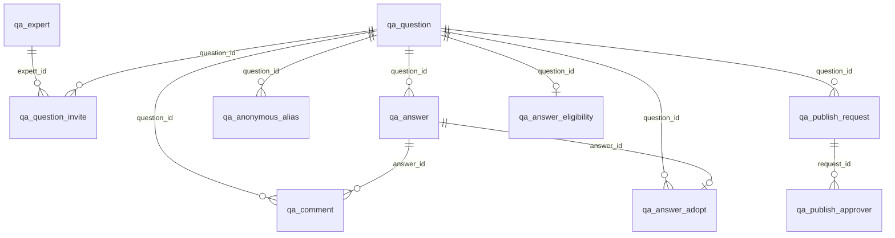
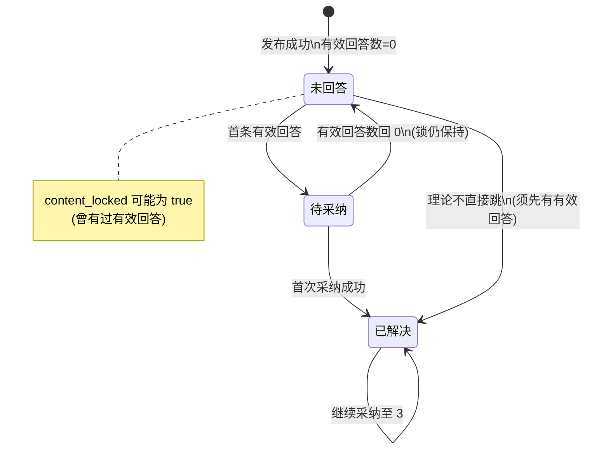
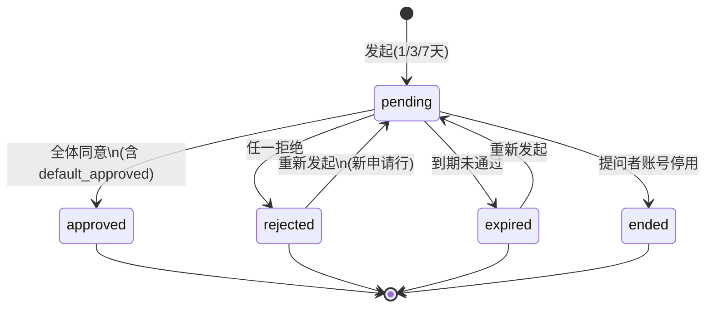
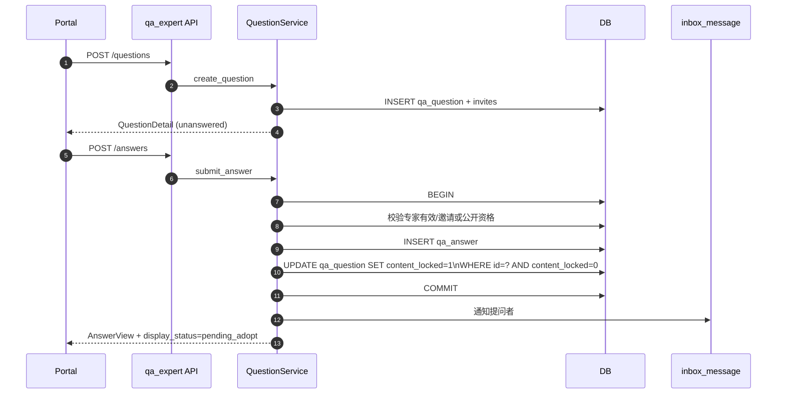
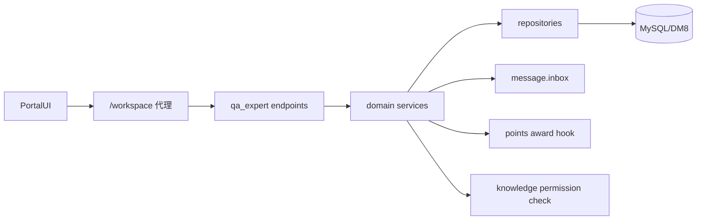

# F083 专家问答增强 · 技术方案（重设计）

| 项 | 内容 |
|---|---|
| 关联 PRD | [prd.md](./prd.md) |
| 关联 spec | [spec.md](./spec.md) |
| 模块 | `bisheng/qa_expert`，错误码 **183** |
| 契约管理 | **OpenAPI 3（FastAPI 自动生成 `/docs`）为后端契约源**；Portal 侧用生成的 OpenAPI JSON 同步到 **YApi / 等价平台** 做联调与 Mock，禁止口口相传字段 |
| 本文地位 | **DB / 接口 / 流程** 的实现权威；与旧 [`impl-plan.md`](./impl-plan.md) 冲突时以**本文为准**（impl-plan 仅作历史草稿） |

---

## 0. 设计原则（重设计取舍）

| 采用 | 不采用 |
|---|---|
| 邀请、采纳、匿名别名、转公开审批用**正规表**表达，避免 `;` 拼接字符串做真相源 | 继续用 `invited_experts` 分号串当唯一真相 |
| 展示态（未回答/待采纳/已解决）**派生计算**，DB 只存可判定事实（采纳次数、有效回答数、`resolved_at`） | 再引入「待采纳」业务枚举列与筛参 3 混淆 |
| 写路径服务端资格引擎一次算出 `capabilities` | 前端各自猜权限 |
| 通知只投 `inbox_message` | 双写 `qa_notification` |
| 积分只 **调用** F070 挂钩 | 本域写账本或自拟幂等键 |
| 核心表补 `tenant_id` + 自动注入 | 仅应用层口头「当前租户」 |
| 关联文档选择与打开同一套 durable entry id | 选择走 legacy `/knowledge/space/{id}/children`、打开走 F059 resolver（现网「文档不存在」根因） |

**基线事实（只读现状，非沿用旧方案）**：线上已有 `qa_expert` / `qa_question` / `qa_answer` / `qa_comment` / 投票表 / `qa_notification`；本设计在其上做增量规范化与能力补齐。

---

## 1. DB 设计

### 1.1 逻辑 ER



### 1.2 表变更总览

| 表 | 动作 | 说明 |
|----|------|------|
| `qa_expert` | ALTER | +`tenant_id` +`status`（有效/停用） |
| `qa_question` | ALTER | +`tenant_id` +类型/锁/匿名预选项/`resolved_at`/`adopt_count` 等 |
| `qa_answer` | ALTER | +`tenant_id` +`user_id` +匿名预选项 |
| `qa_comment` | ALTER | +`tenant_id` +匿名预选项 |
| `qa_question_invite` | **新建** | 受邀专家（锁定后只读） |
| `qa_answer_adopt` | **新建** | 采纳槽位（每题最多 3） |
| `qa_anonymous_alias` | **新建** | 题内稳定别名 |
| `qa_answer_eligibility` | **新建** | 公开题首次采纳后持续回答资格 |
| `qa_publish_request` | **新建** | 转公开申请头 |
| `qa_publish_approver` | **新建** | 审批人明细 |
| `qa_question_vote` 等 | 本期不动 | 投票语义不变；可选后续补 `tenant_id` |
| `qa_notification` | 本期不扩写 | 新事件走 inbox；表保留兼容 |

---

### 1.3 修改既有表

#### 1.3.1 `qa_expert`

| 字段 | 类型 | 约束 | COMMENT |
|------|------|------|---------|
| tenant_id | INT | NOT NULL, DEFAULT 1 | 租户ID |
| status | TINYINT | NOT NULL, DEFAULT 1 | 专家状态：1有效 0停用 |

**索引**

| 名 | 列 | 类型 |
|----|----|------|
| ix_qa_expert_tenant_status | (tenant_id, status) | INDEX |
| uk_qa_expert_tenant_user | (tenant_id, user_id) | UNIQUE（若历史无唯一则先洗重复再加） |

#### 1.3.2 `qa_question`

| 字段 | 类型 | 约束 | COMMENT |
|------|------|------|---------|
| tenant_id | INT | NOT NULL, DEFAULT 1 | 租户ID |
| question_type | VARCHAR(16) | NOT NULL, DEFAULT 'public' | 问题类型：directed/public |
| content_locked | TINYINT(1) | NOT NULL, DEFAULT 0 | 首个有效回答后内容锁定 |
| asker_anonymous | TINYINT(1) | NOT NULL, DEFAULT 0 | 公开题提问者是否匿名 |
| asker_reveal_on_public | TINYINT(1) | NULL | 定向题：转公开后是否公开提问者姓名 |
| adopt_count | INT | NOT NULL, DEFAULT 0 | 有效采纳条数（0–3，冗余加速） |
| resolved_at | DATETIME | NULL | 首次采纳成功时间 |
| active_publish_request_id | BIGINT | NULL | 当前有效转公开申请ID（无则空） |

**说明**

- `status` 列**保留**兼容旧客户端：写路径约定 `0=未解决（含未回答/待采纳）`，`1=已解决`；**不再使用** 2/3 作为业务态。展示三态由 `answer_count`（有效）+ `adopt_count` 派生。
- 旧字段 `invited_experts` / `experts_names`：**迁移期只读回填**，写路径改走 `qa_question_invite`；稳定后可废弃写入（列可留一版）。

**索引**

| 名 | 列 | 类型 |
|----|----|------|
| ix_qa_q_tenant_type_created | (tenant_id, question_type, created_at) | INDEX |
| ix_qa_q_tenant_user_created | (tenant_id, user_id, created_at) | INDEX |
| ix_qa_q_tenant_locked | (tenant_id, content_locked) | INDEX |
| ix_qa_q_tenant_adopt | (tenant_id, adopt_count, created_at) | INDEX |

#### 1.3.3 `qa_answer`

| 字段 | 类型 | 约束 | COMMENT |
|------|------|------|---------|
| tenant_id | INT | NOT NULL, DEFAULT 1 | 租户ID |
| user_id | INT | NULL, IDX | 回答者用户ID（与 expert 关联；历史可空后回填） |
| anonymous | TINYINT(1) | NOT NULL, DEFAULT 0 | 本回答是否匿名（公开题） |
| reveal_on_public | TINYINT(1) | NULL | 定向题：转公开后是否公开姓名 |

**索引**：`ix_qa_answer_tenant_qid_status (tenant_id, question_id, status)`；`ix_qa_answer_tenant_user (tenant_id, user_id)`。

#### 1.3.4 `qa_comment`

| 字段 | 类型 | 约束 | COMMENT |
|------|------|------|---------|
| tenant_id | INT | NOT NULL, DEFAULT 1 | 租户ID |
| anonymous | TINYINT(1) | NOT NULL, DEFAULT 0 | 评论是否匿名 |
| reveal_on_public | TINYINT(1) | NULL | 定向阶段预存：转公开后是否公开姓名 |

---

### 1.4 新建表

#### 1.4.1 `qa_question_invite` — 受邀专家

| 字段 | 类型 | 约束 | COMMENT |
|------|------|------|---------|
| id | BIGINT | PK AI | |
| tenant_id | INT | NOT NULL | 租户ID |
| question_id | BIGINT | NOT NULL | 问题ID |
| expert_id | INT | NOT NULL | 专家档案ID（qa_expert.id） |
| user_id | INT | NOT NULL | 专家对应用户ID |
| created_at | DATETIME | NOT NULL | 创建时间 |

| 名 | 列 | 类型 |
|----|----|------|
| uk_qa_invite_q_expert | (question_id, expert_id) | UNIQUE |
| ix_qa_invite_tenant_user | (tenant_id, user_id) | 「邀请我的」 |

#### 1.4.2 `qa_answer_adopt` — 采纳槽位

| 字段 | 类型 | 约束 | COMMENT |
|------|------|------|---------|
| id | BIGINT | PK AI | |
| tenant_id | INT | NOT NULL | 租户ID |
| question_id | BIGINT | NOT NULL | 问题ID |
| answer_id | BIGINT | NOT NULL | 回答ID |
| expert_user_id | INT | NOT NULL | 被采纳回答者用户ID |
| adopted_by | INT | NOT NULL | 提问者用户ID |
| created_at | DATETIME | NOT NULL | 采纳时间 |

| 名 | 列 | 类型 |
|----|----|------|
| uk_qa_adopt_answer | (answer_id) | UNIQUE（一回答最多一槽） |
| uk_qa_adopt_q_answer | (question_id, answer_id) | UNIQUE |
| ix_qa_adopt_q | (question_id, created_at) | 计数/列表 |

**并发**：插入前 `SELECT … FOR UPDATE` 锁问题行；若 `adopt_count >= 3` 拒绝；成功则 `adopt_count+1`，首次将 `resolved_at`/`status=1`。

#### 1.4.3 `qa_anonymous_alias` — 题内稳定别名

| 字段 | 类型 | 约束 | COMMENT |
|------|------|------|---------|
| id | BIGINT | PK AI | |
| tenant_id | INT | NOT NULL | 租户ID |
| question_id | BIGINT | NOT NULL | 问题ID |
| user_id | INT | NOT NULL | 用户ID |
| alias_ord | INT | NOT NULL | 分配序号（从 1 起，不回收） |
| alias_label | VARCHAR(32) | NOT NULL | 如 匿名同事A |
| created_at | DATETIME | NOT NULL | 首次匿名内容出现时间 |

| 名 | 列 | 类型 |
|----|----|------|
| uk_qa_alias_q_user | (question_id, user_id) | UNIQUE |
| uk_qa_alias_q_ord | (question_id, alias_ord) | UNIQUE |

#### 1.4.4 `qa_answer_eligibility` — 公开题持续回答资格

| 字段 | 类型 | 约束 | COMMENT |
|------|------|------|---------|
| id | BIGINT | PK AI | |
| tenant_id | INT | NOT NULL | 租户ID |
| question_id | BIGINT | NOT NULL | 问题ID |
| user_id | INT | NOT NULL | 有资格专家用户ID |
| source | VARCHAR(32) | NOT NULL | invited / pre_adopt_answer |
| created_at | DATETIME | NOT NULL | 快照写入时间 |

| 名 | 列 | 类型 |
|----|----|------|
| uk_qa_elig_q_user | (question_id, user_id) | UNIQUE |
| ix_qa_elig_q | (question_id) | |

首次采纳成功时一次性写入；之后只读（专家停用用 `qa_expert.status` 运行时过滤）。

#### 1.4.5 `qa_publish_request` — 转公开申请

| 字段 | 类型 | 约束 | COMMENT |
|------|------|------|---------|
| id | BIGINT | PK AI | |
| tenant_id | INT | NOT NULL | 租户ID |
| question_id | BIGINT | NOT NULL | 问题ID |
| initiator_user_id | INT | NOT NULL | 发起人 |
| status | VARCHAR(16) | NOT NULL | pending/approved/rejected/expired/ended |
| duration_days | TINYINT | NOT NULL | 1/3/7 |
| expire_at | DATETIME | NOT NULL | 到期时间 |
| extension_days | TINYINT | NOT NULL DEFAULT 0 | 已累计延期天数（≤3） |
| version | INT | NOT NULL DEFAULT 0 | 乐观锁 |
| created_at / updated_at | DATETIME | NOT NULL | |

| 名 | 列 | 类型 |
|----|----|------|
| ix_qa_pub_q_status | (question_id, status) | 同题进行中唯一由应用+部分唯一保证 |
| ix_qa_pub_expire | (status, expire_at) | Beat 扫描 |

**部分唯一（MySQL 8 函数索引 / 应用层兜底）**：同一 `question_id` 至多一条 `status='pending'`。DM8 无表达式唯一时用「创建前锁问题行 + 查 pending」保证。

#### 1.4.6 `qa_publish_approver` — 审批人

| 字段 | 类型 | 约束 | COMMENT |
|------|------|------|---------|
| id | BIGINT | PK AI | |
| tenant_id | INT | NOT NULL | 租户ID |
| request_id | BIGINT | NOT NULL | 申请ID |
| user_id | INT | NOT NULL | 审批人用户ID |
| role_in_request | VARCHAR(16) | NOT NULL | asker / answerer |
| decision | VARCHAR(32) | NOT NULL | pending/approved/rejected/default_approved |
| decided_at | DATETIME | NULL | 决策时间 |
| created_at | DATETIME | NOT NULL | |

| 名 | 列 | 类型 |
|----|----|------|
| uk_qa_pub_appr | (request_id, user_id) | UNIQUE |
| ix_qa_pub_appr_user | (user_id, decision) | |

---

### 1.5 数据迁移方案

**Alembic revision 建议名**：`f083_expert_qa_enhancement`（以仓库最新 `down_revision` 为准接链）。  
**双库**：MySQL + DM8；列 COMMENT 两边都要有；禁用 MySQL 专属 JSON 函数做迁移。

| 阶段 | 动作 | 回滚 |
|------|------|------|
| M1 DDL | 加可空/带默认列；建新表与索引 | drop 新表/列 |
| M2 回填 | `tenant_id=1`（或默认租户）；`question_type='public'`；`content_locked=1` 当且仅当存在未删回答；从 `invited_experts` 解析写入 `qa_question_invite`；从 `adopted`/`adopted_answer_id` 回填 `qa_answer_adopt` 与 `adopt_count`/`resolved_at` | 截断新表数据 |
| M3 双写 | 发布/改邀请/采纳同时写新表+旧列（旧列可继续填以便旧客户端） | 关双写开关 |
| M4 切读 | 列表「邀请我的」、资格判断只读新表 | 回读旧列 |
| M5 收口 | 停止写旧邀请串（可选下一迭代删列） | — |

**风险控制**

- 邀请串解析失败：记日志，该题邀请为空并告警人工修。  
- 历史 `status∈{2,3}`：迁移脚本将 2→0、3→0（展示靠派生）；不删行。  
- 专家硬删历史：无 `status` 的旧删除无法恢复，迁移后新停用走 `status=0`。

---

## 2. 接口定义（前后端契约）

### 2.1 契约管理方式

1. **后端**：Pydantic Schema + FastAPI 路由 → 自动 OpenAPI 3（`/api/v1/openapi.json`）。  
2. **门户联调**：CI 或发版时导出 OpenAPI，导入 **YApi**（或公司等价平台）项目「专家问答 F083」，生成 TS 类型 / Mock。  
3. **变更纪律**：字段增删改必须先改 Schema 再改 Portal；Breaking change 升 `x-api-version` 或并存字段一版。

> 下列为契约草案（字段名以最终 Schema 为准）；响应一律：

```ts
type UnifiedResponse<T> = {
  status_code: number;      // 200 成功；业务错误用 183xx
  status_message: string;
  data: T | null;
};
```

**公共枚举**

```ts
type QuestionType = 'directed' | 'public';
type DisplayStatus = 'unanswered' | 'pending_adopt' | 'solved';
type PublishStatus = 'pending' | 'approved' | 'rejected' | 'expired' | 'ended';
type PublishDecision = 'pending' | 'approved' | 'rejected' | 'default_approved';
```

**身份展示（服务端已脱敏）**

```ts
interface IdentityView {
  display_name: string;          // 真名或「匿名同事A」
  avatar_url: string | null;     // 匿名用固定头像 URL
  anonymous: boolean;
  // 以下仅专家库管理员可见
  real_user_id?: number;
  real_name?: string;
  department?: string;
  title?: string;
}
```

**可操作项**

```ts
interface QuestionCapabilities {
  can_edit: boolean;
  can_delete_question: boolean;
  can_answer: boolean;
  can_adopt: boolean;
  can_comment: boolean;
  can_start_publish: boolean;
  can_decide_publish: boolean;
  can_view_real_identity: boolean;
}
```

---

### 2.2 问题

#### `POST /api/v1/qa_experts/questions` — 发布

**Request**

```ts
interface CreateQuestionRequest {
  title: string;
  description: string;                 // 富文本
  business_domain: string;
  question_type: QuestionType;
  invited_expert_ids: number[];      // directed: 1..3；public: 0..3
  asker_anonymous?: boolean;           // 仅 public
  asker_reveal_on_public?: boolean;    // 仅 directed，必填
  image_urls?: string[];               // ≤3
  file_url?: string | null;
  file_name?: string | null;
  related_doc_ids?: string[];           // `{spaceId}-{fileId}`，fileId 必须是详情可 resolve 的 entry
}
```

**Response `data`**

```ts
interface QuestionDetail { /* 见 GET 详情 */ }
```

#### `GET /api/v1/qa_experts/questions` — 列表

**Query**

```ts
interface ListQuestionsQuery {
  page?: number;              // default 1
  page_size?: number;         // default 20, max 50
  domain?: string;
  sort?: 'latest' | 'hot' | 'unanswered';
  display_status?: 'unanswered' | 'pending_adopt' | 'solved' | 'unresolved'; // unresolved=前两者并集
  filter?: 'mine' | 'invited_me';  // 取代易混的 status=3/4
  keyword?: string;
}
```

**Response `data`**

```ts
interface QuestionListData {
  items: QuestionCard[];
  total: number;
}

interface QuestionCard {
  id: number;
  question_type: QuestionType;
  display_status: DisplayStatus;
  title: string;
  excerpt: string;
  business_domain: string;
  asker: IdentityView;
  answer_count: number;
  adopt_count: number;
  view_count: number;
  invited_experts: { expert_id: number; name: string }[];
  created_at: string; // ISO
}
```

#### `GET /api/v1/qa_experts/questions/{id}` — 详情

**Response `data`**

```ts
interface QuestionDetail {
  id: number;
  question_type: QuestionType;
  display_status: DisplayStatus;
  content_locked: boolean;
  title: string;
  description: string;
  business_domain: string;
  asker: IdentityView;
  invited_experts: { expert_id: number; user_id: number; name: string; answered: boolean }[];
  related_docs: RelatedDocView[];
  adopt_count: number;
  view_count: number;
  active_publish_request: PublishRequestSummary | null;
  capabilities: QuestionCapabilities;
  created_at: string;
  resolved_at: string | null;
}
```

`RelatedDocView`（详情每次按访问者鉴权，不挡问答正文）：

```ts
interface RelatedDocView {
  id: string;                 // `{spaceId}-{fileId}`，与门户 /space/:spaceId/file/:fileId 同一 ID
  space_id: number;
  file_id: number;            // 必须是 shougang-portal 详情能 resolve 的 knowledgefile/entry id
  title: string | null;       // 有权或可展示元数据时给真实标题
  accessible: boolean;
  unavailable_reason?: 'forbidden' | 'not_found';
}
```

- 写路径：Portal 选择器只提交上述 `id`；禁止再写 legacy 树里无法打开的物理版本 id。  
- 读路径：服务端解析串 → 调知识库权限；`accessible=false` 且 `forbidden` 时前端灰显，**禁止**渲染「文档不存在」。  
- `not_found` 仅文件删除或无有效 entry。  
- **不**在 `qa_expert` 新建文档映射表；无 DDL。旁路读 `knowledgefile` / `knowledge_document`。

#### `PUT /api/v1/qa_experts/questions/{id}` — 锁前编辑  
Request 同创建子集；`content_locked=true` → 18303。

#### `DELETE /api/v1/qa_experts/questions/{id}` — 锁前删除

---

### 2.3 回答 / 采纳 / 评论

#### `POST /api/v1/qa_experts/answers`

```ts
interface CreateAnswerRequest {
  question_id: number;
  content: string;
  anonymous?: boolean;
  reveal_on_public?: boolean;  // directed 必填
  image_urls?: string[];
  related_doc_ids?: string[];
}
```

#### `DELETE /api/v1/qa_experts/answers/{answer_id}`

#### `POST /api/v1/qa_experts/answers/{answer_id}/adopt`

```ts
// Request: 空 body
// Response data:
interface AdoptResult {
  question_id: number;
  answer_id: number;
  adopt_count: number;
  display_status: 'solved';
  eligibility_frozen: boolean; // 是否本轮触发了公开题快照
}
```

#### `POST /api/v1/qa_experts/comments`

```ts
interface CreateCommentRequest {
  question_id: number;
  answer_id: number;
  content: string;
  is_follow_up?: boolean;      // 追问
  anonymous?: boolean;
  reveal_on_public?: boolean;
}
```

#### `GET /api/v1/qa_experts/questions/{id}/answers`

```ts
interface AnswerListData {
  items: AnswerView[];
}

interface AnswerView {
  id: number;
  content: string;
  author: IdentityView;
  adopted: boolean;
  can_delete: boolean;
  comment_count: number;
  created_at: string;
}
```

---

### 2.4 转公开

#### `POST /api/v1/qa_experts/questions/{id}/publish-requests`

```ts
interface CreatePublishRequest {
  duration_days: 1 | 3 | 7;
}

interface PublishRequestDetail {
  id: number;
  question_id: number;
  status: PublishStatus;
  duration_days: number;
  expire_at: string;
  extension_days: number;
  initiator: IdentityView;
  approvers: {
    user_id: number;
    identity: IdentityView;
    role_in_request: 'asker' | 'answerer';
    decision: PublishDecision;
    decided_at: string | null;
  }[];
  capabilities: { can_approve: boolean; can_reject: boolean };
}
```

#### `POST /api/v1/qa_experts/publish-requests/{id}/approve`  
#### `POST /api/v1/qa_experts/publish-requests/{id}/reject`  
#### `GET /api/v1/qa_experts/publish-requests/{id}`

---

### 2.5 专家库

#### `POST /api/v1/qa_experts/experts` — 专家库管理员  
#### `PUT /api/v1/qa_experts/experts/{id}`  
#### `POST /api/v1/qa_experts/experts/{id}/disable`  
#### `POST /api/v1/qa_experts/experts/{id}/enable`  

```ts
interface ExpertUpsertRequest {
  user_id: number;
  expert_name: string;
  introduction?: string;
  depart_ment?: string;
  major?: string;
  position?: string;
  job_family?: string;
  job_category?: string;
  wechat_user_id?: string;
}

interface ExpertView {
  id: number;
  user_id: number;
  expert_name: string;
  status: 0 | 1;              // 0停用 1有效
  answer_count: number;
  adoption_count: number;
  vote_count: number;
  expert_score: number;       // 派生：答*1+采纳*5+赞*2
}
```

> 废弃产品语义：`DELETE /experts/{id}` 硬删。兼容期可将 DELETE 映射为 disable，并在 OpenAPI `deprecated: true`。

#### `POST /api/v1/qa_experts/admin/moderate-delete` — 平台超管（保持既有 body）

---

### 2.6 类似问题（辅助）

#### `GET /api/v1/qa_experts/questions/similar?text=&limit=5`

- 仅返回**当前用户可见**的题（定向不可见不出现）。  
- **不阻断**发布（前端可忽略结果仍 POST questions）。

---

### 2.7 错误码（与 OpenAPI `x-error-codes` 对齐）

| Code | Error Class | 含义 |
|------|-------------|------|
| 18301 | QaExpertQuestionAccessDeniedError | 不可见 |
| 18302 | QaExpertAnswerNotAllowedError | 不可答 |
| 18303 | QaExpertContentLockedError | 已锁定 |
| 18304 | QaExpertAdoptLimitError | 采纳满 3 |
| 18305 | QaExpertPublishNotAllowedError | 不可发起/审批 |
| 18306 | QaExpertPublishConflictError | 已有 pending |
| 18307 | QaExpertAdminRequiredError | 非专家库管理员 |
| 18308 | QaExpertDisabledError | 专家停用 |
| 18309 | QaExpertCommentNotAllowedError | 定向未答不可评 |
| 18310 | QaExpertPublishDurationInvalidError | 有效期非法 |

---

## 3. 系统流程

### 3.1 问题展示状态机（派生）



### 3.2 转公开申请状态机



### 3.3 发布 → 首答锁定（时序）



### 3.4 公开题首次采纳 → 资格快照 + 积分挂钩（时序）

```mermaid
sequenceDiagram
    autonumber
    participant P as Portal
    participant API as qa_expert API
    participant S as AdoptService
    participant DB as DB
    participant Pts as F070 points hook
    participant Msg as inbox_message

    P->>API: POST /answers/{id}/adopt
    API->>S: adopt_answer
    S->>DB: BEGIN; lock question
    S->>DB: 校验提问者/未采纳/adopt_count<3
    S->>DB: INSERT qa_answer_adopt
    S->>DB: adopt_count+=1; 必要时 resolved_at
    alt 公开题且首次采纳
        S->>DB: 写 qa_answer_eligibility\n(受邀 ∪ 采纳前有效回答者)
    end
    S->>DB: COMMIT
    S->>Pts: notify_answer_adopted (不夺写)
    S->>Msg: 通知回答者
    S-->>P: AdoptResult
```

### 3.5 转公开审批（时序）

```mermaid
sequenceDiagram
    autonumber
    participant U as 发起人
    participant API as qa_expert API
    participant S as PublishService
    participant DB as DB
    participant Beat as Celery Beat
    participant Msg as inbox_message

    U->>API: POST .../publish-requests {duration_days}
    API->>S: create_request
    S->>DB: 锁问题; 无 pending; 已解决且 directed
    S->>DB: INSERT request + approvers\n(发起人 decision=approved)
    S->>Msg: 通知其余审批人
    S-->>U: PublishRequestDetail

    par 审批人同意
        U->>API: POST .../approve
        API->>S: decide(approved)
        S->>DB: 更新 decision; 若全员非 pending\n→ status=approved; question_type=public
        S->>Msg: 通知结果
    and 专家停用
        Note over S,DB: on_expert_disabled\n移出或 default_approved\n立即重判
    and 到期
        Beat->>S: expire_pending
        S->>DB: status=expired where now>=expire_at
        S->>Msg: 通知过期
    end
```

### 3.6 调用链路（逻辑分层）



---

## 4. 服务端资格引擎（摘要）

单入口 `CapabilityResolver.resolve(user, question) -> QuestionCapabilities`，所有写接口复用，避免列表/详情/写路径不一致。

| 检查 | 规则要点 |
|------|----------|
| 可见 | public∈租户登录用户；directed∈{asker, invite.user_id, 专家库管理员} |
| 可答 | 专家 status=1；非提问者；directed∈邀请；public 首次采纳前全体有效专家，之后∈eligibility |
| 可评 | 公开：登录即可；定向：非追问则须本问题有效回答 |
| 可采纳 | 提问者 ∧ adopt_count&lt;3 ∧ 回答有效未采纳 |
| 可转公开 | directed ∧ solved ∧ 无 pending ∧ (asker∨有有效回答) |
| 破匿名 | 专家库管理员 |

---

## 5. 与周边系统

| 系统 | 交互 |
|------|------|
| F070 | 采纳成功后调用既有挂钩；幂等/分值不在本域 |
| message | 全部用户通知 |
| knowledge | `related_docs[].accessible` 逐条校验；选择器与详情同一 durable entry id；本域不另造文档映射 |
| Portal auth | 专家库管理员=`isPortalAdmin`；违规删=`is_global_super` |

---

## 6. 里程碑建议（非 tasks 拆解）

1. OpenAPI Schema 落地 + YApi 导入  
2. M1–M2 迁移  
3. 资格引擎 + 问题/回答/采纳读新表  
4. 转公开 + Beat  
5. Portal 对齐契约  
6. M4 切读与回归  

---

## 7. 开放实现细节（不挡设计冻结）

- 类似问题检索：首期可用标题 LIKE + 可见性过滤；后续可接 ES（不改契约）。  
- `uk_qa_expert_tenant_user` 若历史脏数据，迁移脚本先报后洗。  
- 投票表 `tenant_id` 列为可选债，不进 F083 必达。  
