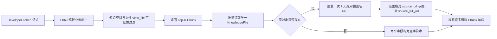

# Feature: F084-Filelib 检索返回原文件直链

> **前置步骤**：已完成 Spec Discovery。用户于 2026-08-21 确认：
> 仅有 `view_file` 权限即可获得原文件链接（选项 1B）；
> `source_url` 返回相对预签名路径、`source_full_url` 返回绝对预签名 URL（选项 2B）；
> 链接有效期固定为 7 天。

**关联需求**: `POST /api/v2/filelib/retrieve` 的 `source_url` 与 `source_full_url` 改为可直接访问的原文件链接
**优先级**: P0
**所属版本**: v2.6.0
**状态**: Implemented（T001-T006 已完成自动化验证；T007 隔离环境验证待授权）
**类型**: 后端 OpenAPI 响应语义与存储签名调整；不新增数据库表、迁移、前端、配置或第三方依赖。

---

## 1. 概述与用户故事

作为 **持有有效 Developer Token、并以有权业务用户身份调用 Filelib 检索的外部系统**，
我希望每个检索 Chunk 同时返回其原文件的短期可访问链接，
以便无需跳转毕昇门户即可直接读取原文件。

### 1.1 当前行为

- `POST /api/v2/filelib/retrieve` 在知识检索完成后，为每个 Chunk 返回 `source_url` 和 `source_full_url`。
- 两个字段当前指向门户 `/knowledge-spaces?spaceId=...&fileId=...` 页面，不是文件对象地址。
- 检索链路先按解析后的 F069 业务用户执行知识空间与文件 `view_file` 可见性过滤。
- 门户的正常原文件下载链路另行要求 `download_file`，并可能应用每日额度、下载审计、水印或分发限制。

### 1.2 目标行为



签发后的 URL 是 Bearer 凭证：持有者在 7 天有效期内无需再次提交 Developer Token 或登录态即可访问对应原文件。

---

## 2. 范围

### 2.1 包含

- 仅修改 `POST /api/v2/filelib/retrieve` 成功响应中既有字段的值语义：
  - `source_url`：原文件预签名 URL 的相对路径与查询串。
  - `source_full_url`：同一原文件的绝对预签名 URL。
- 原文件对象优先使用 `KnowledgeFile.object_name`；该字段为空时复用现有规则回退到 `original/{file_id}.{ext}`。
- 链接固定在签发后 7 天过期。
- 仅有 `view_file` 权限的业务用户也可获得链接；不额外检查 `download_file`。
- 原文件记录或对象缺失时保留 Chunk，并将两个 URL 字段都置为空字符串。
- 同一响应内，同一 `document_id` 的多个 Chunk 复用完全相同的一对链接。
- 更新 Filelib OpenAPI 与 retrieve 专项文档。
- 增加链接生成、权限边界、缺失对象、去重和响应兼容性回归测试。

### 2.2 不包含

- 不修改其他 `/api/v2/filelib` 接口。
- 不修改请求参数、响应字段名、Chunk 排序、检索算法、过滤、去重、`top_k`、`max_content` 或其他响应字段。
- 不修改 `view_file`、`download_file` 或 Developer Token 的权限模型和授权数据。
- 不复用或修改门户正常下载链路，不接入下载额度、审计、水印、审批、分发限制或撤销机制。
- 不生成新的文件副本、PDF 产物或水印产物。
- 不提供单个已签发 URL 的提前吊销能力；权限随后被撤销也不会使已签发 URL 提前失效。
- 不新增链接有效期配置项；本特性固定为 7 天。
- 不改变 F069 的发布边界；启用多租户前必须重新评审 F069 与本特性。

---

## 3. 需求 Requirements

| ID | 需求 |
|----|------|
| REQ-001 | `/retrieve` 必须只针对 `aretrieve_chunks()` 已返回的 Chunk 解析原文件链接，不得为检索可见性过滤前、被过滤或不在最终 Top-K 中的文件签发 URL。 |
| REQ-002 | 原对象名必须优先读取 `KnowledgeFile.object_name`，为空时复用 `KnowledgeUtils.resolve_source_object_name(file.id, file.file_name, file.object_name)` 的既有回退规则；不得把门户页面地址、预览对象、水印对象或 Chunk 图片对象作为原文件。 |
| REQ-003 | `source_full_url` 必须是 MinIO 对原对象签发的绝对 GET 预签名 URL，过期时间固定为 7 天；`source_url` 必须由同一个绝对 URL 移除配置的共享 Host 后派生，二者的对象路径、签名参数和过期时间必须一致。 |
| REQ-004 | 链接签发沿用检索阶段的 `view_file` 可见性结果，不得新增 `download_file` 检查，也不得调用门户下载额度、审计、水印、审批或分发限制 Service。 |
| REQ-005 | 同一响应必须按唯一正整数 `document_id` 批量读取 `KnowledgeFile`；每个唯一文件至多执行一次对象存在性检查和一次绝对 URL 签发，相同文件的多个 Chunk 必须复用同一结果。 |
| REQ-006 | `KnowledgeFile` 记录不存在、对象名无法解析或 MinIO 明确返回对象不存在时，必须保留原 Chunk，并同时返回 `source_url=""`、`source_full_url=""`；不得回退到门户页面链接或其他文件对象。 |
| REQ-007 | MinIO 连接、认证或签名等非“对象不存在”的异常必须进入既有服务异常处理并使请求失败，不得静默伪装成对象缺失或返回部分不可用链接。 |
| REQ-008 | 除两个 URL 字段的值语义外，HTTP 状态、响应包装、字段类型、Chunk 内容、数量和顺序必须保持兼容；相同请求的 URL 可因每次重新签发而变化。 |
| REQ-009 | 完整预签名 URL、查询串、签名、凭证和 Developer Token 均不得写入日志；必要日志只允许记录非敏感的文件 ID、对象缺失状态和内部错误上下文。 |
| REQ-010 | 实现必须遵循 Endpoint → Service → Repository/Storage 分层；Endpoint 只收集最终 Chunk 的文件 ID 并消费链接映射，Service 通过 `KnowledgeFileRepository` 批量读文件并通过现有 MinIO Storage 能力检查与签名，不得在 Endpoint 或 Service 中编写 ORM 查询或新增 DAO 入口。 |

---

## 4. API 契约

### 4.1 端点

| Method | Path | 认证 | 变更 |
|--------|------|------|------|
| POST | `/api/v2/filelib/retrieve` | 必填 `X-Developer-Token`；业务用户按 F069 解析 | 仅改变 `source_url`、`source_full_url` 的值语义 |

请求契约不变。

### 4.2 成功响应示例

```json
{
  "status_code": 200,
  "status_message": "SUCCESS",
  "data": {
    "chunks": [
      {
        "content": "示例 Chunk 内容",
        "knowledge_id": 118,
        "document_id": 9001,
        "document_name": "制度.pdf",
        "chunk_index": 3,
        "source_url": "/bisheng/tenant_1/original/9001.pdf?X-Amz-Algorithm=REDACTED&X-Amz-Expires=604800&X-Amz-Signature=REDACTED",
        "source_full_url": "https://files.example.com/bisheng/tenant_1/original/9001.pdf?X-Amz-Algorithm=REDACTED&X-Amz-Expires=604800&X-Amz-Signature=REDACTED"
      }
    ],
    "total": 1
  }
}
```

示例中的 Bucket、对象前缀和查询参数仅作结构说明，以实际 MinIO 配置和 SDK 输出为准。文档与测试输出必须遮蔽签名值。

### 4.3 字段语义

| 字段 | 类型 | 新语义 |
|------|------|--------|
| `source_url` | string | 以 `/` 开头的相对预签名路径。调用方需将其拼接到部署暴露的 MinIO/Nginx 文件访问 Origin 后使用。 |
| `source_full_url` | string | 可直接发起 GET 的绝对预签名 URL，不需要 Developer Token；签发后 7 天过期。 |

两字段要么同时为空，要么指向同一对象并具有同一组签名查询参数。系统不保证跨两次 `/retrieve` 请求返回相同 URL。

### 4.4 错误行为

| 场景 | 行为 |
|------|------|
| Developer Token、业务用户或资源权限失败 | 完全保持 F069 与现有检索错误；不得进入链接解析。 |
| 文件记录或原对象不存在 | 请求仍成功；对应 Chunk 的两个 URL 均为空字符串。 |
| MinIO 非对象缺失异常 | 请求按既有未处理基础设施异常失败，不返回混合成功/失败链接。 |

不新增业务错误码。

---

## 5. 验收标准

| ID | 关联需求 | 角色 | 操作 | 预期结果 |
|----|----------|------|------|----------|
| AC-01 | REQ-001, REQ-003 | 有 `view_file` 权限的外部系统 | 调用 `/retrieve` 命中一个存在原对象的 Chunk | `source_full_url` 是该原对象的绝对 GET 预签名 URL，`source_url` 是其相对形式，两者不再包含 `/knowledge-spaces` 门户页面地址。 |
| AC-02 | REQ-003 | 外部系统 | 检查签名调用与 URL 查询参数 | 只签发一次绝对 URL，明确使用 `expire_days=7`；相对 URL 由该绝对 URL 派生，签名和对象路径一致。 |
| AC-03 | REQ-004 | 只有 `view_file`、没有 `download_file` 的业务用户 | 调用 `/retrieve` 命中有权文件 | 请求成功并返回原文件 URL；未调用 `download_file`、额度、审计、水印、审批或分发限制链路。 |
| AC-04 | REQ-001, REQ-004 | 无 `view_file` 权限的业务用户 | 检索命中候选但被现有可见性逻辑过滤 | 响应中不出现该文件 Chunk，也不查询或签发该文件的原对象 URL。 |
| AC-05 | REQ-002 | 外部系统 | 文件存在持久化 `object_name` | URL 指向该 `object_name`，不使用根据 ID 推导的路径。 |
| AC-06 | REQ-002 | 外部系统 | 文件 `object_name` 为空但文件名可解析 | URL 指向现有规则生成的 `original/{file_id}.{ext}` 原对象。 |
| AC-07 | REQ-005 | 外部系统 | 同一文件返回多个 Chunk | Chunk 顺序不变，所有 Chunk 得到完全相同的 URL 对；Repository 批量读取一次，每个唯一文件只检查一次、签发一次。 |
| AC-08 | REQ-006 | 外部系统 | 文件记录缺失、对象名无法解析或原对象不存在 | Chunk 仍返回且其他字段不变；两个 URL 都为空，不回退到门户或预览链接。 |
| AC-09 | REQ-007 | 外部系统 | MinIO 连接、认证或签名发生非对象缺失异常 | 请求失败并进入既有异常边界；不会把异常吞掉后返回空链接或部分签名结果。 |
| AC-10 | REQ-008 | 既有调用方 | 比较改造前后的固定检索结果 | 除两个 URL 值外，HTTP 状态、包装、Chunk 数量、顺序、内容、文件信息与 `total` 全部一致。 |
| AC-11 | REQ-009 | 安全审查人员 | 捕获正常、缺失对象和异常路径日志 | 日志不包含完整 URL、查询串、签名、凭证或 Developer Token。 |
| AC-12 | REQ-010 | 代码审查人员 | 检查链接解析实现 | Endpoint 无 ORM 查询；Service 通过 Repository 和 Storage 完成批量文件读取、存在性检查与签名；未新增 DAO。 |

---

## 6. 架构设计

### 6.1 组件职责

#### KnowledgeSpaceChatService

- 保持现有检索、知识空间校验、文件 `view_file` 可见性过滤、跨知识库去重和 Top-K 截断逻辑。
- 不承担 URL 签发，避免把 Filelib OpenAPI 的响应语义扩散到通用知识检索 Service。

#### Filelib 原文件链接 Service

- 建议新建 `FilelibRetrieveSourceService`，输入最终结果中的唯一 `document_id` 集合，输出 `{file_id: SourceLinkPair}` 映射。
- 通过 `KnowledgeFileRepository.find_by_ids()` 一次性读取候选文件。
- 通过 `KnowledgeUtils.resolve_source_object_name()` 解析原对象名。
- 对每个唯一文件先调用 MinIO `object_exists()`；明确不存在则返回空链接。
- 对存在对象只调用一次 `get_share_link(..., clear_host=False, expire_days=7)` 生成绝对 URL，再调用 `clear_minio_share_host()` 派生相对 URL，保证两字段共享同一签名。
- 不持有、检查或模拟 `download_file` 权限，不调用 `KnowledgeSpaceService.get_file_download()`。

#### Filelib Endpoint

- 在 F069 `user_context_service.use_user(...)` 生命周期内先执行现有检索。
- 只从最终 `results` 收集合法正整数 `document_id`，调用链接 Service 一次。
- 组装 `RetrieveChunk` 时按 `document_id` 查映射；无映射时写入两个空字符串。
- 删除当前门户 Base URL 查询与 `_build_portal_source_urls()` 使用；不改变其他响应组装逻辑。

#### KnowledgeFile Repository 与 MinIO Storage

- Repository 复用既有 `find_by_ids()`，不新增查询接口。
- Storage 复用既有 `object_exists()`、`get_share_link()` 和 `clear_minio_share_host()`。
- 不修改通用 Storage 的默认过期时间；调用方必须显式传 `expire_days=7` 固化契约。

### 6.2 调用与权限边界

```text
Router
  → Filelib Endpoint
    → F069 FilelibUserContextService
      → KnowledgeSpaceChatService（space/file view_file 过滤）
      → FilelibRetrieveSourceService
        → KnowledgeFileRepository.find_by_ids
        → MinioStorage.object_exists / get_share_link / clear_minio_share_host
```

链接 Service 信任“输入 ID 只来自最终可见 Chunk”这一前置条件。Endpoint 不得把请求中的文件 ID、向量库原始候选或过滤前结果传给它。

### 6.3 关键架构决策

| ID | 决策 | 选项 | 结论 | 理由 |
|----|------|------|------|------|
| AD-01 | 原文件权限门槛 | A: `download_file` / B: `view_file` | 选 B | 用户明确选择 1B，接受绕过正常下载控制的风险。 |
| AD-02 | 两字段形式 | A: 都为绝对 URL / B: 相对 + 绝对 | 选 B | 用户明确选择 2B，保持字段用途区分。 |
| AD-03 | 签名有效期 | A: 配置化 / B: 固定 7 天 | 选 B | 用户明确要求 7 天，避免本次扩大配置范围。 |
| AD-04 | URL 生成次数 | A: 两字段分别签名 / B: 绝对签名一次再派生相对值 | 选 B | 保证签名完全一致并减少 MinIO SDK 调用。 |
| AD-05 | 文件读取方式 | A: 每 Chunk 查库 / B: 最终文件 ID 批量查库 | 选 B | 避免 N+1，并支持同文件 Chunk 复用。 |
| AD-06 | 原对象缺失 | A: 整体失败 / B: 保留 Chunk、URL 置空 | 选 B | 用户要求缺失原文件不丢失检索内容。 |
| AD-07 | 非缺失存储异常 | A: 静默置空 / B: 整体失败 | 选 B | 防止基础设施故障被误报为文件缺失并返回不可审计的部分结果。 |
| AD-08 | Service 归属 | A: 通用 Knowledge Service / B: Open Endpoints Filelib Service | 选 B | 链接字段是 Filelib OpenAPI 专属响应契约，不污染通用检索和门户下载链路。 |

---

## 7. 文件结构计划

### 7.1 新建

| 文件 | 说明 |
|------|------|
| `features/v2.6.0/084-filelib-retrieve-original-links/spec.md` | 本规格。 |
| `features/v2.6.0/084-filelib-retrieve-original-links/tasks.md` | 规格确认后生成的可追踪任务。 |
| `features/v2.6.0/084-filelib-retrieve-original-links/verification.md` | 实现后记录验证证据。 |
| `src/backend/bisheng/open_endpoints/domain/services/filelib_retrieve_source_service.py` | 批量解析原文件对象并生成相对/绝对预签名链接。 |
| `src/backend/test/open_endpoints/test_filelib_retrieve_source_service.py` | 链接 Service 的对象解析、签名、缺失、异常和去重测试。 |

### 7.2 修改

| 文件 | 变更内容 |
|------|----------|
| `features/v2.6.0/release-contract.md` | 登记 F084 权限与 Bearer URL 安全不变量及依赖。 |
| `src/backend/bisheng/open_endpoints/api/dependencies.py` | 注入 `KnowledgeFileRepository`、MinIO Storage 与链接 Service。 |
| `src/backend/bisheng/open_endpoints/api/endpoints/filelib.py` | 用原文件链接映射替换门户页面 URL 构造，保持其余响应行为。 |
| `src/backend/test/knowledge/test_knowledge_space_chat_service_retrieve.py` | 更新旧门户 URL 断言，并增加最终可见结果、顺序和兼容性回归。 |
| `src/backend/test/open_endpoints/test_filelib_external_user_context.py` | 更新 `/retrieve` 依赖覆盖，验证 F069 用户上下文仍覆盖链接解析阶段。 |
| `docs/api/filelib-openapi-interfaces.md` | 更新字段语义、7 天有效期、权限边界和 Bearer URL 风险。 |
| `docs/api/filelib-retrieve.md` | 同步专项接口文档，移除已过时的门户跳转与认证说明。 |

文件清单可在 `tasks.md` 阶段根据现有夹具复用做最小调整，但不得扩大到其他端点、门户下载实现、数据库、前端或部署配置。

---

## 8. 验证策略

### 8.1 风险与层级

- 风险等级：V3 回归/端到端。
- 原因：本特性主动降低原文件访问门槛，并签发 7 天无需认证的 Bearer URL，属于权限与敏感资源访问边界变化。
- 主要测试层：Open Endpoints Service 与 Endpoint 模块级 pytest，使用 Fake Repository/Storage 和 FastAPI 依赖覆盖验证可观察契约。
- 既有检索可见性继续由 `test_knowledge_space_chat_service_retrieve.py` 验证，避免在链接 Service 重复构造一套 Permission mock。
- 自动化测试不连接真实 MinIO、OpenFGA、Milvus 或 Elasticsearch；真实 URL 可访问性在隔离环境验证，URL 和日志证据必须脱敏。

### 8.2 验证映射

| Verification ID | 方法 | 覆盖验收标准 | Evidence Target |
|-----------------|------|--------------|-----------------|
| V-001 | 链接 Service 参数化单元测试 | AC-01, AC-02, AC-05, AC-06, AC-08 | 持久化/回退对象名、单次绝对签名、7 天、相对派生、缺失为空。 |
| V-002 | 链接 Service 批量与故障注入测试 | AC-07, AC-09 | Repository 单次批量读取、唯一文件单次检查/签名、异常不吞并。 |
| V-003 | `/retrieve` Endpoint 响应契约测试 | AC-01, AC-07, AC-08, AC-10 | URL 映射、同文件复用、空映射、Chunk 顺序和其他字段兼容。 |
| V-004 | F069 用户上下文与可见性回归测试 | AC-03, AC-04 | 仅有 `view_file` 可签发；不可见文件不进入链接 Service；链接阶段仍在目标用户上下文内。 |
| V-005 | 调用计数与源码边界断言 | AC-03, AC-12 | 无 `download_file`/门户下载 Service 调用；Endpoint 无 ORM；Service 只用 Repository/Storage。 |
| V-006 | 日志捕获与敏感串扫描 | AC-11 | 正常、缺失和异常路径均无完整预签名 URL、查询串、签名或 Token。 |
| V-007 | 定向 pytest、Ruff、架构守卫和文档检查 | AC-01 至 AC-12 | 相关 Open Endpoints/Knowledge 回归、`ruff check`、`ruff format --check`、`scripts/arch-guard.sh`、`git diff --check`。 |
| V-008 | 隔离环境人工调用 | AC-01, AC-02, AC-03, AC-04, AC-08, AC-09 | 用仅 `view_file` 用户验证绝对/相对 URL 可访问；无权文件无 URL；对象缺失为空；7 天参数正确；签名证据脱敏。 |

### 8.3 最低失败路径集合

- Developer Token 无效、F069 目标用户解析失败、知识空间无权和文件无 `view_file` 权限时，不得调用链接 Service。
- 文件记录缺失、`object_name` 为空且文件名不可解析、MinIO `NoSuchKey`。
- MinIO 网络、认证、服务端和签名异常。
- 同一文件一个 Chunk、多个 Chunk，以及多个文件混合存在/缺失。
- 仅 `view_file` 有权、缺少 `download_file` 的明确正向用例。
- 既有门户页面 URL 测试必须改为原对象签名契约，不能只删除断言。

---

## 9. 安全评审

### 9.1 已确认高风险行为

本特性允许仅有 `view_file`、没有 `download_file` 的业务用户获得原始文件内容，并绕过正常下载链路中的额度、审计、水印、审批和分发限制。预签名 URL 一旦签发，任何获得该 URL 的主体都可在 7 天内访问文件，后续撤销用户权限、禁用 Developer Token 或退出登录均不会使 URL 提前失效。

用户已于 2026-08-21 通过选择 1B 并指定 7 天有效期明确接受该行为和残余风险。

### 9.2 强制安全约束

- Developer Token 和 F069 业务用户解析必须先于检索与签名。
- 只有最终通过 `view_file` 可见性过滤并进入 Top-K 响应的文件 ID 才能传入链接 Service。
- 不得从请求 Body、过滤前向量候选或未经验证的 Chunk 元数据之外扩大签名集合。
- `source_full_url` 必须只指向原文件 Bucket/Object，不得使用预览、水印、临时或其他文件对象。
- 完整 URL 视为敏感凭证，不得写入应用日志、异常文本、追踪标签或测试快照。
- 链接不存在提前撤销能力；如未来要求撤销、单次下载、审计或动态有效期，必须更新规格并改为受控下载网关，不得继续依赖直接预签名 URL。
- 外部系统必须自行避免将 URL 持久化到公开日志、前端埋点或第三方分析系统；该调用方责任需要写入 API 文档。

### 9.3 残余风险

- `view_file` 与 `download_file` 的权限区分对本接口不再保护原文件，可能违反既有最小权限预期。
- 文件水印、下载额度、审计和分发约束无法覆盖通过本接口获得的 URL。
- URL 可能通过外部系统日志、浏览器历史、Referer、聊天记录或下游 Agent 工具链泄漏。
- 7 天暴露窗口内无法通过应用权限变更即时止损；紧急处置只能轮换 MinIO 签名密钥、移走/删除对象或等待过期，影响范围可能超过单一链接。
- 相对 `source_url` 依赖调用方选择正确的文件访问 Origin；错误拼接会失败，但不应因此回退到门户页面。

---

## 10. 兼容性、发布与回滚

### 10.1 兼容性

- 请求 Schema、端点路径、认证 Header、响应字段名和类型不变。
- 这是有意的字段语义不兼容：依赖 `/knowledge-spaces` 门户跳转的调用方必须改为把字段当作文件预签名 URL。
- 不新增数据库、配置或依赖，MySQL 与 DM8 无方言差异。
- F069 的 `external_id` 用户上下文继续生效，链接签发不得逃逸该上下文生命周期。

### 10.2 发布检查

- 通知所有 `/retrieve` 调用方两个字段从门户页面地址变为敏感文件 URL，并要求不得记录完整值。
- 在隔离环境以“有 `view_file`、无 `download_file`”用户验证链接可访问。
- 以无 `view_file` 用户确认无 Chunk、无签名调用。
- 以存在和缺失原对象分别验证可访问 URL 与空字符串。
- 检查 MinIO `sharepoint`、协议和反向代理配置，使绝对和相对链接均可从调用方网络访问。
- 若运行环境启用了多租户，不得按本规格发布，必须先重新评审 F069/F084 的对象路径和作用域。

### 10.3 回滚

- 应用级回滚：恢复 `_build_portal_source_urls()` 与 Portal Base URL 组装，移除链接 Service 依赖。
- 文档级回滚：恢复门户跳转语义，并通知调用方停止把字段当作文件 URL。
- 无数据库、配置或数据迁移，代码回滚不需要数据恢复。
- 回滚不会撤销已签发 URL；它们仍可能在原 7 天有效期内访问，除非执行 MinIO 级紧急处置。

---

## 11. 需求追踪矩阵

| Requirement | Acceptance Criteria | Verification |
|-------------|---------------------|--------------|
| REQ-001 | AC-01, AC-04 | V-003, V-004 |
| REQ-002 | AC-05, AC-06 | V-001 |
| REQ-003 | AC-01, AC-02 | V-001, V-003, V-008 |
| REQ-004 | AC-03, AC-04 | V-004, V-005, V-008 |
| REQ-005 | AC-07 | V-002, V-003 |
| REQ-006 | AC-08 | V-001, V-003, V-008 |
| REQ-007 | AC-09 | V-002, V-008 |
| REQ-008 | AC-10 | V-003, V-007 |
| REQ-009 | AC-11 | V-006, V-007 |
| REQ-010 | AC-12 | V-005, V-007 |

---

## 12. Spec 评审门禁

- [x] 目标接口、两个字段语义和 7 天有效期已明确。
- [x] `view_file` 允许签发、`download_file` 不参与的权限边界已由用户确认。
- [x] 原对象解析、同文件复用、缺失对象和非缺失异常行为已明确。
- [x] 每条需求都有可观察验收标准和验证方法。
- [x] 文件结构遵循 Endpoint → Service → Repository/Storage，未规划 ORM 下沉或新增 DAO。
- [x] Bearer URL、无法提前撤销和绕过下载控制的安全风险已显式记录。
- [x] 未引入数据库、前端、配置、依赖或其他端点改动。
- [x] 用户已于 2026-08-21 确认本 `spec.md`，可以生成 `tasks.md`。
- [x] `tasks.md` 已完成静态评审；获得用户实施授权后进入实现。

---

## 相关文档

- [Filelib OpenAPI 接口文档](../../../docs/api/filelib-openapi-interfaces.md)
- [Filelib Retrieve 专项文档](../../../docs/api/filelib-retrieve.md)
- [v2.6.0 Release Contract](../release-contract.md)
- [F069 Filelib 外部用户权限上下文](../069-filelib-external-user-context/spec.md)
- `src/backend/AGENTS.md`
