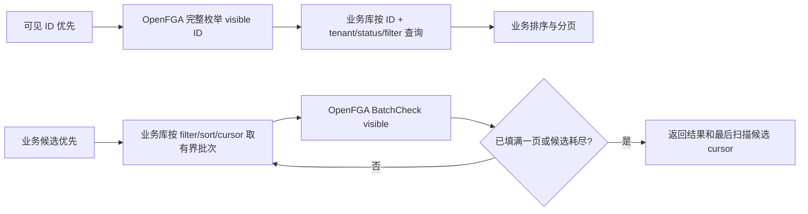
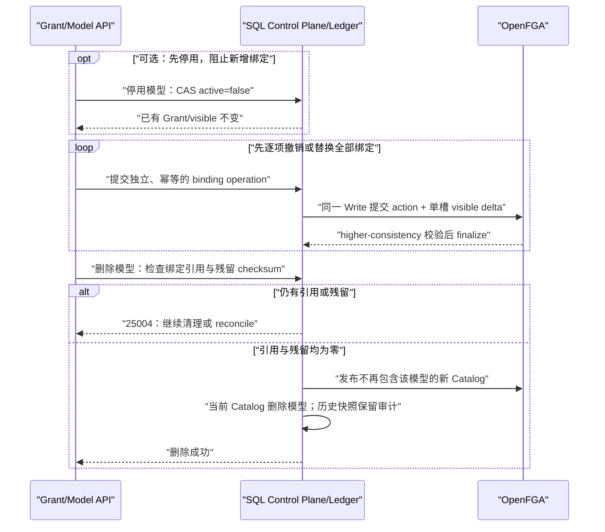

# Design: F048 ReBAC 权限模型与 Grant 升级

> **本文档定位 — 现状快照（Why this How）**
>
> - [spec.md](./spec.md) 定义需求、边界与验收合同；
> - 本文定义选定架构、OpenFGA 新模型、数据/API 契约、发布一致性和迁移 runbook；
> - 后续 [tasks.md](./tasks.md) 只拆实现与验证任务，不复制本文论证。

**状态**：🔲 F048 尚未上线；本次“单槽浅层 visible、模型停用/删除语义及数据驱动列表路径”Design 24 项复审 LGTM，待用户 Design ★ 确认
**关联**：[spec.md](./spec.md) · [产品说明](./product-authorization-model-and-migration-guide.md) · [release contract](../release-contract.md)
**版本**：v3.0.0-beta1
**功能分支**：`feat/v3.0.0-beta1/048-rebac-permission-model-grants`
**最后更新**：2026-08-13

---

## 1. 目标与非目标

### 1.1 目标

F048 把“OpenFGA 四档关系 + Config 模型/Binding + DB creator/成员兜底”收敛为
MySQL/DM8 中可审计、可版本化的 Action/Model/Grant 控制面，以及以具体 action relation
为唯一最终 ALLOW/DENY 的 OpenFGA 执行面。它以原子 Catalog、可恢复投影和应用自动访问
门禁，在已启动的新镜像 backend 容器内完成一次性 model/tuple 升级，支撑多主体来源并集、
`INHERIT`/`CUSTOM` 与受保护 owner。Platform 和 Client
使用同一后端契约解释模型、来源、等级与模式。

本次增量只展平固定 `visible` 执行关系，并为每个 canonical 授权来源维护单槽浅层投影；
模型停用只禁止新增或变更授权，已有 Grant 继续生效，删除前必须先撤销或替换全部绑定。
列表按真实候选量、可见率、继承比例和端到端成本，在“完整可见 ID 优先”与
“业务候选优先 + BatchCheck”之间逐入口选择。具体 action 的最终 ReBAC 语义保持不变。

### 1.2 非目标

- 不引入 DENY/黑名单；有效授权仍是白名单并集。
- 不改变组织成员、部门树和用户组成员的业务归属。
- 不创建第二棵 `permission_parent`；权限继承只投影 canonical 业务 `parent`。
- 不让 SQL、Config、creator 或旧四档关系在 OpenFGA DENY/故障后补充 ALLOW。
- 不迁移 `llm_server` / `llm_model`；它们在新模型中保留显式 allowlist 的旧关系，
  不能成为已迁移资源的 fallback。dashboard 已按用户确认纳入本期统一动作迁移。
- 不保留长期双写、旧动作 alias、逐请求旧/新 model 灰度裁决或同时运行两个 model client。
- 不实现独立迁移 dry-run/预演、旧/新 model 影子流量、回滚窗口、新→旧 down-converter、
  projection journal 或旧权限运行时恢复；迁移和启服失败只允许保持维护并前向修复。
- 不创建或切换 OpenFGA Store；沿用现有 Store。旧 model ID 仅作为 OpenFGA 不可删除的
  历史记录存在，不是第二套运行模型。
- 不实现 owner transfer；F048 启服时退役既有 F018 owner 交接 API。
- 不在 Alembic revision、应用启动钩子、API 或 Celery 中执行旧权限数据读取、转换、回填、
  清理或 OpenFGA tuple 迁移；数据迁移只由 `src/backend/scripts/` 下的专用运维脚本执行。
- 不在本期引入新的 UI、状态管理或 OpenFGA SDK 依赖。
- 不把具体 action 全部展平，不把管理员管理范围并入个人 `visible`，不把 SQL/source projection
  用作 OpenFGA 故障时的 ALLOW fallback。
- 不规定所有业务列表永久使用同一种权限筛选顺序，也不把 116 合成 BENCH-01 当作生产结论。

---

## 2. 关键约束与设计输入

- 全局架构铁律直接遵循 [Constitution C1–C7](../../../docs/constitution.md)，本节不另行
  复制或重新定义。
- 遵循版本契约 INV-9～INV-27，尤其是：
  - 具体动作只由 OpenFGA 最终裁决；
  - Config 大 JSON 不再是运行时真相；
  - 生产 Check/List/Write 必须显式固定 Authorization Model ID；
  - 标准模型累计，自定义模型不因派生等级补齐动作；
  - 正式迁移必须在运维已停止入口业务流量并暂停 Celery/Linsight 消费后执行；
    进程可保持 `MIGRATION_REQUIRED/NOT_READY` 以供容器内运维，沿用现有 Store，重启后
    只允许新 model ID。
- 本文严格区分两类“迁移”：
  - **Schema Migration**：`bisheng/core/database/alembic/versions/` 下的 Alembic revision，
    只负责 MySQL/DM8 DDL；不得读取旧业务数据、回填/清理数据或访问 OpenFGA。
  - **Permission Data Migration**：`src/backend/scripts/migrate_f048_permission_data.py`
    在已启动但 F048 未就绪的 backend 容器内执行的一次性数据升级；负责旧 Config/业务事实/
    OpenFGA tuple 的读取、转换、写入、checkpoint、验证和旧数据退役，不注册为运行时
    Service、API、Celery 或启动任务。
- OpenFGA Authorization Model 不可变；Store/model/Catalog ID 会随首次初始化和功能升级
  变化，不写入部署配置。生产实例按稳定 `store_name` 查询且只接受唯一 Store，选择其
  最新 model，获取 checksum，再要求它与 SQL CURRENT Catalog 引用的唯一 ACTIVE
  authorization release 完全一致；匹配后构造单一 client，每个 Check/List/Write 仍显式
  发送该 model ID。生产不自动创建 Store 或写 model。
- Catalog 只能配置已经由应用代码和当前 Authorization Model 注册的 action code。
  新增 action code 不是纯后台配置：必须先发布包含对应 `can_<action>` relation 的后继
  Authorization Model，并在维护窗口完成关系迁移、目标校验和全实例单 model pin 门禁，
  再允许该 action 所属 Catalog 生效。后继 model 必须通过当前 Catalog 全量 model tests；
  旧 model 只记录 predecessor 审计链，不能构造 compatibility client，不能在 SQL CURRENT
  Catalog 不匹配时仅凭“它是最新模型”跨过这一步。
- OpenFGA 单次 Write 的 writes+deletes 上限为 100，且同一请求整体原子成功或失败。
  每个 Grant/assignee 来源变更必须把自身 action 与 visible delta 的最终 commit 控制在该上限内；
  不把多个独立绑定的清理伪装成一次跨批原子删除。
- OpenFGA 默认读可能命中缓存；安全变更后的读使用 `HIGHER_CONSISTENCY`，
  并在服务端缓存窗口内保持资源/全局“近期变更”标记。窗口取部署中 query/iterator/
  controller cache TTL 的最大值+5s；当前 compose 最大值为 30s，因此默认 35s，
  readiness 必须暴露实际计算值，不能把 35s 写死到业务代码。
- 首发固定验证 `openfga/openfga:v1.15.1`，部署清单记录镜像 digest；
  禁止继续使用 `openfga/openfga:latest`。升级版本必须重新跑 DSL、语义和性能门禁。
- 当前代表性 DM8/OpenFGA 环境已有单次 Check 约 8–15ms 的证据
  （F036 `loadtest-report.md`）；生产脱敏分布尚未附入仓库，属于切换门禁
  `BENCH-01`，不能把该环境数据冒充生产结论。
- 2026-08-13 在 116 的隔离性能 Store、OpenFGA v1.14.2 上完成了首轮合成 BENCH-01：
  10,000 个资源、单用户可见 10/100/1,000 时，直接展平 relation 的 P95 分别约为
  2.9/6.1/19.3ms 且集合完整；当前深层 `visible` 在相同量级约 3s，1,000 目标只返回
  659。该结果只证明“展平可见关系”值得进入目标模型与业务链路复测，不证明 116 版本可替代
  pinned v1.15.1，也不单独决定任何业务接口的列表路径。
- 同一 Store 的补充 A/B 槽实验表明：10,000 资源下，裸单槽直接 relation 的 P95 约
  2.9～19.3ms，而经资源级 switch/intersection 的 A/B 查询约 53～88ms，且双写增加约 2 倍
  Grant-derived visible tuple。既然停用不撤销已有授权、删除又要求先清零绑定，A/B 不再提供
  必需的业务原子性，反而把永久读成本和写放大施加到所有请求；因此目标采用单槽浅层投影。

### 2.1 本 Design 采用并等待 ★ 确认的产品选择

| Spec 项 | 选定值 | 结果 |
|---|---|---|
| OQ-01 | `knowledge_space`、`knowledge_library` 都固定 `CUSTOM` | 二者都是无上级资源的顶级容器，也都可作为真实 folder/file 的直接父级 |
| OQ-02 | 动作、模型和 Catalog 为 `PLATFORM` 全局 | 仅平台超管可配置；Grant、assignee、模式仍按 tenant 隔离 |
| OQ-03 | 采用 Spec §4.2 初始等级 | `download/use=1`，编辑族=2，管理/分享/发布族=3，`delete=4` |
| OQ-04 | dashboard 进入新动作 Grant | visible 覆盖列表/详情/数据查询；`edit/delete/manage_permission` 覆盖变更、删除与成员管理 |
| OQ-05 | viewer=false、editor=false、manager=false、owner=true | 无 `manage_permission` 的模型该值不产生能力；owner 可授同级 |
| OQ-06 | 文件预览不设置 PermissionAction | 预览不调用动作鉴权；只有原件/打包下载检查 `download`；知识库 RAG 仍检查库 `use` |
| OQ-07 | 选择 A：退役既有 F018 owner 交接 | F048 启服时移除该 API，本期不实现 protected owner transfer；其他 ordinary owner 仍可并存 |
| OQ-08 | 按代表性实际业务数据选择列表路径 | 可见 ID 优先与业务候选优先均合法；比较候选总量、可见率、继承/CUSTOM 比例、业务选择性、页大小、扫描放大、完整性和端到端成本 |
| OQ-09 | 个人可见列表不因管理员身份扩权 | `visible` Check/BatchCheck/枚举不执行 super_admin/tenant_admin 全量短路；具体管理动作仍按 Constitution C4 的身份 gate |
| OQ-10 | 停用保留已有授权；删除前清零绑定 | inactive 只禁止新增/变更到该模型，不改变既有 Grant；删除必须先撤销或替换全部绑定，引用、来源投影与残留 tuple 清零后才允许完成 |
| 迁移发布 | 由部署平台或入口层停止业务流量后，在 backend 容器内对现有 Store 直接迁移，不支持预演和回滚 | API、Celery、Linsight 只注册 lazy Permission Runtime Context，首次权限调用才校验 Store/model/Catalog 并初始化；部门投影作为依赖 Permission Runtime 的独立 lazy Context。旧 model 下首次权限调用 fail closed，但应用不把迁移状态耦合到 `/health` 或全局 HTTP/WS/Worker 门禁；迁移脚本输出和退出码是运维状态的权威来源。发布一个新不可变 model ID，源校验、tuple 转换、旧 tuple 退役和目标校验在同一正式 run 完成；迁移后重启并只运行新 model |
| 数据升级职责 | Alembic 仅执行 DDL；`src/backend/scripts/` 专用脚本执行数据迁移 | 先完成 schema upgrade，再由 `migrate_f048_permission_data.py --apply` 创建/续跑正式 data migration run；服务启动不自动迁数据 |

确认本文即确认上表；若任一项变化，必须先更新 Spec/Design 并重新做 Design ★。

---

## 3. 方案对比与选定

### 决策 1：以版本化 Catalog 快照发布动作与模型

- **备选**：
  - A. 原地更新 `permission_action` / `permission_model`，逐条同步 FGA。
    实现简单，但模型较多时会看到部分模型新、部分模型旧。
  - B. 每个模型独立切换版本。单模型更新原子，但动作等级变化会同时影响四个标准模型和
    多个自定义模型，仍可能跨模型半生效。
  - C. 每次配置变更复制一份完整、规范化的 Catalog 快照；FGA 离线投影全部模型发布对象，
    最后只切换一个 Catalog `active` tuple。
- **选定**：C。
- **原因**：旧 Catalog 在 commit 前完整有效，新 Catalog 在 commit 后完整有效；
  模型引用量和资源/主体数不影响最终切换，且旧快照天然是审计材料。
  Catalog 不是资源授权缓存，也不是 OpenFGA Authorization Model 的替代品。它解决的是
  **跨模型一致性**：动作等级、active 或 scope 一变，四个标准模型的累计动作、所有
  自定义模型的派生等级和所有模型在各资源类型上的 effective actions 都必须重算。
  若逐模型原地更新，管理员会短暂看到同一个动作在部分模型使用新等级、部分模型仍使用
  旧等级。完整 release 先离线计算并投影，最后只切换全局 active 指针，既避免半发布，
  也不需要按“资源数 × Grant/assignee 数”重写授权。
  SQL 中 `permission_action` / `permission_model` 行属于某个 Catalog release，
  Grant 只引用稳定 `model_key`。每个 Catalog 同时固定
  `required_authorization_model_release_id`；runtime pin 必须是该 release 或经过 model
  `required_authorization_model_release_id` 精确一致；若以后需要后继 Authorization Model，
  必须在维护窗口为它生成新的 Catalog release 并完成单 model 切换，不能以“向后兼容”
  为由让运行时继续引用当前 Catalog。
- **何时重新考虑**：全局模型超过 10,000 或平台日均发布超过 100 次，完整快照和
  FGA staging 成本被实测为主要瓶颈时，再评估增量 Merkle snapshot；不能退回原地半发布。

### 决策 2：OpenFGA 新模型使用 CatalogRelease → ModelRelease → Grant 三层交集

- **备选**：
  - A. 把模型动作复制到每个资源 relation。Check 短，但模型更新变为资源数×主体数重写。
  - B. 仅在 SQL 解析模型动作，OpenFGA 只判定成员。会恢复第二个 PDP。
  - C. 稳定 `permission_model` 引用一个或多个版本化 `permission_model_release`；
    只有当前 `permission_catalog_release` 激活的 release 才产生动作；
    `permission_grant` 对 assignee 和模型动作求交集。
- **选定**：C。
- **原因**：模型动作只投影一次；一个用户的直接/部门/用户组 Grant 自然取并集；
  `can_grant_level_n` 也在同一个 Grant 内对“assignee + 当前模型能力”求交，
  从结构上阻止跨模型拼接等级、`manage_permission` 和同级策略。代价是每次动作 Check
  比旧四档直连多经过 Grant→ModelRelease→Catalog，且包含 intersection；这是有意识
  用读路径深度换全局原子发布和无 fan-out 更新，不得宣称“零性能损失”。
- **查询策略**：具体业务 action 保持三层交集并使用单资源 Check 或有界 BatchCheck；固定
  `visible` 按决策 13 物化为派生执行投影，避免完整可见枚举反向遍历全部 Grant/model/catalog。
  业务列表使用哪种顺序不再由本决策统一规定，按决策 14 的业务数据含义选择。
- **何时重新考虑**：Pinned OpenFGA 的真实 action Check/BatchCheck 不能满足 §7 门槛时，
  再评估按高频 action 增加受控执行投影；不能退回 SQL/Config 第二 PDP，也不能因为
  `visible` 已展平就默认展平全部动作。

### 决策 3：普通与受保护 assignee 在同一个 Grant 中分 relation

- **备选**：
  - A. 受保护授权使用独立 Grant。会破坏“资源+模型唯一逻辑 Grant”。
  - B. 资源区分 ordinary/protected Grant link。同一个 Grant 同时有普通和受保护主体时，
    整个 Grant 会被误当受保护。
  - C. Grant 保持唯一，但分别投影 `ordinary_assignee` 与 `protected_assignee`；
    resource relation 对两类来源采用不同的 mode gate。
- **选定**：C。
- **原因**：受保护 owner 在 `INHERIT` 中仍有效，普通本级授权只在 `CUSTOM` 中有效；
  同一用户同时存在 direct 与 protected 来源时也不会因删除一个来源误删另一个。
- **何时重新考虑**：未来 protected 不再是 assignee 级属性，而变成独立所有权领域对象时。

### 决策 4：权限模式由 mode gate 原子切换，业务 parent 与 FGA parent 不分叉

- **备选**：
  - A. 只在 SQL 记录 mode，读时手工选本级/父级。SQL 会参与 ALLOW。
  - B. `CUSTOM` 时删除 FGA `parent`。会让业务树与 FGA mirror 出现不必要的差异，
    并破坏 public/shared 等仍沿结构父级传播的系统能力。
  - C. FGA `parent` 始终镜像 canonical 直接业务父级；resource 使用
    `custom_mode:[user:*]` / `inherit_mode:[user:*]` gate 决定普通权限是否读取它。
- **选定**：C。
- **原因**：
  - `INHERIT→CUSTOM` 先在 inactive 的 local path staging Grant，最后一个原子 Write
    删除 `inherit_mode`、写 `custom_mode`；
  - `CUSTOM→INHERIT` 原子删除 `custom_mode`、写 `inherit_mode`，
    旧普通 Grant 可在不生效的状态下清理；
  - 业务表 parent 一直是真实目录结构，`resource_permission_mode.parent_*`
    和 FGA `parent` 都只是经过校验的 mirror，不能单独编辑；
  - `parent` / `shared_with` 等在新模型中继续合法的 canonical tuple 原地复用；
    迁移器不复制第二份，也不在 mode 切换中删除它们。
- **何时重新考虑**：资源出现多个 canonical 权限父级或要支持显式多父继承时；这属于新 Spec。

### 决策 5：SQL→FGA 使用 durable projection operation，FGA 原子 Write 是执行面 commit

- **备选**：
  - A. SQL commit 后 best-effort FGA，失败继续使用 SQL/creator。违反唯一 PDP。
  - B. FGA 成功后再写 SQL。进程在两者之间崩溃会失去审计和幂等依据。
  - C. SQL 先保存 PENDING 业务行、幂等 operation 和规范化 tuple steps；
    FGA 原子 commit 后 SQL finalize；reconciler 可由 FGA 现状判断并续跑。
- **选定**：C。
- **原因**：跨系统不可能有单一数据库事务；先持久化意图可恢复，FGA commit 又保证
  不对请求暴露半套 tuple。API 只有在 finalize + higher-consistency 验证后返回成功；
  客户端超时重试同一 `idempotency_key` 会得到原 operation 结果。
- **何时重新考虑**：OpenFGA 提供可持久化一致性 token 和原生事务协调后。

### 决策 6：复用现有 Store，启服后只运行新 model ID

- **备选**：
  - A. 创建新 Store 再复制全部 tenant/department/group/system/shared/parent 与资源 tuple。
    隔离强，但引入 Store 切换、基础事实复制和双 Store 对账，本期没有需要。
  - B. 在同一 Store 同时维护旧、新 model client，做 shadow/灰度或兼容期双写。
    能在线比较，但正是用户明确不要的两套运行模型。
  - C. 由运维停止入口业务流量和任务消费，在现有 Store 发布新的不可变 model ID；迁移
    tuple、删除已迁移资源的旧四档 tuple，校验后重启所有实例并只固定新 model ID。
- **选定**：C。
- **原因**：
  - OpenFGA Store 本来就是全部 relation tuple 的命名空间，没有理由搬迁仍有效的组织、
    `parent`、`shared_with` 和 system facts；
  - Authorization Model 不可原地修改或删除，因此发布新模型一定会生成新 ID，旧 ID 会留在
    OpenFGA 历史中；“单 model”指运行时、写入和 readiness 只认新 ID，不是伪装覆盖旧 ID；
  - stored tuple 属于 Store 而不属于 model。迁移用 Store-scoped Read 取得源 tuple，
    Delete 按 tuple key 退役旧关系，只有新关系 Write 和目标语义 Check 显式固定新 model ID；
    `source_model_id` 只用于记录来源 DSL/checksum，不用于构造旧 model client；
  - 官方迁移语义规定：新模型下不合法的旧 tuple 会被忽略，但可能拖慢查询。因此在外部流量
    关闭、F048 runtime 不就绪的迁移窗口内，于重启前删除已迁移资源的旧四档/废弃 relation
    tuple，D4 要求遗留计数为零；
  - 迁移期间应用门禁拒绝业务访问，进程不初始化 F048 权限运行时，也没有生产授权请求，无需旧/新
    model shadow、旧模型结果不变证明或 compatibility model。`dual_model_mode=false`、
    `legacy_model_id` 为空是 D5 硬门禁。
- **何时重新考虑**：未来明确要求按租户拆 Store，或现有 Store 已发生无法原地修复的数据
  污染时另立 Store 迁移 Spec；不能把新 Store 当成本次普通 model 升级步骤。

### 决策 7：首发不做应用层 decision cache；近期变更窗口读 higher consistency

- **备选**：
  - A. 延续当前 10 秒 user×resource×relation Redis ALLOW cache。撤权后可能继续放行。
  - B. 所有请求永久 `HIGHER_CONSISTENCY`。安全简单但负载高。
  - C. 新模型首发无应用层 ALLOW/DENY decision cache；正常读走 OpenFGA 默认一致性，所有写都由单一
  ProjectionService 写入 Redis recent-change marker，在 server cache TTL+5s 内
  Check/List 使用 `HIGHER_CONSISTENCY`；marker 读取失败也用 higher consistency。
- **选定**：C。
- **原因**：失效点集中，不把缓存钩子散到业务域；撤权、绑定替换或模型动作收紧后没有旧 ALLOW，新增授权后
  也没有旧 DENY 阻挡 read-after-write。
- **何时重新考虑**：新模型在真实负载下不达标；新增缓存也必须以 catalog release、
  Authorization Model ID 和资源 projection version 为 key，并证明所有删除可感知。

reader 同时检查三个 marker scope：Catalog publish 用 global；tenant/department/user_group
成员与树变化用 tenant；Grant/mode/resource 生命周期用 resource。任一命中或 Redis GET
异常即 higher consistency。写方必须先成功 SET 对应 marker 再 commit FGA；不能在 FGA
成功后补写。Redis 另有无 TTL 的 marker-ready sentinel；sentinel 缺失（重启、flush、
首次连接）时所有读强制 higher consistency、所有权限写拒绝。恢复器先设置 global marker，
等待 OpenFGA cache TTL+5s 后才重建 sentinel，避免 Redis 丢 marker 后误走默认一致性。

### 决策 8：`include_children` 保留一个业务 assignee，用递归部门 userset 表达子树

- **备选**：
  - A. 迁移时展开成每个用户。成员变化会触发资源授权全量重写，违反 NFR-09。
  - B. 为每个资源写所有后代部门 userset。保留集合语义，但部门树变化仍乘资源数。
  - C. 在新模型的 `department` 上维护与 `parent` 对称的 `child` mirror，并定义
    `subtree_member = member OR subtree_member FROM child`；Grant 的一个 assignee
    直接引用 `department:<root>#subtree_member`。
- **选定**：C。
- **原因**：SQL 只保存 root + `include_children=true`；成员变更只更新原
  `department#member`，部门移动只原子更新一组 parent/child mirror，不展开用户，
  也不扫描资源 Grant。旧展开子部门 tuple 只参与核对，不成为独立来源。
- **何时重新考虑**：生产脱敏部门深度超过 pinned OpenFGA 的安全 resolve depth，
  或递归 Check/List 未通过 §7 门槛；届时另做版本化 scope 方案，不能退回用户展开。

### 决策 9：创建者 owner 受保护且允许多个 owner；F048 退役 F018

**当前代码事实（2026-07-29）**：

- 普通资源成员接口允许多个直接 `owner`；删除 owner 时只保证至少一个 owner 仍存在。
  `knowledge_space` 另有特殊规则：`Knowledge.user_id` 对应的创建者 owner 不可从该接口移除。
- 仓库已有 F018 后端 API
  `POST /api/v1/tenants/{tenant_id}/resources/transfer-owner`，但没有找到已接入的前端入口。
  F018 Spec 曾规划个人中心 UI，当前实现未落地。
  它覆盖 knowledge_space、folder、knowledge_file、workflow、assistant、tool、channel：
  先把业务表 `user_id` 更新为新用户，再精确删除旧 `owner` tuple、写入新 `owner` tuple；
  其他并存 owner tuple 不在删除集合中，因此会保留。
- `_bulk_update_user_ids()` 在调用 FGA 前已经提交 SQL；FGA 失败时接口返回 19605，并依赖
  `failed_tuple` 后续补写，而不是把已提交的 `user_id` 真正回滚。因此它也不满足一个
  business owner + permission fact 的原子领域 operation。
- 但 F018 **没有**同步 knowledge_space/channel 的 `SpaceChannelMember(CREATOR)`。
  这两个业务 Service 仍把旧 CREATOR 用于写、管理、删除、审批通知、创建列表或额度等路径，
  所以“旧 owner tuple 已删除”不等于“旧创建人已失去所有 owner 类能力”；当前实现会留下
  `user_id`、CREATOR membership 与 tuple 互相不一致的状态。
- `OwnerService.transfer_ownership()` 只在一次 authorize 中 revoke old + grant new，
  自身也不更新业务 owner 或 CREATOR membership，不能单独作为完整 owner 交接。
- dashboard 当前有 `Dashboard.user_id`，但创建链没有写 owner tuple；纳入 F048 后必须由
  DashboardService 在创建成功边界建立受保护 owner projection。
- 现有表没有统一且不可变的 `created_by` 与独立 `owner_id`。F018 会覆盖 `user_id`，
  因而仅凭当前表无法在交接后恢复“历史最初创建人”。

- **备选**：
  - A. F048 切换时退役 F018：以后没有 owner transfer，创建者 protected owner 不可移除，
    其他 owner 仍可独立增删。迁移时 preservation-first：knowledge_space/channel 的唯一
    CREATOR membership 为 protected；若 `user_id` 不同，则把当前 `user_id` 与其他 direct
    owner 都保留为 ordinary owner。其他资源没有独立 creator 事实，只能把当前 `user_id`
    作为 protected baseline，并保留其余 direct owner。
  - B. 保留并重构 F018：先定义不可变 `created_by` 与可变 canonical owner 的产品语义；
    一个业务 operation 同步 `user_id/current_owner_id`、knowledge_space/channel CREATOR
    membership、protected Grant、审批/列表派生事实和审计，并保留其他 ordinary owner。
    dashboard 若支持交接也必须显式加入资源 adapter。
  - C. 原样兼容现有 tuple-only 交接。它会继续制造业务事实与权限事实分叉，禁止。
- **选定**：A。F048 启服时退役 F018，不生成 owner transfer API、Service 或前端任务。
- **原因**：A 与“owner 初始以创建人为准、允许多个 owner、当前没有用户可见转让功能”
  一致，而且不会把已有不完整 API 当成产品合同。preservation-first 迁移不会删除当前仍
  有效的旧创建人或其他 owner；差异进入报告。system-owned preset/builtin 仍必须同时命中
  代码 allowlist 与业务 predicate，不能伪造用户 owner。
- **何时重新考虑**：产品明确要提供离职/调岗交接，并完成不可变 `created_by`、可变
  canonical owner、各资源成员事实和前端入口的一致领域设计时。

### 决策 10：成员/模型 API 在同版本直接升级，不保留旧 relation/permission_id alias

- **备选**：
  - A. 新建 `/v2` 权限 API 并长期兼容旧 API。会留下两套写入口与长期 alias。
  - B. 保留路径，原子升级 request/response；同一 release 同步改 Platform、Client、频道和服务调用。
  - C. 旧 API 内部自动把 relation 转 action。客户端错误与迁移遗漏会被隐藏。
- **选定**：B。
- **原因**：这是整版切换；旧 `relation` / `permission_id` 参数在新模型生效时必须拒绝，
  通过编译、测试和 route probe 一次发现遗漏。dashboard 同其他本期资源一起切换；
  只有 `llm_server` / `llm_model` 的 legacy internal facade 保留显式类型 allowlist，
  不对通用 HTTP API 开放。
- **何时重新考虑**：出现无法同版本升级的外部正式 API 消费者；需另立兼容 Spec 和下线日期。

### 决策 11：运维停流后执行单向正式迁移，失败只做前向修复

- **备选**：
  - A. 运行旧 model 的同时先做独立 dry-run、影子旧/新对比，再灰度切流。验证充分，但形成双版本
    运行和用户已明确不需要的迁移预演。
  - B. 切换后保留回滚窗口与新→旧 down-conversion journal。能恢复旧逻辑，但新语义未必能
    无损表达为旧模型，会把实现和运维复杂度长期绑在旧系统上。
  - C. 运维在部署/入口层停止 HTTP/WS 业务流量并暂停 Celery/Linsight 消费，在 backend
    容器内对现有 Store 的一个正式 migration run 完成源校验、新 tuple 写入、旧 tuple 退役
    和目标校验；通过后重启全部服务并只启用新 model。失败保持维护，修复迁移器/数据后
    checkpoint 续跑或用新 model 执行 durable forward-fix operation。
- **选定**：C。
- **原因**：这是用户明确选择的部署合同；运维停流和暂停任务消费消除了迁移中的增量追平
  和双裁决问题，
  同一 Store 中先写新 tuple、核对后删旧 tuple的 checkpoint 流程消除了半清理风险。
  checkpoint 只服务同一次正式迁移的幂等续跑，不是预演或回滚。
- **何时重新考虑**：只有业务无法接受完整不可用窗口或监管明确要求应用级回退时，重新立 Spec，
  设计在线增量同步/回滚，不得在 F048 实现中暗藏旧运行时。

失败处理固定为：

1. D0～D4 任一步失败：运维保持入口停流和任务暂停，保留 migration run/item 与 checkpoint；
2. 修复数据或迁移代码后，从最后一个已验证批次继续，重复执行得到同一 Store/新 model 结果；
3. D5 启服 smoke 失败：立即重新进入维护，停止权限写，并在新控制面/新 model 前向修复；
4. 修复通过完整 D4 校验和 D5 smoke 后，运维才恢复流量和任务消费；
5. 任何场景都不得重新 pin 旧 model、恢复 Config 第二 PDP、逐请求询问旧 model 或静默丢弃已成功写入。

### 决策 12：Alembic 只做结构变更，权限数据迁移由 scripts 专用脚本执行

- **备选**：
  - A. 在 Alembic `upgrade()` 中同时建表、读取旧 Config/业务表并回填新表和 OpenFGA。
    部署命令少，但数据量不可控、无法安全断点续跑，还会把 API 启动绑定到跨系统数据变更。
  - B. 由 API lifespan、Celery 或权限运行时 Service 在新版本启动后自动迁移。
    可复用应用上下文，但服务会在新旧数据混合期间对外运行，多实例还可能并发执行。
  - C. Alembic revision 仅提交幂等、MySQL/DM8 兼容的 DDL；运维停流后，
    运维进入 backend 容器，由 `src/backend/scripts/migrate_f048_permission_data.py` 初始化
    完整应用上下文并执行数据迁移，`permission_migration_run/item` 只作为该脚本的
    checkpoint/审计存储。
- **选定**：C。
- **原因**：
  - 项目迁移规范明确禁止在新 revision 中执行 `SELECT→UPDATE/INSERT`、seed、backfill、
    dedup、purge 或其他数据条件逻辑；Alembic 是结构版本链，不是业务数据作业引擎；
  - F048 数据升级同时访问 MySQL/DM8、OpenFGA 和 Redis 锁，需要可恢复 checkpoint、
    明确环境配置和完整 app context，不能卡在 `alembic upgrade head` 或服务启动路径；
  - 专用脚本从 `src/backend/` 执行，显式加载与服务相同的 `config`，调用
    `initialize_app_context()` / `close_app_context()`，并对跨 tenant 读取使用窄
    `bypass_tenant_filter()`；它不向普通业务请求暴露。
  - `migrate` 子命令必须带 `--apply` 才开始正式数据迁移；缺少 `--apply` 时只报参数错误并
    退出，不扫描源数据，也不形成独立 dry-run/预演。`verify` 只验证已经存在的正式 run。
- **何时重新考虑**：以后若平台提供经过审计的独立一次性 Job runner，可以由它封装同一
  脚本入口；Alembic DDL-only 和“数据迁移不得在应用启动时自动执行”的边界不重新开放。

### 决策 13：`visible` 使用单槽浅层执行投影，具体 action 保持规范 ReBAC 图

- **备选**：
  - A. 保持 `resource → grant → model release → catalog` 的深层 `visible`，直接使用
    ListObjects。写入最少，但 BENCH-01 已证明大资源、小可见范围时反向枚举不可接受，且会
    受服务端 deadline/结果上限影响。
  - B. 把每个有效来源直接投影到资源的单个浅层 `visible` relation，并用 source projection
    做跨来源引用计数；来源撤销/替换按单个绑定 operation 原子维护 action 与 visible delta。
  - C. 使用 A/B 双槽与全局 switch，允许未来一次批量政策变更先 staging 再原子切换，但所有
    查询多一层 intersection，Grant-derived visible tuple 和常规写入约翻倍。
- **选定**：B。
- **原因**：任何定义有效、未删除模型下的既有 Grant 都意味着可见，`visible` 不需要在线反向
  展开模型动作；inactive 只控制后续能否选择该模型，不参与现有 Grant 的授权图。删除模型前
  已要求把每个 Grant/assignee 撤销或替换并完成对账，所以最终删除只是引用为零后的控制面
  墓碑操作，不存在“删除时批量撤掉上万绑定”的原子切换需求。部门和用户组仍以 userset 投影，
  不按成员展开。SQL 的 Model/Grant/Assignee 和各 Owner 业务域事实仍是控制面真相，source
  projection 与 OpenFGA tuple 只是不可独立编辑的派生执行索引，不能在 Check/List 失败后回退
  SQL 产生 ALLOW。
- **写放大边界**：动作、等级、名称、同级策略和模型 active 变化都不重写 visible；新增、撤销
  或替换一个 Grant/assignee 时，只维护该来源及同 key 聚合 tuple。部门/用户组主体保持
  `department#member/subtree_member`、`user_group#member/admin`，不与成员数相乘。
- **一致性边界**：每个绑定撤销/替换都是独立、幂等、可审计的业务 operation，并在一个
  OpenFGA Write 中提交其 action 与 visible delta。批量清理可以逐绑定续跑，但模型删除持续被
  引用计数和残留 checksum 阻断，不能在清理中途报告删除成功。
- **何时重新考虑**：未来若产品明确要求“停用一个模型必须瞬时撤销其全部既有授权”，或存在
  其他必须跨越 100-tuple 边界原子切换的全局可见政策，再单独评估版本化索引/A-B；不能在没有
  该语义的情况下承担永久 switch 查询成本，也不能用数据库 ALLOW 替代 OpenFGA。

#### 顶层枚举资源与继承型子资源的边界

- `knowledge_space`、`knowledge_library`、workflow/assistant/tool/channel/dashboard 等需要完整
  可见 ID 枚举的顶层资源，`visible` 由本地直接单槽与浅层 `system_visible` 组成；Grant 来源
  直接投影到本级，public/shared 仍由显式系统 relation 计算，不进入 Grant source projection。
- `folder`、`knowledge_file` 的列表采用业务候选优先，因此不把父资源授权展开到每个后代。
  它们的 `visible` 是“本地直接单槽 + `inherit_mode` 下的 parent visible + 不受 mode gate 的
  system visible”。CUSTOM 子资源的本地 Grant 仍产生直接单槽，继承来源不产生子资源 source 行。
- 该边界保证知识空间 `ListObjects` 不反向遍历 Grant/model，同时保留文件候选 BatchCheck 的
  父级继承语义；禁止为了统一形态向海量 folder/file 扇出 visible tuple。

### 决策 14：列表先枚举可见 ID 还是先取业务候选，由数据分布与端到端成本决定

- **备选**：
  - A. 所有列表都先 ListObjects。资源总量大、用户可见少时有利，但可见集合大或业务过滤
    选择性强时会多枚举、多回表，并且不天然提供业务排序/分页。
  - B. 所有列表都先查业务候选再 BatchCheck。高可见率且业务候选可被索引强过滤时有利，
    但资源上万、用户只见少量时，为填一页会出现很大的候选扫描放大。
  - C. 按入口记录代表性实际分布，以同一业务过滤/排序/分页语义比较两条完整链路。
- **选定**：C；不在运行时逐请求猜测路径，本次由每个入口的设计登记选择，数据分布显著变化后
  重新压测和评审。
- **统一测量口径**：至少记录业务候选总量 `N_db`、可见数 `V`、可见率 `p=V/N_db`、继承与
  `CUSTOM` 比例、过滤选择性、请求条数 `k`、候选优先实际扫描量与放大倍数、权限调用
  P50/P95/P99、业务 DB 回表/排序成本及完整性。比较：

  ```text
  T_id_first        = T_list_visible_complete + T_db_filter_sort_by_visible_ids
  T_candidate_first = Σ(T_db_cursor_batch + T_batch_visible), until k items or exhausted
  scan_amplification = scanned_candidates / max(returned_items, 1)
  ```

- **入口初始选择**：
  - `/knowledge/space/mine`：仍由知识空间 Owner 域按 canonical “本人创建”事实查询，不把它
    改造成权限枚举入口；本次只删除根目录文件数和部门展示元数据装饰。
  - `/knowledge/space/joined`：目标语义是“完整可见集合中他人创建的知识空间”，预计采用可见
    ID 优先；权限集合完成后由知识空间 Repository 限定 tenant/ACTIVE/type、排除本人创建并按
    `update_time` 排序。`space_channel_member`、成员角色和管理员身份都不是候选必要条件；
    “本人创建”复用 mine 的 canonical creator predicate，只作排除条件，不作权限 ALLOW。
  - `/knowledge/space/department`：先由组织/知识空间 Owner 域查询当前用户所属部门及有效空间
    绑定得到小候选 ID 集，再 `batch_check_visible`，最后按通过的 ID 查询空间详情；不重复逐项
    visible、不返回 `manage_permission`、根目录文件数或部门展示元数据。若实际候选量不再小，
    按本决策重新比较 ID-first，而不是把当前顺序变成永久规则。
  - 知识空间文件/文件夹列表：预计采用业务候选优先；Repository 先按 parent、状态、关键字、
    排序和稳定 cursor 取批次，再 BatchCheck 最终 `visible`。不足一页继续扫描，响应 cursor
    指向最后扫描的业务候选而非最后返回的可见项。
  - 上述“预计”必须由 §7 的代表性业务数据门禁确认；若结果相反，可调整路径但不得改变业务
    过滤、排序、分页连续性和最终权限语义。
- **何时重新考虑**：`N_db/V/p`、业务过滤选择性、继承/CUSTOM 比例或扫描放大跨越已登记容量
  区间，或另一条路径连续三次同口径基准的 P95 总体成本低 20% 以上时，重新评审入口登记。

---

## 4. 系统现状与目标结构

### 4.1 迁移前旧执行链

```text
业务入口
  → FineGrainedPermissionService / ApplicationPermissionService / ToolPermissionService /
    KnowledgePermissionService / ChannelAuthorizationService
  → 读 permission_relation_models_v1 + permission_relation_model_bindings_v1
  → OpenFGA v2.0.2 owner/manager/editor/viewer tuple
  → Python 再把 relation + Config permissions 解析为 permission_id
  → FGA 异常时 Config binding / creator / implicit department 等路径仍可能 ALLOW
```

关键代码事实：

| 位置 | 当前事实 | F048 处理 |
|---|---|---|
| `core/openfga/authorization_model.py` | `MODEL_VERSION='v2.0.2'`；资源是四档金字塔 | 新增 F048 builder；旧文件仅供单向迁移读取与审计定位，不再作为可恢复运行时 |
| `core/openfga/manager.py:_async_initialize` | 未配置 model 时按 Store name 取最新或在缺失时写模型 | 保留查询方式；生产只发现、不创建/写入，并以 F048 checksum + SQL CURRENT Catalog 二次校验 |
| `core/openfga/client.py:write_tuples` | 可把同一 tuple shadow-write 到 legacy model | F048 runtime 移除；迁移写入只使用显式新 model client，stored tuple 读取/删除使用 Store-scoped API |
| `PermissionService.check/list_accessible_ids` | FGA 后可 union creator/admin/DB implicit | 已迁移资源只保留进入 ReBAC 前的明确 system identity gate |
| `FineGrainedPermissionService` | 读 tuple 后用 Config 再裁决；FGA 错误回退 binding | 新模型启服前清除全部已迁移调用方；启服验证后删除 |
| `permission/api/endpoints/resource_permission.py` | 2,211 行 endpoint 混合 Config、业务和 ORM | 按 catalog/grant/decision endpoint + Service/Repository 拆分 |
| `RolesAndPermissions.tsx` | 731 行，维护 relation+permission_ids | 拆 ActionLevelBoard / ModelEditor / ImpactDialog |
| Platform `PermissionListTab.tsx` / Client 同名文件 | 593 / 664 行，按主体聚合旧档位；Client 已超 600 行 | 先拆 RosterTable/SourceBadge/ModeHeader，再接新契约 |
| 两端 `PermissionGrantTab.tsx` | 提交 relation+model_id | 改稳定 model_key、assignee row、来源/版本契约 |

#### 4.1.1 2026-08-13 仓库实现状态、部署现状与本次差量

F048 代码虽已完成原版规范化 Catalog/Grant/Assignee、durable projection 和深层 Authorization
Model，但**尚未上线**；正式迁移仍只存在一次，源端仍是 §4.1 的旧 Config/四档 relation/
creator/成员等事实，目标端必须直接生成本文最终单槽浅层 visible model，不存在“旧 F048 → successor
F048”的第二次生产迁移。本次尚未合入原 F048 实现的差量如下：

| 当前代码事实 | 当前后果 | 本次目标 |
|---|---|---|
| `authorization_model_f048.py` 的 `visible` 仍从 resource 反向经过 Grant、ModelRelease/Catalog intersection，并叠加 mode/parent/system | 单资源 Check 可用，但大资源/小可见范围的 ListObjects 反向枚举很慢 | 决策13的单槽浅层 visible；具体 action 图不变 |
| `PermissionActionService.check_visible/batch_check_visible` 调 `_identity_shortcut` | super_admin/tenant_admin 对个人 visible 自动 ALLOW | visible 专用路径只保留 tenant fence，不做管理员扩权短路 |
| `list_action_objects` 明确拒绝 `visible`，管理员返回 `None`，底层调用普通非流式 ListObjects | 没有能证明完整性的 `list_visible_objects` 合同 | 完整消费 StreamedListObjects，正常结束/容量检查后才交付 |
| `KnowledgeSpaceService.get_my_followed_spaces` 先读 active non-creator membership；普通用户再由 `_scan_space_action_ids("visible")` 每 100 条扫描全部空间，最后 `_format_accessible_spaces` 重查 visible；管理员跳过扫描 | joined 同时依赖 membership、全量候选 BatchCheck、重复 visible 和管理员特例，资源上万时成本与语义均不符合 AC-172 | 先完整枚举 visible ID，再由业务库排除 canonical creator；不读 membership/role、不重复 Check |
| 原迁移脚本只生成深层 `visible` 所需的 Grant/model/resource 关系，没有 source projection 与浅层 tuple | 若只改目标 DSL/读入口，正式旧系统迁移后完整枚举没有数据，或 Check/枚举语义分叉 | 在同一个 `migrate_f048_permission_data.py` 正式 run 中随 Grant/assignee 映射同步生成单槽可见投影并纳入 D4 校验 |
| 116 BENCH-01 原型只在隔离 Store 测裸 direct relation，未进入 builder/runtime/业务库 | 只能证明引擎方向，不能作为已实现功能或生产性能结论 | §7 第二阶段验证目标 DSL 与 joined/department/file 端到端链路 |

因此本文 §4.2 以后描述的是**待 Design ★ 后实现的目标状态**；原 F048 已实现部分继续作为
基线、source projection 新表、25014、原迁移脚本的可见投影补充和列表入口都尚未编码。任何环境首次
上线 F048 时都从旧系统直接迁到该目标状态，不发布中间的深层-visible F048 model。

### 4.2 启服后新执行链

权限模块的边界是**业务无关的授权计算与权限事实投影**。它不得 import 或调用
Knowledge/Dashboard/Flow/Tool/Channel 等业务 Repository，不查询资源是否存在、所属租户、
状态、父级、发布状态或删除状态，也不负责业务列表；成员姓名、部门名称、用户组名称和
资源名称等展示数据同样不由 permission domain 查询。业务 Service 必须先用自己的
Repository 做这些检查，并在进程内构造不可由客户端直接提交的 `VerifiedPermissionTarget`：

```text
VerifiedPermissionTarget {
  resource_type: str
  resource_id: str
  tenant_id: int
  resource_version: int | str | null
}
```

`tenant_id/resource_version` 是业务侧已经验证的输入与并发 fence，不是权限模块回查业务表
得出的事实。父级、移动合法性、状态机和业务可见范围仍由 Owner Service 负责；FGA 中的
parent tuple 只是 Owner Service 经 projection port 写入的授权图事实。
同一边界也适用于一次性迁移：各资源域的 `PermissionMigrationSourcePort` 用自己的
Repository 读取并验证 tenant/current owner/parent/type/status，再输出规范化 DTO；
`src/backend/scripts/migrate_f048_permission_data.py` 的 data migration coordinator
只消费 DTO、旧权限事实与 Config，不把业务查询放入 permission domain。该 coordinator
不注册为应用运行时 Service。

单资源**具体业务动作**链为：

```text
业务 Endpoint
  → 业务 Service/Repository：按租户加载资源，校验存在性、状态和操作规则
  → 构造 VerifiedPermissionTarget
  → PermissionService.check_action(target, action, actor)
      → super_admin 明确短路
      → target.tenant_id 与当前 tenant 不匹配则拒绝普通 Grant
      → 对 target.tenant_id 有效的 tenant_admin 明确短路
      → 校验 action scope + 固定 Catalog/Authorization Model release
      → OpenFGA Check(user, can_<action>, resource, explicit new model_id)
      → ALLOW / DENY；错误明确失败
  → 业务 Service 执行业务变更
  → 如入口另有 RBAC menu gate，再独立校验；menu 不能把 action DENY 反转为 ALLOW
```

该顺序满足 C4 的身份/租户 gate，但 gate 使用业务侧已验证的 target，不给 PermissionService
增加资源查询职责。任何 HTTP 请求中的 `tenant_id`、`resource_version` 都不能直接构造
target；必须由注册的业务 Service 产生。

固定 `visible` 是个人内容范围，不是管理员管理范围。其单资源 Check/BatchCheck 和完整枚举
均执行 tenant fence、Catalog/model pin、一致性选择与 OpenFGA 查询，但**不执行**
`super_admin/tenant_admin` 全量 ALLOW 短路；管理员若没有 Grant、组织、共享、public 或其他
明确资源来源，个人列表中就不可见。平台/租户管理入口需要查看全量资源时，继续由独立的
系统身份业务流程加载，并对后续具体管理动作按上面的 C4 顺序校验，不能借用 `visible` 伪装来源。

常规业务 Repository 仍只查当前 tenant。跨 tenant 的 F017 共享由
`ResourceShareService` / 各资源业务 Service 持有唯一例外：

1. 业务 Service 以请求中的 opaque type/id 调
   `PermissionService.check_system_action()` 或受限 `list_system_action_objects()`；
2. FGA system relation ALLOW 后，业务 Service 才在窄 `bypass_tenant_filter()` 中按
   **精确 ID 集**加载业务行；
3. 业务 Service 自己校验 Root→Child 拓扑、owner tenant、active/status 与可共享类型；
4. 它再构造 VerifiedPermissionTarget，并按需要调用具体 action Check；
5. PermissionService 不读取共享资源行、不解析资源状态，也不创建跨 tenant 普通 Grant。

业务列表有两种同等合法的编排，入口必须按决策 14 登记一种：



可见 ID 优先只允许调用 `PermissionService.list_visible_objects()`，它必须完整消费
StreamedListObjects 并在正常终止后才返回 ID 集；deadline、取消、服务端错误或应用容量上限
都返回明确错误，不能把已收到的前缀包装为成功。业务 Service 仍需按 tenant、状态、类型、
关键字和其他业务条件回表；FGA 对象 ID 不能替代业务存在性或排序。

业务候选优先必须使用 DM8-safe 稳定 cursor 与有界批次，将业务侧已验证 target 交给
`batch_check_visible()`；若本批不足一页则继续扫描，不能 fetch-all，也不能把“本批没有更多
可见项”误报为业务候选已耗尽。两条路径都只证明 `visible`，不得证明
`edit/download/use/...`，不得在 FGA 结果后读取 SQL 模型补 ALLOW。

### 4.3 初始动作 Catalog

`visible` 是固定执行 relation，不是 PermissionAction。下表是首个 Catalog 的业务作用范围：

| action | level | 直接业务 scope | 旧动作 |
|---|---:|---|---|
| `manage_permission` | 3 | knowledge_space, knowledge_library, folder, knowledge_file, workflow, assistant, tool, channel, dashboard | `manage_*` / `manage_*_relation` |
| `rename` | 2 | folder, knowledge_file | `rename_folder/file` |
| `edit` | 2 | knowledge_space, knowledge_library, workflow, assistant, tool, channel, dashboard | `edit_*` / `DASHBOARD_WRITE` |
| `create_folder` | 2 | knowledge_space, folder | `create_folder` |
| `upload_file` | 2 | knowledge_space, folder | `upload_file` |
| `move` | 2 | folder, knowledge_file | `move_folder/file` |
| `download` | 1 | folder, knowledge_file | `download_folder/file` |
| `delete` | 4 | 全部首批迁移资源 | `delete_*` |
| `share` | 3 | knowledge_space, knowledge_file, workflow, assistant | `share_space/file/app` |
| `use` | 1 | knowledge_library, workflow, assistant, tool | `use_kb/app/tool` |
| `publish` | 3 | workflow, assistant | `publish_app` |
| `unpublish` | 3 | workflow, assistant | `unpublish_app` |

dashboard 的 `DASHBOARD` 旧读关系不转为可配置动作：任何有效 Grant 的固定 `visible`
覆盖列表、详情、组件数据查询、复制源读取和“设为我的默认看板”；分享链接只改变错误展示，
不能绕过 `visible`。标题、状态（含发布/取消发布）、布局和组件更新检查 `edit`，
删除从当前复用 `can_edit` 收紧为 `delete`，成员管理检查 `manage_permission`。
DashboardService 仍负责 preset/custom、published/draft、数量上限、组件和数据集等业务规则。
创建 dashboard 继续由既有 `WEB_MENU/CREATE_DASHBOARD` 入口能力决定，创建成功后由
DashboardService 调权限 projection port 建立受保护 owner。

父容器在 DSL 中会定义子资源所需的传播 relation（例如 knowledge_space 上的
`can_download` carrier），但 API scope 仍由上表决定；不能因此直接对 knowledge_space
调用 `download`。移动同时检查 source 的 `move`；folder 目标容器检查 `create_folder`，
knowledge_file 目标容器检查 `upload_file`，业务跨库/循环规则仍由 Owner Service 校验。

首个标准模型：

| model_key | level | 动作 | allow_same_level |
|---|---:|---|---|
| `viewer` | 1 | `download`, `use` | false（无 manage 时无效） |
| `editor` | 2 | level 1 + `rename/edit/create_folder/upload_file/move` | false（无 manage 时无效） |
| `manager` | 3 | level 1–2 + `manage_permission/share/publish/unpublish` | false |
| `owner` | 4 | level 1–3 + `delete` | true |

CatalogService 的生成规则固定为；每次 action 的 level/active/scope 变化都对**完整 draft**
执行下列纯函数，不能只重算与编辑界面当前选中的模型：

- 标准模型身份与等级固定为 1～4；level `L` 的动作集合重新生成为所有
  `active && level<=L` 动作，不读取上一 release 的标准模型动作；
- 每个自定义模型保留管理员显式选择；过滤 inactive/unassigned/越 scope 动作后，
  等级重新取剩余动作最高 level，不按等级补动作；
- action scope 在每个具体资源 relation 上取交集；模型在目标资源上没有任何适用 action
  时，该 Grant 仍产生 `visible`，但不产生任何可配置业务 action；
- `permission_model.active` 只在新增/变更 Grant 的 command 校验中表示“可分配”。它不进入
  OpenFGA 运行时 action/visible 图；停用前的既有 Grant 继续引用当前 Catalog 中该模型定义。
  对 inactive 模型修改动作仍会影响既有 Grant，必须经过与 active 模型相同的 impact、确认和
  Catalog 原子发布；
- action 变为 inactive/unassigned 后，若自定义模型有效动作变空，有引用时可作为 inactive
  的仅可见模型保留以便逐步撤销/替换；无引用时应直接删除或修复。空模型不得设为 active，
  也不得用于新增授权。

对任一当前 Catalog 中定义有效且未删除的模型 `m`：

```text
effective_actions(m, resource_type)
  = selected_or_generated_actions(m)
    ∩ active_and_leveled_actions
    ∩ actions_applicable_to(resource_type)

grantable_levels(m)
  = {}                                      if manage_permission ∉ effective_actions(m)
  = {1 .. level(m)-1}                       if allow_same_level = false
  = {1 .. level(m)}                         if allow_same_level = true
```

Catalog projection 据此写 `can_grant_level_1..4` marker。resource 的 grant-level relation
必须在**同一个 permission_grant** 内对 assignee 与 marker 求交，再对多个 Grant 取并集。

文件预览不是 PermissionAction，不生成 `can_preview`，也不复用 `can_download`；
原件/打包下载入口才检查 `can_download`。通过 knowledge_library 发起的 RAG 检查库
`can_use`，不能凭 `can_use` 换取下载 URL。

### 4.4 OpenFGA 新关系骨架

以下 DSL 是规范骨架；实际 Python JSON builder 必须为每个具体资源类型展开合法 relation，
并由 OpenFGA model tests 锁定。为简洁只展示 `edit`、grant-level 和浅层可见关系：

```fga
model
  schema 1.1

type user

type permission_catalog_release
  relations
    define active: [user:*]

type permission_model_release
  relations
    define catalog: [permission_catalog_release]
    define enabled_marker: [user:*]
    define edit_marker: [user:*]
    define grant_level_1_marker: [user:*]
    define published: enabled_marker and active from catalog
    define can_edit: published and edit_marker
    define can_grant_level_1: published and grant_level_1_marker

type permission_model
  relations
    define release: [permission_model_release]
    define can_edit: can_edit from release
    define can_grant_level_1: can_grant_level_1 from release

type department
  relations
    define parent: [department]
    define child: [department]
    define member: [user]
    define subtree_member: member or subtree_member from child

type permission_grant
  relations
    define model: [permission_model]
    define ordinary_assignee: [user, department#member, department#subtree_member,
                                user_group#member, user_group#admin]
    define protected_assignee: [user]
    define ordinary_can_edit: ordinary_assignee and can_edit from model
    define protected_can_edit: protected_assignee and can_edit from model
    define ordinary_can_grant_level_1:
      ordinary_assignee and can_grant_level_1 from model
    define protected_can_grant_level_1:
      protected_assignee and can_grant_level_1 from model
```

`permission_grant` 不再作为 `visible` 的在线反向枚举路径；它继续是具体 action、可授等级和
来源解释的规范 ReBAC 图。VisibilityProjectionCompiler 为每个定义有效、未删除模型下的有效来源生成
资源本级展平 relation，保留 `user`、`department#member/subtree_member`、
`user_group#member/admin` 等 projected subject，不把 userset 展开成用户列表。

resource helper 展开为；实际 DSL 为每个 action 建立中间 relation，以满足 schema 1.1
对 union/intersection 的结构要求：

```text
grant             = [permission_grant]
permission_enabled= [user:*]             # 创建最终启用、删除首先撤销
custom_mode       = [user:*]
inherit_mode      = [user:*]             # 仅 folder/file
parent            = [canonical parent]   # 始终 mirror 业务直接父级
ordinary_visible = [user, department#member, department#subtree_member,
                    user_group#member, user_group#admin]
protected_visible = [user]
explicit_system_visibility = [user, user:*, tenant#member]

ordinary_or_protected_visible =
  protected_visible
  OR (ordinary_visible AND custom_mode)
  OR (visible FROM parent AND inherit_mode)

system_visible =
  explicit_system_visibility
  OR system_visible FROM parent

visible = permission_enabled AND
  (ordinary_or_protected_visible OR system_visible)

ordinary_or_protected_can_<action> =
  protected_can_<action> FROM grant
  OR (ordinary_can_<action> FROM grant AND custom_mode)
  OR (can_<action> FROM parent AND inherit_mode)

system_can_<read_only_action> =
  explicit_system_read_only_action
  OR system_can_<read_only_action> FROM parent

can_<action> = permission_enabled AND
  (ordinary_or_protected_can_<action> OR system_can_<action>)

can_grant_level_<n> = permission_enabled AND (
  protected_can_grant_level_<n> FROM grant
  OR (ordinary_can_grant_level_<n> FROM grant AND custom_mode)
  OR (can_grant_level_<n> FROM parent AND inherit_mode)
)
```

系统关系：

- `shared_with → tenant#member` 保留为显式跨 tenant 系统关系，不转普通 Grant；
- Root→Child 共享在 knowledge space/file 上产生 `visible+download`，在
  knowledge library/workflow/assistant/tool 上产生 `visible+use`，不产生 edit/manage/delete；
- public knowledge space 使用 `[user:*] public_reader`，产生 `visible` 与子项 `download`；
- `system_*` 沿 canonical parent 传播且**不受普通 mode gate 影响**，因此公共/集团共享
  内容不会因子文件切为 `CUSTOM` 而意外消失；它仍只产生只读动作；
- `system/tenant/department/user_group` 继续使用新模型中明确的类型；
- dashboard 使用与其他本期顶级资源相同的 Grant/action 骨架；只有 llm_server、llm_model
  保留 allowlist 内旧 relation，首批业务动作 API 不接受这两类。

系统/public/shared 资源关系本身已经是浅层直接来源，不进入 Grant-derived source projection；
它们继续经 `explicit_system_visibility` 和 parent 传播参与同一个 `visible` 结果。
父级继承也不对子孙物化，避免父空间一次授权按目录/文件数量 fan-out。顶级 knowledge_space
没有 parent，完整枚举的主路径因此是资源本级展平 Grant 来源与本级 system 来源。

`permission_enabled` 是资源生命周期 fence：新资源先离线 staging mode、protected owner、
parent 和 system tuples，最后写一个 marker 才可见；删除先原子撤销 marker，再分批清理。
因此资源的 Grant 数超过单次 Write 上限时也不会留下部分可访问状态。

Catalog 发布示例：

```text
permission_model:editor
  release → permission_model_release:<catalog_id>~editor

permission_model_release:<catalog_id>~editor
  catalog → permission_catalog_release:<catalog_id>
  enabled_marker → user:*
  edit_marker → user:*

commit:
  DELETE user:* active permission_catalog_release:<old>
  WRITE  user:* active permission_catalog_release:<new>
```

Catalog commit 始终为上述 2 tuple。动作、等级、模型定义和可分配状态变化不修改浅层 visible；
其中模型定义变化通过 Catalog 切换原子影响既有 Grant 的具体 action，模型 active 变化只更新
SQL 控制面的新授权校验状态。只有 Grant/assignee 来源新增、撤销、替换或资源 mode/lifecycle
变化时，才通过对应 projection operation 修改 visible tuple。



### 4.5 SQL 数据结构

所有状态字段使用可移植 `VARCHAR`，不使用数据库 ENUM、JSON 查询、partial index 或
MySQL-only upsert。时间使用项目统一 DateTime helper。物理类型统一为：

- 自增主键 `BIGINT`；用户/tenant 等既有整数 ID 为 `BIGINT`；
- polymorphic `resource_id` / `subject_id` / `model_key` 为 `VARCHAR(64)`；
- action/state/type 为 `VARCHAR(64)`，FGA user/object 为 `VARCHAR(256)`；
- checksum/fingerprint 为应用侧生成的小写 SHA-256 `CHAR(64)`；
- 展示名 `VARCHAR(255)`，诊断消息 `TEXT` 且写入前限长/脱敏。

tuple fingerprint 固定为
`sha256(action + "\0" + fga_user + "\0" + relation + "\0" + fga_object)`；
编译器先消除同 operation 内净零 delta，再排序编号，不能依赖数据库 collation。

#### 4.5.1 全局 Catalog 表

| 表 | 关键字段 | 约束 / 用途 |
|---|---|---|
| `permission_catalog_release` | `id`, `release_key`, `version`, `status`, `write_fenced`, `predecessor_id`, `required_authorization_model_release_id`, `draft_owner_id`, `idempotency_key`, `projection_checkpoint`, `expires_at`, `published_at`, `checksum`, `commit_checksum` | `release_key`、`version`、`idempotency_key` 唯一；DRAFT/PROJECTING/COMMITTED/CURRENT/RETIRED/FAILED_CLOSED；Catalog 不记录 visible 槽位，source projection 单独对账 |
| `permission_action` | `id`, `catalog_release_id`, `code`, `name`, `level nullable`, `active`, `sort_order` | unique(release, code)；null level=未分配 |
| `permission_action_resource_scope` | `id`, `action_id`, `resource_type` | unique(action, resource_type) |
| `permission_model` | `id`, `catalog_release_id`, `model_key`, `normalized_name`, `name`, `kind`, `config_scope`, `derived_level nullable`, `active`, `allow_same_level`, `legacy_source_key` | unique(release, model_key/name)；`config_scope=PLATFORM`；`active` 只表示可用于新增/变更授权，不影响既有 Grant；标准字段由 Service 固定 |
| `permission_model_action` | `id`, `model_id`, `action_id` | unique(model, action) |
| `permission_catalog_projection_tuple` | `id`, `catalog_release_id`, `phase`, `sequence`, `action`, `fga_user`, `relation`, `fga_object`, `tuple_fingerprint`, `status` | unique(release, phase, tuple_fingerprint)；全局 Catalog staging 的可恢复逐项日志 |

`model_key` 是跨 Catalog 稳定引用：标准模型为固定字符串，自定义模型为 UUID；
`permission_model.id` 是某个 Catalog 内的物理行 ID。Catalog draft 复制完整小型控制面，
不会复制任何 resource/Grant/assignee。后台不能创建任意 action code，只能调整当前
Authorization Model 已注册 action 的 level/active；代码引入新 action 时先以 level=null
登记，完成后继 model pin 后才可分级。

#### 4.5.2 tenant 级 Grant 与模式表

| 表 | 关键字段 | 约束 / 用途 |
|---|---|---|
| `permission_grant` | `id`, `tenant_id`, `resource_type`, `resource_id`, `model_key`, `state`, `version`, `projection_state` | unique(tenant, resource_type, resource_id, model_key)；模型停用不改变已有 Grant state；删除模型前引用必须为零 |
| `permission_grant_assignee` | `id`, `tenant_id`, `grant_id`, `subject_type`, `subject_id`, `userset_relation`, `include_children`, `source_type`, `source_ref`, `source_locator`, `source_fingerprint`, `projected_subject`, `protected`, `state`, `version` | unique(tenant, grant, source_fingerprint)；来源独立，客户端不能提交 source/protected |
| `resource_permission_mode` | `id`, `tenant_id`, `resource_type`, `resource_id`, `mode`, `parent_type`, `parent_id`, `version`, `projection_state`, `operation_id` | unique(tenant, resource_type, resource_id)；parent 是 canonical mirror |
| `permission_visible_source_projection` | `id`, `tenant_id`, `resource_type`, `resource_id`, `visibility_class`, `projected_subject`, `source_kind`, `source_owner_key`, `source_locator`, `source_fingerprint`, `contribution_fingerprint`, `model_key nullable`, `source_version`, `tuple_fingerprint`, `state`, `operation_id nullable`, `migration_item_id nullable` | unique(tenant, resource_type, resource_id, visibility_class, projected_subject, contribution_fingerprint)；由 canonical 来源派生的单槽当前执行索引，只供编译、引用计数、迁移追溯、对账与清理，不参与 ALLOW |

`source_locator` 是服务端规范化的非空自然键，例如：

```text
direct:user:42
department:17#member:children=1
user_group:8#admin
creator:knowledge_space:100
space_membership:573
channel_membership:991
snapshot:folder:300:assignee:891
```

`source_fingerprint=sha256(source_locator)` 用于跨 MySQL/DM8 的短唯一键；命中同一 hash
时仍比较规范化字段，不接受不同内容的碰撞。`ProtectedPermissionAssignment` 是领域语义，
物理上由 `permission_grant_assignee.protected=true` 表达，不再建一张会与 assignee
漂移的重复表。

可见 projection 不能只复用 `source_fingerprint`：同一个 `direct:user:42` 可以同时存在于
viewer 和 editor 两个 Grant。`source_owner_key` 固定为 canonical owner（例如
`grant_assignee:<id>`、`share:<id>`、`public_policy:<id>`），
`contribution_fingerprint=sha256(source_kind + "\0" + source_owner_key + "\0" +
source_fingerprint + "\0" + coalesce(model_key, ""))`。这样模型/Grant 贡献可分别退役，而聚合
tuple 仍只在最后一个 contribution 消失时删除。

相同 OpenFGA subject 可能由多个 Grant、模型或 source row 投影到同一资源 tuple。具体 action
仍按 `(grant_id, protected, projected_subject)` 引用计数；展平可见 tuple 则必须按
`(tenant, resource_type, resource_id, visibility_class, projected_subject)`
聚合 `permission_visible_source_projection`。撤销来源时先把 after-state 与 operation 同事务冻结，
只有最后一个 active contribution 消失才删除对应 OpenFGA tuple。该表禁止业务 API
直接编辑，也禁止 PermissionService 用它补 ALLOW；其内容可随 canonical 来源重建。

#### 4.5.3 投影、Authorization Model 与迁移表

| 表 | 关键字段 | 约束 / 用途 |
|---|---|---|
| `permission_projection_operation` | `id`, `tenant_id NOT NULL`, `idempotency_key`, `request_checksum`, `operation_type`, `scope_type/key`, `expected_version`, `target_version`, `store_id`, `model_id`, `status`, `before_checksum`, `after_checksum`, `commit_checksum`, `operator_id`, `error_code/message`, timestamps | unique(tenant, idempotency_key)；同 key 不同 checksum 返回冲突；仅 tenant 级 Grant/mode/resource；PREPARED/STAGING/COMMIT_UNKNOWN/COMMITTED/FINALIZED/FAILED_CLOSED |
| `permission_projection_tuple` | `id`, `tenant_id NOT NULL`, `operation_id`, `phase`, `sequence`, `action`, `fga_user`, `relation`, `fga_object`, `tuple_fingerprint`, `inverse_action`, `status` | unique(operation, phase, tuple_fingerprint)；冗余 tenant 用于 C3 自动过滤；无大 JSON/超长联合索引 |
| `authorization_model_release` | `id`, `environment`, `store_id`, `model_version`, `model_id`, `predecessor_model_id`, `model_checksum`, `required_relations_checksum`, `openfga_version`, `status`, `activated_at`, `retired_at` | unique(environment, store, model_id)；现有 Store 中的新 DSL 发布与唯一生产 pin；predecessor 只构成审计链，旧 model row 不构成第二 runtime |
| `permission_migration_run` | `id`, `environment_fingerprint`, `phase`, `status`, `store_id`, `source_model_id`, `target_model_id`, `source_watermark`, `checkpoint`, 分类 count、报告 URI+checksum、lock_token/expires/version、approval fields | unique(environment_fingerprint)；每个环境唯一正式 F048 run，source/target 只描述同 Store 一次升级，重复 migrate 必须 resume |
| `permission_migration_item` | `id`, `run_id`, `tenant_id nullable`, `source_kind`, `source_locator`, `source_checksum`, `target_kind/id`, `target_checksum`, `status`, `severity`, `difference_type`, `message LONGTEXT/CLOB`, `approved_by/at`, `retry_count` | unique(run, source_kind, source_locator)；null 仅用于全局 Config/model 项；完整冻结源载荷，避免旧 Config 超过 MySQL TEXT 64 KiB 后破坏续跑；逐项映射、目标校验、续跑与审计 |

Catalog 是 PLATFORM 全局对象，因此不伪造 `tenant_id=0`：其 release 本身是 durable
operation head，逐项状态在 `permission_catalog_projection_tuple`。tenant operation
始终有真实 `tenant_id` 并进入自动过滤。
MigrationRun/Item 只允许专用平台运维 Repository 访问；该 Repository 明确使用窄
`bypass_tenant_filter()` 并按 item.tenant_id 分批校验，普通 tenant API 无路由可达。

`failed_tuple` 继续服务 F048 以前的 legacy 单 tuple 写路径；F048 不把它扩成事务日志。
切换后所有新权限投影只走上述 release/operation ledger。

#### 4.5.4 索引与双库细节

- Grant 列表：`(tenant_id, resource_type, resource_id, state, id)`；
- assignee 解释：`(tenant_id, grant_id, state, id)`、`(tenant_id, subject_type, subject_id, state)`；
- 可见来源聚合：`(tenant_id, resource_type, resource_id, visibility_class,
  projected_subject, state)`、`(model_key, state, tenant_id, id)`；索引只服务投影编译/对账，
  不作为线上权限查询；
- mode：唯一键外加 `(tenant_id, projection_state, update_time)`；
- projection retry：`(status, update_time, id)`；
- migration resume：`(run_id, status, id)`、`(run_id, severity, difference_type)`；
- Catalog current：`(status, version)`；Repository 在事务中 `SELECT ... FOR UPDATE`
  锁住 release 集，避免双 CURRENT，不依赖双库 partial unique；
- Catalog 影响分析由已通过 platform super_admin gate 的专用 Repository 在窄
  `bypass_tenant_filter()` 中按 tenant/resource cursor 聚合，仅返回 count/checksum，
  不复用到 tenant 业务 API；
- `normalized_name` 由应用 `strip+casefold` 生成，避免 MySQL/DM8 collation 差异；
- Catalog child、Grant→assignee、operation→tuple 使用显式 FK，但 published/active 数据
  一律 `RESTRICT` + 状态退役，不靠 DB cascade 删除审计事实；只有未发布 DRAFT 可由
  Repository 按 child→parent 顺序物理清理；
- tenant 表模型模块必须加入 `core/database/tenant_filter.py::_TENANT_AWARE_MODEL_MODULES`，
  否则会静默绕过 C3；
- 因同版本数据迁移脚本依赖全部新表，使用显式 Alembic create-table revision，
  不能只依赖启动 `create_all()`；revision 的 `upgrade()/downgrade()` 只做幂等 DDL。
  Action/标准模型 seed、Config/tuple 读取、backfill、dedup、cleanup、checksum 和 checkpoint
  一律由 `src/backend/scripts/migrate_f048_permission_data.py` 在 `alembic upgrade head`
  成功后执行，revision 不 import 该脚本，也不调用业务 Service/OpenFGA。
- Design 快照的 Alembic head 是 `f044_llm_status_time`；实现前必须重跑 `alembic heads`
  并以当时唯一 head 为 `down_revision`，不得因本文硬编码制造分叉。F048 正式迁移开始后
  不提供应用级 downgrade；迁移失败保持维护并修复/续跑。

### 4.6 状态机与写协议

#### Catalog publish

```text
DRAFT(SQL 完整快照)
  → SELECT FOR UPDATE 锁 current release 并置 write_fenced=true
  → 等待在途 Grant/mode/resource operation 清零
  → 重算 impact；与用户确认的 checksum 不同则释放 fence 并返回 EXPIRED
  → PROJECTING（release 本身是 durable operation head）
  → 分批 staging model releases（不 active）
  → OpenFGA model tests + action impact checksum
  → 预置 global recent-change marker；失败则不 commit
  → 原子 active old→new（COMMITTED）
  → SQL CURRENT + old RETIRED
  → FINALIZED；保留 marker 至 OpenFGA cache TTL+5s，释放 publish fence
```

每个 tenant 权限写在 prepare 事务中短暂锁 current release，只有
`status=CURRENT && write_fenced=false` 才能创建 operation；因此 publish 设置 fence 与
新 operation 不存在检查后插入的竞态。commit 前失败会清除旧 current 的 fence；
commit 后直到 finalize 都保持 fence，finalize 时新 current 才解除。

若在 commit 前失败，旧 Catalog 完整有效；若 commit 后进程崩溃，reconciler 读 Catalog
active 与 checksum 后继续 finalize。COMMITTED 已是完整的新 action 定义；浅层 visible 不随
Catalog active 或模型可分配状态改变。runtime 决策不依赖 SQL status 补充 ALLOW；但所有
权限写持续被 fence 拒绝，直到 SQL finalize。未知状态标
`FAILED_CLOSED` 并冻结新 Catalog/Grant/mode/resource 写，不反向猜测。
commit timeout 后以 higher consistency 读取 old/new active：保持 before 才可重试，达到 after
才确认 committed；其他状态保持全局 fence 并人工修复，绝不能任选一侧作为真相。

模型 active 变化不处理任何既有 Grant/Assignee 或 visible tuple。`DELETE_MODEL` 不要求先
inactive，但要求有效、待处理和失败恢复中的 Grant/assignee 引用全部为零；最终删除前比较
canonical 空引用、单槽 source projection 与 live FGA tuple checksum。任一残留先进入
reconcile，未清零不得成功删除；最终删除通过新 Catalog 不再包含该 `model_key` 生效，旧
Catalog/ModelRelease 作为 RETIRED 审计快照保留，不物理改写历史。最终删除不承担批量撤权
或投影清理。

#### Grant mutation

1. 接收业务 Service 已生成的 VerifiedPermissionTarget；校验其 tenant/context version、
   当前 Catalog 与 `expected_resource_version`。ADD/MOVE 的 target model 必须 active；REMOVE
   允许精确撤销 inactive model 上的既有 assignee，以便引用清零和最终删除。direct user 是否为
   active member、department/group 是否同 tenant 由 Tenant/Department/UserGroup 业务
   Service 先验证并生成 canonical subject；权限模块只接受该服务端结果和 userset allowlist，
   不回查业务表；
2. 对普通用户以 OpenFGA `can_manage_permission` + `can_grant_level_n` 重校验；
3. SQL 事务写 PENDING rows + operation/tuple delta，并写入单槽 after-state 的
   `permission_visible_source_projection`；inactive model 的既有 binding 仍产生 contribution；
4. 按跨 Grant/source 聚合引用计数计算规范化 action + 单槽 visible tuple delta；预置
   resource recent-change marker，预置失败则不写 FGA；
5. 一次 OpenFGA Write 提交 add/move/revoke；
6. higher-consistency Check 验证安全后果；
7. SQL finalize、写审计，marker 保留到 OpenFGA cache TTL+5s 后自然过期，返回新 version。

HTTP 每次最多 50 个 change item；单槽 visible tuple 也计入编译后的 `writes + deletes`，
总量必须 ≤90，为 Grant link、model link 和服务端安全 tuple 预留余量。最终以编译结果为准，超限返回 25013，不能静默
分批返回部分成功。客户端超时以同一 idempotency key 重试，不得换 key 猜测状态。

FGA Write 超时属于 `COMMIT_UNKNOWN`：reconciler 用 higher consistency 对比 operation
记录的 before/after tuple checksum。全为 after 则转 COMMITTED，全为 before 才可按原
operation 重试；出现混合集或 scope version 已被外部改变时标 FAILED_CLOSED 并 fence
该资源，不能盲目补写覆盖后来状态。

人工恢复统一从 backend 容器运行
`scripts/reconcile_f048_projection_operations.py --tenant-id <tenant> <operation...>`；默认
dry-run 必须先核对 ledger、CURRENT Catalog 的 Store/model pin 与 scope fence，只有显式
`--apply` 才逐 operation 调用领域 `reconcile_operation()`。脚本不得直接 UPDATE operation
状态、资源镜像或增删 OpenFGA tuple；`FAILED_CLOSED`、pin/scope 不匹配或 ledger 不完整时
保持阻断并转人工分析。重复传入 `FINALIZED` operation 只验证并跳过。

#### Mode switch

- 只有 folder / knowledge_file 开放 mode draft/apply；knowledge_space 与 knowledge_library
  都是无 parent 的顶级容器，创建和迁移时固定投影 `custom_mode`，mode API 对它们拒绝
  `INHERIT`。workflow / assistant / tool / channel / dashboard 同样不开放本期模式切换。
- `INHERIT→CUSTOM`：解析最近有效 CUSTOM 祖先的全部 Grant-derived 来源；祖先 protected
  来源在子资源上只是继承能力，快照为带 `SNAPSHOT_FROM_PARENT` 审计的普通来源，不把
  protected 属性复制下来；public/shared 等 system 来源继续由 system relation 传播，
  不进入快照。若 subject+model 与本资源 protected assignee 重合，只保留本资源
  protected 来源；staging 先以 higher consistency 识别往返切换保留的同 key tuple，只补写
  尚未达到 after state 的 action tuple 和单槽展平 visible tuple，完成后一个 Write 删除
  `inherit_mode`、写 `custom_mode`。
- `CUSTOM→INHERIT`：确认合法直接 parent；一个 Write 删除 `custom_mode`、写
  `inherit_mode`；本级 ordinary assignee 立即不生效，随后逐 source 标 RETIRED 并清理。
  同一 Grant 若仍有 protected source 必须保持 ACTIVE/link；只有最后一个 active source
  消失时才 retire/unlink 整个 Grant。
- apply 必须携带 mode draft、expected resource version 和 idempotency key；commit 前按
  Grant mutation 同样预置 recent marker。
- 切换中的 resource 拒绝第二个 mode/move operation。
- 受保护 assignee 永不快照自父级、永不随本级 ordinary cleanup 删除。

#### Create / move / delete / copy

- create 由业务 Owner Service 先落业务 PENDING/不可见行、生成 VerifiedPermissionTarget，
  再经 permission projection port staging parent、mode、protected/system/Grant tuples，
  最后写 `permission_enabled`；PermissionService 不创建或读取业务资源，Owner API 只在
  业务与权限两侧 finalize 后报告成功。
- INHERIT 与 CUSTOM move 都先撤销 `permission_enabled` 使资源整体 fail closed，再由
  Owner Service + projection operation 更新业务 parent 与同一 FGA `parent` mirror，
  higher-consistency 核对后恢复 marker。CUSTOM 不继承普通权限，但 system read-only
  仍沿 parent 传播，所以也不能 best-effort 更新。
- COPY(INHERIT) 在新 parent 下创建 INHERIT；COPY(CUSTOM) 复制 ordinary source rows，
  protected owner 按新资源规则创建。
- delete 先撤销 `permission_enabled` 并禁止新 mutation，再分批清
  resource→grant/mode/system/单槽可见 tuples 与 source projection，由 Owner Feature 完成资源删除；失败保留可恢复
  operation，资源保持 fail closed，不留下可授权的悬空 Grant。
- department create/move/archive/member 变更由 DepartmentService 校验业务规则后调 projection ledger；
  手工维护、SSO/F015 全量同步和组织 reconcile 都必须在**同一个 SQL 事务**内写业务状态并
  bind projection operation，commit 后才执行 FGA，不能先提交部门再补建 ledger。
  `parent+child` 在同一 FGA Write 更新；SQL/FGA 未完成前不报告成功，崩溃由 reconciler
  续跑，权限读取绝不回退 DB 部门成员补 ALLOW。已归档部门恢复时，即使恢复到记录中原有的
  同一 `parent_id`，仍按“无有效旧 parent → 当前 parent”重建 parent/child mirror。

### 4.7 模块职责

| 模块 / 文件 | 职责 | 不做什么 |
|---|---|---|
| `permission/domain/models/` | 上述 SQLModel 表 | 不含业务查询 |
| `permission/domain/repositories/` | Catalog/Grant/mode/projection 持久化，以及供专用数据脚本调用的 run/item Repository | 不判权限；不主动扫描业务表或自动启动数据迁移 |
| `permission/domain/services/catalog_service.py` | draft、影响分析、标准模型生成、Catalog publish 编排 | 不直接 ORM/FGA HTTP |
| `.../projection_service.py` | operation、tuple phase、幂等提交、reconcile、recent marker | 不决定谁可授权 |
| `.../visibility_projection_service.py` | 从 canonical Grant assignee 编译单槽浅层 visible contribution、跨来源引用计数、checksum/reconcile；迁移器与运行时复用同一纯编译器 | 不展开部门/用户组成员；system/public/shared 仍由各 Owner projection 处理；不接受业务编辑；不参与 Check/List fallback |
| `.../grant_service.py` | 来源、模型、版本、protected 和同级规则编排 | 不读取 Config |
| `.../mode_service.py` | 已验证 parent/mode context 的 impact/snapshot/projection | 不查询或移动业务资源，不维护第二 parent |
| `.../permission_service.py` | 唯一权限 facade：具体 action check/batch-check、visible check/batch-check/完整流式枚举、Grant 与 projection | 不查询业务资源，不判断状态/父级，不 fallback ALLOW；个人 visible 不做管理员扩权短路 |
| `.../permission_explain_service.py` | 已经 FGA 判定后的 opaque subject/source/model ID、scope 与 protected 说明 | 不产生 ALLOW，不查询用户/部门/用户组/资源名称 |
| `permission/application/resource_permission_coordinator.py` | 接收业务侧 VerifiedPermissionTarget，编排通用权限 HTTP 契约；通过显式 identity display port 批量补充展示名 | 不直接调用业务 Repository；target 不能来自客户端字段；展示名不参与授权 |
| 各资源 `*Service` / `ResourceAuthorizationPort` | 查询资源、校验 tenant/status/parent/业务规则，生成 verified target，调用权限 facade | 不解析 Catalog/Grant，不二次 ALLOW |
| 各资源 `PermissionMigrationSourcePort` | 用所属业务 Repository 输出已验证的 tenant/current owner/parent/type/status 迁移 DTO | 不写 Catalog/Grant；只被专用数据迁移脚本调用，不注册为权限运行时路径 |
| `ResourceShareService` + 各资源 Repository | F017 精确 ID 跨 tenant 业务加载与状态/拓扑校验 | 不创建跨 tenant 普通 Grant |
| `permission/api/endpoints/{catalog,grant,decision}.py` | 参数、认证、响应翻译；资源请求委托业务 ResourceAuthorizationPort | 不 import 业务 ORM/Repository |
| `core/openfga/authorization_model_f048.py` | 新模型 JSON builder + checksum/version | 不自动发布 |
| `core/openfga/client.py` | 显式 model-scoped Check/List/Write + consistency | 不 shadow write |
| `core/openfga/discovery.py`, `manager.py` | 按稳定 Store name 发现唯一 Store/latest model，校验 F048 checksum 与 SQL CURRENT Catalog，发布 readiness | 生产不创建 Store、不写 model；配置不保存易变 ID |
| `department_change_handler.py` | 新模型的 parent+child 对称 tuple operation | 不展开部门用户/资源 Grant |
| `telemetry_search/.../DashboardService` | dashboard 业务加载、preset/status/组件规则、verified target 与 lifecycle projection | 不再调旧 AccessType/DASHBOARD relation |
| `core/database/alembic/versions/<f048_revision>.py` | 新表、列、索引、约束等 MySQL/DM8 schema DDL | 不读取/转换/回填/清理业务数据，不访问 Config/OpenFGA，不 import 数据迁移脚本 |
| `scripts/migrate_f048_permission_data.py` | 唯一数据迁移入口；初始化 app context，执行 old source validation→publish 最终单槽浅层 visible model→控制面/Grant/可见 source projection/tuple 转换→retire legacy→checkpoint；`migrate` 必须显式 `--apply` | 不创建/修改 schema，不注册 API/Celery/startup，不直接使用业务 ORM，不提供 inventory/dry-run/rollback，不发布中间深层-visible F048 model |
| `scripts/README.md` | 记录运维停流/暂停任务、schema head、容器内正式命令、verify、重启、退出码、恢复流量和失败续跑方式 | 不保存凭据或生产数据 |
| permission notification adapter | 从 assignee/source/model 生成通知 | 不再解析 relation/binding |
| Platform permission components | Catalog 配置、资源授权 | store 不直接 HTTP |
| Client permission components | 资源模式、成员/来源、频道 adapter | 不复制 Catalog 管理能力 |

其他业务域只把内部生成的 VerifiedPermissionTarget 交给 PermissionService；Permission
domain 对业务 model/repository 的 import 必须由架构测试禁止。正式迁移前旧 service
仍是旧 runtime；新模型启服构建的 runtime call graph 必须通过静态 grep/测试证明没有
已迁移调用方。只有 `src/backend/scripts/migrate_f048_permission_data.py` 可以在应用访问
门禁生效且 F048 runtime 不就绪的窗口
读取旧 Config/tuple 并调用数据源 port；它不得调用旧 service 生成线上双模型对比结论。

---

## 5. 已知坑 / 反直觉事实

| # | 事实 | 不知道会怎样 | 处理位置 |
|---|---|---|---|
| 1 | tuple 不属于某个 model ID；Read/Delete 是 Store-scoped，只有新 tuple Write/目标查询固定新 model | 误以为切 model 会自动迁数据，或为删除旧 tuple 额外维护旧 client；遗留无效 tuple 虽被新模型忽略，仍可能拖慢读取 | `scripts/migrate_f048_permission_data.py:migrate_and_retire_legacy_tuples` + D4 legacy-count gate |
| 2 | manager 启动会自动选择 Store 最新 model | 仅发布新 model 就可能让已启动实例尝试提前切换 | 启动时发现旧 checksum 则固定进入 `MIGRATION_REQUIRED/NOT_READY` 且不初始化 F048 runtime；迁移后必须重启，`core/openfga/manager.py` 再匹配 F048 checksum 与 SQL CURRENT Catalog |
| 3 | OpenFGA Write 最多 100 tuple，才是原子边界 | 大批成员/模式切换被静默拆批后半生效 | `ProjectionService.compile_delta/commit`、`ModeService.apply` |
| 4 | `user:*` 在 model release 上是能力 marker，不是资源公共授权 | 审计误报“全员可编辑所有资源” | `authorization_model_f048.py` namespace + model tests |
| 5 | 标准模型累计，自定义模型不累计 | 按 level 给 custom 自动补动作会扩权 | `CatalogService.build_model_release` |
| 6 | 模型 level 只用于分类/授予边界 | 用最高 level 替代 action Check 会扩权 | `PermissionService.check_action/list_action_objects` |
| 7 | 同一用户 direct 与 protected source 可映射到同一 subject | 删除 direct 时误删 protected tuple | `GrantService._compile_subject_ref_delta` |
| 8 | `include_children` 的旧 child tuple 是执行投影，不是独立授权 | 迁移后每个子部门都显示/可独立撤销 | `authorization_model_f048.py` department builder + migration adapter |
| 9 | folder/file 的业务/FGA parent 在 CUSTOM 仍存在 | 删除 parent 会破坏 system/shared 传播并使业务树与权限 mirror 分叉 | `ModeService`、`PermissionService.move_resource_boundary` |
| 10 | `visible` 不等于 RAG/download；文件预览则明确不设动作 | 把 preview 错绑 download 会误拒绝，把 visible 当 download/use 会扩权 | file preview/download endpoint + RAG call-site architecture test |
| 11 | public space 当前由 DB 合成 viewer 权限 | 启用新模型后若不投影，公共空间只剩 DB fallback 或突然不可读 | `authorization_model_f048.py` public system branch + migration adapter |
| 12 | F017 shared_with 当前是只读跨 tenant 入口 | 误转普通 Grant 会跨 tenant；让权限模块查业务行会破坏边界 | `ResourceShareService` + `SharedResourceRepository.get_authorized_by_ids` |
| 13 | 多数表的 `user_id` 既是当前 owner 又会被 F018 覆盖，并非不可变 created_by | 把它解释成历史创建人会在已交接资源上恢复旧人权限 | resource owner adapters + F018 migration tests |
| 14 | 当前成员 API 允许多 owner；F018 先提交 `user_id`、再删写 tuple，且不改 space/channel CREATOR membership | 迁移要求“owner 唯一”会误阻断；FGA 失败或旧 CREATOR 存在时留下业务/权限分叉 | owner adapter + `ResourceOwnershipService._bulk_update_user_ids/_flip_fga_owner_tuples` + membership migration |
| 15 | dashboard 已纳入本期，但当前创建不写 owner、删除复用 can_edit | 只迁旧 read/write 会缺 protected owner 且 delete 语义过宽 | `DashboardService` adapter + dashboard action tests |
| 16 | `resource_permission.py` endpoint 直接读 ORM/Config | 只改数据层仍违反 C1 且旧写入口存活 | `permission/api/endpoints/{catalog,grant,decision}.py` + arch test |
| 17 | tenant auto-filter 依赖模型模块被提前 import | 新 Grant 表可能静默跨 tenant | `core/database/tenant_filter.py:_TENANT_AWARE_MODEL_MODULES` |
| 18 | recent marker 必须在 FGA commit 前可见 | commit 后才写 marker 会留下旧 ALLOW 窗口 | `ProjectionService.arm_consistency_marker` + `PermissionService._consistency` |
| 19 | 新 model 启服涉及 API、Celery、Linsight 多进程 | 只看一个 `/env` 或一个容器不能证明全量 pin | `FGAManager.readiness` + instance heartbeat |
| 20 | F048 不提供新 model→旧 model 的应用级恢复 | 事故中临时 pin 旧 model 会用旧 Config/tuple 解释新业务写，造成丢权或扩权 | startup config allowlist + `scripts/migrate_f048_permission_data.py:assert_forward_only` |
| 21 | action code 对应不可变 Authorization Model relation | 只在 SQL 新增 action 会得到永远 DENY 或非法查询 | `CatalogService.validate_required_model_release` |
| 22 | F017 完整行需要窄范围跨 tenant 读取 | 普通 ORM auto-filter 会误挡共享；裸 bypass 会泄露 | `SharedResourceRepository.get_authorized_by_ids` |
| 23 | 资源清理可能超过 100 tuple | 直接分批删除会保留部分 ALLOW | `PermissionService.delete_resource_boundary` |
| 24 | 具体 action 的 ListObjects 仍含 Grant/model/catalog intersection；固定 visible 则改为单槽浅层投影 | 因 visible 已优化就把所有 action 列表都改成完整枚举，仍会放大延迟或不完整 | 具体 action 保持 Check/BatchCheck；`list_visible_objects` 独立 BENCH/allowlist |
| 25 | Alembic revision 在 API 启动前执行且必须 DDL-only；F048 数据转换是独立 scripts 作业 | 把回填/Config 扫描/FGA 写入塞进 `upgrade()` 会阻塞或破坏启动，且无法按 run/checkpoint 续跑；放进 lifespan/Celery 又可能多实例并发 | `core/database/alembic/versions/<f048_revision>.py` + `scripts/migrate_f048_permission_data.py` + `scripts/README.md` |
| 26 | SSO/F015 部门同步原先先提交业务行，再 best-effort 更新 FGA；归档恢复到同一 parent 时字段 diff 还是空 | 进程崩溃会留下无 ledger 的永久 SQL/FGA 分叉；恢复行继续缺 parent/child mirror | `DepartmentTopologyProjectionService.aupsert_synced_department/aarchive_synced_department` + durable scope tests |
| 27 | OpenFGA 普通 ListObjects 可受 deadline 和最大结果数限制；HTTP 200 不等价于业务全集 | joined 等可见 ID 优先列表会静默漏空间 | `FGAClient.stream_list_objects` + `PermissionService.list_visible_objects` 正常终止/容量断言 |
| 28 | 展平 tuple 不携带 Grant/model/source ID，同一 subject-resource 可由多个来源贡献 | 撤销一个来源时误删其他仍有效来源的可见性，或删除模型后留下无来源 tuple | `permission_visible_source_projection` + 跨来源引用计数/reconcile |
| 29 | 模型 active 被误当成运行时撤权开关会制造资源规模 fan-out | 停用一个广泛使用的模型时产生不必要的大批 tuple 清理和复杂原子切换 | active 只在 Grant command 中控制可分配性；已有 Grant 不变，删除前逐绑定清零并由引用门禁阻断最终删除 |
| 30 | 管理员管理范围与个人内容可见范围不是同一业务语义 | super_admin 身份把“我加入的”扩成平台全量 | visible 专用 facade 禁止 identity shortcut；具体 action 保持 C4 顺序 |
| 31 | 列表路径成本取决于候选规模、可见率、业务过滤和继承比例 | 把 joined 的 ID-first 或文件的 candidate-first 机械推广到所有列表 | §3 决策14入口登记 + BENCH-01 业务链路阶段 |

---

## 6. 对外契约与依赖

### 6.1 HTTP API

所有响应继续使用 `UnifiedResponseModel`。旧 path 可复用，但 payload 在同版本升级；
旧 `relation` / `permission_id` 字段在新模式返回 25001，不能 alias。

| API | 用途 | 权限 |
|---|---|---|
| `GET /api/v1/permissions/catalog` | 当前 release、固定 Authorization Model、动作、预设、标准/自定义模型 | 平台超管 |
| `POST /api/v1/permissions/catalog/drafts` | 基于 current release 创建单次配置 draft + impact | 平台超管 |
| `GET /api/v1/permissions/catalog/drafts/{id}` | 资源/Grant/来源影响、blocker、checksum | draft owner/平台超管 |
| `POST /api/v1/permissions/catalog/drafts/{id}/publish` | 确认并发布完整 Catalog | 平台超管 |
| `GET /api/v1/permissions/resources/{type}/{id}/grantable-models` | 当前资源上当前用户可授模型 | system identity 或 FGA grant-level |
| `POST /api/v1/permissions/check` | 具体 action check | 登录用户 |
| `GET /api/v1/permissions/resources/{type}/{id}/context` | mode、parent、版本、切换能力、自己的摘要 | 资源可见用户 |
| `GET /api/v1/permissions/resources/{type}/{id}/grants` | cursor 成员/来源明细 | `can_manage_permission` |
| `GET /api/v1/permissions/resources/{type}/{id}/my-permissions` | 自身动作与最小来源说明 | 本人 |
| `POST /api/v1/permissions/resources/{type}/{id}/grants:mutate` | add/move/remove assignee | system identity 或 FGA grant-level |
| `POST /api/v1/permissions/resources/{type}/{id}/mode-drafts` | 模式变更影响预览 | `can_manage_permission` |
| `POST /api/v1/permissions/resources/{type}/{id}/mode-drafts/{draft}/apply` | 原子切换模式 | 同上 |

既有 `POST /api/v1/tenants/{tenant_id}/resources/transfer-owner` 在 F048 启服构建中删除；
不提供新 `protected-owner:transfer` 路由。ordinary owner 仍通过 `grants:mutate` 独立增删，
protected creator 对该接口始终 `editable=false`。

Grant 列表使用 `PageInfiniteCursorData`，不返回需要全量权限扫描的 total。
请求参数为 `cursor`（opaque、可空）与 `page_size`（默认 50、最大 100）；cursor 绑定
tenant/resource/current Catalog/resource version，任一变化返回 25002，不能跨资源复用。

#### 具体 action check

```json
{
  "resource_type": "knowledge_file",
  "resource_id": "1001",
  "action": "download"
}
```

成功响应不附带模型/source 等可被误当裁决的字段：

```json
{
  "status_code": 200,
  "status_message": "SUCCESS",
  "data": {"allowed": true}
}
```

正常 DENY 同样是 200 且 `data.allowed=false`；业务操作端点再统一翻译为 19000。
tenant mismatch 与“未共享的跨 tenant ID”不能通过不同错误文案泄露资源存在性。

OpenFGA 不可用返回 `19002` 业务错误，不伪装为 `{"allowed": false}`；
未知/不适用 action 返回 `25001`。

#### Grant mutation

```json
{
  "idempotency_key": "01K0...",
  "expected_resource_version": 7,
  "expected_catalog_release_id": 12,
  "changes": [
    {
      "op": "ADD",
      "model_key": "editor",
      "subject": {
        "type": "department",
        "id": "17",
        "userset_relation": "member",
        "include_children": true
      }
    },
    {
      "op": "MOVE",
      "assignee_id": 891,
      "expected_assignee_version": 3,
      "target_model_key": "viewer"
    },
    {
      "op": "REMOVE",
      "assignee_id": 892,
      "expected_assignee_version": 2
    }
  ]
}
```

客户端不能发送 `source_type`、`source_ref`、`protected`、模型等级或可编辑状态。
REMOVE 精确指向 assignee row，不再按 subject 删除全部来源。
请求最多 50 个 change item，服务端编译后 tuple delta 超过 90 时整体拒绝。

Grant response item 至少包含：

```json
{
  "assignee_id": 891,
  "assignee_version": 4,
  "subject": {"type": "department", "id": "17", "name": "总部/研发部"},
  "model": {"key": "editor", "name": "编辑者", "level": 2, "active": true},
  "source": {"type": "DEPARTMENT", "include_children": true},
  "scope": "LOCAL",
  "inherited_from": null,
  "protected": false,
  "editable": true
}
```

INHERIT 列表项 `scope=INHERITED`、带 `inherited_from` 且 `editable=false`。
其中 permission domain 的输出只包含 subject/source/model 的稳定 ID 与权限字段；
`subject.name`、部门路径、用户组成员名和资源标题由 application coordinator 通过
Tenant/User/Department/UserGroup 等显式只读 display port 批量补充。补充失败可以返回
空名称或占位，但不得改变 ALLOW/DENY、`editable`、`protected` 或来源判断。

mode apply 只接受服务端 draft，不重传成员清单：

```json
{
  "idempotency_key": "01K2...",
  "expected_resource_version": 7,
  "expected_catalog_release_id": 12,
  "confirmed": true
}
```

draft 已过期、parent/version/Catalog/影响 checksum 变化时返回 25012，不使用旧预览执行。

#### Catalog draft

```json
{
  "idempotency_key": "01K1...",
  "base_release_id": 12,
  "change": {
    "type": "UPDATE_MODEL",
    "model_key": "custom-uuid",
    "name": "内容协作",
    "action_codes": ["edit", "rename", "share"],
    "active": true,
    "allow_same_level": false
  }
}
```

服务端生成完整 draft，并返回动作 diff、派生 level、受影响 resource/Grant/assignee source 数、
扩权/撤权分类和 blocker。publish 只接受 `draft_id + expected_current_release_id +
idempotency_key + confirmed=true`，不接受客户端重新提交影响数字。

Catalog change 只允许 `ASSIGN_ACTION_LEVEL`、`SET_ACTION_ACTIVE`、`CREATE_MODEL`、
`UPDATE_MODEL`、`SET_MODEL_ACTIVE`、`DELETE_MODEL`、`SET_ALLOW_SAME_LEVEL`；不存在
`CREATE_ACTION_CODE`。`DELETE_MODEL` 只允许 custom 且跨 tenant 的有效、待处理和失败恢复中
Grant/assignee 引用均为零，并要求 source projection/live tuple 残留为零；不强制先 inactive。
标准模型动作由 level 重新生成，自定义模型只保留显式动作。active 自定义模型因动作停用/
未分级而变成空集时必须在同一 draft 中修复或设为 inactive；若已有引用，inactive 空模型仅
保留可见性以便逐项替换/撤销。模型在某资源上没有适用 action 不阻断该资源的仅可见 Grant。
模型不含 `manage_permission` 时提交 `allow_same_level=true` 直接拒绝。
预设仅是 API 返回的初始化动作集合，不存“预设→模型”运行时关联。

#### Frontend interaction

- Platform ActionLevelBoard 固定“未分配、1、2、3、4”五区；拖动只更新本地 draft，
  保存先展示动作/标准模型/自定义模型与 Grant 影响，确认后才 publish；
- 标准模型名称、等级、动作、删除控件只读；仅模型实际包含 `manage_permission` 时显示
  allow_same_level；自定义模型编辑器实时用服务端同一纯函数预览派生等级；
- inactive 模型不出现在新增/变更授权的目标模型选择器中，但引用它的既有成员行仍展示原模型、
  可见性和具体动作，并允许有权用户把该行 MOVE 到 active 模型或 REMOVE；若该既有模型包含
  `manage_permission`，其授权能力也继续有效，不能由前端擅自隐藏；
- Platform 与 Client 的资源弹窗共用 response schema，但保持各自 Zustand/Recoil 和
  request wrapper；INHERIT 行只读，CUSTOM 行依据 `editable`，protected 始终锁定；
- 没有 `can_manage_permission` 的用户不请求 roster，只请求 my-permissions；前端不靠
  隐藏按钮代替服务端授权，403 仍由既有 interceptor 处理。
- 新增“未分配、继承、自定义、受保护、影响范围”等文案进入两端各自 locale 资源，
  不在 TSX 中硬编码，也不引入新的组件或状态库。

### 6.2 内部 Python API

| 契约 | 调用方 | 说明 |
|---|---|---|
| `PermissionService.check_action(target, action, actor)` | 已加载资源的业务 Service | 唯一具体动作入口；target 必须是服务端 verified DTO |
| `PermissionService.batch_check_actions(targets, action, actor)` | 业务列表/按钮装饰 | 只检查调用方给出的有界 target；不加载候选 |
| `PermissionService.check_visible(target, actor)` | 详情/单资源可见判断 | 与可见枚举同一 relation/pin/consistency；不执行管理员身份扩权短路 |
| `PermissionService.batch_check_visible(targets, actor)` | 候选优先业务列表 | 有界 BatchCheck；不加载候选；不因管理员身份扩权 |
| `PermissionService.list_visible_objects(type, actor, max_results)` | 经入口登记的可见 ID 优先列表 | 完整消费 StreamedListObjects，正常终止后一次性交付去重 ID；超时、取消、非正常结束或超过容量明确失败；不加载业务数据 |
| `PermissionService.list_action_objects(type, action, actor)` | 仅以后经专项 BENCH 批准的非 visible 场景 | 返回具体 action 授权 ID；本次业务列表不新增调用方 |
| `PermissionService.authorize(target, projection)` | 各 Owner Feature 创建流程 | 保留 C4 统一入口；只投影 mode/protected/parent/system + enable |
| `PermissionService.project_parent_change(target, old_parent, new_parent)` | folder/file Owner Service | 业务侧先完成移动合法性与 parent context 校验 |
| `PermissionService.project_copy(target, source_permission_snapshot)` | copy Owner Service | 只按 verified snapshot 投影 ordinary/protected |
| `PermissionService.project_delete(target)` | 删除 Owner Service | fence + 清权限投影，不删除业务行 |
| `PermissionMigrationSourcePort.export_page(cursor, limit)` | `migrate_f048_permission_data.py` only | 由资源业务域读取并验证业务事实；permission domain 不查询业务表 |
| `PermissionDataMigrationRepository` | `migrate_f048_permission_data.py` only | 持久化 run/item/checkpoint；不注册到 HTTP、worker 或 startup |
| `FGAClient.for_model(target_model_id)` | data migration script / release bootstrap only | 始终使用现有 Store；只为新 tuple Write/目标 Check 构造新 model client，source model ID 只进审计，不构造 legacy/dual client |

`list_visible_objects` 不是公开 HTTP，也不返回异步迭代器给业务层：它在权限边界内去重并只在
stream 正常结束后交付不可变 ID 集，防止调用方提前消费不完整前缀。每个业务入口必须显式传
经过 BENCH 审核的 `max_results`；`joined` 首发容量定为 5,000 个可见知识空间，超过即返回
25014 并告警，不退回全租户候选扫描。业务 Repository 的 `IN` 参数分块上限为 500，最终按
同一 `order_by` 做稳定归并；BENCH-01 必须同时验证 MySQL/DM8 结果一致。若实际用户持续接近
该容量，应先设计 permission-aware cursor/索引连接，不得简单提高到无界内存集合。

知识空间 `joined` 的完整内部调用链固定为：

```text
KnowledgeSpaceService.get_joined_spaces(actor, order_by)
  → PermissionService.list_visible_objects("knowledge_space", actor, max_results=5000)
  → KnowledgeSpaceRepository.list_by_visible_ids(
      ids, tenant=current, status=ACTIVE, type=SPACE,
      exclude_creator=canonical_creator(actor), order_by=validated_order)
  → 返回空间基础列表
```

该链不读 `space_channel_member`、不计算成员角色、不重复 `check_visible`，也不装饰
`manage_permission`、根目录文件数或部门元数据。主动订阅只有在其 canonical 来源已经投影出
有效 visible 时才出现；SQL 订阅行本身不能绕过 OpenFGA 补 ALLOW。

旧 `FineGrainedPermissionService.has_any_permission_async(permission_ids=...)`、
`PermissionService.check(relation=...)` 对首批类型在新模式不可调用；架构测试维护 allowlist，
只允许 llm_server/llm_model legacy internal adapter。dashboard 必须通过新 action facade。

### 6.3 错误码

release contract 分配模块 `250`：

| code | 类别 | 场景 |
|---:|---|---|
| 25001 | InvalidCatalogAction | 未知、未分级、不适用 action；旧 payload |
| 25002 | PermissionVersionConflict | Catalog/resource/assignee optimistic version 冲突 |
| 25003 | ImmutableStandardModel | 修改标准模型受保护字段 |
| 25004 | PermissionModelStateConflict | 使用 inactive 模型新增/变更授权、被引用或有残留关系的模型删除、active 空模型 |
| 25005 | GrantLevelForbidden | 无 manage、越级、同级策略拒绝 |
| 25006 | ProtectedAssignmentMutation | 普通成员修改 protected/self assignment |
| 25007 | InvalidPermissionMode | 无 parent、非法模式、操作冲突 |
| 25008 | PermissionPublishNotReady | Catalog/Model 正在发布或 scope fenced |
| 25009 | PermissionProjectionFailed | SQL→FGA 未生效/无法确定 |
| 25010 | PermissionMigrationBlocked | 正式迁移源校验、目标写入或启服校验存在 blocker |
| 25011 | AuthorizationModelMismatch | store/model/checksum/实例 pin 不一致 |
| 25012 | PermissionImpactExpired | draft 过期/current release 已变化 |
| 25013 | PermissionMutationTooLarge | tuple 原子上限无法满足 |
| 25014 | PermissionEnumerationIncomplete | StreamedListObjects 未正常结束、结果超过入口容量或无法证明集合完整 |

通用 deny 继续用 19000，OpenFGA unavailable 用 19002，非法 resource type/id 用 19003；
不得创建相同含义的新码。

### 6.4 Incoming 依赖

| 依赖 | 形式 | 风险 |
|---|---|---|
| 各资源 Owner Service / ResourceAuthorizationPort | 服务端生成 VerifiedPermissionTarget、parent/current owner facts 与 lifecycle projection 调用 | 客户端伪造 target 或业务 Service 漏做 status/tenant 校验会破坏边界 |
| Tenant/User/Department/UserGroup display ports | application coordinator 批量补充 subject 展示名 | 只读失败不得改变权限结果；permission domain 禁止直接查询这些业务表 |
| tenant / department / user_group FGA tuples | 新模型保留关系 | 组织同步遗漏会影响所有 Grant |
| F017 `shared_with` 与 `ResourceShareService` | 系统只读关系 | 不能误转 tenant 内普通 Grant |
| F027/F036/F040 cursor/有界扫描 | 列表编排 | 不能退回 fetch-all + Python filter |
| KnowledgeSpace/Department Owner Repository | canonical creator、tenant/status/type/filter/sort、部门与空间绑定、500-ID 分块稳定归并 | creator 语义或排序键变化会破坏 mine/joined 去重和分页；不得把 membership role 当 creator/visible |
| AuditLogDao structured insert | 审计 | metadata 需限长且不存姓名/密钥 |
| Redis | recent-change marker、迁移锁 | 故障时 higher consistency / DB lock，不降级 ALLOW |
| OpenFGA v1.15.1 | Check/BatchCheck/StreamedListObjects/Write | 版本/digest 是发布契约的一部分；只有正常结束的 stream 可作为完整集合；升级 deadline/resolve 配置必须重跑 BENCH |
| Alembic 单 head + MySQL/DM8 DDL | `uv run alembic upgrade head` | revision 只能建/改 schema；若混入数据逻辑或产生多 head，部署必须失败 |
| backend scripts 运行环境 | cwd=`src/backend/`、live `config`、完整 app context | 配置或工作目录不一致会迁移到错误 DB/Store；脚本不得由服务启动路径隐式调用 |

### 6.5 Constitution Check

| 条款 | 结论 | 设计证据 |
|---|---|---|
| C1 DDD | PASS | 业务 Service→业务 Repository→verified target→Permission facade；Permission domain 禁止 import 业务 model/repository；数据迁移仅由 scripts 编排业务 source port；旧 2,211 行 endpoint 拆分 |
| C2 双 DB | PASS | Alembic revision 只做 MySQL/DM8 DDL；数据迁移脚本经 Repository/cursor 执行，无 JSON runtime query/partial index/方言 upsert |
| C3 多租户 | PASS | Grant/mode/assignee/operation 带真实 tenant；自动 filter 强制 import；仅数据迁移脚本、平台超管 Catalog 全局影响聚合与 F017 精确共享 adapter 可窄范围 bypass |
| C4 权限 | PASS（含下述措辞修订） | 具体 action 仍是业务侧验证 target→super_admin→tenant fence→tenant_admin→OpenFGA；个人 `visible` facade 刻意不做管理员扩权短路，并由同一 OpenFGA relation 执行 Check/BatchCheck/完整枚举；系统管理列表走独立身份业务入口 |
| C5 错误码 | PASS | release contract 分配 250；通用 deny/unavailable 复用 190 |
| C6 安全 | PASS | 无 secret/PII tuple；日志只记录 opaque ID/hash；故障 fail closed |
| C7 前端 | PASS | Platform/Client 使用各自 wrapped request + react-query；store 不 HTTP；无新库 |

#### C4 宪法同步（随 Design ★ 确认）

当前 [constitution.md](../../../docs/constitution.md) C4 把创建失败的物理补偿表写死为
`failed_tuples`。该表按单 tuple 独立重试，不能表达 F048 的 operation 原子边界、mode gate、
幂等 key 和 commit/finalize 状态。本分支已把该句同步为：

> Resource creation must call `PermissionService` and use the active permission
> projection's durable compensation ledger (`failed_tuple` for legacy single-tuple paths;
> `permission_projection_operation/tuple` for F048 atomic paths).

这是物理机制升级，不改变“创建者安全保证、必须补偿、不能静默成功”的 C4 业务法律。
RULE-8 仍只检查统一 PermissionService 入口，因此 `arch-guard.sh` 的 clause mapping 无需改变。
Constitution 头部要求 law change 经过 PR review；用户 Design ★ 确认不替代该 review。
实现完成时再把新模型的实际调用链回写 `docs/architecture/10-permission-rbac.md` 并增加架构测试；
上述门禁完成前不得启用新 model。

---

## 7. 测试、性能与可观测

### 7.1 自动化策略

1. **纯模型测试**：真实 OpenFGA v1.15.1 容器运行 model tests，覆盖：
   - standard/custom 动作；
   - active Catalog 与模型可分配状态不进入既有 Grant runtime；
   - direct+department+group 并集与独立撤销；
   - `department#member` 与递归 `department#subtree_member`、树移动与 resolve-depth blocker；
   - same-source grant level，禁止跨模型拼接；
   - ordinary/protected + CUSTOM/INHERIT + 始终存在的 canonical parent；
   - permission_enabled create/delete fence；
   - public/shared 只读沿 parent 传播且不受普通 mode gate 影响；
   - dashboard visible/edit/delete/manage_permission 与 preset system visibility；
   - 单槽浅层 visible 与深层 canonical oracle 对 direct、部门、
     用户组、多 Grant、多来源、protected、system、CUSTOM/INHERIT 的集合完全一致。
2. **Catalog publisher crash matrix**：在 SQL prepare、FGA stage、FGA commit、SQL finalize
   每个边界注入故障，证明旧/新只会完整生效且 retry 幂等；覆盖 impact checksum 变化、
   publish fence、recent marker 预置失败、2-tuple Catalog commit，以及 action 缺失于 pinned
   model 时拒绝；模型 active 改变不得产生 visible tuple delta。
3. **Grant/mode concurrency**：双管理员旧 version、重复 idempotency、ADD+REMOVE 同 tuple、
   protected collision、50/51 change item 与 90/91/100 compiled tuple 边界。
4. **C3/双库**：MySQL+DM8 Alembic DDL、单 head、unique、cursor、FOR UPDATE、tenant
   auto-filter，以及 data migration script 的跨 tenant bypass 作用域。
5. **数据迁移脚本**：确认 Alembic revision 无 DML/业务 import；覆盖损坏 JSON、孤儿/跨
   tenant、edited system model、空 custom、非单调 manage、
   child expansion collapse、CREATOR/`user_id` 差异保留、多 ordinary owner、F018 历史交接、
   Store ID 保持不变、dual model 禁用、旧 tuple 退役、checkpoint 断点续跑与前向修复；每条
   每个合法 target assignee 同步生成单条 contribution，同 key 多来源只写一个聚合 tuple，
   inactive 模型的既有合法 binding 仍生成、orphan binding 不生成，system 来源不进入该表，
   D4 Check/BatchCheck/streamed list
   与 canonical oracle checksum 一致；有效 manual subscription、同 tuple 去重、department_admin
   派生 membership、已撤权历史 active row 与证据冲突 blocker 分别覆盖。
6. **业务回归**：knowledge/library/folder/file/workflow/assistant/tool/channel/dashboard 的全部旧
   permission_id/AccessType call sites 改为 action；dashboard 删除从 edit 改 delete；
   文件 preview 不做 action、download 必须做 download；列表以 reference oracle 对比。
7. **前端**：Platform Catalog draft/impact/publish；Platform+Client mode/source/protected/版本冲突；
   频道 adapter；403 仍只由 interceptor 处理。
8. **故障注入**：OpenFGA timeout/unavailable、Redis unavailable、model mismatch、projection dead；
   断言无 Config/creator/旧 relation ALLOW。
9. **跨租户共享**：普通 Grant 永不跨 tenant；F017 system relation 能读取已共享的精确 ID，
   未共享 ID、错误 owner tenant、inactive 资源和非只读 action 均不可见；bypass 作用域测试。
10. **权限边界架构测试**：permission domain 不得 import 业务 ORM、DAO、Repository 或
    `telemetry_search/knowledge/workflow/tool/channel` Service；伪造 HTTP tenant/status/version
    不能生成 VerifiedPermissionTarget；各业务 Service 的 tenant/status/parent 校验有独立测试。
11. **来源收敛**：同一 subject-resource 由两个 Grant、两个模型、direct+department 或
    subscription+group 同时贡献；逐个撤销只在最后来源消失时删单槽 tuple。模型 inactive 后
    既有结果不变且不能新增绑定；最终删除在引用/残留非零时被阻断；COMMIT_UNKNOWN/reconcile
    后 source projection、live tuple 与 canonical oracle 一致，任何无来源 tuple 都成为 blocker。
12. **列表合同**：StreamedListObjects 正常结束、deadline、取消、服务错误、5,000/5,001 容量；
    joined 排除本人创建且不读 membership/role，管理员不扩权；department 候选只 BatchCheck 一次；
    file 候选不足一页时跨批凑页并以最后扫描候选生成 cursor。MySQL/DM8 对分块 ID 稳定归并一致。

### 7.2 量化门槛

| 维度 | 门槛 |
|---|---|
| Check | 同一脱敏数据与并发下新读路径 P95 ≤ `max(旧路径 P95×1.20, 旧路径 P95+5ms)`；错误率 <0.1%；记录 dispatch 与 datastore read 数 |
| BatchCheck | 业务侧 20/50/100 个有界候选分别测 P50/P95/P99；记录目标 visible DSL 的 dispatch/datastore read；新读路径 P95 ≤ 同规模旧路径×1.25 |
| 完整 visible 枚举 | pinned v1.15.1、目标单槽浅层 DSL，资源 10k/100k、可见 10/100/1000/5000，覆盖 direct/department/group/system 与多来源；stream 必须正常结束且集合 checksum=canonical oracle，P95 分别 ≤50/100/300/1000ms，任何成功响应不得截断 |
| 列表路径对比 | 对 joined/department/file 分别记录 `N_db/V/p`、继承/CUSTOM、过滤选择性、k、扫描放大、DB/权限/总体 P50/P95/P99；选定路径 P95 不高于另一条 1.20 倍且不能牺牲完整性；若差异在 20% 内，选择分页更稳定、维护更简单者 |
| 高频业务列表 | F040 当前版本为业务语义 oracle；可见集合/排序/cursor fingerprint 一致，P95 不退化 >20%，不 fetch-all；joined 5,000 容量和 DB 500-ID 分块在 MySQL/DM8 通过 |
| Catalog 更新 | action/model definition staging O(模型数×动作数)，commit=2 tuple；模型 active 变化只更新 Catalog/SQL 可分配状态，不扫描 Grant、不写 visible tuple；发布 finalize 前保持 write fence |
| Grant mutation | ≤50 change item 且 action+单槽 visible compiled delta≤90；一个 commit Write≤90；不得重写同 Grant 其他 assignee或同资源其他来源 |
| Mode switch | staging 每批≤90 tuple；commit=2 mode tuple；任何时刻无 local+parent 普通权限并集 |
| 部门集合 | 生产脱敏 P99 树深在 pinned `resolve-node-limit`（`OPENFGA_RESOLVE_NODE_LIMIT`）安全范围内；成员/移动不重写资源 Grant |
| data migration script | DB scan batch=500，action+单槽 visible FGA write batch≤90，每批 checkpoint；RSS≤512MiB；无全量 JSON 常驻；source/聚合 tuple checksum 一致后才允许退役旧 tuple；Alembic upgrade 不扫描业务数据 |
| 安全变更一致性 | revoke/replace/模型动作或策略收紧成功后立即 higher-consistency 验证；随后 cache window 不出现旧 ALLOW；模型 inactive 不属于撤权 |

`BENCH-01` 分两阶段：首轮报告
[bench-01-flat-visible-report-20260813.md](./bench-01-flat-visible-report-20260813.md) 是 116
v1.14.2 隔离 Store 的合成引擎能力证据；第二阶段必须在 pinned v1.15.1 使用本文单槽浅层/
mode/system/inherit 的目标 DSL，并用生产脱敏或可证明代表性的分布覆盖 tenant/resource（含
knowledge_space 与 file）、model/Grant/assignee、部门树深度及组合最坏路径。第二阶段同时跑
joined/department/file 的两条完整业务链路，记录 source checksum、visible checksum、
P50/P95/P99、DB SQL/扫描行数、FGA dispatch/read 和错误/超时。它是本次实现和路径启用的
发布 blocker，不是生产迁移 dry-run；未通过不得开发/启用 `list_visible_objects`，需回到
Design 调整。

### 7.3 可观测

复用 F042 metric-log contract，新增 domain：

| domain | 关键字段 |
|---|---|
| `permission_decision` | tenant, resource_type, action, outcome/reason, auth_model_id, catalog_release, consistency, elapsed_ms |
| `permission_projection` | operation_type/status, tuple_count, retry_count, scope_type, elapsed_ms |
| `permission_catalog_publish` | old/new release, model_count, action_count, impacted counts, stage/commit elapsed |
| `permission_visibility_projection` | catalog, source_count, unique_tuple_count, project/reconcile/checksum elapsed, stale/orphan counts |
| `permission_visible_list` | tenant, resource_type, strategy, candidate_count, visible_count, scanned_count, scan_amplification, stream_completed, capacity, db/fga/total elapsed |
| `permission_roster_explain` | resource_type, model_key, source_type, grant_count, assignee_count, page_size, elapsed_ms |
| `permission_migration` | run/phase/status, scanned/created/skipped/blocked/diff counts, checkpoint |

禁止记录用户名、部门名、资源名、token、Config 原文。告警：

- 任何 `FAILED_CLOSED` projection；
- runtime model/store/checksum mismatch；
- FGA error rate ≥0.1% 或 P95 越门槛；
- migration blocker>0、checkpoint 停滞、semantic diff 未批准；
- D5 后任一实例仍引用旧 model、启用 dual model，或 forward-fix operation `FAILED_CLOSED`；
- Catalog 同时出现 0 或 >1 CURRENT。
- source projection 与 live visible checksum 不一致、模型删除前引用或残留不为零、无来源 tuple>0；
- visible stream 未正常结束、joined 达到 80% 容量、candidate-first 扫描放大 P95>10，或入口
  实际 `N_db/V/p` 连续 7 天超出 BENCH 登记区间。

审计复用 `AuditLogDao`，事件名固定为
`permission.catalog.{draft,publish}`、`permission.model.{create,update,state}`、
`permission.grant.mutate`、`permission.mode.switch`、`permission.resource.{move,copy,delete}`,
`permission.visibility.{project,reconcile}`、
`permission.migration.{start,checkpoint,retire_legacy,verify,activate,forward_fix}`。
每条记录包含 operator/tenant/target、idempotency/operation ID、before/after
version+checksum、影响计数、result、error code、时间；成员姓名、Config 原文和 token
不进入 metadata。逐 assignee 明细通过 operation/item ID 关联规范化表，不塞进审计 JSON。

### 7.4 手动与 E2E

后端（cwd `src/backend/`）：

```bash
uv run pytest test/permission/ -v
uv run pytest test/knowledge/ test/channel/ test/tool/ test/workstation/ -k permission -v
uv run alembic upgrade head
uv run alembic heads
uv run pytest test/database/test_alembic_single_head.py -v
uv run python scripts/migrate_f048_permission_data.py migrate --run-id <run-id> \
  --apply
uv run python scripts/migrate_f048_permission_data.py verify --run-id <run-id>
```

以上命令必须从 `src/backend/` 执行并使用与服务相同的 `config`。Alembic 命令只改变
schema；数据脚本的 `migrate` 未带 `--apply` 时返回参数错误且不扫描/写入数据，不是
dry-run。`verify` 只核对已存在的正式 run。

UI：

使用 E2E fixture 创建的 platform super_admin、Root/Child tenant_admin、resource owner、
direct member、department member 和无权限用户；文档/日志不保存固定密码。

1. Platform `http://localhost:3001`：系统管理→角色与权限→动作等级 / 模型；
   拖动动作后只生成 draft，确认 impact 后发布；模拟 version conflict。
2. Platform/Client `http://localhost:4001/workspace`：打开空间、文件、应用、频道、dashboard 成员管理；
   验证 direct+department 分行、protected 锁定、INHERIT 只读、模式确认。
3. 以普通用户执行 edit/download/use/delete/manage；逐项对照 OpenFGA Check；文件预览
   不发 action Check，下载必须发 `download`；dashboard 列表/详情/数据/复制/默认/分享链接
   使用 visible，修改/发布使用 edit，删除使用 delete，成员管理使用 manage_permission。
4. 停 OpenFGA 后重复动作，必须收到明确错误；creator/Config 不得继续成功。
5. Child tenant 分别访问 Root 已共享/未共享资源，验证只读正文/RAG 可用、编辑/管理拒绝，
   且 SQL 日志没有非精确 ID 的跨 tenant 扫描。
6. 正式迁移期间保持 API/Celery/Linsight 全部停止；启服时采集所有 instance heartbeat，
   Store ID 必须仍是迁移前的现有值，model ID/Catalog release 必须全部是新值，且
   `dual_model_mode=false`；不以 `/api/v1/env` 版本字段代替。
7. 用普通用户、平台超管和租户管理员分别访问
   `GET /api/v1/knowledge/space/joined?order_by=update_time`：三者都只返回自身来源可见且非本人
   创建的空间；关闭一个 direct 来源但保留 department/group 来源时空间仍在，删除最后来源后
   消失；SQL trace 不得查询 `space_channel_member`，OpenFGA 不得逐空间 BatchCheck。
8. 访问 `GET /api/v1/knowledge/space/department?order_by=update_time`：先得到部门绑定候选，
   单次有界 BatchCheck 后查详情；响应无 manage_permission、文件数和部门元数据。构造文件列表
   首批可见项不足一页，确认继续扫描且 next cursor 不重复/漏项。
9. 在隔离测试环境让 StreamedListObjects 超时及生成 5,001 个可见空间，接口必须分别返回明确
   25014 且不返回部分列表；恢复 5,000 以内后 checksum 与 canonical oracle 一致。
10. 停用一个已被多个资源使用的自定义模型：原成员的 visible/具体 action/manage_permission
    Check 前后保持一致，新增或 MOVE 到该模型返回 25004，且 projection ledger 没有 visible
    delta；直接删除继续返回 25004。逐项撤销或替换全部绑定并完成 source/live checksum 对账后，
    通过 `DELETE_MODEL` draft 发布不再包含该模型的新 Catalog，历史 RETIRED 快照仍可审计。

### 7.5 Spec 追踪矩阵

| Spec 合同 | Design / 验证落点 |
|---|---|
| AC-01～18、AC-148～149 | §3 决策1～2、§4.3～4.6、§6.1 Catalog API、ActionLevelBoard 五区（未分配+1～4）与模型编辑测试 |
| AC-19～27 | §3 决策2～3/8、§4.4～4.6、Grant 幂等/引用计数/model inactive 测试 |
| AC-28～35 | §4.2/4.4、§5、具体 action/故障/tenant/F017 共享测试 |
| AC-36～44 | §3 决策2～3、§4.3～4.4 grant-level 交集、§6.1 roster/mutate |
| AC-45～57、AC-150～152 | §3 决策4、§4.4～4.6 mode/lifecycle fence、mode draft 与 create/move/copy/delete E2E |
| AC-58～65 | §6.1 Grant/context/my-permissions 契约、Platform/Client 来源与 protected UI 测试 |
| AC-66～70 | §4.6 projection protocol、§6.2 lifecycle hooks、§7.3 audit/recent marker/crash matrix |
| AC-71～76 | §8.2～8.3 正式迁移源校验、分类计数、checkpoint 与 blocker |
| AC-77～85 | §3 决策3/8/9、§8.1 tuple/binding/source 精确映射与人工项 |
| AC-86～92 | §3 决策4、§4.6 mode snapshot、§8.1 parent/mode 映射 |
| AC-93～107 | §3 决策5/11、§4.6、§8.2～8.4 lock/checkpoint/activate/forward-fix/cleanup |
| AC-108～117 | §3 决策6、§4.1/4.4、§8.2 同 Store 单运行 model 与全实例 pin |
| AC-118～126 | §3 决策8/9、§4.2/4.4、§8.1 direct tuple/system relation 映射 |
| AC-127～136 | §4.3 生成公式、§6.1 Catalog validation、§8.1 legacy model mapping |
| AC-137～147 | §4.5 规范化表、§4.6 ledger、§8 migration item/Config cleanup |
| AC-153～158 | §2.1、§3 决策1/9/12、§4.2～4.3、§4.5.4、§6.2、§8、dashboard/preview/download/F018/边界与 Alembic/scripts 职责测试 |
| AC-159～171 | §3 决策13、§4.4～4.6 单槽浅层 visible/source projection/引用计数、§6.2 完整流式枚举、来源收敛与 crash/reconcile 测试 |
| AC-172 | §3 决策14、§6.2 joined 调用链；可见 ID 优先、canonical creator 排除、无 membership/role/admin 扩权依赖 |
| AC-173～176 | §3 决策14、§4.2 双路径编排、§7.1～7.3 列表合同/业务分布 BENCH/重评告警 |
| AC-177 | §4.1.1、§8.1～8.4；旧系统单次正式 run 直接生成最终单槽浅层 model、Grant/Assignee source projection 与 visible tuple，D4 三种 visible 查询同源校验 |
| NFR-01～14 | §4.2/4.5/4.6、§6.5、§7.1～7.4 与 BENCH-01 |
| NFR-15～18 | §3 决策13～14、§6.2、§7.1～7.3 的端到端成本、来源收敛容量、扫描放大和代表性数据记录 |

---

## 8. 运维停流直迁、重启与前向修复 runbook

### 8.1 来源映射

| 旧事实 | 新事实 | 规则 |
|---|---|---|
| 直接 owner/manager/editor/viewer tuple，无 binding | standard model Grant assignee | 只迁直接 tuple，不迁 computed/parent 蕴含 |
| tuple 唯一匹配 binding | binding 映射后的 model Grant assignee | 不额外创建 standard Grant |
| 编辑过的旧 system model | `legacy-system-<relation>-<hash>` historical custom | 不污染新标准模型 |
| Config custom model | custom model snapshot | 仅含 `view_*` 时保留 active visibility-only 模型，action 为空但 Grant 仍可见；不得映射到带 level-1 动作的 Viewer 标准模型 |
| legacy `manage_*` tier | `manage_permission` + level boundary | `viewer/user/editor` 按旧 usage tier 展开为 level 1～2，manager/owner/relation 按旧蕴含边界展开；高于重新计算后模型等级的部分只收窄并记录 `MANAGE_SCOPE_CLAMPED_TO_MODEL_LEVEL`，缺少低级连续边界仍阻断 |
| binding 无对应直接 tuple | orphan-binding audit item | Config 只作迁移线索，不恢复当前 Store 已不存在的授权，不创建 Grant且不阻断 |
| Config custom 缺少 active | active custom snapshot | 仅在 JSON/引用/动作全部合法时采用 active；显式 inactive/delete 不复活 |
| 损坏/重复/冲突 Config | migration blocker item | 保留 config key、row version 与字段 locator；不采用默认值/空数组 |
| include_children root binding + child tuples | 一个 root assignee + `department#subtree_member` | child tuple 只核对；新模型新增对称 child mirror |
| current business owner/creator field + owner tuples | 一个 protected source + 0..N ordinary owner sources | 按 §3 决策9；多 owner 本身不阻断 |
| active knowledge-space non-creator membership | direct Grant assignee，`source_locator=space_membership:<id>` | 仅由 Knowledge 迁移 adapter 证明是仍有效的 manual subscribe/invite/approval 业务来源时迁移；与同一直接 tuple/binding 指向相同模型时合并为同一授权 contribution 但保留来源追溯；`department_admin` 等派生 membership 改从 canonical 部门 Grant 迁移；无法区分历史残留与有效订阅时阻断/人工确认，不得仅凭任意 active row 复活授权 |
| legacy `failed_tuple` pending/dead | evidence-based reconciliation item | 依次核对 Store 最终状态、资源是否仍存在、旧模型明确拒绝、资源新事实重建结果；tenant/department member 由对应业务域 adapter 给出 canonical state 并进入目标 tuple 写/删计划；只有无法取得上述证据的记录才阻断 |
| tuple 指向已删除的 canonical resource | stale-resource audit item | 不创建虚构资源或 Grant；目标 tuple 校验通过后，与其他 legacy tuple 一起删除 |
| folder/file 本级 ordinary | CUSTOM + 有效来源快照 | canonical parent tuple 仍保留，但普通权限不读取它 |
| folder/file 无本级 ordinary | INHERIT + canonical parent | parent 缺失/跨 tenant/循环则阻断 |
| shared_with / public / system identity | 新 system relations | 不进普通 Grant |
| dashboard owner/editor/viewer tuple 与 DASHBOARD(_WRITE) | dashboard Grant/action | owner/manager/editor/viewer 按通用模型迁；读为 fixed visible，write→edit，删除单独转 delete |
| llm_server/llm_model old tuple | 新模型中的 legacy allowlist | 不进入 Catalog action |
| 每条映射后合法模型的 Grant assignee | 一条 `permission_visible_source_projection` contribution | ordinary/protected 分 relation；`source_owner_key=grant_assignee:<new_id>`；显式 inactive 模型的既有合法 binding 仍迁移并继续有效 |
| 同一 resource/relation/projected_subject 的多个有效 contribution | 一个聚合 OpenFGA visible tuple | 迁移 item 保留全部来源，tuple 只写一次；任一来源撤销不能删除其他来源的 tuple |
| system/public/shared 可见来源 | `explicit_system_visibility` 及既有 system relation | 不进入 Grant source projection；按 Owner adapter 映射并与最终 `visible` oracle 一并校验 |

可见迁移不是从旧 `view_*`/viewer tuple 旁路再造一套授权：迁移器必须先按现有规则形成唯一
Model/Grant/Assignee canonical target，再由同一 target 编译器产生单槽 contribution。旧直接 tuple
和 Config binding 同时指向一个授权时，仍只形成一份 assignee/contribution；无直接 tuple 的
orphan binding 继续只审计，不得因为需要可见索引而复活。folder/file 的继承可见性继续由
parent+mode 计算，不对子孙物化；部门/用户组保持 userset，不展开成员。

主动订阅的迁移边界同样遵守“业务来源与执行 tuple 双证据优先”：有效 manual membership 是
Knowledge Owner 域的来源事实，但旧系统中已知可能存在未随撤权清理的历史 active row；因此
adapter 必须结合 relation、旧直接 tuple/binding、审批/订阅状态与来源字段形成确定结论。确认为
历史残留的 row 只进入审计/清理，不生成 Grant；证据冲突进入 blocker，不能为了 joined 列表
完整而批量把所有 active membership 重新授权。

owner adapter 的最低证据：

下表 adapter 属于对应资源业务域并实现 `PermissionMigrationSourcePort`；permission
migration coordinator 只接收规范化事实，不 import 这些业务 ORM/Repository。

| resource | canonical facts | 自动迁移条件 |
|---|---|---|
| knowledge_space | `Knowledge.user_id` + active `SpaceChannelMember.CREATOR` | 唯一 CREATOR→protected；若 `user_id` 不同则作为 ordinary owner 保留；缺 CREATOR 可按有效 `user_id` 修复，多个 CREATOR 阻断 |
| knowledge_library | `Knowledge.user_id/type` | 当前 `user_id`→protected；其他 direct owner→ordinary |
| folder / knowledge_file | `KnowledgeFile.user_id/file_type/path` + 所属 `Knowledge.tenant_id` | 当前 `user_id`→protected；其他 direct owner→ordinary；tenant 以根知识库/空间为 canonical，修正历史 child tenant 漂移；父目录已删除的 FAILED 文件由 knowledge adapter 标为 `STALE_FAILED_RESOURCE`，只审计并退休遗留 tuple，不创建资源权限图 |
| workflow / assistant | `Flow.user_id` / `Assistant.user_id` | 当前 `user_id`→protected；其他 direct owner→ordinary；builtin 走 system allowlist |
| tool | `GptsTools.user_id/is_preset` | 普通工具当前 `user_id`→protected；其他 owner→ordinary；preset 可为 system-owned |
| channel | `Channel.user_id` + active channel CREATOR membership | 唯一 CREATOR→protected；若 `user_id` 不同则作为 ordinary owner 保留；缺 CREATOR 可按有效 `user_id` 修复，多个 CREATOR 阻断 |
| dashboard | `Dashboard.user_id/dashboard_type` | CUSTOM 当前 `user_id`→protected；其他 owner→ordinary；preset 走 system predicate |

对 F018 可能留下的 knowledge_space/channel 不一致，迁移按当前**有效语义**保留两侧：
唯一 active CREATOR 是 protected，差异 `user_id` 与 direct owner tuple 各自成为 ordinary，
并记录 `OWNER_FACT_DIVERGENCE_PRESERVED`；不得只因 tuple 已删除就移除旧 CREATOR 的现有
业务能力。其他资源没有独立 creator 事实，只能以当前有效 `user_id` 为 protected baseline。
canonical protected 对应 direct owner tuple 缺失时补建并记录
`MISSING_OWNER_TUPLE_REPAIRED`。多个 ordinary owner 不阻断；多个 active CREATOR、
canonical field 为 0/null、主体不存在/跨 tenant，或 builtin 无法验证才进入 blocker。
system-owned exception 必须由代码 allowlist + canonical business predicate 双重确认，
并由业务 Service 生成 `ownership_kind=SYSTEM` 的 verified context；是否禁用/保留
protected owner transfer 不再是开放项：F048 启服构建必须退役 F018。

旧 `manage_*` 自动映射条件：旧目标模型集合必须严格等于来源等级的 `<L` 或 `≤L` 连续集合；
前者 `allow_same_level=false`，后者为 true。任何非连续、跨资源不一致或可能扩权的集合进入人工项。

### 8.2 D0–D6 单向迁移阶段

| 阶段 | 服务状态 | 操作与退出门禁 |
|---|---|---|
| D0 运维停流 | 无业务流量和任务消费 | 由部署/入口层停止 HTTP/WS 业务流量并暂停 Celery/Linsight 消费；记录现有 Store ID、旧 model ID、Config/业务表 watermark 与 environment fingerprint；应用 `/health` 只表示进程存活 |
| D1 Schema Migration | 进程存活、F048 不就绪 | 正常启动链只执行 `alembic upgrade head` 的 MySQL/DM8 DDL；验证单 head 与新表/索引/约束存在；revision 不创建 run、不读取或写入业务数据、不访问 OpenFGA |
| D2 Data Migration Script 初始化与控制面转换 | backend 容器可进入、运维停流持续 | 运维进入 backend 容器，从 `src/backend/` 以 live `config` 执行 `scripts/migrate_f048_permission_data.py migrate ... --apply`；脚本验证 D1/schema fingerprint，创建唯一正式 run，在**同一 Store**直接发布包含单槽浅层 visible 的最终 F048 model 并跑 model tests，再导入 Action/Catalog/标准及自定义 Model、binding→Grant/assignee、mode 和人工项；不发布中间 F048 model |
| D3 迁移并退役旧数据 | 运维停流持续 | 原地复用仍合法的 tenant/department/user_group/system/shared/parent tuple；按同一 item/checkpoint 写新 Catalog/Grant/mode/action tuple，由 target Grant assignee 编译单槽 source projection 和聚合 visible tuple；system/public/shared 按 Owner adapter 写直接 system tuple；source/聚合 tuple checksum 一致后逐批删除已迁移资源的旧四档/废弃 relation tuple；旧 Config 大 JSON 原始行只读保留供排障，不再参与运行时 |
| D4 数据脚本 verify | 运维停流持续、尚未重启 | 执行同一脚本的 `verify --run-id`；blocker=0；来源/目标计数和 checksum 一致；source item 必须在应用层按 `(source_kind, source_locator)` 排序；单槽 contribution 与聚合 tuple checksum 一致、无来源 visible tuple=0；单资源 visible 与完整枚举均等于 canonical oracle；已迁移类型 legacy tuple 计数为零；新 model 高风险语义通过；run 转 `READY_TO_START` |
| D5 重启并自动发现 | 重启→新 model | 数据迁移成功后重启 API、Celery、Linsight 等服务；全部实例在首次权限调用时延迟初始化 Permission Runtime，发现唯一同名 Store/latest model，并验证它与 SQL CURRENT Catalog 的 ACTIVE release 一致；smoke 通过后由运维恢复流量和任务消费 |
| D6 前向运行 | 新 model | 正常读写只走新 model + projection ledger；问题只做前向修复；旧 model ID 仅作为 OpenFGA 不可删除的历史版本存在 |

Alembic 在 D1 成功退出后即完成职责，不写入以下状态。正式 permission data migration
run 从 D2 的专用脚本开始，其状态机为：

```text
CREATED
  → SOURCE_VALIDATING
  → MODEL_PUBLISHED
  → MIGRATING_CONTROL_PLANE
  → MIGRATING_TUPLES
  → MIGRATING_VISIBILITY
  → RETIRING_LEGACY
  → VERIFYING
  → READY_TO_START
```

任一迁移阶段可进入 `BLOCKED` 或 `FAILED_CLOSED`。修复后只能在相同
`environment_fingerprint + source_watermark + store_id + source/target model_id` 下从最后一个
已验证 checkpoint 续跑；Store ID 变化直接阻断。其他标识变化必须新建人工处置记录并
重新从 D2 校验，不能复用旧结果。

`READY_TO_START` 是 migration run 的终态，状态为 `COMPLETED`。D4 同一事务将目标
`authorization_model_release` 置为 `ACTIVE` 并退役来源 release；D5 是应用重启与启服阶段，
不再修改 data migration run，也不引入第三个 migration CLI 子命令。

#### 已完成旧版 F048 迁移环境的前向对账

旧版 F048 migration run 已到 `READY_TO_START/COMPLETED` 时不得重置、篡改或创建第二个正式
migration run。使用 `scripts/reconcile_f048_visible_projection.py` 执行独立的前向对账：

1. 默认 dry-run，以 SQL `PermissionGrant/PermissionGrantAssignee` 为 Grant 可见来源真相，重算
   source projection 与聚合直接 tuple；system/public/shared 只报告，不从 OpenFGA 反推授权。
2. `--apply` 必须确认 Store ID 和操作人，并要求 runtime heartbeat 和在途 projection operation
   均为零；旧 model 切换还必须显式指定 `--allow-model-upgrade`。生产、开发、测试使用同一逻辑，
   不按环境名放宽门禁。
3. 若 CURRENT Catalog 仍引用旧 F048 model，在同一 Store 发布最终 immutable model，先补 SQL
   source projection 和缺失 visible tuple并 higher-consistency 验证，再发布一个无业务动作/
   模型变化的新 Catalog release 绑定新 Authorization Model release，最后退休旧 release。
4. 多余 direct visible tuple 首版只报告不删除，因为它可能由 system owner 等非 Grant canonical
   来源贡献；存在 stale Grant source projection 时 apply 整体阻断，来源分类完成前不得把
   “无 Grant source”直接解释为应撤销或形成 SQL/tuple 不一致。
5. 任一步失败保持停流，重复执行同一命令按 model checksum、Catalog idempotency key、source
   fingerprint 和 tuple key 前向续跑；成功后重启服务，由稳定 Store name 自动发现新 model。

### 8.3 正式迁移命令与启服门禁

Schema 命令只有 `alembic upgrade head`，revision 只做 DDL。F048 数据迁移入口固定为
`src/backend/scripts/migrate_f048_permission_data.py`；它提供 `migrate` 和 `verify`，
没有 `inventory/dry-run/cleanup/rollback` 子命令，也不能被 Alembic、lifespan、API 或
Celery import/调用。`migrate` 必须显式带 `--apply`，否则 argparse 返回非零且不扫描源
数据；`--apply` 只是破坏性写入确认，不代表存在“先 dry-run、再 apply”两阶段方案。

正式 `migrate --apply` 校验 schema fingerprint，按稳定 Store name 自动发现唯一现有
Store/latest source model 并将二者写入 durable run，在该 Store 发布新 model，然后在同一个真实 run 内完成 source
validation、规范化 SQL、Grant/Assignee 与单槽可见 source projection、新 tuple 写入、旧
tuple/Config 退役。resume 必须复用 run 中的
Store 与 source/target model ID，不接受调用方替换。报告由真实 item 聚合为
CSV/NDJSON + checksum，artifact 只用于审计，不成为运行时真相。

脚本必须按 `src/backend/scripts/AGENTS.md` 从 backend 根目录运行，使用 live `config`，
调用 `initialize_app_context(config=settings)` 并在 `finally` 中
`close_app_context()`；跨 tenant source export 仅在明确的
`bypass_tenant_filter()` 范围内执行。新增脚本同时登记 `scripts/README.md`，包括 D1
前置条件、命令、退出码、checkpoint 续跑和故障处置。

迁移器以 `environment_fingerprint` 唯一行上的
`lock_token + lock_expires_at + version` 做 MySQL/DM8 可移植 CAS lease；Redis 锁只用于
快速互斥/唤醒，不是正确性来源。持有者按 batch 续租；接管过期 lease 前必须确认旧迁移
进程 heartbeat 消失并留下审计，不能只因 Redis key 不存在就并发运行。

每个 batch 固定 source key range，把以下内容同时写入 migration item：

- normalized source checksum 与目标 SQL row checksum；
- 同一 Store 中 action/mode/system/单槽 visible target tuple 与待删除 legacy tuple 的
  fingerprint 集及实际核对结果；
- 每个 target Grant assignee 对应的 contribution fingerprint、visibility class、聚合 tuple
  fingerprint，以及同 key 其他 contribution 的引用计数；
- created/reused/legacy-deleted/skipped/deduplicated/blocked 数；
- checkpoint 的最后 source locator、累计 checksum 与 lease version。
- model/tuple/mode mapper 的 INFO/BLOCKER 差异明细；`mapping-blocked` 必须先持久化具体 source key、
  message、severity 与 difference type，并同步 run.blocker_count，不能只在 CLI 输出聚合错误码。

删除旧 tuple 前，migration item 必须先持久化完整 source snapshot、Grant/Assignee target、单槽
source projection 与全部目标 tuple checksum；source 与聚合 tuple 未达到相同完整 target checksum 时不得进入
`RETIRING_LEGACY`。
进程在 SQL commit、目标 tuple Write 或 legacy delete 后崩溃时，resume 读取 SQL 与同一
Store 的目标/遗留 fingerprint：目标已存在且 legacy 已删除则 finalize；目标存在但 legacy
仍在则只续删；两者都未提交才重放；其他混合集标 `FAILED_CLOSED`，前向修正后重新 verify。
OpenFGA Write 的 model ID 用来校验新增 tuple；stored tuple Read 以及 delete key 都是
Store-scoped。迁移器因此不构造旧 model client，删除时只提交已由 source snapshot 固定的
legacy tuple key；该行为必须在 pinned v1.15.1 集成测试中证明可删除新 model 下已无效的
relation tuple。

D5 必须同时满足：

- D0～D4 运维入口停流和任务暂停保持生效，且 source watermark 自 D0 起未变化；
- migration run、SQL CURRENT Catalog 和启动时发现的 OpenFGA 实际 Store ID 三者相同，
  且与 D0 前 Store ID 完全一致；
- 新 model ID/checksum 与 release 记录一致；旧 model ID 未出现在任何 runtime 配置、
  client、heartbeat 或 readiness 中，`dual_model_mode=false`、`legacy_model_id` 为空；
- blocker=0，人工项全部有 approver/time/comment；
- migration item 中持久化的 Config source snapshot 可解析且 model/binding 引用唯一；
- legacy `failed_tuple` pending/dead 可以保留作历史审计，但每条必须已有确定性处置结果；
  Store 状态一致、旧模型明确拒绝、资源已删除或由当前资源事实重建可自动签署；
  tenant/department member 必须由业务域 canonical adapter 决定目标写/删，其他记录继续阻断；
- tenant/subject/model orphan=0；无直接 tuple 的 stale Config binding 已审计且未创建 Grant；
  指向已删除或业务 adapter 判定不可迁移资源的 stale tuple 已审计并删除，
  跨 tenant=0，canonical parent 缺失/循环=0；
- 每个 user-owned 首批资源按 §3 决策9/本节 adapter 规则恰好有一个 protected owner，
  并允许 0..N 个 ordinary owner；knowledge_space/channel 的 CREATOR/`user_id` 差异已
  preservation-first 映射或人工批准；每个 system-owned exception 命中显式 allowlist；
- SQL/OpenFGA count、source/target checksum、Catalog/model checksum 全部一致；
- `permission_visible_source_projection` 对每个合法 Grant assignee 可见来源恰有一条
  contribution；显式 inactive 模型的既有 binding 继续迁移，orphan binding 为零；聚合 tuple
  checksum 与来源一致，无来源 visible tuple=0；
- 按 tenant/resource type 的 canonical oracle 对单资源 `visible`、BatchCheck 与完整 streamed
  visible 枚举做集合 checksum，比对结果完全一致；管理员身份不参与该 oracle 扩权；
- 已迁移资源类型的旧四档/废弃 relation tuple=0；两份旧 Config 大 JSON 原始行只读保留，
  且旧 Config 运行时读取/写入/授权引用=0；
  仍合法的 system/shared/parent/组织 tuple fingerprint 与 D0 source snapshot 一致；
- 新 model 的批准映射语义测试无未批准扩权/撤权；不要求运行旧/新 model 影子或线上双版本比较；
- BENCH-01、MySQL、DM8、Platform、Client、频道、worker、故障注入与新 runtime
  无 legacy call-site 检查全通过；
- startup 配置不保存 Store/model/Catalog ID；必须按稳定 Store name 发现唯一 Store/latest
  model，并与 SQL CURRENT Catalog 引用的 ACTIVE release 完全一致。

### 8.4 失败处置、前向修复与清理

本 Feature 没有应用级回滚：

| 失败时点 | 唯一处置 |
|---|---|
| D0 | 保持运维停流和任务暂停；修复部署问题后重新核对，尚不执行数据迁移 |
| D1 Alembic | 保持运维停流；修复 DDL/单 head/双库兼容后重跑 `alembic upgrade head`；此时不得已有 permission data migration run |
| D2 数据脚本 | 保持运维停流；修复源数据/映射或脚本后，以同一 run/checkpoint 续跑 `migrate --apply` |
| D3～D4 | 保持运维停流；按 migration item 对 SQL/同一 Store 的新 tuple 与 legacy delete 做幂等前向修正，重跑完整 D4 |
| D5 重启或 smoke | 立即保持/恢复运维停流并停止全部权限写；新 model 仍是唯一目标，修复配置/代码/投影后重跑 D4+D5 |
| D6 运行中 | 由新业务 Service + `permission_projection_operation/tuple` 执行 forward-fix；`FAILED_CLOSED` 资源保持 fenced，修复并 higher-consistency 验证后再开放 |

禁止重新 pin 旧 model、恢复 Config 第二 PDP、把新授权 down-convert 成四档 tuple、
逐请求询问旧 model，或只回退应用代码。旧 model 无法从 OpenFGA 删除，保留它只是产品
能力决定的不可变历史事实；应用不维护旧 model release、client、tuple、Config 运行路径或
恢复材料。两份 Config 原始行只作为数据库内只读排障证据保留。

D3 已完成全部旧运行数据退役，D6 没有延后的 cleanup 窗口。迁移 run 达到
`READY_TO_START/COMPLETED` 且目标 Authorization Model release 为 `ACTIVE` 后仍需：

1. 全部实例持续报告自动发现的原 Store ID + 新 model ID + current Catalog，且
   dual/legacy 配置为空；
2. 迁移人工项关闭，运行期 projection `FAILED_CLOSED` 为零，关键动作 smoke 与计数复核通过；
3. 静态和运行时探针证明旧 permission template/binding parser、
   `FineGrainedPermissionService`、legacy shadow write、creator fallback 和 F018 route
   对已迁移资源均不可达；
4. 仅 llm_server/llm_model 显式 legacy allowlist 保留并有独立测试；dashboard 旧 adapter 删除；
5. 审计 Store ID 未变化、旧/新 model ID、legacy delete checksum、单槽 visibility checksum 和
   最终 target checksum。

---

## 9. 已知短板与后续改进

- 现有 BENCH-01 只是 116、OpenFGA v1.14.2、裸展平 relation 的 10k 合成结果；补充 A/B
  实验用于比较永久 switch 成本，但仍没有覆盖完整 mode/system/inherit、业务 DB 与代表性分布。
  第二阶段在 pinned
  v1.15.1 通过前，Design 可以评审，但不得实现或启用生产 `list_visible_objects` 路径。
- Catalog 完整快照与 model release staging 是 O(模型数×动作数)；模型 active 变化不扫描
  资源 Grant、不修改 visible。模型定义变化仍通过 Catalog 2-tuple commit 原子影响既有 Grant
  的具体 action；write fence 窗口必须由 impact、模型规模和真实 BENCH 控制。
- Catalog publish 从最终 impact 重算到 SQL finalize 会全局拒绝 Grant/mode/resource 权限写；
  visible 读取不随可分配状态变化。BENCH-01 必须量出该窗口并给 Platform 明确维护提示，不能
  静默排队后过期执行。
- dashboard 已纳入本期，现状缺少创建 owner projection 且删除复用 can_edit；两处都必须
  在切换前改完，不能保留 legacy allowlist。
- 文件预览明确不设置 PermissionAction；原件/打包下载使用 `download`，知识库 RAG 使用库
  `use`，且 `use` 不得直接换取原始文件 URL。以后若产品要求控制预览，必须新增独立
  PermissionAction、Authorization Model release 和迁移 Spec，不能把既有 `download` 偷作别名。
- 运维停流直迁会带来明确不可用窗口，并且 F048 不提供应用级回滚；这由用户明确选择。
  若未来不可接受不可用窗口或必须回退，需要新 Feature 设计在线增量同步/恢复合同，不能在本期
  临时加旧/新 model 影子、down-converter 或旧 Config fallback。
- 权限数据升级是 `src/backend/scripts/` 中的人工运维步骤，不随 Alembic 或服务启动自动
  执行；这增加了发布 runbook 操作，但避免不可控 DML/FGA 写阻塞数据库结构升级或多实例
  并发迁移。只有未来具备独立审计 Job runner 时才封装该脚本，不能迁回 Alembic/lifespan。
- 具体 action 的新模型深度比旧模型增加，`department#subtree_member` 还受部门树深度影响；
  pinned `resolve-node-limit` 与脱敏 P99 必须共同入门禁。`visible` 展平只解决可见枚举，不证明
  具体 action 也应物化；不能用 SQL PDP“优化”绕过。
- 单槽浅层 visible 增加 source projection 表和每个唯一资源/subject 的聚合 tuple；父级继承、
  department/group 成员不展开，system 来源不进该表。需要持续观察 Store tuple、SQL 行数、
  projection reconcile 与 orphan 差异；超过容量预算时重新设计版本化索引，而不是取消审计。
- `joined` 首发完整集合容量为 5,000；超过会明确失败而不是漏项。这在语义上安全，但可用性
  有上限；达到 80% 容量即触发 permission-aware cursor/索引连接的后续设计。

---

## 修订历史

| 日期 | 改动 | 触发原因 |
|---|---|---|
| 2026-08-13 | 对单槽浅层 visible、inactive 既有授权保持、删除零引用门禁、旧系统单次迁移、列表路径、契约/依赖/测试/可观测执行 24 项 Design 接手测试与 Constitution Check；复审 LGTM，停在 Design ★ | `/sdd-review ... design` |
| 2026-08-13 | 将模型 `active` 收窄为“是否可用于新增/变更授权”：停用不影响已有 Grant；删除必须先撤销或替换全部绑定，并在引用/source projection/live tuple 清零后完成。可见执行关系改为单槽浅层 `visible`，移除 A/B 槽、switch、双写和 Catalog 4-tuple 切换；保留来源引用计数、ledger、reconcile 与旧系统单次迁移 | 用户确认界面语义“关闭后不能再用它授权，已有授权不受影响；删除必须先清理绑定关系” |
| 2026-08-13 | 按 F048 未上线事实重新完成 24 项 Design 接手测试：旧系统单次迁移、A/B 可见投影、订阅/历史 membership 证据边界、D4 完整性门禁和 Release Contract 均一致；复审 LGTM，停在 Design ★ | `/sdd-review ... design` |
| 2026-08-13 | 用户澄清 F048 尚未上线：删除“旧 F048 → successor model”二次迁移和独立 migration run/checkpoint，把 A/B 可见 source projection、switch 与完整性校验合并到原 `migrate_f048_permission_data.py` 从旧系统执行的唯一正式 run | 用户迁移拓扑纠正 |
| 2026-08-13 | 首轮 24 项 Design 接手测试修正现状快照、跨模型同来源 fingerprint 冲突与完整枚举错误码缺口；迁移拓扑后续按上一行重新修订并复审 | `/sdd-review ... design` |
| 2026-08-13 | 仅展平固定 `visible`，引入 A/B 可见槽、全局原子 switch、跨来源 projection 引用计数与模型删除收敛；个人 visible 取消管理员扩权短路；列表按实际数据在完整可见 ID 优先和业务候选优先间选择，并登记 mine/joined/department/file 初始路径、完整流式枚举与 BENCH-01 第二阶段 | 用户要求大资源/小可见范围高性能枚举，同时明确文件列表等高可见率场景应由业务数据含义决定路径 |
| 2026-08-06 | 迁移流量控制归属运维部署/入口和队列操作；删除应用全局 HTTP/WS/Worker 迁移门禁假设，`/health` 仅表示进程存活；Permission Runtime 与部门投影改为首次权限调用延迟初始化 | 用户明确迁移期间无人使用平台由运维保证，业务代码不承载一次性运维流程 |
| 2026-08-05 | 增加 `reconcile_f048_projection_operations.py` dry-run/apply 运维入口，以 durable ledger 和 live Store/model/scope fence 恢复指定 operation | 116 环境需要安全恢复 11/15/18，并为后续同类 in-flight publish blocker 提供可重复执行的前向修复入口 |
| 2026-08-05 | projection 恢复 PREPARED 时以 higher consistency 过滤已满足的 STAGE tuple，只补写缺失项后再 commit | 116 环境 `CUSTOM→INHERIT→CUSTOM` 往返时保留 Grant link，重复 WRITE 被 OpenFGA 拒绝并留下 3 条 PREPARED operation |
| 2026-08-05 | 允许模型在特定资源类型上形成仅可见 Grant；资源级 effective actions 变空仅计入撤权影响，不阻断 Catalog 发布 | `visible` 独立于可配置业务 action，动作等级调整不应阻止合法的仅可见授权 |
| 2026-07-31 | `permission_migration_item.message` 改为 MySQL LONGTEXT/DM8 CLOB，完整冻结旧 Config 源载荷以支持断点续跑；数据脚本不再删除两份旧 Config 原始行，verify 仅审计其保留数，但旧 Config 运行路径仍必须不可达 | 真实迁移遇到 MySQL TEXT 64 KiB 上限；用户要求保留 Config 方便故障排查 |
| 2026-07-31 | 简化升级顺序为“更新镜像并启动→进入 backend 容器执行 migrate/verify→迁移成功后重启服务”；旧 model 下 API/Worker 进程允许存活但 F048 runtime 不初始化、readiness=503、ready heartbeat=0，应用自动拒绝非 health HTTP/WS；重启就绪后自动恢复访问；移除 `F048_SERVICES_STOPPED` 人工标记 | 用户明确要求沿用之前版本的简单升级流程，只额外增加迁移后重启 |
| 2026-07-30 | 运行时不再配置 Store/model/Catalog ID；沿用按 Store name 查询唯一 Store 与 latest model 的方式，并增加 F048 checksum + SQL CURRENT Catalog 一致性门禁；迁移 CLI 移除 `--expected-store-id` | 用户明确纠正易变 ID 不应写入配置 |
| 2026-07-30 | 将手工、SSO/F015 与组织 reconcile 的部门 create/move/archive 统一为业务状态与 projection operation 同 SQL 事务绑定；补充归档恢复到同一 parent 仍重建 mirror 的规则 | T066 实现期崩溃窗口审计 |
| 2026-07-29 | 用户明确确认 Design ★，允许进入 `tasks.md` 编写与评审；尚未授权编码 | 用户回复“确认design” |
| 2026-07-29 | Alembic/scripts 职责纠正后的 24 项 Design 接手测试与 Constitution Check 复审 LGTM；停在 Design ★ 门禁 | `/sdd-review ... design` |
| 2026-07-29 | 明确 Alembic revision 只做数据库结构 DDL；旧权限数据转换、OpenFGA tuple 更新、checkpoint 与验证全部由 `src/backend/scripts/migrate_f048_permission_data.py` 执行，禁止 startup/API/Celery 自动迁移 | 用户纠正“migration 只负责结构变更，数据迁移放 scripts” |
| 2026-07-29 | 纠正迁移拓扑：沿用现有 Store；只发布并运行一个新 model ID；旧 model 仅为 OpenFGA 不可删除历史；旧 tuple 与 Config 运行路径在迁移 run 内退役 | 用户纠正“无需切 Store，也不维护两套运行模型” |
| 2026-07-29 | 同 Store、单运行 model 纠正后的 24 项 Design 接手测试与 Constitution Check 复审 LGTM；停在 Design ★ 门禁 | `/sdd-review ... design` |
| 2026-07-29 | OQ-07 选择 A，F048 退役 F018；迁移改为停服直迁、校验后启服，删除迁移预演、旧/新观察、新→旧回滚与 journal 合同 | 用户决策（后续 Store 拓扑按上一行纠正） |
| 2026-07-29 | 纳入 dashboard；预览无动作/下载校验；业务 Service 持有资源边界；全模型重算；补 Catalog 性能和 F018 owner 现状 | 用户 Design 反馈 |
| 2026-07-28 | Design 自审：统一 canonical parent/mode gate、递归部门、预置一致性标记、projection ledger、API/性能/迁移门禁与 Constitution C4 | `/sdd-review design` 24 项检查 |
| 2026-07-28 | 初版：Catalog 快照、新 DSL、projection protocol、API 与迁移设计 | 用户授权进入 F048 Design 阶段 |

## 参考资料

- [OpenFGA Immutable Authorization Models](https://openfga.dev/docs/getting-started/immutable-models)
- [OpenFGA Model Migrations](https://openfga.dev/docs/modeling/migrating/migrating-models)
- [OpenFGA Query Consistency](https://openfga.dev/docs/interacting/consistency)
- [OpenFGA ListObjects](https://openfga.dev/docs/getting-started/perform-list-objects)
- [OpenFGA Search with Permissions](https://openfga.dev/docs/interacting/search-with-permissions)
- [OpenFGA Running in Production](https://openfga.dev/docs/best-practices/running-in-production)
- [OpenFGA Modeling Design Principles](https://openfga.dev/docs/best-practices/modeling-design-principles)
- [OpenFGA Update Relationship Tuples](https://openfga.dev/docs/getting-started/update-tuples)
- [OpenFGA Configuration Language](https://openfga.dev/docs/configuration-language)
- [OpenFGA v1.15.1 release](https://github.com/openfga/openfga/releases/tag/v1.15.1)
