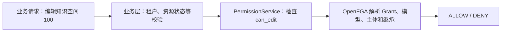
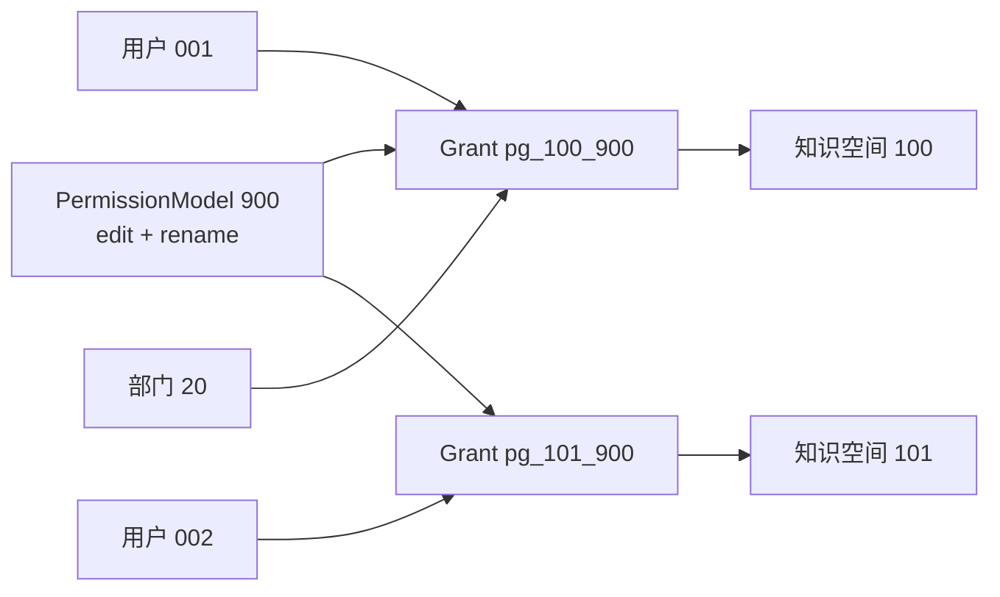

# 3.0 ReBAC：产品可读的 Authorization Model 接管与数据迁移说明

> 面向读者：产品经理、项目经理、测试、实施、运维，以及不熟悉 OpenFGA 的研发同学
>
> 文档状态：方案说明稿，帮助理解和评审；最终验收口径以
> [F048 Spec](./spec.md) 为准，
> 最终 relation 名称、DSL、字段和发布脚本由后续 Design 确定。
>
> 版本口径：本文件按已确认的 `PermissionModel + PermissionGrant` 方案编写。若与同目录较早
> 评审稿中的 `permission_parent` 或“OpenFGA 候选 + Config 二次裁决”方案冲突，以 F048
> Spec 和本文件为准。
>
> 原始需求：[3.0-beta1 ReBAC 逻辑优化](https://dataelem.feishu.cn/wiki/TYmHw4nPzitTQnkUjW8c5NFKnQg)

---

## 1. 先说结论

这次升级不是简单地把 `owner / manager / editor / viewer` 换一组名字，而是把权限判断从：

> OpenFGA 先判断一个粗粒度档位，再由业务代码读取 Config JSON 判断具体细粒度权限

升级为：

> 业务直接询问 OpenFGA“这个人能不能对这个资源执行这个动作”，OpenFGA 给出最终
> ALLOW / DENY；MySQL 负责配置和审计，但不能再补充放行。

例如用户 `001` 要编辑知识空间 `100`：

```text
旧方案：
用户 001 是否进入 editor 候选？
  -> 是
  -> 再查 Config binding 指向哪个自定义模型
  -> 再查该模型 permissions[] 是否包含 edit_space
  -> 最终决定

新方案：
用户 001 是否可以 can_edit knowledge_space:100？
  -> OpenFGA 直接返回 ALLOW / DENY
```

“一次判断”指的是只有一个最终权限裁决者。OpenFGA 内部仍会沿模型、Grant、主体和继承
关系完成多步计算，但业务代码不再进行第二次权限裁决。

---

## 2. 为什么现有方案需要调整

### 2.1 当前实际存在两个权限裁决者

当前系统中：

1. OpenFGA 保存 `owner / manager / editor / viewer` 等粗粒度关系；
2. Config 的 `permission_relation_models_v1` 保存模型和 `permissions[]`；
3. Config 的 `permission_relation_model_bindings_v1` 保存某条 OpenFGA tuple 对应哪个模型；
4. `FineGrainedPermissionService` 把 OpenFGA 结果、binding 和模型权限重新组合；
5. 业务代码再检查具体 `permission_id`。


这会带来四类问题：

- OpenFGA 允许但 Config 拒绝，或者 OpenFGA 拒绝但 Config 逻辑又尝试补充计算；
- 模型和 binding 是大 JSON，全量读改写，难以并发、审计和精确恢复；
- 相同动作按资源重复，例如 `edit_space`、`edit_app`、`edit_kb`；
- 候选关系容易被误当成最终动作权限。

### 2.2 新方案只保留一个运行时答案

新方案中：

- MySQL 保存动作、等级、模型、Grant、主体来源和权限模式；
- 发布器把这些配置转换为 OpenFGA tuple；
- OpenFGA 对 `can_edit`、`can_download`、`can_manage_permission` 等具体动作给出最终结果；
- MySQL 不在 OpenFGA 拒绝、超时或不可用时替代它返回 ALLOW。



---

## 3. 四个容易混淆的概念

### 3.1 Authorization Model：全局“电路图”

Authorization Model 是 OpenFGA 的全局规则模板，定义：

- 系统有哪些类型，例如 `permission_model`、`permission_grant`、`knowledge_space`；
- 每种类型有哪些 relation，例如 `assignee`、`can_edit`；
- relation 之间如何计算，例如资源的 `can_edit` 来自关联 Grant 的 `can_edit`。

它不保存“用户 001 属于模型 900”这种业务实例数据。

OpenFGA 的 Authorization Model 不可原地修改。每次发布都会生成新的
`authorization_model_id`。生产请求必须固定使用经过确认的 model ID，不能自动使用
“最新模型”。

### 3.2 PermissionAction：业务动作目录

PermissionAction 是产品配置的动作，例如：

- `edit`
- `download`
- `share`
- `manage_permission`

动作拥有唯一等级和适用资源范围。业务动作 `edit` 在 OpenFGA 中会映射为资源上的
具体检查 relation，例如 `can_edit`。

### 3.3 PermissionModel：可复用的“权限套餐”

PermissionModel 是业务中的查看者、编辑者、管理者、所有者或自定义模型。

例如：

```text
自定义模型 900：内容编辑
动作：edit、rename
派生等级：2
active：是
```

它是 MySQL 中的业务实例，不是 Authorization Model 的版本。

### 3.4 PermissionGrant：某个资源使用某个套餐形成的“成员组”

PermissionGrant 表示：

> 对资源 100，哪些主体使用权限模型 900。

同一个模型可以被很多资源引用，但每个资源有自己的 Grant 和成员：

```text
permission_grant:pg_100_900
  资源：knowledge_space:100
  模型：permission_model:900
  成员：user:001、department:20#member
```

因此修改模型 `900` 的动作时，只修改模型本身，不需要按“资源数 × 人数”重写授权。



---

## 4. 示例一：用户 001 通过自定义模型 900 编辑知识空间 100

### 4.1 产品操作

管理员执行：

1. 创建自定义模型 `900`，选择动作 `edit`；
2. 在知识空间 `100` 的成员管理中选择用户 `001`；
3. 给用户 `001` 授予模型 `900`。

### 4.2 MySQL 保存什么

以下只表达逻辑记录，字段名以 Design 为准：

| 逻辑表 | 示例记录 | 含义 |
|---|---|---|
| `permission_model` | `900, 自定义, level=2, active=true` | 模型定义 |
| `permission_model_action` | `900 -> edit` | 模型包含编辑动作 |
| `permission_grant` | `pg_100_900 -> knowledge_space:100 + model:900` | 资源 100 使用模型 900 |
| `permission_grant_assignee` | `pg_100_900 -> user:001` | 用户 001 加入该 Grant |
| `resource_permission_mode` | `knowledge_space:100 -> CUSTOM` | 该资源使用本级白名单 |

这些记录不再保存在一行 Config JSON 中。

### 4.3 OpenFGA 保存什么

下面的 tuple 和 relation 名称是帮助理解的设计示意，不是最终 DSL：

| OpenFGA tuple 示意 | 说明 |
|---|---|
| `user:* active permission_model:900` | 模型 900 当前生效 |
| `user:* can_edit permission_model:900` | 模型 900 包含编辑动作 |
| `permission_model:900 model permission_grant:pg_100_900` | Grant 使用模型 900 |
| `user:001 assignee permission_grant:pg_100_900` | 用户 001 是 Grant 成员 |
| `permission_grant:pg_100_900 permission_grant knowledge_space:100` | Grant 作用于知识空间 100 |

这里的 `user:*` 不是把所有用户授权给资源，而是把 `active` 或 `can_edit` 作为模型自身的
能力标记。最终仍必须与 Grant 的 `assignee` 求交集。

### 4.4 OpenFGA 如何得到最终答案

业务发起：

```text
Check(
  user     = user:001,
  relation = can_edit,
  object   = knowledge_space:100
)
```

OpenFGA 按 Authorization Model 的规则计算：

```text
knowledge_space:100
  找到 permission_grant:pg_100_900
    用户 001 是否是 assignee？是
    model 900 是否 active？是
    model 900 是否有 can_edit？是
  三个条件同时满足
返回 ALLOW
```

可以把它理解为：

```text
资源可编辑用户
= 所有关联 Grant 中
  （Grant 成员 ∩ 生效模型 ∩ 模型包含 edit）的并集
```

如果模型 `900` 没有 `edit`，即使用户已经属于这个 Grant，也只能看到资源，不能编辑。

---

## 5. 示例二：修改模型 900 为什么不需要重写大量授权

假设模型 `900` 已被：

- 1,000 个资源引用；
- 每个资源平均有 50 个用户或部门主体。

如果把 `share` 加入模型 `900`：

### 旧式展开思路

可能需要处理：

```text
1,000 个资源 × 50 个主体 = 50,000 份授权数据
```

### 新方案

只需要：

1. MySQL 新增 `permission_model_action: 900 -> share`；
2. OpenFGA 给 `permission_model:900` 增加 `can_share` 能力标记；
3. 所有引用模型 `900` 的 Grant 自动通过同一关系链获得 `can_share`。

Grant、资源关联和 assignee 都不需要重写。

同理：

- 停用模型：移除或关闭模型的 `active` 投影；
- 修改同级授权策略：只调整该模型可授予的目标等级能力；
- 删除某动作：只更新模型自身的动作投影。

修改 PermissionModel 不会创建新的 Authorization Model。只有新增、删除或重命名
OpenFGA 的类型/relation，才需要发布新的 Authorization Model 版本。

---

## 6. 示例三：直接授权和部门授权同时存在

知识空间 `100` 上存在：

```text
用户 001 直接加入模型 900：包含 edit
部门 20 加入模型 901：包含 download
用户 001 是部门 20 的成员
```

OpenFGA 计算结果：

| 来源 | 用户 001 获得的动作 |
|---|---|
| 直接授权 `pg_100_900` | `edit` |
| 部门授权 `pg_100_901` | `download` |
| 最终并集 | `edit + download` |

撤销用户 `001` 的直接授权时：

- 只删除 `user:001 assignee permission_grant:pg_100_900`；
- 部门 Grant 不变；
- 用户失去 `edit`；
- 用户继续拥有 `download`。

系统不能只保留一个“最高等级模型”，因为同等级或低等级模型也可能包含另一个模型没有的动作。

---

## 7. 示例四：`manage_permission` 和“是否允许授予同级”

假设模型 `920`：

```text
名称：权限管理员
等级：2
动作：edit、manage_permission
同级策略：禁止同级
```

模型 `920` 可以被编译为：

```text
can_manage_permission = true
can_grant_level_1     = true
can_grant_level_2     = false
can_grant_level_3     = false
can_grant_level_4     = false
```

如果把策略改成“允许同级”：

```text
can_grant_level_1 = true
can_grant_level_2 = true
```

当用户要把目标模型授予他人时：

1. 系统从 MySQL 获取目标模型当前等级；
2. 对资源检查 `can_grant_level_N`；
3. OpenFGA 只会使用同时包含 `manage_permission`、自身等级和自身策略的同一个来源模型；
4. 再执行受保护所有者、租户范围、目标主体是否合法等业务校验。

这避免了错误拼接：

```text
模型 A：等级 4，但没有 manage_permission
模型 B：等级 2，有 manage_permission

错误结果：把 A 的等级 4 与 B 的 manage_permission 拼成可授予 4 级
正确结果：最多按模型 B 自己的等级和策略授予
```

修改标准模型“是否允许授予同级”时，也只改变该标准 PermissionModel 实例的
`can_grant_level_N` 投影，不修改全局 Authorization Model。

---

## 8. 示例五：继承模式为什么继续使用原来的 `parent`

### 8.1 `INHERIT`

文件夹 `200` 位于知识空间 `100` 下，并使用继承模式：

```text
knowledge_space:100 parent folder:200
```

Authorization Model 定义：

```text
folder.can_edit
= 本级 Grant 的 can_edit
  或 parent 的 can_edit
```

普通本级 Grant 在继承模式下不允许维护，因此文件夹主要使用父级权限。受保护所有者可以
作为本级系统授权存在，但不改变普通成员继承规则。

### 8.2 `CUSTOM`

文件夹切换为自定义权限时：

1. 把当前有效普通授权复制为文件夹自己的 Grant；
2. 从 OpenFGA 删除该文件夹用于权限继承的 `parent` tuple；
3. MySQL 中的业务父子关系、目录路径和归属仍保留；
4. 后续上级成员变化不再影响该文件夹。

因此不需要新增 `permission_parent` 类型。原 `parent` relation 继续表示“当前启用的权限
继承边”，业务表继续表示真实目录父子关系。

### 8.3 再切回 `INHERIT`

系统：

1. 删除或停用本级普通 Grant；
2. 保留受保护授权；
3. 恢复 OpenFGA `parent` tuple；
4. 立即按上级权限计算。

任一步骤失败，都必须保持原模式和原权限结果。

---

## 9. 候选集还要不要再次检查动作

分两种情况：

### 9.1 候选集就是按具体动作查询

例如：

```text
ListObjects(
  user     = user:001,
  relation = can_edit,
  type     = knowledge_space
)
```

返回的就是用户可以编辑的知识空间，业务无需再读取 MySQL 模型动作做第二次权限判断。

### 9.2 候选集只表示资源可见

例如按 `can_view` 查询得到知识空间 `100`，只能证明用户可以看到列表项和基础信息，不能证明
用户可以编辑、下载或删除。

```text
can_view 候选 != can_edit 授权
can_view 候选 != can_download 授权
```

因此原则不是“候选集一律不用再检查”，而是：

> 候选集按哪个具体 relation 得出，就只能证明哪个 relation。

---

## 10. Authorization Model 接管后，MySQL 还负责什么

OpenFGA 是执行面的最终裁决者，MySQL 是控制面的业务真相。

| MySQL 负责 | OpenFGA 负责 |
|---|---|
| 动作名称、等级、适用资源 | 当前用户是否能执行具体动作 |
| 标准/自定义模型定义 | 沿模型、Grant、主体和 parent 计算 |
| 模型 active 与同级策略配置 | `can_edit`、`can_download` 等最终结果 |
| Grant、assignee 和来源明细 | 用户、部门、用户组的关系集合计算 |
| 权限模式和界面展示 | 资源继承关系的权限传播 |
| 审计、发布状态、迁移记录 | Check、ListObjects、ListUsers |

MySQL 可以告诉界面“为什么有权限”，但不能在 OpenFGA 返回 DENY 或不可用时自行返回 ALLOW。

业务层仍然负责：

- 租户和资源是否存在；
- 移动时目标容器是否允许接收；
- 资源状态是否允许编辑；
- 受保护所有者是否可以操作；
- 请求参数和业务流程是否合法。

Authorization Model 接管的是“谁对哪个资源拥有什么动作”，不是接管全部业务规则。

---

## 11. 目标关系表示意

以下只说明关系如何串联：

```text
type permission_model
  active
  can_edit
  can_download
  can_manage_permission
  can_grant_level_1
  can_grant_level_2
  can_grant_level_3
  can_grant_level_4

type permission_grant
  assignee
  model
  active_assignee = assignee AND active FROM model
  can_edit = active_assignee AND can_edit FROM model
  can_download = active_assignee AND can_download FROM model
  can_manage_permission =
    active_assignee AND can_manage_permission FROM model
  can_grant_level_1 =
    active_assignee AND can_grant_level_1 FROM model
  ...
  can_grant_level_4 =
    active_assignee AND can_grant_level_4 FROM model

type knowledge_space
  permission_grant
  can_view = active_assignee FROM permission_grant
  can_edit = can_edit FROM permission_grant
  can_download = can_download FROM permission_grant
  can_manage_permission = can_manage_permission FROM permission_grant
  can_grant_level_1 = can_grant_level_1 FROM permission_grant
  ...
  can_grant_level_4 = can_grant_level_4 FROM permission_grant
```

每增加一个正式业务动作，Authorization Model 需要具备对应 relation。动作改等级、模型勾选
动作、修改 active、修改同级策略或增删成员，只改变业务记录和 tuple，不发布新的全局模型版本。

---

## 12. 数据迁移：现有数据从哪里来

迁移需要同时读取三类来源：

### 12.1 OpenFGA 旧 tuple

- 资源上的直接 `owner / manager / editor / viewer`；
- 文件夹、文件的 `parent`；
- `shared_with`；
- tenant、department、user_group 等系统关系。

### 12.2 Config 大 JSON

- `permission_relation_models_v1`：标准模型和自定义模型；
- `permission_relation_model_bindings_v1`：tuple 与模型之间的绑定。

### 12.3 MySQL 业务事实

- 资源与 tenant 的归属；
- 资源创建者和受保护所有者；
- 文件夹、文件真实父级；
- 部门层级和用户组；
- 当前资源和主体是否仍然存在。

只看 OpenFGA tuple 无法知道全部自定义模型语义，只看 Config binding 又无法证明授权 tuple
真实存在，因此三类来源必须交叉核对。

---

## 13. 数据迁移：旧关系如何转换

| 旧数据 | 新数据 | 处理规则 |
|---|---|---|
| 业务表确认的创建者 + `owner` tuple | 所有者标准模型 Grant + 受保护 assignee | 受保护优先，不能仅凭 relation 名猜测 |
| 其他 `owner` | binding 指向模型或所有者标准模型 | 有唯一 binding 时 binding 优先 |
| `manager` | binding 指向模型或管理者标准模型 | 保留用户、部门、用户组主体 |
| `editor` | binding 指向模型或编辑者标准模型 | 同上 |
| `viewer` | binding 指向模型或查看者标准模型 | 同上 |
| `can_read / can_edit / can_manage / can_delete` | 不迁移 | 它们是计算结果，不是直接 tuple |
| `parent` | 目标模式为 INHERIT 时保留 | CUSTOM 资源不参与权限继承 |
| `shared_with` | 继续作为系统共享关系 | 不伪装成普通成员 Grant |
| department / user_group userset | 保留集合主体 | 不按当时成员展开成用户 |

### 13.1 binding 优先的原因

假设存在：

```text
user:001 editor knowledge_space:100
```

同时 Config binding 指向自定义模型 `900`。旧 `editor` 只负责粗粒度候选，真正动作由模型
`900` 决定。因此迁移时必须创建：

```text
knowledge_space:100 + permission_model:900
```

不能额外再给用户一个编辑者标准模型，否则会把标准模型中的其他 1、2 级动作一并扩给用户。

### 13.2 `include_children=true`

旧系统可能把一个根部门授权展开为多个子部门 tuple。

迁移后 MySQL 只保留：

```text
根部门 20
include_children = true
```

历史子部门 tuple 只用于核对，不迁成多个独立 Grant 来源。OpenFGA 执行面是否仍需要生成
子部门投影，由 Design 根据新部门关系模型决定。

---

## 14. 数据迁移：旧模型如何转换

### 14.1 四个默认标准模型

| 旧模型 | 新模型 |
|---|---|
| owner | 所有者，固定 4 级 |
| manager | 管理者，固定 3 级 |
| editor | 编辑者，固定 2 级 |
| viewer | 查看者，固定 1 级 |

新标准模型的动作集合由动作等级自动生成，不复制旧 Config 中的 `permissions[]` 作为永久真相。

### 14.2 被修改过的旧系统模型

当前实现允许编辑系统模型，因此迁移必须区分：

- 映射后的动作与新标准模型完全一致：直接使用新标准模型；
- 动作不一致：生成带“历史系统模型迁移”来源标记的自定义模型，把原 binding 指向它；
- `manage_*` 范围可以无损表达：转换为对应的同级策略；
- 无法无损表达：进入人工处理清单，不能取更宽权限近似。

这样既不篡改新标准模型，也不静默改变已有用户权限。

### 14.3 普通自定义模型

迁移步骤：

1. 保留稳定 ID、名称和配置范围；
2. 把旧 permission ID 映射为新的统一动作；
3. 删除重复动作；
4. 按最高动作等级重新计算模型等级；
5. 合法模型默认保持 active；
6. 所有 Grant 继续引用同一个模型，不按资源或主体复制模型定义。

### 14.4 不能自动迁移的模型

以下数据阻断自动切换：

- 模型只包含将被删除的 `view_*`；
- 包含未知 permission ID；
- 动作映射后为空；
- `manage_*` 目标集合不是连续的同级/低级边界；
- binding 指向不存在的模型；
- 同一旧 tuple 匹配多个冲突 binding。

这些情况不能自动改成查看者或“最高等级模型”，因为那可能扩权。

---

## 15. Config 大 JSON 迁往哪些关系表

| 目标关系表 | 产品可理解的用途 |
|---|---|
| `permission_action` | 动作、等级、状态 |
| `permission_action_resource_scope` | 动作适用于哪些资源 |
| `permission_model` | 标准/自定义模型、等级、active、同级策略 |
| `permission_model_action` | 模型选择了哪些动作 |
| `permission_grant` | 某资源使用某模型形成的授权集合 |
| `permission_grant_assignee` | Grant 中的用户、部门、用户组及来源 |
| `resource_permission_mode` | INHERIT / CUSTOM |
| `authorization_model_release` | 当前生产固定的 OpenFGA model ID |
| `permission_migration_run` | 一次 dry-run 或正式迁移任务 |
| `permission_migration_item` | 每条旧记录迁到哪里、是否成功、失败原因 |

要求：

- 不再用一行 JSON 保存全部模型；
- 不再用一行 JSON 保存全部 binding；
- 模型动作使用关系表，不保存大动作数组；
- 每条迁移记录可单独重试、核对和审计；
- 同时兼容 MySQL 和 DM8，不依赖 MySQL 专属 JSON 查询。

---

## 16. Authorization Model A → B 的上线步骤

当前静态模型记为 A，新模型记为 B。


### M0：先固定旧模型 A

所有生产 Check、List 和 Write 都显式指定 A 的 model ID。

原因：如果有实例仍自动使用“最新模型”，发布 B 的瞬间它就可能提前切换。

### M1：建立新 SQL 控制面

- 创建规范化关系表；
- 导入动作和资源适用范围；
- 初始化四个标准模型；
- 导入旧自定义模型；
- 导入 binding、Grant、assignee 和权限模式；
- 记录逐条迁移状态。

生产权限仍由 A 决定。

### M2：发布 Authorization Model B

- B 获得新的不可变 model ID；
- 生产仍固定使用 A；
- B 只用于校验新 tuple 和影子检查。

### M3：回填新 tuple

根据 SQL 中的模型、Grant、assignee 和模式生成 B 需要的 tuple。

需要注意：OpenFGA tuple 本身不带 model ID。model ID 是请求的校验和解释上下文，不是 tuple
的版本标签。因此 A/B 共用 Store 时，必须证明新 tuple 不会改变 A 的结果；否则使用隔离
Store 或兼容阶段模型。

### M4：做语义对比，不只比较数量

至少验证：

- 受保护所有者；
- 直接授权；
- 部门和用户组授权；
- 直接 + 部门多来源并集；
- 撤销直接授权后部门权限仍保留；
- INHERIT / CUSTOM；
- `edit`、`download`、`delete`、`manage_permission` 等关键动作；
- active 模型；
- 是否允许授予同级。

新旧 tuple 数量不同并不一定是错误。必须比较同一用户、同一资源、同一动作的最终结果。

### M5：追平增量并一次切换

M1～M4 期间仍可能发生授权、撤权和模型修改，最终必须二选一：

- 捕获并追平全部增量；或
- 在短维护窗口冻结权限写入。

确认无增量遗漏后，把 API、后台任务和全部应用实例一次切换到 B，并停止写旧 Config binding
和旧四档资源 tuple。

### M6：观察和清理

观察期内保留：

- Authorization Model A；
- 旧 tuple；
- 旧 Config JSON 快照；
- 数据库恢复点；
- 切换后变更记录。

验证通过并关闭回滚窗口后，才删除旧资源四档 tuple、Config JSON 读写逻辑、缓存和第二 PDP。
旧 Authorization Model A 会作为不可变历史版本保留，但不再用于生产。

---

## 17. 回滚如何做

| 失败时点 | 回滚方式 |
|---|---|
| M5 切换前 | 停止迁移即可，生产仍使用 A |
| M5 切换后、回滚窗口内 | 冻结权限写入，恢复匹配的应用版本、A model ID、SQL/Config 快照和旧 tuple，并重放或核对切换后变更 |
| M6 清理后 | 不支持只回退应用版本；需要经过验证的整版备份恢复或向前修复 |

禁止以下做法：

- OpenFGA 失败时临时改用 Config 放行；
- 一部分实例使用 A、一部分实例使用 B；
- 只回退代码，不恢复与代码匹配的权限数据；
- 已向用户返回授权成功，却在回滚时静默丢失该授权。

---

## 18. 上线前的产品与测试验收门槛

### 数据门禁

- 跨租户关系为零；
- 无主资源为零；
- 受保护创建者缺失为零；
- 冲突 binding 为零；
- 孤儿 binding 已全部处理；
- 仅含 `view_*` 的模型已人工选择目标方案；
- `manage_*` 非连续范围已人工确认。

### 权限语义门禁

- 所有未批准扩权为零；
- 所有未批准撤权为零；
- 关键动作 A/B 对比通过；
- 多来源并集和独立撤销通过；
- 模式切换原子性通过；
- OpenFGA 故障时不存在 MySQL/Config fallback ALLOW。

### 发布门禁

- 所有实例显式固定 A 或 B；
- 权限写入增量已追平；
- 整版回滚演练通过；
- MySQL、DM8、Platform、Client 和后台任务回归通过。

---

## 19. 还需要产品确认的五个问题

| 问题 | 不确认的影响 | 当前安全默认值 |
|---|---|---|
| 知识库的 canonical 权限父级是什么 | 无法正确启用继承 | 固定 CUSTOM |
| 动作等级和模型配置是平台级还是租户级 | 无法确定配置范围和唯一性 | 旧全局模型按 PLATFORM 导入 |
| 初始动作等级映射是否最终确认 | 标准模型动作集合不确定 | 只允许 dry-run，不生产切换 |
| dashboard 是否首批迁移 | 动作映射和入口不完整 | 保留旧行为，不切换 |
| 四个标准模型是否允许授予同级的初始值 | 授权边界不确定 | 必须逐模型确认 |

其中“初始动作等级”和“四个标准模型同级策略”是生产切换阻断项。

---

## 20. 常见问题

### PermissionModel 900 是不是一个 Authorization Model？

不是。

- Authorization Model：全局、不可变的关系规则版本；
- PermissionModel 900：业务创建的一个权限套餐实例；
- 修改模型 900 通常只更新 MySQL 和 OpenFGA tuple，不发布全局 Authorization Model。

### 修改一个被大量资源使用的自定义模型，会不会产生海量 tuple？

不会产生“资源数 × 人数”的重写。只更新 `permission_model:900` 自身的动作、active 或可授予
等级投影。已有 Grant 和 assignee 继续引用它。

### 为什么 MySQL 保存了完整模型，却不能直接用于权限判断？

因为 MySQL 是配置与审计真相，OpenFGA 是运行时权限裁决真相。如果两者都能独立 ALLOW，
系统会再次出现两个权限裁决者。

### OpenFGA 已经返回 `can_edit` 候选，还要再检查 edit 吗？

不用。`can_edit` 候选已经是具体动作结果。

如果查询的是 `can_view`，则只能证明可见，不能证明可编辑。

### 模型 active 有什么作用？

它是模型的总开关：

- inactive 模型不能新增授权；
- 既有 Grant 保留用于审计；
- 既有 Grant 不再产生可见性、具体动作或授权他人的能力；
- 不需要逐个删除所有 Grant。

### 标准模型修改“允许同级”会发布新 Authorization Model 吗？

不会。它只修改该标准 PermissionModel 实例的可授予等级投影。

---

## 21. 参考资料

- [F048 Spec](./spec.md)
- [v3.0.0-beta1 Release Contract](../release-contract.md)
- [当前 OpenFGA Authorization Model](../../../src/backend/bisheng/core/openfga/authorization_model.py)
- [当前资源授权与 Config binding](../../../src/backend/bisheng/permission/api/endpoints/resource_permission.py)
- [当前细粒度权限第二次裁决](../../../src/backend/bisheng/permission/domain/services/fine_grained_permission_service.py)
- [OpenFGA：Immutable Authorization Models](https://openfga.dev/docs/getting-started/immutable-models)
- [OpenFGA：Model Migrations](https://openfga.dev/docs/modeling/migrating/migrating-models)
- [OpenFGA：Modeling Roles](https://openfga.dev/docs/best-practices/modeling-roles)
