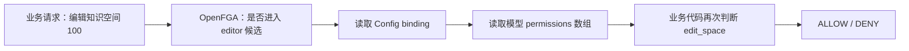
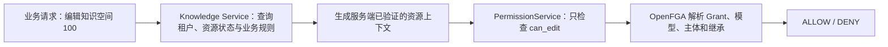
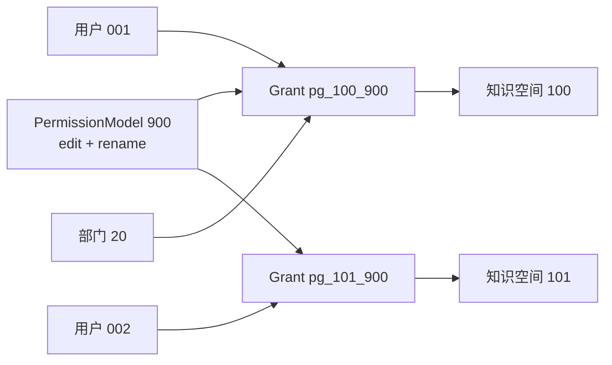

# 3.0 ReBAC：产品可读的 Authorization Model 接管与数据迁移说明

> 面向读者：产品经理、项目经理、测试、实施、运维，以及不熟悉 OpenFGA 的研发同学
>
> 文档状态：已同步 2026-07-30 的实现状态、全部产品决策、“复用现有 Store、只运行新 model”
> 以及“Schema Migration 仅 DDL、数据迁移由 scripts 脚本执行”的用户纠正；纠正后的
> Design 24 项复审已 LGTM，并于 2026-07-29 获得用户 Design ★ 确认；`tasks.md` 已通过
> 21 项评审并于 2026-07-30 获得用户 Tasks ★ 确认。T001～T140 已按最终范围收口，
> 功能与迁移脚本开发完成；用户明确确认本地不执行真实环境 E2E。该范围决策不等同于
> 生产发布环境验证。最终验收口径以
> [F048 Spec](./spec.md) 与 [F048 Design](./design.md) 为准，
> 实施任务和验证步骤见 `tasks.md`。
>
> 版本口径：本文件按已确认的 `PermissionModel + PermissionGrant` 方案编写。若与同目录较早
> 评审稿中的 `permission_parent` 或“OpenFGA 候选 + Config 二次裁决”方案冲突，以 F048
> Spec、Design 和本文件为准。
>
> 原始需求：[3.0-beta1 ReBAC 逻辑优化](https://dataelem.feishu.cn/wiki/TYmHw4nPzitTQnkUjW8c5NFKnQg)

---

## 1. 先说结论

这次升级不是简单地把 `owner / manager / editor / viewer` 换一组名字，而是把权限判断从：

> OpenFGA 先判断一个粗粒度档位，再由业务代码读取 Config JSON 判断具体细粒度权限

升级为：

> 业务直接询问 OpenFGA“这个人能不能对这个资源执行这个动作”，OpenFGA 给出最终
> ALLOW / DENY；MySQL 负责配置和审计，但不能再补充放行。

例如用户 `001` 要编辑知识空间 `100`：

```text
旧方案：
用户 001 是否进入 editor 候选？
  -> 是
  -> 再查 Config binding 指向哪个自定义模型
  -> 再查该模型 permissions[] 是否包含 edit_space
  -> 最终决定

新方案：
用户 001 是否可以 can_edit knowledge_space:100？
  -> OpenFGA 直接返回 ALLOW / DENY
```

“一次判断”指的是只有一个最终权限裁决者。OpenFGA 内部仍会沿模型、Grant、主体和继承
关系完成多步计算，但业务代码不再进行第二次权限裁决。

上线也采用一次性方式：停止全部权限读写服务，沿用当前 OpenFGA Store，在同一 Store
发布新的不可变 Authorization Model ID，迁移新关系并退役旧关系，校验通过后再启动
新版本。F048 不创建第二个 Store，不维护两套运行模型，也不提供独立迁移预演或应用级
回滚；失败时保持维护并在新控制面前向修复。旧 model ID 只作为 OpenFGA 的不可变历史
记录存在，不再被任何运行实例引用。

数据库结构与数据转换是两个独立步骤：Alembic revision 只创建/修改 MySQL、DM8
schema；随后运维从 `src/backend/` 运行 `src/backend/scripts/` 下的专用权限数据迁移
脚本，完成 Config、业务事实和 OpenFGA tuple 转换。数据脚本不会被 Alembic 或服务启动
过程自动调用。

---

## 2. 为什么现有方案需要调整

### 2.1 当前实际存在两个权限裁决者

当前系统中：

1. OpenFGA 保存 `owner / manager / editor / viewer` 等粗粒度关系；
2. Config 的 `permission_relation_models_v1` 保存模型和 `permissions[]`；
3. Config 的 `permission_relation_model_bindings_v1` 保存某条 OpenFGA tuple 对应哪个模型；
4. `FineGrainedPermissionService` 把 OpenFGA 结果、binding 和模型权限重新组合；
5. 业务代码再检查具体 `permission_id`。



这会带来四类问题：

- OpenFGA 允许但 Config 拒绝，或者 OpenFGA 拒绝但 Config 逻辑又尝试补充计算；
- 模型和 binding 是大 JSON，全量读改写，难以并发、审计和精确恢复；
- 相同动作按资源重复，例如 `edit_space`、`edit_app`、`edit_kb`；
- 候选关系容易被误当成最终动作权限。

### 2.2 新方案只保留一个运行时答案

新方案中：

- MySQL 保存动作、等级、模型、Grant、主体来源和权限模式；
- 发布器把这些配置转换为 OpenFGA tuple；
- OpenFGA 对 `can_edit`、`can_download`、`can_manage_permission` 等具体动作给出最终结果；
- MySQL 不在 OpenFGA 拒绝、超时或不可用时替代它返回 ALLOW。



权限模块不查询知识库、Dashboard、工作流等业务表，也不判断资源状态。各业务 Service
先完成业务校验，再把服务端生成的资源类型、ID、tenant 和版本交给 PermissionService。

---

## 3. 四个容易混淆的概念

### 3.1 Authorization Model：全局“电路图”

Authorization Model 是 OpenFGA 的全局规则模板，定义：

- 系统有哪些类型，例如 `permission_model`、`permission_grant`、`knowledge_space`；
- 每种类型有哪些 relation，例如 `assignee`、`can_edit`；
- relation 之间如何计算，例如资源的 `can_edit` 来自关联 Grant 的 `can_edit`。

它不保存“用户 001 属于模型 900”这种业务实例数据。

OpenFGA 的 Authorization Model 不可原地修改。每次发布都会生成新的
`authorization_model_id`。生产配置不保存这些易变 ID；进程启动时按稳定 Store name
发现唯一 Store 和最新模型，再与 SQL CURRENT Catalog 引用的 ACTIVE release 校验。
校验通过后，每个生产 Check/List/Write 仍显式携带本进程发现的 model ID。

### 3.2 PermissionAction：业务动作目录

PermissionAction 是产品配置的动作，例如：

- `edit`
- `download`
- `share`
- `manage_permission`

动作拥有唯一等级和适用资源范围。业务动作 `edit` 在 OpenFGA 中会映射为资源上的
具体检查 relation，例如 `can_edit`。

### 3.3 PermissionModel：可复用的“权限套餐”

PermissionModel 是业务中的查看者、编辑者、管理者、所有者或自定义模型。

例如：

```text
自定义模型 900：内容编辑
动作：edit、rename
派生等级：2
active：是
```

它是 MySQL 中的业务实例，不是 Authorization Model 的版本。

### 3.4 PermissionGrant：某个资源使用某个套餐形成的“成员组”

PermissionGrant 表示：

> 对资源 100，哪些主体使用权限模型 900。

同一个模型可以被很多资源引用，但每个资源有自己的 Grant 和成员：

```text
permission_grant:pg_100_900
  资源：knowledge_space:100
  模型：permission_model:900
  成员：user:001、department:20#member
```

因此修改模型 `900` 的动作时，只修改模型本身，不需要按“资源数 × 人数”重写授权。



### 3.5 PermissionCatalogRelease：一次完整的权限策略发布

Catalog 不是 OpenFGA Authorization Model，也不是某个资源的权限缓存。它把“动作等级、
动作状态/适用范围、四个标准模型、全部自定义模型”冻结成一份完整 release。

原因是一个动作从 2 级改为 3 级时，会同时影响：

- 四个标准模型的累计动作集合；
- 所有选择了该动作的自定义模型派生等级；
- 每个模型在各资源类型上的有效动作与可授予等级。

系统必须先离线重算完整 release，再原子切换 Catalog active 指针。否则逐个更新模型时，
同一时刻可能出现一部分模型使用新等级、另一部分仍使用旧等级。这个设计避免按
“资源数 × Grant/成员数”重写授权，但会让 OpenFGA Check 多经过
Grant→ModelRelease→Catalog 的关系链，性能代价必须实测，不能假设为零。

---

## 4. 示例一：用户 001 通过自定义模型 900 编辑知识空间 100

### 4.1 产品操作

管理员执行：

1. 创建自定义模型 `900`，选择动作 `edit`；
2. 在知识空间 `100` 的成员管理中选择用户 `001`；
3. 给用户 `001` 授予模型 `900`。

### 4.2 MySQL 保存什么

以下只表达逻辑记录，字段名以 Design 为准：

| 逻辑表 | 示例记录 | 含义 |
|---|---|---|
| `permission_model` | `900, 自定义, level=2, active=true` | 模型定义 |
| `permission_model_action` | `900 -> edit` | 模型包含编辑动作 |
| `permission_grant` | `pg_100_900 -> knowledge_space:100 + model:900` | 资源 100 使用模型 900 |
| `permission_grant_assignee` | `pg_100_900 -> user:001` | 用户 001 加入该 Grant |
| `resource_permission_mode` | `knowledge_space:100 -> CUSTOM` | 该资源使用本级白名单 |

这些记录不再保存在一行 Config JSON 中。

### 4.3 OpenFGA 保存什么

下面的 tuple 和 relation 名称是帮助理解的设计示意，不是最终 DSL：

| OpenFGA tuple 示意 | 说明 |
|---|---|
| `user:* active permission_model:900` | 模型 900 当前生效 |
| `user:* can_edit permission_model:900` | 模型 900 包含编辑动作 |
| `permission_model:900 model permission_grant:pg_100_900` | Grant 使用模型 900 |
| `user:001 assignee permission_grant:pg_100_900` | 用户 001 是 Grant 成员 |
| `permission_grant:pg_100_900 permission_grant knowledge_space:100` | Grant 作用于知识空间 100 |

这里的 `user:*` 不是把所有用户授权给资源，而是把 `active` 或 `can_edit` 作为模型自身的
能力标记。最终仍必须与 Grant 的 `assignee` 求交集。

### 4.4 OpenFGA 如何得到最终答案

业务发起：

```text
Check(
  user     = user:001,
  relation = can_edit,
  object   = knowledge_space:100
)
```

OpenFGA 按 Authorization Model 的规则计算：

```text
knowledge_space:100
  找到 permission_grant:pg_100_900
    用户 001 是否是 assignee？是
    model 900 是否 active？是
    model 900 是否有 can_edit？是
  三个条件同时满足
返回 ALLOW
```

可以把它理解为：

```text
资源可编辑用户
= 所有关联 Grant 中
  （Grant 成员 ∩ 生效模型 ∩ 模型包含 edit）的并集
```

如果模型 `900` 没有 `edit`，即使用户已经属于这个 Grant，也只能看到资源，不能编辑。

---

## 5. 示例二：修改模型 900 为什么不需要重写大量授权

假设模型 `900` 已被：

- 1,000 个资源引用；
- 每个资源平均有 50 个用户或部门主体。

如果把 `share` 加入模型 `900`：

### 旧式展开思路

可能需要处理：

```text
1,000 个资源 × 50 个主体 = 50,000 份授权数据
```

### 新方案

只需要：

1. MySQL 新增 `permission_model_action: 900 -> share`；
2. OpenFGA 给 `permission_model:900` 增加 `can_share` 能力标记；
3. 所有引用模型 `900` 的 Grant 自动通过同一关系链获得 `can_share`。

Grant、资源关联和 assignee 都不需要重写。

同理：

- 停用模型：移除或关闭模型的 `active` 投影；
- 修改同级授权策略：只调整该模型可授予的目标等级能力；
- 删除某动作：只更新模型自身的动作投影。

修改 PermissionModel 不会创建新的 Authorization Model。只有新增、删除或重命名
OpenFGA 的类型/relation，才需要发布新的 Authorization Model 版本。

---

## 6. 示例三：直接授权和部门授权同时存在

知识空间 `100` 上存在：

```text
用户 001 直接加入模型 900：包含 edit
部门 20 加入模型 901：包含 download
用户 001 是部门 20 的成员
```

OpenFGA 计算结果：

| 来源 | 用户 001 获得的动作 |
|---|---|
| 直接授权 `pg_100_900` | `edit` |
| 部门授权 `pg_100_901` | `download` |
| 最终并集 | `edit + download` |

撤销用户 `001` 的直接授权时：

- 只删除 `user:001 assignee permission_grant:pg_100_900`；
- 部门 Grant 不变；
- 用户失去 `edit`；
- 用户继续拥有 `download`。

系统不能只保留一个“最高等级模型”，因为同等级或低等级模型也可能包含另一个模型没有的动作。

---

## 7. 示例四：`manage_permission` 和“是否允许授予同级”

假设模型 `920`：

```text
名称：权限管理员
等级：2
动作：edit、manage_permission
同级策略：禁止同级
```

模型 `920` 可以被编译为：

```text
can_manage_permission = true
can_grant_level_1     = true
can_grant_level_2     = false
can_grant_level_3     = false
can_grant_level_4     = false
```

如果把策略改成“允许同级”：

```text
can_grant_level_1 = true
can_grant_level_2 = true
```

当用户要把目标模型授予他人时：

1. 系统从 MySQL 获取目标模型当前等级；
2. 对资源检查 `can_grant_level_N`；
3. OpenFGA 只会使用同时包含 `manage_permission`、自身等级和自身策略的同一个来源模型；
4. 再执行受保护所有者、租户范围、目标主体是否合法等业务校验。

这避免了错误拼接：

```text
权限模型 X：等级 4，但没有 manage_permission
权限模型 Y：等级 2，有 manage_permission

错误结果：把 X 的等级 4 与 Y 的 manage_permission 拼成可授予 4 级
正确结果：最多按权限模型 Y 自己的等级和策略授予
```

修改标准模型“是否允许授予同级”时，也只改变该标准 PermissionModel 实例的
`can_grant_level_N` 投影，不修改全局 Authorization Model。

---

## 8. 示例五：继承模式为什么继续使用原来的 `parent`

只有文件夹和文件支持 `INHERIT / CUSTOM` 切换。knowledge_space 与 knowledge_library
都是没有上级资源的顶级容器，始终固定为 `CUSTOM`；它们可以作为文件夹或文件的 parent，
但自身不能再指向一个权限父级。

### 8.1 `INHERIT`

文件夹 `200` 位于知识空间 `100` 下，并使用继承模式：

```text
knowledge_space:100 parent folder:200
```

Authorization Model 定义：

```text
folder.can_edit
= permission_enabled
  且（本级受保护 Grant
      或 custom_mode 下的本级普通 Grant
      或 inherit_mode 下 parent 的 can_edit）
```

普通本级 Grant 在继承模式下不允许维护，因此文件夹主要使用父级权限。受保护所有者可以
作为本级系统授权存在，但不改变普通成员继承规则。

### 8.2 `CUSTOM`

文件夹切换为自定义权限时：

1. 把当前有效普通授权复制为文件夹自己的 Grant；
2. 在一个 OpenFGA Write 中删除 `inherit_mode`、写入 `custom_mode`；
3. OpenFGA `parent` tuple 与 MySQL 业务父子关系、目录路径和归属都继续保留；
4. 后续上级成员变化不再影响该文件夹。

因此不需要新增 `permission_parent` 类型。原 `parent` relation 始终镜像真实直接父级；
是否读取它由 `inherit_mode` gate 决定。这样 CUSTOM 不会继承普通权限，同时仍允许
public/shared 等系统关系沿真实业务结构传播。

### 8.3 再切回 `INHERIT`

系统：

1. 在一个 OpenFGA Write 中删除 `custom_mode`、写入 `inherit_mode`；
2. 保留受保护授权；
3. 本级普通 assignee 立即不生效，随后按来源退役；仍含受保护来源的 Grant 继续保留；
4. 原有 `parent` 无需恢复，模式 commit 后立即按上级权限计算。

任一步骤失败，都必须保持原模式和原权限结果。

---

## 9. 候选集还要不要再次检查动作

分两种情况：

### 9.1 候选集就是按具体动作查询

例如：

```text
ListObjects(
  user     = user:001,
  relation = can_edit,
  type     = knowledge_space
)
```

返回的就是用户可以编辑的知识空间，业务无需再读取 MySQL 模型动作做第二次权限判断。
但这不表示所有业务列表都应该先调用 ListObjects。新模型含 Grant、ModelRelease、
Catalog 和部门/继承交集，ListObjects 的反向枚举成本可能明显高于单资源 Check。

高频分页列表默认采用：

```text
业务 Repository 按 tenant/status/keyword/cursor 有界取一批候选
  → 业务 Service 生成 verified targets
  → PermissionService BatchCheck(can_<action>)
  → 过滤并继续有界凑页
```

只有真实数据上的 P95/P99、结果上限和超时都通过门禁后，某个入口才可以使用 ListObjects。

### 9.2 候选集只表示资源可见

本 Design 中正式 relation 名为固定 `visible`；下文的 `can_view` 只是对应用户常用说法。
例如按 `visible` 查询得到知识空间 `100`，只能证明用户可以看到列表项和基础信息，不能证明
用户可以编辑、下载或删除。

```text
visible 候选 != can_edit 授权
visible 候选 != can_download 授权
```

因此原则不是“候选集一律不用再检查”，而是：

> 候选集按哪个具体 relation 得出，就只能证明哪个 relation。

OpenFGA 官方也明确提醒：ListObjects 的性能会随模型复杂度、tuple 数和 relation 显著变化，
其中 `and` 比 `or` 更昂贵。因此 Catalog 方案对 Check 的代价通常是额外固定图跳转，
对 ListObjects 则可能被结果枚举放大，必须分别测试，不能用一次 Check 延迟代替 ListObjects 结论。

---

## 10. Authorization Model 接管后，MySQL 还负责什么

OpenFGA 是执行面的最终裁决者，MySQL 是控制面的业务真相。

| MySQL 负责 | OpenFGA 负责 |
|---|---|
| 动作名称、等级、适用资源 | 当前用户是否能执行具体动作 |
| 标准/自定义模型定义 | 沿模型、Grant、主体和 parent 计算 |
| 模型 active 与同级策略配置 | `can_edit`、`can_download` 等最终结果 |
| Grant、assignee 和来源明细 | 用户、部门、用户组的关系集合计算 |
| 权限模式和界面展示 | 资源继承关系的权限传播 |
| 审计、发布状态、迁移记录 | Check、ListObjects、ListUsers |

MySQL 可以告诉界面“为什么有权限”，但不能在 OpenFGA 返回 DENY 或不可用时自行返回 ALLOW。

业务层仍然负责，并且这些数据不能由 PermissionService 自己查询：

- 租户和资源是否存在；
- 移动时目标容器是否允许接收；
- 资源状态是否允许编辑；
- 受保护所有者是否可以操作；
- 请求参数和业务流程是否合法。

Authorization Model 接管的是“谁对哪个资源拥有什么动作”，不是接管全部业务规则。
业务 Service 在完成上述校验后生成服务端内部的 VerifiedPermissionTarget；权限模块只用
该 target 做身份/tenant gate、Catalog/action 校验和 OpenFGA 裁决。
成员姓名、部门路径、用户组名称和资源标题也不属于权限事实：权限模块只返回稳定 ID 和来源，
由应用编排层调用对应业务侧的只读 display port 补齐；补齐失败不能改变权限结论。

---

## 11. 目标关系表示意

以下只说明关系如何串联：

```text
type permission_catalog_release
  active

type permission_model_release
  catalog
  active = enabled AND active FROM catalog
  can_edit = active AND edit_marker
  can_download = active AND download_marker

type permission_model
  release
  active = active FROM release
  can_edit = can_edit FROM release
  can_download = can_download FROM release
  can_manage_permission
  can_grant_level_1
  can_grant_level_2
  can_grant_level_3
  can_grant_level_4

type permission_grant
  assignee
  model
  active_assignee = assignee AND active FROM model
  can_edit = active_assignee AND can_edit FROM model
  can_download = active_assignee AND can_download FROM model
  can_manage_permission =
    active_assignee AND can_manage_permission FROM model
  can_grant_level_1 =
    active_assignee AND can_grant_level_1 FROM model
  ...
  can_grant_level_4 =
    active_assignee AND can_grant_level_4 FROM model

type knowledge_space
  permission_grant
  can_view = active_assignee FROM permission_grant
  can_edit = can_edit FROM permission_grant
  can_download = can_download FROM permission_grant
  can_manage_permission = can_manage_permission FROM permission_grant
  can_grant_level_1 = can_grant_level_1 FROM permission_grant
  ...
  can_grant_level_4 = can_grant_level_4 FROM permission_grant
```

每增加一个正式业务动作，Authorization Model 需要具备对应 relation。动作改等级、模型勾选
动作、修改 active、修改同级策略或增删成员，只改变业务 Catalog/Grant 记录和 tuple，
不发布新的全局 Authorization Model。Catalog 发布先生成全部 ModelRelease，最后原子切换
唯一 active release；这正是避免动作级别变化造成模型半更新的机制。

---

## 12. 数据迁移：现有数据从哪里来

迁移需要同时读取三类来源：

### 12.1 OpenFGA 旧 tuple

- 资源上的直接 `owner / manager / editor / viewer`；
- 文件夹、文件的 `parent`；
- `shared_with`；
- tenant、department、user_group 等系统关系。

### 12.2 Config 大 JSON

- `permission_relation_models_v1`：标准模型和自定义模型；
- `permission_relation_model_bindings_v1`：tuple 与模型之间的绑定。

### 12.3 MySQL 业务事实

- 资源与 tenant 的归属；
- 资源当前业务 owner 字段、knowledge_space/channel 的 CREATOR membership 和其他 owner tuple；
- 文件夹、文件真实父级；
- 部门层级和用户组；
- 当前资源和主体是否仍然存在。

只看 OpenFGA tuple 无法知道全部自定义模型语义，只看 Config binding 又无法证明授权 tuple
真实存在，因此三类来源必须交叉核对。
业务表由各资源域自己的迁移 adapter 读取和验证，再把规范化事实交给权限迁移编排器；
权限模块本身不跨域查询 Dashboard、Knowledge、Flow、Tool 或 Channel 表。

---

## 13. 数据迁移：旧关系如何转换

| 旧数据 | 新数据 | 处理规则 |
|---|---|---|
| knowledge_space/channel 唯一 active CREATOR | 所有者标准模型 Grant + 唯一受保护 assignee | 创建者事实优先；若与当前 `user_id` 不同，保留差异并报告 |
| 其他资源当前 `user_id`/owner 字段 | 所有者标准模型 Grant + 唯一受保护 assignee | 没有独立 created_by 时采用当前有效业务事实 |
| 与 CREATOR 不同的 space/channel `user_id` | 所有者标准模型普通 assignee | 保留 F018 后仍有效的新 owner，不删除旧 CREATOR |
| 其他直接 `owner` | binding 指向模型或所有者标准模型的普通 assignee | 可以存在多个；分别保留，不因已有 protected owner 而删除 |
| `manager` | binding 指向模型或管理者标准模型 | 保留用户、部门、用户组主体 |
| `editor` | binding 指向模型或编辑者标准模型 | 同上 |
| `viewer` | binding 指向模型或查看者标准模型 | 同上 |
| `can_read / can_edit / can_manage / can_delete` | 不迁移 | 它们是计算结果，不是直接 tuple |
| `parent` | 始终保留 canonical 直接父级 mirror | 只有 INHERIT mode gate 让它参与普通权限继承 |
| `shared_with` | 继续作为系统共享关系 | 不伪装成普通成员 Grant |
| department / user_group userset | 保留集合主体 | 不按当时成员展开成用户 |
| dashboard `DASHBOARD` / `DASHBOARD_WRITE` | fixed visible / `edit` | dashboard 本期一起迁；删除改为独立 `delete`，成员管理使用 `manage_permission` |

当前仓库已有 F018 后端 owner 交接 API，虽然其 Spec 规划过 UI，但前端入口尚未接入。
它会更新资源 `user_id`，删除指定旧 owner tuple、写入新 owner tuple，其他并存 owner
不受影响；SQL 的 `user_id` 在 FGA 调用前已经提交，FGA 失败依赖 `failed_tuple` 后续补写，
不是真正的跨系统原子回滚。它也没有同步 knowledge_space/channel 的 CREATOR membership。旧 CREATOR
仍可能拥有写、管理、删除、审批或“我创建的”能力，因此该 API 不是完整 owner 交接。
OQ-07 已选择 A：F048 启服时退役它，本期不实现 owner transfer。创建者 protected owner
不可转让，其他 ordinary owner 仍可通过普通成员管理独立并存。

### 13.1 binding 优先的原因

假设存在：

```text
user:001 editor knowledge_space:100
```

同时 Config binding 指向自定义模型 `900`。旧 `editor` 只负责粗粒度候选，真正动作由模型
`900` 决定。因此迁移时必须创建：

```text
knowledge_space:100 + permission_model:900
```

不能额外再给用户一个编辑者标准模型，否则会把标准模型中的其他 1、2 级动作一并扩给用户。

### 13.2 `include_children=true`

旧系统可能把一个根部门授权展开为多个子部门 tuple。

迁移后 MySQL 只保留：

```text
根部门 20
include_children = true
```

历史子部门 tuple 只用于核对，不迁成多个独立 Grant 来源。OpenFGA 执行面是否仍需要生成
子部门投影，由 Design 根据新部门关系模型决定。

---

## 14. 数据迁移：旧模型如何转换

### 14.1 四个默认标准模型

| 旧模型 | 新模型 |
|---|---|
| owner | 所有者，固定 4 级 |
| manager | 管理者，固定 3 级 |
| editor | 编辑者，固定 2 级 |
| viewer | 查看者，固定 1 级 |

新标准模型的动作集合由动作等级自动生成，不复制旧 Config 中的 `permissions[]` 作为永久真相。
任何动作等级、active 或适用范围变化时，系统都从动作目录重新生成：

- 查看者：全部有效 1 级动作；
- 编辑者：全部有效 1～2 级动作；
- 管理者：全部有效 1～3 级动作；
- 所有者：全部有效 1～4 级动作。

同时重算**每一个**自定义模型的派生等级和有效资源动作，而不是只更新直接编辑的模型。
这些结果一起进入新的完整 Catalog release，确认影响后一次生效。

### 14.2 被修改过的旧系统模型

当前实现允许编辑系统模型，因此迁移必须区分：

- 映射后的动作与新标准模型完全一致：直接使用新标准模型；
- 动作不一致：生成带“历史系统模型迁移”来源标记的自定义模型，把原 binding 指向它；
- `manage_*` 范围可以无损表达：转换为对应的同级策略；
- 无法无损表达：进入人工处理清单，不能取更宽权限近似。

这样既不篡改新标准模型，也不静默改变已有用户权限。

### 14.3 普通自定义模型

迁移步骤：

1. 保留稳定 ID、名称和配置范围；
2. 把旧 permission ID 映射为新的统一动作；
3. 删除重复动作；
4. 按最高动作等级重新计算模型等级；
5. 合法模型默认保持 active；
6. 所有 Grant 继续引用同一个模型，不按资源或主体复制模型定义。

### 14.4 不能自动迁移的模型

以下数据阻断自动切换：

- 模型只包含将被删除的 `view_*`；
- 包含未知 permission ID；
- 动作映射后为空；
- `manage_*` 目标集合不是连续的同级/低级边界；
- binding 指向不存在的模型；
- 同一旧 tuple 匹配多个冲突 binding。

这些情况不能自动改成查看者或“最高等级模型”，因为那可能扩权。

---

## 15. Config 大 JSON 迁往哪些关系表

| 目标关系表 | 产品可理解的用途 |
|---|---|
| `permission_catalog_release` | 一次完整动作/模型策略快照及原子发布状态 |
| `permission_action` | 动作、等级、状态 |
| `permission_action_resource_scope` | 动作适用于哪些资源 |
| `permission_model` | 标准/自定义模型、等级、active、同级策略 |
| `permission_model_action` | 模型选择了哪些动作 |
| `permission_grant` | 某资源使用某模型形成的授权集合 |
| `permission_grant_assignee` | Grant 中的用户、部门、用户组及来源 |
| `resource_permission_mode` | INHERIT / CUSTOM |
| `authorization_model_release` | 启服时必须与自动发现结果一致的 OpenFGA model release |
| `permission_projection_operation/tuple` | 一次 Grant、模式或资源权限投影的可恢复意图与 tuple 步骤 |
| `permission_migration_run` | 唯一一次正式迁移任务、checkpoint 和启服状态 |
| `permission_migration_item` | 每条旧记录迁到哪里、是否成功、失败原因 |

这些表的**结构**由 DDL-only Alembic revision 建立；其中的动作、模型、Grant、旧记录映射
和 migration run/item **数据**只由 `src/backend/scripts/migrate_f048_permission_data.py`
在停服窗口写入。Alembic 不读取旧 Config，也不写 OpenFGA。

要求：

- 不再用一行 JSON 保存全部模型；
- 不再用一行 JSON 保存全部 binding；
- 模型动作使用关系表，不保存大动作数组；
- 每条迁移记录可单独重试、核对和审计；
- 同时兼容 MySQL 和 DM8，不依赖 MySQL 专属 JSON 查询。

---

## 16. 旧 Authorization Model → 新 Authorization Model 的同 Store 停服直迁

当前生产 Store 在整个升级过程中保持不变，只把旧 model 升级为唯一运行的新 model。
迁移期间不接生产权限流量，也不存在两个 Store 或两个运行模型并行。


### D0：停止全部权限读写

- 开启维护；
- 停止 API、Celery、Linsight、Beat 和同步任务；
- 等待所有实例 heartbeat 归零；
- 固定 Config 和业务源数据 watermark；脚本按稳定 Store name 发现并记录现有 Store ID
  与旧 model ID，不要求运维把它们写入配置。

只停某一个 API 容器不算停服。任何进程仍可能写 owner、成员、组织、父级或 Config，
都会阻断正式迁移。

### D1：Alembic 只升级数据库结构

- 执行 `alembic upgrade head`；
- 创建/修改规范化关系表、索引和约束；
- 验证 Alembic 仍只有一个 head，并验证 MySQL/DM8 DDL；
- 不读取旧 Config/业务行，不 seed、backfill、dedup 或 cleanup；
- 不创建 migration run，不连接或写入 OpenFGA。

Alembic 在 D1 完成后已经结束职责。任何旧数据读取、转换、回填或 tuple 更新都不能写进
revision，也不能放到 API/Celery/lifespan 中等服务启动后自动执行。

### D2：由 scripts 数据迁移脚本建立正式目标

运维从 `src/backend/` 使用线上相同 `config` 执行
`scripts/migrate_f048_permission_data.py migrate ... --apply`。脚本：

- 验证 D1 schema fingerprint、停服 heartbeat 和唯一同名现有 Store；
- 创建唯一正式 permission data migration run；
- 在现有 Store 发布新的不可变 Authorization Model；
- 记录同一个 Store ID、旧/新 model ID 和新 model checksum；
- 运行真实 OpenFGA model tests；
- 校验源数据并直接写入动作、资源适用范围、四个标准模型、旧自定义模型、
  binding→Grant/assignee、权限模式和逐条 migration item。

OpenFGA Authorization Model 不可原地修改，因此发布后会得到一个新的 model ID；旧
model ID 也不能删除，但它只保留为平台历史记录。应用配置和运行客户端都不能
把旧 model 当成第二套目标；迁移器只在 resume/verify 时按 durable run 读取它作为来源。
tuple 本身属于 Store，不属于某个 model ID：迁移器按 Store
读取、按 tuple key 删除旧关系，只在写入新关系和校验新结果时固定新 model ID。

`--apply` 是破坏性写入的显式确认，不代表存在两阶段预演。缺少该参数时脚本直接报参数
错误并退出，不扫描源数据；发现 blocker 时服务继续关闭，修复后依据同一 source watermark
和 checkpoint 幂等续跑。

### D3：写入新关系并退役旧关系

同一个 `src/backend/scripts/` 数据迁移脚本从现有 Store 和各业务 adapter 读取有效事实：

- 直接复用 tenant、department、user_group；
- 直接复用 `parent`、`shared_with` 和 system facts；
- 按批准映射写入 Catalog、PermissionModel、Grant、assignee、mode 新关系；
- 在对应新关系的 checksum 已持久化后，删除该批旧四档候选关系和旧模型投影关系；
- 旧 Config binding/model 原始行只读保留供迁移排障，完整冻结载荷同时写入
  migration item；F048 运行时不再读取或改写这些 Config。

每批记录源/目标 checksum、旧关系删除 fingerprint、数量和 checkpoint。重复执行不能重复
授权、漏删旧关系或丢失已完成批次。

### D4：由数据脚本校验新 model，不做线上双模型裁决

至少验证：

- 受保护所有者与多个 ordinary owner；
- 直接、部门、用户组授权及多来源并集；
- 撤销直接来源后部门来源仍有效；
- INHERIT / CUSTOM；
- `edit`、`download`、`delete`、`manage_permission`；
- dashboard visible/edit/delete/manage_permission；
- 文件预览不做 action Check，原件/打包下载检查 `download`；
- 模型 active、动作等级和同级授权策略；
- SQL 与现有 Store 的来源/目标计数、checksum 和 blocker；
- 首批已迁移资源类型的旧四档/旧模型关系为零；旧 Config 原始行保留数仅用于审计，
  其运行时引用必须为零；
- 旧 model ID 没有出现在任何应用配置、heartbeat 或运行客户端中。

迁移前后的 tuple 数量本来就可能不同。校验依据批准的映射规则和新 model 的期望结果，
不把旧、新 model 同时接入线上流量。

### D5：全部实例自动发现并启用新 model

只有 D4 blocker 为零后才启动服务。API、Celery、Linsight 和同步任务的配置只保留：

```text
OpenFGA 连接信息 + 稳定 Store name
dual_model_mode=false
legacy_model_id 为空
```

各实例必须发现同一个原 Store 及其最新新 model，并与 SQL CURRENT Catalog 引用的
ACTIVE release 完全一致。readiness、heartbeat 和 smoke 全部通过才解除维护。任一实例
仍引用旧 model，启用了双 model 客户端，或旧 Config/F018 路由仍可达，都不能开放流量。

### D6：只按新逻辑前向运行

启服后所有授权写只走新 projection ledger，运行问题只针对同一 Store 中的新 model
前向修复。旧四档 tuple、Config 第二 PDP、旧缓存和 F018 owner 交接路径已在启服门禁前
退役，不设置一个“以后再清理”的双轨窗口。旧 model ID 因 OpenFGA 不可变规则继续出现在
模型历史列表中，但没有运行配置引用它，也不需要维护第二套模型。

---

## 17. 为什么不做迁移预演和回滚，失败时怎么办

这是本次评审已经确认的产品选择：

- 不提供独立 inventory/dry-run；
- 不让旧、新 model 同时接线上权限流量；
- 不设置应用级回滚窗口；
- 不开发新→旧转换器或回放 journal；
- 不允许事故时临时恢复 Config 第二 PDP。

正式数据迁移脚本仍然会校验，但校验属于同一个真实 migration run；目标迁完后还必须执行
该脚本的 `verify` 完成 D4，未通过就不启服。checkpoint 只用于这次正式迁移断点续跑，
不是恢复旧系统。

| 失败时点 | 处理方式 |
|---|---|
| D0 | 服务保持关闭；重新完成停服和源水位冻结 |
| D1 Alembic | 服务保持关闭；只修复 DDL/单 head/双库问题并重跑 schema upgrade；此时不得创建数据迁移 run |
| D2 数据脚本 | 服务保持关闭；修复源数据、映射或脚本，在同一 run/checkpoint 续跑 `migrate --apply` |
| D3～D4 | 服务保持关闭；根据 migration item 修正 SQL 或现有 Store 中的新关系，重跑完整 D4 |
| D5 启动或 smoke | 立即恢复维护并停止新逻辑写入；继续以新 model 为目标修复配置、代码或投影，再重跑 D4+D5 |
| D6 运行中 | 新业务 Service 通过 durable projection operation 前向修复；不确定资源保持 fail closed |

旧 model ID 只能作为 OpenFGA 的不可变历史记录存在。旧 tuple 与 Config 运行数据已经在
D4 前退役，迁移来源、checksum 和映射结果保存在 migration run/item 中用于审计。任何
历史内容都不能重新成为生产配置，也不构成 F048 回滚方案。

禁止以下做法：

- 新 model 失败时临时重新固定旧 model 或改用 Config 放行；
- 一部分实例使用旧 model、一部分实例使用新 model；
- 创建第二个 Store 承载同一轮权限升级；
- 只回退应用代码并重新解释旧权限数据；
- 直接修改旧 tuple 伪装修复完成；
- 丢弃已经向用户报告成功的新授权变化。

---

## 18. 上线前的产品与测试验收门槛

### 数据门禁

- 跨租户关系为零；
- user-owned 资源缺当前 protected owner 为零；允许同时存在其他 ordinary owner；
- 冲突 binding 为零；
- 孤儿 binding 已全部处理；
- 仅含 `view_*` 的模型已人工选择目标方案；
- `manage_*` 非连续范围已人工确认。

### 权限语义门禁

- 所有未批准扩权为零；
- 所有未批准撤权为零；
- 现有 Store 在新 model 下的关键动作按批准映射验证通过；
- 多来源并集和独立撤销通过；
- 模式切换原子性通过；
- dashboard 全部旧入口已切到 visible/edit/delete/manage_permission；
- dashboard 的分享链接不能绕过 visible，发布/取消发布按 edit，复制源与个人默认按 visible；
- 文件预览无动作、下载校验 `download` 的入口测试通过；
- OpenFGA 故障时不存在 MySQL/Config fallback ALLOW。

### 发布门禁

- 正式迁移开始前所有 API/Worker/同步实例已停止；
- Alembic 单 head、DDL-only、MySQL/DM8 schema upgrade 已验证，revision 不含数据读写或 OpenFGA 调用；
- `src/backend/scripts/migrate_f048_permission_data.py migrate --apply` 已完成，`verify` 对同一 run 通过；
- Store ID 与迁移前一致，新 model/Catalog checksum 与 migration run 一致；
- 启服后所有实例自动发现同一新 model 并绑定同一 CURRENT Catalog，
  `dual_model_mode=false` 且 `legacy_model_id` 为空；
- 首批已迁移资源类型的旧四档/旧模型 tuple 为零；旧 Config 原始行只读保留，
  旧 Config/F018 运行路径不可达；
- checkpoint 续跑和前向故障处置验证通过；
- MySQL、DM8、Platform、Client 和后台任务回归通过。

---

## 19. 已确认产品口径

| 问题 | 2026-07-29 口径 | 状态 |
|---|---|---|
| knowledge_space / knowledge_library 父级 | 都是无上级顶级容器，固定 CUSTOM；都可作为 folder/file 父级 | 已确认 |
| 动作等级和模型配置范围 | PLATFORM 全局，仅平台超管配置 | 已确认 |
| 初始动作等级 | 按 Spec §4.2 | 已确认 |
| dashboard | 本期纳入统一 Grant/action 迁移 | 已确认 |
| 标准模型同级策略 | viewer/editor/manager=false，owner=true | 已确认 |
| 文件预览/下载 | 预览不设置动作；只有原件/打包下载检查 `download` | 已确认 |
| F018 owner 交接 | OQ-07 选择 A：F048 启服时退役，本期不实现 owner transfer | 已确认 |
| 迁移发布方式 | 停服后在现有 Store 发布新 model、迁移并退役旧 tuple；只运行新 model，不支持独立预演、双模型观察或应用级回滚；失败前向修复 | 已确认 |
| 数据升级职责 | Alembic 只做 MySQL/DM8 结构 DDL；旧权限数据和 OpenFGA tuple 迁移由 `src/backend/scripts/` 专用脚本执行，服务启动不自动迁移 | 已确认 |

---

## 20. 常见问题

### PermissionModel 900 是不是一个 Authorization Model？

不是。

- Authorization Model：全局、不可变的关系规则版本；
- PermissionModel 900：业务创建的一个权限套餐实例；
- 修改模型 900 通常只更新 MySQL 和 OpenFGA tuple，不发布全局 Authorization Model。

### Alembic 会顺便迁移旧权限数据吗？

不会。Alembic revision 只负责表、列、索引和约束等数据库结构 DDL。旧 Config、业务事实、
PermissionModel/Grant 数据和 OpenFGA tuple 的转换由
`src/backend/scripts/migrate_f048_permission_data.py` 在停服窗口显式执行；该脚本不会被
API、Celery 或服务启动过程自动调用。

### 修改一个被大量资源使用的自定义模型，会不会产生海量 tuple？

不会产生“资源数 × 人数”的重写。只更新 `permission_model:900` 自身的动作、active 或可授予
等级投影。已有 Grant 和 assignee 继续引用它。

### 为什么还需要 Catalog？它是不是为了避免模型只更新一部分？

是，但更准确地说，它避免的是**一次策略变更在多个模型之间半生效**。动作等级、状态或
适用范围变化时，四个标准模型的累计动作、全部自定义模型的派生等级，以及各模型对不同资源
类型的有效动作都会一起变化。系统先生成完整的新 Catalog release，再只切换一个 active
指针；Catalog 不是资源权限缓存，也不替代 OpenFGA Authorization Model。

这不会按“资源数 × Grant/成员数”重写授权，因为 Grant 仍引用稳定模型；重算和投影规模主要是
“模型数 × 动作数”。

### Catalog 链会不会让 `can_view` 和 ListObjects 变慢？

会有额外成本，不能承诺为零。单资源 Check/BatchCheck 会多走
`Grant → ModelRelease → Catalog` 并执行交集；ListObjects 还要反向枚举这条关系链，
风险通常更高。

因此高频分页列表默认由业务 Repository 按 tenant/status/cursor 有界取候选，再由
PermissionService BatchCheck；只有某个入口用真实分布通过 BENCH-01 后才允许直接
ListObjects。正式 relation `visible`（即这里讨论的 `can_view` 语义）只证明可见，也不能
替代 edit/download/use 等动作检查。

### 为什么 MySQL 保存了完整模型，却不能直接用于权限判断？

因为 MySQL 是配置与审计真相，OpenFGA 是运行时权限裁决真相。如果两者都能独立 ALLOW，
系统会再次出现两个权限裁决者。

### 现有系统把另一个人设为 owner，会删除旧 owner 吗？

要区分两条路径：

- 普通成员管理允许多个 owner；新增 owner 不会自动删除旧 owner。显式删除或降级某个
  owner 时，服务端只要求仍有其他 owner；knowledge_space 创建者不能通过该入口移除。
- F018 批量交接 API 会删除指定 `from_user` 的 owner tuple、写入 `to_user`，同时保留第三方
  owner；但 SQL 先提交且没有同步 knowledge_space/channel CREATOR membership，所以失败时
  或这两类资源中，业务事实可能分叉，旧创建人仍可能保留 owner 类能力。它不能原样作为
  F048 的完整交接合同。

### OpenFGA 已经返回 `can_edit` 候选，还要再检查 edit 吗？

不用。`can_edit` 候选已经是具体动作结果。

如果查询的是固定 `visible`（即 `can_view` 语义），则只能证明可见，不能证明可编辑。

### 模型 active 有什么作用？

它是模型的总开关：

- inactive 模型不能新增授权；
- 既有 Grant 保留用于审计；
- 既有 Grant 不再产生可见性、具体动作或授权他人的能力；
- 不需要逐个删除所有 Grant。

### 标准模型修改“允许同级”会发布新 Authorization Model 吗？

不会。它只修改该标准 PermissionModel 实例的可授予等级投影。

---

## 21. 参考资料

- [F048 Spec](./spec.md)
- [v3.0.0-beta1 Release Contract](../release-contract.md)
- [当前 F048 OpenFGA Authorization Model](../../../src/backend/bisheng/core/openfga/authorization_model_f048.py)
- [当前资源 Grant/模式 API](../../../src/backend/bisheng/permission/api/endpoints/grant.py)
- [旧 Config binding 与第二 PDP 退役证据](../../../src/backend/test/permission/test_f048_legacy_runtime_retirement.py)
- [OpenFGA：Immutable Authorization Models](https://openfga.dev/docs/getting-started/immutable-models)
- [OpenFGA：Model Migrations](https://openfga.dev/docs/modeling/migrating/migrating-models)
- [OpenFGA：Modeling Roles](https://openfga.dev/docs/best-practices/modeling-roles)
- [OpenFGA：ListObjects](https://openfga.dev/docs/getting-started/perform-list-objects)
- [OpenFGA：Search with Permissions](https://openfga.dev/docs/interacting/search-with-permissions)
- [OpenFGA：Running in Production](https://openfga.dev/docs/best-practices/running-in-production)
