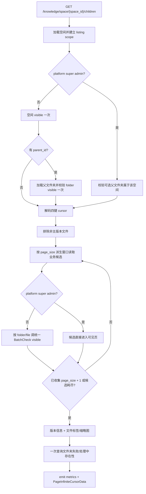
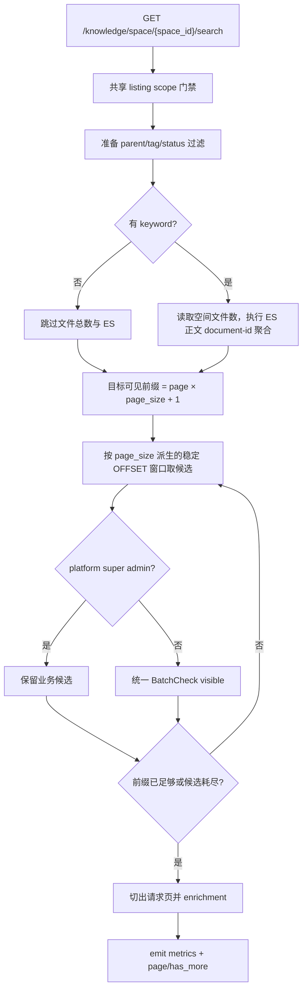

# Design: 知识空间目录与搜索读取优化

> **本文档定位 — 现状快照（Why this How）**
>
> - [spec.md](./spec.md) 回答做什么；本文回答为什么采用下面的实现。
> - 本文覆盖当前实现完成后的目标状态；实现若改变关键决策，必须先按 SDD 偏差规则重新确认。
> - 文件锚点以函数名为准，行号会随同分支改动漂移。

**关联**: [spec.md](./spec.md) · [tasks.md](./tasks.md)（design 确认后创建）
**版本**: v3.0.0-beta1 / F049
**最后更新**: 2026-08-14
**确认状态**: spec 已于 2026-08-14 确认；design 待确认

---

## 1. 目标与非目标

- **目标**：在不改变普通用户可见集、排序与分页结果的前提下，减少 `/children` 和
  `/search` 的重复权限门禁、固定过量候选读取和文件夹后代计数，并增加可定位慢阶段的结构化指标。
  ID 已知、tenant scope 已确定的访问路径同时支持 platform super admin 的系统身份策略。
- **非目标**：不新增父级可见即放行子级的继承捷径；不修改 OpenFGA model、Grant、mode 或投影；
  不把搜索迁移为真实 cursor；不重做 ES 正文检索、文件下载、预览、RAG 或重试执行逻辑；不新增表、
  migration、错误码或第三方依赖。

---

## 2. 关键约束与 Constitution Check

### 2.1 本功能特有约束

- client 文件列表当前固定请求 `page_size=80`，API 默认值仍为 20；候选窗口必须由请求页大小派生，
  但单次权限批次不得超过 OpenFGA BatchCheck 的 100 target 上限。
- `/children` 已是四键 keyset cursor；返回 cursor 必须指向最后一个**已消费候选**，不能指向最后一个
  可见项或数据库批次尾部，否则会重复或跳过权限过滤项。
- `/search` 对外仍是 `page/page_size/has_more`；第 N 页需要重放前 N 页可见前缀。这是兼容窗口，不得在
  本期用伪 cursor 改变其契约。
- `visible` 的全局 facade 仍保持 F048 OQ-09：个人列表不因管理员身份扩权。F049 只在调用方已给出
  `space_id`、业务 Repository 已完成 tenant/resource scope 限定的目录与搜索路径中，识别 platform
  super admin；不得把该策略扩到 `/joined`、`/department` 或其他个人枚举接口。
- 普通用户候选可见性仍由 F048 统一执行面最终判定；SQL mode、创建者或父资源结果只能帮助业务验证，
  不能提供第二个 ALLOW。
- 文件夹数字未展示，但两个派生状态仍有行为消费者：失败存在性控制文件夹/批量重试入口；处理中存在性
  控制 5 秒状态轮询。因此可以删除数量，不能把两个状态一起静默删除。
- 结构化指标不得包含 user/department/resource name、搜索词、token、Grant 主体或授权来源明细；
  `emit_metric` 失败不得影响业务请求。
- 116 环境数据仅是决策证据，不是 release-ready 性能门禁；正式验收仍需同版本、同 fixture 的前后对照。

### 2.2 Constitution Check

全局架构铁律只引用 [docs/constitution.md](../../../docs/constitution.md) C1–C7，不在本文复制。

| 条款 | 结论 | 本设计的证据 |
|---|---|---|
| C1 DDD 分层 | PASS | Endpoint 只传参；编排在 `KnowledgeSpaceService`；新后代状态查询进入 `KnowledgeFileRepository`，不在 Service 新写 ORM；permission module 不读取知识空间父子表 |
| C2 MySQL + DM8 | PASS | 动态批次不依赖方言；后代状态使用 SQLAlchemy 相关 `EXISTS`，不使用 JSON、row tuple 或 MySQL 专有函数；DM8 在中央回归验证 |
| C3 多租户 | PASS | 所有业务候选仍由 tenant auto-filter 保护；super admin 只跳过权限判定，不开启 tenant bypass，不跨 tenant 枚举 |
| C4 权限统一入口 | PASS | 普通用户继续走 F048 `batch_check_business_visible`；super admin 是已确认的系统身份流程且仅限 ID-scoped 入口；不新增 SQL/继承 ALLOW 或 OpenFGA client 直连 |
| C5 错误码 | PASS | 保持既有不存在、拒绝、cursor 和权限故障错误；不新增错误码 |
| C6 安全 | PASS | 指标不记录搜索词、名称、主体或凭据；权限异常继续 fail closed |
| C7 前端边界 | PASS | client 继续通过 `~/api/knowledge.ts` 的 wrapped request；store 不发 HTTP；无新库 |

---

## 3. 方案对比与选定

### 决策 1：普通候选继续 OpenFGA BatchCheck，不新增继承捷径

- **备选**：
  - A. 父空间/文件夹可见且子资源没有 CUSTOM mode 时，由知识模块直接复用父结论。
  - B. 新增 `batch_check_visible_under_visible_parent(actor,parent,children)`，由权限模块理解父子与 mode。
  - C. 保持业务候选优先，普通用户每批候选继续走现有 F048 `batch_check_business_visible`。
- **选定**：C。
- **原因**：A 会让 SQL mode 和父级结果成为第二 PDP；B 会迫使权限模块理解知识空间业务树，破坏
  F048 的 verified-target 边界。2026-08-14 在 116 的隔离 store 串行基准中，BatchCheck 20/50/100
  的 P95 约为 12.6/29.6/48.4ms，当前规模没有证明值得承担第二判定面的复杂度。用户已明确选择不新增
  继承捷径。OpenFGA 不可用或投影非 CURRENT 时继续失败关闭。
- **何时重新考虑**：同版本真实业务 trace 显示 `permission_elapsed_ms` 稳定占端到端 P95 的主要部分，
  且页级 BatchCheck P95 超过经评审阈值时，重新做 BENCH-01；即使重审，也应优先优化 OpenFGA model/
  datastore 或通用 permission facade，而不是在知识模块本地放行。

### 决策 2：platform super admin 使用窄 ID-scoped 系统身份路径，不修改全局 visible facade

- **备选**：
  - A. 修改 F048 `check_visible/batch_check_visible`，让 super admin 对所有 visible 调用全量 ALLOW。
  - B. 仅在 `/children`、`/search` 已知 `space_id` 的业务路径识别 `UserPayload.is_global_super`；仍加载并
    校验空间、父文件夹和 tenant scope，之后跳过该路径的 visible Check/BatchCheck。
  - C. 只放行空间门禁，子候选仍做普通 visible BatchCheck。
- **选定**：B。
- **原因**：A 会推翻 F048 OQ-09，使“我加入的空间”等个人枚举扩成平台全量；C 会出现超管能打开空间
  但列表为空的半授权状态。B 把系统管理能力限定在调用方已提供具体空间 ID 的路径，业务候选仍来自该
  tenant 的空间/文件表，不产生跨 tenant 或全平台枚举。它是 C4 系统身份策略，不是父级继承捷径。
- **何时重新考虑**：若产品要求 super admin 的所有个人列表也展示全量资源，应修改 F048 OQ-09 并整体
  重审，而不是继续扩大 F049 的局部判断；若以后新增正式“平台资源管理列表”，应使用独立管理入口。

### 决策 3：新增列表专用门禁编排，不修改 `_require_folder_action` 的全局安全语义

- **备选**：
  - A. 删除 `_require_folder_action` 内部的空间检查，让所有调用方自行保证空间已校验。
  - B. 保持通用 helper 不变，为两个列表入口增加 `_require_space_listing_scope(space_id,parent_id)`：空间只
    加载/校验一次，父文件夹使用“只加载并校验自身”的路径。
- **选定**：B。
- **原因**：A 会影响移动、上传、删除、聊天等大量既有调用方，任何漏补都会形成越权；B 将去重限定在
  已审计的两个读入口。116 空间 3194 的真实搜索 trace 明确出现根目录两次 `/check`；文件夹路径按代码
  会执行空间两次加文件夹一次。B 可把普通用户根目录收敛为 1 次空间门禁，文件夹路径为 1 次空间加 1 次
  文件夹门禁；super admin 为 0 次权限 RPC，但仍做业务存在性/tenant 验证。
- **何时重新考虑**：只有在全仓完成 `_require_folder_action` 调用点证明并建立统一 verified-scope 类型后，
  才考虑重构通用 helper；不能为减少一行调用直接改变其前置条件。

### 决策 4：候选窗口按 `page_size + 1` 派生，并以 100 为硬上限

- **备选**：
  - A. 保持固定 100。
  - B. 每次只取当前还缺的可见条数，窗口可在同一搜索请求中变化。
  - C. 每个请求计算稳定窗口 `min(max(page_size + 1, 1), 100)`，同一请求的后续扫描沿用该窗口。
- **选定**：C。
- **原因**：A 对小页无条件过读；B 会让 `/search` 的 OFFSET 窗口宽度变化，批次 offset 无法稳定推导，
  也可能在只缺 1 个可见项时制造大量小 RPC。C 让 20 页读取 21、client 的 80 页读取 81，并为
  `has_more` 预留探针；超过 OpenFGA 单批上限时封顶 100。权限稀疏时仍逐批补取，直到填页或业务候选耗尽。
- **何时重新考虑**：若新指标显示极低可见率下 round trip 数过多，可在不改变结果集的前提下设计基于
  scan amplification 的自适应放大，但必须保证搜索 OFFSET 的窗口/offset 稳定并增加等价测试。

### 决策 5：搜索保留页码兼容，内部只优化窗口与无效范围准备

- **备选**：
  - A. 本期把 `/search` 与 F030 pseudo-cursor 一并迁移为真实 keyset cursor。
  - B. 保持 `page/page_size/has_more`，继续扫描到 `page × page_size + 1` 可见前缀；批次改为决策 4 的
    页大小窗口，并避免在不需要时加载整个父文件夹后代对象。
- **选定**：B。
- **原因**：A 会修改 client `useFileManager`、F030 `asearch_space_children_cursor` 和既有消费者契约，超过
  本次优化范围。B 可直接消除固定 100、重复空间门禁和无关键词/无必要交集时的后代全量加载，同时保持
  F040 已有的顺序与 `has_more` 等价测试。深页前缀重扫作为已知兼容成本进入指标，而不是被掩盖。
- **何时重新考虑**：稳定出现 `page > 10`，或 `scanned_candidates / returned_items`、深页 P95 达到告警
  阈值时，单独立项迁移真实 cursor，并一次性更新 HTTP 和 F030 wrapper。

### 决策 6：删除文件夹数量，改为一次批量存在性查询保留两个行为标记

- **备选**：
  - A. 完全删除文件夹聚合和三个字段。
  - B. 保留现有每文件夹 `COUNT + GROUP BY status`，只不展示数字。
  - C. 在 `KnowledgeFileRepository` 用一条标准 SQLAlchemy 查询，为当前页文件夹分别计算“存在可重试
    失败后代”和“存在处理中后代”；返回 `has_failed_files`、`has_processing_files` 两个布尔值，删除
    `success_file_num`、`processing_file_num`。
- **选定**：C。
- **原因**：截图和组件确认数字不展示；但 `has_failed_files` 控制文件夹/批量重试，
  `processing_file_num > 0` 控制 5 秒轮询。A 会静默删除功能；B 仍为每页 N 个文件夹执行 N 次全状态计数。
  C 将返回量固定为每文件夹一行、每状态命中后即可停止，并把 N 次 DB 往返收敛为 1 次。查询进入已有
  Repository interface/implementation，避免延续 Service 内 ORM。
- **何时重新考虑**：若 DM8 实测相关 `EXISTS` 计划不佳或 folder-heavy P95 仍由该阶段主导，基于真实
  EXPLAIN 评估状态物化；不得在无证据时新增冗余列或写路径维护。

### 决策 7：终端请求指标 + 权限扫描指标双层观测

- **备选**：
  - A. 仅依赖 middleware `HTTP_ACCESS_METRIC` 总耗时。
  - B. 在每个步骤打印自由文本日志。
  - C. 保留/补齐 `permission_visible_list` 扫描指标，并新增每请求一次的
    `knowledge_space_read` 结构化终端指标；两者由同一个 trace 关联。
- **选定**：C。
- **原因**：A 无法回答慢在权限、ES、DB 还是 enrich；B 难聚合且容易泄露搜索词/名称。当前 children 的
  `permission_visible_list` 只有数量、没有阶段耗时，search 连该指标都没有。C 复用 F042 `emit_metric`，
  可聚合 P95，也能在失败时记录已完成阶段和 `failed_stage`；指标失败由现有 best-effort 机制隔离。
- **何时重新考虑**：若后续接入正式 tracing/OTel，可把同字段迁入 span，但必须保留日志 pipeline 的兼容
  窗口和字段语义，不能重新退化成只有总耗时。

---

## 4. 系统现状（实现后的目标快照）

### 4.1 `/children` 数据流



关键锚点：

1. Endpoint：`knowledge/api/endpoints/knowledge_space.py:list_space_children`。
2. 门禁：`KnowledgeSpaceService._require_space_listing_scope`（新增，两个接口共享）。
3. 扫描：`_scan_visible_child_items`；窗口由 `_candidate_scan_batch_size(page_size)` 计算。
4. 普通权限：`_filter_visible_child_items` → `batch_check_business_visible`；super admin 分支不调用它。
5. enrichment：`_enrich_with_version_info` + 重构后的 `_handle_file_folder_extra_info`。

游标仍编码四键：

```text
(file_type, extension_rank, update_time, id)
```

`next_cursor` 使用最后一个已消费候选的键；探测到第 `page_size + 1` 个可见项时，该探针本身不消费，
返回 cursor 仍停在上一已消费候选，从而下一页能够返回该探针项。

### 4.2 `/search` 数据流



搜索范围准备规则：

- `parent_id` 总是先验证父文件夹；数据库候选始终带 `file_level_path` 范围条件。
- 仅 parent/status 搜索不再为父文件夹加载全部后代对象。
- tag-only 搜索把 tag resource IDs 直接交给数据库，并由 `space_id + file_level_path` 完成范围交集。
- keyword 正文搜索若需要把 parent/tag 范围推进 ES，只读取必要的后代 ID 投影，不加载完整文件对象。
- 文件名 `LIKE` 与 ES 正文 document IDs 的并集语义、10,000 terms ceiling 和截断 warning 保持不变。
- 搜索窗口宽度在单请求内固定，DAO 继续使用 `id_tiebreaker=True`；第 N 页仍从第 1 窗口重放，这是已登记
  的兼容成本。

### 4.3 文件夹状态与文件 enrichment

当前页按类型分流：

- 文件：保持 tags、thumbnail share link、`version_no`、`is_multi_version`、`has_similar`。
- 文件夹：Repository 对本页 folder IDs 执行一次查询，每个文件夹返回：
  - `has_failed_files: bool`：后代存在 `FAILED` 或 `VIOLATION` 文件；
  - `has_processing_files: bool`：后代存在 `PROCESSING`、`WAITING` 或 `REBUILDING` 文件。
- 删除：`success_file_num`、`processing_file_num`。前端不展示数字，且轮询改读
  `hasProcessingFiles`，重试继续读 `hasFailedFiles`。

### 4.4 候选扫描伪代码

```text
batch_size = min(max(page_size + 1, 1), 100)
target_visible = page_size + 1                         # children
target_visible = page * page_size + 1                  # search

while visible_count < target_visible:
    candidates = fetch_next_stable_batch(batch_size)
    if candidates is empty: break
    visible += candidates if system_scope else batch_check_visible(candidates)
    if len(candidates) < batch_size: break

return requested_slice, has_more, resume_position
```

普通用户一次业务候选批次最多产生两个 OpenFGA BatchCheck（folder、knowledge_file 各一）；保持顺序执行，
本期不额外并发压 OpenFGA。super admin 的 `permission_batch_count=0`。

### 4.5 结构化指标契约

每个 `/children`、`/search` 请求最多各发一条终端指标：

```text
BS_METRIC domain=knowledge_space_read
  operation=children|search
  scope=root|folder
  outcome=success|error
  system_scope=0|1
  page_size=<int>
  page=<int, search only>
  candidate_batch_size=<int>
  candidate_count=<int>
  visible_count=<int>
  returned_count=<int>
  scan_batch_count=<int>
  permission_batch_count=<int>
  scan_amplification=<float>
  has_more=0|1
  gate_elapsed_ms=<float>
  scope_prepare_elapsed_ms=<float>
  search_engine_elapsed_ms=<float, search only>
  candidate_db_elapsed_ms=<float>
  permission_elapsed_ms=<float>
  version_elapsed_ms=<float>
  folder_state_elapsed_ms=<float>
  file_enrich_elapsed_ms=<float>
  enrich_elapsed_ms=<float>
  total_elapsed_ms=<float>
  failed_stage=<enum, error only>
```

`permission_visible_list` 同时覆盖 children/search 的扫描级数据，至少包含 `operation`、candidate/visible/
returned、scan batches、permission batches、DB/FGA elapsed、amplification、stream completed、has_more。
日志由现有 loguru context 自动带 `trace=<id>`，不在业务指标重复提取请求头。

失败路径在 `finally` 发终端指标后原样抛出；`failed_stage` 只能取固定枚举：
`gate/scope_prepare/search_engine/candidate_scan/version_enrich/folder_state/file_enrich/response`，不能写异常消息。

### 4.6 对外字段契约

#### `/children`

请求保持：`parent_id`、`file_ids[]`、`order_field`、`order_sort`、`file_status[]`、`page_size`、`cursor`、
`file_type`。

响应保持：

```json
{
  "data": [],
  "page_size": 80,
  "has_more": false,
  "next_cursor": null
}
```

#### `/search`

请求保持：`parent_id`、`page`、`page_size`、`order_field`、`order_sort`、`tag_ids[]`、`file_status[]`、
`keyword`。

响应保持：

```json
{
  "page": 1,
  "page_size": 80,
  "data": [],
  "has_more": false
}
```

#### 文件夹条目字段变化

| 字段 | 目标状态 | 消费者 |
|---|---|---|
| `has_failed_files: bool` | 保留，始终明确返回 | `FileCard`、`FileTable`、`SpaceDetail` 重试入口 |
| `has_processing_files: bool` | 新增，始终明确返回 | `knowledgeUtils.isKnowledgeItemPending`，决定 5 秒轮询 |
| `success_file_num` | 删除 | 无展示消费者 |
| `processing_file_num` | 删除 | 被 `has_processing_files` 替代 |

字段只对 folder 有意义；file 条目的现有字段不变。client TS 映射继续把 snake_case 转为 camelCase。

### 4.7 关键模块职责

| 模块 / 文件 | 做什么 | 不做什么 |
|---|---|---|
| `knowledge/api/endpoints/knowledge_space.py` | 保持两个 HTTP 路由和参数传递 | 不做权限、计时或查询编排 |
| `knowledge/domain/services/knowledge_space_service.py` | listing scope、扫描、权限编排、enrichment、终端指标 | 不新增 ORM；不读 mode 后本地放行；不直连 OpenFGA |
| `knowledge/domain/repositories/interfaces/knowledge_file_repository.py` | 声明批量文件夹后代状态和搜索范围 ID 投影契约 | 不做权限和响应拼装 |
| `.../implementations/knowledge_file_repository_impl.py` | 一次查询返回本页 folder 状态 flags；按需只投影搜索范围的后代 ID | 不决定谁可见；不加载不需要的完整文件对象；不统计成功/处理中数量 |
| `knowledge/api/dependencies.py` | 向 KnowledgeSpaceService 注入 file repository | 不创建第二 session 或跨请求缓存 |
| `open_endpoints/api/endpoints/filelib.py` | F030 `/filelib/file/list` 构造同一 Service 时注入 file repository | 不复制 children/search 编排；不改变 `writeable` 动作判断 |
| `permission/application/business_authorization.py` | 普通用户的 verified target + visible BatchCheck | 本期不新增 parent-aware API，不查询知识空间树 |
| `common/services/metric_log.py` | 格式化并 best-effort 发 `BS_METRIC` | 不聚合 P95，不持有业务字段；本期无需改动 |
| `client/src/api/knowledge.ts` | 响应字段映射与 TS contract | 不直接控制轮询/重试业务 |
| `client/.../knowledgeUtils.ts` | 用 `hasProcessingFiles` 判断 folder pending | 不恢复数量展示 |

---

## 5. 已知坑 / 反直觉事实

| # | 反直觉事实 | 如果不知道会怎样 | 在哪处理 |
|---|---|---|---|
| 1 | F048 `visible` facade 刻意不对管理员扩权；F049 的 super admin 是窄 ID-scoped 系统流程 | 直接改全局 facade 会让 `/joined` 等个人列表膨胀为平台全量 | `KnowledgeSpaceService._require_space_listing_scope` 和 scanner 的 `system_scope`；不改 `PermissionActionService.check_visible` |
| 2 | 只放行 super admin 的空间门禁不够；子候选仍按个人 visible 会让目录空白 | 出现“能进空间但看不到内容”的半授权 | listing scope 同时作用于门禁和候选过滤 |
| 3 | `_require_folder_action` 自己会再调用 `_require_read_permission` | 在外层先查空间再调它会重复空间 Check；全局删掉又会伤害其他调用方 | 两列表改用专用 listing scope；通用 helper 保持 |
| 4 | `processing_file_num` 不展示，但它驱动前端 5 秒自动轮询 | 直接删字段后，文件夹内任务状态不再自动刷新 | Repository 返回 `has_processing_files`；`knowledgeUtils.isKnowledgeItemPending` 改读布尔值 |
| 5 | `has_failed_files` 控制单文件夹和批量重试入口 | 把全部文件夹聚合一起删掉会让失败文件无法从文件夹入口重试 | 保留失败 EXISTS 语义；`FileCard/FileTable/SpaceDetail` 不改判断含义 |
| 6 | children cursor 必须停在最后“已消费”候选，而非最后 visible 或批次尾 | 否则不可见项被重复扫，或第 `page_size+1` 个可见探针被跳过 | `_scan_visible_child_items` 的 `resume_cursor` 更新顺序和回归测试 |
| 7 | search 的 cursor wrapper 只是 `[page_num]` pseudo-cursor | 误以为已有 keyset，会遗漏深页每次从头重扫的成本 | `asearch_space_children_cursor`、`_scan_visible_search_items` 指标记录 page/amplification |
| 8 | search OFFSET 分批要求同一请求窗口恒定且必须有 ID tie-breaker | 动态改变窗口宽度会造成 offset 重叠/空洞；同排序值会重复/漏项 | `_candidate_scan_batch_size` 每请求计算一次；DAO `id_tiebreaker=True` |
| 9 | parent search 当前会加载全部后代完整对象，即使没有 keyword | 大文件夹仅做 tag/status 搜索也先付出 O(subtree) 内存和 DB 成本 | scope prepare 按条件取必要 ID 投影；普通 SQL path 直接用 `file_level_path` |
| 10 | keyword 正文搜索先查空间文件总数，再让 ES terms 聚合最多返回 10,000 个 document IDs | 只看候选 DB/FGA 时间会错判 ES/范围准备瓶颈；大命中集仍可能截断 | 保持既有 warning；分别记录 scope/search engine 时间，列入 §8 |
| 11 | 一个候选批同时有 folder/file 时会产生两个权限批次 | 把 scan batch 数当 OpenFGA request 数会低估；盲目并发又会提高引擎峰值 | 指标分开记录 `scan_batch_count`、`permission_batch_count`，本期顺序执行 |
| 12 | `emit_metric` 的 trace 来自 loguru request context，指标函数本身不读 ContextVar | 手工重复写 trace 或直接打印自由文本会形成不一致字段 | 统一调用 `emit_metric("knowledge_space_read", ...)` |
| 13 | Service 目前已有历史 ORM，但 C1 禁止为新功能继续添加 | 为方便把 EXISTS 写回 `_handle_file_folder_extra_info` 会扩大分层债务 | 新查询进入 `KnowledgeFileRepository` 并由 DI 注入 |
| 14 | 116 的 `HTTP_ACCESS_METRIC` 只证明总耗时；当前 search scanner没有同 trace 的权限阶段 metric | 看到 101ms 无法判断是两个 Check、ES、BatchCheck 还是 enrich | 决策 7 的双层指标 |

---

## 6. 对外契约与依赖

### 6.1 我提供给别人的（Outgoing）

| 契约 | 形式 | 谁在用 / 风险点 |
|---|---|---|
| `GET /api/v1/knowledge/space/{space_id}/children` | HTTP cursor envelope | client `getSpaceChildrenApi`、状态轮询、空间广场预览；cursor/排序或字段变化会影响无限滚动 |
| `GET /api/v1/knowledge/space/{space_id}/search` | HTTP page/has_more envelope | client `searchSpaceChildrenApi`；F030 wrapper 依赖 `has_more`，不能恢复 exact total 或暗改 cursor |
| `GET /api/v2/filelib/file/list` 的知识空间分支 | HTTP cursor envelope + `writeable` | F030 调用 `list_space_children` 或 `asearch_space_children_cursor`；Repository 注入和 folder 字段变化必须同步覆盖 |
| `KnowledgeSpaceService.list_space_children()` | 内部 async API | HTTP endpoint、可能的内部构造调用；必须保持参数/返回 `PageInfiniteCursorData` |
| `KnowledgeSpaceService.search_space_children()` | 内部 async API | HTTP endpoint、`asearch_space_children_cursor`；early return 也必须带 `has_more` |
| `KnowledgeFileRepository.get_folder_descendant_state_flags()` | 内部 repository API（新增） | KnowledgeSpaceService enrichment；输入仅当前页 folder IDs，输出两个 bool map |
| `KnowledgeFileRepository.list_descendant_ids_for_search_scope()` | 内部 repository API（新增） | 仅 keyword + parent 等确需推进范围时投影 ID，不返回完整 KnowledgeFile |
| folder `has_failed_files/has_processing_files` | JSON 字段 | client 重试与轮询；缺失不能被解释为已确认 false |
| `BS_METRIC domain=knowledge_space_read` | logfmt 指标 | ELK/Loki/ES 聚合和 trace 排障；字段改名会破坏 dashboard/query |

### 6.2 我依赖别人的（Incoming）

| 依赖 | 形式 | 风险点 |
|---|---|---|
| F048 `batch_check_business_visible` | permission application Python API | target resolution、CURRENT fence、OpenFGA 错误语义变化会影响普通用户；不得捕获后 fail-open |
| `UserPayload.is_global_super` | 认证阶段预解析 identity | 字段必须来自可信登录初始化；测试 fixture 未设置时按 false，不回查 RBAC/业务表 |
| OpenFGA BatchCheck ≤100 | 外部服务/API 契约 | 上限或 pinned version 变化需重跑 BENCH；不能把 HTTP 200 当完整语义以外的业务事实 |
| F027 `common/cursor.py` + keyset helper | 内部模块 | cursor context/key 数变化会使旧 token 失效；本期不改编码 |
| F040 search batch-scan contract | 内部算法 + tests | `id_tiebreaker`、fetch/filter/slice 等价和 early stop 不能倒退 |
| `KnowledgeDocumentVersionRepository` | 内部 Repository | 非主版本排除与版本字段；未注入时当前 warning 行为保持 |
| TagDao batch tags / tag resource IDs | DB API | tag ID 跨空间集合必须继续由业务 `space_id`/path 收窄 |
| ES `metadata.document_id` terms aggregation | Elasticsearch mapping | mapping 或 10k bucket 语义变化会影响正文命中集合；必须保留截断观测 |
| F042 `emit_metric` | 结构化日志 API | best-effort、未知 domain 默认启用；若监控开关策略改变要验证新 domain 仍采集 |
| client `useFileManager` | React 本地状态 | page size 当前 80；search page 和 children cursor 是两套状态机，不能混用 token |

### 6.3 领域邻接声明

- F049 读取 Knowledge/KnowledgeFile 业务事实，不创建或修改 F048 Grant、mode、projection 或 OpenFGA tuple。
- permission module 不接收 parent tree、space descendant 或 tag/tenant 业务查询；它只处理普通用户 verified targets。
- super admin scope 不写权限事实、不伪造 Grant，不改变个人资源枚举；它只影响两个已知 ID 的知识空间读入口。
- 文件夹重试执行仍归 `batch_retry_failed_files`；F049 只保留入口所需的状态标记，不重构任务展开与权限动作。

---

## 7. 测试与可观测

### 7.1 自动化策略

- **单元/服务测试**：
  - 普通 root：空间 visible 恰好 1 次；普通 folder：空间 1 次 + folder 1 次；deny/error 不变。
  - platform super admin：仍验证空间/文件夹业务归属，权限 RPC 为 0；不能跨 tenant，不能影响个人列表。
  - children/search 的首批大小分别随 20、80、>100 页大小变化；稀疏可见时补批，候选耗尽正确结束。
  - children cursor 多页无重复/遗漏；search 各页结果与“全候选→权限过滤→切片”oracle 一致。
  - search keyword/tag/parent/status、ES+文件名并集、非主版本排除保持。
  - 成功、early return、权限异常、ES 异常均只产生一条终端 metric；错误原样传播且指标不含 keyword/name。
- **Repository/双库契约测试**：
  - 当前页多个文件夹只调用一次 Repository；失败/处理中/空后代的两个 bool 正确。
  - SQLAlchemy 表达式做 MySQL 编译测试；真实 DM8 由中央回归执行，重点检查相关 EXISTS 和 path LIKE。
- **client 组件/纯函数测试**：
  - folder `hasProcessingFiles=true` 时 pending、false 时不轮询；`hasFailedFiles` 重试入口保持。
  - raw mapper 不再依赖数值字段；children/search 两种 envelope 均映射新 bool。
- **E2E**：按 `/e2e-test features/v3.0.0-beta1/049-knowledge-space-children-read-optimization` 生成并执行 API
  端到端覆盖；页面人工验证根目录、子文件夹、keyword/tag 搜索、无限加载、失败重试和处理中轮询。

### 7.2 确定性性能断言

| 场景 | 改造前 | 设计目标 |
|---|---:|---:|
| 普通 root 空结果的空间 visible | 2 次 Check | 1 次 Check |
| 普通 folder 门禁 | 空间 2 次 + folder 1 次 | 空间 1 次 + folder 1 次 |
| super admin listing 权限 RPC | 依赖个人 visible，可能拒绝/为空 | 0；但业务空间/tenant/folder 验证保留 |
| 首批候选，`page_size=20` | 100 | 21 |
| 首批候选，client `page_size=80` | 100 | 81 |
| 当前页 N 个文件夹后代状态 DB 往返 | N 次 COUNT/GROUP BY | 1 次 EXISTS flags 查询 |
| search 分段 metric | 无 | 1 terminal + permission scanner metric，同 trace |

端到端不以单次请求作门禁。同一 fixture、同一镜像预热后各执行 3 次 warmup + 30 次采样，报告 P50/P95/P99、
candidate/permission batch、DB/FGA/ES/enrich 分段。以 116 的 2026-08-14 只读观察作为基线参考：空间 3194
`page_size=80&keyword=m` 约 101.1ms；两个无结果关键词约 79.2ms、68.4ms。该样本太小，不宣称正式 P95。

### 7.3 手动验证

1. 使用普通用户和 platform super admin 分别登录 client，在浏览器 Network 执行：

   ```text
   GET /workspace/api/v1/knowledge/space/{space_id}/children?page_size=80
   GET /workspace/api/v1/knowledge/space/{space_id}/search?page=1&page_size=80&keyword=<test>
   ```

2. 验证普通用户结果不扩权；super admin 能浏览已知空间，但“我加入的空间”列表不扩大。
3. 进入含失败文件的文件夹验证重试入口；进入含处理中后代的文件夹，观察每 5 秒刷新直到终态。
4. 后端按 trace 查询：

   ```bash
   docker logs --since 10m <backend-container> 2>&1 | grep -E "knowledge_space_read|permission_visible_list|HTTP_ACCESS_METRIC"
   ```

5. 本地定向测试（cwd=`src/backend/`）：

   ```bash
   uv run pytest test/knowledge/test_file_visible_candidate_pagination.py \
     test/knowledge/test_f040_search_batch_scan.py \
     test/knowledge/test_knowledge_space_read_optimization.py
   ```

6. client 定向测试和完整质量门从 `src/frontend/` 执行；最终命令由 tasks 按现有 package scripts 固化。

### 7.4 告警与排障顺序

- `outcome=error` 或 permission engine error：先按 `failed_stage` 与同 trace 的 permission decision 排查；保持 fail closed。
- `scan_amplification > 10`：检查用户可见率、filter 选择性和 deep search page；不能直接扩大 batch 或跳权限。
- `permission_elapsed_ms / total_elapsed_ms` 高：对照 OpenFGA metrics/request ID；必要时重跑 BENCH-01。
- `search_engine_elapsed_ms` 高：检查 ES terms 命中量、10k 截断和 index；不要误判为 OpenFGA。
- `folder_state_elapsed_ms` 高：检查 folder-heavy 页及相关 EXISTS plan，分别在 MySQL/DM8 EXPLAIN。
- `candidate_db_elapsed_ms` 高：检查 path/status/filter 选择性和 search 深页，不通过新增未验证索引猜修。

---

## 8. 后续改进 / 本期不做

- **search 真实 cursor**：深页仍重放可见前缀；因需要同时迁移 HTTP、client 和 F030 wrapper，本期不做。
  常态 `page>10` 或深页 scan amplification 告警后另立 feature。
- **ES 正文候选流式化**：当前 terms 聚合仍可能生成最多 10k IDs，并先查文件总数。本期只拆指标和避免
  不必要的 subtree 对象加载；若 `search_engine_elapsed_ms` 成为主瓶颈，再评估 composite agg/search_after。
- **OpenFGA 继承捷径**：已否决；只有正式业务 trace 和 BENCH-01 证明必要时重审，不能直接恢复
  `batch_check_visible_under_visible_parent` 提案。
- **folder 状态物化**：会把读成本转移到上传、重试、移动、删除等写路径并增加一致性负担；本期使用批量
  EXISTS。只有双库 EXPLAIN 和 P95 证明仍慢时再评估。
- **并行 folder/file BatchCheck**：最多两个并发可能降低单请求延迟但提高 OpenFGA 峰值；先通过新指标确认
  是否值得，并在并发压测后单独决定。
- **通用 `_require_folder_action` 重构**：影响面远超两个接口；本期用专用 listing scope，不扩大改动。

---

## 修订历史

| 日期 | 改动 | 触发原因 |
|---|---|---|
| 2026-08-14 | 初版：children/search 共用窄 scope、页大小候选窗口、文件夹状态 flags、双层指标 | spec 确认后进入 design |
