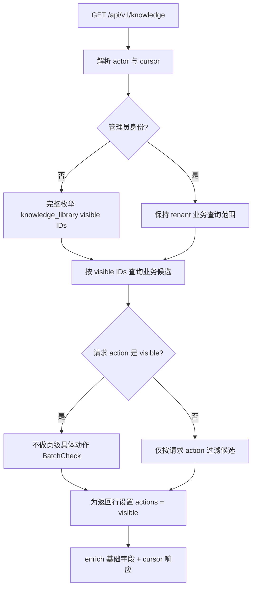
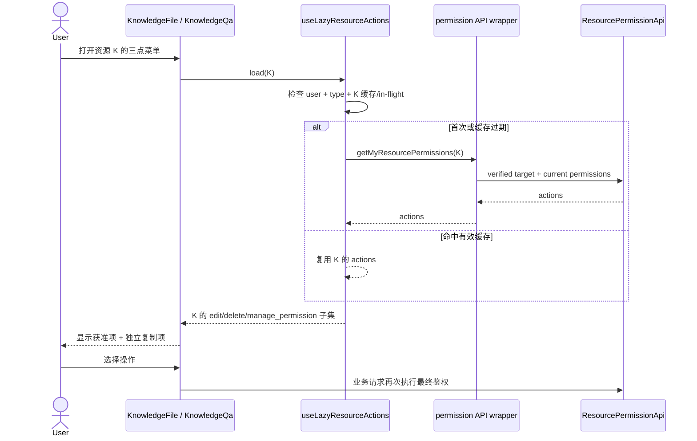

# Design: F051 知识库列表动作权限懒加载

> **本文档定位 — 现状快照（Why this How）**
>
> - [spec.md](./spec.md) 回答做什么；本文回答为什么采用下面的实现。
> - 本文覆盖实现完成后的目标状态；关键决策若被推翻，必须按 SDD 偏差规则重新确认。
> - 文件锚点以函数名为准，行号会随分支变化。

**关联**: [spec.md](./spec.md) · [tasks.md](./tasks.md)（design 确认后创建）
**版本**: v3.0.0-beta1 / F051
**最后更新**: 2026-08-25
**确认状态**: spec、design 已于 2026-08-25 确认

---

## 1. 目标与非目标

- **目标**：把知识库列表从“返回每行完整动作集合”收敛为“只返回已确认的 `visible`”，并把
  `edit/delete/manage_permission` 的读取推迟到用户打开某一行三点菜单时。文档库和 QA 库共享同一
  行为，`action=use` 等资源选择器仍保持原有筛选结果。
- **非目标**：不修改 F048 Catalog、Grant、mode、OpenFGA model 或投影；不新增权限端点；不改变复制
  规则、具体业务操作的最终鉴权、其他资源列表或知识空间文件目录；不在本期重构两个大型知识库列表组件。

---

## 2. 关键约束与 Constitution Check

### 2.1 本功能特有约束

- `GET /api/v1/knowledge` 同时服务平台文档/QA 列表、工作流节点知识库选择器、工作台组织知识库配置、
  通用知识库选择组件和 `/api/v2/filelib` wrapper。移除动作装饰不能改变这些调用方的资源集合、排序、
  cursor 或 `has_more`。
- 普通用户的候选范围先由完整 `visible` ID 枚举确定；`action != visible` 时仍需逐候选检查请求动作。
  “不装饰动作”不能被误写成“跳过选择器的 `use` 过滤”。
- 平台知识库列表当前直接读取行内 `actions` 决定三点入口和菜单项。后端先单独改成最小 actions 会让
  无 `create_knowledge` 菜单能力的协作者失去三点入口，因此后端与两个列表页面必须同批交付。
- 单资源动作读取必须使用 F048 当前权限执行面并失败关闭。列表 `visible`、前端角色名或菜单能力都不能
  推导 `edit/delete/manage_permission`。
- `create_knowledge` 是菜单/API 能力；复制还要求目标行已可见并处于可复制状态。它与 F048 `edit` 解耦，
  本功能不能顺手改成由懒加载 actions 控制。
- 已打开菜单的动作结果只是 UI 快照。更新、删除、Grant 变更等具体请求必须继续执行服务端最终鉴权。
- 懒加载必须按 `user_id + resource_type + resource_id` 隔离缓存，并防止迟到请求覆盖另一行当前菜单。
- 不新增前端库；新用户文案必须同时提供 zh-Hans、en-US、ja。

### 2.2 Constitution Check

全局架构铁律引用 [docs/constitution.md](../../../docs/constitution.md) C1–C8，不在本文复制。

| 条款 | 结论 | 本设计的证据 |
|---|---|---|
| C1 DDD 分层 | PASS | 后端只调整 `KnowledgeService` 的列表编排，不新增 ORM/DAO；既有 Endpoint 与 DAO 责任不变 |
| C2 MySQL + DM8 | PASS | 不新增或修改 SQL、表、字段、索引及方言表达式 |
| C3 多租户 | PASS | 列表候选和单资源目标继续使用既有 tenant 自动过滤与业务 adapter 校验，不增加 tenant bypass |
| C4 权限统一入口 | PASS | 列表筛选继续走 F048 facade；懒加载复用 F048 单资源权限读取；不直连 OpenFGA、不从 SQL/角色名补 ALLOW |
| C5 错误码 | PASS | 复用现有列表和权限错误响应，不新增错误码 |
| C6 安全 | PASS | 不记录资源名称、主体、Grant 来源或凭据；权限读取失败不暴露授权菜单 |
| C7 前端边界 | PASS | HTTP 仍位于 `controllers/API/permission.ts`，组件通过共享 hook 调用；Zustand store 不发请求 |
| C8 本地文件状态 | PASS | 缓存仅为浏览器进程内短期 UI 优化，不是服务端权限真相或跨进程共享状态 |

---

## 3. 方案对比与选定

### 决策 1：列表只装饰 `visible`，筛选动作与返回动作分离

- **备选**：
  - A. 列表继续返回 `visible/use/edit/delete/manage_permission`，仅优化后端批处理实现。
  - B. 列表完全移除 `actions` 字段。
  - C. 列表保留 `actions` 字段但固定为已确认的 `visible`；请求的具体动作只参与候选筛选，不补入返回行。
- **选定**：C。
- **原因**：A 仍让首屏承担未使用动作，违背按需目标；B 会扩大响应契约破坏面，并让复制规则失去现有
  可见标记。C 保持字段形态与 `visible` 业务语义，同时使 `action=visible` 不再发起页级 BatchCheck；
  `action=use` 仍只为筛选支付必要的一次动作检查，不再追加五动作装饰。
- **何时重新考虑**：若所有消费者完成版本化响应迁移且不再读取 `actions`，可独立评审删除字段；不能在
  未审计 v1/v2 消费者时直接采用 B。

### 决策 2：复用单资源 `my-permissions`，不新增批量或多次 check 接口

- **备选**：
  - A. 菜单打开后并发调用三次单动作 check。
  - B. 新增“知识库菜单动作”专用端点。
  - C. 复用 `GET /permissions/resources/{type}/{id}/my-permissions`，前端只取
    `edit/delete/manage_permission`。
- **选定**：C。
- **原因**：A 每次打开仍产生多个 target resolve 与 RPC；B 建立第二套动作读取契约。现有 C 已先构造
  verified target、要求 `visible`，再返回 F048 当前有效 actions；投影正常时使用解释链，投影降级时按
  higher-consistency 具体动作检查，管理员也由服务端返回适用资源类型的有效动作全集。
- **何时重新考虑**：只有真实菜单 QPS 证明单资源完整解释成为新瓶颈，且通用权限模块设计出所有资源可复用
  的多动作决策接口时，才评审替换；不能新增 knowledge-only PDP。

### 决策 3：打开三点菜单时加载，而不是点击菜单项后加载

- **备选**：
  - A. 先固定显示“设置”，点击后再检查是否允许。
  - B. 每行渲染时立即请求完整 actions。
  - C. 每行始终保留三点触发器，打开时加载该行 actions，加载完成后展示获准菜单项。
- **选定**：C。
- **原因**：A 会向无权限用户泄露/展示未经确认入口，且无法决定权限管理和删除项；B 只是把 N 行后端
  放大搬到前端。C 与用户确认的交互一致，把成本限定为真正打开的单个资源，并可在加载期明确禁用菜单项。
- **何时重新考虑**：若产品改为行内固定独立按钮，应逐按钮定义入口可见策略并重新确认 spec；不能由前端
  角色名预测。

### 决策 4：扩展共享权限 hook 的 imperative 懒加载能力，复用已有请求去重和 60 秒缓存

- **备选**：
  - A. 在 `KnowledgeFile.tsx` 与 `KnowledgeQa.tsx` 各自直接请求并维护缓存。
  - B. 把现有 eager `useResourceActions` 挂到每行。
  - C. 在 `useResourceActions.ts` 增加 `useLazyResourceActions`，复用按用户/资源隔离的 60 秒缓存和 in-flight
    Promise 去重，但只由显式 `load(resourceId)` 触发。
- **选定**：C。
- **原因**：A 会复制竞态、错误与缓存策略；B 会在列表渲染时立刻请求全部行，重新制造 N 次调用。C 保留
  已有跨页面缓存键与并发去重，又把触发时机改成显式菜单事件。新 lazy hook 不沿用 eager hook 的前端
  `role === admin` 直接填满动作分支，管理员首次打开也通过服务端单资源契约取得适用动作。
- **何时重新考虑**：若权限变更需要菜单零缓存即时刷新，可为通用 hook 增加显式 invalidate，并在 Grant
  mutation 成功后调用；具体操作的安全性当前不依赖缓存，因为服务端仍最终鉴权。

### 决策 5：按资源保存结果并以当前 open id 渲染，迟到结果不驱动菜单切换

- **备选**：
  - A. 只维护一个 `currentActions` 数组。
  - B. 维护 `actionsByResourceId`、`loadingByResourceId` 和当前打开 id；菜单只读取自身 key。
- **选定**：B。
- **原因**：A 在快速 A→B 切换时会让 A 的迟到结果短暂显示到 B。B 让请求结果天然落到资源自己的槽位；
  关闭菜单只清当前 open 状态，不取消或误应用其他资源结果。缓存 key 还包含用户，切换账号不会串权。
- **何时重新考虑**：若统一请求层支持可靠 cancellation，可减少无用网络工作；即使取消，也仍要保留按资源
  归属检查，因为响应可能在取消前完成。

### 决策 6：操作列始终为可见行保留，处理中状态维持既有禁用行为

- **备选**：
  - A. 继续根据列表 `actions` 判断是否渲染操作列。
  - B. 有可见行时保留操作列；普通行显示三点触发器，处理中行继续显示 spinner 且不发动作请求。
- **选定**：B。
- **原因**：最小列表 actions 无法预知某行是否有管理动作，A 会让入口消失。B 提供统一懒加载入口，同时
  不改变复制中/未发布状态的既有禁用反馈。加载成功后若无授权菜单项且不满足复制条件，菜单展示只读的
  “无可用操作”状态，避免空浮层。
- **何时重新考虑**：若设计系统提供可访问性更好的专用异步菜单组件，可替换当前 Select 模拟菜单；行为
  契约不变。

---

## 4. 系统现状（实现后的目标快照）

### 4.1 知识库列表后端数据流



关键锚点：

1. Endpoint：`knowledge/api/endpoints/knowledge.py:get_knowledge`，参数与响应 envelope 不变。
2. 编排：`KnowledgeService.get_knowledge` 保留 visible-first、cursor 和 admin tenant-scope 分支。
3. 必要筛选：`action != "visible"` 时继续调用
   `KnowledgePermissionService.get_knowledge_action_map_async(..., [action])`。
4. 返回装饰：不再调用 `_KNOWLEDGE_LIST_ACTIONS` 的全动作页级查询；直接给已返回行传入只含
   `visible` 的 action map，再由 `aconvert_knowledge_read` 组装 `KnowledgeRead`。
5. `/api/v2/filelib` 继续调用同一 Service，因此自动获得相同最小 actions 与不变的资源筛选结果。

### 4.2 平台三点菜单懒加载数据流



页面行为：

- `KnowledgeFile.tsx` 与 `KnowledgeQa.tsx` 传入稳定的菜单动作集合
  `edit/delete/manage_permission`。
- 每个可见普通行都有三点触发器；`onOpenChange(true)` 先设置当前行，再触发 `load(id)`。
- 加载中 SelectContent 只显示 disabled loading item；成功后只按该行结果渲染权限管理、设置、删除。
- 复制项不读取 lazy actions，继续由 `create_knowledge + visible + Published` 决定。
- 请求失败由 hook 返回 error；页面关闭当前菜单并使用 permission namespace 的既有失败提示，不保留未经
  确认的动作。
- 复制中、未发布等处理中行保留 spinner 与既有禁止打开行为，不触发 lazy load。

### 4.3 关键数据结构 / 字段约定

| 字段 / 结构 | 类型 / 格式 | 目标语义 | 消费方 |
|---|---|---|---|
| 知识库列表行 `actions` | `list[str]` | 返回行固定只含已确认的 `visible`；不得再用作管理菜单全集 | platform 列表、选择器、v2 filelib |
| 列表请求 `action` | string，现有默认 `use` | 只决定候选是否需要具体动作过滤；不决定返回行装饰全集 | v1/v2 调用方 |
| 单资源 `my-permissions.actions` | `string[]` | 当前用户对该 verified resource 的有效具体动作 | lazy hook、既有权限 UI |
| lazy cache key | `user_id + resource_type + resource_id` | 隔离用户与资源；TTL 60 秒 | `useResourceActions.ts` 内部 |
| lazy 页面状态 | resource id → actions/loading/error | 结果归属于发起查询的资源 | KnowledgeFile / KnowledgeQa |

### 4.4 关键模块职责

| 模块 / 文件 | 职责 | 不做什么 |
|---|---|---|
| `knowledge_service.py:get_knowledge` | 可见候选、请求动作筛选、最小 action map、分页响应 | 不查询 OpenFGA client，不改变 Grant/模型 |
| `business_authorization.py` | 保持通用具体动作批量判定 | 不为 F051 新增知识库特例 |
| `permission/application/resource_api.py:get_my_permissions` | 单资源 verified target 的当前权限读取 | 不接受前端伪造 tenant/状态，不读取 knowledge ORM |
| `controllers/API/permission.ts` | 现有单资源权限 HTTP wrapper | 不持有页面状态 |
| `useResourceActions.ts` | eager/lazy 两种动作读取、缓存、in-flight 去重、错误状态 | 不在 render 时为 lazy 调用发请求，不授权最终业务操作 |
| `KnowledgeFile.tsx` / `KnowledgeQa.tsx` | 菜单触发、加载态、按行渲染和既有操作编排 | 不直接发 HTTP，不用角色名推导资源动作 |

---

## 5. 已知坑 / 反直觉事实

| # | 反直觉事实 | 如果不知道会怎样 | 在哪处理 |
|---|---|---|---|
| 1 | 当前三点入口本身由完整行 actions 决定 | 只改后端后，普通协作者的设置/删除/权限入口全部消失 | 两个列表始终为可见行保留操作列与触发器 |
| 2 | `action=use` 被多个选择器用于过滤，不只是响应装饰 | 一刀切删除所有动作检查会把仅 visible、不可 use 的库放入工作流/工作台选择器 | `get_knowledge` 保留请求动作过滤，移除的只是最终全动作装饰 |
| 3 | `_KNOWLEDGE_LIST_ACTIONS` 还被非列表默认转换路径使用 | 删除常量或全局改变 `aconvert_knowledge_read` 会影响详情/旧同步调用方 | F051 只在 `get_knowledge` 显式传最小 action map |
| 4 | eager `useResourceActions` 在 effect 中自动加载所有传入 IDs | 把它直接挂到列表会从后端五动作放大变成前端 N 个单资源请求 | 新增显式 `useLazyResourceActions.load(id)`，不改变 eager 消费者 |
| 5 | eager hook 对 `user.role === admin` 有前端全动作短路 | 复用该分支会跳过用户确认的“打开后查询”，也可能返回不适用于资源的动作 | lazy hook 直接走单资源服务端契约，服务端处理管理员身份 |
| 6 | 复制权与 F048 `edit/use` 解耦 | 用 lazy actions 控制复制会回退既有产品语义 | 继续使用 `create_knowledge + visible + Published` |
| 7 | 60 秒缓存可能在菜单展示层短暂陈旧 | 把菜单快照当授权会造成撤权窗口 | 所有更新/删除/Grant 请求继续服务端最终鉴权；后续可加 mutation invalidate |
| 8 | 快速 A→B 菜单切换会产生乱序响应 | 单一 currentActions 会把 A 权限显示到 B | 按 resource id 存结果，渲染只读当前 open id |
| 9 | `my-permissions` 先要求资源 visible | 已撤销全部来源或跨租户时会失败，而不是返回空动作 | 视为 fail-closed，关闭菜单并提示检查失败，不回退列表快照 |

---

## 6. 对外契约与依赖

### 6.1 我提供给别人的（Outgoing）

| 契约 | 变更 | 消费方 |
|---|---|---|
| `GET /api/v1/knowledge` | envelope、筛选、排序、cursor 不变；返回行 `actions` 从完整动作集合收敛为 `["visible"]` | platform 知识库列表、选择器、工作台配置 |
| `GET /api/v2/filelib` | 资源集合与分页不变；知识库行同步采用最小 actions | 外部 RPC 调用方 |
| `KnowledgeService.get_knowledge(...)` | 内部 Python async API；筛选参数与分页返回类型不变，`KnowledgeRead.actions` 收敛为 visible | v1 knowledge endpoint、v2 filelib wrapper |
| 平台知识库三点菜单 | 入口对可见普通行稳定存在；菜单项在单资源动作加载后出现 | platform 用户 |
| `useLazyResourceActions` | 共享 imperative hook；按资源加载动作并复用缓存/请求去重 | 文档库与 QA 库列表 |

### 6.2 我依赖别人的（Incoming）

| 依赖 | 形式 | 风险点 |
|---|---|---|
| F027 cursor 列表 | `PageInfiniteCursorData` 与 visible-first 扫描 | 不能改变资源集合、cursor、has_more |
| F048 单资源权限读取 | `/permissions/resources/{type}/{id}/my-permissions` | 权限不可判定必须失败关闭；不得 fallback |
| F048 最终动作鉴权 | 更新、删除、Grant mutation 等业务入口 | UI cache 只能影响展示，不能成为授权依据 |
| 菜单能力 | `create_knowledge` | 只控制创建/复制产品能力，不能推导 edit/delete/manage_permission |
| permission locale | zh-Hans / en-US / ja | 新 loading/empty 文案必须三语言同时交付；若已有等价 key 则复用 |

本功能不新增系统二进制、第三方服务或运行时依赖；网络依赖仍只有现有 backend 与 OpenFGA 权限运行时。

### 6.3 兼容边界

- 这是一次有意的列表响应语义收敛：仍读取列表 `actions` 作为完整管理动作集合的未知外部消费者将不再获得
  这些动作。仓内 v1 消费者已审计：只有两个知识库管理列表依赖管理动作，其余消费者只依赖资源集合。
- `/api/v2/filelib` 公开响应也会同步收敛，因此需在 API/SDD 文档中明确；若外部集成依赖完整 actions，
  应迁移到单资源权限读取，而不是恢复列表预取。
- 不新增字段、端点、错误码或数据库迁移。

---

## 7. 测试与可观测

### 7.1 自动化策略

- 后端单元测试证明：
  - `action=visible` 时返回 `actions=["visible"]`，最终 action-map 查询为 0；
  - `action=use` 时只执行候选 `use` 过滤，不执行五动作装饰，返回行仍只有 `visible`；
  - super/tenant admin 不调用权限 runtime，返回行仍只有 `visible`；
  - 空 visible 集、cursor、has_more 与原有测试保持。
- 前端 hook 测试证明：首次显式 load 才发请求、同资源 in-flight 去重、TTL 命中、不同用户/资源隔离、失败
  状态和迟到结果归属正确。
- 文档/QA 列表组件测试证明：渲染不自动查动作；打开三点后显示 loading；成功只显示获准项；失败不显示
  权限项；复制规则独立；处理中行不查询。
- E2E 覆盖普通管理者、仅查看者、管理员、权限服务失败、文档/QA 两类列表和 `action=use` 选择器回归。

### 7.2 结构化性能门禁

- `action=visible` 的知识库列表不得调用
  `get_knowledge_action_map_async`；6 行或 20 行都不得产生最终五动作 BatchCheck。
- `action=use` 只允许为候选过滤调用 `actions=["use"]`，返回页不得再出现
  `_KNOWLEDGE_LIST_ACTIONS` 调用。
- 打开菜单前，前端对 `my-permissions` 的请求数必须为 0；首次打开一行最多 1 个 in-flight 请求。
- 生产验证沿用 `[perf][knowledge.list.filter/enrich/total]` 与 `permission_visible_list` 同 trace 对照。此前 116
  普通用户 6 行 trace 为约 1.97s，其中五次页级 BatchCheck 占主要部分；目标结构是该 trace 不再出现这五次
  装饰请求。正式耗时只作同版本部署前后观测，不把旧环境数值写成固定 SLO。

### 7.3 手动验证

自动化命令：

```bash
cd src/backend
uv run pytest test/knowledge/test_knowledge_list_visible_first.py test/permission/test_f048_list_action_cost.py

cd src/frontend
pnpm --filter bisheng test -- f051KnowledgeListLazyActions
pnpm --filter bisheng lint
pnpm --filter bisheng typecheck
```

真实页面使用 platform `/filelib`。至少准备三类同租户账号：仅 visible、具备 edit、具备
manage_permission；另用平台超级管理员覆盖身份短路。浏览器 Network 过滤 `knowledge` 与
`my-permissions`，后端日志按同一 trace 检查 `knowledge.list.total` 和 OpenFGA BatchCheck 数量。

1. 普通用户打开文档库与 QA 库列表，确认首屏不触发单资源权限请求。
2. 打开某行三点菜单，确认只发该资源一次权限读取，加载后菜单与服务端 actions 一致。
3. 快速切换两行，确认菜单不串行；关闭加载中菜单，确认结果不会重新打开菜单。
4. 使用只有 visible、具备 edit、具备 manage_permission 的账号分别验证菜单。
5. 打开工作流/工作台知识库选择器，确认不可 use 的库仍不出现。
6. 撤销菜单已显示动作后执行对应操作，确认服务端拒绝且 UI 不因缓存绕过。

---

## 8. 后续改进 / 不打算做的事

- 通用 `batch_check_business_actions` 的 actions × candidates target 重复解析仍可独立优化，但 F051 通过不再
  over-fetch 已消除知识库列表主路径放大；通用优化必须单独验证所有 adapter 的 action-specific resolve。
- 60 秒动作缓存缺少 Grant mutation 后的主动失效。当前执行安全由服务端最终鉴权保证；若菜单实时一致性
  需求提升，再为共享 hook 增加资源级 invalidate，不能在页面复制一份缓存。
- 两个知识库列表组件均为大型 legacy 文件且存在重复菜单代码。本期不借性能修复做结构重构；后续可单独
  使用组件重构流程抽取共享 `KnowledgeRowOperations`，并保持 F051 测试作为行为护栏。
- 不把本方案扩展到 workflow/assistant/tool/dashboard。每个列表的消费者和入口策略不同，需基于各自 trace
  单独立项。

---

## 修订历史

| 日期 | 改动 | 触发原因 |
|---|---|---|
| 2026-08-25 | 初版：最小列表 actions + 单资源菜单懒加载 | 用户确认 F051 spec 后进入设计阶段 |
