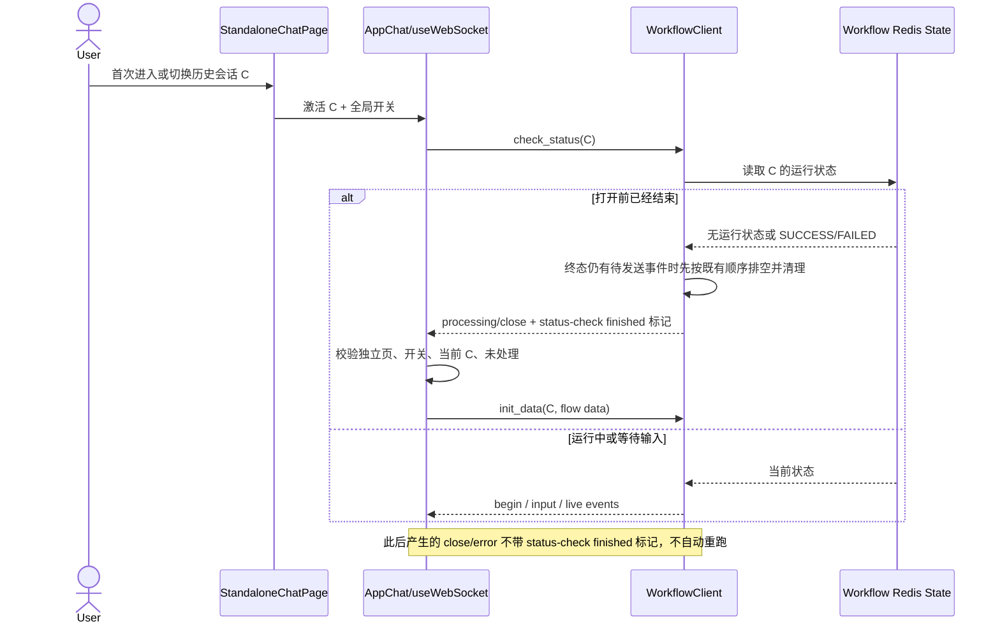

# Design: F052 工作流会话打开时自动重新运行

> **本文档定位 — 现状快照（Why this How）**
>
> - [spec.md](./spec.md) 回答做什么；本文回答为什么采用下面的实现。
> - 本文描述实现完成后的目标状态；关键决策若被推翻，必须按 SDD 偏差规则重新确认。
> - 文件锚点以函数名为准，行号会随分支变化。

**关联**: [spec.md](./spec.md) · `tasks.md`（Design 确认后创建）
**版本**: v3.0.0-beta1 / F052
**最后更新**: 2026-08-27
**确认状态**: Spec、Design 已于 2026-08-27 确认

---

## 1. 目标与非目标

- **目标**：由一个实例级系统配置统一控制工作流独立会话的打开行为；免登录和需登录访问者首次进入或
  切换历史会话时，如果服务端确认该会话在打开前已经结束，则自动沿用既有重跑链路启动一次。
- **非目标**：不建立工作流/用户/会话级配置；不监控打开后的结束或中断；不自动重试失败；不改变
  助手、应用中心、编排调试和 API 调用；不改变手动“重新运行”的业务语义。

---

## 2. 关键约束与 Constitution Check

### 2.1 本功能特有约束

- 免登录和需登录独立会话虽然路由不同，但共用 `StandaloneChatPage → AppChat → useWebSocket`；普通应用中心
  也复用 `AppChat/useWebSocket`，因此功能范围不能只靠 `flow_type=10` 判断，必须同时具备独立会话上下文。
- 两类独立会话路由都不经过 `MainLayout`；`MainLayout` 中现有的 `/api/v1/env` 加载不能为它们提供配置。
- 当前历史工作流连接先发送 `check_status`。服务端用同一个 `processing/close` 同时表达“状态检查发现此前
  已结束”和“本次连接中的运行刚刚结束”，仅凭消息类型无法满足 Spec 的时间边界。
- 新会话通过 `init_data` 启动，历史会话通过 `check_status` 恢复；自动重跑不能让无历史的新会话启动两次。
- React 重渲染、WebSocket 重连和迟到事件不能造成重复执行或跨会话执行。
- 系统配置存于既有实例级 `initdb_config`，写入后 Redis 配置缓存会失效；旧环境依赖启动时的缺失键回填，
  不能要求新增数据库迁移或人工补数据。
- 配置缺失、类型无效或读取失败时必须关闭功能；自动重跑属于可能产生外部副作用的执行行为，不能失败开放。

### 2.2 Constitution Check

全局架构约束引用 [docs/constitution.md](../../../docs/constitution.md) C1–C8，不在本文复制。

| 条款 | 结论 | 本设计的证据 |
|---|---|---|
| C1 DDD 分层 | PASS | 复用既有配置服务、`/env` 路由和工作流 WebSocket Client；不新增 ORM 查询或跨层调用 |
| C2 MySQL + DM8 | PASS | 只扩展既有 YAML/JSON 配置与 WebSocket 消息，不新增表、字段、SQL 或方言表达式 |
| C3 多租户 | PASS | 开关是已有实例级系统配置；会话访问和工作流执行继续沿用既有登录/免登录租户上下文 |
| C4 权限统一入口 | PASS | WebSocket 建连和每条消息仍由既有 `use` action 鉴权；自动触发不增加权限旁路 |
| C5 错误码 | PASS | 配置关闭、状态未命中和重复事件均是正常分支；执行失败复用既有工作流错误响应 |
| C6 安全 | PASS | 公共 `/env` 只新增无敏感性的布尔特性开关；不暴露工作流内容、身份或凭据 |
| C7 前端边界 | PASS | 配置请求继续通过 `~/api/apps.ts`；页面本地状态与既有上下文传递，不在 store 中发 HTTP |
| C8 本地文件状态 | PASS | 配置真相仍是数据库中的 `initdb_config`；前端一次打开的 guard 仅为浏览器瞬时状态 |

---

## 3. 方案对比与选定

### 决策 1：在既有系统 YAML 的 `workflow` 段新增统一布尔项

- **备选**：
  - A. 在每个 `Flow` 上新增字段，由工作流编辑页单独配置。
  - B. 新增独立配置表或租户级配置。
  - C. 在实例级 `initdb_config.workflow` 中新增 `auto_rerun_on_open`，默认 `false`。
- **选定**：C。
- **原因**：用户已明确要求系统统一开关；系统配置页本身就是实例级 YAML 编辑器，`workflow` 段也已承载
  工作流运行配置。C 不引入第二套配置真相、数据库迁移或逐资源发布逻辑，并能由现有启动回填把新键安全补到
  已安装环境。A 与需求冲突；B 为单一布尔策略引入不必要的领域对象和租户语义。
- **何时重新考虑**：只有产品明确要求不同租户或不同工作流采用不同策略时，才重新设计配置归属；不能在
  当前全局语义上偷偷叠加局部覆盖。

### 决策 2：通过公共 `/api/v1/env` 下发只读开关，并在独立页挂载会话前完成读取

- **备选**：
  - A. 让免登录页调用管理员系统配置接口。
  - B. 把完整 `workflow` 系统配置下发给浏览器。
  - C. `/env` 只增加 `workflow.auto_rerun_on_open`，独立页读取失败按关闭处理。
- **选定**：C。
- **原因**：A 对匿名用户不可用且会泄露整份 YAML；B 暴露无关运行参数。`/env` 已是免登录可读的前端环境
  契约，只公开一个无敏感布尔值即可。独立页在配置请求结束前不挂载 `AppChat`，避免历史状态检查先发生、
  开关后到达而漏触发；请求失败后立即按关闭继续渲染，不阻断会话使用。
- **何时重新考虑**：若未来建立统一、类型化且匿名可读的 feature-flags 端点，可迁移该字段；在迁移完成前
  不并存两套开关来源。

### 决策 3：服务端显式标记“状态检查发现此前已结束”，不由前端猜测

- **备选**：
  - A. 前端把历史会话连接后的第一个 `processing/close` 当成已结束。
  - B. 前端根据历史消息最后一条的 category/type 推断。
  - C. `WorkflowClient.check_status` 仅在“存在历史消息，且检查瞬间 Redis 无运行状态或状态已经是
    `SUCCESS/FAILED`”时，为本次状态检查最终发出的 `processing/close` 增加
    `message={event: workflow_status_checked, status: finished}` 标记。
- **选定**：C。
- **原因**：A 会把“打开时仍运行、随后完成”的 close 误判为自动重跑条件；B 的消息落盘类型不能可靠
  表达 Redis 工作流状态，且失败/人工停止可能共享尾消息形态。C 由掌握真实状态的服务端给出明确、附加式
  标记；旧前端仍把它当普通 close，新前端只对该标记执行一次自动动作。工作流下线产生的 close、运行期
  close 和错误事件都不带标记，因此不会触发。
- **何时重新考虑**：若工作流 WebSocket 升级为类型化状态协议，可把标记提升为专用事件类型；必须保留
  “打开前已结束”和“打开后结束”的可区分性。

### 决策 4：已结束会话直接复用 `init_data` 启动器，不先发送多余的 `stop`

- **备选**：
  - A. 自动点击现有按钮，走 `restart → stop → close callback → init_data` 全链路。
  - B. 收到明确的 finished status-check 标记后，直接使用与手动回调相同的 `init_data` 消息构造与发送函数。
- **选定**：B。
- **原因**：标记已经证明服务端 `WorkflowClient.workflow` 为空，先 `stop` 只会制造第二个 close，并扩大重复
  触发与连接竞态。B 抽取一个共享的 workflow init 发送函数：手动重跑仍先 stop，收到确认 close 后调用它；
  自动重跑直接调用它。两者使用完全相同的 flow/chat/data payload，用户可见执行结果一致。
- **何时重新考虑**：如果后端未来提供原子 `restart` 命令，应让手动和自动同时迁移；不能只替换其中一条
  路径造成行为分叉。

### 决策 5：每次会话激活使用内存 guard，且迟到事件必须匹配当前会话

- **备选**：
  - A. 依赖服务端只发一次标记，不在前端去重。
  - B. 按 chat id 永久记录已自动重跑的会话。
  - C. 在 `useWebSocket` 内维护当前激活 `{chatId, handled}`；chat id 改变时重置，触发前原子置为 handled。
- **选定**：C。
- **原因**：A 无法抵御重连、重复消息和 React effect 重跑；B 会阻止“切走后再次切回”的新打开行为，
  与 AC-10 冲突。C 的生命周期正好对应一次打开：同一激活最多一次，切换后允许新的判断；事件携带的
  chat id 与当前激活不一致时只做原有消息处理，不自动执行，避免 A→B 快速切换时 A 的迟到结果误触发。
- **何时重新考虑**：若路由层为每次会话打开提供稳定 activation id，可用显式 id 替代本地 ref；语义不变。

### 决策 6：把手动重跑回调从模块级单槽收敛为按会话隔离

- **备选**：
  - A. 保留模块级 `restartCallBack.current`。
  - B. 使用 `chatId → callback` 映射，并在会话删除/连接清理时移除。
- **选定**：B。
- **原因**：新增的历史会话切换会放大现有单槽问题：A 会让会话 B 的 close 消费会话 A 的手动重跑回调。
  B 不改变单会话行为，同时保证手动和自动运行不会跨会话串线。该调整是实现本功能竞态安全所必需的
  同链路修正，不改变已确认的业务范围。
- **何时重新考虑**：若 WebSocket 状态整体改为每会话实例对象，回调可成为实例字段；不能退回全局单槽。

---

## 4. 系统现状（实现后的目标快照）

### 4.1 配置数据流

```text
系统配置页 YAML
  → POST /api/v1/config/save
  → Config(initdb_config) + Redis 缓存失效
  → ConfigService.get_workflow_conf()
  → GET /api/v1/env: workflow.auto_rerun_on_open
  → StandaloneChatPage（读取完成后挂载 AppChat）
  → useWebSocket 的本次会话激活策略
```

1. `initdb_config.yaml` 在 `workflow` 段提供默认关闭项和运维注释；旧安装由
   `ConfigService.merge_missing_config` 只补缺失键，不覆盖管理员已有值。
2. `WorkflowConf` 对该字段进行严格的 fail-safe 布尔归一化；缺失或错误类型得到 `false`。
3. `api/v1/endpoints.py:get_env` 只下发归一化后的布尔值，不下发完整系统配置。
4. `StandaloneChatPage` 对免登录和需登录使用同一加载流程；成功读取或失败降级后才挂载活动会话。

### 4.2 会话打开与自动重跑数据流



### 4.3 关键字段与消息约定

| 字段 / 结构 | 类型 / 格式 | 目标语义 | 消费方 |
|---|---|---|---|
| `workflow.auto_rerun_on_open`（系统 YAML） | boolean，默认 `false` | 实例内所有独立工作流会话的统一策略 | `WorkflowConf` |
| `env.workflow.auto_rerun_on_open` | boolean | 浏览器可读的归一化只读策略 | `StandaloneChatPage` |
| status-check finished 标记 | `message.event=workflow_status_checked`, `message.status=finished` | 该 close 由打开时状态检查产生，且检查时已无运行状态或已处于 SUCCESS/FAILED | client `useWebSocket` |
| activation guard | `{chatId, handled}` 浏览器内存 | 当前一次打开最多消费一次标记 | client `useWebSocket` |
| workflow init payload | 既有 `action=init_data` + `chat_id/flow_id/data` | 手动回调与自动重跑共用的启动消息 | `WorkflowClient.init_workflow` |

新增 WebSocket 标记是向后兼容扩展：`category/type` 保持 `processing/close`，旧客户端忽略 `message` 的对象内容；
非状态检查 close 仍保持现状。

### 4.4 关键模块职责

| 模块 / 文件 | 职责 | 不做什么 |
|---|---|---|
| `core/config/settings.py:WorkflowConf` | 定义统一开关默认值与无效值降级 | 不按租户或工作流覆盖 |
| `initdb_config.yaml` | 在系统配置页提供默认项与说明，供旧环境自动回填 | 不保存运行态 |
| `api/v1/endpoints.py:get_env` | 向匿名/登录前端公开一个安全布尔值 | 不返回完整 workflow 配置 |
| `common/chat/clients/workflow_client.py:check_status` | 由真实 Redis 状态判定并标记“打开前已结束” | 不读取前端开关，不主动决定是否重跑 |
| `StandaloneChatPage.tsx` | 加载策略、失败关闭、在配置就绪后挂载会话 | 不监听运行结束，不直接操作 WebSocket |
| `StandaloneChatContext.tsx` | 把独立页模式和本次全局策略传给既有聊天子树 | 不持久化、不跨页面共享 |
| `useWebsocket.ts` | 识别明确标记、激活去重、共享 init 发送和按会话隔离回调 | 不从普通 close/历史消息猜状态 |
| `useChatHelpers.ts` | 为自动启动准备与手动重跑一致的运行中 UI 状态 | 不发 HTTP/WS，不决定策略 |

---

## 5. 已知坑 / 反直觉事实

| # | 反直觉事实 | 如果不知道会怎样 | 在哪处理 |
|---|---|---|---|
| 1 | 两类 standalone 路由都在 `MainLayout` 外 | 复用 `MainLayout` 的 env state 会让开关永远未加载或产生时序竞态 | `StandaloneChatPage` 自己加载并在完成后挂载会话 |
| 2 | `processing/close` 同时用于 status-check 已结束、运行完成、下线和 stop 确认 | 只看 close 会在打开后的正常结束时形成无限自动重跑 | 后端 status-check finished 标记 + 前端严格匹配 |
| 3 | 历史会话是否在运行以 Redis 状态为准，不以最后一条 DB 消息为准；残留的 SUCCESS/FAILED 也是“打开前已结束” | 从历史消息推断会误判失败、人工停止和等待输入；只判断“无 key”会漏掉尚未清理的终态 | `WorkflowClient.check_status` 单点判定，终态先排空待发送事件再发标记 |
| 4 | 新会话的 `isNew` 已会发送 `init_data` | 再套自动策略会首次启动两次 | 新会话不发送 check_status，也不消费 finished 标记 |
| 5 | 系统配置保存只校验 YAML 语法，不校验每个字段类型 | 错误类型可能让 `/env` 500 或意外开启执行 | `WorkflowConf` 字段归一化，非 boolean 一律 false |
| 6 | 已安装环境的 `initdb_config` 行不会被整份模板覆盖 | 只改模板会让老环境看不到新开关 | 复用启动时缺失子键回填并测试注释/值保持 |
| 7 | 当前手动重跑回调是模块级单槽 | 快速切换会话时，另一个会话的 close 可能消费错误回调 | 改为按 chat id 隔离并在清理时删除 |
| 8 | 自动重跑标记可能在快速 A→B 后迟到 | 不核对当前激活会在后台重跑 A，用户却正在 B | 事件 chat id 必须匹配当前 activation |
| 9 | 配置加载失败不能阻断聊天 | 把配置当硬依赖会让网络抖动导致整个独立页空白 | 请求完成后按 false 降级并继续渲染 |

---

## 6. 对外契约与依赖

### 6.1 我提供给别人的（Outgoing）

| 契约 | 变更 | 消费方 |
|---|---|---|
| 系统 YAML `workflow.auto_rerun_on_open` | 新增可选 boolean；缺失/无效为 false | 系统管理员、配置服务 |
| `GET /api/v1/env` | 响应新增 `workflow.auto_rerun_on_open: boolean` | client 独立会话页；其他消费者可忽略 |
| workflow WS `processing/close` | status-check 已结束分支的 `message` 新增明确事件对象 | 新 client；旧 client 继续按 close 处理 |
| `WorkflowConf.auto_rerun_on_open` | 内部类型化配置，非 boolean 输入归一化为 false | `/env` 配置下发与后端测试 |
| `WorkflowClient.check_status()` | 内部 Python API；对打开前终态发出带标记 close | workflow WebSocket manager |
| 手动重新运行 | 对外行为不变；内部回调改为按 chat id 隔离并共用 init 构造 | client 工作流会话 |

### 6.2 我依赖别人的（Incoming）

| 依赖 | 形式 | 风险点 |
|---|---|---|
| `ConfigService.merge_missing_config` | 启动时配置回填 | 必须继续保持“不覆盖已有值”和嵌套键注释 |
| `/api/v1/env` 匿名可读 | HTTP 契约 | 若未来加登录门禁，免登录独立页无法读取开关 |
| `WorkflowClient.check_status` Redis 状态 | 运行时真相 | Redis 状态异常/未过期时仍按“运行中”恢复，不由前端越权重启 |
| 既有 `init_data` | WebSocket 命令 | payload 形态变化时必须同步手动和自动两条调用 |
| `StandaloneChatContext` | 页面树内上下文 | 只有处于独立会话 provider 下才允许自动策略生效 |

---

## 7. 测试与可观测

### 7.1 自动化策略

- 后端配置测试：默认关闭、显式 true、错误类型关闭；模板包含新键；缺失子键回填且不覆盖既有值。
- 后端 WebSocket Client 单元测试：`check_status` 发现无状态或检查前已是 SUCCESS/FAILED 时带标记，且
  终态待发送事件先按既有顺序排空；运行中、等待输入、工作流下线和检查后才发生的结束不带该标记。
- client 单元测试：开关关闭、助手/非独立页、新会话、普通 close、重复标记、迟到会话标记均不触发；
  当前独立历史会话的首次 finished 标记只产生一个 `init_data`；切换回来形成新 activation 后可再次触发。
- client 页面测试：env 成功开启时把策略传入；env 失败/无效时仍展示页面且策略关闭；配置完成前不提前挂载会话。
- 回归：手动重新运行、运行中恢复、等待输入恢复、免登录本地历史与登录服务端历史切换保持可用。

### 7.2 手动 / E2E

1. 超级管理员在平台 `/sys` 的“系统配置”页，分别保存 `workflow.auto_rerun_on_open: false/true`；执行
   `curl -sS http://<host>/api/v1/env`，确认响应中的 `data.workflow.auto_rerun_on_open` 为对应布尔值。
2. 准备一个已结束会话和一个仍等待输入/运行中的会话；免登录使用
   `/workspace/chat/flow/<flowId>`，具备该工作流 `use` 权限的普通账号使用
   `/workspace/chat/flow/auth/<flowId>`，分别首次进入并切换历史会话。
3. 开关开启时，已结束会话每次打开只启动一次；运行中/等待输入只恢复。
4. 自动启动后分别验证正常完成、失败、手动停止和断网，页面不再次自动启动；手动按钮仍可用。
5. 快速 A→B、A→B→A 切换，确认无后台错会话执行、无重复 `init_data`。

### 7.3 可观测

- 复用现有 WebSocket 收发日志和工作流执行日志；自动与手动最终都体现为 `init_data`。
- 新增一条结构化 client debug 日志仅记录 chat id 与 auto-rerun decision，不记录消息内容、输入或文件。
- 本期不新增指标和告警；若后续需要统计自动运行次数，应由独立 telemetry 需求定义，不能通过日志文本反推。

---

## 8. 后续改进 / 不打算做的事

- 不新增图形化专用 Switch；当前系统配置页是实例级 YAML 编辑器，新键和注释即为配置入口。
- 不保存“某会话已自动运行过”的持久记录；持久化会与“再次打开可再判断”的产品语义冲突。
- 不为网络失败添加自动重试；自动重试次数、退避和副作用幂等需要独立需求。
- 不把该开关扩展到助手或普通应用中心；这些入口的启动语义不同，需分别定义。

---

## 修订历史

| 日期 | 改动 | 触发原因 |
|---|---|---|
| 2026-08-27 | 初版 | F052 Spec 确认后进入设计阶段 |
