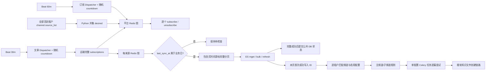

# Design: 信息源订阅对账、公共文章同步与知识空间一次投递

> **本文档定位 — 现状快照（Why this How）**
>
> - [spec.md](./spec.md) 回答做什么；本文回答为什么这样实现、运行时如何工作以及修改时的护栏。
> - [tasks.md](./tasks.md) 记录实施任务、验证证据和实际偏差。
> - 若实现推翻本文已确认的关键决策，必须更新本文并重新经过 SDD 确认门禁。

**版本**: v3.0.0-beta1 / F060

**依赖**: v2.6.0 F031、Information 同步查询协议 v1.1、既有频道知识同步能力

**最后更新**: 2026-08-25

---

## 1. 目标与非目标

**目标**：将一个部署环境的单一 Information API Key 收敛为平台级订阅集合；在上游当天真正完成采集后，以公共进度同步新增文章，并把本轮首次入库的文章按租户频道规则向知识空间异步尝试投递一次。

**非目标**：不支持多 Key 或跨部署共享 Key，不同步存量文章的修改/删除，不建设知识空间镜像、delivery/outbox、投递重试或历史回补，也不新增页面、对外 HTTP API 和业务错误码。

---

## 2. 关键约束与 Constitution Check

### 2.1 本功能特有约束

- 部署级 `base_url + api_key` 唯一；多个部署共享同一 Key 属于不受支持的配置，锁只协调同一部署的多个进程和节点。
- 频道、知识同步配置、知识空间和知识文件保持租户隔离；远端订阅意图、来源展示目录、文章 ES 文档和文章同步进度是平台公共数据。
- 上游业务错误可能位于 HTTP 200 响应体中；所有请求必须同时检查 HTTP 状态和业务 `code`。
- `/information/subscriptions` 必须读完全部分页；文章接口按 `create_time DESC, id DESC` 稳定排序，增量条件是 `min_create_time >=`，时间字段是 Unix 秒。
- 订阅和公共文章只要求周期最终一致。知识投递是一次、尽力而为的业务尝试，失败不自动重试；ES 成功与 Celery 消息发送之间的崩溃漏投窗口明确接受。
- 首次公共文章同步默认最新 20 篇，可配置为 `1～100`；相同 `create_time` 边界宁可多取，不能为了严格数量截断而漏取。
- 多节点共享状态只能落在 MySQL/DM8、Redis、ES 或 MinIO，不能依赖节点本地文件。
- 版本级领域归属与不变量以 [release-contract.md](../release-contract.md) 的 F060 / INV-29 为准；全局架构铁律统一遵循 [docs/constitution.md](../../../docs/constitution.md) C1～C8。

### 2.2 Constitution Check

| 条款 | 结论 | 本设计落点 |
|---|---|---|
| C1 | PASS | Celery Worker 只负责任务、锁和 tenant Context；算法在 Domain Service，SQL 在 Repository，外部 HTTP 在 `core/external` Client。 |
| C2 | PASS | 新表仅用通用列类型和 `UPDATE_TIME_SERVER_DEFAULT`；频道来源集合在 Python 求并集，不新增 MySQL JSON 函数。 |
| C3 | PASS | 租户数据通过逐租户 Context 读取，不手写 `tenant_id` 条件；公共表不声明 `tenant_id`。 |
| C4 | PASS | 知识文件创建继续使用配置创建人的真实身份和既有 `ChannelService.add_articles_to_knowledge_space()` 鉴权链，不使用系统管理员绕过。 |
| C5 | PASS | 无新对外错误响应和错误码；后台结果使用结构化状态与指标。 |
| C6 | PASS | API Key 仅来自系统配置，日志、指标、任务参数和异常样本均不携带 Key。 |
| C7 | N/A | 无前端改动。 |
| C8 | PASS | 公共进度在 DB、互斥在 Redis、文章在 ES、文件在 MinIO；无跨进程本地文件状态。 |

---

## 3. 方案对比与选定

### 决策 1：由周期对账统一写远端订阅

- **备选**：
  - A. 频道创建/编辑同步订阅，周期任务只补偿 — 请求链路与完整快照可能并发改变远端集合，仍把用户操作绑定到上游可用性和额度。
  - B. 每租户或每 API Key 分组独立对账 — 与单部署单 Key、平台并集语义冲突，可能互相取消仍在使用的来源。
  - C. 频道操作只保存期望状态和来源元数据，由平台周期任务统一逐个订阅/退订。
- **选定**：C。
- **原因**：订阅一致性已明确为低要求的周期最终一致；唯一远端写者能让 `/subscriptions` 完整分页在同一 Redis 锁内保持可解释，并消除 `channel_info_source` 行存在即已订阅的旧推断。频道 HTTP 路径和请求结构保持不变，但不再以远端订阅成功作为频道保存前置条件；额度不足表现为可观测的剩余漂移。
- **何时该重新考虑**：产品重新要求频道保存时强一致订阅、同步返回额度错误，或上游提供带版本的一致性快照/事务接口。

### 决策 2：固定周期 Dispatcher 加随机 countdown

- **备选**：
  - A. 安装槽位表或持久调度租约 — 可给每个部署固定槽位，但引入额外表、安装身份和清理逻辑。
  - B. Worker 内 `sleep` — 长时间占用 Worker，并使进程重启行为难以解释。
  - C. Beat 固定周期触发 Dispatcher，Dispatcher 生成 `0～jitter` 秒并 `apply_async(countdown=...)`。
- **选定**：C。
- **原因**：目标只是避免大量私有化部署整点访问公网，不要求每个部署永久固定槽位；实际执行任务仍由 Redis 锁防止同部署重叠。
- **何时该重新考虑**：上游要求全局配额调度、固定时间窗或可证明的跨部署公平性。

### 决策 3：远端完成水位加公共数据库游标

- **备选**：
  - A. 继续用 `channel_info_source.update_time` 判断当天完成 — 本地提前运行会把“上游尚未更新”误记为已完成。
  - B. 从 ES 最大 `create_time` 反推进度 — 部分写成功后崩溃会让最大值越过同批失败文章。
  - C. 以 `last_sync_at` 作为当天完成门禁、`article_list_updated_at` 作为变化水位，并新增每来源一行的 DB 时间游标。
- **选定**：C。
- **原因**：Information 协议 v1.1 明确区分“采集成功”和“文章集合变化”；DB 状态只在完整分页与全部写入成功后提交，不受 ES 部分成功影响。
- **何时该重新考虑**：上游提供 change feed、单调版本或文章级 `changed_since`/删除 tombstone。

### 决策 4：包含式时间游标加 `article.id` 幂等

- **备选**：
  - A. 增加 `min_article_id` 复合游标 — 上游没有该过滤契约，且 ID 当前只保证同时间排序稳定。
  - B. 使用严格大于时间条件 — 会漏掉与游标同秒后续出现的文章。
  - C. 始终使用 `min_create_time >= cursor`，允许边界重返，以外部 `article.id` 作为 ES 文档 ID 幂等覆盖。
- **选定**：C。
- **原因**：上游明确返回包含边界的全部数据，排序稳定；本地写入已有稳定文章 ID，重复是低成本且比额外游标更可靠。
- **何时该重新考虑**：上游排序或包含边界契约变化，或文章创建时间不再随新入库单调推进。

### 决策 5：只新增公共文章状态表

- **备选**：
  - A. 订阅 outbox、API Key 安装表、槽位表、知识 delivery、配置游标和对账 checkpoint 全部持久化 — 能提高恢复保证，但超出已确认的一致性目标。
  - B. 完全不新增表，继续用展示元数据或 ES 推断文章进度 — 无法区分远端完成水位与本地完整提交。
  - C. 只新增 `information_article_sync_state`；订阅每轮从本地/远端事实重建，知识投递不保存状态。
- **选定**：C。
- **原因**：订阅天然可通过集合差周期重算；只有文章完整分页进度需要独立、跨节点、可事务提交的权威状态。
- **何时该重新考虑**：业务要求崩溃后知识必达、可人工重试、历史补投审计，或订阅变更需要事务级审计。

### 决策 6：按“写前不存在且本页写入成功”产生一次知识候选

- **备选**：
  - A. 扫描知识空间并比较标题、文件名、正文或哈希 — 空间还包含其他来源文件，且没有稳定表述可证明同一文章。
  - B. 为每篇文章/配置建立稳定 delivery ID 与重试状态机 — 可补偿崩溃，但正是本期明确排除的复杂度。
  - C. 每页执行 ES `mget → bulk → refresh → dispatch`，仅把写前不存在且 bulk 明确成功的 ID 作为候选。
- **选定**：C。
- **原因**：它直接绑定“本轮公共新增”这一事实，不需要推断知识空间历史；部分成功的新增文章可以及时投递，而公共游标仍保持失败不推进。
- **何时该重新考虑**：知识投递从“尝试一次”升级为“最终必须到达”，届时应引入 durable outbox/delivery，而不是扫描知识空间。

### 决策 7：`channel_info_source` 作为兼容字段存在的公共目录

- **备选**：
  - A. 继续租户过滤 — 同一外部 ID 是全局主键，首个租户写入会让其他租户看不见并误判未订阅。
  - B. 本期删除 `tenant_id` 并迁移数据 — 需要已有表 DDL 与运维迁移，但不产生业务价值。
  - C. 保留列和现有主键，将表加入 tenant filter 的全局排除集合，并从租户卸载迁移清单移除。
- **选定**：C。
- **原因**：现有 `id` 已是全局唯一主键，存量不会存在同 ID 的多租户重复行；忽略兼容列即可立即形成公共目录，且无数据改写。
- **何时该重新考虑**：后续版本允许清理历史 schema，或信息源目录需要独立版本/生命周期管理。

### 决策 8：首次同步先固化边界再完整扫描

- **备选**：
  - A. 每次直接取最新 N 篇并写入 — 中断后远端新增会把原范围中的失败文章挤出。
  - B. 一次性回灌该来源全部历史 — 超出“首次默认 20 篇”的产品范围。
  - C. 先取最新 N 篇的最小创建时间并以主键幂等固化为首次下界，再从该下界完整分页。
- **选定**：C。
- **原因**：中断后仍从同一下界重试；相同时间边界超过 N 篇时会全部包含，满足不漏数据优先。
- **何时该重新考虑**：产品增加显式历史回灌范围，或上游提供稳定快照 token。

---

## 4. 系统现状（实现后的权威运行图）

### 4.1 总体数据流



### 4.2 订阅对账流程

1. `dispatch_information_subscription_reconcile` 按配置产生随机 countdown，只发送真正执行任务。
2. `reconcile_information_subscriptions` 获取 `information:subscription-reconcile` token 锁；Redis 不可用或锁未取得时跳过并告警。完整远端快照及逐项订阅/退订前续租，续租失败立即停止本轮后续远端变更。
3. 单租户部署使用默认租户；多租户部署通过既有 `TenantDao.aget_active_ids()` 取得所有层级活跃租户。Worker 为每个租户设置并恢复 tenant Context，Repository 读取该租户全部 `channel.source_list`。
4. 只有活跃租户枚举和每个租户来源读取都成功时，才得到 `desired_v1` 完整并集；任一失败令本轮远端写调用为零。
5. Client 以 `page_size=100` 拉完 `/information/subscriptions`。每页必须 HTTP/业务成功、页码有效、ID 不重复、各页 `totalCount` 一致且最终唯一数等于总数，否则实际快照不完整并停止写入。
6. 稳定排序后逐个执行 `desired_v1 - actual_before` 的 subscribe；单项失败记录并继续。成功结果和最终远端快照用于幂等 upsert 公共 `channel_info_source` 元数据。
7. 自动退订开启时，再完整读取一次全部租户得到 `desired_v2`，再完整读取远端得到 `actual_middle`，然后逐个执行 `actual_middle - desired_v2` 的 unsubscribe。第二次任一本地/远端快照失败时不执行取消；已完成的补订阅不回滚。
8. 最后再次完整读取远端并记录 `remaining_missing/remaining_extra`；最终读取失败必须报告“结果未知”，不能报告已收敛。

频道创建/编辑不再调用远端 subscribe/unsubscribe，只保存 `channel.source_list` 并 upsert 所选来源的公共展示元数据。删除频道或租户只删除租户资源，不删除公共来源目录；远端多余订阅由下一次对账处理。

### 4.3 公共文章同步流程

1. `dispatch_information_article_poll` 默认每 30 分钟加随机 countdown 发送 `sync_information_articles`。
2. 执行任务完整读取远端实际 subscriptions；失败则整轮不推进公共状态。每个远端 `data[].id` 在本轮最多处理一次，尚未退订的残留来源允许多同步一轮。
3. 每来源先获取 `information:article-sync:{source_id}` token 锁并持续续租；锁不可用、续租失败或所有权无法确认时，不再进行后续写入或状态提交。
4. 按 `information_conf.business_timezone`（默认 `Asia/Shanghai`）判断 `last_sync_at` 是否属于当前业务日。未就绪只记录状态，不请求文章、不更新 DB。
5. 若 `last_sync_at` 与 `article_list_updated_at` 均已处理，直接跳过；仅当非空 `article_list_updated_at` 与已处理水位相同、但 `last_sync_at` 变化时，才只提交新的已检查远端状态。空文章水位按“未知”处理，不使用该快速路径。
6. 无状态或文章水位变化时进入分页。正常增量使用状态表下界；首次同步按 §4.4 固化下界。一次扫描固定 `min_create_time` 和第一页 `totalCount`，校验每页排序、边界、ID 唯一和总数完整性。
7. 每页先用 ES realtime `mget` 得到写前存在集合，再执行返回逐项成功/失败的 bulk。边界旧文章仍幂等覆盖，只有写前不存在且本项成功的 ID 进入 `deliverable_ids`。任何存在性查询、分页或写入不完整都会使本轮公共状态不推进。
8. bulk 成功后等待 ES refresh，使子频道 search 能看到新文档；随后立即发送本页知识路由消息。消息发送失败只记录漏投，不回滚 ES，也不自动补发。
9. 全部分页成功后重新读取该来源远端水位：若 `article_list_updated_at` 变化，最多在同一任务内补拉一轮；第二轮后仍变化则不提交，留到下周期。稳定后在短 DB 事务中锁定状态行并比较预期旧值，提交游标和两个远端水位。
10. 本轮有文章成功写入时，逐租户更新引用该来源频道的 `latest_article_update_time`；此展示字段不再参与同步正确性。

### 4.4 首次同步状态机

来源没有有效扫描下界时：

1. 请求倒序第一页，`page_size=information_initial_article_limit`（默认 20）；固化边界前校验第一页实际覆盖 `min(information_initial_article_limit, totalCount)` 条唯一文章，不完整时整轮失败。
2. 有文章时取该页最小 `create_time`，以 `source_id` 主键插入状态行，先只固化 `article_cursor_create_time`，两个 processed 水位保持未处理；主键冲突后重新读取既有行，禁止覆盖先建立的边界。
3. 从固化下界重新执行完整分页，因此与第 N 篇同时间的额外文章也会进入范围。
4. 完整成功后把游标推进为本轮最大 `create_time` 并提交远端水位。中断时保留原下界，下周期不会因最新文章增加而缩小范围。
5. 首次远端没有文章时，保存 processed 水位但保持游标为空；以后水位首次变化时再按当时配置的首次数量建立边界。

存量 ES 在升级时不回灌、不删除。无状态来源首次运行时，已存在 ES 的文章被 `mget` 识别为旧文章，不触发知识投递。

### 4.5 知识空间一次投递流程

1. 公共文章页产生的消息为 `source_id + deliverable_ids + detected_at`；`detected_at` 是该页确认新增的时间，不是持久投递 ID。
2. `route_new_information_articles` 枚举全部活跃租户并逐个进入 tenant Context。每个租户先读取引用该来源的频道，再以这些频道 ID 读取启用的 `channel_knowledge_sync`，避免无 `tenant_id` 的配置表跨租户裸查。
3. 主频道配置接收其来源中的全部候选；子频道配置复用现有 `filter_rules` 与 `ArticleEsService.match_article_ids_sync()` 取得匹配子集。缺规则、规则异常、租户读取失败均记录终态路由失败并继续其他租户/配置。
4. 配置只有在启用且 `create_time/update_time <= detected_at` 时才接收该批文章；投递成功不再 touch `channel_knowledge_sync.update_time`，使其只表达配置变化。这样新建或重新启用的配置不会消费启用前已产生但延迟执行的批次。
5. 每个命中的配置发送一个 `tenant_id + sync_config_id + article_ids + detected_at` 任务。发送失败记录终态失败，不建补偿任务。
6. `deliver_information_articles_to_config` 设置 tenant Context，重新读取配置、所属频道和目标，重新检查启用状态与生效时间，并用 `UserPayload(user_id=config.user_id, tenant_id=tenant_id)` 作为真实执行身份。
7. 任务按文章逐篇调用现有 `ChannelService.add_articles_to_knowledge_space()`，固定 `skip_missing_and_duplicates=false`。一篇异常被分类、记录后继续下一篇；Celery 任务本身不调用 `retry()`、不配置 `autoretry_for`。
8. 文件创建请求成功只记 `accepted`；后续解析/向量化的 SUCCESS、FAILED、TIMEOUT 或违规状态由知识模块自己维护。文件重名、文章/目标缺失、权限、额度、敏感内容、存储、数据库和未知异常均为本链路终态，不重试。

Broker 在 Worker 崩溃等场景仍可能重投同一消息；应用不建设去重状态。重复执行若命中文件重名，就按真实 `duplicate_name` 失败结束。

### 4.6 关键数据结构与字段约定

#### `information_article_sync_state`（新增公共 SQLModel 表）

| 字段 | 类型 | 说明 |
|---|---|---|
| `source_id` | `CHAR(36)` PK | Information `data[].id`；每个公共来源一行。 |
| `article_cursor_create_time` | `BIGINT`, nullable | 下次请求的包含式 `min_create_time`；首次基线建立前可空。 |
| `processed_remote_sync_at` | `BIGINT`, nullable | 已检查完成的远端 `last_sync_at`。 |
| `processed_article_list_updated_at` | `BIGINT`, nullable | 已完整处理的远端文章集合水位。 |
| `create_time/update_time` | `DATETIME` | 审计时间，update 默认使用双数据库 helper。 |

表不带 `tenant_id`，不保存 API Key、任务状态或知识投递结果。它位于模型自动发现目录，由在线 `alembic upgrade` 的 `SQLModel.metadata.create_all(checkfirst=True)` 创建；没有既有表 DDL 变化，因此不新增 revision。

#### 上游订阅项

| 字段 | 类型 | 本地用途 |
|---|---|---|
| `id` | string | 订阅、文章路径、公共目录与状态表的唯一来源 ID。 |
| `source_id` | string | 上游爬虫标识，仅展示；禁止替代 `id` 调用接口。 |
| `last_sync_at` | Unix seconds / null | 当天完成门禁与已检查水位。 |
| `article_list_updated_at` | Unix seconds / null | 是否需要文章拉取的变化水位。 |
| `subscribed_at` | Unix seconds | 订阅展示信息，不参与本地进度。 |

#### Celery 内部消息

| 任务 | JSON 参数 | 说明 |
|---|---|---|
| `route_new_information_articles` | `source_id`, `article_ids[]`, `detected_at` | 只含本页首次 ES 写入成功文章；不含 API Key、正文或 delivery ID。 |
| `deliver_information_articles_to_config` | `tenant_id`, `sync_config_id`, `article_ids[]`, `detected_at` | 执行时重新读取租户内业务对象；不传 ORM 对象或权限结论。 |

知识文件继续使用现有规则：标题清洗后生成 `.md` 文件名，MinIO 对象路径含随机 UUID，`FileSource.CHANNEL`；不增加 article ID 后缀、provenance 或稳定投递标识。

### 4.7 系统配置

新增/补齐 `information_conf` 的类型化配置；默认值同时写入 `initdb_config.yaml`，既有安装由现有 missing-key backfill 补齐且不覆盖运维值：

```yaml
information_conf:
  information_initial_article_limit: 20       # 1..100
  information_sync_jitter_seconds: 600        # >= 0
  information_subscription_auto_unsubscribe_enabled: true
  information_knowledge_delivery_enabled: true
  information_business_timezone: Asia/Shanghai
```

订阅 60 分钟、文章 30 分钟的周期属于 Celery Beat 启动配置，默认写在 `CeleryConf.beat_schedule` 的两个 Dispatcher 项；运维通过既有 `celery_task.beat_schedule` 覆盖 schedule，修改后按现有 Celery 配置机制重启 Beat。升级时仅清理 task 全名匹配旧 Information 实现的 Beat 项，其他自定义任务及新 Dispatcher 覆盖值保持不变。运行时开关和首次数量通过 `settings.get_intelligence_center_conf()` 读取，沿用 DB 配置 Redis 100 秒缓存语义。

本 Feature 不新增 Information 专用 Celery 队列，也不修改 `task_routes`：§4.6 定义的六个任务全部投递到默认 `celery` queue，由现有默认 Worker 消费。知识文件被既有 `KnowledgeSpaceService.add_file()` 接受后，后续解析与向量化仍按知识模块原有路由进入 `knowledge_celery`；这是既有知识处理链路，不属于本 Feature 新增队列。

### 4.8 关键模块职责

| 模块 / 文件 | 职责 | 不做什么 |
|---|---|---|
| `core/external/bisheng_information_client/client.py` | 封装订阅完整分页、单来源订阅/退订和异步文章请求，解析业务 code 与响应模型。 | 不计算 desired、不写 DB/ES、不记录 API Key。 |
| `channel/domain/models/information_article_sync_state.py` | 声明唯一新增公共状态表。 | 不保存租户或知识投递状态。 |
| `channel/domain/repositories/*information*_repository*` | 读取/锁定/提交公共状态，读取当前租户频道与配置，upsert 公共来源元数据。 | 不调用公网、不编排 Celery。 |
| `channel/domain/services/information_subscription_reconcile_service.py` | 校验完整快照、计算差集、逐来源收敛与最终漂移结果。 | 不管理 Beat，不设置 tenant Context。 |
| `channel/domain/services/information_article_sync_service.py` | 远端门禁、首次边界、分页校验、ES 新增识别与公共状态 CAS 提交。 | 不扫描租户知识空间，不用 ES 最大时间当游标。 |
| `channel/domain/services/information_knowledge_delivery_service.py` | 当前租户内频道/配置路由、子频道筛选、逐篇复用知识导入链路并分类结果。 | 不建立 delivery、不自动重试、不绕过权限。 |
| `worker/information/reconcile.py` | 两个订阅任务、平台锁、活跃租户枚举和 tenant Context。 | 不直接写 ORM，不保存订阅状态。 |
| `worker/information/article.py` | 两个文章任务、每来源锁/续租、调用文章 Service、发送路由消息。 | 不按租户重复拉公网文章。 |
| `worker/information/knowledge_delivery.py` | 路由和单配置任务、tenant Context、逐项隔离失败。 | 不让知识失败回滚公共文章，不调用 Celery retry。 |
| `channel/domain/services/article_es_service.py` | 提供 realtime mget、可映射成功 ID 的 bulk、refresh 和既有规则筛选。 | 不判断远端水位、不决定知识目标。 |
| `channel/domain/services/channel_service.py` | 保持频道 HTTP 契约、来源元数据保存和既有知识文件创建链路。 | 不再以目录行推断远端已订阅，不在频道请求中写远端订阅。 |

---

## 5. 已知坑 / 反直觉事实

| # | 反直觉事实 | 如果不知道会怎样 | 在哪处理 |
|---|---|---|---|
| 1 | Information 的鉴权/业务错误常仍是 HTTP 200。 | 把失败页当空页，自动退订或错误推进水位。 | `core/external/bisheng_information_client/client.py::_handle_response` 与完整分页方法。 |
| 2 | 调接口使用订阅项 `id`，不是字段名相近的 `source_id`。 | 详情、订阅或文章请求返回不存在。 | Client 响应模型、Service 的 `source_id` 命名约定。 |
| 3 | `/subscriptions` 没有快照 token。 | 分页期间并发写导致局部 actual，并可能误退订。 | 对账是唯一远端订阅写者；`worker/information/reconcile.py` 平台锁 + total/唯一数校验。 |
| 4 | `last_sync_at` 只说明上游成功执行，不说明有新文章。 | 每次上游任务都重复拉文章。 | `InformationArticleSyncService` 同时比较 `article_list_updated_at`。 |
| 5 | `min_create_time` 是包含式，边界重复是正确行为。 | 为“去重”改成严格大于后漏掉同秒文章。 | 状态表游标 + `ArticleEsService` 以 `article.id` 幂等。 |
| 6 | ES GET/mget 近实时可见，但子频道规则用 search，需要 refresh。 | 公共文章已写成功，首批子频道却筛不到。 | 每页 bulk 后强制 refresh，再发送 `route_new_information_articles`。 |
| 7 | 部分 ES 成功会立即产生知识尝试，但公共状态不推进。 | 若把 dispatch 放到最终 commit 后，失败轮中已成功的新文章永久没有日常投递。 | `InformationArticleSyncService` 每页 `mget → bulk → refresh → dispatch`。 |
| 8 | `channel_knowledge_sync` 没有 `tenant_id`，租户边界来自所属频道。 | 仅按 config ID 查询可能跨租户使用配置。 | 路由先查当前租户频道；投递任务再用 tenant Context 验证所属频道。 |
| 9 | `channel_knowledge_sync.update_time` 现在只表示配置变更，不是投递游标。 | 投递成功 touch 时间后，会破坏“启用后新增”的边界判断。 | 删除 Worker 的 `touch_update_time` 调用；路由比较 config 时间与 `detected_at`。 |
| 10 | 不存在知识投递真相表。 | 误以为重启会补发；实际 ES 成功、消息发送前崩溃会永久漏投。 | `worker/information/knowledge_delivery.py` 日志/指标与 §8 已知短板。 |
| 11 | `channel_info_source.tenant_id` 仍物理存在但不再是隔离字段。 | 只从强制导入列表移除仍会被 metadata 自动发现并继续过滤；租户卸载还可能迁移共享行。 | `core/database/tenant_filter.py::_EXCLUDED_TABLES`、`tenant_mount_service.py` 卸载表清单。 |
| 12 | 文件重名不是“已投递成功”的证明。 | 会把知识空间其他来源的同名文件误当同一文章。 | 单篇请求固定 `skip_missing_and_duplicates=false`，记录 `duplicate_name` 终态失败。 |
| 13 | Celery 没有应用重试不等于 Broker 永不重投。 | 重复消息可能再次执行；没有 delivery ID 可提前去重。 | 任务不 retry；重复写由文件重名产生真实终态结果。 |
| 14 | 更换 API Key 不需要清空文章状态。 | 误清游标会把存量文章重新当公共新增；旧 Key 的订阅也不应由应用猜测清理。 | 新 Key 重新从远端 actual 对账；公共文章状态继续按来源 ID 使用。 |
| 15 | DB 配置读路径有约 100 秒 Redis 缓存，Beat 周期配置在进程启动时装载。 | 修改开关后立即观察会误判未生效；修改 schedule 不重启 Beat 不会变化。 | `ConfigService.get_intelligence_center_conf()` 与 `worker/config.py`。 |
| 16 | Information 任务与知识文件后续处理使用的队列边界不同。 | 为 Information 误建专用队列或专用 Worker，增加无必要的部署和运维成本。 | 六个 Information 任务使用默认 `celery`；仅既有知识解析/向量化继续使用 `knowledge_celery`。 |

---

## 6. 对外契约与依赖

### 6.1 我提供给别人的（Outgoing）

| 契约 | 形式 | 谁在用 |
|---|---|---|
| 频道创建/编辑、知识同步配置和“添加文章到知识空间” | 既有 `/api/v1/channel/*` HTTP 请求/响应，不增字段、不改路由 | platform/client 前端及现有调用方。 |
| `ChannelInfoSource` 公共目录语义 | SQLModel/Repository 内部契约；同一外部 `id` 全平台可读 | 频道详情、广场、来源元数据展示。 |
| `InformationArticleSyncState` | MySQL/DM8 公共状态表 | 文章同步 Service、运维只读诊断。 |
| 六个 Information Celery 任务 | 内部 JSON 消息契约，见 §4.6 | Beat、默认 Celery Worker、知识导入链路。 |
| `BS_METRIC domain=information_*` | 结构化 logfmt 日志 | ELK/Loki/ES 采集与告警规则。 |

本 Feature 不提供新对外 HTTP API、CLI、文件格式或业务错误码。

### 6.2 我依赖别人的（Incoming）

| 依赖 | 形式 | 风险点 |
|---|---|---|
| Information `/information/subscriptions` v1.1 | HTTP GET，完整分页，HTTP + body code | `PageSize` 大写、分页无 snapshot token；字段/排序/总数语义变化会破坏 actual 完整性。 |
| Information `/information/subscribe`、`/unsubscribe` | HTTP POST，body `information_ids` | 本设计每次只发送一个 ID；若上游改幂等或额度错误语义需复审。 |
| Information `/information/articles/{id}` | HTTP GET，`min_create_time >=`，稳定 `(create_time DESC,id DESC)` | 过滤变为严格大于、排序不稳定或新文章允许更早 create_time 会导致游标方案失效。 |
| Information 来源元数据接口 | 既有 `/source_by_ids` | 若未订阅来源禁止查询，频道保存时只能保留前端已有元数据或延迟到订阅后补齐。 |
| Redis | token/TTL/续租/Lua compare-release 锁，Celery broker | Redis 不可用时订阅写和来源文章写 fail-safe 跳过；不允许退化为无锁执行。 |
| Elasticsearch | 公共文章 ID 幂等、realtime mget、逐项 bulk 结果、refresh、规则 search | mget/refresh/bulk 结果不完整时不能推进 DB；mapping 或 refresh 语义变化会影响新增识别/子频道筛选。 |
| MySQL/DM8 | SQLModel 状态与租户配置 | `SELECT FOR UPDATE`、BIGINT/DateTime 和默认值必须双数据库一致；DM8 由中央回归验证。 |
| `ChannelService.add_articles_to_knowledge_space()` | 内部 Python API | 其权限、敏感内容、文件名或失败类型变化会改变投递结果分类；必须保持真实用户身份。 |
| KnowledgeSpaceService / MinIO / 知识 Celery | 既有文件创建和后续解析服务 | accepted 不等于解析成功；任一后续失败不得触发 Information 自动重投。 |
| `TenantDao.aget_active_ids()` + tenant Context | 既有多租户基础设施 | 枚举或任一租户读取不完整时，订阅不得写；知识路由则记录该租户终态失败并继续。 |

无新增系统二进制依赖；运行仍要求现有 DB、Redis、ES、MinIO、Celery 和 Information 服务可用。

---

## 7. 测试、可观测与发布验证

### 7.1 整体测试策略

- **单元测试**：以 fake Client/Repository/Redis/ES 覆盖完整/不完整租户快照、分页 total/重复 ID、逐个失败隔离、自动退订开关默认 true、Key 更换、远端未就绪、水位不变、包含边界、首次 20 边界固化、分页中断、bulk 部分成功、锁丢失、知识主/子频道路由、配置生效时间和全部终态失败分类。
- **集成测试**：验证 SQLModel 新表自动发现、MySQL 行锁/CAS、`channel_info_source` 全局读取及租户卸载不迁移、ES mget/bulk/refresh 顺序、Celery 参数可 JSON 序列化、配置 missing-key backfill；DM8 语法进入中央回归。
- **E2E**：本 Feature 无新增或修改的对外 HTTP API/页面，按仓库 `e2e-test` 规范不生成伪 API E2E；真实环境按 `e2e-checklist.md` 覆盖两个租户共享来源只订阅/拉取一次、上游晚于毕昇首次轮询、首次数量配置、边界重复不二次投递、主/子频道知识投递和失败不重试。真实 Information/ES/MinIO 不可用时必须标记未执行，不能用 mock 结果冒充真实 E2E。

### 7.2 手动验证

在 `src/backend/`、已配置测试 Information API Key 且默认 Worker 正常消费的环境执行：

```bash
uv run celery -A bisheng.worker.main call bisheng.worker.information.reconcile.reconcile_information_subscriptions
uv run celery -A bisheng.worker.main call bisheng.worker.information.article.sync_information_articles
```

验证步骤：

1. 在两个测试租户各创建引用同一来源的频道；检查远端最终只存在一个订阅，日志 `desired_count/actual_count` 完整。
2. 删除其中一个频道后执行对账，确认仍不退订；删除最后一个引用后确认默认会逐个退订。再把自动退订开关设为 false，确认只报告 extra。
3. 让上游 `last_sync_at` 仍是前一业务日，执行文章任务确认文章接口调用为零、状态不推进；上游当天完成后再执行，确认新增文章进入公共 ES。
4. 查询 `information_article_sync_state`，确认游标和远端水位只在完整成功后变化；重复执行确认 ES 无重复、知识空间不产生第二个成功文件。
5. 准备主频道与子频道两个知识配置，新增一篇只命中其中一条规则的文章；确认只对匹配目标产生文件。制造文件重名或撤销配置创建人的写权限，确认记录一次终态失败且后续周期不补投。
6. 关闭 `information_knowledge_delivery_enabled` 后新增文章，确认只写公共 ES；重新开启后不补投关闭期间文章。

没有新页面或新 URL；账号使用各测试租户真实频道/知识空间配置创建人，不能使用系统管理员身份替代。

### 7.3 日志、指标与告警

结构化日志和 `emit_metric()` 均不得包含 API Key；ID 失败样本最多记录固定前若干项：

| domain / 事件 | 核心字段 |
|---|---|
| `information_subscription_reconcile` | `result`, `tenant_count`, `snapshot_complete`, `desired_count`, `actual_count`, `subscribed_count`, `unsubscribed_count`, `remaining_missing`, `remaining_extra`, `duration_ms` |
| `information_article_sync` | `source_id`, `result`, `remote_ready`, `cursor_before/after`, `requested`, `indexed`, `indexed_new`, `lag_seconds`, `duration_ms` |
| `information_knowledge_delivery` | `tenant_id`, `sync_config_id`, `source_id`, `result`, `attempted`, `accepted`, `duplicate_name`, `target_missing`, `permission_failed`, `system_failed`, `duration_ms` |

监控层按结构化日志聚合 run count、失败率、剩余漂移、文章延迟和投递结果。连续对账失败/快照不完整、临近业务日结束仍未 ready、公共进度持续落后、路由消息发送失败或 `system_failed` 持续增长应告警；明确的文件重名属于业务失败统计，不触发自动重试。

### 7.4 灰度与回滚

1. 首先将灰度环境自动退订临时覆盖为 false，只观察完整 desired/actual 和补订阅；验证后恢复稳态默认 true。
2. 启用公共状态表与新文章任务，同时移除旧每日/半小时直接任务，避免新旧任务并行。
3. 先观察 `existing/new/indexed_new`，再保持默认开启知识投递并验证主/子频道路由。
4. 回滚时可分别关闭自动退订和知识投递；停止新文章 Dispatcher 不删除状态表、ES 或已创建知识文件。旧版本若重新启用，会恢复旧按租户语义，因此应用回滚前必须同时停用旧 Information Beat 项，不能让新旧算法并行。

---

## 8. 后续改进 / 本期接受的短板

- **知识消息崩溃漏投**：ES 成功到 Celery publish 成功之间无原子性。本期选择轻量一次投递；只有业务改为必达时才引入 outbox/delivery、稳定事件身份和人工重试。
- **不完整变更流**：只保证新入库文章，不同步旧文章后续修改、撤稿和删除。上游提供 changed feed/tombstone 后再设计。
- **订阅分页无快照 token**：本部署唯一写者与完整性校验只能降低并发漂移风险；若上游增加 snapshot version，应替换当前重复读取/校验。
- **公共目录兼容列**：`channel_info_source.tenant_id` 暂时保留且被忽略，减少本期 DDL/数据迁移；后续 schema 清理版本可删除。
- **无历史自动回灌**：首次只取配置数量，知识配置创建前和开关关闭期间文章不补投。需要回灌时应提供显式、人工选择范围的独立工具，不能复用日常任务猜测历史。
- **同目录多配置重复尝试**：不做跨配置合并；若业务以后要求唯一文件，需要先定义稳定文章到目标目录身份，再建设去重状态。
- **共享 Key 不受支持**：Redis 锁只在本部署有效；一旦要支持多部署共用 Key，必须新增统一所有权/协调协议，不能直接扩大当前锁名作用域。

---

## 修订历史

| 日期 | 改动 | 触发原因 |
|---|---|---|
| 2026-08-21 | 初版：平台订阅并集、公共文章 DB 游标、首次 20 篇与知识一次投递 | Spec 经用户确认，进入 SDD Design 阶段。 |
| 2026-08-25 | Design 经用户确认；补充 tasks.md 指针 | 进入 SDD Tasks 拆解阶段。 |
