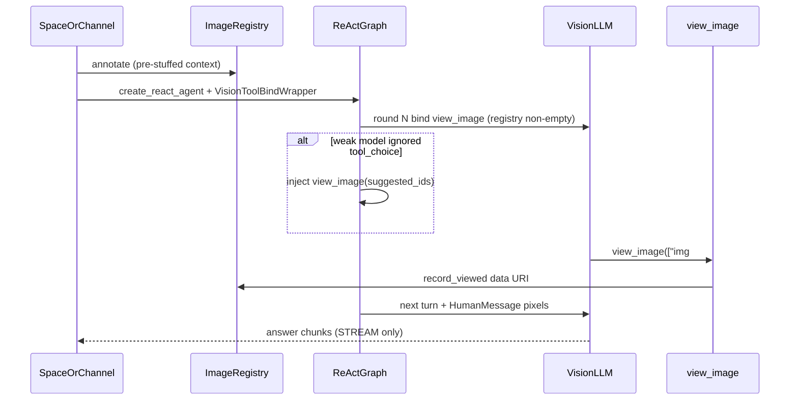

# Design 增量 · 知识空间 / 频道读图循环改为 LangGraph ReAct（F061 follow-up）

> 版本：v3.0.0-beta1 · 状态：**已落地**（2026-09-08；主 `design.md` §4 已覆盖回写）
> 关联：[design.md](./design.md) 决策 3 / 坑 2 / 坑 12 · [spec.md](./spec.md) AC-02～AC-07、AC-11～AC-17 · [constitution C1](../../../docs/constitution.md)
>
> **一句话**：知识空间 / 频道继续预检索 stuffing；LLM 循环从手写 `run_vision_tool_loop`（最多再一轮）换成与日常同一套 `create_react_agent` + `VisionToolBindWrapper`。工具只有 `view_image`。对外仍是纯 STREAM SSE，前端不出现工具卡片。

本文是 How。What / AC 不改 spec。现状接线以主 `design.md` §4 为准。

---

## 1. 背景：为什么推翻决策 3-A

F061 初版选定 **A**：日常走已有 ReAct；知识空间 / 频道手写两轮 `run_vision_tool_loop`。当时否决「完整 ReAct」是因为会引入联网、多工具、`agent_*` SSE、改历史 / citation，超出 ①–⑦。

联调后暴露的分叉：

| 手写 loop 的限制 | 日常 ReAct 已经有的 |
|---|---|
| 最多 1 次额外模型请求 | `recursion_limit` 可多轮 view → 再答 |
| 弱模型注入、选图覆盖、chunk 合并、catalog 历史全堆在 `loop.py` | `VisionToolBindWrapper` 每次调用前动态 bind |
| 与日常两套编排，坑 12 只修了 loop | 同一动态工厂，知识空间切过去才能共用 |

用户 2026-09-08 锁定两条，把「完整产品 Agent」从范围里拿掉：

1. **SSE / UI**：后端 ReAct，前端仍是纯 stream；知识空间 / 频道暂时不出现工具卡片。
2. **工具范围**：只有 `view_image`；预检索 stuffing 不变；**不要**让知识空间改成模型自己调 `search_knowledge_bases`。

主 design 决策 3 的「何时该重新考虑」写的是「若也要按需检索」。这次**不是**按需检索，只换编排引擎。偏离已 ★ 确认。

---

## 2. 目标与非目标

- **目标**：知识空间（单文件 / 文件夹 / 整空间，均经 `_render_rag_response`）和频道（`stream_article_reply`）的读图循环与日常共用 LangGraph ReAct + 动态 bind `view_image`。弱模型注入、选图、像素挂到 HumanMessage 走同一套钩子。
- **非目标**：
  - 不把日常的 `web_search` / MCP / 用户自选工具挂到知识空间或频道。
  - 不把知识空间改成按需 `search_knowledge_bases`；不把频道改成向量检索。
  - 不改知识空间 / 频道 SSE 协议，不改 `useStreamChatSSE` / FileAiDock / 频道 dock。
  - 不改 citation 落库、历史 JSON（仍 `ANSWER` + `{content, reasoning_content}`）。
  - 不改 spec AC；不新开 HTTP / 表 / 错误码；不改灵思。
  - 本增量**不**把日常 `astream_events` → `agent_*` 映射抽成公共 runner（日常 SSE 继续原地）。日常只跟着迁移 `VisionToolBindWrapper` 到 `common/`（见决策 R3）。

---

## 3. 方案对比与选定

### 决策 R1：编排 ReAct ≠ 产品 Agent

- **备选**：
  - A. 知识空间 / 频道也变成日常那种完整 Agent：按需检索、联网、`agent_thinking` / `agent_tool_call` / 工具卡片。
  - B. 只换 LLM 循环为 `create_react_agent`；检索 / 文章仍预组文；工具只有 `view_image`。
- **选定**：B。
- **原因**：知识空间进模型前已经 `_retrieve_and_filter`；频道进模型前已经有全文。再挂 `search_knowledge_bases` 是把做完的检索再做一遍，并打乱 citation。A 的回归面是产品级，不是读图编排。用户已否决 A。
- **何时该重新考虑**：产品明确要知识空间「模型自己决定搜哪」或频道要外挂联网。

### 决策 R2：对外仍 STREAM，吞掉 tool 事件

- **备选**：
  - A. 知识空间 / 频道改发 `agent_*`，前端换 `useAiChatSSE`，展示思考块 + 工具卡片。
  - B. runner 内部可以有 `on_tool_start/end`；映射到对外 SSE 时只转发 thinking + answer delta（与今天 `{content, reasoning_content}` 一致），`view_image` 的 tool 事件丢弃。
- **选定**：B。
- **原因**：AC-17 要求工具 token 不当答案；知识空间 / 频道前端是 `useStreamChatSSE`，没有工具卡片协议。A 要改 FileAiDock / 频道 dock 和历史回放，超出本增量。用户已锁定 B。
- **何时该重新考虑**：产品要在文件问答里显示「正在查看 img#10」。

### 决策 R3：共享实现停在 `common/image_view/`，不新建 `common/chat_react/`

- **备选**：
  - A. 新建 `common/chat_react/`（泛化 runner + 中间事件），三场景都切过去。
  - B. ReAct 读图循环放 `common/image_view/`（与 annotate / tool / relocate 同包）。`VisionToolBindWrapper` 从 `workstation/.../chat_service.py` 搬进来。日常继续自己的 `astream_events` 映射，只改 import。知识空间 / 频道调本包的 stream helper，产出与今天 loop 相同的 LLM chunk。
- **选定**：B。
- **原因**：本增量工具只有 `view_image`，抽无调用方的 `chat_react` 是过早抽象，且容易诱人把 workstation 的 `ChatResponse` 拖进 `common`（C1）。B 满足 C1：`common` 仍不 import 任何 `domain/`。
- **何时该重新考虑**：日常也要复用同一套事件映射，或出现第四个问答场景需要同一 runner。

### 决策 R4：弱模型注入挂在「模型返回之后」，且只在尚未读图时

- **备选**：
  - A. 每轮都 `tool_choice=view_image`。
  - B. 仅 `needs_pixels && view_call_count==0 && suggested 非空` 时强制 / 注入；已经 `view_image` 成功的下一轮普通 bind，让模型写答案。注入时丢掉该轮散文（坑 12）。
- **选定**：B。
- **原因**：A 会把「已经看过图、该作答」的轮次再次按进工具，ReAct 多轮时会死循环。B 是把 `loop.py` 已验证的注入搬进 graph，不改语义。
- **何时该重新考虑**：工作台模型都稳定遵守 `tool_choice`，可关掉注入，只保留 suggested 覆盖 `image_ids`。

### 决策 R5：知识空间 / 频道 `recursion_limit` 独立，不要用日常的 50

- **备选**：
  - A. 复用 `daily_chat.agent_max_iterations`（默认 50）。
  - B. 本路径写死较小上限（建议 **8**），只够「注入 / 调用 view_image 一到两次 + 作答」。
- **选定**：B。
- **原因**：知识空间 / 频道没有其它工具，50 轮是给日常多工具兜底的。读图场景 8 足够；打满说明模型在空转，应停而不是烧 token。
- **何时该重新考虑**：测量到合法「先看图 A 再看图 B 再看图 C」超过两次工具轮次。

---

## 4. 目标接线（落地后的数据流）

```
知识空间：_retrieve_and_filter → _prepare_rag_citation_context → annotate
频道：截断文章 → annotate
        ↓
visual=false 或 registry 空 → 与今天一样 llm.astream（不建 graph）
visual 且有图 → create_react_agent(
                  VisionToolBindWrapper(llm, registry, base_tools=[]),
                  ToolNode([view_image])   # 能执行；编译期 bind 看不见（动态工厂）
                )
        ↓
astream_events
  尚未完成读图的模型轮次：缓冲 chunk；tool_call 或即将注入 → 不对外 yield
  注入 / 覆盖 image_ids（坑 12）
  ToolNode 执行 view_image → registry.record_viewed
  下一轮模型调用前：pop_viewed → HumanMessage(图片块)（决策 4）
  作答轮次：yield content / reasoning_content
        ↓
知识空间 / 频道 endpoint 仍包 ChatResponse(STREAM)
citation / 落库不变
```



日常第一次仍可能 registry 空（图在 `search_knowledge_bases` 之后才出现），wrapper 行为不变。知识空间 / 频道图在预组文时已进 HumanMessage，**第一轮就会 bind**——与今天 loop、与 AC-03 一致。

---

## 5. 模块与钩子

### 5.1 文件级清单

| 文件 | 动作 |
|---|---|
| `common/image_view/vision_llm.py`（新建） | 从 `chat_service.py` 搬走 `VisionToolBindWrapper` / `_VisionCallRunnable`。`_prepare` **必须** `pop_viewed` → 追加 HumanMessage 图片块（见坑 R1），再 `relocate_images_to_human` + `prepare_vision_messages`。 |
| `common/image_view/react_loop.py`（新建） | `run_react_vision_stream(llm, messages, registry, visual=...)`：无图 / 未开视觉 → `llm.astream`；否则 `create_react_agent` + `astream_events`，对外只 yield 与今天 loop 相同的模型 chunk。`recursion_limit=8`。弱模型注入 / suggested 覆盖放这里或 `post_model_hook`。 |
| `common/image_view/loop.py` | 选图、`question_needs_pixels`、`drop_image_catalog_history`、`prepare_vision_messages`、注入辅助函数保留（纯函数）。`run_vision_tool_loop` 已删除。 |
| `common/image_view/__init__.py` | 导出 `run_react_vision_stream`、`VisionToolBindWrapper`；不再导出 `run_vision_tool_loop`。 |
| `workstation/.../chat_service.py` | `VisionToolBindWrapper` 改为从 `common.image_view` import；删除本地类定义。`_prepare_tools` 仍不加 `view_image`。 |
| `knowledge/.../knowledge_space_chat_service.py` | `_render_rag_response`：`run_vision_tool_loop` → `run_react_vision_stream`。检索 / prompt / citation 不动。 |
| `channel/.../channel_chat_service.py` | `stream_article_reply` 同样换。endpoint SSE 包装不动。 |
| `test/common/test_image_view_loop.py` | 纯函数（选图 / 注入 / catalog）留下；`run_vision_tool_loop` 编排用例迁到 `test_image_view_react_loop.py`。 |
| `test/common/test_image_view_react_loop.py`（新建） | fake LLM：tool_call → 第二轮带 HumanMessage 像素且首轮不对外 yield；弱模型纯文本 + suggested → 注入且不 yield 散文；无图不建 graph。 |
| `test/knowledge/test_knowledge_space_chat_image_view.py` | 断言走 `run_react_vision_stream`；`visual=false` / 无图仍单轮；yaml 未改。 |
| `test/channel/test_channel_chat_image_view.py` | 同上。 |
| `test/workstation/test_daily_chat_image_view.py` | wrapper 从 common import；补一条：`record_viewed` 后下一次 `_prepare` 的消息含 HumanMessage `image_url`。 |

不改：`annotate.py` / `fetch.py` / `tool.py` 契约、`knowledge_space.yaml`、client 前端、linsight、OpenFGA、Alembic。

### 5.2 必须搬进 graph 的 loop 语义

这些已经在 `loop.py` 验证过，ReAct 路径要行为等价，不能只 `create_react_agent` 就完事：

1. `prepare_vision_messages`：drop catalog 历史 + 追加读图规则 + 选图 hint（仅即将 bind 时）。
2. `needs_pixels` 且 suggested 非空：可带一轮 `tool_choice=view_image`；模型若仍无 `tool_calls` → 合成 `id=view_image_forced`。
3. 模型调了但 `image_ids` 偏离 suggested → `_apply_suggested_ids` 覆盖。
4. 有 `view_image` 的那一轮：对外不 yield prose（AC-17）。
5. 工具 ack 短文本；像素进 HumanMessage，禁止进 ToolMessage（决策 4 / 坑 1）。
6. 流式 `tool_call_chunks` 必须拼完整 JSON 再执行（坑 11）。LangGraph ToolNode 走完整 AIMessage，一般不再自己 `+` chunk；若 `astream_events` 里误用碎片 `tool_calls`，禁止拿去 `ainvoke`。

### 5.3 `VisionToolBindWrapper` 约束（坑 2，不变）

- 必须是 **非 Runnable 的 callable**，当作 per-turn 模型工厂。
- `ToolNode` 含 `view_image` 以便执行；**不要**把 `view_image` 放进 `create_react_agent` 编译期会 `bind_tools` 的那张表（日常 `_prepare_tools` 的教训）。本路径 `base_tools=[]`，工厂在 `len(registry)>0` 时才 bind。
- 读图规则不要写进 `create_react_agent(prompt=)`。

---

## 6. 已知坑（本增量新增）

| # | 反直觉事实 | 如果不知道会怎样 | 在哪处理 |
|---|---|---|---|
| R1 | 搬家前日常 `VisionToolBindWrapper._prepare` 没有 `pop_viewed`。像素只在旧 `loop.py` 第二轮挂上。工具返回的是短文本 ack。 | 知识空间切 ReAct 后只调了工具、下一轮仍看不见图；日常读图同样可能只有「Viewed img#N」没有 data URI | 已在 `_prepare` 里 `pop_viewed` → HumanMessage；日常单测覆盖这条 |
| R2 | 知识空间 / 频道第一轮 registry 已满，会立刻暴露 `view_image`；日常第一轮常常还没有图 | 按日常「第一轮绝不 bind」接线知识空间 → 有图也不给工具，AC-03 的「正文已有图才暴露」被做错 | 仍按 `len(registry)`，不要写死「跳过第一轮」 |
| R3 | `needs_pixels` 轮次若边 stream 边 yield，注入发生时用户已经看到编造的字段清单 | 坑 12 回归 | 读图完成前缓冲；确认是答案轮再 yield |
| R4 | 每轮都 `tool_choice=view_image` 时，看完图的下一轮无法收束 | 空转直到 recursion_limit | 决策 R4：只在 `view_call_count==0` 时强制 / 注入 |
| R5 | runner 若 yield `ChatResponse` 或 import workstation schema | 违反 C1，arch-guard 会打 | helper 只 yield LangChain chunk；SSE 包装留在 knowledge / channel domain |

主 design 坑 1–12 仍然有效。坑 3（首轮 tool token 泄漏）的处理点从 `run_vision_tool_loop` 改为 `run_react_vision_stream` 的缓冲。

---

## 7. 对外契约

本增量**不改变**对外 HTTP / SSE 字段 / 前端协议。

| 契约 | 落地后 | 谁在用 |
|---|---|---|
| 知识空间 / 频道 SSE | 仍 `category=stream`，`message.content` + `reasoning_content`，`type=stream\|end` | `useStreamChatSSE` |
| `run_react_vision_stream` | 内部 Python，yield 模型 chunk（与今天 loop 相同） | knowledge / channel service |
| `VisionToolBindWrapper` | 内部 Python，从 common 导出 | 日常 `create_react_agent`；知识空间 / 频道 react helper |
| `view_image` / `⟦img#N⟧` / HumanMessage 像素 | 与主 design §4.2 相同 | 三场景模型 |

---

## 8. 测试与手工验收

- **单测**：§5.1 表内四组。fake LLM，不拉真模型、不打 MinIO。
- **日常回归**：`test_daily_chat_image_view.py` 必须绿；`_prepare_tools` 仍不含 `view_image`。
- **citation 回归**：`test_knowledge_space_chat_citations.py`。
- **手工**（与 `e2e-checklist.md` 同一环境）：知识空间 `spaceId=1` / `file_id=6`，问「开户申请表单上有哪些字段？」——应 `view_image`（注入或模型自调）`img#10` / `img#9` 量级，第二轮带长边约 512 的像素，SSE 仍是 stream，**没有** `agent_tool_call`。频道含图文章问「图里写了什么」。关视觉、无图问题与今天一致。

可观测：保留 `image_view injecting view_image` / `suggested_ids` / `fetched url=` 日志；可加一条 `image_view react_loop recursion` 便于区分新旧路径。

---

## 9. 落地顺序

执行清单：[tasks.md](./tasks.md) T016–T026。

| 顺序 | 内容 | 任务 | 依赖 |
|------|------|------|------|
| 1 | `vision_llm.py`：复制 wrapper + `pop_viewed`；日常改 import | T016–T018 | 无 |
| 2 | `react_loop.py` + 编排单测（含注入 / 缓冲 / 无图降级） | T019–T020 | 1 |
| 3 | `_render_rag_response` 接线 + 知识空间单测 | T021–T022 | 2 |
| 4 | `stream_article_reply` 接线 + 频道单测 | T023–T024 | 2 |
| 5 | 删除 `run_vision_tool_loop`；回写主 design.md §4 / §6；勾 e2e-checklist | T025–T026 | 3、4 |

步骤 1 未合就切知识空间，会把「看不见像素」的日常缺陷带进预组文场景。

---

## 10. 明确不要做的事

- 不要给知识空间 / 频道挂 `search_knowledge_bases`、`web_search` 或用户自选 MCP。
- 不要把知识空间 / 频道 SSE 改成 `agent_*`，不要在 FileAiDock 做工具卡片。
- 不要用日常的 `agent_max_iterations=50`。
- 不要把 `view_image` 加进日常 `_prepare_tools` 或本路径编译期 bind 表。
- 不要把读图规则写进 `knowledge_space.yaml` / 日常 DB `systemPrompt`。
- 不要让 `common/` import `knowledge` / `channel` / `workstation` domain。
- 不要在本增量抽 `common/chat_react/` 或改灵思。

---

## 11. 现状锚点（写方案时的代码位置）

| 职责 | 位置 |
|---|---|
| 纯函数（选图 / 注入 / catalog） | `common/image_view/loop.py`（`run_vision_tool_loop` 已删） |
| 动态 bind + `pop_viewed` | `common/image_view/vision_llm.py` · `VisionToolBindWrapper` |
| 知识空间 / 频道 ReAct helper | `common/image_view/react_loop.py` · `run_react_vision_stream` |
| 知识空间预组文 + ReAct | `knowledge/domain/services/knowledge_space_chat_service.py` · `_render_rag_response` |
| 频道预组文 + ReAct | `channel/domain/services/channel_chat_service.py` · `stream_article_reply` |
| 知识空间 / 频道 SSE 前端 | `client/src/hooks/useStreamChatSSE.ts` |
| 日常 SSE 前端（不改） | `client/src/hooks/useAiChatSSE.ts` |
