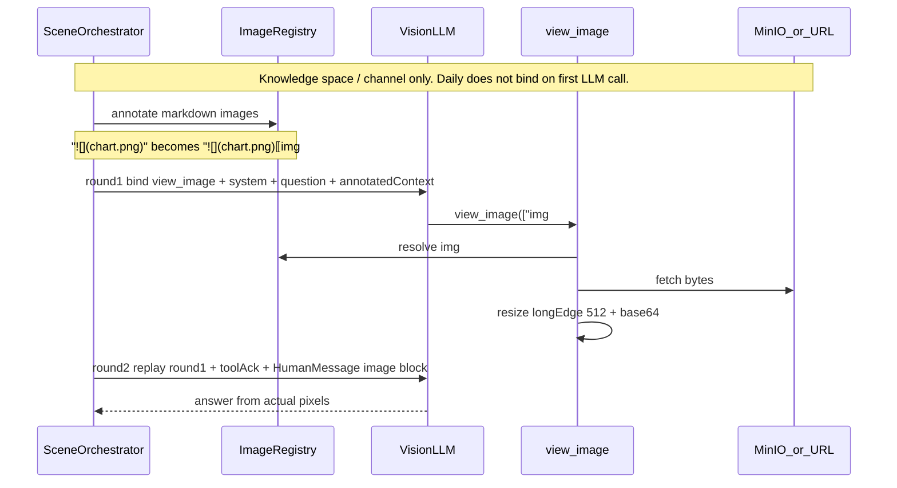

# Design: 问答场景主动读图

> **本文档定位 — 现状快照（Why this How）**
>
> - `spec.md` 回答 **做什么**（目标、AC、边界）
> - `design.md`（本文）回答 **为什么这么实现**：关键决策、运行时不直观的事实、对外契约
> - `tasks.md` 是 **流水账**（本轮尚未拆解）
>
> 调整原则（详见 `docs/SDD-Guide.md` §3-§4）：
> - 实现变化 → **覆盖更新本文档**，只留"今天的状态"
> - **偏差分级**：推翻已 ★ 确认的决策 → 停下与用户重新确认；纯实现细节 → 直接改 design

**关联**: [spec.md](./spec.md) · [tasks.md](./tasks.md)
**版本**: v3.0.0-beta1
**最后更新**: 2026-09-07（实现前初版）

---

## 1. 目标与非目标

- **目标**：在首页日常模式、知识空间问答、频道订阅问答三条链路里，让视觉模型按需「看见」检索结果 / 文章正文中的 markdown 图片，再基于像素作答。共享一层「编号 → 查看图片工具 → 二次带图」，三场景只接线。
- **非目标**：
  - 不改入库 / OCR / 切片；不预把全部图片塞进第一次请求。
  - 不做灵思任务模式、工作流 / 助手 RAG。
  - 不新做前端读图 UI；不解析 HTML ``；不新增表 / Alembic / 错误码段。
  - 不高清档。

---

## 2. 关键约束

遵循 `docs/constitution.md` C1–C7。本节只列本功能特有约束。

- **C1 分层**：`common/` / `core/` 不得 import `domain/`。读图是跨 workstation / knowledge / channel 的横切能力，共享实现必须停在 `common/`，三场景 domain 只调用、不反向被 `common` 依赖。
- **C4 权限**：不新开取图鉴权口。注册表只来自本轮已经过现有过滤的上下文（知识空间 `view_file`、频道敏感文检查）。模型不能传任意 URL（防 SSRF）。
- **C8**：缩放在请求内用内存 / 临时字节完成，不把中间图落到共享本地盘给别的进程读。
- **无 schema 变化**：不新增领域对象、表、Alembic。
- **上游数据格式**：知识库图片在入库时已写成 `/{bucket}/knowledge/images/{kb_id}/{doc_id}/{filename}`（`loader/base.py` `build_image_url`）。问答路径今天**不**重写这些 URL。
- **模型能力**：视觉开关是工作台模型列表上的 `WSModel.visual`，与日常附件、Linsight binary guard 同源。未开视觉的模型，endpoint 会拒 `image_url`。
- **供应商角色约束**：部分模型（已知 Kimi）只接受 user 角色上的 `image_url`。图片块不得放在 ToolMessage 里发给模型。
- **容量**：v1 标准档长边 512；单轮最多查看 3 张。知识空间 / 频道最多 1 次额外模型请求。

---

## 3. 方案对比与选定

### 决策 1：共享能力放 `common/image_view/`，三场景只接线

- **备选**：
  - A. 新建 `bisheng/common/image_view/`（标注、注册表、取图、缩放、工具、两轮循环、image 角色搬迁）。三场景各自调用。
  - B. 放进 `knowledge/` domain，频道 / 日常再 import knowledge。
  - C. 把知识空间 / 频道改成与日常一样的完整 LangGraph ReAct。
- **选定**：A。
- **原因**：B 让 channel 依赖 knowledge domain，违反「场景接线、能力下沉」且靠近 C1 交叉 import。C 超出用户确认的 ①–⑦，回归面覆盖历史、citation、SSE 事件，远大于「加一次工具循环」。A 满足 C1：`common` 只碰 `core` 存储 / 下载，不 import 任何 domain。
- **何时该重新考虑**：若出现第四个以上场景且编排开始分叉，再评估是否抽独立 chat 编排模块（仍不得让 `common` 依赖 domain）。

### 决策 2：按需工具调用，不预塞像素

- **备选**：
  - A. 第一次只给 `⟦img#N⟧` 锚点；模型调用 `view_image` 后才取字节、第二次带图。
  - B. 检索 / 组文完成后，把上下文里所有图 resize + base64 塞进第一次请求。
- **选定**：A。
- **原因**：用户已锁定 ①–⑦。B 在「这张图是什么意思」以外的问题上浪费 token 与费用，且多图时第一次请求极易超上下文。A 与「模型此时还是瞎的，只是从标记知道这儿有张图」一致。
- **何时该重新考虑**：若测量表明几乎每次含图问答都会读图，且平均图数 ≤ 1，可评估「单图预塞、多图仍按需」。

### 决策 3：知识空间 / 频道 = 轻量两轮；日常 = 往现有 ReAct 加工具

- **备选**：
  - A. 知识空间 / 频道：正文已有图时 `bind_tools([view_image])`，最多 1 次额外模型请求；一次工具调用可带多张 `img#`；第二轮不再绑工具。日常：请求级 `ImageRegistry` 由 `search_knowledge_bases` 填充。**不要**把 `view_image` 加进 `_prepare_tools` 再丢给 `create_react_agent`——后者编译期会把 ToolNode 里全部工具 `bind_tools` 给模型，第一次请求就会暴露，AC-03 复燃。正确挂钩：`_prepare_tools` 保持今天的列表；在每次模型调用前的 LLM 外包（或等价 `pre_model_hook`）里按 `len(registry)` 动态 `bind_tools`；读图规则挂在同一外包，仅当本轮将暴露工具时追加。ToolNode 仍须能执行 `view_image`，但编译期 bind 不得看见它。检索无图则全程不暴露。
  - B. 三场景都改成完整 ReAct。
  - C. 三场景都写成手写两轮循环（日常拆掉 LangGraph）。
- **选定**：A。
- **原因**：日常已经有 `create_react_agent` + `search_knowledge_bases`，图出现在**工具返回之后**，硬套「先检索再两轮」会与现有 Agent 循环打架。知识空间 / 频道今天是单轮 `llm.astream`，加完整 ReAct 会引入联网 / 多工具 / recursion_limit，超出 AC。A 对预检索场景就是 ①–⑦；对日常则是同一工具语义嵌进已有循环，消息历史即「第一次内容原样重发」。
- **何时该重新考虑**：若知识空间 / 频道也要按需检索（不再预 stuffing），再评估与日常合并 Agent。

### 决策 4：图片块放 HumanMessage，不放 ToolMessage

- **备选**：
  - A. 工具返回短文本 ack；像素由编排器追加为 `HumanMessage`（说明文字 + `image_url` data URI）。日常在每次模型调用前把误放在 ToolMessage 里的 image 块搬到合成 HumanMessage。
  - B. 把 image 放在 ToolMessage（OpenAI 部分模型允许）。
  - C. 把 Linsight 整条 `build_binary_guards` 中间件搬到三条问答链路。
- **选定**：A。
- **原因**：Linsight 已证实 Kimi 对 ToolMessage 里的 `image_url` 直接 400（`binary_content_guard.py` 模块注释）。B 会在部分工作台模型上整轮失败。C 把任务模式的 `read_file` / 代码解释器守卫拖进问答，范围越界且日常用的是 langgraph `create_react_agent`，不是 deepagents middleware。A 只复用「搬到 user 角色」这一条已验证约束，不改灵思。
- **何时该重新考虑**：若全体工作台模型都稳定接受 tool 角色图片，可简化为 B；在此之前保持 A。

### 决策 5：能力门控与档位

- **备选**：
  - A. **三场景同一条「提供能力」规则**（对齐 AC-03）：仅当 `visual=true` **且** 当前送给模型的正文已有 markdown 图，才向模型暴露 `view_image` 并 annotate。
    - 日常的「正文」是检索工具返回后的 chunk：第一次 LLM 调用不 bind `view_image`；`search_knowledge_bases` annotate 后注册表非空，后续轮次才 bind。检索无图 → 全程不暴露。
    - 知识空间 / 频道在预组文时就能扫正文，有图才 bind。
    - `visual=false`：三场景都不标注、不暴露（AC-02）。
    - 模型若仍调到未登记编号 → AC-19；一次超过 3 张 → AC-20。
    - v1 只实现标准档 = 长边 512；工具参数保留 `quality` 但只接受 `standard`。
  - B. 只要正文有图就注入工具，不管 `visual`。
  - C. v1 同时做标准档 + 高清档。
  - D. 日常 `visual=true` 即把 `view_image` 暴露给第一次模型请求（注册表空则拒绝）。
- **选定**：A。
- **原因**：B 会把 image block 发给声明不支持视觉的模型，endpoint 400（日常附件路径已经用 `model_info.visual` 门控，见 `chat_service._process_agent_files`）。C 无产品口径。D 让无图请求也能看见「查看图片」工具，违反 AC-03。日常「图在检索之后才出现」，必须在每次模型调用前按 registry 重绑，而不是改 `_prepare_tools` 固定表——`create_react_agent` 会把那张表编译期全部暴露。
- **何时该重新考虑**：运营明确要高清档，或出现「512 读不清轴标签」的线上证据。

---

## 4. 系统现状（接手必读）

> 写的是**写 design 当天**的代码长什么样。实现落地后覆盖更新本节，使它变成「今天的接线」。

### 4.1 数据流

**今天（无读图）**

```
日常  POST /api/v1/workstation/chat/completions
  → _agent_stream_chat_completion
  → _prepare_tools（web_search / 用户工具 / search_knowledge_bases）
  → create_react_agent + astream_events
  → 模型按需调 search_knowledge_bases
  → queryChunksFromDB → KnowledgeRetrieverTool
  → DailyChatCitationToolWrapper._dump_knowledge_chunks
  → KnowledgeUtils.format_retrieved_chunk（正文保留 ，无编号）

知识空间  POST /api/v1/knowledge/space/{id}/chat/file|folder
  → chat_single_file / chat_folder
  → KnowledgeRetrieverTool 预检索
  → _prepare_rag_citation_context → format_retrieved_chunk
  → llm.astream（无 tool calling）

频道  POST /api/v1/channel/chat/completions
  → ChannelChatService 取会话 / LLM；endpoint 内截断文章 + astream
  →（今天编排落在 endpoint，本 feature 目标迁回 Service，见 §4.3）
```

**目标（有读图）**

```
共享 annotate(text) → 原文  后追加 ⟦img#N⟧，写入请求级 ImageRegistry

知识空间 / 频道（预检索 / 预组文）
  标注后的上下文 → run_vision_tool_loop
    第 1 次：bind_tools([view_image])；若是 tool_call，不向用户流式输出该轮 token
    取字节 → 长边 512 → data URI
    第 2 次：原样重发第 1 次消息 + 工具 ack + HumanMessage(图片块)；不再绑工具

日常（检索在工具之后）
  _prepare_tools 保持今天的列表（不加 view_image）
  LLM 外包 / pre_model_hook：每次模型调用前
    relocate_images_to_human
    len(registry)>0 → bind_tools(既有 + view_image) 并追加读图规则
    否则不暴露、不追加规则（AC-03）
  search_knowledge_bases 返回后 annotate，填注册表
  ToolNode 能执行 view_image，但 create_react_agent 编译期 bind 看不见它
  LangGraph 消息历史 = 原样重发
```

下图只画**知识空间 / 频道**（预检索，annotate 后才第一次调模型）。日常第一次不 bind，检索返回后才暴露，见上方文字，不要按此图接线日常。



### 4.2 关键数据结构 / 字段约定

| 字段 / 结构 | 类型 / 格式 | 说明 | 谁会消费 |
|---|---|---|---|
| 图片锚点 | `⟦img#N⟧`（U+27E6 / U+27E7） | 紧跟原 `` 之后；不改 URL | 模型认编号；前端忽略，仍渲染 `` |
| `ImageRegistry` | 请求内 `img#N → {url}` | 同一 URL 去重为同一 N；只在本轮存活 | `view_image` 唯一查表入口 |
| `view_image` 工具 | `image_ids: list[str]`，`quality: "standard"` | 只能传注册表里的 `img#N`；单轮最多 3 张 | 三场景模型 |
| 标准档 | 长边 512，等比缩放 | v1 唯一档位 | `fetch_and_encode` |
| 二次请求图片块 | `HumanMessage`：text + `{type: image_url, image_url: {url: data:image/...;base64,...}}` | 禁止放 ToolMessage | `ChatOpenAIReasoning` 已能把 LangChain `image` 归一成 OpenAI `image_url` |
| 知识库图路径 | `/{bucket}/knowledge/images/{kb_id}/{doc_id}/{filename}` | 入库时 bake 进 chunk | MinIO `get_object` |
| `WSModel.visual` | `bool` | 工作台模型「视觉」列 | 三场景门控；日常已有 `model_info.visual` |

### 4.3 关键模块职责

| 模块 / 文件 | 职责 | 不做什么 |
|---|---|---|
| `bisheng/common/image_view/`（新建） | 标注、注册表、取图、缩放、`view_image` 工具、`run_vision_tool_loop`、`relocate_images_to_human` | 不 import 任何 `domain/`；不做业务鉴权；不写盘给别的进程 |
| `workstation/.../chat_service.py` | 日常：检索结果 annotate；LLM 外包（或 `pre_model_hook`）在**每次**模型调用前 relocate，并按 `len(registry)` 动态 `bind_tools` + 追加读图规则 | 不把 `view_image` 加进 `_prepare_tools`；不把读图规则写进 `create_react_agent(prompt=sys_prompt)`；不把知识空间 / 频道改成 ReAct |
| `DailyChatCitationToolWrapper._dump_knowledge_chunks` | `format_retrieved_chunk` 之后 annotate，写入共享注册表 | 不取像素 |
| `knowledge/.../knowledge_space_chat_service.py` | `_prepare_rag_citation_context` 后 annotate；`space_rag` / `_render_rag_response` 换 `run_vision_tool_loop`（即将 bind 时追加读图规则）；按 `model_id` 读 `visual` | 不加联网 / 多工具 Agent；不改默认 yaml prompt |
| `core/prompts/yaml/knowledge_space.yaml` | **不改**。读图规则不预置进默认稿（无图 / `visual=false` 仍走这份稿） | 不删、不改写 citation 规则；不增加「先调 view_image」 |
| `channel/.../channel_chat_service.py` | 截断后的文章 annotate + `run_vision_tool_loop` + `visual` 门控 + 提示追加。Endpoint 只做鉴权 / SSE 包装 | 不引入向量检索；不把编排留在 `channel_chat.py` endpoint（对齐 C1） |
| `linsight/.../binary_content_guard.py` | **不改**。本 feature 只复用「image 必须在 user 角色」这一事实 | 不把守卫链挂到问答 |

知识空间 / 频道的 `visual` 解析：从工作台模型列表按 `model_id` 对 `WSModel.visual`，与 Linsight `_resolve_model` 同源，不新开配置面。

日常系统提示来自 DB `systemPrompt`，知识空间默认稿在 `knowledge_space.yaml`，都不能指望运营手改，也**不要**把读图规则写进这些默认稿（无图 / 未开视觉时模型仍会读到「先调 view_image」，幻觉调用，AC-02 / AC-03 被软开口）。读图规则只在代码里、**仅当本轮将向模型暴露 `view_image` 时**追加：日常挂 LLM 外包，不要写进 `create_react_agent` 的初始 `prompt=`；知识空间 / 频道在 `run_vision_tool_loop` 组第一轮时追加。三场景同一段口径：

1. `⟦img#N⟧` 只是锚点，第一次请求看不见像素。
2. 回答依赖图 / 表 / 走势时先调 `view_image`；不要写「我看不到图」，不要根据周围文字编图意。
3. 回答里仍输出原始 ``，方便前端渲染。
4. 只能使用本轮出现过的 `img#`。

### 4.4 取图与 host 白名单

`common/image_view/fetch_and_encode` 只接受注册表里的 URL，按形态分流：

| 形态 | 例子 | 怎么取 | 允许条件 |
|---|---|---|---|
| 知识库内部路径 | `/{bucket}/knowledge/images/{kb_id}/{doc_id}/{file}` | MinIO `get_object`（拆 bucket + object key） | 前缀必须是 `/{public_bucket}/knowledge/images/` |
| MinIO 公网 / 签名链 | `http(s)://{sharepoint}/...` 或带 `X-Amz-Algorithm` 的相对路径 | `async_file_download` | host 等于 `settings.minio.sharepoint`（含 `share_schema` 的 http/https） |
| 情报中心外链 | 文章 markdown 里的 `http(s)://...` | `async_file_download` | host 等于 `IntelligenceCenterConf.base_url` 的 host（`core/external/bisheng_information_client`） |

其它 host → 取图失败，按 AC-15 告知模型、不中断会话。不跟随后续 3xx 到白名单外。缩放用进程内 PIL，长边 512，不写共享本地盘（C8）。

---

## 5. 已知坑 / 反直觉事实

| # | 反直觉事实 | 如果不知道会怎样 | 在哪处理 |
|---|---|---|---|
| 1 | 部分模型（Kimi）只接受 **user** 角色的 `image_url`，ToolMessage 里放图会 400 杀掉整轮 | 日常 ReAct 默认把工具结果放 ToolMessage → 一调 `view_image` 会话失败 | 决策 4：ack 用文本，像素进 HumanMessage；日常 `relocate_images_to_human` |
| 2 | 日常 `create_react_agent(bisheng_llm, tool_node)` **编译期**会 `bind_tools` ToolNode 里全部工具；`prompt=sys_prompt` 同样是一次注入。图却出现在 **`search_knowledge_bases` 返回之后** | 把 `view_image` 加进 `_prepare_tools`，或一开场把读图规则拼进 `sys_prompt` → 第一次请求就看见工具 / 被提示去调，AC-03 复燃；若永不 bind → 检索后仍读不了图 | 决策 3/5：`_prepare_tools` 不动；LLM 外包 / `pre_model_hook` 每次调用前按 `len(registry)` 重绑并按需追加规则 |
| 3 | 知识空间 / 频道今天直接 `astream`，首轮若是 tool_call，token 会当答案流给前端 | 用户看到一截工具 JSON，再被真正答案覆盖或并列 | `run_vision_tool_loop` 缓冲首轮；确认是 tool_call 则不 yield 该轮 content（AC-17） |
| 4 | `view_image` 若允许模型传 URL，等于开放 SSRF | 模型（或提示注入）可打内网 / metadata | 只查 `ImageRegistry`；HTTP 仅 MinIO sharepoint + 已配置信息源主机 |
| 5 | 知识库图是 **内部路径** `/{bucket}/knowledge/images/...`，不是可匿名打开的 http | 误当 URL 去 fetch 会 404，模型永远读不到图 | `/{bucket}/...` 走 MinIO `get_object`；http(s) / share 链才走 `async_file_download` |
| 6 | citation 私用区是 `\ue200`…，读图锚点必须避开 | 混用会导致前端 citation 解析把 `⟦img#1⟧` 当来源，或读图正则吃掉引用标记 | 锚点锁定 U+27E6/U+27E7；标注只改 markdown 图片标签周围 |
| 7 | `WSModel.visual=false` 时硬塞 image_url，供应商直接拒请求 | 「善意读图」变成整轮 500 | 决策 5：未开视觉不标注、不挂工具 |
| 8 | 日常 prompt 在 DB，知识空间 / 频道也可能被运营覆盖 | 只改 yaml 默认稿，线上自定义 prompt 的模型不知道有工具；日常若把规则写进编译期 `prompt=`，无图请求也会被教去调 `view_image` | 三场景同一段口径；**仅当本轮将暴露工具时**追加。日常挂 LLM 外包，知识空间 / 频道在 `run_vision_tool_loop` 组第一轮时追加 |
| 9 | Linsight 已有「读文件看图」，但是 `read_file` + workspace + 500KB 上限，**不是**本 feature | 误改 `binary_content_guard` / `workspace_backend` 会回归任务模式 | 本 feature 不改 linsight；只抄「搬到 HumanMessage」这一条 |
| 10 | 频道文章 `markdown_content` 来自信息源，图可能是外链 | 无 host 白名单就会把任意外链当成功来源 | 取图失败按 AC-15 降级；白名单与分流见 **§4.4** |

---

## 6. 对外契约与依赖

### 6.1 我提供给别人的（Outgoing）

| 契约 | 形式 | 谁在用 |
|---|---|---|
| `⟦img#N⟧` 锚点出现在送给模型的检索 / 文章上下文 | 隐式 prompt 契约 | 三场景模型；前端不消费（仍渲染原 ``） |
| `view_image(image_ids, quality="standard")` | LangChain StructuredTool | 日常 ReAct；知识空间 / 频道两轮循环 |
| `common.image_view.annotate` / `run_vision_tool_loop` / `relocate_images_to_human` | 内部 Python API | workstation / knowledge / channel domain |
| 既有 SSE 形态保持 | 日常继续 `agent_tool_call`；知识空间 / 频道继续 STREAM 答案 | client 日常 / 知识空间 / 频道聊天 |

不新增 HTTP API、不新增错误码模块、不新增领域对象。取图失败只作为工具观察返回给模型。

### 6.2 我依赖别人的（Incoming）

| 依赖 | 形式 | 风险点 |
|---|---|---|
| `WSModel.visual` | 工作台模型配置 | 运营未勾视觉 → 本 feature 整段不生效（符合 AC-02） |
| `KnowledgeUtils.format_retrieved_chunk` | 内部 API | 若改 wrapper 标签，annotate 必须仍能扫到 `` |
| 入库 `build_image_url` 路径约定 | 隐式数据契约 | loader 改 URL 形态则 MinIO 解析要同步 |
| `async_file_download` / MinIO `get_object` | `core` 存储 | 超时 / NoSuchKey → 必须降级，不能抛穿 SSE |
| `ChatOpenAIReasoning._convert_standard_image_block` | LLM 客户端 | 二次请求的 data URI 靠它进供应商协议 |
| 知识空间 `view_file`、频道敏感文检查 | 既有入口鉴权 | 本 feature 不重复鉴权；入口回归则可能把无权正文（含图）送进注册表 |
| 日常 `create_react_agent` + `astream_events` | LangGraph | relocate、动态 `bind_tools`、读图规则都必须挂在**每次**模型调用前；禁止改 `_prepare_tools` 固定表或编译期 `sys_prompt`（坑 2） |
| Pillow（PIL） | Python 依赖（后端环境已有） | 缩放在 `fetch_and_encode` 内完成；环境缺 PIL 则取图整段失败，须按 AC-15 降级而不能让 import 炸掉问答 |
| `settings.minio.sharepoint` / `share_schema` | YAML / 环境配置 | 改 share 域名后旧文章里的 http 图会全部走 AC-15 |
| `IntelligenceCenterConf.base_url` | 情报中心客户端配置 | 文章图若挂在别的 CDN host，本期一律失败（不扩白名单，见 §8） |

---

## 7. 测试与可观测

- **单元**（`src/backend/test/common/test_image_view.py`，`asyncio_mode=auto`）：
  - 标注：单图 / 多图 / 同 URL 去重 / 无图 no-op / 不碰 citation 私用区。
  - 注册表：未知 `img#` 拒绝；超过 3 张拒绝超额部分。
  - 缩放：长边 512、已小于 512 不放大。
  - 路径：`/{bucket}/knowledge/images/...` 走 MinIO；非法 host 的 http 失败。
  - 取图失败：返回错误文案，不 raise。
- **编排**：
  - `run_vision_tool_loop`：首轮 tool_call → 第二轮消息含原上下文 + HumanMessage 图片块，且首轮 content 不进入对外 stream。
  - 无图 / `visual=false`：退回单轮 `astream`，与今天一致。
- **日常接线**：`_prepare_tools` 返回值不含 `view_image`；检索结果字符串含 `⟦img#1⟧` 后，后续轮次经 LLM 外包才 bind；`visual=true` 但检索无图时，模型侧看不到该工具、也看不到读图规则。
- **手工验证一遍**（本地后端 + client；中间件连本机 / 测试环境 MinIO）：
  1. 后端（`src/backend/`）：`export config=config.yaml; uv run uvicorn bisheng.main:app --host 0.0.0.0 --port 7860 --workers 1 --no-access-log`
  2. Client（`src/frontend/`）：`pnpm --filter bishengchat start -- --host 0.0.0.0`（:4001，base `/workspace`）。用已开启「视觉」的工作台模型账号登录。
  3. 日常：打开 `/workspace` 首页日常对话，勾选含图知识库，问「这张图的走势」——应先出现已有 `agent_tool_call`（查看图片），再出带原 `` 的答案。
  4. 知识空间：打开某空间含图文件 / 文件夹问答（`/workspace` 知识空间入口），同样提问。
  5. 频道：打开 `/workspace/channel/{channelId}/article/{articleId}`，对正文含 markdown 图的文章同样提问。
  6. 同一账号把该模型「视觉」关掉：三场景都不出现查看图片，原文 `` 不变。
  7. 无图问题不误调；人为删掉 MinIO 对象后会话仍结束，模型侧收到「该图不可用」。
- 实现后把上述步骤写入 `e2e-checklist.md`。
- **可观测**：annotate 图数、`view_image` 调用数、取图失败原因（path / host / decode）打 `logger.info` / `warning`。不新增指标系统。

---

## 8. 后续改进 / 不打算做的事

- **高清档**：工具已留 `quality`；有线上「512 读不清」证据再开 1024。
- **HTML `` / 频道复杂富文本**：等文章源格式普查后再扩正则。
- **灵思 / 工作流 / 助手**：各自上下文形状不同（workspace `read_file`、节点变量），不在本 feature 接线。
- **预塞单张图**：仅当测量显示「含图必读且平均 1 张」时重评决策 2。
- **前端「正在查看图片」独立 UI**：知识空间 / 频道本期只保证不泄漏 tool token；若产品要进度提示，另起 client 小改。
- **把 Linsight relocate 抽到 `common` 并回改任务模式**：能 DRY，但会碰 F035 守卫链，本轮不做。

---

## 修订历史

| 日期 | 改动 | 触发原因 |
|---|---|---|
| 2026-09-07 | 初版设计（实现前）：common 共享层 + 三场景接线 + ①–⑦ 两轮读图 | Spec Discovery 对齐用户流程；本轮只出文档 |
| 2026-09-07 | 回写 design 审查：统一决策 3/5 挂工具时机；§4.4 取图白名单；频道编排改 ChannelChatService；§7 补手工命令；§6.2 补 PIL / sharepoint / 情报中心 host | `/sdd-review design` 四条 medium + 一条 low |
| 2026-09-07 | 日常改为「注册表非空才 bind view_image」，与 spec AC-03 对齐；否决 visual=true 即暴露 | `/sdd-review design` 复审 medium |
| 2026-09-07 | 点名日常挂钩：`_prepare_tools` 不加 `view_image`；LLM 外包 / `pre_model_hook` 按 registry 动态 bind 并按需追加读图规则；禁止写进编译期 `prompt=` | `/sdd-review design` 复审 medium（编译期 bind） |
| 2026-09-07 | 默认 `knowledge_space.yaml` 不预置读图规则，只在即将 bind 时追加；§4.1 mermaid 标明仅知识空间 / 频道 | `/sdd-review design` 复审 medium + low |
