# Design: 代码执行沙箱统一底座

**关联**: [spec.md](./spec.md) · [沙箱架构设计说明书.md](./沙箱架构设计说明书.md)（评审用） · [tasks.md](./tasks.md)
**版本**: v3.0.0-beta1
**最后更新**: 2026-09-20

---

## 1. 目标与非目标

- **目标**：把「模型 / 搭建者写的 Python」从 backend 与 Celery worker 进程里搬进一个受控的隔离执行环境，让全平台五条代码执行路径共用一套执行底座、一份执行镜像、一套加固基线。
- **非目标**：不做 VM 级隔离承诺，不做持 docker 的编排控制面（留给 3.0 应用工场 F103），不修 Fernet 主密钥硬编码，不改日常会话「附件只抽文本进 prompt」的既有语义，不改进 E2B 模式。

---

## 2. 关键约束

全局铁律遵循 `docs/constitution.md` C1–C8，此处不重抄。本功能特有的约束：

| 约束 | 内容 |
|---|---|
| **交付形态** | 主流是客户内网虚机 + docker-compose，常无外网。任何需要联网拉 kernel、连厂商控制面、或要求嵌套虚拟化（`/dev/kvm`）的方案在实施现场直接为 0 分 |
| **信创架构** | 鲲鹏/飞腾 = aarch64、海光/兆芯 = x86_64、龙芯 = loongarch64。gVisor 与 Firecracker 官方支持列表只有 x86_64/ARM64，**龙芯全场无解**，只有普通容器路线能覆盖 |
| **执行镜像必须能装原生二进制** | 灵思价值链是产出 docx/pptx/xlsx/pdf，依赖 LibreOffice（含 Impress/Calc）、pandoc、中文字体、PyMuPDF。WASM / Pyodide 路线在此直接归零 |
| **容量下限（实测）** | 单次文档转换在 128Mi 可完成；**4 路并发的内存下限是 384Mi**，256Mi 及以下并发必被 OOM killer 杀 |
| **隔离口径** | 共享宿主内核。NIST SP 800-190 明确容器不是 VM 级边界。对客户与安全评审的口径是「挡住误操作与机会主义攻击」，**不承诺抗定向内核 0day** |
| **错误码段** | 本 Feature 申领模块号 **280**（`sandbox`）。已按 C5 重新派生占用列表确认空闲（当前占用：100–111、120、140、150、160、170、180、181、190–198、200、210、220、230、240、250、260/261、270） |
| **C8 直接约束本设计** | 执行环境与 worker 之间的文件搬运**不得**依赖同机 bind-mount 的共享目录——那只在单机 compose 成立 |
| **C6 相关但不在范围** | `secret_key` 硬编码为开源常量属 C6 违规，独立立项；本 Feature 只降低其可利用面 |

**Constitution Check**：本方案不新增表、不新增对外 API 路径、不触碰权限运行时与租户过滤，无 C1/C2/C3/C4/C7 影响；C5 按上表申领 280 并在落码时回写 `docs/constitution.md`；C6 见上；C8 由决策 3 满足。

---

## 3. 方案对比与选定

### 决策 1：执行后端选型 —— 加固容器，而非 E2B / microVM / WASM

- **备选**：
  - A. **加固容器**（自建执行镜像 + compose 原生加固）— 离线可部署、不要嵌套虚拟化、能装原生二进制、信创全架构可覆盖；代价是共享宿主内核
  - B. **E2B 自托管** — 隔离最强（Firecracker microVM）；但官方自托管硬性要求 Cloudflare 账号 + 托管在 Cloudflare 的域名 + Terraform/Nomad/Consul + 嵌套虚拟化；官方单机版 PR「e2b-lite」2026-04-26 关闭未合并，替换 Cloudflare 的 Route53 PR 2026-07-30 关闭未合并
  - C. **E2B 云** — 零运维；但只有 US/EU 两区，代码与文件全量出境
  - D. **microVM 系（microsandbox / Kata / Firecracker）** — VM 级隔离；全部硬依赖 `/dev/kvm`
  - E. **WASM / Pyodide / Riza** — 隔离干净；跑不了 LibreOffice/pandoc 这类原生二进制
- **选定**：A
- **原因**：B/C 在私有化交付下是**架构性**否决而非配置问题（离线前提不成立 + 数据出境）；D 撞 Broadcom KB 313547「不支持在 vSphere 虚机内运行第三方 hypervisor」——在 VMware 客户处是合同层面不受支持，而交付主流恰是虚机；E 与 office 产出链路直接冲突。A 这条路线最大的技术风险已排除：整条 office 链路（soffice 转 docx/xlsx/pptx→PDF、pandoc、PyMuPDF、4 路并发、中文渲染）在 `cap_drop:ALL` + `no-new-privileges` + 非 root + 只读 rootfs + `/tmp` noexec + `network:none` + cgroup 限额的最严档下**八档全绿 12/12**。
- **何时该重新考虑**：客户明确要求抗定向逃逸且提供裸金属/已开嵌套虚拟化的 KVM 宿主；或平台推出境外 SaaS 形态（此时 E2B 的 microVM + pause/resume 重新变成对的选择）。

### 决策 2：编排拓扑 —— compose 预声明副本池 + HTTP 租约，backend 零 docker 依赖

- **备选**：
  - A. **副本池 + 租约**：compose 声明 N 个执行副本，worker 通过 HTTP 领租约、执行、释放。无人持 docker.sock
  - B. **backend/worker 直接用 docker-py 起容器**：按次全新 rootfs，隔离粒度最好；但 backend 必须挂 `/var/run/docker.sock`
  - C. **自建持 docker 的编排服务**：按次新容器 + backend 零 docker 依赖
- **选定**：A
- **原因**：B 等于把 root-on-host 交给一个对外提供代码执行能力的进程——这正是 RAGFlow `executor-manager`（`privileged: true` + 挂 docker.sock）被判高风险的形状，私有化银行/信创客户安全团队必否；且 K8s 下不成立。C 技术上对，但「唯一持 docker 的最小权限编排器」是 3.0 应用工场 F103 已排期的组件（自评为全案最重最险、安全评审前置），在本 Feature 里自造第二个特权面属重复建设。A 的代价是隔离粒度退让一格（见决策 6），但相对今天的基线（root + `seccomp:unconfined` + 同网直连 mysql/minio + 无 cgroup 限额 = 隔离度 0）已是数量级改善。
- **何时该重新考虑**：F103 `runtime-manager` 落地可复用；或出现「同副本先后承载不同租户」被客户安全评审明确否决的案例；或池满排队成为常态（观测项见 §7）。

### 决策 3：文件搬运 —— HTTP tar 流，不用共享卷、不用对象存储中转

- **备选**：
  - A. **HTTP tar 流**（copy-in / copy-out 各一个端点，按 md5 做 delta）
  - B. **worker 与执行环境 bind-mount 同一目录**：实现最省，无需序列化
  - C. **执行环境直连 MinIO 取工作区**
- **选定**：A
- **原因**：B 直接违反 C8——`backend` 与 `backend_worker` 今天恰好 bind-mount 同一个 `/app/data`，这是单机 compose 的巧合而非设计，一旦两者落到不同宿主立刻失效；且它要求执行环境对 worker 的数据目录有写权限，与「执行环境是不可信侧」矛盾。C 要求执行环境能连对象存储，直接推翻 AC-12 的隔离承诺，也是 E2B 现有实现刻意由 worker 居中转发的原因。
- **何时该重新考虑**：单次 copy-in 体量（大附件 / 大工作区）使 tar 往返成为耗时主项时，考虑内容寻址 + 执行侧只读缓存，而不是回退到共享卷。

### 决策 4：抽象缝位置 —— 只替换 `execute_code`，复用全部文件语义

- **备选**：
  - A. 把 `run` / `run_with_dir` / 快照 diff / 根级产物归位 / MinIO 上传 / 工作区镜像上提为共享实现，`execute_code` 声明为抽象方法，新后端只实现它
  - B. 新写一个独立的 executor 类，自行实现产物收割
- **选定**：A
- **原因**：读 `local_executor.py` 的 `run_with_dir` 可以确认，除 `execute_code` 之外的每一步都跑在 worker 侧、与「代码在哪执行」无关：快照 diff、把根级文件归位到 `output/`、`upload_minio`、`sync_to_workspace`、`sync_files_to_local`。走 B 会复制这一整套语义，而这套语义里埋着多个已修 bug（产物清单只算本轮、根级文件归位并回告新路径、失败路径保留 stdout），复制一份等于把它们再踩一遍。走 A 后新后端的净新增只有 HTTP 客户端与 tar 打包。
- **何时该重新考虑**：出现某后端的产物语义天然不同（例如执行环境自带对象存储直写）时，才值得拆第二套。

### 决策 5：工具结果形状 —— 保持本地模式的字段，暂不做契约归一

- **备选**：
  - A. 隔离模式沿用本地模式的 `{exitcode, log, file_list}`
  - B. 借这次改造把三种后端的返回值归一为显式契约（`{exitcode, stdout, stderr, artifacts:[...]}`）
- **选定**：A（内部用结构体，出口按后端适配）
- **原因**：这份 dict **原样成为 `ToolMessage` 内容**，没有归一层——它同时被提示词、灵思中间件和大量既有用例（`test_code_interpreter_*`、`test_tool_repeat_loop`、`test_partial_salvage_tool_leak` 等）依赖。B 会让「换执行后端」和「换模型可见的观测形状」在同一次变更里发生，故障归因成本远超收益。三种后端吐三种形状确实是技术债（本地 `{exitcode, log, file_list}`、E2B `{results, stdout, stderr, error, file_list, new_files}`、签名也不一致），但它该单独还。
- **何时该重新考虑**：E2B 模式正式下线、只剩两种后端时，一次性归一并同步回归提示词。

### 决策 6：`workspace_escape_guard` 保留，不因「已经进容器了」而撤除

- **备选**：A. 保留既有的宿主路径 / `~` / 根目录扫描拒绝规则；B. 进入容器后撤除，只留相对路径劝导
- **选定**：A
- **原因**：这条防线的原始动机是「本地执行器与后端共享文件系统，一次 `/root/.cache/...` 读取就能返回其它用户上传的文档」。在决策 2 的副本池模型下，**同一副本会先后承载不同租户的执行**，动机只是弱化、没有消失。撤除要等按次全新 rootfs（决策 2 的「何时重新考虑」）之后。
- **何时该重新考虑**：切换到按次新容器，且确认容器内不存在跨执行残留时。

### 决策 7：单一执行镜像，不按档位拆瘦镜像

- **备选**：A. 一份镜像同时服务解释器与工作流代码节点；B. 解释器用 office 全量镜像、代码节点用瘦镜像
- **选定**：A
- **原因**：工作流代码节点的存量代码可以 `import` 后端 venv 里的任意包（`code_parse.py` 通过 `importlib.import_module` 动态导入，模块名来自搭建者的源码）。镜像不与后端 venv 对等，就是线上回归——而且是「某个客户的某条工作流」这种最难复现的形态。B 省下的镜像体积换不来这个风险。
- **何时该重新考虑**：镜像体积成为交付阻碍，且已有手段静态确定代码节点的依赖集合。

### 决策 8：代码节点走「包装脚本」，不给执行侧新增求值端点

- **备选**：A. 后端生成一段 wrapper 脚本（`json.loads` 入参 → 调 `main` → 哨兵行输出 `json.dumps` 结果），复用同一个执行端点；B. 执行侧新增「给定源码 + 参数字典，调用 main 并返回结果」的专用端点
- **选定**：A
- **原因**：B 让执行侧承担业务语义（知道什么叫 `main`、什么叫出参），执行侧应当只是「跑一段代码、回收文件」。A 把这层语义留在后端，执行侧零改动，也让代码节点与解释器共用同一条执行、超时、清理路径。
- **何时该重新考虑**：包装脚本的哨兵解析在真实用户代码（自行打印哨兵字符串、或大结果被日志截断）下反复出问题时。

### 决策 9：副本选择在 worker 侧完成，前面不加负载均衡

- **备选**：
  - A. worker 持有副本 URL 列表，领租约时自己挑一台并粘滞到该 URL
  - B. 前面挂一层 VIP / K8s Service，worker 只认一个 `base_url`
- **选定**：A
- **原因**：灵思需要 `keep_session`：同一任务的多次 `exec` 必须打到**同一副本的同一工作目录**。VIP / ClusterIP 会把后续请求打到别的副本，copy-in 过的文件下一轮就不见了。A 在 compose（显式服务名）和 K8s（headless Service 的逐 Pod DNS，或 ConfigMap 列出 URL）下形态相同，且 **backend 既不调 docker API 也不调 k8s API**。
- **何时该重新考虑**：F103 提供带会话亲和的编排面之后，worker 可以改回只认一个入口。

### 决策 10：云沙箱作为 `BaseExecutor` 插件，不作为副本池的另一种实现

- **备选**：
  - A. 在 `execute_code` / 会话生命周期这一层插拔后端（本期：`local` / `container` / `e2b`；以后加云厂商实现同一协议）
  - B. 让自建副本池去适配 E2B / Modal 的 HTTP，对外只暴露 `/v1/sessions`
  - C. 业务路径（灵思 / 日常 / 工作流）各自选择沙箱产品
- **选定**：A
- **原因**：云沙箱的生命周期、文件 API、计费单位与自建副本池不是同一类东西（E2B 是 `Sandbox.create` + `files.write`，不是「往一台常驻 HTTP 服务领租约」）。把它们硬塞进 `/v1/sessions` 等于为每个云厂商写一个假副本。业务路径已经汇合在 `load_tools._get_native_code_interpreter`，在这里按 `type` dispatch 一次就够。默认新装 `container`，存量保持原值，`e2b` 作为已实现的云后端冻结兼容。
- **何时该重新考虑**：某个云沙箱的文件/会话模型与 `execute_code` 对不上（例如只能整包快照、不能 delta copy-in）时，允许该后端覆盖 `run_with_dir`，而不是拆第二条业务路径。

### 决策 11：runner 内会话数据隔离靠「一副本一会话 + 容器边界」，不靠同 uid 分目录

- **备选**：
  - A. 默认 `max_sessions_per_replica=1`：同一容器同一时刻只有一个工作目录；租户隔离 = 容器边界（独立 mount / pid / net / cgroup）；同副本只做时间换空间（DELETE 后再租给下一个）
  - B. 同容器并发多个 session，全部 `uid 65534`，只靠 `/tmp/sessions/{id}/` 分家
  - C. 同容器并发，runner 留 `CAP_SETUID`，每个 session 换一个 uid + 目录 `0700`
  - D. 子进程用 Landlock / user namespace 把可见文件系统收口到 `work_dir`
- **选定**：A；配置项仍允许 >1，但 **>1 不得当作租户隔离**
- **原因**：B 在 DAC 下不成立——相同 uid 对兄弟目录 `chmod 0700` 无效，用户代码 `open('/tmp/sessions/<邻居>/…')` 或 `os.listdir('/tmp')` 就能读到另一租户的 copy-in。C 要求 PID 1 是 root 或保留 SETUID，直接顶掉 AC-13 的 `cap_drop: ALL` + `user: 65534`。D 依赖内核 5.13+ Landlock 或可用的 user namespace，信创常见 4.19/5.10 上不成立。A 把「同时活着的会话」扩容留给加副本（本来就是独立容器），和加固基线不打架。目录分家、cwd、`HOME`/`TMPDIR` 指到本 session、UUID 目录名、`workspace_escape_guard` 仍保留，职责是挡住误操作和扫盘，不是对抗同容器里另一个恶意 session。
- **何时该重新考虑**：需要同一 runner 上两个 session 互不可读时，启用决策 13，而不是把槽位调大却仍用同一个 uid。

### 决策 13：同容器两 session 互不可读、不可写、不可删 = 独立 uid + 父目录不可写 + 按会话租约令牌

- **备选**：
  - A. 同 uid + 目录 `0700`（决策 11 的 B）
  - B. 监督进程保留 `SETUID/SETGID/CHOWN`；每 session 独立 uid；工作目录 `0700`；父目录 `0711`；`/tmp` 本身 `0755` 而非 `1777`；lease 变更接口按会话令牌授权
  - C. 子进程 Landlock / user namespace + `pivot_root`，监督进程仍是 nobody
- **选定**：要「互不可读 / 写 / 删」时走 B；默认不启用（仍是决策 11 的一副本一会话）
- **原因**：读、写、删在 DAC 上是同一套权限：读要目录搜索+文件读；写要文件写；删（unlink）要**父目录写权限**。独立 uid + 目录 `0700` 挡住读和写；父目录 `/tmp/sessions` 仅 root 可写（`0711`）挡住把邻居目录项删掉。A 在同一 uid 下三项全假。仅靠文件系统不够：用户代码与 runner 同 netns，可以用 `DELETE /v1/sessions/<邻居>` 删别人的租约——必须再加**按会话的 lease_token**，全局 runner token 只给 worker 的 `POST /v1/sessions`。C 信创内核经常没有，不能当默认。
- **何时该重新考虑**：F103 按次新容器后同容器多 session 不再需要；或目标内核统一有 Landlock，可把 B 的 cap 再收紧回去。

### 决策 12：副本列表由 worker 在领租约时发现，runner 不自注册

- **备选**：
  - A. 静态 `endpoints` 写死每一台（原稿）
  - B. runner 启动后向 Redis / FastAPI 注册，worker 读注册表
  - C. worker 领租约时发现：对约定主机名模式做 DNS/连通探测（短 TTL 缓存**集合**），粘滞仍绑到解析出的那一台具体 URL
- **选定**：C 为默认；A 作为显式覆盖（探测失败或离线手工拓扑时）
- **原因**：B 要求 runner 能连 Redis 或 API。用户代码与 runner 同容器、同 netns，这条注册通道等于把中间件暴露给执行侧，直接推翻 AC-12。C 是反向的：执行侧继续只听 `:8080`、零出站；发现发生在可信的 worker 上，用的是编排已经写入 DNS 的名字（compose 服务名 / K8s headless + StatefulSet 序号），不引 docker/k8s 客户端。粘滞对象仍然是「这一次解析到的那台 URL」，不是发现用的通配名。
- **配置不含编排类型**：`sandbox_conf` **没有** `deploy_mode` / `orchestrator: k8s|compose` 这类枚举。compose 与 K8s 共用一段 `discover()`，只换 `discover_host_pattern` 与 `discover_index_start`（默认按 compose：`code-runner-{n}` 从 1；K8s 现场改成 `code-runner-{n}.code-runner` 从 0）。应用不读 kube-apiserver / docker，配枚举没有作用对象。`endpoints` 非空则跳过 DNS，同样不必声明编排。
- **何时该重新考虑**：F103 提供带会话亲和的注册面；或执行侧为用户代码单独做了 network namespace，注册通道与用户代码网络彻底断开。

---

## 4. 系统现状（接手必读）

> 本节描述的是**本 Feature 落地后的目标现状**；tasks.md 未编写、代码未开工，随实现同步覆盖更新。

### 4.1 系统架构与数据流

平台进程拓扑不变（见 `docs/architecture/01-architecture-overview.md`）。本 Feature 只在可信工作负载里加一条「代码执行抽象」，并把真正跑用户代码的进程挪到独立的沙箱副本池。沙箱**不是**第五套业务服务，它只被 worker 用内部 HTTP 调用；浏览器与 FastAPI 都不直连它。

**系统架构图**（`type=container` 为新装默认；`e2b` 走云控制面，不进副本池）

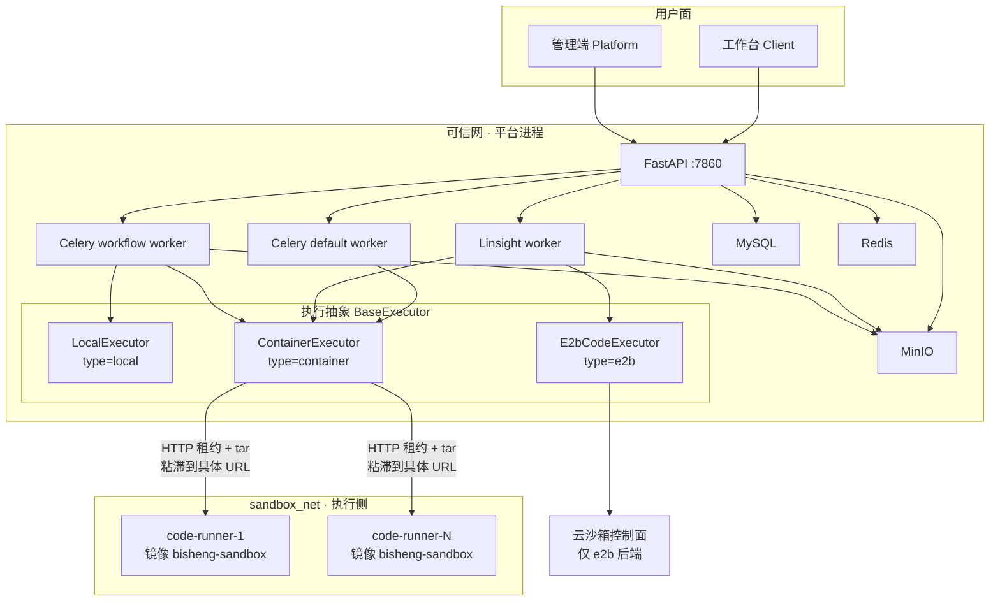

要点：

- 五条业务路径（灵思 / 日常 / 助手 / 工作流 Agent / 工作流工具节点）加上工作流代码节点，全部汇合到 `BaseExecutor`，不各自连沙箱。
- 只有 **worker** 同时连可信网与 `sandbox_net`。runner 不挂到承载 MySQL / Redis / MinIO 的网络，因此即使用户代码扫内网，也解析不到中间件主机名（AC-12）。
- 产物进 MinIO 由 worker 上传，执行侧零凭据（决策 3）。
- 云沙箱是 `BaseExecutor` 的另一个子类，不伪装成副本。

| # | 路径 | 谁发起 | 跑在哪个 worker | 会话策略 | 文件进出 |
|---|---|---|---|---|---|
| 1 | **灵思任务模式** | 模型 `tool_call` 代码解释器 | Linsight worker | `keep_session=True`，多轮粘滞同一副本同一目录 | 执行前 copy-in 任务工作区（用户原件 + 已物化技能包）；产物回工作区，下一轮可继承 |
| 2 | **工作台日常会话** | 同上 | Celery default worker | `keep_session=False`，一次 `run` 结束即 DELETE | **不**把用户上传原件送进沙箱；附件只抽文本进 prompt（本期不改） |
| 3 | **助手** | 同上 | Celery default worker | 同日常会话，一次一清 | 同日常会话：解释器看不到上传原件 |
| 4 | **工作流 Agent 节点** | 节点里模型调代码解释器工具 | Celery workflow worker | 一次一清 | 工具工作目录 copy-in / copy-out；产物由 worker 上传 MinIO |
| 5 | **工作流工具节点** | 搭建者直接挂代码解释器工具 | Celery workflow worker | 一次一清 | 同路径 4 |
| — | **工作流代码节点**（档 B，同一底座不同包装） | 节点跑搭建者写的 `main` | Celery workflow worker | 一次一清 | wrapper 走同一个 `/exec`；`ast.parse` 仍在本地。系统级开关可回退到进程内 `exec` |

**档 A：LLM 代码解释器（上表 1–5）**

`模型发起 tool_call` → `CodeInterpreterTool._run` → `ContainerExecutor.run`（继承共享的 `run_with_dir`）→ `execute_code`：`领租约 → copy-in 工作目录（tar, md5 delta）→ exec → copy-out` → 回到共享实现：`快照 diff → 根级产物归位 output/ → upload_minio → sync_to_workspace` → `{exitcode, log, file_list}` 进 `ToolMessage`。

需要进沙箱的，是 **会执行不可信 Python** 的入口。五条路径不各自连 runner，装配汇合如下：

| # | 产品入口 | 今天的装配锚点 | F068 怎么用沙箱 |
|---|---|---|---|
| 1 | 灵思任务模式 | `linsight/.../workbench_impl.py:_init_bisheng_code_tool` → `ToolExecutor` | `keep_session=True`；`run()` 时刻 copy-in 整个任务工作区（含已物化 `skills/`）；产物 `sync_to_workspace`；任务结束才 DELETE |
| 2 | 工作台日常会话 | `workstation/.../chat_service.py:_prepare_tools` → `ToolExecutor`（`DAILY_CHAT`） | `keep_session=False`；**原件不进沙箱**；一次 `run` 结束 DELETE |
| 3 | 助手 | `api/services/assistant_agent.py` → `ToolExecutor`（`ASSISTANT`） | 同路径 2 |
| 4 | 工作流 Agent 节点 | `workflow/nodes/agent/agent.py:_init_tools` | 一次一清；copy-in 该次工具工作目录 |
| 5 | 工作流工具节点 | `workflow/nodes/tool/tool.py` `invoke` | 同路径 4，无多轮粘滞 |

共同 dispatch：`tool/domain/services/executor.py:ToolExecutor` 注入 MinIO → `bisheng_langchain/gpts/load_tools.py:_get_native_code_interpreter` 按 `type` 显式三分支 `local | container | e2b`（禁止 `else` 吞未知 type，§5 坑 7）。

**档 B：工作流代码节点**

`CodeNode._run` → `SandboxCodeParser.exec_method('main', **params)` → 生成 wrapper → 同一执行端点 → 解析哨兵行得到出参 dict → `_parse_code_output` 校验字段 → 写入 `graph_state`。
`parse_code()` 仍在本地做 `ast.parse` 静态语法校验（不 `exec`），保持搭建期报错时机不变。

**明确不是「增加沙箱」的入口**（本期不改其执行位置）：

| 入口 | 原因 |
|---|---|
| 灵思 `ls` / `read_file` / `write_file` / `grep` | MinIO 工作区，worker 进程内；FilesystemMiddleware 不是隔离边界 |
| 知识库 / 附件解析 LibreOffice | 平台可信代码，留在解析链 |
| 工作台附件预览 | 不 exec 模型代码 |
| 技能包物化 | 写进工作区后再被路径 1 copy-in，本身不是执行器 |

### 4.2 关键数据结构 / 字段约定

**执行环境 HTTP 协议**（内部契约，仅 worker 侧调用；不暴露宿主端口）

| 方法 | 路径 | 鉴权 | 语义 |
|---|---|---|---|
| `POST` | `/v1/sessions` | 全局 `token`（只给 worker） | 领租约 → `{session_id, lease_token, lease_expires_at}` |
| `PUT` | `/v1/sessions/{id}/files` | 该会话 `lease_token` | tar.gz 流式 copy-in，随带 `{rel_path: md5}` 清单做 delta |
| `POST` | `/v1/sessions/{id}/exec` | 该会话 `lease_token` | `{code, lang, timeout_s}` → `{exitcode, stdout, stderr, duration_ms}` |
| `GET` | `/v1/sessions/{id}/files` | 该会话 `lease_token` | tar.gz 拉回本轮新增/修改文件 |
| `DELETE` | `/v1/sessions/{id}` | 该会话 `lease_token` | 擦除运行目录、释放租约 |

路径参数用 `{id}`；URL 中**不得**出现 `config` 字样（客户 WAF 会把含 `config` 的 URL 当敏感文件探测拦掉，请求到不了后端且无访问日志）。`lease_token` 与 `session_id` 绑定：用 A 的令牌打 B 的路径回 403。子进程环境**不得**出现全局 `token` 或任何 `lease_token`。默认一会话模式也走这套鉴权，避免以后开槽位时漏掉。

**HTTP tar 文件进出（决策 3 的落点）**

文件只在 worker 本地 `dir_path` 与该 session 的 `work_dir` 之间搬。runner **不连 MinIO**。`execute_code` 只负责把目录镜像过去再把本轮变更镜像回来；快照 diff、根级归位 `output/`、`upload_minio`、`sync_to_workspace` 仍在 worker 的 `run_with_dir`（决策 4）。不用 docker `put_archive`（只读 rootfs 不兼容）。

copy-in：

1. 在 `run()` 时刻扫描 `dir_path`（灵思 = `uploads/` `output/` `scratch/` `skills/`；日常 / 助手多为空临时目录；工作流工具 = 该次工作目录）。不要在装配时预扫——技能包物化晚于预扫，会让 `skills/` 结构性缺失（AC-11，§5 坑 4）。
2. 只收普通文件和目录；跳过 socket / 设备；相对路径与 tar 成员都拒绝 `..` 和绝对路径（zip-slip）。
3. 单文件超过 `max_copy_in_bytes`：跳过并在日志点名（AC-10），不拆整租约。
4. 按相对路径算 md5，对比 runner 内存表 `md5_index`：相同则本轮不进 tar。
5. `PUT .../files`，body 为流式 tar.gz，清单走请求头 `X-File-Manifest`（JSON `{rel_path: md5}`）。不要按文件拆多次 HTTP。
6. runner 校验租约 → 跳过已命中路径 → 解到本 UUID 目录 → 更新 `md5_index`。独立 uid 模式：root 写入再 `chown -R`。
7. copy-in 是按相对路径 **upsert**。worker 侧已删除的文件本期不从 runner 删（整租约 DELETE 才清空）。sticky 第二轮因此只补增量。

exec 前 runner 对 `work_dir` 拍执行前快照。超时 / OOM **不** copy-out 半成品（AC-16）。

copy-out：`GET .../files` 递归打包相对执行前快照新增或内容变化的文件（禁止只 list 一层，§5 坑 12）。tar 只含该 session 目录。worker 解到 `dir_path` 后再做 `pre_snapshot` diff（AC-07）、根级归位（AC-08）、MinIO 与工作区镜像（AC-09）。

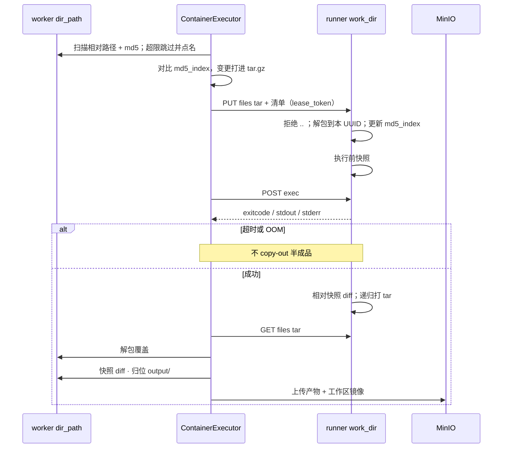

各路径实际拷什么：灵思 = 当前工作区全量（含技能包），后续轮次只传 md5 变化；日常 / 助手 = 通常空目录，脚本写出的文件仍走 `file_list`、不回写会话附件；工作流 Agent / 工具 = 该次工具目录；代码节点 = 通常无业务文件，出参走 stdout 哨兵。

**何时整目录打 tar**：只发生在 `type=container` 的 `execute_code` 里、`POST /exec` 之前（以及成功后的 copy-out）。`local` 就地跑、`e2b` 走逐文件 `files.write`，都没有目录 tar。扫描是全目录；**进 tar 的只有 md5 对不上的文件**——「整目录打包」指一次 HTTP、一份 tar.gz，不是每次把全部字节再传一遍。

| 时机 | tar 里实际是什么 |
|---|---|
| 新租约第一次 copy-in | 工作区里未超 `max_copy_in_bytes` 的普通文件，接近全量 |
| 灵思 sticky 后续轮次、文件未改 | 空包或几乎空（md5 命中跳过） |
| sticky 后续轮次、脚本刚写出文件 | 只含变更相对路径 |
| 租约 404 / 副本重启后再 exec | 重新领约，从 worker 工作区 **全量** 再打一份 |
| copy-out（`GET .../files`） | 相对 **执行前快照** 新增或内容变了的文件，不是整盘 |
| 日常 / 助手 | `keep_session=False`，每次新租约；`dir_path` 常为空，tar 常为空 |

容器模式 **没有** E2B 那条 5MB 自动推送天花板（那是 F035 产品阈值，见 §4.8 / §5 坑 17）。单文件超 `max_copy_in_bytes` 跳过并点名（AC-10），其余仍进同一份 tar。

**工具结果**（模型可见，与本地模式一致）：`{"exitcode": int, "log": str, "file_list": [presigned_url]}`

**工具配置** `gpts_tools.extra`：`type` 取值扩展为 `local | e2b | container`；新增 `config.container = {profile, timeout}`。接入参数（endpoint / token / 池容量）**不进** `extra`，走系统配置。

**系统配置**：新增 `Settings.sandbox_conf`。发现相关：`endpoints`（显式覆盖，非空则跳过发现）/ `discover_host_pattern`（默认 `code-runner-{n}`，K8s 配 `code-runner-{n}.code-runner`）/ `discover_index_start`（compose 1，K8s 0）/ `discover_max` / `discover_ttl_s` / `discover_port`。其余：`token` / `pool_lease_ttl_s` / `max_sessions_per_replica` / `pool_acquire_timeout_s` / `default_timeout_s` / `max_copy_in_bytes` / `code_node_enabled`。env 覆盖形如 `BS_SANDBOX_CONF__DISCOVER_HOST_PATTERN`。**不要**增加 `deploy_mode` / `orchestrator` 字段（决策 12）。

**错误码**：模块 **280**，`28001` 执行环境不可达 / `28002` 容量已满 / `28003` 执行超时 / `28004` copy-in 超限 / `28005` 代码节点出参不可序列化 / `28006` 执行环境响应不合契约。落码时按 C5 回写 `docs/constitution.md` 与本版 release-contract。

### 4.3 关键模块职责

| 模块 / 文件 | 职责 | 不做什么 |
|---|---|---|
| `code_interpreter/base_executor.py` | 路径规则文案、日志裁剪、逃逸拒绝、产物归位、MinIO 上传、工作区镜像；`execute_code` 为可覆盖缝（**不是** `@abstractmethod`：冻结的 `E2bCodeExecutor` 只 override `run`，标成抽象会让它无法实例化） | 不知道代码在哪执行 |
| `code_interpreter/local_executor.py` | 以子进程在本机执行 | 不再持有产物收割逻辑（上提共享） |
| `code_interpreter/container_executor.py`（新） | 租约、tar copy-in/out、调 exec | 不做快照 diff、不上传 MinIO |
| 执行侧 runner 服务（新） | 收文件、跑子进程、回文件、清目录 | 不认识 `main`、不认识工作区、不连任何中间件 |
| `workflow/nodes/code/code_parse.py` | 静态语法校验 + 生成 wrapper + 解析结果 | 不再 `exec` 用户代码 |
| `linsight/.../workbench_impl.py` | 给灵思注入工作区路径与会话粘滞策略 | 不再为容器模式预扫 `file_list`（见 §5 坑 4） |

### 4.4 镜像数量与内容

本期 **只新增 1 个镜像**：`dataelement/bisheng-sandbox`。

| 镜像 | 谁构建 | 本期动作 |
|---|---|---|
| `bisheng-backend` | 已有 | 不改镜像职责；worker 里多一个 HTTP 客户端 |
| `bisheng-frontend` | 已有 | 配置弹窗加一个选项 |
| **`bisheng-sandbox`（新）** | 本 Feature | 从 `src/backend/base.Dockerfile` 派生：完整 venv + LibreOffice/pandoc/字体 + runner HTTP 进程。一份镜像同时当「执行环境」和「租约服务」，不拆 runner-manager 镜像 |
| 云沙箱 | 厂商 | 不构建。`e2b` 继续走其 SDK，不包进我们的镜像 |

不拆第二份瘦镜像的原因见决策 7。不拆 manager 镜像的原因见决策 2。

架构变体（aarch64 / x86_64 / 如有龙芯）是**同一 Dockerfile 的多架构构建**，不是多套镜像设计。容器以只读 rootfs 跑，镜像层执行侧改不掉；可写的只有运行时 `/tmp` tmpfs。

| 层 | 装什么 | 为什么 |
|---|---|---|
| 基础 | `python:3.11-slim` | 与后端同一条 Python 线 |
| 办公二进制 | **完整** LibreOffice（须含 Writer / Impress / Calc，不能只装 `libreoffice-writer`）、`pandoc` 3.6.4（`/usr/bin/pandoc`）、中文字体 `fonts-wqy-zenhei` | 灵思价值链是 docx / pptx / xlsx / pdf；缺组件时技能包探测并降级，不把整任务打成失败 |
| 媒体 | `ffmpeg`（随 base 带入） | 存量技能 / 代码节点可能调到 |
| Python | 按后端 `uv.lock` **全量** `uv sync --frozen --no-dev --no-install-project`，venv 在镜像内（如 `/app/.venv`） | 代码节点能 `import` 后端环境里的任意第三方包；`--no-install-project` 把 FastAPI / Celery / 灵思源码留在镜像外（AC-15 / AC-28）。不对等 = 某客户某条工作流 `ImportError`（决策 7） |
| 进程 | runner HTTP 监听 8080（PID 1 = `serve.py`），不映射到宿主。监督进程读 `SANDBOX_TOKEN`；worker 侧对应 `BS_SANDBOX_CONF__TOKEN`，compose 用同一插值，token 不进镜像层 | 租约 / tar / exec / 清理；与执行环境同一容器 |
| 运行时挂载（不进镜像层） | `/tmp` tmpfs：`sessions/<uuid>/`、LibreOffice profile、fontconfig | 只读 rootfs 下 soffice 不能写镜像路径；按 session 覆盖 `HOME`/`TMPDIR` |

对模型承诺、须写进工具描述的库（与本地模式对齐，AC-04）：`pandas` · `numpy` · `matplotlib` · `openpyxl` / `XlsxWriter` · `python-docx` · `python-pptx` · `Pillow` · `reportlab` · `PyMuPDF`（`import fitz`）。不承诺 `pdfminer` / `pdfplumber` / `PyPDF2`；`pip install` 不可用（只读根文件系统 + 执行侧无外网）。

venv 里还会带上 `minio`、`redis`、`sqlalchemy`、`playwright` 等——这是代码节点回归的代价，不是执行侧可以连中间件。没有连接串、解析不到中间件主机名，`import minio` 成功 ≠ 能上传。Playwright **Python 包**随锁文件进来；**Chromium 浏览器二进制**默认不装进沙箱（体积与 `cap_drop: ALL` + 无图形栈冲突）。需要浏览器的技能必须运行时探测，没有就降级。

**镜像里明确没有**：平台业务代码（FastAPI / Celery / 灵思 worker）、`config.yaml` / `entrypoint.sh` / 密钥与中间件口令（AC-15 / AC-28）、`docker` CLI 与 `docker.sock`、用户工作区与技能包源码（执行前 copy-in）。构建阶段的 gcc / vim / `wget` 用完即丢，运行时不要把 base 的调试包原样留下。

### 4.5 副本池 + 租约

**池是什么**：N 个完全相同的 `code-runner` 进程，每个跑在自己的加固容器里。N 由编排声明（compose `replicas` / K8s `spec.replicas`），也就是并发容量上限。

**租约是什么**：某个副本上的一个工作目录 + 一把互斥锁，不是新容器。

**运行结构图（一次执行）**

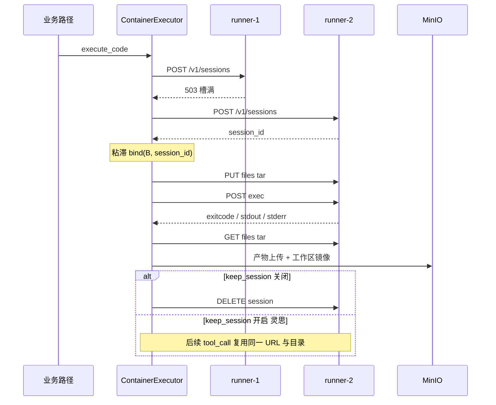

**运行结构图（副本内部）**

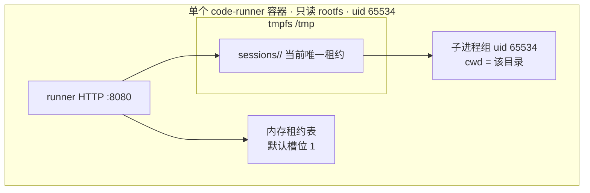

默认同一时刻只有这一份目录。并发租户隔离走**另一台容器**，不走兄弟目录。

每个副本内存一张表：`{session_id, work_dir, md5_index, last_active, sticky, uid}`。上限 `max_sessions_per_replica`（**默认 1**，决策 11）。表满则该副本对 `POST /v1/sessions` 返回 503，由 worker 换下一台。`>1` 必须同时打开决策 13 的 uid 隔离，否则拒绝启动——否则只是同 uid 并行，不是互不可读。

同副本的防串味（A 的软护栏，挡误操作）：

| 手段 | 做什么 | 挡不住什么 |
|---|---|---|
| UUID 工作目录 | 邻居路径不可猜 | 仍可 `listdir('/tmp/sessions')`（若槽位 >1） |
| cwd + `HOME`/`TMPDIR`/`XDG_CACHE_HOME` 指到本目录 | 相对路径与缓存写在本 session | 绝对路径仍指向容器内其它位置 |
| copy-out 只打包本 `work_dir` | 回收不会把邻居文件交给 worker | 用户代码在 exec 期间已经能读邻居 |
| DELETE / idle TTL 擦目录 | 下一租约看不到上一租约残留 | 租约还活着时的并发读取 |
| `workspace_escape_guard` | 拒绝 `..`、`~`、从根扫盘的源码形态 | 运行期拼出来的绝对路径 |

内核级隔离只发生在容器与容器之间：独立 mount / pid / net namespace、独立 cgroup、`sandbox_net` 不可达中间件。这是「加副本」而不是「加槽位」的原因。

**如何加固 runner 内会话数据（决策 11 的落点）**

并发租户不靠同容器里两把锁，靠再起一台 runner。同容器要防的是**上一租约的残留**被下一租约读到。POC 里整容器 `HOME=/tmp/home` 会把 LibreOffice profile / fontconfig 留给下一个租户，必须改成按 session 覆盖。

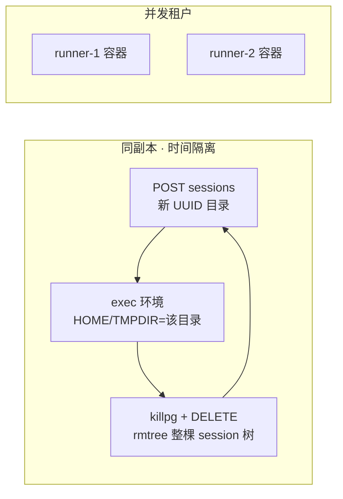

| 层 | 本期必做 | 为什么算加固 |
|---|---|---|
| 容量 | `max_sessions_per_replica=1` | 同 uid 下没有第二个可读的邻居目录 |
| 路径 | 每张租约新 UUID，不复用上一租约路径 | 下一租户猜不到、也 `open` 不到旧路径 |
| 环境 | 子进程 env 白名单；`HOME` / `TMPDIR` / `XDG_CACHE_HOME` / `XDG_CONFIG_HOME` **只**指向该 UUID 目录 | soffice / fontconfig / pip 缓存写在本租约里，不会落到容器级 `/tmp/home` |
| 进程 | `start_new_session=True`、超时 `killpg`、`setrlimit` | 不留孤儿进程占着旧文件；不让一次执行吃光容器 |
| 擦除 | DELETE / TTL：`rmtree` 该 UUID 整树（含隐藏的 LibreOffice profile），再确认 `/tmp/sessions` 下为空 | 时间换空间的真正边界；tmpfs 上删掉即无落盘 |
| copy-out | 只打包本 `work_dir` | 回收路径不会把 runner 自己的租约表文件带给 worker |
| 源码 | worker 侧保留 `workspace_escape_guard` | 挡住误写成 `~`、`..`、从根扫盘 |
| 容器 | 只读 rootfs、`/tmp` tmpfs noexec、非 root、`cap_drop: ALL`、独立 `sandbox_net` | 会话数据出不了这台容器；写不进镜像层 |

**明确不在本期默认启用、也不能当互不可读替代的手段**：

- 同 uid + `chmod 0700`（决策 11 的 B）—— DAC 上恒假
- 仅 Landlock / user namespace + `pivot_root`——信创内核经常没有
- 按次新容器 → F103

运维把槽位调到 >1 时，必须启用下面的 uid 隔离；只调槽位、不换 uid，两个 session 仍然互相可读。

**同容器两 session 互不可读、不可写、不可删（决策 13）**

三件事不是三套机制：文件读/写/unlink 走 DAC；删整个租约还要堵住 HTTP。

| 邻居想做的事 | 谁挡住 | 失败形态 |
|---|---|---|
| `open` / 读邻居文件 | 工作目录 `uid:uid` `0700` | `EACCES` |
| `write` / 改邻居文件 | 同上（写要文件写权限） | `EACCES` |
| `unlink` / `rm -rf` 邻居目录里的文件 | 工作目录 `0700`，邻居无写位 | `EACCES` |
| `rmdir` / `unlink` 邻居这一层目录项 | 父目录 `/tmp/sessions` `root:root` `0711`（他人不可写） | `EACCES` |
| 在 `/tmp/leak` 丢世界可读文件给邻居 | `/tmp` 本身 `0755` root，不是 `1777`；`TMPDIR` 强制在本 session 目录；子进程 `umask 0077` | 在 `/tmp` 创建失败 |
| `kill` 邻居的 Python | 无 `CAP_KILL`，不能给其它 uid 发信号 | `EPERM` |
| `DELETE /v1/sessions/<邻居>` | 该路径要邻居的 `lease_token`；全局 `token` 与 lease 令牌都不进子进程 env | `401` / `403` |

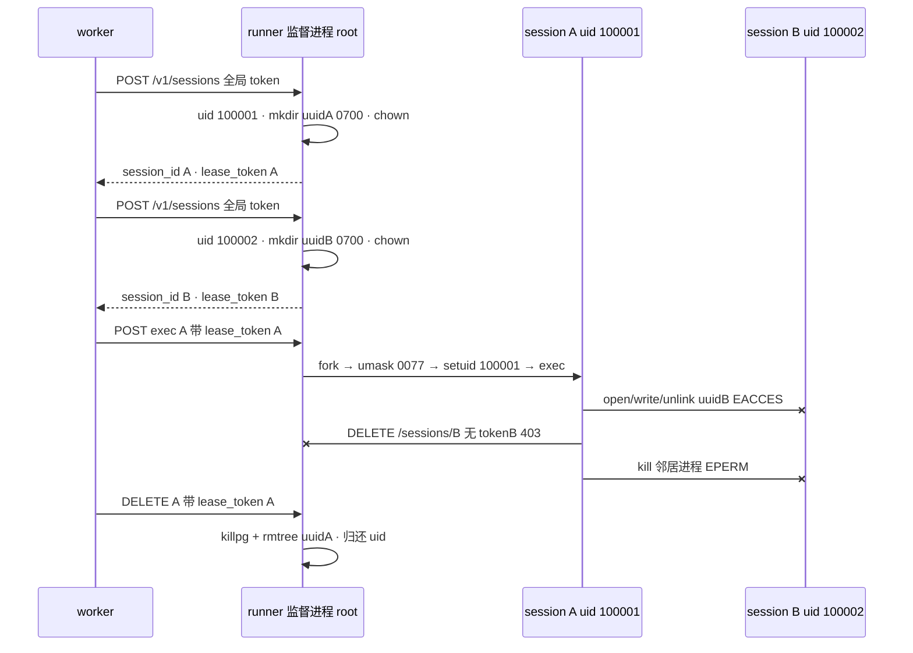

落点：

1. 容器以 root 起监督进程；`cap_drop: ALL` 之后只加回 `SETUID`、`SETGID`、`CHOWN`（不要 `CAP_KILL`）。`no-new-privileges` 仍开。
2. 启动时把 `/tmp` 收成 `0755 root:root`（compose tmpfs 加 `mode=755`），再建 `/tmp/sessions` `0711`。不要用 Docker tmpfs 默认的 `1777`，否则两个 session 都能在 `/tmp` 里塞世界可读文件。
3. 每张租约：独立 uid、UUID 目录 `0700`、`chown` 给该 uid。copy-in 由 root 写入再 `chown -R`。
4. exec：`chdir`、env 白名单（无全局 token、无任何 lease_token）、`umask 0077`、`setrlimit`、`setgid`+`setuid` 后 `exec`。
5. 变更类 HTTP（files / exec / DELETE）校验 **该 session 的 lease_token**；用 A 的令牌打 B 回 403。只有 `POST /v1/sessions` 用全局 `token`。
6. DELETE 只允许持有对应 `lease_token` 的 worker：root `killpg` + `rmtree`，归还 uid。用户代码既不能 unlink 邻居目录项，也不能借 API 释放邻居租约。

Landlock / user namespace **不能**替代这套。内核 ≥ 5.13 可在 `setuid` 后再加 Landlock 把可见树收到 `work_dir`，挡「猜到 UUID 且对方 chmod 0777」这类边角，不是本期前置。

AC-13 在此模式下收窄为：用户代码非 root、只读 rootfs、默认 seccomp、`no-new-privileges`；监督进程允许那三个 cap。默认 `max_sessions_per_replica=1` 时仍走「容器 user 65534 + cap_drop ALL」，但 lease_token 鉴权照做。

**领租约（worker 侧，决策 9 + 决策 12）**

```
urls = sandbox_conf.endpoints 或 discover()   # 短 TTL 缓存的具体 URL 集合
shuffle(urls)
for url in urls:
    r = POST url/v1/sessions
    if r.status == 200:
        bind (url, session_id, lease_token) on this executor instance   # 粘滞这台，不再走发现名
        return
    if r.status == 503:
        continue
raise 28002 容量已满
```

**执行流程（发现 + 领租约）**

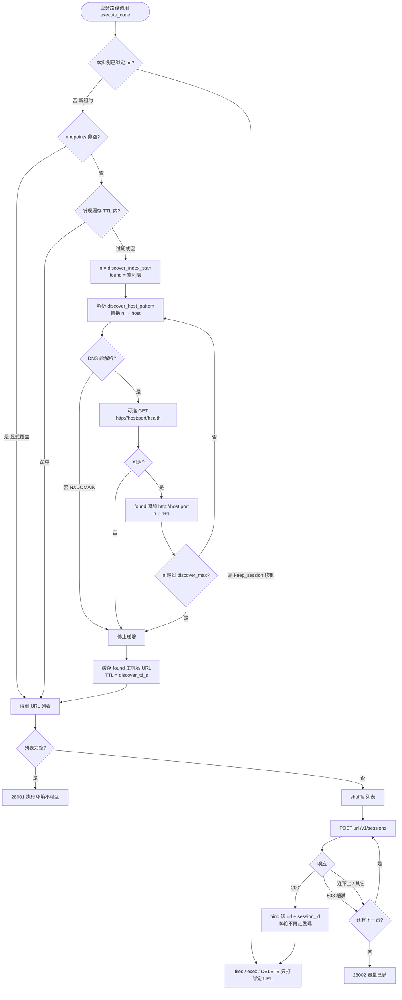

**时序（发现 + 领租约 + 粘滞）** — 算法与 HTTP 在两种编排下相同；下面用 compose 主机名举例。DNS 问谁、序号从几开始，见 §4.6 两条对照时序。

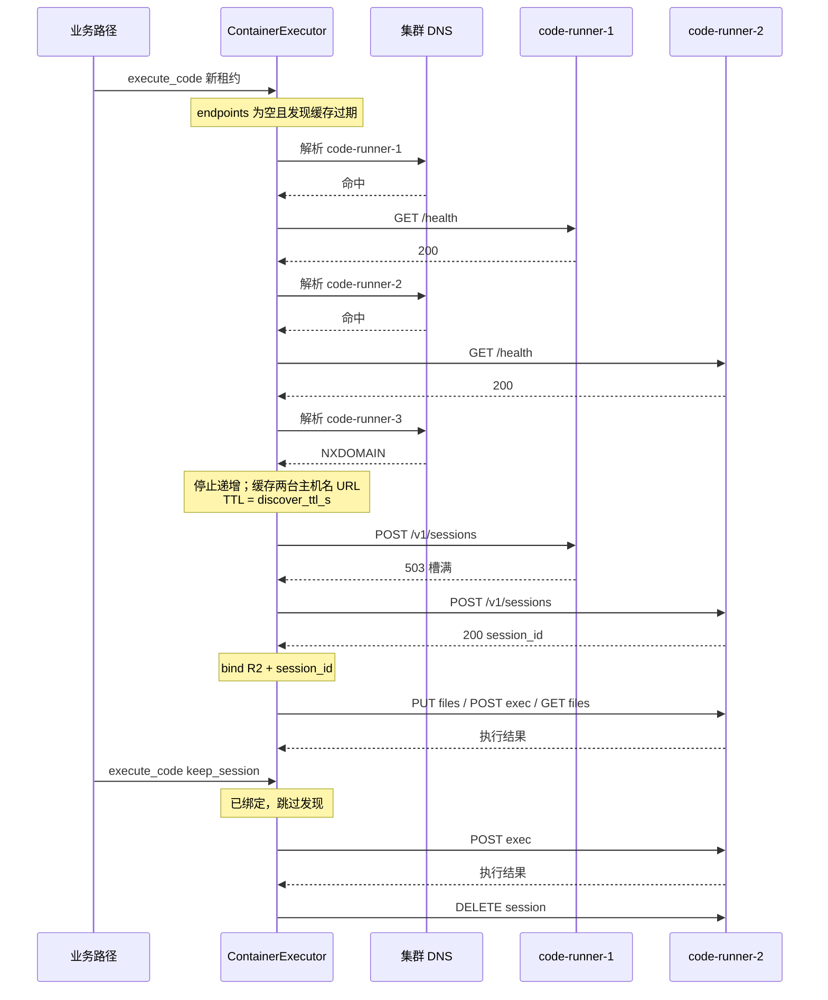

`discover()`：按 `discover_host_pattern` 从 `discover_index_start` 递增替换 `{n}`，对 `host:port` 做 DNS 解析（可选再探 `GET /health`）。连续 NXDOMAIN / 连不上则停止（StatefulSet / 具名 compose 服务都是连续序号）。结果缓存 `discover_ttl_s`（建议 15～30s），缓存的是主机名 URL 不是 Pod IP。TTL 过期后下次领租约再发现，扩容无需重启 worker。已绑定的 sticky 会话不重新发现。

之后所有 `files` / `exec` / `DELETE` 都打到绑定的那台 `url`，不再重新挑选。灵思 `keep_session=True` 时，同一 `ContainerExecutor` 实例跨多轮 tool_call 复用这组 `(url, session_id)`。日常 / 助手 / 工作流工具 / 代码节点 `keep_session=False`：一次 `run()` 结束就 `DELETE`。

**副本内一次 exec**

1. 校验租约未过期，过期则 404，worker 重新领租约并 copy-in
2. 在 `work_dir` 起子进程（`start_new_session=True`、env 白名单、`setrlimit`）
3. 超时 `killpg` 整组
4. 同一 `session_id` 上的 exec **串行**（一把 asyncio 锁）。默认槽位 1，不存在「同容器两个 session 并行」；若运维把槽位调大，并行 session 仍是同一 uid，不作为隔离手段

**释放 / session 异常回收**

回收动作只有一套：`killpg` 该 session 进程组（若还在跑）→ `rmtree` 整棵 UUID 目录（含 LibreOffice profile）→ 从内存租约表拿掉槽位。正常路径由 worker `DELETE`；**worker 没叫到 DELETE 时，runner 必须自己把槽收回来**，否则默认一副本一会话会把池子永久占死。

| 腿 | 谁做 | 何时 |
|---|---|---|
| 主动释放 | worker `DELETE`（`try/finally`，成功失败都走） | `keep_session=False` 的一次 `run` 结束；灵思任务结束 / 用户取消 |
| 兜底释放 | runner 按 `last_active` 扫 idle，超过 `pool_lease_ttl_s`（建议 **900s**）视同 DELETE | worker 崩溃、网络丢 DELETE、进程被杀来不及善后 |

`files` / `exec` 成功处理时刷新 `last_active`。TTL 要盖住灵思两轮 tool_call 之间的思考间隙；间隙过长被回收后，下一轮 exec 收到 **404**，worker 重新领租约，再从自己的工作区 / MinIO 全量 copy-in。

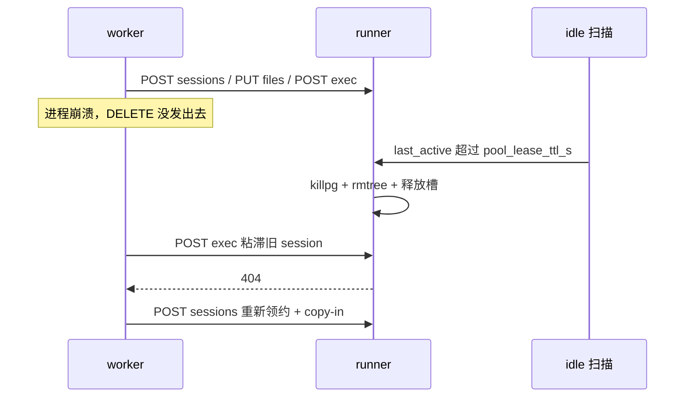

| 异常 | runner 立刻做什么 | 槽位何时释放 | 对业务 |
|---|---|---|---|
| 单次 exec **超时** | `killpg` 整组；本轮不 copy-out 半成品 | 非 sticky：worker finally DELETE。灵思 sticky：**不**拆整租约 | `28003`（AC-16） |
| 用户代码 **非 0 退出** | 交回 `exitcode/stdout/stderr`；不自动重跑 | 同超时 | 模型看见失败日志；不静默回落本地 exec |
| **OOM**（退出码 137） | 内核已杀进程；runner **仍走 DELETE**（半残目录不可复用） | 立刻 | 单列 OOM 指标。sticky 下一轮 404 → 重新领约 + copy-in |
| **copy-in 单文件超限** | 跳过该文件并点名（AC-10） | 非 sticky 结束时 DELETE | 超限不是静默丢弃 |
| exec / copy 中途 **协议不合 / 连不上** | 能杀则 `killpg` | worker 尽最大努力 DELETE；失败交给 TTL | `28001` / `28006`，禁止回落进程内 `exec`（AC-05） |
| **worker 崩溃** / DELETE 丢失 | 当时无感知 | idle TTL 到期视同 DELETE | 槽不会永久占死 |
| sticky 间隙 **租约过期** 后再 exec | 回 404，目录已擦 | 已释放 | worker 解绑，重新领约 + 全量 copy-in |
| **runner 容器重启** | tmpfs + 内存表清空 | 立刻 | 粘滞失败 → 重新发现 / 领约 + copy-in |
| K8s **缩容**掉被粘滞的 Pod | 同重启 | 旧 Pod 消失即释放 | 按租约 404 处理，换一台 |
| 池满，**根本没领到**租约 | 无 session 可回收 | — | `28002`，与执行失败分列（AC-27） |

原则：非 sticky（日常 / 助手 / 工作流 Agent·工具 / 代码节点）任何结束路径都释放。sticky（灵思）只有任务结束、用户取消、OOM、runner 消失、idle TTL 才拆租约；单次超时或脚本报错保留工作目录。runner **不**依赖 Redis、不回调 worker；兜底只能是本机时钟扫表。回收后确认该 UUID 不在 `/tmp/sessions` 下（AC-17）。

**容量数字怎么算**

`总槽位 = replicas × max_sessions_per_replica`。默认后者为 1，故总槽位 ≈ 副本数。灵思 sticky 会话会占槽直到任务结束或 TTL，所以槽位不是「每秒 QPS」，是「同时活着的执行会话数」。池满必须作为独立指标（AC-27），不能混进执行失败。需要更大并发时加 runner 副本（独立容器），不要把单副本槽位开大来冒充隔离。

**副本之间不共享磁盘、不共享 Redis**。租约状态只活在那一台的内存 + tmpfs 里。这是「worker 必须粘滞到 URL」的另一半原因。

### 4.6 compose 与 K8s 如何挂沙箱

两种编排支持的是**同一件事**：声明 N 个 `bisheng-sandbox` 副本，worker 在领租约时按主机名模式发现它们，并用网络策略把 runner 从中间件网段里摘出去。应用代码看不到 docker / kube-apiserver。**本期交付 compose；K8s 协议兼容，不强制交清单、不要求客户新上集群。**

| 维度 | docker compose（本期交付） | Kubernetes（协议兼容） |
|---|---|---|
| 副本怎么声明 | 显式服务 `code-runner-1` / `code-runner-2`，**不用** `deploy.replicas`（匿名实例没有稳定 DNS，粘滞会丢） | `StatefulSet` + headless Service；**不用** `Deployment` + ClusterIP |
| worker 怎么找到副本 | 默认发现 `code-runner-{n}`（n 从 1 递增到连不上为止）；`endpoints` 非空则覆盖 | 发现 `code-runner-{n}.code-runner`（n 从 0）；粘滞具体主机名，不粘滞 Service 名 |
| 网络隔离怎么做 | 独立网络 `sandbox_net`：runner 只连它；worker 双挂（default + sandbox_net）；**不**把 runner 端口映射到宿主 | `NetworkPolicy`：只允许来自 worker Pod 的 8080；runner 不加入中间件 Service 的 selector |
| 加固怎么落 | compose：`cap_drop: ALL`、`read_only: true`、`mem_limit` / `pids_limit`、`security_opt: no-new-privileges`、`tmpfs`、`user: 65534` | 等价的 `securityContext` + `resources.limits` + `emptyDir.medium: Memory` 作为 `/tmp` |
| 扩缩容 | 加一个具名服务；worker 在 TTL 后自动发现，不必改 endpoints | 改 `spec.replicas`；同样等 TTL 后发现。缩容中被粘滞的副本按租约 404 处理 |
| 明确不做 | runner 向 Redis/API 自注册；前面加 nginx / VIP；挂 `docker.sock` | 普通 ClusterIP 当唯一入口；backend 引 `kubernetes` 包；runner 出站注册 |

发现时序**结构相同**，差别只在「问哪套 DNS、主机名怎么写」：

| | docker compose | Kubernetes |
|---|---|---|
| DNS 谁答 | Compose 项目内嵌 DNS（`sandbox_net`） | CoreDNS；headless Service 把 StatefulSet 序号写成 A 记录 |
| 查询名 | `code-runner-1`、`code-runner-2`、… | `code-runner-0.code-runner`、`code-runner-1.code-runner`、… |
| `{n}` 起点 | 1（compose 服务名习惯从 1） | 0（StatefulSet ordinal） |
| 停的条件 | 下一个服务名 NXDOMAIN | 下一个 ordinal NXDOMAIN |
| 粘滞绑什么 | `http://code-runner-2:8080` | `http://code-runner-1.code-runner:8080` |
| 与 runner 的 HTTP | 相同：`POST /v1/sessions` → files/exec/DELETE | 相同 |
| 不做什么 | 不查一个叫 `code-runner` 的 VIP | 不把 Service 名 `code-runner` 当唯一入口（那会变成多 A / kube-proxy 打散） |

worker 代码是同一段 `discover()`，只换 `discover_host_pattern` 与 `discover_index_start`。`config.yaml` **不**写「部署方案 = k8s / compose」：没有作用对象（零 docker / 零 k8s 客户端），也避免和编排清单里的真实拓扑各写一份互相漂移。K8s 现场改那两个发现字段，或用 `endpoints` 钉死 URL。

**docker compose 运行拓扑**

worker 必须同时加入默认网络（访问 MySQL / Redis / MinIO）和 `sandbox_net`（访问 runner）。runner **只**加入 `sandbox_net`，且不 `ports:` 发布到宿主——隔离靠网络不可达，不靠「不告诉用户端口」。

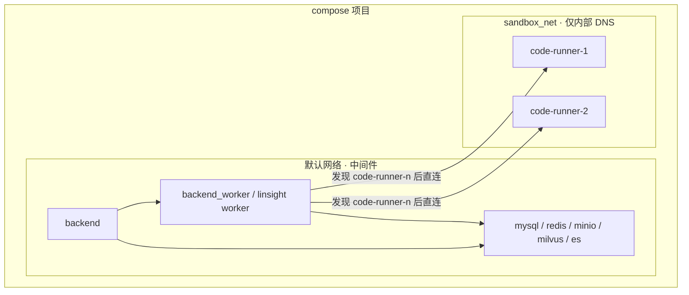

```yaml
# 不用 deploy.replicas 生成匿名实例——worker 需要稳定主机名做粘滞
networks:
  sandbox_net:
    internal: true          # 无出网；与 AC-12 对齐

services:
  backend_worker:
    networks: [default, sandbox_net]
    # 默认发现 code-runner-{n}；不必再写 ENDPOINTS
    # environment:
    #   BS_SANDBOX_CONF__ENDPOINTS: "http://code-runner-1:8080,http://code-runner-2:8080"

  code-runner-1: &runner
    image: dataelement/bisheng-sandbox:${TAG}
    networks: [sandbox_net]
    # 加固字段：cap_drop / read_only / mem_limit / tmpfs / user 65534
    # 无 ports: —— 不暴露到宿主
  code-runner-2:
    <<: *runner
```

**compose 发现时序**（Docker 内嵌 DNS；n 从 1）

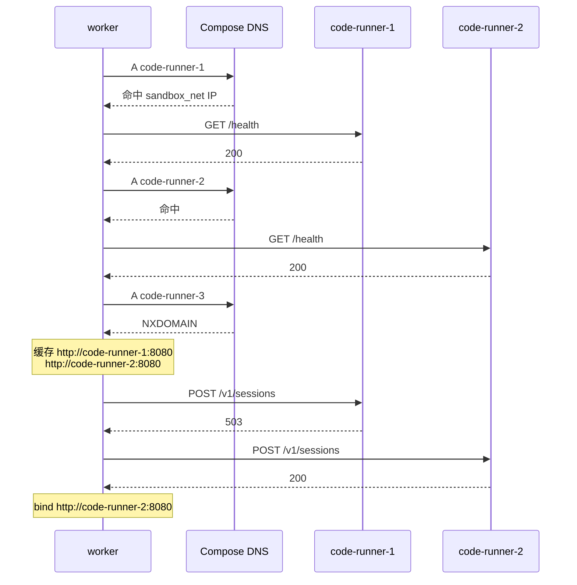

**Kubernetes 运行拓扑**

K8s 里没有「compose 网络」这个对象，等价物是：**headless Service 提供稳定 per-Pod DNS**（代替具名 compose 服务），**NetworkPolicy 切断中间件连通**（代替 `sandbox_net`）。worker 仍然拿一份 URL 列表，粘滞语义与 compose 完全相同。

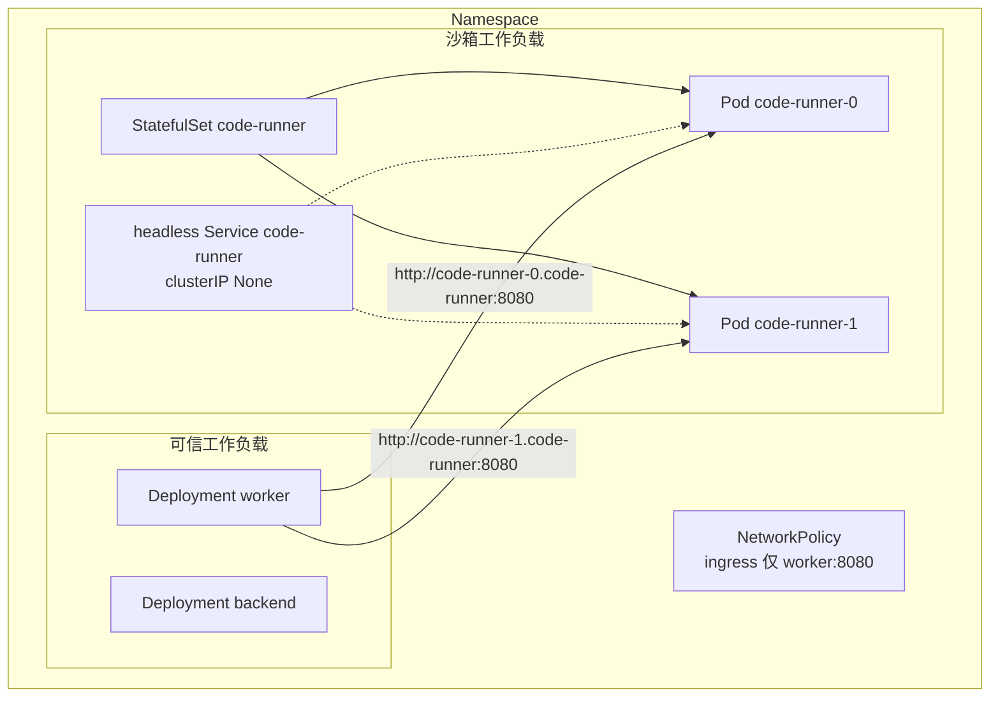

```yaml
apiVersion: apps/v1
kind: StatefulSet          # 不要 Deployment+ClusterIP：那会打散 sticky
metadata: { name: code-runner }
spec:
  serviceName: code-runner
  replicas: 2
  # securityContext / resources 与 compose 加固档一一对应
---
apiVersion: v1
kind: Service
metadata: { name: code-runner }
spec:
  clusterIP: None          # headless：code-runner-0.code-runner 可解析到 Pod
  selector: { app: code-runner }
  ports: [{ port: 8080 }]
```

worker **不必**列出每一台 Pod。配 `discover_host_pattern=code-runner-{n}.code-runner`、`discover_index_start=0`，领租约时从 0 递增解析直到 NXDOMAIN。粘滞的是 `http://code-runner-0.code-runner:8080` 这种具体主机名，不是 Service 名 `code-runner`。headless Service 的作用是让这些序号 DNS 存在，不是当 VIP。

**不要**用普通 ClusterIP 当唯一入口——kube-proxy 会把第二次 `exec` 打到另一台 Pod。也**不要**让 runner 向 Redis / API 注册：用户代码与 runner 同 netns，注册出站等于给执行侧开中间件通道（决策 12）。

backend / worker **不**引入 `kubernetes` / `docker` Python 包，不挂 `docker.sock`，不访问 kube-apiserver。编排系统负责把 Pod 拉起来并写入 DNS；应用只做 DNS 查询 + HTTP。

**K8s 发现时序**（CoreDNS + headless；n 从 0。与 compose 相比只换查询名，HTTP 段不变）

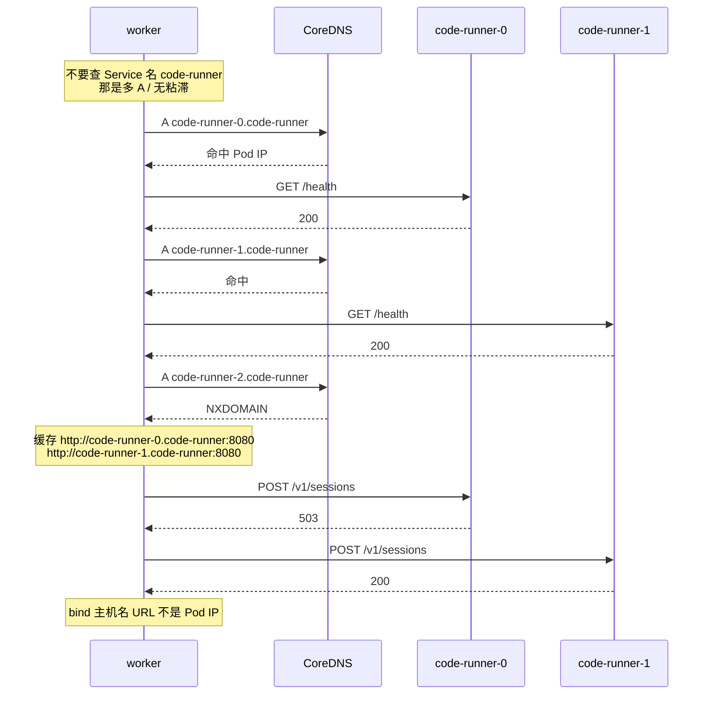

### 4.7 沙箱抽象层与云后端插拔

已有的缝就是 `BaseExecutor`。本 Feature 把它收成显式协议，而不是再套一层名字：

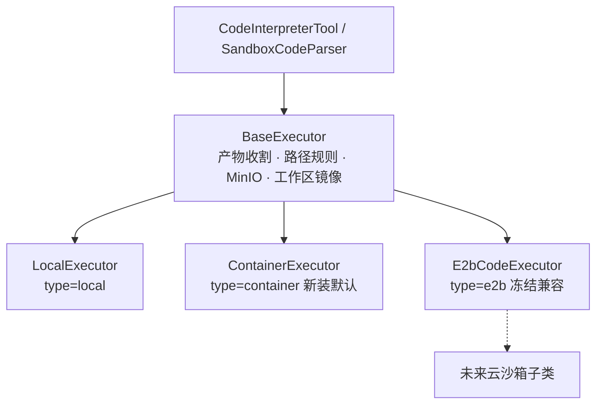

`load_tools._get_native_code_interpreter` 按 `gpts_tools.extra.type` 选子类；系统配置只给**被选中的那个后端**提供接入参数：

```yaml
# 发布稿里整段注释掉（坑 9）
# sandbox_conf:
#   discover_host_pattern: "code-runner-{n}"          # K8s: "code-runner-{n}.code-runner"
#   discover_index_start: 1                           # K8s: 0
#   discover_ttl_s: 15
#   token: "..."
#   pool_lease_ttl_s: 900
#   max_sessions_per_replica: 1
#   # endpoints: ["http://code-runner-1:8080"]  # 非空则跳过发现
#   # 不要加 deploy_mode / orchestrator：发现只认主机名模式（决策 12）
```

云后端**不**走 `/v1/sessions`。E2B 继续用 SDK 的 `Sandbox` / `files.write`；新云厂商实现同一对 `execute_code` + `close`，在自己的 `__init__` 里读自己的密钥。把云 API 伪装成自建副本只会把两种生命周期缠在一起。

默认值：新装 `type=container`（AC-24）；升级不改存量行（AC-23）。管理员仍可把单个工具改回 `local` 或 `e2b`。

### 4.8 后续若要正式支持 E2B（本期不做，只定接法）

本期冻结 E2B 功能改进（spec 排除项）。代码里 `E2bCodeExecutor` 已经能跑；「正式支持」是指把它收进 F068 同一套 `execute_code` 语义，并还掉已知债，而不是再接一套业务路径。现网依赖 `e2b-code-interpreter==1.5.2`（`Sandbox(api_key, domain, timeout)` 构造，不是较新的 `Sandbox.create()`）。

**E2B 线上是三层协议，不是一条 `/exec`**（所以不能伪装成副本池的 `/v1/sessions`）：

| 层 | 地址 | 鉴权 | 毕昇实际调用 |
|---|---|---|---|
| ① 控制面 | `https://api.e2b.app` REST：`POST/DELETE /sandboxes` 等 | `X-API-Key` | `Sandbox(...)` / `sandbox.kill()` |
| ② 数据面 envd | 默认端口 **49983**：`POST/GET /files`、ConnectRPC `Filesystem.*` / `Process.Start` | `E2b-Sandbox-Id` + `E2b-Sandbox-Port`；`secure: true` 时还有 `X-Access-Token` | `files.write` / `read` / `list` / `make_dir`。解释器 **不用** Process RPC |
| ③ Code Interpreter | 端口 **49999**：`POST /execute` NDJSON 流；健康检查 `/health` | 同上 access token | `sandbox.run_code(code)` → Jupyter kernel（沙箱内再转 `ws://localhost:8888/api/kernels/{context_id}/channels`） |

`run_code` **跨调用保留 kernel 变量**（上一轮 `x = 1` 下一轮还能用）。F068 `/exec` 是一次独立子进程，磁盘靠 sticky 目录保留，Python 进程不保留。访问沙箱的新写法是共享主机 `sandbox.{domain}` + 两个路由 header；旧写法 `https://{port}-{sandboxID}.e2b.app`。worker **直连**云控制面；runner 零出站。

**`SIZE_AUTOPUSH = 5MB` 不是 E2B 接口上限。** 是 F035（design §9.3.9）给「自动 copy-in」定的产品阈值：沙箱碰不到 MinIO，worker 必须 `f.read()` 整文件再 `files.write`；每次 `run` 把工作区全量出境会变成 silent bulk transfer。设计意图是 ≤5MB 自动 delta push，>5MB 由模型在 `required_files` 声明后再中转。现状对不上：工具 schema 只有 `python_code`；`_materialize_working_set()` 固定 `{}`；`workbench_impl._init_bisheng_code_tool` 装配时把 oversized 从 `file_list` 剔除。所以 **E2B 模式下 >5MB 等于进不去沙箱**。本地执行器不受影响（cwd=`file_dir`，原件可到 `_RAW_KEEP_MAX_BYTES` 50MB）。本期不还这笔债；容器模式用 `max_copy_in_bytes` + AC-10 点名跳过，不套 5MB 自动推送。

**不要做的**

- 不要把 E2B 伪装成副本池：不实现 `/v1/sessions`，不走 `discover_host_pattern`，不把 `Sandbox` 登记进 runner DNS。
- 不要在 runner 容器里调 E2B SDK。worker 直连 E2B 控制面，执行侧零出站（AC-12）继续成立。
- 不要把决策 13 的 uid / `lease_token` 套到 E2B 上。E2B 的隔离单元是 **一台 `Sandbox`（Firecracker）**，两个会话 = 两个 Sandbox，不是一个 VM 里两个目录。
- 不要继续在 `else: E2bCodeExecutor` 里吞掉未知 `type`。dispatch 必须显式 `local | container | e2b`。

**要做的（对齐决策 4 / 10）**

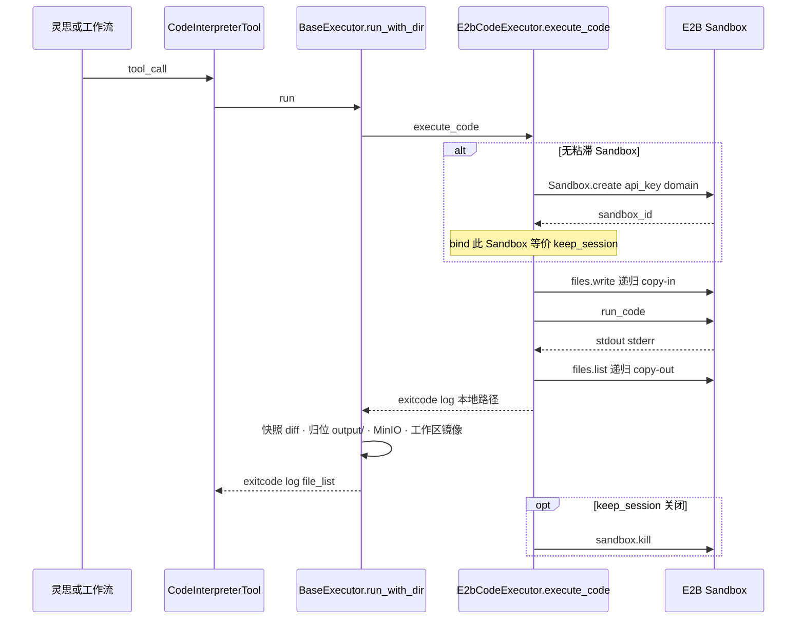

概念对照：

| 自建 container | E2B |
|---|---|
| `POST /v1/sessions` 领常驻副本上的目录 | `Sandbox.create`（或 pause 后 resume） |
| `(url, session_id, lease_token)` 粘滞 | `sandbox_id`；SDK 鉴权用 `api_key`，没有 localhost DELETE 问题 |
| `files` tar HTTP | `sandbox.files.write` / 读（逐文件，不是目录 tar）；worker 居中，沙箱仍不连 MinIO |
| `exec` 一次子进程 | `sandbox.run_code` → `:49999/execute` Jupyter 流；kernel 状态跨轮保留 |
| `DELETE` | `sandbox.kill` |
| 并发隔离 = 另一台 runner 容器 | 并发隔离 = 另一个 Sandbox |
| `sandbox_conf` 发现字段 | `config.e2b.api_key` + 可选 `domain`（有 domain = 私有，无 = 官方云）。**不要**把 E2B 写进 `sandbox_conf` |
| 无 5MB 自动推送天花板（有 `max_copy_in_bytes`） | `SIZE_AUTOPUSH` 5MB 自动推送；超限须 `required_files`（现状未接到工具 schema） |

**改造清单（独立 Feature，不并进 F068）**

1. `E2bCodeExecutor` 只实现 `execute_code` / `close`，删掉私有的产物收割；走共享 `run_with_dir`（决策 4）。出口改成与本地模式相同的 `{exitcode, log, file_list}`，或与决策 5 一起做契约归一——不要第三种 ToolMessage 形状再活一轮。
2. 灵思 `_init_bisheng_code_tool`：**删掉**为 E2B 预扫 `file_list` 的那段。copy-in 改到 `run()` 时刻，与 container 相同，`path_namespace_rules(include_skills=True)`。这是坑 4，不修则技能包在 E2B 里继续结构性缺失。
3. copy-out 必须**递归**列举（`files.list` 默认一层是坑 12）。FakeSandbox 必须尊重 path，否则单测继续绿、线上继续丢 `output/` 子目录。
4. `load_tools` 修坑 7：`config.e2b.type`（private/official）不得 `kwargs.update` 进执行器；只看 `domain` 是否为空。未知 `type` 报错，不要落入 E2B 分支。
5. 代码节点：`SandboxCodeParser` 已通过同一 `execute_code` 跑 wrapper。E2B 映像若缺后端 venv 里的包，存量工作流会 `ImportError`——这是决策 7 在云镜像上的翻版，要在工具描述里写清可用库，或只用 E2B 跑解释器、代码节点继续强制 `container`。
6. 配置：密钥与 domain 留在 `gpts_tools.extra.config.e2b`（或独立 `e2b_conf`），**不要**写进 `sandbox_conf`。云模式数据出境，管理端要能按工具关掉，不能当私有化默认（AC-23/24 仍以 container 为准）。
7. 错误：控制面不可达 / 配额满映射到 280 段或保留 E2B 原错误码，但必须可归因、禁止静默回落到 `local`（AC-05）。
8. 用例：办公技能包在 E2B 模板镜像上各跑通一次；明确官方 E2B 镜像有没有 LibreOffice——没有就不要承诺与 container 同能力，只承诺「能跑 Python」。

触发立项的条件：境外 SaaS、或客户已有可用的 E2B 自托管且接受其控制面依赖。私有化默认仍是自建副本池。

---

## 5. 已知坑 / 反直觉事实

| # | 反直觉事实 | 如果不知道会怎样 | 在哪处理 |
|---|---|---|---|
| 1 | 工具返回的 dict **原样进 `ToolMessage`**，三种后端吐三种形状且无归一层 | 顺手「优化」字段名，模型行为与一批用例同时崩，且看不出因果 | 决策 5；`container_executor.py` 出口固定为本地模式形状 |
| 2 | 成功日志有 30000 字符上限，是踩出来的：一次 112744 字节的结果越过 deepagents 卸载阈值，预览按行计算而 `json.dumps` 把整个结果压成一行，模型只看到开头，于是同一段脚本重发 79 次、78 分钟、13.8M token | 放开日志上限 → 复现该死循环 | `base_executor.py:MAX_SUCCESS_LOG_CHARS` / `clip_middle`；产物清单永不裁剪 |
| 3 | 只读根文件系统下**必须**把 `HOME` / `XDG_CACHE_HOME` / `TMPDIR` 指到 **本 session 的 tmpfs 目录**，不能用容器级 `/tmp/home` | 指到镜像只读路径 → soffice 失败；指到容器级共享 HOME → 下一租约读到上一租户的 office profile | 执行侧按租约覆盖 env；DELETE 时 rmtree 该树 |
| 4 | 灵思今天为 E2B 预扫工作目录生成 `file_list`，而技能包物化**晚于**这次快照，所以 E2B 模式下 `skills/` 结构性不可见（代码里有 `include_skills=False` 的自认，且被用例钉住） | 以为容器模式也看不到技能包，于是照抄 `include_skills=False`，白白丢掉这次改造最大的红利 | 容器模式在 `run()` 时刻 copy-in，`path_namespace_rules(include_skills=True)`；`_init_bisheng_code_tool` 的预扫与尺寸过滤整段不再需要 |
| 5 | 4 路并发的内存下限是 384Mi，低于此必被 OOM killer 杀；`rc=137` 且 soffice 只吐一句无关的 javaldx 警告，**报错完全指不到内存** | 把 OOM 误判成 LibreOffice 缺组件，往错误方向排查很久 | compose `mem_limit: 2g` 留余量；错误分类识别 137 |
| 6 | Docker 的 `--tmpfs` **默认已带** `noexec,nosuid,nodev`，且 LibreOffice 在 noexec 的 `/tmp` 上正常工作 | 以为要为此写额外适配，或误以为该档位没生效 | compose `tmpfs` 条目 |
| 7 | 前端把 `config.e2b.type`（`private`/`official`）塞进 e2b 段，后端 `kwargs.update(config)` 会把它当 `type` kwarg 传给执行器、被 `**kwargs` 吞掉；真正区分自建/官方的只有 `domain` 传不传 | 照此模式给 container 段加 `type`，得到同一个静默失效 | 本 Feature 顺手修 `load_tools.py` 的 dispatch |
| 8 | 工作流代码节点今天可以从 `main()` 返回**任意 Python 对象**并写入 `graph_state` | 迁到隔离执行后这类存量工作流静默产出空值或报无关错误 | `SandboxCodeParser` 显式报 `28005`；`code_node_enabled` 开关可回退 |
| 9 | 在发布的 `config.yaml` 里新增顶层 key 会让**旧版本镜像**拒绝启动（配置加载在 import 期遍历顶层 key 并对 `Settings` 缺失字段抛 `KeyError`），表现为容器重启循环 | 加 `sandbox_conf` 段后，混版部署直接起不来 | `docker/bisheng/config/config.yaml` 中该段**注释掉**发布 |
| 10 | 副本池模型下同一执行副本会先后承载不同租户的执行 | 以为「已经进容器了」就撤掉逃逸拒绝规则，重新打开跨租户读取面 | 决策 6：`workspace_escape_guard` 保留 |
| 11 | 灵思的产物可见性依赖 `sync_to_workspace` 把文件镜像进对象存储，只留本地副本会让模型 `ls` 不到自己刚写的文件、且下一轮继承为空 | 换后端时漏掉这步，复现两个历史缺陷 | 共享实现里保留（决策 4） |
| 12 | E2B 的产物枚举只列一层目录（`files.list('./')` 默认非递归），`output/` 子目录产物列不出来；单测之所以绿是因为 Fake 实现忽略了 path 参数 | 参照 E2B 写容器模式的 copy-out，重现同一缺陷；且 Fake 会替你把它藏住 | 容器模式 copy-out 用递归 tar；Fake 客户端必须尊重路径语义 |
| 13 | **沙箱不是边界，宿主侧配置面才是**：Cymulate 2026-05 的研究显示 Claude Code / Gemini CLI / Codex CLI 三家的逃逸根因都是「沙箱被当成边界，而真正的边界——宿主侧配置与执行逻辑——从沙箱内可写」。bisheng 现有 compose 把 `config.yaml` 与 `entrypoint.sh` 以**可写**方式 bind-mount 进容器，正好命中这个模式 | 把执行搬进容器后误以为已经安全，而改配置文件这条更短的路仍然开着 | compose 对应挂载加 `:ro`，且执行侧完全不挂载这两个文件（AC-28） |
| 14 | 同容器、同 uid 下的兄弟目录**不是**会话数据隔离；全局 Bearer 也挡不住同网 DELETE 邻居租约 | 把槽位调到 2 或只靠目录权限，用户代码能读/写邻居文件，或打 localhost 删邻居 session | 决策 13：独立 uid + 父目录 0711 + `/tmp` 0755 + 按会话 lease_token |
| 15 | tar 解包若不校验成员路径，`../` 或绝对路径会写出 session 目录（zip-slip） | copy-in 被用户代码或被污染的工作区带着逃出 `work_dir` | PUT/GET 两侧都拒绝 `..` 与绝对路径；成员必须落在该 UUID 目录内 |
| 16 | 决策 7 的「venv 对等」会把 `minio` / `playwright` 等客户端库带进沙箱，但 Chromium 二进制默认不装、中间件也连不上 | 以为能 `playwright.launch()` 或 `Minio(...)` 上传；或反过来把 playwright 包从锁文件里删掉导致代码节点 ImportError | 工具描述只承诺办公/数据那批库；浏览器技能运行时探测；`import minio` 成功 ≠ 能连 MinIO |
| 17 | E2B 自动 copy-in 的 5MB（`SIZE_AUTOPUSH`）是 F035 防 silent bulk transfer 的产品阈值，**不是** E2B `files.write` 的协议上限；`required_files` 设计了但工具 schema 未接线，oversized 在装配期被静默剔出 `file_list` | 以为容器模式也要 5MB 自动推送；或以为声明 `required_files` 就能把大文件推进现网 E2B | 容器模式只用 `max_copy_in_bytes` + AC-10 点名；E2B 改进冻结（§4.8） |
| 18 | `sandbox_conf` 没有、也不该有 `deploy_mode: k8s\|compose` | 加枚举却零编排客户端，两套清单（配置 vs StatefulSet）必然漂移；现场以为「切到 k8s」就会换发现算法 | 决策 12：只改 `discover_host_pattern` / `discover_index_start`，或写 `endpoints` |

---

## 6. 对外契约与依赖

### 6.1 我提供给别人的（Outgoing）

| 契约 | 形式 | 谁在用 |
|---|---|---|
| 工具结果 `{exitcode, log, file_list}` | 隐式数据契约（进 `ToolMessage`） | 模型本身、灵思中间件（循环检测 / 部分结果打捞 / 二进制守卫）、既有用例 |
| `BaseExecutor.execute_code` 可覆盖缝（非 ABC 抽象，见 §4.3） | 内部 Python 契约 | 三种执行后端；未来新后端 |
| 执行侧 `/v1/*` HTTP 协议 | 内部 HTTP | 仅 worker 侧执行器；不对外暴露 |
| `gpts_tools.extra.type` 取值集 | 数据契约 | 管理端配置弹窗、`ToolExecutor` |
| 错误码模块 280 | 对外可观测行为 | 运维、日志检索 |
| `Settings.sandbox_conf` | 配置契约 | 部署与运维 |

### 6.2 我依赖别人的（Incoming）

| 依赖 | 形式 | 风险点 |
|---|---|---|
| 执行镜像内的 LibreOffice（含 Impress/Calc）、pandoc、中文字体、PyMuPDF | 系统二进制 | 缺组件时办公产出链路失败；手工部署的机器常只装 `libreoffice-writer` |
| 执行镜像的 Python venv 与后端 venv 对等 | 隐式环境契约 | 不对等则工作流代码节点的存量 `import` 崩（决策 7） |
| docker / compose 提供 cgroup、cap、只读 rootfs、tmpfs 语义 | 运行时 | 客户内核（信创常见 4.19/5.10）与 POC 所用内核不同，语义标准但**上线前须在目标内核重跑加固矩阵** |
| MinIO | 服务 | 产物落地与工作区镜像；由 worker 侧访问，执行环境不可达 |
| deepagents 的工具结果卸载阈值与逐行预览行为 | 隐式框架行为 | 阈值变化会改变 §5 坑 2 的安全边界 |
| 灵思任务工作区目录语义（`uploads/` `output/` `scratch/` `skills/`） | 隐式数据契约 | 目录语义变化会同时打断 copy-in 与产物判定 |
| workflow celery 的同步执行模型 | 运行时 | 代码节点每次执行多一次 HTTP 往返，密集使用需压测 |

---

## 7. 测试与可观测

**分层策略**

- **单元**：执行器与执行侧协议之间用 `FakeRunnerClient`（照 `test/linsight/test_e2b_copy_in_out.py` 的 `FakeSandbox` 写法），覆盖 delta copy-in 命中/未命中、超限点名、递归 copy-out、租约复用与释放、结果形状与本地模式逐字段对齐、代码节点出参不可序列化。**Fake 必须尊重路径参数**（§5 坑 12 的教训）。
- **集成**：`load_tools` 三分支 dispatch、灵思 `config.container` 绑定、`sandbox_conf` 缺省可加载 + env 覆盖。
- **E2E（标 `e2e`，需 docker）**：三个内置办公技能包（docx / xlsx / pptx）各端到端跑通一次；`docker inspect` 断言 `CapDrop=ALL`、`ReadonlyRootfs=true`、内存与 pids 限额生效；执行环境内 `curl mysql:3306` 不通。

**回归判据**：本地缺中间件时后端用例成套失败属既有状态。判断是否回归要在改动前的 worktree 上取**同一选择集**的基线再 diff，不看绝对失败数；且「单跑能过」不构成证据。

**手动验证一遍**

```bash
# 1. 起执行环境
cd docker && docker compose up -d code-runner

# 2. 加固档位确权
docker inspect bisheng-code-runner --format \
  '{{.HostConfig.CapDrop}} {{.HostConfig.ReadonlyRootfs}} {{.HostConfig.Memory}} {{.HostConfig.PidsLimit}}'

# 3. 网络隔离反向校验（应失败）
docker compose exec code-runner python -c \
  "import socket;socket.create_connection(('mysql',3306),3)"

# 4. 凭据隔离确权（应无输出）
docker compose exec code-runner env | grep -i -E 'minio|hmac|mysql'

# 5. 业务链路：管理端「代码执行器」切到隔离模式 → 工作台日常会话勾选该工具
#    → 让模型生成一个含中文的 output/report.docx → 确认结果区出现可下载产物
```

**可观测**：执行侧埋单次 `exec` 耗时、退出码分布（含 `137` OOM 单列）、copy-in 字节数、因容量不足被拒绝的次数、租约存活数。**池满排队是本期已知天花板，必须与执行失败在指标上分开**，否则它表现为「灵思偶发变慢」而无法归因。

---

## 8. 后续改进 / 不打算做的事

- **gVisor（runsc）加固档**：是「VMware 虚机 + 无嵌套虚拟化」下唯一能提供强隔离的方案（systrap 平台不需要嵌套虚拟化），旁证是 Dangerzone 在非 privileged 容器内套 runsc 跑 LibreOffice。**未做的原因**：目标内核上未实测，龙芯无解，且 gVisor 官方明说沙箱内不强制资源限额、配额仍要靠宿主 cgroup。触发条件：客户对硬隔离有明确要求。
- **按次新建容器**：等 3.0 应用工场 F103 `runtime-manager` 落地后复用其编排面，不在本 Feature 自造特权控制面（决策 2）。
- **工具结果契约归一**：E2B 下线、只剩两种后端时一次性做（决策 5）。
- **日常会话把上传原件送进执行环境**：今天只抽文本进 prompt，因此「打开我刚传的 xlsx 改完另存」在日常会话做不到。这是产品缺口而非本 Feature 的技术债，需产品先定语义。
- **runner 向 Redis / API 自注册**：执行侧与用户代码同 netns，注册出站等于给不可信代码开中间件通道（决策 12）。副本发现由 worker 做 DNS/连通探测。
- **知识库解析链路的 LibreOffice 不进沙箱**：那是平台自有可信代码，占用执行容量只会互相拖慢。
- **E2B 模式不再投入**：含其产物枚举只列一层目录的缺陷（§5 坑 12）；冻结为境外部署与存量兼容。正式支持的接法见 §4.8，不并进本 Feature。

---

## 修订历史

| 日期 | 改动 | 触发原因 |
|---|---|---|
| 2026-09-16 | 初版：确定加固容器 + 副本池拓扑 + 单一 `execute_code` 缝 + 单镜像；申领错误码模块 280 | 用户确认沙箱选型方向后进入 SDD design |
| 2026-09-16 | 补 §4.4–§4.7：只新增 1 个镜像；租约=副本内工作目录而非新容器；worker 侧选副本以保住 sticky；compose 交付、K8s 协议兼容；云沙箱走 BaseExecutor 插件而不是假副本 | 用户确认副本池方案后追问镜像数量、租约细节、K8s、抽象层 |
| 2026-09-16 | §4.6 补 compose / K8s 发现对照表与两条时序：算法相同，仅 DNS 名与序号起点不同 | 用户问两种编排的发现实现和时序是否有区别 |
| 2026-09-16 | 补 §4.8：后续正式支持 E2B 走 execute_code 插件，不进副本池；列出技能包/递归 copy-out/结果形状等必还债 | 用户问后续要支持 E2B 应如何实现 |
| 2026-09-16 | 从评审说明书回写：五条路径表；§4.2 HTTP tar copy-in/out 步骤与 zip-slip；§4.4 镜像分层 / 承诺库 / 不装 Chromium；§4.5 异常回收双保险与 sticky 拆租约边界；坑 15–16 | 说明书补路径、文件进出、镜像内容、异常回收后要求同步 design |
| 2026-09-20 | §4.1 补调用点锚点与「不是调用点」；§4.2 澄清何时整目录打 tar（扫描≠全量字节）；决策 12 / §4.6 / §4.7 明确配置无 k8s\|compose 枚举；§4.8 补 E2B 三层协议、kernel 粘滞、`SIZE_AUTOPUSH` 5MB 为产品阈值且 `required_files` 未接线；坑 17–18 | 评审讨论：调用点、E2B 协议、5MB 原因、何时打 tar、配置要不要写部署方案 |
| 2026-09-20 | 实现收口：`execute_code` 不以 `@abstractmethod` 落地（保住冻结 E2B 可实例化）；沙箱镜像 `uv sync --no-install-project`；runner PID 1 读 `SANDBOX_TOKEN`，与 worker `BS_SANDBOX_CONF__TOKEN` 同源插值 | Wave 2–10 落地后回写与代码一致的契约 |
